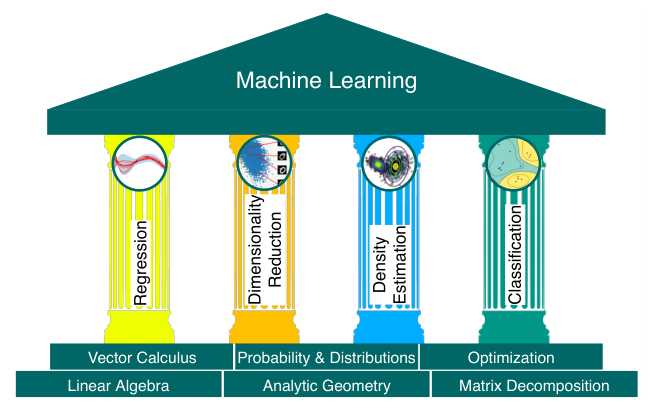

# 第 1 章 引言与动机（Introduction and Motivation）

> [← 返回目录](README.md)

## 1.1 用文字表述直觉（Finding Words for Intuitions）

> A challenge we face regularly in machine learning is that concepts and words are slippery, and a particular component of the machine learning system can be abstracted to different mathematical concepts. For example, the word “algorithm” is used in at least two different senses in the context of machine learning. In the first sense, we use the phrase “machine learning algorithm” to mean a system that makes predictions based on input data. We refer to these algorithms as predictors. In the second sense, we use the exact same phrase “machine learning algorithm” to mean a system that adapts some internal parameters of the predictor so that it performs well on future unseen input data. Here we refer to this adaptation as training a system.

我们在机器学习中经常面临的一个挑战是：概念和用词都不够严谨，机器学习系统的同一个特定组成部分可以被抽象成不同的数学概念。例如，“算法（algorithm）”一词在机器学习的语境中至少有两种不同的含义。第一种含义是，我们用“机器学习算法（machine learning algorithm）”这个短语指代根据输入数据做出预测的系统，这类算法称为预测器（predictor）。第二种含义是，我们用完全相同的短语“机器学习算法”指代这样一个系统：它调整预测器的某些内部参数，使其在将来未见过的输入数据上表现良好。这里我们把这种调整称为训练（training）一个系统。

> This book will not resolve the issue of ambiguity, but we want to highlight upfront that, depending on the context, the same expressions can mean different things. However, we attempt to make the context sufficiently clear to reduce the level of ambiguity.

本书并不会彻底解决这种歧义问题，但我们想在一开始就强调：根据语境的不同，同一表述可能表示不同的含义。不过，我们会尽力把语境交代得足够清楚，以减少歧义。

> The first part of this book introduces the mathematical concepts and foundations needed to talk about the three main components of a machine learning system: data, models, and learning. We will briefly outline these components here, and we will revisit them again in Chapter 8 once we have discussed the necessary mathematical concepts.

本书第一部分介绍讨论机器学习系统三大主要组成部分——数据、模型和学习——所需的数学概念和数学基础。我们将在此简要概述这些组成部分，并在讨论完必要的数学概念之后，在第 8 章重新回顾它们。

> While not all data is numerical, it is often useful to consider data in a number format. In this book, we assume that data has already been appropriately converted into a numerical representation suitable for reading into a computer program. Therefore, we think of data as vectors. As another illustration of how subtle words are, there are (at least) three different ways to think about vectors: a vector as an array of numbers (a computer science view), a vector as an arrow with a direction and magnitude (a physics view), and a vector as an object that obeys addition and scaling (a mathematical view).

虽然并非所有数据都是数值形式的，但把数据看作数字格式往往很有用。在本书中，我们假设数据已经被恰当地转换成适合读入计算机程序的数值表示，因此我们把数据视为向量。作为用词何等微妙的另一个例证，理解向量至少有三种不同的方式：把向量看作数字构成的数组（计算机科学的观点），把向量看作具有方向和大小的箭头（物理学的观点），以及把向量看作服从加法和缩放运算的对象（数学的观点）。

> A model is typically used to describe a process for generating data, similar to the dataset at hand. Therefore, good models can also be thought of as simplified versions of the real (unknown) data-generating process, capturing aspects that are relevant for modeling the data and extracting hidden patterns from it. A good model can then be used to predict what would happen in the real world without performing real-world experiments.

模型通常用来描述一个数据生成过程，它生成的数据类似于手头的数据集。因此，好的模型也可以被看作真实（未知的）数据生成过程的简化版本，它捕捉了与数据建模以及从数据中提取隐藏模式相关的方面。这样，一个好的模型就可以用来预测现实世界中会发生什么，而无需进行真实世界的实验。

> We now come to the crux of the matter, the learning component of machine learning. Assume we are given a dataset and a suitable model. Training the model means to use the data available to optimize some parameters of the model with respect to a utility function that evaluates how well the model predicts the training data. Most training methods can be thought of as an approach analogous to climbing a hill to reach its peak. In this analogy, the peak of the hill corresponds to a maximum of some desired performance measure. However, in practice, we are interested in the model to perform well on unseen data. Performing well on data that we have already seen (training data) may only mean that we found a good way to memorize the data. However, this may not generalize well to unseen data, and, in practical applications, we often need to expose our machine learning system to situations that it has not encountered before.

现在我们来到了问题的关键：机器学习中的学习部分。假设我们给定了一个数据集和一个合适的模型。训练模型指的是利用现有数据，依据某个效用函数来优化模型的某些参数，该效用函数衡量模型对训练数据的预测效果有多好。大多数训练方法都可以被看作类似于爬山到达山顶的过程。在这个类比中，山顶对应于某个所期望性能度量的最大值。然而在实践中，我们关心的是模型在未见过的数据上表现良好。在我们已经见过的数据（训练数据）上表现良好，可能只意味着我们找到了一种很好地记住数据的方法。然而，这未必能很好地泛化到未见过的数据上，而且在实际应用中，我们常常需要让机器学习系统面对它此前未曾遇到过的情形。

> Let us summarize the main concepts of machine learning that we cover in this book: We represent data as vectors. We choose an appropriate model, either using the probabilistic or optimization view. We learn from available data by using numerical optimization methods with the aim that the model performs well on data not used for training.

让我们总结一下本书所涵盖的机器学习的主要概念：我们将数据表示为向量；选择一个合适的模型，要么基于概率的观点，要么基于优化的观点；然后利用数值优化方法从可用的数据中学习，目标是让模型在未用于训练的数据上表现良好。

## 1.2 阅读本书的两种方式（Two Ways to Read This Book）

> We can consider two strategies for understanding the mathematics for machine learning:

我们可以考虑两种策略来理解机器学习的数学：

> Bottom-up: Building up the concepts from foundational to more advanced. This is often the preferred approach in more technical fields, such as mathematics. This strategy has the advantage that the reader at all times is able to rely on their previously learned concepts. Unfortunately, for a practitioner many of the foundational concepts are not particularly interesting by themselves, and the lack of motivation means that most foundational definitions are quickly forgotten. Top-down: Drilling down from practical needs to more basic requirements. This goal-driven approach has the advantage that the readers know at all times why they need to work on a particular concept, and there is a clear path of required knowledge. The downside of this strategy is that the knowledge is built on potentially shaky foundations, and the readers have to remember a set of words that they do not have any way of understanding.

自底向上（bottom-up）：从基础概念出发，逐步构建到更高级的概念。在数学这类技术性较强的领域中，这往往是更受青睐的方法。这种策略的优点是读者在任何时候都能依赖自己已经学过的概念；遗憾的是，对实践者而言，许多基础概念本身并不特别有趣，而缺乏动力意味着大多数基础定义很快就会被遗忘。自顶向下（top-down）：从实际需求出发，向下深挖到更基本的要求。这种目标驱动的方法的优点是读者始终清楚自己为什么需要学习某个特定概念，并且有一条清晰的必备知识路径；缺点则是知识建立在可能并不牢固的基础之上，而且读者不得不记住一堆自己根本无从理解的词语。

> We decided to write this book in a modular way to separate foundational (mathematical) concepts from applications so that this book can be read in both ways. The book is split into two parts, where Part I lays the mathematical foundations and Part II applies the concepts from Part I to a set of fundamental machine learning problems, which form four pillars of machine learning as illustrated in Figure 1.1: regression, dimensionality reduction, density estimation, and classification. Chapters in Part I mostly build upon the previous ones, but it is possible to skip a chapter and work backward if necessary. Chapters in Part II are only loosely coupled and can be read in any order. There are many pointers forward and backward between the two parts of the book to link mathematical concepts with machine learning algorithms.

我们决定以模块化的方式编写本书，把基础的（数学）概念与应用分离开来，使本书可以按两种方式阅读。全书分为两部分：第 I 部分奠定数学基础，第 II 部分则将第 I 部分的概念应用于一组基本的机器学习问题——如图 1.1 所示，它们构成机器学习的四大支柱：回归（regression）、降维（dimensionality reduction）、密度估计（density estimation）和分类（classification）。第 I 部分的章节大多以前面的章节为基础，但必要时也可以跳过某一章，之后再回过头来补学。第 II 部分的各章之间耦合很松，可以按任意顺序阅读。本书两部分之间有许多前后呼应的指引，用于将数学概念与机器学习算法联系起来。

> **Figure 1.1** The foundations and four pillars of machine learning.

**图 1.1** 机器学习的基础与四大支柱。

> Of course there are more than two ways to read this book. Most readers learn using a combination of top-down and bottom-up approaches, sometimes building up basic mathematical skills before attempting more complex concepts, but also choosing topics based on applications of machine learning.

当然，阅读本书的方式不止两种。大多数读者会综合运用自顶向下和自底向上的方法：有时先积累基本的数学技能，再去尝试更复杂的概念；有时则根据机器学习的应用来选择主题。

> Part I Is about Mathematics

第 I 部分讲述数学

> The four pillars of machine learning we cover in this book (see Figure 1.1) require a solid mathematical foundation, which is laid out in Part I.

本书所涵盖的机器学习四大支柱（见图 1.1）需要坚实的数学基础，第 I 部分就给出了这些基础。

> We represent numerical data as vectors and represent a table of such data as a matrix. The study of vectors and matrices is called linear algebra, which we introduce in Chapter 2. The collection of vectors as a matrix is also described there.

我们将数值数据表示为向量，将这类数据构成的表格表示为矩阵。对向量和矩阵的研究称为线性代数（linear algebra），我们将在第 2 章中介绍它；将向量汇集为矩阵的内容同样在该章中描述。

> Given two vectors representing two objects in the real world, we want to make statements about their similarity. The idea is that vectors that are similar should be predicted to have similar outputs by our machine learning algorithm (our predictor). To formalize the idea of similarity between vectors, we need to introduce operations that take two vectors as input and return a numerical value representing their similarity. The construction of similarity and distances is central to analytic geometry and is discussed in Chapter 3.

给定表示现实世界中两个对象的两个向量，我们希望对它们的相似性做出论断。其想法是：相似的向量应当被我们的机器学习算法（即预测器）预测出相似的输出。为了将向量之间相似性的想法形式化，我们需要引入一些运算：它们以两个向量为输入，返回一个表示二者相似程度的数值。相似性与距离的构造是解析几何（analytic geometry）的核心，将在第 3 章中讨论。

> In Chapter 4, we introduce some fundamental concepts about matrices and matrix decomposition. Some operations on matrices are extremely useful in machine learning, and they allow for an intuitive interpretation of the data and more efficient learning.

在第 4 章中，我们将介绍关于矩阵和矩阵分解（matrix decomposition）的一些基本概念。矩阵的某些运算在机器学习中极为有用，它们使数据可以得到直观的解释，也让学习更加高效。

> We often consider data to be noisy observations of some true underlying signal. We hope that by applying machine learning we can identify the signal from the noise. This requires us to have a language for quantifying what “noise” means. We often would also like to have predictors that allow us to express some sort of uncertainty, e.g., to quantify the confidence we have about the value of the prediction at a particular test data point. Quantification of uncertainty is the realm of probability theory and is covered in Chapter 6.

我们常常把数据看作对某个真实潜在信号的含噪声观测，并希望借助机器学习从噪声中辨识出信号。这要求我们拥有一套用来量化“噪声”含义的语言。我们还常常希望预测器能够表达某种不确定性，例如量化我们对某个特定测试数据点上预测值的置信程度。对不确定性的量化属于概率论（probability theory）的范畴，将在第 6 章中讨论。

> To train machine learning models, we typically find parameters that maximize some performance measure. Many optimization techniques require the concept of a gradient, which tells us the direction in which to search for a solution. Chapter 5 is about vector calculus and details the concept of gradients, which we subsequently use in Chapter 7, where we talk about optimization to find maxima/minima of functions.

为了训练机器学习模型，我们通常要寻找使某个性能度量最大化的参数。许多优化技术需要梯度（gradient）的概念，它告诉我们应该沿什么方向搜索解。第 5 章介绍向量微积分（vector calculus），并详细阐述梯度的概念；随后我们将在第 7 章中使用梯度，在那里讨论如何通过优化求函数的最大值/最小值。

> Part II Is about Machine Learning

第 II 部分讲述机器学习

> The second part of the book introduces four pillars of machine learning as shown in Figure 1.1. We illustrate how the mathematical concepts introduced in the first part of the book are the foundation for each pillar. Broadly speaking, chapters are ordered by difficulty (in ascending order).

本书第二部分介绍如图 1.1 所示的机器学习四大支柱。我们将说明第一部分引入的数学概念如何构成每个支柱的基础。大致来说，各章是按难度（递增）顺序排列的。

> In Chapter 8, we restate the three components of machine learning (data, models, and parameter estimation) in a mathematical fashion. In addition, we provide some guidelines for building experimental set-ups that guard against overly optimistic evaluations of machine learning systems. Recall that the goal is to build a predictor that performs well on unseen data.

在第 8 章中，我们将以数学的方式重新表述机器学习的三个组成部分（数据、模型和参数估计（parameter estimation））。此外，我们还将提供一些构建实验设置的指南，以防对机器学习系统做出过于乐观的评估。请记住，我们的目标是构建一个在未见过的数据上表现良好的预测器。

> In Chapter 9, we will have a close look at linear regression, where our objective is to find functions that map inputs $x \in \mathbb{R}^D$ to corresponding observed function values $y \in \mathbb{R}$, which we can interpret as the labels of their respective inputs. We will discuss classical model fitting (parameter estimation) via maximum likelihood and maximum a posteriori estimation, as well as Bayesian linear regression, where we integrate the parameters out instead of optimizing them.

在第 9 章中，我们将仔细考察线性回归（linear regression）：其目标是寻找把输入 $x \in \mathbb{R}^D$ 映射到相应观测函数值 $y \in \mathbb{R}$ 的函数，我们可以把这些函数值解释为各自输入的标签（label）。我们将讨论通过最大似然（maximum likelihood）和最大后验估计（maximum a posteriori estimation）进行的经典模型拟合（参数估计），此外还将讨论贝叶斯线性回归（Bayesian linear regression）——在贝叶斯线性回归中，我们将参数积分掉，而不是对其进行优化。

> Chapter 10 focuses on dimensionality reduction, the second pillar in Figure 1.1, using principal component analysis. The key objective of dimensionality reduction is to find a compact, lower-dimensional representation of high-dimensional data $x \in \mathbb{R}^D$, which is often easier to analyze than the original data. Unlike regression, dimensionality reduction is only concerned about modeling the data – there are no labels associated with a data point $x$.

第 10 章利用主成分分析（principal component analysis, PCA）讨论图 1.1 中的第二个支柱——降维。降维的关键目标是找到高维数据 $x \in \mathbb{R}^D$ 的紧凑的低维表示，这种表示通常比原始数据更容易分析。与回归不同，降维只关心对数据本身进行建模——数据点 $x$ 没有与之关联的标签。

> In Chapter 11, we will move to our third pillar: density estimation. The objective of density estimation is to find a probability distribution that describes a given dataset. We will focus on Gaussian mixture models for this purpose, and we will discuss an iterative scheme to find the parameters of this model. As in dimensionality reduction, there are no labels associated with the data points $x \in \mathbb{R}^D$. However, we do not seek a low-dimensional representation of the data. Instead, we are interested in a density model that describes the data.

在第 11 章中，我们将转向第三个支柱：密度估计。密度估计的目标是找到一个能描述给定数据集的概率分布。为此，我们将重点讨论高斯混合模型（Gaussian mixture model, GMM），并讨论一种寻找该模型参数的迭代方案。与降维一样，数据点 $x \in \mathbb{R}^D$ 没有与之关联的标签；但我们并不寻求数据的低维表示，而是对描述数据的密度模型感兴趣。

> Chapter 12 concludes the book with an in-depth discussion of the fourth pillar: classification. We will discuss classification in the context of support vector machines. Similar to regression (Chapter 9), we have inputs $x$ and corresponding labels $y$. However, unlike regression, where the labels were real-valued, the labels in classification are integers, which requires special care.

第 12 章以对第四个支柱——分类——的深入讨论为全书收官。我们将在支持向量机（support vector machine, SVM）的语境下讨论分类。与回归（第 9 章）类似，我们有输入 $x$ 和相应的标签 $y$；然而，与标签取实值的回归不同，分类中的标签是整数，这需要特别注意。

## 1.3 习题与反馈（Exercises and Feedback）

> We provide some exercises in Part I, which can be done mostly by pen and paper. For Part II, we provide programming tutorials (jupyter notebooks) to explore some properties of the machine learning algorithms we discuss in this book.

我们在第一部分提供了一些练习，这些练习大多可以仅用纸笔完成。对于第二部分，我们提供了编程教程（Jupyter notebooks），以便探索本书所讨论的机器学习算法的一些性质。

> We appreciate that Cambridge University Press strongly supports our aim to democratize education and learning by making this book freely available for download at https://mml-book.com where tutorials, errata, and additional materials can be found. Mistakes can be reported and feedback provided using the preceding URL.

我们感谢剑桥大学出版社大力支持我们让教育与学习大众化的宗旨，将本书在 https://mml-book.com 上免费开放下载，教程、勘误表和补充资料也可在该网站获取。如有错误，可通过上述网址报告并提出反馈。
