# 第 2 章 线性代数（Linear Algebra）

> [← 返回目录](README.md)

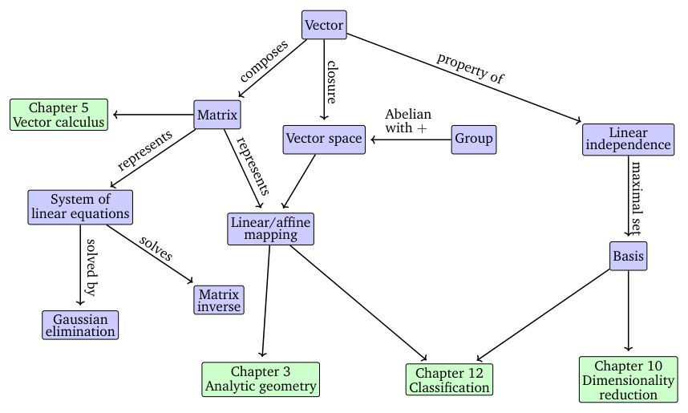

> **Figure 2.2** A mind map of the concepts introduced in this chapter, along with where they are used in other parts of the book.

**图 2.2** 本章所介绍概念的思维导图，以及这些概念在本书其他部分中的使用位置。

> resources are Gilbert Strang's Linear Algebra course at MIT and the Linear Algebra Series by 3Blue1Brown.

资源包括 Gilbert Strang 在 MIT 的线性代数课程，以及 3Blue1Brown 的线性代数系列。

> Linear algebra plays an important role in machine learning and general mathematics. The concepts introduced in this chapter are further expanded to include the idea of geometry in Chapter 3. In Chapter 5, we will discuss vector calculus, where a principled knowledge of matrix operations is essential. In Chapter 10, we will use projections (to be introduced in Section 3.8) for dimensionality reduction with principal component analysis (PCA). In Chapter 9, we will discuss linear regression, where linear algebra plays a central role for solving least-squares problems.

线性代数在机器学习和一般数学中起着重要作用。本章引入的概念将在第 3 章得到进一步扩展，纳入几何的思想。在第 5 章中，我们将讨论向量微积分，其中矩阵运算的系统知识必不可少。在第 10 章中，我们将利用投影（将在 3.8 节介绍）通过主成分分析（PCA）进行降维。在第 9 章中，我们将讨论线性回归，线性代数在求解最小二乘问题时起着核心作用。

## 2.1 线性方程组（Systems of Linear Equations）

> Systems of linear equations play a central part of linear algebra. Many problems can be formulated as systems of linear equations, and linear algebra gives us the tools for solving them.

线性方程组是线性代数的核心内容。许多问题都可以表述为线性方程组，而线性代数为我们提供了求解这类问题的工具。

> **Example 2.1**

**例 2.1**

> A company produces products $N_1, \ldots, N_n$ for which resources $R_1, \ldots, R_m$ are required. To produce a unit of product $N_j$, $a_{ij}$ units of resource $R_i$ are needed, where $i = 1, \ldots, m$ and $j = 1, \ldots, n$.

某公司生产产品 $N_1, \ldots, N_n$，这些产品的生产需要用到资源 $R_1, \ldots, R_m$。生产一个单位的产品 $N_j$ 需要 $a_{ij}$ 个单位的资源 $R_i$，其中 $i = 1, \ldots, m$，$j = 1, \ldots, n$。

> The objective is to find an optimal production plan, i.e., a plan of how many units $x_j$ of product $N_j$ should be produced if a total of $b_i$ units of resource $R_i$ are available and (ideally) no resources are left over.

目标是找到一份最优生产计划，即在资源 $R_i$ 总共有 $b_i$ 个单位可用、并且（理想情况下）资源没有剩余的条件下，确定每种产品 $N_j$ 应生产的单位数 $x_j$。

> If we produce $x_1, \ldots, x_n$ units of the corresponding products, we need a total of

如果我们生产相应产品各 $x_1, \ldots, x_n$ 个单位，那么总共需要

$$a_{i1}x_1 + \cdots + a_{in}x_n \tag{2.2}$$

> many units of resource $R_i$. An optimal production plan $(x_1, \ldots, x_n) \in \mathbb{R}^n$, therefore, has to satisfy the following system of equations:

个单位的资源 $R_i$。因此，最优生产计划 $(x_1, \ldots, x_n) \in \mathbb{R}^n$ 必须满足如下方程组：

$$
\begin{array}{c}
a_{11}x_1 + \cdots + a_{1n}x_n = b_1 \\
\vdots \\
a_{m1}x_1 + \cdots + a_{mn}x_n = b_m
\end{array},
\tag{2.3}
$$

> where $a_{ij} \in \mathbb{R}$ and $b_i \in \mathbb{R}$.

其中 $a_{ij} \in \mathbb{R}$，$b_i \in \mathbb{R}$。

> Equation (2.3) is the general form of a system of linear equations, and $x_1, \ldots, x_n$ are the unknowns of this system. Every $n$-tuple $(x_1, \ldots, x_n) \in \mathbb{R}^n$ that satisfies (2.3) is a solution of the linear equation system.

式 (2.3) 是线性方程组的一般形式，$x_1, \ldots, x_n$ 是该方程组的未知量。每一个满足 (2.3) 的 $n$ 元组 $(x_1, \ldots, x_n) \in \mathbb{R}^n$ 都是该线性方程组的一个解。

> **Example 2.2**

**例 2.2**

> The system of linear equations

线性方程组

$$
\begin{aligned}
x_1 + x_2 + x_3 &= 3 && \text{(1)}\\
x_1 - x_2 + 2x_3 &= 2 && \text{(2)}\\
2x_1 + 3x_3 &= 1 && \text{(3)}
\end{aligned}
\tag{2.4}
$$

> has no solution: Adding the first two equations yields $2x_1 + 3x_3 = 5$, which contradicts the third equation (3).

无解：将前两个方程相加得到 $2x_1 + 3x_3 = 5$，这与第三个方程 (3) 相矛盾。

> Let us have a look at the system of linear equations

我们再来看线性方程组

$$
\begin{aligned}
x_1 + x_2 + x_3 &= 3 && \text{(1)}\\
x_1 - x_2 + 2x_3 &= 2 && \text{(2)}\\
x_2 + x_3 &= 2 && \text{(3)}
\end{aligned}.
\tag{2.5}
$$

> From the first and third equation, it follows that $x_1 = 1$. From (1)+(2), we get $2x_1 + 3x_3 = 5$, i.e., $x_3 = 1$. From (3), we then get that $x_2 = 1$. Therefore, $(1, 1, 1)$ is the only possible and unique solution (verify that $(1, 1, 1)$ is a solution by plugging in).

由第一个方程和第三个方程可得 $x_1 = 1$。由 (1)+(2) 可得 $2x_1 + 3x_3 = 5$，即 $x_3 = 1$。再由 (3) 可得 $x_2 = 1$。因此，$(1, 1, 1)$ 是唯一可能的解（代入即可验证 $(1, 1, 1)$ 是一个解）。

> As a third example, we consider

作为第三个例子，我们考虑

$$
\begin{aligned}
x_1 + x_2 + x_3 &= 3 && \text{(1)}\\
x_1 - x_2 + 2x_3 &= 2 && \text{(2)}\\
2x_1 + 3x_3 &= 5 && \text{(3)}
\end{aligned}.
\tag{2.6}
$$

> Since (1)+(2)=(3), we can omit the third equation (redundancy). From (1) and (2), we get $2x_1 = 5 - 3x_3$ and $2x_2 = 1 + x_3$. We define $x_3 = a \in \mathbb{R}$ as a free variable, such that any triplet

由于 (1)+(2)=(3)，我们可以省略第三个方程（冗余）。由 (1) 和 (2) 可得 $2x_1 = 5 - 3x_3$ 与 $2x_2 = 1 + x_3$。我们将 $x_3 = a \in \mathbb{R}$ 取为自由变量，于是任意三元组

$$\left(\frac{5}{2} - \frac{3}{2}a,\ \frac{1}{2} + \frac{1}{2}a,\ a\right), \quad a \in \mathbb{R} \tag{2.7}$$

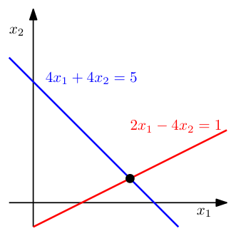

> **Figure 2.3** The solution space of a system of two linear equations with two variables can be geometrically interpreted as the intersection of two lines. Every linear equation represents a line.

**图 2.3** 由两个线性方程构成的二元方程组，其解空间可以在几何上解释为两条直线的交。每个线性方程代表一条直线。

> is a solution of the system of linear equations, i.e., we obtain a solution set that contains infinitely many solutions.

都是该线性方程组的解，也就是说，我们得到一个包含无穷多个解的解集。

> In general, for a real-valued system of linear equations we obtain either no, exactly one, or infinitely many solutions. Linear regression (Chapter 9) solves a version of Example 2.1 when we cannot solve the system of linear equations.

一般而言，实数域上的线性方程组的解要么不存在，要么恰好只有一个，要么有无穷多个。当我们无法求解线性方程组时，线性回归（第 9 章）求解的是例 2.1 的一个变体。

> Remark (Geometric Interpretation of Systems of Linear Equations). In a system of linear equations with two variables $x_1, x_2$, each linear equation defines a line on the $x_1x_2$-plane. Since a solution to a system of linear equations must satisfy all equations simultaneously, the solution set is the intersection of these lines. This intersection set can be a line (if the linear equations describe the same line), a point, or empty (when the lines are parallel). An illustration is given in Figure 2.3 for the system

评注（线性方程组的几何解释）。在含两个变量 $x_1, x_2$ 的线性方程组中，每个线性方程都在 $x_1x_2$ 平面上定义一条直线。由于线性方程组的解必须同时满足所有方程，解集就是这些直线的交集。这个交集可以是一条直线（当各线性方程描述同一条直线时）、一个点，或者为空（当这些直线平行时）。图 2.3 图示了如下方程组

$$
\begin{aligned}
4x_1 + 4x_2 &= 5\\
2x_1 - 4x_2 &= 1
\end{aligned}
\tag{2.8}
$$

> where the solution space is the point $(x_1, x_2) = (1, \frac{1}{4})$. Similarly, for three variables, each linear equation determines a plane in three-dimensional space. When we intersect these planes, i.e., satisfy all linear equations at the same time, we can obtain a solution set that is a plane, a line, a point or empty (when the planes have no common intersection). ♢

其中解空间是点 $(x_1, x_2) = (1, \frac{1}{4})$。类似地，对于三个变量的情形，每个线性方程在三维空间中确定一个平面。当这些平面相交，即同时满足所有线性方程时，所得的解集可以是一个平面、一条直线、一个点，或者为空（当这些平面没有公共交点时）。♢

> For a systematic approach to solving systems of linear equations, we will introduce a useful compact notation. We collect the coefficients $a_{ij}$ into vectors and collect the vectors into matrices. In other words, we write the system from (2.3) in the following form:

为了系统地求解线性方程组，我们将引入一种有用的紧凑记法。我们把系数 $a_{ij}$ 收集成向量，再把这些向量收集成矩阵。换句话说，我们把 (2.3) 中的方程组写成如下形式：

$$
\begin{pmatrix} a_{11} \\ \vdots \\ a_{m1} \end{pmatrix} x_1
+
\begin{pmatrix} a_{12} \\ \vdots \\ a_{m2} \end{pmatrix} x_2
+ \cdots +
\begin{pmatrix} a_{1n} \\ \vdots \\ a_{mn} \end{pmatrix} x_n
=
\begin{pmatrix} b_1 \\ \vdots \\ b_m \end{pmatrix}
\tag{2.9}
$$

$$
\Longleftrightarrow
\begin{pmatrix}
a_{11} & \cdots & a_{1n} \\
\vdots & & \vdots \\
a_{m1} & \cdots & a_{mn}
\end{pmatrix}
\begin{pmatrix} x_1 \\ \vdots \\ x_n \end{pmatrix}
=
\begin{pmatrix} b_1 \\ \vdots \\ b_m \end{pmatrix}.
\tag{2.10}
$$

> In the following, we will have a close look at these matrices and define computation rules. We will return to solving linear equations in Section 2.3.

接下来，我们将仔细考察这些矩阵，并定义相关的运算规则。我们将在 2.3 节再回到求解线性方程的问题。

## 2.2 矩阵（Matrices）

> Matrices play a central role in linear algebra. They can be used to compactly represent systems of linear equations, but they also represent linear functions (linear mappings) as we will see later in Section 2.7. Before we discuss some of these interesting topics, let us first define what a matrix is and what kind of operations we can do with matrices. We will see more properties of matrices in Chapter 4.

矩阵在线性代数中起着核心作用。它们不仅可以用来紧凑地表示线性方程组，还可以表示线性函数（linear function），即线性映射（linear mapping），这一点我们将在 2.7 节中看到。在讨论这些有趣的话题之前，我们先来定义什么是矩阵，以及可以对矩阵进行哪些运算。关于矩阵的更多性质，我们将在第 4 章中看到。

> **Definition 2.1** (Matrix). With $m, n \in \mathbb{N}$ a real-valued $(m, n)$-matrix $A$ is an $m \cdot n$-tuple of elements $a_{ij}$, $i = 1, \ldots, m$, $j = 1, \ldots, n$, which is ordered according to a rectangular scheme consisting of $m$ rows and $n$ columns:

**定义 2.1**（矩阵，Matrix）。设 $m, n \in \mathbb{N}$，实值 $(m,n)$-矩阵 $A$ 是元素 $a_{ij}$（$i = 1, \ldots, m$，$j = 1, \ldots, n$）的一个 $m \cdot n$ 元组，这些元素按照由 $m$ 行 $n$ 列组成的矩形方案排列：

$$
A =
\begin{pmatrix}
a_{11} & a_{12} & \cdots & a_{1n} \\
a_{21} & a_{22} & \cdots & a_{2n} \\
\vdots & \vdots & & \vdots \\
a_{m1} & a_{m2} & \cdots & a_{mn}
\end{pmatrix},
\qquad a_{ij} \in \mathbb{R}.
\tag{2.11}
$$

> By convention $(1, n)$-matrices are called rows and $(m, 1)$-matrices are called columns. These special matrices are also called row/column vectors.

按照约定，$(1,n)$-矩阵称为行（row），$(m,1)$-矩阵称为列（column）。这些特殊矩阵也称为行向量/列向量（row/column vector）。

> **Figure 2.4** By stacking its columns, a matrix $A$ can be represented as a long vector $a$.

**图 2.4** 将矩阵 $A$ 的各列依次堆叠起来，可以把它表示成一个长向量 $a$。

> $\mathbb{R}^{m \times n}$ is the set of all real-valued $(m, n)$-matrices. $A \in \mathbb{R}^{m \times n}$ can be equivalently represented as $a \in \mathbb{R}^{mn}$ by stacking all $n$ columns of the matrix into a long vector; see Figure 2.4.

$\mathbb{R}^{m\times n}$ 是所有实值 $(m,n)$-矩阵构成的集合。将矩阵的全部 $n$ 列堆叠成一个长向量，$A \in \mathbb{R}^{m\times n}$ 便可以等价地表示为 $a \in \mathbb{R}^{mn}$；参见图 2.4。

### 2.2.1 矩阵加法与乘法（Matrix Addition and Multiplication）

> The sum of two matrices $A \in \mathbb{R}^{m \times n}$, $B \in \mathbb{R}^{m \times n}$ is defined as the elementwise sum, i.e.,

两个矩阵 $A \in \mathbb{R}^{m\times n}$、$B \in \mathbb{R}^{m\times n}$ 的和定义为逐元素求和，即

$$
A + B :=
\begin{pmatrix}
a_{11} + b_{11} & \cdots & a_{1n} + b_{1n} \\
\vdots & & \vdots \\
a_{m1} + b_{m1} & \cdots & a_{mn} + b_{mn}
\end{pmatrix}
\in \mathbb{R}^{m \times n}.
\tag{2.12}
$$

> For matrices $A \in \mathbb{R}^{m \times n}$, $B \in \mathbb{R}^{n \times k}$, the elements $c_{ij}$ of the product $C = AB \in \mathbb{R}^{m \times k}$ are computed as

对于矩阵 $A \in \mathbb{R}^{m\times n}$、$B \in \mathbb{R}^{n\times k}$，乘积 $C = AB \in \mathbb{R}^{m\times k}$ 的元素 $c_{ij}$ 由下式计算：

$$
c_{ij} = \sum_{l=1}^{n} a_{il} b_{lj}, \qquad i = 1, \ldots, m, \quad j = 1, \ldots, k.
\tag{2.13}
$$

> This means, to compute element $c_{ij}$ we multiply the elements of the $i$th row of $A$ with the $j$th column of $B$ and sum them up. Later in Section 3.2, we will call this the dot product of the corresponding row and column. In cases, where we need to be explicit that we are performing multiplication, we use the notation $A \cdot B$ to denote multiplication (explicitly showing “$\cdot$”).

这意味着，计算元素 $c_{ij}$ 时，我们将 $A$ 的第 $i$ 行元素与 $B$ 的第 $j$ 列元素对应相乘再求和。在 3.2 节中，我们将把这个运算称为对应行与列的点积（dot product）。在需要明确表明我们执行的是乘法运算的场合，我们使用记号 $A \cdot B$ 来表示乘法（显式写出“$\cdot$”）。

> **Remark.** Matrices can only be multiplied if their “neighboring” dimensions match. For instance, an $n \times k$-matrix $A$ can be multiplied with a $k \times m$-matrix $B$, but only from the left side:

**评注.** 只有当“相邻”维度匹配时，矩阵才能相乘。例如，$n \times k$ 矩阵 $A$ 可以与 $k \times m$ 矩阵 $B$ 相乘，但只能从左侧相乘：

$$
\underbrace{A}_{n \times k} \, \underbrace{B}_{k \times m} = \underbrace{C}_{n \times m}
\tag{2.14}
$$

> The product $BA$ is not defined if $m \neq n$ since the neighboring dimensions do not match. ♢

当 $m \neq n$ 时，由于相邻维度不匹配，乘积 $BA$ 没有定义。♢

> **Remark.** Matrix multiplication is not defined as an element-wise operation on matrix elements, i.e., $c_{ij} \neq a_{ij} b_{ij}$ (even if the size of $A$, $B$ was chosen appropriately). This kind of element-wise multiplication often appears in programming languages when we multiply (multi-dimensional) arrays with each other, and is called a Hadamard product. ♢

**评注.** 矩阵乘法并不是在矩阵元素之间逐一定义的运算，即 $c_{ij} \neq a_{ij} b_{ij}$（即使 $A$、$B$ 的尺寸选得合适也是如此）。这种逐元素相乘的运算常见于编程语言中（多维）数组相乘的场合，称为 Hadamard 积（Hadamard product）。♢

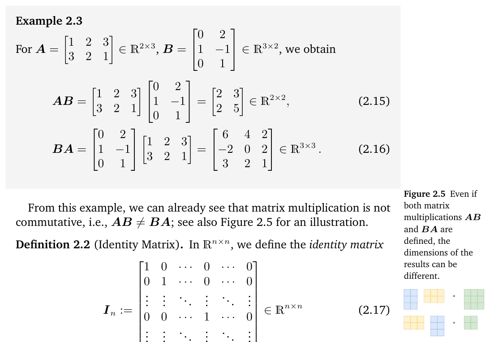

> Figure 2.5

图 2.5（图注原文缺失，见原书）

> From this example, we can already see that matrix multiplication is not commutative, i.e., $AB \neq BA$; see also Figure 2.5 for an illustration.

从这个例子中我们已经可以看出，矩阵乘法不满足交换律，即 $AB \neq BA$；相关图示另见图 2.5。

> **Definition 2.2** (Identity Matrix). In $\mathbb{R}^{n \times n}$, we define the identity matrix

**定义 2.2**（单位矩阵，Identity Matrix）。在 $\mathbb{R}^{n\times n}$ 中，我们定义单位矩阵

$$
I_n :=
\begin{pmatrix}
1 & 0 & \cdots & 0 & \cdots & 0 \\
0 & 1 & \cdots & 0 & \cdots & 0 \\
\vdots & \vdots & \ddots & \vdots & & \vdots \\
0 & 0 & \cdots & 1 & \cdots & 0 \\
\vdots & \vdots & & \vdots & \ddots & \vdots \\
0 & 0 & \cdots & 0 & \cdots & 1
\end{pmatrix}
\in \mathbb{R}^{n \times n}
\tag{2.17}
$$

> as the $n \times n$-matrix containing 1 on the diagonal and 0 everywhere else.

即对角线上为 1、其余位置均为 0 的 $n \times n$ 矩阵。

> Now that we defined matrix multiplication, matrix addition and the identity matrix, let us have a look at some properties of matrices:

现在我们已经定义了矩阵乘法、矩阵加法和单位矩阵，接下来看一看矩阵的一些性质：

> Associativity:

结合律（associativity）：

$$
\forall A \in \mathbb{R}^{m \times n},\ B \in \mathbb{R}^{n \times p},\ C \in \mathbb{R}^{p \times q}: \quad (AB)C = A(BC)
\tag{2.18}
$$

> Distributivity:

分配律（distributivity）：

$$
\forall A, B \in \mathbb{R}^{m \times n},\ C, D \in \mathbb{R}^{n \times p}: \quad (A + B)C = AC + BC
\tag{2.19a}
$$

$$
A(C + D) = AC + AD
\tag{2.19b}
$$

> Multiplication with the identity matrix:

与单位矩阵相乘：

$$
\forall A \in \mathbb{R}^{m \times n}: \quad I_m A = A I_n = A
\tag{2.20}
$$

> Note that $I_m \neq I_n$ for $m \neq n$.

注意，当 $m \neq n$ 时，$I_m \neq I_n$。

### 2.2.2 逆与转置（Inverse and Transpose）

> **Definition 2.3** (Inverse). Consider a square matrix $A \in \mathbb{R}^{n \times n}$. Let matrix $B \in \mathbb{R}^{n \times n}$ have the property that $AB = I_n = BA$. $B$ is called the inverse of $A$ and denoted by $A^{-1}$.

**定义 2.3**（逆，Inverse）。考虑方阵 $A \in \mathbb{R}^{n\times n}$。设矩阵 $B \in \mathbb{R}^{n\times n}$ 满足 $AB = I_n = BA$，则称 $B$ 为 $A$ 的逆，记作 $A^{-1}$。

> Unfortunately, not every matrix $A$ possesses an inverse $A^{-1}$. If this inverse does exist, $A$ is called regular/invertible/nonsingular, otherwise singular/noninvertible. When the matrix inverse exists, it is unique. In Section 2.3, we will discuss a general way to compute the inverse of a matrix by solving a system of linear equations.

遗憾的是，并非每个矩阵 $A$ 都拥有逆 $A^{-1}$。若该逆存在，则称 $A$ 为正则的/可逆的/非奇异的（regular/invertible/nonsingular），否则称为奇异的/不可逆的（singular/noninvertible）。当矩阵的逆存在时，它是唯一的。在 2.3 节中，我们将讨论一种通过求解线性方程组来计算矩阵逆的一般方法。

> **Remark** (Existence of the Inverse of a 2 × 2-matrix). Consider a matrix

**评注**（2 × 2 矩阵逆的存在性）。考虑矩阵

$$
A := \begin{pmatrix} a_{11} & a_{12} \\ a_{21} & a_{22} \end{pmatrix} \in \mathbb{R}^{2 \times 2}.
\tag{2.21}
$$

> If we multiply $A$ with

若将 $A$ 与下式相乘，

$$
A' := \begin{pmatrix} a_{22} & -a_{12} \\ -a_{21} & a_{11} \end{pmatrix}
\tag{2.22}
$$

> we obtain

可得

$$
AA' = \begin{pmatrix} a_{11}a_{22} - a_{12}a_{21} & 0 \\ 0 & a_{11}a_{22} - a_{12}a_{21} \end{pmatrix} = (a_{11}a_{22} - a_{12}a_{21})\, I.
\tag{2.23}
$$

> Therefore,

因此，

$$
A^{-1} = \frac{1}{a_{11}a_{22} - a_{12}a_{21}} \begin{pmatrix} a_{22} & -a_{12} \\ -a_{21} & a_{11} \end{pmatrix}
\tag{2.24}
$$

> if and only if $a_{11}a_{22} - a_{12}a_{21} \neq 0$. In Section 4.1, we will see that $a_{11}a_{22} - a_{12}a_{21}$ is the determinant of a $2 \times 2$-matrix. Furthermore, we can generally use the determinant to check whether a matrix is invertible. ♢

当且仅当 $a_{11}a_{22} - a_{12}a_{21} \neq 0$。在 4.1 节中我们将看到，$a_{11}a_{22} - a_{12}a_{21}$ 正是 $2 \times 2$ 矩阵的行列式（determinant）。此外，通常可以利用行列式来判断一个矩阵是否可逆。♢

> **Example 2.4** (Inverse Matrix)

**例 2.4**（逆矩阵）

> The matrices

以下矩阵

$$
A = \begin{pmatrix} 1 & 2 & 1 \\ 4 & 4 & 5 \\ 6 & 7 & 7 \end{pmatrix}, \qquad B = \begin{pmatrix} -7 & -7 & 6 \\ 2 & 1 & -1 \\ 4 & 5 & -4 \end{pmatrix}
\tag{2.25}
$$

> are inverse to each other since $AB = I = BA$.

互为逆矩阵，因为 $AB = I = BA$。

> **Definition 2.4** (Transpose). For $A \in \mathbb{R}^{m \times n}$ the matrix $B \in \mathbb{R}^{n \times m}$ with $b_{ij} = a_{ji}$ is called the transpose of $A$. We write $B = A^\top$.

**定义 2.4**（转置，Transpose）。对于 $A \in \mathbb{R}^{m\times n}$，满足 $b_{ij} = a_{ji}$ 的矩阵 $B \in \mathbb{R}^{n\times m}$ 称为 $A$ 的转置。我们把它记作 $B = A^\top$。

> In general, $A^\top$ can be obtained by writing the columns of $A$ as the rows of $A^\top$. The following are important properties of inverses and transposes:

一般地，将 $A$ 的各列写成 $A^\top$ 的各行，即可得到 $A^\top$。下面是逆与转置的一些重要性质：

$$
AA^{-1} = I = A^{-1}A
\tag{2.26}
$$

$$
(AB)^{-1} = B^{-1}A^{-1}
\tag{2.27}
$$

$$
(A + B)^{-1} \neq A^{-1} + B^{-1}
\tag{2.28}
$$

$$
(A^\top)^\top = A
\tag{2.29}
$$

$$
(AB)^\top = B^\top A^\top
\tag{2.30}
$$

$$
(A + B)^\top = A^\top + B^\top
\tag{2.31}
$$

> **Definition 2.5** (Symmetric Matrix). A matrix $A \in \mathbb{R}^{n \times n}$ is symmetric if $A = A^\top$.

**定义 2.5**（对称矩阵，Symmetric Matrix）。若 $A = A^\top$，则称矩阵 $A \in \mathbb{R}^{n \times n}$ 是对称的。

> Note that only $(n, n)$-matrices can be symmetric. Generally, we call $(n, n)$-matrices also square matrices because they possess the same number of rows and columns. Moreover, if $A$ is invertible, then so is $A^\top$, and $(A^{-1})^\top = (A^\top)^{-1} =: A^{-\top}$.

注意，只有 $(n,n)$-矩阵才可能是对称的。一般地，由于 $(n,n)$-矩阵拥有相同的行数与列数，我们也将其称为方阵（square matrix）。此外，若 $A$ 可逆，则 $A^\top$ 也可逆，并且 $(A^{-1})^\top = (A^\top)^{-1} =: A^{-\top}$。

> **Remark** (Sum and Product of Symmetric Matrices). The sum of symmetric matrices $A, B \in \mathbb{R}^{n \times n}$ is always symmetric. However, although their product is always defined, it is generally not symmetric:

**评注**（对称矩阵的和与积）。对称矩阵 $A, B \in \mathbb{R}^{n\times n}$ 的和总是对称的。然而，尽管它们的乘积总是有定义的，却一般并不对称：

$$
\begin{pmatrix} 1 & 0 \\ 0 & 0 \end{pmatrix}
\begin{pmatrix} 1 & 1 \\ 1 & 1 \end{pmatrix}
=
\begin{pmatrix} 1 & 1 \\ 0 & 0 \end{pmatrix}.
\tag{2.32}
$$

> ♢

♢

### 2.2.3 标量乘法（Multiplication by a Scalar）

> Let us look at what happens to matrices when they are multiplied by a scalar $\lambda \in \mathbb{R}$. Let $A \in \mathbb{R}^{m \times n}$ and $\lambda \in \mathbb{R}$. Then $\lambda A = K$, $K_{ij} = \lambda \, a_{ij}$. Practically, $\lambda$ scales each element of $A$. For $\lambda, \psi \in \mathbb{R}$, the following holds:

让我们看看矩阵乘以一个标量（scalar）$\lambda \in \mathbb{R}$ 后会发生什么。设 $A \in \mathbb{R}^{m\times n}$，$\lambda \in \mathbb{R}$，则 $\lambda A = K$，其中 $K_{ij} = \lambda\, a_{ij}$。实际上，$\lambda$ 将 $A$ 的每个元素缩放了 $\lambda$ 倍。对于 $\lambda, \psi \in \mathbb{R}$，下列性质成立：

> Associativity:

结合律：

$$
(\lambda \psi) C = \lambda (\psi C), \qquad C \in \mathbb{R}^{m \times n}
$$

$$
\lambda (BC) = (\lambda B) C = B (\lambda C) = (BC) \lambda, \qquad B \in \mathbb{R}^{m \times n},\ C \in \mathbb{R}^{n \times k}.
$$

> Note that this allows us to move scalar values around. $(\lambda C)^\top = C^\top \lambda^\top = C^\top \lambda = \lambda C^\top$ since $\lambda = \lambda^\top$ for all $\lambda \in \mathbb{R}$.

注意，这使我们可以随意移动标量的位置。$(\lambda C)^\top = C^\top \lambda^\top = C^\top \lambda = \lambda C^\top$，因为对所有 $\lambda \in \mathbb{R}$ 都有 $\lambda = \lambda^\top$。

> Distributivity:

分配律：

$$
(\lambda + \psi) C = \lambda C + \psi C, \qquad C \in \mathbb{R}^{m \times n}
$$

$$
\lambda (B + C) = \lambda B + \lambda C, \qquad B, C \in \mathbb{R}^{m \times n}
$$

> **Example 2.5** (Distributivity)

**例 2.5**（分配律）

> If we define

若定义

$$
C := \begin{pmatrix} 1 & 2 \\ 3 & 4 \end{pmatrix},
\tag{2.33}
$$

> then for any $\lambda, \psi \in \mathbb{R}$ we obtain

则对任意 $\lambda, \psi \in \mathbb{R}$，可得

$$
(\lambda + \psi) C
= \begin{pmatrix} (\lambda + \psi)\, 1 & (\lambda + \psi)\, 2 \\ (\lambda + \psi)\, 3 & (\lambda + \psi)\, 4 \end{pmatrix}
= \begin{pmatrix} \lambda + \psi & 2\lambda + 2\psi \\ 3\lambda + 3\psi & 4\lambda + 4\psi \end{pmatrix}
\tag{2.34a}
$$

$$
= \begin{pmatrix} \lambda & 2\lambda \\ 3\lambda & 4\lambda \end{pmatrix}
+ \begin{pmatrix} \psi & 2\psi \\ 3\psi & 4\psi \end{pmatrix}
= \lambda C + \psi C.
\tag{2.34b}
$$

### 2.2.4 线性方程组的紧凑表示（Compact Representations of Systems of Linear Equations）

> If we consider the system of linear equations

如果考虑线性方程组

$$
\begin{aligned}
2x_1 + 3x_2 + 5x_3 &= 1 \\
4x_1 - 2x_2 - 7x_3 &= 8 \\
9x_1 + 5x_2 - 3x_3 &= 2
\end{aligned}
\tag{2.35}
$$

> and use the rules for matrix multiplication, we can write this equation system in a more compact form as

并利用矩阵乘法的法则，就可以把这个方程组写成更紧凑的形式：

$$
\begin{pmatrix}
2 & 3 & 5 \\
4 & -2 & -7 \\
9 & 5 & -3
\end{pmatrix}
\begin{pmatrix} x_1 \\ x_2 \\ x_3 \end{pmatrix}
=
\begin{pmatrix} 1 \\ 8 \\ 2 \end{pmatrix}.
\tag{2.36}
$$

> Note that $x_1$ scales the first column, $x_2$ the second one, and $x_3$ the third one.

注意，$x_1$ 缩放第一列，$x_2$ 缩放第二列，$x_3$ 缩放第三列。

> Generally, a system of linear equations can be compactly represented in their matrix form as $Ax = b$; see (2.3), and the product $Ax$ is a (linear) combination of the columns of $A$. We will discuss linear combinations in more detail in Section 2.5.

一般地，线性方程组可以紧凑地表示为矩阵形式 $Ax = b$（见 (2.3)），其中乘积 $Ax$ 是 $A$ 各列的一个（线性）组合。我们将在 2.5 节中更详细地讨论线性组合（linear combination）。

## 2.3 求解线性方程组（Solving Systems of Linear Equations）

> In (2.3), we introduced the general form of an equation system, i.e.,

在 (2.3) 中，我们介绍了方程组的一般形式，即

$$
\begin{aligned}
a_{11}x_1 + \cdots + a_{1n}x_n &= b_1 \\
&\ \ \vdots \\
a_{m1}x_1 + \cdots + a_{mn}x_n &= b_m,
\end{aligned}
\tag{2.37}
$$

> where $a_{ij} \in \mathbb{R}$ and $b_i \in \mathbb{R}$ are known constants and $x_j$ are unknowns, $i = 1, \ldots, m$, $j = 1, \ldots, n$. Thus far, we saw that matrices can be used as a compact way of formulating systems of linear equations so that we can write $Ax = b$, see (2.10). Moreover, we defined basic matrix operations, such as addition and multiplication of matrices. In the following, we will focus on solving systems of linear equations and provide an algorithm for finding the inverse of a matrix.

其中 $a_{ij} \in \mathbb{R}$、$b_i \in \mathbb{R}$ 为已知常数，$x_j$ 为未知数，$i = 1, \ldots, m$，$j = 1, \ldots, n$。到目前为止，我们已经看到，矩阵可以用来紧凑地表述线性方程组，即写成 $Ax = b$ 的形式，见 (2.10)。此外，我们还定义了基本的矩阵运算，例如矩阵的加法与乘法。接下来，我们将着重讨论如何求解线性方程组，并给出一个求矩阵逆的算法。

### 2.3.1 特解与通解（Particular and General Solution）

> Before discussing how to generally solve systems of linear equations, let us have a look at an example. Consider the system of equations

在讨论如何一般地求解线性方程组之前，让我们先来看一个例子。考察方程组

$$
\begin{pmatrix}
1 & 0 & 8 & -4 \\
0 & 1 & 2 & 12
\end{pmatrix}
\begin{pmatrix} x_1 \\ x_2 \\ x_3 \\ x_4 \end{pmatrix}
=
\begin{pmatrix} 42 \\ 8 \end{pmatrix}.
\tag{2.38}
$$

> The system has two equations and four unknowns. Therefore, in general we would expect infinitely many solutions. This system of equations is in a particularly easy form, where the first two columns consist of a 1 and a 0. Remember that we want to find scalars $x_1, \ldots, x_4$, such that $\sum_{i=1}^{4} x_i c_i = b$, where we define $c_i$ to be the $i$th column of the matrix and $b$ the right-hand-side of (2.38). A solution to the problem in (2.38) can be found immediately by taking 42 times the first column and 8 times the second column so that

该方程组有两个方程和四个未知数。因此，一般来说我们会预期它有无穷多组解。这个方程组的形式特别简单：前两列分别由一个 1 和一个 0 构成。回想一下，我们想寻找标量 $x_1, \ldots, x_4$，使得 $\sum_{i=1}^{4} x_i c_i = b$，其中我们把 $c_i$ 定义为矩阵的第 $i$ 列，$b$ 为 (2.38) 的右端。取第一列的 42 倍与第二列的 8 倍，就可以立即得到 (2.38) 的一个解，即

$$
b =
\begin{pmatrix} 42 \\ 8 \end{pmatrix}
= 42
\begin{pmatrix} 1 \\ 0 \end{pmatrix}
+ 8
\begin{pmatrix} 0 \\ 1 \end{pmatrix}.
\tag{2.39}
$$

> Therefore, a solution is $[42, 8, 0, 0]^\top$. This solution is called a particular solution or special solution. However, this is not the only solution of this system of linear equations. To capture all the other solutions, we need to be creative in generating 0 in a non-trivial way using the columns of the matrix: Adding 0 to our special solution does not change the special solution. To do so, we express the third column using the first two columns (which are of this very simple form)

因此，$[42, 8, 0, 0]^\top$ 是一个解。这样的解称为特解（particular solution）或特殊解（special solution）。然而，它并不是这个线性方程组的唯一解。为了囊括所有其余的解，我们需要巧妙地利用矩阵的各列，以非平凡的方式生成 0：将 0 加到特解上并不会改变特解。为此，我们用前两列（它们的形式极为简单）来表示第三列

$$
\begin{pmatrix} 8 \\ 2 \end{pmatrix}
= 8
\begin{pmatrix} 1 \\ 0 \end{pmatrix}
+ 2
\begin{pmatrix} 0 \\ 1 \end{pmatrix}
\tag{2.40}
$$

> so that $0 = 8c_1 + 2c_2 - 1c_3 + 0c_4$ and $(x_1, x_2, x_3, x_4) = (8, 2, -1, 0)$. In fact, any scaling of this solution by $\lambda_1 \in \mathbb{R}$ produces the 0 vector, i.e.,

于是 $0 = 8c_1 + 2c_2 - 1c_3 + 0c_4$，并且 $(x_1, x_2, x_3, x_4) = (8, 2, -1, 0)$。事实上，将该解按任意 $\lambda_1 \in \mathbb{R}$ 缩放都会得到 0 向量，即

$$
\begin{pmatrix}
1 & 0 & 8 & -4 \\
0 & 1 & 2 & 12
\end{pmatrix}
\left(\lambda_1
\begin{pmatrix}
8 \\ 2 \\ -1 \\ 0
\end{pmatrix}\right)
= \lambda_1(8c_1 + 2c_2 - c_3) = 0.
\tag{2.41}
$$

> Following the same line of reasoning, we express the fourth column of the matrix in (2.38) using the first two columns and generate another set of non-trivial versions of 0 as

沿着同样的思路，我们用前两列来表示 (2.38) 中矩阵的第四列，从而生成另一组非平凡的 0：

$$
\begin{pmatrix}
1 & 0 & 8 & -4 \\
0 & 1 & 2 & 12
\end{pmatrix}
\left(\lambda_2
\begin{pmatrix}
-4 \\ 12 \\ 0 \\ -1
\end{pmatrix}\right)
= \lambda_2(-4c_1 + 12c_2 - c_4) = 0
\tag{2.42}
$$

> for any $\lambda_2 \in \mathbb{R}$. Putting everything together, we obtain all solutions of the equation system in (2.38), which is called the general solution, as the set

对任意 $\lambda_2 \in \mathbb{R}$ 均成立。把所有结果合在一起，我们就得到了 (2.38) 中方程组的全部解，即通解（general solution），写成集合的形式：

$$
\left\{
x \in \mathbb{R}^4 : x =
\begin{pmatrix} 42 \\ 8 \\ 0 \\ 0 \end{pmatrix}
+ \lambda_1
\begin{pmatrix} 8 \\ 2 \\ -1 \\ 0 \end{pmatrix}
+ \lambda_2
\begin{pmatrix} -4 \\ 12 \\ 0 \\ -1 \end{pmatrix},
\ \lambda_1, \lambda_2 \in \mathbb{R}
\right\}.
\tag{2.43}
$$

> **Remark.** The general approach we followed consisted of the following three steps:

**评注.** 我们所遵循的一般方法由以下三个步骤组成：

1. Find a particular solution to $Ax = b$.
2. Find all solutions to $Ax = 0$.
3. Combine the solutions from steps 1. and 2. to the general solution.

1. 求 $Ax = b$ 的一个特解。
2. 求 $Ax = 0$ 的所有解。
3. 将步骤 1 和步骤 2 所得的解组合成通解。

> Neither the general nor the particular solution is unique. ♢

通解与特解都不是唯一的。♢

> The system of linear equations in the preceding example was easy to solve because the matrix in (2.38) has this particularly convenient form, which allowed us to find the particular and the general solution by inspection. However, general equation systems are not of this simple form. Fortunately, there exists a constructive algorithmic way of transforming any system of linear equations into this particularly simple form: Gaussian elimination. Key to Gaussian elimination are elementary transformations of systems of linear equations, which transform the equation system into a simple form. Then, we can apply the three steps to the simple form that we just discussed in the context of the example in (2.38).

前一个例子中的线性方程组之所以容易求解，是因为 (2.38) 中的矩阵具有这种特别方便的形式，使我们能够通过观察直接找到特解和通解。然而，一般的方程组并非这种简单形式。幸运的是，存在一种构造性的算法方法，可以把任意线性方程组都化为这种特别简单的形式：高斯消元（Gaussian elimination）。高斯消元的关键在于线性方程组的初等变换（elementary transformations），它们将方程组化为简单形式。然后，我们就可以对这种简单形式应用刚才结合 (2.38) 的例子所讨论的三个步骤。

### 2.3.2 初等变换（Elementary Transformations）

> Key to solving a system of linear equations are elementary transformations that keep the solution set the same, but that transform the equation system into a simpler form:

求解线性方程组的关键在于初等变换，它们保持解集不变，但能将方程组化为更简单的形式：

- Exchange of two equations (rows in the matrix representing the system of equations)
- Multiplication of an equation (row) with a constant $\lambda \in \mathbb{R}\setminus\{0\}$
- Addition of two equations (rows)

- 交换两个方程（即表示方程组的矩阵中的两行）
- 用常数 $\lambda \in \mathbb{R}\setminus\{0\}$ 乘以一个方程（一行）
- 将两个方程（两行）相加

> **Example 2.6**

**例 2.6**

> For $a \in \mathbb{R}$, we seek all solutions of the following system of equations:

对于 $a \in \mathbb{R}$，我们求下列方程组的所有解：

$$
\begin{aligned}
-2x_1 + 4x_2 - 2x_3 - x_4 + 4x_5 &= -3 \\
4x_1 - 8x_2 + 3x_3 - 3x_4 + x_5 &= 2 \\
x_1 - 2x_2 + x_3 - x_4 + x_5 &= 0 \\
x_1 - 2x_2 - 3x_4 + 4x_5 &= a.
\end{aligned}
\tag{2.44}
$$

> We start by converting this system of equations into the compact matrix notation $Ax = b$. We no longer mention the variables $x$ explicitly and build the augmented matrix (in the form $[A \mid b]$)

我们先将这个方程组转化为紧凑的矩阵记号 $Ax = b$。我们不再显式地写出变量 $x$，而是构造形如 $[A \mid b]$ 的增广矩阵（augmented matrix）

$$
\left[\begin{array}{ccccc|c}
-2 & 4 & -2 & -1 & 4 & -3 \\
4 & -8 & 3 & -3 & 1 & 2 \\
1 & -2 & 1 & -1 & 1 & 0 \\
1 & -2 & 0 & -3 & 4 & a
\end{array}\right]
\begin{array}{l}
\text{Swap with } R_3 \\
\hphantom{\text{Swap with } R_3} \\
\text{Swap with } R_1
\end{array}
$$

> where we used the vertical line to separate the left-hand side from the right-hand side in (2.44). We use $\rightsquigarrow$ to indicate a transformation of the augmented matrix using elementary transformations.

其中我们用竖线把 (2.44) 的左端与右端隔开。我们用 $\rightsquigarrow$ 表示利用初等变换对增广矩阵进行的一次变换。

> Swapping Rows 1 and 3 leads to

交换第 1 行和第 3 行后，得到

$$
\left[\begin{array}{ccccc|c}
1 & -2 & 1 & -1 & 1 & 0 \\
4 & -8 & 3 & -3 & 1 & 2 \\
-2 & 4 & -2 & -1 & 4 & -3 \\
1 & -2 & 0 & -3 & 4 & a
\end{array}\right]
\begin{array}{l}
\hphantom{-4R_1} \\
-4R_1 \\
+2R_1 \\
-R_1
\end{array}
$$

> When we now apply the indicated transformations (e.g., subtract Row 1 four times from Row 2), we obtain

现在应用所标注的变换（例如，从第 2 行中减去 4 倍的第 1 行），可得

$$
\left[\begin{array}{ccccc|c}
1 & -2 & 1 & -1 & 1 & 0 \\
0 & 0 & -1 & 1 & -3 & 2 \\
0 & 0 & 0 & -3 & 6 & -3 \\
0 & 0 & -1 & -2 & 3 & a
\end{array}\right]
\begin{array}{l}
\hphantom{-R_2 - R_3} \\
\hphantom{-R_2 - R_3} \\
\hphantom{-R_2 - R_3} \\
-R_2 - R_3
\end{array}
\;\rightsquigarrow\;
\left[\begin{array}{ccccc|c}
1 & -2 & 1 & -1 & 1 & 0 \\
0 & 0 & -1 & 1 & -3 & 2 \\
0 & 0 & 0 & -3 & 6 & -3 \\
0 & 0 & 0 & 0 & 0 & a+1
\end{array}\right]
\begin{array}{l}
\hphantom{\cdot(-1)} \\
\cdot(-1) \\
\cdot\!\left(-\frac{1}{3}\right) \\
\hphantom{\cdot(-1)}
\end{array}
\;\rightsquigarrow\;
\left[\begin{array}{ccccc|c}
1 & -2 & 1 & -1 & 1 & 0 \\
0 & 0 & 1 & -1 & 3 & -2 \\
0 & 0 & 0 & 1 & -2 & 1 \\
0 & 0 & 0 & 0 & 0 & a+1
\end{array}\right]
$$

> This (augmented) matrix is in a convenient form, the row-echelon form (REF). Reverting this compact notation back into the explicit notation with the variables we seek, we obtain

这个（增广）矩阵呈现为一种便利的形式，即行阶梯形（row-echelon form，REF）。将这种紧凑记号还原为带有我们所求变量的显式记号，便得到

$$
\begin{aligned}
x_1 - 2x_2 + x_3 - x_4 + x_5 &= 0 \\
x_3 - x_4 + 3x_5 &= -2 \\
x_4 - 2x_5 &= 1 \\
0 &= a + 1.
\end{aligned}
\tag{2.45}
$$

> Only for $a = -1$ this system can be solved. A particular solution is

只有当 $a = -1$ 时，这个方程组才可解。它的一个特解是

$$
\begin{pmatrix} x_1 \\ x_2 \\ x_3 \\ x_4 \\ x_5 \end{pmatrix}
=
\begin{pmatrix} 2 \\ 0 \\ -1 \\ 1 \\ 0 \end{pmatrix}.
\tag{2.46}
$$

> The general solution, which captures the set of all possible solutions, is

涵盖所有可能解的通解为

$$
\left\{
x \in \mathbb{R}^5 : x =
\begin{pmatrix} 2 \\ 0 \\ -1 \\ 1 \\ 0 \end{pmatrix}
+ \lambda_1
\begin{pmatrix} 2 \\ 1 \\ 0 \\ 0 \\ 0 \end{pmatrix}
+ \lambda_2
\begin{pmatrix} 2 \\ 0 \\ -1 \\ 2 \\ 1 \end{pmatrix},
\ \lambda_1, \lambda_2 \in \mathbb{R}
\right\}.
\tag{2.47}
$$

> In the following, we will detail a constructive way to obtain a particular and general solution of a system of linear equations.

接下来，我们将详细阐述一种构造性地求线性方程组特解与通解的方法。

> **Remark** (Pivots and Staircase Structure). The leading coefficient of a row (first nonzero number from the left) is called the pivot and is always strictly to the right of the pivot of the row above it. Therefore, any equation system in row-echelon form always has a “staircase” structure. ♢

**评注**（主元与阶梯结构）。一行中从左数第一个非零数（即首项系数，leading coefficient）称为主元（pivot），并且它总是严格位于其上一行主元的右侧。因此，任何处于行阶梯形的方程组都具有“阶梯状”结构。♢

> **Definition 2.6** (Row-Echelon Form). A matrix is in row-echelon form if

**定义 2.6**（行阶梯形，Row-Echelon Form）。若一个矩阵满足以下条件，则称其为行阶梯形：

- All rows that contain only zeros are at the bottom of the matrix; correspondingly, all rows that contain at least one nonzero element are on top of rows that contain only zeros.
- Looking at nonzero rows only, the first nonzero number from the left (also called the pivot or the leading coefficient) is always strictly to the right of the pivot of the row above it.

- 只含零的行都位于矩阵底部；相应地，所有至少含一个非零元素的行都位于只含零的行之上。
- 仅考察非零行：从左数第一个非零数（也称为主元或首项系数）总是严格位于其上一行主元的右侧。

> **Remark** (Basic and Free Variables). The variables corresponding to the pivots in the row-echelon form are called basic variables and the other variables are free variables. For example, in (2.45), $x_1$, $x_3$, $x_4$ are basic variables, whereas $x_2$, $x_5$ are free variables. ♢

**评注**（主变量与自由变量）。在行阶梯形中，对应于主元的变量称为主变量（basic variables），其余变量则称为自由变量（free variables）。例如，在 (2.45) 中，$x_1$、$x_3$、$x_4$ 是主变量，而 $x_2$、$x_5$ 是自由变量。♢

> **Remark** (Obtaining a Particular Solution). The row-echelon form makes our lives easier when we need to determine a particular solution. To do this, we express the right-hand side of the equation system using the pivot columns, such that $b = \sum_{i=1}^{P} \lambda_i p_i$, where $p_i$, $i = 1, \ldots, P$, are the pivot columns. The $\lambda_i$ are determined easiest if we start with the rightmost pivot column and work our way to the left.

**评注**（特解的求法）。当我们需要确定一个特解时，行阶梯形会让问题变得容易。为此，我们利用主列来表示方程组的右端，使得 $b = \sum_{i=1}^{P} \lambda_i p_i$，其中 $p_i$（$i = 1, \ldots, P$）为各个主列。最容易确定 $\lambda_i$ 的方法是：从最右边的主列开始，逐列向左推进。

> In the previous example, we would try to find $\lambda_1, \lambda_2, \lambda_3$ so that

在前面的例子中，我们会尝试寻找 $\lambda_1, \lambda_2, \lambda_3$，使得

$$
\lambda_1
\begin{pmatrix} 1 \\ 0 \\ 0 \\ 0 \end{pmatrix}
+ \lambda_2
\begin{pmatrix} 1 \\ 1 \\ 0 \\ 0 \end{pmatrix}
+ \lambda_3
\begin{pmatrix} -1 \\ -1 \\ 1 \\ 0 \end{pmatrix}
=
\begin{pmatrix} 0 \\ -2 \\ 1 \\ 0 \end{pmatrix}.
\tag{2.48}
$$

> From here, we find relatively directly that $\lambda_3 = 1$, $\lambda_2 = -1$, $\lambda_1 = 2$. When we put everything together, we must not forget the non-pivot columns for which we set the coefficients implicitly to 0. Therefore, we get the particular solution $x = [2, 0, -1, 1, 0]^\top$. ♢

由此可以相当直接地得出 $\lambda_3 = 1$、$\lambda_2 = -1$、$\lambda_1 = 2$。当我们把所有结果合在一起时，切不可忘记那些非主列——我们已隐式地将它们的系数设为 0。因此，我们得到特解 $x = [2, 0, -1, 1, 0]^\top$。♢

> **Remark** (Reduced Row Echelon Form). An equation system is in reduced row-echelon form (also: row-reduced echelon form or row canonical form) if

**评注**（简化行阶梯形）。如果一个方程组满足以下条件，则称其处于简化行阶梯形（reduced row-echelon form，也称 row-reduced echelon form 或 row canonical form）：

- It is in row-echelon form.
- Every pivot is 1.
- The pivot is the only nonzero entry in its column.

- 它是行阶梯形。
- 每个主元都是 1。
- 主元是其所在列中唯一的非零元素。

> ♢

♢

> The reduced row-echelon form will play an important role later in Section 2.3.3 because it allows us to determine the general solution of a system of linear equations in a straightforward way.

简化行阶梯形将在 2.3.3 节中发挥重要作用，因为它使我们能够以直接的方式确定线性方程组的通解。

> **Remark** (Gaussian Elimination). Gaussian elimination is an algorithm that performs elementary transformations to bring a system of linear equations into reduced row-echelon form. ♢

**评注**（高斯消元）。高斯消元是一种算法，它通过执行初等变换，将线性方程组化为简化行阶梯形。♢

> **Example 2.7** (Reduced Row Echelon Form)

**例 2.7**（简化行阶梯形）

> Verify that the following matrix is in reduced row-echelon form (the pivots are in **bold**):

验证下面的矩阵是简化行阶梯形（主元以**粗体**标出）：

$$
A =
\begin{pmatrix}
\mathbf{1} & 3 & 0 & 0 & 3 \\
0 & 0 & \mathbf{1} & 0 & 9 \\
0 & 0 & 0 & \mathbf{1} & -4
\end{pmatrix}.
\tag{2.49}
$$

> The key idea for finding the solutions of $Ax = 0$ is to look at the non-pivot columns, which we will need to express as a (linear) combination of the pivot columns. The reduced row echelon form makes this relatively straightforward, and we express the non-pivot columns in terms of sums and multiples of the pivot columns that are on their left: The second column is 3 times the first column (we can ignore the pivot columns on the right of the second column). Therefore, to obtain 0, we need to subtract the second column from three times the first column. Now, we look at the fifth column, which is our second non-pivot column. The fifth column can be expressed as 3 times the first pivot column, 9 times the second pivot column, and −4 times the third pivot column. We need to keep track of the indices of the pivot columns and translate this into 3 times the first column, 0 times the second column (which is a non-pivot column), 9 times the third column (which is our second pivot column), and −4 times the fourth column (which is the third pivot column). Then we need to subtract the fifth column to obtain 0. In the end, we are still solving a homogeneous equation system.

求 $Ax = 0$ 的解的关键思路是考察非主列，我们需要把这些非主列表示为主列的（线性）组合。简化行阶梯形使这一点变得相当直接：我们把每个非主列表示为位于其左侧的主列的和与倍数。第二列是第一列的 3 倍（第二列右侧的主列可以忽略）。因此，为了得到 0，我们需要从第一列的 3 倍中减去第二列。现在看第五列，它是我们的第二个非主列。第五列可以表示为第一主列的 3 倍、第二主列的 9 倍与第三主列的 −4 倍。我们需要记住各主列的指标，并把上式转换为：第一列的 3 倍、第二列的 0 倍（第二列是非主列）、第三列的 9 倍（第三列是我们的第二个主列）以及第四列的 −4 倍（第四列是第三个主列）。然后我们需要减去第五列，从而得到 0。归根结底，我们仍然是在求解一个齐次方程组（homogeneous equation system）。

> To summarize, all solutions of $Ax = 0$, $x \in \mathbb{R}^5$ are given by

综上所述，$Ax = 0$ 的全部解（$x \in \mathbb{R}^5$）由下式给出

$$
\left\{
x \in \mathbb{R}^5 : x =
\lambda_1
\begin{pmatrix} 3 \\ -1 \\ 0 \\ 0 \\ 0 \end{pmatrix}
+ \lambda_2
\begin{pmatrix} 3 \\ 0 \\ 9 \\ -4 \\ -1 \end{pmatrix},
\ \lambda_1, \lambda_2 \in \mathbb{R}
\right\}.
\tag{2.50}
$$

### 2.3.3 减 1 技巧（The Minus-1 Trick）

> In the following, we introduce a practical trick for reading out the solutions $x$ of a homogeneous system of linear equations $Ax = 0$, where $A \in \mathbb{R}^{k \times n}$, $x \in \mathbb{R}^n$.

下面我们介绍一个实用的技巧，用于直接读出齐次线性方程组 $Ax = 0$（其中 $A \in \mathbb{R}^{k \times n}$，$x \in \mathbb{R}^n$）的解 $x$。

> To start, we assume that $A$ is in reduced row-echelon form without any rows that just contain zeros, i.e.,

首先，我们假设 $A$ 处于简化行阶梯形，且不含任何只含零的行，即

$$
A =
\left(
\begin{array}{ccccccccccccccc}
0 & \cdots & 0 & \mathbf{1} & * & \cdots & * & 0 & * & \cdots & * & 0 & * & \cdots & * \\
\vdots & & \vdots & 0 & 0 & \cdots & 0 & \mathbf{1} & * & \cdots & * & \vdots & \vdots & & \vdots \\
\vdots & & \vdots & \vdots & \vdots & & \vdots & 0 & \vdots & & \vdots & \vdots & \vdots & & \vdots \\
\vdots & & \vdots & \vdots & \vdots & & \vdots & \vdots & \vdots & & \vdots & 0 & \vdots & & \vdots \\
0 & \cdots & 0 & 0 & 0 & \cdots & 0 & 0 & 0 & \cdots & 0 & \mathbf{1} & * & \cdots & *
\end{array}
\right),
\tag{2.51}
$$

> where $*$ can be an arbitrary real number, with the constraints that the first nonzero entry per row must be 1 and all other entries in the corresponding column must be 0. The columns $j_1, \ldots, j_k$ with the pivots (marked in **bold**) are the standard unit vectors $e_1, \ldots, e_k \in \mathbb{R}^k$. We extend this matrix to an $n \times n$-matrix $\tilde{A}$ by adding $n - k$ rows of the form

其中 $*$ 可以是任意实数，但需满足约束：每行的第一个非零元素必须为 1，并且对应列中的所有其他元素必须为 0。含有主元（以**粗体**标出）的各列 $j_1, \ldots, j_k$ 是标准单位向量（standard unit vectors）$e_1, \ldots, e_k \in \mathbb{R}^k$。我们通过添加 $n - k$ 个形如下式的行，把这个矩阵扩充为 $n \times n$ 矩阵 $\tilde{A}$：

$$
\begin{pmatrix}
0 & \cdots & 0 & -1 & 0 & \cdots & 0
\end{pmatrix}
\tag{2.52}
$$

> so that the diagonal of the augmented matrix $\tilde{A}$ contains either 1 or $-1$. Then, the columns of $\tilde{A}$ that contain the $-1$ as pivots are solutions of the homogeneous equation system $Ax = 0$. To be more precise, these columns form a basis (Section 2.6.1) of the solution space of $Ax = 0$, which we will later call the kernel or null space (see Section 2.7.3).

这样，增广矩阵 $\tilde{A}$ 的对角线上便只含 1 或 $-1$。于是，$\tilde{A}$ 中以 $-1$ 为主元的那些列就是齐次方程组 $Ax = 0$ 的解。更确切地说，这些列构成 $Ax = 0$ 的解空间的一个基（basis）（2.6.1 节）；我们稍后会把这个解空间称为核（kernel）或零空间（null space）（见 2.7.3 节）。

> **Example 2.8** (Minus-1 Trick)

**例 2.8**（减 1 技巧）

> Let us revisit the matrix in (2.49), which is already in reduced REF:

让我们重新考察 (2.49) 中的矩阵，它已经是简化行阶梯形（reduced REF）：

$$
A =
\begin{pmatrix}
1 & 3 & 0 & 0 & 3 \\
0 & 0 & 1 & 0 & 9 \\
0 & 0 & 0 & 1 & -4
\end{pmatrix}.
\tag{2.53}
$$

> We now augment this matrix to a $5 \times 5$ matrix by adding rows of the form (2.52) at the places where the pivots on the diagonal are missing and obtain

现在，在对角线上缺失主元的位置添加形如 (2.52) 的行，我们将该矩阵扩充为 $5 \times 5$ 矩阵，得到

$$
\tilde{A} =
\begin{pmatrix}
1 & 3 & 0 & 0 & 3 \\
0 & -1 & 0 & 0 & 0 \\
0 & 0 & 1 & 0 & 9 \\
0 & 0 & 0 & 1 & -4 \\
0 & 0 & 0 & 0 & -1
\end{pmatrix}.
\tag{2.54}
$$

> From this form, we can immediately read out the solutions of $Ax = 0$ by taking the columns of $\tilde{A}$, which contain $-1$ on the diagonal:

从这个形式出发，只需取出 $\tilde{A}$ 中对角线上含有 $-1$ 的那些列，我们就能立即读出 $Ax = 0$ 的解：

$$
\left\{
x \in \mathbb{R}^5 : x =
\lambda_1
\begin{pmatrix} 3 \\ -1 \\ 0 \\ 0 \\ 0 \end{pmatrix}
+ \lambda_2
\begin{pmatrix} 3 \\ 0 \\ 9 \\ -4 \\ -1 \end{pmatrix},
\ \lambda_1, \lambda_2 \in \mathbb{R}
\right\},
\tag{2.55}
$$

> which is identical to the solution in (2.50) that we obtained by “insight”.

它与我们在 (2.50) 中通过“洞察”得到的解完全相同。

> **Calculating the Inverse**

**计算逆矩阵**

> To compute the inverse $A^{-1}$ of $A \in \mathbb{R}^{n \times n}$, we need to find a matrix $X$ that satisfies $AX = I_n$. Then, $X = A^{-1}$. We can write this down as a set of simultaneous linear equations $AX = I_n$, where we solve for $X = [x_1 \mid \cdots \mid x_n]$. We use the augmented matrix notation for a compact representation of this set of systems of linear equations and obtain

为了计算 $A \in \mathbb{R}^{n \times n}$ 的逆 $A^{-1}$，我们需要找到一个满足 $AX = I_n$ 的矩阵 $X$，此时 $X = A^{-1}$。我们可以把它写成一组联立线性方程 $AX = I_n$，并在其中求解 $X = [x_1 \mid \cdots \mid x_n]$。我们使用增广矩阵记号来紧凑地表示这组线性方程组，并得到

$$
[A \mid I_n] \;\rightsquigarrow\; \cdots \;\rightsquigarrow\; [I_n \mid A^{-1}].
\tag{2.56}
$$

> This means that if we bring the augmented equation system into reduced row-echelon form, we can read out the inverse on the right-hand side of the equation system. Hence, determining the inverse of a matrix is equivalent to solving systems of linear equations.

这意味着，如果我们把增广方程组化为简化行阶梯形，就可以从方程组的右端读出逆。因此，确定一个矩阵的逆等价于求解线性方程组。

> **Example 2.9** (Calculating an Inverse Matrix by Gaussian Elimination)

**例 2.9**（用高斯消元计算逆矩阵）

> To determine the inverse of

为了确定矩阵

$$
A =
\begin{pmatrix}
1 & 0 & 2 & 0 \\
1 & 1 & 0 & 0 \\
1 & 2 & 0 & 1 \\
1 & 1 & 1 & 1
\end{pmatrix}
\tag{2.57}
$$

> we write down the augmented matrix

我们写出增广矩阵

$$
\left[\begin{array}{cccccccc}
1 & 0 & 2 & 0 & 1 & 0 & 0 & 0 \\
1 & 1 & 0 & 0 & 0 & 1 & 0 & 0 \\
1 & 2 & 0 & 1 & 0 & 0 & 1 & 0 \\
1 & 1 & 1 & 1 & 0 & 0 & 0 & 1
\end{array}\right]
$$

> and use Gaussian elimination to bring it into reduced row-echelon form

并利用高斯消元将其化为简化行阶梯形

$$
\left[\begin{array}{cccccccc}
1 & 0 & 0 & 0 & -1 & 2 & -2 & 2 \\
0 & 1 & 0 & 0 & 1 & -1 & 2 & -2 \\
0 & 0 & 1 & 0 & 1 & -1 & 1 & -1 \\
0 & 0 & 0 & 1 & -1 & 0 & -1 & 2
\end{array}\right],
$$

> such that the desired inverse is given as its right-hand side:

于是，所求的逆矩阵就由其右端给出：

$$
A^{-1} =
\begin{pmatrix}
-1 & 2 & -2 & 2 \\
1 & -1 & 2 & -2 \\
1 & -1 & 1 & -1 \\
-1 & 0 & -1 & 2
\end{pmatrix}.
\tag{2.58}
$$

> We can verify that (2.58) is indeed the inverse by performing the multiplication $AA^{-1}$ and observing that we recover $I_4$.

通过计算乘积 $AA^{-1}$ 并注意我们重新得到了 $I_4$，可以验证 (2.58) 确实是逆矩阵。

### 2.3.4 求解线性方程组的算法（Algorithms for Solving a System of Linear Equations）

> In the following, we briefly discuss approaches to solving a system of linear equations of the form $Ax = b$. We make the assumption that a solution exists. Should there be no solution, we need to resort to approximate solutions, which we do not cover in this chapter. One way to solve the approximate problem is using the approach of linear regression, which we discuss in detail in Chapter 9.

下面我们简要讨论求解形如 $Ax = b$ 的线性方程组的几种途径。我们假设解是存在的。若方程组无解，我们就需要转而求助于近似解，本章不讨论近似解。求解该近似问题的一种途径是采用线性回归的方法，我们将在第 9 章详细讨论它。

> In special cases, we may be able to determine the inverse $A^{-1}$, such that the solution of $Ax = b$ is given as $x = A^{-1}b$. However, this is only possible if $A$ is a square matrix and invertible, which is often not the case. Otherwise, under mild assumptions (i.e., $A$ needs to have linearly independent columns) we can use the transformation

在某些特殊情况下，我们也许能够确定逆 $A^{-1}$，使得 $Ax = b$ 的解为 $x = A^{-1}b$。然而，只有当 $A$ 是方阵且可逆时这才可行，而情况往往并非如此。在其他情况下，在温和的假设下（即 $A$ 需要拥有线性无关的列），我们可以使用如下变换

$$
Ax = b \;\Longleftrightarrow\; A^\top A x = A^\top b \;\Longleftrightarrow\; x = (A^\top A)^{-1} A^\top b
\tag{2.59}
$$

> and use the Moore-Penrose pseudo-inverse $(A^\top A)^{-1}A^\top$ to determine the Moore-Penrose pseudo-inverse solution (2.59) that solves $Ax = b$, which also corresponds to the minimum norm least-squares solution. A disadvantage of this approach is that it requires many computations for the matrix-matrix product and computing the inverse of $A^\top A$. Moreover, for reasons of numerical precision it is generally not recommended to compute the inverse or pseudo-inverse. In the following, we therefore briefly discuss alternative approaches to solving systems of linear equations.

并使用 Moore-Penrose 伪逆（Moore-Penrose pseudo-inverse）$(A^\top A)^{-1}A^\top$ 来确定求解 $Ax = b$ 的 Moore-Penrose 伪逆解 (2.59)，它也对应于最小范数最小二乘解。这种方法的缺点是：计算矩阵-矩阵乘积以及 $A^\top A$ 的逆需要大量运算。此外，出于数值精度的原因，通常并不建议计算逆或伪逆。因此，下面我们简要讨论求解线性方程组的几种替代方法。

> Gaussian elimination plays an important role when computing determinants (Section 4.1), checking whether a set of vectors is linearly independent (Section 2.5), computing the inverse of a matrix (Section 2.2.2), computing the rank of a matrix (Section 2.6.2), and determining a basis of a vector space (Section 2.6.1). Gaussian elimination is an intuitive and constructive way to solve a system of linear equations with thousands of variables. However, for systems with millions of variables, it is impractical as the required number of arithmetic operations scales cubically in the number of simultaneous equations.

高斯消元在许多场合都起着重要作用：计算行列式（4.1 节）、检验一组向量是否线性无关（2.5 节）、计算矩阵的逆（2.2.2 节）、计算矩阵的秩（2.6.2 节），以及确定向量空间的一个基（2.6.1 节）。对于含数千个变量的线性方程组，高斯消元是一种直观且具有构造性的求解方法。然而，对于含数百万变量的方程组，它并不实用，因为所需的算术运算次数随联立方程个数的增长呈三次方增长。

> In practice, systems of many linear equations are solved indirectly, by either stationary iterative methods, such as the Richardson method, the Jacobi method, the Gauß-Seidel method, and the successive over-relaxation method, or Krylov subspace methods, such as conjugate gradients, generalized minimal residual, or biconjugate gradients. We refer to the books by Stoer and Burlirsch (2002), Strang (2003), and Liesen and Mehrmann (2015) for further details.

在实践中，含大量方程的线性方程组是间接求解的：要么采用定常迭代方法（stationary iterative methods），如 Richardson 方法、Jacobi 方法、Gauß-Seidel 方法与逐次超松弛方法（successive over-relaxation method），要么采用 Krylov 子空间方法（Krylov subspace methods），如共轭梯度法（conjugate gradients）、广义最小残差法（generalized minimal residual）与双共轭梯度法（biconjugate gradients）。更多细节可参阅 Stoer 与 Burlirsch（2002）、Strang（2003）以及 Liesen 与 Mehrmann（2015）的著作。

> Let $x^*$ be a solution of $Ax = b$. The key idea of these iterative methods is to set up an iteration of the form

设 $x^*$ 是 $Ax = b$ 的一个解。这些迭代方法的关键思路是构造如下形式的迭代

$$
x^{(k+1)} = Cx^{(k)} + d
\tag{2.60}
$$

> for suitable $C$ and $d$ that reduces the residual error $\|x^{(k+1)} - x^*\|$ in every iteration and converges to $x^*$. We will introduce norms $\|\cdot\|$, which allow us to compute similarities between vectors, in Section 3.1.

其中 $C$ 与 $d$ 取得合适，使残差误差 $\|x^{(k+1)} - x^*\|$ 在每次迭代中都减小，并收敛到 $x^*$。我们将在 3.1 节介绍范数（norm）$\|\cdot\|$，它使我们能够计算向量之间的相似度。

## 2.4 向量空间（Vector Spaces）

> Thus far, we have looked at systems of linear equations and how to solve them (Section 2.3). We saw that systems of linear equations can be compactly represented using matrix-vector notation (2.10). In the following, we will have a closer look at vector spaces, i.e., a structured space in which vectors live.

到目前为止，我们考察了线性方程组及其求解方法（2.3 节）。我们看到，线性方程组可以用矩阵-向量记法 (2.10) 紧凑地表示。接下来，我们将更深入地考察向量空间（vector space），即向量所“栖居”的一种结构化空间。

> In the beginning of this chapter, we informally characterized vectors as objects that can be added together and multiplied by a scalar, and they remain objects of the same type. Now, we are ready to formalize this, and we will start by introducing the concept of a group, which is a set of elements and an operation defined on these elements that keeps some structure of the set intact.

在本章开头，我们曾非正式地把向量描述为这样一类对象：它们可以相加，可以与标量相乘，并且运算后仍是同一类型的对象。现在我们准备把这一点形式化。我们将从引入群（group）的概念开始——群由一个元素集合以及定义在这些元素上的一种运算组成，这种运算保持集合的某种结构不变。

### 2.4.1 群（Groups）

> Groups play an important role in computer science. Besides providing a fundamental framework for operations on sets, they are heavily used in cryptography, coding theory, and graphics.

群在计算机科学中扮演着重要角色。除了为集合上的运算提供一个基本框架之外，群还被大量应用于密码学、编码理论和图形学。

> **Definition 2.7** (Group). Consider a set $\mathcal{G}$ and an operation $\otimes: \mathcal{G} \times \mathcal{G} \to \mathcal{G}$ defined on $\mathcal{G}$. Then $G := (\mathcal{G}, \otimes)$ is called a group if the following hold:

**定义 2.7**（群，Group）。考虑一个集合 $\mathcal{G}$ 以及定义在 $\mathcal{G}$ 上的运算 $\otimes: \mathcal{G} \times \mathcal{G} \to \mathcal{G}$。若以下条件成立，则称 $G := (\mathcal{G}, \otimes)$ 为群：

1. Closure of $\mathcal{G}$ under $\otimes$: $\forall x, y \in \mathcal{G} : x \otimes y \in \mathcal{G}$
2. Associativity: $\forall x, y, z \in \mathcal{G} : (x \otimes y) \otimes z = x \otimes (y \otimes z)$
3. Neutral element: $\exists e \in \mathcal{G}\ \forall x \in \mathcal{G} : x \otimes e = x$ and $e \otimes x = x$
4. Inverse element: $\forall x \in \mathcal{G}\ \exists y \in \mathcal{G} : x \otimes y = e$ and $y \otimes x = e$, where $e$ is the neutral element. We often write $x^{-1}$ to denote the inverse element of $x$.

1. $\mathcal{G}$ 对 $\otimes$ 封闭（closure）：$\forall x, y \in \mathcal{G} : x \otimes y \in \mathcal{G}$
2. 结合律（associativity）：$\forall x, y, z \in \mathcal{G} : (x \otimes y) \otimes z = x \otimes (y \otimes z)$
3. 中性元素（neutral element）：$\exists e \in \mathcal{G}\ \forall x \in \mathcal{G} : x \otimes e = x$ 且 $e \otimes x = x$
4. 逆元素（inverse element）：$\forall x \in \mathcal{G}\ \exists y \in \mathcal{G} : x \otimes y = e$ 且 $y \otimes x = e$，其中 $e$ 为中性元素。我们常把 $x$ 的逆元素记作 $x^{-1}$。

> **Remark.** The inverse element is defined with respect to the operation $\otimes$ and does not necessarily mean $\frac{1}{x}$.

**评注.** 逆元素是相对于运算 $\otimes$ 定义的，并不一定指 $\frac{1}{x}$。

> ♢

♢

> If additionally $\forall x, y \in \mathcal{G} : x \otimes y = y \otimes x$, then $G = (\mathcal{G}, \otimes)$ is an Abelian group (commutative).

如果另外还满足 $\forall x, y \in \mathcal{G} : x \otimes y = y \otimes x$，则称 $G = (\mathcal{G}, \otimes)$ 为阿贝尔群（Abelian group）（即可交换的群）。

> **Example 2.10** (Groups)

**例 2.10**（群）

> Let us have a look at some examples of sets with associated operations and see whether they are groups:

让我们考察一些带有相应运算的集合的例子，看看它们是否构成群：

> $(\mathbb{Z}, +)$ is an Abelian group. $(\mathbb{N}_0, +)$ is not a group: Although $(\mathbb{N}_0, +)$ possesses a neutral element $(0)$, the inverse elements are missing. $(\mathbb{Z}, \cdot)$ is not a group: Although $(\mathbb{Z}, \cdot)$ contains a neutral element $(1)$, the inverse elements for any $z \in \mathbb{Z}$, $z \neq \pm 1$, are missing. $(\mathbb{R}, \cdot)$ is not a group since $0$ does not possess an inverse element. $(\mathbb{R} \setminus \{0\}, \cdot)$ is Abelian. $(\mathbb{R}^n, +)$, $(\mathbb{Z}^n, +)$, $n \in \mathbb{N}$ are Abelian if $+$ is defined componentwise, i.e.,

$(\mathbb{Z}, +)$ 是阿贝尔群。$(\mathbb{N}_0, +)$ 不是群：虽然 $(\mathbb{N}_0, +)$ 拥有中性元素 $(0)$，但缺少逆元素。$(\mathbb{Z}, \cdot)$ 不是群：虽然 $(\mathbb{Z}, \cdot)$ 含有中性元素 $(1)$，但对任意 $z \in \mathbb{Z}$、$z \neq \pm 1$ 都缺少逆元素。$(\mathbb{R}, \cdot)$ 不是群，因为 $0$ 没有逆元素。$(\mathbb{R} \setminus \{0\}, \cdot)$ 是阿贝尔群。$(\mathbb{R}^n, +)$、$(\mathbb{Z}^n, +)$（$n \in \mathbb{N}$）在 $+$ 按分量定义时是阿贝尔群，即

$$
(x_1, \ldots, x_n) + (y_1, \ldots, y_n) = (x_1 + y_1, \ldots, x_n + y_n).
\tag{2.61}
$$

> Then, $(x_1, \ldots, x_n)^{-1} := (-x_1, \ldots, -x_n)$ is the inverse element and $e = (0, \ldots, 0)$ is the neutral element. $(\mathbb{R}^{m \times n}, +)$, the set of $m \times n$-matrices is Abelian (with componentwise addition as defined in (2.61)). Let us have a closer look at $(\mathbb{R}^{n \times n}, \cdot)$, i.e., the set of $n \times n$-matrices with matrix multiplication as defined in (2.13).

此时，$(x_1, \ldots, x_n)^{-1} := (-x_1, \ldots, -x_n)$ 是逆元素，$e = (0, \ldots, 0)$ 是中性元素。$(\mathbb{R}^{m \times n}, +)$，即 $m \times n$ 矩阵构成的集合，是阿贝尔群（其中的加法按 (2.61) 中的方式按分量定义）。让我们更仔细地考察 $(\mathbb{R}^{n \times n}, \cdot)$，即带有 (2.13) 中定义的矩阵乘法的 $n \times n$ 矩阵集合：

- Closure and associativity follow directly from the definition of matrix multiplication.
- Neutral element: The identity matrix $I_n$ is the neutral element with respect to matrix multiplication “$\cdot$” in $(\mathbb{R}^{n \times n}, \cdot)$.
- Inverse element: If the inverse exists ($A$ is regular), then $A^{-1}$ is the inverse element of $A \in \mathbb{R}^{n \times n}$, and in exactly this case $(\mathbb{R}^{n \times n}, \cdot)$ is a group, called the general linear group.

- 封闭性与结合律可以直接由矩阵乘法的定义得到。
- 中性元素：单位矩阵 $I_n$ 是 $(\mathbb{R}^{n \times n}, \cdot)$ 中关于矩阵乘法“$\cdot$”的中性元素。
- 逆元素：若逆存在（即 $A$ 是正则的，regular），则 $A^{-1}$ 是 $A \in \mathbb{R}^{n \times n}$ 的逆元素，并且恰好在这种情形下 $(\mathbb{R}^{n \times n}, \cdot)$ 构成一个群，称为一般线性群（general linear group）。

> **Definition 2.8** (General Linear Group). The set of regular (invertible) matrices $A \in \mathbb{R}^{n \times n}$ is a group with respect to matrix multiplication as defined in (2.13) and is called the general linear group $GL(n, \mathbb{R})$. However, since matrix multiplication is not commutative, the group is not Abelian.

**定义 2.8**（一般线性群，General Linear Group）。由正则（可逆）矩阵 $A \in \mathbb{R}^{n \times n}$ 组成的集合在 (2.13) 定义的矩阵乘法下构成一个群，称为一般线性群（general linear group）$GL(n, \mathbb{R})$。然而，由于矩阵乘法不满足交换律，该群不是阿贝尔群。

### 2.4.2 向量空间（Vector Spaces）

> When we discussed groups, we looked at sets $\mathcal{G}$ and inner operations on $\mathcal{G}$, i.e., mappings $\mathcal{G} \times \mathcal{G} \to \mathcal{G}$ that only operate on elements in $\mathcal{G}$. In the following, we will consider sets that in addition to an inner operation $+$ also contain an outer operation $\cdot$, the multiplication of a vector $x \in \mathcal{G}$ by a scalar $\lambda \in \mathbb{R}$. We can think of the inner operation as a form of addition, and the outer operation as a form of scaling. Note that the inner/outer operations have nothing to do with inner/outer products.

在讨论群时，我们考察的是集合 $\mathcal{G}$ 及其上的内运算（inner operation），即只作用于 $\mathcal{G}$ 中元素的映射 $\mathcal{G} \times \mathcal{G} \to \mathcal{G}$。下面我们将考虑这样一类集合：除了内运算 $+$ 之外，它还包含外运算（outer operation）$\cdot$，即用标量 $\lambda \in \mathbb{R}$ 乘向量 $x \in \mathcal{G}$ 的运算。我们可以把内运算看作一种加法，把外运算看作一种缩放。注意，内/外运算与内积/外积没有任何关系。

> **Definition 2.9** (Vector Space). A real-valued vector space $\mathcal{V} = (V, +, \cdot)$ is a set $V$ with two operations

**定义 2.9**（向量空间，Vector Space）。实值向量空间 $\mathcal{V} = (V, +, \cdot)$ 是一个集合 $V$，其上定义了两种运算

$$
+ : V \times V \to V
\tag{2.62}
$$

$$
\cdot : \mathbb{R} \times V \to V
\tag{2.63}
$$

> where

其中

1. $(V, +)$ is an Abelian group
2. Distributivity:
   1. $\forall \lambda \in \mathbb{R},\ x, y \in V : \lambda \cdot (x + y) = \lambda \cdot x + \lambda \cdot y$
   2. $\forall \lambda, \psi \in \mathbb{R},\ x \in V : (\lambda + \psi) \cdot x = \lambda \cdot x + \psi \cdot x$
3. Associativity (outer operation): $\forall \lambda, \psi \in \mathbb{R},\ x \in V : \lambda \cdot (\psi \cdot x) = (\lambda \psi) \cdot x$
4. Neutral element with respect to the outer operation: $\forall x \in V : 1 \cdot x = x$

1. $(V, +)$ 是阿贝尔群
2. 分配律（distributivity）：
   1. $\forall \lambda \in \mathbb{R},\ x, y \in V : \lambda \cdot (x + y) = \lambda \cdot x + \lambda \cdot y$
   2. $\forall \lambda, \psi \in \mathbb{R},\ x \in V : (\lambda + \psi) \cdot x = \lambda \cdot x + \psi \cdot x$
3. 结合律（外运算）：$\forall \lambda, \psi \in \mathbb{R},\ x \in V : \lambda \cdot (\psi \cdot x) = (\lambda \psi) \cdot x$
4. 关于外运算的中性元素：$\forall x \in V : 1 \cdot x = x$

> The elements $x \in V$ are called vectors. The neutral element of $(V, +)$ is the zero vector $\mathbf{0} = [0, \ldots, 0]^\top$, and the inner operation $+$ is called vector addition. The elements $\lambda \in \mathbb{R}$ are called scalars and the outer operation $\cdot$ is a multiplication by scalars. Note that a scalar product is something different, and we will get to this in Section 3.2.

元素 $x \in V$ 称为向量。$(V, +)$ 的中性元素是零向量（zero vector）$\mathbf{0} = [0, \ldots, 0]^\top$，内运算 $+$ 称为向量加法（vector addition）。元素 $\lambda \in \mathbb{R}$ 称为标量，外运算 $\cdot$ 称为标量乘法（multiplication by scalars）。注意，标量积（scalar product）是另一回事，我们将在 3.2 节讨论它。

> **Remark.** A “vector multiplication” $ab$, $a, b \in \mathbb{R}^n$, is not defined. Theoretically, we could define an element-wise multiplication, such that $c = ab$ with $c_j = a_j b_j$. This “array multiplication” is common to many programming languages but makes mathematically limited sense using the standard rules for matrix multiplication: By treating vectors as $n \times 1$ matrices (which we usually do), we can use the matrix multiplication as defined in (2.13). However, then the dimensions of the vectors do not match. Only the following multiplications for vectors are defined: $ab^\top \in \mathbb{R}^{n \times n}$ (outer product), $a^\top b \in \mathbb{R}$ (inner/scalar/dot product).

**评注.** “向量乘法” $ab$（$a, b \in \mathbb{R}^n$）是没有定义的。理论上，我们可以定义一种逐元素的乘法，使得 $c = ab$ 且 $c_j = a_j b_j$。这种“数组乘法”在许多编程语言中很常见，但按照矩阵乘法的标准规则来理解，它在数学上的意义很有限：如果把向量视为 $n \times 1$ 矩阵（我们通常正是这样做的），就可以使用 (2.13) 定义的矩阵乘法，然而此时向量的维度并不匹配。对向量而言，只有以下乘法是有定义的：$ab^\top \in \mathbb{R}^{n \times n}$（外积，outer product）与 $a^\top b \in \mathbb{R}$（内积/标量积/点积，inner/scalar/dot product）。

> ♢

♢

> **Example 2.11** (Vector Spaces)

**例 2.11**（向量空间）

> Let us have a look at some important examples:

让我们来看几个重要的例子：

> $\mathcal{V} = \mathbb{R}^n$, $n \in \mathbb{N}$ is a vector space with operations defined as follows:

$\mathcal{V} = \mathbb{R}^n$（$n \in \mathbb{N}$）是一个向量空间，其运算定义如下：

- Addition: $x + y = (x_1, \ldots, x_n) + (y_1, \ldots, y_n) = (x_1 + y_1, \ldots, x_n + y_n)$ for all $x, y \in \mathbb{R}^n$
- Multiplication by scalars: $\lambda x = \lambda (x_1, \ldots, x_n) = (\lambda x_1, \ldots, \lambda x_n)$ for all $\lambda \in \mathbb{R}$, $x \in \mathbb{R}^n$

- 加法：对所有的 $x, y \in \mathbb{R}^n$，$x + y = (x_1, \ldots, x_n) + (y_1, \ldots, y_n) = (x_1 + y_1, \ldots, x_n + y_n)$
- 标量乘法：对所有的 $\lambda \in \mathbb{R}$ 与 $x \in \mathbb{R}^n$，$\lambda x = \lambda (x_1, \ldots, x_n) = (\lambda x_1, \ldots, \lambda x_n)$

> $\mathcal{V} = \mathbb{R}^{m \times n}$, $m, n \in \mathbb{N}$ is a vector space with

$\mathcal{V} = \mathbb{R}^{m \times n}$（$m, n \in \mathbb{N}$）是一个向量空间，具有如下运算：

> – Addition: $A + B =$

– 加法：$A + B =$

$$
\begin{pmatrix}
a_{11} + b_{11} & \cdots & a_{1n} + b_{1n} \\
\vdots & & \vdots \\
a_{m1} + b_{m1} & \cdots & a_{mn} + b_{mn}
\end{pmatrix}
$$

> is defined elementwise for all $A, B \in \mathcal{V}$

对所有 $A, B \in \mathcal{V}$ 按元素定义。

> – Multiplication by scalars: $\lambda A =$

– 标量乘法：$\lambda A =$

$$
\begin{pmatrix}
\lambda a_{11} & \cdots & \lambda a_{1n} \\
\vdots & & \vdots \\
\lambda a_{m1} & \cdots & \lambda a_{mn}
\end{pmatrix}
$$

> as defined in Section 2.2. Remember that $\mathbb{R}^{m \times n}$ is equivalent to $\mathbb{R}^{mn}$.

按 2.2 节中的定义。请记住，$\mathbb{R}^{m \times n}$ 等价于 $\mathbb{R}^{mn}$。

> $\mathcal{V} = \mathbb{C}$, with the standard definition of addition of complex numbers.

$\mathcal{V} = \mathbb{C}$，采用复数加法的标准定义。

> **Remark.** In the following, we will denote a vector space $(V, +, \cdot)$ by $\mathcal{V}$ when $+$ and $\cdot$ are the standard vector addition and scalar multiplication. Moreover, we will use the notation $x \in \mathcal{V}$ for vectors in $\mathcal{V}$ to simplify notation.

**评注.** 下面，当 $+$ 与 $\cdot$ 是标准的向量加法与标量乘法时，我们将把向量空间 $(V, +, \cdot)$ 记作 $\mathcal{V}$。此外，为简化记号，我们将用 $x \in \mathcal{V}$ 表示 $\mathcal{V}$ 中的向量。

> ♢

♢

> **Remark.** The vector spaces $\mathbb{R}^n$, $\mathbb{R}^{n \times 1}$, $\mathbb{R}^{1 \times n}$ are only different in the way we write vectors. In the following, we will not make a distinction between $\mathbb{R}^n$ and $\mathbb{R}^{n \times 1}$, which allows us to write $n$-tuples as column vectors

**评注.** 向量空间 $\mathbb{R}^n$、$\mathbb{R}^{n \times 1}$、$\mathbb{R}^{1 \times n}$ 的区别只在于我们书写向量的方式。下面我们不再区分 $\mathbb{R}^n$ 与 $\mathbb{R}^{n \times 1}$，这使我们可以把 $n$ 元组写成列向量（column vector）

$$
x =
\begin{pmatrix}
x_1 \\
\vdots \\
x_n
\end{pmatrix}
\tag{2.64}
$$

> This simplifies the notation regarding vector space operations. However, we do distinguish between $\mathbb{R}^{n \times 1}$ and $\mathbb{R}^{1 \times n}$ (the row vectors) to avoid confusion with matrix multiplication. By default, we write $x$ to denote a column vector, and a row vector is denoted by $x^\top$, the transpose of $x$. ♢

这简化了有关向量空间运算的记号。不过，我们确实要区分 $\mathbb{R}^{n \times 1}$ 与 $\mathbb{R}^{1 \times n}$（行向量，row vector），以免与矩阵乘法混淆。默认情况下，我们写 $x$ 表示列向量，行向量则记作 $x^\top$，即 $x$ 的转置。♢

### 2.4.3 向量子空间（Vector Subspaces）

> In the following, we will introduce vector subspaces. Intuitively, they are sets contained in the original vector space with the property that when we perform vector space operations on elements within this subspace, we will never leave it. In this sense, they are “closed”. Vector subspaces are a key idea in machine learning. For example, Chapter 10 demonstrates how to use vector subspaces for dimensionality reduction.

下面我们将介绍向量子空间（vector subspace）。直观地说，它们是包含在原向量空间中的集合，其性质是：当我们对该子空间内的元素执行向量空间运算时，我们永远不会离开这个子空间。从这个意义上说，它们是“封闭的”。向量子空间是机器学习中的一个关键思想。例如，第 10 章将演示如何利用向量子空间进行降维。

> **Definition 2.10** (Vector Subspace). Let $\mathcal{V} = (V, +, \cdot)$ be a vector space and $U \subseteq V$, $U \neq \emptyset$. Then $\mathcal{U} = (U, +, \cdot)$ is called a vector subspace of $\mathcal{V}$ (or linear subspace) if $U$ is a vector space with the vector space operations $+$ and $\cdot$ restricted to $U \times U$ and $\mathbb{R} \times U$. We write $U \subseteq \mathcal{V}$ to denote a subspace $U$ of $\mathcal{V}$.

**定义 2.10**（向量子空间，Vector Subspace）。设 $\mathcal{V} = (V, +, \cdot)$ 是一个向量空间，且 $U \subseteq V$，$U \neq \emptyset$。若 $U$ 在限定于 $U \times U$ 与 $\mathbb{R} \times U$ 上的向量空间运算 $+$ 与 $\cdot$ 下构成一个向量空间，则称 $\mathcal{U} = (U, +, \cdot)$ 为 $\mathcal{V}$ 的向量子空间（vector subspace）（或线性子空间，linear subspace）。我们用 $U \subseteq \mathcal{V}$ 表示 $\mathcal{V}$ 的子空间 $U$。

> If $U \subseteq V$ and $V$ is a vector space, then $U$ naturally inherits many properties directly from $V$ because they hold for all $x \in V$, and in particular for all $x \in U \subseteq V$. This includes the Abelian group properties, the distributivity, the associativity and the neutral element. To determine whether $(U, +, \cdot)$ is a subspace of $V$ we still do need to show

如果 $U \subseteq V$ 且 $V$ 是向量空间，那么 $U$ 自然会直接继承 $V$ 的许多性质，因为这些性质对所有的 $x \in V$ 都成立，因而特别地对所有 $x \in U \subseteq V$ 也成立。这包括阿贝尔群的诸性质、分配律、结合律以及中性元素。要确定 $(U, +, \cdot)$ 是否为 $V$ 的子空间，我们仍需证明

1. $U \neq \emptyset$, in particular: $0 \in U$
2. Closure of $U$:
   a. With respect to the outer operation: $\forall \lambda \in \mathbb{R}\ \forall x \in U : \lambda x \in U$.
   b. With respect to the inner operation: $\forall x, y \in U : x + y \in U$.

1. $U \neq \emptyset$，特别地：$0 \in U$
2. $U$ 的封闭性（closure）：
   a. 关于外运算：$\forall \lambda \in \mathbb{R}\ \forall x \in U : \lambda x \in U$。
   b. 关于内运算：$\forall x, y \in U : x + y \in U$。

> **Example 2.12** (Vector Subspaces)

**例 2.12**（向量子空间）

> Let us have a look at some examples:

让我们看一些例子：

> For every vector space $\mathcal{V}$, the trivial subspaces are $\mathcal{V}$ itself and $\{0\}$. Only example D in Figure 2.6 is a subspace of $\mathbb{R}^2$ (with the usual inner/outer operations). In A and C, the closure property is violated; B does not contain 0. The solution set of a homogeneous system of linear equations $Ax = 0$ with $n$ unknowns $x = [x_1, \ldots, x_n]^\top$ is a subspace of $\mathbb{R}^n$. The solution of an inhomogeneous system of linear equations $Ax = b$, $b \neq 0$ is not a subspace of $\mathbb{R}^n$. The intersection of arbitrarily many subspaces is a subspace itself.

对每个向量空间 $\mathcal{V}$ 而言，平凡子空间（trivial subspaces）是 $\mathcal{V}$ 本身与 $\{0\}$。图 2.6 中只有例子 D 是 $\mathbb{R}^2$ 的子空间（采用通常的内/外运算）。在 A 和 C 中，闭包性质被破坏；B 不包含 0。含 $n$ 个未知数 $x = [x_1, \ldots, x_n]^\top$ 的齐次线性方程组 $Ax = 0$ 的解集是 $\mathbb{R}^n$ 的一个子空间。非齐次线性方程组 $Ax = b$（$b \neq 0$）的解不是 $\mathbb{R}^n$ 的子空间。任意多个子空间的交集本身也是一个子空间。

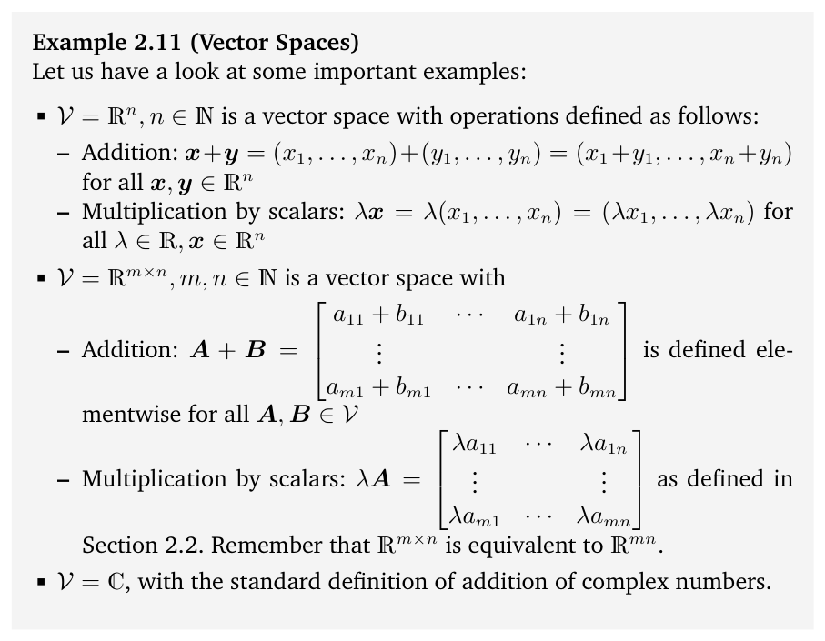

> **Figure 2.6** Not all

**图 2.6** 并非所有

> subsets of $\mathbb{R}^2$ are subspaces. In A and C, the closure property is violated; B does not contain 0. Only D is a subspace.

$\mathbb{R}^2$ 的子集都是子空间。在 A 和 C 中，闭包性质被破坏；B 不包含 0。只有 D 是子空间。

> **Remark.** Every subspace $U \subseteq (\mathbb{R}^n, +, \cdot)$ is the solution space of a homogeneous system of linear equations $Ax = 0$ for $x \in \mathbb{R}^n$. ♢

**评注.** 每个子空间 $U \subseteq (\mathbb{R}^n, +, \cdot)$ 都是齐次线性方程组 $Ax = 0$（$x \in \mathbb{R}^n$）的解空间。♢

## 2.5 线性无关（Linear Independence）

> In the following, we will have a close look at what we can do with vectors (elements of the vector space). In particular, we can add vectors together and multiply them with scalars. The closure property guarantees that we end up with another vector in the same vector space. It is possible to find a set of vectors with which we can represent every vector in the vector space by adding them together and scaling them. This set of vectors is a basis, and we will discuss them in Section 2.6.1. Before we get there, we will need to introduce the concepts of linear combinations and linear independence.

接下来，我们将仔细考察我们能对向量（向量空间的元素）做些什么。特别地，我们可以把向量相加，也可以用标量去乘向量。封闭性保证我们最终得到的仍是同一向量空间中的一个向量。我们可以找到一组向量，通过将它们相加和缩放来表示向量空间中的每一个向量。这组向量就是基，我们将在 2.6.1 节中讨论它。在此之前，我们需要引入线性组合与线性无关的概念。

> **Definition 2.11** (Linear Combination). Consider a vector space $V$ and a finite number of vectors $x_1, \ldots, x_k \in V$. Then, every $v \in V$ of the form

**定义 2.11**（线性组合，Linear Combination）。考虑一个向量空间 $V$ 和有限个向量 $x_1, \ldots, x_k \in V$。那么，每个形如

$$
v = \lambda_1 x_1 + \cdots + \lambda_k x_k = \sum_{i=1}^{k} \lambda_i x_i \in V
\tag{2.65}
$$

> with $\lambda_1, \ldots, \lambda_k \in \mathbb{R}$ is a linear combination of the vectors $x_1, \ldots, x_k$.

的向量 $v \in V$（其中 $\lambda_1, \ldots, \lambda_k \in \mathbb{R}$）都称为向量 $x_1, \ldots, x_k$ 的一个线性组合。

> The 0-vector can always be written as the linear combination of $k$ vectors $x_1, \ldots, x_k$ because $0 = \sum_{i=1}^{k} 0x_i$ is always true. In the following, we are interested in non-trivial linear combinations of a set of vectors to represent $0$, i.e., linear combinations of vectors $x_1, \ldots, x_k$, where not all coefficients $\lambda_i$ in (2.65) are $0$.

零向量总可以写成 $k$ 个向量 $x_1, \ldots, x_k$ 的线性组合，因为 $0 = \sum_{i=1}^{k} 0x_i$ 总是成立。下面，我们感兴趣的是用一组向量的非平凡线性组合来表示 $0$，即向量 $x_1, \ldots, x_k$ 的这样一些线性组合，其中 (2.65) 的系数 $\lambda_i$ 不全为 $0$。

> **Definition 2.12** (Linear (In)dependence). Let us consider a vector space $V$ with $k \in \mathbb{N}$ and $x_1, \ldots, x_k \in V$. If there is a non-trivial linear combination, such that $0 = \sum_{i=1}^{k} \lambda_i x_i$ with at least one $\lambda_i \neq 0$, the vectors $x_1, \ldots, x_k$ are linearly dependent. If only the trivial solution exists, i.e., $\lambda_1 = \ldots = \lambda_k = 0$ the vectors $x_1, \ldots, x_k$ are linearly independent.

**定义 2.12**（线性（无）关性，Linear (In)dependence）。考虑一个向量空间 $V$，其中 $k \in \mathbb{N}$，$x_1, \ldots, x_k \in V$。如果存在一个非平凡的线性组合，使得 $0 = \sum_{i=1}^{k} \lambda_i x_i$ 且至少有一个 $\lambda_i \neq 0$，则称向量 $x_1, \ldots, x_k$ 线性相关（linearly dependent）。如果只有平凡解存在，即 $\lambda_1 = \ldots = \lambda_k = 0$，则称向量 $x_1, \ldots, x_k$ 线性无关。

> Linear independence is one of the most important concepts in linear algebra. Intuitively, a set of linearly independent vectors consists of vectors that have no redundancy, i.e., if we remove any of those vectors from the set, we will lose something. Throughout the next sections, we will formalize this intuition more.

线性无关是线性代数中最重要的概念之一。直观地说，一组线性无关的向量由没有冗余的向量组成，也就是说，如果从这组向量中去掉任何一个向量，我们就会失去一些东西。在接下来几节中，我们将进一步把这一直觉形式化。

> **Example 2.13** (Linearly Dependent Vectors) A geographic example may help to clarify the concept of linear independence. A person in Nairobi (Kenya) describing where Kigali (Rwanda) is might say, “You can get to Kigali by first going 506 km Northwest to Kampala (Uganda) and then 374 km Southwest.”. This is sufficient information to describe the location of Kigali because the geographic coordinate system may be considered a two-dimensional vector space (ignoring altitude and the Earth’s curved surface). The person may add, “It is about 751 km West of here.” Although this last statement is true, it is not necessary to find Kigali given the previous information (see Figure 2.7 for an illustration). In this example, the “506 km Northwest” vector (blue) and the “374 km Southwest” vector (purple) are linearly independent. This means the Southwest vector cannot be described in terms of the Northwest vector, and vice versa. However, the third “751 km West” vector (black) is a linear combination of the other two vectors, and it makes the set of vectors linearly dependent. Equivalently, given “751 km West” and “374 km Southwest” can be linearly combined to obtain “506 km Northwest”.

**例 2.13**（线性相关的向量）一个地理上的例子或许有助于澄清线性无关的概念。一个身处内罗毕（肯尼亚）的人在描述基加利（卢旺达）的位置时可能会说：“先向西北方向走 506 千米到坎帕拉（乌干达），再向西南方向走 374 千米，就可以到达基加利。”这些信息足以描述基加利的位置，因为地理坐标系可以视为一个二维向量空间（忽略海拔和地球表面的弯曲）。这个人还可以补充说：“基加利大约在这里以西 751 千米。”虽然最后这句话是对的，但根据前面给出的信息，要找到基加利并不需要它（见图 2.7）。在这个例子中，“西北 506 千米”向量（蓝色）与“西南 374 千米”向量（紫色）是线性无关的。这意味着西南方向向量不能用西北方向向量来描述，反之亦然。然而，第三个“西 751 千米”向量（黑色）是另外两个向量的线性组合，正是它使得这组向量线性相关。等价地，给定“西 751 千米”和“西南 374 千米”，可以将它们线性组合得到“西北 506 千米”。

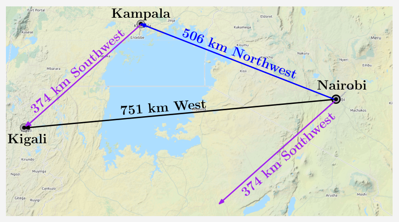

> **Figure 2.7** Geographic example (with crude approximations to cardinal directions) of linearly dependent vectors in a two-dimensional space (plane).

**图 2.7** 二维空间（平面）中线性相关向量的地理示例（对基本方位作了粗略近似）。

> **Remark.** The following properties are useful to find out whether vectors are linearly independent: $k$ vectors are either linearly dependent or linearly independent. There is no third option. If at least one of the vectors $x_1, \ldots, x_k$ is $0$ then they are linearly dependent. The same holds if two vectors are identical. The vectors $\{x_1, \ldots, x_k : x_i \neq 0, i = 1, \ldots, k\}$, $k \geqslant 2$, are linearly dependent if and only if (at least) one of them is a linear combination of the others. In particular, if one vector is a multiple of another vector, i.e., $x_i = \lambda x_j$, $\lambda \in \mathbb{R}$ then the set $\{x_1, \ldots, x_k : x_i \neq 0, i = 1, \ldots, k\}$ is linearly dependent. A practical way of checking whether vectors $x_1, \ldots, x_k \in V$ are linearly independent is to use Gaussian elimination: Write all vectors as columns of a matrix $A$ and perform Gaussian elimination until the matrix is in row echelon form (the reduced row-echelon form is unnecessary here):

**评注.** 以下性质有助于判断向量是否线性无关：$k$ 个向量要么线性相关，要么线性无关，没有第三种可能。如果向量 $x_1, \ldots, x_k$ 中至少有一个是 $0$，那么它们线性相关。如果两个向量相同，情况也是如此。向量组 $\{x_1, \ldots, x_k : x_i \neq 0, i = 1, \ldots, k\}$（$k \geqslant 2$）线性相关，当且仅当其中（至少）有一个向量是其余向量的线性组合。特别地，如果某个向量是另一个向量的倍数，即 $x_i = \lambda x_j$，$\lambda \in \mathbb{R}$，那么集合 $\{x_1, \ldots, x_k : x_i \neq 0, i = 1, \ldots, k\}$ 线性相关。检验向量 $x_1, \ldots, x_k \in V$ 是否线性无关的一个实用方法是使用高斯消元：把所有向量写成矩阵 $A$ 的列，然后进行高斯消元，直到矩阵化为行阶梯形（这里无需简化行阶梯形）：

> – The pivot columns indicate the vectors, which are linearly independent of the vectors on the left. Note that there is an ordering of vectors when the matrix is built.

– 主列标示出那些与其左侧向量线性无关的向量。注意，构造矩阵时向量的排列是有顺序的。

> – The non-pivot columns can be expressed as linear combinations of the pivot columns on their left. For instance, the row-echelon form

– 非主列可以表示为其左侧各主列的线性组合。例如，行阶梯形

$$
\begin{pmatrix}
1 & 3 & 0 \\
0 & 0 & 2
\end{pmatrix}
\tag{2.66}
$$

> tells us that the first and third columns are pivot columns. The second column is a non-pivot column because it is three times the first column. All column vectors are linearly independent if and only if all columns are pivot columns. If there is at least one non-pivot column, the columns (and, therefore, the corresponding vectors) are linearly dependent. ♢

告诉我们，第一列和第三列是主列。第二列是非主列，因为它是第一列的三倍。所有列向量线性无关，当且仅当所有列都是主列。如果至少存在一个非主列，那么这些列（从而对应的向量）线性相关。♢

> **Example 2.14** Consider $\mathbb{R}^4$ with

**例 2.14** 考虑 $\mathbb{R}^4$ 中的向量

$$
x_1 =
\begin{pmatrix}
1 \\
2 \\
-3 \\
4
\end{pmatrix},
\quad
x_2 =
\begin{pmatrix}
1 \\
1 \\
0 \\
2
\end{pmatrix},
\quad
x_3 =
\begin{pmatrix}
-1 \\
-2 \\
1 \\
1
\end{pmatrix}.
\tag{2.67}
$$

> To check whether they are linearly dependent, we follow the general approach and solve

为了检验它们是否线性相关，我们按照一般方法，求解

$$
\lambda_1 x_1 + \lambda_2 x_2 + \lambda_3 x_3
= \lambda_1
\begin{pmatrix}
1 \\
2 \\
-3 \\
4
\end{pmatrix}
+ \lambda_2
\begin{pmatrix}
1 \\
1 \\
0 \\
2
\end{pmatrix}
+ \lambda_3
\begin{pmatrix}
-1 \\
-2 \\
1 \\
1
\end{pmatrix}
= 0
\tag{2.68}
$$

> for $\lambda_1, \ldots, \lambda_3$. We write the vectors $x_i$, $i = 1, 2, 3$, as the columns of a matrix and apply elementary row operations until we identify the pivot columns:

（未知量为 $\lambda_1, \ldots, \lambda_3$）。我们把向量 $x_i$（$i = 1, 2, 3$）写成矩阵的列，并施行初等行变换，直到确定出主列：

$$
\begin{pmatrix}
1 & 1 & -1 \\
2 & 1 & -2 \\
-3 & 0 & 1 \\
4 & 2 & 1
\end{pmatrix}
\rightsquigarrow \cdots \rightsquigarrow
\begin{pmatrix}
1 & 1 & -1 \\
0 & 1 & 0 \\
0 & 0 & 1 \\
0 & 0 & 0
\end{pmatrix}.
\tag{2.69}
$$

> Here, every column of the matrix is a pivot column. Therefore, there is no non-trivial solution, and we require $\lambda_1 = 0$, $\lambda_2 = 0$, $\lambda_3 = 0$ to solve the equation system. Hence, the vectors $x_1, x_2, x_3$ are linearly independent.

这里，矩阵的每一列都是主列。因此，方程组没有非平凡解，要解这个方程组就必须 $\lambda_1 = 0$，$\lambda_2 = 0$，$\lambda_3 = 0$。所以，向量 $x_1, x_2, x_3$ 线性无关。

> **Remark.** Consider a vector space $V$ with $k$ linearly independent vectors $b_1, \ldots, b_k$ and $m$ linear combinations

**评注.** 考虑一个向量空间 $V$，其中有 $k$ 个线性无关的向量 $b_1, \ldots, b_k$，以及 $m$ 个线性组合

$$
\begin{aligned}
x_1 &= \sum_{i=1}^{k} \lambda_i^1 b_i, \\
\vdots \\
x_m &= \sum_{i=1}^{k} \lambda_i^m b_i.
\end{aligned}
\tag{2.70}
$$

> Defining $B = [b_1, \ldots, b_k]$ as the matrix whose columns are the linearly independent vectors $b_1, \ldots, b_k$, we can write

将 $B = [b_1, \ldots, b_k]$ 定义为以线性无关向量 $b_1, \ldots, b_k$ 为列的矩阵，我们就可以把它写成

$$
x_j = B\lambda_j, \qquad
\lambda_j =
\begin{pmatrix}
\lambda_1^j \\
\vdots \\
\lambda_k^j
\end{pmatrix},
\quad
j = 1, \ldots, m,
\tag{2.71}
$$

> in a more compact form. We want to test whether $x_1, \ldots, x_m$ are linearly independent. For this purpose, we follow the general approach of testing when $\sum_{j=1}^{m} \psi_j x_j = 0$. With (2.71), we obtain

更紧凑的形式。我们想检验 $x_1, \ldots, x_m$ 是否线性无关。为此，我们按照一般方法，考察 $\sum_{j=1}^{m} \psi_j x_j = 0$ 何时成立。利用 (2.71)，我们得到

$$
\sum_{j=1}^{m} \psi_j x_j
= \sum_{j=1}^{m} \psi_j B\lambda_j
= B \sum_{j=1}^{m} \psi_j \lambda_j.
\tag{2.72}
$$

> This means that $\{x_1, \ldots, x_m\}$ are linearly independent if and only if the column vectors $\{\lambda_1, \ldots, \lambda_m\}$ are linearly independent. ♢

这意味着，$\{x_1, \ldots, x_m\}$ 线性无关，当且仅当列向量 $\{\lambda_1, \ldots, \lambda_m\}$ 线性无关。♢

> **Example 2.15** Consider a set of linearly independent vectors $b_1, b_2, b_3, b_4 \in \mathbb{R}^n$ and

**例 2.15** 考虑一组线性无关的向量 $b_1, b_2, b_3, b_4 \in \mathbb{R}^n$ 以及

$$
\begin{aligned}
x_1 &= b_1 - 2b_2 + b_3 - b_4 \\
x_2 &= -4b_1 - 2b_2 + 4b_4 \\
x_3 &= 2b_1 + 3b_2 - b_3 - 3b_4 \\
x_4 &= 17b_1 - 10b_2 + 11b_3 + b_4.
\end{aligned}
\tag{2.73}
$$

> Are the vectors $x_1, \ldots, x_4 \in \mathbb{R}^n$ linearly independent? To answer this question, we investigate whether the column vectors

向量 $x_1, \ldots, x_4 \in \mathbb{R}^n$ 是否线性无关？为了回答这个问题，我们考察列向量

$$
\left\{
\begin{pmatrix}
1 \\
-2 \\
1 \\
-1
\end{pmatrix},
\begin{pmatrix}
-4 \\
-2 \\
0 \\
4
\end{pmatrix},
\begin{pmatrix}
2 \\
3 \\
-1 \\
-3
\end{pmatrix},
\begin{pmatrix}
17 \\
-10 \\
11 \\
1
\end{pmatrix}
\right\}
\tag{2.74}
$$

> are linearly independent. The reduced row-echelon form of the corresponding linear equation system with coefficient matrix

线性无关。相应线性方程组的系数矩阵为

$$
A =
\begin{pmatrix}
1 & -4 & 2 & 17 \\
-2 & -2 & 3 & -10 \\
1 & 0 & -1 & 11 \\
-1 & 4 & -3 & 1
\end{pmatrix}
\tag{2.75}
$$

> is given as

其简化行阶梯形为

$$
\begin{pmatrix}
1 & 0 & 0 & -7 \\
0 & 1 & 0 & -15 \\
0 & 0 & 1 & -18 \\
0 & 0 & 0 & 0
\end{pmatrix}.
\tag{2.76}
$$

> We see that the corresponding linear equation system is non-trivially solvable: The last column is not a pivot column, and $x_4 = -7x_1 - 15x_2 - 18x_3$. Therefore, $x_1, \ldots, x_4$ are linearly dependent as $x_4$ can be expressed as a linear combination of $x_1, \ldots, x_3$.

我们看到，相应的线性方程组有非平凡解：最后一列不是主元列，且 $x_4 = -7x_1 - 15x_2 - 18x_3$。因此，$x_1, \ldots, x_4$ 线性相关，因为 $x_4$ 可以表示为 $x_1, \ldots, x_3$ 的线性组合。

## 2.6 基与秩（Basis and Rank）

> In a vector space $V$, we are particularly interested in sets of vectors $A$ that possess the property that any vector $v \in V$ can be obtained by a linear combination of vectors in $A$. These vectors are special vectors, and in the following, we will characterize them.

在向量空间 $V$ 中，我们特别感兴趣的是满足如下性质的向量集合 $A$：任意向量 $v \in V$ 都可以由 $A$ 中的向量通过线性组合得到。这些向量是特殊的向量，下面我们将对它们进行刻画。

### 2.6.1 生成集与基（Generating Set and Basis）

> **Definition 2.13** (Generating Set and Span). Consider a vector space $V = (V, +, \cdot)$ and set of vectors $A = \{x_1, \ldots, x_k\} \subseteq V$. If every vector $v \in V$ can be expressed as a linear combination of $x_1, \ldots, x_k$, $A$ is called a generating set of $V$. The set of all linear combinations of vectors in $A$ is called the span of $A$. If $A$ spans the vector space $V$, we write $V = \operatorname{span}[A]$ or $V = \operatorname{span}[x_1, \ldots, x_k]$.

**定义 2.13**（生成集与张成）。考虑向量空间 $V = (V, +, \cdot)$ 和向量集合 $A = \{x_1, \ldots, x_k\} \subseteq V$。如果 $V$ 中的每一个向量 $v \in V$ 都可以表示为 $x_1, \ldots, x_k$ 的线性组合，则称 $A$ 为 $V$ 的生成集（generating set）。由 $A$ 中向量的所有线性组合构成的集合称为 $A$ 的张成（span）。如果 $A$ 张成了向量空间 $V$，我们记作 $V = \operatorname{span}[A]$ 或 $V = \operatorname{span}[x_1, \ldots, x_k]$。

> Generating sets are sets of vectors that span vector (sub)spaces, i.e., every vector can be represented as a linear combination of the vectors in the generating set. Now, we will be more specific and characterize the smallest generating set that spans a vector (sub)space.

生成集是张成向量（子）空间的向量集合，也就是说，每个向量都可以表示为生成集中向量的线性组合。现在，我们将更加具体地刻画张成向量（子）空间的最小生成集。

> **Definition 2.14** (Basis). Consider a vector space $V = (V, +, \cdot)$ and $A \subseteq V$. A generating set $A$ of $V$ is called minimal if there exists no smaller set $\tilde{A} \subsetneq A \subseteq V$ that spans $V$. Every linearly independent generating set of $V$ is minimal and is called a basis of $V$.

**定义 2.14**（基）。考虑向量空间 $V = (V, +, \cdot)$ 以及 $A \subseteq V$。如果不存在更小的集合 $\tilde{A} \subsetneq A \subseteq V$ 也能张成 $V$，则称 $V$ 的生成集 $A$ 是极小的。$V$ 的每一个线性无关的生成集都是极小的，并被称为 $V$ 的基（basis）。

> Let $V = (V, +, \cdot)$ be a vector space and $B \subseteq V$, $B \neq \emptyset$. Then, the following statements are equivalent:

设 $V = (V, +, \cdot)$ 为向量空间，且 $B \subseteq V$，$B \neq \emptyset$。那么，以下命题相互等价：

> - $B$ is a basis of $V$.
> - $B$ is a minimal generating set.
> - $B$ is a maximal linearly independent set of vectors in $V$, i.e., adding any other vector to this set will make it linearly dependent.
> - Every vector $x \in V$ is a linear combination of vectors from $B$, and every linear combination is unique, i.e., with

- $B$ 是 $V$ 的基。
- $B$ 是极小生成集。
- $B$ 是 $V$ 中极大线性无关的向量集合，也就是说，向该集合中添加任何其他向量都会使其线性相关。
- $V$ 中的每个向量 $x$ 都是 $B$ 中向量的线性组合，并且每个线性组合都是唯一的，也就是说，若

$$
x = \sum_{i=1}^{k} \lambda_i b_i = \sum_{i=1}^{k} \psi_i b_i
\tag{2.77}
$$

> and $\lambda_i, \psi_i \in \mathbb{R}$, $b_i \in B$ it follows that $\lambda_i = \psi_i$, $i = 1, \ldots, k$.

且 $\lambda_i, \psi_i \in \mathbb{R}$，$b_i \in B$，则可得 $\lambda_i = \psi_i$，$i = 1, \ldots, k$。

> **Example 2.16**

**例 2.16**

> In $\mathbb{R}^3$, the canonical/standard basis is

在 $\mathbb{R}^3$ 中，规范基/标准基为

$$
B = \left\{
\begin{pmatrix}
1 \\
0 \\
0
\end{pmatrix},
\begin{pmatrix}
0 \\
1 \\
0
\end{pmatrix},
\begin{pmatrix}
0 \\
0 \\
1
\end{pmatrix}
\right\}
\tag{2.78}
$$

> Different bases in $\mathbb{R}^3$ are

$\mathbb{R}^3$ 中其他的基有

$$
B_1 = \left\{
\begin{pmatrix}
0.5 \\
-2.2 \\
1
\end{pmatrix},
\begin{pmatrix}
0.8 \\
-1.3 \\
0
\end{pmatrix},
\begin{pmatrix}
0.4 \\
1 \\
1
\end{pmatrix}
\right\}, \quad
B_2 = \left\{
\begin{pmatrix}
1.8 \\
0 \\
1
\end{pmatrix},
\begin{pmatrix}
0.3 \\
0 \\
1
\end{pmatrix},
\begin{pmatrix}
0.3 \\
1 \\
3.5
\end{pmatrix}
\right\}
\tag{2.79}
$$

> The set

集合

$$
A = \left\{
\begin{pmatrix}
1 \\
2 \\
3 \\
4
\end{pmatrix},
\begin{pmatrix}
2 \\
-1 \\
1 \\
1
\end{pmatrix},
\begin{pmatrix}
0 \\
-4 \\
0 \\
2
\end{pmatrix}
\right\}
\tag{2.80}
$$

> is linearly independent, but not a generating set (and no basis) of $\mathbb{R}^4$: For instance, the vector $[1, 0, 0, 0]^\top$ cannot be obtained by a linear combination of elements in $A$.

线性无关，但不是 $\mathbb{R}^4$ 的生成集（也不是基）：例如，向量 $[1, 0, 0, 0]^\top$ 无法通过 $A$ 中元素的线性组合得到。

> **Remark.** Every vector space $V$ possesses a basis $B$. The preceding examples show that there can be many bases of a vector space $V$, i.e., there is no unique basis. However, all bases possess the same number of elements, the basis vectors. ♢

**注记.** 每个向量空间 $V$ 都拥有一个基 $B$。前面的例子表明，向量空间 $V$ 可以有许多个基，也就是说，基并不唯一。然而，所有基所含元素的数目都相同，这些元素就是基向量（basis vector）。♢

> We only consider finite-dimensional vector spaces $V$. In this case, the dimension of $V$ is the number of basis vectors of $V$, and we write $\dim(V)$. If $U \subseteq V$ is a subspace of $V$, then $\dim(U) \leqslant \dim(V)$ and $\dim(U) = \dim(V)$ if and only if $U = V$. Intuitively, the dimension of a vector space can be thought of as the number of independent directions in this vector space. The dimension of a vector space corresponds to the number of its basis vectors.

我们只考虑有限维向量空间 $V$。此时，$V$ 的维度（dimension）就是 $V$ 的基向量的数目，记作 $\dim(V)$。如果 $U \subseteq V$ 是 $V$ 的一个子空间，则 $\dim(U) \leqslant \dim(V)$，且 $\dim(U) = \dim(V)$ 当且仅当 $U = V$。直观上，向量空间的维度可以被理解为该向量空间中独立方向的数目。向量空间的维度对应于其基向量的数目。

> **Remark.** The dimension of a vector space is not necessarily the number of elements in a vector. For instance, the vector space $V = \operatorname{span}[\begin{pmatrix} 0 \\ 1 \end{pmatrix}]$ is one-dimensional, although the basis vector possesses two elements. ♢

**注记.** 向量空间的维度不一定等于向量中元素的个数。例如，向量空间 $V = \operatorname{span}[\begin{pmatrix} 0 \\ 1 \end{pmatrix}]$ 是一维的，尽管其基向量含有两个元素。♢

> **Remark.** A basis of a subspace $U = \operatorname{span}[x_1, \ldots, x_m] \subseteq \mathbb{R}^n$ can be found by executing the following steps:
> 1. Write the spanning vectors as columns of a matrix $A$
> 2. Determine the row-echelon form of $A$.
> 3. The spanning vectors associated with the pivot columns are a basis of $U$.
> ♢

**注记.** 子空间 $U = \operatorname{span}[x_1, \ldots, x_m] \subseteq \mathbb{R}^n$ 的一个基可以通过执行以下步骤求得：
1. 将张成向量写成矩阵 $A$ 的列
2. 确定 $A$ 的行阶梯形。
3. 与主元列相对应的张成向量构成 $U$ 的一个基。
♢

> **Example 2.17** (Determining a Basis)

**例 2.17**（确定一个基）

> For a vector subspace $U \subseteq \mathbb{R}^5$, spanned by the vectors

对于由下列向量张成的向量子空间 $U \subseteq \mathbb{R}^5$

$$
x_1 =
\begin{pmatrix}
1 \\
2 \\
-1 \\
-1 \\
-1
\end{pmatrix}, \quad
x_2 =
\begin{pmatrix}
2 \\
-1 \\
1 \\
2 \\
-2
\end{pmatrix}, \quad
x_3 =
\begin{pmatrix}
3 \\
-4 \\
3 \\
5 \\
-3
\end{pmatrix}, \quad
x_4 =
\begin{pmatrix}
-1 \\
8 \\
-5 \\
-6 \\
1
\end{pmatrix}
\in \mathbb{R}^5,
\tag{2.81}
$$

> we are interested in finding out which vectors $x_1, \ldots, x_4$ are a basis for $U$. For this, we need to check whether $x_1, \ldots, x_4$ are linearly independent. Therefore, we need to solve

我们想知道 $x_1, \ldots, x_4$ 中哪些向量构成 $U$ 的一个基。为此，我们需要检验 $x_1, \ldots, x_4$ 是否线性无关，因此需要求解

$$
\sum_{i=1}^{4} \lambda_i x_i = 0
\tag{2.82}
$$

> which leads to a homogeneous system of equations with matrix

由此得到一个齐次方程组，其系数矩阵为

$$
\begin{pmatrix}
1 & 2 & 3 & -1 \\
2 & -1 & -4 & 8 \\
-1 & 1 & 3 & -5 \\
-1 & 2 & 5 & -6 \\
-1 & -2 & -3 & 1
\end{pmatrix}
=
\begin{pmatrix}
x_1 & x_2 & x_3 & x_4
\end{pmatrix}.
\tag{2.83}
$$

> With the basic transformation rules for systems of linear equations, we obtain the row-echelon form

利用线性方程组的基本变换规则，我们得到行阶梯形

$$
\begin{pmatrix}
1 & 2 & 3 & -1 \\
2 & -1 & -4 & 8 \\
-1 & 1 & 3 & -5 \\
-1 & 2 & 5 & -6 \\
-1 & -2 & -3 & 1
\end{pmatrix}
\rightsquigarrow \cdots \rightsquigarrow
\begin{pmatrix}
1 & 2 & 3 & -1 \\
0 & 1 & 2 & -2 \\
0 & 0 & 0 & 1 \\
0 & 0 & 0 & 0 \\
0 & 0 & 0 & 0
\end{pmatrix}.
$$

> Since the pivot columns indicate which set of vectors is linearly independent, we see from the row-echelon form that $x_1, x_2, x_4$ are linearly independent (because the system of linear equations $\lambda_1 x_1 + \lambda_2 x_2 + \lambda_4 x_4 = 0$ can only be solved with $\lambda_1 = \lambda_2 = \lambda_4 = 0$). Therefore, $\{x_1, x_2, x_4\}$ is a basis of $U$.

由于主元列表明哪一组向量是线性无关的，从行阶梯形可以看出 $x_1, x_2, x_4$ 线性无关（因为线性方程组 $\lambda_1 x_1 + \lambda_2 x_2 + \lambda_4 x_4 = 0$ 只有在 $\lambda_1 = \lambda_2 = \lambda_4 = 0$ 时才有解）。因此，$\{x_1, x_2, x_4\}$ 是 $U$ 的一个基。

### 2.6.2 秩（Rank）

> The number of linearly independent columns of a matrix $A \in \mathbb{R}^{m \times n}$ equals the number of linearly independent rows and is called the rank of $A$ and is denoted by $\operatorname{rk}(A)$.

矩阵 $A \in \mathbb{R}^{m \times n}$ 的线性无关列的数目等于线性无关行的数目，该数目称为 $A$ 的秩（rank），记作 $\operatorname{rk}(A)$。

> **Remark.** The rank of a matrix has some important properties:
> - $\operatorname{rk}(A) = \operatorname{rk}(A^\top)$, i.e., the column rank equals the row rank.
> - The columns of $A \in \mathbb{R}^{m \times n}$ span a subspace $U \subseteq \mathbb{R}^m$ with $\dim(U) = \operatorname{rk}(A)$. Later we will call this subspace the image or range. A basis of $U$ can be found by applying Gaussian elimination to $A$ to identify the pivot columns.
> - The rows of $A \in \mathbb{R}^{m \times n}$ span a subspace $W \subseteq \mathbb{R}^n$ with $\dim(W) = \operatorname{rk}(A)$. A basis of $W$ can be found by applying Gaussian elimination to $A^\top$.
> - For all $A \in \mathbb{R}^{n \times n}$ it holds that $A$ is regular (invertible) if and only if $\operatorname{rk}(A) = n$.
> - For all $A \in \mathbb{R}^{m \times n}$ and all $b \in \mathbb{R}^m$ it holds that the linear equation system $Ax = b$ can be solved if and only if $\operatorname{rk}(A) = \operatorname{rk}(A|b)$, where $A|b$ denotes the augmented system.
> - For $A \in \mathbb{R}^{m \times n}$ the subspace of solutions for $Ax = 0$ possesses dimension $n - \operatorname{rk}(A)$. Later, we will call this subspace the kernel or the null space.
> - A matrix $A \in \mathbb{R}^{m \times n}$ has full rank if its rank equals the largest possible rank for a matrix of the same dimensions. This means that the rank of a full-rank matrix is the lesser of the number of rows and columns, i.e., $\operatorname{rk}(A) = \min(m, n)$. A matrix is said to be rank deficient if it does not have full rank.
> ♢

**注记.** 矩阵的秩具有如下重要性质：
- $\operatorname{rk}(A) = \operatorname{rk}(A^\top)$，即列秩等于行秩。
- $A \in \mathbb{R}^{m \times n}$ 的列张成一个子空间 $U \subseteq \mathbb{R}^m$，且 $\dim(U) = \operatorname{rk}(A)$。稍后我们将把这个子空间称为像（image）或值域（range）。对 $A$ 进行高斯消元以找出主元列，即可得到 $U$ 的一个基。
- $A \in \mathbb{R}^{m \times n}$ 的行张成一个子空间 $W \subseteq \mathbb{R}^n$，且 $\dim(W) = \operatorname{rk}(A)$。对 $A^\top$ 进行高斯消元，即可得到 $W$ 的一个基。
- 对所有 $A \in \mathbb{R}^{n \times n}$，$A$ 是正则的（可逆的）当且仅当 $\operatorname{rk}(A) = n$。
- 对所有 $A \in \mathbb{R}^{m \times n}$ 和所有 $b \in \mathbb{R}^m$，线性方程组 $Ax = b$ 可解当且仅当 $\operatorname{rk}(A) = \operatorname{rk}(A|b)$，其中 $A|b$ 表示增广矩阵。
- 对 $A \in \mathbb{R}^{m \times n}$，$Ax = 0$ 的解子空间的维度为 $n - \operatorname{rk}(A)$。稍后我们将把这个子空间称为核（kernel）或零空间（null space）。
- 如果矩阵 $A \in \mathbb{R}^{m \times n}$ 的秩等于同维度矩阵所能取到的最大秩，则称 $A$ 满秩（full rank）。这意味着满秩矩阵的秩是行数与列数中较小的一个，即 $\operatorname{rk}(A) = \min(m, n)$。若矩阵不是满秩的，则称其为秩亏（rank deficient）矩阵。
♢

> **Example 2.18** (Rank)

**例 2.18**（秩）

$$
A =
\begin{pmatrix}
1 & 0 & 1 \\
0 & 1 & 1 \\
0 & 0 & 0
\end{pmatrix}.
$$

> $A$ has two linearly independent rows/columns so that $\operatorname{rk}(A) = 2$.

$A$ 有两个线性无关的行/列，因此 $\operatorname{rk}(A) = 2$。

$$
A =
\begin{pmatrix}
1 & 2 & 1 \\
-2 & -3 & 1 \\
3 & 5 & 0
\end{pmatrix}.
$$

> We use Gaussian elimination to determine the rank:

我们使用高斯消元来确定秩：

$$
\begin{pmatrix}
1 & 2 & 1 \\
-2 & -3 & 1 \\
3 & 5 & 0
\end{pmatrix}
\rightsquigarrow \cdots \rightsquigarrow
\begin{pmatrix}
1 & 2 & 1 \\
0 & 1 & 3 \\
0 & 0 & 0
\end{pmatrix}.
\tag{2.84}
$$

> Here, we see that the number of linearly independent rows and columns is 2, such that $\operatorname{rk}(A) = 2$.

这里可以看到，线性无关的行数与列数都是 2，因此 $\operatorname{rk}(A) = 2$。

## 2.7 线性映射（Linear Mappings）

> In the following, we will study mappings on vector spaces that preserve their structure, which will allow us to define the concept of a coordinate. In the beginning of the chapter, we said that vectors are objects that can be added together and multiplied by a scalar, and the resulting object is still a vector. We wish to preserve this property when applying the mapping: Consider two real vector spaces $V, W$. A mapping $\Phi : V \to W$ preserves the structure of the vector space if

接下来，我们将研究向量空间上保持其结构的映射，这将使我们能够定义坐标（coordinate）的概念。在本章开头我们说过，向量是既可以相加又可以与标量相乘的对象，而且运算的结果仍然是向量。我们希望在应用映射时保持这一性质：考虑两个实向量空间 $V$、$W$。若映射 $\Phi : V \to W$ 保持向量空间的结构，则

$$
\Phi(x + y) = \Phi(x) + \Phi(y)
\tag{2.85}
$$

$$
\Phi(\lambda x) = \lambda \Phi(x)
\tag{2.86}
$$

> for all $x, y \in V$ and $\lambda \in \mathbb{R}$. We can summarize this in the following definition:

对所有 $x, y \in V$ 和 $\lambda \in \mathbb{R}$ 都成立。我们可以把这一点总结成如下定义：

> **Definition 2.15** (Linear Mapping). For vector spaces $V, W$, a mapping $\Phi : V \to W$ is called a linear mapping (or vector space homomorphism/linear transformation) if

**定义 2.15**（线性映射，Linear Mapping）。对于向量空间 $V$、$W$，映射 $\Phi : V \to W$ 称为线性映射（或向量空间同态/线性变换，vector space homomorphism/linear transformation），若

$$
\forall x, y \in V \quad \forall \lambda, \psi \in \mathbb{R}: \quad \Phi(\lambda x + \psi y) = \lambda \Phi(x) + \psi \Phi(y).
\tag{2.87}
$$

> It turns out that we can represent linear mappings as matrices (Section 2.7.1). Recall that we can also collect a set of vectors as columns of a matrix. When working with matrices, we have to keep in mind what the matrix represents: a linear mapping or a collection of vectors. We will see more about linear mappings in Chapter 4. Before we continue, we will briefly introduce special mappings.

结果表明，我们可以用矩阵来表示线性映射（见 2.7.1 节）。回想一下，我们也可以把一组向量收纳为矩阵的列。在处理矩阵时，我们必须牢记矩阵表示的究竟是什么：是一个线性映射，还是一组向量的集合。关于线性映射的更多内容，我们将在第 4 章中看到。在继续往下讲之前，我们先简要介绍几种特殊的映射。

> **Definition 2.16** (Injective, Surjective, Bijective). Consider a mapping $\Phi : V \to W$, where $V, W$ can be arbitrary sets. Then $\Phi$ is called
>
> - Injective if $\forall x, y \in V : \Phi(x) = \Phi(y) \implies x = y$.
> - Surjective if $\Phi(V) = W$.
> - Bijective if it is injective and surjective.

**定义 2.16**（单射、满射、双射，Injective, Surjective, Bijective）。考虑映射 $\Phi : V \to W$，其中 $V$、$W$ 可以是任意集合。那么 $\Phi$ 称为

- 单射（injective），若 $\forall x, y \in V : \Phi(x) = \Phi(y) \implies x = y$。
- 满射（surjective），若 $\Phi(V) = W$。
- 双射（bijective），若它既是单射又是满射。

> If $\Phi$ is surjective, then every element in $W$ can be “reached” from $V$ using $\Phi$. A bijective $\Phi$ can be “undone”, i.e., there exists a mapping $\Psi : W \to V$ so that $\Psi \circ \Phi(x) = x$. This mapping $\Psi$ is then called the inverse of $\Phi$ and normally denoted by $\Phi^{-1}$.

若 $\Phi$ 是满射，则 $W$ 中的每个元素都可以通过 $\Phi$ 从 $V$ “到达”。双射的 $\Phi$ 是可以“撤销”的，也就是说，存在映射 $\Psi : W \to V$ 使得 $\Psi \circ \Phi(x) = x$。此时，映射 $\Psi$ 称为 $\Phi$ 的逆，通常记作 $\Phi^{-1}$。

> With these definitions, we introduce the following special cases of linear mappings between vector spaces $V$ and $W$:
>
> - Isomorphism: $\Phi : V \to W$ linear and bijective
> - Endomorphism: $\Phi : V \to V$ linear
> - Automorphism: $\Phi : V \to V$ linear and bijective

有了这些定义，我们引入向量空间 $V$ 与 $W$ 之间线性映射的下列特殊情形：

- 同构（isomorphism）：$\Phi : V \to W$ 是线性的且是双射的
- 自同态（endomorphism）：$\Phi : V \to V$ 是线性的
- 自同构（automorphism）：$\Phi : V \to V$ 是线性的且是双射的

> We define $\operatorname{id}_V : V \to V$, $x \mapsto x$ as the identity mapping or identity automorphism in $V$.

我们定义 $\operatorname{id}_V : V \to V$，$x \mapsto x$，称之为 $V$ 中的恒等映射（identity mapping）或恒等自同构（identity automorphism）。

> **Example 2.19** (Homomorphism)

**例 2.19**（同态）

> The mapping $\Phi : \mathbb{R}^2 \to \mathbb{C}$, $\Phi(x) = x_1 + i x_2$, is a homomorphism:

映射 $\Phi : \mathbb{R}^2 \to \mathbb{C}$，$\Phi(x) = x_1 + i x_2$，是一个同态（homomorphism）：

$$
\begin{aligned}
\Phi\left(\begin{pmatrix} x_1 \\ x_2 \end{pmatrix} + \begin{pmatrix} y_1 \\ y_2 \end{pmatrix}\right) &= (x_1 + y_1) + i(x_2 + y_2) = x_1 + i x_2 + y_1 + i y_2 \\
&= \Phi\left(\begin{pmatrix} x_1 \\ x_2 \end{pmatrix}\right) + \Phi\left(\begin{pmatrix} y_1 \\ y_2 \end{pmatrix}\right) \\
\Phi\left(\lambda \begin{pmatrix} x_1 \\ x_2 \end{pmatrix}\right) &= \lambda x_1 + \lambda i x_2 = \lambda(x_1 + i x_2) = \lambda \Phi\left(\begin{pmatrix} x_1 \\ x_2 \end{pmatrix}\right).
\end{aligned}
\tag{2.88}
$$

> This also justifies why complex numbers can be represented as tuples in $\mathbb{R}^2$: There is a bijective linear mapping that converts the elementwise addition of tuples in $\mathbb{R}^2$ into the set of complex numbers with the corresponding addition. Note that we only showed linearity, but not the bijection.

这也说明了为什么复数可以表示为 $\mathbb{R}^2$ 中的二元组：存在一个双射线性映射，它把 $\mathbb{R}^2$ 中二元组的按元素相加转换为带相应加法的复数集合。注意，我们只证明了线性性，而未证明双射性。

> **Theorem 2.17** (Theorem 3.59 in Axler (2015)). Finite-dimensional vector spaces $V$ and $W$ are isomorphic if and only if $\dim(V) = \dim(W)$.

**定理 2.17**（Axler (2015) 中的定理 3.59）。有限维向量空间 $V$ 与 $W$ 同构，当且仅当 $\dim(V) = \dim(W)$。

> Theorem 2.17 states that there exists a linear, bijective mapping between two vector spaces of the same dimension. Intuitively, this means that vector spaces of the same dimension are kind of the same thing, as they can be transformed into each other without incurring any loss.

定理 2.17 表明，在两个维度相同的向量空间之间存在一个线性双射映射。直观上说，这意味着维度相同的向量空间在某种程度上是同一类东西，因为它们可以毫无损失地相互变换。

> Theorem 2.17 also gives us the justification to treat $\mathbb{R}^{m \times n}$ (the vector space of $m \times n$-matrices) and $\mathbb{R}^{mn}$ (the vector space of vectors of length $mn$) the same, as their dimensions are $mn$, and there exists a linear, bijective mapping that transforms one into the other.

定理 2.17 也为我们把 $\mathbb{R}^{m \times n}$（$m \times n$ 矩阵构成的向量空间）与 $\mathbb{R}^{mn}$（长度为 $mn$ 的向量构成的向量空间）同等对待提供了依据：二者的维度都是 $mn$，并且存在把其中一个变换为另一个的线性双射映射。

> **Remark.** Consider vector spaces $V, W, X$. Then:
>
> - For linear mappings $\Phi : V \to W$ and $\Psi : W \to X$, the mapping $\Psi \circ \Phi : V \to X$ is also linear.
> - If $\Phi : V \to W$ is an isomorphism, then $\Phi^{-1} : W \to V$ is an isomorphism, too.

**评注.** 考虑向量空间 $V$、$W$、$X$。那么：

- 对于线性映射 $\Phi : V \to W$ 与 $\Psi : W \to X$，映射 $\Psi \circ \Phi : V \to X$ 也是线性的。
- 若 $\Phi : V \to W$ 是同构，则 $\Phi^{-1} : W \to V$ 也是同构。

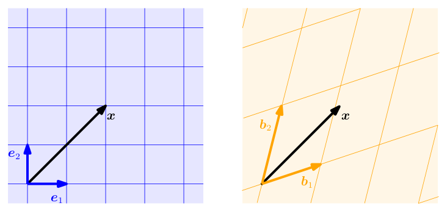

> **Figure 2.8** Two different coordinate systems defined by two sets of basis vectors. A vector $x$ has different coordinate representations depending on which coordinate system is chosen.

**图 2.8** 由两组基向量定义的两个不同的坐标系。向量 $x$ 有不同的坐标表示，这取决于选择了哪个坐标系。

> - If $\Phi : V \to W$, $\Psi : V \to W$ are linear, then $\Phi + \Psi$ and $\lambda\Phi$, $\lambda \in \mathbb{R}$, are linear, too.

- 若 $\Phi : V \to W$、$\Psi : V \to W$ 都是线性的，则 $\Phi + \Psi$ 与 $\lambda\Phi$（$\lambda \in \mathbb{R}$）也是线性的。♢

### 2.7.1 线性映射的矩阵表示（Matrix Representation of Linear Mappings）

> Any $n$-dimensional vector space is isomorphic to $\mathbb{R}^n$ (Theorem 2.17). We consider a basis $\{b_1, \ldots, b_n\}$ of an $n$-dimensional vector space $V$. In the following, the order of the basis vectors will be important. Therefore, we write

任意 $n$ 维向量空间都同构于 $\mathbb{R}^n$（定理 2.17）。我们考虑 $n$ 维向量空间 $V$ 的一组基 $\{b_1, \ldots, b_n\}$。下面，基向量的顺序将十分重要，因此我们记

$$
B = (b_1, \ldots, b_n)
\tag{2.89}
$$

> and call this $n$-tuple an ordered basis of $V$.

并把这个 $n$ 元组称为 $V$ 的有序基（ordered basis）。

> **Remark** (Notation). We are at the point where notation gets a bit tricky. Therefore, we summarize some parts here. $B = (b_1, \ldots, b_n)$ is an ordered basis, $B = \{b_1, \ldots, b_n\}$ is an (unordered) basis, and $B = [b_1, \ldots, b_n]$ is a matrix whose columns are the vectors $b_1, \ldots, b_n$. ♢

**评注**（记号）。讨论至此，记号开始变得有些微妙，因此我们在这里总结其中的一部分：$B = (b_1, \ldots, b_n)$ 是有序基，$B = \{b_1, \ldots, b_n\}$ 是（无序的）基，而 $B = [b_1, \ldots, b_n]$ 是以向量 $b_1, \ldots, b_n$ 为列的矩阵。♢

> **Definition 2.18** (Coordinates). Consider a vector space $V$ and an ordered basis $B = (b_1, \ldots, b_n)$ of $V$. For any $x \in V$ we obtain a unique representation (linear combination)

**定义 2.18**（坐标，Coordinates）。考虑一个向量空间 $V$ 及其有序基 $B = (b_1, \ldots, b_n)$。对于任意 $x \in V$，我们得到 $x$ 的一个唯一表示（线性组合）

$$
x = \alpha_1 b_1 + \cdots + \alpha_n b_n
\tag{2.90}
$$

> of $x$ with respect to $B$. Then $\alpha_1, \ldots, \alpha_n$ are the coordinates of $x$ with respect to $B$, and the vector

该表示相对于 $B$ 而言。此时，$\alpha_1, \ldots, \alpha_n$ 就是 $x$ 关于 $B$ 的坐标，而向量

$$
\alpha =
\begin{pmatrix}
\alpha_1 \\
\vdots \\
\alpha_n
\end{pmatrix} \in \mathbb{R}^n
\tag{2.91}
$$

> is the coordinate vector/coordinate representation of $x$ with respect to the ordered basis $B$.

称为 $x$ 关于有序基 $B$ 的坐标向量（coordinate vector）/坐标表示（coordinate representation）。

> A basis effectively defines a coordinate system. We are familiar with the Cartesian coordinate system in two dimensions, which is spanned by the canonical basis vectors $e_1, e_2$. In this coordinate system, a vector $x \in \mathbb{R}^2$ has a representation that tells us how to linearly combine $e_1$ and $e_2$ to obtain $x$. However, any basis of $\mathbb{R}^2$ defines a valid coordinate system, and the same vector $x$ from before may have a different coordinate representation in the $(b_1, b_2)$ basis. In Figure 2.8, the coordinates of $x$ with respect to the standard basis $(e_1, e_2)$ is $[2, 2]^\top$. However, with respect to the basis $(b_1, b_2)$ the same vector $x$ is represented as $[1.09, 0.72]^\top$, i.e., $x = 1.09 b_1 + 0.72 b_2$. In the following sections, we will discover how to obtain this representation.

基实际上定义了一个坐标系。我们熟悉二维的笛卡尔坐标系，它由典范基向量（canonical basis vectors）$e_1, e_2$ 张成。在这个坐标系中，向量 $x \in \mathbb{R}^2$ 有一种表示，它告诉我们如何线性组合 $e_1$ 与 $e_2$ 来得到 $x$。然而，$\mathbb{R}^2$ 的任何一组基都定义了一个有效的坐标系，而且前面那个向量 $x$ 在基 $(b_1, b_2)$ 下可能有不同的坐标表示。在图 2.8 中，$x$ 关于标准基（standard basis）$(e_1, e_2)$ 的坐标是 $[2, 2]^\top$；而关于基 $(b_1, b_2)$，同一个向量 $x$ 表示为 $[1.09, 0.72]^\top$，即 $x = 1.09 b_1 + 0.72 b_2$。在接下来的几节中，我们将了解如何得到这种表示。

> **Example 2.20** Let us have a look at a geometric vector $x \in \mathbb{R}^2$ with coordinates $[2, 3]^\top$ with respect to the standard basis $(e_1, e_2)$ of $\mathbb{R}^2$. This means, we can write $x = 2e_1 + 3e_2$. However, we do not have to choose the standard basis to represent this vector. If we use the basis vectors $b_1 = [1, -1]^\top$, $b_2 = [1, 1]^\top$ we will obtain the coordinates $\frac{1}{2}[-1, 5]^\top$ to represent the same vector with respect to $(b_1, b_2)$ (see Figure 2.9).

**例 2.20** 让我们来看一个几何向量 $x \in \mathbb{R}^2$，它关于 $\mathbb{R}^2$ 的标准基 $(e_1, e_2)$ 的坐标为 $[2, 3]^\top$。这意味着我们可以写成 $x = 2e_1 + 3e_2$。然而，要表示这个向量，我们不必选择标准基。如果使用基向量 $b_1 = [1, -1]^\top$、$b_2 = [1, 1]^\top$，那么关于 $(b_1, b_2)$ 表示同一个向量时，我们得到的坐标是 $\frac{1}{2}[-1, 5]^\top$（见图 2.9）。

$$
\begin{aligned}
x &= 2e_1 + 3e_2 \\
x &= -\frac{1}{2} b_1 + \frac{5}{2} b_2
\end{aligned}
$$

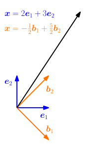

> **Figure 2.9** Different coordinate representations of a vector $x$, depending on the choice of basis.

**图 2.9** 同一个向量 $x$ 的不同坐标表示，取决于基的选取。

> **Remark.** For an $n$-dimensional vector space $V$ and an ordered basis $B$ of $V$, the mapping $\Phi : \mathbb{R}^n \to V$, $\Phi(e_i) = b_i$, $i = 1, \ldots, n$, is linear (and because of Theorem 2.17 an isomorphism), where $(e_1, \ldots, e_n)$ is the standard basis of $\mathbb{R}^n$.

**评注.** 对于 $n$ 维向量空间 $V$ 及其有序基 $B$，映射 $\Phi : \mathbb{R}^n \to V$，$\Phi(e_i) = b_i$（$i = 1, \ldots, n$）是线性的（并且根据定理 2.17，它还是一个同构），其中 $(e_1, \ldots, e_n)$ 是 $\mathbb{R}^n$ 的标准基。♢

> Now we are ready to make an explicit connection between matrices and linear mappings between finite-dimensional vector spaces.

现在，我们已经可以在矩阵与有限维向量空间之间的线性映射之间建立起明确的联系。

> **Definition 2.19** (Transformation Matrix). Consider vector spaces $V, W$ with corresponding (ordered) bases $B = (b_1, \ldots, b_n)$ and $C = (c_1, \ldots, c_m)$. Moreover, we consider a linear mapping $\Phi : V \to W$. For $j \in \{1, \ldots, n\}$,

**定义 2.19**（变换矩阵，Transformation Matrix）。考虑向量空间 $V$、$W$ 及其相应的（有序）基 $B = (b_1, \ldots, b_n)$ 与 $C = (c_1, \ldots, c_m)$。此外，考虑线性映射 $\Phi : V \to W$。对于 $j \in \{1, \ldots, n\}$，

$$
\Phi(b_j) = \alpha_{1j} c_1 + \cdots + \alpha_{mj} c_m = \sum_{i=1}^{m} \alpha_{ij} c_i
\tag{2.92}
$$

> is the unique representation of $\Phi(b_j)$ with respect to $C$. Then, we call the $m \times n$-matrix $A_\Phi$, whose elements are given by

是 $\Phi(b_j)$ 关于 $C$ 的唯一表示。此时，我们称元素由下式给出的 $m \times n$ 矩阵 $A_\Phi$

$$
A_\Phi(i, j) = \alpha_{ij}
\tag{2.93}
$$

> the transformation matrix of $\Phi$ (with respect to the ordered bases $B$ of $V$ and $C$ of $W$).

为 $\Phi$ 的变换矩阵（关于 $V$ 的有序基 $B$ 与 $W$ 的有序基 $C$）。

> The coordinates of $\Phi(b_j)$ with respect to the ordered basis $C$ of $W$ are the $j$-th column of $A_\Phi$. Consider (finite-dimensional) vector spaces $V, W$ with ordered bases $B, C$ and a linear mapping $\Phi : V \to W$ with transformation matrix $A_\Phi$. If $\hat{x}$ is the coordinate vector of $x \in V$ with respect to $B$ and $\hat{y}$ the coordinate vector of $y = \Phi(x) \in W$ with respect to $C$, then

$\Phi(b_j)$ 关于 $W$ 的有序基 $C$ 的坐标就是 $A_\Phi$ 的第 $j$ 列。考虑（有限维）向量空间 $V$、$W$ 及其有序基 $B$、$C$，以及带有变换矩阵 $A_\Phi$ 的线性映射 $\Phi : V \to W$。如果 $\hat{x}$ 是 $x \in V$ 关于 $B$ 的坐标向量，而 $\hat{y}$ 是 $y = \Phi(x) \in W$ 关于 $C$ 的坐标向量，那么

$$
\hat{y} = A_\Phi \hat{x}.
\tag{2.94}
$$

> This means that the transformation matrix can be used to map coordinates with respect to an ordered basis in $V$ to coordinates with respect to an ordered basis in $W$.

这意味着，变换矩阵可以用来把关于 $V$ 中某个有序基的坐标映射为关于 $W$ 中某个有序基的坐标。

> **Example 2.21** (Transformation Matrix)

**例 2.21**（变换矩阵）

> Consider a homomorphism $\Phi : V \to W$ and ordered bases $B = (b_1, \ldots, b_3)$ of $V$ and $C = (c_1, \ldots, c_4)$ of $W$. With

考虑同态 $\Phi : V \to W$，以及 $V$ 的有序基 $B = (b_1, \ldots, b_3)$ 与 $W$ 的有序基 $C = (c_1, \ldots, c_4)$。由

$$
\begin{aligned}
\Phi(b_1) &= c_1 - c_2 + 3c_3 - c_4 \\
\Phi(b_2) &= 2c_1 + c_2 + 7c_3 + 2c_4 \\
\Phi(b_3) &= 3c_2 + c_3 + 4c_4
\end{aligned}
\tag{2.95}
$$

> the transformation matrix $A_\Phi$ with respect to $B$ and $C$ satisfies $\Phi(b_k) = \sum_{i=1}^{4} \alpha_{ik} c_i$ for $k = 1, \ldots, 3$ and is given as

可知关于 $B$ 与 $C$ 的变换矩阵 $A_\Phi$ 满足 $\Phi(b_k) = \sum_{i=1}^{4} \alpha_{ik} c_i$（$k = 1, \ldots, 3$），并由下式给出：

$$
A_\Phi = [\alpha_1, \alpha_2, \alpha_3] =
\begin{pmatrix}
1 & 2 & 0 \\
-1 & 1 & 3 \\
3 & 7 & 1 \\
-1 & 2 & 4
\end{pmatrix},
\tag{2.96}
$$

> where the $\alpha_j$, $j = 1, 2, 3$, are the coordinate vectors of $\Phi(b_j)$ with respect to $C$.

其中 $\alpha_j$（$j = 1, 2, 3$）是 $\Phi(b_j)$ 关于 $C$ 的坐标向量。

> **Example 2.22** (Linear Transformations of Vectors)

**例 2.22**（向量的线性变换）

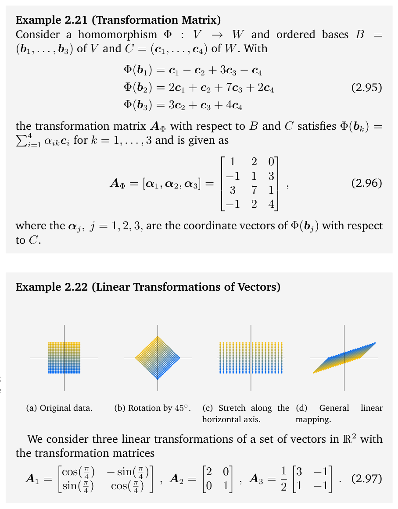

> **Figure 2.10** Three examples of linear transformations of the vectors shown as dots in (a); (b) Rotation by 45°; (c) Stretching of the horizontal coordinates by 2; (d) Combination of reflection, rotation and stretching.

**图 2.10** 对（a）中以点表示的向量作线性变换的三个例子；（b）旋转 45°；（c）水平坐标拉伸为 2 倍；（d）反射、旋转与拉伸的组合。

> We consider three linear transformations of a set of vectors in $\mathbb{R}^2$ with the transformation matrices

我们考虑 $\mathbb{R}^2$ 中一组向量的三个线性变换，所用的变换矩阵为

$$
A_1 =
\begin{pmatrix}
\cos\left(\frac{\pi}{4}\right) & -\sin\left(\frac{\pi}{4}\right) \\
\sin\left(\frac{\pi}{4}\right) & \cos\left(\frac{\pi}{4}\right)
\end{pmatrix},
\quad
A_2 =
\begin{pmatrix}
2 & 0 \\
0 & 1
\end{pmatrix},
\quad
A_3 = \frac{1}{2}
\begin{pmatrix}
3 & -1 \\
1 & -1
\end{pmatrix}.
\tag{2.97}
$$

> Figure 2.10 gives three examples of linear transformations of a set of vectors. Figure 2.10(a) shows 400 vectors in $\mathbb{R}^2$, each of which is represented by a dot at the corresponding $(x_1, x_2)$-coordinates. The vectors are arranged in a square. When we use matrix $A_1$ in (2.97) to linearly transform each of these vectors, we obtain the rotated square in Figure 2.10(b). If we apply the linear mapping represented by $A_2$, we obtain the rectangle in Figure 2.10(c) where each $x_1$-coordinate is stretched by 2. Figure 2.10(d) shows the original square from Figure 2.10(a) when linearly transformed using $A_3$, which is a combination of a reflection, a rotation, and a stretch.

图 2.10 给出了对一组向量进行线性变换的三个例子。图 2.10(a) 展示了 $\mathbb{R}^2$ 中的 400 个向量，每个向量都用在相应 $(x_1, x_2)$ 坐标处的一个点来表示，这些向量排列成一个正方形。当我们用 (2.97) 中的矩阵 $A_1$ 对这些向量逐个作线性变换时，就得到图 2.10(b) 中旋转后的正方形。如果施加 $A_2$ 所表示的线性映射，就得到图 2.10(c) 中的矩形，其中每个 $x_1$ 坐标都被拉伸了 2 倍。图 2.10(d) 展示的是图 2.10(a) 中的原始正方形经 $A_3$ 线性变换后的结果，$A_3$ 是反射、旋转和拉伸的组合。

### 2.7.2 基变换（Basis Change）

> In the following, we will have a closer look at how transformation matrices of a linear mapping $\Phi : V \to W$ change if we change the bases in $V$ and $W$. Consider two ordered bases

接下来，我们将更仔细地考察：如果改变 $V$ 与 $W$ 中的基，线性映射 $\Phi : V \to W$ 的变换矩阵会如何变化。考虑两个有序基

$$
B = (b_1, \ldots, b_n),
$$

> $\tilde{B} = (\tilde{b}_1, \ldots, \tilde{b}_n)$ (2.98) of V and two ordered bases

$\tilde{B} = (\tilde{b}_1, \ldots, \tilde{b}_n)$（2.98）为 $V$ 的有序基，以及另两组有序基

$$
C = (c_1, \ldots, c_m), \qquad \tilde{C} = (\tilde{c}_1, \ldots, \tilde{c}_m)
\tag{2.99}
$$

> of W. Moreover, $A_\Phi \in \mathbb{R}^{m \times n}$ is the transformation matrix of the linear mapping $\Phi : V \to W$ with respect to the bases $B$ and $C$, and $\tilde{A}_\Phi \in \mathbb{R}^{m \times n}$ is the corresponding transformation mapping with respect to $\tilde{B}$ and $\tilde{C}$. In the following, we will investigate how $A$ and $\tilde{A}$ are related, i.e., how/whether we can transform $A_\Phi$ into $\tilde{A}_\Phi$ if we choose to perform a basis change from $B$, $C$ to $\tilde{B}$, $\tilde{C}$.

为 $W$ 的有序基。此外，$A_\Phi \in \mathbb{R}^{m \times n}$ 是线性映射 $\Phi : V \to W$ 关于基 $B$ 和 $C$ 的变换矩阵，而 $\tilde{A}_\Phi \in \mathbb{R}^{m \times n}$ 是关于 $\tilde{B}$ 和 $\tilde{C}$ 的相应变换映射。下面我们将考察 $A$ 与 $\tilde{A}$ 之间的关系，即：如果选择进行基变换，把 $B$、$C$ 变为 $\tilde{B}$、$\tilde{C}$，我们能否把 $A_\Phi$ 变换为 $\tilde{A}_\Phi$。

> **Remark.** We effectively get different coordinate representations of the identity mapping $\operatorname{id}_V$. In the context of Figure 2.9, this would mean to map coordinates with respect to $(e_1, e_2)$ onto coordinates with respect to $(b_1, b_2)$ without changing the vector $x$. By changing the basis and correspondingly the representation of vectors, the transformation matrix with respect to this new basis can have a particularly simple form that allows for straightforward computation. ♢

**评注.** 我们实际上得到了恒等映射 $\operatorname{id}_V$ 的不同坐标表示。就图 2.9 而言，这意味着在不改变向量 $x$ 的情况下，把关于 $(e_1, e_2)$ 的坐标映射为关于 $(b_1, b_2)$ 的坐标。通过改变基并相应地改变向量的表示，关于这个新基的变换矩阵可以具有特别简单的形式，便于直接计算。♢

> **Example 2.23** (Basis Change) Consider a transformation matrix

**例 2.23**（基变换）考虑变换矩阵

$$
A = \begin{pmatrix}
2 & 1 \\
1 & 2
\end{pmatrix}
\tag{2.100}
$$

> with respect to the canonical basis in $\mathbb{R}^2$. If we define a new basis

它关于 $\mathbb{R}^2$ 中的典范基。如果我们定义一个新基

$$
\tilde{B} = \left( \begin{pmatrix} 1 \\ 1 \end{pmatrix}, \begin{pmatrix} 1 \\ -1 \end{pmatrix} \right)
\tag{2.101}
$$

> we obtain a diagonal transformation matrix

我们就得到一个对角的变换矩阵

$$
\tilde{A} = \begin{pmatrix}
3 & 0 \\
0 & 1
\end{pmatrix}
\tag{2.102}
$$

> with respect to $\tilde{B}$, which is easier to work with than $A$.

它关于 $\tilde{B}$，比 $A$ 更易于处理。

> In the following, we will look at mappings that transform coordinate vectors with respect to one basis into coordinate vectors with respect to a different basis. We will state our main result first and then provide an explanation.

下面，我们将考察把关于某一个基的坐标向量变换为关于另一个基的坐标向量的映射。我们先陈述主要结果，然后再给出解释。

> **Theorem 2.20** (Basis Change). For a linear mapping $\Phi : V \to W$, ordered bases

**定理 2.20**（基变换，Basis Change）。对于线性映射 $\Phi : V \to W$，有序基

$$
B = (b_1, \ldots, b_n), \qquad \tilde{B} = (\tilde{b}_1, \ldots, \tilde{b}_n)
\tag{2.103}
$$

> of V and

是 $V$ 的有序基，而

$$
C = (c_1, \ldots, c_m), \qquad \tilde{C} = (\tilde{c}_1, \ldots, \tilde{c}_m)
\tag{2.104}
$$

> of W, and a transformation matrix $A_\Phi$ of $\Phi$ with respect to $B$ and $C$, the corresponding transformation matrix $\tilde{A}_\Phi$ with respect to the bases $\tilde{B}$ and $\tilde{C}$ is given as

是 $W$ 的有序基，且 $A_\Phi$ 是 $\Phi$ 关于 $B$ 和 $C$ 的变换矩阵，那么关于基 $\tilde{B}$ 和 $\tilde{C}$ 的相应变换矩阵 $\tilde{A}_\Phi$ 由下式给出：

$$
\tilde{A}_\Phi = T^{-1} A_\Phi S.
\tag{2.105}
$$

> Here, $S \in \mathbb{R}^{n \times n}$ is the transformation matrix of $\operatorname{id}_V$ that maps coordinates with respect to $\tilde{B}$ onto coordinates with respect to $B$, and $T \in \mathbb{R}^{m \times m}$ is the transformation matrix of $\operatorname{id}_W$ that maps coordinates with respect to $\tilde{C}$ onto coordinates with respect to $C$.

其中，$S \in \mathbb{R}^{n \times n}$ 是 $\operatorname{id}_V$ 的变换矩阵，它把关于 $\tilde{B}$ 的坐标映射为关于 $B$ 的坐标；$T \in \mathbb{R}^{m \times m}$ 是 $\operatorname{id}_W$ 的变换矩阵，它把关于 $\tilde{C}$ 的坐标映射为关于 $C$ 的坐标。

> Proof

**证明.**

> Following Drumm and Weil (2001), we can write the vectors of the new basis $\tilde{B}$ of $V$ as a linear combination of the basis vectors of $B$, such that

沿用 Drumm and Weil (2001) 的做法，我们可以把 $V$ 的新基 $\tilde{B}$ 的向量写成 $B$ 的基向量的线性组合，即

$$
\tilde{b}_j = s_{1j} b_1 + \cdots + s_{nj} b_n = \sum_{i=1}^{n} s_{ij} b_i, \qquad j = 1, \ldots, n.
\tag{2.106}
$$

> Similarly, we write the new basis vectors $\tilde{C}$ of W as a linear combination of the basis vectors of $C$, which yields

类似地，我们把 $W$ 的新基向量 $\tilde{C}$ 写成 $C$ 的基向量的线性组合，得到

$$
\tilde{c}_k = t_{1k} c_1 + \cdots + t_{mk} c_m = \sum_{l=1}^{m} t_{lk} c_l, \qquad k = 1, \ldots, m.
\tag{2.107}
$$

> We define $S = ((s_{ij})) \in \mathbb{R}^{n \times n}$ as the transformation matrix that maps coordinates with respect to $\tilde{B}$ onto coordinates with respect to $B$ and $T = ((t_{lk})) \in \mathbb{R}^{m \times m}$ as the transformation matrix that maps coordinates with respect to $\tilde{C}$ onto coordinates with respect to $C$. In particular, the $j$th column of $S$ is the coordinate representation of $\tilde{b}_j$ with respect to $B$ and the $k$th column of $T$ is the coordinate representation of $\tilde{c}_k$ with respect to $C$. Note that both $S$ and $T$ are regular.

我们定义 $S = ((s_{ij})) \in \mathbb{R}^{n \times n}$ 为把关于 $\tilde{B}$ 的坐标映射为关于 $B$ 的坐标的变换矩阵，并定义 $T = ((t_{lk})) \in \mathbb{R}^{m \times m}$ 为把关于 $\tilde{C}$ 的坐标映射为关于 $C$ 的坐标的变换矩阵。特别地，$S$ 的第 $j$ 列是 $\tilde{b}_j$ 关于 $B$ 的坐标表示，$T$ 的第 $k$ 列是 $\tilde{c}_k$ 关于 $C$ 的坐标表示。注意 $S$ 和 $T$ 都是可逆的（regular）。

> We are going to look at $\Phi(\tilde{b}_j)$ from two perspectives. First, applying the mapping $\Phi$, we get that for all $j = 1, \ldots, n$

我们将从两个角度考察 $\Phi(\tilde{b}_j)$。首先，应用映射 $\Phi$，对所有 $j = 1, \ldots, n$，我们得到

$$
\Phi(\tilde{b}_j) = \sum_{k=1}^{m} \underbrace{\tilde{a}_{kj} \tilde{c}_k}_{\in W} \overset{(2.107)}{=} \sum_{k=1}^{m} \tilde{a}_{kj} \sum_{l=1}^{m} t_{lk} c_l = \sum_{l=1}^{m} \left( \sum_{k=1}^{m} t_{lk} \tilde{a}_{kj} \right) c_l,
\tag{2.108}
$$

> where we first expressed the new basis vectors $\tilde{c}_k \in W$ as linear combinations of the basis vectors $c_l \in W$ and then swapped the order of summation.

其中，我们先把新基向量 $\tilde{c}_k \in W$ 表示为基向量 $c_l \in W$ 的线性组合，再交换求和顺序。

> Alternatively, when we express the $\tilde{b}_j \in V$ as linear combinations of $b_i \in V$, we arrive at

或者，当我们把 $\tilde{b}_j \in V$ 表示为 $b_i \in V$ 的线性组合时，我们得到

$$
\Phi(\tilde{b}_j) = \Phi\left( \sum_{i=1}^{n} s_{ij} b_i \right) \overset{(2.106)}{=} \sum_{i=1}^{n} s_{ij} \Phi(b_i) = \sum_{i=1}^{n} s_{ij} \sum_{l=1}^{m} a_{li} c_l
\tag{2.109a}
$$

$$
= \sum_{l=1}^{m} \left( \sum_{i=1}^{n} a_{li} s_{ij} \right) c_l, \qquad j = 1, \ldots, n,
\tag{2.109b}
$$

> where we exploited the linearity of $\Phi$. Comparing (2.108) and (2.109b), it follows for all $j = 1, \ldots, n$ and $l = 1, \ldots, m$ that

其中我们利用了 $\Phi$ 的线性性。比较 (2.108) 与 (2.109b)，对所有 $j = 1, \ldots, n$ 和 $l = 1, \ldots, m$，可得

$$
\sum_{k=1}^{m} t_{lk} \tilde{a}_{kj} = \sum_{i=1}^{n} a_{li} s_{ij}
\tag{2.110}
$$

> and, therefore,

于是，

$$
T \tilde{A}_\Phi = A_\Phi S \in \mathbb{R}^{m \times n},
\tag{2.111}
$$

> such that

从而

$$
\tilde{A}_\Phi = T^{-1} A_\Phi S,
\tag{2.112}
$$

> which proves Theorem 2.20.

这就证明了定理 2.20。

> Theorem 2.20 tells us that with a basis change in $V$ ($B$ is replaced with $\tilde{B}$) and $W$ ($C$ is replaced with $\tilde{C}$), the transformation matrix $A_\Phi$ of a linear mapping $\Phi : V \to W$ is replaced by an equivalent matrix $\tilde{A}_\Phi$ with

定理 2.20 告诉我们，当在 $V$ 中（$B$ 被替换为 $\tilde{B}$）以及在 $W$ 中（$C$ 被替换为 $\tilde{C}$）进行基变换时，线性映射 $\Phi : V \to W$ 的变换矩阵 $A_\Phi$ 就被替换为一个等价的矩阵 $\tilde{A}_\Phi$，满足

$$
\tilde{A}_\Phi = T^{-1} A_\Phi S.
\tag{2.113}
$$

> Figure 2.11 illustrates this relation: Consider a homomorphism $\Phi : V \to W$ and ordered bases $B$, $\tilde{B}$ of $V$ and $C$, $\tilde{C}$ of $W$. The mapping $\Phi_{CB}$ is an instantiation of $\Phi$ and maps basis vectors of $B$ onto linear combinations of basis vectors of $C$. Assume that we know the transformation matrix $A_\Phi$ of $\Phi_{CB}$ with respect to the ordered bases $B$, $C$. When we perform a basis change from $B$ to $\tilde{B}$ in $V$ and from $C$ to $\tilde{C}$ in $W$, we can determine the

图 2.11 展示了这一关系：考虑一个同态（homomorphism）$\Phi : V \to W$ 以及 $V$ 的有序基 $B$、$\tilde{B}$ 和 $W$ 的有序基 $C$、$\tilde{C}$。映射 $\Phi_{CB}$ 是 $\Phi$ 的一个实例，它把 $B$ 的基向量映射为 $C$ 的基向量的线性组合。假设我们已知 $\Phi_{CB}$ 关于有序基 $B$、$C$ 的变换矩阵 $A_\Phi$。当我们在 $V$ 中把基从 $B$ 变为 $\tilde{B}$、在 $W$ 中把基从 $C$ 变为 $\tilde{C}$ 时，我们可以确定

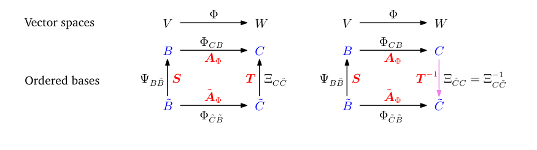

> **Figure 2.11** For a homomorphism $\Phi : V \to W$ and ordered bases $B$, $\tilde{B}$ of $V$ and $C$, $\tilde{C}$ of $W$ (marked in blue), we can express the mapping $\Phi_{\tilde{C}\tilde{B}}$ with respect to the bases $\tilde{B}$, $\tilde{C}$ equivalently as a composition of the homomorphisms $\Phi_{\tilde{C}\tilde{B}} = \Xi_{\tilde{C}C} \circ \Phi_{CB} \circ \Psi_{B\tilde{B}}$ with respect to the bases in the subscripts. The corresponding transformation matrices are in red.

**图 2.11** 对于同态 $\Phi : V \to W$ 以及 $V$ 的有序基 $B$、$\tilde{B}$ 和 $W$ 的有序基 $C$、$\tilde{C}$（以蓝色标记），我们可以把映射 $\Phi_{\tilde{C}\tilde{B}}$ 关于基 $\tilde{B}$、$\tilde{C}$ 的表达等价地写成诸同态的复合 $\Phi_{\tilde{C}\tilde{B}} = \Xi_{\tilde{C}C} \circ \Phi_{CB} \circ \Psi_{B\tilde{B}}$，各同态所用的基由其下标给出。相应的变换矩阵以红色标出。

> corresponding transformation matrix $\tilde{A}_\Phi$ as follows: First, we find the matrix representation of the linear mapping $\Psi_{B\tilde{B}} : V \to V$ that maps coordinates with respect to the new basis $\tilde{B}$ onto the (unique) coordinates with respect to the “old” basis $B$ (in $V$). Then, we use the transformation matrix $A_\Phi$ of $\Phi_{CB} : V \to W$ to map these coordinates onto the coordinates with respect to $C$ in $W$. Finally, we use a linear mapping $\Xi_{\tilde{C}C} : W \to W$ to map the coordinates with respect to $C$ onto coordinates with respect to $\tilde{C}$. Therefore, we can express the linear mapping $\Phi_{\tilde{C}\tilde{B}}$ as a composition of linear mappings that involve the “old” basis:

相应的变换矩阵 $\tilde{A}_\Phi$：首先，我们求出线性映射 $\Psi_{B\tilde{B}} : V \to V$ 的矩阵表示，该映射把关于新基 $\tilde{B}$ 的坐标映射为（唯一的）关于“旧”基 $B$ 的坐标（在 $V$ 中）。然后，我们利用 $\Phi_{CB} : V \to W$ 的变换矩阵 $A_\Phi$ 把这些坐标映射为 $W$ 中关于 $C$ 的坐标。最后，我们利用线性映射 $\Xi_{\tilde{C}C} : W \to W$ 把关于 $C$ 的坐标映射为关于 $\tilde{C}$ 的坐标。因此，我们可以把线性映射 $\Phi_{\tilde{C}\tilde{B}}$ 表示为涉及“旧”基的线性映射的复合：

$$
\Phi_{\tilde{C}\tilde{B}} = \Xi_{\tilde{C}C} \circ \Phi_{CB} \circ \Psi_{B\tilde{B}} = \Xi_{C\tilde{C}}^{-1} \circ \Phi_{CB} \circ \Psi_{B\tilde{B}}.
\tag{2.114}
$$

> Concretely, we use $\Psi_{B\tilde{B}} = \operatorname{id}_V$ and $\Xi_{C\tilde{C}} = \operatorname{id}_W$, i.e., the identity mappings that map vectors onto themselves, but with respect to a different basis.

具体而言，我们取 $\Psi_{B\tilde{B}} = \operatorname{id}_V$、$\Xi_{C\tilde{C}} = \operatorname{id}_W$，即把向量映射为它们自身的恒等映射，只不过是相对于不同的基。

> **Definition 2.21** (Equivalence). Two matrices $A$, $\tilde{A} \in \mathbb{R}^{m \times n}$ are equivalent if there exist regular matrices $S \in \mathbb{R}^{n \times n}$ and $T \in \mathbb{R}^{m \times m}$, such that $\tilde{A} = T^{-1} A S$.

**定义 2.21**（等价，Equivalence）。两个矩阵 $A$、$\tilde{A} \in \mathbb{R}^{m \times n}$ 称为等价的（equivalent），如果存在可逆矩阵 $S \in \mathbb{R}^{n \times n}$ 和 $T \in \mathbb{R}^{m \times m}$，使得 $\tilde{A} = T^{-1} A S$。

> **Definition 2.22** (Similarity). Two matrices $A$, $\tilde{A} \in \mathbb{R}^{n \times n}$ are similar if there exists a regular matrix $S \in \mathbb{R}^{n \times n}$ with $\tilde{A} = S^{-1} A S$

**定义 2.22**（相似，Similarity）。两个矩阵 $A$、$\tilde{A} \in \mathbb{R}^{n \times n}$ 称为相似的（similar），如果存在一个可逆矩阵 $S \in \mathbb{R}^{n \times n}$ 使得 $\tilde{A} = S^{-1} A S$

> **Remark.** Similar matrices are always equivalent. However, equivalent matrices are not necessarily similar. ♢

**评注.** 相似矩阵总是等价的。然而，等价矩阵不一定相似。♢

> **Remark.** Consider vector spaces $V$, $W$, $X$. From the remark that follows Theorem 2.17, we already know that for linear mappings $\Phi : V \to W$ and $\Psi : W \to X$ the mapping $\Psi \circ \Phi : V \to X$ is also linear. With transformation matrices $A_\Phi$ and $A_\Psi$ of the corresponding mappings, the overall transformation matrix is $A_{\Psi\circ\Phi} = A_\Psi A_\Phi$. ♢

**评注.** 考虑向量空间 $V$、$W$、$X$。由定理 2.17 之后的评注可知，对于线性映射 $\Phi : V \to W$ 和 $\Psi : W \to X$，映射 $\Psi \circ \Phi : V \to X$ 也是线性的。用 $A_\Phi$ 和 $A_\Psi$ 表示相应映射的变换矩阵，则总的变换矩阵为 $A_{\Psi\circ\Phi} = A_\Psi A_\Phi$。♢

> In light of this remark, we can look at basis changes from the perspective of composing linear mappings:

有鉴于此，我们可以从复合线性映射的视角来看待基变换：

> $A_\Phi$ is the transformation matrix of a linear mapping $\Phi_{CB} : V \to W$ with respect to the bases $B$, $C$.

$A_\Phi$ 是线性映射 $\Phi_{CB} : V \to W$ 关于基 $B$、$C$ 的变换矩阵。

> $\tilde{A}_\Phi$ is the transformation matrix of the linear mapping $\Phi_{\tilde{C}\tilde{B}} : V \to W$ with respect to the bases $\tilde{B}$, $\tilde{C}$.

$\tilde{A}_\Phi$ 是线性映射 $\Phi_{\tilde{C}\tilde{B}} : V \to W$ 关于基 $\tilde{B}$、$\tilde{C}$ 的变换矩阵。

> $S$ is the transformation matrix of a linear mapping $\Psi_{B\tilde{B}} : V \to V$ (automorphism) that represents $\tilde{B}$ in terms of $B$. Normally, $\Psi = \operatorname{id}_V$ is the identity mapping in $V$.

$S$ 是线性映射 $\Psi_{B\tilde{B}} : V \to V$（自同构，automorphism）的变换矩阵，它用 $B$ 来表示 $\tilde{B}$。通常 $\Psi = \operatorname{id}_V$ 是 $V$ 中的恒等映射。

> $T$ is the transformation matrix of a linear mapping $\Xi_{C\tilde{C}} : W \to W$ (automorphism) that represents $\tilde{C}$ in terms of $C$. Normally, $\Xi = \operatorname{id}_W$ is the identity mapping in $W$.

$T$ 是线性映射 $\Xi_{C\tilde{C}} : W \to W$（自同构）的变换矩阵，它用 $C$ 来表示 $\tilde{C}$。通常 $\Xi = \operatorname{id}_W$ 是 $W$ 中的恒等映射。

> If we (informally) write down the transformations just in terms of bases, then $A_\Phi : B \to C$, $\tilde{A}_\Phi : \tilde{B} \to \tilde{C}$, $S : \tilde{B} \to B$, $T : \tilde{C} \to C$ and $T^{-1} : C \to \tilde{C}$, and

如果我们（非正式地）仅用基来写出这些变换，那么有 $A_\Phi : B \to C$、$\tilde{A}_\Phi : \tilde{B} \to \tilde{C}$、$S : \tilde{B} \to B$、$T : \tilde{C} \to C$ 以及 $T^{-1} : C \to \tilde{C}$，且

$$
\tilde{B} \to \tilde{C} = \tilde{B} \to B \to C \to \tilde{C}
\tag{2.115}
$$

$$
\tilde{A}_\Phi = T^{-1} A_\Phi S.
\tag{2.116}
$$

> Note that the execution order in (2.116) is from right to left because vectors are multiplied at the right-hand side so that $x \mapsto Sx \mapsto A_\Phi(Sx) \mapsto T^{-1} A_\Phi(Sx) = \tilde{A}_\Phi x$.

注意，(2.116) 的执行顺序是从右到左，因为向量是在右侧相乘的，于是 $x \mapsto Sx \mapsto A_\Phi(Sx) \mapsto T^{-1} A_\Phi(Sx) = \tilde{A}_\Phi x$。

> **Example 2.24** (Basis Change) Consider a linear mapping $\Phi : \mathbb{R}^3 \to \mathbb{R}^4$ whose transformation matrix is

**例 2.24**（基变换）考虑线性映射 $\Phi : \mathbb{R}^3 \to \mathbb{R}^4$，其变换矩阵为

$$
A_\Phi = \begin{pmatrix}
1 & 2 & 0 \\
-1 & 1 & 3 \\
3 & 7 & 1 \\
-1 & 2 & 4
\end{pmatrix}
\tag{2.117}
$$

> with respect to the standard bases

它关于以下标准基：

$$
B = \left( \begin{pmatrix} 1 \\ 0 \\ 0 \end{pmatrix}, \begin{pmatrix} 0 \\ 1 \\ 0 \end{pmatrix}, \begin{pmatrix} 0 \\ 0 \\ 1 \end{pmatrix} \right), \qquad C = \left( \begin{pmatrix} 1 \\ 0 \\ 0 \\ 0 \end{pmatrix}, \begin{pmatrix} 0 \\ 1 \\ 0 \\ 0 \end{pmatrix}, \begin{pmatrix} 0 \\ 0 \\ 1 \\ 0 \end{pmatrix}, \begin{pmatrix} 0 \\ 0 \\ 0 \\ 1 \end{pmatrix} \right)
\tag{2.118}
$$

> We seek the transformation matrix $\tilde{A}_\Phi$ of $\Phi$ with respect to the new bases

我们想求 $\Phi$ 关于新基的变换矩阵 $\tilde{A}_\Phi$

$$
\tilde{B} = \left( \begin{pmatrix} 1 \\ 1 \\ 0 \end{pmatrix}, \begin{pmatrix} 0 \\ 1 \\ 1 \end{pmatrix}, \begin{pmatrix} 1 \\ 0 \\ 1 \end{pmatrix} \right) \in \mathbb{R}^3, \qquad \tilde{C} = \left( \begin{pmatrix} 1 \\ 1 \\ 0 \\ 0 \end{pmatrix}, \begin{pmatrix} 1 \\ 0 \\ 1 \\ 0 \end{pmatrix}, \begin{pmatrix} 0 \\ 1 \\ 1 \\ 0 \end{pmatrix}, \begin{pmatrix} 1 \\ 0 \\ 0 \\ 1 \end{pmatrix} \right).
\tag{2.119}
$$

> Then,

于是，

$$
T = \begin{pmatrix}
1 & 1 & 0 & 1 \\
1 & 0 & 1 & 0 \\
0 & 1 & 1 & 0 \\
0 & 0 & 0 & 1
\end{pmatrix}, \qquad S = \begin{pmatrix}
1 & 0 & 1 \\
1 & 1 & 0 \\
0 & 1 & 1
\end{pmatrix},
\tag{2.120}
$$

> where the $i$th column of $S$ is the coordinate representation of $\tilde{b}_i$ in terms of the basis vectors of $B$. Since $B$ is the standard basis, the coordinate representation is straightforward to find. For a general basis $B$, we would need to solve a linear equation system to find the $\lambda_i$ such that $\sum_{i=1}^{3} \lambda_i b_i = \tilde{b}_j$, $j = 1, \ldots, 3$. Similarly, the $j$th column of $T$ is the coordinate representation of $\tilde{c}_j$ in terms of the basis vectors of $C$.

其中 $S$ 的第 $i$ 列是 $\tilde{b}_i$ 关于 $B$ 的基向量的坐标表示。由于 $B$ 是标准基，坐标表示很容易求出。对于一般的基 $B$，我们需要求解一个线性方程组来找到使 $\sum_{i=1}^{3} \lambda_i b_i = \tilde{b}_j$（$j = 1, \ldots, 3$）成立的 $\lambda_i$。类似地，$T$ 的第 $j$ 列是 $\tilde{c}_j$ 关于 $C$ 的基向量的坐标表示。

> Therefore, we obtain

于是，我们得到

$$
\tilde{A}_\Phi = T^{-1} A_\Phi S = \frac{1}{2} \begin{pmatrix}
1 & 1 & -1 & -1 \\
1 & -1 & 1 & -1 \\
-1 & 1 & 1 & 1 \\
0 & 0 & 0 & 2
\end{pmatrix} \begin{pmatrix}
3 & 2 & 1 \\
0 & 4 & 2 \\
10 & 8 & 4 \\
1 & 6 & 3
\end{pmatrix}
\tag{2.121a}
$$

$$
= \begin{pmatrix}
-4 & -4 & -2 \\
6 & 0 & 0 \\
4 & 8 & 4 \\
1 & 6 & 3
\end{pmatrix}.
\tag{2.121b}
$$

> In Chapter 4, we will be able to exploit the concept of a basis change to find a basis with respect to which the transformation matrix of an endomorphism has a particularly simple (diagonal) form. In Chapter 10, we will look at a data compression problem and find a convenient basis onto which we can project the data while minimizing the compression loss.

在第 4 章中，我们将能够利用基变换的概念来寻找一组基，使得自同态的变换矩阵相对于这组基具有特别简单（对角）的形式。在第 10 章中，我们将考察一个数据压缩问题，并找到一组方便的基，可以把数据投影到这组基上，同时使压缩损失最小。

### 2.7.3 像与核（Image and Kernel）

> The image and kernel of a linear mapping are vector subspaces with certain important properties. In the following, we will characterize them more carefully.

线性映射的像与核是具有某些重要性质的向量子空间。下面我们将更仔细地刻画它们。

> **Definition 2.23** (Image and Kernel). For $\Phi : V \to W$, we define the kernel/null space

**定义 2.23**（像与核，Image and Kernel）。对于 $\Phi : V \to W$，我们定义核/零空间

$$
\ker(\Phi) := \Phi^{-1}(0_W) = \{v \in V : \Phi(v) = 0_W\}
\tag{2.122}
$$

> and the image/range

以及像/值域（range）

$$
\operatorname{Im}(\Phi) := \Phi(V) = \{w \in W \mid \exists v \in V : \Phi(v) = w\} \, .
\tag{2.123}
$$

> We also call $V$ and $W$ the domain and codomain of $\Phi$, respectively.

我们也把 $V$ 和 $W$ 分别称为 $\Phi$ 的定义域（domain）和陪域（codomain）。

> Intuitively, the kernel is the set of vectors $v \in V$ that $\Phi$ maps onto the neutral element $0_W \in W$. The image is the set of vectors $w \in W$ that can be “reached” by $\Phi$ from any vector in $V$. An illustration is given in Figure 2.12.

直观地说，核就是被 $\Phi$ 映射到中性元素 $0_W \in W$ 上的那些向量 $v \in V$ 组成的集合。像是能够被 $\Phi$ 从 $V$ 中任一向量“到达”的那些向量 $w \in W$ 组成的集合。图 2.12 给出了一个图示。

> Remark. Consider a linear mapping $\Phi : V \to W$, where $V, W$ are vector spaces. It always holds that $\Phi(0_V) = 0_W$ and, therefore, $0_V \in \ker(\Phi)$. In particular, the null space is never empty. $\operatorname{Im}(\Phi) \subseteq W$ is a subspace of $W$, and $\ker(\Phi) \subseteq V$ is a subspace of $V$.

评注. 考虑线性映射 $\Phi : V \to W$，其中 $V, W$ 是向量空间。总有 $\Phi(0_V) = 0_W$，因此 $0_V \in \ker(\Phi)$。特别地，零空间绝不是空集。$\operatorname{Im}(\Phi) \subseteq W$ 是 $W$ 的一个子空间，而 $\ker(\Phi) \subseteq V$ 是 $V$ 的一个子空间。

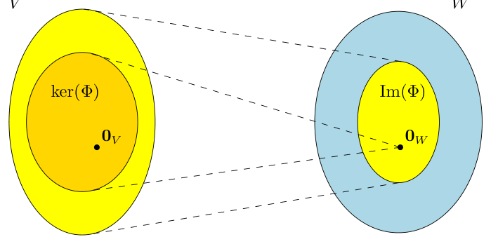

> **Figure 2.12** Kernel and image of a linear mapping $\Phi : V \to W$.

**图 2.12** 线性映射 $\Phi : V \to W$ 的核与像。

> $\Phi$ is injective (one-to-one) if and only if $\ker(\Phi) = \{0\}$. ♢

$\Phi$ 是单射（一一映射）当且仅当 $\ker(\Phi) = \{0\}$。♢

> Remark (Null Space and Column Space). Let us consider $A \in \mathbb{R}^{m \times n}$ and a linear mapping $\Phi : \mathbb{R}^n \to \mathbb{R}^m$, $x \mapsto Ax$.

评注（零空间与列空间）。考虑 $A \in \mathbb{R}^{m \times n}$ 以及线性映射 $\Phi : \mathbb{R}^n \to \mathbb{R}^m$，$x \mapsto Ax$。

> For $A = [a_1, \ldots, a_n]$, where $a_i$ are the columns of $A$, we obtain

设 $A = [a_1, \ldots, a_n]$，其中 $a_i$ 是 $A$ 的各列，我们得到

$$
\operatorname{Im}(\Phi) = \{Ax : x \in \mathbb{R}^n\} = \left\{ \sum_{i=1}^{n} x_i a_i : x_1, \ldots, x_n \in \mathbb{R} \right\}
\tag{2.124a}
$$

$$
= \operatorname{span}[a_1, \ldots, a_n] \subseteq \mathbb{R}^m \, ,
\tag{2.124b}
$$

> i.e., the image is the span of the columns of $A$, also called the column space. Therefore, the column space (image) is a subspace of $\mathbb{R}^m$, where $m$ is the “height” of the matrix. $\operatorname{rk}(A) = \dim(\operatorname{Im}(\Phi))$. The kernel/null space $\ker(\Phi)$ is the general solution to the homogeneous system of linear equations $Ax = 0$ and captures all possible linear combinations of the elements in $\mathbb{R}^n$ that produce $0 \in \mathbb{R}^m$. The kernel is a subspace of $\mathbb{R}^n$, where $n$ is the “width” of the matrix. The kernel focuses on the relationship among the columns, and we can use it to determine whether/how we can express a column as a linear combination of other columns. ♢

也就是说，像是 $A$ 的各列的张成，也称为列空间（column space）。因此，列空间（像）是 $\mathbb{R}^m$ 的一个子空间，其中 $m$ 是矩阵的“高度”。$\operatorname{rk}(A) = \dim(\operatorname{Im}(\Phi))$。核/零空间 $\ker(\Phi)$ 是齐次线性方程组 $Ax = 0$ 的通解，它涵盖了 $\mathbb{R}^n$ 中所有能产生 $0 \in \mathbb{R}^m$ 的线性组合。核是 $\mathbb{R}^n$ 的一个子空间，其中 $n$ 是矩阵的“宽度”。核关注的是各列之间的关系，我们可以用它来确定能否把某一列表示成其他列的线性组合，以及如何表示。♢

> Example 2.25 (Image and Kernel of a Linear Mapping)

例 2.25（线性映射的像与核）

> The mapping

映射

$$
\Phi : \mathbb{R}^4 \to \mathbb{R}^2, \quad
\begin{pmatrix} x_1 \\ x_2 \\ x_3 \\ x_4 \end{pmatrix}
\mapsto
\begin{pmatrix} 1 & 2 & -1 & 0 \\ 1 & 0 & 0 & 1 \end{pmatrix}
\begin{pmatrix} x_1 \\ x_2 \\ x_3 \\ x_4 \end{pmatrix}
= \begin{pmatrix} x_1 + 2x_2 - x_3 \\ x_1 + x_4 \end{pmatrix}
\tag{2.125a}
$$

$$
= x_1 \begin{pmatrix} 1 \\ 1 \end{pmatrix}
+ x_2 \begin{pmatrix} 2 \\ 0 \end{pmatrix}
+ x_3 \begin{pmatrix} -1 \\ 0 \end{pmatrix}
+ x_4 \begin{pmatrix} 0 \\ 1 \end{pmatrix}
\tag{2.125b}
$$

> is linear. To determine $\operatorname{Im}(\Phi)$, we can take the span of the columns of the transformation matrix and obtain

是线性的。为了确定 $\operatorname{Im}(\Phi)$，我们可以取变换矩阵各列的张成，得到

$$
\operatorname{Im}(\Phi) = \operatorname{span}\left[
\begin{pmatrix} 1 \\ 1 \end{pmatrix},
\begin{pmatrix} 2 \\ 0 \end{pmatrix},
\begin{pmatrix} -1 \\ 0 \end{pmatrix},
\begin{pmatrix} 0 \\ 1 \end{pmatrix}
\right] .
\tag{2.126}
$$

> To compute the kernel (null space) of $\Phi$, we need to solve $Ax = 0$, i.e., we need to solve a homogeneous equation system. To do this, we use Gaussian elimination to transform $A$ into reduced row-echelon form:

为了计算 $\Phi$ 的核（零空间），我们需要求解 $Ax = 0$，也就是求解一个齐次方程组。为此，我们利用高斯消元把 $A$ 化为简化行阶梯形：

$$
\begin{pmatrix} 1 & 2 & -1 & 0 \\ 1 & 0 & 0 & 1 \end{pmatrix}
\rightsquigarrow \cdots \rightsquigarrow
\begin{pmatrix} 1 & 0 & 0 & 1 \\ 0 & 1 & -\frac{1}{2} & -\frac{1}{2} \end{pmatrix} .
\tag{2.127}
$$

> This matrix is in reduced row-echelon form, and we can use the Minus 1 Trick to compute a basis of the kernel (see Section 2.3.3). Alternatively, we can express the non-pivot columns (columns 3 and 4) as linear combinations of the pivot columns (columns 1 and 2). The third column $a_3$ is equivalent to $-\frac{1}{2}$ times the second column $a_2$. Therefore, $0 = a_3 + \frac{1}{2} a_2$. In the same way, we see that $a_4 = a_1 - \frac{1}{2} a_2$ and, therefore, $0 = a_1 - \frac{1}{2} a_2 - a_4$. Overall, this gives us the kernel (null space) as

这个矩阵是简化行阶梯形，我们可以用减 1 技巧来计算核的一组基（见 2.3.3 节）。或者，我们也可以把非主列（第 3 列和第 4 列）表示成主列（第 1 列和第 2 列）的线性组合。第三列 $a_3$ 相当于第二列 $a_2$ 的 $-\frac{1}{2}$ 倍，因此 $0 = a_3 + \frac{1}{2} a_2$。同样地，可以看到 $a_4 = a_1 - \frac{1}{2} a_2$，因此 $0 = a_1 - \frac{1}{2} a_2 - a_4$。总之，我们得到核（零空间）为

$$
\ker(\Phi) = \operatorname{span}\left[
\begin{pmatrix} -1 \\ \frac{1}{2} \\ 0 \\ 1 \end{pmatrix},
\begin{pmatrix} 0 \\ \frac{1}{2} \\ 1 \\ 0 \end{pmatrix}
\right] .
\tag{2.128}
$$

> **Theorem 2.24** (Rank-Nullity Theorem). For vector spaces $V, W$ and a linear mapping $\Phi : V \to W$ it holds that

**定理 2.24**（秩-零化度定理，Rank-Nullity Theorem）。对于向量空间 $V, W$ 以及线性映射 $\Phi : V \to W$，下式成立

$$
\dim(\ker(\Phi)) + \dim(\operatorname{Im}(\Phi)) = \dim(V) \, .
\tag{2.129}
$$

> The rank-nullity theorem is also referred to as the fundamental theorem of linear mappings (Axler, 2015, theorem 3.22). The following are direct consequences of Theorem 2.24:

秩-零化度定理也称为线性映射的基本定理（fundamental theorem of linear mappings）(Axler, 2015, theorem 3.22)。定理 2.24 有以下直接推论：

> If $\dim(\operatorname{Im}(\Phi)) < \dim(V)$, then $\ker(\Phi)$ is non-trivial, i.e., the kernel contains more than $0_V$ and $\dim(\ker(\Phi)) \geqslant 1$. If $A_\Phi$ is the transformation matrix of $\Phi$ with respect to an ordered basis and $\dim(\operatorname{Im}(\Phi)) < \dim(V)$, then the system of linear equations $A_\Phi x = 0$ has infinitely many solutions. If $\dim(V) = \dim(W)$, then the three-way equivalence

如果 $\dim(\operatorname{Im}(\Phi)) < \dim(V)$，那么 $\ker(\Phi)$ 是非平凡的，也就是说，核中包含的不只是 $0_V$，并且 $\dim(\ker(\Phi)) \geqslant 1$。如果 $A_\Phi$ 是 $\Phi$ 相对于某组有序基的变换矩阵，且 $\dim(\operatorname{Im}(\Phi)) < \dim(V)$，那么线性方程组 $A_\Phi x = 0$ 有无穷多个解。如果 $\dim(V) = \dim(W)$，则有如下三向等价

$$
\Phi \text{ is injective}
\quad\Longleftrightarrow\quad
\Phi \text{ is surjective}
\quad\Longleftrightarrow\quad
\Phi \text{ is bijective}
$$

> holds since $\operatorname{Im}(\Phi) \subseteq W$.

成立，因为 $\operatorname{Im}(\Phi) \subseteq W$。

## 2.8 仿射空间（Affine Spaces）

> In the following, we will take a closer look at spaces that are offset from the origin, i.e., spaces that are no longer vector subspaces. Moreover, we will briefly discuss properties of mappings between these affine spaces, which resemble linear mappings.

接下来，我们将更仔细地考察偏离原点的空间，即不再是向量子空间的空间。此外，我们还将简要讨论这些仿射空间（affine space）之间的映射的性质，这类映射与线性映射类似。

> Remark. In the machine learning literature, the distinction between linear and affine is sometimes not clear so that we can find references to affine spaces/mappings as linear spaces/mappings. ♢

评注. 在机器学习文献中，线性与仿射的区别有时并不清晰，因此我们会发现一些文献将仿射空间/仿射映射（affine mapping）称作线性空间/线性映射。♢

### 2.8.1 仿射子空间（Affine Subspaces）

> **Definition 2.25** (Affine Subspace). Let $V$ be a vector space, $x_0 \in V$ and $U \subseteq V$ a subspace. Then the subset

**定义 2.25**（仿射子空间，Affine Subspace）。设 $V$ 是一个向量空间，$x_0 \in V$，$U \subseteq V$ 为一个子空间。那么子集

$$
L = x_0 + U := \{x_0 + u : u \in U\}
\tag{2.130a}
$$

$$
= \{v \in V \mid \exists u \in U : v = x_0 + u\} \subseteq V
\tag{2.130b}
$$

> is called affine subspace or linear manifold of $V$. $U$ is called direction or direction space, and $x_0$ is called support point. In Chapter 12, we refer to such a subspace as a hyperplane.

称为 $V$ 的仿射子空间（affine subspace）或线性流形（linear manifold）。$U$ 称为方向（direction）或方向空间（direction space），$x_0$ 称为支撑点（support point）。在第 12 章中，我们将这样的子空间称为超平面（hyperplane）。

> Note that the definition of an affine subspace excludes $0$ if $x_0 \notin U$. Therefore, an affine subspace is not a (linear) subspace (vector subspace) of $V$ for $x_0 \notin U$.

注意，当 $x_0 \notin U$ 时，仿射子空间的定义排除了 $0$。因此，当 $x_0 \notin U$ 时，仿射子空间不是 $V$ 的（线性）子空间（向量子空间）。

> Examples of affine subspaces are points, lines, and planes in $\mathbb{R}^3$, which do not (necessarily) go through the origin.

仿射子空间的例子有 $\mathbb{R}^3$ 中的点、直线和平面，它们（不一定）过原点。

> Remark. Consider two affine subspaces $L = x_0 + U$ and $\tilde{L} = \tilde{x}_0 + \tilde{U}$ of a vector space $V$. Then, $L \subseteq \tilde{L}$ if and only if $U \subseteq \tilde{U}$ and $x_0 - \tilde{x}_0 \in \tilde{U}$.

评注. 考虑向量空间 $V$ 的两个仿射子空间 $L = x_0 + U$ 与 $\tilde{L} = \tilde{x}_0 + \tilde{U}$，那么 $L \subseteq \tilde{L}$ 当且仅当 $U \subseteq \tilde{U}$ 且 $x_0 - \tilde{x}_0 \in \tilde{U}$。

> Affine subspaces are often described by parameters: Consider a $k$-dimensional affine space $L = x_0 + U$ of $V$. If $(b_1, \ldots, b_k)$ is an ordered basis of $U$, then every element $x \in L$ can be uniquely described as

仿射子空间常用参数来描述：考虑 $V$ 的一个 $k$ 维仿射空间 $L = x_0 + U$。如果 $(b_1, \ldots, b_k)$ 是 $U$ 的一组有序基，那么 $L$ 中的每个元素 $x \in L$ 都可以唯一地表示为

$$
x = x_0 + \lambda_1 b_1 + \ldots + \lambda_k b_k \, ,
\tag{2.131}
$$

> where $\lambda_1, \ldots, \lambda_k \in \mathbb{R}$. This representation is called parametric equation of $L$ with directional vectors $b_1, \ldots, b_k$ and parameters $\lambda_1, \ldots, \lambda_k$. ♢

其中 $\lambda_1, \ldots, \lambda_k \in \mathbb{R}$。这种表示称为 $L$ 的参数方程（parametric equation），其方向向量为 $b_1, \ldots, b_k$，参数为 $\lambda_1, \ldots, \lambda_k$。♢

> Example 2.26 (Affine Subspaces)

例 2.26（仿射子空间）

> One-dimensional affine subspaces are called lines and can be written as $y = x_0 + \lambda b_1$, where $\lambda \in \mathbb{R}$ and $U = \operatorname{span}[b_1] \subseteq \mathbb{R}^n$ is a one-dimensional subspace of $\mathbb{R}^n$. This means that a line is defined by a support point $x_0$ and a vector $b_1$ that defines the direction. See Figure 2.13 for an illustration.

一维仿射子空间称为直线（line），可写作 $y = x_0 + \lambda b_1$，其中 $\lambda \in \mathbb{R}$，且 $U = \operatorname{span}[b_1] \subseteq \mathbb{R}^n$ 是 $\mathbb{R}^n$ 的一维子空间。这意味着直线由支撑点 $x_0$ 和一个确定方向的向量 $b_1$ 定义。参见图 2.13 中的示意。

> Two-dimensional affine subspaces of $\mathbb{R}^n$ are called planes. The parametric equation for planes is $y = x_0 + \lambda_1 b_1 + \lambda_2 b_2$, where $\lambda_1, \lambda_2 \in \mathbb{R}$ and $U = \operatorname{span}[b_1, b_2] \subseteq \mathbb{R}^n$. This means that a plane is defined by a support point $x_0$ and two linearly independent vectors $b_1, b_2$ that span the direction space. In $\mathbb{R}^n$, the $(n-1)$-dimensional affine subspaces are called hyperplanes, and the corresponding parametric equation is $y = x_0 + \sum_{i=1}^{n-1} \lambda_i b_i$, where $b_1, \ldots, b_{n-1}$ form a basis of an $(n-1)$-dimensional subspace $U$ of $\mathbb{R}^n$. This means that a hyperplane is defined by a support point $x_0$ and $(n-1)$ linearly independent vectors $b_1, \ldots, b_{n-1}$ that span the direction space. In $\mathbb{R}^2$, a line is also a hyperplane. In $\mathbb{R}^3$, a plane is also a hyperplane.

$\mathbb{R}^n$ 中的二维仿射子空间称为平面（plane）。平面的参数方程为 $y = x_0 + \lambda_1 b_1 + \lambda_2 b_2$，其中 $\lambda_1, \lambda_2 \in \mathbb{R}$，$U = \operatorname{span}[b_1, b_2] \subseteq \mathbb{R}^n$。这意味着平面由支撑点 $x_0$ 和两个张成方向空间的线性无关向量 $b_1, b_2$ 定义。在 $\mathbb{R}^n$ 中，$(n-1)$ 维仿射子空间称为超平面，对应的参数方程为 $y = x_0 + \sum_{i=1}^{n-1} \lambda_i b_i$，其中 $b_1, \ldots, b_{n-1}$ 构成 $\mathbb{R}^n$ 的一个 $(n-1)$ 维子空间 $U$ 的一组基。这意味着超平面由支撑点 $x_0$ 和 $(n-1)$ 个张成方向空间的线性无关向量 $b_1, \ldots, b_{n-1}$ 定义。在 $\mathbb{R}^2$ 中，直线也是超平面；在 $\mathbb{R}^3$ 中，平面也是超平面。

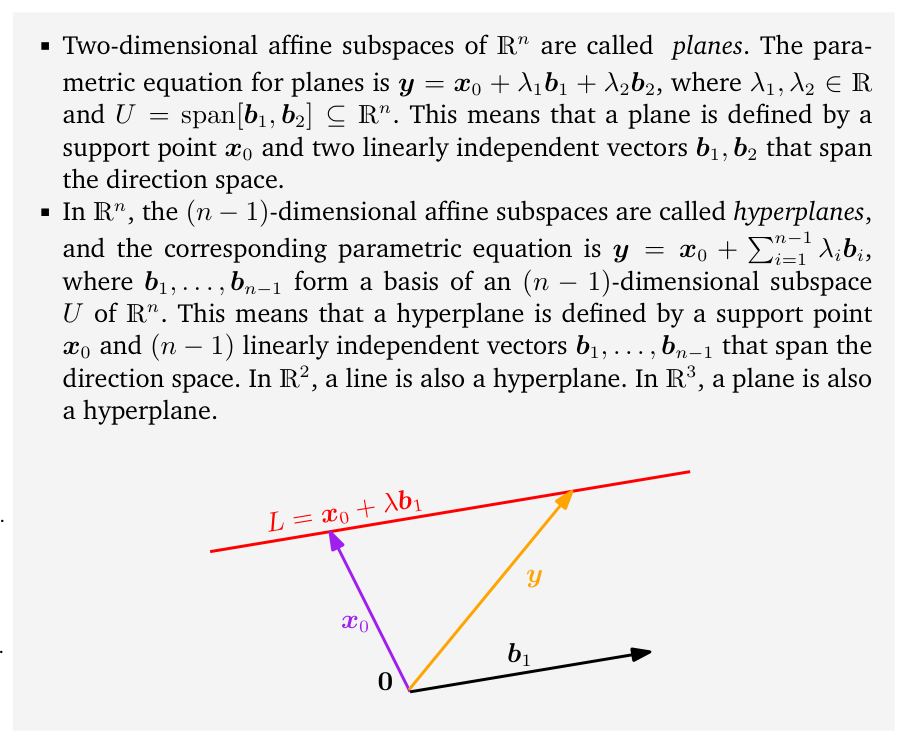

> **Figure 2.13** Lines are affine subspaces. Vectors $y$ on a line $x_0 + \lambda b_1$ lie in an affine subspace $L$ with support point $x_0$ and direction $b_1$.

**图 2.13** 直线是仿射子空间。直线 $x_0 + \lambda b_1$ 上的向量 $y$ 位于仿射子空间 $L$ 中，其中 $x_0$ 为支撑点，$b_1$ 为方向。

> Remark (Inhomogeneous systems of linear equations and affine subspaces). For $A \in \mathbb{R}^{m \times n}$ and $x \in \mathbb{R}^m$, the solution of the system of linear equations $A\lambda = x$ is either the empty set or an affine subspace of $\mathbb{R}^n$ of dimension $n - \operatorname{rk}(A)$. In particular, the solution of the linear equation $\lambda_1 b_1 + \ldots + \lambda_n b_n = x$, where $(\lambda_1, \ldots, \lambda_n) \neq (0, \ldots, 0)$, is a hyperplane in $\mathbb{R}^n$.

评注（非齐次线性方程组与仿射子空间）。设 $A \in \mathbb{R}^{m \times n}$，$x \in \mathbb{R}^m$，线性方程组 $A\lambda = x$ 的解要么是空集，要么是 $\mathbb{R}^n$ 中维度为 $n - \operatorname{rk}(A)$ 的仿射子空间。特别地，线性方程 $\lambda_1 b_1 + \ldots + \lambda_n b_n = x$（其中 $(\lambda_1, \ldots, \lambda_n) \neq (0, \ldots, 0)$）的解是 $\mathbb{R}^n$ 中的一个超平面。

> In $\mathbb{R}^n$, every $k$-dimensional affine subspace is the solution of an inhomogeneous system of linear equations $Ax = b$, where $A \in \mathbb{R}^{m \times n}$, $b \in \mathbb{R}^m$ and $\operatorname{rk}(A) = n - k$. Recall that for homogeneous equation systems $Ax = 0$ the solution was a vector subspace, which we can also think of as a special affine space with support point $x_0 = 0$. ♢

在 $\mathbb{R}^n$ 中，每个 $k$ 维仿射子空间都是某个非齐次线性方程组 $Ax = b$ 的解，其中 $A \in \mathbb{R}^{m \times n}$，$b \in \mathbb{R}^m$，且 $\operatorname{rk}(A) = n - k$。回想一下，对于齐次方程组 $Ax = 0$，其解是一个向量子空间，我们也可以把它视为支撑点 $x_0 = 0$ 的特殊仿射空间。♢

### 2.8.2 仿射映射（Affine Mappings）

> Similar to linear mappings between vector spaces, which we discussed in Section 2.7, we can define affine mappings between two affine spaces. Linear and affine mappings are closely related. Therefore, many properties that we already know from linear mappings, e.g., that the composition of linear mappings is a linear mapping, also hold for affine mappings.

类似于我们在 2.7 节中讨论的向量空间之间的线性映射，我们可以定义两个仿射空间之间的仿射映射。线性映射与仿射映射密切相关。因此，我们已经从线性映射中得知的许多性质（例如线性映射的复合仍是线性映射）对仿射映射同样成立。

> **Definition 2.26** (Affine Mapping). For two vector spaces $V$, $W$, a linear

**定义 2.26**（仿射映射，Affine Mapping）。对于两个向量空间 $V$、$W$，一个线性

> mapping $\Phi : V \to W$, and $a \in W$, the mapping

映射 $\Phi : V \to W$，以及 $a \in W$，映射

$$
\phi : V \to W
\tag{2.132}
$$

$$
x \mapsto a + \Phi(x)
\tag{2.133}
$$

> is an affine mapping from $V$ to $W$. The vector $a$ is called the **translation vector** of $\phi$.

是从 $V$ 到 $W$ 的仿射映射。向量 $a$ 称为 $\phi$ 的**平移向量（translation vector）**。

> Every affine mapping $\phi : V \to W$ is also the composition of a linear mapping $\Phi : V \to W$ and a translation $\tau : W \to W$ in $W$, such that $\phi = \tau \circ \Phi$. The mappings $\Phi$ and $\tau$ are uniquely determined. The composition $\phi' \circ \phi$ of affine mappings $\phi : V \to W$, $\phi' : W \to X$ is affine. If $\phi$ is bijective, affine mappings keep the geometric structure invariant. They then also preserve the dimension and parallelism.

每个仿射映射 $\phi : V \to W$ 也都可以表示为一个线性映射 $\Phi : V \to W$ 与 $W$ 中的平移 $\tau : W \to W$ 的复合，且满足 $\phi = \tau \circ \Phi$。映射 $\Phi$ 与 $\tau$ 是唯一确定的。仿射映射 $\phi : V \to W$ 与 $\phi' : W \to X$ 的复合 $\phi' \circ \phi$ 也是仿射的。若 $\phi$ 是双射的，仿射映射便保持几何结构不变，从而也保持维度与平行性。

## 2.9 延伸阅读（Further Reading）

> There are many resources for learning linear algebra, including the textbooks by Strang (2003), Golan (2007), Axler (2015), and Liesen and Mehrmann (2015). There are also several online resources that we mentioned in the introduction to this chapter. We only covered Gaussian elimination here, but there are many other approaches for solving systems of linear equations, and we refer to numerical linear algebra textbooks by Stoer and Burlirsch (2002), Golub and Van Loan (2012), and Horn and Johnson (2013) for an in-depth discussion.

学习线性代数的资源有很多，包括 Strang (2003)、Golan (2007)、Axler (2015) 以及 Liesen 和 Mehrmann (2015) 的教科书。此外还有若干在线资源，我们在本章引言中已经提到。这里我们只介绍了高斯消元，但求解线性方程组还有许多其他方法；更深入的讨论可参阅数值线性代数教科书，如 Stoer 和 Burlirsch (2002)、Golub 和 Van Loan (2012) 以及 Horn 和 Johnson (2013) 的著作。

> In this book, we distinguish between the topics of linear algebra (e.g., vectors, matrices, linear independence, basis) and topics related to the geometry of a vector space. In Chapter 3, we will introduce the inner product, which induces a norm. These concepts allow us to define angles, lengths and distances, which we will use for orthogonal projections. Projections turn out to be key in many machine learning algorithms, such as linear regression and principal component analysis, both of which we will cover in Chapters 9 and 10, respectively.

在本书中，我们区分线性代数的主题（如向量、矩阵、线性无关、基）与向量空间几何相关的主题。在第 3 章中，我们将引入内积，由它可诱导出范数。这些概念使我们能够定义夹角、长度与距离，并用于正交投影。事实证明，投影是许多机器学习算法的关键，例如线性回归与主成分分析（PCA），我们将分别在第 9 章和第 10 章介绍这两种方法。

## 练习（Exercises）

> 2.1 We consider $(\mathbb{R}\setminus\{-1\}, \star)$, where

2.1 我们考虑 $(\mathbb{R}\setminus\{-1\}, \star)$，其中

$$
a \star b := ab + a + b, \quad a, b \in \mathbb{R}\setminus\{-1\}
\tag{2.134}
$$

> a. Show that $(\mathbb{R}\setminus\{-1\}, \star)$ is an Abelian group.

a. 证明 $(\mathbb{R}\setminus\{-1\}, \star)$ 是一个阿贝尔群。

> b. Solve

b. 求解

$$
3 \star x \star x = 15
$$

> in the Abelian group $(\mathbb{R}\setminus\{-1\}, \star)$, where $\star$ is defined in (2.134).

在阿贝尔群 $(\mathbb{R}\setminus\{-1\}, \star)$ 中求解，其中 $\star$ 由 (2.134) 定义。

> 2.2 Let $n$ be in $\mathbb{N}\setminus\{0\}$. Let $k, x$ be in $\mathbb{Z}$. We define the congruence class $\bar{k}$ of the integer $k$ as the set

2.2 设 $n \in \mathbb{N}\setminus\{0\}$，$k, x \in \mathbb{Z}$。我们将整数 $k$ 的同余类（congruence class）$\bar{k}$ 定义为集合

$$
\begin{aligned}
\bar{k} &= \{x \in \mathbb{Z} \mid x - k = 0 \pmod{n}\} \\
&= \{x \in \mathbb{Z} \mid \exists a \in \mathbb{Z} : (x - k = n \cdot a)\} \, .
\end{aligned}
$$

> We now define $\mathbb{Z}/n\mathbb{Z}$ (sometimes written $\mathbb{Z}_n$) as the set of all congruence classes modulo $n$. Euclidean division implies that this set is a finite set containing $n$ elements:

现在我们把 $\mathbb{Z}/n\mathbb{Z}$（有时写作 $\mathbb{Z}_n$）定义为所有模 $n$ 同余类构成的集合。欧几里得除法（Euclidean division）表明，该集合是一个包含 $n$ 个元素的有限集：

$$
\mathbb{Z}_n = \{0, 1, \ldots, n-1\}
$$

> For all $a, b \in \mathbb{Z}_n$, we define

对所有 $a, b \in \mathbb{Z}_n$，我们定义

$$
a \oplus b := a + b
$$

> a. Show that $(\mathbb{Z}_n, \oplus)$ is a group. Is it Abelian?

a. 证明 $(\mathbb{Z}_n, \oplus)$ 是一个群。它是阿贝尔群吗？

> b. We now define another operation $\otimes$ for all $a$ and $b$ in $\mathbb{Z}_n$ as

b. 现在我们为 $\mathbb{Z}_n$ 中所有的 $a$ 和 $b$ 定义另一种运算 $\otimes$：

$$
a \otimes b = a \times b \, ,
\tag{2.135}
$$

> where $a \times b$ represents the usual multiplication in $\mathbb{Z}$. Let $n = 5$. Draw the times table of the elements of $\mathbb{Z}_5\setminus\{0\}$ under $\otimes$, i.e., calculate the products $a \otimes b$ for all $a$ and $b$ in $\mathbb{Z}_5\setminus\{0\}$. Hence, show that $\mathbb{Z}_5\setminus\{0\}$ is closed under $\otimes$ and possesses a neutral element for $\otimes$. Display the inverse of all elements in $\mathbb{Z}_5\setminus\{0\}$ under $\otimes$. Conclude that $(\mathbb{Z}_5\setminus\{0\}, \otimes)$ is an Abelian group.

其中 $a \times b$ 表示 $\mathbb{Z}$ 中通常的乘法。取 $n = 5$，画出 $\mathbb{Z}_5\setminus\{0\}$ 的元素在 $\otimes$ 下的乘法表，即计算 $\mathbb{Z}_5\setminus\{0\}$ 中所有 $a$ 与 $b$ 的乘积 $a \otimes b$。据此证明 $\mathbb{Z}_5\setminus\{0\}$ 在 $\otimes$ 下封闭，并且拥有关于 $\otimes$ 的中性元素。写出 $\mathbb{Z}_5\setminus\{0\}$ 中所有元素在 $\otimes$ 下的逆元素。进而得出结论：$(\mathbb{Z}_5\setminus\{0\}, \otimes)$ 是一个阿贝尔群。

> c. Show that $(\mathbb{Z}_8\setminus\{0\}, \otimes)$ is not a group.

c. 证明 $(\mathbb{Z}_8\setminus\{0\}, \otimes)$ 不是群。

> d. We recall that the Bézout theorem states that two integers $a$ and $b$ are relatively prime (i.e., $\gcd(a, b) = 1$) if and only if there exist two integers $u$ and $v$ such that $au + bv = 1$. Show that $(\mathbb{Z}_n\setminus\{0\}, \otimes)$ is a group if and only if $n \in \mathbb{N}\setminus\{0\}$ is prime.

d. 我们回顾 Bézout 定理：两个整数 $a$ 与 $b$ 互素（relatively prime）（即 $\gcd(a, b) = 1$）当且仅当存在两个整数 $u$ 和 $v$ 使得 $au + bv = 1$。证明 $(\mathbb{Z}_n\setminus\{0\}, \otimes)$ 是一个群当且仅当 $n \in \mathbb{N}\setminus\{0\}$ 为素数。

> 2.3 Consider the set $G$ of $3 \times 3$ matrices defined as follows:

2.3 考虑如下定义的 $3 \times 3$ 矩阵集合 $G$：

$$
G = \left\{
\begin{pmatrix} 1 & x & z \\ 0 & 1 & y \\ 0 & 0 & 1 \end{pmatrix}
\in \mathbb{R}^{3 \times 3} \;\middle|\; x, y, z \in \mathbb{R}
\right\}
$$

> We define $\cdot$ as the standard matrix multiplication.

我们将 $\cdot$ 定义为标准矩阵乘法。

> Is $(G, \cdot)$ a group? If yes, is it Abelian? Justify your answer.

$(G, \cdot)$ 是群吗？如果是，它是阿贝尔群吗？请给出理由。

> 2.4 Compute the following matrix products, if possible: a.

2.4 计算下列矩阵乘积（若可行）：a.

$$
\begin{pmatrix} 1 & 2 \\ 4 & 5 \\ 7 & 8 \end{pmatrix}
\begin{pmatrix} 1 & 1 & 0 \\ 0 & 1 & 1 \\ 1 & 0 & 1 \end{pmatrix}
$$

> b.

b.

$$
\begin{pmatrix} 1 & 2 & 3 \\ 4 & 5 & 6 \\ 7 & 8 & 9 \end{pmatrix}
\begin{pmatrix} 1 & 1 & 0 \\ 0 & 1 & 1 \\ 1 & 0 & 1 \end{pmatrix}
$$

> c.

c.

$$
\begin{pmatrix} 1 & 1 & 0 \\ 0 & 1 & 1 \\ 1 & 0 & 1 \end{pmatrix}
\begin{pmatrix} 1 & 2 & 3 \\ 4 & 5 & 6 \\ 7 & 8 & 9 \end{pmatrix}
$$

> d.

d.

$$
\begin{pmatrix} 1 & 2 & 1 & 2 \\ 4 & 1 & -1 & -4 \end{pmatrix}
\begin{pmatrix} 0 & 3 \\ 1 & -1 \\ 2 & 1 \\ 5 & 2 \end{pmatrix}
$$

> e.

e.

$$
\begin{pmatrix} 0 & 3 \\ 1 & -1 \\ 2 & 1 \\ 5 & 2 \end{pmatrix}
\begin{pmatrix} 1 & 2 & 1 & 2 \\ 4 & 1 & -1 & -4 \end{pmatrix}
$$

> 2.5 Find the set $\mathcal{S}$ of all solutions in $x$ of the following inhomogeneous linear systems $Ax = b$, where $A$ and $b$ are defined as follows: a.

2.5 求下列非齐次线性方程组 $Ax = b$ 关于 $x$ 的全部解构成的集合 $\mathcal{S}$，其中 $A$ 与 $b$ 定义如下：a.

$$
A = \begin{pmatrix}
1 & 1 & -1 & -1 \\
2 & 5 & -7 & -5 \\
2 & -1 & 1 & 3 \\
5 & 2 & -4 & 2
\end{pmatrix}, \quad
b = \begin{pmatrix} 1 \\ -2 \\ 4 \\ 6 \end{pmatrix}
$$

> b.

b.

$$
A = \begin{pmatrix}
1 & -1 & 0 & 0 & 1 \\
1 & 1 & 0 & -3 & 0 \\
2 & -1 & 0 & 1 & -1 \\
-1 & 2 & 0 & -2 & -1
\end{pmatrix}, \quad
b = \begin{pmatrix} 3 \\ 6 \\ 5 \\ -1 \end{pmatrix}
$$

> 2.6 Using Gaussian elimination, find all solutions of the inhomogeneous equation system $Ax = b$ with

2.6 利用高斯消元求非齐次方程组 $Ax = b$ 的所有解，其中

$$
A = \begin{pmatrix}
0 & 1 & 0 & 0 & 1 & 0 \\
0 & 0 & 0 & 1 & 1 & 0 \\
0 & 1 & 0 & 0 & 0 & 1
\end{pmatrix}, \quad
b = \begin{pmatrix} 2 \\ -1 \\ 1 \end{pmatrix} \, .
$$

> 2.7 Find all solutions in $x = \begin{pmatrix} x_1 \\ x_2 \\ x_3 \end{pmatrix} \in \mathbb{R}^3$ of the equation system $Ax = 12x$, where

2.7 求方程组 $Ax = 12x$ 的所有解 $x = \begin{pmatrix} x_1 \\ x_2 \\ x_3 \end{pmatrix} \in \mathbb{R}^3$，其中

$$
A = \begin{pmatrix} 6 & 4 & 3 \\ 6 & 0 & 9 \\ 0 & 8 & 0 \end{pmatrix}
$$

> and $\sum_{i=1}^{3} x_i = 1$.

且 $\sum_{i=1}^{3} x_i = 1$。

> 2.8 Determine the inverses of the following matrices if possible: a.

2.8 确定下列矩阵的逆（若可行）：a.

$$
A = \begin{pmatrix} 2 & 3 & 4 \\ 3 & 4 & 5 \\ 4 & 5 & 6 \end{pmatrix}
$$

> b.

b.

$$
A = \begin{pmatrix}
1 & 0 & 1 & 0 \\
0 & 1 & 1 & 0 \\
1 & 1 & 0 & 1 \\
1 & 1 & 1 & 0
\end{pmatrix}
$$

> 2.9 Which of the following sets are subspaces of $\mathbb{R}^3$?

2.9 下列集合中哪些是 $\mathbb{R}^3$ 的子空间？

> a. $A = \{(\lambda, \lambda + \mu^3, \lambda - \mu^3) \mid \lambda, \mu \in \mathbb{R}\}$

a. $A = \{(\lambda, \lambda + \mu^3, \lambda - \mu^3) \mid \lambda, \mu \in \mathbb{R}\}$

> b. $B = \{(\lambda^2, -\lambda^2, 0) \mid \lambda \in \mathbb{R}\}$

b. $B = \{(\lambda^2, -\lambda^2, 0) \mid \lambda \in \mathbb{R}\}$

> c. Let $\gamma$ be in $\mathbb{R}$.

c. 设 $\gamma \in \mathbb{R}$。

> $C = \{(\xi_1, \xi_2, \xi_3) \in \mathbb{R}^3 \mid \xi_1 - 2\xi_2 + 3\xi_3 = \gamma\}$

$C = \{(\xi_1, \xi_2, \xi_3) \in \mathbb{R}^3 \mid \xi_1 - 2\xi_2 + 3\xi_3 = \gamma\}$

> d. $D = \{(\xi_1, \xi_2, \xi_3) \in \mathbb{R}^3 \mid \xi_2 \in \mathbb{Z}\}$

d. $D = \{(\xi_1, \xi_2, \xi_3) \in \mathbb{R}^3 \mid \xi_2 \in \mathbb{Z}\}$

> 2.10 Are the following sets of vectors linearly independent?

2.10 下列各组向量是否线性无关？

> a.

a.

$$
x_1 = \begin{pmatrix} 2 \\ -1 \\ 3 \end{pmatrix}, \quad
x_2 = \begin{pmatrix} 1 \\ 1 \\ -2 \end{pmatrix}, \quad
x_3 = \begin{pmatrix} 3 \\ -3 \\ 8 \end{pmatrix}
$$

> b.

b.

$$
x_1 = \begin{pmatrix} 1 \\ 2 \\ 1 \\ 0 \\ 0 \end{pmatrix}, \quad
x_2 = \begin{pmatrix} 1 \\ 1 \\ 0 \\ 1 \\ 1 \end{pmatrix}, \quad
x_3 = \begin{pmatrix} 1 \\ 0 \\ 0 \\ 1 \\ 1 \end{pmatrix}
$$

> 2.11 Write

2.11 将

$$
y = \begin{pmatrix} 1 \\ -2 \\ 5 \end{pmatrix}
$$

> as linear combination of

表示为

$$
x_1 = \begin{pmatrix} 1 \\ 1 \\ 1 \end{pmatrix}, \quad
x_2 = \begin{pmatrix} 1 \\ 2 \\ 3 \end{pmatrix}, \quad
x_3 = \begin{pmatrix} 2 \\ -1 \\ 1 \end{pmatrix}
$$

> 2.12 Consider two subspaces of $\mathbb{R}^4$:

2.12 考虑 $\mathbb{R}^4$ 的两个子空间：

$$
U_1 = \operatorname{span}\left[
\begin{pmatrix} 1 \\ 1 \\ -3 \\ 1 \end{pmatrix},
\begin{pmatrix} 2 \\ -1 \\ 0 \\ -1 \end{pmatrix},
\begin{pmatrix} -1 \\ 1 \\ -1 \\ -1 \end{pmatrix}
\right], \quad
U_2 = \operatorname{span}\left[
\begin{pmatrix} -1 \\ -2 \\ 2 \\ 1 \end{pmatrix},
\begin{pmatrix} 2 \\ -2 \\ 0 \\ 0 \end{pmatrix},
\begin{pmatrix} -3 \\ 6 \\ -2 \\ 1 \end{pmatrix}
\right] .
$$

> Determine a basis of $U_1 \cap U_2$.

确定 $U_1 \cap U_2$ 的一个基。

> 2.13 Consider two subspaces $U_1$ and $U_2$, where $U_1$ is the solution space of the homogeneous equation system $A_1 x = 0$ and $U_2$ is the solution space of the homogeneous equation system $A_2 x = 0$ with

2.13 考虑两个子空间 $U_1$ 与 $U_2$：$U_1$ 是齐次方程组 $A_1 x = 0$ 的解空间，$U_2$ 是齐次方程组 $A_2 x = 0$ 的解空间，其中

$$
A_1 = \begin{pmatrix}
1 & 0 & 1 \\
1 & -2 & -1 \\
2 & 1 & 3 \\
1 & 0 & 1
\end{pmatrix}, \quad
A_2 = \begin{pmatrix}
3 & -3 & 0 \\
1 & 2 & 3 \\
7 & -5 & 2 \\
3 & -1 & 2
\end{pmatrix} .
$$

> a. Determine the dimension of $U_1$, $U_2$.

a. 确定 $U_1$、$U_2$ 的维度。

> b. Determine bases of $U_1$ and $U_2$.

b. 确定 $U_1$ 和 $U_2$ 的基。

> c. Determine a basis of $U_1 \cap U_2$.

c. 确定 $U_1 \cap U_2$ 的一个基。

> 2.14 Consider two subspaces $U_1$ and $U_2$, where $U_1$ is spanned by the columns of $A_1$ and $U_2$ is spanned by the columns of $A_2$ with

2.14 考虑两个子空间 $U_1$ 与 $U_2$：$U_1$ 由 $A_1$ 的各列张成，$U_2$ 由 $A_2$ 的各列张成，其中

$$
A_1 = \begin{pmatrix}
1 & 0 & 1 \\
1 & -2 & -1 \\
2 & 1 & 3 \\
1 & 0 & 1
\end{pmatrix}, \quad
A_2 = \begin{pmatrix}
3 & -3 & 0 \\
1 & 2 & 3 \\
7 & -5 & 2 \\
3 & -1 & 2
\end{pmatrix} .
$$

> a. Determine the dimension of $U_1$, $U_2$

a. 确定 $U_1$、$U_2$ 的维度

> b. Determine bases of $U_1$ and $U_2$

b. 确定 $U_1$ 和 $U_2$ 的基

> c. Determine a basis of $U_1 \cap U_2$

c. 确定 $U_1 \cap U_2$ 的一个基

> 2.15 Let $F = \{(x, y, z) \in \mathbb{R}^3 \mid x + y - z = 0\}$ and $G = \{(a - b, a + b, a - 3b) \mid a, b \in \mathbb{R}\}$.

2.15 设 $F = \{(x, y, z) \in \mathbb{R}^3 \mid x + y - z = 0\}$ 和 $G = \{(a - b, a + b, a - 3b) \mid a, b \in \mathbb{R}\}$。

> a. Show that $F$ and $G$ are subspaces of $\mathbb{R}^3$.

a. 证明 $F$ 和 $G$ 是 $\mathbb{R}^3$ 的子空间。

> b. Calculate $F \cap G$ without resorting to any basis vector.

b. 不借助任何基向量，计算 $F \cap G$。

> c. Find one basis for $F$ and one for $G$, calculate $F \cap G$ using the basis vectors previously found and check your result with the previous question.

c. 为 $F$ 和 $G$ 各求一个基，利用先前求得的基向量计算 $F \cap G$，并用上一问的结果检验你的答案。

> 2.16 Are the following mappings linear?

2.16 下列映射是否为线性映射？

> a. Let $a, b \in \mathbb{R}$.

a. 设 $a, b \in \mathbb{R}$。

$$
\begin{aligned}
\Phi &: L^1([a, b]) \to \mathbb{R} \\
f &\mapsto \Phi(f) = \int_a^b f(x) \, dx \, ,
\end{aligned}
$$

> where $L^1([a, b])$ denotes the set of integrable functions on $[a, b]$.

其中 $L^1([a, b])$ 表示 $[a, b]$ 上可积函数构成的集合。

> b.

b.

$$
\begin{aligned}
\Phi &: C^1 \to C^0 \\
f &\mapsto \Phi(f) = f' \, ,
\end{aligned}
$$

> where for $k \geqslant 1$, $C^k$ denotes the set of $k$ times continuously differentiable functions, and $C^0$ denotes the set of continuous functions.

其中对 $k \geqslant 1$，$C^k$ 表示 $k$ 阶连续可微函数构成的集合，$C^0$ 表示连续函数构成的集合。

> c.

c.

$$
\begin{aligned}
\Phi &: \mathbb{R} \to \mathbb{R} \\
x &\mapsto \Phi(x) = \cos(x)
\end{aligned}
$$

> d.

d.

$$
\begin{aligned}
\Phi &: \mathbb{R}^3 \to \mathbb{R}^2 \\
x &\mapsto \begin{pmatrix} 1 & 2 & 3 \\ 1 & 4 & 3 \end{pmatrix} x
\end{aligned}
$$

> e. Let $\theta$ be in $[0, 2\pi]$ and

e. 设 $\theta \in [0, 2\pi]$，且

$$
\begin{aligned}
\Phi &: \mathbb{R}^2 \to \mathbb{R}^2 \\
x &\mapsto \begin{pmatrix} \cos(\theta) & \sin(\theta) \\ -\sin(\theta) & \cos(\theta) \end{pmatrix} x
\end{aligned}
$$

> 2.17 Consider the linear mapping

2.17 考虑线性映射

$$
\begin{aligned}
\Phi &: \mathbb{R}^3 \to \mathbb{R}^4 \\
\Phi\left( \begin{pmatrix} x_1 \\ x_2 \\ x_3 \end{pmatrix} \right) &=
\begin{pmatrix}
3x_1 + 2x_2 + x_3 \\
x_1 + x_2 + x_3 \\
x_1 - 3x_2 \\
2x_1 + 3x_2 + x_3
\end{pmatrix}
\end{aligned}
$$

> Find the transformation matrix $A_\Phi$.

求变换矩阵 $A_\Phi$。

> Determine $\operatorname{rk}(A_\Phi)$.

确定 $\operatorname{rk}(A_\Phi)$。

> Compute the kernel and image of $\Phi$. What are $\dim(\ker(\Phi))$ and $\dim(\operatorname{Im}(\Phi))$?

计算 $\Phi$ 的核与像。$\dim(\ker(\Phi))$ 和 $\dim(\operatorname{Im}(\Phi))$ 是多少？

> 2.18 Let $E$ be a vector space. Let $f$ and $g$ be two automorphisms on $E$ such that $f \circ g = \operatorname{id}_E$ (i.e., $f \circ g$ is the identity mapping $\operatorname{id}_E$). Show that $\ker(f) = \ker(g \circ f)$, $\operatorname{Im}(g) = \operatorname{Im}(g \circ f)$ and that $\ker(f) \cap \operatorname{Im}(g) = \{0_E\}$.

2.18 设 $E$ 是一个向量空间，$f$ 和 $g$ 是 $E$ 上的两个自同构，满足 $f \circ g = \operatorname{id}_E$（即 $f \circ g$ 为恒等映射 $\operatorname{id}_E$）。证明 $\ker(f) = \ker(g \circ f)$，$\operatorname{Im}(g) = \operatorname{Im}(g \circ f)$，并且 $\ker(f) \cap \operatorname{Im}(g) = \{0_E\}$。

> 2.19 Consider an endomorphism $\Phi : \mathbb{R}^3 \to \mathbb{R}^3$ whose transformation matrix (with respect to the standard basis in $\mathbb{R}^3$) is

2.19 考虑自同态 $\Phi : \mathbb{R}^3 \to \mathbb{R}^3$，其变换矩阵（关于 $\mathbb{R}^3$ 中的标准基）为

$$
A_\Phi = \begin{pmatrix}
1 & 1 & 0 \\
1 & -1 & 0 \\
1 & 1 & 1
\end{pmatrix} .
$$

> a. Determine $\ker(\Phi)$ and $\operatorname{Im}(\Phi)$.

a. 确定 $\ker(\Phi)$ 和 $\operatorname{Im}(\Phi)$。

> b. Determine the transformation matrix $\tilde{A}_\Phi$ with respect to the basis

b. 确定关于基

$$
B = \left(
\begin{pmatrix} 1 \\ 1 \\ 1 \end{pmatrix},
\begin{pmatrix} 1 \\ 2 \\ 1 \end{pmatrix},
\begin{pmatrix} 1 \\ 0 \\ 0 \end{pmatrix}
\right),
$$

> i.e., perform a basis change toward the new basis $B$.

的变换矩阵 $\tilde{A}_\Phi$，即执行到新基 $B$ 的基变换。

> 2.20 Let us consider $b_1, b_2, b'_1, b'_2$, 4 vectors of $\mathbb{R}^2$ expressed in the standard basis of $\mathbb{R}^2$ as

2.20 设 $b_1, b_2, b'_1, b'_2$ 为 $\mathbb{R}^2$ 的 4 个向量，它们在 $\mathbb{R}^2$ 的标准基下表示为

$$
b_1 = \begin{pmatrix} 2 \\ 1 \end{pmatrix}, \quad
b_2 = \begin{pmatrix} -1 \\ -1 \end{pmatrix}, \quad
b'_1 = \begin{pmatrix} 2 \\ -2 \end{pmatrix}, \quad
b'_2 = \begin{pmatrix} 1 \\ 1 \end{pmatrix}
$$

> and let us define two ordered bases $B = (b_1, b_2)$ and $B' = (b'_1, b'_2)$ of $\mathbb{R}^2$.

并定义 $\mathbb{R}^2$ 的两个有序基 $B = (b_1, b_2)$ 与 $B' = (b'_1, b'_2)$。

> a. Show that $B$ and $B'$ are two bases of $\mathbb{R}^2$ and draw those basis vectors.

a. 证明 $B$ 和 $B'$ 是 $\mathbb{R}^2$ 的两个基，并画出这些基向量。

> b. Compute the matrix $P_1$ that performs a basis change from $B'$ to $B$.

b. 计算执行从 $B'$ 到 $B$ 的基变换的矩阵 $P_1$。

> c. We consider $c_1, c_2, c_3$, three vectors of $\mathbb{R}^3$ defined in the standard basis of $\mathbb{R}^3$ as

c. 考虑 $\mathbb{R}^3$ 的三个向量 $c_1, c_2, c_3$，它们在 $\mathbb{R}^3$ 的标准基下定义为

$$
c_1 = \begin{pmatrix} 1 \\ 2 \\ -1 \end{pmatrix}, \quad
c_2 = \begin{pmatrix} 0 \\ -1 \\ 2 \end{pmatrix}, \quad
c_3 = \begin{pmatrix} 1 \\ 0 \\ -1 \end{pmatrix}
$$

> and we define $C = (c_1, c_2, c_3)$.

并定义 $C = (c_1, c_2, c_3)$。

> (i) Show that $C$ is a basis of $\mathbb{R}^3$, e.g., by using determinants (see Section 4.1).

(i) 证明 $C$ 是 $\mathbb{R}^3$ 的一个基，例如可以利用行列式（见 4.1 节）。

> (ii) Let us call $C' = (c'_1, c'_2, c'_3)$ the standard basis of $\mathbb{R}^3$. Determine the matrix $P_2$ that performs the basis change from $C$ to $C'$.

(ii) 设 $C' = (c'_1, c'_2, c'_3)$ 为 $\mathbb{R}^3$ 的标准基。确定执行从 $C$ 到 $C'$ 的基变换的矩阵 $P_2$。

> d. We consider a homomorphism $\Phi : \mathbb{R}^2 \longrightarrow \mathbb{R}^3$, such that

d. 考虑同态 $\Phi : \mathbb{R}^2 \longrightarrow \mathbb{R}^3$，其满足

$$
\begin{aligned}
\Phi(b_1 + b_2) &= c_2 + c_3 \\
\Phi(b_1 - b_2) &= 2c_1 - c_2 + 3c_3
\end{aligned}
$$

> where $B = (b_1, b_2)$ and $C = (c_1, c_2, c_3)$ are ordered bases of $\mathbb{R}^2$ and $\mathbb{R}^3$, respectively. Determine the transformation matrix $A_\Phi$ of $\Phi$ with respect to the ordered bases $B$ and $C$.

其中 $B = (b_1, b_2)$ 与 $C = (c_1, c_2, c_3)$ 分别是 $\mathbb{R}^2$ 和 $\mathbb{R}^3$ 的有序基。确定 $\Phi$ 关于有序基 $B$ 和 $C$ 的变换矩阵 $A_\Phi$。

> e. Determine $A'$, the transformation matrix of $\Phi$ with respect to the bases $B'$ and $C'$.

e. 确定 $\Phi$ 关于基 $B'$ 与 $C'$ 的变换矩阵 $A'$。

> f. Let us consider the vector $x \in \mathbb{R}^2$ whose coordinates in $B'$ are $[2, 3]^\top$. In other words, $x = 2b'_1 + 3b'_2$.

f. 考虑向量 $x \in \mathbb{R}^2$，其在 $B'$ 下的坐标为 $[2, 3]^\top$。换言之，$x = 2b'_1 + 3b'_2$。

> (i) Calculate the coordinates of $x$ in $B$. (ii) Based on that, compute the coordinates of $\Phi(x)$ expressed in $C$. (iii) Then, write $\Phi(x)$ in terms of $c'_1, c'_2, c'_3$.

(i) 计算 $x$ 在 $B$ 下的坐标。(ii) 在此基础上，计算以 $C$ 表示的 $\Phi(x)$ 的坐标。(iii) 然后，用 $c'_1, c'_2, c'_3$ 表示 $\Phi(x)$。

> (iv) Use the representation of $x$ in $B'$ and the matrix $A'$ to find this result directly.

(iv) 利用 $x$ 在 $B'$ 下的表示以及矩阵 $A'$ 直接得到这一结果。
