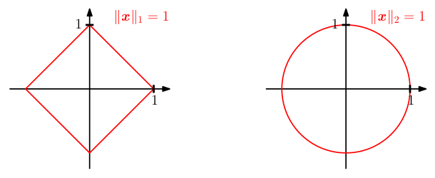
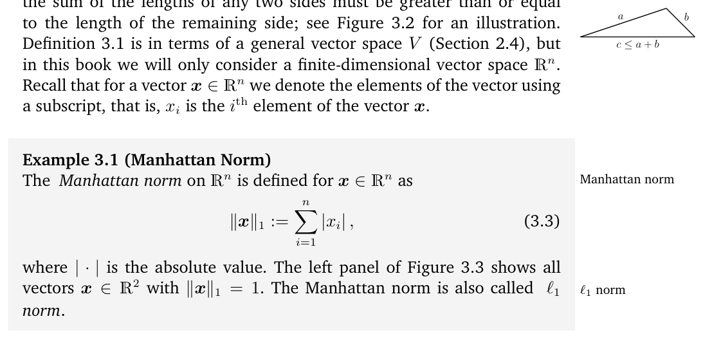
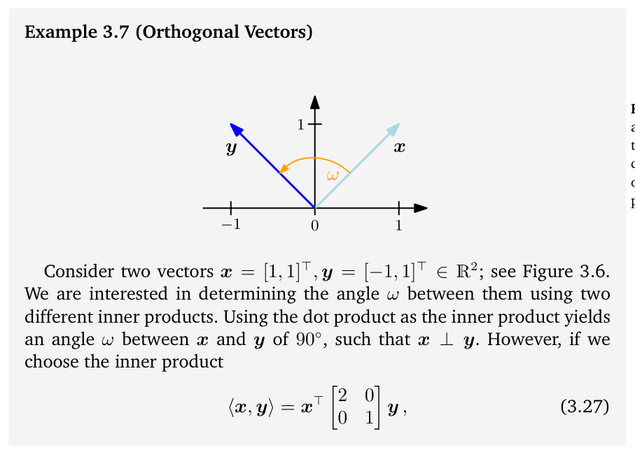
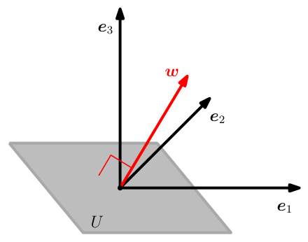
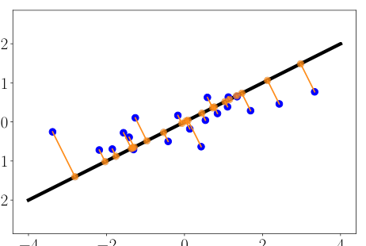
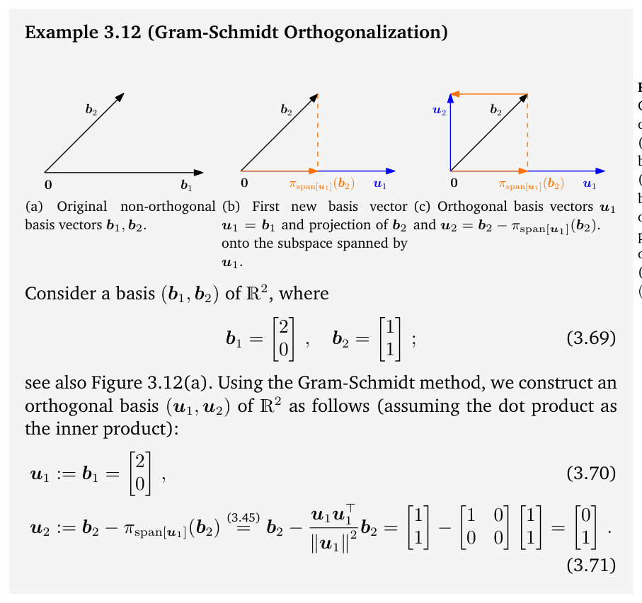
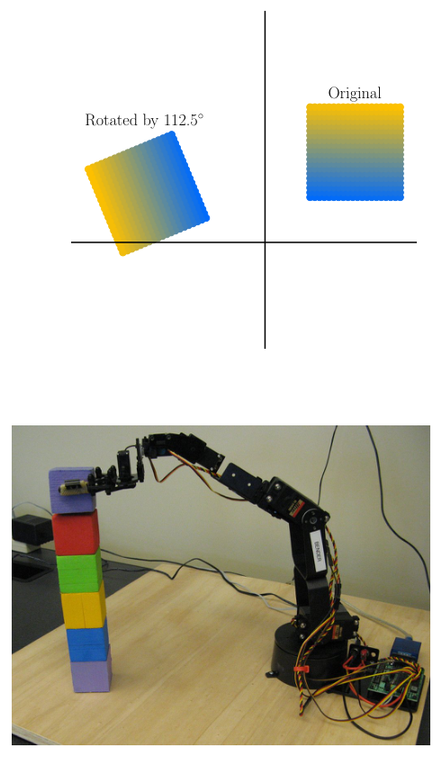
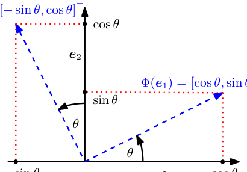
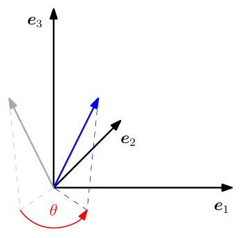

# 第 3 章 解析几何（Analytic Geometry）

> [← 返回目录](README.md)

> **Figure 3.3** For different norms, the red lines indicate the set of vectors with norm 1. Left: Manhattan norm; Right: Euclidean distance.

**图 3.3** 对于不同的范数，红线表示范数为 1 的向量集合。左：曼哈顿范数；右：欧几里得距离。

## 3.1 范数（Norms）

> When we think of geometric vectors, i.e., directed line segments that start at the origin, then intuitively the length of a vector is the distance of the “end” of this directed line segment from the origin. In the following, we will discuss the notion of the length of vectors using the concept of a norm.

当我们想到几何向量，即从原点出发的有向线段时，直观上，向量的长度就是这条有向线段的“终点”到原点的距离。接下来，我们将借助范数（norm）的概念来讨论向量长度的含义。

> **Definition 3.1** (Norm). A norm on a vector space $V$ is a function

**定义 3.1**（范数）。向量空间 $V$ 上的范数是一个函数

$$
\|\cdot\| : V \to \mathbb{R} \, ,
\tag{3.1}
$$

$$
x \mapsto \|x\| \, ,
\tag{3.2}
$$

> which assigns each vector $x$ its length $\|x\| \in \mathbb{R}$, such that for all $\lambda \in \mathbb{R}$ and $x, y \in V$ the following hold:
>
> - Absolutely homogeneous: $\|\lambda x\| = |\lambda| \, \|x\|$
> - Triangle inequality: $\|x + y\| \leqslant \|x\| + \|y\|$
> - Positive definite: $\|x\| \geqslant 0$ and $\|x\| = 0 \Longleftrightarrow x = 0$

该函数为每个向量 $x$ 赋予其长度 $\|x\| \in \mathbb{R}$，并且对任意 $\lambda \in \mathbb{R}$ 与 $x, y \in V$，满足下列性质：

- 绝对齐次性（absolutely homogeneous）：$\|\lambda x\| = |\lambda| \, \|x\|$
- 三角不等式（triangle inequality）：$\|x + y\| \leqslant \|x\| + \|y\|$
- 正定性（positive definite）：$\|x\| \geqslant 0$，且 $\|x\| = 0 \Longleftrightarrow x = 0$

> **Figure 3.2** Triangle inequality.

**图 3.2** 三角不等式。

> In geometric terms, the triangle inequality states that for any triangle, the sum of the lengths of any two sides must be greater than or equal to the length of the remaining side; see Figure 3.2 for an illustration. Definition 3.1 is in terms of a general vector space $V$ (Section 2.4), but in this book we will only consider a finite-dimensional vector space $\mathbb{R}^n$. Recall that for a vector $x \in \mathbb{R}^n$ we denote the elements of the vector using a subscript, that is, $x_i$ is the $i$th element of the vector $x$.

从几何上看，三角不等式说的是：对任意三角形，任意两边长度之和必定大于等于第三边的长度；参见图 3.2 中的示意。定义 3.1 是针对一般向量空间 $V$（2.4 节）表述的，但本书只考虑有限维向量空间 $\mathbb{R}^n$。回顾一下，对于向量 $x \in \mathbb{R}^n$，我们用下标来指称向量的元素，即 $x_i$ 是向量 $x$ 的第 $i$ 个元素。

> **Example 3.1** (Manhattan Norm) The Manhattan norm on $\mathbb{R}^n$ is defined for $x \in \mathbb{R}^n$ as

**例 3.1**（曼哈顿范数，Manhattan Norm）$\mathbb{R}^n$ 上的曼哈顿范数定义为：对 $x \in \mathbb{R}^n$，

$$
\|x\|_1 := \sum_{i=1}^{n} |x_i| \, ,
\tag{3.3}
$$

> where $|\cdot|$ is the absolute value. The left panel of Figure 3.3 shows all vectors $x \in \mathbb{R}^2$ with $\|x\|_1 = 1$. The Manhattan norm is also called $\ell_1$ norm.

其中 $|\cdot|$ 表示绝对值。图 3.3 的左图显示了所有满足 $\|x\|_1 = 1$ 的向量 $x \in \mathbb{R}^2$。曼哈顿范数也称为 $\ell_1$ 范数。

> Example 3.2 (Euclidean Norm)

例 3.2（欧几里得范数）

> The Euclidean norm of $x \in \mathbb{R}^n$ is defined as

向量 $x \in \mathbb{R}^n$ 的欧几里得范数（Euclidean norm）定义为

$$
\|x\|_2 := \sqrt{\sum_{i=1}^{n} x_i^2} = x^\top x
\tag{3.4}
$$

> and computes the Euclidean distance of $x$ from the origin. The right panel of Figure 3.3 shows all vectors $x \in \mathbb{R}^2$ with $\|x\|_2 = 1$. The Euclidean norm is also called $\ell_2$ norm.

它计算 $x$ 到原点的欧几里得距离（Euclidean distance）。图 3.3 的右图展示了所有满足 $\|x\|_2 = 1$ 的向量 $x \in \mathbb{R}^2$。欧几里得范数也称为 $\ell_2$ 范数（$\ell_2$ norm）。

> Remark. Throughout this book, we will use the Euclidean norm (3.4) by default if not stated otherwise. ♢

评注. 除非另有说明，本书通篇默认使用欧几里得范数 (3.4)。♢

## 3.2 内积（Inner Products）

> Inner products allow for the introduction of intuitive geometrical concepts, such as the length of a vector and the angle or distance between two vectors. A major purpose of inner products is to determine whether vectors are orthogonal to each other.

内积使我们能够引入一些直观的几何概念，例如向量的长度，以及两个向量之间的夹角或距离。内积的一个重要用途是判定向量之间是否相互正交（orthogonal）。

### 3.2.1 点积（Dot Product）

> We may already be familiar with a particular type of inner product, the scalar product/dot product in $\mathbb{R}^n$, which is given by

我们可能已经熟悉一类特殊的内积，即 $\mathbb{R}^n$ 中的标量积/点积（scalar product/dot product），其定义为

$$
x^\top y = \sum_{i=1}^{n} x_i y_i \, .
\tag{3.5}
$$

> We will refer to this particular inner product as the dot product in this book. However, inner products are more general concepts with specific properties, which we will now introduce.

本书中，我们将把这个特定的内积称为点积。然而，内积是更一般的概念，具有一些特定的性质，下面我们就来介绍。

### 3.2.2 一般内积（General Inner Products）

> Recall the linear mapping from Section 2.7, where we can rearrange the mapping with respect to addition and multiplication with a scalar. A bilinear mapping $\Omega$ is a mapping with two arguments, and it is linear in each argument, i.e., when we look at a vector space $V$ then it holds that for all $x, y, z \in V$, $\lambda, \psi \in \mathbb{R}$ that

回想 2.7 节中的线性映射（linear mapping），在那里我们可以针对加法和标量乘法对映射进行重组。双线性映射（bilinear mapping）$\Omega$ 是具有两个自变量的映射，并且它在每个自变量上都是线性的；也就是说，当我们考察一个向量空间 $V$ 时，对所有的 $x, y, z \in V$ 和 $\lambda, \psi \in \mathbb{R}$，都有

$$
\Omega(\lambda x + \psi y, z) = \lambda\Omega(x, z) + \psi\Omega(y, z)
\tag{3.6}
$$

$$
\Omega(x, \lambda y + \psi z) = \lambda\Omega(x, y) + \psi\Omega(x, z) \, .
\tag{3.7}
$$

> Here, (3.6) asserts that $\Omega$ is linear in the first argument, and (3.7) asserts that $\Omega$ is linear in the second argument (see also (2.87)).

其中，(3.6) 断言 $\Omega$ 对第一个自变量是线性的，(3.7) 断言 $\Omega$ 对第二个自变量是线性的（另见 (2.87)）。

> **Definition 3.2.** Let $V$ be a vector space and $\Omega: V \times V \to \mathbb{R}$ be a bilinear mapping that takes two vectors and maps them onto a real number. Then

**定义 3.2**。设 $V$ 是一个向量空间，$\Omega: V \times V \to \mathbb{R}$ 是一个双线性映射，它取两个向量并将其映射为一个实数。那么

> $\Omega$ is called symmetric if $\Omega(x, y) = \Omega(y, x)$ for all $x, y \in V$, i.e., the symmetric order of the arguments does not matter.

若对所有 $x, y \in V$ 都有 $\Omega(x, y) = \Omega(y, x)$，即自变量的对称顺序不影响结果，则称 $\Omega$ 是对称的（symmetric）。

> $\Omega$ is called positive definite if

若下式成立，则称 $\Omega$ 是正定的（positive definite）：

$$
\forall x \in V\setminus\{0\} : \Omega(x, x) > 0 \, , \qquad \Omega(0, 0) = 0 \, .
\tag{3.8}
$$

> **Definition 3.3.** Let $V$ be a vector space and $\Omega: V \times V \to \mathbb{R}$ be a bilinear mapping that takes two vectors and maps them onto a real number. Then

**定义 3.3**。设 $V$ 是一个向量空间，$\Omega: V \times V \to \mathbb{R}$ 是一个双线性映射，它取两个向量并将其映射为一个实数。那么

> A positive definite, symmetric bilinear mapping $\Omega: V \times V \to \mathbb{R}$ is called an inner product on $V$. We typically write $\langle x, y\rangle$ instead of $\Omega(x, y)$. The pair $(V, \langle\cdot, \cdot\rangle)$ is called an inner product space or (real) vector space with inner product. If we use the dot product defined in (3.5), we call $(V, \langle\cdot, \cdot\rangle)$ a Euclidean vector space.

正定且对称的双线性映射 $\Omega: V \times V \to \mathbb{R}$ 称为 $V$ 上的内积（inner product）。我们通常写作 $\langle x, y\rangle$，而不是 $\Omega(x, y)$。数对 $(V, \langle\cdot, \cdot\rangle)$ 称为内积空间（inner product space），或（实）具有内积的向量空间（vector space with inner product）。如果我们使用 (3.5) 中定义的点积，就称 $(V, \langle\cdot, \cdot\rangle)$ 为欧几里得向量空间（Euclidean vector space）。

> We will refer to these spaces as inner product spaces in this book.

本书中，我们将把这些空间统称为内积空间。

> Example 3.3 (Inner Product That Is Not the Dot Product)

例 3.3（非点积的内积）

> Consider $V = \mathbb{R}^2$. If we define

考虑 $V = \mathbb{R}^2$。如果定义

$$
\langle x, y\rangle := x_1 y_1 - (x_1 y_2 + x_2 y_1) + 2 x_2 y_2
\tag{3.9}
$$

> then $\langle\cdot, \cdot\rangle$ is an inner product but different from the dot product. The proof will be an exercise.

那么 $\langle\cdot, \cdot\rangle$ 是一个内积，但不同于点积。其证明将留作练习。

### 3.2.3 对称正定矩阵（Symmetric, Positive Definite Matrices）

> Symmetric, positive definite matrices play an important role in machine learning, and they are defined via the inner product. In Section 4.3, we will return to symmetric, positive definite matrices in the context of matrix decompositions. The idea of symmetric positive semidefinite matrices is key in the definition of kernels (Section 12.4).

对称正定矩阵（symmetric, positive definite matrix）在机器学习中扮演着重要角色，它们是通过内积来定义的。在 4.3 节中，我们将在矩阵分解的背景下再次讨论对称正定矩阵。对称半正定矩阵（symmetric positive semidefinite matrix）的思想是定义核（kernel）的关键（12.4 节）。

> Consider an $n$-dimensional vector space $V$ with an inner product $\langle\cdot, \cdot\rangle: V \times V \to \mathbb{R}$ (see Definition 3.3) and an ordered basis $B = (b_1, \ldots, b_n)$ of $V$. Recall from Section 2.6.1 that any vectors $x, y \in V$ can be written as linear combinations of the basis vectors so that $x = \sum_{i=1}^{n} \psi_i b_i \in V$ and $y = \sum_{j=1}^{n} \lambda_j b_j \in V$ for suitable $\psi_i, \lambda_j \in \mathbb{R}$. Due to the bilinearity of the inner product, it holds for all $x, y \in V$ that

考虑一个 $n$ 维向量空间 $V$，它具有内积 $\langle\cdot, \cdot\rangle: V \times V \to \mathbb{R}$（见定义 3.3），并取 $V$ 的一组有序基（ordered basis）$B = (b_1, \ldots, b_n)$。回想 2.6.1 节，任意向量 $x, y \in V$ 都可以写成基向量（basis vector）的线性组合（linear combination），于是对适当的 $\psi_i, \lambda_j \in \mathbb{R}$，有 $x = \sum_{i=1}^{n} \psi_i b_i \in V$ 与 $y = \sum_{j=1}^{n} \lambda_j b_j \in V$。由于内积的双线性（bilinearity），对所有的 $x, y \in V$，都有

$$
\langle x, y\rangle
= \left\langle \sum_{i=1}^{n} \psi_i b_i, \sum_{j=1}^{n} \lambda_j b_j \right\rangle
= \sum_{i=1}^{n} \sum_{j=1}^{n} \psi_i \langle b_i, b_j\rangle \lambda_j
= \hat{x}^\top A \hat{y} \, ,
\tag{3.10}
$$

> where $A_{ij} := \langle b_i, b_j\rangle$ and $\hat{x}, \hat{y}$ are the coordinates of $x$ and $y$ with respect to the basis $B$. This implies that the inner product $\langle\cdot, \cdot\rangle$ is uniquely determined through $A$. The symmetry of the inner product also means that $A$ is symmetric. Furthermore, the positive definiteness of the inner product implies that

其中 $A_{ij} := \langle b_i, b_j\rangle$，而 $\hat{x}, \hat{y}$ 是 $x$ 和 $y$ 关于基 $B$ 的坐标（coordinates）。这意味着内积 $\langle\cdot, \cdot\rangle$ 由 $A$ 唯一确定。内积的对称性也意味着 $A$ 是对称的。此外，内积的正定性蕴含

$$
\forall x \in V\setminus\{0\} : x^\top A x > 0 \, .
\tag{3.11}
$$

> **Definition 3.4** (Symmetric, Positive Definite Matrix). A symmetric matrix $A \in \mathbb{R}^{n \times n}$ that satisfies (3.11) is called symmetric, positive definite, or just positive definite. If only $\geqslant$ holds in (3.11), then $A$ is called symmetric, positive semidefinite.

**定义 3.4**（对称正定矩阵，Symmetric, Positive Definite Matrix）。满足 (3.11) 的对称矩阵 $A \in \mathbb{R}^{n \times n}$ 称为对称正定的（symmetric, positive definite），或简称正定的。如果 (3.11) 中只取 $\geqslant$，则称 $A$ 为对称半正定的（symmetric, positive semidefinite）。

> Example 3.4 (Symmetric, Positive Definite Matrices)

例 3.4（对称正定矩阵）

> Consider the matrices

考虑矩阵

$$
A_1 = \begin{pmatrix} 9 & 6 \\ 6 & 5 \end{pmatrix}, \quad
A_2 = \begin{pmatrix} 9 & 6 \\ 6 & 3 \end{pmatrix} .
\tag{3.12}
$$

> $A_1$ is positive definite because it is symmetric and

$A_1$ 是正定的，因为它是对称的，并且

$$
x^\top A_1 x
= \begin{pmatrix} x_1 & x_2 \end{pmatrix}
\begin{pmatrix} 9 & 6 \\ 6 & 5 \end{pmatrix}
\begin{pmatrix} x_1 \\ x_2 \end{pmatrix}
\tag{3.13a}
$$

$$
= 9x_1^2 + 12x_1 x_2 + 5x_2^2
= (3x_1 + 2x_2)^2 + x_2^2 > 0
\tag{3.13b}
$$

> for all $x \in V \setminus\{0\}$. In contrast, $A_2$ is symmetric but not positive definite because $x^\top A_2 x = 9x_1^2 + 12x_1 x_2 + 3x_2^2 = (3x_1 + 2x_2)^2 - x_2^2$ can be less than 0, e.g., for $x = [2, -3]^\top$.

对所有 $x \in V \setminus\{0\}$ 都成立。相比之下，$A_2$ 是对称的，但不是正定的，因为 $x^\top A_2 x = 9x_1^2 + 12x_1 x_2 + 3x_2^2 = (3x_1 + 2x_2)^2 - x_2^2$ 可能小于 0，例如取 $x = [2, -3]^\top$ 时。

> If $A \in \mathbb{R}^{n \times n}$ is symmetric, positive definite, then

如果 $A \in \mathbb{R}^{n \times n}$ 是对称正定的，那么

$$
\langle x, y\rangle = \hat{x}^\top A \hat{y}
\tag{3.14}
$$

> defines an inner product with respect to an ordered basis $B$, where $\hat{x}$ and $\hat{y}$ are the coordinate representations of $x, y \in V$ with respect to $B$.

就定义了一个关于有序基 $B$ 的内积，其中 $\hat{x}$ 和 $\hat{y}$ 是 $x, y \in V$ 关于 $B$ 的坐标表示。

> **Theorem 3.5.** For a real-valued, finite-dimensional vector space $V$ and an ordered basis $B$ of $V$, it holds that $\langle\cdot, \cdot\rangle: V \times V \to \mathbb{R}$ is an inner product if and only if there exists a symmetric, positive definite matrix $A \in \mathbb{R}^{n \times n}$ with

**定理 3.5**。对于一个实值有限维向量空间 $V$ 及其一组有序基 $B$，$\langle\cdot, \cdot\rangle: V \times V \to \mathbb{R}$ 是一个内积，当且仅当存在一个对称正定矩阵 $A \in \mathbb{R}^{n \times n}$，使得

$$
\langle x, y\rangle = \hat{x}^\top A \hat{y} \, .
\tag{3.15}
$$

> The following properties hold if $A \in \mathbb{R}^{n \times n}$ is symmetric and positive definite:

如果 $A \in \mathbb{R}^{n \times n}$ 是对称且正定的，则下列性质成立：

> The null space (kernel) of $A$ consists only of $0$ because $x^\top Ax > 0$ for all $x \neq 0$. This implies that $Ax \neq 0$ if $x \neq 0$.

$A$ 的零空间（null space，即核）只包含 $0$，因为对所有 $x \neq 0$ 都有 $x^\top A x > 0$。这意味着，若 $x \neq 0$，则 $Ax \neq 0$。

> The diagonal elements $a_{ii}$ of $A$ are positive because $a_{ii} = e_i^\top A e_i > 0$, where $e_i$ is the $i$th vector of the standard basis in $\mathbb{R}^n$.

$A$ 的对角元素 $a_{ii}$ 都是正的，因为 $a_{ii} = e_i^\top A e_i > 0$，其中 $e_i$ 是 $\mathbb{R}^n$ 中标准基（standard basis）的第 $i$ 个向量。

## 3.3 长度与距离（Lengths and Distances）

> In Section 3.1, we already discussed norms that we can use to compute the length of a vector. Inner products and norms are closely related in the sense that any inner product induces a norm

在 3.1 节中，我们已经讨论了可用于计算向量长度的范数。内积与范数密切相关：任何内积都会以一种自然的方式诱导出一个范数

$$
\|x\| := \sqrt{\langle x, x\rangle}
\tag{3.16}
$$

> in a natural way, such that we can compute lengths of vectors using the inner product. However, not every norm is induced by an inner product. The Manhattan norm (3.3) is an example of a norm without a corresponding inner product. In the following, we will focus on norms that are induced by inner products and introduce geometric concepts, such as lengths, distances, and angles.

这样，我们就可以利用内积来计算向量的长度。然而，并非每个范数都由内积诱导，曼哈顿范数（3.3）就是一个没有对应内积的范数的例子。接下来，我们将关注由内积诱导的范数，并引入长度、距离和夹角等几何概念。

> **Remark** (Cauchy-Schwarz Inequality). For an inner product vector space $(V, \langle\cdot, \cdot\rangle)$ the induced norm $\|\cdot\|$ satisfies the Cauchy-Schwarz inequality

**评注**（Cauchy-Schwarz 不等式）。对于内积向量空间 $(V, \langle\cdot, \cdot\rangle)$，诱导范数 $\|\cdot\|$ 满足 Cauchy-Schwarz 不等式

$$
|\langle x, y\rangle| \leqslant \|x\| \|y\| \, .
\tag{3.17}
$$

> ♢

♢

> **Example 3.5** (Lengths of Vectors Using Inner Products) In geometry, we are often interested in lengths of vectors. We can now use an inner product to compute them using (3.16). Let us take $x = [1, 1]^\top \in \mathbb{R}^2$. If we use the dot product as the inner product, with (3.16) we obtain

**例 3.5**（利用内积计算向量长度，Lengths of Vectors Using Inner Products）在几何学中，我们经常关注向量的长度。现在，我们可以利用内积并通过 (3.16) 来计算这些长度。取 $x = [1, 1]^\top \in \mathbb{R}^2$。如果我们使用点积作为内积，那么由 (3.16) 可得

$$
\|x\| = \sqrt{x^\top x} = \sqrt{1^2 + 1^2} = \sqrt{2}
\tag{3.18}
$$

> as the length of $x$. Let us now choose a different inner product:

作为 $x$ 的长度。现在我们选取一个不同的内积：

$$
\langle x, y\rangle := x^\top \begin{pmatrix} 1 & -\frac{1}{2} \\ -\frac{1}{2} & 1 \end{pmatrix} y = x_1 y_1 - \frac{1}{2}(x_1 y_2 + x_2 y_1) + x_2 y_2 \, .
\tag{3.19}
$$

> If we compute the norm of a vector, then this inner product returns smaller values than the dot product if $x_1$ and $x_2$ have the same sign (and $x_1 x_2 > 0$); otherwise, it returns greater values than the dot product. With this inner product, we obtain

如果我们计算一个向量的范数，那么当 $x_1$ 和 $x_2$ 同号（且 $x_1 x_2 > 0$）时，这个内积给出的值比点积小；否则，它给出的值比点积大。利用这个内积，我们得到

$$
\langle x, x\rangle = x_1^2 - x_1 x_2 + x_2^2 = 1 - 1 + 1 = 1 \implies \|x\| = \sqrt{\langle x, x\rangle} = 1 \, ,
\tag{3.20}
$$

> such that $x$ is “shorter” with this inner product than with the dot product.

因此，在这个内积下，$x$ 比在点积下“更短”。

> **Definition 3.6** (Distance and Metric). Consider an inner product space $(V, \langle\cdot, \cdot\rangle)$. Then

**定义 3.6**（距离与度量，Distance and Metric）。考虑一个内积空间 $(V, \langle\cdot, \cdot\rangle)$。那么

$$
d(x, y) := \|x-y\| = \sqrt{\langle x-y, x-y\rangle}
\tag{3.21}
$$

> is called the distance between $x$ and $y$ for $x, y \in V$. If we use the dot product as the inner product, then the distance is called Euclidean distance.

对于 $x, y \in V$，上式称为 $x$ 与 $y$ 之间的距离（distance）。如果我们使用点积作为内积，那么该距离称为欧几里得距离。

> The mapping

映射

$$
d : V \times V \to \mathbb{R} \, ,
\tag{3.22}
$$

$$
(x, y) \mapsto d(x, y)
\tag{3.23}
$$

> is called a metric.

称为度量（metric）。

> Remark. Similar to the length of a vector, the distance between vectors does not require an inner product: a norm is sufficient. If we have a norm induced by an inner product, the distance may vary depending on the choice of the inner product. ♢

评注. 与向量的长度类似，向量之间的距离并不需要内积：有一个范数就足够了。如果我们使用由内积诱导的范数，那么距离可能会随内积选取的不同而变化。♢

> A metric $d$ satisfies the following:

度量 $d$ 满足以下性质：

1. $d$ is positive definite, i.e., $d(x, y) \geqslant 0$ for all $x, y \in V$ and $d(x, y) = 0 \iff x = y$.
2. $d$ is symmetric, i.e., $d(x, y) = d(y, x)$ for all $x, y \in V$.
3. Triangle inequality: $d(x, z) \leqslant d(x, y) + d(y, z)$ for all $x, y, z \in V$.

1. $d$ 是正定的，即对所有 $x, y \in V$ 都有 $d(x, y) \geqslant 0$，并且 $d(x, y) = 0 \iff x = y$。
2. $d$ 是对称的，即对所有 $x, y \in V$ 都有 $d(x, y) = d(y, x)$。
3. 三角不等式（triangle inequality）：对所有 $x, y, z \in V$ 都有 $d(x, z) \leqslant d(x, y) + d(y, z)$。

> Remark. At first glance, the lists of properties of inner products and metrics look very similar. However, by comparing Definition 3.3 with Definition 3.6 we observe that $\langle x, y\rangle$ and $d(x, y)$ behave in opposite directions. Very similar $x$ and $y$ will result in a large value for the inner product and a small value for the metric. ♢

评注. 乍看之下，内积与度量的性质列表十分相似。然而，比较定义 3.3 与定义 3.6 可以发现，$\langle x, y\rangle$ 与 $d(x, y)$ 的变化方向正好相反：非常相似的 $x$ 和 $y$ 会给出较大的内积值和较小的度量值。♢

## 3.4 夹角与正交性（Angles and Orthogonality）

> **Figure 3.4** When restricted to $[0, \pi]$ then $f(\omega) = \cos(\omega)$ returns a unique number in the interval $[-1, 1]$.

**图 3.4** 当限定在 $[0, \pi]$ 上时，$f(\omega) = \cos(\omega)$ 会返回区间 $[-1, 1]$ 中唯一的一个数。

> In addition to enabling the definition of lengths of vectors, as well as the distance between two vectors, inner products also capture the geometry of a vector space by defining the angle $\omega$ between two vectors. We use the Cauchy-Schwarz inequality (3.17) to define angles $\omega$ in inner product spaces between two vectors $x$, $y$, and this notion coincides with our intuition in $\mathbb{R}^2$ and $\mathbb{R}^3$. Assume that $x \neq 0$, $y \neq 0$. Then

内积不仅使我们能够定义向量的长度以及两个向量之间的距离，还通过定义两个向量之间的夹角 $\omega$ 来刻画向量空间的几何。我们利用 Cauchy-Schwarz 不等式 (3.17) 来定义内积空间中两个向量 $x$、$y$ 之间的夹角 $\omega$，这一概念与我们在 $\mathbb{R}^2$ 和 $\mathbb{R}^3$ 中的直觉一致。假设 $x \neq 0$，$y \neq 0$，那么

$$
-1 \leqslant \cos(\omega) = \frac{\langle x, y\rangle}{\|x\| \, \|y\|} \leqslant 1 \, .
\tag{3.24}
$$

> Therefore, there exists a unique $\omega \in [0, \pi]$, illustrated in Figure 3.4, with

因此，存在唯一的 $\omega \in [0, \pi]$，如图 3.4 所示，满足

$$
\cos \omega = \frac{\langle x, y\rangle}{\|x\| \, \|y\|} \, .
\tag{3.25}
$$

> The number $\omega$ is the angle between the vectors $x$ and $y$. Intuitively, the angle between two vectors tells us how similar their orientations are. For example, using the dot product, the angle between $x$ and $y = 4x$, i.e., $y$ is a scaled version of $x$, is 0: Their orientation is the same.

数 $\omega$ 就是向量 $x$ 与 $y$ 之间的夹角。直观上，两个向量之间的夹角告诉我们它们的朝向有多相似。例如，若使用点积，则 $x$ 与 $y = 4x$（即 $y$ 是 $x$ 的缩放版本）之间的夹角为 0：它们的朝向相同。

> Example 3.6 (Angle between Vectors)

例 3.6（向量之间的夹角）

> **Figure 3.5** The angle $\omega$ between two vectors $x$, $y$ is computed using the inner product.

**图 3.5** 两个向量 $x$、$y$ 之间的夹角 $\omega$ 利用内积计算。

> Let us compute the angle between $x = [1, 1]^\top \in \mathbb{R}^2$ and $y = [1, 2]^\top \in \mathbb{R}^2$; see Figure 3.5, where we use the dot product as the inner product. Then we get

我们来计算 $x = [1, 1]^\top \in \mathbb{R}^2$ 与 $y = [1, 2]^\top \in \mathbb{R}^2$ 之间的夹角，见图 3.5，其中使用点积作为内积。于是可得

$$
\cos \omega = \frac{\langle x, y\rangle}{\sqrt{\langle x, x\rangle \langle y, y\rangle}} = \frac{x^\top y}{\sqrt{x^\top x \, y^\top y}} = \frac{3}{\sqrt{10}} \, ,
\tag{3.26}
$$

> and the angle between the two vectors is $\arccos(3/\sqrt{10}) \approx 0.32$ rad, which corresponds to about $18^\circ$.

而这两个向量之间的夹角为 $\arccos(3/\sqrt{10}) \approx 0.32$ rad，约合 $18^\circ$。

> A key feature of the inner product is that it also allows us to characterize vectors that are orthogonal.

内积的一个关键特性是，它还能用来刻画相互正交的向量。

> **Definition 3.7** (Orthogonality). Two vectors $x$ and $y$ are orthogonal if and only if $\langle x, y\rangle = 0$, and we write $x \perp y$. If additionally $\|x\| = 1 = \|y\|$, i.e., the vectors are unit vectors, then $x$ and $y$ are orthonormal.

**定义 3.7**（正交性，Orthogonality）。当且仅当 $\langle x, y\rangle = 0$ 时，称向量 $x$ 与 $y$ 是正交的，记作 $x \perp y$。如果还满足 $\|x\| = 1 = \|y\|$，即这两个向量是单位向量（unit vector），则称 $x$ 与 $y$ 标准正交（orthonormal）。

> An implication of this definition is that the 0-vector is orthogonal to every vector in the vector space.

由这个定义可以推出：0 向量与向量空间中的每一个向量都正交。

> Remark. Orthogonality is the generalization of the concept of perpendicularity to bilinear forms that do not have to be the dot product. In our context, geometrically, we can think of orthogonal vectors as having a right angle with respect to a specific inner product. ♢

评注. 正交性是把垂直（perpendicularity）的概念推广到双线性形式（bilinear form）上的结果，而这种双线性形式不必是点积。在本书的语境下，从几何上看，可以把相互正交的向量理解为关于某个特定内积构成直角的向量。♢

> Example 3.7 (Orthogonal Vectors)

例 3.7（正交向量）

> **Figure 3.6** The angle $\omega$ between two vectors $x$, $y$ can change depending on the inner product.

**图 3.6** 两个向量 $x$、$y$ 之间的夹角 $\omega$ 会随内积的不同而改变。

> Consider two vectors $x = [1, 1]^\top$, $y = [-1, 1]^\top \in \mathbb{R}^2$; see Figure 3.6. We are interested in determining the angle $\omega$ between them using two different inner products. Using the dot product as the inner product yields an angle $\omega$ between $x$ and $y$ of $90^\circ$, such that $x \perp y$. However, if we choose the inner product

考虑两个向量 $x = [1, 1]^\top$，$y = [-1, 1]^\top \in \mathbb{R}^2$，见图 3.6。我们想用两种不同的内积来确定它们之间的夹角 $\omega$。使用点积作为内积时，得到的 $x$ 与 $y$ 之间的夹角 $\omega$ 为 $90^\circ$，即 $x \perp y$。然而，如果我们选取内积

$$
\langle x, y\rangle = x^\top \begin{pmatrix} 2 & 0 \\ 0 & 1 \end{pmatrix} y \, ,
\tag{3.27}
$$

> we get that the angle $\omega$ between $x$ and $y$ is given by

可得 $x$ 与 $y$ 之间的夹角 $\omega$ 为

$$
\cos \omega = \frac{\langle x, y\rangle}{\|x\| \, \|y\|} = -\frac{1}{3} \implies \omega \approx 1.91 \, \text{rad} \approx 109.5^\circ \, ,
\tag{3.28}
$$

> and $x$ and $y$ are not orthogonal. Therefore, vectors that are orthogonal with respect to one inner product do not have to be orthogonal with respect to a different inner product.

且 $x$ 与 $y$ 并不正交。因此，对于某种内积而言正交的向量，对于另一种内积未必正交。

> **Definition 3.8** (Orthogonal Matrix). A square matrix $A \in \mathbb{R}^{n \times n}$ is an orthogonal matrix if and only if its columns are orthonormal so that

**定义 3.8**（正交矩阵，Orthogonal Matrix）。当且仅当方阵 $A \in \mathbb{R}^{n \times n}$ 的各列标准正交时，称 $A$ 为正交矩阵，此时有

$$
A A^\top = I = A^\top A \, ,
\tag{3.29}
$$

> which implies that

由此可得

$$
A^{-1} = A^\top \, ,
\tag{3.30}
$$

> i.e., the inverse is obtained by simply transposing the matrix. It is convention to call these matrices “orthogonal” but a more precise description would be “orthonormal”.

也就是说，矩阵的逆只需将矩阵转置即可得到。习惯上人们把这类矩阵称为“正交的”，但更准确的描述应当是“标准正交的”。

> Transformations by orthogonal matrices are special because the length of a vector $x$ is not changed when transforming it using an orthogonal matrix $A$. For the dot product, we obtain

用正交矩阵作变换之所以特殊，是因为在用正交矩阵 $A$ 对向量 $x$ 作变换时，向量的长度不会改变。对于点积，我们可得

$$
\|Ax\|^2 = (Ax)^\top (Ax) = x^\top A^\top A x = x^\top I x = x^\top x = \|x\|^2 \, .
\tag{3.31}
$$

> Moreover, the angle between any two vectors $x$, $y$, as measured by their inner product, is also unchanged when transforming both of them using an orthogonal matrix $A$. Assuming the dot product as the inner product, the angle of the images $Ax$ and $Ay$ is given as

此外，由内积度量的任意两个向量 $x$、$y$ 之间的夹角，在用正交矩阵 $A$ 同时对二者作变换时也保持不变。假设以点积作为内积，则像 $Ax$ 与 $Ay$ 之间的夹角为

$$
\cos \omega = \frac{(Ax)^\top (Ay)}{\|Ax\| \, \|Ay\|} = \frac{x^\top A^\top A y}{\sqrt{x^\top A^\top A x \, y^\top A^\top A y}} = \frac{x^\top y}{\|x\| \, \|y\|} \, ,
\tag{3.32}
$$

> which gives exactly the angle between $x$ and $y$. This means that orthogonal matrices $A$ with $A^\top = A^{-1}$ preserve both angles and distances. It turns out that orthogonal matrices define transformations that are rotations (with the possibility of flips). In Section 3.9, we will discuss more details about rotations.

这恰好给出了 $x$ 与 $y$ 之间的夹角。这意味着满足 $A^\top = A^{-1}$ 的正交矩阵 $A$ 同时保持夹角与距离。结果表明，正交矩阵所定义的变换是旋转（rotation），也可能带有翻转（flip）。3.9 节将更详细地讨论旋转。

## 3.5 标准正交基（Orthonormal Basis）

> In Section 2.6.1, we characterized properties of basis vectors and found that in an $n$-dimensional vector space, we need $n$ basis vectors, i.e., $n$ vectors that are linearly independent. In Sections 3.3 and 3.4, we used inner products to compute the length of vectors and the angle between vectors. In the following, we will discuss the special case where the basis vectors are orthogonal to each other and where the length of each basis vector is 1. We will call this basis then an orthonormal basis.

在 2.6.1 节中，我们刻画了基向量的性质，发现 $n$ 维向量空间需要 $n$ 个基向量，即 $n$ 个线性无关的向量。在 3.3 节和 3.4 节中，我们利用内积计算了向量的长度以及向量之间的夹角。接下来，我们将讨论基向量彼此正交且每个基向量长度均为 1 的特殊情形，并把这样的基称为标准正交基（orthonormal basis）。

> Let us introduce this more formally.

让我们更正式地引入这一概念。

> **Definition 3.9** (Orthonormal Basis). Consider an $n$-dimensional vector space $V$ and a basis $\{b_1, \ldots, b_n\}$ of $V$. If

**定义 3.9**（标准正交基，Orthonormal Basis）。考虑一个 $n$ 维向量空间 $V$ 及其一组基 $\{b_1, \ldots, b_n\}$。若

$$
\langle b_i, b_j\rangle = 0 \quad \text{for } i \neq j
\tag{3.33}
$$

$$
\langle b_i, b_i\rangle = 1
\tag{3.34}
$$

> for all $i, j = 1, \ldots, n$ then the basis is called an orthonormal basis (ONB). If only (3.33) is satisfied, then the basis is called an orthogonal basis. Note that (3.34) implies that every basis vector has length/norm 1.

当上两式对所有 $i, j = 1, \ldots, n$ 都成立时，则称这组基为标准正交基（ONB）。若仅满足 (3.33)，则称这组基为正交基（orthogonal basis）。注意，(3.34) 意味着每个基向量的长度/范数均为 1。

> Recall from Section 2.6.1 that we can use Gaussian elimination to find a basis for a vector space spanned by a set of vectors. Assume we are given a set $\{\tilde{b}_1, \ldots, \tilde{b}_n\}$ of non-orthogonal and unnormalized basis vectors. We concatenate them into a matrix $\tilde{B} = [\tilde{b}_1, \ldots, \tilde{b}_n]$ and apply Gaussian elimination to the augmented matrix (Section 2.3.2) $[\tilde{B}^{\top}\mid\tilde{B}]$ to obtain an orthonormal basis. This constructive way to iteratively build an orthonormal basis $\{b_1, \ldots, b_n\}$ is called the Gram-Schmidt process (Strang, 2003).

回想 2.6.1 节，我们可以利用高斯消元为一组向量所张成的向量空间求出基。假设给定一组非正交且未归一化的基向量 $\{\tilde{b}_1, \ldots, \tilde{b}_n\}$。我们将它们拼接成矩阵 $\tilde{B} = [\tilde{b}_1, \ldots, \tilde{b}_n]$，然后对增广矩阵（augmented matrix，2.3.2 节）$[\tilde{B}^{\top}\mid\tilde{B}]$ 施加高斯消元，从而得到一组标准正交基。这种迭代地构造标准正交基 $\{b_1, \ldots, b_n\}$ 的构造性方法称为 Gram-Schmidt 正交化（Gram-Schmidt process）(Strang, 2003)。

> **Example 3.8** (Orthonormal Basis) The canonical/standard basis for a Euclidean vector space $\mathbb{R}^n$ is an orthonormal basis, where the inner product is the dot product of vectors.

**例 3.8**（标准正交基，Orthonormal Basis）欧几里得向量空间 $\mathbb{R}^n$ 的典范基/标准基（canonical/standard basis）是一组标准正交基，其中的内积就是向量的点积。

> In $\mathbb{R}^2$, the vectors

在 $\mathbb{R}^2$ 中，向量

$$
b_1 = \frac{1}{\sqrt{2}}\begin{pmatrix} 1 \\ 1 \end{pmatrix}, \quad
b_2 = \frac{1}{\sqrt{2}}\begin{pmatrix} -1 \\ 1 \end{pmatrix}
\tag{3.35}
$$

> form an orthonormal basis since $b_1^{\top} b_2 = 0$ and $\|b_1\| = 1 = \|b_2\|$.

构成一组标准正交基，因为 $b_1^{\top} b_2 = 0$ 且 $\|b_1\| = 1 = \|b_2\|$。

> We will exploit the concept of an orthonormal basis in Chapter 12 and Chapter 10 when we discuss support vector machines and principal component analysis.

在第 12 章和第 10 章中讨论支持向量机（SVM）与主成分分析（PCA）时，我们将充分利用标准正交基的概念。

## 3.6 正交补（Orthogonal Complement）

> Having defined orthogonality, we will now look at vector spaces that are orthogonal to each other. This will play an important role in Chapter 10, when we discuss linear dimensionality reduction from a geometric perspective.

定义了正交性之后，我们现在来看彼此正交的向量空间。这将在第 10 章中发挥重要作用，届时我们将从几何的视角讨论线性降维（linear dimensionality reduction）。

> Consider a $D$-dimensional vector space $V$ and an $M$-dimensional subspace $U \subseteq V$. Then its orthogonal complement $U^{\perp}$ is a $(D-M)$-dimensional subspace of $V$ and contains all vectors in $V$ that are orthogonal to every vector in $U$. Furthermore, $U \cap U^{\perp} = \{0\}$ so that any vector $x \in V$ can be

考虑一个 $D$ 维向量空间 $V$ 和一个 $M$ 维子空间（subspace）$U \subseteq V$。它的正交补 $U^{\perp}$ 是 $V$ 的一个 $(D-M)$ 维子空间，包含 $V$ 中与 $U$ 中的每个向量都正交的所有向量。此外，$U \cap U^{\perp} = \{0\}$，因此 $V$ 中的任意向量 $x$ 都可以被

> **Figure 3.7** A plane $U$ in a three-dimensional vector space can be described by its normal vector, which spans its orthogonal complement $U^{\perp}$.

**图 3.7** 三维向量空间中的平面 $U$ 可以由其法向量来描述，该法向量张成其正交补 $U^{\perp}$。

> uniquely decomposed into

唯一地分解为

$$
x = \sum_{m=1}^{M} \lambda_m b_m + \sum_{j=1}^{D-M} \psi_j b_j^{\perp}, \quad \lambda_m, \psi_j \in \mathbb{R},
\tag{3.36}
$$

> where $(b_1, \ldots, b_M)$ is a basis of $U$ and $(b_1^{\perp}, \ldots, b_{D-M}^{\perp})$ is a basis of $U^{\perp}$. Therefore, the orthogonal complement can also be used to describe a plane $U$ (two-dimensional subspace) in a three-dimensional vector space. More specifically, the vector $w$ with $\|w\| = 1$, which is orthogonal to the plane $U$, is the basis vector of $U^{\perp}$. Figure 3.7 illustrates this setting. All vectors that are orthogonal to $w$ must (by construction) lie in the plane $U$. The vector $w$ is called the normal vector of $U$.

其中 $(b_1, \ldots, b_M)$ 是 $U$ 的一组基，$(b_1^{\perp}, \ldots, b_{D-M}^{\perp})$ 是 $U^{\perp}$ 的一组基。因此，正交补也可用于描述三维向量空间中的平面 $U$（二维子空间）。更具体地说，满足 $\|w\| = 1$ 且与平面 $U$ 正交的向量 $w$ 就是 $U^{\perp}$ 的基向量。图 3.7 展示了这一情形。所有与 $w$ 正交的向量（按构造）必定位于平面 $U$ 内。向量 $w$ 称为 $U$ 的法向量（normal vector）。

> Generally, orthogonal complements can be used to describe hyperplanes in $n$-dimensional vector and affine spaces.

一般地，正交补可用于描述 $n$ 维向量空间和仿射空间中的超平面。

## 3.7 函数的内积（Inner Product of Functions）

> Thus far, we looked at properties of inner products to compute lengths, angles and distances. We focused on inner products of finite-dimensional vectors. In the following, we will look at an example of inner products of a different type of vectors: inner products of functions.

迄今为止，我们考察了内积在计算长度、夹角和距离方面的性质，重点关注的是有限维向量的内积。接下来，我们将考察另一类向量的内积的一个例子：函数的内积。

> The inner products we discussed so far were defined for vectors with a finite number of entries. We can think of a vector $x \in \mathbb{R}^n$ as a function with $n$ function values. The concept of an inner product can be generalized to vectors with an infinite number of entries (countably infinite) and also continuous-valued functions (uncountably infinite). Then the sum over individual components of vectors (see Equation (3.5) for example) turns into an integral.

到目前为止，我们所讨论的内积都是针对具有有限个分量的向量定义的。我们可以把向量 $x \in \mathbb{R}^n$ 看作一个具有 $n$ 个函数值的函数。内积的概念可以推广到具有无穷多个分量（可数无穷）的向量，也可以推广到连续取值的函数（不可数无穷）。此时，对向量的各个分量求和（例如见式 (3.5)）就变成了积分。

> An inner product of two functions $u : \mathbb{R} \to \mathbb{R}$ and $v : \mathbb{R} \to \mathbb{R}$ can be defined as the definite integral

两个函数 $u : \mathbb{R} \to \mathbb{R}$ 和 $v : \mathbb{R} \to \mathbb{R}$ 的内积可以定义为定积分

$$
\langle u, v\rangle := \int_a^b u(x)v(x)\,\mathrm{d}x
\tag{3.37}
$$

> for lower and upper limits $a, b < \infty$, respectively. As with our usual inner product, we can define norms and orthogonality by looking at the inner product. If (3.37) evaluates to 0, the functions $u$ and $v$ are orthogonal. To make the preceding inner product mathematically precise, we need to take care of measures and the definition of integrals, leading to the definition of a Hilbert space. Furthermore, unlike inner products on finite-dimensional vectors, inner products on functions may diverge (have infinite value). All this requires diving into some more intricate details of real and functional analysis, which we do not cover in this book.

分别为下限和上限 $a, b < \infty$。与通常的内积一样，我们同样可以借助内积来定义范数与正交性。若 (3.37) 的取值为 0，则函数 $u$ 与 $v$ 正交。为了使上述内积在数学上严谨，我们需要仔细处理测度与积分的定义，由此引出希尔伯特空间（Hilbert space）的定义。此外，与有限维向量上的内积不同，函数上的内积可能发散（取值为无穷大）。所有这些都需要深入实分析与泛函分析中一些更为繁复的细节，本书不涉及这些内容。

> Example 3.9 (Inner Product of Functions) If we choose $u = \sin(x)$ and $v = \cos(x)$, the integrand $f(x) = u(x)v(x)$ of (3.37), is shown in Figure 3.8. We see that this function is odd, i.e., $f(-x) = -f(x)$. Therefore, the integral with limits $a = -\pi$, $b = \pi$ of this product evaluates to 0. Therefore, sin and cos are orthogonal functions.

例 3.9（函数的内积）若取 $u = \sin(x)$ 与 $v = \cos(x)$，则 (3.37) 中的被积函数 $f(x) = u(x)v(x)$ 如图 3.8 所示。可以看到，该函数是奇函数，即 $f(-x) = -f(x)$。因此，取积分限 $a = -\pi$、$b = \pi$ 时，该乘积的积分为 0。所以 $\sin$ 与 $\cos$ 是正交函数。

> Remark. It also holds that the collection of functions

评注. 函数集合

$$
\{1, \cos(x), \cos(2x), \cos(3x), \ldots\}
\tag{3.38}
$$

> is orthogonal if we integrate from $-\pi$ to $\pi$, i.e., any pair of functions are orthogonal to each other. The collection of functions in (3.38) spans a large subspace of the functions that are even and periodic on $[-\pi, \pi)$, and projecting functions onto this subspace is the fundamental idea behind Fourier series. ♢

在从 $-\pi$ 到 $\pi$ 上积分时是正交的，也就是说，其中任意一对函数都相互正交。(3.38) 中的函数集合在由 $[-\pi, \pi)$ 上偶且周期的函数所构成的空间中张成了一个很大的子空间，而将函数投影到该子空间正是傅里叶级数（Fourier series）的基本思想。♢

> In Section 6.4.6, we will have a look at a second type of unconventional inner products: the inner product of random variables.

在 6.4.6 节中，我们将考察第二类非传统内积：随机变量（random variable）的内积。

## 3.8 正交投影（Orthogonal Projections）

> Projections are an important class of linear transformations (besides rotations and reflections) and play an important role in graphics, coding theory, statistics and machine learning. In machine learning, we often deal with data that is high-dimensional. High-dimensional data is often hard to analyze or visualize. However, high-dimensional data quite often possesses the property that only a few dimensions contain most information, and most other dimensions are not essential to describe key properties of the data. When we compress or visualize high-dimensional data, we will lose information. To minimize this compression loss, we ideally find the most informative dimensions in the data. As discussed in Chapter 1, data can be represented as vectors, and in this chapter, we will discuss some of the fundamental tools for data compression. More specifically, we can project the original high-dimensional data onto a lower-dimensional feature space and work in this lower-dimensional space to learn more about the dataset and extract relevant patterns. For example, machine learning algorithms, such as principal component analysis (PCA) by Pearson (1901) and Hotelling (1933) and deep neural networks (e.g., deep auto-encoders (Deng et al., 2010)), heavily exploit the idea of dimensionality reduction. In the following, we will focus on orthogonal projections, which we will use in Chapter 10 for linear dimensionality reduction and in Chapter 12 for classification. Even linear regression, which we discuss in Chapter 9, can be interpreted using orthogonal projections. For a given lower-dimensional subspace, orthogonal projections of high-dimensional data retain as much information as possible and minimize the difference/error between the original data and the corresponding projection. An illustration of such an orthogonal projection is given in Figure 3.9. Before we detail how to obtain these projections, let us define what a projection actually is.

投影是一类重要的线性变换（除旋转和反射之外），在图形学、编码理论、统计学和机器学习中都发挥着重要作用。在机器学习中，我们常常要处理高维数据。高维数据通常难以分析或可视化。然而，高维数据往往具有这样的性质：只有少数维度包含大部分信息，而大多数其他维度对描述数据的关键性质并不重要。当我们压缩或可视化高维数据时，会损失信息。为了使这种压缩损失最小化，理想情况下我们应当找出数据中信息量最大的维度。正如第 1 章所讨论的，数据可以表示为向量，而本章将讨论数据压缩的一些基本工具。更具体地说，我们可以把原始高维数据投影到一个低维特征空间（feature space）中，并在这一低维空间中工作，以便进一步了解数据集并提取相关模式。例如，主成分分析（PCA）（由 Pearson (1901) 与 Hotelling (1933) 提出）以及深度神经网络（如深度自编码器（Deng et al., 2010））等机器学习算法都大量利用了降维（dimensionality reduction）的思想。接下来，我们将重点关注正交投影：第 10 章将用它进行线性降维，第 12 章将用它进行分类。甚至我们将在第 9 章讨论的线性回归也可以用正交投影来解释。对于一个给定的低维子空间，高维数据的正交投影能保留尽可能多的信息，并使原始数据与相应投影之间的差异/误差最小。图 3.9 给出了这种正交投影的一个示意。在详细说明如何得到这些投影之前，我们先来定义究竟什么是投影。

> **Figure 3.9** Orthogonal projection (orange dots) of a two-dimensional dataset (blue dots) onto a one-dimensional subspace (straight line).

**图 3.9** 二维数据集（蓝色点）到一维子空间（直线）上的正交投影（橙色点）。

> **Definition 3.10** (Projection). Let $V$ be a vector space and $U \subseteq V$ a subspace of $V$. A linear mapping $\pi : V \to U$ is called a projection if

**定义 3.10**（投影，Projection）。设 $V$ 为一个向量空间，$U \subseteq V$ 是 $V$ 的一个子空间。若线性映射 $\pi : V \to U$ 满足下式，则称 $\pi$ 为一个投影（projection）：

$$
\pi^2 = \pi \circ \pi = \pi\,.
$$

> Since linear mappings can be expressed by transformation matrices (see Section 2.7), the preceding definition applies equally to a special kind of transformation matrices, the projection matrices $P_\pi$, which exhibit the property that $P_\pi^2 = P_\pi$. In the following, we will derive orthogonal projections of vectors in the inner product space $(\mathbb{R}^n, \langle\cdot, \cdot\rangle)$ onto subspaces. We will start with one-dimensional subspaces, which are also called lines. If not mentioned otherwise, we assume the dot product $\langle x, y\rangle = x^\top y$ as the inner product.

由于线性映射可以表示为变换矩阵（见 2.7 节），上述定义同样适用于一类特殊的变换矩阵，即具有性质 $P_\pi^2 = P_\pi$ 的投影矩阵（projection matrix）$P_\pi$。接下来，我们将推导内积空间 $(\mathbb{R}^n, \langle\cdot, \cdot\rangle)$ 中的向量到子空间上的正交投影。我们从一维子空间（也称为直线）开始。除非另有说明，我们假设取点积 $\langle x, y\rangle = x^\top y$ 作为内积。

### 3.8.1 投影到一维子空间（直线）（Projection onto One-Dimensional Subspaces (Lines)）

> Assume we are given a line (one-dimensional subspace) through the origin with basis vector $b \in \mathbb{R}^n$. The line is a one-dimensional subspace $U \subseteq \mathbb{R}^n$ spanned by $b$. When we project $x \in \mathbb{R}^n$ onto $U$, we seek the vector $\pi_U(x) \in U$ that is closest to $x$. Using geometric arguments, let us characterize some properties of the projection $\pi_U(x)$ (Figure 3.10(a) serves as an illustration):

假设给定一条过原点的直线（一维子空间），其基向量为 $b \in \mathbb{R}^n$。该直线是由 $b$ 张成的一维子空间 $U \subseteq \mathbb{R}^n$。当把 $x \in \mathbb{R}^n$ 投影到 $U$ 上时，我们要找的是最接近 $x$ 的向量 $\pi_U(x) \in U$。借助几何论证，我们来刻画投影 $\pi_U(x)$ 的若干性质（图 3.10(a) 给出了示意）：

> The projection $\pi_U(x)$ is closest to $x$, where “closest” implies that the distance $\|x - \pi_U(x)\|$ is minimal. It follows that the segment $\pi_U(x) - x$ from $\pi_U(x)$ to $x$ is orthogonal to $U$, and therefore the basis vector $b$ of $U$. The orthogonality condition yields $\langle \pi_U(x) - x, b\rangle = 0$ since angles between vectors are defined via the inner product. $\lambda$ is then the coordinate of $\pi_U(x)$ with respect to $b$. The projection $\pi_U(x)$ of $x$ onto $U$ must be an element of $U$ and, therefore, a multiple of the basis vector $b$ that spans $U$. Hence, $\pi_U(x) = \lambda b$, for some $\lambda \in \mathbb{R}$.

投影 $\pi_U(x)$ 最接近 $x$，其中“最接近”意味着距离 $\|x - \pi_U(x)\|$ 最小。由此可知，从 $\pi_U(x)$ 到 $x$ 的线段 $\pi_U(x) - x$ 与 $U$ 正交，从而也与 $U$ 的基向量 $b$ 正交。由于向量间的夹角由内积定义，正交条件给出 $\langle \pi_U(x) - x, b\rangle = 0$。于是 $\lambda$ 就是 $\pi_U(x)$ 关于 $b$ 的坐标。$x$ 到 $U$ 上的投影 $\pi_U(x)$ 必定是 $U$ 中的元素，因此是张成 $U$ 的基向量 $b$ 的倍数。故 $\pi_U(x) = \lambda b$，其中 $\lambda \in \mathbb{R}$。

> In the following three steps, we determine the coordinate $\lambda$, the projection $\pi_U(x) \in U$, and the projection matrix $P_\pi$ that maps any $x \in \mathbb{R}^n$ onto $U$:

下面通过三个步骤确定坐标 $\lambda$、投影 $\pi_U(x) \in U$，以及把任意 $x \in \mathbb{R}^n$ 映到 $U$ 上的投影矩阵 $P_\pi$：

> 1. Finding the coordinate $\lambda$. The orthogonality condition yields

1. 求坐标 $\lambda$。正交条件给出

$$
\pi_U(x) = \lambda b \quad\Longleftrightarrow\quad \langle x - \lambda b,\, b\rangle = 0\,.
\tag{3.39}
$$

> We can now exploit the bilinearity of the inner product and arrive at

现在利用内积的双线性，可得

$$
\langle x, b\rangle - \lambda \langle b, b\rangle = 0 \quad\Longleftrightarrow\quad \lambda = \frac{\langle x, b\rangle}{\langle b, b\rangle} = \frac{\langle b, x\rangle}{\|b\|^2}\,.
\tag{3.40}
$$

> In the last step, we exploited the fact that inner products are symmetric. If we choose $\langle\cdot, \cdot\rangle$ to be the dot product, we obtain

在最后一步中，我们利用了内积的对称性。若取 $\langle\cdot, \cdot\rangle$ 为点积，则得到

$$
\lambda = \frac{b^\top x}{b^\top b} = \frac{b^\top x}{\|b\|^2}\,.
\tag{3.41}
$$

> If $\|b\| = 1$, then the coordinate $\lambda$ of the projection is given by $b^\top x$.

若 $\|b\| = 1$，则投影的坐标 $\lambda$ 由 $b^\top x$ 给出。

> 2. Finding the projection point $\pi_U(x) \in U$. Since $\pi_U(x) = \lambda b$, we immediately obtain with (3.40) that

2. 求投影点 $\pi_U(x) \in U$。由于 $\pi_U(x) = \lambda b$，结合 (3.40) 立即得到

$$
\pi_U(x) = \lambda b = \frac{\langle x, b\rangle}{\|b\|^2}\, b = \frac{b^\top x}{\|b\|^2}\, b\,,
\tag{3.42}
$$

> where the last equality holds for the dot product only. We can also compute the length of $\pi_U(x)$ by means of Definition 3.1 as

其中最后一个等号仅对点积成立。我们也可以利用定义 3.1 来计算 $\pi_U(x)$ 的长度：

$$
\|\pi_U(x)\| = \|\lambda b\| = |\lambda|\, \|b\|\,.
\tag{3.43}
$$

> Hence, our projection is of length $|\lambda|$ times the length of $b$. This also adds the intuition that $\lambda$ is the coordinate of $\pi_U(x)$ with respect to the basis vector $b$ that spans our one-dimensional subspace $U$.

因此，该投影的长度为 $b$ 的长度的 $|\lambda|$ 倍。这也直观地说明，$\lambda$ 就是 $\pi_U(x)$ 关于张成一维子空间 $U$ 的基向量 $b$ 的坐标。

> If we use the dot product as an inner product, we get

如果使用点积作为内积，则得到

$$
\|\pi_U(x)\| \overset{(3.42)}{=} \frac{|b^\top x|}{\|b\|^2}\, \|b\| \overset{(3.25)}{=} \frac{|\cos \omega|\, \|x\|\, \|b\|}{\|b\|} = |\cos \omega|\, \|x\|\,.
\tag{3.44}
$$

> Here, $\omega$ is the angle between $x$ and $b$. This equation should be familiar from trigonometry: If $\|x\| = 1$, then $x$ lies on the unit circle. It follows that the projection onto the horizontal axis spanned by $b$ is exactly $\cos \omega$, and the length of the corresponding vector $\pi_U(x) = |\cos \omega|$. An illustration is given in Figure 3.10(b).

这里 $\omega$ 是 $x$ 与 $b$ 之间的夹角。这个公式应当是三角学中大家熟悉的：若 $\|x\| = 1$，则 $x$ 位于单位圆上。此时，$x$ 到由 $b$ 张成的水平轴上的投影恰好是 $\cos \omega$，而相应向量 $\pi_U(x)$ 的长度为 $|\cos \omega|$。图 3.10(b) 给出了示意。

> 3. Finding the projection matrix $P_\pi$. We know that a projection is a linear mapping (see Definition 3.10). Therefore, there exists a projection matrix $P_\pi$, such that $\pi_U(x) = P_\pi x$. With the dot product as inner product and

3. 求投影矩阵 $P_\pi$。我们知道投影是一种线性映射（见定义 3.10），因此存在投影矩阵 $P_\pi$，使得 $\pi_U(x) = P_\pi x$。取点积作为内积，由

$$
\pi_U(x) = \lambda b = b \lambda = b\, \frac{b^\top x}{\|b\|^2} = \frac{b b^\top}{\|b\|^2}\, x\,,
\tag{3.45}
$$

> we immediately see that

立即可得

$$
P_\pi = \frac{b b^\top}{\|b\|^2}\,.
\tag{3.46}
$$

> Note that $b b^\top$ (and, consequently, $P_\pi$) is a symmetric matrix (of rank 1), and $\|b\|^2 = \langle b, b\rangle$ is a scalar.

注意 $b b^\top$（从而 $P_\pi$）是一个对称矩阵（秩为 1），而 $\|b\|^2 = \langle b, b\rangle$ 是一个标量。

> The projection matrix $P_\pi$ projects any vector $x \in \mathbb{R}^n$ onto the line through the origin with direction $b$ (equivalently, the subspace $U$ spanned by $b$).

投影矩阵 $P_\pi$ 把任意向量 $x \in \mathbb{R}^n$ 投影到过原点、方向为 $b$ 的直线上（等价地，即由 $b$ 张成的子空间 $U$）。

> Remark. The projection $\pi_U(x) \in \mathbb{R}^n$ is still an $n$-dimensional vector and not a scalar. However, we no longer require $n$ coordinates to represent the projection, but only a single one if we want to express it with respect to the basis vector $b$ that spans the subspace $U$: $\lambda$. ♢

评注. 投影 $\pi_U(x) \in \mathbb{R}^n$ 仍然是一个 $n$ 维向量而非标量。不过，如果要关于张成子空间 $U$ 的基向量 $b$ 来表示该投影，我们不再需要 $n$ 个坐标，而只需要一个：$\lambda$。♢

> Example 3.10 (Projection onto a Line) Find the projection matrix $P_\pi$ onto the line through the origin spanned by $b = [1, 2, 2]^\top$.

例 3.10（到直线上的投影）试求到由 $b = [1, 2, 2]^\top$ 张成的过原点直线上的投影矩阵 $P_\pi$。

> With (3.46), we obtain

由 (3.46) 可得

$$
P_\pi = \frac{b b^\top}{b^\top b} = \frac{1}{9} \begin{pmatrix} 1 & 2 & 2 \\ 2 & 4 & 4 \\ 2 & 4 & 4 \end{pmatrix}\,.
\tag{3.47}
$$

> Let us now choose a particular $x$ and see whether it lies in the subspace spanned by $b$. For $x = [1, 1, 1]^\top$, the projection is

现在取一个具体的 $x$，看看它是否位于 $b$ 张成的子空间中。取 $x = [1, 1, 1]^\top$，投影为

$$
\pi_U(x) = P_\pi x = \frac{1}{9} \begin{pmatrix} 1 & 2 & 2 \\ 2 & 4 & 4 \\ 2 & 4 & 4 \end{pmatrix} \begin{pmatrix} 1 \\ 1 \\ 1 \end{pmatrix} = \frac{1}{9} \begin{pmatrix} 5 \\ 10 \\ 10 \end{pmatrix} \in \operatorname{span}\bigl[[1, 2, 2]^\top\bigr]\,.
\tag{3.48}
$$

> Note that the application of $P_\pi$ to $\pi_U(x)$ does not change anything, i.e., $P_\pi \pi_U(x) = \pi_U(x)$. This is expected because according to Definition 3.10, we know that a projection matrix $P_\pi$ satisfies $P_\pi^2 x = P_\pi x$ for all $x$.

注意，把 $P_\pi$ 作用于 $\pi_U(x)$ 不会带来任何改变，即 $P_\pi \pi_U(x) = \pi_U(x)$。这在意料之中，因为根据定义 3.10，投影矩阵 $P_\pi$ 满足：对任意 $x$ 都有 $P_\pi^2 x = P_\pi x$。

> Remark. With the results from Chapter 4, we can show that $\pi_U(x)$ is an eigenvector of $P_\pi$, and the corresponding eigenvalue is 1. ♢

评注. 利用第 4 章的结果可以证明，$\pi_U(x)$ 是 $P_\pi$ 的一个特征向量，相应的特征值为 1。♢

### 3.8.2 投影到一般子空间（Projection onto General Subspaces）

> In the following, we look at orthogonal projections of vectors $x \in \mathbb{R}^n$ onto lower-dimensional subspaces $U \subseteq \mathbb{R}^n$ with $\dim(U) = m \geqslant 1$. An illustration is given in Figure 3.11.

接下来，我们讨论把 $x \in \mathbb{R}^n$ 正交投影到维数满足 $\dim(U) = m \geqslant 1$ 的低维子空间 $U \subseteq \mathbb{R}^n$ 上。图 3.11 给出了示意。

> Assume that $(b_1, \ldots, b_m)$ is an ordered basis of $U$. Any projection $\pi_U(x)$ onto $U$ is necessarily an element of $U$. Therefore, they can be represented as linear combinations of the basis vectors $b_1, \ldots, b_m$ of $U$, such that

设 $(b_1, \ldots, b_m)$ 是 $U$ 的一组有序基。任何到 $U$ 上的投影 $\pi_U(x)$ 必定是 $U$ 中的元素，因此可以表示为 $U$ 的基向量 $b_1, \ldots, b_m$ 的线性组合，即

$$
\pi_U(x) = \sum_{i=1}^{m} \lambda_i b_i\,.
$$

> As in the 1D case, we follow a three-step procedure to find the projection $\pi_U(x)$ and the projection matrix $P_\pi$:

与一维情形一样，我们按照三步流程来求投影 $\pi_U(x)$ 和投影矩阵 $P_\pi$：

> 1. Find the coordinates $\lambda_1, \ldots, \lambda_m$ of the projection (with respect to the basis of $U$), such that the linear combination

1. 求投影（关于 $U$ 的基）的坐标 $\lambda_1, \ldots, \lambda_m$，使得线性组合

$$
\pi_U(x) = \sum_{i=1}^{m} \lambda_i b_i = B \lambda\,,
\tag{3.49}
$$

$$
B = [b_1, \ldots, b_m] \in \mathbb{R}^{n \times m}, \qquad \lambda = [\lambda_1, \ldots, \lambda_m]^\top \in \mathbb{R}^m\,,
\tag{3.50}
$$

> is closest to $x \in \mathbb{R}^n$. As in the 1D case, “closest” means “minimum distance”, which implies that the vector connecting $\pi_U(x) \in U$ and $x \in \mathbb{R}^n$ must be orthogonal to all basis vectors of $U$. Therefore, we obtain $m$ simultaneous conditions (assuming the dot product as the inner product)

最接近 $x \in \mathbb{R}^n$。与一维情形一样，“最接近”指的是“距离最小”，这意味着连接 $\pi_U(x) \in U$ 与 $x \in \mathbb{R}^n$ 的向量必须与 $U$ 的所有基向量正交。因此，我们得到 $m$ 个联立条件（假设取点积作为内积）

$$
\langle b_1, x - \pi_U(x)\rangle = b_1^\top (x - \pi_U(x)) = 0
\tag{3.51}
$$

$$
\ldots
$$

$$
\langle b_m, x - \pi_U(x)\rangle = b_m^\top (x - \pi_U(x)) = 0
\tag{3.52}
$$

> which, with $\pi_U(x) = B\lambda$, can be written as

将 $\pi_U(x) = B\lambda$ 代入，上式可写为

$$
b_1^\top (x - B\lambda) = 0
\tag{3.53}
$$

$$
\ldots
$$

$$
b_m^\top (x - B\lambda) = 0
\tag{3.54}
$$

> such that we obtain a homogeneous linear equation system

由此我们得到一个齐次线性方程组（homogeneous linear equation system）：

$$
\begin{pmatrix} b_1^\top \\ \vdots \\ b_m^\top \end{pmatrix} (x - B\lambda) = 0 \quad\Longleftrightarrow\quad B^\top (x - B\lambda) = 0
\tag{3.55}
$$

$$
\Longleftrightarrow B^\top B \lambda = B^\top x\,.
\tag{3.56}
$$

> The last expression is called normal equation. Since $b_1, \ldots, b_m$ are a basis of $U$ and, therefore, linearly independent, $B^\top B \in \mathbb{R}^{m \times m}$ is regular and can be inverted. This allows us to solve for the coefficients/coordinates

最后一个表达式称为正规方程（normal equation）。由于 $b_1, \ldots, b_m$ 是 $U$ 的一组基，因而线性无关，所以 $B^\top B \in \mathbb{R}^{m \times m}$ 是正则的，可以求逆。由此我们可以解出系数/坐标

$$
\lambda = (B^\top B)^{-1} B^\top x\,.
\tag{3.57}
$$

> The matrix $(B^\top B)^{-1} B^\top$ is also called the pseudo-inverse of $B$, which can be computed for non-square matrices $B$. It only requires that $B^\top B$ is positive definite, which is the case if $B$ is full rank. In practical applications (e.g., linear regression), we often add a “jitter term” $\epsilon I$ to $B^\top B$ to guarantee increased numerical stability and positive definiteness. This “ridge” can be rigorously derived using Bayesian inference. See Chapter 9 for details.

矩阵 $(B^\top B)^{-1} B^\top$ 也称为 $B$ 的伪逆（pseudo-inverse），即使 $B$ 不是方阵也能计算。它只要求 $B^\top B$ 是正定的，而当 $B$ 满秩时这一条件自然满足。在实际应用（如线性回归）中，我们通常会在 $B^\top B$ 上加一个“抖动项”（jitter term）$\epsilon I$，以保证更高的数值稳定性和正定性。这种“岭”（ridge）可以通过贝叶斯推断严格地推导出来，详见第 9 章。

> 2. Find the projection $\pi_U(x) \in U$. We already established that $\pi_U(x) = B\lambda$. Therefore, with (3.57)

2. 求投影 $\pi_U(x) \in U$。前面已经得到 $\pi_U(x) = B\lambda$，因此结合 (3.57) 可得

$$
\pi_U(x) = B (B^\top B)^{-1} B^\top x\,.
\tag{3.58}
$$

> 3. Find the projection matrix $P_\pi$. From (3.58), we can immediately see that the projection matrix that solves $P_\pi x = \pi_U(x)$ must be

3. 求投影矩阵 $P_\pi$。由 (3.58) 立即可见，满足 $P_\pi x = \pi_U(x)$ 的投影矩阵必定是

$$
P_\pi = B (B^\top B)^{-1} B^\top\,.
\tag{3.59}
$$

> Remark. The solution for projecting onto general subspaces includes the 1D case as a special case: If $\dim(U) = 1$, then $B^\top B \in \mathbb{R}$ is a scalar and we can rewrite the projection matrix in (3.59) $P_\pi = B(B^\top B)^{-1} B^\top$ as $P_\pi = \frac{BB^\top}{B^\top B}$, which is exactly the projection matrix in (3.46). ♢

评注. 一般子空间投影的求解结果将一维情形作为特例包含在内：若 $\dim(U) = 1$，则 $B^\top B \in \mathbb{R}$ 是一个标量，此时我们可以把 (3.59) 中的投影矩阵 $P_\pi = B(B^\top B)^{-1} B^\top$ 改写为 $P_\pi = \frac{BB^\top}{B^\top B}$，这正是 (3.46) 中的投影矩阵。♢

> Example 3.11 (Projection onto a Two-dimensional Subspace) For a subspace $U = \operatorname{span}\bigl[[1, 1, 1]^\top, [0, 1, 2]^\top\bigr] \subseteq \mathbb{R}^3$ and $x = [6, 0, 0]^\top \in \mathbb{R}^3$, find the coordinates $\lambda$ of $x$ in terms of the subspace $U$, the projection point $\pi_U(x)$ and the projection matrix $P_\pi$.

例 3.11（投影到二维子空间）设有子空间 $U = \operatorname{span}\bigl[[1, 1, 1]^\top,\, [0, 1, 2]^\top\bigr] \subseteq \mathbb{R}^3$ 以及 $x = [6, 0, 0]^\top \in \mathbb{R}^3$，试求 $x$ 在子空间 $U$ 下的坐标 $\lambda$、投影点 $\pi_U(x)$ 以及投影矩阵 $P_\pi$。

> First, we see that the generating set of $U$ is a basis (linear independence) and write the basis vectors of $U$ into a matrix

第一步，我们看到 $U$ 的生成集是一组基（线性无关），并把 $U$ 的基向量写成一个矩阵

$$
B = \begin{pmatrix} 1 & 0 \\ 1 & 1 \\ 1 & 2 \end{pmatrix}\,.
$$

> Second, we compute the matrix $B^\top B$ and the vector $B^\top x$ as

第二步，我们计算矩阵 $B^\top B$ 与向量 $B^\top x$：

$$
B^\top B = \begin{pmatrix} 1 & 1 & 1 \\ 0 & 1 & 2 \end{pmatrix} \begin{pmatrix} 1 & 0 \\ 1 & 1 \\ 1 & 2 \end{pmatrix} = \begin{pmatrix} 3 & 3 \\ 3 & 5 \end{pmatrix}, \qquad B^\top x = \begin{pmatrix} 1 & 1 & 1 \\ 0 & 1 & 2 \end{pmatrix} \begin{pmatrix} 6 \\ 0 \\ 0 \end{pmatrix} = \begin{pmatrix} 6 \\ 0 \end{pmatrix}\,.
\tag{3.60}
$$

> Third, we solve the normal equation $B^\top B \lambda = B^\top x$ to find $\lambda$:

第三步，我们求解正规方程 $B^\top B \lambda = B^\top x$，得到 $\lambda$：

$$
\begin{pmatrix} 3 & 3 \\ 3 & 5 \end{pmatrix} \begin{pmatrix} \lambda_1 \\ \lambda_2 \end{pmatrix} = \begin{pmatrix} 6 \\ 0 \end{pmatrix} \quad\Longleftrightarrow\quad \lambda = \begin{pmatrix} 5 \\ -3 \end{pmatrix}\,.
\tag{3.61}
$$

> Fourth, the projection $\pi_U(x)$ of $x$ onto $U$, i.e., into the column space of $B$, can be directly computed via

第四步，$x$ 到 $U$ 上的投影 $\pi_U(x)$，也就是到 $B$ 的列空间（column space）上的投影，可以直接计算：

$$
\pi_U(x) = B\lambda = \begin{pmatrix} 5 \\ 2 \\ -1 \end{pmatrix}\,.
\tag{3.62}
$$

> The corresponding projection error is the norm of the difference vector between the original vector and its projection onto $U$, i.e.,

相应的投影误差（projection error）是原向量与其到 $U$ 上的投影之间的差向量的范数，即

$$
\|x - \pi_U(x)\| = \sqrt{\begin{pmatrix} 1 & -2 & 1 \end{pmatrix} \begin{pmatrix} 1 & -2 & 1 \end{pmatrix}^{\top}} = \sqrt{6}\,.
\tag{3.63}
$$

> Fifth, the projection matrix (for any $x \in \mathbb{R}^3$) is given by

第五步，投影矩阵（对任意 $x \in \mathbb{R}^3$）由下式给出：

$$
P_\pi = B (B^\top B)^{-1} B^\top = \frac{1}{6} \begin{pmatrix} 5 & 2 & -1 \\ 2 & 2 & 2 \\ -1 & 2 & 5 \end{pmatrix}\,.
\tag{3.64}
$$

> To verify the results, we can (a) check whether the displacement vector $\pi_U(x) - x$ is orthogonal to all basis vectors of $U$, and (b) verify that $P_\pi = P_\pi^2$ (see Definition 3.10).

为了验证结果，我们可以 (a) 检验位移向量 $\pi_U(x) - x$ 是否与 $U$ 的所有基向量正交；(b) 验证 $P_\pi = P_\pi^2$（见定义 3.10）。

> Remark. The projections $\pi_U(x)$ are still vectors in $\mathbb{R}^n$ although they lie in an $m$-dimensional subspace $U \subseteq \mathbb{R}^n$. However, to represent a projected vector we only need the $m$ coordinates $\lambda_1, \ldots, \lambda_m$ with respect to the basis vectors $b_1, \ldots, b_m$ of $U$. ♢

评注. 尽管投影 $\pi_U(x)$ 位于 $m$ 维子空间 $U \subseteq \mathbb{R}^n$ 中，它们仍然是 $\mathbb{R}^n$ 中的向量。不过，要表示一个投影后的向量，我们只需要它关于 $U$ 的基向量 $b_1, \ldots, b_m$ 的 $m$ 个坐标 $\lambda_1, \ldots, \lambda_m$。♢

> Remark. In vector spaces with general inner products, we have to pay attention when computing angles and distances, which are defined by means of the inner product. ♢

评注. 在具有一般内积的向量空间中计算夹角与距离时必须格外小心，因为二者都是借助内积定义的。♢

> We can find approximate solutions to unsolvable linear equation systems using projections.

利用投影，我们可以为无解的线性方程组求得近似解。

> Projections allow us to look at situations where we have a linear system $Ax = b$ without a solution. Recall that this means that $b$ does not lie in the span of $A$, i.e., the vector $b$ does not lie in the subspace spanned by the columns of $A$. Given that the linear equation cannot be solved exactly, we can find an approximate solution. The idea is to find the vector in the subspace spanned by the columns of $A$ that is closest to $b$, i.e., we compute the orthogonal projection of $b$ onto the subspace spanned by the columns of $A$. This problem arises often in practice, and the solution is called the least-squares solution (assuming the dot product as the inner product) of an overdetermined system. This is discussed further in Section 9.4. Using reconstruction errors (3.63) is one possible approach to derive principal component analysis (Section 10.3).

投影使我们能够考察线性方程组 $Ax = b$ 无解的情形。回顾一下，这意味着 $b$ 不位于 $A$ 的张成空间内，也就是说，向量 $b$ 不在由 $A$ 的列所张成的子空间中。既然该线性方程无法精确求解，我们便可以寻找一个近似解。想法是在由 $A$ 的列所张成的子空间中找出最接近 $b$ 的向量，也就是说，我们把 $b$ 正交投影到由 $A$ 的列所张成的子空间上。这类问题在实际中经常出现，其解（假设取点积作为内积）称为超定方程组（overdetermined system）的最小二乘解（least-squares solution）。9.4 节将进一步讨论这一问题。利用重构误差（reconstruction error）(3.63) 是导出主成分分析（PCA）（10.3 节）的一种可能途径。

> Remark. We just looked at projections of vectors $x$ onto a subspace $U$ with basis vectors $\{b_1, \ldots, b_k\}$. If this basis is an ONB, i.e., (3.33) and (3.34) are satisfied, the projection equation (3.58) simplifies greatly to

评注. 刚才我们讨论了把向量 $x$ 投影到具有基向量 $\{b_1, \ldots, b_k\}$ 的子空间 $U$ 上。如果这组基是一组标准正交基，即满足 (3.33) 与 (3.34)，那么投影方程 (3.58) 会大幅简化为

$$
\pi_U(x) = B B^\top x
\tag{3.65}
$$

> since $B^\top B = I$ with coordinates

这是因为此时 $B^\top B = I$，且坐标为

$$
\lambda = B^\top x\,.
\tag{3.66}
$$

> This means that we no longer have to compute the inverse from (3.58), which saves computation time. ♢

这意味着我们不再需要像 (3.58) 那样计算逆矩阵，从而节省了计算时间。♢

### 3.8.3 Gram-Schmidt 正交化（Gram-Schmidt Orthogonalization）

> Projections are at the core of the Gram-Schmidt method that allows us to constructively transform any basis $(b_1, \ldots, b_n)$ of an $n$-dimensional vector space $V$ into an orthogonal/orthonormal basis $(u_1, \ldots, u_n)$ of $V$. This basis always exists (Liesen and Mehrmann, 2015) and $\operatorname{span}[b_1, \ldots, b_n] = \operatorname{span}[u_1, \ldots, u_n]$. The Gram-Schmidt orthogonalization method iteratively constructs an orthogonal basis $(u_1, \ldots, u_n)$ from any basis $(b_1, \ldots, b_n)$ of $V$ as follows:

投影是 Gram-Schmidt 方法的核心，该方法能够构造性地把 $n$ 维向量空间 $V$ 的任意一组基 $(b_1, \ldots, b_n)$ 变换为 $V$ 的一组正交/标准正交基 $(u_1, \ldots, u_n)$。这组基总是存在的（Liesen and Mehrmann, 2015），并且 $\operatorname{span}[b_1, \ldots, b_n] = \operatorname{span}[u_1, \ldots, u_n]$。Gram-Schmidt 正交化方法按如下方式从 $V$ 的任意一组基 $(b_1, \ldots, b_n)$ 迭代地构造出一组正交基 $(u_1, \ldots, u_n)$：

$$
u_1 := b_1
\tag{3.67}
$$

$$
u_k := b_k - \pi_{\operatorname{span}[u_1, \ldots, u_{k-1}]}(b_k)\,, \qquad k = 2, \ldots, n\,.
\tag{3.68}
$$

> In (3.68), the $k$th basis vector $b_k$ is projected onto the subspace spanned by the first $k - 1$ constructed orthogonal vectors $u_1, \ldots, u_{k-1}$; see Section 3.8.2. This projection is then subtracted from $b_k$ and yields a vector $u_k$ that is orthogonal to the $(k - 1)$-dimensional subspace spanned by $u_1, \ldots, u_{k-1}$. Repeating this procedure for all $n$ basis vectors $b_1, \ldots, b_n$ yields an orthogonal basis $(u_1, \ldots, u_n)$ of $V$. If we normalize the $u_k$, we obtain an ONB where $\|u_k\| = 1$ for $k = 1, \ldots, n$.

在 (3.68) 中，第 $k$ 个基向量 $b_k$ 被投影到由前 $k - 1$ 个已构造的正交向量 $u_1, \ldots, u_{k-1}$ 所张成的子空间上；参见 3.8.2 节。然后把这个投影从 $b_k$ 中减去，得到向量 $u_k$，它与由 $u_1, \ldots, u_{k-1}$ 张成的 $(k - 1)$ 维子空间正交。对所有 $n$ 个基向量 $b_1, \ldots, b_n$ 重复这一过程，就得到 $V$ 的一组正交基 $(u_1, \ldots, u_n)$。如果再对 $u_k$ 进行归一化，就得到一组标准正交基，其中 $\|u_k\| = 1$，$k = 1, \ldots, n$。

> Example 3.12 (Gram-Schmidt Orthogonalization)

例 3.12（Gram-Schmidt 正交化）

> **Figure 3.12** Gram-Schmidt orthogonalization. (a) non-orthogonal basis $(b_1, b_2)$ of $\mathbb{R}^2$; (b) first constructed basis vector $u_1$ and orthogonal projection of $b_2$ onto $\operatorname{span}[u_1]$; (c) orthogonal basis $(u_1, u_2)$ of $\mathbb{R}^2$.

**图 3.12** Gram-Schmidt 正交化。(a) $\mathbb{R}^2$ 的非正交基 $(b_1, b_2)$；(b) 首个构造出的基向量 $u_1$ 以及 $b_2$ 向 $\operatorname{span}[u_1]$ 的正交投影；(c) $\mathbb{R}^2$ 的正交基 $(u_1, u_2)$。

> Consider a basis $(b_1, b_2)$ of $\mathbb{R}^2$, where

考虑 $\mathbb{R}^2$ 的一组基 $(b_1, b_2)$，其中

$$
b_1 = \begin{pmatrix} 2 \\ 0 \end{pmatrix}, \qquad b_2 = \begin{pmatrix} 1 \\ 1 \end{pmatrix};
\tag{3.69}
$$

> see also Figure 3.12(a). Using the Gram-Schmidt method, we construct an orthogonal basis $(u_1, u_2)$ of $\mathbb{R}^2$ as follows (assuming the dot product as the inner product):

参见图 3.12(a)。利用 Gram-Schmidt 方法，我们按如下方式构造 $\mathbb{R}^2$ 的一组正交基 $(u_1, u_2)$（假设取点积作为内积）：

$$
u_1 := b_1 = \begin{pmatrix} 2 \\ 0 \end{pmatrix}\,,
\tag{3.70}
$$

$$
u_2 := b_2 - \pi_{\operatorname{span}[u_1]}(b_2) \overset{(3.45)}{=} b_2 - \frac{u_1 u_1^\top}{\|u_1\|^2}\, b_2 = \begin{pmatrix} 1 \\ 1 \end{pmatrix} - \begin{pmatrix} 1 & 0 \\ 0 & 0 \end{pmatrix} \begin{pmatrix} 1 \\ 1 \end{pmatrix} = \begin{pmatrix} 0 \\ 1 \end{pmatrix}\,.
\tag{3.71}
$$

> These steps are illustrated in Figures 3.12(b) and (c). We immediately see that $u_1$ and $u_2$ are orthogonal, i.e., $u_1^\top u_2 = 0$.

这些步骤如图 3.12(b) 和 (c) 所示。我们立即看到 $u_1$ 与 $u_2$ 是正交的，即 $u_1^\top u_2 = 0$。

### 3.8.4 投影到仿射子空间（Projection onto Affine Subspaces）

> Thus far, we discussed how to project a vector onto a lower-dimensional subspace $U$. In the following, we provide a solution to projecting a vector onto an affine subspace.

到目前为止，我们讨论了如何把向量投影到低维子空间 $U$ 上。下面我们给出把向量投影到仿射子空间上的求解方法。

> Consider the setting in Figure 3.13(a). We are given an affine space $L = x_0 + U$, where $b_1, b_2$ are basis vectors of $U$. To determine the orthogonal projection $\pi_L(x)$ of $x$ onto $L$, we transform the problem into a problem that we know how to solve: the projection onto a vector subspace. In order to get there, we subtract the support point $x_0$ from $x$ and from $L$, so that $L - x_0 = U$ is exactly the vector subspace $U$. We can now use the orthogonal projections onto a subspace we discussed in Section 3.8.2 and obtain the projection $\pi_U(x - x_0)$, which is illustrated in Figure 3.13(b). This projection can now be translated back into $L$ by adding $x_0$, such that we obtain the orthogonal projection onto an affine space $L$ as

考虑图 3.13(a) 所示的情形。给定一个仿射空间 $L = x_0 + U$，其中 $b_1, b_2$ 是 $U$ 的基向量。为了确定 $x$ 到 $L$ 上的正交投影 $\pi_L(x)$，我们把该问题转化为一个我们已经知道如何求解的问题：到向量子空间上的投影。为此，我们从 $x$ 和 $L$ 中都减去支撑点（support point）$x_0$，使得 $L - x_0 = U$ 恰好就是向量子空间 $U$。现在我们可以利用 3.8.2 节讨论过的到子空间上的正交投影，得到投影 $\pi_U(x - x_0)$，如图 3.13(b) 所示。然后再加上 $x_0$，把该投影平移回 $L$，于是得到到仿射空间 $L$ 上的正交投影

$$
\pi_L(x) = x_0 + \pi_U(x - x_0)\,,
\tag{3.72}
$$

> where $\pi_U(\cdot)$ is the orthogonal projection onto the subspace $U$, i.e., the direction space of $L$; see Figure 3.13(c).

其中 $\pi_U(\cdot)$ 是到子空间 $U$ 上的正交投影，$U$ 即 $L$ 的方向空间（direction space）；见图 3.13(c)。

> From Figure 3.13, it is also evident that the distance of $x$ from the affine space $L$ is identical to the distance of $x - x_0$ from $U$, i.e.,

从图 3.13 还可以清楚地看出，$x$ 到仿射空间 $L$ 的距离等于 $x - x_0$ 到 $U$ 的距离，即

$$
d(x, L) = \|x - \pi_L(x)\| = \|x - (x_0 + \pi_U(x - x_0))\|
\tag{3.73a}
$$

$$
= d(x - x_0, \pi_U(x - x_0)) = d(x - x_0, U)\,.
\tag{3.73b}
$$

> We will use projections onto an affine subspace to derive the concept of a separating hyperplane in Section 12.1.

我们将在 12.1 节利用到仿射子空间上的投影来导出分离超平面（separating hyperplane）的概念。

> **Figure 3.14** A rotation rotates objects in a plane about the origin. If the rotation angle is positive, we rotate counterclockwise.

**图 3.14** 旋转使平面内的物体绕原点转动。若旋转角为正，则我们沿逆时针方向旋转。

> **Figure 3.15** The robotic arm needs to rotate its joints in order to pick up objects or to place them correctly. Figure taken from (Deisenroth et al., 2015).

**图 3.15** 机械臂需要旋转其关节，才能拾取物体或将物体正确放置。图取自 (Deisenroth et al., 2015)。

## 3.9 旋转（Rotations）

> Length and angle preservation, as discussed in Section 3.4, are the two characteristics of linear mappings with orthogonal transformation matrices. In the following, we will have a closer look at specific orthogonal transformation matrices, which describe rotations.

如 3.4 节所讨论的，保持长度与夹角不变是具有正交变换矩阵的线性映射的两个特性。接下来，我们将更细致地考察若干描述旋转的特定正交变换矩阵。

> A rotation is a linear mapping (more specifically, an automorphism of a Euclidean vector space) that rotates a plane by an angle $\theta$ about the origin, i.e., the origin is a fixed point. For a positive angle $\theta > 0$, by common convention, we rotate in a counterclockwise direction. An example is shown in Figure 3.14, where the transformation matrix is

旋转是一种线性映射（更确切地说，是欧几里得向量空间的自同构），它使一个平面绕原点旋转角度 $\theta$，即原点是固定点。按照惯例，当角度 $\theta > 0$ 时，我们沿逆时针方向旋转。图 3.14 给出了一个例子，其中的变换矩阵为

$$
R = \begin{pmatrix} -0.38 & -0.92 \\ 0.92 & -0.38 \end{pmatrix}\,.
\tag{3.74}
$$

> Important application areas of rotations include computer graphics and robotics. For example, in robotics, it is often important to know how to rotate the joints of a robotic arm in order to pick up or place an object, see Figure 3.15.

旋转的重要应用领域包括计算机图形学与机器人学。例如在机器人学中，知道如何旋转机械臂的关节以拾取或放置物体往往十分重要，参见图 3.15。

> **Figure 3.16** Rotation of the standard basis in $\mathbb{R}^2$ by an angle $\theta$.

**图 3.16** 将 $\mathbb{R}^2$ 中的标准基旋转角度 $\theta$。

### 3.9.1 $\mathbb{R}^2$ 中的旋转（Rotations in $\mathbb{R}^2$）

> Consider the standard basis $e_1 = [1, 0]^\top$, $e_2 = [0, 1]^\top$ of $\mathbb{R}^2$, which defines the standard coordinate system in $\mathbb{R}^2$. We aim to rotate this coordinate system by an angle $\theta$ as illustrated in Figure 3.16. Note that the rotated vectors are still linearly independent and, therefore, are a basis of $\mathbb{R}^2$. This means that the rotation performs a basis change.

考虑 $\mathbb{R}^2$ 的标准基 $e_1 = [1, 0]^\top$、$e_2 = [0, 1]^\top$，它定义了 $\mathbb{R}^2$ 中的标准坐标系。我们希望如图 3.16 所示，将该坐标系旋转角度 $\theta$。注意，旋转后的向量仍然是线性无关的，因此构成 $\mathbb{R}^2$ 的一个基。这意味着旋转实现了一次基变换。

> Rotations $\Phi$ are linear mappings so that we can express them by a rotation matrix $R(\theta)$. Trigonometry (see Figure 3.16) allows us to determine the coordinates of the rotated axes (the image of $\Phi$) with respect to the standard basis in $\mathbb{R}^2$. We obtain

旋转 $\Phi$ 是线性映射，因此我们可以用旋转矩阵（rotation matrix）$R(\theta)$ 来表示它。利用三角学（见图 3.16），可以确定旋转后的坐标轴（即 $\Phi$ 的像）关于 $\mathbb{R}^2$ 中标准基的坐标。我们得到

$$
\Phi(e_1) = \begin{pmatrix} \cos \theta \\ \sin \theta \end{pmatrix}, \qquad \Phi(e_2) = \begin{pmatrix} -\sin \theta \\ \cos \theta \end{pmatrix}\,.
\tag{3.75}
$$

> Therefore, the rotation matrix that performs the basis change into the rotated coordinates $R(\theta)$ is given as

因此，将基变换到旋转后坐标系的旋转矩阵 $R(\theta)$ 由下式给出

$$
R(\theta) = [\Phi(e_1)\ \ \Phi(e_2)] = \begin{pmatrix} \cos \theta & -\sin \theta \\ \sin \theta & \cos \theta \end{pmatrix}\,.
\tag{3.76}
$$

### 3.9.2 $\mathbb{R}^3$ 中的旋转（Rotations in $\mathbb{R}^3$）

> In contrast to the $\mathbb{R}^2$ case, in $\mathbb{R}^3$ we can rotate any two-dimensional plane about a one-dimensional axis. The easiest way to specify the general rotation matrix is to specify how the images of the standard basis $e_1, e_2, e_3$ are supposed to be rotated, and making sure these images $R e_1, R e_2, R e_3$ are orthonormal to each other. We can then obtain a general rotation matrix $R$ by combining the images of the standard basis.

与 $\mathbb{R}^2$ 的情形不同，在 $\mathbb{R}^3$ 中我们可以让任意二维平面绕一条一维轴旋转。指定一般旋转矩阵最简单的方式是：指定标准基 $e_1, e_2, e_3$ 的像应当如何旋转，并确保这些像 $R e_1, R e_2, R e_3$ 彼此标准正交。随后，通过组合标准基的像，我们便可得到一般的旋转矩阵 $R$。

> To have a meaningful rotation angle, we have to define what “counterclockwise” means when we operate in more than two dimensions. We use the convention that a “counterclockwise” (planar) rotation about an axis refers to a rotation about an axis when we look at the axis “head on, from the end toward the origin”. In $\mathbb{R}^3$, there are therefore three (planar) rotations about the three standard basis vectors (see Figure 3.17):

为了使旋转角有意义，当我们在多于两个维度中操作时，必须定义“逆时针”的含义。我们采用如下约定：绕轴的“逆时针”（平面）旋转，是指当我们“从轴的末端朝原点迎面看去”时绕该轴所作的旋转。因此，在 $\mathbb{R}^3$ 中，绕三个标准基向量共有三种（平面）旋转（见图 3.17）：

> **Figure 3.17** Rotation of a vector (gray) in $\mathbb{R}^3$ by an angle $\theta$ about the $e_3$-axis. The rotated vector is shown in blue.

**图 3.17** $\mathbb{R}^3$ 中的一个向量（灰色）绕 $e_3$ 轴旋转角度 $\theta$。旋转后的向量以蓝色表示。

> Rotation about the $e_1$-axis

绕 $e_1$ 轴的旋转

$$
R_1(\theta) = [\Phi(e_1)\ \ \Phi(e_2)\ \ \Phi(e_3)] = \begin{pmatrix} 1 & 0 & 0 \\ 0 & \cos \theta & -\sin \theta \\ 0 & \sin \theta & \cos \theta \end{pmatrix}\,.
\tag{3.77}
$$

> Here, the $e_1$ coordinate is fixed, and the counterclockwise rotation is performed in the $e_2e_3$ plane.

这里 $e_1$ 坐标固定不变，逆时针旋转在 $e_2e_3$ 平面内进行。

> Rotation about the $e_2$-axis

绕 $e_2$ 轴的旋转

$$
R_2(\theta) = \begin{pmatrix} \cos \theta & 0 & \sin \theta \\ 0 & 1 & 0 \\ -\sin \theta & 0 & \cos \theta \end{pmatrix}\,.
\tag{3.78}
$$

> If we rotate the $e_1e_3$ plane about the $e_2$ axis, we need to look at the $e_2$ axis from its “tip” toward the origin.

如果我们让 $e_1e_3$ 平面绕 $e_2$ 轴旋转，就需要从 $e_2$ 轴的“顶端”朝原点方向看去。

> Rotation about the $e_3$-axis

绕 $e_3$ 轴的旋转

$$
R_3(\theta) = \begin{pmatrix} \cos \theta & -\sin \theta & 0 \\ \sin \theta & \cos \theta & 0 \\ 0 & 0 & 1 \end{pmatrix}\,.
\tag{3.79}
$$

> Figure 3.17 illustrates this.

图 3.17 对此作了示意。

### 3.9.3 $n$ 维旋转（Rotations in $n$ Dimensions）

> The generalization of rotations from 2D and 3D to $n$-dimensional Euclidean vector spaces can be intuitively described as fixing $n - 2$ dimensions and restrict the rotation to a two-dimensional plane in the $n$-dimensional space. As in the three-dimensional case, we can rotate any plane (two-dimensional subspace of $\mathbb{R}^n$).

把旋转从二维和三维情形推广到 $n$ 维欧几里得向量空间，可以直观地描述为：固定其中 $n - 2$ 个维度，将旋转限制在 $n$ 维空间的一个二维平面内。与三维情形一样，我们可以旋转任意平面（即 $\mathbb{R}^n$ 的二维子空间）。

> **Definition 3.11** (Givens Rotation). Let $V$ be an $n$-dimensional Euclidean vector space and $\Phi : V \to V$ an automorphism with transformation matrix

**定义 3.11**（吉文斯旋转，Givens Rotation）。设 $V$ 是一个 $n$ 维欧几里得向量空间，$\Phi : V \to V$ 是一个自同构，其变换矩阵为

$$
R_{ij}(\theta) :=
\begin{pmatrix}
I_{i-1} & 0 & \cdots & \cdots & 0 \\
0 & \cos\theta & 0 & -\sin\theta & 0 \\
0 & 0 & I_{j-i-1} & 0 & 0 \\
0 & \sin\theta & 0 & \cos\theta & 0 \\
0 & \cdots & \cdots & 0 & I_{n-j}
\end{pmatrix}
\in \mathbb{R}^{n \times n},
\tag{3.80}
$$

> for $1 \leqslant i < j \leqslant n$ and $\theta \in \mathbb{R}$. Then $R_{ij}(\theta)$ is called a Givens rotation.

其中 $1 \leqslant i < j \leqslant n$ 且 $\theta \in \mathbb{R}$。此时，$R_{ij}(\theta)$ 称为 Givens 旋转（Givens rotation）。

> Essentially, $R_{ij}(\theta)$ is the identity matrix $I_n$ with

本质上，$R_{ij}(\theta)$ 就是单位矩阵 $I_n$，其中

$$
r_{ii} = \cos\theta, \quad r_{ij} = -\sin\theta, \quad r_{ji} = \sin\theta, \quad r_{jj} = \cos\theta\,.
\tag{3.81}
$$

> In two dimensions (i.e., $n = 2$), we obtain (3.76) as a special case.

在二维（即 $n = 2$）情形下，我们便得到 (3.76) 这一特例。

### 3.9.4 旋转的性质（Properties of Rotations）

> Rotations exhibit a number of useful properties, which can be derived by considering them as orthogonal matrices (Definition 3.8): Rotations preserve distances, i.e., $\|x - y\| = \|R_\theta(x) - R_\theta(y)\|$. In other words, rotations leave the distance between any two points unchanged after the transformation. Rotations preserve angles, i.e., the angle between $R_\theta x$ and $R_\theta y$ equals the angle between $x$ and $y$. Rotations in three (or more) dimensions are generally not commutative. Therefore, the order in which rotations are applied is important, even if they rotate about the same point. Only in two dimensions vector rotations are commutative, such that $R(\phi)R(\theta) = R(\theta)R(\phi)$ for all $\phi, \theta \in [0, 2\pi)$. They form an Abelian group (with multiplication) only if they rotate about the same point (e.g., the origin).

旋转具有许多有用的性质，把旋转视为正交矩阵（定义 3.8）即可推导出这些性质：旋转保持距离，即 $\|x - y\| = \|R_\theta(x) - R_\theta(y)\|$。换言之，旋转变换不会改变任意两点之间的距离。旋转保持夹角，即 $R_\theta x$ 与 $R_\theta y$ 之间的夹角等于 $x$ 与 $y$ 之间的夹角。三维（或更高维）中的旋转一般不满足交换律。因此，即使绕同一点旋转，施加旋转的先后顺序也十分重要。只有在二维情形下，向量旋转才是可交换的，即对所有的 $\phi, \theta \in [0, 2\pi)$ 都有 $R(\phi)R(\theta) = R(\theta)R(\phi)$。而且只有当它们绕同一点（例如原点）旋转时，它们才在乘法运算下构成阿贝尔群（Abelian group）。

## 3.10 延伸阅读（Further Reading）

> In this chapter, we gave a brief overview of some of the important concepts of analytic geometry, which we will use in later chapters of the book. For a broader and more in-depth overview of some of the concepts we presented, we refer to the following excellent books: Axler (2015) and Boyd and Vandenberghe (2018).

在本章中，我们简要概述了解析几何（analytic geometry）中的一些重要概念，本书后面的章节将会用到它们。若希望对我们所介绍的部分概念有更广泛、更深入的了解，可以参考以下优秀著作：Axler (2015) 以及 Boyd 和 Vandenberghe (2018)。

> Inner products allow us to determine specific bases of vector (sub)spaces, where each vector is orthogonal to all others (orthogonal bases) using the Gram-Schmidt method. These bases are important in optimization and numerical algorithms for solving linear equation systems. For instance, Krylov subspace methods, such as conjugate gradients or the generalized minimal residual method (GMRES), minimize residual errors that are orthogonal to each other (Stoer and Burlirsch, 2002).

内积使我们能够借助 Gram-Schmidt 方法求出向量（子）空间的一类特殊的基：其中每个向量都与其余向量正交（正交基，orthogonal bases）。这类基在优化以及求解线性方程组的数值算法中十分重要。例如，共轭梯度法（conjugate gradients）和广义极小残差法（generalized minimal residual method, GMRES）等 Krylov 子空间方法所最小化的残差误差彼此正交（Stoer and Burlirsch, 2002）。

> In machine learning, inner products are important in the context of kernel methods (Schölkopf and Smola, 2002). Kernel methods exploit the fact that many linear algorithms can be expressed purely by inner product computations. Then, the “kernel trick” allows us to compute these inner products implicitly in a (potentially infinite-dimensional) feature space, without even knowing this feature space explicitly. This allowed the “non-linearization” of many algorithms used in machine learning, such as kernel-PCA (Schölkopf et al., 1997) for dimensionality reduction. Gaussian processes (Rasmussen and Williams, 2006) also fall into the category of kernel methods and are the current state of the art in probabilistic regression (fitting curves to data points). The idea of kernels is explored further in Chapter 12.

在机器学习中，内积在核方法（kernel methods）的背景下十分重要（Schölkopf and Smola, 2002）。核方法利用了这样一个事实：许多线性算法可以纯粹通过内积运算来表示。于是，“核技巧”（kernel trick）使我们能够在一个（可能是无穷维的）特征空间中隐式地计算这些内积，甚至无须显式地知道这个特征空间。这使得机器学习中的许多算法得以“非线性化”，例如用于降维的 kernel-PCA（Schölkopf et al., 1997）。高斯过程（Gaussian processes）（Rasmussen and Williams, 2006）也属于核方法的范畴，并且在概率回归（probabilistic regression，即用曲线拟合数据点）方面是当前最先进的方法。关于核的思想将在第 12 章中进一步探讨。

> Projections are often used in computer graphics, e.g., to generate shadows. In optimization, orthogonal projections are often used to (iteratively) minimize residual errors. This also has applications in machine learning, e.g., in linear regression where we want to find a (linear) function that minimizes the residual errors, i.e., the lengths of the orthogonal projections of the data onto the linear function (Bishop, 2006). We will investigate this further in Chapter 9. PCA (Pearson, 1901; Hotelling, 1933) also uses projections to reduce the dimensionality of high-dimensional data. We will discuss this in more detail in Chapter 10.

投影常用于计算机图形学（computer graphics）中，例如生成阴影。在优化中，正交投影常被用来（迭代地）最小化残差误差。这在机器学习中也有应用，例如线性回归：我们要寻找一个使残差误差最小化的（线性）函数，其中残差误差即数据到该线性函数的正交投影的长度（Bishop, 2006）。我们将在第 9 章进一步研究这一问题。PCA（Pearson, 1901; Hotelling, 1933）也利用投影对高维数据进行降维，我们将在第 10 章更详细地讨论这一方法。

## 练习（Exercises）

> 3.1 Show that $\langle \cdot, \cdot \rangle$ defined for all $x = [x_1, x_2]^\top \in \mathbb{R}^2$ and $y = [y_1, y_2]^\top \in \mathbb{R}^2$ by

3.1 证明对所有 $x = [x_1, x_2]^\top \in \mathbb{R}^2$ 与 $y = [y_1, y_2]^\top \in \mathbb{R}^2$，由下式定义的 $\langle \cdot, \cdot \rangle$

$$
\langle x, y \rangle := x_1 y_1 - (x_1 y_2 + x_2 y_1) + 2(x_2 y_2)
$$

> is an inner product.

是一个内积。

> 3.2 Consider $\mathbb{R}^2$ with $\langle \cdot, \cdot \rangle$ defined for all $x$ and $y$ in $\mathbb{R}^2$ as

3.2 考虑 $\mathbb{R}^2$，对其中的所有 $x$ 和 $y$ 按如下方式定义 $\langle \cdot, \cdot \rangle$：

$$
\langle x, y \rangle := x^\top \underbrace{\begin{pmatrix} 2 & 0 \\ 1 & 2 \end{pmatrix}}_{=:A} y \, .
$$

> Is $\langle \cdot, \cdot \rangle$ an inner product?

$\langle \cdot, \cdot \rangle$ 是内积吗？

> 3.3 Compute the distance between

3.3 计算向量

$$
x = \begin{pmatrix} 1 \\ 2 \\ 3 \end{pmatrix}, \quad
y = \begin{pmatrix} -1 \\ -1 \\ 0 \end{pmatrix}
$$

> using

之间的距离，使用

> a. $\langle x, y\rangle := x^\top y$

a. $\langle x, y\rangle := x^\top y$

> b. $\langle x, y\rangle := x^\top A y$,  $A := \begin{pmatrix} 2 & 1 & 0 \\ 1 & 3 & -1 \\ 0 & -1 & 2 \end{pmatrix}$

b. $\langle x, y\rangle := x^\top A y$，其中 $A := \begin{pmatrix} 2 & 1 & 0 \\ 1 & 3 & -1 \\ 0 & -1 & 2 \end{pmatrix}$

> 3.4 Compute the angle between

3.4 计算向量

$$
x = \begin{pmatrix} 1 \\ 2 \end{pmatrix}, \quad
y = \begin{pmatrix} -1 \\ -1 \end{pmatrix}
$$

> using

之间的夹角，使用

> a. $\langle x, y\rangle := x^\top y$

a. $\langle x, y\rangle := x^\top y$

> b. $\langle x, y\rangle := x^\top B y$,  $B := \begin{pmatrix} 2 & 1 \\ 1 & 3 \end{pmatrix}$

b. $\langle x, y\rangle := x^\top B y$，其中 $B := \begin{pmatrix} 2 & 1 \\ 1 & 3 \end{pmatrix}$

> 3.5 Consider the Euclidean vector space $\mathbb{R}^5$ with the dot product. A subspace $U \subseteq \mathbb{R}^5$ and $x \in \mathbb{R}^5$ are given by

3.5 考虑具有点积的欧几里得向量空间 $\mathbb{R}^5$。子空间 $U \subseteq \mathbb{R}^5$ 与 $x \in \mathbb{R}^5$ 给定如下：

$$
U = \operatorname{span}\left[
\begin{pmatrix} 0 \\ -1 \\ 2 \\ 0 \\ 2 \end{pmatrix},
\begin{pmatrix} 1 \\ -3 \\ 1 \\ -1 \\ 2 \end{pmatrix},
\begin{pmatrix} -3 \\ 4 \\ 1 \\ 2 \\ 1 \end{pmatrix},
\begin{pmatrix} -1 \\ -3 \\ 5 \\ 0 \\ 7 \end{pmatrix}
\right], \quad
x = \begin{pmatrix} -1 \\ -9 \\ -1 \\ 4 \\ 1 \end{pmatrix} .
$$

> a. Determine the orthogonal projection $\pi_U(x)$ of $x$ onto $U$

a. 确定 $x$ 到 $U$ 的正交投影 $\pi_U(x)$

> b. Determine the distance $d(x, U)$

b. 确定距离 $d(x, U)$

> 3.6 Consider $\mathbb{R}^3$ with the inner product

3.6 考虑 $\mathbb{R}^3$ 及如下定义的内积：

$$
\langle x, y \rangle := x^\top
\begin{pmatrix} 2 & 1 & 0 \\ 1 & 2 & -1 \\ 0 & -1 & 2 \end{pmatrix}
y \, .
$$

> Furthermore, we define $e_1, e_2, e_3$ as the standard/canonical basis in $\mathbb{R}^3$.

此外，我们定义 $e_1, e_2, e_3$ 为 $\mathbb{R}^3$ 中的标准基。

> a. Determine the orthogonal projection $\pi_U(e_2)$ of $e_2$ onto

a. 确定 $e_2$ 到 $U$ 的正交投影 $\pi_U(e_2)$

$$
U = \operatorname{span}[e_1, e_3] \, .
$$

> Hint: Orthogonality is defined through the inner product.

提示：正交性由内积定义。

> b. Compute the distance $d(e_2, U)$.

b. 计算距离 $d(e_2, U)$。

> c. Draw the scenario: standard basis vectors and $\pi_U(e_2)$

c. 画出该情形：标准基向量与 $\pi_U(e_2)$

> 3.7 Let $V$ be a vector space and $\pi$ an endomorphism of $V$.

3.7 设 $V$ 是一个向量空间，$\pi$ 是 $V$ 的一个自同态。

> a. Prove that $\pi$ is a projection if and only if $\operatorname{id}_V - \pi$ is a projection, where $\operatorname{id}_V$ is the identity endomorphism on $V$.

a. 证明 $\pi$ 是投影当且仅当 $\operatorname{id}_V - \pi$ 是投影，其中 $\operatorname{id}_V$ 是 $V$ 上的恒等自同态。

> b. Assume now that $\pi$ is a projection. Calculate $\operatorname{Im}(\operatorname{id}_V - \pi)$ and $\ker(\operatorname{id}_V - \pi)$ as a function of $\operatorname{Im}(\pi)$ and $\ker(\pi)$.

b. 现在假设 $\pi$ 是投影。计算 $\operatorname{Im}(\operatorname{id}_V - \pi)$ 和 $\ker(\operatorname{id}_V - \pi)$，并将其表示为 $\operatorname{Im}(\pi)$ 和 $\ker(\pi)$ 的函数。

> 3.8 Using the Gram-Schmidt method, turn the basis $B = (b_1, b_2)$ of a two-dimensional subspace $U \subseteq \mathbb{R}^3$ into an ONB $C = (c_1, c_2)$ of $U$, where

3.8 使用 Gram-Schmidt 方法，将二维子空间 $U \subseteq \mathbb{R}^3$ 的基 $B = (b_1, b_2)$ 化为 $U$ 的标准正交基（ONB）$C = (c_1, c_2)$，其中

$$
b_1 := \begin{pmatrix} 1 \\ 1 \\ 1 \end{pmatrix}, \quad
b_2 := \begin{pmatrix} -1 \\ 2 \\ 0 \end{pmatrix} .
$$

> 3.9 Let $n \in \mathbb{N}$ and let $x_1, \ldots, x_n > 0$ be $n$ positive real numbers so that $x_1 + \ldots + x_n = 1$. Use the Cauchy-Schwarz inequality and show that

3.9 设 $n \in \mathbb{N}$，且 $x_1, \ldots, x_n > 0$ 为 $n$ 个正实数，满足 $x_1 + \ldots + x_n = 1$。利用 Cauchy-Schwarz 不等式证明：

> a. $\sum_{i=1}^{n} x_i^2 \geqslant \frac{1}{n}$

a. $\sum_{i=1}^{n} x_i^2 \geqslant \frac{1}{n}$

> b. $\sum_{i=1}^{n} \frac{1}{x_i} \geqslant n^2$

b. $\sum_{i=1}^{n} \frac{1}{x_i} \geqslant n^2$

> Hint: Think about the dot product on $\mathbb{R}^n$. Then, choose specific vectors $x, y \in \mathbb{R}^n$ and apply the Cauchy-Schwarz inequality.

提示：考虑 $\mathbb{R}^n$ 上的点积，然后选取特定的向量 $x, y \in \mathbb{R}^n$，并应用 Cauchy-Schwarz 不等式。

> 3.10 Rotate the vectors

3.10 将向量

$$
x_1 := \begin{pmatrix} 2 \\ 3 \end{pmatrix}, \quad
x_2 := \begin{pmatrix} 0 \\ -1 \end{pmatrix}
$$

> by $30^\circ$.

旋转 $30^\circ$。
