# 第 4 章 矩阵分解（Matrix Decompositions）

> [← 返回目录](README.md)

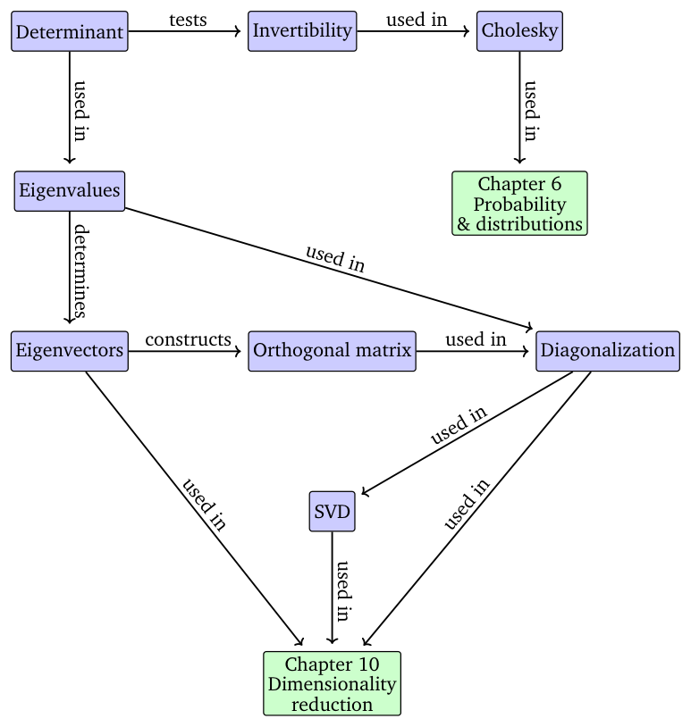

> **Figure 4.1** A mind map of the concepts introduced in this chapter, along with where they are used in other parts of the book.

**图 4.1** 本章所介绍概念的思维导图，以及这些概念在本书其他部分中的使用位置。

> both subsequent mathematical chapters, such as Chapter 6, but also in applied chapters, such as dimensionality reduction in Chapters 10 or density estimation in Chapter 11. This chapter’s overall structure is depicted in the mind map of Figure 4.1.

后续的数学章节（如第 6 章），也会用于应用性的章节（如第 10 章的降维或第 11 章的密度估计）。本章的整体结构如图 4.1 的思维导图所示。

## 4.1 行列式与迹（Determinant and Trace）

> Determinants are important concepts in linear algebra. A determinant is a mathematical object in the analysis and solution of systems of linear equations. Determinants are only defined for square matrices $A \in \mathbb{R}^{n \times n}$, i.e., matrices with the same number of rows and columns. In this book, we write the determinant as $\det(A)$ or sometimes as $|A|$ so that

行列式是线性代数中的重要概念。行列式是分析和求解线性方程组时的一种数学对象。行列式仅对方阵 $A \in \mathbb{R}^{n \times n}$（即行数与列数相同的矩阵）有定义。在本书中，我们把行列式写作 $\det(A)$，有时也写作 $|A|$，即

$$
\det(A) =
\begin{vmatrix}
a_{11} & a_{12} & \ldots & a_{1n} \\
a_{21} & a_{22} & \ldots & a_{2n} \\
\vdots & \vdots & \ddots & \vdots \\
a_{n1} & a_{n2} & \ldots & a_{nn}
\end{vmatrix}.
\tag{4.1}
$$

> The determinant of a square matrix $A \in \mathbb{R}^{n \times n}$ is a function that maps $A$ onto a real number. Before providing a definition of the determinant for general $n \times n$ matrices, let us have a look at some motivating examples, and define determinants for some special matrices.

方阵 $A \in \mathbb{R}^{n \times n}$ 的行列式是一个把 $A$ 映射为实数的函数。在给出一般 $n \times n$ 矩阵的行列式定义之前，我们先来看几个有启发性的例子，并为一些特殊矩阵定义行列式。

> **Example 4.1** (Testing for Matrix Invertibility) Let us begin with exploring if a square matrix $A$ is invertible (see Section 2.2.2). For the smallest cases, we already know when a matrix is invertible. If $A$ is a $1 \times 1$ matrix, i.e., it is a scalar number, then $A = a \implies A^{-1} = \frac{1}{a}$. Thus $a\frac{1}{a} = 1$ holds, if and only if $a \neq 0$. For $2 \times 2$ matrices, by the definition of the inverse (Definition 2.3), we know that $AA^{-1} = I$. Then, with (2.24), the inverse of $A$ is

**例 4.1**（矩阵可逆性的判定，Testing for Matrix Invertibility）让我们从考察方阵 $A$ 是否可逆开始（见 2.2.2 节）。对于最简单的几种情形，我们已经知道矩阵何时可逆。若 $A$ 是 $1 \times 1$ 矩阵，即它是一个标量，则 $A = a \implies A^{-1} = \frac{1}{a}$。因此，当且仅当 $a \neq 0$ 时，$a\frac{1}{a} = 1$ 成立。对于 $2 \times 2$ 矩阵，由逆的定义（定义 2.3）可知 $AA^{-1} = I$。于是，利用 (2.24)，$A$ 的逆为

$$
A^{-1} = \frac{1}{a_{11}a_{22} - a_{12}a_{21}}
\begin{pmatrix}
a_{22} & -a_{12} \\
-a_{21} & a_{11}
\end{pmatrix}.
\tag{4.2}
$$

> Hence, $A$ is invertible if and only if

因此，$A$ 可逆当且仅当

$$
a_{11}a_{22} - a_{12}a_{21} \neq 0.
\tag{4.3}
$$

> This quantity is the determinant of $A \in \mathbb{R}^{2 \times 2}$, i.e.,

这个量就是 $A \in \mathbb{R}^{2 \times 2}$ 的行列式，即

$$
\det(A) =
\begin{vmatrix}
a_{11} & a_{12} \\
a_{21} & a_{22}
\end{vmatrix}
= a_{11}a_{22} - a_{12}a_{21}.
\tag{4.4}
$$

> Example 4.1 points already at the relationship between determinants and the existence of inverse matrices. The next theorem states the same result for $n \times n$ matrices.

例 4.1 已经指出了行列式与逆矩阵的存在性之间的关系。下一个定理对 $n \times n$ 矩阵给出了同样的结论。

> **Theorem 4.1.** For any square matrix $A \in \mathbb{R}^{n \times n}$ it holds that $A$ is invertible if and only if $\det(A) \neq 0$.

**定理 4.1.** 对任意方阵 $A \in \mathbb{R}^{n \times n}$，$A$ 可逆当且仅当 $\det(A) \neq 0$。

> We have explicit (closed-form) expressions for determinants of small matrices in terms of the elements of the matrix. For $n = 1$,

对于小型矩阵，我们可以用矩阵的元素给出行列式的显式（闭式）表达式。当 $n = 1$ 时，

$$
\det(A) = \det(a_{11}) = a_{11}.
\tag{4.5}
$$

> For $n = 2$,

当 $n = 2$ 时，

$$
\det(A) =
\begin{vmatrix}
a_{11} & a_{12} \\
a_{21} & a_{22}
\end{vmatrix}
= a_{11}a_{22} - a_{12}a_{21},
\tag{4.6}
$$

> which we have observed in the preceding example.

这正是我们在前一个例子中所看到的结果。

> For $n = 3$ (known as Sarrus’ rule),

当 $n = 3$ 时（称为 Sarrus 法则，Sarrus’ rule），

$$
\begin{vmatrix}
a_{11} & a_{12} & a_{13} \\
a_{21} & a_{22} & a_{23} \\
a_{31} & a_{32} & a_{33}
\end{vmatrix}
= a_{11}a_{22}a_{33} + a_{21}a_{32}a_{13} + a_{31}a_{12}a_{23}
- a_{31}a_{22}a_{13} - a_{11}a_{32}a_{23} - a_{21}a_{12}a_{33}.
\tag{4.7}
$$

> For a memory aid of the product terms in Sarrus’ rule, try tracing the elements of the triple products in the matrix.

为帮助记忆 Sarrus 法则中的各乘积项，可以尝试在矩阵中描出各三重乘积所涉及元素的轨迹。

> We call a square matrix $T$ an upper-triangular matrix if $T_{ij} = 0$ for $i > j$, i.e., the matrix is zero below its diagonal. Analogously, we define a lower-triangular matrix as a matrix with zeros above its diagonal. For a triangular matrix $T \in \mathbb{R}^{n \times n}$, the determinant is the product of the diagonal elements, i.e.,

若方阵 $T$ 满足当 $i > j$ 时 $T_{ij} = 0$，即矩阵在对角线以下的部分全为零，则称 $T$ 为上三角矩阵（upper-triangular matrix）。类似地，我们把对角线以上部分全为零的矩阵定义为下三角矩阵（lower-triangular matrix）。对于三角矩阵 $T \in \mathbb{R}^{n \times n}$，其行列式等于各对角线元素之积，即

$$
\det(T) = \prod_{i=1}^{n} T_{ii}.
\tag{4.8}
$$

> **Figure 4.2** The area of the parallelogram (shaded region) spanned by the vectors $b$ and $g$ is $|\det([b, g])|$.

**图 4.2** 由向量 $b$ 和 $g$ 张成的平行四边形（阴影区域）的面积为 $|\det([b, g])|$。

> **Example 4.2** (Determinants as Measures of Volume) The notion of a determinant is natural when we consider it as a mapping from a set of $n$ vectors spanning an object in $\mathbb{R}^n$. It turns out that the determinant $\det(A)$ is the signed volume of an $n$-dimensional parallelepiped formed by columns of the matrix $A$.

**例 4.2**（作为体积度量的行列式，Determinants as Measures of Volume）如果把行列式看作定义在 $n$ 个向量组成的集合上的映射，而这 $n$ 个向量张成 $\mathbb{R}^n$ 中的一个对象，那么行列式的概念就显得十分自然。事实证明，行列式 $\det(A)$ 正是由矩阵 $A$ 的各列所构成的 $n$ 维平行六面体（parallelepiped）的有向体积（signed volume）。

> For $n = 2$, the columns of the matrix form a parallelogram; see Figure 4.2. As the angle between vectors gets smaller, the area of a parallelogram shrinks, too. Consider two vectors $b, g$ that form the columns of a matrix $A = [b, g]$. Then, the absolute value of the determinant of $A$ is the area of the parallelogram with vertices $0, b, g, b + g$. In particular, if $b, g$ are linearly dependent so that $b = \lambda g$ for some $\lambda \in \mathbb{R}$, they no longer form a two-dimensional parallelogram. Therefore, the corresponding area is $0$. On the contrary, if $b, g$ are linearly independent and are multiples of the canonical basis vectors $e_1, e_2$ then they can be written as $b = \begin{pmatrix} b \\ 0 \end{pmatrix}$ and $g = \begin{pmatrix} 0 \\ g \end{pmatrix}$, and the determinant is

当 $n = 2$ 时，矩阵的各列构成一个平行四边形；见图 4.2。当向量之间的夹角变小时，平行四边形的面积也随之缩小。考虑两个向量 $b, g$，它们构成矩阵 $A = [b, g]$ 的列。此时，$A$ 的行列式的绝对值就是以 $0, b, g, b+g$ 为顶点的平行四边形的面积。特别地，若 $b, g$ 线性相关，即对某个 $\lambda \in \mathbb{R}$ 有 $b = \lambda g$，则它们不再构成二维的平行四边形，因此相应的面积为 0。相反，若 $b, g$ 线性无关，且都是标准基向量 $e_1, e_2$ 的倍数，则它们可以写为 $b = \begin{pmatrix} b \\ 0 \end{pmatrix}$ 与 $g = \begin{pmatrix} 0 \\ g \end{pmatrix}$，此时行列式为

$$
\begin{vmatrix}
b & 0 \\
0 & g
\end{vmatrix}
= bg - 0 = bg.
$$

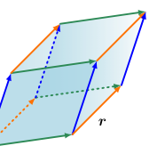

> **Figure 4.3** The volume of the parallelepiped (shaded volume) spanned by vectors $r$, $b$, $g$ is $|\det([r, b, g])|$.

**图 4.3** 由向量 $r$、$b$、$g$ 张成的平行六面体（阴影体积）的体积为 $|\det([r, b, g])|$。

> The sign of the determinant indicates the orientation of the spanning vectors $b, g$ with respect to the standard basis $(e_1, e_2)$. In our figure, flipping the order to $g, b$ swaps the columns of $A$ and reverses the orientation of the shaded area. This becomes the familiar formula: area = height × length. This intuition extends to higher dimensions. In $\mathbb{R}^3$, we consider three vectors $r, b, g \in \mathbb{R}^3$ spanning the edges of a parallelepiped, i.e., a solid with faces that are parallel parallelograms (see Figure 4.3). The absolute value of the determinant of the $3 \times 3$ matrix $[r, b, g]$ is the volume of the solid. Thus, the determinant acts as a function that measures the signed volume formed by column vectors composed in a matrix.

行列式的符号表示张成向量 $b, g$ 相对于标准基 $(e_1, e_2)$ 的定向（orientation）。在我们的图中，把顺序换成 $g, b$ 会交换 $A$ 的两列，并使阴影区域的定向反转。这就化为我们熟悉的公式：面积 = 高 × 长。这一直觉可以推广到更高维的情形。在 $\mathbb{R}^3$ 中，我们考虑三个向量 $r, b, g \in \mathbb{R}^3$，它们张成一个平行六面体的棱；平行六面体是各面均为成对平行的平行四边形的立体（见图 4.3）。$3 \times 3$ 矩阵 $[r, b, g]$ 的行列式的绝对值就是该立体的体积。因此，行列式就像一个度量函数：它度量由矩阵中各列向量所构成的有向体积。

> Consider the three linearly independent vectors $r, g, b \in \mathbb{R}^3$ given as

考虑三个线性无关的向量 $r, g, b \in \mathbb{R}^3$：

$$
r = \begin{pmatrix} 2 \\ 6 \\ 1 \end{pmatrix}, \quad
g = \begin{pmatrix} 0 \\ 1 \\ 4 \end{pmatrix}, \quad
b = \begin{pmatrix} -8 \\ 0 \\ -1 \end{pmatrix}.
\tag{4.9}
$$

> Writing these vectors as the columns of a matrix

把这些向量作为列写成矩阵

$$
A = [r, g, b] =
\begin{pmatrix}
2 & 0 & -8 \\
6 & 1 & 0 \\
1 & 4 & -1
\end{pmatrix}
\tag{4.10}
$$

> allows us to compute the desired volume as

便可计算所求的体积

$$
V = |\det(A)| = 186.
\tag{4.11}
$$

> Computing the determinant of an $n \times n$ matrix requires a general algorithm to solve the cases for $n > 3$, which we are going to explore in the following. Theorem 4.2 below reduces the problem of computing the determinant of an $n \times n$ matrix to computing the determinant of $(n-1) \times (n-1)$ matrices. By recursively applying the Laplace expansion (Theorem 4.2), we can therefore compute determinants of $n \times n$ matrices by ultimately computing determinants of $2 \times 2$ matrices.

计算 $n \times n$ 矩阵的行列式需要一种能处理 $n > 3$ 情形的通用算法，我们将在下文对此进行探讨。下方的定理 4.2 把计算 $n \times n$ 矩阵行列式的问题归约为计算 $(n-1) \times (n-1)$ 矩阵行列式的问题。因此，递归地应用 Laplace 展开（Laplace expansion，定理 4.2），我们最终可以通过计算 $2 \times 2$ 矩阵的行列式求出 $n \times n$ 矩阵的行列式。

> **Theorem 4.2** (Laplace Expansion). Consider a matrix $A \in \mathbb{R}^{n \times n}$. Then, for all $j = 1, \ldots, n$:

**定理 4.2**（Laplace 展开，Laplace Expansion）。考虑矩阵 $A \in \mathbb{R}^{n \times n}$。那么，对所有 $j = 1, \ldots, n$：

> 1. Expansion along column $j$

1. 沿第 $j$ 列展开

$$
\det(A) = \sum_{k=1}^{n} (-1)^{k+j} a_{kj} \det(A_{k,j}).
\tag{4.12}
$$

> 2. Expansion along row $j$

2. 沿第 $j$ 行展开

$$
\det(A) = \sum_{k=1}^{n} (-1)^{k+j} a_{jk} \det(A_{j,k}).
\tag{4.13}
$$

> Here $A_{k,j} \in \mathbb{R}^{(n-1) \times (n-1)}$ is the submatrix of $A$ that we obtain when deleting row $k$ and column $j$.

其中 $A_{k,j} \in \mathbb{R}^{(n-1) \times (n-1)}$ 是从 $A$ 中删去第 $k$ 行与第 $j$ 列后得到的子矩阵。

> **Example 4.3** (Laplace Expansion) Let us compute the determinant of

**例 4.3**（Laplace 展开，Laplace Expansion）我们来计算下述矩阵的行列式

$$
A =
\begin{pmatrix}
1 & 2 & 3 \\
3 & 1 & 2 \\
0 & 0 & 1
\end{pmatrix}
\tag{4.14}
$$

> using the Laplace expansion along the first row. Applying (4.13) yields

并使用沿第一行的 Laplace 展开。应用 (4.13) 得

$$
\begin{vmatrix}
1 & 2 & 3 \\
3 & 1 & 2 \\
0 & 0 & 1
\end{vmatrix}
= (-1)^{1+1} \cdot 1
\begin{vmatrix} 1 & 2 \\ 0 & 1 \end{vmatrix}
+ (-1)^{1+2} \cdot 2
\begin{vmatrix} 3 & 2 \\ 0 & 1 \end{vmatrix}
+ (-1)^{1+3} \cdot 3
\begin{vmatrix} 3 & 1 \\ 0 & 0 \end{vmatrix}.
\tag{4.15}
$$

> We use (4.6) to compute the determinants of all $2 \times 2$ matrices and obtain

我们利用 (4.6) 计算其中所有 $2 \times 2$ 矩阵的行列式，得到

$$
\det(A) = 1(1-0) - 2(3-0) + 3(0-0) = -5.
\tag{4.16}
$$

> For completeness we can compare this result to computing the determinant using Sarrus’ rule (4.7):

为完整起见，我们可以将此结果与利用 Sarrus 法则 (4.7) 计算行列式的结果加以比较：

$$
\det(A) = 1 \cdot 1 \cdot 1 + 3 \cdot 0 \cdot 3 + 0 \cdot 2 \cdot 2 - 0 \cdot 1 \cdot 3 - 1 \cdot 0 \cdot 2 - 3 \cdot 2 \cdot 1 = 1 - 6 = -5.
\tag{4.17}
$$

> For $A \in \mathbb{R}^{n \times n}$ the determinant exhibits the following properties:

对 $A \in \mathbb{R}^{n \times n}$，行列式具有如下性质：

> The determinant of a matrix product is the product of the corresponding determinants, $\det(AB) = \det(A)\det(B)$. Determinants are invariant to transposition, i.e., $\det(A) = \det(A^\top)$. If $A$ is regular (invertible), then $\det(A^{-1}) = \frac{1}{\det(A)}$. Similar matrices (Definition 2.22) possess the same determinant. Therefore, for a linear mapping $\Phi : V \to V$ all transformation matrices $A_\Phi$ of $\Phi$ have the same determinant. Thus, the determinant is invariant to the choice of basis of a linear mapping. Adding a multiple of a column/row to another one does not change $\det(A)$. Multiplication of a column/row with $\lambda \in \mathbb{R}$ scales $\det(A)$ by $\lambda$. In particular, $\det(\lambda A) = \lambda^n \det(A)$. Swapping two rows/columns changes the sign of $\det(A)$.

矩阵乘积的行列式等于相应行列式的乘积，即 $\det(AB) = \det(A)\det(B)$。行列式对转置不变，即 $\det(A) = \det(A^\top)$。若 $A$ 正则（可逆），则 $\det(A^{-1}) = \frac{1}{\det(A)}$。相似矩阵（定义 2.22）具有相同的行列式。因此，对线性映射 $\Phi : V \to V$ 而言，$\Phi$ 的所有变换矩阵 $A_\Phi$ 都具有相同的行列式，也就是说，行列式不随线性映射之基的选取而改变。把某一列/行的倍数加到另一列/行上不会改变 $\det(A)$。将某一列/行乘以 $\lambda \in \mathbb{R}$ 会使 $\det(A)$ 缩放 $\lambda$ 倍；特别地，$\det(\lambda A) = \lambda^n \det(A)$。交换两行/两列会改变 $\det(A)$ 的符号。

> Because of the last three properties, we can use Gaussian elimination (see Section 2.1) to compute $\det(A)$ by bringing $A$ into row-echelon form. We can stop Gaussian elimination when we have $A$ in a triangular form where the elements below the diagonal are all $0$. Recall from (4.8) that the determinant of a triangular matrix is the product of the diagonal elements.

得益于最后三条性质，我们可以利用高斯消元（见 2.1 节）把 $A$ 化为行阶梯形，从而计算 $\det(A)$。当 $A$ 化为对角线以下元素全为 0 的三角形式时，即可停止高斯消元。由 (4.8) 回忆可知，三角矩阵的行列式等于其对角线元素之积。

> **Theorem 4.3.** A square matrix $A \in \mathbb{R}^{n \times n}$ has $\det(A) \neq 0$ if and only if $\operatorname{rk}(A) = n$. In other words, $A$ is invertible if and only if it is full rank.

**定理 4.3.** 方阵 $A \in \mathbb{R}^{n \times n}$ 满足 $\det(A) \neq 0$ 当且仅当 $\operatorname{rk}(A) = n$。换言之，$A$ 可逆当且仅当它满秩。

> When mathematics was mainly performed by hand, the determinant calculation was considered an essential way to analyze matrix invertibility. However, contemporary approaches in machine learning use direct numerical methods that superseded the explicit calculation of the determinant. For example, in Chapter 2, we learned that inverse matrices can be computed by Gaussian elimination. Gaussian elimination can thus be used to compute the determinant of a matrix.

在数学计算主要依靠手工的时代，行列式计算被视为分析矩阵可逆性的一种基本方法。然而，当代机器学习方法使用直接的数值方法，这些方法已取代了行列式的显式计算。例如，第 2 章中我们学过，逆矩阵可以通过高斯消元来计算，因此高斯消元同样可用于计算矩阵的行列式。

> Determinants will play an important theoretical role for the following sections, especially when we learn about eigenvalues and eigenvectors (Section 4.2) through the characteristic polynomial.

行列式将在后续各节中发挥重要的理论作用，尤其是在我们通过特征多项式（characteristic polynomial）学习特征值（eigenvalue）与特征向量（eigenvector）时（见 4.2 节）。

> **Definition 4.4.** The trace of a square matrix $A \in \mathbb{R}^{n \times n}$ is defined as

**定义 4.4.** 方阵 $A \in \mathbb{R}^{n \times n}$ 的迹（trace）定义为

$$
\operatorname{tr}(A) := \sum_{i=1}^{n} a_{ii},
\tag{4.18}
$$

> i.e., the trace is the sum of the diagonal elements of $A$.

即迹就是 $A$ 的对角线元素之和。

> The trace satisfies the following properties:

迹满足如下性质：

$$
\begin{aligned}
&\operatorname{tr}(A + B) = \operatorname{tr}(A) + \operatorname{tr}(B) \quad \text{for } A, B \in \mathbb{R}^{n \times n} \\
&\operatorname{tr}(\alpha A) = \alpha \operatorname{tr}(A), \ \alpha \in \mathbb{R} \quad \text{for } A \in \mathbb{R}^{n \times n} \\
&\operatorname{tr}(I_n) = n \\
&\operatorname{tr}(AB) = \operatorname{tr}(BA) \quad \text{for } A \in \mathbb{R}^{n \times k}, \ B \in \mathbb{R}^{k \times n}
\end{aligned}
$$

> It can be shown that only one function satisfies these four properties together – the trace (Gohberg et al., 2012).

可以证明，只有唯一的一个函数能同时满足这四条性质——它就是迹（Gohberg et al., 2012）。

> The properties of the trace of matrix products are more general. Specifically, the trace is invariant under cyclic permutations, i.e.,

矩阵乘积的迹的性质更为一般。具体而言，迹在循环置换（cyclic permutations）下保持不变，即

$$
\operatorname{tr}(AKL) = \operatorname{tr}(KLA)
\tag{4.19}
$$

> for matrices $A \in \mathbb{R}^{a \times k}$, $K \in \mathbb{R}^{k \times l}$, $L \in \mathbb{R}^{l \times a}$. This property generalizes to products of an arbitrary number of matrices. As a special case of (4.19), it follows that for two vectors $x, y \in \mathbb{R}^n$

其中 $A \in \mathbb{R}^{a \times k}$，$K \in \mathbb{R}^{k \times l}$，$L \in \mathbb{R}^{l \times a}$。这一性质可推广到任意多个矩阵的乘积。作为 (4.19) 的特例，对于两个向量 $x, y \in \mathbb{R}^n$，可得

$$
\operatorname{tr}(xy^\top) = \operatorname{tr}(y^\top x) = y^\top x \in \mathbb{R}.
\tag{4.20}
$$

> Given a linear mapping $\Phi : V \to V$, where $V$ is a vector space, we define the trace of this map by using the trace of matrix representation of $\Phi$. For a given basis of $V$, we can describe $\Phi$ by means of the transformation matrix $A$. Then the trace of $\Phi$ is the trace of $A$. For a different basis of $V$, it holds that the corresponding transformation matrix $B$ of $\Phi$ can be obtained by a basis change of the form $S^{-1}AS$ for suitable $S$ (see Section 2.7.2). For the corresponding trace of $\Phi$, this means

给定线性映射 $\Phi : V \to V$（其中 $V$ 是向量空间），我们利用 $\Phi$ 的矩阵表示的迹来定义该映射的迹。对于 $V$ 的一组给定的基，我们可以借助变换矩阵 $A$ 来描述 $\Phi$，此时 $\Phi$ 的迹就是 $A$ 的迹。对于 $V$ 的另一组基，$\Phi$ 相应的变换矩阵 $B$ 可以通过取合适的 $S$、施行形如 $S^{-1}AS$ 的基变换得到（见 2.7.2 节）。对于 $\Phi$ 相应的迹，这意味着

$$
\operatorname{tr}(B) = \operatorname{tr}(S^{-1}AS) \overset{(4.19)}{=} \operatorname{tr}(ASS^{-1}) = \operatorname{tr}(A).
\tag{4.21}
$$

> Hence, while matrix representations of linear mappings are basis dependent the trace of a linear mapping $\Phi$ is independent of the basis.

因此，虽然线性映射的矩阵表示依赖于基的选取，但线性映射 $\Phi$ 的迹却与基无关。

> In this section, we covered determinants and traces as functions characterizing a square matrix. Taking together our understanding of determinants and traces we can now define an important equation describing a matrix $A$ in terms of a polynomial, which we will use extensively in the following sections.

本节中，我们介绍了行列式与迹这两种刻画方阵的函数。综合对行列式和迹的理解，我们现在可以定义一个用多项式描述矩阵 $A$ 的重要方程，接下来的几节中将广泛用到它。

> **Definition 4.5** (Characteristic Polynomial). For $\lambda \in \mathbb{R}$ and a square matrix $A \in \mathbb{R}^{n \times n}$

**定义 4.5**（特征多项式，Characteristic Polynomial）。对于 $\lambda \in \mathbb{R}$ 和方阵 $A \in \mathbb{R}^{n \times n}$，

$$
p_A(\lambda) := \det(A - \lambda I)
\tag{4.22a}
$$

$$
= c_0 + c_1\lambda + c_2\lambda^2 + \cdots + c_{n-1}\lambda^{n-1} + (-1)^n \lambda^n\,,
\tag{4.22b}
$$

> $c_0, \ldots, c_{n-1} \in \mathbb{R}$, is the characteristic polynomial of $A$. In particular,

其中 $c_0, \ldots, c_{n-1} \in \mathbb{R}$，则 $p_A(\lambda)$ 即为 $A$ 的特征多项式。特别地，

$$
c_0 = \det(A),
\tag{4.23}
$$

$$
c_{n-1} = (-1)^{n-1}\operatorname{tr}(A).
\tag{4.24}
$$

> The characteristic polynomial (4.22a) will allow us to compute eigenvalues and eigenvectors, covered in the next section.

特征多项式 (4.22a) 将使我们能够计算特征值和特征向量，这将在下一节中介绍。

## 4.2 特征值与特征向量（Eigenvalues and Eigenvectors）

> We will now get to know a new way to characterize a matrix and its associated linear mapping. Recall from Section 2.7.1 that every linear mapping has a unique transformation matrix given an ordered basis. We can interpret linear mappings and their associated transformation matrices by performing an “eigen” analysis. As we will see, the eigenvalues of a linear mapping will tell us how a special set of vectors, the eigenvectors, is transformed by the linear mapping.

现在，我们将了解一种刻画矩阵及其相关线性映射的新方法。回顾 2.7.1 节，在给定一组有序基的条件下，每个线性映射都有唯一的变换矩阵。我们可以通过 “eigen”（特征）分析来解读线性映射及其相关的变换矩阵。正如我们将看到的，线性映射的特征值会告诉我们，一组特殊的向量——特征向量——是如何被该线性映射变换的。

> **Definition 4.6.** Let $A \in \mathbb{R}^{n \times n}$ be a square matrix. Then $\lambda \in \mathbb{R}$ is an eigenvalue of $A$ and $x \in \mathbb{R}^n \setminus \{0\}$ is the corresponding eigenvector of $A$ if

**定义 4.6.** 设 $A \in \mathbb{R}^{n \times n}$ 为一个方阵。若 $\lambda \in \mathbb{R}$ 是 $A$ 的一个特征值，且 $x \in \mathbb{R}^n \setminus \{0\}$ 是 $A$ 相应的特征向量，即

$$
Ax = \lambda x.
\tag{4.25}
$$

> We call (4.25) the eigenvalue equation.

我们称 (4.25) 为特征值方程（eigenvalue equation）。

> **Remark.** In the linear algebra literature and software, it is often a convention that eigenvalues are sorted in descending order, so that the largest eigenvalue and associated eigenvector are called the first eigenvalue and its associated eigenvector, and the second largest called the second eigenvalue and its associated eigenvector, and so on. However, textbooks and publications may have different or no notion of orderings. We do not want to presume an ordering in this book if not stated explicitly. ♢

**评注.** 在线性代数文献和软件中，通常的约定是将特征值按降序排列，于是最大的特征值及其相关特征向量被称为第一特征值及其相关特征向量，第二大的则称为第二特征值及其相关特征向量，依此类推。然而，教科书和论文可能有不同的排序方式，或者根本没有排序的概念。在本书中，若未明确说明，我们不预设任何排序。♢

> The following statements are equivalent:
>
> - $\lambda$ is an eigenvalue of $A \in \mathbb{R}^{n \times n}$.
> - There exists an $x \in \mathbb{R}^n \setminus \{0\}$ with $Ax = \lambda x$, or equivalently, $(A - \lambda I_n)x = 0$ can be solved non-trivially, i.e., $x \neq 0$.
> - $\operatorname{rk}(A - \lambda I_n) < n$.
> - $\det(A - \lambda I_n) = 0$.

下列命题相互等价：

- $\lambda$ 是 $A \in \mathbb{R}^{n \times n}$ 的特征值。
- 存在 $x \in \mathbb{R}^n \setminus \{0\}$ 使得 $Ax = \lambda x$；等价地，$(A - \lambda I_n)x = 0$ 存在非平凡解，即 $x \neq 0$。
- $\operatorname{rk}(A - \lambda I_n) < n$。
- $\det(A - \lambda I_n) = 0$。

> **Definition 4.7** (Collinearity and Codirection). Two vectors that point in the same direction are called codirected. Two vectors are collinear if they point in the same or the opposite direction.

**定义 4.7**（共线与同向，Collinearity and Codirection）。方向相同的两个向量称为同向的（codirected）。如果两个向量的方向相同或相反，则称它们共线（collinear）。

> **Remark** (Non-uniqueness of eigenvectors). If $x$ is an eigenvector of $A$ associated with eigenvalue $\lambda$, then for any $c \in \mathbb{R} \setminus \{0\}$ it holds that $cx$ is an eigenvector of $A$ with the same eigenvalue since

**评注**（特征向量的非唯一性）。如果 $x$ 是 $A$ 的与特征值 $\lambda$ 相关联的特征向量，那么对任意 $c \in \mathbb{R} \setminus \{0\}$，$cx$ 都是 $A$ 的具有同一特征值的特征向量，因为

$$
A(cx) = cAx = c\lambda x = \lambda(cx).
\tag{4.26}
$$

> Thus, all vectors that are collinear to $x$ are also eigenvectors of $A$. ♢

因此，所有与 $x$ 共线的向量也都是 $A$ 的特征向量。♢

> **Theorem 4.8.** $\lambda \in \mathbb{R}$ is an eigenvalue of $A \in \mathbb{R}^{n \times n}$ if and only if $\lambda$ is a root of the characteristic polynomial $p_A(\lambda)$ of $A$.

**定理 4.8.** $\lambda \in \mathbb{R}$ 是 $A \in \mathbb{R}^{n \times n}$ 的特征值，当且仅当 $\lambda$ 是 $A$ 的特征多项式 $p_A(\lambda)$ 的一个根。

> **Definition 4.9.** Let a square matrix $A$ have an eigenvalue $\lambda_i$. The algebraic multiplicity of $\lambda_i$ is the number of times the root appears in the characteristic polynomial.

**定义 4.9.** 设方阵 $A$ 有一个特征值 $\lambda_i$。$\lambda_i$ 的代数重数（algebraic multiplicity）是指该根在特征多项式中出现的次数。

> **Definition 4.10** (Eigenspace and Eigenspectrum). For $A \in \mathbb{R}^{n \times n}$, the set of all eigenvectors of $A$ associated with an eigenvalue $\lambda$ spans a subspace of $\mathbb{R}^n$, which is called the eigenspace of $A$ with respect to $\lambda$ and is denoted by $E_\lambda$. The set of all eigenvalues of $A$ is called the eigenspectrum, or just spectrum, of $A$.

**定义 4.10**（特征空间与特征谱，Eigenspace and Eigenspectrum）。对于 $A \in \mathbb{R}^{n \times n}$，$A$ 的与某一特征值 $\lambda$ 相关联的所有特征向量张成 $\mathbb{R}^n$ 的一个子空间，该子空间称为 $A$ 关于 $\lambda$ 的特征空间，记作 $E_\lambda$。$A$ 的所有特征值构成的集合称为 $A$ 的特征谱，或简称谱（spectrum）。

> If $\lambda$ is an eigenvalue of $A \in \mathbb{R}^{n \times n}$, then the corresponding eigenspace $E_\lambda$ is the solution space of the homogeneous system of linear equations $(A - \lambda I)x = 0$. Geometrically, the eigenvector corresponding to a nonzero eigenvalue points in a direction that is stretched by the linear mapping. The eigenvalue is the factor by which it is stretched. If the eigenvalue is negative, the direction of the stretching is flipped.

如果 $\lambda$ 是 $A \in \mathbb{R}^{n \times n}$ 的一个特征值，那么相应的特征空间 $E_\lambda$ 就是齐次线性方程组 $(A - \lambda I)x = 0$ 的解空间。从几何上看，与非零特征值相对应的特征向量所指向的方向会被线性映射拉伸，特征值就是拉伸的倍数。如果特征值为负，则拉伸的方向会翻转。

> **Example 4.4** (The Case of the Identity Matrix) The identity matrix $I \in \mathbb{R}^{n \times n}$ has characteristic polynomial $p_I(\lambda) = \det(I - \lambda I) = (1 - \lambda)^n = 0$, which has only one eigenvalue $\lambda = 1$ that occurs $n$ times. Moreover, $Ix = \lambda x = 1x$ holds for all vectors $x \in \mathbb{R}^n \setminus \{0\}$. Because of this, the sole eigenspace $E_1$ of the identity matrix spans $n$ dimensions, and all $n$ standard basis vectors of $\mathbb{R}^n$ are eigenvectors of $I$.

**例 4.4**（单位矩阵的情形）单位矩阵 $I \in \mathbb{R}^{n \times n}$ 的特征多项式为 $p_I(\lambda) = \det(I - \lambda I) = (1 - \lambda)^n = 0$，它只有一个出现 $n$ 次的特征值 $\lambda = 1$。此外，对所有向量 $x \in \mathbb{R}^n \setminus \{0\}$ 都有 $Ix = \lambda x = 1x$。正因为如此，单位矩阵唯一的特征空间 $E_1$ 张成 $n$ 个维度，而 $\mathbb{R}^n$ 的全部 $n$ 个标准基向量都是 $I$ 的特征向量。

> Useful properties regarding eigenvalues and eigenvectors include the following: A matrix $A$ and its transpose $A^\top$ possess the same eigenvalues, but not necessarily the same eigenvectors. The eigenspace $E_\lambda$ is the null space of $A - \lambda I$ since

关于特征值和特征向量的若干有用性质包括：矩阵 $A$ 及其转置 $A^\top$ 具有相同的特征值，但特征向量不一定相同。特征空间 $E_\lambda$ 是 $A - \lambda I$ 的零空间，因为

$$
Ax = \lambda x \iff Ax - \lambda x = 0
\tag{4.27a}
$$

$$
\iff (A - \lambda I)x = 0 \iff x \in \ker(A - \lambda I).
\tag{4.27b}
$$

> Similar matrices (see Definition 2.22) possess the same eigenvalues. Therefore, a linear mapping $\Phi$ has eigenvalues that are independent of the choice of basis of its transformation matrix. This makes eigenvalues, together with the determinant and the trace, key characteristic parameters of a linear mapping as they are all invariant under basis change. Symmetric, positive definite matrices always have positive, real eigenvalues.

相似矩阵（见定义 2.22）具有相同的特征值。因此，线性映射 $\Phi$ 的特征值不依赖于其变换矩阵的基的选择。这使得特征值与行列式、迹一起成为线性映射的关键特征参数，因为它们在基变换下都保持不变。对称的正定矩阵总是具有正的实特征值。

> **Example 4.5** (Computing Eigenvalues, Eigenvectors, and Eigenspaces) Let us find the eigenvalues and eigenvectors of the $2 \times 2$ matrix

**例 4.5**（计算特征值、特征向量与特征空间）我们来求下面这个 $2 \times 2$ 矩阵的特征值和特征向量

$$
A = \begin{pmatrix} 4 & 2 \\ 1 & 3 \end{pmatrix}.
\tag{4.28}
$$

> Step 1: Characteristic Polynomial. From our definition of the eigenvector $x \neq 0$ and eigenvalue $\lambda$ of $A$, there will be a vector such that $Ax = \lambda x$, i.e., $(A - \lambda I)x = 0$. Since $x \neq 0$, this requires that the kernel (null space) of $A - \lambda I$ contains more elements than just $0$. This means that $A - \lambda I$ is not invertible and therefore $\det(A - \lambda I) = 0$. Hence, we need to compute the roots of the characteristic polynomial (4.22a) to find the eigenvalues.

第 1 步：特征多项式。根据特征向量 $x \neq 0$ 与 $A$ 的特征值 $\lambda$ 的定义，将存在一个向量使得 $Ax = \lambda x$，即 $(A - \lambda I)x = 0$。由于 $x \neq 0$，这要求 $A - \lambda I$ 的核（零空间）所包含的元素不止 $0$。这意味着 $A - \lambda I$ 不可逆，因此 $\det(A - \lambda I) = 0$。于是，我们需要计算特征多项式 (4.22a) 的根来求出特征值。

> Step 2: Eigenvalues. The characteristic polynomial is

第 2 步：特征值。特征多项式为

$$
p_A(\lambda) = \det(A - \lambda I)
\tag{4.29a}
$$

$$
= \det\left( \begin{pmatrix} 4 & 2 \\ 1 & 3 \end{pmatrix} - \begin{pmatrix} \lambda & 0 \\ 0 & \lambda \end{pmatrix} \right) = \det \begin{pmatrix} 4 - \lambda & 2 \\ 1 & 3 - \lambda \end{pmatrix}
\tag{4.29b}
$$

$$
= (4 - \lambda)(3 - \lambda) - 2 \cdot 1.
\tag{4.29c}
$$

> We factorize the characteristic polynomial and obtain

我们对特征多项式作因式分解，得到

$$
p(\lambda) = (4 - \lambda)(3 - \lambda) - 2 \cdot 1 = 10 - 7\lambda + \lambda^2 = (2 - \lambda)(5 - \lambda)
\tag{4.30}
$$

> giving the roots $\lambda_1 = 2$ and $\lambda_2 = 5$.

从而得到根 $\lambda_1 = 2$ 和 $\lambda_2 = 5$。

> Step 3: Eigenvectors and Eigenspaces. We find the eigenvectors that correspond to these eigenvalues by looking at vectors $x$ such that

第 3 步：特征向量与特征空间。我们通过考察满足下式的向量 $x$ 来寻找与这些特征值相对应的特征向量

$$
\begin{pmatrix} 4 - \lambda & 2 \\ 1 & 3 - \lambda \end{pmatrix} x = 0.
\tag{4.31}
$$

> For $\lambda = 5$ we obtain

对于 $\lambda = 5$，我们得到

$$
\begin{pmatrix} 4 - 5 & 2 \\ 1 & 3 - 5 \end{pmatrix} \begin{pmatrix} x_1 \\ x_2 \end{pmatrix} = \begin{pmatrix} -1 & 2 \\ 1 & -2 \end{pmatrix} \begin{pmatrix} x_1 \\ x_2 \end{pmatrix} = 0.
\tag{4.32}
$$

> We solve this homogeneous system and obtain a solution space

我们求解这一齐次方程组，得到一个解空间

$$
E_5 = \operatorname{span}[\begin{pmatrix} 2 \\ 1 \end{pmatrix}].
\tag{4.33}
$$

> This eigenspace is one-dimensional as it possesses a single basis vector.

该特征空间是一维的，因为它只拥有一个基向量。

> Analogously, we find the eigenvector for $\lambda = 2$ by solving the homogeneous system of equations

类似地，我们通过求解如下齐次方程组来寻找 $\lambda = 2$ 对应的特征向量

$$
\begin{pmatrix} 4 - 2 & 2 \\ 1 & 3 - 2 \end{pmatrix} x = \begin{pmatrix} 2 & 2 \\ 1 & 1 \end{pmatrix} x = 0.
\tag{4.34}
$$

> This means any vector $x = \begin{pmatrix} x_1 \\ x_2 \end{pmatrix}$, where $x_2 = -x_1$, such as $\begin{pmatrix} 1 \\ -1 \end{pmatrix}$, is an eigenvector with eigenvalue 2. The corresponding eigenspace is given as

这意味着任何形如 $x = \begin{pmatrix} x_1 \\ x_2 \end{pmatrix}$（其中 $x_2 = -x_1$）的向量，例如 $\begin{pmatrix} 1 \\ -1 \end{pmatrix}$，都是特征值为 2 的特征向量。相应的特征空间为

$$
E_2 = \operatorname{span}[\begin{pmatrix} 1 \\ -1 \end{pmatrix}].
\tag{4.35}
$$

> The two eigenspaces $E_5$ and $E_2$ in Example 4.5 are one-dimensional as they are each spanned by a single vector. However, in other cases we may have multiple identical eigenvalues (see Definition 4.9) and the eigenspace may have more than one dimension.

例 4.5 中的两个特征空间 $E_5$ 和 $E_2$ 都是一维的，因为它们各自都由单个向量张成。然而，在其他情况下，我们可能遇到多个相同的特征值（见定义 4.9），此时特征空间的维数可能大于一。

> **Definition 4.11.** Let $\lambda_i$ be an eigenvalue of a square matrix $A$. Then the geometric multiplicity of $\lambda_i$ is the number of linearly independent eigenvectors associated with $\lambda_i$. In other words, it is the dimensionality of the eigenspace spanned by the eigenvectors associated with $\lambda_i$.

**定义 4.11.** 设 $\lambda_i$ 是方阵 $A$ 的一个特征值。$\lambda_i$ 的几何重数（geometric multiplicity）是与 $\lambda_i$ 相关联的线性无关特征向量的个数。换言之，它就是由与 $\lambda_i$ 相关联的特征向量所张成的特征空间的维数。

> **Remark.** A specific eigenvalue's geometric multiplicity must be at least one because every eigenvalue has at least one associated eigenvector. An eigenvalue's geometric multiplicity cannot exceed its algebraic multiplicity, but it may be lower. ♢

**评注.** 某一特征值的几何重数至少为 1，因为每个特征值都至少有一个与之相关联的特征向量。特征值的几何重数不会超过其代数重数，但可能更小。♢

> **Example 4.6** The matrix $A = \begin{pmatrix} 2 & 1 \\ 0 & 2 \end{pmatrix}$ has two repeated eigenvalues $\lambda_1 = \lambda_2 = 2$ and an algebraic multiplicity of 2. The eigenvalue has, however, only one distinct unit eigenvector $x_1 = \begin{pmatrix} 1 \\ 0 \end{pmatrix}$ and, thus, geometric multiplicity 1.

**例 4.6** 矩阵 $A = \begin{pmatrix} 2 & 1 \\ 0 & 2 \end{pmatrix}$ 具有两个重特征值 $\lambda_1 = \lambda_2 = 2$，代数重数为 2。然而，该特征值只有一个互异的单位特征向量 $x_1 = \begin{pmatrix} 1 \\ 0 \end{pmatrix}$，因此几何重数为 1。

#### 二维的图形直观（Graphical Intuition in Two Dimensions）

> Let us gain some intuition for determinants, eigenvectors, and eigenvalues using different linear mappings. Figure 4.4 depicts five transformation matrices $A_1, \ldots, A_5$ and their impact on a square grid of points, centered at the origin:

让我们借助不同的线性映射，来获得关于行列式、特征向量和特征值的一些直观认识。图 4.4 描绘了五个变换矩阵 $A_1, \ldots, A_5$，以及它们对以原点为中心的方形点阵的影响：

$$
A_1 = \begin{pmatrix} \frac{1}{2} & 0 \\ 0 & 2 \end{pmatrix}.
$$

> The direction of the two eigenvectors correspond to the canonical basis vectors in $\mathbb{R}^2$, i.e., to two cardinal axes. The vertical axis is extended by a factor of 2 (eigenvalue $\lambda_1 = 2$), and the horizontal axis is compressed by factor $\frac{1}{2}$ (eigenvalue $\lambda_2 = \frac{1}{2}$). The mapping is area preserving ($\det(A_1) = 1 = 2 \cdot \frac{1}{2}$).

两个特征向量的方向对应于 $\mathbb{R}^2$ 中的标准基向量，即两条主轴。竖直轴被拉伸到原来的 2 倍（特征值 $\lambda_1 = 2$），而水平轴被压缩到原来的 $\frac{1}{2}$（特征值 $\lambda_2 = \frac{1}{2}$）。该映射是保面积的（$\det(A_1) = 1 = 2 \cdot \frac{1}{2}$）。

$$
A_2 = \begin{pmatrix} 1 & \frac{1}{2} \\ 0 & 1 \end{pmatrix}
$$

> corresponds to a shearing mapping, i.e., it shears the points along the horizontal axis to the right if they are on the positive half of the vertical axis, and to the left vice versa. This mapping is area preserving ($\det(A_2) = 1$). The eigenvalue $\lambda_1 = 1 = \lambda_2$ is repeated and the eigenvectors are collinear (drawn here for emphasis in two opposite directions). This indicates that the mapping acts only along one direction (the horizontal axis).

对应于一个剪切映射，也就是说，它把位于竖直轴正半轴上的点沿水平轴剪向右边，反之则剪向左边。该映射是保面积的（$\det(A_2) = 1$）。特征值 $\lambda_1 = 1 = \lambda_2$ 为重根，且各特征向量共线（图中为强调而沿两个相反方向画出）。这表明该映射只沿一个方向（水平轴）作用。

> **Figure 4.4** Determinants and eigenspaces. Overview of five linear mappings and their associated transformation matrices $A_i \in \mathbb{R}^{2 \times 2}$ projecting 400 color-coded points $x \in \mathbb{R}^2$ (left column) onto target points $A_ix$ (right column). The central column depicts the first eigenvector, stretched by its associated eigenvalue $\lambda_1$, and the second eigenvector stretched by its eigenvalue $\lambda_2$. Each row depicts the effect of one of five transformation matrices $A_i$ with respect to the standard basis.

**图 4.4** 行列式与特征空间。五个线性映射及其相关变换矩阵 $A_i \in \mathbb{R}^{2 \times 2}$ 的概览：将 400 个以颜色编码的点 $x \in \mathbb{R}^2$（左列）投影为目标点 $A_ix$（右列）。中列描绘了第一个特征向量（按其相关特征值 $\lambda_1$ 拉伸）以及第二个特征向量（按其特征值 $\lambda_2$ 拉伸）。每一行描绘五个变换矩阵 $A_i$ 之一相对于标准基的效果。

$$
A_3 = \begin{pmatrix} \cos(\frac{\pi}{6}) & -\sin(\frac{\pi}{6}) \\ \sin(\frac{\pi}{6}) & \cos(\frac{\pi}{6}) \end{pmatrix} = \begin{pmatrix} \frac{\sqrt{3}}{2} & -\frac{1}{2} \\ \frac{1}{2} & \frac{\sqrt{3}}{2} \end{pmatrix}.
$$

> The matrix $A_3$ rotates the points by $\pi/6\,\mathrm{rad} = 30^{\circ}$ counter-clockwise and has only complex eigenvalues, reflecting that the mapping is a rotation (hence, no eigenvectors are drawn). A rotation has to be volume preserving, and so the determinant is 1. For more details on rotations, we refer to Section 3.9.

矩阵 $A_3$ 将各点逆时针旋转 $\pi/6\,\mathrm{rad} = 30^{\circ}$，且只有复特征值，这反映出该映射是一个旋转（因此图中未画出特征向量）。旋转必须是保体积的，所以其行列式为 1。有关旋转的更多细节，参见 3.9 节。

$$
A_4 = \begin{pmatrix} 1 & -1 \\ -1 & 1 \end{pmatrix}
$$

> represents a mapping in the standard basis that collapses a two-dimensional domain onto one dimension. Since one eigenvalue is 0, the space in direction of the (blue) eigenvector corresponding to $\lambda_1 = 0$ collapses, while the orthogonal (red) eigenvector stretches space by a factor $\lambda_2 = 2$. Therefore, the area of the image is 0.

表示标准基下的一个映射，它将二维的定义域坍缩为一维。由于其中一个特征值为 0，对应于 $\lambda_1 = 0$ 的（蓝色）特征向量方向上的空间发生坍缩，而与之正交的（红色）特征向量把空间拉伸 $\lambda_2 = 2$ 倍。因此，像的面积为 0。

$$
A_5 = \begin{pmatrix} 1 & \frac{1}{2} \\ \frac{1}{2} & 1 \end{pmatrix}
$$

> is a shear-and-stretch mapping that scales space by 75% since $|\det(A_5)| = \frac{3}{4}$. It stretches space along the (red) eigenvector of $\lambda_2$ by a factor 1.5 and compresses it along the orthogonal (blue) eigenvector by a factor 0.5.

是一个剪切-拉伸映射，它将空间缩放为原来的 75%，因为 $|\det(A_5)| = \frac{3}{4}$。它沿 $\lambda_2$ 的（红色）特征向量方向把空间拉伸 1.5 倍，并沿与之正交的（蓝色）特征向量方向把空间压缩 0.5 倍。

> **Example 4.7** (Eigenspectrum of a Biological Neural Network)

**例 4.7**（生物神经网络的特征谱）

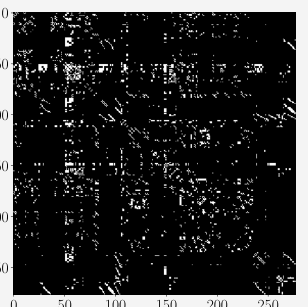

> **Figure 4.5** Caenorhabditis elegans neural network (Kaiser and Hilgetag, 2006). (a) Symmetrized connectivity matrix; (b) Eigenspectrum.

**图 4.5** 秀丽隐杆线虫（Caenorhabditis elegans）神经网络（Kaiser and Hilgetag, 2006）。(a) 对称化连接矩阵；(b) 特征谱。

> Methods to analyze and learn from network data are an essential component of machine learning methods. The key to understanding networks is the connectivity between network nodes, especially if two nodes are connected to each other or not. In data science applications, it is often useful to study the matrix that captures this connectivity data.

分析网络数据并从中学习的方法是机器学习方法的一个重要组成部分。理解网络的关键在于网络节点之间的连接，尤其是两个节点之间是否相连。在数据科学应用中，研究刻画这种连接数据的矩阵往往很有用。

> We build a connectivity/adjacency matrix $A \in \mathbb{R}^{277 \times 277}$ of the complete neural network of the worm C. elegans. Each row/column represents one of the 277 neurons of this worm’s brain. The connectivity matrix $A$ has a value of $a_{ij} = 1$ if neuron $i$ talks to neuron $j$ through a synapse, and $a_{ij} = 0$ otherwise. The connectivity matrix is not symmetric, which implies that eigenvalues may not be real valued. Therefore, we compute a symmetrized version of the connectivity matrix as $A_{\text{sym}} := A + A^\top$. This new matrix $A_{\text{sym}}$ is shown in Figure 4.5(a) and has a nonzero value $a_{ij}$ if and only if two neurons are connected (white pixels), irrespective of the direction of the connection. In Figure 4.5(b), we show the corresponding eigenspectrum of $A_{\text{sym}}$. The horizontal axis shows the index of the eigenvalues, sorted in descending order. The vertical axis shows the corresponding eigenvalue. The S-like shape of this eigenspectrum is typical for many biological neural networks. The underlying mechanism responsible for this is an area of active neuroscience research.

我们为线虫 C. elegans 的完整神经网络构建一个连接矩阵/邻接矩阵 $A \in \mathbb{R}^{277 \times 277}$。矩阵的每一行/每一列对应该线虫大脑 277 个神经元中的一个。若神经元 $i$ 通过突触与神经元 $j$ 相连，则连接矩阵 $A$ 取值 $a_{ij} = 1$，否则 $a_{ij} = 0$。连接矩阵不是对称的，这意味着特征值可能不是实数。因此，我们计算连接矩阵的一个对称化版本 $A_{\text{sym}} := A + A^\top$。图 4.5(a) 展示了这个新矩阵 $A_{\text{sym}}$：当且仅当两个神经元之间存在连接（白色像素）时，$a_{ij}$ 非零，而与连接的方向无关。图 4.5(b) 展示了 $A_{\text{sym}}$ 对应的特征谱：横轴是按降序排列的特征值的下标，纵轴是对应的特征值。这种 S 形的特征谱在许多生物神经网络中都很典型，其背后的机制目前仍是神经科学的一个活跃研究领域。

> **Theorem 4.12.** The eigenvectors $x_1, \ldots, x_n$ of a matrix $A \in \mathbb{R}^{n \times n}$ with $n$ distinct eigenvalues $\lambda_1, \ldots, \lambda_n$ are linearly independent.

**定理 4.12.** 矩阵 $A \in \mathbb{R}^{n \times n}$ 的 $n$ 个互不相同的特征值 $\lambda_1, \ldots, \lambda_n$ 所对应的特征向量 $x_1, \ldots, x_n$ 是线性无关的。

> This theorem states that eigenvectors of a matrix with $n$ distinct eigenvalues form a basis of $\mathbb{R}^n$.

该定理表明，具有 $n$ 个不同特征值的矩阵，其特征向量构成 $\mathbb{R}^n$ 的一组基。

> **Definition 4.13.** A square matrix $A \in \mathbb{R}^{n \times n}$ is defective if it possesses fewer than $n$ linearly independent eigenvectors.

**定义 4.13.** 若方阵 $A \in \mathbb{R}^{n \times n}$ 拥有的线性无关特征向量少于 $n$ 个，则称 $A$ 为亏损矩阵（defective matrix）。

> A non-defective matrix $A \in \mathbb{R}^{n \times n}$ does not necessarily require $n$ distinct eigenvalues, but it does require that the eigenvectors form a basis of $\mathbb{R}^n$. Looking at the eigenspaces of a defective matrix, it follows that the sum of the dimensions of the eigenspaces is less than $n$. Specifically, a defective matrix has at least one eigenvalue $\lambda_i$ with an algebraic multiplicity $m > 1$ and a geometric multiplicity of less than $m$.

非亏损矩阵 $A \in \mathbb{R}^{n \times n}$ 并不一定要求 $n$ 个特征值互不相同，但确实要求特征向量构成 $\mathbb{R}^n$ 的一组基。考察亏损矩阵的特征空间可以知道，各特征空间的维度之和小于 $n$。具体来说，亏损矩阵至少有一个特征值 $\lambda_i$，其代数重数（algebraic multiplicity）$m > 1$，而几何重数（geometric multiplicity）小于 $m$。

> Remark. A defective matrix cannot have $n$ distinct eigenvalues, as distinct eigenvalues have linearly independent eigenvectors (Theorem 4.12). ♢

评注. 亏损矩阵不可能拥有 $n$ 个互不相同的特征值，因为互不相同的特征值所对应的特征向量是线性无关的（定理 4.12）。♢

> **Theorem 4.14.** Given a matrix $A \in \mathbb{R}^{m \times n}$, we can always obtain a symmetric, positive semidefinite matrix $S \in \mathbb{R}^{n \times n}$ by defining

**定理 4.14.** 给定矩阵 $A \in \mathbb{R}^{m \times n}$，我们总可以通过定义

$$
S := A^\top A \,.
\tag{4.36}
$$

得到一个对称的半正定矩阵 $S \in \mathbb{R}^{n \times n}$。

> Remark. If $\operatorname{rk}(A) = n$, then $S := A^\top A$ is symmetric, positive definite. ♢

评注. 若 $\operatorname{rk}(A) = n$，则 $S := A^\top A$ 是对称的正定矩阵。♢

> Understanding why Theorem 4.14 holds is insightful for how we can use symmetrized matrices: Symmetry requires $S = S^\top$, and by inserting (4.36) we obtain $S = A^\top A = A^\top (A^\top)^\top = (A^\top A)^\top = S^\top$. Moreover, positive semidefiniteness (Section 3.2.3) requires that $x^\top S x \geqslant 0$ and inserting (4.36) we obtain $x^\top S x = x^\top A^\top A x = (x^\top A^\top)(Ax) = (Ax)^\top (Ax) \geqslant 0$, because the dot product computes a sum of squares (which are themselves non-negative).

理解定理 4.14 为什么成立，有助于我们弄清如何使用对称化矩阵：对称性要求 $S = S^\top$，代入 (4.36) 可得 $S = A^\top A = A^\top (A^\top)^\top = (A^\top A)^\top = S^\top$。此外，半正定性（3.2.3 节）要求 $x^\top S x \geqslant 0$，代入 (4.36) 可得 $x^\top S x = x^\top A^\top A x = (x^\top A^\top)(Ax) = (Ax)^\top (Ax) \geqslant 0$，因为点积算出的是平方和（而平方本身是非负的）。

> **Theorem 4.15** (Spectral Theorem). If $A \in \mathbb{R}^{n \times n}$ is symmetric, there exists an orthonormal basis of the corresponding vector space $V$ consisting of eigenvectors of $A$, and each eigenvalue is real.

**定理 4.15**（谱定理，Spectral Theorem）。若 $A \in \mathbb{R}^{n \times n}$ 是对称矩阵，则对应向量空间 $V$ 中存在一组由 $A$ 的特征向量构成的标准正交基，并且每个特征值都是实数。

> A direct implication of the spectral theorem is that the eigendecomposition of a symmetric matrix $A$ exists (with real eigenvalues), and that we can find an ONB of eigenvectors so that $A = \mathbf{P}\mathbf{D}\mathbf{P}^\top$, where $\mathbf{D}$ is diagonal and the columns of $\mathbf{P}$ contain the eigenvectors.

谱定理的一个直接推论是：对称矩阵 $A$ 的特征分解（eigendecomposition）存在（特征值为实数），并且我们可以找到一组由特征向量构成的标准正交基，使得 $A = \mathbf{P}\mathbf{D}\mathbf{P}^\top$，其中 $\mathbf{D}$ 是对角矩阵，$\mathbf{P}$ 的各列由特征向量组成。

> **Example 4.8**

**例 4.8**

> Consider the matrix

考虑矩阵

$$
A = \begin{pmatrix} 3 & 2 & 2 \\ 2 & 3 & 2 \\ 2 & 2 & 3 \end{pmatrix}.
\tag{4.37}
$$

> The characteristic polynomial of $A$ is

$A$ 的特征多项式为

$$
p_A(\lambda) = -(\lambda - 1)^2 (\lambda - 7) \,,
\tag{4.38}
$$

> so that we obtain the eigenvalues $\lambda_1 = 1$ and $\lambda_2 = 7$, where $\lambda_1$ is a repeated eigenvalue. Following our standard procedure for computing eigenvectors, we obtain the eigenspaces

由此我们得到特征值 $\lambda_1 = 1$ 与 $\lambda_2 = 7$，其中 $\lambda_1$ 是一个重特征值。按照计算特征向量的标准流程，我们得到特征空间

$$
E_1 = \operatorname{span}\Bigl[
\underbrace{\begin{pmatrix} -1 \\ 1 \\ 0 \end{pmatrix}}_{=:x_1},
\underbrace{\begin{pmatrix} -1 \\ 0 \\ 1 \end{pmatrix}}_{=:x_2}
\Bigr], \quad
E_7 = \operatorname{span}\Bigl[
\underbrace{\begin{pmatrix} 1 \\ 1 \\ 1 \end{pmatrix}}_{=:x_3}
\Bigr].
\tag{4.39}
$$

> We see that $x_3$ is orthogonal to both $x_1$ and $x_2$. However, since $x_1^\top x_2 = 1 \neq 0$, they are not orthogonal. The spectral theorem (Theorem 4.15) states that there exists an orthogonal basis, but the one we have is not orthogonal. However, we can construct one.

可以看到，$x_3$ 与 $x_1$、$x_2$ 都正交。然而，由于 $x_1^\top x_2 = 1 \neq 0$，它们彼此并不正交。谱定理（定理 4.15）断言存在一组正交基，但我们手头这组并不是正交的。不过，我们可以构造出这样一组基。

> To construct such a basis, we exploit the fact that $x_1, x_2$ are eigenvectors associated with the same eigenvalue $\lambda$. Therefore, for any $\alpha, \beta \in \mathbb{R}$ it holds that

为了构造这样一组基，我们利用这样一个事实：$x_1, x_2$ 是属于同一个特征值 $\lambda$ 的特征向量。因此，对任意 $\alpha, \beta \in \mathbb{R}$，都有

$$
A(\alpha x_1 + \beta x_2) = A x_1 \alpha + A x_2 \beta = \lambda (\alpha x_1 + \beta x_2) \,,
\tag{4.40}
$$

> i.e., any linear combination of $x_1$ and $x_2$ is also an eigenvector of $A$ associated with $\lambda$. The Gram-Schmidt algorithm (Section 3.8.3) is a method for iteratively constructing an orthogonal/orthonormal basis from a set of basis vectors using such linear combinations. Therefore, even if $x_1$ and $x_2$ are not orthogonal, we can apply the Gram-Schmidt algorithm and find eigenvectors associated with $\lambda_1 = 1$ that are orthogonal to each other (and to $x_3$). In our example, we will obtain

即 $x_1$ 与 $x_2$ 的任意线性组合也是 $A$ 的属于 $\lambda$ 的特征向量。Gram-Schmidt 算法（3.8.3 节）就是这样一种方法：利用此类线性组合，从一组基向量出发迭代地构造正交基/标准正交基。因此，即使 $x_1$ 与 $x_2$ 不正交，我们也可以应用 Gram-Schmidt 算法，找到属于 $\lambda_1 = 1$ 且彼此正交（并与 $x_3$ 正交）的特征向量。在本例中，我们将得到

$$
x_1' = \begin{pmatrix} -1 \\ 1 \\ 0 \end{pmatrix}, \quad
x_2' = \frac{1}{2} \begin{pmatrix} -1 \\ -1 \\ 2 \end{pmatrix},
\tag{4.41}
$$

> which are orthogonal to each other, orthogonal to $x_3$, and eigenvectors of $A$ associated with $\lambda_1 = 1$.

它们彼此正交、都与 $x_3$ 正交，并且都是 $A$ 的属于 $\lambda_1 = 1$ 的特征向量。

> Before we conclude our considerations of eigenvalues and eigenvectors it is useful to tie these matrix characteristics together with the concepts of the determinant and the trace.

在结束关于特征值与特征向量的讨论之前，将这些矩阵特征与行列式、迹这两个概念联系起来是很有帮助的。

> **Theorem 4.16.** The determinant of a matrix $A \in \mathbb{R}^{n \times n}$ is the product of its eigenvalues, i.e.,

**定理 4.16.** 矩阵 $A \in \mathbb{R}^{n \times n}$ 的行列式等于其特征值的乘积，即

$$
\det(A) = \prod_{i=1}^{n} \lambda_i \,,
\tag{4.42}
$$

> where $\lambda_i \in \mathbb{C}$ are (possibly repeated) eigenvalues of $A$.

其中 $\lambda_i \in \mathbb{C}$ 是 $A$ 的（可能重复出现的）特征值。

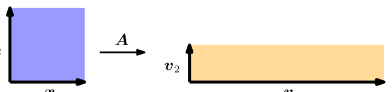

> **Figure 4.6** Geometric interpretation of eigenvalues. The eigenvectors of $A$ get stretched by the corresponding eigenvalues. The area of the unit square changes by $|\lambda_1 \lambda_2|$, the perimeter changes by a factor of $\frac{1}{2}(|\lambda_1| + |\lambda_2|)$.

**图 4.6** 特征值的几何解释。$A$ 的特征向量会被相应的特征值拉伸。单位正方形的面积变化为 $|\lambda_1 \lambda_2|$，周长则变为原来的 $\frac{1}{2}(|\lambda_1| + |\lambda_2|)$ 倍。

> **Theorem 4.17.** The trace of a matrix $A \in \mathbb{R}^{n \times n}$ is the sum of its eigenvalues, i.e.,

**定理 4.17.** 矩阵 $A \in \mathbb{R}^{n \times n}$ 的迹等于其特征值之和，即

$$
\operatorname{tr}(A) = \sum_{i=1}^{n} \lambda_i \,,
\tag{4.43}
$$

> where $\lambda_i \in \mathbb{C}$ are (possibly repeated) eigenvalues of $A$.

其中 $\lambda_i \in \mathbb{C}$ 是 $A$ 的（可能重复出现的）特征值。

> Let us provide a geometric intuition of these two theorems. Consider a matrix $A \in \mathbb{R}^{2 \times 2}$ that possesses two linearly independent eigenvectors $x_1, x_2$. For this example, we assume $(x_1, x_2)$ are an ONB of $\mathbb{R}^2$ so that they are orthogonal and the area of the square they span is 1; see Figure 4.6. From Section 4.1, we know that the determinant computes the change of area of unit square under the transformation $A$. In this example, we can compute the change of area explicitly: Mapping the eigenvectors using $A$ gives us vectors $v_1 = A x_1 = \lambda_1 x_1$ and $v_2 = A x_2 = \lambda_2 x_2$, i.e., the new vectors $v_i$ are scaled versions of the eigenvectors $x_i$, and the scaling factors are the corresponding eigenvalues $\lambda_i$. $v_1, v_2$ are still orthogonal, and the area of the rectangle they span is $|\lambda_1 \lambda_2|$.

我们为这两个定理提供一种几何直观。考虑一个拥有两个线性无关特征向量 $x_1, x_2$ 的矩阵 $A \in \mathbb{R}^{2 \times 2}$。在本例中，我们假设 $(x_1, x_2)$ 是 $\mathbb{R}^2$ 的一组标准正交基，从而它们正交，且它们张成的正方形面积为 1；参见图 4.6。由 4.1 节可知，行列式计算的是单位正方形在变换 $A$ 下的面积变化。本例中我们可以显式地算出这一面积变化：用 $A$ 映射这两个特征向量，得到向量 $v_1 = A x_1 = \lambda_1 x_1$ 与 $v_2 = A x_2 = \lambda_2 x_2$，也就是说，新向量 $v_i$ 是特征向量 $x_i$ 经过缩放的版本，缩放因子正是相应的特征值 $\lambda_i$。$v_1, v_2$ 仍然正交，它们张成的矩形面积为 $|\lambda_1 \lambda_2|$。

> Given that $x_1, x_2$ (in our example) are orthonormal, we can directly compute the perimeter of the unit square as $2(1 + 1)$. Mapping the eigenvectors using $A$ creates a rectangle whose perimeter is $2(|\lambda_1| + |\lambda_2|)$. Therefore, the sum of the absolute values of the eigenvalues tells us how the perimeter of the unit square changes under the transformation matrix $A$.

由于 $x_1, x_2$（在本例中）标准正交，我们可以直接算出单位正方形的周长为 $2(1 + 1)$。用 $A$ 映射特征向量会得到一个矩形，其周长为 $2(|\lambda_1| + |\lambda_2|)$。因此，特征值绝对值之和告诉我们，单位正方形的周长在变换矩阵 $A$ 下会如何变化。

> **Example 4.9** (Google's PageRank – Webpages as Eigenvectors) Google uses the eigenvector corresponding to the maximal eigenvalue of a matrix $A$ to determine the rank of a page for search. The idea for the PageRank algorithm, developed at Stanford University by Larry Page and Sergey Brin in 1996, was that the importance of any web page can be approximated by the importance of pages that link to it. For this, they write down all web sites as a huge directed graph that shows which page links to which. PageRank computes the weight (importance) $x_i \geqslant 0$ of a web site $a_i$ by counting the number of pages pointing to $a_i$. Moreover, PageRank takes into account the importance of the web sites that link to $a_i$. The navigation behavior of a user is then modeled by a transition matrix $A$ of this graph that tells us with what (click) probability somebody will end up on a different web site. The matrix $A$ has the property that for any initial rank/importance vector $x$ of a web site the sequence $x, Ax, A^2 x, \ldots$ converges to a vector $x^*$. This vector is called the PageRank and satisfies

**例 4.9**（Google 的 PageRank——作为特征向量的网页，Google's PageRank – Webpages as Eigenvectors）Google 利用矩阵 $A$ 的最大特征值所对应的特征向量来确定搜索结果中网页的排名。PageRank 算法由 Larry Page 与 Sergey Brin 于 1996 年在斯坦福大学提出，其想法是：任何网页的重要性都可以借助链接到它的那些页面的重要性来近似。为此，他们把所有网站写成一个巨大的有向图，用以表明哪个页面链接到哪个页面。PageRank 通过统计指向 $a_i$ 的页面数量来计算网站 $a_i$ 的权重（重要性）$x_i \geqslant 0$。此外，PageRank 还会考虑链接到 $a_i$ 的那些网站本身的重要性。用户的浏览行为则由该图的一个转移矩阵 $A$ 来建模，它告诉我们某个人以多大的（点击）概率最终停留在另一个网站上。矩阵 $A$ 具有如下性质：对网站的任意初始排名/重要性向量 $x$，序列 $x, Ax, A^2 x, \ldots$ 都会收敛到一个向量 $x^*$。这个向量称为 PageRank，并且满足

> $Ax^* = x^*$, i.e., it is an eigenvector (with corresponding eigenvalue 1) of $A$. After normalizing $x^*$, such that $\|x^*\| = 1$, we can interpret the entries as probabilities. More details and different perspectives on PageRank can be found in the original technical report (Page et al., 1999).

$Ax^* = x^*$，即它是 $A$ 的一个特征向量（对应的特征值为 1）。将 $x^*$ 归一化，使得 $\|x^*\| = 1$ 之后，我们就可以把它的各分量解释为概率。关于 PageRank 的更多细节与不同视角，可参阅原始技术报告（Page et al., 1999）。

## 4.3 Cholesky 分解（Cholesky Decomposition）

> There are many ways to factorize special types of matrices that we encounter often in machine learning. In the positive real numbers, we have the square-root operation that gives us a decomposition of the number into identical components, e.g., $9 = 3 \cdot 3$. For matrices, we need to be careful that we compute a square-root-like operation on positive quantities. For symmetric, positive definite matrices (see Section 3.2.3), we can choose from a number of square-root equivalent operations. The Cholesky decomposition/Cholesky factorization provides a square-root equivalent operation on symmetric, positive definite matrices that is useful in practice.

对于机器学习中经常遇到的特殊类型的矩阵，有多种分解方式。在正实数范围内，我们有平方根运算，它把一个数分解成相同的成分，例如 $9 = 3 \cdot 3$。对于矩阵，在对正定量计算类似平方根的运算时需要小心。对于对称正定矩阵（见 3.2.3 节），我们有若干种平方根等价运算可供选择。Cholesky 分解（Cholesky decomposition/Cholesky factorization）提供了作用于对称正定矩阵的一种平方根等价运算，在实践中非常有用。

> **Theorem 4.18** (Cholesky Decomposition). A symmetric, positive definite matrix $A$ can be factorized into a product $A = LL^\top$, where $L$ is a lower-triangular matrix with positive diagonal elements:

**定理 4.18**（Cholesky 分解，Cholesky Decomposition）。对称正定矩阵 $A$ 可以分解为乘积 $A = LL^\top$，其中 $L$ 是对角元素均为正的下三角矩阵：

$$
\begin{pmatrix}
a_{11} & \cdots & a_{1n} \\
\vdots & \vdots & \vdots \\
a_{n1} & \cdots & a_{nn}
\end{pmatrix}
=
\begin{pmatrix}
l_{11} & \cdots & 0 \\
\vdots & \vdots & \vdots \\
l_{n1} & \cdots & l_{nn}
\end{pmatrix}
\begin{pmatrix}
l_{11} & \cdots & l_{n1} \\
\vdots & \vdots & \vdots \\
0 & \cdots & l_{nn}
\end{pmatrix}.
\tag{4.44}
$$

> $L$ is called the Cholesky factor of $A$, and $L$ is unique.

$L$ 称为 $A$ 的 Cholesky 因子（Cholesky factor），并且 $L$ 是唯一的。

> **Example 4.10** (Cholesky Factorization) Consider a symmetric, positive definite matrix $A \in \mathbb{R}^{3 \times 3}$. We are interested in finding its Cholesky factorization $A = LL^\top$, i.e.,

**例 4.10**（Cholesky 分解，Cholesky Factorization）考虑一个对称正定矩阵 $A \in \mathbb{R}^{3 \times 3}$。我们希望求出它的 Cholesky 分解 $A = LL^\top$，即

$$
A =
\begin{pmatrix}
a_{11} & a_{21} & a_{31} \\
a_{21} & a_{22} & a_{32} \\
a_{31} & a_{32} & a_{33}
\end{pmatrix}
= LL^\top =
\begin{pmatrix}
l_{11} & 0 & 0 \\
l_{21} & l_{22} & 0 \\
l_{31} & l_{32} & l_{33}
\end{pmatrix}
\begin{pmatrix}
l_{11} & l_{21} & l_{31} \\
0 & l_{22} & l_{32} \\
0 & 0 & l_{33}
\end{pmatrix}.
\tag{4.45}
$$

> Multiplying out the right-hand side yields

将右端展开相乘，得到

$$
A =
\begin{pmatrix}
l_{11}^2 & l_{21}l_{11} & l_{31}l_{11} \\
l_{21}l_{11} & l_{21}^2 + l_{22}^2 & l_{31}l_{21} + l_{32}l_{22} \\
l_{31}l_{11} & l_{31}l_{21} + l_{32}l_{22} & l_{31}^2 + l_{32}^2 + l_{33}^2
\end{pmatrix}.
\tag{4.46}
$$

> Comparing the left-hand side of (4.45) and the right-hand side of (4.46) shows that there is a simple pattern in the diagonal elements $l_{ii}$:

比较 (4.45) 的左端与 (4.46) 的右端可以发现，对角元素 $l_{ii}$ 满足一个简单的模式：

$$
l_{11} = \sqrt{a_{11}}, \quad l_{22} = \sqrt{a_{22} - l_{21}^2}, \quad l_{33} = \sqrt{a_{33} - (l_{31}^2 + l_{32}^2)}.
\tag{4.47}
$$

> Similarly for the elements below the diagonal ($l_{ij}$, where $i > j$), there is also a repeating pattern:

对于对角线以下的元素（$l_{ij}$，其中 $i > j$），同样存在一个重复的模式：

$$
l_{21} = \frac{1}{l_{11}} a_{21}, \quad l_{31} = \frac{1}{l_{11}} a_{31}, \quad l_{32} = \frac{1}{l_{22}} (a_{32} - l_{31} l_{21}).
\tag{4.48}
$$

> Thus, we constructed the Cholesky decomposition for any symmetric, positive definite $3 \times 3$ matrix. The key realization is that we can backward calculate what the components $l_{ij}$ for the $L$ should be, given the values $a_{ij}$ for $A$ and previously computed values of $l_{ij}$.

这样，我们就为任意对称正定的 $3 \times 3$ 矩阵构造出了 Cholesky 分解。关键在于：给定 $A$ 的元素 $a_{ij}$ 以及已经算出的 $l_{ij}$，我们可以倒推出 $L$ 的分量 $l_{ij}$ 应取的值。

> The Cholesky decomposition is an important tool for the numerical computations underlying machine learning. Here, symmetric positive definite matrices require frequent manipulation, e.g., the covariance matrix of a multivariate Gaussian variable (see Section 6.5) is symmetric, positive definite. The Cholesky factorization of this covariance matrix allows us to generate samples from a Gaussian distribution. It also allows us to perform a linear transformation of random variables, which is heavily exploited when computing gradients in deep stochastic models, such as the variational auto-encoder (Jimenez Rezende et al., 2014; Kingma and Welling, 2014). The Cholesky decomposition also allows us to compute determinants very efficiently. Given the Cholesky decomposition $A = LL^\top$, we know that $\det(A) = \det(L)\det(L^\top) = \det(L)^2$. Since $L$ is a triangular matrix, the determinant is simply the product of its diagonal entries so that $\det(A) = \prod_i l_{ii}^2$. Thus, many numerical software packages use the Cholesky decomposition to make computations more efficient.

Cholesky 分解是机器学习底层数值计算的一个重要工具。在这一领域中，对称正定矩阵需要频繁操作，例如多元高斯变量的协方差矩阵（covariance matrix，见 6.5 节）就是对称正定的。对这个协方差矩阵做 Cholesky 分解，使我们能够从高斯分布（Gaussian distribution）中生成样本。它还使我们能够对随机变量做线性变换，这一性质在深度随机模型（如变分自编码器，variational auto-encoder）中计算梯度时被大量利用（Jimenez Rezende et al., 2014; Kingma and Welling, 2014）。Cholesky 分解还能让我们非常高效地计算行列式：给定 Cholesky 分解 $A = LL^\top$，我们知道 $\det(A) = \det(L)\det(L^\top) = \det(L)^2$。由于 $L$ 是三角矩阵，其行列式就是对角元素的乘积，因此 $\det(A) = \prod_i l_{ii}^2$。于是，许多数值软件包都利用 Cholesky 分解来提高计算效率。

## 4.4 特征分解与对角化（Eigendecomposition and Diagonalization）

> A diagonal matrix is a matrix that has value zero on all off-diagonal elements, i.e., they are of the form

对角矩阵（diagonal matrix）是所有非对角元素都为零的矩阵，即形如

$$
D =
\begin{pmatrix}
c_1 & \cdots & 0 \\
\vdots & \ddots & \vdots \\
0 & \cdots & c_n
\end{pmatrix}.
\tag{4.49}
$$

> They allow fast computation of determinants, powers, and inverses. The determinant is the product of its diagonal entries, a matrix power $D^k$ is given by each diagonal element raised to the power $k$, and the inverse $D^{-1}$ is the reciprocal of its diagonal elements if all of them are nonzero.

它们使得行列式、幂与逆的计算都非常快：行列式就是对角元素的乘积；矩阵的幂 $D^k$ 只需将每个对角元素升高到 $k$ 次幂；而只要所有对角元素都非零，逆 $D^{-1}$ 就是把对角元素换成各自的倒数。

> In this section, we will discuss how to transform matrices into diagonal form. This is an important application of the basis change we discussed in Section 2.7.2 and eigenvalues from Section 4.2.

本节将讨论如何把矩阵化为对角形式。这是 2.7.2 节所讨论的基变换以及 4.2 节的特征值的一个重要应用。

> Recall that two matrices $A$, $D$ are similar (Definition 2.22) if there exists an invertible matrix $P$, such that $D = P^{-1}AP$. More specifically, we will look at matrices $A$ that are similar to diagonal matrices $D$ that contain the eigenvalues of $A$ on the diagonal.

回顾一下，如果存在可逆矩阵 $P$ 使得 $D = P^{-1}AP$，我们就称矩阵 $A$ 与 $D$ 相似（定义 2.22）。更具体地说，我们将考察与对角矩阵 $D$ 相似的矩阵 $A$，其中 $D$ 的对角线上是 $A$ 的特征值。

> **Definition 4.19** (Diagonalizable). A matrix $A \in \mathbb{R}^{n \times n}$ is diagonalizable if it is similar to a diagonal matrix, i.e., if there exists an invertible matrix $P \in \mathbb{R}^{n \times n}$ such that $D = P^{-1}AP$.

**定义 4.19**（可对角化，Diagonalizable）。如果矩阵 $A \in \mathbb{R}^{n \times n}$ 与一个对角矩阵相似，即存在可逆矩阵 $P \in \mathbb{R}^{n \times n}$ 使得 $D = P^{-1}AP$，那么就称 $A$ 是可对角化的（diagonalizable）。

> In the following, we will see that diagonalizing a matrix $A \in \mathbb{R}^{n \times n}$ is a way of expressing the same linear mapping but in another basis (see Section 2.6.1), which will turn out to be a basis that consists of the eigenvectors of $A$.

接下来我们会看到，把矩阵 $A \in \mathbb{R}^{n \times n}$ 对角化，是同一个线性映射在另一组基（见 2.6.1 节）下的表达方式，而这组基将由 $A$ 的特征向量组成。

> Let $A \in \mathbb{R}^{n \times n}$, let $\lambda_1, \ldots, \lambda_n$ be a set of scalars, and let $p_1, \ldots, p_n$ be a set of vectors in $\mathbb{R}^n$. We define $P := [p_1, \ldots, p_n]$ and let $D \in \mathbb{R}^{n \times n}$ be a diagonal matrix with diagonal entries $\lambda_1, \ldots, \lambda_n$. Then we can show that

设 $A \in \mathbb{R}^{n \times n}$，$\lambda_1, \ldots, \lambda_n$ 是一组标量，$p_1, \ldots, p_n$ 是 $\mathbb{R}^n$ 中的一组向量。我们定义 $P := [p_1, \ldots, p_n]$，并设 $D \in \mathbb{R}^{n \times n}$ 是对角元素为 $\lambda_1, \ldots, \lambda_n$ 的对角矩阵。那么可以证明

$$
AP = \mathbf{P}\mathbf{D}
\tag{4.50}
$$

> if and only if $\lambda_1, \ldots, \lambda_n$ are the eigenvalues of $A$ and $p_1, \ldots, p_n$ are corresponding eigenvectors of $A$.

当且仅当 $\lambda_1, \ldots, \lambda_n$ 是 $A$ 的特征值，且 $p_1, \ldots, p_n$ 是 $A$ 相应的特征向量。

> We can see that this statement holds because

之所以成立，是因为

$$
AP = A[p_1, \ldots, p_n] = [A p_1, \ldots, A p_n],
\tag{4.51}
$$

$$
\mathbf{P}\mathbf{D} = [p_1, \ldots, p_n]
\begin{pmatrix}
\lambda_1 & & 0 \\
& \ddots & \\
0 & & \lambda_n
\end{pmatrix}
= [\lambda_1 p_1, \ldots, \lambda_n p_n].
\tag{4.52}
$$

> Thus, (4.50) implies that

因此，(4.50) 意味着

$$
A p_1 = \lambda_1 p_1
\tag{4.53}
$$

$$
\ldots
$$

$$
A p_n = \lambda_n p_n.
\tag{4.54}
$$

> Therefore, the columns of $P$ must be eigenvectors of $A$.

所以，$P$ 的各列必定是 $A$ 的特征向量。

> Our definition of diagonalization requires that $P \in \mathbb{R}^{n \times n}$ is invertible, i.e., $P$ has full rank (Theorem 4.3). This requires us to have $n$ linearly independent eigenvectors $p_1, \ldots, p_n$, i.e., the $p_i$ form a basis of $\mathbb{R}^n$.

我们对对角化的定义要求 $P \in \mathbb{R}^{n \times n}$ 可逆，即 $P$ 满秩（定理 4.3）。这就要求我们拥有 $n$ 个线性无关的特征向量 $p_1, \ldots, p_n$，也就是说，$p_i$ 构成 $\mathbb{R}^n$ 的一组基。

> **Theorem 4.20** (Eigendecomposition). A square matrix $A \in \mathbb{R}^{n \times n}$ can be factored into

**定理 4.20**（特征分解，Eigendecomposition）。方阵 $A \in \mathbb{R}^{n \times n}$ 可以分解为

$$
A = \mathbf{P}\mathbf{D}\mathbf{P}^{-1},
\tag{4.55}
$$

> where $P \in \mathbb{R}^{n \times n}$ and $D$ is a diagonal matrix whose diagonal entries are the eigenvalues of $A$, if and only if the eigenvectors of $A$ form a basis of $\mathbb{R}^n$.

其中 $P \in \mathbb{R}^{n \times n}$，$D$ 是对角元素为 $A$ 的特征值的对角矩阵；当且仅当 $A$ 的特征向量构成 $\mathbb{R}^n$ 的一组基时，这一分解才成立。

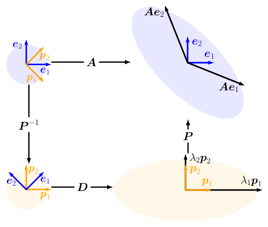

> **Figure 4.7** Intuition behind the eigendecomposition as sequential transformations. Top-left to bottom-left: $P^{-1}$ performs a basis change (here drawn in $\mathbb{R}^2$ and depicted as a rotation-like operation) from the standard basis into the eigenbasis. Bottom-left to bottom-right: $D$ performs a scaling along the remapped orthogonal eigenvectors, depicted here by a circle being stretched to an ellipse. Bottom-right to top-right: $P$ undoes the basis change (depicted as a reverse rotation) and restores the original coordinate frame.

**图 4.7** 把特征分解理解为依次进行的变换的直观图示。从左上到左下：$P^{-1}$ 进行一次基变换（这里画在 $\mathbb{R}^2$ 中，表现为类似旋转的操作），从标准基变换到特征基。从左下到右下：$D$ 沿重新映射后的正交特征向量进行缩放，图中表现为一个圆被拉伸成椭圆。从右下到右上：$P$ 抵消基变换（表现为反向旋转），恢复原来的坐标系。

> Theorem 4.20 implies that only non-defective matrices can be diagonalized and that the columns of $P$ are the $n$ eigenvectors of $A$. For symmetric matrices we can obtain even stronger outcomes for the eigenvalue decomposition.

定理 4.20 意味着只有非亏损矩阵才可以对角化，并且 $P$ 的各列就是 $A$ 的 $n$ 个特征向量。对于对称矩阵，我们能得到关于特征值分解（eigenvalue decomposition）更强的结论。

> **Theorem 4.21.** A symmetric matrix $S \in \mathbb{R}^{n \times n}$ can always be diagonalized.

**定理 4.21.** 对称矩阵 $S \in \mathbb{R}^{n \times n}$ 总是可以对角化的。

> Theorem 4.21 follows directly from the spectral theorem 4.15. Moreover, the spectral theorem states that we can find an ONB of eigenvectors of $\mathbb{R}^n$. This makes $P$ an orthogonal matrix so that $D = P^\top AP$.

定理 4.21 可以直接由谱定理 4.15 得到。此外，谱定理指出，我们可以在 $\mathbb{R}^n$ 中找到由特征向量构成的一组标准正交基（ONB）。这使得 $P$ 成为一个正交矩阵，从而 $D = P^\top AP$。

> Remark. The Jordan normal form of a matrix offers a decomposition that works for defective matrices (Lang, 1987) but is beyond the scope of this book. ♢

评注. 矩阵的若尔当标准形（Jordan normal form）提供了一种对亏损矩阵同样适用的分解（Lang, 1987），但这超出了本书的讨论范围。♢

> **Geometric Intuition for the Eigendecomposition**

**特征分解的几何直观**

> We can interpret the eigendecomposition of a matrix as follows (see also Figure 4.7): Let $A$ be the transformation matrix of a linear mapping with respect to the standard basis $e_i$ (blue arrows). $P^{-1}$ performs a basis change from the standard basis into the eigenbasis. Then, the diagonal $D$ scales the vectors along these axes by the eigenvalues $\lambda_i$. Finally, $P$ transforms these scaled vectors back into the standard/canonical coordinates yielding $\lambda_i p_i$.

我们可以按如下方式理解矩阵的特征分解（另见图 4.7）：设 $A$ 是某个线性映射关于标准基 $e_i$（蓝色箭头）的变换矩阵。$P^{-1}$ 完成一次从标准基到特征基（eigenbasis）的基变换。然后，对角矩阵 $D$ 沿这些轴按特征值 $\lambda_i$ 对向量进行缩放。最后，$P$ 把这些缩放后的向量变回标准/典范坐标，得到 $\lambda_i p_i$。

> **Example 4.11** (Eigendecomposition) Let us compute the eigendecomposition of $A = \frac{1}{2}\begin{pmatrix}5 & -2\\ -2 & 5\end{pmatrix}$.

**例 4.11**（特征分解，Eigendecomposition）我们来计算 $A = \frac{1}{2}\begin{pmatrix}5 & -2\\ -2 & 5\end{pmatrix}$ 的特征分解。

> Step 1: Compute eigenvalues and eigenvectors. The characteristic polynomial of $A$ is

第一步：计算特征值与特征向量。$A$ 的特征多项式为

$$
\det(A - \lambda I) = \det
\begin{pmatrix}
\frac{5}{2} - \lambda & -1 \\
-1 & \frac{5}{2} - \lambda
\end{pmatrix}
\tag{4.56a}
$$

$$
= \left(\frac{5}{2} - \lambda\right)^2 - 1 = \lambda^2 - 5\lambda + \frac{21}{4} = \left(\lambda - \frac{7}{2}\right)\left(\lambda - \frac{3}{2}\right).
\tag{4.56b}
$$

> Therefore, the eigenvalues of $A$ are $\lambda_1 = \frac{7}{2}$ and $\lambda_2 = \frac{3}{2}$ (the roots of the characteristic polynomial), and the associated (normalized) eigenvectors are obtained via

因此，$A$ 的特征值为 $\lambda_1 = \frac{7}{2}$ 和 $\lambda_2 = \frac{3}{2}$（即特征多项式的根），相应的（归一化的）特征向量通过下式求得：

$$
A p_1 = \frac{7}{2} p_1, \quad A p_2 = \frac{3}{2} p_2.
\tag{4.57}
$$

> This yields

由此得到

$$
p_1 = \frac{1}{\sqrt{2}}
\begin{pmatrix}
1 \\
-1
\end{pmatrix}, \quad
p_2 = \frac{1}{\sqrt{2}}
\begin{pmatrix}
1 \\
1
\end{pmatrix}.
\tag{4.58}
$$

> Step 2: Check for existence. The eigenvectors $p_1, p_2$ form a basis of $\mathbb{R}^2$. Therefore, $A$ can be diagonalized. Step 3: Construct the matrix $P$ to diagonalize $A$. We collect the eigenvectors of $A$ in $P$ so that

第二步：检验存在性。特征向量 $p_1, p_2$ 构成 $\mathbb{R}^2$ 的一组基，因此 $A$ 可以对角化。第三步：构造使 $A$ 对角化的矩阵 $P$。我们把 $A$ 的特征向量收集到 $P$ 中，使得

$$
P = [p_1, p_2] = \frac{1}{\sqrt{2}}
\begin{pmatrix}
1 & 1 \\
-1 & 1
\end{pmatrix}.
\tag{4.59}
$$

> We then obtain

于是我们得到

$$
P^{-1} A P =
\begin{pmatrix}
\frac{7}{2} & 0 \\
0 & \frac{3}{2}
\end{pmatrix}
= D.
\tag{4.60}
$$

> Equivalently, we get (exploiting that $P^{-1} = P^\top$ since the eigenvectors $p_1$ and $p_2$ in this example form an ONB)

等价地，利用本例中特征向量 $p_1$ 与 $p_2$ 构成一组标准正交基、因而 $P^{-1} = P^\top$ 这一事实，我们得到

$$
\underbrace{\frac{1}{2}\begin{pmatrix}5 & -2\\ -2 & 5\end{pmatrix}}_{A}
=
\underbrace{\frac{1}{\sqrt{2}}\begin{pmatrix}1 & 1\\ -1 & 1\end{pmatrix}}_{P}
\underbrace{\begin{pmatrix}\frac{7}{2} & 0\\ 0 & \frac{3}{2}\end{pmatrix}}_{D}
\underbrace{\frac{1}{\sqrt{2}}\begin{pmatrix}1 & -1\\ 1 & 1\end{pmatrix}}_{P^{-1}}.
\tag{4.61}
$$

> Diagonal matrices $D$ can efficiently be raised to a power. Therefore, we can find a matrix power for a matrix $A \in \mathbb{R}^{n \times n}$ via the eigenvalue decomposition (if it exists) so that

对角矩阵 $D$ 可以高效地求幂。因此，我们可以借助特征值分解（如果存在）为矩阵 $A \in \mathbb{R}^{n \times n}$ 求出矩阵的幂：

$$
A^k = (\mathbf{P}\mathbf{D}\mathbf{P}^{-1})^k = \mathbf{P}\mathbf{D}^k\mathbf{P}^{-1}.
\tag{4.62}
$$

> Computing $D^k$ is efficient because we apply this operation individually to any diagonal element. Assume that the eigendecomposition $A = \mathbf{P}\mathbf{D}\mathbf{P}^{-1}$ exists. Then,

计算 $D^k$ 之所以高效，是因为这一运算只需逐个作用于每个对角元素。假设特征分解 $A = \mathbf{P}\mathbf{D}\mathbf{P}^{-1}$ 存在，那么

$$
\det(A) = \det(\mathbf{P}\mathbf{D}\mathbf{P}^{-1}) = \det(P)\det(D)\det(P^{-1})
\tag{4.63a}
$$

$$
= \det(D) = \prod_i d_{ii}
\tag{4.63b}
$$

> allows for an efficient computation of the determinant of $A$.

从而可以高效地计算 $A$ 的行列式。

> The eigenvalue decomposition requires square matrices. It would be useful to perform a decomposition on general matrices. In the next section, we introduce a more general matrix decomposition technique, the singular value decomposition.

特征值分解要求矩阵为方阵。若能对一般矩阵进行分解，将会非常有用。下一节中，我们将介绍一种更一般的矩阵分解技术——奇异值分解。

## 4.5 奇异值分解（Singular Value Decomposition）

> The singular value decomposition (SVD) of a matrix is a central matrix decomposition method in linear algebra. It has been referred to as the “fundamental theorem of linear algebra” (Strang, 1993) because it can be applied to all matrices, not only to square matrices, and it always exists. Moreover, as we will explore in the following, the SVD of a matrix $A$, which represents a linear mapping $\Phi : V \to W$, quantifies the change between the underlying geometry of these two vector spaces. We recommend the work by Kalman (1996) and Roy and Banerjee (2014) for a deeper overview of the mathematics of the SVD.

矩阵的奇异值分解（singular value decomposition，SVD）是线性代数中一种核心的矩阵分解方法。它曾被称为“线性代数的基本定理”（fundamental theorem of linear algebra，Strang, 1993），因为它适用于所有矩阵——而不只是方阵——并且总是存在。此外，正如我们接下来将要探讨的，表示线性映射 $\Phi : V \to W$ 的矩阵 $A$ 的 SVD 量化了这两个向量空间底层几何之间的变化。若想更深入地了解 SVD 的数学，我们推荐阅读 Kalman (1996) 以及 Roy 和 Banerjee (2014) 的著述。

> **Theorem 4.22** (SVD Theorem). Let $A \in \mathbb{R}^{m \times n}$ be a rectangular matrix of rank $r \in [0, \min(m, n)]$. The SVD of $A$ is a decomposition of the form

**定理 4.22**（SVD 定理，SVD Theorem）。设 $A \in \mathbb{R}^{m \times n}$ 是秩为 $r \in [0, \min(m, n)]$ 的长方矩阵（rectangular matrix）。$A$ 的 SVD 是形如下式的分解：

$$
A_{m \times n} = \mathbf{U}_{m \times m} \, \boldsymbol{\Sigma}_{m \times n} \, \mathbf{V}_{n \times n}^{\top}
\tag{4.64}
$$

> with an orthogonal matrix $U \in \mathbb{R}^{m \times m}$ with column vectors $u_i$, $i = 1, \ldots, m$, and an orthogonal matrix $V \in \mathbb{R}^{n \times n}$ with column vectors $v_j$, $j = 1, \ldots, n$. Moreover, $\Sigma$ is an $m \times n$ matrix with $\Sigma_{ii} = \sigma_i \geqslant 0$ and $\Sigma_{ij} = 0$, $i \neq j$.

其中 $U \in \mathbb{R}^{m \times m}$ 是正交矩阵，其列向量为 $u_i$，$i = 1, \ldots, m$；$V \in \mathbb{R}^{n \times n}$ 也是正交矩阵，其列向量为 $v_j$，$j = 1, \ldots, n$。此外，$\Sigma$ 是一个 $m \times n$ 矩阵，满足 $\Sigma_{ii} = \sigma_i \geqslant 0$，且当 $i \neq j$ 时 $\Sigma_{ij} = 0$。

> The diagonal entries $\sigma_i$, $i = 1, \ldots, r$, of $\Sigma$ are called the singular values, $u_i$ are called the left-singular vectors, and $v_j$ are called the right-singular vectors. By convention, the singular values are ordered, i.e., $\sigma_1 \geqslant \sigma_2 \geqslant \ldots \geqslant \sigma_r \geqslant 0$.

$\Sigma$ 的对角元素 $\sigma_i$（$i = 1, \ldots, r$）称为奇异值（singular value），$u_i$ 称为左奇异向量（left-singular vectors），$v_j$ 称为右奇异向量（right-singular vectors）。按照惯例，奇异值按顺序排列，即 $\sigma_1 \geqslant \sigma_2 \geqslant \ldots \geqslant \sigma_r \geqslant 0$。

> The singular value matrix $\Sigma$ is unique, but it requires some attention. Observe that the $\Sigma \in \mathbb{R}^{m \times n}$ is rectangular. In particular, $\Sigma$ is of the same size as $A$. This means that $\Sigma$ has a diagonal submatrix that contains the singular values and needs additional zero padding. Specifically, if $m > n$, then the matrix $\Sigma$ has diagonal structure up to row $n$ and then consists of $0^\top$ row vectors from $n + 1$ to $m$ below so that

奇异值矩阵（singular value matrix）$\Sigma$ 是唯一的，但需要留意一些细节。注意 $\Sigma \in \mathbb{R}^{m \times n}$ 是长方形的。特别地，$\Sigma$ 与 $A$ 尺寸相同。这意味着 $\Sigma$ 含有一个存放奇异值的对角子矩阵，其余部分需要用零填充。具体而言，若 $m > n$，则矩阵 $\Sigma$ 直到第 $n$ 行都具有对角结构，其下方从第 $n + 1$ 行到第 $m$ 行由 $0^\top$ 行向量构成，即

$$
\boldsymbol{\Sigma} =
\begin{pmatrix}
\sigma_1 & 0 & \cdots & 0 \\
0 & \sigma_2 & \cdots & 0 \\
\vdots & \vdots & \ddots & \vdots \\
0 & 0 & \cdots & \sigma_n \\
0 & 0 & \cdots & 0 \\
\vdots & \vdots & \ddots & \vdots \\
0 & 0 & \cdots & 0
\end{pmatrix}
\tag{4.65}
$$

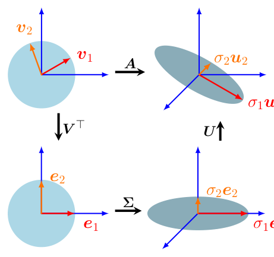

> **Figure 4.8** Intuition behind the SVD of a matrix $A \in \mathbb{R}^{3 \times 2}$ as sequential transformations. Top-left to bottom-left: $V^\top$ performs a basis change in $\mathbb{R}^2$. Bottom-left to bottom-right: $\Sigma$ scales and maps from $\mathbb{R}^2$ to $\mathbb{R}^3$. The ellipse in the bottom-right lives in $\mathbb{R}^3$. The third dimension is orthogonal to the surface of the elliptical disk. Bottom-right to top-right: $U$ performs a basis change within $\mathbb{R}^3$.

**图 4.8** 把矩阵 $A \in \mathbb{R}^{3 \times 2}$ 的 SVD 理解为依次进行的变换的直观图示。从左上到左下：$V^\top$ 在 $\mathbb{R}^2$ 中进行基变换。从左下到右下：$\Sigma$ 进行缩放，并将向量从 $\mathbb{R}^2$ 映射到 $\mathbb{R}^3$。右下方的椭圆位于 $\mathbb{R}^3$ 中；第三维与椭圆盘的表面正交。从右下到右上：$U$ 在 $\mathbb{R}^3$ 内进行基变换。

> If $m < n$, the matrix $\Sigma$ has a diagonal structure up to column $m$ and columns that consist of $0$ from $m + 1$ to $n$:

若 $m < n$，则矩阵 $\Sigma$ 直到第 $m$ 列都具有对角结构，而第 $m + 1$ 列到第 $n$ 列由 $0$ 构成：

$$
\boldsymbol{\Sigma} =
\begin{pmatrix}
\sigma_1 & 0 & \cdots & 0 & 0 & \cdots & 0 \\
0 & \sigma_2 & \cdots & 0 & 0 & \cdots & 0 \\
\vdots & \vdots & \ddots & \vdots & \vdots & \ddots & \vdots \\
0 & 0 & \cdots & \sigma_m & 0 & \cdots & 0
\end{pmatrix}
\tag{4.66}
$$

> **Remark.** The SVD exists for any matrix $A \in \mathbb{R}^{m \times n}$. ♢

**评注.** 对任意矩阵 $A \in \mathbb{R}^{m \times n}$，其 SVD 都存在。♢

### 4.5.1 SVD 的几何直观（Geometric Intuitions for the SVD）

> The SVD offers geometric intuitions to describe a transformation matrix $A$. In the following, we will discuss the SVD as sequential linear transformations performed on the bases. In Example 4.12, we will then apply transformation matrices of the SVD to a set of vectors in $\mathbb{R}^2$, which allows us to visualize the effect of each transformation more clearly.

SVD 为描述变换矩阵 $A$ 提供了几何上的直观理解。接下来，我们将把 SVD 讨论为在各基上依次进行的线性变换。随后在例 4.12 中，我们将把 SVD 的各个变换矩阵作用于 $\mathbb{R}^2$ 中的一组向量，从而更清晰地看到每个变换的效果。

> The SVD of a matrix can be interpreted as a decomposition of a corresponding linear mapping (recall Section 2.7.1) $\Phi : \mathbb{R}^n \to \mathbb{R}^m$ into three operations; see Figure 4.8. The SVD intuition follows superficially a similar structure to our eigendecomposition intuition, see Figure 4.7: Broadly speaking, the SVD performs a basis change via $V^\top$ followed by a scaling and augmentation (or reduction) in dimensionality via the singular value matrix $\Sigma$. Finally, it performs a second basis change via $U$. The SVD entails a number of important details and caveats, which is why we will review our intuition in more detail. It is useful to review basis changes (Section 2.7.2), orthogonal matrices (Definition 3.8) and orthonormal bases (Section 3.5).

矩阵的 SVD 可以解释为把相应的线性映射（回顾 2.7.1 节）$\Phi : \mathbb{R}^n \to \mathbb{R}^m$ 分解为三个运算，见图 4.8。SVD 的直观理解在形式上与我们关于特征分解的直观理解类似（见图 4.7）：大致来说，SVD 先通过 $V^\top$ 进行一次基变换，随后通过奇异值矩阵 $\Sigma$ 进行缩放并增广（或缩减）维度，最后通过 $U$ 进行第二次基变换。SVD 包含许多重要的细节和注意事项，因此我们将更详细地审视这一直观理解。复习一下基变换（2.7.2 节）、正交矩阵（定义 3.8）与标准正交基（3.5 节）会很有帮助。

> Assume we are given a transformation matrix of a linear mapping $\Phi : \mathbb{R}^n \to \mathbb{R}^m$ with respect to the standard bases $B$ and $C$ of $\mathbb{R}^n$ and $\mathbb{R}^m$, respectively. Moreover, assume a second basis $\tilde{B}$ of $\mathbb{R}^n$ and $\tilde{C}$ of $\mathbb{R}^m$. Then

假设线性映射 $\Phi : \mathbb{R}^n \to \mathbb{R}^m$ 的变换矩阵分别相对于 $\mathbb{R}^n$ 与 $\mathbb{R}^m$ 的标准基 $B$ 和 $C$ 给出。再假设 $\mathbb{R}^n$ 中有第二组基 $\tilde{B}$，$\mathbb{R}^m$ 中有第二组基 $\tilde{C}$。那么

> 1. The matrix $V$ performs a basis change in the domain $\mathbb{R}^n$ from $\tilde{B}$ (represented by the red and orange vectors $v_1$ and $v_2$ in the top-left of Figure 4.8) to the standard basis $B$. $V^\top = V^{-1}$ performs a basis change from $B$ to $\tilde{B}$. The red and orange vectors are now aligned with the canonical basis in the bottom-left of Figure 4.8. 2. Having changed the coordinate system to $\tilde{B}$, $\Sigma$ scales the new coordinates by the singular values $\sigma_i$ (and adds or deletes dimensions), i.e., $\Sigma$ is the transformation matrix of $\Phi$ with respect to $\tilde{B}$ and $\tilde{C}$, represented by the red and orange vectors being stretched and lying in the $e_1$-$e_2$ plane, which is now embedded in a third dimension in the bottom-right of Figure 4.8. 3. $U$ performs a basis change in the codomain $\mathbb{R}^m$ from $\tilde{C}$ into the canonical basis of $\mathbb{R}^m$, represented by a rotation of the red and orange vectors out of the $e_1$-$e_2$ plane. This is shown in the top-right of Figure 4.8.

1. 矩阵 $V$ 在定义域 $\mathbb{R}^n$ 中进行基变换，从 $\tilde{B}$（由图 4.8 左上方红色与橙色的向量 $v_1$ 和 $v_2$ 表示）变换到标准基 $B$。$V^\top = V^{-1}$ 则执行从 $B$ 到 $\tilde{B}$ 的基变换。此时，红色与橙色向量在图 4.8 左下方已与标准基对齐。2. 在把坐标系变换到 $\tilde{B}$ 之后，$\Sigma$ 用奇异值 $\sigma_i$ 对新坐标进行缩放（并增加或删除维度），也就是说，$\Sigma$ 是 $\Phi$ 相对于 $\tilde{B}$ 和 $\tilde{C}$ 的变换矩阵，这表现为红色与橙色向量被拉伸并位于 $e_1$-$e_2$ 平面内，而该平面此时已嵌入第三维中（图 4.8 右下方）。3. $U$ 在陪域 $\mathbb{R}^m$ 中进行基变换，把 $\tilde{C}$ 变换为 $\mathbb{R}^m$ 的标准基，表现为红色与橙色向量旋转出 $e_1$-$e_2$ 平面。这显示在图 4.8 的右上方。

> The SVD expresses a change of basis in both the domain and codomain. This is in contrast with the eigendecomposition that operates within the same vector space, where the same basis change is applied and then undone. What makes the SVD special is that these two different bases are simultaneously linked by the singular value matrix $\Sigma$.

SVD 同时表达了定义域与陪域中的基变换。这与特征分解形成对照：特征分解在同一个向量空间内进行，先施加基变换，然后再将其抵消。SVD 的特别之处在于，这两个不同的基同时通过奇异值矩阵 $\Sigma$ 联系在一起。

> **Example 4.12** (Vectors and the SVD) Consider a mapping of a square grid of vectors $X \in \mathbb{R}^2$ that fit in a box of size $2 \times 2$ centered at the origin. Using the standard basis, we map these vectors using

**例 4.12**（向量与 SVD，Vectors and the SVD）考虑对由方形网格排列、位于以原点为中心的 $2 \times 2$ 方框内的向量 $X \in \mathbb{R}^2$ 进行映射。使用标准基，我们通过下式映射这些向量

$$
A =
\begin{pmatrix}
1 & -0.8 \\
0 & 1 \\
1 & 0
\end{pmatrix}
= \mathbf{U}\boldsymbol{\Sigma}\mathbf{V}^{\top}
\tag{4.67a}
$$

$$
A =
\begin{pmatrix}
-0.79 & 0 & -0.62 \\
0.38 & -0.78 & -0.49 \\
-0.48 & -0.62 & 0.62
\end{pmatrix}
\begin{pmatrix}
1.62 & 0 \\
0 & 1.0 \\
0 & 0
\end{pmatrix}
\begin{pmatrix}
-0.78 & 0.62 \\
-0.62 & -0.78
\end{pmatrix}.
\tag{4.67b}
$$

> We start with a set of vectors $X$ (colored dots; see top-left panel of Figure 4.9) arranged in a grid. We then apply $V^\top \in \mathbb{R}^{2 \times 2}$, which rotates $X$. The rotated vectors are shown in the bottom-left panel of Figure 4.9. We now map these vectors using the singular value matrix $\Sigma$ to the codomain $\mathbb{R}^3$ (see the bottom-right panel in Figure 4.9). Note that all vectors lie in the $x_1$-$x_2$ plane. The third coordinate is always $0$. The vectors in the $x_1$-$x_2$ plane have been stretched by the singular values.

我们从按网格排列的一组向量 $X$（彩色圆点，见图 4.9 左上面板）开始。接着我们施加 $V^\top \in \mathbb{R}^{2 \times 2}$，它使 $X$ 旋转。旋转后的向量显示在图 4.9 的左下面板中。然后我们用奇异值矩阵 $\Sigma$ 把这些向量映射到陪域 $\mathbb{R}^3$（见图 4.9 的右下面板）。注意，所有向量都位于 $x_1$-$x_2$ 平面内，第三个坐标始终为 $0$。$x_1$-$x_2$ 平面内的向量已被奇异值拉伸。

> The direct mapping of the vectors $X$ by $A$ to the codomain $\mathbb{R}^3$ equals the transformation of $X$ by $\mathbf{U}\boldsymbol{\Sigma}\mathbf{V}^\top$, where $U$ performs a rotation within the codomain $\mathbb{R}^3$ so that the mapped vectors are no longer restricted to the $x_1$-$x_2$ plane; they still are on a plane as shown in the top-right panel of Figure 4.9.

用 $A$ 把向量 $X$ 直接映射到陪域 $\mathbb{R}^3$，等同于用 $\mathbf{U}\boldsymbol{\Sigma}\mathbf{V}^\top$ 对 $X$ 进行变换，其中 $U$ 在陪域 $\mathbb{R}^3$ 内执行一次旋转，使映射后的向量不再局限于 $x_1$-$x_2$ 平面；但它们仍处于一个平面内，如图 4.9 右上面板所示。

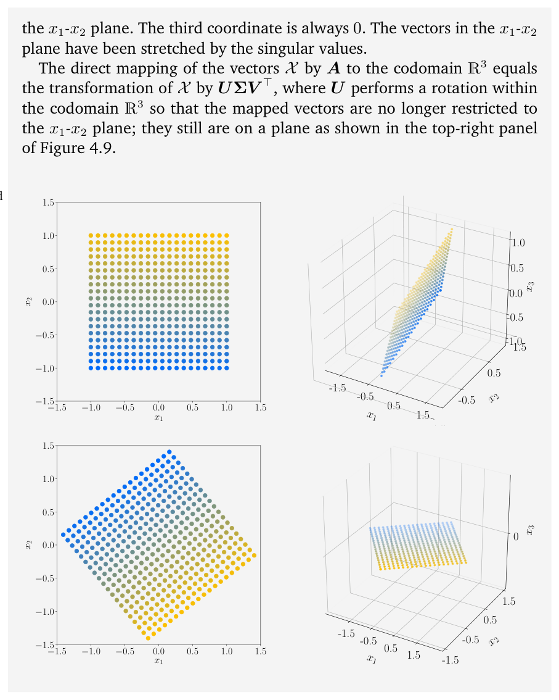

> **Figure 4.9** SVD and mapping of vectors (represented by discs). The panels follow the same anti-clockwise structure of Figure 4.8.

**图 4.9** 向量（用圆盘表示）的 SVD 与映射。各面板遵循与图 4.8 相同的逆时针结构。

### 4.5.2 SVD 的构造（Construction of the SVD）

> We will next discuss why the SVD exists and show how to compute it in detail. The SVD of a general matrix shares some similarities with the eigendecomposition of a square matrix.

接下来我们将讨论 SVD 为何存在，并详细展示如何计算它。一般矩阵的 SVD 与方阵的特征分解有若干相似之处。

> **Remark.** Compare the eigendecomposition of an SPD matrix

**评注.** 比较对称正定（SPD）矩阵的特征分解

$$
S = S^\top = \mathbf{P}\mathbf{D}\mathbf{P}^\top
\tag{4.68}
$$

> with the corresponding SVD

与相应的 SVD

$$
S = \mathbf{U}\boldsymbol{\Sigma}\mathbf{V}^\top.
\tag{4.69}
$$

> If we set

如果我们取

$$
\mathbf{U} = \mathbf{P} = \mathbf{V}, \quad \mathbf{D} = \boldsymbol{\Sigma},
\tag{4.70}
$$

> we see that the SVD of SPD matrices is their eigendecomposition. ♢

就会发现 SPD 矩阵的 SVD 就是它们的特征分解。♢

> In the following, we will explore why Theorem 4.22 holds and how the SVD is constructed. Computing the SVD of $A \in \mathbb{R}^{m \times n}$ is equivalent to finding two sets of orthonormal bases $U = (u_1, \ldots, u_m)$ and $V = (v_1, \ldots, v_n)$ of the codomain $\mathbb{R}^m$ and the domain $\mathbb{R}^n$, respectively. From these ordered bases, we will construct the matrices $U$ and $V$.

接下来，我们将探究定理 4.22 为何成立以及 SVD 是如何构造的。计算 $A \in \mathbb{R}^{m \times n}$ 的 SVD，等价于找出两组标准正交基：陪域 $\mathbb{R}^m$ 的 $U = (u_1, \ldots, u_m)$ 与定义域 $\mathbb{R}^n$ 的 $V = (v_1, \ldots, v_n)$。我们将从这两组有序基出发构造矩阵 $U$ 和 $V$。

> Our plan is to start with constructing the orthonormal set of right-singular vectors $v_1, \ldots, v_n \in \mathbb{R}^n$. We then construct the orthonormal set of left-singular vectors $u_1, \ldots, u_m \in \mathbb{R}^m$. Thereafter, we will link the two and require that the orthogonality of the $v_i$ is preserved under the transformation of $A$. This is important because we know that the images $Av_i$ form a set of orthogonal vectors. We will then normalize these images by scalar factors, which will turn out to be the singular values.

我们的计划是：先构造由右奇异向量 $v_1, \ldots, v_n \in \mathbb{R}^n$ 组成的标准正交集合；再构造由左奇异向量 $u_1, \ldots, u_m \in \mathbb{R}^m$ 组成的标准正交集合。然后，我们将把二者联系起来，并要求 $v_i$ 的正交性在 $A$ 的变换下得以保持。这一点很重要，因为我们知道像 $Av_i$ 构成一组正交向量。随后，我们将用标量因子对这些像进行归一化，而这些标量因子将被证明正是奇异值。

> Let us begin with constructing the right-singular vectors. The spectral theorem (Theorem 4.15) tells us that the eigenvectors of a symmetric matrix form an ONB, which also means it can be diagonalized. Moreover, from Theorem 4.14 we can always construct a symmetric, positive semidefinite matrix $A^\top A \in \mathbb{R}^{n \times n}$ from any rectangular matrix $A \in \mathbb{R}^{m \times n}$. Thus, we can always diagonalize $A^\top A$ and obtain

让我们从构造右奇异向量开始。谱定理（定理 4.15）告诉我们，对称矩阵的特征向量构成一组标准正交基（ONB），这也意味着该矩阵可以对角化。此外，由定理 4.14，对任意长方矩阵 $A \in \mathbb{R}^{m \times n}$，我们总能构造出对称半正定矩阵 $A^\top A \in \mathbb{R}^{n \times n}$。因此，我们总能将 $A^\top A$ 对角化，得到

$$
A^\top A = \mathbf{P}\mathbf{D}\mathbf{P}^\top = \mathbf{P}
\begin{pmatrix}
\lambda_1 & \cdots & 0 \\
& \ddots & \\
0 & \cdots & \lambda_n
\end{pmatrix}
\mathbf{P}^\top,
\tag{4.71}
$$

> where $P$ is an orthogonal matrix, which is composed of the orthonormal eigenbasis. The $\lambda_i \geqslant 0$ are the eigenvalues of $A^\top A$. Let us assume the SVD of $A$ exists and inject (4.64) into (4.71). This yields

其中 $P$ 是正交矩阵，由标准正交特征基组成。$\lambda_i \geqslant 0$ 是 $A^\top A$ 的特征值。假设 $A$ 的 SVD 存在，并将 (4.64) 代入 (4.71)，得到

$$
A^\top A = (\mathbf{U}\boldsymbol{\Sigma}\mathbf{V}^\top)^\top (\mathbf{U}\boldsymbol{\Sigma}\mathbf{V}^\top) = \mathbf{V}\boldsymbol{\Sigma}^\top \mathbf{U}^\top \mathbf{U}\boldsymbol{\Sigma}\mathbf{V}^\top,
\tag{4.72}
$$

> where $U$, $V$ are orthogonal matrices. Therefore, with $U^\top U = I$ we obtain

其中 $U$、$V$ 为正交矩阵。因此，利用 $U^\top U = I$，我们得到

$$
A^\top A = \mathbf{V}\boldsymbol{\Sigma}^\top \boldsymbol{\Sigma}\mathbf{V}^\top = \mathbf{V}
\begin{pmatrix}
\sigma_1^2 & & 0 \\
& \ddots & \\
0 & & \sigma_n^2
\end{pmatrix}
\mathbf{V}^\top.
\tag{4.73}
$$

> Comparing now (4.71) and (4.73), we identify

现在比较 (4.71) 与 (4.73)，可以确认

$$
\mathbf{V}^\top = \mathbf{P}^\top,
\tag{4.74}
$$

$$
\sigma_i^2 = \lambda_i.
\tag{4.75}
$$

> Therefore, the eigenvectors of $A^\top A$ that compose $P$ are the right-singular vectors $V$ of $A$ (see (4.74)). The eigenvalues of $A^\top A$ are the squared singular values of $\Sigma$ (see (4.75)).

因此，组成 $P$ 的那些 $A^\top A$ 的特征向量就是 $A$ 的右奇异向量 $V$（见 (4.74)）。$A^\top A$ 的特征值就是 $\Sigma$ 的奇异值的平方（见 (4.75)）。

> To obtain the left-singular vectors $U$, we follow a similar procedure. We start by computing the SVD of the symmetric matrix $AA^\top \in \mathbb{R}^{m \times m}$ (instead of the previous $A^\top A \in \mathbb{R}^{n \times n}$). The SVD of $A$ yields

为得到左奇异向量 $U$，我们采用类似的步骤。我们首先计算对称矩阵 $AA^\top \in \mathbb{R}^{m \times m}$ 的 SVD（而不是先前的 $A^\top A \in \mathbb{R}^{n \times n}$）。把 $A$ 的 SVD 代入，得到

$$
AA^\top = (\mathbf{U}\boldsymbol{\Sigma}\mathbf{V}^\top)(\mathbf{U}\boldsymbol{\Sigma}\mathbf{V}^\top)^\top = \mathbf{U}\boldsymbol{\Sigma}\mathbf{V}^\top\mathbf{V}\boldsymbol{\Sigma}^\top\mathbf{U}^\top
\tag{4.76a}
$$

$$
= \mathbf{U}
\begin{pmatrix}
\sigma_1^2 & & 0 \\
& \ddots & \\
0 & & \sigma_m^2
\end{pmatrix}
\mathbf{U}^\top.
\tag{4.76b}
$$

> The spectral theorem tells us that $AA^\top = \mathbf{S}\mathbf{D}\mathbf{S}^\top$ can be diagonalized and we can find an ONB of eigenvectors of $AA^\top$, which are collected in $S$. The orthonormal eigenvectors of $AA^\top$ are the left-singular vectors $U$ and form an orthonormal basis in the codomain of the SVD.

谱定理告诉我们，$AA^\top = \mathbf{S}\mathbf{D}\mathbf{S}^\top$ 可以对角化，而且我们能找到由 $AA^\top$ 的特征向量构成的一组标准正交基，并将它们收集在 $S$ 中。$AA^\top$ 的标准正交特征向量就是左奇异向量 $U$，它们构成 SVD 陪域中的一组标准正交基。

> This leaves the question of the structure of the matrix $\Sigma$. Since $AA^\top$ and $A^\top A$ have the same nonzero eigenvalues (see page 106), the nonzero entries of the $\Sigma$ matrices in the SVD for both cases have to be the same.

剩下的问题是矩阵 $\Sigma$ 的结构。由于 $AA^\top$ 与 $A^\top A$ 具有相同的非零特征值（见第 106 页），两种情形下 SVD 中 $\Sigma$ 矩阵的非零元素必定相同。

> The last step is to link up all the parts we touched upon so far. We have an orthonormal set of right-singular vectors in $V$. To finish the construction of the SVD, we connect them with the orthonormal vectors $U$. To reach this goal, we use the fact the images of the $v_i$ under $A$ have to be orthogonal, too. We can show this by using the results from Section 3.4. We require that the inner product between $A v_i$ and $A v_j$ must be 0 for $i \neq j$. For any two orthogonal eigenvectors $v_i, v_j$, $i \neq j$, it holds that

最后一步是把我们到目前为止接触的所有部分联系起来。我们在 $V$ 中已有一组由右奇异向量构成的标准正交集合。为了完成 SVD 的构造，我们需要把它们与标准正交的向量 $U$ 联系起来。为此，我们利用这样一个事实：$v_i$ 在 $A$ 下的像也必须正交。利用 3.4 节的结果可以证明这一点。我们要求 $A v_i$ 与 $A v_j$ 之间的内积在 $i \neq j$ 时必须为 0。对于任意两个正交的特征向量 $v_i, v_j$（$i \neq j$），有

$$
(A v_i)^\top (A v_j) = v_i^\top (A^\top A) v_j = v_i^\top (\lambda_j v_j) = \lambda_j v_i^\top v_j = 0.
\tag{4.77}
$$

> For the case $m \geqslant r$, it holds that $\{A v_1, \ldots, A v_r\}$ is a basis of an $r$-dimensional subspace of $\mathbb{R}^m$.

对于 $m \geqslant r$ 的情形，$\{A v_1, \ldots, A v_r\}$ 构成 $\mathbb{R}^m$ 的一个 $r$ 维子空间的基。

> To complete the SVD construction, we need left-singular vectors that are orthonormal: We normalize the images of the right-singular vectors $A v_i$ and obtain

为了完成 SVD 的构造，我们还需要一组标准正交的左奇异向量：我们将右奇异向量的像 $A v_i$ 归一化，得到

$$
u_i := \frac{A v_i}{\|A v_i\|} = \frac{1}{\sqrt{\lambda_i}} A v_i = \frac{1}{\sigma_i} A v_i,
\tag{4.78}
$$

> where the last equality was obtained from (4.75) and (4.76b), showing us that the eigenvalues of $A A^\top$ are such that $\sigma_i^2 = \lambda_i$. Therefore, the eigenvectors of $A^\top A$, which we know are the right-singular vectors $v_i$, and their normalized images under $A$, the left-singular vectors $u_i$, form two self-consistent ONBs that are connected through the singular value matrix $\Sigma$.

其中最后一个等号由 (4.75) 与 (4.76b) 得到，由此可知 $A A^\top$ 的特征值满足 $\sigma_i^2 = \lambda_i$。因此，$A^\top A$ 的特征向量（即我们已知的右奇异向量 $v_i$）与它们在 $A$ 下的归一化像（即左奇异向量 $u_i$）构成两组彼此自洽的标准正交基，并通过奇异值矩阵 $\Sigma$ 相互联系。

> Let us rearrange (4.78) to obtain the singular value equation

让我们重排 (4.78)，得到奇异值方程（singular value equation）

$$
A v_i = \sigma_i u_i, \quad i = 1, \ldots, r.
\tag{4.79}
$$

> This equation closely resembles the eigenvalue equation (4.25), but the vectors on the left- and the right-hand sides are not the same.

这个方程与特征值方程 (4.25) 非常相似，但等号两边出现的向量并不相同。

> For $n < m$, (4.79) holds only for $i \leqslant n$, but (4.79) says nothing about the $u_i$ for $i > n$. However, we know by construction that they are orthonormal. Conversely, for $m < n$, (4.79) holds only for $i \leqslant m$. For $i > m$, we have $A v_i = 0$ and we still know that the $v_i$ form an orthonormal set. This means that the SVD also supplies an orthonormal basis of the kernel (null space) of $A$, the set of vectors $x$ with $A x = 0$ (see Section 2.7.3).

当 $n < m$ 时，(4.79) 仅对 $i \leqslant n$ 成立，而对 $i > n$ 的 $u_i$ 没有给出任何说明。不过，由构造可知它们是标准正交的。反之，当 $m < n$ 时，(4.79) 仅对 $i \leqslant m$ 成立。对于 $i > m$，我们有 $A v_i = 0$，并且仍然知道 $v_i$ 构成一个标准正交集。这意味着 SVD 还给出了 $A$ 的核（零空间）的一组标准正交基，核即满足 $A x = 0$ 的向量 $x$ 所构成的集合（见 2.7.3 节）。

> Concatenating the $v_i$ as the columns of $V$ and the $u_i$ as the columns of $U$ yields

将 $v_i$ 依次作为 $V$ 的列、$u_i$ 依次作为 $U$ 的列拼接起来，可得

$$
A V = U \Sigma,
\tag{4.80}
$$

> where $\Sigma$ has the same dimensions as $A$ and a diagonal structure for rows $1, \ldots, r$. Hence, right-multiplying with $V^\top$ yields $A = \mathbf{U}\boldsymbol{\Sigma}\mathbf{V}^\top$, which is the SVD of $A$.

其中 $\Sigma$ 与 $A$ 维度相同，并且在第 $1, \ldots, r$ 行上具有对角结构。因此，右乘 $V^\top$ 即得 $A = \mathbf{U}\boldsymbol{\Sigma}\mathbf{V}^\top$，这就是 $A$ 的 SVD。

> **Example 4.13** (Computing the SVD)

**例 4.13**（计算 SVD，Computing the SVD）

> Let us find the singular value decomposition of

我们来求下述矩阵的奇异值分解

$$
A =
\begin{pmatrix}
1 & 0 & 1 \\
-2 & 1 & 0
\end{pmatrix}.
\tag{4.81}
$$

> The SVD requires us to compute the right-singular vectors $v_j$, the singular values $\sigma_k$, and the left-singular vectors $u_i$.

SVD 要求我们计算右奇异向量 $v_j$、奇异值 $\sigma_k$ 以及左奇异向量 $u_i$。

> Step 1: Right-singular vectors as the eigenbasis of $A^\top A$.

第 1 步：作为 $A^\top A$ 特征基的右奇异向量。

> We start by computing

我们先计算

$$
A^\top A =
\begin{pmatrix}
1 & -2 \\
0 & 1 \\
1 & 0
\end{pmatrix}
\begin{pmatrix}
1 & 0 & 1 \\
-2 & 1 & 0
\end{pmatrix}
=
\begin{pmatrix}
5 & -2 & 1 \\
-2 & 1 & 0 \\
1 & 0 & 1
\end{pmatrix}.
\tag{4.82}
$$

> We compute the singular values and right-singular vectors $v_j$ through the eigenvalue decomposition of $A^\top A$, which is given as

我们通过 $A^\top A$ 的特征值分解来计算奇异值与右奇异向量 $v_j$，该分解为

$$
A^\top A =
\begin{pmatrix}
\frac{5}{\sqrt{30}} & 0 & -\frac{1}{\sqrt{6}} \\
-\frac{2}{\sqrt{30}} & \frac{1}{\sqrt{5}} & -\frac{2}{\sqrt{6}} \\
\frac{1}{\sqrt{30}} & \frac{2}{\sqrt{5}} & \frac{1}{\sqrt{6}}
\end{pmatrix}
\begin{pmatrix}
6 & 0 & 0 \\
0 & 1 & 0 \\
0 & 0 & 0
\end{pmatrix}
\begin{pmatrix}
\frac{5}{\sqrt{30}} & -\frac{2}{\sqrt{30}} & \frac{1}{\sqrt{30}} \\
0 & \frac{1}{\sqrt{5}} & \frac{2}{\sqrt{5}} \\
-\frac{1}{\sqrt{6}} & -\frac{2}{\sqrt{6}} & \frac{1}{\sqrt{6}}
\end{pmatrix}
= \mathbf{P}\mathbf{D}\mathbf{P}^\top,
\tag{4.83}
$$

> and we obtain the right-singular vectors as the columns of $P$ so that

并将右奇异向量取为 $P$ 的各列，于是

$$
V = P =
\begin{pmatrix}
\frac{5}{\sqrt{30}} & 0 & -\frac{1}{\sqrt{6}} \\
-\frac{2}{\sqrt{30}} & \frac{1}{\sqrt{5}} & -\frac{2}{\sqrt{6}} \\
\frac{1}{\sqrt{30}} & \frac{2}{\sqrt{5}} & \frac{1}{\sqrt{6}}
\end{pmatrix}.
\tag{4.84}
$$

> Step 2: Singular-value matrix. As the singular values $\sigma_i$ are the square roots of the eigenvalues of $A^\top A$ we obtain them straight from $D$. Since $\operatorname{rk}(A) = 2$, there are only two nonzero singular values: $\sigma_1 = \sqrt{6}$ and $\sigma_2 = 1$. The singular value matrix must be the same size as $A$, and we obtain

第 2 步：奇异值矩阵。由于奇异值 $\sigma_i$ 是 $A^\top A$ 特征值的平方根，我们可以直接从 $D$ 读出它们。因为 $\operatorname{rk}(A) = 2$，所以只有两个非零奇异值：$\sigma_1 = \sqrt{6}$ 与 $\sigma_2 = 1$。奇异值矩阵必须与 $A$ 尺寸相同，于是我们得到

$$
\Sigma =
\begin{pmatrix}
\sqrt{6} & 0 & 0 \\
0 & 1 & 0
\end{pmatrix}.
\tag{4.85}
$$

> Step 3: Left-singular vectors as the normalized image of the right-**singular vectors.** We find the left-singular vectors by computing the image of the right-singular vectors under $A$ and normalizing them by dividing them by their corresponding singular value. We obtain

第 3 步：作为右奇异向量归一化像的左奇异向量。我们通过计算右奇异向量在 $A$ 下的像，并将其除以各自对应的奇异值来归一化，从而求出左奇异向量。我们得到

$$
u_1 = \frac{1}{\sigma_1} A v_1 = \frac{1}{\sqrt{6}}
\begin{pmatrix}
1 & 0 & 1 \\
-2 & 1 & 0
\end{pmatrix}
\begin{pmatrix}
\frac{5}{\sqrt{30}} \\
-\frac{2}{\sqrt{30}} \\
\frac{1}{\sqrt{30}}
\end{pmatrix}
=
\begin{pmatrix}
\frac{1}{\sqrt{5}} \\
-\frac{2}{\sqrt{5}}
\end{pmatrix},
\tag{4.86}
$$

$$
u_2 = \frac{1}{\sigma_2} A v_2 = 1
\begin{pmatrix}
1 & 0 & 1 \\
-2 & 1 & 0
\end{pmatrix}
\begin{pmatrix}
0 \\
\frac{1}{\sqrt{5}} \\
\frac{2}{\sqrt{5}}
\end{pmatrix}
=
\begin{pmatrix}
\frac{2}{\sqrt{5}} \\
\frac{1}{\sqrt{5}}
\end{pmatrix},
\tag{4.87}
$$

$$
U = [u_1, u_2] = \frac{1}{\sqrt{5}}
\begin{pmatrix}
1 & 2 \\
-2 & 1
\end{pmatrix}.
\tag{4.88}
$$

> Note that on a computer the approach illustrated here has poor numerical behavior, and the SVD of $A$ is normally computed without resorting to the eigenvalue decomposition of $A^\top A$.

需要注意的是，在计算机上这里所示的方法数值性态较差，因此 $A$ 的 SVD 通常不借助 $A^\top A$ 的特征值分解来计算。

### 4.5.3 特征值分解与奇异值分解（Eigenvalue Decomposition vs. Singular Value Decomposition）

> Let us consider the eigendecomposition $A = \mathbf{P}\mathbf{D}\mathbf{P}^{-1}$ and the SVD $A = \mathbf{U}\boldsymbol{\Sigma}\mathbf{V}^\top$ and review the core elements of the past sections.

让我们考虑特征分解 $A = \mathbf{P}\mathbf{D}\mathbf{P}^{-1}$ 与 SVD $A = \mathbf{U}\boldsymbol{\Sigma}\mathbf{V}^\top$，并回顾前面几节的核心内容。

> The SVD always exists for any matrix $\mathbb{R}^{m \times n}$. The eigendecomposition is only defined for square matrices $\mathbb{R}^{n \times n}$ and only exists if we can find a basis of eigenvectors of $\mathbb{R}^n$. The vectors in the eigendecomposition matrix $P$ are not necessarily orthogonal, i.e., the change of basis is not a simple rotation and scaling. On the other hand, the vectors in the matrices $U$ and $V$ in the SVD are orthonormal, so they do represent rotations. Both the eigendecomposition and the SVD are compositions of three linear mappings:

SVD 对任意 $\mathbb{R}^{m \times n}$ 矩阵总是存在。特征分解仅对方阵 $\mathbb{R}^{n \times n}$ 有定义，并且只有当我们能找到 $\mathbb{R}^n$ 的一组由特征向量构成的基时才存在。特征分解矩阵 $P$ 中的向量不一定正交，也就是说，基变换并不是单纯的旋转与缩放。相反，SVD 中矩阵 $U$ 与 $V$ 的向量是标准正交的，因此它们确实表示旋转。特征分解与 SVD 都是三个线性映射的复合：

> 1. Change of basis in the domain

1. 在定义域中进行基变换

> 2. Independent scaling of each new basis vector and mapping from domain to codomain

2. 对每个新基向量独立地进行缩放，并从定义域映射到陪域

> 3. Change of basis in the codomain

3. 在陪域中进行基变换

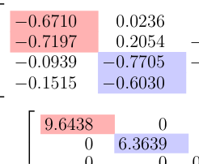

> **Figure 4.10** Movie ratings of three people for four movies and its SVD decomposition.

**图 4.10** 三个人对四部电影的评分及其 SVD 分解。

> A key difference between the eigendecomposition and the SVD is that in the SVD, domain and codomain can be vector spaces of different dimensions. In the SVD, the left- and right-singular vector matrices $U$ and $V$ are generally not inverse of each other (they perform basis changes in different vector spaces). In the eigendecomposition, the basis change matrices $P$ and $P^{-1}$ are inverses of each other. In the SVD, the entries in the diagonal matrix $\Sigma$ are all real and nonnegative, which is not generally true for the diagonal matrix in the eigendecomposition. The SVD and the eigendecomposition are closely related through their projections

特征分解与 SVD 的一个关键区别在于：在 SVD 中，定义域与陪域可以是维度不同的向量空间。在 SVD 中，左、右奇异向量矩阵 $U$ 与 $V$ 一般不互为逆矩阵（它们在不同的向量空间中进行基变换）。而在特征分解中，基变换矩阵 $P$ 与 $P^{-1}$ 互为逆矩阵。在 SVD 中，对角矩阵 $\Sigma$ 的元素都是非负实数，这对特征分解中的对角矩阵而言一般并不成立。SVD 与特征分解通过各自的投影密切关联：

> – The left-singular vectors of $A$ are eigenvectors of $A A^\top$

– $A$ 的左奇异向量是 $A A^\top$ 的特征向量

> – The right-singular vectors of $A$ are eigenvectors of $A^\top A$.

– $A$ 的右奇异向量是 $A^\top A$ 的特征向量。

> – The nonzero singular values of $A$ are the square roots of the nonzero eigenvalues of both $A A^\top$ and $A^\top A$.

– $A$ 的非零奇异值是 $A A^\top$ 与 $A^\top A$ 的非零特征值二者的平方根。

> For symmetric matrices $A \in \mathbb{R}^{n \times n}$, the eigenvalue decomposition and the SVD are one and the same, which follows from the spectral theorem 4.15.

对于对称矩阵 $A \in \mathbb{R}^{n \times n}$，特征值分解与 SVD 是同一回事，这由谱定理 4.15 可知。

> **Example 4.14** (Finding Structure in Movie Ratings and Consumers) Let us add a practical interpretation of the SVD by analyzing data on people and their preferred movies. Consider three viewers (Ali, Beatrix, Chandra) rating four different movies (Star Wars, Blade Runner, Amelie, Delicatessen). Their ratings are values between 0 (worst) and 5 (best) and encoded in a data matrix $A \in \mathbb{R}^{4 \times 3}$ as shown in Figure 4.10. Each row represents a movie and each column a user. Thus, the column vectors of movie ratings, one for each viewer, are $x_{\text{Ali}}$, $x_{\text{Beatrix}}$, $x_{\text{Chandra}}$.

**例 4.14**（在电影评分与消费者中发现结构，Finding Structure in Movie Ratings and Consumers）让我们通过分析人群及其偏好电影的数据，为 SVD 提供一种实用的解读。考虑三位观众（Ali、Beatrix、Chandra）为四部不同的电影（Star Wars、Blade Runner、Amelie、Delicatessen）打分。评分取 0（最差）到 5（最好）之间的值，并被编码为一个数据矩阵 $A \in \mathbb{R}^{4 \times 3}$，如图 4.10 所示。每一行代表一部电影，每一列代表一位用户。因此，各观众的电影评分列向量分别为 $x_{\text{Ali}}$、$x_{\text{Beatrix}}$、$x_{\text{Chandra}}$。

> Factoring $A$ using the SVD offers us a way to capture the relationships of how people rate movies, and especially if there is a structure linking which people like which movies. Applying the SVD to our data matrix $A$ makes a number of assumptions:

利用 SVD 对 $A$ 进行因子分解，为我们提供了一种捕捉“人们如何为电影评分”这一关系的方法，尤其是考察是否存在一种把“哪些人喜欢哪些电影”联系起来的结构。将 SVD 应用于我们的数据矩阵 $A$ 需要作出若干假设：

> 1. All viewers rate movies consistently using the same linear mapping.

1. 所有观众都通过同一线性映射一致地为电影评分。

> 2. There are no errors or noise in the ratings.

2. 评分中不存在误差或噪声。

> 3. We interpret the left-singular vectors $u_i$ as stereotypical movies and the right-singular vectors $v_j$ as stereotypical viewers.

3. 我们将左奇异向量 $u_i$ 解释为典型电影，将右奇异向量 $v_j$ 解释为典型观众。

> We then make the assumption that any viewer's specific movie preferences can be expressed as a linear combination of the $v_j$. Similarly, any movie's like-ability can be expressed as a linear combination of the $u_i$. Therefore, a vector in the domain of the SVD can be interpreted as a viewer in the “space” of stereotypical viewers, and a vector in the codomain of the SVD correspondingly as a movie in the “space” of stereotypical movies. Let us inspect the SVD of our movie-user matrix.

接着我们假设：任何观众特定的电影偏好都可以表示为 $v_j$ 的线性组合；类似地，任何电影的受喜爱程度都可以表示为 $u_i$ 的线性组合。因此，SVD 定义域中的一个向量可以解释为“典型观众空间”中的一位观众，相应地，SVD 陪域中的一个向量则可以解释为“典型电影空间”中的一部电影。让我们来考察这个电影-用户矩阵的 SVD。

> The first left-singular vector $u_1$ has large absolute values for the two science fiction movies and a large first singular value (red shading in Figure 4.10). Thus, this groups a type of users with a specific set of movies (science fiction theme). Similarly, the first right-singular $v_1$ shows large absolute values for Ali and Beatrix, who give high ratings to science fiction movies (green shading in Figure 4.10). This suggests that $v_1$ reflects the notion of a science fiction lover.

第一个左奇异向量 $u_1$ 在两部科幻电影上取较大的绝对值，且第一个奇异值很大（图 4.10 中的红色阴影）。这样，它把某一类用户与一组特定的电影（科幻主题）归在了一起。类似地，第一个右奇异向量 $v_1$ 在 Ali 和 Beatrix 上呈现较大的绝对值，他们给科幻电影打了高分（图 4.10 中的绿色阴影）。这表明 $v_1$ 反映了“科幻迷”的概念。

> Similarly, $u_2$, seems to capture a French art house film theme, and $v_2$ indicates that Chandra is close to an idealized lover of such movies. An idealized science fiction lover is a purist and only loves science fiction movies, so a science fiction lover $v_1$ gives a rating of zero to everything but science fiction themed—this logic is implied by the diagonal substructure for the singular value matrix $\Sigma$. A specific movie is therefore represented by how it decomposes (linearly) into its stereotypical movies. Likewise, a person would be represented by how they decompose (via linear combination) into movie themes.

类似地，$u_2$ 似乎刻画了法国艺术电影的主题，而 $v_2$ 表明 Chandra 接近这类电影的理想化影迷。理想化的科幻迷是纯粹主义者，只喜爱科幻电影，因此作为科幻迷的 $v_1$ 对除科幻主题以外的一切评分都为零——这一逻辑蕴含在奇异值矩阵 $\Sigma$ 的对角子结构之中。因此，一部具体的电影由它（线性地）分解为各典型电影的方式来表示；同样，一个人也由其（通过线性组合）分解为各电影主题的方式来表示。

> It is worth to briefly discuss SVD terminology and conventions, as there are different versions used in the literature. While these differences can be confusing, the mathematics remains invariant to them.

值得简要讨论一下 SVD 的术语与约定，因为文献中存在使用不同版本的情况。这些差异虽然可能令人困惑，但数学内容本身并不受其影响。

> For convenience in notation and abstraction, we use an SVD notation where the SVD is described as having two square left- and right-singular vector matrices, but a non-square singular value matrix. Our definition (4.64) for the SVD is sometimes called the full SVD.

为了记号与抽象上的方便，我们所采用的 SVD 记法把 SVD 描述为具有两个方形的左、右奇异向量矩阵，但奇异值矩阵不是方阵。我们对 SVD 的定义 (4.64) 有时称为完整 SVD（full SVD）。

> Some authors define the SVD a bit differently and focus on square singular matrices. Then, for $A \in \mathbb{R}^{m \times n}$ and $m \geqslant n$,

一些作者对 SVD 的定义略有不同，他们关注方形的奇异值矩阵。此时，对于 $A \in \mathbb{R}^{m \times n}$ 且 $m \geqslant n$，有

$$
A_{m \times n} = U_{m \times n} \Sigma_{n \times n} V_{n \times n}^\top.
\tag{4.89}
$$

> Sometimes this formulation is called the reduced SVD (e.g., Datta (2010)) or the SVD (e.g., Press et al. (2007)). This alternative format changes merely how the matrices are constructed but leaves the mathematical structure of the SVD unchanged. The convenience of this alternative formulation is that $\Sigma$ is diagonal, as in the eigenvalue decomposition. In Section 4.6, we will learn about matrix approximation techniques using the SVD, which is also called the truncated SVD. It is possible to define the SVD of a rank-$r$ matrix $A$ so that $U$ is an $m \times r$ matrix, $\Sigma$ a diagonal matrix $r \times r$, and $V$ an $r \times n$ matrix. This construction is very similar to our definition, and ensures that the diagonal matrix $\Sigma$ has only nonzero entries along the diagonal. The main convenience of this alternative notation is that $\Sigma$ is diagonal, as in the eigenvalue decomposition. A restriction that the SVD for $A$ only applies to $m \times n$ matrices with $m > n$ is practically unnecessary. When $m < n$, the SVD decomposition will yield $\Sigma$ with more zero columns than rows and, consequently, the singular values $\sigma_{m+1}, \ldots, \sigma_n$ are 0.

有时这种表述被称为约化 SVD（reduced SVD，如 Datta (2010)）或 SVD（如 Press et al. (2007)）。这种替代形式仅仅改变了矩阵的构造方式，而 SVD 的数学结构保持不变。这种替代表述的便利之处在于，$\Sigma$ 与特征分解中一样是对角矩阵。在 4.6 节中，我们将学习利用 SVD 进行矩阵近似的技术，这也被称为截断 SVD（truncated SVD）。也可以为秩为 $r$ 的矩阵 $A$ 定义 SVD，使得 $U$ 为 $m \times r$ 矩阵，$\Sigma$ 为 $r \times r$ 对角矩阵，$V$ 为 $r \times n$ 矩阵。这种构造与我们的定义非常相似，并且保证对角矩阵 $\Sigma$ 的对角线上只有非零元素。这种替代记号的主要便利之处在于，$\Sigma$ 与特征分解中一样是对角矩阵。“对 $A$ 的 SVD 只适用于满足 $m > n$ 的 $m \times n$ 矩阵”这一限制在实践中并无必要。当 $m < n$ 时，SVD 分解得到的 $\Sigma$ 中零列的数目将多于行数，因而奇异值 $\sigma_{m+1}, \ldots, \sigma_n$ 为 0。

> The SVD is used in a variety of applications in machine learning from least-squares problems in curve fitting to solving systems of linear equations. These applications harness various important properties of the SVD, its relation to the rank of a matrix, and its ability to approximate matrices of a given rank with lower-rank matrices. Substituting a matrix with its SVD has often the advantage of making calculation more robust to numerical rounding errors. As we will explore in the next section, the SVD’s ability to approximate matrices with “simpler” matrices in a principled manner opens up machine learning applications ranging from dimensionality reduction and topic modeling to data compression and clustering.

SVD 在机器学习中有着广泛的应用，从曲线拟合中的最小二乘问题到线性方程组的求解。这些应用利用了 SVD 的一系列重要性质：它与矩阵的秩的关系，以及它用低秩矩阵近似给定秩矩阵的能力。用矩阵的 SVD 代替矩阵本身，往往能使计算对数值舍入误差更加稳健。正如我们将在下一节探讨的那样，SVD 能以一种有原则的方式用“更简单”的矩阵来近似矩阵，这开启了许多机器学习应用，从降维、主题建模到数据压缩与聚类。

## 4.6 矩阵近似（Matrix Approximation）

> We considered the SVD as a way to factorize $A = \mathbf{U}\boldsymbol{\Sigma}\mathbf{V}^{\top} \in \mathbb{R}^{m \times n}$ into the product of three matrices, where $\mathbf{U} \in \mathbb{R}^{m \times m}$ and $\mathbf{V} \in \mathbb{R}^{n \times n}$ are orthogonal and $\boldsymbol{\Sigma}$ contains the singular values on its main diagonal. Instead of doing the full SVD factorization, we will now investigate how the SVD allows us to represent a matrix $A$ as a sum of simpler (low-rank) matrices $A_i$, which lends itself to a matrix approximation scheme that is cheaper to compute than the full SVD.

我们将 SVD 视为一种把 $A = \mathbf{U}\boldsymbol{\Sigma}\mathbf{V}^{\top} \in \mathbb{R}^{m \times n}$ 分解为三个矩阵乘积的方式，其中 $\mathbf{U} \in \mathbb{R}^{m \times m}$ 和 $\mathbf{V} \in \mathbb{R}^{n \times n}$ 是正交矩阵，$\boldsymbol{\Sigma}$ 在其主对角线上包含各奇异值。现在我们不再做完整的 SVD 分解，而是要研究 SVD 如何让我们把矩阵 $A$ 表示为若干更简单（低秩）的矩阵 $A_i$ 之和，这就自然引出一种矩阵近似方案，其计算代价比完整的 SVD 更低。

> We construct a rank-1 matrix $A_i \in \mathbb{R}^{m \times n}$ as

我们如下构造一个秩 1 矩阵 $A_i \in \mathbb{R}^{m \times n}$：

$$
A_i := u_i v_i^\top \, ,
\tag{4.90}
$$

> which is formed by the outer product of the $i$th orthogonal column vector of $U$ and $V$. Figure 4.11 shows an image of Stonehenge, which can be represented by a matrix $A \in \mathbb{R}^{1432 \times 1910}$, and some outer products $A_i$, as defined in (4.90).

它由 $U$ 与 $V$ 的第 $i$ 个正交列向量作外积（outer product）而得。图 4.11 展示了一幅巨石阵（Stonehenge）图像，它可以表示为矩阵 $A \in \mathbb{R}^{1432 \times 1910}$，图中还展示了按 (4.90) 定义的一些外积 $A_i$。

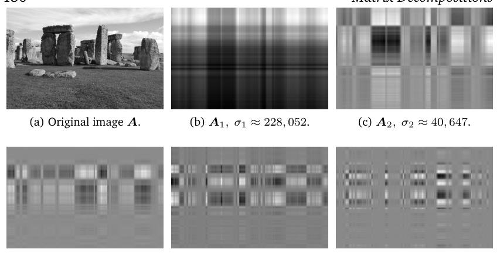

> **Figure 4.11** Image processing with the SVD. (a) The original grayscale image is a 1,432 × 1,910 matrix of values between 0 (black) and 1 (white). (b)–(f) Rank-1 matrices $A_1, \ldots, A_5$ and their corresponding singular values $\sigma_1, \ldots, \sigma_5$. The grid-like structure of each rank-1 matrix is imposed by the outer-product of the left and right-singular vectors.

**图 4.11** 使用 SVD 的图像处理。(a) 原始灰度图像是一个元素取值介于 0（黑）与 1（白）之间的 $1{,}432 \times 1{,}910$ 矩阵。(b)–(f) 秩 1 矩阵 $A_1, \ldots, A_5$ 及其对应的奇异值 $\sigma_1, \ldots, \sigma_5$。每个秩 1 矩阵的网格状结构源于左奇异向量与右奇异向量的外积。

> A matrix $A \in \mathbb{R}^{m \times n}$ of rank $r$ can be written as a sum of rank-1 matrices $A_i$ so that

秩为 $r$ 的矩阵 $A \in \mathbb{R}^{m \times n}$ 可以写成秩 1 矩阵 $A_i$ 之和，使得

$$
A = \sum_{i=1}^{r} \sigma_i u_i v_i^\top = \sum_{i=1}^{r} \sigma_i A_i \, ,
\tag{4.91}
$$

> where the outer-product matrices $A_i$ are weighted by the $i$th singular value $\sigma_i$. We can see why (4.91) holds: The diagonal structure of the singular value matrix $\Sigma$ multiplies only matching left- and right-singular vectors $u_i v_i^\top$ and scales them by the corresponding singular value $\sigma_i$. All terms $\Sigma_{ij} u_i v_j^\top$ vanish for $i \neq j$ because $\Sigma$ is a diagonal matrix. Any terms $i > r$ vanish because the corresponding singular values are 0.

其中外积矩阵 $A_i$ 由第 $i$ 个奇异值 $\sigma_i$ 加权。我们可以看出 (4.91) 为何成立：奇异值矩阵 $\Sigma$ 的对角结构只使相匹配的左、右奇异向量 $u_i v_i^\top$ 相乘，并用相应的奇异值 $\sigma_i$ 对其进行缩放。所有形如 $\Sigma_{ij} u_i v_j^\top$ 的项在 $i \neq j$ 时均为零，因为 $\Sigma$ 是对角矩阵；所有 $i > r$ 的项也为零，因为相应的奇异值为 0。

> In (4.90), we introduced rank-1 matrices $A_i$. We summed up the $r$ individual rank-1 matrices to obtain a rank-$r$ matrix $A$; see (4.91). If the sum does not run over all matrices $A_i$, $i = 1, \ldots, r$, but only up to an intermediate value $k < r$, we obtain a rank-$k$ approximation

在 (4.90) 中我们引入了秩 1 矩阵 $A_i$。把这 $r$ 个秩 1 矩阵逐一求和，便得到秩为 $r$ 的矩阵 $A$，见 (4.91)。如果求和并不遍历所有矩阵 $A_i$（$i = 1, \ldots, r$），而只加到某个中间值 $k < r$，我们就得到一个秩 $k$ 近似（rank-$k$ approximation）

$$
\tilde{A}^{(k)} := \sum_{i=1}^{k} \sigma_i u_i v_i^\top = \sum_{i=1}^{k} \sigma_i A_i
\tag{4.92}
$$

> of $A$ with $\operatorname{rk}(\tilde{A}^{(k)}) = k$. Figure 4.12 shows low-rank approximations $\tilde{A}^{(k)}$ of an original image $A$ of Stonehenge. The shape of the rocks becomes increasingly visible and clearly recognizable in the rank-5 approximation. While the original image requires $1{,}432 \cdot 1{,}910 = 2{,}735{,}120$ numbers, the rank-5 approximation requires us only to store the five singular values and the five left- and right-singular vectors ($1{,}432$ and $1{,}910$-dimensional each) for a total of $5 \cdot (1{,}432 + 1{,}910 + 1) = 16{,}715$ numbers – just above 0.6% of the original.

它满足 $\operatorname{rk}(\tilde{A}^{(k)}) = k$。图 4.12 展示了巨石阵原始图像 $A$ 的低秩近似 $\tilde{A}^{(k)}$。在秩 5 近似中，岩石的轮廓越来越清晰、越来越容易辨认。原始图像需要 $1{,}432 \cdot 1{,}910 = 2{,}735{,}120$ 个数来存储，而秩 5 近似只需存储五个奇异值和五个左、右奇异向量（分别为 $1{,}432$ 维与 $1{,}910$ 维），总计 $5 \cdot (1{,}432 + 1{,}910 + 1) = 16{,}715$ 个数——仅略高于原始数据的 0.6%。

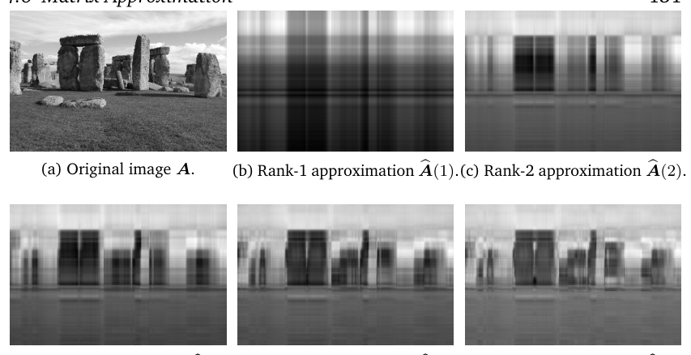

> **Figure 4.12** Image reconstruction with the SVD. (a) Original image. (b)–(f) Image reconstruction using the low-rank approximation of the SVD, where the rank-$k$ approximation is given by $\tilde{A}^{(k)} = \sum_{i=1}^{k} \sigma_i A_i$.

**图 4.12** 使用 SVD 的图像重构。(a) 原始图像。(b)–(f) 使用 SVD 低秩近似的图像重构，其中秩 $k$ 近似为 $\tilde{A}^{(k)} = \sum_{i=1}^{k} \sigma_i A_i$。

> To measure the difference (error) between $A$ and its rank-$k$ approximation $\tilde{A}^{(k)}$, we need the notion of a norm. In Section 3.1, we already used norms on vectors that measure the length of a vector. By analogy we can also define norms on matrices.

为了度量 $A$ 与其秩 $k$ 近似 $\tilde{A}^{(k)}$ 之间的差异（误差），我们需要范数的概念。在 3.1 节中，我们已经用过度量向量长度的（向量）范数。类似地，我们也可以为矩阵定义范数。

> **Definition 4.23** (Spectral Norm of a Matrix). For $x \in \mathbb{R}^n \setminus \{0\}$, the spectral norm of a matrix $A \in \mathbb{R}^{m \times n}$ is defined as

**定义 4.23**（矩阵的谱范数，Spectral Norm of a Matrix）。对于 $x \in \mathbb{R}^n \setminus \{0\}$，矩阵 $A \in \mathbb{R}^{m \times n}$ 的谱范数定义为

$$
\|A\|_2 := \max_{x} \frac{\|A x\|_2}{\|x\|_2} \, .
\tag{4.93}
$$

> We introduce the notation of a subscript in the matrix norm (left-hand side), similar to the Euclidean norm for vectors (right-hand side), which has subscript 2. The spectral norm (4.93) determines how long any vector $x$ can at most become when multiplied by $A$.

我们在矩阵范数（左端）中引入了下标记号，这与向量的欧几里得范数（右端）类似，后者带有下标 2。谱范数 (4.93) 刻画的是：任意向量 $x$ 与 $A$ 相乘之后至多能变得多长。

> **Theorem 4.24.** The spectral norm of $A$ is its largest singular value $\sigma_1$.

**定理 4.24.** $A$ 的谱范数就是它的最大奇异值 $\sigma_1$。

> We leave the proof of this theorem as an exercise.

我们把这个定理的证明留作练习。

> **Theorem 4.25** (Eckart-Young Theorem (Eckart and Young, 1936)). Consider a matrix $A \in \mathbb{R}^{m \times n}$ of rank $r$ and let $B \in \mathbb{R}^{m \times n}$ be a matrix of rank $k$. For any $k \leqslant r$ with $\tilde{A}^{(k)} = \sum_{i=1}^{k} \sigma_i u_i v_i^\top$ it holds that

**定理 4.25**（Eckart-Young 定理，Eckart-Young Theorem (Eckart and Young, 1936)）。考虑秩为 $r$ 的矩阵 $A \in \mathbb{R}^{m \times n}$，并设 $B \in \mathbb{R}^{m \times n}$ 为秩为 $k$ 的矩阵。对任意 $k \leqslant r$ 以及 $\tilde{A}^{(k)} = \sum_{i=1}^{k} \sigma_i u_i v_i^\top$，有

$$
\tilde{A}^{(k)} = \operatorname*{argmin}_{\operatorname{rk}(B)=k} \|A - B\|_2 \, ,
\tag{4.94}
$$

$$
\|A - \tilde{A}^{(k)}\|_2 = \sigma_{k+1} \, .
\tag{4.95}
$$

> The Eckart-Young theorem states explicitly how much error we introduce by approximating $A$ using a rank-$k$ approximation. We can interpret the rank-$k$ approximation obtained with the SVD as a projection of the full-rank matrix $A$ onto a lower-dimensional space of rank-at-most-$k$ matrices. Of all possible projections, the SVD minimizes the error (with respect to the spectral norm) between $A$ and any rank-$k$ approximation.

Eckart-Young 定理明确给出了用秩 $k$ 近似去逼近 $A$ 时会引入多大的误差。我们可以把由 SVD 得到的秩 $k$ 近似理解为：把满秩矩阵 $A$ 投影到由秩不超过 $k$ 的矩阵构成的更低维空间上。在所有可能的投影中，SVD 使 $A$ 与任意秩 $k$ 近似之间的误差（按谱范数度量）最小。

> We can retrace some of the steps to understand why (4.95) should hold.

我们可以回顾其中的一些步骤，以理解 (4.95) 为何应当成立。

> We observe that the difference between $A - \tilde{A}^{(k)}$ is a matrix containing the sum of the remaining rank-1 matrices

我们观察到，差 $A - \tilde{A}^{(k)}$ 是一个包含其余各秩 1 矩阵之和的矩阵：

$$
A - \tilde{A}^{(k)} = \sum_{i=k+1}^{r} \sigma_i u_i v_i^\top \, .
\tag{4.96}
$$

> By Theorem 4.24, we immediately obtain $\sigma_{k+1}$ as the spectral norm of the difference matrix. Let us have a closer look at (4.94). If we assume that there is another matrix $B$ with $\operatorname{rk}(B) \leqslant k$, such that

由定理 4.24 立即得到，差矩阵的谱范数就是 $\sigma_{k+1}$。让我们更仔细地考察 (4.94)。假设存在另一个矩阵 $B$，其秩满足 $\operatorname{rk}(B) \leqslant k$，且使得

$$
\|A - B\|_2 < \|A - \tilde{A}^{(k)}\|_2 \, ,
\tag{4.97}
$$

> then there exists an at least $(n-k)$-dimensional null space $Z \subseteq \mathbb{R}^n$, such that $x \in Z$ implies that $Bx = 0$. Then it follows that

那么就存在一个维数至少为 $(n-k)$ 的零空间（null space）$Z \subseteq \mathbb{R}^n$，使得 $x \in Z$ 蕴含 $Bx = 0$。于是可得

$$
\|A x\|_2 = \|(A - B) x\|_2 \, ,
\tag{4.98}
$$

> and by using a version of the Cauchy-Schwartz inequality (3.17) that encompasses norms of matrices, we obtain

再利用一个把矩阵范数也涵盖在内的 Cauchy-Schwarz 不等式 (3.17) 的版本，可得

$$
\|A x\|_2 \leqslant \|A - B\|_2 \, \|x\|_2 < \sigma_{k+1} \, \|x\|_2 \, .
\tag{4.99}
$$

> However, there exists a $(k + 1)$-dimensional subspace where $\|Ax\|_2 \geqslant \sigma_{k+1} \|x\|_2$, which is spanned by the right-singular vectors $v_j$, $j \leqslant k + 1$ of $A$. Adding up dimensions of these two spaces yields a number greater than $n$, as there must be a nonzero vector in both spaces. This is a contradiction of the rank-nullity theorem (Theorem 2.24) in Section 2.7.3.

然而，存在一个 $(k+1)$ 维子空间，在其中 $\|A x\|_2 \geqslant \sigma_{k+1} \|x\|_2$，它由 $A$ 的右奇异向量 $v_j$（$j \leqslant k+1$）张成。把这两个空间的维数相加会得到一个大于 $n$ 的数，因为必定有一个公共的非零向量同时属于这两个空间。这与 2.7.3 节中的秩-零化度定理（rank-nullity theorem，定理 2.24）相矛盾。

> The Eckart-Young theorem implies that we can use SVD to reduce a rank-$r$ matrix $A$ to a rank-$k$ matrix $\tilde{A}$ in a principled, optimal (in the spectral norm sense) manner. We can interpret the approximation of $A$ by a rank-$k$ matrix as a form of lossy compression. Therefore, the low-rank approximation of a matrix appears in many machine learning applications, e.g., image processing, noise filtering, and regularization of ill-posed problems. Furthermore, it plays a key role in dimensionality reduction and principal component analysis, as we will see in Chapter 10.

Eckart-Young 定理意味着，我们可以利用 SVD 以一种有原则的、最优的（谱范数意义下）方式把秩为 $r$ 的矩阵 $A$ 化为秩为 $k$ 的矩阵 $\tilde{A}$。我们可以把用秩 $k$ 矩阵近似 $A$ 视为一种有损压缩（lossy compression）。因此，矩阵的低秩近似出现在许多机器学习应用中，例如图像处理、噪声过滤以及不适定问题（ill-posed problems）的正则化。此外，正如我们将在第 10 章看到的，它在降维和主成分分析（PCA）中也扮演着关键角色。

> **Example 4.15** (Finding Structure in Movie Ratings and Consumers (continued)) Coming back to our movie-rating example, we can now apply the concept of low-rank approximations to approximate the original data matrix. Recall that our first singular value captures the notion of science fiction theme in movies and science fiction lovers. Thus, by using only the first singular value term in a rank-1 decomposition of the movie-rating matrix, we obtain the predicted ratings

**例 4.15**（在电影评分与观众中寻找结构（续），Finding Structure in Movie Ratings and Consumers (continued)）回到我们的电影评分例子，现在可以运用低秩近似的概念来近似原始数据矩阵。回忆一下，我们的第一个奇异值捕捉的是电影中的科幻主题与科幻电影爱好者的概念。因此，在电影评分矩阵的秩 1 分解中只取第一个奇异值对应的项，就得到预测评分

$$
A_1 = u_1 v_1^\top =
\begin{pmatrix}
-0.6710 \\
-0.7197 \\
-0.0939 \\
-0.1515
\end{pmatrix}
\begin{pmatrix}
-0.7367 & -0.6515 & -0.1811
\end{pmatrix}
\tag{4.100a}
$$

$$
=
\begin{pmatrix}
0.4943 & 0.4372 & 0.1215 \\
0.5302 & 0.4689 & 0.1303 \\
0.0692 & 0.0612 & 0.0170 \\
0.1116 & 0.0987 & 0.0274
\end{pmatrix} \, .
\tag{4.100b}
$$

> This first rank-1 approximation $A_1$ is insightful: it tells us that Ali and Beatrix like science fiction movies, such as Star Wars and Bladerunner (entries have values $> 0.4$), but fails to capture the ratings of the other movies by Chandra. This is not surprising, as Chandra’s type of movies is not captured by the first singular value. The second singular value gives us a better rank-1 approximation for those movie-theme lovers:

第一个秩 1 近似 $A_1$ 颇有启发意义：它告诉我们 Ali 和 Beatrix 喜欢 Star Wars、Bladerunner 这类科幻电影（相应元素的值 $> 0.4$），但未能刻画 Chandra 对其他电影的评分。这并不奇怪，因为 Chandra 喜欢的电影类型没有被第一个奇异值捕捉到。第二个奇异值为这类电影主题爱好者给出了更好的秩 1 近似：

$$
A_2 = u_2 v_2^\top =
\begin{pmatrix}
0.0236 \\
0.2054 \\
-0.7705 \\
-0.6030
\end{pmatrix}
\begin{pmatrix}
0.0852 & 0.1762 & -0.9807
\end{pmatrix}
\tag{4.101a}
$$

$$
=
\begin{pmatrix}
0.0020 & 0.0042 & -0.0231 \\
0.0175 & 0.0362 & -0.2014 \\
-0.0656 & -0.1358 & 0.7556 \\
-0.0514 & -0.1063 & 0.5914
\end{pmatrix} \, .
\tag{4.101b}
$$

> In this second rank-1 approximation $A_2$, we capture Chandra’s ratings and movie types well, but not the science fiction movies. This leads us to consider the rank-2 approximation $\tilde{A}^{(2)}$, where we combine the first two rank-1 approximations

在第二个秩 1 近似 $A_2$ 中，我们很好地捕捉到了 Chandra 的评分与其喜欢的电影类型，却没有捕捉到科幻电影。这促使我们考虑秩 2 近似 $\tilde{A}^{(2)}$，即把前两个秩 1 近似组合起来：

$$
\tilde{A}^{(2)} = \sigma_1 A_1 + \sigma_2 A_2 =
\begin{pmatrix}
4.7801 & 4.2419 & 1.0244 \\
5.2252 & 4.7522 & -0.0250 \\
0.2493 & -0.2743 & 4.9724 \\
0.7495 & 0.2756 & 4.0278
\end{pmatrix} \, .
\tag{4.102}
$$

> $\tilde{A}^{(2)}$ is similar to the original movie ratings table

$\tilde{A}^{(2)}$ 与原始的电影评分表

$$
A =
\begin{pmatrix}
5 & 4 & 1 \\
5 & 5 & 0 \\
0 & 0 & 5 \\
1 & 0 & 4
\end{pmatrix} \, ,
\tag{4.103}
$$

> and this suggests that we can ignore the contribution of $A_3$. We can interpret this so that in the data table there is no evidence of a third movie-theme/movie-lovers category. This also means that the entire space of movie-themes/movie-lovers in our example is a two-dimensional space spanned by science fiction and French art house movies and lovers.

很相似，这表明我们可以忽略 $A_3$ 的贡献。对此可以这样解释：数据表中没有迹象表明存在第三类“电影主题/电影爱好者”类别。这也意味着，在我们的例子中，由电影主题/电影爱好者构成的整个空间是一个二维空间，由科幻电影及其爱好者、法国艺术电影及其爱好者张成。

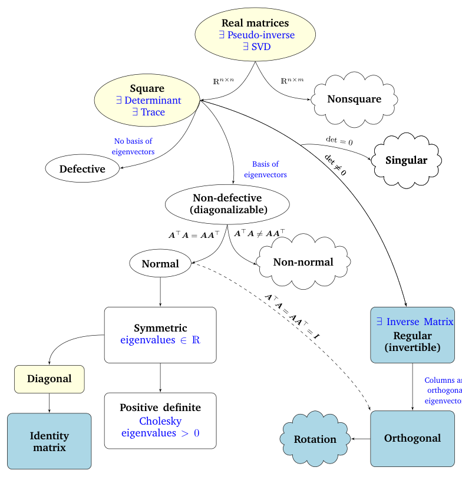

> **Figure 4.13** A functional phylogeny of matrices encountered in machine learning.

**图 4.13** 机器学习中遇到的各类矩阵的功能谱系图。

## 4.7 矩阵谱系（Matrix Phylogeny）

> In Chapters 2 and 3, we covered the basics of linear algebra and analytic geometry. In this chapter, we looked at fundamental characteristics of matrices and linear mappings. Figure 4.13 depicts the phylogenetic tree of relationships between different types of matrices (black arrows indicating “is a subset of”) and the covered operations we can perform on them (in blue). We consider all real matrices $A \in \mathbb{R}^{n \times m}$. For non-square matrices (where $n \neq m$), the SVD always exists, as we saw in this chapter. Focusing on square matrices $A \in \mathbb{R}^{n \times n}$, the determinant informs us whether a square matrix possesses an inverse matrix, i.e., whether it belongs to the class of regular, invertible matrices. If the square $n \times n$ matrix possesses $n$ linearly independent eigenvectors, then the matrix is non-defective and an eigendecomposition exists (Theorem 4.12). We know that repeated eigenvalues may result in defective matrices, which cannot be diagonalized.

第 2 章和第 3 章介绍了线性代数与解析几何的基础知识，本章我们考察了矩阵与线性映射的基本性质。图 4.13 以谱系树的形式描绘了不同类型矩阵之间的关系（黑色箭头表示“是……的子集”），以及（以蓝色标出的）我们已学过的、可对它们执行的操作。我们考虑所有实矩阵 $A \in \mathbb{R}^{n \times m}$。对于非方阵（$n \neq m$ 的情形），正如我们在本章中看到的，SVD 总是存在。就方阵 $A \in \mathbb{R}^{n \times n}$ 而言，行列式可以告诉我们该方阵是否拥有逆矩阵，即它是否属于正则（可逆）矩阵这一类。如果 $n \times n$ 方阵拥有 $n$ 个线性无关的特征向量，那么该矩阵是非亏损的（non-defective），其特征分解存在（定理 4.12）。我们知道，重特征值可能导致矩阵亏损（defective），从而无法对角化。

> Non-singular and non-defective matrices are not the same. For example, a rotation matrix will be invertible (determinant is nonzero) but not diagonalizable in the real numbers (eigenvalues are not guaranteed to be real numbers).

非奇异矩阵与非亏损矩阵并不是一回事。例如，旋转矩阵是可逆的（行列式非零），但在实数范围内却不可对角化（其特征值不一定是实数）。

> We dive further into the branch of non-defective square $n \times n$ matrices. A is normal if the condition $A^\top A = AA^\top$ holds. Moreover, if the more restrictive condition holds that $A^\top A = AA^\top = I$, then A is called orthogonal (see Definition 3.8). The set of orthogonal matrices is a subset of the regular (invertible) matrices and satisfies $A^\top = A^{-1}$.

我们进一步深入探讨非亏损的 $n \times n$ 方阵这一分支。若 $A$ 满足条件 $A^\top A = AA^\top$，则称 $A$ 为正规矩阵（normal matrix）。此外，若更强的条件 $A^\top A = AA^\top = I$ 成立，则称 $A$ 为正交矩阵（参见定义 3.8）。正交矩阵的集合是正则（可逆）矩阵的子集，并且满足 $A^\top = A^{-1}$。

> Normal matrices have a frequently encountered subset, the symmetric matrices $S \in \mathbb{R}^{n \times n}$, which satisfy $S = S^\top$. Symmetric matrices have only real eigenvalues. A subset of the symmetric matrices consists of the positive definite matrices $\boldsymbol{P}$ that satisfy the condition of $x^\top \boldsymbol{P}x > 0$ for all $x \in \mathbb{R}^n\setminus\{0\}$. In this case, a unique Cholesky decomposition exists (Theorem 4.18). Positive definite matrices have only positive eigenvalues and are always invertible (i.e., have a nonzero determinant).

正规矩阵中有一个经常遇到的子集，即满足 $S = S^\top$ 的对称矩阵 $S \in \mathbb{R}^{n \times n}$。对称矩阵只有实特征值。对称矩阵的一个子集是满足如下条件的正定矩阵 $\boldsymbol{P}$：对所有 $x \in \mathbb{R}^n\setminus\{0\}$ 都有 $x^\top \boldsymbol{P}x > 0$。此时，存在唯一的 Cholesky 分解（定理 4.18）。正定矩阵只有正特征值，并且总是可逆的（即行列式非零）。

> Another subset of symmetric matrices consists of the diagonal matrices $D$. Diagonal matrices are closed under multiplication and addition, but do not necessarily form a group (this is only the case if all diagonal entries are nonzero so that the matrix is invertible). A special diagonal matrix is the identity matrix $I$.

对称矩阵的另一个子集是对角矩阵 $D$。对角矩阵在乘法与加法下封闭，但不一定构成群（只有当所有对角元都非零、从而矩阵可逆时，才构成群）。一个特殊的对角矩阵是单位矩阵 $I$。

## 4.8 延伸阅读（Further Reading）

> Most of the content in this chapter establishes underlying mathematics and connects them to methods for studying mappings, many of which are at the heart of machine learning at the level of underpinning software solutions and building blocks for almost all machine learning theory. Matrix characterization using determinants, eigenspectra, and eigenspaces provides fundamental features and conditions for categorizing and analyzing matrices. This extends to all forms of representations of data and mappings involving data, as well as judging the numerical stability of computational operations on such matrices (Press et al., 2007).

本章的大部分内容阐述了基础的数学知识，并将它们与研究映射的方法联系起来；其中许多方法都处于机器学习的核心地位——既体现为支撑软件解决方案的底层基础，也体现为几乎所有机器学习理论的构建模块。利用行列式、特征谱（eigenspectra）和特征空间来刻画矩阵，为矩阵的分类与分析提供了基本的特征和条件。这可以推广到数据以及涉及数据的映射的各种表示形式，也可用于判断对这类矩阵进行计算操作的数值稳定性（Press et al., 2007）。

> Determinants are fundamental tools in order to invert matrices and compute eigenvalues “by hand”. However, for almost all but the smallest instances, numerical computation by Gaussian elimination outperforms determinants (Press et al., 2007). Determinants remain nevertheless a powerful theoretical concept, e.g., to gain intuition about the orientation of a basis based on the sign of the determinant. Eigenvectors can be used to perform basis changes to transform data into the coordinates of meaningful orthogonal, feature vectors. Similarly, matrix decomposition methods, such as the Cholesky decomposition, reappear often when we compute or simulate random events (Rubinstein and Kroese, 2016). Therefore, the Cholesky decomposition enables us to compute the reparametrization trick where we want to perform continuous differentiation over random variables, e.g., in variational autoencoders (Jimenez Rezende et al., 2014; Kingma and Welling, 2014).

行列式是“手工”求逆矩阵和计算特征值的基本工具。然而，除了规模极小的情形之外，用高斯消元进行数值计算几乎总是优于行列式方法（Press et al., 2007）。尽管如此，行列式仍然是一个强有力的理论概念，例如，可以借助行列式的符号来获得关于基的取向的直观认识。特征向量可用于进行基变换，从而将数据变换为有意义的正交特征向量的坐标。类似地，矩阵分解方法（如 Cholesky 分解）在我们计算或模拟随机事件时经常出现（Rubinstein and Kroese, 2016）。因此，当我们希望对随机变量进行连续微分时——例如在变分自编码器（variational autoencoder）中——Cholesky 分解使我们能够计算重参数化技巧（reparametrization trick）（Jimenez Rezende et al., 2014; Kingma and Welling, 2014）。

> Eigendecomposition is fundamental in enabling us to extract meaningful and interpretable information that characterizes linear mappings.

特征分解是使我们能够提取刻画线性映射的有意义且可解释信息的基础。

> Therefore, the eigendecomposition underlies a general class of machine learning algorithms called spectral methods that perform eigendecomposition of a positive-definite kernel. These spectral decomposition methods encompass classical approaches to statistical data analysis, such as the following: Principal component analysis (PCA; Pearson, 1901; see also Chapter 10), in which a low-dimensional subspace, which explains most of the variability in the data, is sought. Fisher discriminant analysis, which aims to determine a separating hyperplane for data classification (Mika et al., 1999). Multidimensional scaling (MDS) (Carroll and Chang, 1970).

因此，特征分解是一大类被称为谱方法（spectral methods）的机器学习算法的基础，这类算法对正定核（positive-definite kernel）进行特征分解。这些谱分解方法涵盖了统计数据分析中的若干经典方法，例如：主成分分析（PCA; Pearson, 1901; 另见第 10 章），寻找一个能解释数据中大部分变异性的低维子空间；Fisher 判别分析（Fisher discriminant analysis），旨在确定用于数据分类的分离超平面（separating hyperplane）（Mika et al., 1999）；多维缩放（multidimensional scaling, MDS）（Carroll and Chang, 1970）。

> The computational efficiency of these methods typically comes from finding the best rank-$k$ approximation to a symmetric, positive semidefinite matrix. More contemporary examples of spectral methods have different origins, but each of them requires the computation of the eigenvectors and eigenvalues of a positive-definite kernel, such as Isomap (Tenenbaum et al., 2000), Laplacian eigenmaps (Belkin and Niyogi, 2003), Hessian eigenmaps (Donoho and Grimes, 2003), and spectral clustering (Shi and Malik, 2000). The core computations of these are generally underpinned by low-rank matrix approximation techniques (Belabbas and Wolfe, 2009) as we encountered here via the SVD.

这些方法的计算效率通常来自寻找对称半正定矩阵的最佳秩-$k$ 近似。一些较新的谱方法起源各不相同，但其中每一种都需要计算正定核的特征向量与特征值，例如 Isomap（Tenenbaum et al., 2000）、Laplacian 特征映射（Laplacian eigenmaps）（Belkin and Niyogi, 2003）、Hessian 特征映射（Hessian eigenmaps）（Donoho and Grimes, 2003）以及谱聚类（spectral clustering）（Shi and Malik, 2000）。这些方法的核心计算一般都以低秩矩阵近似技术为基础（Belabbas and Wolfe, 2009），正如我们在本章中通过 SVD 所见到的那样。

> The SVD allows us to discover some of the same kind of information as the eigendecomposition. However, the SVD is more generally applicable to non-square matrices and data tables. These matrix factorization methods become relevant whenever we want to identify heterogeneity in data, when we want to perform data compression by approximation, e.g., instead of storing $n \times m$ values just storing $(n+m)k$ values, or when we want to perform data pre-processing, e.g., to decorrelate predictor variables of a design matrix (Ormoneit et al., 2001). The SVD operates on matrices, which we can interpret as rectangular arrays with two indices (rows and columns). The extension of matrix-like structure to higher-dimensional arrays are called tensors. It turns out that the SVD is the special case of a more general family of decompositions that operate on such tensors (Kolda and Bader, 2009). SVD-like operations and low-rank approximations on tensors are, for example, the Tucker decomposition (Tucker, 1966) or the CP decomposition (Carroll and Chang, 1970). The SVD low-rank approximation is frequently used in machine learning for computational efficiency reasons. This is because it reduces the amount of memory and operations with nonzero multiplications we need to perform on potentially very large matrices of data (Trefethen and Bau III, 1997). Moreover, low-rank approximations are used to operate on matrices that may contain missing values as well as for purposes of lossy compression and dimensionality reduction (Moonen and De Moor, 1995; Markovsky, 2011).

SVD 使我们能够发现一些与特征分解同类型的信息。然而，SVD 的适用面更广，可用于非方阵和数据表。只要我们想识别数据中的异质性，想通过近似实现数据压缩（例如不存储 $n \times m$ 个值，而只存储 $(n+m)k$ 个值），或者想进行数据预处理（例如去除设计矩阵（design matrix）中各预测变量之间的相关性）（Ormoneit et al., 2001），这些矩阵分解方法就会派上用场。SVD 作用于矩阵，我们可以将矩阵理解为带有两个下标（行与列）的矩形数组。把矩阵式的结构推广到更高维的数组，就得到了张量（tensor）。事实证明，SVD 是作用在这类张量上的更一般的分解族的一个特例（Kolda and Bader, 2009）。作用在张量上的类 SVD 操作与低秩近似，例如 Tucker 分解（Tucker decomposition）（Tucker, 1966）或 CP 分解（CP decomposition）（Carroll and Chang, 1970）。出于计算效率的原因，SVD 低秩近似在机器学习中被频繁使用。这是因为它减少了我们需要在可能非常庞大的数据矩阵上执行的内存量以及含非零乘法的运算量（Trefethen and Bau III, 1997）。此外，低秩近似还用于处理可能包含缺失值的矩阵，以及用于有损压缩和降维（Moonen and De Moor, 1995; Markovsky, 2011）。

## 练习（Exercises）

> 4.1 Compute the determinant using the Laplace expansion (using the first row) and the Sarrus rule for

4.1 用拉普拉斯展开（Laplace expansion，按第一行展开）和 Sarrus 法则（Sarrus rule）计算下列矩阵的行列式：

$$
A = \begin{pmatrix} 1 & 3 & 5 \\ 2 & 4 & 6 \\ 0 & 2 & 4 \end{pmatrix} \, .
$$

> 4.2 Compute the following determinant efficiently:

4.2 高效地计算下列行列式：

$$
\begin{pmatrix} 2 & 0 & 1 & 2 & 0 \\ 2 & -1 & 0 & 1 & 1 \\ 0 & 1 & 2 & 1 & 2 \\ -2 & 0 & 2 & -1 & 2 \\ 2 & 0 & 0 & 1 & 1 \end{pmatrix} \, .
$$

> 4.3 Compute the eigenspaces of

4.3 计算下列矩阵的特征空间：

> a. $A := \begin{pmatrix} 1 & 0 \\ 1 & 1 \end{pmatrix}$

a. $A := \begin{pmatrix} 1 & 0 \\ 1 & 1 \end{pmatrix}$

> b. $B := \begin{pmatrix} -2 & 2 \\ 2 & 1 \end{pmatrix}$

b. $B := \begin{pmatrix} -2 & 2 \\ 2 & 1 \end{pmatrix}$

> 4.4 Compute all eigenspaces of

4.4 计算下列矩阵的所有特征空间：

$$
A = \begin{pmatrix} 0 & -1 & 1 & 1 \\ -1 & 1 & -2 & 3 \\ 2 & -1 & 0 & 0 \\ 1 & -1 & 1 & 0 \end{pmatrix} \, .
$$

> 4.5 Diagonalizability of a matrix is unrelated to its invertibility. Determine for the following four matrices whether they are diagonalizable and/or invertible

4.5 矩阵的可对角化性与它的可逆性无关。请分别判断下列四个矩阵是否可对角化、是否可逆：

$$
\begin{pmatrix} 1 & 0 \\ 0 & 1 \end{pmatrix} , \quad
\begin{pmatrix} 1 & 0 \\ 0 & 0 \end{pmatrix} , \quad
\begin{pmatrix} 1 & 1 \\ 0 & 1 \end{pmatrix} , \quad
\begin{pmatrix} 0 & 1 \\ 0 & 0 \end{pmatrix} \, .
$$

> 4.6 Compute the eigenspaces of the following transformation matrices. Are they diagonalizable?

4.6 计算下列变换矩阵的特征空间。它们可对角化吗？

> a. For

a. 对于矩阵

$$
A = \begin{pmatrix} 2 & 3 & 0 \\ 1 & 4 & 3 \\ 0 & 0 & 1 \end{pmatrix}
$$

> b. For

b. 对于矩阵

$$
A = \begin{pmatrix} 1 & 1 & 0 & 0 \\ 0 & 0 & 0 & 0 \\ 0 & 0 & 0 & 0 \\ 0 & 0 & 0 & 0 \end{pmatrix}
$$

> 4.7 Are the following matrices diagonalizable? If yes, determine their diagonal form and a basis with respect to which the transformation matrices are diagonal. If no, give reasons why they are not diagonalizable.

4.7 下列矩阵是否可对角化？若可以，求出它们的对角形式以及使变换矩阵为对角矩阵的一组基；若不可以，请给出它们不可对角化的理由。

> a. $A = \begin{pmatrix} 0 & 1 \\ -8 & 4 \end{pmatrix}$

a. $A = \begin{pmatrix} 0 & 1 \\ -8 & 4 \end{pmatrix}$

> b.

b.

$$
A = \begin{pmatrix} 1 & 1 & 1 \\ 1 & 1 & 1 \\ 1 & 1 & 1 \end{pmatrix}
$$

> c.

c.

$$
A = \begin{pmatrix} 5 & 4 & 2 & 1 \\ 0 & 1 & -1 & -1 \\ -1 & -1 & 3 & 0 \\ 1 & 1 & -1 & 2 \end{pmatrix}
$$

> d.

d.

$$
A = \begin{pmatrix} 5 & -6 & -6 \\ -1 & 4 & 2 \\ 3 & -6 & -4 \end{pmatrix}
$$

> 4.8 Find the SVD of the matrix

4.8 求下列矩阵的 SVD：

$$
A = \begin{pmatrix} 3 & 2 & 2 \\ 2 & 3 & -2 \end{pmatrix} \, .
$$

> 4.9 Find the singular value decomposition of

4.9 求下列矩阵的奇异值分解：

$$
A = \begin{pmatrix} 2 & 2 \\ -1 & 1 \end{pmatrix} \, .
$$

> 4.10 Find the rank-1 approximation of

4.10 求下列矩阵的秩 1 近似：

$$
A = \begin{pmatrix} 3 & 2 & 2 \\ 2 & 3 & -2 \end{pmatrix}
$$

> 4.11 Show that for any $A \in \mathbb{R}^{m \times n}$ the matrices $A^\top A$ and $A A^\top$ possess the same nonzero eigenvalues.

4.11 证明：对任意 $A \in \mathbb{R}^{m \times n}$，矩阵 $A^\top A$ 与 $A A^\top$ 拥有相同的非零特征值。

> 4.12 Show that for $x \neq 0$ Theorem 4.24 holds, i.e., show that

4.12 证明当 $x \neq 0$ 时定理 4.24 成立，即证明

$$
\max_{x} \frac{\|A x\|_2}{\|x\|_2} = \sigma_1 \, ,
$$

> where $\sigma_1$ is the largest singular value of $A \in \mathbb{R}^{m \times n}$.

其中 $\sigma_1$ 是 $A \in \mathbb{R}^{m \times n}$ 的最大奇异值。
