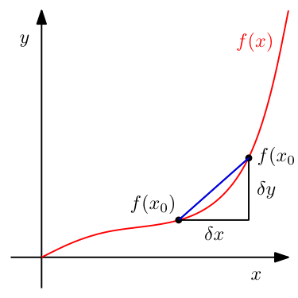
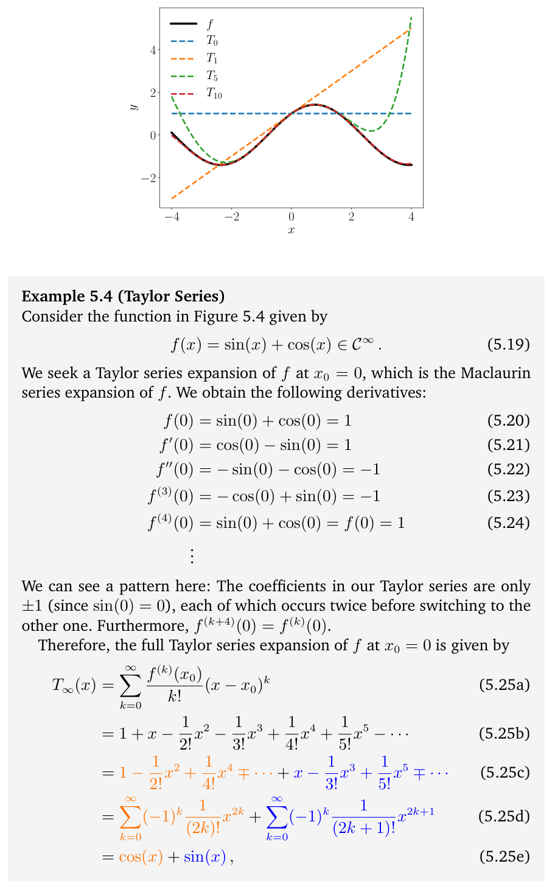
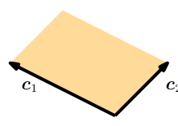
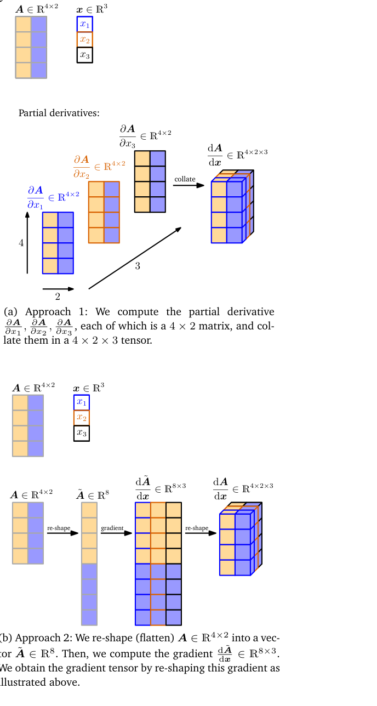
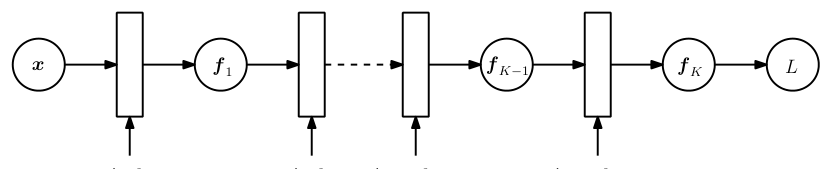
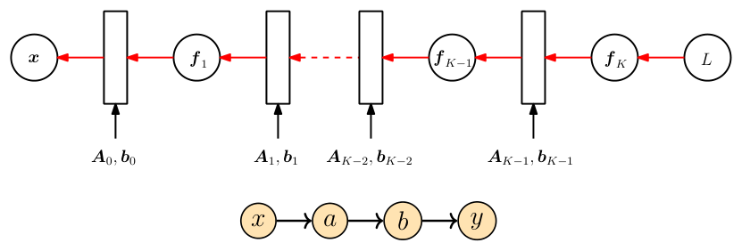
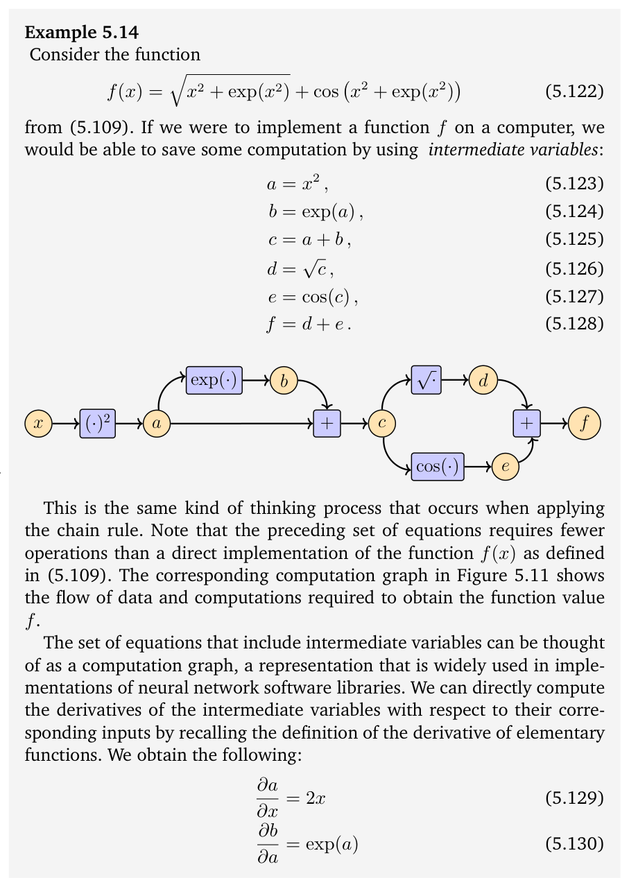
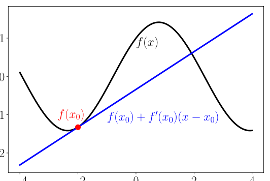
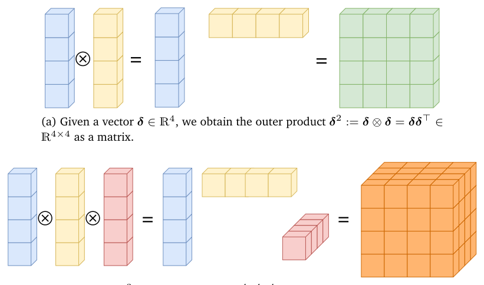

# 第 5 章 向量微积分（Vector Calculus）

> [← 返回目录](README.md)

> **Figure 5.3** The average incline of a function $f$ between $x_0$ and $x_0 + \delta x$ is the incline of the secant (blue) through $f(x_0)$ and $f(x_0 + \delta x)$ and given by $\delta y/\delta x$.

**图 5.3** 函数 $f$ 在 $x_0$ 与 $x_0 + \delta x$ 之间的平均斜率，就是经过 $f(x_0)$ 与 $f(x_0 + \delta x)$ 两点的割线（蓝色）的斜率，由 $\delta y/\delta x$ 给出。

> Vector calculus is one of the fundamental mathematical tools we need in machine learning. Throughout this book, we assume that functions are differentiable. With some additional technical definitions, which we do not cover here, many of the approaches presented can be extended to sub-differentials (functions that are continuous but not differentiable at certain points). We will look at an extension to the case of functions with constraints in Chapter 7.

向量微积分是我们在机器学习中需要的基本数学工具之一。在本书中，我们始终假设函数是可微的。只需补充一些这里未介绍的附加技术性定义，本书介绍的许多方法都可以推广到次微分（sub-differential）的情形，即在某些点连续但不可微的函数。我们将在第 7 章讨论针对带约束函数情形的一种推广。

## 5.1 一元函数的微分（Differentiation of Univariate Functions）

> In the following, we briefly revisit differentiation of a univariate function, which may be familiar from high school mathematics. We start with the difference quotient of a univariate function $y = f(x)$, $x, y \in \mathbb{R}$, which we will subsequently use to define derivatives.

下面我们简要回顾一元函数的微分，这部分内容读者在高中数学中可能已经接触过。我们从一元函数 $y = f(x)$（$x, y \in \mathbb{R}$）的差商（difference quotient）出发，随后将利用它来定义导数（derivative）。

> **Definition 5.1** (Difference Quotient). The difference quotient

**定义 5.1**（差商，Difference Quotient）。差商

$$
\frac{\delta y}{\delta x} := \frac{f(x + \delta x) - f(x)}{\delta x}
\tag{5.3}
$$

> computes the slope of the secant line through two points on the graph of $f$. In Figure 5.3, these are the points with $x$-coordinates $x_0$ and $x_0 + \delta x$.

计算的是 $f$ 的图象上两点之间割线的斜率。在图 5.3 中，这两点就是横坐标为 $x_0$ 与 $x_0 + \delta x$ 的点。

> The difference quotient can also be considered the average slope of $f$ between $x$ and $x + \delta x$ if we assume $f$ to be a linear function. In the limit for $\delta x \to 0$, we obtain the tangent of $f$ at $x$, if $f$ is differentiable. The tangent is then the derivative of $f$ at $x$.

如果我们假设 $f$ 是线性函数，那么差商也可以看作 $f$ 在 $x$ 与 $x + \delta x$ 之间的平均斜率。当 $\delta x \to 0$ 时，若 $f$ 可微，我们就得到 $f$ 在 $x$ 处的切线（tangent）。此时，这条切线就是 $f$ 在 $x$ 处的导数。

> **Definition 5.2** (Derivative). More formally, for $h > 0$ the derivative of $f$ at $x$ is defined as the limit

**定义 5.2**（导数，Derivative）。更正式地，对于 $h > 0$，$f$ 在 $x$ 处的导数定义为极限

$$
\frac{df}{dx} := \lim_{h \to 0} \frac{f(x + h) - f(x)}{h},
\tag{5.4}
$$

> and the secant in Figure 5.3 becomes a tangent.

此时图 5.3 中的割线就变成了切线。

> The derivative of $f$ points in the direction of steepest ascent of $f$.

$f$ 的导数指向 $f$ 上升最陡的方向。

> **Example 5.2** (Derivative of a Polynomial) We want to compute the derivative of $f(x) = x^n$, $n \in \mathbb{N}$. We may already know that the answer will be $nx^{n-1}$, but we want to derive this result using the definition of the derivative as the limit of the difference quotient.

**例 5.2**（多项式的导数，Derivative of a Polynomial）我们要计算 $f(x) = x^n$（$n \in \mathbb{N}$）的导数。我们可能早已知道答案是 $nx^{n-1}$，但我们想利用“导数是差商的极限”这一定义来推导出这个结果。

> Using the definition of the derivative in (5.4), we obtain

利用 (5.4) 中导数的定义，我们得到

$$
\begin{aligned}
\frac{df}{dx} &= \lim_{h \to 0} \frac{f(x + h) - f(x)}{h} \tag{5.5a}\\
&= \lim_{h \to 0} \frac{(x + h)^n - x^n}{h} \tag{5.5b}\\
&= \lim_{h \to 0} \frac{\sum_{i=0}^{n} \binom{n}{i} x^{n-i} h^i - x^n}{h} \,. \tag{5.5c}
\end{aligned}
$$

> We see that $x^n = \binom{n}{0} x^{n-0} h^0$. By starting the sum at 1, the $x^n$-term cancels, and we obtain

我们看到 $x^n = \binom{n}{0} x^{n-0} h^0$。让求和从 1 开始，$x^n$ 项便被消去，于是得到

$$
\begin{aligned}
\frac{df}{dx} &= \lim_{h \to 0} \frac{\sum_{i=1}^{n} \binom{n}{i} x^{n-i} h^i}{h} \tag{5.6a}\\
&= \lim_{h \to 0} \sum_{i=1}^{n} \binom{n}{i} x^{n-i} h^{i-1} \tag{5.6b}\\
&= \lim_{h \to 0} \left( \binom{n}{1} x^{n-1} + \underbrace{\sum_{i=2}^{n} \binom{n}{i} x^{n-i} h^{i-1}}_{\to 0 \text{ as } h \to 0} \right) \tag{5.6c}\\
&= \frac{n!}{1!(n-1)!} x^{n-1} = n x^{n-1} \,. \tag{5.6d}
\end{aligned}
$$

### 5.1.1 泰勒级数（Taylor Series）

> The Taylor series is a representation of a function $f$ as an infinite sum of terms. These terms are determined using derivatives of $f$ evaluated at $x_0$.

泰勒级数（Taylor series）是把函数 $f$ 表示成一些项的无穷和的一种表示方式。这些项由 $f$ 在 $x_0$ 处的各阶导数确定。

> **Definition 5.3** (Taylor Polynomial). The Taylor polynomial of degree $n$ of $f : \mathbb{R} \to \mathbb{R}$ at $x_0$ is defined as

**定义 5.3**（泰勒多项式，Taylor Polynomial）。函数 $f : \mathbb{R} \to \mathbb{R}$ 在 $x_0$ 处的 $n$ 阶泰勒多项式（Taylor polynomial）定义为

$$
T_n(x) := \sum_{k=0}^{n} \frac{f^{(k)}(x_0)}{k!} (x - x_0)^k ,
\tag{5.7}
$$

> where $f^{(k)}(x_0)$ is the $k$th derivative of $f$ at $x_0$ (which we assume exists) and $\frac{f^{(k)}(x_0)}{k!}$ are the coefficients of the polynomial.

其中 $f^{(k)}(x_0)$ 是 $f$ 在 $x_0$ 处的 $k$ 阶导数（我们假设它存在），而 $\frac{f^{(k)}(x_0)}{k!}$ 是该多项式的系数。

> **Definition 5.4** (Taylor Series). For a smooth function $f \in C^\infty$, $f : \mathbb{R} \to \mathbb{R}$, the Taylor series of $f$ at $x_0$ is defined as

**定义 5.4**（泰勒级数，Taylor Series）。对于光滑函数 $f \in C^\infty$（$f : \mathbb{R} \to \mathbb{R}$），$f$ 在 $x_0$ 处的泰勒级数定义为

$$
T_\infty(x) = \sum_{k=0}^{\infty} \frac{f^{(k)}(x_0)}{k!} (x - x_0)^k \,. \tag{5.8}
$$

> For $x_0 = 0$, we obtain the Maclaurin series as a special instance of the Taylor series. If $f(x) = T_\infty(x)$, then $f$ is called analytic.

当 $x_0 = 0$ 时，我们得到麦克劳林级数（Maclaurin series），它是泰勒级数的一种特殊情形。若 $f(x) = T_\infty(x)$，则称 $f$ 是解析的（analytic）。

> **Remark.** In general, a Taylor polynomial of degree $n$ is an approximation of a function, which does not need to be a polynomial. The Taylor polynomial is similar to $f$ in a neighborhood around $x_0$. However, a Taylor polynomial of degree $n$ is an exact representation of a polynomial $f$ of degree $k \leqslant n$ since all derivatives $f^{(i)}$, $i > k$ vanish. ♢

**评注.** 一般而言，$n$ 阶泰勒多项式是对某个函数的一种近似，而这个函数本身不必是多项式。泰勒多项式在 $x_0$ 附近的邻域内与 $f$ 相近。然而，对于次数为 $k \leqslant n$ 的多项式 $f$，$n$ 阶泰勒多项式是它的精确表示，因为所有导数 $f^{(i)}$（$i > k$）都为零。♢

> **Example 5.3** (Taylor Polynomial) We consider the polynomial

**例 5.3**（泰勒多项式，Taylor Polynomial）我们考虑多项式

$$
f(x) = x^4
\tag{5.9}
$$

> and seek the Taylor polynomial $T_6$, evaluated at $x_0 = 1$. We start by computing the coefficients $f^{(k)}(1)$ for $k = 0, \ldots, 6$:

并求它在 $x_0 = 1$ 处的泰勒多项式 $T_6$。我们先计算 $k = 0, \ldots, 6$ 时的系数 $f^{(k)}(1)$：

$$
\begin{aligned}
f(1) &= 1 \tag{5.10}\\
f'(1) &= 4 \tag{5.11}\\
f''(1) &= 12 \tag{5.12}\\
f^{(3)}(1) &= 24 \tag{5.13}\\
f^{(4)}(1) &= 24 \tag{5.14}\\
f^{(5)}(1) &= 0 \tag{5.15}\\
f^{(6)}(1) &= 0 \tag{5.16}
\end{aligned}
$$

> Therefore, the desired Taylor polynomial is

因此，所求的泰勒多项式为

$$
\begin{aligned}
T_6(x) &= \sum_{k=0}^{6} \frac{f^{(k)}(x_0)}{k!} (x - x_0)^k \tag{5.17a}\\
&= 1 + 4(x - 1) + 6(x - 1)^2 + 4(x - 1)^3 + (x - 1)^4 + 0 \,. \tag{5.17b}
\end{aligned}
$$

> Multiplying out and re-arranging yields

展开并重新整理，得到

$$
\begin{aligned}
T_6(x) &= (1 - 4 + 6 - 4 + 1) + x(4 - 12 + 12 - 4) + x^2(6 - 12 + 6) + x^3(4 - 4) + x^4 \tag{5.18a}\\
&= x^4 = f(x) \,, \tag{5.18b}
\end{aligned}
$$

> i.e., we obtain an exact representation of the original function.

也就是说，我们得到了原函数的精确表示。

> **Figure 5.4** Taylor polynomials. The original function $f(x) = \sin(x) + \cos(x)$ (black, solid) is approximated by Taylor polynomials (dashed) around $x_0 = 0$. Higher-order Taylor polynomials approximate the function $f$ better and more globally. $T_{10}$ is already similar to $f$ in $[-4, 4]$.

**图 5.4** 泰勒多项式。原函数 $f(x) = \sin(x) + \cos(x)$（黑色实线）由在 $x_0 = 0$ 处展开的泰勒多项式（虚线）近似。泰勒多项式的阶数越高，对函数 $f$ 的近似就越好、越具全局性。$T_{10}$ 在 $[-4, 4]$ 上已经与 $f$ 相当接近。

> **Example 5.4** (Taylor Series) Consider the function in Figure 5.4 given by

**例 5.4**（泰勒级数，Taylor Series）考虑图 5.4 中由下式给出的函数

$$
f(x) = \sin(x) + \cos(x) \in C^\infty.
\tag{5.19}
$$

> We seek a Taylor series expansion of $f$ at $x_0 = 0$, which is the Maclaurin series expansion of $f$. We obtain the following derivatives:

我们想求 $f$ 在 $x_0 = 0$ 处的泰勒级数展开，也就是 $f$ 的麦克劳林级数展开。我们得到如下各阶导数：

$$
\begin{aligned}
f(0) &= \sin(0) + \cos(0) = 1 \tag{5.20}\\
f'(0) &= \cos(0) - \sin(0) = 1 \tag{5.21}\\
f''(0) &= -\sin(0) - \cos(0) = -1 \tag{5.22}\\
f^{(3)}(0) &= -\cos(0) + \sin(0) = -1 \tag{5.23}\\
f^{(4)}(0) &= \sin(0) + \cos(0) = f(0) = 1 \tag{5.24}\\
\dots
\end{aligned}
$$

> We can see a pattern here: The coefficients in our Taylor series are only $\pm 1$ (since $\sin(0) = 0$), each of which occurs twice before switching to the other one. Furthermore, $f^{(k+4)}(0) = f^{(k)}(0)$.

这里我们可以看出一个规律：泰勒级数中的系数只有 $\pm 1$（因为 $\sin(0) = 0$），并且每个系数在切换到另一个之前都会连续出现两次。此外，$f^{(k+4)}(0) = f^{(k)}(0)$。

> Therefore, the full Taylor series expansion of $f$ at $x_0 = 0$ is given by

因此，$f$ 在 $x_0 = 0$ 处的完整泰勒级数展开为

$$
\begin{aligned}
T_\infty(x) &= \sum_{k=0}^{\infty} \frac{f^{(k)}(x_0)}{k!} (x - x_0)^k \tag{5.25a}\\
&= 1 + x - \frac{1}{2!}x^2 - \frac{1}{3!}x^3 + \frac{1}{4!}x^4 + \frac{1}{5!}x^5 - \cdots \tag{5.25b}\\
&= 1 - \frac{1}{2!}x^2 + \frac{1}{4!}x^4 \mp \cdots + x - \frac{1}{3!}x^3 + \frac{1}{5!}x^5 \mp \cdots \tag{5.25c}\\
&= \sum_{k=0}^{\infty} (-1)^k \frac{1}{(2k)!} x^{2k} + \sum_{k=0}^{\infty} (-1)^k \frac{1}{(2k+1)!} x^{2k+1} \tag{5.25d}\\
&= \cos(x) + \sin(x) \,, \tag{5.25e}
\end{aligned}
$$

> where we used the power series representations

其中我们用到了幂级数表示（power series representation）

$$
\begin{aligned}
\cos(x) &= \sum_{k=0}^{\infty} (-1)^k \frac{1}{(2k)!} x^{2k} \,, \tag{5.26}\\
\sin(x) &= \sum_{k=0}^{\infty} (-1)^k \frac{1}{(2k+1)!} x^{2k+1}. \tag{5.27}
\end{aligned}
$$

> Figure 5.4 shows the corresponding first Taylor polynomials $T_n$ for $n = 0, 1, 5, 10$.

图 5.4 展示了与之相应的前几个泰勒多项式 $T_n$（$n = 0, 1, 5, 10$）。

> **Remark.** A Taylor series is a special case of a power series

**评注.** 泰勒级数是幂级数（power series）的一个特例

$$
f(x) = \sum_{k=0}^{\infty} a_k (x - c)^k
\tag{5.28}
$$

> where $a_k$ are coefficients and $c$ is a constant, which has the special form in Definition 5.4. ♢

其中 $a_k$ 是系数，$c$ 是常数，而定义 5.4 中的泰勒级数正是它的一种特殊形式。♢

### 5.1.2 求导法则（Differentiation Rules）

> In the following, we briefly state basic differentiation rules, where we denote the derivative of $f$ by $f'$.

下面我们简要地给出几个基本的求导法则，其中我们把 $f$ 的导数记作 $f'$。

> Product rule:

乘积法则（product rule）：

$$
(f(x) g(x))' = f'(x) g(x) + f(x) g'(x)
\tag{5.29}
$$

> Quotient rule:

商法则（quotient rule）：

$$
\left( \frac{f(x)}{g(x)} \right)' = \frac{f'(x) g(x) - f(x) g'(x)}{(g(x))^2}
\tag{5.30}
$$

> Sum rule:

加法法则（sum rule）：

$$
(f(x) + g(x))' = f'(x) + g'(x)
\tag{5.31}
$$

> Chain rule:

链式法则（chain rule）：

$$
(g(f(x)))' = (g \circ f)'(x) = g'(f(x)) f'(x)
\tag{5.32}
$$

> Here, $g \circ f$ denotes function composition $x \mapsto f(x) \mapsto g(f(x))$.

这里，$g \circ f$ 表示函数复合（function composition）$x \mapsto f(x) \mapsto g(f(x))$。

> **Example 5.5** (Chain Rule) Let us compute the derivative of the function $h(x) = (2x + 1)^4$ using the chain rule. With

**例 5.5**（链式法则，Chain Rule）我们用链式法则来计算函数 $h(x) = (2x + 1)^4$ 的导数。令

$$
\begin{aligned}
h(x) &= (2x + 1)^4 = g(f(x)) \,, \tag{5.33}\\
f(x) &= 2x + 1 \,, \tag{5.34}\\
g(f) &= f^4 \,, \tag{5.35}
\end{aligned}
$$

> we obtain the derivatives of $f$ and $g$ as

可以得到 $f$ 与 $g$ 的导数为

$$
\begin{aligned}
f'(x) &= 2 \,, \tag{5.36}\\
g'(f) &= 4f^3 \,, \tag{5.37}
\end{aligned}
$$

> such that the derivative of $h$ is given as

于是 $h$ 的导数为

$$
h'(x) = g'(f)f'(x) = (4f^3)\cdot 2 = 4(2x + 1)^3 \cdot 2 = 8(2x + 1)^3 \,,
\tag{5.38}
$$

> where we used the chain rule (5.32) and substituted the definition of $f$ in (5.34) in $g'(f)$.

其中我们使用了链式法则 (5.32)，并把 (5.34) 中 $f$ 的定义代入 $g'(f)$。

## 5.2 偏导数与梯度（Partial Differentiation and Gradients）

> Differentiation as discussed in Section 5.1 applies to functions $f$ of a scalar variable $x \in \mathbb{R}$. In the following, we consider the general case where the function $f$ depends on one or more variables $x \in \mathbb{R}^n$, e.g., $f(x) = f(x_1, x_2)$. The generalization of the derivative to functions of several variables is the gradient.

5.1 节讨论的微分适用于标量（scalar）变量 $x \in \mathbb{R}$ 的函数 $f$。下面我们考虑一般的情形：函数 $f$ 依赖于一个或多个变量 $x \in \mathbb{R}^n$，例如 $f(x) = f(x_1, x_2)$。导数在多变量函数上的推广就是梯度（gradient）。

> We find the gradient of the function $f$ with respect to $x$ by varying one variable at a time and keeping the others constant. The gradient is then the collection of these partial derivatives.

我们通过每次只改变一个变量而保持其余变量不变的方式，来求函数 $f$ 关于 $x$ 的梯度。梯度就是这些偏导数（partial derivative）的集合。

> **Definition 5.5** (Partial Derivative). For a function $f : \mathbb{R}^n \to \mathbb{R}$, $x \mapsto f(x)$, $x \in \mathbb{R}^n$ of $n$ variables $x_1, \ldots, x_n$ we define the partial derivatives as

**定义 5.5**（偏导数，Partial Derivative）。对于 $n$ 个变量 $x_1, \ldots, x_n$ 的函数 $f : \mathbb{R}^n \to \mathbb{R}$（$x \mapsto f(x)$，$x \in \mathbb{R}^n$），我们把偏导数定义为

$$
\frac{\partial f}{\partial x_1} = \lim_{h \to 0} \frac{f(x_1 + h, x_2, \ldots, x_n) - f(x)}{h} \quad \ldots \quad \frac{\partial f}{\partial x_n} = \lim_{h \to 0} \frac{f(x_1, \ldots, x_{n-1}, x_n + h) - f(x)}{h}
\tag{5.39}
$$

> and collect them in the row vector

并将它们收集为如下行向量（row vector）

$$
\nabla_x f = \operatorname{grad} f = \frac{\mathrm{d}f}{\mathrm{d}x} = \begin{pmatrix}\dfrac{\partial f(x)}{\partial x_1} & \dfrac{\partial f(x)}{\partial x_2} & \cdots & \dfrac{\partial f(x)}{\partial x_n}\end{pmatrix} \in \mathbb{R}^{1\times n} \,,
\tag{5.40}
$$

> where $n$ is the number of variables and $1$ is the dimension of the image/range/codomain of $f$. Here, we defined the column vector $x = [x_1, \ldots, x_n]^\top \in \mathbb{R}^n$. The row vector in (5.40) is called the gradient of $f$ or the Jacobian and is the generalization of the derivative from Section 5.1.

其中 $n$ 是变量的个数，$1$ 是 $f$ 的像/值域/陪域（image/range/codomain）的维度。这里，我们定义了列向量（column vector）$x = [x_1, \ldots, x_n]^\top \in \mathbb{R}^n$。(5.40) 中的行向量称为 $f$ 的梯度或雅可比矩阵（Jacobian），它是 5.1 节中导数的推广。

> **Remark.** This definition of the Jacobian is a special case of the general definition of the Jacobian for vector-valued functions as the collection of partial derivatives. We will get back to this in Section 5.3. ♢

**评注.** 这里的雅可比矩阵定义是一般雅可比矩阵定义的一个特例——后者针对向量值函数（vector-valued function），把雅可比矩阵定义为偏导数的集合。我们将在 5.3 节回到这一点。♢

> We can use results from scalar differentiation: Each partial derivative is a derivative with respect to a scalar.

我们可以利用标量微分的结果：每个偏导数都是关于单个标量的导数。

> **Example 5.6** (Partial Derivatives Using the Chain Rule) For $f(x, y) = (x + 2y^3)^2$, we obtain the partial derivatives

**例 5.6**（用链式法则求偏导数，Partial Derivatives Using the Chain Rule）对于 $f(x, y) = (x + 2y^3)^2$，我们求得偏导数

$$
\frac{\partial f(x, y)}{\partial x} = 2(x + 2y^3)\frac{\partial}{\partial x}(x + 2y^3) = 2(x + 2y^3) \,,
\tag{5.41}
$$

$$
\frac{\partial f(x, y)}{\partial y} = 2(x + 2y^3)\frac{\partial}{\partial y}(x + 2y^3) = 12(x + 2y^3)y^2 \,.
\tag{5.42}
$$

> where we used the chain rule (5.32) to compute the partial derivatives.

其中我们使用链式法则 (5.32) 来计算这些偏导数。

> **Remark (Gradient as a Row Vector).** It is not uncommon in the literature to define the gradient vector as a column vector, following the convention that vectors are generally column vectors. The reason why we define the gradient vector as a row vector is twofold: First, we can consistently generalize the gradient to vector-valued functions $f : \mathbb{R}^n \to \mathbb{R}^m$ (then the gradient becomes a matrix). Second, we can immediately apply the multivariate chain rule without paying attention to the dimension of the gradient. We will discuss both points in Section 5.3. ♢

**评注（作为行向量的梯度，Gradient as a Row Vector）。** 文献中常常遵循「向量一般取列向量」的惯例，把梯度向量定义为列向量。我们之所以把梯度向量定义为行向量，原因有二：其一，这样我们可以把梯度一致地推广到向量值函数 $f : \mathbb{R}^n \to \mathbb{R}^m$（此时梯度成为一个矩阵）；其二，这样我们可以直接应用多元链式法则，而无须关注梯度的维度。我们将在 5.3 节讨论这两点。♢

> **Example 5.7** (Gradient) For $f(x_1, x_2) = x_1^2 x_2 + x_1 x_2^3 \in \mathbb{R}$, the partial derivatives (i.e., the derivatives of $f$ with respect to $x_1$ and $x_2$) are

**例 5.7**（梯度，Gradient）对于 $f(x_1, x_2) = x_1^2 x_2 + x_1 x_2^3 \in \mathbb{R}$，其偏导数（即 $f$ 关于 $x_1$ 和 $x_2$ 的导数）为

$$
\frac{\partial f(x_1, x_2)}{\partial x_1} = 2x_1x_2 + x_2^3
\tag{5.43}
$$

$$
\frac{\partial f(x_1, x_2)}{\partial x_2} = x_1^2 + 3x_1x_2^2
\tag{5.44}
$$

> and the gradient is then

于是梯度为

$$
\frac{\mathrm{d}f}{\mathrm{d}x} = \begin{pmatrix}\dfrac{\partial f(x_1, x_2)}{\partial x_1} & \dfrac{\partial f(x_1, x_2)}{\partial x_2}\end{pmatrix} = \begin{pmatrix}2x_1x_2 + x_2^3 & x_1^2 + 3x_1x_2^2\end{pmatrix} \in \mathbb{R}^{1\times 2} \,.
\tag{5.45}
$$

### 5.2.1 偏导数的基本法则（Basic Rules of Partial Differentiation）

$$
\begin{aligned}
\text{Product rule:} &\quad (fg)' = f'g + fg',\\
\text{Sum rule:} &\quad (f + g)' = f' + g',\\
\text{Chain rule:} &\quad (g(f))' = g'(f)f'
\end{aligned}
$$

> In the multivariate case, where $x \in \mathbb{R}^n$, the basic differentiation rules that we know from school (e.g., sum rule, product rule, chain rule; see also Section 5.1.2) still apply. However, when we compute derivatives with respect to vectors $x \in \mathbb{R}^n$ we need to pay attention: Our gradients now involve vectors and matrices, and matrix multiplication is not commutative (Section 2.2.1), i.e., the order matters.

在多变量情形（$x \in \mathbb{R}^n$）下，我们在中学就学过的那些基本求导法则（例如加法法则、乘积法则、链式法则；另见 5.1.2 节）仍然适用。然而，当我们对向量 $x \in \mathbb{R}^n$ 求导时就需要小心：此时梯度中出现了向量和矩阵，而矩阵乘法不满足交换律（2.2.1 节），也就是说，顺序很重要。

> Here are the general product rule, sum rule, and chain rule:

以下是一般形式的乘积法则、加法法则和链式法则：

$$
\text{Product rule:}\quad \frac{\partial}{\partial x}(f(x)g(x)) = \frac{\partial f}{\partial x}g(x) + f(x)\frac{\partial g}{\partial x}
\tag{5.46}
$$

$$
\text{Sum rule:}\quad \frac{\partial}{\partial x}(f(x) + g(x)) = \frac{\partial f}{\partial x} + \frac{\partial g}{\partial x}
\tag{5.47}
$$

$$
\text{Chain rule:}\quad \frac{\partial}{\partial x}(g \circ f)(x) = \frac{\partial g}{\partial f}\frac{\partial f}{\partial x}
\tag{5.48}
$$

> Let us have a closer look at the chain rule. The chain rule (5.48) resembles to some degree the rules for matrix multiplication where we said that neighboring dimensions have to match for matrix multiplication to be defined; see Section 2.2.1. If we go from left to right, the chain rule exhibits similar properties: $\partial f$ shows up in the "denominator" of the first factor and in the "numerator" of the second factor. If we multiply the factors together, multiplication is defined, i.e., the dimensions of $\partial f$ match, and $\partial f$ "cancels", such that $\partial g/\partial x$ remains.

让我们更仔细地看一看链式法则。链式法则 (5.48) 在某种程度上类似于矩阵乘法的规则——在 2.2.1 节中我们说过，相邻维度必须匹配，矩阵乘法才有定义。从左往右看，链式法则表现出类似的性质：$\partial f$ 出现在第一个因子的「分母」和第二个因子的「分子」中。如果把这些因子乘在一起，乘法是有定义的，也就是说 $\partial f$ 的维度匹配，$\partial f$ 得以「相消」，只剩下 $\partial g/\partial x$。

### 5.2.2 链式法则（Chain Rule）

> Consider a function $f : \mathbb{R}^2 \to \mathbb{R}$ of two variables $x_1, x_2$. Furthermore, $x_1(t)$ and $x_2(t)$ are themselves functions of $t$. To compute the gradient of $f$ with respect to $t$, we need to apply the chain rule (5.48) for multivariate functions as

考虑两个变量 $x_1, x_2$ 的函数 $f : \mathbb{R}^2 \to \mathbb{R}$。此外，$x_1(t)$ 和 $x_2(t)$ 本身又是 $t$ 的函数。为计算 $f$ 关于 $t$ 的梯度，我们需要对多变量函数应用链式法则 (5.48)，即

$$
\frac{\mathrm{d}f}{\mathrm{d}t} = \frac{\partial f}{\partial x_1}\frac{\partial x_1(t)}{\partial t} + \frac{\partial f}{\partial x_2}\frac{\partial x_2(t)}{\partial t} = \begin{pmatrix}\dfrac{\partial f}{\partial x_1} & \dfrac{\partial f}{\partial x_2}\end{pmatrix}\begin{pmatrix}\dfrac{\partial x_1(t)}{\partial t}\\ \dfrac{\partial x_2(t)}{\partial t}\end{pmatrix} \,,
\tag{5.49}
$$

> where $d$ denotes the gradient and $\partial$ partial derivatives.

其中 $d$ 表示梯度，$\partial$ 表示偏导数。

> **Example 5.8** Consider $f(x_1, x_2) = x_1^2 + 2x_2$, where $x_1 = \sin t$ and $x_2 = \cos t$, then

**例 5.8** 考虑 $f(x_1, x_2) = x_1^2 + 2x_2$，其中 $x_1 = \sin t$，$x_2 = \cos t$，则

$$
\begin{aligned}
\frac{\mathrm{d}f}{\mathrm{d}t} &= \frac{\partial f}{\partial x_1}\frac{\partial x_1}{\partial t} + \frac{\partial f}{\partial x_2}\frac{\partial x_2}{\partial t} \tag{5.50a}\\
&= 2\sin t\frac{\partial \sin t}{\partial t} + 2\frac{\partial \cos t}{\partial t} \tag{5.50b}\\
&= 2\sin t\cos t - 2\sin t = 2\sin t(\cos t - 1)
\tag{5.50c}
\end{aligned}
$$

> is the corresponding derivative of $f$ with respect to $t$.

这就是 $f$ 关于 $t$ 的相应导数。

> If $f(x_1, x_2)$ is a function of $x_1$ and $x_2$, where $x_1(s, t)$ and $x_2(s, t)$ are themselves functions of two variables $s$ and $t$, the chain rule yields the partial derivatives

如果 $f(x_1, x_2)$ 是 $x_1$ 和 $x_2$ 的函数，而 $x_1(s, t)$ 和 $x_2(s, t)$ 本身又是两个变量 $s$ 和 $t$ 的函数，那么由链式法则可得偏导数

$$
\frac{\partial f}{\partial s} = \frac{\partial f}{\partial x_1}\frac{\partial x_1}{\partial s} + \frac{\partial f}{\partial x_2}\frac{\partial x_2}{\partial s} \,,
\tag{5.51}
$$

$$
\frac{\partial f}{\partial t} = \frac{\partial f}{\partial x_1}\frac{\partial x_1}{\partial t} + \frac{\partial f}{\partial x_2}\frac{\partial x_2}{\partial t} \,,
\tag{5.52}
$$

> and the gradient is obtained by the matrix multiplication

而梯度可通过矩阵乘法得到。

$$
\frac{\mathrm{d} f}{\mathrm{d}(s, t)}=\underbrace{\begin{pmatrix}\dfrac{\partial f}{\partial x_1} & \dfrac{\partial f}{\partial x_2}\end{pmatrix}}_{=\,\partial f/\partial x}\underbrace{\begin{pmatrix}\dfrac{\partial x_1}{\partial s} & \dfrac{\partial x_1}{\partial t}\\ \dfrac{\partial x_2}{\partial s} & \dfrac{\partial x_2}{\partial t}\end{pmatrix}}_{=\,\partial x/\partial(s, t)} \,.
\tag{5.53}
$$

> This compact way of writing the chain rule as a matrix multiplication only makes sense if the gradient is defined as a row vector. Otherwise, we will need to start transposing gradients for the matrix dimensions to match. This may still be straightforward as long as the gradient is a vector or a matrix; however, when the gradient becomes a tensor (we will discuss this in the following), the transpose is no longer a triviality.

把链式法则写成矩阵乘法的这种紧凑写法，只有在把梯度定义为行向量（row vector）时才有意义。否则，为了使矩阵维度匹配，我们将不得不对梯度进行转置。只要梯度是向量或矩阵，这仍然相当直接；然而，当梯度变成张量（我们将在下文讨论）时，转置就不再是轻而易举的事了。

> **Remark (Verifying the Correctness of a Gradient Implementation).** The definition of the partial derivatives as the limit of the corresponding difference quotient (see (5.39)) can be exploited when numerically checking the correctness of gradients in computer programs: When we compute gradients and implement them, we can use finite differences to numerically test our computation and implementation: We choose the value $h$ to be small (e.g., $h = 10^{-4}$) and compare the finite-difference approximation from (5.39) with our (analytic) implementation of the gradient. If the error is small, our gradient implementation is probably correct. "Small" could mean that $\sqrt{\frac{\sum_i(dh_i - df_i)^2}{\sum_i(dh_i + df_i)^2}} < 10^{-6}$, where $dh_i$ is the finite-difference approximation and $df_i$ is the analytic gradient of $f$ with respect to the $i$th variable $x_i$. ♢

**评注（验证梯度实现的正确性，Verifying the Correctness of a Gradient Implementation）。** 把偏导数定义为相应差商的极限（见 (5.39)），这一途径可用于在计算机程序中数值地检验梯度的正确性：在计算梯度并加以实现时，我们可以用有限差分（finite difference）来数值地检验我们的计算与实现是否正确：选取很小的 $h$ 值（例如 $h=10^{-4}$），将 (5.39) 的有限差分近似与我们（解析式）实现的梯度进行比较。如果误差很小，那么我们的梯度实现很可能是正确的。「误差很小」可以是指 $\sqrt{\frac{\sum_i(dh_i - df_i)^2}{\sum_i(dh_i + df_i)^2}} < 10^{-6}$，其中 $dh_i$ 是有限差分近似，$df_i$ 是 $f$ 关于第 $i$ 个变量 $x_i$ 的解析梯度。♢

## 5.3 向量值函数的梯度（Gradients of Vector-Valued Functions）

> Thus far, we discussed partial derivatives and gradients of functions $f : \mathbb{R}^n \to \mathbb{R}$ mapping to the real numbers. In the following, we will generalize the concept of the gradient to vector-valued functions (vector fields) $f : \mathbb{R}^n \to \mathbb{R}^m$, where $n \geqslant 1$ and $m > 1$.

到目前为止，我们讨论的是映射到实数的函数 $f:\mathbb{R}^n\to\mathbb{R}$ 的偏导数与梯度。接下来，我们将把梯度的概念推广到向量值函数（vector-valued function，即向量场，vector field）$f:\mathbb{R}^n\to\mathbb{R}^m$，其中 $n\geqslant 1$ 且 $m>1$。

> For a function $f : \mathbb{R}^n \to \mathbb{R}^m$ and a vector $x = [x_1, \ldots, x_n]^\top \in \mathbb{R}^n$, the corresponding vector of function values is given as

对于函数 $f:\mathbb{R}^n\to\mathbb{R}^m$ 和向量 $x=[x_1,\ldots,x_n]^\top\in\mathbb{R}^n$，相应的函数值向量为

$$
f(x)=\begin{pmatrix}f_1(x)\\ \vdots\\ f_m(x)\end{pmatrix}\in\mathbb{R}^m \,.
\tag{5.54}
$$

> Writing the vector-valued function in this way allows us to view a vector-valued function $f : \mathbb{R}^n \to \mathbb{R}^m$ as a vector of functions $[f_1, \ldots, f_m]^\top$, $f_i : \mathbb{R}^n \to \mathbb{R}$ that map onto $\mathbb{R}$. The differentiation rules for every $f_i$ are exactly the ones we discussed in Section 5.2.

以这种方式书写向量值函数，我们就能把向量值函数 $f:\mathbb{R}^n\to\mathbb{R}^m$ 看作由函数构成的向量 $[f_1,\ldots,f_m]^\top$，其中每个 $f_i:\mathbb{R}^n\to\mathbb{R}$ 都映射到 $\mathbb{R}$。每个 $f_i$ 的求导法则正是我们在 5.2 节讨论过的那些法则。

> Therefore, the partial derivative of a vector-valued function $f : \mathbb{R}^n \to \mathbb{R}^m$ with respect to $x_i \in \mathbb{R}$, $i = 1, \ldots n$, is given as the vector

因此，向量值函数 $f:\mathbb{R}^n\to\mathbb{R}^m$ 关于 $x_i\in\mathbb{R}$（$i=1,\ldots n$）的偏导数是如下向量：

$$
\frac{\partial f}{\partial x_i}=\begin{pmatrix}\dfrac{\partial f_1}{\partial x_i}\\ \vdots\\ \dfrac{\partial f_m}{\partial x_i}\end{pmatrix}=\begin{pmatrix}\lim\limits_{h\to 0}\dfrac{f_1(x_1,\ldots,x_{i-1},x_i+h,x_{i+1},\ldots x_n)-f_1(x)}{h}\\ \vdots\\ \lim\limits_{h\to 0}\dfrac{f_m(x_1,\ldots,x_{i-1},x_i+h,x_{i+1},\ldots x_n)-f_m(x)}{h}\end{pmatrix}\in\mathbb{R}^m \,.
\tag{5.55}
$$

> From (5.40), we know that the gradient of $f$ with respect to a vector is the row vector of the partial derivatives. In (5.55), every partial derivative $\partial f/\partial x_i$ is itself a column vector. Therefore, we obtain the gradient of $f : \mathbb{R}^n \to \mathbb{R}^m$ with respect to $x \in \mathbb{R}^n$ by collecting these partial derivatives:

由 (5.40) 可知，$f$ 关于向量的梯度是由偏导数组成的行向量。在 (5.55) 中，每个偏导数 $\partial f/\partial x_i$ 本身都是一个列向量。因此，通过收集这些偏导数，我们便得到 $f:\mathbb{R}^n\to\mathbb{R}^m$ 关于 $x\in\mathbb{R}^n$ 的梯度：

$$
\begin{aligned}
\frac{\mathrm{d}f(x)}{\mathrm{d}x} &= \begin{pmatrix}\dfrac{\partial f(x)}{\partial x_1} & \cdots & \dfrac{\partial f(x)}{\partial x_n}\end{pmatrix} \tag{5.56a}\\
&= \begin{pmatrix}\dfrac{\partial f_1(x)}{\partial x_1} & \cdots & \dfrac{\partial f_1(x)}{\partial x_n}\\ \vdots & \vdots & \vdots\\ \dfrac{\partial f_m(x)}{\partial x_1} & \cdots & \dfrac{\partial f_m(x)}{\partial x_n}\end{pmatrix}\in\mathbb{R}^{m\times n} \,.
\tag{5.56b}
\end{aligned}
$$

> **Definition 5.6** (Jacobian). The collection of all first-order partial derivatives of a vector-valued function $f : \mathbb{R}^n \to \mathbb{R}^m$ is called the Jacobian. The Jacobian $J$ is an $m \times n$ matrix, which we define and arrange as follows:

**定义 5.6**（雅可比矩阵，Jacobian）。向量值函数 $f:\mathbb{R}^n\to\mathbb{R}^m$ 的所有一阶偏导数的集合称为雅可比矩阵（Jacobian）。雅可比矩阵 $J$ 是一个 $m\times n$ 矩阵，我们按如下方式定义并排列：

$$
J=\nabla_x f=\frac{\mathrm{d}f(x)}{\mathrm{d}x}=\begin{pmatrix}\dfrac{\partial f(x)}{\partial x_1} & \cdots & \dfrac{\partial f(x)}{\partial x_n}\end{pmatrix}
\tag{5.57}
$$

$$
=\begin{pmatrix}\dfrac{\partial f_1(x)}{\partial x_1} & \cdots & \dfrac{\partial f_1(x)}{\partial x_n}\\ \vdots & \vdots & \vdots\\ \dfrac{\partial f_m(x)}{\partial x_1} & \cdots & \dfrac{\partial f_m(x)}{\partial x_n}\end{pmatrix} \,, \qquad x=\begin{pmatrix}x_1\\ \vdots\\ x_n\end{pmatrix} \,,
\tag{5.58}
$$

$$
J(i, j)=\frac{\partial f_i}{\partial x_j} \,.
\tag{5.59}
$$

> As a special case of (5.58), a function $f : \mathbb{R}^n \to \mathbb{R}^1$, which maps a vector $x \in \mathbb{R}^n$ onto a scalar (e.g., $f(x) = \sum_{i=1}^n x_i$), possesses a Jacobian that is a row vector (matrix of dimension $1 \times n$); see (5.40).

作为 (5.58) 的特殊情形，把向量 $x\in\mathbb{R}^n$ 映到标量的函数 $f:\mathbb{R}^n\to\mathbb{R}^1$（例如 $f(x)=\sum_{i=1}^n x_i$）的雅可比矩阵是一个行向量（维度为 $1\times n$ 的矩阵）；见 (5.40)。

> **Remark.** In this book, we use the numerator layout of the derivative, i.e., the derivative $\mathrm{d}f/\mathrm{d}x$ of $f \in \mathbb{R}^m$ with respect to $x \in \mathbb{R}^n$ is an $m \times n$ matrix, where the elements of $f$ define the rows and the elements of $x$ define the columns of the corresponding Jacobian; see (5.58). There

**评注.** 本书使用导数的分子布局（numerator layout），即 $f\in\mathbb{R}^m$ 关于 $x\in\mathbb{R}^n$ 的导数 $\mathrm{d}f/\mathrm{d}x$ 是一个 $m\times n$ 矩阵，其中 $f$ 的元素构成相应雅可比矩阵的行，$x$ 的元素构成其列；见 (5.58)。此外还存在

> **Figure 5.5** The determinant of the Jacobian of $f$ can be used to compute the magnifier between the blue and orange area.

**图 5.5** $f$ 的雅可比矩阵的行列式可用于计算蓝色区域与橙色区域之间的放大倍数。

> exists also the denominator layout, which is the transpose of the numerator layout. In this book, we will use the numerator layout. ♢

分母布局（denominator layout），即分子布局的转置。本书将采用分子布局。♢

> We will see how the Jacobian is used in the change-of-variable method for probability distributions in Section 6.7. The amount of scaling due to the transformation of a variable is provided by the determinant.

我们将在 6.7 节讨论概率分布的换元法（change-of-variable method）时看到雅可比矩阵的用法。变量变换所带来的缩放量由行列式（determinant）给出。

> In Section 4.1, we saw that the determinant can be used to compute the area of a parallelogram. If we are given two vectors $b_1 = [1, 0]^\top$, $b_2 = [0, 1]^\top$ as the sides of the unit square (blue; see Figure 5.5), the area of this square is

在 4.1 节中我们看到，行列式可用于计算平行四边形的面积。如果我们取两个向量 $b_1=[1,0]^\top$、$b_2=[0,1]^\top$ 作为单位正方形的两条边（蓝色；见图 5.5），则该正方形的面积为

$$
\det\begin{pmatrix}1 & 0\\ 0 & 1\end{pmatrix}=1 \,.
\tag{5.60}
$$

> If we take a parallelogram with the sides $c_1 = [-2, 1]^\top$, $c_2 = [1, 1]^\top$ (orange in Figure 5.5), its area is given as the absolute value of the determinant (see Section 4.1)

如果我们取边为 $c_1=[-2,1]^\top$、$c_2=[1,1]^\top$ 的平行四边形（图 5.5 中的橙色），其面积由行列式的绝对值给出（见 4.1 节）

$$
\left|\det\begin{pmatrix}-2 & 1\\ 1 & 1\end{pmatrix}\right|=\left|-3\right|=3 \,,
\tag{5.61}
$$

> i.e., the area of this is exactly three times the area of the unit square. We can find this scaling factor by finding a mapping that transforms the unit square into the other square. In linear algebra terms, we effectively perform a variable transformation from $(b_1, b_2)$ to $(c_1, c_2)$. In our case, the mapping is linear and the absolute value of the determinant of this mapping gives us exactly the scaling factor we are looking for.

即该面积恰好是单位正方形面积的三倍。我们可以通过寻找一个把单位正方形变换为另一个正方形的映射来求出这一缩放因子（scaling factor）。用线性代数的语言来说，我们实际上执行的是从 $(b_1,b_2)$ 到 $(c_1,c_2)$ 的变量变换。在本例中，该映射是线性的，其行列式的绝对值恰好给出了我们要找的缩放因子。

> We will describe two approaches to identify this mapping. First, we exploit that the mapping is linear so that we can use the tools from Chapter 2 to identify this mapping. Second, we will find the mapping using partial derivatives using the tools we have been discussing in this chapter.

我们将描述确定该映射的两种方法。第一种方法利用映射是线性的这一事实，从而可以使用第 2 章中的工具来确定该映射；第二种方法利用本章一直在讨论的工具，通过偏导数来求出该映射。

> **Approach 1** To get started with the linear algebra approach, we identify both $\{b_1, b_2\}$ and $\{c_1, c_2\}$ as bases of $\mathbb{R}^2$ (see Section 2.6.1 for a recap). What we effectively perform is a change of basis from $(b_1, b_2)$ to $(c_1, c_2)$, and we are looking for the transformation matrix that implements the basis change. Using results from Section 2.7.2, we identify the desired basis change matrix as

**方法 1** 为了着手线性代数方法，我们把 $\{b_1,b_2\}$ 与 $\{c_1,c_2\}$ 都视为 $\mathbb{R}^2$ 的基（basis）（回顾请见 2.6.1 节）。我们实际上执行的是一次基变换（change of basis），即从 $(b_1,b_2)$ 变到 $(c_1,c_2)$，我们要找的是实现这一基变换的变换矩阵（transformation matrix）。利用 2.7.2 节的结果，我们确定所需的基变换矩阵为

$$
J=\begin{pmatrix}-2 & 1\\ 1 & 1\end{pmatrix} \,,
\tag{5.62}
$$

> such that $J b_1 = c_1$ and $J b_2 = c_2$. The absolute value of the determinant of $J$, which yields the scaling factor we are looking for, is given as $|\det(J)| = 3$, i.e., the area of the square spanned by $(c_1, c_2)$ is three times greater than the area spanned by $(b_1, b_2)$.

使得 $Jb_1=c_1$ 且 $Jb_2=c_2$。$J$ 的行列式的绝对值给出了我们要找的缩放因子，即 $|\det(J)|=3$；也就是说，由 $(c_1,c_2)$ 张成的正方形的面积是由 $(b_1,b_2)$ 张成的面积的三倍。

> **Approach 2** The linear algebra approach works for linear transformations; for nonlinear transformations (which become relevant in Section 6.7), we follow a more general approach using partial derivatives.

**方法 2** 线性代数方法适用于线性变换；对于非线性变换（将在 6.7 节中变得重要），我们采用一种使用偏导数的更一般的方法。

> For this approach, we consider a function $f : \mathbb{R}^2 \to \mathbb{R}^2$ that performs a variable transformation. In our example, $f$ maps the coordinate representation of any vector $x \in \mathbb{R}^2$ with respect to $(b_1, b_2)$ onto the coordinate representation $y \in \mathbb{R}^2$ with respect to $(c_1, c_2)$. We want to identify the mapping so that we can compute how an area (or volume) changes when it is being transformed by $f$. For this, we need to find out how $f(x)$ changes if we modify $x$ a bit. This question is exactly answered by the Jacobian matrix $\mathrm{d}f/\mathrm{d}x \in \mathbb{R}^{2\times 2}$. Since we can write

对于这种方法，我们考虑一个执行变量变换的函数 $f:\mathbb{R}^2\to\mathbb{R}^2$。在本例中，$f$ 把任意向量 $x\in\mathbb{R}^2$ 关于 $(b_1,b_2)$ 的坐标表示映为关于 $(c_1,c_2)$ 的坐标表示 $y\in\mathbb{R}^2$。我们想确定这个映射，以便计算一个面积（或体积）在被 $f$ 变换时如何变化。为此，我们需要弄清楚：如果对 $x$ 稍作改动，$f(x)$ 会如何变化。这个问题恰好可以由雅可比矩阵 $\mathrm{d}f/\mathrm{d}x\in\mathbb{R}^{2\times 2}$ 来回答。由于我们可以写出

$$
\begin{aligned}
y_1 &= -2x_1 + x_2 \,, \tag{5.63}\\
y_2 &= x_1 + x_2
\tag{5.64}
\end{aligned}
$$

> we obtain the functional relationship between $x$ and $y$, which allows us to get the partial derivatives

我们便得到 $x$ 与 $y$ 之间的函数关系，从而可以求出各偏导数

$$
\frac{\partial y_1}{\partial x_1}=-2 \,, \qquad \frac{\partial y_1}{\partial x_2}=1 \,, \qquad \frac{\partial y_2}{\partial x_1}=1 \,, \qquad \frac{\partial y_2}{\partial x_2}=1
\tag{5.65}
$$

> and compose the Jacobian as

并由此构造雅可比矩阵

$$
J=\begin{pmatrix}\dfrac{\partial y_1}{\partial x_1} & \dfrac{\partial y_1}{\partial x_2}\\ \dfrac{\partial y_2}{\partial x_1} & \dfrac{\partial y_2}{\partial x_2}\end{pmatrix}=\begin{pmatrix}-2 & 1\\ 1 & 1\end{pmatrix} \,.
\tag{5.66}
$$

> The Jacobian represents the coordinate transformation we are looking for. It is exact if the coordinate transformation is linear (as in our case), and (5.66) recovers exactly the basis change matrix in (5.62). If the coordinate transformation is nonlinear, the Jacobian approximates this nonlinear transformation locally with a linear one. The absolute value of the Jacobian determinant $|\det(J)|$ is the factor by which areas or volumes are scaled when coordinates are transformed. Our case yields $|\det(J)| = 3$.

雅可比矩阵表示的正是我们所寻找的坐标变换。当坐标变换为线性时（如本例），它是精确的，并且 (5.66) 恰好恢复了 (5.62) 中的基变换矩阵。如果坐标变换是非线性的，雅可比矩阵则用一个线性变换来局部近似这个非线性变换。当坐标被变换时，雅可比行列式（Jacobian determinant）的绝对值 $|\det(J)|$ 就是面积或体积被缩放的因子。本例得到 $|\det(J)|=3$。

> The Jacobian determinant and variable transformations will become relevant in Section 6.7 when we transform random variables and probability distributions. These transformations are extremely relevant in machine learning in the context of training deep neural networks using the reparametrization trick, also called infinite perturbation analysis.

当我们在 6.7 节对随机变量（random variable）和概率分布进行变换时，雅可比行列式与变量变换将变得十分重要。在机器学习中，在使用重参数化技巧（reparametrization trick，也称无穷扰动分析，infinite perturbation analysis）训练深度神经网络的情境中，这些变换极其重要。

> In this chapter, we encountered derivatives of functions. Figure 5.6 summarizes the dimensions of those derivatives. If $f : \mathbb{R} \to \mathbb{R}$ the gradient is simply a scalar (top-left entry). For $f : \mathbb{R}^D \to \mathbb{R}$ the gradient is a $1 \times D$ row vector (top-right entry). For $f : \mathbb{R} \to \mathbb{R}^E$, the gradient is an $E \times 1$ column vector, and for $f : \mathbb{R}^D \to \mathbb{R}^E$ the gradient is an $E \times D$ matrix.

在本章中，我们遇到了函数的导数。图 5.6 总结了这些导数的维度。若 $f:\mathbb{R}\to\mathbb{R}$，梯度就是一个标量（左上角条目）；若 $f:\mathbb{R}^D\to\mathbb{R}$，梯度是一个 $1\times D$ 行向量（右上角条目）；若 $f:\mathbb{R}\to\mathbb{R}^E$，梯度是一个 $E\times 1$ 列向量；若 $f:\mathbb{R}^D\to\mathbb{R}^E$，梯度是一个 $E\times D$ 矩阵。

> **Example 5.9** (Gradient of a Vector-Valued Function) We are given

**例 5.9**（向量值函数的梯度，Gradient of a Vector-Valued Function）设有

$$
f(x)=Ax \,, \qquad f(x)\in\mathbb{R}^M \,, \qquad A\in\mathbb{R}^{M\times N} \,, \qquad x\in\mathbb{R}^N \,.
$$

> To compute the gradient $\mathrm{d}f/\mathrm{d}x$ we first determine the dimension of $\mathrm{d}f/\mathrm{d}x$: Since $f : \mathbb{R}^N \to \mathbb{R}^M$, it follows that $\mathrm{d}f/\mathrm{d}x \in \mathbb{R}^{M\times N}$. Second, to compute the gradient we determine the partial derivatives of $f$ with respect to every $x_j$:

为计算梯度 $\mathrm{d}f/\mathrm{d}x$，我们首先确定 $\mathrm{d}f/\mathrm{d}x$ 的维度：由于 $f:\mathbb{R}^N\to\mathbb{R}^M$，因此 $\mathrm{d}f/\mathrm{d}x\in\mathbb{R}^{M\times N}$。其次，为计算梯度，我们求 $f$ 关于每个 $x_j$ 的偏导数：

$$
f_i(x)=\sum_{j=1}^{N}A_{ij}x_j\Longrightarrow\frac{\partial f_i}{\partial x_j}=A_{ij}
\tag{5.67}
$$

> We collect the partial derivatives in the Jacobian and obtain the gradient

我们把这些偏导数收集到雅可比矩阵中，便得到梯度

$$
\frac{\mathrm{d}f}{\mathrm{d}x}=\begin{pmatrix}\dfrac{\partial f_1}{\partial x_1} & \cdots & \dfrac{\partial f_1}{\partial x_N}\\ \vdots & \vdots & \vdots\\ \dfrac{\partial f_M}{\partial x_1} & \cdots & \dfrac{\partial f_M}{\partial x_N}\end{pmatrix}=\begin{pmatrix}A_{11} & \cdots & A_{1N}\\ \vdots & \vdots & \vdots\\ A_{M1} & \cdots & A_{MN}\end{pmatrix}=A\in\mathbb{R}^{M\times N} \,.
\tag{5.68}
$$

> **Example 5.10** (Chain Rule) Consider the function $h : \mathbb{R} \to \mathbb{R}$, $h(t) = (f \circ g)(t)$ with

**例 5.10**（链式法则，Chain Rule）考虑函数 $h:\mathbb{R}\to\mathbb{R}$，$h(t)=(f\circ g)(t)$，其中

$$
\begin{aligned}
f &: \mathbb{R}^2 \to \mathbb{R} \,, \tag{5.69}\\
g &: \mathbb{R} \to \mathbb{R}^2 \,, \tag{5.70}\\
f(x) &= \exp(x_1 x_2^2) \,, \tag{5.71}\\
x &= \begin{pmatrix}x_1\\ x_2\end{pmatrix}=g(t)=\begin{pmatrix}t\cos t\\ t\sin t\end{pmatrix}
\tag{5.72}
\end{aligned}
$$

> and compute the gradient of $h$ with respect to $t$. Since $f : \mathbb{R}^2 \to \mathbb{R}$ and $g : \mathbb{R} \to \mathbb{R}^2$ we note that

并计算 $h$ 关于 $t$ 的梯度。由于 $f:\mathbb{R}^2\to\mathbb{R}$ 且 $g:\mathbb{R}\to\mathbb{R}^2$，我们注意到

$$
\frac{\partial f}{\partial x}\in\mathbb{R}^{1\times 2} \,, \qquad \frac{\partial g}{\partial t}\in\mathbb{R}^{2\times 1} \,.
\tag{5.73}
$$

> The desired gradient is computed by applying the chain rule:

应用链式法则即可算出所求的梯度：

$$
\begin{aligned}
\frac{\mathrm{d}h}{\mathrm{d}t} &= \frac{\partial f}{\partial x}\frac{\partial x}{\partial t}=\begin{pmatrix}\dfrac{\partial f}{\partial x_1} & \dfrac{\partial f}{\partial x_2}\end{pmatrix}\begin{pmatrix}\dfrac{\partial x_1}{\partial t}\\ \dfrac{\partial x_2}{\partial t}\end{pmatrix} \tag{5.74a}\\
&= \begin{pmatrix}\exp(x_1x_2^2)x_2 & 2\exp(x_1x_2^2)x_1x_2\end{pmatrix}\begin{pmatrix}\cos t - t\sin t\\ \sin t + t\cos t\end{pmatrix} \tag{5.74b}\\
&= \exp(x_1x_2^2)\left(x_2(\cos t - t\sin t) + 2x_1x_2(\sin t + t\cos t)\right) \,,
\tag{5.74c}
\end{aligned}
$$

> where $x_1 = t \cos t$ and $x_2 = t \sin t$; see (5.72).

其中 $x_1=t\cos t$，$x_2=t\sin t$；见 (5.72)。

> **Example 5.11** (Gradient of a Least-Squares Loss in a Linear Model) Let us consider the linear model

**例 5.11**（线性模型中最小二乘损失的梯度，Gradient of a Least-Squares Loss in a Linear Model）我们来考虑线性模型

$$
y=\Phi\theta \,,
\tag{5.75}
$$

> where $\theta \in \mathbb{R}^D$ is a parameter vector, $\Phi \in \mathbb{R}^{N \times D}$ are input features and $y \in \mathbb{R}^N$ are the corresponding observations. We define the functions

其中 $\theta\in\mathbb{R}^D$ 是参数向量（parameter vector），$\Phi\in\mathbb{R}^{N\times D}$ 是输入特征（input features），$y\in\mathbb{R}^N$ 是相应的观测值（observations）。我们定义函数

$$
L(e) := \|e\|^2 \,,
\tag{5.76}
$$

$$
e(\theta) := y - \Phi\theta \,.
\tag{5.77}
$$

> We seek $\frac{\partial L}{\partial \theta}$, and we will use the chain rule for this purpose. $L$ is called a least-squares loss function.

我们希望求出 $\frac{\partial L}{\partial \theta}$，为此将使用链式法则。$L$ 称为最小二乘损失函数（least-squares loss function）。

> Before we start our calculation, we determine the dimensionality of the gradient as

在开始计算之前，我们先确定梯度的维度：

$$
\frac{\partial L}{\partial \theta} \in \mathbb{R}^{1\times D} \,.
\tag{5.78}
$$

> The chain rule allows us to compute the gradient as

利用链式法则，我们可以将梯度计算为

$$
\frac{\partial L}{\partial \theta} = \frac{\partial L}{\partial e} \frac{\partial e}{\partial \theta} \,,
\tag{5.79}
$$

> where the $d$th element is given by

其中第 $d$ 个元素为

$$
\frac{\partial L}{\partial \theta}[1,d] = \sum_{n=1}^{N} \frac{\partial L}{\partial e}[n] \frac{\partial e}{\partial \theta}[n,d] \,.
\tag{5.80}
$$

> We know that $\|e\|^2 = e^\top e$ (see Section 3.2) and determine

我们知道 $\|e\|^2 = e^\top e$（见 3.2 节），由此可得

$$
\frac{\partial L}{\partial e} = 2e^\top \in \mathbb{R}^{1\times N} \,.
\tag{5.81}
$$

> Furthermore, we obtain

此外，我们得到

$$
\frac{\partial e}{\partial \theta} = -\Phi \in \mathbb{R}^{N\times D} \,.
\tag{5.82}
$$

> such that our desired derivative is

于是，我们所求的导数为

$$
\begin{aligned}
\frac{\partial L}{\partial \theta} &= -2e^\top\Phi \in \mathbb{R}^{1\times D} \,. \tag{5.83}\\
&\stackrel{(5.77)}{=} -2\underbrace{\left(y^\top - \theta^\top\Phi^\top\right)}_{1\times N}\, \underbrace{\Phi}_{N\times D}
\end{aligned}
$$

> **Remark.** We would have obtained the same result without using the chain rule by immediately looking at the function

**评注.** 如果不使用链式法则，而是直接考察如下函数，我们也能得到同样的结果：

$$
L_2(\theta) := \|y - \Phi\theta\|^2 = (y - \Phi\theta)^\top(y - \Phi\theta) \,.
\tag{5.84}
$$

> This approach is still practical for simple functions like $L_2$ but becomes impractical for deep function compositions. ♢

对于像 $L_2$ 这样的简单函数，这种方法仍然可行，但对于深层的函数复合则变得不切实际。♢

> **Figure 5.7** Visualization of gradient computation of a matrix with respect to a vector. We are interested in computing the gradient of $A \in \mathbb{R}^{4\times 2}$ with respect to a vector $x \in \mathbb{R}^3$. We know that gradient $\mathrm{d}A/\mathrm{d}x \in \mathbb{R}^{4\times 2\times 3}$. We follow two equivalent approaches to arrive there: (a) collating partial derivatives into a Jacobian tensor; (b) flattening of the matrix into a vector, computing the Jacobian matrix, re-shaping into a Jacobian tensor.

**图 5.7** 矩阵关于向量的梯度计算的图示。我们关心的是计算 $A\in\mathbb{R}^{4\times 2}$ 关于向量 $x\in\mathbb{R}^3$ 的梯度。已知梯度 $\mathrm{d}A/\mathrm{d}x\in\mathbb{R}^{4\times 2\times 3}$。我们按照两种等价的方法来得到它：(a) 把各个偏导数收集成一个雅可比张量（Jacobian tensor）；(b) 将矩阵展平（flattening）为向量，计算雅可比矩阵，再重塑为雅可比张量。

> (a) Approach 1: We compute the partial derivative $\frac{\partial A}{\partial x_1}$, $\frac{\partial A}{\partial x_2}$, $\frac{\partial A}{\partial x_3}$, each of which is a $4 \times 2$ matrix, and collate them in a $4 \times 2 \times 3$ tensor.

（a）方法 1：我们计算偏导数 $\frac{\partial A}{\partial x_1}$、$\frac{\partial A}{\partial x_2}$、$\frac{\partial A}{\partial x_3}$，其中每一个都是 $4\times 2$ 矩阵，然后把它们收集成一个 $4\times 2\times 3$ 张量。

> (b) Approach 2: We re-shape (flatten) $A \in \mathbb{R}^{4\times 2}$ into a vector $\tilde{A} \in \mathbb{R}^8$. Then, we compute the gradient $\mathrm{d}\tilde{A}/\mathrm{d}x \in \mathbb{R}^{8\times 3}$. We obtain the gradient tensor by re-shaping this gradient as illustrated above.

（b）方法 2：我们把 $A\in\mathbb{R}^{4\times 2}$ 重塑（展平）为向量 $\tilde{A}\in\mathbb{R}^8$，然后计算梯度 $\mathrm{d}\tilde{A}/\mathrm{d}x\in\mathbb{R}^{8\times 3}$。如上图所示，将这个梯度重新塑形便得到梯度张量。

## 5.4 矩阵的梯度（Gradients of Matrices）

> We can think of a tensor as a multidimensional array. We will encounter situations where we need to take gradients of matrices with respect to vectors (or other matrices), which results in a multidimensional tensor. We can think of this tensor as a multidimensional array that collects partial derivatives. For example, if we compute the gradient of an $m \times n$ matrix $A$ with respect to a $p \times q$ matrix $B$, the resulting Jacobian would be $(m\times n)\times(p\times q)$, i.e., a four-dimensional tensor $J$, whose entries are given as $J_{ijkl} = \partial A_{ij}/\partial B_{kl}$.

我们可以把张量看作一个多维数组。我们会遇到需要对向量（或其他矩阵）求矩阵梯度的情况，其结果是一个多维张量。我们可以把这个张量看作一个收集偏导数的多维数组。例如，如果我们计算 $m\times n$ 矩阵 $A$ 关于 $p\times q$ 矩阵 $B$ 的梯度，所得到的雅可比矩阵的尺寸为 $(m\times n)\times(p\times q)$，即一个四维张量 $J$，其元素由 $J_{ijkl}=\partial A_{ij}/\partial B_{kl}$ 给出。

> Since matrices represent linear mappings, we can exploit the fact that there is a vector-space isomorphism (linear, invertible mapping) between the space $\mathbb{R}^{m\times n}$ of $m \times n$ matrices and the space $\mathbb{R}^{mn}$ of $mn$ vectors. Therefore, we can re-shape our matrices into vectors of lengths $mn$ and $pq$, respectively. The gradient using these $mn$ vectors results in a Jacobian of size $mn \times pq$. Figure 5.7 visualizes both approaches. In practical applications, it is often desirable to re-shape the matrix into a vector and continue working with this Jacobian matrix: The chain rule (5.48) boils down to simple matrix multiplication, whereas in the case of a Jacobian tensor, we will need to pay more attention to what dimensions we need to sum out.

由于矩阵表示线性映射，我们可以利用这样一个事实：$m\times n$ 矩阵空间 $\mathbb{R}^{m\times n}$ 与 $mn$ 维向量空间 $\mathbb{R}^{mn}$ 之间存在一种向量空间同构（vector-space isomorphism，即线性、可逆的映射）。因此，我们可以把矩阵分别重塑为长度为 $mn$ 和 $pq$ 的向量。利用这些 $mn$ 维向量求出的梯度是一个大小为 $mn\times pq$ 的雅可比矩阵。图 5.7 可视化了这两种方法。在实际应用中，通常更可取的做法是把矩阵重塑为向量，然后继续使用这个雅可比矩阵：此时链式法则 (5.48) 归结为简单的矩阵乘法；而在雅可比张量的情形下，我们需要更加留意应该对哪些维度求和消去。

> **Example 5.12** (Gradient of Vectors with Respect to Matrices) Let us consider the following example, where

**例 5.12**（向量关于矩阵的梯度，Gradient of Vectors with Respect to Matrices）我们来考虑下面的例子，其中

$$
f=Ax \,, \qquad f\in\mathbb{R}^M \,, \qquad A\in\mathbb{R}^{M\times N} \,, \qquad x\in\mathbb{R}^N \,.
\tag{5.85}
$$

> and where we seek the gradient $\mathrm{d}f/\mathrm{d}A$. Let us start again by determining the dimension of the gradient as

并且我们要求梯度 $\mathrm{d}f/\mathrm{d}A$。让我们再次从确定梯度的维度开始：

$$
\frac{\mathrm{d}f}{\mathrm{d}A}\in\mathbb{R}^{M\times(M\times N)} \,.
\tag{5.86}
$$

> By definition, the gradient is the collection of the partial derivatives:

根据定义，梯度是偏导数的汇集：

$$
\frac{\mathrm{d}f}{\mathrm{d}A}=\begin{pmatrix}\dfrac{\partial f_1}{\partial A}\\ \vdots\\ \dfrac{\partial f_M}{\partial A}\end{pmatrix} \,, \qquad \frac{\partial f_i}{\partial A}\in\mathbb{R}^{1\times(M\times N)} \,.
\tag{5.87}
$$

> To compute the partial derivatives, it will be helpful to explicitly write out the matrix vector multiplication:

为了计算这些偏导数，把矩阵向量乘法显式地写出来会很有帮助：

$$
f_i=\sum_{j=1}^{N}A_{ij}x_j \,, \qquad i=1,\ldots,M \,,
\tag{5.88}
$$

> and the partial derivatives are then given as

于是各偏导数由下式给出

$$
\frac{\partial f_i}{\partial A_{iq}}=x_q \,.
\tag{5.89}
$$

> This allows us to compute the partial derivatives of $f_i$ with respect to a row of $A$, which is given as

这使得我们可以计算 $f_i$ 关于 $A$ 的一行的偏导数，它由下式给出

$$
\frac{\partial f_i}{\partial A_{i,:}}=x^\top\in\mathbb{R}^{1\times 1\times N} \,,
\tag{5.90}
$$

$$
\frac{\partial f_i}{\partial A_{k\neq i,:}}=0^\top\in\mathbb{R}^{1\times 1\times N}
\tag{5.91}
$$

> where we have to pay attention to the correct dimensionality. Since $f_i$ maps onto $\mathbb{R}$ and each row of $A$ is of size $1 \times N$, we obtain a $1 \times 1 \times N$-sized tensor as the partial derivative of $f_i$ with respect to a row of $A$.

这里我们必须注意正确的维度。由于 $f_i$ 映到 $\mathbb{R}$，而 $A$ 的每一行的大小为 $1\times N$，因此我们得到一个大小为 $1\times 1\times N$ 的张量，作为 $f_i$ 关于 $A$ 一行的偏导数。

> We stack the partial derivatives (5.91) and get the desired gradient in (5.87) via

我们把这些偏导数 (5.91) 堆叠起来，就能通过下式得到 (5.87) 中所要求的梯度：

$$
\frac{\partial f_i}{\partial A}=\begin{pmatrix}0^\top\\ \vdots\\ 0^\top\\ x^\top\\ 0^\top\\ \vdots\\ 0^\top\end{pmatrix}\in\mathbb{R}^{1\times(M\times N)} \,.
\tag{5.92}
$$

> **Example 5.13** (Gradient of Matrices with Respect to Matrices) Consider a matrix $R \in \mathbb{R}^{M\times N}$ and $f : \mathbb{R}^{M\times N} \to \mathbb{R}^{N\times N}$ with

**例 5.13**（矩阵关于矩阵的梯度，Gradient of Matrices with Respect to Matrices）考虑矩阵 $R\in\mathbb{R}^{M\times N}$ 以及 $f:\mathbb{R}^{M\times N}\to\mathbb{R}^{N\times N}$，满足

$$
f(R)=R^\top R=:K\in\mathbb{R}^{N\times N} \,,
\tag{5.93}
$$

> where we seek the gradient $\mathrm{d}K/\mathrm{d}R$. To solve this hard problem, let us first write down what we already know: The gradient has the dimensions

我们要求梯度 $\mathrm{d}K/\mathrm{d}R$。为了求解这个难题，让我们先写下我们已经知道的内容：该梯度具有维度

$$
\frac{\mathrm{d}K}{\mathrm{d}R}\in\mathbb{R}^{(N\times N)\times(M\times N)} \,,
\tag{5.94}
$$

> which is a tensor. Moreover,

它是一个张量。此外，

$$
\frac{\mathrm{d}K_{pq}}{\mathrm{d}R}\in\mathbb{R}^{1\times M\times N}
\tag{5.95}
$$

> for $p, q = 1, \ldots, N$, where $K_{pq}$ is the $(p, q)$th entry of $K = f(R)$. Denoting the $i$th column of $R$ by $r_i$, every entry of $K$ is given by the dot product of two columns of $R$, i.e.,

其中 $p,q=1,\ldots,N$，$K_{pq}$ 是 $K=f(R)$ 的第 $(p,q)$ 个元素。如果用 $r_i$ 表示 $R$ 的第 $i$ 列，那么 $K$ 的每个元素都由 $R$ 的两列的点积给出，即

$$
K_{pq}=r_p^\top r_q=\sum_{m=1}^{M}R_{mp}R_{mq} \,.
\tag{5.96}
$$

> When we now compute the partial derivative $\partial K_{pq}/\partial R_{ij}$ we obtain

当我们现在计算偏导数 $\partial K_{pq}/\partial R_{ij}$ 时，便得到

$$
\frac{\partial K_{pq}}{\partial R_{ij}}=\sum_{m=1}^{M}\frac{\partial}{\partial R_{ij}}R_{mp}R_{mq}=\partial_{pqij} \,,
\tag{5.97}
$$

$$
\partial^{pq}_{ij}=\begin{cases} R_{iq} & \text{if } j=p,\ p\neq q \\ R_{ip} & \text{if } j=q,\ p\neq q \\ 2R_{iq} & \text{if } j=p,\ p=q \\ 0 & \text{otherwise} \end{cases} \,.
\tag{5.98}
$$

> From (5.94), we know that the desired gradient has the dimension $(N \times N) \times (M \times N)$, and every single entry of this tensor is given by $\partial^{pq}_{ij}$ in (5.98), where $p, q, j = 1, \ldots, N$ and $i = 1, \ldots, M$.

由 (5.94) 可知，所求梯度的维度为 $(N \times N) \times (M \times N)$，该张量的每一个元素由 (5.98) 中的 $\partial^{pq}_{ij}$ 给出，其中 $p, q, j = 1, \ldots, N$ 且 $i = 1, \ldots, M$。

## 5.5 计算梯度的实用恒等式（Useful Identities for Computing Gradients）

> In the following, we list some useful gradients that are frequently required in a machine learning context (Petersen and Pedersen, 2012). Here, we use $\operatorname{tr}(\cdot)$ as the trace (see Definition 4.4), $\det(\cdot)$ as the determinant (see Section 4.1) and $f(X)^{-1}$ as the inverse of $f(X)$, assuming it exists.

下面，我们列出机器学习中经常需要用到的一些实用梯度（Petersen and Pedersen, 2012）。这里，$\operatorname{tr}(\cdot)$ 表示迹（trace，见定义 4.4），$\det(\cdot)$ 表示行列式（见 4.1 节），$f(X)^{-1}$ 表示 $f(X)$ 的逆（假设其存在）。

$$
\frac{\partial}{\partial \mathbf{X}} \mathbf{f}(\mathbf{X})^{\top}=\left(\frac{\partial f(\mathbf{X})}{\partial \mathbf{X}}\right)^{\top}
\tag{5.99}
$$

$$
\frac{\partial}{\partial \mathbf{X}} \operatorname{tr}(f(\mathbf{X}))=\operatorname{tr}\left(\frac{\partial f(\mathbf{X})}{\partial \mathbf{X}}\right)
\tag{5.100}
$$

$$
\frac{\partial}{\partial \mathbf{X}} \det(f(\mathbf{X}))=\det(f(\mathbf{X})) \operatorname{tr}\left(f(\mathbf{X})^{-1} \frac{\partial f(\mathbf{X})}{\partial \mathbf{X}}\right)
\tag{5.101}
$$

$$
\frac{\partial}{\partial \mathbf{X}} \mathbf{f}(\mathbf{X})^{-1}=-f(\mathbf{X})^{-1} \frac{\partial f(\mathbf{X})}{\partial \mathbf{X}} f(\mathbf{X})^{-1}
\tag{5.102}
$$

$$
\frac{\partial a^{\top} X^{-1} b}{\partial X}=-(X^{-1})^{\top} a b^{\top}(X^{-1})^{\top}
\tag{5.103}
$$

$$
\frac{\partial x^{\top} a}{\partial x}=a^{\top}
\tag{5.104}
$$

$$
\frac{\partial a^{\top} x}{\partial x}=a^{\top}
\tag{5.105}
$$

$$
\frac{\partial a^{\top} X b}{\partial X}=a b^{\top}
\tag{5.106}
$$

$$
\frac{\partial x^{\top} B x}{\partial x}=x^{\top}\left(B+B^{\top}\right)
\tag{5.107}
$$

$$
\frac{\partial}{\partial s}(x-A s)^{\top} W(x-A s)=-2(x-A s)^{\top} \mathbf{W} \mathbf{A} \quad \text{for symmetric } W
\tag{5.108}
$$

> **Remark.** In this book, we only cover traces and transposes of matrices. However, we have seen that derivatives can be higher-dimensional tensors, in which case the usual trace and transpose are not defined. In these cases, the trace of a $D \times D \times E \times F$ tensor would be an $E \times F$-dimensional matrix. This is a special case of a tensor contraction. Similarly, when we

**评注.** 在本书中，我们只讨论矩阵的迹和转置。然而，我们已经看到，导数可能是更高维的张量，在这种情况下，通常的迹和转置都是未定义的。在这些情形下，一个 $D \times D \times E \times F$ 张量的迹将是一个 $E \times F$ 矩阵。这是张量缩并（tensor contraction）的一个特例。类似地，当我们

> “transpose” a tensor, we mean swapping the first two dimensions. Specifically, in (5.99) through (5.102), we require tensor-related computations when we work with multivariate functions $f(\cdot)$ and compute derivatives with respect to matrices (and choose not to vectorize them as discussed in Section 5.4). ♢

“转置”一个张量，我们指的是交换其前两个维度。具体而言，在 (5.99) 到 (5.102) 中，当我们处理多变量函数 $f(\cdot)$ 并对矩阵求导（且选择不像 5.4 节所讨论的那样将其向量化）时，就需要用到与张量相关的计算。♢

## 5.6 反向传播与自动微分（Backpropagation and Automatic Differentiation）

> In many machine learning applications, we find good model parameters by performing gradient descent (Section 7.1), which relies on the fact that we can compute the gradient of a learning objective with respect to the parameters of the model. For a given objective function, we can obtain the gradient with respect to the model parameters using calculus and applying the chain rule; see Section 5.2.2. We already had a taste in Section 5.3 when we looked at the gradient of a squared loss with respect to the parameters of a linear regression model.

在许多机器学习应用中，我们通过执行梯度下降（gradient descent，见 7.1 节）来寻找好的模型参数，这依赖于一个事实：我们能够计算学习目标关于模型参数的梯度。对于给定的目标函数，我们可以利用微积分并应用链式法则来得到关于模型参数的梯度；见 5.2.2 节。我们在 5.3 节已经初见端倪，当时考察了平方损失关于线性回归模型参数的梯度。

> Consider the function

考虑函数

$$
f(x)=\sqrt{x^{2}+\exp \left(x^{2}\right)}+\cos \left(x^{2}+\exp \left(x^{2}\right)\right) \,.
\tag{5.109}
$$

> By application of the chain rule, and noting that differentiation is linear, we compute the gradient

应用链式法则，并注意到微分运算是线性的，我们计算出梯度

$$
\begin{aligned}
\frac{\mathrm{d}f}{\mathrm{d}x} &= \left(2x+2x\exp\left(x^{2}\right)\right) \frac{1}{2\sqrt{x^{2}+\exp\left(x^{2}\right)}}-\sin\left(x^{2}+\exp\left(x^{2}\right)\right)\left(2x+2x\exp\left(x^{2}\right)\right) \\
&= 2x\left(1+\exp\left(x^{2}\right)\right)\left(\frac{1}{2\sqrt{x^{2}+\exp\left(x^{2}\right)}}-\sin\left(x^{2}+\exp\left(x^{2}\right)\right)\right) \,.
\end{aligned}
\tag{5.110}
$$

> Writing out the gradient in this explicit way is often impractical since it often results in a very lengthy expression for a derivative. In practice, it means that, if we are not careful, the implementation of the gradient could be significantly more expensive than computing the function, which imposes unnecessary overhead. For training deep neural network models, the backpropagation algorithm (Kelley, 1960; Bryson, 1961; Dreyfus, 1962; Rumelhart et al., 1986) is an efficient way to compute the gradient of an error function with respect to the parameters of the model.

像这样显式地写出梯度通常并不实用，因为由此得到的导数表达式往往非常冗长。在实践中，这意味着如果我们不够小心，梯度的实现开销可能会显著高于计算函数本身的开销，从而带来不必要的负担。对于训练深度神经网络模型而言，反向传播（backpropagation）算法（Kelley, 1960; Bryson, 1961; Dreyfus, 1962; Rumelhart et al., 1986）是计算误差函数关于模型参数的梯度的一种高效方法。

### 5.6.1 深度网络中的梯度（Gradients in a Deep Network）

> An area where the chain rule is used to an extreme is deep learning, where the function value $y$ is computed as a many-level function composition

深度学习是把链式法则用到极致的一个领域，其中函数值 $y$ 被计算为多层次的函数复合

$$
y=\left(f_{K} \circ f_{K-1} \circ \cdots \circ f_{1}\right)(x)=f_{K}\left(f_{K-1}\left(\cdots\left(f_{1}(x)\right) \cdots\right)\right) \,,
\tag{5.111}
$$

> where $x$ are the inputs (e.g., images), $y$ are the observations (e.g., class labels), and every function $f_i$, $i = 1, \ldots, K$, possesses its own parameters.

其中 $x$ 是输入（例如图像），$y$ 是观测（例如类别标签），并且每个函数 $f_i$（$i = 1, \ldots, K$）都拥有自己的参数。

> **Figure 5.8** Forward pass in a multi-layer neural network to compute the loss $L$ as a function of the inputs $x$ and the parameters $A_i, b_i$.

**图 5.8** 多层神经网络中计算损失 $L$ 的前向传播，$L$ 是输入 $x$ 和参数 $A_i, b_i$ 的函数。

> In neural networks with multiple layers, we have functions $f_i(x_{i-1}) = \sigma(A_{i-1}x_{i-1} + b_{i-1})$ in the $i$th layer. Here $x_{i-1}$ is the output of layer $i-1$ and $\sigma$ an activation function, such as the logistic sigmoid $\frac{1}{1+e^{-x}}$, $\tanh$ or a rectified linear unit (ReLU). In order to train these models, we require the gradient of a loss function $L$ with respect to all model parameters $A_j, b_j$ for $j = 1, \ldots, K$. This also requires us to compute the gradient of $L$ with respect to the inputs of each layer. For example, if we have inputs $x$ and observations $y$ and a network structure defined by

在多层神经网络（neural network）中，第 $i$ 层的函数为 $f_i(x_{i-1}) = \sigma(A_{i-1}x_{i-1} + b_{i-1})$。这里 $x_{i-1}$ 是第 $i-1$ 层的输出，$\sigma$ 是激活函数（activation function），例如 logistic sigmoid 函数 $\frac{1}{1+e^{-x}}$、$\tanh$ 或修正线性单元（rectified linear unit，ReLU）。为了训练这些模型，我们需要损失函数（loss function）$L$ 关于所有模型参数 $A_j, b_j$（$j = 1, \ldots, K$）的梯度。这同时也要求我们计算 $L$ 关于每一层输入的梯度。例如，若我们有输入 $x$ 和观测 $y$，且网络结构定义为

$$
f_{0}:=x
\tag{5.112}
$$

$$
f_{i}:=\sigma_{i}\left(A_{i-1} f_{i-1}+b_{i-1}\right), \quad i=1, \ldots, K \,,
\tag{5.113}
$$

> see also Figure 5.8 for a visualization, we may be interested in finding $A_j, b_j$ for $j = 0, \ldots, K-1$, such that the squared loss

（其可视化见图 5.8），我们可能想找到 $A_j, b_j$（$j = 0, \ldots, K-1$），使得平方损失

$$
L(\theta)=\left\|y-f_{K}(\theta, x)\right\|^{2}
\tag{5.114}
$$

> is minimized, where $\theta = \{A_0, b_0, \ldots, A_{K-1}, b_{K-1}\}$.

最小化，其中 $\theta = \{A_0, b_0, \ldots, A_{K-1}, b_{K-1}\}$。

> To obtain the gradients with respect to the parameter set $\theta$, we require the partial derivatives of $L$ with respect to the parameters $\theta_j = \{A_j, b_j\}$ of each layer $j = 0, \ldots, K-1$. The chain rule allows us to determine the partial derivatives as

为了得到关于参数集 $\theta$ 的梯度，我们需要 $L$ 关于每一层（$j = 0, \ldots, K-1$）参数 $\theta_j = \{A_j, b_j\}$ 的偏导数。利用链式法则，我们可以如下确定这些偏导数：

$$
\frac{\partial L}{\partial \theta_{K-1}}=\frac{\partial L}{\partial f_{K}} \frac{\partial f_{K}}{\partial \theta_{K-1}}
\tag{5.115}
$$

$$
\frac{\partial L}{\partial \theta_{K-2}}=\frac{\partial L}{\partial f_{K}} \frac{\partial f_{K}}{\partial f_{K-1}} \frac{\partial f_{K-1}}{\partial \theta_{K-2}}
\tag{5.116}
$$

$$
\frac{\partial L}{\partial \theta_{K-3}}=\frac{\partial L}{\partial f_{K}} \frac{\partial f_{K}}{\partial f_{K-1}} \frac{\partial f_{K-1}}{\partial f_{K-2}} \frac{\partial f_{K-2}}{\partial \theta_{K-3}}
\tag{5.117}
$$

$$
\frac{\partial L}{\partial \theta_{i}}=\frac{\partial L}{\partial f_{K}} \frac{\partial f_{K}}{\partial f_{K-1}} \cdots \frac{\partial f_{i+2}}{\partial f_{i+1}} \frac{\partial f_{i+1}}{\partial \theta_{i}}
\tag{5.118}
$$

> The **orange** terms are partial derivatives of the output of a layer with respect to its inputs, whereas the **blue** terms are partial derivatives of the output of a layer with respect to its parameters. Assuming, we have already computed the partial derivatives $\partial L/\partial\theta_{i+1}$, then most of the computation can be reused to compute $\partial L/\partial\theta_{i}$. The additional terms that we need to compute are indicated by the boxes. Figure 5.9 visualizes that the gradients are passed backward through the network.

**橙色（orange）**项是某一层的输出关于其输入的偏导数，而**蓝色（blue）**项是某一层的输出关于其参数的偏导数。假设我们已经计算出了偏导数 $\partial L/\partial\theta_{i+1}$，那么在计算 $\partial L/\partial\theta_{i}$ 时，其中大部分计算都可以复用。还需要计算的附加项已在图中用方框标出。图 5.9 直观地展示了梯度是如何沿网络反向传递的。

> **Figure 5.9** Backward pass in a multi-layer neural network to compute the gradients of the loss function.

**图 5.9** 多层神经网络中计算损失函数梯度的反向传播。

> **Figure 5.10** Simple graph illustrating the flow of data from $x$ to $y$ via some intermediate variables $a, b$.

**图 5.10** 简单的图，展示了数据经由若干中间变量 $a, b$ 从 $x$ 流向 $y$ 的过程。

### 5.6.2 自动微分（Automatic Differentiation）

> It turns out that backpropagation is a special case of a general technique in numerical analysis called automatic differentiation. We can think of automatic differentiation as a set of techniques to numerically (in contrast to symbolically) evaluate the exact (up to machine precision) gradient of a function by working with intermediate variables and applying the chain rule. Automatic differentiation applies a series of elementary arithmetic operations, e.g., addition and multiplication and elementary functions, e.g., sin, cos, exp, log. By applying the chain rule to these operations, the gradient of quite complicated functions can be computed automatically. Automatic differentiation applies to general computer programs and has forward and reverse modes. Baydin et al. (2018) give a great overview of automatic differentiation in machine learning.

事实证明，反向传播是数值分析中一种称为自动微分（automatic differentiation）的通用技术的特例。我们可以把自动微分看作一组技术：通过处理中间变量并应用链式法则，以数值方式（而非符号方式）求出函数精确（至机器精度）的梯度。自动微分会应用一系列初等算术运算（如加法和乘法）以及初等函数（如 sin、cos、exp、log）。对这些运算应用链式法则，便能自动计算出相当复杂函数的梯度。自动微分适用于一般的计算机程序，并具有前向模式（forward mode）和反向模式（reverse mode）。Baydin et al. (2018) 对机器学习中的自动微分给出了很好的综述。

> Figure 5.10 shows a simple graph representing the data flow from inputs $x$ to outputs $y$ via some intermediate variables $a, b$. If we were to compute the derivative $\mathrm{d}y/\mathrm{d}x$, we would apply the chain rule and obtain

图 5.10 给出了一个简单的图，表示数据从输入 $x$ 经由若干中间变量 $a, b$ 流向输出 $y$。如果我们要计算导数 $\mathrm{d}y/\mathrm{d}x$，可以应用链式法则，得到

$$
\frac{\mathrm{d} y}{\mathrm{d} x}=\frac{\mathrm{d} y}{\mathrm{d} b} \frac{\mathrm{d} b}{\mathrm{d} a} \frac{\mathrm{d} a}{\mathrm{d} x} \,.
\tag{5.119}
$$

> Intuitively, the forward and reverse mode differ in the order of multiplication. Due to the associativity of matrix multiplication, we can choose between

直观上，前向模式与反向模式的区别在于乘法的先后顺序。由于矩阵乘法满足结合律，我们可以在下述两种方式之间进行选择：

$$
\frac{\mathrm{d} y}{\mathrm{d} x}=\left(\frac{\mathrm{d} y}{\mathrm{d} b} \frac{\mathrm{d} b}{\mathrm{d} a}\right) \frac{\mathrm{d} a}{\mathrm{d} x} \,,
\tag{5.120}
$$

$$
\frac{\mathrm{d} y}{\mathrm{d} x}=\frac{\mathrm{d} y}{\mathrm{d} b}\left(\frac{\mathrm{d} b}{\mathrm{d} a} \frac{\mathrm{d} a}{\mathrm{d} x}\right) \,.
\tag{5.121}
$$

> Equation (5.120) would be the reverse mode because gradients are propagated backward through the graph, i.e., reverse to the data flow. Equation (5.121) would be the forward mode, where the gradients flow with the data from left to right through the graph.

式 (5.120) 就是反向模式，因为梯度是沿图反向传播的，即与数据流方向相反。式 (5.121) 则是前向模式，梯度随数据一起自左向右流过该图。

> In the following, we will focus on reverse mode automatic differentiation, which is backpropagation. In the context of neural networks, where the input dimensionality is often much higher than the dimensionality of the labels, the reverse mode is computationally significantly cheaper than the forward mode. Let us start with an instructive example.

下面我们将重点关注反向模式自动微分，也就是反向传播。在神经网络的场景中，输入的维度往往远高于标签的维度，因此反向模式在计算上比前向模式代价低得多。让我们从一个富有启发性的例子开始。

> **Example 5.14** Consider the function

**例 5.14** 考虑函数

$$
f(x)=\sqrt{x^{2}+\exp \left(x^{2}\right)}+\cos \left(x^{2}+\exp \left(x^{2}\right)\right)
\tag{5.122}
$$

> from (5.109). If we were to implement a function $f$ on a computer, we would be able to save some computation by using intermediate variables:

此即 (5.109) 中的函数。如果我们要在计算机上实现函数 $f$，可以通过使用中间变量（intermediate variables）来节省一些计算：

$$
a=x^{2} \,,
\tag{5.123}
$$

$$
b=\exp (a) \,,
\tag{5.124}
$$

$$
c=a+b \,,
\tag{5.125}
$$

$$
d=\sqrt{c} \,,
\tag{5.126}
$$

$$
e=\cos (c) \,,
\tag{5.127}
$$

$$
f=d+e \,.
\tag{5.128}
$$

> **Figure 5.11** Computation graph with inputs $x$, function values $f$, and intermediate variables $a, b, c, d, e$.

**图 5.11** 计算图：包含输入 $x$、函数值 $f$ 以及中间变量 $a, b, c, d, e$。

> This is the same kind of thinking process that occurs when applying the chain rule. Note that the preceding set of equations requires fewer operations than a direct implementation of the function $f(x)$ as defined in (5.109). The corresponding computation graph in Figure 5.11 shows the flow of data and computations required to obtain the function value $f$.

这与应用链式法则时的思考过程是同一类。注意，相比直接实现 (5.109) 中定义的函数 $f(x)$，前面这组方程所需的运算更少。图 5.11 中相应的计算图展示了求出函数值 $f$ 所需的数据流与计算。

> The set of equations that include intermediate variables can be thought of as a computation graph, a representation that is widely used in implementations of neural network software libraries. We can directly compute the derivatives of the intermediate variables with respect to their corresponding inputs by recalling the definition of the derivative of elementary functions. We obtain the following:

这组包含中间变量的方程可以看作一张计算图（computation graph），这种表示在神经网络软件库的实现中被广泛使用。通过回忆初等函数导数的定义，我们可以直接计算各中间变量关于其对应输入的导数。我们得到：

$$
\frac{\partial a}{\partial x}=2x
\tag{5.129}
$$

$$
\frac{\partial b}{\partial a}=\exp (a)
\tag{5.130}
$$

$$
\frac{\partial c}{\partial a}=1=\frac{\partial c}{\partial b}
\tag{5.131}
$$

$$
\frac{\partial d}{\partial c}=\frac{1}{2 \sqrt{c}}
\tag{5.132}
$$

$$
\frac{\partial e}{\partial c}=-\sin (c)
\tag{5.133}
$$

$$
\frac{\partial f}{\partial d}=1=\frac{\partial f}{\partial e} \,.
\tag{5.134}
$$

> By looking at the computation graph in Figure 5.11, we can compute $\partial f/\partial x$ by working backward from the output and obtain

观察图 5.11 中的计算图，我们可以从输出出发反向回推，从而求得 $\partial f/\partial x$：

$$
\frac{\partial f}{\partial c}=\frac{\partial f}{\partial d} \frac{\partial d}{\partial c}+\frac{\partial f}{\partial e} \frac{\partial e}{\partial c}
\tag{5.135}
$$

$$
\frac{\partial f}{\partial b}=\frac{\partial f}{\partial c} \frac{\partial c}{\partial b}
\tag{5.136}
$$

$$
\frac{\partial f}{\partial a}=\frac{\partial f}{\partial b} \frac{\partial b}{\partial a}+\frac{\partial f}{\partial c} \frac{\partial c}{\partial a}
\tag{5.137}
$$

$$
\frac{\partial f}{\partial x}=\frac{\partial f}{\partial a} \frac{\partial a}{\partial x} \,.
\tag{5.138}
$$

> Note that we implicitly applied the chain rule to obtain $\partial f/\partial x$. By substituting the results of the derivatives of the elementary functions, we get

注意，我们实际上是隐式地应用了链式法则来得到 $\partial f/\partial x$。将初等函数的导数结果代入，便得到

$$
\frac{\partial f}{\partial c}=1 \cdot \frac{1}{2 \sqrt{c}}+1 \cdot(-\sin (c))
\tag{5.139}
$$

$$
\frac{\partial f}{\partial b}=\frac{\partial f}{\partial c} \cdot 1
\tag{5.140}
$$

$$
\frac{\partial f}{\partial a}=\frac{\partial f}{\partial b} \exp (a)+\frac{\partial f}{\partial c} \cdot 1
\tag{5.141}
$$

$$
\frac{\partial f}{\partial x}=\frac{\partial f}{\partial a} \cdot 2x \,.
\tag{5.142}
$$

> By thinking of each of the derivatives above as a variable, we observe that the computation required for calculating the derivative is of similar complexity as the computation of the function itself. This is quite counterintuitive since the mathematical expression for the derivative $\partial f/\partial x$ (5.110) is significantly more complicated than the mathematical expression of the function $f(x)$ in (5.109).

把上面的每一个导数都看作一个变量，我们就会发现，计算导数所需的计算量与计算函数本身的计算量相当。这一点颇为违反直觉，因为 (5.110) 中导数 $\partial f/\partial x$ 的数学表达式要比 (5.109) 中函数 $f(x)$ 的数学表达式复杂得多。

> Automatic differentiation is a formalization of Example 5.14. Let $x_1, \ldots, x_d$ be the input variables to the function, $x_{d+1}, \ldots, x_{D-1}$ be the intermediate variables, and $x_D$ the output variable. Then the computation graph can be expressed as follows:

自动微分是例 5.14 的形式化。设 $x_1, \ldots, x_d$ 为函数的输入变量，$x_{d+1}, \ldots, x_{D-1}$ 为中间变量，$x_D$ 为输出变量。那么，计算图可以表示如下：

> For $i = d+1, \ldots, D$:

对 $i = d+1, \ldots, D$：

$$
x_{i}=g_{i}\left(x_{\mathrm{Pa}(x_{i})}\right) \,,
\tag{5.143}
$$

> where the $g_i(\cdot)$ are elementary functions and $x_{\mathrm{Pa}(x_i)}$ are the parent nodes of the variable $x_i$ in the graph. Given a function defined in this way, we can use the chain rule to compute the derivative of the function in a step-by-step fashion. Recall that by definition $f = x_D$ and hence

其中 $g_i(\cdot)$ 是初等函数，$x_{\mathrm{Pa}(x_i)}$ 是计算图中变量 $x_i$ 的父节点。给定按此方式定义的函数，我们可以利用链式法则逐步计算该函数的导数。回忆一下，根据定义 $f = x_D$，因此

$$
\frac{\partial f}{\partial x_D}=1 \,.
\tag{5.144}
$$

> For other variables $x_i$, we apply the chain rule

对其余变量 $x_i$，我们应用链式法则

$$
\frac{\partial f}{\partial x_i}=\sum_{x_j: x_i \in \mathrm{Pa}(x_j)} \frac{\partial f}{\partial x_j} \frac{\partial x_j}{\partial x_i}=\sum_{x_j: x_i \in \mathrm{Pa}(x_j)} \frac{\partial f}{\partial x_j} \frac{\partial g_j}{\partial x_i} \,,
\tag{5.145}
$$

> where $\mathrm{Pa}(x_j)$ is the set of parent nodes of $x_j$ in the computation graph. Equation (5.143) is the forward propagation of a function, whereas (5.145) is the backpropagation of the gradient through the computation graph. For neural network training, we backpropagate the error of the prediction with respect to the label.

其中 $\mathrm{Pa}(x_j)$ 是计算图中 $x_j$ 的父节点集合。(5.143) 是函数的前向传播，而 (5.145) 则是梯度通过计算图的反向传播。在神经网络训练中，我们对预测相对于标签的误差进行反向传播。

> The automatic differentiation approach above works whenever we have a function that can be expressed as a computation graph, where the elementary functions are differentiable. In fact, the function may not even be a mathematical function but a computer program. However, not all computer programs can be automatically differentiated, e.g., if we cannot find differential elementary functions. Programming structures, such as for loops and if statements, require more care as well.

只要函数能够表示为一张计算图且其中的初等函数可微，上述自动微分方法就适用。事实上，该函数甚至可以不是数学函数，而是一个计算机程序。然而，并非所有计算机程序都能被自动微分，例如当我们找不到可微的初等函数时。诸如 for 循环和 if 语句之类的编程结构同样需要更加小心。

## 5.7 高阶导数（Higher-Order Derivatives）

> So far, we have discussed gradients, i.e., first-order derivatives. Sometimes, we are interested in derivatives of higher order, e.g., when we want to use Newton's Method for optimization, which requires second-order derivatives (Nocedal and Wright, 2006). In Section 5.1.1, we discussed the Taylor series to approximate functions using polynomials. In the multivariate case, we can do exactly the same. In the following, we will do exactly this. But let us start with some notation.

到目前为止，我们讨论的都是梯度，即一阶导数。有时，我们会对更高阶的导数感兴趣，例如当我们想在优化中使用牛顿法（Newton's Method）时，就需要二阶导数（Nocedal and Wright, 2006）。在 5.1.1 节中，我们讨论过用多项式近似函数的泰勒级数。在多变量情形下，我们同样可以这样做。下面我们就来做这件事。不过，让我们先从一些记号开始。

> Consider a function $f : \mathbb{R}^2 \to \mathbb{R}$ of two variables $x, y$. We use the following notation for higher-order partial derivatives (and for gradients):

考虑两个变量 $x, y$ 的函数 $f : \mathbb{R}^2 \to \mathbb{R}$。我们使用如下记号表示高阶偏导数（以及梯度）：

> $\frac{\partial^2 f}{\partial x^2}$ is the second partial derivative of $f$ with respect to $x$.

$\frac{\partial^2 f}{\partial x^2}$ 是 $f$ 关于 $x$ 的二阶偏导数。

> $\frac{\partial^n f}{\partial x^n}$ is the $n$th partial derivative of $f$ with respect to $x$.

$\frac{\partial^n f}{\partial x^n}$ 是 $f$ 关于 $x$ 的 $n$ 阶偏导数。

> $\frac{\partial^2 f}{\partial y \partial x} = \frac{\partial}{\partial y}\left(\frac{\partial f}{\partial x}\right)$ is the partial derivative obtained by first partial differentiating with respect to $x$ and then with respect to $y$.

$\frac{\partial^2 f}{\partial y \partial x} = \frac{\partial}{\partial y}\left(\frac{\partial f}{\partial x}\right)$ 是先对 $x$ 求偏导、再对 $y$ 求偏导所得的偏导数。

> $\frac{\partial^2 f}{\partial x \partial y}$ is the partial derivative obtained by first partial differentiating by $y$ and then $x$.

$\frac{\partial^2 f}{\partial x \partial y}$ 是先对 $y$ 求偏导、再对 $x$ 求偏导所得的偏导数。

> The Hessian is the collection of all second-order partial derivatives.

海森矩阵（Hessian）是所有二阶偏导数的集合。

> **Figure 5.12** Linear approximation of a function. The original function $f$ is linearized at $x_0 = -2$ using a first-order Taylor series expansion.

**图 5.12** 函数的线性近似。原函数 $f$ 在 $x_0 = -2$ 处利用一阶泰勒级数展开进行线性化。

> If $f(x, y)$ is a twice (continuously) differentiable function, then

如果 $f(x, y)$ 是二次（连续）可微的函数，那么

$$
\frac{\partial^2 f}{\partial x \partial y} = \frac{\partial^2 f}{\partial y \partial x},
\tag{5.146}
$$

> i.e., the order of differentiation does not matter, and the corresponding Hessian matrix

即求导的次序无关紧要，而相应的海森矩阵

$$
H = \begin{pmatrix} \dfrac{\partial^2 f}{\partial x^2} & \dfrac{\partial^2 f}{\partial x \partial y} \\ \dfrac{\partial^2 f}{\partial x \partial y} & \dfrac{\partial^2 f}{\partial y^2} \end{pmatrix}
\tag{5.147}
$$

> is symmetric. The Hessian is denoted as $\nabla_{x,y}^2 f(x, y)$. Generally, for $x \in \mathbb{R}^n$ and $f : \mathbb{R}^n \to \mathbb{R}$, the Hessian is an $n \times n$ matrix. The Hessian measures the curvature of the function locally around $(x, y)$.

是对称的。海森矩阵记作 $\nabla_{x,y}^2 f(x, y)$。一般地，对于 $x \in \mathbb{R}^n$ 和 $f : \mathbb{R}^n \to \mathbb{R}$，海森矩阵是一个 $n \times n$ 矩阵。海森矩阵度量了函数在 $(x, y)$ 附近的局部曲率。

> **Remark** (Hessian of a Vector Field). If $f : \mathbb{R}^n \to \mathbb{R}^m$ is a vector field, the Hessian is an $(m \times n \times n)$-tensor. ♢

**评注**（向量场的海森矩阵）。如果 $f : \mathbb{R}^n \to \mathbb{R}^m$ 是一个向量场，那么海森矩阵是一个 $(m \times n \times n)$ 张量。♢

## 5.8 线性化与多元泰勒级数（Linearization and Multivariate Taylor Series）

> The gradient $\nabla f$ of a function $f$ is often used for a locally linear approximation of $f$ around $x_0$:

函数 $f$ 的梯度 $\nabla f$ 常被用于 $f$ 在 $x_0$ 附近的局部线性近似：

$$
f(x) \approx f(x_0) + (\nabla_x f)(x_0)(x - x_0)\,.
\tag{5.148}
$$

> Here $(\nabla_x f)(x_0)$ is the gradient of $f$ with respect to $x$, evaluated at $x_0$. Figure 5.12 illustrates the linear approximation of a function $f$ at an input $x_0$. The original function is approximated by a straight line. This approximation is locally accurate, but the farther we move away from $x_0$ the worse the approximation gets. Equation (5.148) is a special case of a multivariate Taylor series expansion of $f$ at $x_0$, where we consider only the first two terms. We discuss the more general case in the following, which will allow for better approximations.

这里 $(\nabla_x f)(x_0)$ 是 $f$ 关于 $x$ 的梯度在 $x_0$ 处的取值。图 5.12 展示了函数 $f$ 在输入 $x_0$ 处的线性近似：原函数被一条直线近似。这种近似在局部是准确的，但离 $x_0$ 越远，近似就越差。(5.148) 是 $f$ 在 $x_0$ 处的多元泰勒级数（multivariate Taylor series）展开的一种特殊情形，其中我们只考虑前两项。下面我们讨论更一般的情形，它能给出更好的近似。

> **Figure 5.13** Visualizing outer products. Outer products of vectors increase the dimensionality of the array by 1 per term. (a) The outer product of two vectors results in a matrix; (b) the outer product of three vectors yields a third-order tensor. (a) Given a vector $\delta \in \mathbb{R}^4$, we obtain the outer product $\delta^2 := \delta \otimes \delta = \delta\delta^\top \in \mathbb{R}^{4 \times 4}$ as a matrix. (b) An outer product $\delta^3 := \delta \otimes \delta \otimes \delta \in \mathbb{R}^{4 \times 4 \times 4}$ results in a third-order tensor (“three-dimensional matrix”), i.e., an array with three indexes.

**图 5.13** 外积的可视化。向量的外积每乘一项就使数组的维度增加 1。(a) 两个向量的外积得到一个矩阵；(b) 三个向量的外积得到一个三阶张量。(a) 给定向量 $\delta \in \mathbb{R}^4$，我们得到外积 $\delta^2 := \delta \otimes \delta = \delta\delta^\top \in \mathbb{R}^{4 \times 4}$，它是一个矩阵。(b) 外积 $\delta^3 := \delta \otimes \delta \otimes \delta \in \mathbb{R}^{4 \times 4 \times 4}$ 给出一个三阶张量（“三维矩阵”），即一个带有三个下标的数组。

> **Definition 5.7** (Multivariate Taylor Series). We consider a function

**定义 5.7**（多元泰勒级数，Multivariate Taylor Series）。我们考虑函数

$$
f : \mathbb{R}^D \to \mathbb{R}
\tag{5.149}
$$

$$
x \mapsto f(x), \qquad x \in \mathbb{R}^D,
\tag{5.150}
$$

> that is smooth at $x_0$. When we define the difference vector $\delta := x - x_0$, the multivariate Taylor series of $f$ at $(x_0)$ is defined as

它在 $x_0$ 处光滑。当我们定义差向量（difference vector）$\delta := x - x_0$ 时，$f$ 在 $(x_0)$ 处的多元泰勒级数定义为

$$
f(x) = \sum_{k=0}^{\infty} \frac{D_x^k f(x_0)}{k!} \delta^k,
\tag{5.151}
$$

> where $D_x^k f(x_0)$ is the $k$-th (total) derivative of $f$ with respect to $x$, evaluated at $x_0$.

其中 $D_x^k f(x_0)$ 是 $f$ 关于 $x$ 的 $k$ 阶（全）导数在 $x_0$ 处的取值。

> **Definition 5.8** (Taylor Polynomial). The Taylor polynomial of degree $n$ of $f$ at $x_0$ contains the first $n + 1$ components of the series in (5.151) and is defined as

**定义 5.8**（泰勒多项式，Taylor Polynomial）。$f$ 在 $x_0$ 处的 $n$ 阶泰勒多项式包含 (5.151) 中级数的前 $n + 1$ 项，其定义为

$$
T_n(x) = \sum_{k=0}^{n} \frac{D_x^k f(x_0)}{k!} \delta^k\,.
\tag{5.152}
$$

> In (5.151) and (5.152), we used the slightly sloppy notation of $\delta^k$, which is not defined for vectors $x \in \mathbb{R}^D$, $D > 1$, and $k > 1$. Note that both $D_x^k f$ and $\delta^k$ are $k$-th order tensors, i.e., $k$-dimensional arrays. The $k$-th order tensor $\delta^k \in \mathbb{R}^{\overbrace{D \times D \times \ldots \times D}^{k \text{ times}}}$ is obtained as a $k$-fold outer product, denoted by $\otimes$, of the vector $\delta \in \mathbb{R}^D$. For example,

在 (5.151) 和 (5.152) 中，我们使用了略显随意的 $\delta^k$ 记号：对于向量 $x \in \mathbb{R}^D$（$D > 1$）和 $k > 1$，这一记号并未定义。注意，$D_x^k f$ 和 $\delta^k$ 都是 $k$ 阶张量（$k$-th order tensor），即 $k$ 维数组。$k$ 阶张量 $\delta^k \in \mathbb{R}^{\overbrace{D \times D \times \ldots \times D}^{k \text{ times}}}$ 由向量 $\delta \in \mathbb{R}^D$ 的 $k$ 重外积（记作 $\otimes$）得到。例如，

$$
\delta^2 := \delta \otimes \delta = \delta\delta^\top, \qquad \delta^2[i, j] = \delta[i]\delta[j]
\tag{5.153}
$$

$$
\delta^3 := \delta \otimes \delta \otimes \delta, \qquad \delta^3[i, j, k] = \delta[i]\delta[j]\delta[k]\,.
\tag{5.154}
$$

> Figure 5.13 visualizes two such outer products. In general, we obtain the terms

图 5.13 可视化了两个这样的外积。一般地，我们得到的项为

$$
D_x^k f(x_0)\delta^k = \sum_{i_1=1}^{D} \cdots \sum_{i_k=1}^{D} D_x^k f(x_0)[i_1, \ldots, i_k]\, \delta[i_1] \cdots \delta[i_k]
\tag{5.155}
$$

> $D_x^k f(x_0)\delta^k$ contains k-th order polynomials. Now that we defined the Taylor series for vector fields, let us explicitly write down the first terms $D_x^k f(x_0)\delta^k$ of the Taylor series expansion for $k = 0, \ldots, 3$ and $\delta := x - x_0$:

$D_x^k f(x_0)\delta^k$ 包含 $k$ 次多项式。既然我们已经对向量场定义了泰勒级数，下面就针对 $k = 0, \ldots, 3$ 和 $\delta := x - x_0$，把泰勒级数展开的前几项 $D_x^k f(x_0)\delta^k$ 显式地写出来：

$$
k = 0 : D_x^0 f(x_0)\delta^0 = f(x_0) \in \mathbb{R}
\tag{5.156}
$$

$$
k = 1 : D_x^1 f(x_0)\delta^1 = \underbrace{\nabla_x f(x_0)}_{1 \times D} \underbrace{\delta}_{D \times 1} = \sum_{i=1}^{D} \nabla_x f(x_0)[i]\, \delta[i] \in \mathbb{R}
\tag{5.157}
$$

$$
k = 2 : D_x^2 f(x_0)\delta^2 = \operatorname{tr}\Big(\underbrace{\delta^\top}_{1 \times D} \underbrace{H(x_0)}_{D \times D} \underbrace{\delta}_{D \times 1}\Big) = \delta^\top H(x_0)\delta
\tag{5.158}
$$

$$
= \sum_{i=1}^{D} \sum_{j=1}^{D} H[i, j]\, \delta[i]\, \delta[j] \in \mathbb{R}
\tag{5.159}
$$

$$
k = 3 : D_x^3 f(x_0)\delta^3 = \sum_{i=1}^{D} \sum_{j=1}^{D} \sum_{k=1}^{D} D_x^3 f(x_0)[i, j, k]\, \delta[i]\, \delta[j]\, \delta[k] \in \mathbb{R}
\tag{5.160}
$$

> Here, $H(x_0)$ is the Hessian of $f$ evaluated at $x_0$.

其中，$H(x_0)$ 是 $f$ 的海森矩阵在 $x_0$ 处的取值。

> **Example 5.15** (Taylor Series Expansion of a Function with Two Variables) Consider the function

**例 5.15**（二元函数的泰勒级数展开，Taylor Series Expansion of a Function with Two Variables）考虑函数

$$
f(x, y) = x^2 + 2xy + y^3\,.
\tag{5.161}
$$

> We want to compute the Taylor series expansion of $f$ at $(x_0, y_0) = (1, 2)$. Before we start, let us discuss what to expect: The function in (5.161) is a polynomial of degree 3. We are looking for a Taylor series expansion, which itself is a linear combination of polynomials. Therefore, we do not expect the Taylor series expansion to contain terms of fourth or higher order to express a third-order polynomial. This means that it should be sufficient to determine the first four terms of (5.151) for an exact alternative representation of (5.161).

我们想计算 $f$ 在 $(x_0, y_0) = (1, 2)$ 处的泰勒级数展开。在开始之前，先讨论一下可以预期什么：(5.161) 中的函数是一个三次多项式。我们要寻找的泰勒级数展开本身是多项式的线性组合。因此，为了表达一个三次多项式，我们并不期望泰勒级数展开中出现四次或更高次的项。这意味着，只需确定 (5.151) 的前四项，就足以得到 (5.161) 的一个精确的等价表示。

> To determine the Taylor series expansion, we start with the constant term and the first-order derivatives, which are given by

为确定泰勒级数展开，我们从常数项和一阶导数入手，它们由下式给出

$$
f(1, 2) = 1^3
\tag{5.162}
$$

$$
\frac{\partial f}{\partial x} = 2x + 2y \implies \frac{\partial f}{\partial x}(1, 2) = 6
\tag{5.163}
$$

$$
\frac{\partial f}{\partial y} = 2x + 3y^2 \implies \frac{\partial f}{\partial y}(1, 2) = 14\,.
\tag{5.164}
$$

> Therefore, we obtain

因此，我们得到

$$
D_{x,y}^1 f(1, 2) = \nabla_{x,y} f(1, 2) = \begin{pmatrix} \dfrac{\partial f}{\partial x}(1, 2) & \dfrac{\partial f}{\partial y}(1, 2) \end{pmatrix} = \begin{pmatrix} 6 & 14 \end{pmatrix} \in \mathbb{R}^{1 \times 2}
\tag{5.165}
$$

> such that

于是

$$
\frac{D_{x,y}^1 f(1, 2)}{1!} \delta = \begin{pmatrix} 6 & 14 \end{pmatrix} \begin{pmatrix} x - 1 \\ y - 2 \end{pmatrix} = 6(x - 1) + 14(y - 2)\,.
\tag{5.166}
$$

> Note that $D_{x,y}^1 f(1, 2)\delta$ contains only linear terms, i.e., first-order polynomials.

注意，$D_{x,y}^1 f(1, 2)\delta$ 只包含线性项，即一次多项式。

> The second-order partial derivatives are given by

二阶偏导数由下式给出

$$
\frac{\partial^2 f}{\partial x^2} = 2 \implies \frac{\partial^2 f}{\partial x^2}(1, 2) = 2
\tag{5.167}
$$

$$
\frac{\partial^2 f}{\partial y^2} = 6y \implies \frac{\partial^2 f}{\partial y^2}(1, 2) = 12
\tag{5.168}
$$

$$
\frac{\partial^2 f}{\partial y \partial x} = 2 \implies \frac{\partial^2 f}{\partial y \partial x}(1, 2) = 2
\tag{5.169}
$$

$$
\frac{\partial^2 f}{\partial x \partial y} = 2 \implies \frac{\partial^2 f}{\partial x \partial y}(1, 2) = 2\,.
\tag{5.170}
$$

> When we collect the second-order partial derivatives, we obtain the Hessian

把二阶偏导数收集起来，我们得到海森矩阵

$$
H = \begin{pmatrix} \dfrac{\partial^2 f}{\partial x^2} & \dfrac{\partial^2 f}{\partial x \partial y} \\ \dfrac{\partial^2 f}{\partial y \partial x} & \dfrac{\partial^2 f}{\partial y^2} \end{pmatrix} = \begin{pmatrix} 2 & 2 \\ 2 & 6y \end{pmatrix},
\tag{5.171}
$$

> such that

于是

$$
H(1, 2) = \begin{pmatrix} 2 & 2 \\ 2 & 12 \end{pmatrix} \in \mathbb{R}^{2 \times 2}\,.
\tag{5.172}
$$

> Therefore, the next term of the Taylor-series expansion is given by

因此，泰勒级数展开的下一项由下式给出

$$
\frac{D_{x,y}^2 f(1, 2)}{2!} \delta^2 = \frac{1}{2} \delta^\top H(1, 2)\delta
\tag{5.173a}
$$

$$
= \frac{1}{2} \begin{pmatrix} x - 1 & y - 2 \end{pmatrix} \begin{pmatrix} 2 & 2 \\ 2 & 12 \end{pmatrix} \begin{pmatrix} x - 1 \\ y - 2 \end{pmatrix}
\tag{5.173b}
$$

$$
= (x - 1)^2 + 2(x - 1)(y - 2) + 6(y - 2)^2\,.
\tag{5.173c}
$$

> Here, $D_{x,y}^2 f(1, 2)\delta^2$ contains only quadratic terms, i.e., second-order polynomials.

这里，$D_{x,y}^2 f(1, 2)\delta^2$ 只包含二次项，即二次多项式。

> The third-order derivatives are obtained as

三阶导数为

$$
D_{x,y}^3 f = \begin{pmatrix} \dfrac{\partial H}{\partial x} & \dfrac{\partial H}{\partial y} \end{pmatrix} \in \mathbb{R}^{2 \times 2 \times 2},
\tag{5.174}
$$

$$
D_{x,y}^3 f[:, :, 1] = \frac{\partial H}{\partial x} = \begin{pmatrix} \dfrac{\partial^3 f}{\partial x^3} & \dfrac{\partial^3 f}{\partial x^2 \partial y} \\ \dfrac{\partial^3 f}{\partial x \partial y \partial x} & \dfrac{\partial^3 f}{\partial x \partial y^2} \end{pmatrix},
\tag{5.175}
$$

$$
D_{x,y}^3 f[:, :, 2] = \frac{\partial H}{\partial y} = \begin{pmatrix} \dfrac{\partial^3 f}{\partial y \partial x^2} & \dfrac{\partial^3 f}{\partial y \partial x \partial y} \\ \dfrac{\partial^3 f}{\partial y^2 \partial x} & \dfrac{\partial^3 f}{\partial y^3} \end{pmatrix}.
\tag{5.176}
$$

> Since most second-order partial derivatives in the Hessian in (5.171) are constant, the only nonzero third-order partial derivative is

由于 (5.171) 的海森矩阵中大多数二阶偏导数都是常数，唯一非零的三阶偏导数是

$$
\frac{\partial^3 f}{\partial y^3} = 6 \implies \frac{\partial^3 f}{\partial y^3}(1, 2) = 6\,.
\tag{5.177}
$$

> Higher-order derivatives and the mixed derivatives of degree 3 (e.g., $\frac{\partial^3 f}{\partial x^2 \partial y}$) vanish, such that

更高阶的导数以及三阶混合导数（例如 $\frac{\partial^3 f}{\partial x^2 \partial y}$）都为零，于是

$$
D_{x,y}^3 f[:, :, 1] = \begin{pmatrix} 0 & 0 \\ 0 & 0 \end{pmatrix}, \qquad D_{x,y}^3 f[:, :, 2] = \begin{pmatrix} 0 & 0 \\ 0 & 6 \end{pmatrix}
\tag{5.178}
$$

> and

以及

$$
\frac{D_{x,y}^3 f(1, 2)}{3!} \delta^3 = (y - 2)^3,
\tag{5.179}
$$

> which collects all cubic terms of the Taylor series. Overall, the (exact) Taylor series expansion of $f$ at $(x_0, y_0) = (1, 2)$ is

它汇集了泰勒级数的所有三次项。总而言之，$f$ 在 $(x_0, y_0) = (1, 2)$ 处的（精确）泰勒级数展开为

$$
f(x) = f(1, 2) + \frac{D_{x,y}^1 f(1, 2)}{1!} \delta + \frac{D_{x,y}^2 f(1, 2)}{2!} \delta^2 + \frac{D_{x,y}^3 f(1, 2)}{3!} \delta^3
\tag{5.180a}
$$

$$
= f(1, 2) + \frac{\partial f(1, 2)}{\partial x}(x - 1) + \frac{\partial f(1, 2)}{\partial y}(y - 2) + \frac{1}{2!}\left( \frac{\partial^2 f(1, 2)}{\partial x^2}(x - 1)^2 + \frac{\partial^2 f(1, 2)}{\partial y^2}(y - 2)^2 + 2 \frac{\partial^2 f(1, 2)}{\partial x \partial y}(x - 1)(y - 2) \right) + \frac{1}{6} \frac{\partial^3 f(1, 2)}{\partial y^3}(y - 2)^3
\tag{5.180b}
$$

$$
= 1^3 + 6(x - 1) + 14(y - 2) + (x - 1)^2 + 6(y - 2)^2 + 2(x - 1)(y - 2) + (y - 2)^3\,.
\tag{5.180c}
$$

> In this case, we obtained an exact Taylor series expansion of the polynomial in (5.161), i.e., the polynomial in (5.180c) is identical to the original polynomial in (5.161). In this particular example, this result is not surprising since the original function was a third-order polynomial, which we expressed through a linear combination of constant terms, first-order, second-order, and third-order polynomials in (5.180c).

在本例中，我们得到了 (5.161) 中多项式的一个精确的泰勒级数展开，也就是说，(5.180c) 中的多项式与 (5.161) 中的原多项式完全相同。在这个具体例子中，这一结果并不令人意外，因为原函数本来就是一个三次多项式，而我们在 (5.180c) 中把它表示成了常数项以及一次、二次、三次多项式的线性组合。

## 5.9 延伸阅读（Further Reading）

> Further details of matrix differentials, along with a short review of the required linear algebra, can be found in Magnus and Neudecker (2007). Automatic differentiation has had a long history, and we refer to Griewank and Walther (2003), Griewank and Walther (2008), and Elliott (2009) and the references therein.

关于矩阵微分的更多细节，以及所需线性代数知识的简要回顾，可参见 Magnus and Neudecker (2007)。自动微分（automatic differentiation）历史悠久，我们推荐参阅 Griewank and Walther (2003)、Griewank and Walther (2008) 以及 Elliott (2009) 及其中的参考文献。

> In machine learning (and other disciplines), we often need to compute expectations, i.e., we need to solve integrals of the form

在机器学习（以及其他学科）中，我们经常需要计算期望（expectation），也就是要求解如下形式的积分：

$$
E_x[f(x)] = \int f(x) \, p(x) \, \mathrm{d}x \, . \tag{5.181}
$$

> Even if $p(x)$ is in a convenient form (e.g., Gaussian), this integral generally cannot be solved analytically. The Taylor series expansion of $f$ is one way of finding an approximate solution: Assuming $p(x) = \mathcal{N}(\mu, \Sigma)$ is Gaussian, then the first-order Taylor series expansion around $\mu$ locally linearizes the nonlinear function $f$. For linear functions, we can compute the mean (and the covariance) exactly if $p(x)$ is Gaussian distributed (see Section 6.5). This property is heavily exploited by the extended Kalman filter (Maybeck, 1979) for online state estimation in nonlinear dynamical systems (also called “state-space models”). Other deterministic ways to approximate the integral in (5.181) are the unscented transform (Julier and Uhlmann, 1997), which does not require any gradients, or the Laplace approximation (MacKay, 2003; Bishop, 2006; Murphy, 2012), which uses a second-order Taylor series expansion (requiring the Hessian) for a local Gaussian approximation of $p(x)$ around its mode.

即使 $p(x)$ 具有便于处理的形式（例如高斯分布），这一积分通常也无法解析地求解。对 $f$ 做泰勒级数展开是求近似解的一种途径：假设 $p(x) = \mathcal{N}(\mu, \Sigma)$ 是高斯分布，那么在 $\mu$ 处的一阶泰勒级数展开会将非线性函数 $f$ 局部线性化。对于线性函数，若 $p(x)$ 服从高斯分布，我们可以精确地计算均值（以及协方差）（参见 6.5 节）。扩展卡尔曼滤波器（extended Kalman filter）(Maybeck, 1979) 在非线性动力系统（也称为“状态空间模型”，state-space models）的在线状态估计中大量利用了这一性质。其他用于近似 (5.181) 中积分的确定性方法还有无迹变换（unscented transform）(Julier and Uhlmann, 1997)，它不需要任何梯度；以及拉普拉斯近似（Laplace approximation）(MacKay, 2003; Bishop, 2006; Murphy, 2012)，它使用二阶泰勒级数展开（需要海森矩阵），在 $p(x)$ 的众数附近对其进行局部高斯近似。

## 练习（Exercises）

> 5.1 Compute the derivative $f'(x)$ for

5.1 计算下述函数的导数 $f'(x)$：

$$
f(x) = \log(x^4) \sin(x^3) \, .
$$

> 5.2 Compute the derivative $f'(x)$ of the logistic sigmoid

5.2 计算 logistic sigmoid 函数的导数 $f'(x)$：

$$
f(x) = \frac{1}{1 + \exp(-x)} \, .
$$

> 5.3 Compute the derivative $f'(x)$ of the function

5.3 计算下述函数的导数 $f'(x)$：

$$
f(x) = \exp\!\left(-\frac{1}{2\sigma^2}(x - \mu)^2\right) ,
$$

> where $\mu, \sigma \in \mathbb{R}$ are constants.

其中 $\mu, \sigma \in \mathbb{R}$ 为常数。

> 5.4 Compute the Taylor polynomials $T_n$, $n = 0, \ldots, 5$, of $f(x) = \sin(x) + \cos(x)$ at $x_0 = 0$.

5.4 计算 $f(x) = \sin(x) + \cos(x)$ 在 $x_0 = 0$ 处的泰勒多项式 $T_n$，$n = 0, \ldots, 5$。

> 5.5 Consider the following functions:

5.5 考虑下列函数：

$$
\begin{aligned}
f_1(x) &= \sin(x_1)\cos(x_2)\,, && x \in \mathbb{R}^2 \\
f_2(x, y) &= x^\top y\,, && x, y \in \mathbb{R}^n \\
f_3(x) &= xx^\top\,, && x \in \mathbb{R}^n
\end{aligned}
$$

> a. What are the dimensions of $\dfrac{\partial f_i}{\partial x}$?

a. $\dfrac{\partial f_i}{\partial x}$ 的维度是多少？

> b. Compute the Jacobians.

b. 计算这些雅可比矩阵。

> 5.6 Differentiate $f$ with respect to $t$ and $g$ with respect to $X$, where

5.6 对 $f$ 关于 $t$ 求导，对 $g$ 关于 $X$ 求导，其中

$$
\begin{aligned}
f(t) &= \sin(\log(t^\top t))\,, && t \in \mathbb{R}^D \\
g(X) &= \operatorname{tr}(\mathbf{A}\mathbf{X}\mathbf{B})\,, && A \in \mathbb{R}^{D\times E},\ X \in \mathbb{R}^{E\times F},\ B \in \mathbb{R}^{F\times D}
\end{aligned}
$$

> where $\operatorname{tr}(\cdot)$ denotes the trace.

其中 $\operatorname{tr}(\cdot)$ 表示迹。

> 5.7 Compute the derivatives $\mathrm{d}f/\mathrm{d}x$ of the following functions by using the chain rule. Provide the dimensions of every single partial derivative. Describe your steps in detail.

5.7 使用链式法则计算下列函数的导数 $\mathrm{d}f/\mathrm{d}x$。给出每一个偏导数的维度，并详细描述你的求解步骤。

> a. $f(z) = \log(1 + z)$,  $z = x^\top x$,  $x \in \mathbb{R}^D$

a. $f(z) = \log(1 + z)$，其中 $z = x^\top x$，$x \in \mathbb{R}^D$

> b. $f(z) = \sin(z)$,  $z = Ax + b$,  $A \in \mathbb{R}^{E\times D}$, $x \in \mathbb{R}^D$, $b \in \mathbb{R}^E$

b. $f(z) = \sin(z)$，其中 $z = Ax + b$，$A \in \mathbb{R}^{E\times D}$，$x \in \mathbb{R}^D$，$b \in \mathbb{R}^E$

> where $\sin(\cdot)$ is applied to every element of $z$.

其中 $\sin(\cdot)$ 作用于 $z$ 的每一个元素。

> 5.8 Compute the derivatives $\mathrm{d}f/\mathrm{d}x$ of the following functions. Describe your steps in detail.

5.8 计算下列函数的导数 $\mathrm{d}f/\mathrm{d}x$，并详细描述你的求解步骤。

> a. Use the chain rule. Provide the dimensions of every single partial derivative.

a. 使用链式法则，并给出每一个偏导数的维度。

$$
\begin{aligned}
f(z) &= \exp\!\left(-\frac{1}{2}z\right) \\
z &= g(y) = y^\top S^{-1} y \\
y &= h(x) = x - \mu
\end{aligned}
$$

> where $x, \mu \in \mathbb{R}^D$, $S \in \mathbb{R}^{D\times D}$.

其中 $x, \mu \in \mathbb{R}^D$，$S \in \mathbb{R}^{D\times D}$。

> b. $f(x) = \operatorname{tr}(xx^\top + \sigma^2 I)$,  $x \in \mathbb{R}^D$

b. $f(x) = \operatorname{tr}(xx^\top + \sigma^2 I)$，其中 $x \in \mathbb{R}^D$

> Here $\operatorname{tr}(A)$ is the trace of $A$, i.e., the sum of the diagonal elements $A_{ii}$. Hint: Explicitly write out the outer product.

这里 $\operatorname{tr}(A)$ 表示 $A$ 的迹，即 $A$ 的对角元 $A_{ii}$ 之和。提示：将外积显式地写出来。

> c. Use the chain rule. Provide the dimensions of every single partial derivative. You do not need to compute the product of the partial derivatives explicitly.

c. 使用链式法则，并给出每一个偏导数的维度。你不需要显式地计算各偏导数的乘积。

$$
f = \tanh(z) \in \mathbb{R}^M, \qquad z = Ax + b, \qquad x \in \mathbb{R}^N,\ A \in \mathbb{R}^{M\times N},\ b \in \mathbb{R}^M \,.
$$

> Here, $\tanh$ is applied to every component of $z$.

这里 $\tanh$ 作用于 $z$ 的每一个分量。

> 5.9 We define

5.9 我们定义

$$
\begin{aligned}
g(x, z, \nu) &:= \log p(x, z) - \log q(z, \nu) \\
z &:= t(\epsilon, \nu)
\end{aligned}
$$

> for differentiable functions $p$, $q$, $t$ and $x \in \mathbb{R}^D$, $z \in \mathbb{R}^E$, $\nu \in \mathbb{R}^F$, $\epsilon \in \mathbb{R}^G$. By using the chain rule, compute the gradient $\dfrac{\mathrm{d}}{\mathrm{d}\nu} g(x, z, \nu)$.

其中 $p$、$q$、$t$ 为可微函数，$x \in \mathbb{R}^D$，$z \in \mathbb{R}^E$，$\nu \in \mathbb{R}^F$，$\epsilon \in \mathbb{R}^G$。利用链式法则，计算梯度 $\dfrac{\mathrm{d}}{\mathrm{d}\nu} g(x, z, \nu)$。
