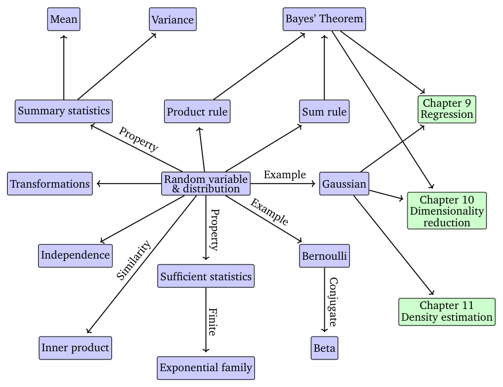
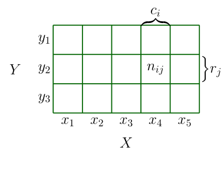
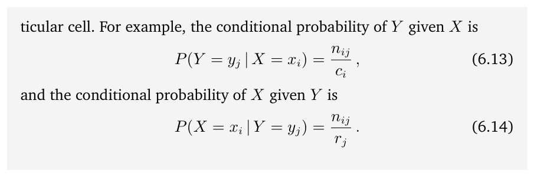
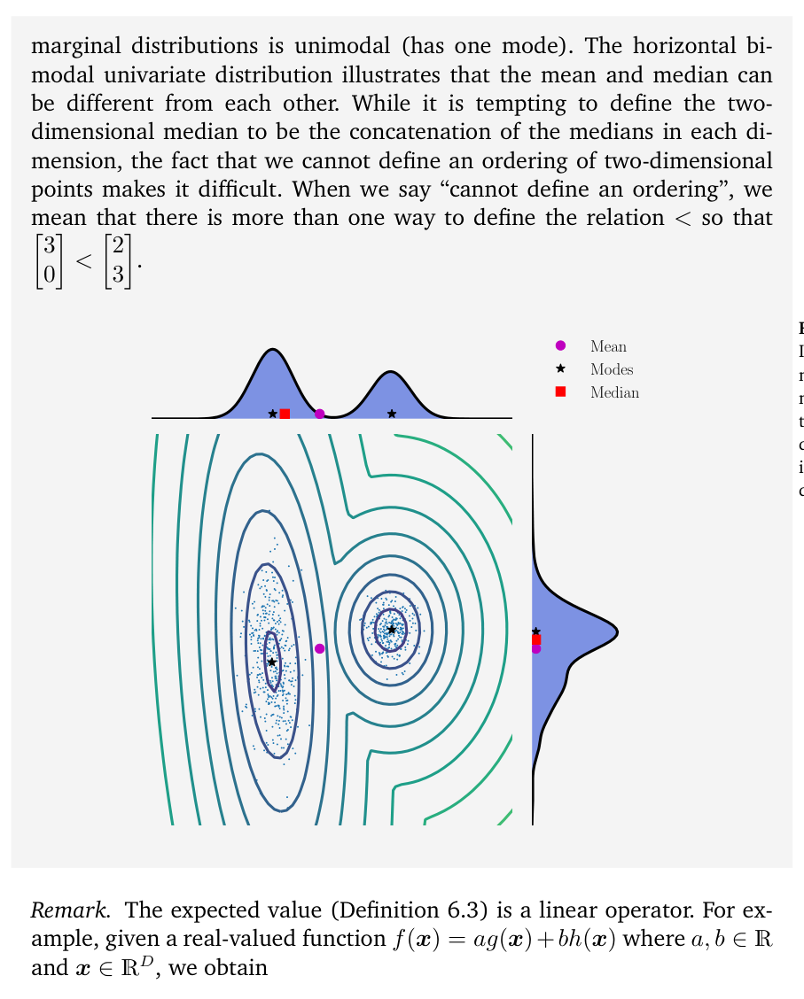
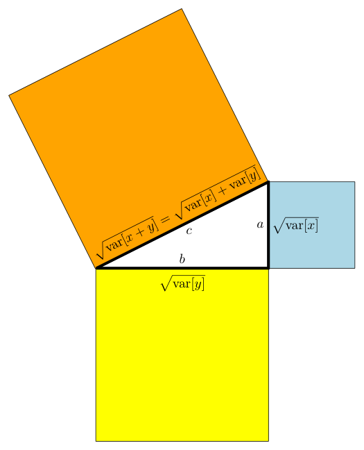
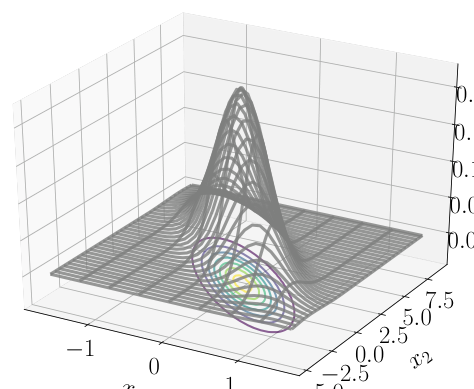
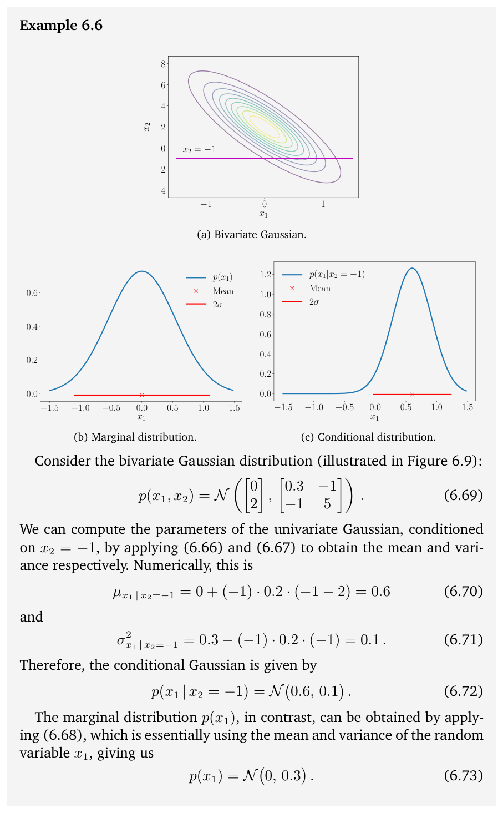
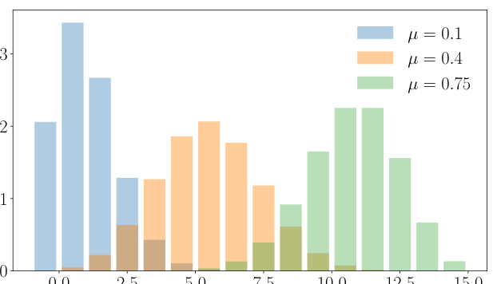
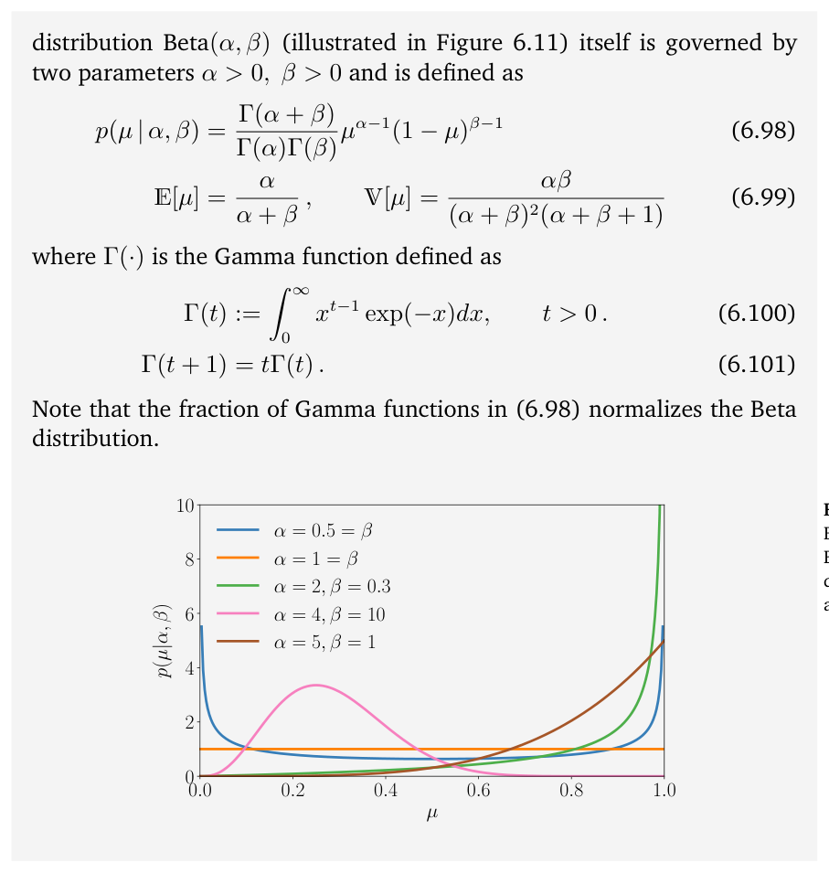

# 第 6 章 概率与分布（Probability and Distributions）

> [← 返回目录](README.md)

> Probability, loosely speaking, concerns the study of uncertainty. Probability can be thought of as the fraction of times an event occurs, or as a degree of belief about an event. We then would like to use this probability to measure the chance of something occurring in an experiment. As mentioned in Chapter 1, we often quantify uncertainty in the data, uncertainty in the machine learning model, and uncertainty in the predictions produced by the model. Quantifying uncertainty requires the idea of a random variable, which is a function that maps outcomes of random experiments to a set of properties that we are interested in. Associated with the random variable is a function that measures the probability that a particular outcome (or set of outcomes) will occur; this is called the probability distribution. Probability distributions are used as a building block for other concepts, such as probabilistic modeling (Section 8.4), graphical models (Section 8.5), and model selection (Section 8.6). In the next section, we present the three concepts that define a probability space (the sample space, the events, and the probability of an event) and how they are related to a fourth concept called the random variable. The presentation is deliberately slightly hand wavy since a rigorous presentation may occlude the intuition behind the concepts. An outline of the concepts presented in this chapter are shown in Figure 6.1.

粗略地说，概率研究的是不确定性。概率可以被看作事件发生的次数占比，也可以被看作对某一事件的相信程度。我们希望利用这种概率来度量实验中某件事情发生的机会。正如第 1 章所述，我们常常需要量化数据中的不确定性、机器学习模型中的不确定性，以及模型所产生的预测中的不确定性。量化不确定性需要随机变量（random variable）的概念，它是一个函数，将随机实验的结果映射到我们所感兴趣的一组性质上。与随机变量相伴的是一个函数，用于度量某个特定结果（或结果集合）发生的概率，这个函数称为概率分布（probability distribution）。概率分布被用作其他概念的基石，例如概率建模（8.4 节）、图模型（graphical model）（8.5 节）和模型选择（8.6 节）。在下一节中，我们将介绍定义概率空间（probability space）的三个概念（样本空间（sample space）、事件（event）以及事件的概率），以及它们如何与第四个概念——随机变量——相关联。我们的表述有意略微随意，因为严格的表述可能会掩盖这些概念背后的直观。本章所介绍概念的大纲如图 6.1 所示。

## 6.1 概率空间的构造（Construction of a Probability Space）

> The theory of probability aims at defining a mathematical structure to describe random outcomes of experiments. For example, when tossing a single coin, we cannot determine the outcome, but by doing a large number of coin tosses, we can observe a regularity in the average outcome. Using this mathematical structure of probability, the goal is to perform automated reasoning, and in this sense, probability generalizes logical reasoning (Jaynes, 2003).

概率论旨在定义一种数学结构，用以描述实验的随机结果。例如，在抛掷一枚硬币时，我们无法确定其结果，但通过大量抛掷硬币，我们能够观察到平均结果中的规律性。利用概率的这一数学结构，我们的目标是实现自动推理（automated reasoning）；在这个意义上，概率是逻辑推理的推广（Jaynes, 2003）。

### 6.1.1 哲学问题（Philosophical Issues）

> When constructing automated reasoning systems, classical Boolean logic does not allow us to express certain forms of plausible reasoning. Consider the following scenario: We observe that A is false. We find B becomes less plausible, although no conclusion can be drawn from classical logic. We observe that B is true. It seems A becomes more plausible. We use this form of reasoning daily. We are waiting for a friend, and consider three possibilities: $H_1$, she is on time; $H_2$, she has been delayed by traffic; and $H_3$, she has been abducted by aliens. When we observe our friend is late, we must logically rule out $H_1$. We also tend to consider $H_2$ to be more likely, though we are not logically required to do so. Finally, we may consider $H_3$ to be possible, but we continue to consider it quite unlikely. How do we conclude $H_2$ is the most plausible answer? Seen in this way, probability theory can be considered a generalization of Boolean logic. In the context of machine learning, it is often applied in this way to formalize the design of automated reasoning systems. Further arguments about how probability theory is the foundation of reasoning systems can be found in Pearl (1988).

在构建自动推理系统时，经典布尔逻辑无法让我们表达某些形式的合情推理（plausible reasoning）。考虑如下情境：我们观察到 A 为假。我们发现 B 变得不太可信了，尽管经典逻辑无法从中得出任何结论。我们观察到 B 为真，看起来 A 变得更加可信了。我们每天都在使用这种推理形式。我们在等一位朋友，并考虑三种可能：$H_1$，她准时到达；$H_2$，她被交通耽搁了；$H_3$，她被外星人绑架了。当我们观察到朋友迟到时，从逻辑上我们必须排除 $H_1$。我们也倾向于认为 $H_2$ 更有可能，尽管逻辑上并不要求我们这样做。最后，我们可能认为 $H_3$ 有可能，但仍会认为它极不可能。我们是如何断定 $H_2$ 是最可信的答案的？由此看来，概率论可以被视为布尔逻辑的一种推广。在机器学习的语境中，概率论常常正是以这种方式被用来将自动推理系统的设计形式化。关于概率论如何构成推理系统之基础的进一步论证，可参见 Pearl (1988)。

> **Figure 6.1** A mind map of the concepts related to random variables and probability distributions, as described in this chapter.

**图 6.1** 本章所述的与随机变量和概率分布相关的概念思维导图。

> The philosophical basis of probability and how it should be somehow related to what we think should be true (in the logical sense) was studied by Cox (Jaynes, 2003). Another way to think about it is that if we are precise about our common sense we end up constructing probabilities. E. T. Jaynes (1922–1998) identified three mathematical criteria, which must apply to all plausibilities:

Cox 研究了概率的哲学基础，以及它应当以何种方式与我们认为（在逻辑意义上）为真的东西联系起来（Jaynes, 2003）。另一种理解方式是：如果我们把常识精确化，最终就会构造出概率。E. T. Jaynes（1922–1998）给出了三条必须适用于一切可信度（plausibility）的数学准则：

> 1. The degrees of plausibility are represented by real numbers.
> 2. These numbers must be based on the rules of common sense.
> 3. The resulting reasoning must be consistent, with the three following meanings of the word “consistent”:

1. 可信度用实数表示。
2. 这些数必须基于常识规则。
3. 由此得到的推理必须是一致的，“一致的”（consistent）一词有以下三层含义：

> (a) Consistency or non-contradiction: When the same result can be reached through different means, the same plausibility value must be found in all cases.
> (b) Honesty: All available data must be taken into account.
> (c) Reproducibility: If our state of knowledge about two problems are the same, then we must assign the same degree of plausibility to both of them.

（a）一致性或无矛盾性：当可以通过不同途径得到相同结果时，所有情形下都必须得到相同的可信度值。
（b）诚实性：必须考虑所有可用的数据。
（c）可复现性：如果我们对两个问题的知识状态相同，就必须给两者赋予相同的可信度。

> The Cox–Jaynes theorem proves these plausibilities to be sufficient to define the universal mathematical rules that apply to plausibility $p$, up to transformation by an arbitrary monotonic function. Crucially, these rules are the rules of probability.

Cox–Jaynes 定理证明了这些可信度足以定义适用于可信度 $p$ 的普适数学规则（至多相差一个任意单调函数的变换）。至关重要的是，这些规则正是概率的规则。

> **Remark.** In machine learning and statistics, there are two major interpretations of probability: the Bayesian and frequentist interpretations (Bishop, 2006; Efron and Hastie, 2016). The Bayesian interpretation uses probability to specify the degree of uncertainty that the user has about an event. It is sometimes referred to as “subjective probability” or “degree of belief”. The frequentist interpretation considers the relative frequencies of events of interest to the total number of events that occurred. The probability of an event is defined as the relative frequency of the event in the limit when one has infinite data. ♢

**评注.** 在机器学习和统计学中，概率有两种主要的解释：贝叶斯解释（Bayesian interpretation）和频率派解释（frequentist interpretation）（Bishop, 2006; Efron and Hastie, 2016）。贝叶斯解释用概率来刻画使用者对某个事件所拥有的不确定程度，有时也被称为“主观概率”（subjective probability）或“相信程度”（degree of belief）。频率派解释则考虑所关心事件发生的相对频率，即该事件发生的次数占已发生的总事件次数的比例。事件的概率定义为：当拥有无限多数据时，该事件相对频率的极限。♢

> Some machine learning texts on probabilistic models use lazy notation and jargon, which is confusing. This text is no exception. Multiple distinct concepts are all referred to as “probability distribution”, and the reader has to often disentangle the meaning from the context. One trick to help make sense of probability distributions is to check whether we are trying to model something categorical (a discrete random variable) or something continuous (a continuous random variable). The kinds of questions we tackle in machine learning are closely related to whether we are considering categorical or continuous models.

一些关于概率模型的机器学习书籍使用随意的记号和行话，这容易令人困惑，本书也不例外。多个不同的概念都被称作“概率分布”，读者常常需要结合上下文来分辨其含义。有一个小技巧可以帮助理清概率分布：检查我们试图建模的对象是分类型的（categorical，即离散随机变量）还是连续型的（continuous，即连续随机变量）。我们在机器学习中处理的问题类型，与我们考虑的是分类模型还是连续模型密切相关。

### 6.1.2 概率与随机变量（Probability and Random Variables）

> There are three distinct ideas that are often confused when discussing probabilities. First is the idea of a probability space, which allows us to quantify the idea of a probability. However, we mostly do not work directly with this basic probability space. Instead, we work with random variables (the second idea), which transfers the probability to a more convenient (often numerical) space. The third idea is the idea of a distribution or law associated with a random variable. We will introduce the first two ideas in this section and expand on the third idea in Section 6.2.

在讨论概率时，有三个彼此不同却常常被混淆的概念。第一个是概率空间的概念，它使我们能够量化概率这一概念。然而，我们大多并不直接在这个基本的概率空间上工作，而是与随机变量（第二个概念）打交道，它把概率转移到更方便的（通常是数值的）空间上。第三个概念是与随机变量相关联的分布（distribution）或分布律（law）。本节将介绍前两个概念，并在 6.2 节中展开第三个概念。

> Modern probability is based on a set of axioms proposed by Kolmogorov (Grinstead and Snell, 1997; Jaynes, 2003) that introduce the three concepts of sample space, event space, and probability measure. The probability space models a real-world process (referred to as an experiment) with random outcomes.

现代概率论建立在由 Kolmogorov 提出的一组公理之上（Grinstead and Snell, 1997; Jaynes, 2003），这些公理引入了样本空间、事件空间（event space）和概率测度（probability measure）这三个概念。概率空间对一个具有随机结果的真实世界过程（称为实验，experiment）进行建模。

> **The sample space** $\Omega$

**样本空间** $\Omega$

> The sample space is the set of all possible outcomes of the experiment, usually denoted by $\Omega$. For example, two successive coin tosses have a sample space of $\{hh, tt, ht, th\}$, where “h” denotes “heads” and “t” denotes “tails”.

样本空间是实验所有可能结果的集合，通常记作 $\Omega$。例如，先后两次抛掷硬币的样本空间为 $\{hh, tt, ht, th\}$，其中 “h” 表示正面，“t” 表示反面。

> **The event space** $\mathcal{A}$

**事件空间** $\mathcal{A}$

> The event space is the space of potential results of the experiment. A subset $A$ of the sample space $\Omega$ is in the event space $\mathcal{A}$ if at the end of the experiment we can observe whether a particular outcome $\omega \in \Omega$ is in $A$. The event space $\mathcal{A}$ is obtained by considering the collection of subsets of $\Omega$, and for discrete probability distributions (Section 6.2.1) $\mathcal{A}$ is often the power set of $\Omega$.

事件空间是实验潜在结果构成的空间。如果在实验结束时我们能够观察到某个特定结果 $\omega \in \Omega$ 是否属于 $A$，那么样本空间 $\Omega$ 的子集 $A$ 就属于事件空间 $\mathcal{A}$。事件空间 $\mathcal{A}$ 通过考虑 $\Omega$ 的子集的全体而得到；对于离散概率分布（6.2.1 节），$\mathcal{A}$ 通常就是 $\Omega$ 的幂集。

> **The probability** $P$

**概率** $P$

> With each event $A \in \mathcal{A}$, we associate a number $P(A)$ that measures the probability or degree of belief that the event will occur. $P(A)$ is called the probability of $A$.

对每个事件 $A \in \mathcal{A}$，我们关联一个数 $P(A)$，用以度量该事件将会发生的概率或相信程度。$P(A)$ 称为 $A$ 的概率。

> The probability of a single event must lie in the interval $[0, 1]$, and the total probability over all outcomes in the sample space $\Omega$ must be 1, i.e., $P(\Omega) = 1$. Given a probability space $(\Omega, \mathcal{A}, P)$, we want to use it to model some real-world phenomenon. In machine learning, we often avoid explicitly referring to the probability space, but instead refer to probabilities on quantities of interest, which we denote by $\mathcal{T}$. In this book, we refer to $\mathcal{T}$ as the target space and refer to elements of $\mathcal{T}$ as states. We introduce a function $X : \Omega \to \mathcal{T}$ that takes an element of $\Omega$ (an outcome) and returns a particular quantity of interest $x$, a value in $\mathcal{T}$. This association/mapping from $\Omega$ to $\mathcal{T}$ is called a random variable. For example, in the case of tossing two coins and counting the number of heads, a random variable $X$ maps to the three possible outcomes: $X(hh) = 2$, $X(ht) = 1$, $X(th) = 1$, and $X(tt) = 0$. In this particular case, $\mathcal{T} = \{0, 1, 2\}$, and it is the probabilities on elements of $\mathcal{T}$ that we are interested in. For a finite sample space $\Omega$ and finite $\mathcal{T}$, the function corresponding to a random variable is essentially a lookup table. For any subset $S \subseteq \mathcal{T}$, we associate $P_X(S) \in [0, 1]$ (the probability) to a particular event occurring corresponding to the random variable $X$. Example 6.1 provides a concrete illustration of the terminology.

单个事件的概率必须落在区间 $[0, 1]$ 内，而且样本空间 $\Omega$ 中所有结果上的总概率必须为 1，即 $P(\Omega) = 1$。给定一个概率空间 $(\Omega, \mathcal{A}, P)$，我们想用它来为某种真实世界现象建模。在机器学习中，我们常常避免显式地提及概率空间，而是直接谈论我们所感兴趣的量上的概率，这些量记作 $\mathcal{T}$。在本书中，我们称 $\mathcal{T}$ 为目标空间（target space），并称 $\mathcal{T}$ 的元素为状态（state）。我们引入函数 $X : \Omega \to \mathcal{T}$，它取 $\Omega$ 中的一个元素（一个结果），返回某个感兴趣的特定量 $x$，即 $\mathcal{T}$ 中的一个值。这种从 $\Omega$ 到 $\mathcal{T}$ 的关联/映射称为随机变量。例如，在抛掷两枚硬币并统计正面次数的情形中，随机变量 $X$ 映射到三种可能的结果：$X(hh) = 2$、$X(ht) = 1$、$X(th) = 1$ 和 $X(tt) = 0$。在这个具体例子中，$\mathcal{T} = \{0, 1, 2\}$，我们感兴趣的是 $\mathcal{T}$ 中元素上的概率。对于有限的样本空间 $\Omega$ 和有限的 $\mathcal{T}$，随机变量所对应的函数本质上是一张查找表。对任意子集 $S \subseteq \mathcal{T}$，我们把 $P_X(S) \in [0, 1]$（即概率）关联到与随机变量 $X$ 相对应的特定事件的发生上。例 6.1 对这些术语给出了具体的示例。

> **Remark.** The aforementioned sample space $\Omega$ unfortunately is referred to by different names in different books. Another common name for $\Omega$ is “state space” (Jacod and Protter, 2004), but state space is sometimes reserved for referring to states in a dynamical system (Hasselblatt and Katok, 2003). Other names sometimes used to describe $\Omega$ are: “sample description space”, “possibility space,” and “event space”. ♢

**评注.** 前面提到的样本空间 $\Omega$ 在不同的书中有着不同的名称。$\Omega$ 的另一个常见名称是“状态空间”（state space）（Jacod and Protter, 2004），但“状态空间”有时专指动力系统中的状态（Hasselblatt and Katok, 2003）。有时用来描述 $\Omega$ 的其他名称还有：“样本描述空间”（sample description space）、“可能性空间”（possibility space）和 “event space”。♢

> **Example 6.1** We assume that the reader is already familiar with computing probabilities of intersections and unions of sets of events. A gentler introduction to probability with many examples can be found in chapter 2 of Walpole et al. (2011).

**例 6.1** 我们假设读者已经熟悉如何计算事件集合的交与并的概率。一份更平易近人、包含大量例子的概率论入门介绍可参见 Walpole 等人 (2011) 一书的第 2 章。

> Consider a statistical experiment where we model a funfair game consisting of drawing two coins from a bag (with replacement). There are coins from USA (denoted as \$) and UK (denoted as £) in the bag, and since we draw two coins from the bag, there are four outcomes in total. The state space or sample space $\Omega$ of this experiment is then (\$, \$), (\$, £), (£, \$), (£, £). Let us assume that the composition of the bag of coins is such that a draw returns at random a \$ with probability 0.3.

考虑一个统计实验：我们为一个游园会游戏建模，游戏内容是从袋子中抽取两枚硬币（有放回）。袋中有来自美国的硬币（记作 \$）和来自英国的硬币（记作 £），由于我们从袋中抽取两枚硬币，因此总共有四种结果。该实验的状态空间即样本空间 $\Omega$ 为 (\$, \$)、(\$, £)、(£, \$)、(£, £)。假设袋中硬币的构成使得每次抽取以 0.3 的概率随机得到一枚 \$。

> The event we are interested in is the total number of times the repeated draw returns \$. Let us define a random variable $X$ that maps the sample space $\Omega$ to $\mathcal{T}$, which denotes the number of times we draw \$ out of the bag. We can see from the preceding sample space we can get zero \$, one \$, or two \$s, and therefore $\mathcal{T} = \{0, 1, 2\}$. The random variable $X$ (a function or lookup table) can be represented as a table like the following:

我们感兴趣的事件是重复抽取中得到 \$ 的总次数。我们定义随机变量 $X$，它把样本空间 $\Omega$ 映射到 $\mathcal{T}$；$\mathcal{T}$ 表示我们从袋中抽出 \$ 的次数。从上面的样本空间可以看出，我们可能得到零枚 \$、一枚 \$ 或两枚 \$，因此 $\mathcal{T} = \{0, 1, 2\}$。随机变量 $X$（一个函数或查找表）可以表示成如下形式的表：

$$
X((\$, \$)) = 2
\tag{6.1}
$$

$$
X((\$, £)) = 1
\tag{6.2}
$$

$$
X((£, \$)) = 1
\tag{6.3}
$$

$$
X((£, £)) = 0\,.
\tag{6.4}
$$

> Since we return the first coin we draw before drawing the second, this implies that the two draws are independent of each other, which we will discuss in Section 6.4.5. Note that there are two experimental outcomes, which map to the same event, where only one of the draws returns \$. Therefore, the probability mass function (Section 6.2.1) of $X$ is given by

由于在抽取第二枚硬币之前我们会把第一枚放回，这意味着两次抽取彼此独立，我们将在 6.4.5 节讨论这一点。注意，有两个实验结果映射到同一个事件，即只有一次抽到 \$ 的情形。因此，$X$ 的概率质量函数（PMF）（6.2.1 节）由下式给出

$$
\begin{aligned}
P(X = 2) &= P((\$, \$)) \\
&= P(\$) \cdot P(\$) \\
&= 0.3 \cdot 0.3 = 0.09
\end{aligned}
\tag{6.5}
$$

$$
P(X = 1) = P((\$, £) \cup (£, \$))
$$

$$
\begin{aligned}
&= P((\$, £)) + P((£, \$)) \\
&= 0.3 \cdot (1 - 0.3) + (1 - 0.3) \cdot 0.3 = 0.42
\end{aligned}
\tag{6.6}
$$

$$
\begin{aligned}
P(X = 0) &= P((£, £)) \\
&= P(£) \cdot P(£) \\
&= (1 - 0.3) \cdot (1 - 0.3) = 0.49\,.
\end{aligned}
\tag{6.7}
$$

> In the calculation, we equated two different concepts, the probability of the output of $X$ and the probability of the samples in $\Omega$. For example, in (6.7) we say $P(X = 0) = P((£, £))$. Consider the random variable $X : \Omega \to \mathcal{T}$ and a subset $S \subseteq \mathcal{T}$ (for example, a single element of $\mathcal{T}$, such as the outcome that one head is obtained when tossing two coins). Let $X^{-1}(S)$ be the pre-image of $S$ by $X$, i.e., the set of elements of $\Omega$ that map to $S$ under $X$; $\{\omega \in \Omega : X(\omega) \in S\}$. One way to understand the transformation of probability from events in $\Omega$ via the random variable $X$ is to associate it with the probability of the pre-image of $S$ (Jacod and Protter, 2004). For $S \subseteq \mathcal{T}$, we have the notation

在上述计算中，我们把两个不同的概念等同了起来：$X$ 的输出所对应的概率，与 $\Omega$ 中样本所对应的概率。例如，在 (6.7) 中我们写下了 $P(X = 0) = P((£, £))$。考虑随机变量 $X : \Omega \to \mathcal{T}$ 以及一个子集 $S \subseteq \mathcal{T}$（例如 $\mathcal{T}$ 中的单个元素，比如抛掷两枚硬币时恰好得到一次正面的结果）。令 $X^{-1}(S)$ 为 $S$ 在 $X$ 下的原像（pre-image），即在 $X$ 作用下映射到 $S$ 的 $\Omega$ 中元素构成的集合：$\{\omega \in \Omega : X(\omega) \in S\}$。要理解概率如何经由随机变量 $X$ 从 $\Omega$ 中的事件变换而来，一种方式是把它与 $S$ 的原像的概率联系起来（Jacod and Protter, 2004）。对于 $S \subseteq \mathcal{T}$，我们有如下记号

$$
P_X(S) = P(X \in S) = P(X^{-1}(S)) = P(\{\omega \in \Omega : X(\omega) \in S\})\,.
\tag{6.8}
$$

> The left-hand side of (6.8) is the probability of the set of possible outcomes (e.g., number of \$ = 1) that we are interested in. Via the random variable $X$, which maps states to outcomes, we see in the right-hand side of (6.8) that this is the probability of the set of states (in $\Omega$) that have the property (e.g., \$£, £\$). We say that a random variable $X$ is distributed according to a particular probability distribution $P_X$, which defines the probability mapping between the event and the probability of the outcome of the random variable. In other words, the function $P_X$ or equivalently $P \circ X^{-1}$ is the law or distribution of random variable $X$.

(6.8) 的左边是我们感兴趣的那一组可能结果的概率（例如 \$ 的数量 = 1）。经由把状态映射为结果的随机变量 $X$，从 (6.8) 的右边可以看到，这就是（$\Omega$ 中）具有该性质的状态集合的概率（例如 \$£、£\$）。我们说随机变量 $X$ 服从某个特定的概率分布（probability distribution）$P_X$，它定义了事件与随机变量结果的概率之间的概率映射。换言之，函数 $P_X$，或等价地 $P \circ X^{-1}$，就是随机变量 $X$ 的律（law）或分布（distribution）。

> **Remark.** The target space, that is, the range $\mathcal{T}$ of the random variable $X$, is used to indicate the kind of probability space, i.e., a $\mathcal{T}$ random variable. When $\mathcal{T}$ is finite or countably infinite, this is called a discrete random variable (Section 6.2.1). For continuous random variables (Section 6.2.2), we only consider $\mathcal{T} = \mathbb{R}$ or $\mathcal{T} = \mathbb{R}^D$. ♢

**评注.** 目标空间，即随机变量 $X$ 的值域 $\mathcal{T}$，用来指明概率空间的种类，即一个 $\mathcal{T}$ 随机变量。当 $\mathcal{T}$ 为有限或可数无限时，这称为离散随机变量（6.2.1 节）。对于连续随机变量（6.2.2 节），我们只考虑 $\mathcal{T} = \mathbb{R}$ 或 $\mathcal{T} = \mathbb{R}^D$。♢

### 6.1.3 统计学（Statistics）

> Probability theory and statistics are often presented together, but they concern different aspects of uncertainty. One way of contrasting them is by the kinds of problems that are considered. Using probability, we can consider a model of some process, where the underlying uncertainty is captured by random variables, and we use the rules of probability to derive what happens. In statistics, we observe that something has happened and try to figure out the underlying process that explains the observations. In this sense, machine learning is close to statistics in its goals to construct a model that adequately represents the process that generated the data. We can use the rules of probability to obtain a “best-fitting” model for some data.

概率论和统计学经常被放在一起讲授，但二者关注的是不确定性的不同侧面。对比二者的一种方式是考察它们所处理的问题类型。利用概率论，我们可以为某个过程考虑一个模型，其中潜在的不确定性由随机变量来刻画，然后运用概率的规则推导出会发生什么。而在统计学中，我们观察到某件事情已经发生，并试图找出能够解释这些观测的潜在过程。从这个意义上说，机器学习与统计学很接近：其目标都是构造一个能够恰当表示数据生成过程的模型。我们可以利用概率的规则为一些数据求得一个“最拟合”的模型。

> Another aspect of machine learning systems is that we are interested in generalization error (see Chapter 8). This means that we are actually interested in the performance of our system on instances that we will observe in future, which are not identical to the instances that we have seen so far. This analysis of future performance relies on probability and statistics, most of which is beyond what will be presented in this chapter. The interested reader is encouraged to look at the books by Boucheron et al. (2013) and Shalev-Shwartz and Ben-David (2014). We will see more about statistics in Chapter 8.

机器学习系统的另一个方面是，我们关心泛化误差（generalization error）（参见第 8 章）。这意味着我们真正关心的是系统在未来将会观测到的实例上的表现，而这些实例与到目前为止我们见过的实例并不相同。这种对未来表现的分析依赖于概率论和统计学，其中大部分内容超出了本章将要讲述的范围。有兴趣的读者可参阅 Boucheron 等人 (2013) 以及 Shalev-Shwartz 和 Ben-David (2014) 的著作。关于统计学，我们将在第 8 章中看到更多内容。

## 6.2 离散与连续概率（Discrete and Continuous Probabilities）

> Let us focus our attention on ways to describe the probability of an event as introduced in Section 6.1. Depending on whether the target space is discrete or continuous, the natural way to refer to distributions is different. When the target space $\mathcal{T}$ is discrete, we can specify the probability that a random variable $X$ takes a particular value $x \in \mathcal{T}$, denoted as $P(X = x)$. The expression $P(X = x)$ for a discrete random variable $X$ is known as the probability mass function. When the target space $\mathcal{T}$ is continuous, e.g., the real line $\mathbb{R}$, it is more natural to specify the probability that a random variable $X$ is in an interval, denoted by $P(a \leqslant X \leqslant b)$ for $a < b$. By convention, we specify the probability that a random variable $X$ is less than a particular value $x$, denoted by $P(X \leqslant x)$. The expression $P(X \leqslant x)$ for a continuous random variable $X$ is known as the cumulative distribution function. We will discuss continuous random variables in Section 6.2.2. We will revisit the nomenclature and contrast discrete and continuous random variables in Section 6.2.3.

让我们把注意力集中在描述 6.1 节所引入的事件概率的几种方式上。目标空间是离散的还是连续的，决定了称呼分布的自然方式有所不同。当目标空间 $\mathcal{T}$ 是离散的时，我们可以具体指明随机变量 $X$ 取某个特定值 $x \in \mathcal{T}$ 的概率，记作 $P(X = x)$。对离散随机变量 $X$ 而言，表达式 $P(X = x)$ 称为概率质量函数。当目标空间 $\mathcal{T}$ 是连续的时，例如实直线 $\mathbb{R}$，更自然的做法是指明随机变量 $X$ 落在某个区间内的概率，对 $a < b$ 记作 $P(a \leqslant X \leqslant b)$。按照惯例，我们会指明随机变量 $X$ 小于某个特定值 $x$ 的概率，记作 $P(X \leqslant x)$。对连续随机变量 $X$ 而言，表达式 $P(X \leqslant x)$ 称为累积分布函数（cumulative distribution function）。我们将在 6.2.2 节讨论连续随机变量，并在 6.2.3 节重温这些术语，对比离散随机变量和连续随机变量。

> **Remark.** We will use the phrase univariate distribution to refer to distributions of a single random variable (whose states are denoted by non-bold $x$). We will refer to distributions of more than one random variable as multivariate distributions, and will usually consider a vector of random variables (whose states are denoted by bold $\boldsymbol{x}$).

**评注.** 我们将用术语单变量分布（univariate distribution）指单个随机变量的分布（其状态用非粗体的 $x$ 表示）。我们将把多于一个随机变量的分布称为多变量分布（multivariate distribution），并且通常考虑随机变量构成的向量（其状态用粗体的 $\boldsymbol{x}$ 表示）。

> ♢

♢

### 6.2.1 离散概率（Discrete Probabilities）

> When the target space is discrete, we can imagine the probability distribution of multiple random variables as filling out a (multidimensional) array of numbers. Figure 6.2 shows an example. The target space of the joint probability is the Cartesian product of the target spaces of each of the random variables. We define the joint probability as the entry of both values jointly

当目标空间是离散的时，我们可以把多个随机变量的概率分布想象成填满一个（多维）数字阵列。图 6.2 给出了一个例子。联合概率（joint probability）的目标空间是各个随机变量的目标空间的笛卡尔积。我们把联合概率定义为两个值联合所对应的表项

$$
P(X = x_i, Y = y_j) = \frac{n_{ij}}{N},
\tag{6.9}
$$

> where $n_{ij}$ is the number of events with state $x_i$ and $y_j$ and $N$ the total number of events. The joint probability is the probability of the intersection of both events, that is, $P(X = x_i, Y = y_j) = P(X = x_i \cap Y = y_j)$. Figure 6.2 illustrates the probability mass function (pmf) of a discrete probability distribution. For two random variables $X$ and $Y$, the probability

其中 $n_{ij}$ 是状态为 $x_i$ 和 $y_j$ 的事件数，$N$ 是事件总数。联合概率是两个事件交集的概率，即 $P(X = x_i, Y = y_j) = P(X = x_i \cap Y = y_j)$。图 6.2 展示了一个离散概率分布的概率质量函数（pmf）。对于两个随机变量 $X$ 和 $Y$，

> **Figure 6.2** Visualization of a discrete bivariate probability mass function, with random variables $X$ and $Y$. This diagram is adapted from Bishop (2006).

**图 6.2** 离散二元概率质量函数的可视化，其中随机变量为 $X$ 和 $Y$。本图改编自 Bishop (2006)。

> that $X = x$ and $Y = y$ is (lazily) written as $p(x, y)$ and is called the joint probability. One can think of a probability as a function that takes state $x$ and $y$ and returns a real number, which is the reason we write $p(x, y)$. The marginal probability that $X$ takes the value $x$ irrespective of the value of random variable $Y$ is (lazily) written as $p(x)$. We write $X \sim p(x)$ to denote that the random variable $X$ is distributed according to $p(x)$. If we consider only the instances where $X = x$, then the fraction of instances (the conditional probability) for which $Y = y$ is written (lazily) as $p(y \mid x)$.

取 $X = x$ 和 $Y = y$ 的概率（不严格地）写作 $p(x, y)$，称为联合概率。可以把概率看作一个函数：它接受状态 $x$ 和 $y$，返回一个实数，这正是我们写作 $p(x, y)$ 的原因。$X$ 取值 $x$ 而不依赖于随机变量 $Y$ 之取值的边缘概率（marginal probability）（不严格地）写作 $p(x)$。我们用 $X \sim p(x)$ 表示随机变量 $X$ 依照 $p(x)$ 分布。如果只考虑 $X = x$ 的那些实例，那么其中满足 $Y = y$ 的实例所占的比例（条件概率，conditional probability）（不严格地）写作 $p(y \mid x)$。

> **Example 6.2** Consider two random variables $X$ and $Y$, where $X$ has five possible states and $Y$ has three possible states, as shown in Figure 6.2. We denote by $n_{ij}$ the number of events with state $X = x_i$ and $Y = y_j$, and denote by $N$ the total number of events. The value $c_i$ is the sum of the individual frequencies for the $i$th column, that is, $c_i = \sum_{j=1}^{3} n_{ij}$. Similarly, the value $r_j$ is the row sum, that is, $r_j = \sum_{i=1}^{5} n_{ij}$. Using these definitions, we can compactly express the distribution of $X$ and $Y$.

**例 6.2** 考虑两个随机变量 $X$ 和 $Y$，其中 $X$ 有五个可能状态，$Y$ 有三个可能状态，如图 6.2 所示。我们用 $n_{ij}$ 表示状态为 $X = x_i$ 和 $Y = y_j$ 的事件数，用 $N$ 表示事件总数。值 $c_i$ 是第 $i$ 列各频率之和，即 $c_i = \sum_{j=1}^{3} n_{ij}$；类似地，值 $r_j$ 是行和，即 $r_j = \sum_{i=1}^{5} n_{ij}$。利用这些定义，我们可以简洁地表示 $X$ 和 $Y$ 的分布。

> The probability distribution of each random variable, the marginal probability, can be seen as the sum over a row or column

每个随机变量各自的概率分布，即边缘概率，可以看作对一行或一列求和

$$
P(X = x_i) = \frac{c_i}{N} = \frac{\sum_{j=1}^{3} n_{ij}}{N}
\tag{6.10}
$$

> and

以及

$$
P(Y = y_j) = \frac{r_j}{N} = \frac{\sum_{i=1}^{5} n_{ij}}{N},
\tag{6.11}
$$

> where $c_i$ and $r_j$ are the $i$th column and $j$th row of the probability table, respectively. By convention, for discrete random variables with a finite number of events, we assume that probabilties sum up to one, that is,

其中 $c_i$ 和 $r_j$ 分别是概率表的第 $i$ 列和第 $j$ 行。按照惯例，对于事件数有限的离散随机变量，我们假设概率之和为一，即

$$
\sum_{i=1}^{5} P(X = x_i) = 1 \quad\text{and}\quad \sum_{j=1}^{3} P(Y = y_j) = 1\,.
\tag{6.12}
$$

> The conditional probability is the fraction of a row or column in a particular cell. For example, the conditional probability of $Y$ given $X$ is

条件概率是特定单元格占一行或一列的比例。例如，$Y$ 在给定 $X$ 时的条件概率为

$$
P(Y = y_j \mid X = x_i) = \frac{n_{ij}}{c_i},
\tag{6.13}
$$

> and the conditional probability of $X$ given $Y$ is

而 $X$ 在给定 $Y$ 时的条件概率为

$$
P(X = x_i \mid Y = y_j) = \frac{n_{ij}}{r_j}\,.
\tag{6.14}
$$

> In machine learning, we use discrete probability distributions to model categorical variables, i.e., variables that take a finite set of unordered values. They could be categorical features, such as the degree taken at university when used for predicting the salary of a person, or categorical labels, such as letters of the alphabet when doing handwriting recognition. Discrete distributions are also often used to construct probabilistic models that combine a finite number of continuous distributions (Chapter 11).

在机器学习中，我们用离散概率分布来建模类别变量（categorical variable），即取有限个无序值的变量。它们可以是类别特征，例如在预测一个人的薪水时所用的大学学位；也可以是类别标签，例如手写识别中的字母表字母。离散分布也常用来构造把有限个连续分布组合起来的概率模型（第 11 章）。

### 6.2.2 连续概率（Continuous Probabilities）

> We consider real-valued random variables in this section, i.e., we consider target spaces that are intervals of the real line $\mathbb{R}$. In this book, we pretend that we can perform operations on real random variables as if we have discrete probability spaces with finite states. However, this simplification is not precise for two situations: when we repeat something infinitely often, and when we want to draw a point from an interval. The first situation arises when we discuss generalization errors in machine learning (Chapter 8). The second situation arises when we want to discuss continuous distributions, such as the Gaussian (Section 6.5). For our purposes, the lack of precision allows for a briefer introduction to probability.

本节考虑实值随机变量，即考虑目标空间为实直线 $\mathbb{R}$ 的区间的情形。在本书中，我们假装可以对实随机变量进行运算，就好像我们拥有状态有限的离散概率空间一样。然而，这种简化在两种情形下并不精确：一是当我们无限次重复某件事情时，二是当我们想从一个区间中抽取一个点时。第一种情形出现在我们讨论机器学习中的泛化误差时（第 8 章）；第二种情形出现在我们想讨论连续分布（如高斯分布）时（6.5 节）。就我们的目的而言，这种不精确换来的是对概率更简短的介绍。

> **Remark.** In continuous spaces, there are two additional technicalities, which are counterintuitive. First, the set of all subsets (used to define the event space $\mathcal{A}$ in Section 6.1) is not well behaved enough. $\mathcal{A}$ needs to be restricted to behave well under set complements, set intersections, and set unions. Second, the size of a set (which in discrete spaces can be obtained by counting the elements) turns out to be tricky. The size of a set is called its measure. For example, the cardinality of discrete sets, the length of an interval in $\mathbb{R}$, and the volume of a region in $\mathbb{R}^d$ are all measures. Sets that behave well under set operations and additionally have a topology are called a Borel σ-algebra. Betancourt details a careful construction of probability spaces from set theory without being bogged down in technicalities; see https://tinyurl.com/yb3t6mfd. For a more precise construction, we refer to Billingsley (1995) and Jacod and Protter (2004).

**评注.** 在连续空间中，还有两个反直觉的技术细节。首先，由所有子集构成的集合（6.1 节中用它定义事件空间 $\mathcal{A}$）表现得不够好，需要把 $\mathcal{A}$ 限制为在集合补、集合交和集合并下表现良好的集合族。其次，集合的大小（在离散空间中可以通过数元素的个数得到）也变得棘手。集合的大小称为它的测度（measure）。例如，离散集合的基数、$\mathbb{R}$ 中区间的长度、$\mathbb{R}^d$ 中区域的体积都是测度。在集合运算下表现良好并且还具有拓扑的集合族，称为 Borel σ-代数（Borel σ-algebra）。Betancourt 细致地讲述了如何从集合论出发构造概率空间，而又不会陷入繁琐的技术细节；参见 https://tinyurl.com/yb3t6mfd。更精确的构造可参阅 Billingsley (1995) 以及 Jacod and Protter (2004)。

> In this book, we consider real-valued random variables with their corresponding Borel σ-algebra. We consider random variables with values in $\mathbb{R}^D$ to be a vector of real-valued random variables. ♢

在本书中，我们考虑带有相应 Borel σ-代数的实值随机变量。我们把取值在 $\mathbb{R}^D$ 中的随机变量看作实值随机变量构成的向量。♢

> **Definition 6.1** (Probability Density Function). A function $f : \mathbb{R}^D \to \mathbb{R}$ is called a probability density function (pdf) if

**定义 6.1**（概率密度函数，Probability Density Function）。如果函数 $f : \mathbb{R}^D \to \mathbb{R}$ 满足

1. $\forall x \in \mathbb{R}^D : f(x) \geqslant 0$
2. Its integral exists and

1. $\forall x \in \mathbb{R}^D : f(x) \geqslant 0$
2. 其积分存在，且

$$
\int_{\mathbb{R}^D} f(x) \, \mathrm{d}x = 1\,.
\tag{6.15}
$$

> For probability mass functions (pmf) of discrete random variables, the integral in (6.15) is replaced with a sum (6.12).

对于离散随机变量的概率质量函数（pmf），(6.15) 中的积分替换为求和 (6.12)。

> Observe that the probability density function is any function $f$ that is non-negative and integrates to one. We associate a random variable $X$ with this function $f$ by

注意，概率密度函数可以是任何非负且积分为一的函数 $f$。我们通过下式把随机变量 $X$ 与这个函数 $f$ 关联起来：

$$
P(a \leqslant X \leqslant b) = \int_a^b f(x) \, \mathrm{d}x,
\tag{6.16}
$$

> where $a, b \in \mathbb{R}$ and $x \in \mathbb{R}$ are outcomes of the continuous random variable $X$. States $x \in \mathbb{R}^D$ are defined analogously by considering a vector of $x \in \mathbb{R}$. This association (6.16) is called the law or distribution of the random variable $X$. $P(X = x)$ is a set of measure zero.

其中 $a, b \in \mathbb{R}$，$x \in \mathbb{R}$ 是连续随机变量 $X$ 的结果。状态 $x \in \mathbb{R}^D$ 可以通过考虑 $x \in \mathbb{R}$ 构成的向量来类似地定义。这种关联 (6.16) 称为随机变量 $X$ 的律或分布。$P(X = x)$ 是一个测度为零的集合。

> **Remark.** In contrast to discrete random variables, the probability of a continuous random variable $X$ taking a particular value $P(X = x)$ is zero. This is like trying to specify an interval in (6.16) where $a = b$. ♢

**评注.** 与离散随机变量不同，连续随机变量 $X$ 取某个特定值的概率 $P(X = x)$ 为零。这就像在 (6.16) 中试图指定一个 $a = b$ 的区间。♢

> **Definition 6.2** (Cumulative Distribution Function). A cumulative distribution function (cdf) of a multivariate real-valued random variable $X$ with states $x \in \mathbb{R}^D$ is given by

**定义 6.2**（累积分布函数，Cumulative Distribution Function）。状态为 $x \in \mathbb{R}^D$ 的多元实值随机变量 $X$，其累积分布函数（cdf）由下式给出

$$
F_X(x) = P(X_1 \leqslant x_1, \ldots, X_D \leqslant x_D),
\tag{6.17}
$$

> where $X = [X_1, \ldots, X_D]^\top$, $x = [x_1, \ldots, x_D]^\top$, and the right-hand side represents the probability that random variable $X_i$ takes the value smaller than or equal to $x_i$.

其中 $X = [X_1, \ldots, X_D]^\top$，$x = [x_1, \ldots, x_D]^\top$，右边表示随机变量 $X_i$ 取值小于或等于 $x_i$ 的概率。

> There are cdfs, which do not have corresponding pdfs. The cdf can be expressed also as the integral of the probability density function $f(x)$ so that

有些 cdf 并没有与之对应的 pdf。cdf 也可以表示为概率密度函数 $f(x)$ 的积分，即

$$
F_X(x) = \int_{-\infty}^{x_1} \cdots \int_{-\infty}^{x_D} f(z_1, \ldots, z_D) \, \mathrm{d}z_1 \cdots \mathrm{d}z_D\,.
\tag{6.18}
$$

> **Remark.** We reiterate that there are in fact two distinct concepts when talking about distributions. First is the idea of a pdf (denoted by $f(x)$), which is a nonnegative function that sums to one. Second is the law of a random variable $X$, that is, the association of a random variable $X$ with the pdf $f(x)$. ♢

**评注.** 我们重申，谈论分布时实际上涉及两个不同的概念。其一是 pdf（记作 $f(x)$）这个概念，它是一个非负且总和为一的函数。其二是随机变量 $X$ 的律，即随机变量 $X$ 与 pdf $f(x)$ 之间的关联。♢

> **Figure 6.3** Examples of (a) discrete and (b) continuous uniform distributions. See Example 6.3 for details of the distributions.

**图 6.3** (a) 离散和 (b) 连续均匀分布的例子。这些分布的细节见例 6.3。

> For most of this book, we will not use the notation $f(x)$ and $F_X(x)$ as we mostly do not need to distinguish between the pdf and cdf. However, we will need to be careful about pdfs and cdfs in Section 6.7.

在本书的大部分内容中，我们不会使用 $f(x)$ 和 $F_X(x)$ 这样的记号，因为大多数情况下我们无需区分 pdf 和 cdf。不过，在 6.7 节中我们需要小心对待 pdf 和 cdf。

### 6.2.3 离散分布与连续分布的对比（Contrasting Discrete and Continuous Distributions）

> Recall from Section 6.1.2 that probabilities are positive and the total probability sums up to one. For discrete random variables (see (6.12)), this implies that the probability of each state must lie in the interval $[0, 1]$. However, for continuous random variables the normalization (see (6.15)) does not imply that the value of the density is less than or equal to 1 for all values. We illustrate this in Figure 6.3 using the uniform distribution for both discrete and continuous random variables.

回顾 6.1.2 节：概率为正，且总概率之和为一。对于离散随机变量（见 (6.12)），这意味着每个状态的概率必须落在区间 $[0, 1]$ 内。然而，对于连续随机变量，归一化条件（见 (6.15)）并不意味着密度值对所有取值都小于或等于 1。我们在图 6.3 中用均匀分布（uniform distribution）对离散和连续随机变量分别加以说明。

> **Example 6.3** We consider two examples of the uniform distribution, where each state is equally likely to occur. This example illustrates some differences between discrete and continuous probability distributions.

**例 6.3** 我们考虑均匀分布的两个例子，其中每个状态都是等可能出现的。这个例子展示了离散概率分布与连续概率分布之间的一些差异。

> Let $Z$ be a discrete uniform random variable with three states $\{z = -1.1, z = 0.3, z = 1.5\}$. The probability mass function can be represented as a table of probability values:

设 $Z$ 为一个离散均匀随机变量，它有三个状态 $\{z = -1.1, z = 0.3, z = 1.5\}$。其概率质量函数可以表示为一张概率值表：

| $z$ | $-1.1$ | $0.3$ | $1.5$ |
|---|---|---|---|
| $P(Z = z)$ | $\frac{1}{3}$ | $\frac{1}{3}$ | $\frac{1}{3}$ |

> Alternatively, we can think of this as a graph (Figure 6.3(a)), where we use the fact that the states can be located on the $x$-axis, and the $y$-axis represents the probability of a particular state. The $y$-axis in Figure 6.3(a) is deliberately extended so that is it the same as in Figure 6.3(b).

或者，我们可以把它想象成一张图（图 6.3(a)）：利用状态可以标在 $x$ 轴上这一事实，$y$ 轴表示特定状态的概率。图 6.3(a) 中的 $y$ 轴特意做了延伸，使得它与图 6.3(b) 中的相同。

> Let $X$ be a continuous random variable taking values in the range $0.9 \leqslant X \leqslant 1.6$, as represented by Figure 6.3(b). Observe that the height of the

设 $X$ 为取值范围 $0.9 \leqslant X \leqslant 1.6$ 的连续随机变量，如图 6.3(b) 所示。注意到

> **Table 6.1** Nomenclature for probability distributions.

**表 6.1** 概率分布的术语命名。

> | Type | "Point probability" | "Interval probability" |
> |---|---|---|
> | Discrete Probability mass function | $P(X = x)$ | Not applicable |
> | Continuous Probability density function | $p(x)$ | $P(X \leqslant x)$ Cumulative distribution function |

| 类型 | “点概率” | “区间概率” |
|---|---|---|
| 离散 概率质量函数 | $P(X = x)$ | 不适用 |
| 连续 概率密度函数 | $p(x)$ | $P(X \leqslant x)$ 累积分布函数 |

> density can be greater than 1. However, it needs to hold that

密度可以大于 1。然而，必须满足下式

$$
\int_{0.9}^{1.6} p(x) \, \mathrm{d}x = 1 \,.
\tag{6.19}
$$

> **Remark.** There is an additional subtlety with regards to discrete probability distributions. The states $z_1, \ldots, z_d$ do not in principle have any structure, i.e., there is usually no way to compare them, for example $z_1 = \text{red}$, $z_2 = \text{green}$, $z_3 = \text{blue}$. However, in many machine learning applications discrete states take numerical values, e.g., $z_1 = -1.1$, $z_2 = 0.3$, $z_3 = 1.5$, where we could say $z_1 < z_2 < z_3$. Discrete states that assume numerical values are particularly useful because we often consider expected values (Section 6.4.1) of random variables. ♢

**评注.** 关于离散概率分布，还有一个额外的微妙之处。状态 $z_1, \ldots, z_d$ 原则上没有任何结构，也就是说，通常无法对它们进行比较，例如 $z_1 = \text{red}$、$z_2 = \text{green}$、$z_3 = \text{blue}$。然而，在许多机器学习应用中，离散状态会取数值，例如 $z_1 = -1.1$、$z_2 = 0.3$、$z_3 = 1.5$，此时我们可以说 $z_1 < z_2 < z_3$。取数值的离散状态特别有用，因为我们经常需要考虑随机变量的期望值（6.4.1 节）。♢

> Unfortunately, machine learning literature uses notation and nomenclature that hides the distinction between the sample space $\Omega$, the target space $\mathcal{T}$, and the random variable $X$. For a value $x$ of the set of possible outcomes of the random variable $X$, i.e., $x \in \mathcal{T}$, $p(x)$ denotes the probability that random variable $X$ has the outcome $x$. For discrete random variables, this is written as $P(X = x)$, which is known as the probability mass function. The pmf is often referred to as the "distribution". For continuous variables, $p(x)$ is called the probability density function (often referred to as a density). To muddy things even further, the cumulative distribution function $P(X \leqslant x)$ is often also referred to as the "distribution". In this chapter, we will use the notation $X$ to refer to both univariate and multivariate random variables, and denote the states by $x$ and $\boldsymbol{x}$ respectively. We summarize the nomenclature in Table 6.1.

遗憾的是，机器学习文献所使用的记号和术语掩盖了样本空间 $\Omega$、目标空间 $\mathcal{T}$ 与随机变量 $X$ 三者之间的区别。对于随机变量 $X$ 的可能结果集合中的一个值 $x$，即 $x \in \mathcal{T}$，$p(x)$ 表示随机变量 $X$ 取到结果 $x$ 的概率。对于离散随机变量，这写作 $P(X = x)$，称为概率质量函数；pmf 常被简称为“分布”。对于连续变量，$p(x)$ 称为概率密度函数（常简称为密度）。更让人混淆的是，累积分布函数 $P(X \leqslant x)$ 通常也被称为“分布”。在本章中，我们将用记号 $X$ 同时指代一元随机变量和多元随机变量，并分别用 $x$ 和 $\boldsymbol{x}$ 表示它们的状态。我们在表 6.1 中总结了这些术语命名。

> **Remark.** We will be using the expression "probability distribution" not only for discrete probability mass functions but also for continuous probability density functions, although this is technically incorrect. In line with most machine learning literature, we also rely on context to distinguish the different uses of the phrase probability distribution. ♢

**评注.** 我们将把“概率分布”这一表述不仅用于离散的概率质量函数，也用于连续的概率密度函数，尽管这在技术上并不准确。与大多数机器学习文献一致，我们也依靠上下文来区分“概率分布”这一短语的不同用法。♢

## 6.3 加和规则、乘积规则与贝叶斯定理（Sum Rule, Product Rule, and Bayes' Theorem）

> We think of probability theory as an extension to logical reasoning. As we discussed in Section 6.1.1, the rules of probability presented here follow naturally from fulfilling the desiderata (Jaynes, 2003, chapter 2). Probabilistic modeling (Section 8.4) provides a principled foundation for designing machine learning methods. Once we have defined probability distributions (Section 6.2) corresponding to the uncertainties of the data and our problem, it turns out that there are only two fundamental rules, the sum rule and the product rule.

我们将概率论视为逻辑推理的一种扩展。正如我们在 6.1.1 节中所讨论的，这里给出的概率规则可以由满足那些基本要求（desiderata）而自然地得到（Jaynes, 2003, chapter 2）。概率建模（8.4 节）为设计机器学习方法提供了一个有原则可循的基础。一旦我们定义了与数据和我们问题的不确定性相对应的概率分布（6.2 节），就会发现其实只有两条基本规则：加和规则（sum rule）和乘积规则（product rule）。

> Recall from (6.9) that $p(x, y)$ is the joint distribution of the two random variables $x, y$. The distributions $p(x)$ and $p(y)$ are the corresponding marginal distributions, and $p(y \mid x)$ is the conditional distribution of $y$ given $x$. Given the definitions of the marginal and conditional probability for discrete and continuous random variables in Section 6.2, we can now present the two fundamental rules in probability theory. These two rules arise naturally (Jaynes, 2003) from the requirements we discussed in Section 6.1.1.

由 (6.9) 回想一下，$p(x, y)$ 是两个随机变量 $x$、$y$ 的联合分布；分布 $p(x)$ 和 $p(y)$ 是相应的边缘分布，而 $p(y \mid x)$ 是给定 $x$ 时 $y$ 的条件分布。根据 6.2 节中针对离散和连续随机变量的边缘概率与条件概率的定义，我们现在给出概率论中的两条基本规则。这两条规则（Jaynes, 2003）可以由我们在 6.1.1 节中讨论过的那些要求自然地导出。

> The first rule, the sum rule, states that

第一条规则是加和规则，它表明

$$
p(x) =
\begin{cases}
\sum_{y \in \mathcal{Y}} p(x, y) & \text{if } y \text{ is discrete} \\
\int p(x, y) \, \mathrm{d}y & \text{if } y \text{ is continuous}
\end{cases} \,,
\tag{6.20}
$$

> where $\mathcal{Y}$ are the states of the target space of random variable $Y$. This means that we sum out (or integrate out) the set of states $y$ of the random variable $Y$. The sum rule is also known as the marginalization property. The sum rule relates the joint distribution to a marginal distribution. In general, when the joint distribution contains more than two random variables, the sum rule can be applied to any subset of the random variables, resulting in a marginal distribution of potentially more than one random variable. More concretely, if $x = [x_1, \ldots, x_D]^\top$, we obtain the marginal

其中 $\mathcal{Y}$ 是随机变量 $Y$ 的目标空间中的状态。这意味着我们把随机变量 $Y$ 的状态集 $y$ 求和（或积分）消去。加和规则也称为边缘化性质（marginalization property）。加和规则将联合分布与边缘分布联系起来。一般地，当联合分布包含多于两个随机变量时，加和规则可以应用于这些随机变量的任意子集，从而得到可能包含多于一个随机变量的边缘分布。更具体地，若 $x = [x_1, \ldots, x_D]^\top$，则可得边缘分布

$$
p(x_i) = \int p(x_1, \ldots, x_D) \, \mathrm{d}x_{\setminus i}
\tag{6.21}
$$

> by repeated application of the sum rule where we integrate/sum out all random variables except $x_i$, which is indicated by $\setminus i$, which reads "all except i."

这是通过反复应用加和规则得到的：我们对除 $x_i$ 之外的所有随机变量进行积分/求和，这一操作用 $\setminus i$ 表示，读作“除 $i$ 之外的所有”（all except i）。

> **Remark.** Many of the computational challenges of probabilistic modeling are due to the application of the sum rule. When there are many variables or discrete variables with many states, the sum rule boils down to performing a high-dimensional sum or integral. Performing high-dimensional sums or integrals is generally computationally hard, in the sense that there is no known polynomial-time algorithm to calculate them exactly. ♢

**评注.** 概率建模中的许多计算挑战都源于加和规则的应用。当变量很多，或者离散变量有很多状态时，加和规则归根结底就是要执行一个高维求和或积分。而执行高维求和或积分在计算上通常是困难的，因为目前尚无已知的多项式时间算法能够精确地计算它们。♢

> The second rule, known as the product rule, relates the joint distribution to the conditional distribution via

第二条规则称为乘积规则，它通过下式将联合分布与条件分布联系起来

$$
p(x, y) = p(y \mid x) p(x) \,.
\tag{6.22}
$$

> The product rule can be interpreted as the fact that every joint distribution of two random variables can be factorized (written as a product) of two other distributions. The two factors are the marginal distribution of the first random variable $p(x)$, and the conditional distribution of the second random variable given the first $p(y \mid x)$. Since the ordering of random variables is arbitrary in $p(x, y)$, the product rule also implies $p(x, y) = p(x \mid y)p(y)$. To be precise, (6.22) is expressed in terms of the probability mass functions for discrete random variables. For continuous random variables, the product rule is expressed in terms of the probability density functions (Section 6.2.3).

乘积规则可以这样理解：两个随机变量的任何联合分布都可以分解（写成乘积）为另外两个分布的乘积。这两个因子分别是第一个随机变量的边缘分布 $p(x)$，以及给定第一个随机变量时第二个随机变量的条件分布 $p(y \mid x)$。由于在 $p(x, y)$ 中随机变量的顺序是任意的，乘积规则也意味着 $p(x, y) = p(x \mid y)p(y)$。更准确地说，(6.22) 是针对离散随机变量、用概率质量函数表述的；对于连续随机变量，乘积规则则用概率密度函数来表述（6.2.3 节）。

> In machine learning and Bayesian statistics, we are often interested in making inferences of unobserved (latent) random variables given that we have observed other random variables. Let us assume we have some prior knowledge $p(x)$ about an unobserved random variable $x$ and some relationship $p(y \mid x)$ between $x$ and a second random variable $y$, which we can observe. If we observe $y$, we can use Bayes' theorem to draw some conclusions about $x$ given the observed values of $y$. Bayes' theorem (also Bayes' rule or Bayes' law)

在机器学习和贝叶斯统计中，我们常常关心的是：在观测到其他随机变量之后，对未观测（潜）随机变量做出推断。假设我们对某个未观测的随机变量 $x$ 有一些先验知识 $p(x)$，并且 $x$ 与我们可以观测的第二个随机变量 $y$ 之间存在某种关系 $p(y \mid x)$。如果我们观测到了 $y$，就可以利用贝叶斯定理（Bayes' theorem），在给定 $y$ 的观测值的情况下对 $x$ 得出一些结论。贝叶斯定理（也称 Bayes' rule 或 Bayes' law）

$$
\underbrace{p(x \mid y)}_{\text{posterior}}
= \frac{\overbrace{p(y \mid x)}^{\text{likelihood}} \, \overbrace{p(x)}^{\text{prior}}}{\underbrace{p(y)}_{\text{evidence}}}
\tag{6.23}
$$

> is a direct consequence of the product rule in (6.22) since

是 (6.22) 中乘积规则的直接推论，因为

$$
p(x, y) = p(x \mid y) p(y)
\tag{6.24}
$$

> and

而

$$
p(x, y) = p(y \mid x) p(x)
\tag{6.25}
$$

> so that

于是

$$
p(x \mid y) p(y) = p(y \mid x) p(x) \iff p(x \mid y) = \frac{p(y \mid x) p(x)}{p(y)} \,.
\tag{6.26}
$$

> In (6.23), $p(x)$ is the prior, which encapsulates our subjective prior knowledge of the unobserved (latent) variable $x$ before observing any data. We can choose any prior that makes sense to us, but it is critical to ensure that the prior has a nonzero pdf (or pmf) on all plausible $x$, even if they are very rare.

在 (6.23) 中，$p(x)$ 是先验（prior），它概括了我们在观测任何数据之前对未观测（潜）变量 $x$ 的主观先验知识。我们可以选择任何对我们来说合理的先验，但关键是要确保先验在所有合理的 $x$ 上都具有非零的 pdf（或 pmf），即使这些 $x$ 非常罕见。

> The likelihood $p(y \mid x)$ describes how $x$ and $y$ are related, and in the case of discrete probability distributions, it is the probability of the data $y$ if we were to know the latent variable $x$. Note that the likelihood is not a distribution in $x$, but only in $y$. We call $p(y \mid x)$ either the "likelihood of x (given y)" or the "probability of y given x" but never the likelihood of y (MacKay, 2003).

似然（likelihood）$p(y \mid x)$ 描述了 $x$ 与 $y$ 之间的关系；在离散概率分布的情形下，它表示如果我们知道潜变量（latent variable）$x$，数据 $y$ 的概率是多少。注意，似然并不是关于 $x$ 的分布，而只是关于 $y$ 的分布。我们把 $p(y \mid x)$ 称为“$x$ 的似然（给定 $y$）”或“给定 $x$ 时 $y$ 的概率”，但绝不会称之为“$y$ 的似然”（MacKay, 2003）。

> The posterior $p(x \mid y)$ is the quantity of interest in Bayesian statistics because it expresses exactly what we are interested in, i.e., what we know about $x$ after having observed $y$.

后验（posterior）$p(x \mid y)$ 是贝叶斯统计中我们所关心的量，因为它恰好表达了我们感兴趣的内容，即在观测到 $y$ 之后我们对 $x$ 知道了什么。

> The quantity

这个量

$$
p(y) := \int p(y \mid x) \, p(x) \, \mathrm{d}x = \mathbb{E}_{\mathcal{X}}[p(y \mid x)]
\tag{6.27}
$$

> is the marginal likelihood/evidence. The right-hand side of (6.27) uses the expectation operator which we define in Section 6.4.1. By definition, the marginal likelihood integrates the numerator of (6.23) with respect to the latent variable $x$. Therefore, the marginal likelihood is independent of $x$, and it ensures that the posterior $p(x \mid y)$ is normalized. The marginal likelihood can also be interpreted as the expected likelihood where we take the expectation with respect to the prior $p(x)$. Beyond normalization of the posterior, the marginal likelihood also plays an important role in Bayesian model selection, as we will discuss in Section 8.6. Due to the integration in (8.44), the evidence is often hard to compute.

称为边缘似然（marginal likelihood）/证据（evidence）。(6.27) 的右端使用了期望算子，我们将在 6.4.1 节中给出它的定义。根据定义，边缘似然将 (6.23) 的分子关于潜变量（latent variable）$x$ 积分。因此，边缘似然与 $x$ 无关，并且它保证了后验 $p(x \mid y)$ 是归一化的。边缘似然也可以解释为期望似然，即关于先验 $p(x)$ 取期望所得的结果。除了对后验进行归一化之外，边缘似然在贝叶斯模型选择（Bayesian model selection）中也扮演着重要角色，我们将在 8.6 节中讨论这一点。由于涉及 (8.44) 中的积分，证据通常很难计算。

> Bayes' theorem (6.23) allows us to invert the relationship between $x$ and $y$ given by the likelihood. Therefore, Bayes' theorem is sometimes called the probabilistic inverse. We will discuss Bayes' theorem further in Section 8.4.

贝叶斯定理 (6.23) 使我们能够反转由似然给出的 $x$ 与 $y$ 之间的关系。因此，贝叶斯定理有时也被称为“概率逆”（probabilistic inverse）。我们将在 8.4 节中进一步讨论贝叶斯定理。

> **Remark.** In Bayesian statistics, the posterior distribution is the quantity of interest as it encapsulates all available information from the prior and the data. Instead of carrying the posterior around, it is possible to focus on some statistic of the posterior, such as the maximum of the posterior, which we will discuss in Section 8.3. However, focusing on some statistic of the posterior leads to loss of information. If we think in a bigger context, then the posterior can be used within a decision-making system, and having the full posterior can be extremely useful and lead to decisions that are robust to disturbances. For example, in the context of model-based reinforcement learning, Deisenroth et al. (2015) show that using the full posterior distribution of plausible transition functions leads to very fast (data/sample efficient) learning, whereas focusing on the maximum of the posterior leads to consistent failures. Therefore, having the full posterior can be very useful for a downstream task. In Chapter 9, we will continue this discussion in the context of linear regression. ♢

**评注.** 在贝叶斯统计中，后验分布是我们感兴趣的量，因为它封装了来自先验和数据的全部可用信息。我们不必随身携带完整的后验，而可以只关注后验的某个统计量，例如后验的最大值，我们将在 8.3 节中讨论这一点。然而，只关注后验的某个统计量会导致信息损失。如果放在更大的背景中考虑，后验可以用在决策系统中，此时拥有完整的后验可能极为有用，并能带来对扰动具有鲁棒性的决策。例如，在基于模型的强化学习（model-based reinforcement learning）中，Deisenroth et al. (2015) 表明，使用合理转移函数的完整后验分布可以带来非常快（数据/样本高效）的学习，而只关注后验的最大值则会导致持续的失败。因此，拥有完整的后验对下游任务可能非常有用。在第 9 章中，我们将在线性回归（linear regression）的背景下继续这一讨论。♢

## 6.4 汇总统计与独立性（Summary Statistics and Independence）

> We are often interested in summarizing sets of random variables and comparing pairs of random variables. A statistic of a random variable is a deterministic function of that random variable. The summary statistics of a distribution provide one useful view of how a random variable behaves, and as the name suggests, provide numbers that summarize and characterize the distribution. We describe the mean and the variance, two well-known summary statistics. Then we discuss two ways to compare a pair of random variables: first, how to say that two random variables are independent; and second, how to compute an inner product between them.

我们经常希望总结一组随机变量，并比较成对的随机变量。随机变量的统计量（statistic）是该随机变量的一个确定性函数。分布的汇总统计量（summary statistics）为观察随机变量的行为提供了一个有用的视角，顾名思义，它们给出了一些概括并刻画分布的数字。我们将描述均值（mean）和方差（variance）这两种广为人知的汇总统计量。然后我们讨论比较一对随机变量的两种方式：其一，如何断言两个随机变量是独立的（independent）；其二，如何计算它们之间的内积（inner product）。

### 6.4.1 均值与协方差（Means and Covariances）

> Mean and (co)variance are often useful to describe properties of probability distributions (expected values and spread). We will see in Section 6.6 that there is a useful family of distributions (called the exponential family), where the statistics of the random variable capture all possible information.

均值和（协）方差通常对刻画概率分布的性质（期望值和散布程度）很有用。我们将在 6.6 节中看到，存在一族有用的分布（称为指数族（exponential family）），其中随机变量的统计量能捕获全部可能的信息。

> The concept of the expected value is central to machine learning, and the foundational concepts of probability itself can be derived from the expected value (Whittle, 2000).

期望值（expected value）的概念对机器学习至关重要，而且概率本身的一些基础概念就可以从期望值导出（Whittle, 2000）。

> **Definition 6.3** (Expected Value). The expected value of a function $g : \mathbb{R} \to \mathbb{R}$ of a univariate continuous random variable $X \sim p(x)$ is given by

**定义 6.3**（期望值）。一元连续随机变量 $X \sim p(x)$ 的函数 $g : \mathbb{R} \to \mathbb{R}$ 的期望值定义为

$$
\mathbb{E}_{\mathcal{X}}[g(x)] = \int_{\mathcal{X}} g(x) \, p(x) \, \mathrm{d}x \,.
\tag{6.28}
$$

> Correspondingly, the expected value of a function $g$ of a discrete random variable $X \sim p(x)$ is given by

相应地，离散随机变量 $X \sim p(x)$ 的函数 $g$ 的期望值定义为

$$
\mathbb{E}_{\mathcal{X}}[g(x)] = \sum_{x \in \mathcal{X}} g(x) \, p(x) \,,
\tag{6.29}
$$

> where $\mathcal{X}$ is the set of possible outcomes (the target space) of the random variable $X$.

其中 $\mathcal{X}$ 是随机变量 $X$ 的可能结果构成的集合（目标空间）。

> In this section, we consider discrete random variables to have numerical outcomes. This can be seen by observing that the function $g$ takes real numbers as inputs.

在本节中，我们认为离散随机变量取数值结果。只要注意到函数 $g$ 以实数作为输入，就可以看出这一点。

> **Remark.** We consider multivariate random variables $X$ as a finite vector of univariate random variables $[X_1, \ldots, X_D]^\top$. For multivariate random variables, we define the expected value element wise

**评注.** 我们将多元随机变量 $X$ 视为由一元随机变量构成的有限向量 $[X_1, \ldots, X_D]^\top$。对于多元随机变量，我们逐元素地定义期望值

$$
\mathbb{E}_{\mathcal{X}}[g(\boldsymbol{x})] =
\begin{pmatrix}
\mathbb{E}_{X_1}[g(x_1)] \\
\vdots \\
\mathbb{E}_{X_D}[g(x_D)]
\end{pmatrix} \in \mathbb{R}^D \,,
\tag{6.30}
$$

> where the subscript $\mathbb{E}_{X_d}$ indicates that we are taking the expected value with respect to the $d$th element of the vector $\boldsymbol{x}$. ♢

其中下标 $\mathbb{E}_{X_d}$ 表示我们是对向量 $\boldsymbol{x}$ 的第 $d$ 个元素取期望值。♢

> Definition 6.3 defines the meaning of the notation $\mathbb{E}_{\mathcal{X}}$ as the operator indicating that we should take the integral with respect to the probability density (for continuous distributions) or the sum over all states (for discrete distributions). The definition of the mean (Definition 6.4), is a special case of the expected value, obtained by choosing $g$ to be the identity function.

定义 6.3 定义了记号 $\mathbb{E}_{\mathcal{X}}$ 的含义：它是一个算子，表示我们应当对概率密度积分（对连续分布），或者对所有状态求和（对离散分布）。均值的定义（定义 6.4）是期望值的特例，只需把 $g$ 取为恒等函数即可得到。

> **Definition 6.4** (Mean). The mean of a random variable $X$ with states $\boldsymbol{x} \in \mathbb{R}^D$ is an average and is defined as

**定义 6.4**（均值）。随机变量 $X$（其状态为 $\boldsymbol{x} \in \mathbb{R}^D$）的均值是一种平均，定义为

$$
\mathbb{E}_{\mathcal{X}}[\boldsymbol{x}] =
\begin{pmatrix}
\mathbb{E}_{X_1}[x_1] \\
\vdots \\
\mathbb{E}_{X_D}[x_D]
\end{pmatrix} \in \mathbb{R}^D \,,
\tag{6.31}
$$

> where

其中

$$
\mathbb{E}_{X_d}[x_d] :=
\begin{cases}
\int x_d \, p(x_d) \, \mathrm{d}x_d & \text{if } X \text{ is a continuous random variable} \\
\sum_{x_i \in \mathcal{X}} x_i \, p(x_d = x_i) & \text{if } X \text{ is a discrete random variable}
\end{cases}
\tag{6.32}
$$

> for $d = 1, \ldots, D$, where the subscript $d$ indicates the corresponding dimension of $\boldsymbol{x}$. The integral and sum are over the states $\mathcal{X}$ of the target space of the random variable $X$.

其中 $d = 1, \ldots, D$，下标 $d$ 表示 $\boldsymbol{x}$ 的相应维度。积分和求和遍及随机变量 $X$ 的目标空间中的状态 $\mathcal{X}$。

> In one dimension, there are two other intuitive notions of “average”, which are the median and the mode. The median is the “middle” value if we sort the values, i.e., 50% of the values are greater than the median and 50% are smaller than the median. This idea can be generalized to continuous values by considering the value where the cdf (Definition 6.2) is 0.5. For distributions, which are asymmetric or have long tails, the median provides an estimate of a typical value that is closer to human intuition than the mean value. Furthermore, the median is more robust to outliers than the mean. The generalization of the median to higher dimensions is non-trivial as there is no obvious way to “sort” in more than one dimension (Hallin et al., 2010; Kong and Mizera, 2012). The mode is the most frequently occurring value. For a discrete random variable, the mode is defined as the value of $x$ having the highest frequency of occurrence. For a continuous random variable, the mode is defined as a peak in the density $p(x)$. A particular density $p(x)$ may have more than one mode, and furthermore there may be a very large number of modes in high-dimensional distributions. Therefore, finding all the modes of a distribution can be computationally challenging.

在一维情形下，还有两种其他直观的“平均”概念：中位数（median）和众数（mode）。中位数是将诸值排序后得到的“中间”值，也就是说，50% 的值大于中位数，50% 的值小于中位数。通过考虑 cdf（定义 6.2）取值为 0.5 的位置，这一思想可以推广到连续值。对于不对称或具有长尾的分布，中位数给出的典型值估计比均值更贴近人的直觉。此外，中位数对异常值也比均值更稳健。把中位数推广到更高维度并非易事，因为在多于一个维度时没有明显的“排序”方法（Hallin et al., 2010; Kong and Mizera, 2012）。众数是出现得最频繁的值。对于离散随机变量，众数定义为出现频率最高的那个 $x$ 的值。对于连续随机变量，众数定义为密度 $p(x)$ 的一个峰。某个特定的密度 $p(x)$ 可能有多于一个众数，而且在高维分布中众数的个数可能非常庞大。因此，找出一个分布的所有众数在计算上可能相当困难。

> **Example 6.4** Consider the two-dimensional distribution illustrated in Figure 6.4:

**例 6.4** 考虑图 6.4 所示的二维分布：

$$
p(\boldsymbol{x}) = 0.4 \, \mathcal{N}\!\left( \begin{pmatrix} 1 \\ 0 \end{pmatrix}, \begin{pmatrix} 1 & 0 \\ 0 & 1 \end{pmatrix} \right) + 0.6 \, \mathcal{N}\!\left( \begin{pmatrix} 0 \\ 2 \end{pmatrix}, \begin{pmatrix} 8.4 & 2.0 \\ 2.0 & 1.7 \end{pmatrix} \right) \,.
\tag{6.33}
$$

> We will define the Gaussian distribution $\mathcal{N}(\mu, \sigma^2)$ in Section 6.5. Also shown is its corresponding marginal distribution in each dimension. Observe that the distribution is bimodal (has two modes), but one of the marginal distributions is unimodal (has one mode). The horizontal bimodal univariate distribution illustrates that the mean and median can be different from each other. While it is tempting to define the two-dimensional median to be the concatenation of the medians in each dimension, the fact that we cannot define an ordering of two-dimensional points makes it difficult. When we say “cannot define an ordering”, we mean that there is more than one way to define the relation $<$ so that

我们将在 6.5 节中定义高斯分布（Gaussian distribution）$\mathcal{N}(\mu, \sigma^2)$。图中还画出了它在每个维度上相应的边缘分布。可以观察到，该分布是双峰的（bimodal，即有两个众数），但其中一个边缘分布是单峰的（unimodal，即只有一个众数）。水平方向那个双峰的一元分布说明，均值和中位数可以互不相同。人们很想把二维中位数定义为各维度中位数的拼接，但我们无法对二维点定义排序，这使得这样做很困难。当我们说“无法定义排序”时，我们的意思是：定义关系 $<$ 的方式不止一种，使得

$$
\begin{pmatrix} 3 \\ 0 \end{pmatrix} < \begin{pmatrix} 2 \\ 3 \end{pmatrix} \,.
$$

> **Figure 6.4** Illustration of the mean, mode, and median for a two-dimensional dataset, as well as its marginal densities.

**图 6.4** 二维数据集的均值、众数和中位数，以及其边缘密度的示意图。

> **Remark.** The expected value (Definition 6.3) is a linear operator. For example, given a real-valued function $f(x) = a\,g(x) + b\,h(x)$ where $a, b \in \mathbb{R}$ and $x \in \mathbb{R}^D$, we obtain

**评注.** 期望值（定义 6.3）是一个线性算子。例如，给定实值函数 $f(x) = a\,g(x) + b\,h(x)$，其中 $a, b \in \mathbb{R}$，$x \in \mathbb{R}^D$，我们可得

$$
\begin{aligned}
\mathbb{E}_{\mathcal{X}}[f(x)] &= \int f(x) \, p(x) \, \mathrm{d}x
\tag{6.34a} \\
&= \int [a \, g(x) + b \, h(x)] \, p(x) \, \mathrm{d}x
\tag{6.34b} \\
&= a \int g(x) \, p(x) \, \mathrm{d}x + b \int h(x) \, p(x) \, \mathrm{d}x
\tag{6.34c} \\
&= a \, \mathbb{E}_{\mathcal{X}}[g(x)] + b \, \mathbb{E}_{\mathcal{X}}[h(x)] \,.
\tag{6.34d}
\end{aligned}
$$

> For two random variables, we may wish to characterize their correspondence to each other. The covariance intuitively represents the notion of how dependent random variables are to one another.

对于两个随机变量，我们可能希望刻画它们彼此之间的对应关系。协方差（covariance）直观地表示了随机变量之间相互依赖的程度。

> **Definition 6.5** (Covariance (Univariate)). The covariance between two univariate random variables $X, Y \in \mathbb{R}$ is given by the expected product of their deviations from their respective means, i.e.,

**定义 6.5**（协方差（一元））。两个一元随机变量 $X, Y \in \mathbb{R}$ 之间的协方差定义为它们各自偏离自身均值的乘积的期望，即

$$
\operatorname{Cov}_{X,Y}[x, y] := \mathbb{E}_{X,Y}\!\left[ (x - \mathbb{E}_{X}[x]) (y - \mathbb{E}_{Y}[y]) \right] \,.
\tag{6.35}
$$

> **Remark.** When the random variable associated with the expectation or covariance is clear by its arguments, the subscript is often suppressed (for example, $\mathbb{E}_{\mathcal{X}}[x]$ is often written as $\mathbb{E}[x]$). ♢

**评注.** 当期望或协方差所关联的随机变量从其参数即可明显看出时，下标通常省略（例如，$\mathbb{E}_{\mathcal{X}}[x]$ 常写作 $\mathbb{E}[x]$）。♢

> By using the linearity of expectations, the expression in Definition 6.5 can be rewritten as the expected value of the product minus the product of the expected values, i.e.,

利用期望的线性性，定义 6.5 中的表达式可以改写为乘积的期望值减去期望值的乘积，即

$$
\operatorname{Cov}[x, y] = \mathbb{E}[xy] - \mathbb{E}[x] \, \mathbb{E}[y] \,.
\tag{6.36}
$$

> The covariance of a variable with itself $\operatorname{Cov}[x, x]$ is called the variance and is denoted by $V_X[x]$. The square root of the variance is called the standard deviation and is often denoted by $\sigma(x)$. The notion of covariance can be generalized to multivariate random variables.

一个变量与其自身的协方差 $\operatorname{Cov}[x, x]$ 称为方差（variance），记作 $V_X[x]$。方差的平方根称为标准差（standard deviation），通常记作 $\sigma(x)$。协方差的概念可以推广到多元随机变量。

> **Definition 6.6** (Covariance (Multivariate)). If we consider two multivariate random variables $X$ and $Y$ with states $\boldsymbol{x} \in \mathbb{R}^D$ and $\boldsymbol{y} \in \mathbb{R}^E$ respectively, the covariance between $X$ and $Y$ is defined as

**定义 6.6**（协方差（多元））。考虑两个多元随机变量 $X$ 和 $Y$，其状态分别为 $\boldsymbol{x} \in \mathbb{R}^D$ 和 $\boldsymbol{y} \in \mathbb{R}^E$，则 $X$ 与 $Y$ 之间的协方差定义为

$$
\operatorname{Cov}[\boldsymbol{x}, \boldsymbol{y}] = \mathbb{E}[\boldsymbol{x}\boldsymbol{y}^\top] - \mathbb{E}[\boldsymbol{x}] \, \mathbb{E}[\boldsymbol{y}]^\top = \operatorname{Cov}[\boldsymbol{y}, \boldsymbol{x}]^\top \in \mathbb{R}^{D \times E} \,.
\tag{6.37}
$$

> Definition 6.6 can be applied with the same multivariate random variable in both arguments, which results in a useful concept that intuitively captures the “spread” of a random variable. For a multivariate random variable, the variance describes the relation between individual dimensions of the random variable.

将定义 6.6 用于两个参数取同一个多元随机变量的情形，就得到一个有用的概念，它直观地刻画了随机变量的“散布”程度。对于多元随机变量，方差描述的是随机变量各个维度之间的关系。

> **Definition 6.7** (Variance). The variance of a random variable $X$ with states $\boldsymbol{x} \in \mathbb{R}^D$ and a mean vector $\boldsymbol{\mu} \in \mathbb{R}^D$ is defined as

**定义 6.7**（方差）。状态为 $\boldsymbol{x} \in \mathbb{R}^D$、均值向量为 $\boldsymbol{\mu} \in \mathbb{R}^D$ 的随机变量 $X$ 的方差定义为

$$
\begin{aligned}
V_X[\boldsymbol{x}] &= \operatorname{Cov}_X[\boldsymbol{x}, \boldsymbol{x}]
\tag{6.38a} \\
&= \mathbb{E}_{\mathcal{X}}[(\boldsymbol{x} - \boldsymbol{\mu})(\boldsymbol{x} - \boldsymbol{\mu})^\top] = \mathbb{E}_{\mathcal{X}}[\boldsymbol{x}\boldsymbol{x}^\top] - \mathbb{E}_{\mathcal{X}}[\boldsymbol{x}] \, \mathbb{E}_{\mathcal{X}}[\boldsymbol{x}]^\top
\tag{6.38b} \\
&= \begin{pmatrix}
\operatorname{Cov}[x_1, x_1] & \operatorname{Cov}[x_1, x_2] & \ldots & \operatorname{Cov}[x_1, x_D] \\
\operatorname{Cov}[x_2, x_1] & \operatorname{Cov}[x_2, x_2] & \ldots & \operatorname{Cov}[x_2, x_D] \\
\vdots & \vdots & \vdots & \vdots \\
\operatorname{Cov}[x_D, x_1] & \ldots & \ldots & \operatorname{Cov}[x_D, x_D]
\end{pmatrix} \,.
\tag{6.38c}
\end{aligned}
$$

> The $D \times D$ matrix in (6.38c) is called the covariance matrix of the multivariate random variable $X$. The covariance matrix is symmetric and positive semidefinite and tells us something about the spread of the data. On its diagonal, the covariance matrix contains the variances of the marginals

(6.38c) 中的 $D \times D$ 矩阵称为多元随机变量 $X$ 的协方差矩阵（covariance matrix）。协方差矩阵是对称的半正定矩阵，它告诉我们数据散布程度的某些信息。在其对角线上，协方差矩阵包含各边缘分布的方差

> **Figure 6.5** Two-dimensional datasets with identical means and variances along each axis (colored lines) but with different covariances.

**图 6.5** 沿每个坐标轴具有相同均值和方差（彩色线条）但协方差不同的二维数据集。

> (a) x and y are negatively correlated. (b) x and y are positively correlated.

(a) $x$ 与 $y$ 负相关。(b) $x$ 与 $y$ 正相关。

$$
p(x_i) = \int p(x_1, \ldots, x_D) \, \mathrm{d}x_{\setminus i} \,,
\tag{6.39}
$$

> where “$\setminus i$” denotes “all variables but $i$”. The off-diagonal entries are the cross-covariance terms $\operatorname{Cov}[x_i, x_j]$ for $i, j = 1, \ldots, D$, $i \neq j$.

其中“$\setminus i$”表示“除 $i$ 之外的所有变量”。非对角线元素是交叉协方差（cross-covariance）项 $\operatorname{Cov}[x_i, x_j]$，其中 $i, j = 1, \ldots, D$，$i \neq j$。

> **Remark.** In this book, we generally assume that covariance matrices are positive definite to enable better intuition. We therefore do not discuss corner cases that result in positive semidefinite (low-rank) covariance matrices. ♢

**评注.** 在本书中，为了获得更好的直观理解，我们一般假设协方差矩阵是正定（positive definite）的。因此，我们不会讨论导致半正定（低秩）协方差矩阵的边角情形。♢

> When we want to compare the covariances between different pairs of random variables, it turns out that the variance of each random variable affects the value of the covariance. The normalized version of covariance is called the correlation.

当我们想比较不同随机变量对之间的协方差时，会发现每个随机变量自身的方差会影响协方差的取值。协方差的归一化形式称为相关性（correlation）。

> **Definition 6.8** (Correlation). The correlation between two random variables $X, Y$ is given by

**定义 6.8**（相关性）。两个随机变量 $X, Y$ 之间的相关性定义为

$$
\operatorname{corr}[x, y] = \frac{\operatorname{Cov}[x, y]}{\sqrt{V[x] \, V[y]}} \in [-1, 1] \,.
\tag{6.40}
$$

> The correlation matrix is the covariance matrix of standardized random variables, $x/\sigma(x)$. In other words, each random variable is divided by its standard deviation (the square root of the variance) in the correlation matrix.

相关矩阵（correlation matrix）就是标准化随机变量 $x/\sigma(x)$ 的协方差矩阵。换言之，在相关矩阵中，每个随机变量都除以其标准差（即方差的平方根）。

> The covariance (and correlation) indicate how two random variables are related; see Figure 6.5. Positive correlation $\operatorname{corr}[x, y]$ means that when $x$ grows, then $y$ is also expected to grow. Negative correlation means that as $x$ increases, then $y$ decreases.

协方差（和相关性）表明两个随机变量是如何相互关联的；见图 6.5。正相关 $\operatorname{corr}[x, y]$ 意味着当 $x$ 增大时，$y$ 也预期会增大。负相关则意味着随着 $x$ 增大，$y$ 减小。

### 6.4.2 经验均值与协方差（Empirical Means and Covariances）

> The definitions in Section 6.4.1 are often also called the population mean and covariance, as it refers to the true statistics for the population. In machine learning, we need to learn from empirical observations of data. Consider a random variable $X$. There are two conceptual steps to go from population statistics to the realization of empirical statistics. First, we use the fact that we have a finite dataset (of size $N$) to construct an empirical statistic that is a function of a finite number of identical random variables, $X_1, \ldots, X_N$. Second, we observe the data, that is, we look at the realization $x_1, \ldots, x_N$ of each of the random variables and apply the empirical statistic.

6.4.1 节中的定义通常也称为总体均值和协方差（population mean and covariance），因为它指的是总体的真实统计量。在机器学习中，我们需要从数据的经验观测中学习。考虑一个随机变量 $X$。从总体统计量到经验统计量（empirical statistic）的实现，有两个概念性的步骤。第一步，我们利用拥有有限数据集（大小为 $N$）这一事实，构造一个经验统计量，它是有限个相同的随机变量 $X_1, \ldots, X_N$ 的函数。第二步，我们观测数据，也就是查看各个随机变量的实现 $x_1, \ldots, x_N$，并应用该经验统计量。

> Specifically, for the mean (Definition 6.4), given a particular dataset we can obtain an estimate of the mean, which is called the empirical mean or sample mean. The same holds for the empirical covariance.

具体来说，对于均值（定义 6.4），给定一个特定的数据集，我们可以得到均值的一个估计，称为经验均值（empirical mean）或样本均值（sample mean）。对经验协方差（empirical covariance）来说也是如此。

> **Definition 6.9** (Empirical Mean and Covariance). The empirical mean vector is the arithmetic average of the observations for each variable, and it is defined as

**定义 6.9**（经验均值与协方差）。经验均值向量是各变量观测值的算术平均，定义为

$$
\bar{\boldsymbol{x}} := \frac{1}{N} \sum_{n=1}^{N} \boldsymbol{x}_n \,,
\tag{6.41}
$$

> where $\boldsymbol{x}_n \in \mathbb{R}^D$.

其中 $\boldsymbol{x}_n \in \mathbb{R}^D$。

> Similar to the empirical mean, the empirical covariance matrix is a $D \times D$ matrix

与经验均值类似，经验协方差矩阵是一个 $D \times D$ 矩阵

$$
\boldsymbol{\Sigma} := \frac{1}{N} \sum_{n=1}^{N} (\boldsymbol{x}_n - \bar{\boldsymbol{x}})(\boldsymbol{x}_n - \bar{\boldsymbol{x}})^\top \,.
\tag{6.42}
$$

> To compute the statistics for a particular dataset, we would use the realizations (observations) $\boldsymbol{x}_1, \ldots, \boldsymbol{x}_N$ and use (6.41) and (6.42). Empirical covariance matrices are symmetric, positive semidefinite (see Section 3.2.3).

要为一个特定的数据集计算这些统计量，我们会使用实现（观测值）$\boldsymbol{x}_1, \ldots, \boldsymbol{x}_N$，并应用 (6.41) 和 (6.42)。经验协方差矩阵是对称且半正定的（见 3.2.3 节）。

### 6.4.3 方差的三种表达式（Three Expressions for the Variance）

> We now focus on a single random variable $X$ and use the preceding empirical formulas to derive three possible expressions for the variance. The following derivation is the same for the population variance, except that we need to take care of integrals. The standard definition of variance, corresponding to the definition of covariance (Definition 6.5), is the expectation of the squared deviation of a random variable $X$ from its expected value $\mu$, i.e.,

我们现在把注意力集中在单个随机变量 $X$ 上，利用前面的经验公式来导出方差的三种可能表达式。下面的推导对总体方差来说是一样的，只是需要处理积分。方差的标准定义与协方差的定义（定义 6.5）相对应，它是随机变量 $X$ 偏离其期望值 $\mu$ 的偏差平方的期望，即

$$
\mathbb{V}_X[x] := \mathbb{E}_X[(x - \mu)^2] \,.
\tag{6.43}
$$

> The expectation in (6.43) and the mean $\mu = \mathbb{E}_X(x)$ are computed using (6.32), depending on whether $X$ is a discrete or continuous random variable. The variance as expressed in (6.43) is the mean of a new random variable $Z := (X - \mu)^2$.

(6.43) 中的期望以及均值 $\mu = \mathbb{E}_X(x)$ 都用 (6.32) 来计算，具体取决于 $X$ 是离散随机变量还是连续随机变量。如 (6.43) 所表达的方差，是一个新随机变量 $Z := (X - \mu)^2$ 的均值。

> When estimating the variance in (6.43) empirically, we need to resort to a two-pass algorithm: one pass through the data to calculate the mean $\mu$ using (6.41), and then a second pass using this estimate $\hat{\mu}$ calculate the variance. It turns out that we can avoid two passes by rearranging the terms. The formula in (6.43) can be converted to the so-called raw-score formula for variance:

要从经验上估计 (6.43) 中的方差，我们需要借助一种两遍算法（two-pass algorithm）：第一遍遍历数据，用 (6.41) 计算均值 $\mu$；第二遍再用这个估计 $\hat{\mu}$ 计算方差。事实证明，通过重新排列各项，我们可以避免两遍计算。(6.43) 中的公式可以转化为所谓的方差原始分数公式（raw-score formula for variance）：

$$
\mathbb{V}_X[x] = \mathbb{E}_X[x^2] - \left(\mathbb{E}_X[x]\right)^2 \,.
\tag{6.44}
$$

> The expression in (6.44) can be remembered as “the mean of the square minus the square of the mean”. It can be calculated empirically in one pass through data since we can accumulate $x_i$ (to calculate the mean) and $x_i^2$ simultaneously, where $x_i$ is the $i$th observation. Unfortunately, if implemented in this way, it can be numerically unstable. The raw-score version of the variance can be useful in machine learning, e.g., when deriving the bias–variance decomposition (Bishop, 2006).

(6.44) 中的表达式可以记作“平方的均值减去均值的平方”。它可以在一遍遍历数据的过程中经验地算出，因为我们可以同时累加 $x_i$（用于计算均值）和 $x_i^2$，其中 $x_i$ 是第 $i$ 个观测。遗憾的是，如果按这种方式实现，它在数值上可能不稳定。不过，方差的原始分数形式在机器学习中可能很有用，例如在推导偏差-方差分解（bias–variance decomposition）时（Bishop, 2006）。

> A third way to understand the variance is that it is a sum of pairwise differences between all pairs of observations. Consider a sample $x_1, \ldots, x_N$ of realizations of random variable $X$, and we compute the squared difference between pairs of $x_i$ and $x_j$. By expanding the square, we can show that the sum of $N^2$ pairwise differences is the empirical variance of the observations:

理解方差的第三种方式是把它看作所有观测值对之间的两两差之和。考虑由随机变量 $X$ 的实现组成的样本 $x_1, \ldots, x_N$，我们计算各对 $x_i$ 与 $x_j$ 之间的平方差。通过展开平方，可以证明 $N^2$ 个两两差之和就是这些观测的经验方差（empirical variance）：

$$
\frac{1}{N^2} \sum_{i,j=1}^{N} (x_i - x_j)^2
= 2\left( \frac{1}{N} \sum_{i=1}^{N} x_i^2 - \left( \frac{1}{N} \sum_{i=1}^{N} x_i \right)^{\!2} \right) \,.
\tag{6.45}
$$

> We see that (6.45) is twice the raw-score expression (6.44). This means that we can express the sum of pairwise distances (of which there are $N^2$ of them) as a sum of deviations from the mean (of which there are $N$). Geometrically, this means that there is an equivalence between the pairwise distances and the distances from the center of the set of points. From a computational perspective, this means that by computing the mean ($N$ terms in the summation), and then computing the variance (again $N$ terms in the summation), we can obtain an expression (left-hand side of (6.45)) that has $N^2$ terms.

我们看到 (6.45) 是原始分数表达式 (6.44) 的两倍。这意味着我们可以把两两距离之和（共有 $N^2$ 个）表示为偏离均值之差的总和（共有 $N$ 个）。从几何上看，这意味着两两距离与到点集中心的距离之间存在等价关系。从计算的角度看，这意味着先计算均值（求和含 $N$ 项），再计算方差（求和同样含 $N$ 项），就能得到一个含 $N^2$ 项的表达式（即 (6.45) 的左边）。

### 6.4.4 随机变量的和与变换（Sums and Transformations of Random Variables）

> We may want to model a phenomenon that cannot be well explained by textbook distributions (we introduce some in Sections 6.5 and 6.6), and hence may perform simple manipulations of random variables (such as adding two random variables).

我们可能想为某种无法用教科书式分布很好地解释的现象建模（我们将在 6.5 节和 6.6 节中介绍其中一些分布），因此可能会对随机变量进行一些简单的操作（例如把两个随机变量相加）。

> Consider two random variables $X, Y$ with states $\boldsymbol{x}, \boldsymbol{y} \in \mathbb{R}^D$. Then:

考虑状态为 $\boldsymbol{x}, \boldsymbol{y} \in \mathbb{R}^D$ 的两个随机变量 $X, Y$。那么：

$$
\begin{aligned}
\mathbb{E}[\boldsymbol{x} + \boldsymbol{y}] &= \mathbb{E}[\boldsymbol{x}] + \mathbb{E}[\boldsymbol{y}] \tag{6.46}\\
\mathbb{E}[\boldsymbol{x} - \boldsymbol{y}] &= \mathbb{E}[\boldsymbol{x}] - \mathbb{E}[\boldsymbol{y}] \tag{6.47}\\
\mathbb{V}[\boldsymbol{x} + \boldsymbol{y}] &= \mathbb{V}[\boldsymbol{x}] + \mathbb{V}[\boldsymbol{y}] + \operatorname{Cov}[\boldsymbol{x}, \boldsymbol{y}] + \operatorname{Cov}[\boldsymbol{y}, \boldsymbol{x}] \tag{6.48}\\
\mathbb{V}[\boldsymbol{x} - \boldsymbol{y}] &= \mathbb{V}[\boldsymbol{x}] + \mathbb{V}[\boldsymbol{y}] - \operatorname{Cov}[\boldsymbol{x}, \boldsymbol{y}] - \operatorname{Cov}[\boldsymbol{y}, \boldsymbol{x}] \,. \tag{6.49}
\end{aligned}
$$

> Mean and (co)variance exhibit some useful properties when it comes to affine transformation of random variables. Consider a random variable $X$ with mean $\boldsymbol{\mu}$ and covariance matrix $\boldsymbol{\Sigma}$ and a (deterministic) affine transformation $\boldsymbol{y} = \boldsymbol{A}\boldsymbol{x} + \boldsymbol{b}$ of $\boldsymbol{x}$. Then $\boldsymbol{y}$ is itself a random variable whose mean vector and covariance matrix are given by

在涉及随机变量的仿射变换（affine transformation）时，均值和（协）方差表现出一些有用的性质。考虑一个均值为 $\boldsymbol{\mu}$、协方差矩阵为 $\boldsymbol{\Sigma}$ 的随机变量 $X$，以及 $\boldsymbol{x}$ 的一个（确定性的）仿射变换 $\boldsymbol{y} = \boldsymbol{A}\boldsymbol{x} + \boldsymbol{b}$。那么 $\boldsymbol{y}$ 本身也是一个随机变量，其均值向量和协方差矩阵分别为

$$
\begin{aligned}
\mathbb{E}_Y[\boldsymbol{y}] &= \mathbb{E}_X[\boldsymbol{A}\boldsymbol{x} + \boldsymbol{b}] = \boldsymbol{A}\mathbb{E}_X[\boldsymbol{x}] + \boldsymbol{b} = \boldsymbol{A}\boldsymbol{\mu} + \boldsymbol{b} \,, \tag{6.50}\\
\mathbb{V}_Y[\boldsymbol{y}] &= \mathbb{V}_X[\boldsymbol{A}\boldsymbol{x} + \boldsymbol{b}] = \mathbb{V}_X[\boldsymbol{A}\boldsymbol{x}] = \boldsymbol{A}\mathbb{V}_X[\boldsymbol{x}]\boldsymbol{A}^\top = \boldsymbol{A}\boldsymbol{\Sigma}\boldsymbol{A}^\top \,, \tag{6.51}
\end{aligned}
$$

> respectively. Furthermore,

此外，

$$
\begin{aligned}
\operatorname{Cov}[\boldsymbol{x}, \boldsymbol{y}] &= \mathbb{E}[\boldsymbol{x}(\boldsymbol{A}\boldsymbol{x} + \boldsymbol{b})^\top] - \mathbb{E}[\boldsymbol{x}]\,\mathbb{E}[\boldsymbol{A}\boldsymbol{x} + \boldsymbol{b}]^\top \tag{6.52a}\\
&= \mathbb{E}[\boldsymbol{x}]\boldsymbol{b}^\top + \mathbb{E}[\boldsymbol{x}\boldsymbol{x}^\top]\boldsymbol{A}^\top - \boldsymbol{\mu}\boldsymbol{b}^\top - \boldsymbol{\mu}\boldsymbol{\mu}^\top\boldsymbol{A}^\top \tag{6.52b}\\
&= \boldsymbol{\mu}\boldsymbol{b}^\top - \boldsymbol{\mu}\boldsymbol{b}^\top + \left(\mathbb{E}[\boldsymbol{x}\boldsymbol{x}^\top] - \boldsymbol{\mu}\boldsymbol{\mu}^\top\right)\boldsymbol{A}^\top \tag{6.52c}\\
&\overset{(6.38\mathrm{b})}{=} \boldsymbol{\Sigma}\boldsymbol{A}^\top \,, \tag{6.52d}
\end{aligned}
$$

> where $\boldsymbol{\Sigma} = \mathbb{E}[\boldsymbol{x}\boldsymbol{x}^\top] - \boldsymbol{\mu}\boldsymbol{\mu}^\top$ is the covariance of $X$.

其中 $\boldsymbol{\Sigma} = \mathbb{E}[\boldsymbol{x}\boldsymbol{x}^\top] - \boldsymbol{\mu}\boldsymbol{\mu}^\top$ 是 $X$ 的协方差。

### 6.4.5 统计独立（Statistical Independence）

> **Definition 6.10** (Independence). Two random variables $X, Y$ are statistically independent if and only if

**定义 6.10**（独立）。两个随机变量 $X, Y$ 是统计独立（statistically independent）的，当且仅当

$$
p(x, y) = p(x)\, p(y) \,.
\tag{6.53}
$$

> Intuitively, two random variables $X$ and $Y$ are independent if the value of $y$ (once known) does not add any additional information about $x$ (and vice versa). If $X, Y$ are (statistically) independent, then

直观地说，如果 $y$ 的值（一旦已知）不会为 $x$ 增添任何额外的信息（反之亦然），那么两个随机变量 $X$ 和 $Y$ 就是独立的。如果 $X, Y$（统计）独立，那么

$$
\begin{aligned}
p(y \mid x) &= p(y) & p(x \mid y) &= p(x) \\
\mathbb{V}_{X,Y}[x + y] &= \mathbb{V}_X[x] + \mathbb{V}_Y[y] & \operatorname{Cov}_{X,Y}[x, y] &= 0
\end{aligned}
$$

> The last point may not hold in converse, i.e., two random variables can have covariance zero but are not statistically independent. To understand why, recall that covariance measures only linear dependence. Therefore, random variables that are nonlinearly dependent could have covariance zero.

最后一点反过来未必成立，也就是说，两个随机变量的协方差可以为零，但它们并不统计独立。要理解其中的原因，请回想协方差度量的只是线性相依性。因此，非线性相依的随机变量的协方差可能为零。

> **Example 6.5** Consider a random variable $X$ with zero mean ($\mathbb{E}_X[x] = 0$) and also $\mathbb{E}_X[x^3] = 0$. Let $y = x^2$ (hence, $Y$ is dependent on $X$) and consider the covariance (6.36) between $X$ and $Y$. But this gives

**例 6.5** 考虑一个均值为零（$\mathbb{E}_X[x] = 0$）且 $\mathbb{E}_X[x^3] = 0$ 的随机变量 $X$。令 $y = x^2$（因此 $Y$ 依赖于 $X$），并考虑 $X$ 与 $Y$ 之间的协方差 (6.36)。但这会给出

$$
\operatorname{Cov}[x, y] = \mathbb{E}[xy] - \mathbb{E}[x]\,\mathbb{E}[y] = \mathbb{E}[x^3] = 0 \,.
\tag{6.54}
$$

> In machine learning, we often consider problems that can be modeled as independent and identically distributed (i.i.d.) random variables, $X_1, \ldots, X_N$. For more than two random variables, the word “independent” (Definition 6.10) usually refers to mutually independent random variables, where all subsets are independent (see Pollard (2002, chapter 4) and Jacod and Protter (2004, chapter 3)). The phrase “identically distributed” means that all the random variables are from the same distribution.

在机器学习中，我们经常考虑可以建模为独立同分布（independent and identically distributed, i.i.d.）随机变量 $X_1, \ldots, X_N$ 的问题。对于两个以上的随机变量，“独立”（定义 6.10）一词通常指相互独立（mutually independent）的随机变量，即所有子集都是独立的（参见 Pollard (2002, chapter 4) 以及 Jacod and Protter (2004, chapter 3)）。“同分布”一词的意思是所有随机变量都来自同一个分布。

> Another concept that is important in machine learning is conditional independence.

机器学习中另一个重要的概念是条件独立（conditional independence）。

> **Definition 6.11** (Conditional Independence). Two random variables $X$ and $Y$ are conditionally independent given $Z$ if and only if

**定义 6.11**（条件独立）。两个随机变量 $X$ 和 $Y$ 在给定 $Z$ 时是条件独立（conditionally independent）的，当且仅当

$$
p(x, y \mid z) = p(x \mid z)\, p(y \mid z) \quad \text{for all } z \in \mathcal{Z} \,,
\tag{6.55}
$$

> where $\mathcal{Z}$ is the set of states of random variable $Z$. We write $X \perp\!\!\!\perp Y \mid Z$ to denote that $X$ is conditionally independent of $Y$ given $Z$.

其中 $\mathcal{Z}$ 是随机变量 $Z$ 的状态集合。我们用 $X \perp\!\!\!\perp Y \mid Z$ 表示 $X$ 在给定 $Z$ 时条件独立于 $Y$。

> Definition 6.11 requires that the relation in (6.55) must hold true for every value of $z$. The interpretation of (6.55) can be understood as “given knowledge about $z$, the distribution of $x$ and $y$ factorizes”. Independence can be cast as a special case of conditional independence if we write $X \perp\!\!\!\perp Y \mid \emptyset$. By using the product rule of probability (6.22), we can expand the left-hand side of (6.55) to obtain

定义 6.11 要求 (6.55) 中的关系对 $z$ 的每一个值都必须成立。(6.55) 的含义可以理解为“在已知 $z$ 的情况下，$x$ 和 $y$ 的分布可以分解（factorizes）”。如果我们写成 $X \perp\!\!\!\perp Y \mid \emptyset$，独立性就可以看作条件独立的一种特例。利用概率的乘积规则 (6.22)，我们可以将 (6.55) 的左边展开，得到

$$
p(x, y \mid z) = p(x \mid y, z)\, p(y \mid z) \,.
\tag{6.56}
$$

> By comparing the right-hand side of (6.55) with (6.56), we see that $p(y \mid z)$ appears in both of them so that

将 (6.55) 的右边与 (6.56) 相比较，我们看到 $p(y \mid z)$ 出现在两者之中，因此

$$
p(x \mid y, z) = p(x \mid z) \,.
\tag{6.57}
$$

> Equation (6.57) provides an alternative definition of conditional independence, i.e., $X \perp\!\!\!\perp Y \mid Z$. This alternative presentation provides the interpretation “given that we know $z$, knowledge about $y$ does not change our knowledge of $x$”.

式 (6.57) 给出了条件独立的另一种定义，即 $X \perp\!\!\!\perp Y \mid Z$。这种等价的表述给出的解释是“一旦我们知道 $z$，关于 $y$ 的知识不会改变我们对 $x$ 的认识”。

### 6.4.6 随机变量的内积（Inner Products of Random Variables）

> Recall the definition of inner products from Section 3.2. We can define an inner product between random variables, which we briefly describe in this section. If we have two uncorrelated random variables $X, Y$, then

回想 3.2 节中内积（inner product）的定义。我们可以定义随机变量之间的内积，本节对此作简要描述。如果有两个不相关（uncorrelated）的随机变量 $X, Y$，那么

$$
\mathbb{V}[x + y] = \mathbb{V}[x] + \mathbb{V}[y] \,.
\tag{6.58}
$$

> Since variances are measured in squared units, this looks very much like the Pythagorean theorem for right triangles $c^2 = a^2 + b^2$. In the following, we see whether we can find a geometric interpretation of the variance relation of uncorrelated random variables in (6.58).

由于方差是以平方为单位度量的，这看上去非常像直角三角形的毕达哥拉斯定理（Pythagorean theorem）$c^2 = a^2 + b^2$。下面我们来看看，能否为 (6.58) 中不相关随机变量的方差关系找到一种几何解释。

> **Figure 6.6** Geometry of random variables. If random variables $X$ and $Y$ are uncorrelated, they are orthogonal vectors in a corresponding vector space, and the Pythagorean theorem applies.

**图 6.6** 随机变量的几何。如果随机变量 $X$ 和 $Y$ 不相关，那么它们是对应向量空间中的正交向量，毕达哥拉斯定理适用。

> Random variables can be considered vectors in a vector space, and we can define inner products to obtain geometric properties of random variables (Eaton, 2007). If we define

随机变量可以看作向量空间（vector space）中的向量，我们可以通过定义内积来获得随机变量的几何性质（Eaton, 2007）。如果定义

$$
\langle X, Y \rangle := \operatorname{Cov}[x, y]
\tag{6.59}
$$

> for zero mean random variables $X$ and $Y$, we obtain an inner product. We see that the covariance is symmetric, positive definite, and linear in either argument. The length of a random variable is

对于零均值的随机变量 $X$ 和 $Y$，我们就得到了一个内积。我们看到协方差是对称的、正定的，并且对其中的任一变元都是线性的。随机变量的长度为

$$
\|X\| = \sqrt{\operatorname{Cov}[x, x]} = \sqrt{\mathbb{V}[x]} = \sigma[x] \,,
\tag{6.60}
$$

> i.e., its standard deviation. The “longer” the random variable, the more uncertain it is; and a random variable with length 0 is deterministic.

即它的标准差。随机变量越“长”，它的不确定性就越大；长度为 0 的随机变量是确定性的。

> If we look at the angle $\theta$ between two random variables $X, Y$, we get

如果考察两个随机变量 $X, Y$ 之间的夹角 $\theta$，可得

$$
\cos\theta = \frac{\langle X, Y \rangle}{\|X\|\,\|Y\|} = \frac{\operatorname{Cov}[x, y]}{\sqrt{\mathbb{V}[x]\,\mathbb{V}[y]}} \,,
\tag{6.61}
$$

> which is the correlation (Definition 6.8) between the two random variables. This means that we can think of correlation as the cosine of the angle between two random variables when we consider them geometrically. We know from Definition 3.7 that $X \perp Y \iff \langle X, Y \rangle = 0$. In our case, this means that $X$ and $Y$ are orthogonal if and only if $\operatorname{Cov}[x, y] = 0$, i.e., they are uncorrelated. Figure 6.6 illustrates this relationship.

这就是两个随机变量之间的相关性（定义 6.8）。这意味着，当我们从几何角度考察两个随机变量时，可以把相关性看作它们之间夹角的余弦。由定义 3.7 可知 $X \perp Y \iff \langle X, Y \rangle = 0$。在我们当前的情形下，这意味着 $X$ 与 $Y$ 正交当且仅当 $\operatorname{Cov}[x, y] = 0$，即它们不相关。图 6.6 展示了这一关系。

> Remark. While it is tempting to use the Euclidean distance (constructed

评注. 虽然我们很想使用欧几里得距离（Euclidean distance）（由

> **Figure 6.7** Gaussian distribution of two random variables $x_1$ and $x_2$.

**图 6.7** 两个随机变量 $x_1$ 和 $x_2$ 的高斯分布。

> from the preceding definition of inner products) to compare probability distributions, it is unfortunately not the best way to obtain distances between distributions. Recall that the probability mass (or density) is positive and needs to add up to 1. These constraints mean that distributions live on something called a statistical manifold. The study of this space of probability distributions is called information geometry. Computing distances between distributions are often done using Kullback-Leibler divergence, which is a generalization of distances that account for properties of the statistical manifold. Just like the Euclidean distance is a special case of a metric (Section 3.3), the Kullback-Leibler divergence is a special case of two more general classes of divergences called Bregman divergences and f-divergences. The study of divergences is beyond the scope of this book, and we refer for more details to the recent book by Amari (2016), one of the founders of the field of information geometry. ♢

前述内积的定义构造而来）来比较概率分布，但这并不是获得分布之间距离的最佳方式。回想一下，概率质量（或密度）恒为正，且其总和必须为 1。这些约束意味着概率分布存在于一种称为统计流形（statistical manifold）的空间中。对这一概率分布空间的研究称为信息几何（information geometry）。分布之间距离的计算通常使用 Kullback-Leibler 散度，它是距离的一种推广，考虑了统计流形的性质。正如欧几里得距离是度量（3.3 节）的一种特殊情形，Kullback-Leibler 散度是两类更一般的散度——Bregman 散度（Bregman divergences）与 f-散度（f-divergences）——的特殊情形。散度的研究超出了本书的范围，欲了解更多细节，我们建议参阅信息几何领域奠基人之一 Amari (2016) 的近期著作。♢

## 6.5 高斯分布（Gaussian Distribution）

> The Gaussian distribution is the most well-studied probability distribution for continuous-valued random variables. It is also referred to as the normal distribution. Its importance originates from the fact that it has many computationally convenient properties, which we will be discussing in the following. In particular, we will use it to define the likelihood and prior for linear regression (Chapter 9), and consider a mixture of Gaussians for density estimation (Chapter 11).

高斯分布是针对连续值随机变量研究得最透彻的概率分布，也称为正态分布（normal distribution）。它的重要性源于这样一个事实：它具有许多便于计算的性质，我们将在下文中讨论。特别地，我们将用它来定义线性回归（linear regression，第 9 章）的似然与先验，并在密度估计（density estimation，第 11 章）中考虑高斯分布的混合。

> There are many other areas of machine learning that also benefit from using a Gaussian distribution, for example Gaussian processes, variational inference, and reinforcement learning. It is also widely used in other application areas such as signal processing (e.g., Kalman filter), control (e.g., linear quadratic regulator), and statistics (e.g., hypothesis testing).

机器学习中还有许多其他领域也能从使用高斯分布中获益，例如高斯过程（Gaussian processes）、变分推断（variational inference）和强化学习（reinforcement learning）。它还广泛用于其他应用领域，例如信号处理（如 Kalman 滤波器，Kalman filter）、控制（如线性二次型调节器，linear quadratic regulator）和统计学（如假设检验，hypothesis testing）。

> **Figure 6.8** Gaussian distributions overlaid with 100 samples. (a) One-dimensional case; (b) two-dimensional case.

**图 6.8** 叠加了 100 个样本点的高斯分布。(a) 一维情形；(b) 二维情形。

> For a univariate random variable, the Gaussian distribution has a density that is given by

对于一元随机变量，高斯分布的密度由下式给出

$$
p(x \mid \mu, \sigma^2) = \frac{1}{\sqrt{2\pi\sigma^2}} \exp\left( -\frac{(x-\mu)^2}{2\sigma^2} \right) \,.
\tag{6.62}
$$

> The multivariate Gaussian distribution is fully characterized by a mean vector $\boldsymbol{\mu}$ and a covariance matrix $\boldsymbol{\Sigma}$ and defined as

多元高斯分布（multivariate Gaussian distribution）完全由一个均值向量（mean vector）$\boldsymbol{\mu}$ 和一个协方差矩阵（covariance matrix）$\boldsymbol{\Sigma}$ 刻画，定义为

$$
p(\boldsymbol{x} \mid \boldsymbol{\mu}, \boldsymbol{\Sigma}) = (2\pi)^{-\frac{D}{2}} |\boldsymbol{\Sigma}|^{-\frac{1}{2}} \exp\left( -\frac{1}{2}(\boldsymbol{x}-\boldsymbol{\mu})^\top \boldsymbol{\Sigma}^{-1} (\boldsymbol{x}-\boldsymbol{\mu}) \right) \,,
\tag{6.63}
$$

> where $\boldsymbol{x} \in \mathbb{R}^D$. We write $p(\boldsymbol{x}) = \mathcal{N}(\boldsymbol{x} \mid \boldsymbol{\mu}, \boldsymbol{\Sigma})$ or $X \sim \mathcal{N}(\boldsymbol{\mu}, \boldsymbol{\Sigma})$. Figure 6.7 shows a bivariate Gaussian (mesh), with the corresponding contour plot. Figure 6.8 shows a univariate Gaussian and a bivariate Gaussian with corresponding samples. The special case of the Gaussian with zero mean and identity covariance, that is, $\boldsymbol{\mu} = \boldsymbol{0}$ and $\boldsymbol{\Sigma} = \boldsymbol{I}$, is referred to as the standard normal distribution. Gaussians are widely used in statistical estimation and machine learning as they have closed-form expressions for marginal and conditional distributions. In Chapter 9, we use these closed-form expressions extensively for linear regression. A major advantage of modeling with Gaussian random variables is that variable transformations (Section 6.7) are often not needed. Since the Gaussian distribution is fully specified by its mean and covariance, we often can obtain the transformed distribution by applying the transformation to the mean and covariance of the random variable.

其中 $\boldsymbol{x} \in \mathbb{R}^D$。我们记 $p(\boldsymbol{x}) = \mathcal{N}(\boldsymbol{x} \mid \boldsymbol{\mu}, \boldsymbol{\Sigma})$ 或 $X \sim \mathcal{N}(\boldsymbol{\mu}, \boldsymbol{\Sigma})$。图 6.7 展示了一个二元高斯分布（网格曲面）及其相应的等高线图；图 6.8 展示了一元高斯分布和二元高斯分布以及相应的样本。均值为零、协方差为单位矩阵（identity matrix）的高斯分布这一特殊情形（即 $\boldsymbol{\mu} = \boldsymbol{0}$ 且 $\boldsymbol{\Sigma} = \boldsymbol{I}$）称为标准正态分布（standard normal distribution）。高斯分布在统计估计和机器学习中应用广泛，因为它的边缘分布和条件分布都具有闭式表达式（closed-form expressions）。在第 9 章中，我们将在线性回归中大量使用这些闭式表达式。使用高斯随机变量建模的一大优点是通常不需要变量变换（6.7 节）：由于高斯分布完全由其均值和协方差确定，我们通常只需把变换作用于该随机变量的均值和协方差，就能得到变换后的分布。

### 6.5.1 高斯分布的边缘分布与条件分布仍是高斯分布（Marginals and Conditionals of Gaussians are Gaussians）

> In the following, we present marginalization and conditioning in the general case of multivariate random variables. If this is confusing at first reading, the reader is advised to consider two univariate random variables instead. Let $X$ and $Y$ be two multivariate random variables, that may have different dimensions. To consider the effect of applying the sum rule of probability and the effect of conditioning, we explicitly write the Gaussian distribution in terms of the concatenated states $[\boldsymbol{x}^\top \boldsymbol{y}^\top]^\top$ so that

接下来，我们针对多元随机变量的一般情形介绍边缘化（marginalization）与条件化（conditioning）。如果初读时感到困惑，建议读者转而考虑两个一元随机变量。设 $X$ 和 $Y$ 为两个多元随机变量，它们的维度可以不同。为了考察应用概率加和规则的效果以及条件化的效果，我们显式地用拼接起来的状态 $[\boldsymbol{x}^\top \boldsymbol{y}^\top]^\top$ 来写高斯分布，于是有

$$
p(\boldsymbol{x}, \boldsymbol{y}) = \mathcal{N}\left(
\begin{pmatrix} \boldsymbol{\mu}_x \\ \boldsymbol{\mu}_y \end{pmatrix},
\begin{pmatrix} \boldsymbol{\Sigma}_{xx} & \boldsymbol{\Sigma}_{xy} \\ \boldsymbol{\Sigma}_{yx} & \boldsymbol{\Sigma}_{yy} \end{pmatrix}
\right) \,,
\tag{6.64}
$$

> where $\boldsymbol{\Sigma}_{xx} = \mathrm{Cov}[\boldsymbol{x}, \boldsymbol{x}]$ and $\boldsymbol{\Sigma}_{yy} = \mathrm{Cov}[\boldsymbol{y}, \boldsymbol{y}]$ are the marginal covariance matrices of $\boldsymbol{x}$ and $\boldsymbol{y}$, respectively, and $\boldsymbol{\Sigma}_{xy} = \mathrm{Cov}[\boldsymbol{x}, \boldsymbol{y}]$ is the cross-covariance matrix between $\boldsymbol{x}$ and $\boldsymbol{y}$.

其中 $\boldsymbol{\Sigma}_{xx} = \mathrm{Cov}[\boldsymbol{x}, \boldsymbol{x}]$ 和 $\boldsymbol{\Sigma}_{yy} = \mathrm{Cov}[\boldsymbol{y}, \boldsymbol{y}]$ 分别是 $\boldsymbol{x}$ 和 $\boldsymbol{y}$ 的边缘协方差矩阵（marginal covariance matrices），而 $\boldsymbol{\Sigma}_{xy} = \mathrm{Cov}[\boldsymbol{x}, \boldsymbol{y}]$ 是 $\boldsymbol{x}$ 与 $\boldsymbol{y}$ 之间的交叉协方差矩阵（cross-covariance matrix）。

> The conditional distribution $p(\boldsymbol{x} \mid \boldsymbol{y})$ is also Gaussian (illustrated in Figure 6.9(c)) and given by (derived in Section 2.3 of Bishop, 2006)

条件分布 $p(\boldsymbol{x} \mid \boldsymbol{y})$ 也是高斯分布（如图 6.9(c) 所示），由下式给出（推导见 Bishop, 2006 的 2.3 节）

$$
p(\boldsymbol{x} \mid \boldsymbol{y}) = \mathcal{N}(\boldsymbol{\mu}_{x \mid y}, \boldsymbol{\Sigma}_{x \mid y})
\tag{6.65}
$$

$$
\boldsymbol{\mu}_{x \mid y} = \boldsymbol{\mu}_x + \boldsymbol{\Sigma}_{xy} \boldsymbol{\Sigma}_{yy}^{-1} (\boldsymbol{y} - \boldsymbol{\mu}_y)
\tag{6.66}
$$

$$
\boldsymbol{\Sigma}_{x \mid y} = \boldsymbol{\Sigma}_{xx} - \boldsymbol{\Sigma}_{xy} \boldsymbol{\Sigma}_{yy}^{-1} \boldsymbol{\Sigma}_{yx} \,.
\tag{6.67}
$$

> Note that in the computation of the mean in (6.66), the $\boldsymbol{y}$-value is an observation and no longer random.

注意，在 (6.66) 的均值计算中，$\boldsymbol{y}$ 的值是一个观测值，不再是随机的。

> Remark. The conditional Gaussian distribution shows up in many places, where we are interested in posterior distributions: The Kalman filter (Kalman, 1960), one of the most central algorithms for state estimation in signal processing, does nothing but computing Gaussian conditionals of joint distributions (Deisenroth and Ohlsson, 2011; Särkkä, 2013). Gaussian processes (Rasmussen and Williams, 2006), which are a practical implementation of a distribution over functions. In a Gaussian process, we make assumptions of joint Gaussianity of random variables. By (Gaussian) conditioning on observed data, we can determine a posterior distribution over functions. Latent linear Gaussian models (Roweis and Ghahramani, 1999; Murphy, 2012), which include probabilistic principal component analysis (PPCA) (Tipping and Bishop, 1999). We will look at PPCA in more detail in Section 10.7. ♢

评注. 条件高斯分布（conditional Gaussian distribution）出现在许多我们关心后验分布的场合：Kalman 滤波器（Kalman, 1960）是信号处理中状态估计最核心的算法之一，它所做的无非是计算联合分布的高斯条件分布（Deisenroth and Ohlsson, 2011; Särkkä, 2013）。高斯过程（Rasmussen and Williams, 2006）是函数上的分布的一种实用实现：在高斯过程中，我们假设随机变量具有联合高斯性，通过对观测数据进行（高斯）条件化，我们可以确定函数上的后验分布。潜线性高斯模型（latent linear Gaussian models）（Roweis and Ghahramani, 1999; Murphy, 2012），其中包括概率主成分分析（PPCA）（Tipping and Bishop, 1999）。我们将在 10.7 节更详细地考察 PPCA。♢

> The marginal distribution $p(\boldsymbol{x})$ of a joint Gaussian distribution $p(\boldsymbol{x}, \boldsymbol{y})$ (see (6.64)) is itself Gaussian and computed by applying the sum rule (6.20) and given by

联合高斯分布 $p(\boldsymbol{x}, \boldsymbol{y})$（见 (6.64)）的边缘分布 $p(\boldsymbol{x})$ 本身也是高斯分布，可以通过应用加和规则 (6.20) 来计算，由下式给出

$$
p(\boldsymbol{x}) = \int p(\boldsymbol{x}, \boldsymbol{y}) \, \mathrm{d}\boldsymbol{y} = \mathcal{N}(\boldsymbol{x} \mid \boldsymbol{\mu}_x, \boldsymbol{\Sigma}_{xx}) \,.
\tag{6.68}
$$

> The corresponding result holds for $p(\boldsymbol{y})$, which is obtained by marginalizing with respect to $\boldsymbol{x}$. Intuitively, looking at the joint distribution in (6.64), we ignore (i.e., integrate out) everything we are not interested in. This is illustrated in Figure 6.9(b).

对 $p(\boldsymbol{y})$ 也有相应的结果，只需关于 $\boldsymbol{x}$ 边缘化即可得到。直观地说，面对 (6.64) 中的联合分布，我们把所有不感兴趣的部分都忽略掉（即积分消去）。这如图 6.9(b) 所示。

> **Example 6.6**

**例 6.6**

> **Figure 6.9** (a) Bivariate Gaussian; (b) marginal of a joint Gaussian distribution is Gaussian; (c) the conditional distribution of a Gaussian is also Gaussian.

**图 6.9** (a) 二元高斯分布；(b) 联合高斯分布的边缘分布是高斯分布；(c) 高斯分布的条件分布也是高斯分布。

> Consider the bivariate Gaussian distribution (illustrated in Figure 6.9):

考虑如下二元高斯分布（如图 6.9 所示）：

$$
p(x_1, x_2) = \mathcal{N}\left(
\begin{pmatrix} 0 \\ 2 \end{pmatrix},
\begin{pmatrix} 0.3 & -1 \\ -1 & 5 \end{pmatrix}
\right) \,.
\tag{6.69}
$$

> We can compute the parameters of the univariate Gaussian, conditioned on $x_2 = -1$, by applying (6.66) and (6.67) to obtain the mean and variance respectively. Numerically, this is

通过应用 (6.66) 和 (6.67)，我们可以计算在 $x_2 = -1$ 条件下的一元高斯分布的参数，分别得到均值和方差。数值上，这即为

$$
\mu_{x_1 \mid x_2 = -1} = 0 + (-1) \cdot 0.2 \cdot (-1 - 2) = 0.6
\tag{6.70}
$$

$$
\sigma^2_{x_1 \mid x_2 = -1} = 0.3 - (-1) \cdot 0.2 \cdot (-1) = 0.1 \,.
\tag{6.71}
$$

> Therefore, the conditional Gaussian is given by

因此，条件高斯分布由下式给出

$$
p(x_1 \mid x_2 = -1) = \mathcal{N}(0.6, 0.1) \,.
\tag{6.72}
$$

> The marginal distribution $p(x_1)$, in contrast, can be obtained by applying (6.68), which is essentially using the mean and variance of the random variable $x_1$, giving us

相比之下，边缘分布 $p(x_1)$ 可以通过应用 (6.68) 得到，这本质上就是利用随机变量 $x_1$ 的均值和方差，于是得到

$$
p(x_1) = \mathcal{N}(0, 0.3) \,.
\tag{6.73}
$$

### 6.5.2 高斯密度的乘积（Product of Gaussian Densities）

> For linear regression (Chapter 9), we need to compute a Gaussian likelihood. Furthermore, we may wish to assume a Gaussian prior (Section 9.3). We apply Bayes' Theorem to compute the posterior, which results in a multiplication of the likelihood and the prior, that is, the multiplication of two Gaussian densities. The product of two Gaussians $\mathcal{N}(\boldsymbol{x} \mid \boldsymbol{a}, \boldsymbol{A}) \, \mathcal{N}(\boldsymbol{x} \mid \boldsymbol{b}, \boldsymbol{B})$ is a Gaussian distribution scaled by a $c \in \mathbb{R}$, given by $c \, \mathcal{N}(\boldsymbol{x} \mid \boldsymbol{c}, \boldsymbol{C})$ with

对于线性回归（第 9 章），我们需要计算高斯似然。此外，我们可能希望假设一个高斯先验（9.3 节）。我们应用贝叶斯定理来计算后验，这导致似然与先验相乘，也就是两个高斯密度相乘。两个高斯分布 $\mathcal{N}(\boldsymbol{x} \mid \boldsymbol{a}, \boldsymbol{A})$ 与 $\mathcal{N}(\boldsymbol{x} \mid \boldsymbol{b}, \boldsymbol{B})$ 的乘积是一个由 $c \in \mathbb{R}$ 缩放的高斯分布，由 $c \, \mathcal{N}(\boldsymbol{x} \mid \boldsymbol{c}, \boldsymbol{C})$ 给出，其中

$$
\boldsymbol{C} = (\boldsymbol{A}^{-1} + \boldsymbol{B}^{-1})^{-1}
\tag{6.74}
$$

$$
\boldsymbol{c} = \boldsymbol{C}(\boldsymbol{A}^{-1} \boldsymbol{a} + \boldsymbol{B}^{-1} \boldsymbol{b})
\tag{6.75}
$$

$$
c = (2\pi)^{-\frac{D}{2}} |\boldsymbol{A} + \boldsymbol{B}|^{-\frac{1}{2}} \exp\left( -\frac{1}{2}(\boldsymbol{a} - \boldsymbol{b})^\top (\boldsymbol{A} + \boldsymbol{B})^{-1} (\boldsymbol{a} - \boldsymbol{b}) \right) \,.
\tag{6.76}
$$

> The scaling constant $c$ itself can be written in the form of a Gaussian density either in $\boldsymbol{a}$ or in $\boldsymbol{b}$ with an "inflated" covariance matrix $\boldsymbol{A} + \boldsymbol{B}$, i.e., $c = \mathcal{N}(\boldsymbol{a} \mid \boldsymbol{b}, \boldsymbol{A} + \boldsymbol{B}) = \mathcal{N}(\boldsymbol{b} \mid \boldsymbol{a}, \boldsymbol{A} + \boldsymbol{B})$.

缩放常数 $c$ 本身可以写成关于 $\boldsymbol{a}$ 或关于 $\boldsymbol{b}$ 的高斯密度的形式，其协方差矩阵是“膨胀”（inflated）了的 $\boldsymbol{A} + \boldsymbol{B}$，即 $c = \mathcal{N}(\boldsymbol{a} \mid \boldsymbol{b}, \boldsymbol{A} + \boldsymbol{B}) = \mathcal{N}(\boldsymbol{b} \mid \boldsymbol{a}, \boldsymbol{A} + \boldsymbol{B})$。

> Remark. For notation convenience, we will sometimes use $\mathcal{N}(\boldsymbol{x} \mid \boldsymbol{m}, \boldsymbol{S})$ to describe the functional form of a Gaussian density even if $\boldsymbol{x}$ is not a random variable. We have just done this in the preceding demonstration when we wrote

评注. 为了记号上的方便，有时我们会用 $\mathcal{N}(\boldsymbol{x} \mid \boldsymbol{m}, \boldsymbol{S})$ 来描述高斯密度的函数形式，即使 $\boldsymbol{x}$ 并不是随机变量。我们刚刚在前面的推导中就是这么做的：写出了

$$
c = \mathcal{N}(\boldsymbol{a} \mid \boldsymbol{b}, \boldsymbol{A} + \boldsymbol{B}) = \mathcal{N}(\boldsymbol{b} \mid \boldsymbol{a}, \boldsymbol{A} + \boldsymbol{B}) \,.
\tag{6.77}
$$

> Here, neither $\boldsymbol{a}$ nor $\boldsymbol{b}$ are random variables. However, writing $c$ in this way is more compact than (6.76). ♢

这里的 $\boldsymbol{a}$ 和 $\boldsymbol{b}$ 都不是随机变量。然而，以这种方式书写 $c$ 比 (6.76) 更紧凑。♢

### 6.5.3 和与线性变换（Sums and Linear Transformations）

> If $X, Y$ are independent Gaussian random variables (i.e., the joint distribution is given as $p(\boldsymbol{x}, \boldsymbol{y}) = p(\boldsymbol{x})p(\boldsymbol{y})$) with $p(\boldsymbol{x}) = \mathcal{N}(\boldsymbol{x} \mid \boldsymbol{\mu}_x, \boldsymbol{\Sigma}_x)$ and $p(\boldsymbol{y}) = \mathcal{N}(\boldsymbol{y} \mid \boldsymbol{\mu}_y, \boldsymbol{\Sigma}_y)$, then $\boldsymbol{x} + \boldsymbol{y}$ is also Gaussian distributed and given by

若 $X$、$Y$ 是相互独立的高斯随机变量（即联合分布给定为 $p(\boldsymbol{x}, \boldsymbol{y}) = p(\boldsymbol{x})p(\boldsymbol{y})$），其中 $p(\boldsymbol{x}) = \mathcal{N}(\boldsymbol{x} \mid \boldsymbol{\mu}_x, \boldsymbol{\Sigma}_x)$ 且 $p(\boldsymbol{y}) = \mathcal{N}(\boldsymbol{y} \mid \boldsymbol{\mu}_y, \boldsymbol{\Sigma}_y)$，那么 $\boldsymbol{x} + \boldsymbol{y}$ 也服从高斯分布，由下式给出

$$
p(\boldsymbol{x} + \boldsymbol{y}) = \mathcal{N}(\boldsymbol{\mu}_x + \boldsymbol{\mu}_y, \boldsymbol{\Sigma}_x + \boldsymbol{\Sigma}_y) \,.
\tag{6.78}
$$

> Knowing that $p(\boldsymbol{x} + \boldsymbol{y})$ is Gaussian, the mean and covariance matrix can be determined immediately using the results from (6.46) through (6.49). This property will be important when we consider i.i.d. Gaussian noise acting on random variables, as is the case for linear regression (Chapter 9).

知道了 $p(\boldsymbol{x} + \boldsymbol{y})$ 服从高斯分布之后，利用 (6.46) 至 (6.49) 的结果就可以立即确定它的均值和协方差矩阵。当我们考虑作用在随机变量上的 i.i.d. 高斯噪声时——线性回归（第 9 章）正是这种情形——这一性质将十分重要。

> **Example 6.7** Since expectations are linear operations, we can obtain the weighted sum of independent Gaussian random variables

**例 6.7** 由于期望是线性运算，我们可以得到独立高斯随机变量的加权和

$$
p(a\boldsymbol{x} + b\boldsymbol{y}) = \mathcal{N}(a\boldsymbol{\mu}_x + b\boldsymbol{\mu}_y, a^2\boldsymbol{\Sigma}_x + b^2\boldsymbol{\Sigma}_y) \,.
\tag{6.79}
$$

> Remark. A case that will be useful in Chapter 11 is the weighted sum of Gaussian densities. This is different from the weighted sum of Gaussian random variables. ♢

评注. 在第 11 章中会派上用场的一个情形是高斯密度的加权和。这与高斯随机变量的加权和是不同的。♢

> In Theorem 6.12, the random variable $x$ is from a density that is a mixture of two densities $p_1(x)$ and $p_2(x)$, weighted by $\alpha$. The theorem can be generalized to the multivariate random variable case, since linearity of expectations holds also for multivariate random variables. However, the idea of a squared random variable needs to be replaced by $\boldsymbol{x}\boldsymbol{x}^\top$.

在定理 6.12 中，随机变量 $x$ 来自一个由两个密度 $p_1(x)$ 和 $p_2(x)$ 以权重 $\alpha$ 混合而成的密度。该定理可以推广到多元随机变量的情形，因为期望的线性性对多元随机变量同样成立。不过，随机变量平方的概念需要替换为 $\boldsymbol{x}\boldsymbol{x}^\top$。

> **Theorem 6.12.** Consider a mixture of two univariate Gaussian densities

**定理 6.12.** 考虑两个一元高斯密度的混合

$$
p(x) = \alpha p_1(x) + (1 - \alpha) p_2(x) \,,
\tag{6.80}
$$

> where the scalar $0 < \alpha < 1$ is the mixture weight, and $p_1(x)$ and $p_2(x)$ are univariate Gaussian densities (Equation (6.62)) with different parameters, i.e., $(\mu_1, \sigma_1^2) \neq (\mu_2, \sigma_2^2)$.

其中标量 $0 < \alpha < 1$ 是混合权重（mixture weight），$p_1(x)$ 和 $p_2(x)$ 是参数不同的一元高斯密度（式 (6.62)），即 $(\mu_1, \sigma_1^2) \neq (\mu_2, \sigma_2^2)$。

> Then the mean of the mixture density $p(x)$ is given by the weighted sum of the means of each random variable:

那么，混合密度 $p(x)$ 的均值由各随机变量的均值的加权和给出：

$$
\mathbb{E}[x] = \alpha \mu_1 + (1 - \alpha) \mu_2 \,.
\tag{6.81}
$$

> The variance of the mixture density $p(x)$ is given by

混合密度 $p(x)$ 的方差由下式给出

$$
\mathbb{V}[x] = \left[ \alpha \sigma_1^2 + (1-\alpha) \sigma_2^2 \right] + \left( \left[ \alpha \mu_1^2 + (1-\alpha) \mu_2^2 \right] - \left[ \alpha \mu_1 + (1-\alpha) \mu_2 \right]^2 \right) \,.
\tag{6.82}
$$

> Proof The mean of the mixture density $p(x)$ is given by the weighted sum of the means of each random variable. We apply the definition of the mean (Definition 6.4), and plug in our mixture (6.80), which yields

证明 混合密度 $p(x)$ 的均值由各随机变量的均值的加权和给出。我们应用均值的定义（定义 6.4），并代入我们的混合 (6.80)，得到

$$
\begin{aligned}
\mathbb{E}[x] &= \int_{-\infty}^{\infty} x p(x) \, \mathrm{d}x \tag{6.83a} \\
&= \int_{-\infty}^{\infty} \left( \alpha x p_1(x) + (1-\alpha) x p_2(x) \right) \mathrm{d}x \tag{6.83b} \\
&= \alpha \int_{-\infty}^{\infty} x p_1(x) \, \mathrm{d}x + (1-\alpha) \int_{-\infty}^{\infty} x p_2(x) \, \mathrm{d}x \tag{6.83c} \\
&= \alpha \mu_1 + (1-\alpha) \mu_2 \,. \tag{6.83d}
\end{aligned}
$$

> To compute the variance, we can use the raw-score version of the variance from (6.44), which requires an expression of the expectation of the squared random variable. Here we use the definition of an expectation of a function (the square) of a random variable (Definition 6.3),

为了计算方差，我们可以使用 (6.44) 中方差的原始分数形式，这需要知道随机变量平方的期望的表达式。这里我们使用随机变量的函数（即平方）的期望的定义（定义 6.3）：

$$
\begin{aligned}
\mathbb{E}[x^2] &= \int_{-\infty}^{\infty} x^2 p(x) \, \mathrm{d}x \tag{6.84a} \\
&= \int_{-\infty}^{\infty} \left( \alpha x^2 p_1(x) + (1-\alpha) x^2 p_2(x) \right) \mathrm{d}x \tag{6.84b} \\
&= \alpha \int_{-\infty}^{\infty} x^2 p_1(x) \, \mathrm{d}x + (1-\alpha) \int_{-\infty}^{\infty} x^2 p_2(x) \, \mathrm{d}x \tag{6.84c} \\
&= \alpha(\mu_1^2 + \sigma_1^2) + (1-\alpha)(\mu_2^2 + \sigma_2^2) \,, \tag{6.84d}
\end{aligned}
$$

> where in the last equality, we again used the raw-score version of the variance (6.44) giving $\sigma^2 = \mathbb{E}[x^2] - \mu^2$. This is rearranged such that the expectation of a squared random variable is the sum of the squared mean and the variance.

其中，在最后一个等号处，我们再次使用了方差的原始分数形式 (6.44)，得到 $\sigma^2 = \mathbb{E}[x^2] - \mu^2$。将它重新整理，可知随机变量平方的期望等于均值的平方与方差之和。

> Therefore, the variance is given by subtracting (6.83d) from (6.84d),

因此，用 (6.84d) 减去 (6.83d)，方差由下式给出：

$$
\begin{aligned}
\mathbb{V}[x] &= \mathbb{E}[x^2] - (\mathbb{E}[x])^2 \tag{6.85a} \\
&= \alpha(\mu_1^2 + \sigma_1^2) + (1-\alpha)(\mu_2^2 + \sigma_2^2) - \left( \alpha \mu_1 + (1-\alpha) \mu_2 \right)^2 \tag{6.85b} \\
&= \left[ \alpha \sigma_1^2 + (1-\alpha) \sigma_2^2 \right] + \left( \left[ \alpha \mu_1^2 + (1-\alpha) \mu_2^2 \right] - \left[ \alpha \mu_1 + (1-\alpha) \mu_2 \right]^2 \right) \,. \tag{6.85c}
\end{aligned}
$$

> Remark. The preceding derivation holds for any density, but since the Gaussian is fully determined by the mean and variance, the mixture density can be determined in closed form. ♢

评注. 前述推导对任意密度都成立，但由于高斯分布完全由均值和方差确定，因此混合密度可以以闭式形式确定。♢

> For a mixture density, the individual components can be considered to be conditional distributions (conditioned on the component identity). Equation (6.85c) is an example of the conditional variance formula, also known as the law of total variance, which generally states that for two random variables $X$ and $Y$ it holds that $\mathbb{V}_X[x] = \mathbb{E}_Y[\mathbb{V}_X[x \mid y]] + \mathbb{V}_Y[\mathbb{E}_X[x \mid y]]$, i.e., the (total) variance of $X$ is the expected conditional variance plus the variance of a conditional mean.

对于混合密度，其中的各个成分可以视为条件分布（以成分的标识为条件）。(6.85c) 是条件方差公式（conditional variance formula）的一个例子，该公式也称为全方差公式（law of total variance），其一般表述为：对两个随机变量 $X$ 和 $Y$，有 $\mathbb{V}_X[x] = \mathbb{E}_Y[\mathbb{V}_X[x \mid y]] + \mathbb{V}_Y[\mathbb{E}_X[x \mid y]]$，也就是说，$X$ 的（总）方差等于条件方差的期望加上条件均值的方差。

> We consider in Example 6.17 a bivariate standard Gaussian random variable $X$ and performed a linear transformation $\boldsymbol{A}\boldsymbol{x}$ on it. The outcome is a Gaussian random variable with mean zero and covariance $\boldsymbol{A}\boldsymbol{A}^\top$. Observe that adding a constant vector will change the mean of the distribution, without affecting its variance, that is, the random variable $\boldsymbol{x} + \boldsymbol{\mu}$ is Gaussian with mean $\boldsymbol{\mu}$ and identity covariance. Hence, any linear/affine transformation of a Gaussian random variable is Gaussian distributed.

我们在例 6.17 中考虑了一个二元标准高斯随机变量 $X$，并对其执行了线性变换 $\boldsymbol{A}\boldsymbol{x}$。其结果是一个均值为零、协方差为 $\boldsymbol{A}\boldsymbol{A}^\top$ 的高斯随机变量。可以观察到，加上一个常向量会改变分布的均值，但不影响其方差；也就是说，随机变量 $\boldsymbol{x} + \boldsymbol{\mu}$ 服从均值为 $\boldsymbol{\mu}$、协方差为单位矩阵的高斯分布。因此，高斯随机变量的任何线性/仿射变换都服从高斯分布。

> Consider a Gaussian distributed random variable $X \sim \mathcal{N}(\boldsymbol{\mu}, \boldsymbol{\Sigma})$. For a given matrix $\boldsymbol{A}$ of appropriate shape, let $Y$ be a random variable such that $\boldsymbol{y} = \boldsymbol{A}\boldsymbol{x}$ is a transformed version of $\boldsymbol{x}$. We can compute the mean of $\boldsymbol{y}$ by exploiting that the expectation is a linear operator (6.50) as follows:

考虑一个服从高斯分布的随机变量 $X \sim \mathcal{N}(\boldsymbol{\mu}, \boldsymbol{\Sigma})$。对于给定的形状合适的矩阵 $\boldsymbol{A}$，令 $Y$ 为一个随机变量，使得 $\boldsymbol{y} = \boldsymbol{A}\boldsymbol{x}$ 是 $\boldsymbol{x}$ 的一个变换版本。利用期望是线性算子 (6.50) 这一点，我们可以如下计算 $\boldsymbol{y}$ 的均值：

$$
\mathbb{E}[\boldsymbol{y}] = \mathbb{E}[\boldsymbol{A}\boldsymbol{x}] = \boldsymbol{A}\mathbb{E}[\boldsymbol{x}] = \boldsymbol{A}\boldsymbol{\mu} \,.
\tag{6.86}
$$

> Similarly the variance of $\boldsymbol{y}$ can be found by using (6.51):

类似地，利用 (6.51) 可以求得 $\boldsymbol{y}$ 的方差：

$$
\mathbb{V}[\boldsymbol{y}] = \mathbb{V}[\boldsymbol{A}\boldsymbol{x}] = \boldsymbol{A}\mathbb{V}[\boldsymbol{x}]\boldsymbol{A}^\top = \boldsymbol{A}\boldsymbol{\Sigma}\boldsymbol{A}^\top \,.
\tag{6.87}
$$

> This means that the random variable $\boldsymbol{y}$ is distributed according to

这意味着随机变量 $\boldsymbol{y}$ 服从如下分布

$$
p(\boldsymbol{y}) = \mathcal{N}\left(\boldsymbol{y} \mid \boldsymbol{A}\boldsymbol{\mu}, \boldsymbol{A}\boldsymbol{\Sigma}\boldsymbol{A}^\top\right) \,.
\tag{6.88}
$$

> Let us now consider the reverse transformation: when we know that a random variable has a mean that is a linear transformation of another random variable. For a given full rank matrix $\boldsymbol{A} \in \mathbb{R}^{M \times N}$, where $M \geqslant N$, let $\boldsymbol{y} \in \mathbb{R}^M$ be a Gaussian random variable with mean $\boldsymbol{A}\boldsymbol{x}$, i.e.,

现在我们来考虑相反的变换：已知一个随机变量的均值是另一个随机变量的线性变换。对于给定的满秩矩阵 $\boldsymbol{A} \in \mathbb{R}^{M \times N}$，其中 $M \geqslant N$，令 $\boldsymbol{y} \in \mathbb{R}^M$ 为均值为 $\boldsymbol{A}\boldsymbol{x}$ 的高斯随机变量，即

$$
p(\boldsymbol{y}) = \mathcal{N}\left(\boldsymbol{y} \mid \boldsymbol{A}\boldsymbol{x}, \boldsymbol{\Sigma}\right) \,.
\tag{6.89}
$$

> What is the corresponding probability distribution $p(\boldsymbol{x})$? If $\boldsymbol{A}$ is invertible, then we can write $\boldsymbol{x} = \boldsymbol{A}^{-1}\boldsymbol{y}$ and apply the transformation in the previous paragraph. However, in general $\boldsymbol{A}$ is not invertible, and we use an approach similar to that of the pseudo-inverse (3.57). That is, we premultiply both sides with $\boldsymbol{A}^\top$ and then invert $\boldsymbol{A}^\top\boldsymbol{A}$, which is symmetric and positive definite, giving us the relation

相应的概率分布 $p(\boldsymbol{x})$ 是什么？如果 $\boldsymbol{A}$ 可逆，那么我们可以写出 $\boldsymbol{x} = \boldsymbol{A}^{-1}\boldsymbol{y}$，并应用上一段中的变换。然而，一般情况下 $\boldsymbol{A}$ 是不可逆的，我们采用一种类似于伪逆 (3.57) 的做法：在等式两边同时左乘 $\boldsymbol{A}^\top$，然后对对称且正定的 $\boldsymbol{A}^\top\boldsymbol{A}$ 求逆，得到关系式

$$
\boldsymbol{y} = \boldsymbol{A}\boldsymbol{x} \quad\Longleftrightarrow\quad (\boldsymbol{A}^\top\boldsymbol{A})^{-1}\boldsymbol{A}^\top\boldsymbol{y} = \boldsymbol{x} \,.
\tag{6.90}
$$

> Hence, $\boldsymbol{x}$ is a linear transformation of $\boldsymbol{y}$, and we obtain

因此，$\boldsymbol{x}$ 是 $\boldsymbol{y}$ 的线性变换，我们得到

$$
p(\boldsymbol{x}) = \mathcal{N}\left(\boldsymbol{x} \mid (\boldsymbol{A}^\top\boldsymbol{A})^{-1}\boldsymbol{A}^\top\boldsymbol{y}, (\boldsymbol{A}^\top\boldsymbol{A})^{-1}\boldsymbol{A}^\top\boldsymbol{\Sigma}\boldsymbol{A}(\boldsymbol{A}^\top\boldsymbol{A})^{-1}\right) \,.
\tag{6.91}
$$

### 6.5.4 从多元高斯分布中采样（Sampling from Multivariate Gaussian Distributions）

> We will not explain the subtleties of random sampling on a computer, and the interested reader is referred to Gentle (2004). In the case of a multivariate Gaussian, this process consists of three stages: first, we need a source of pseudo-random numbers that provide a uniform sample in the interval $[0, 1]$; second, we use a non-linear transformation such as the Box-Müller transform (Devroye, 1986) to obtain a sample from a univariate Gaussian; and third, we collate a vector of these samples to obtain a sample from a multivariate standard normal $\mathcal{N}(\boldsymbol{0}, \boldsymbol{I})$.

我们不打算解释在计算机上进行随机采样的种种细节，感兴趣的读者可参考 Gentle (2004)。对于多元高斯分布，这一过程由三个阶段组成：第一，我们需要一个伪随机数源，以提供区间 $[0, 1]$ 内的均匀样本；第二，我们使用一种非线性变换（如 Box-Müller 变换 (Devroye, 1986)）来获得一元高斯分布的样本；第三，我们把这些样本汇集为一个向量，以获得多元标准正态分布 $\mathcal{N}(\boldsymbol{0}, \boldsymbol{I})$ 的样本。

> For a general multivariate Gaussian, that is, where the mean is non zero and the covariance is not the identity matrix, we use the properties of linear transformations of a Gaussian random variable. Assume we are interested in generating samples $\boldsymbol{x}_i$, $i = 1, \ldots, n$, from a multivariate Gaussian distribution with mean $\boldsymbol{\mu}$ and covariance matrix $\boldsymbol{\Sigma}$. We would like to construct the sample from a sampler that provides samples from the multivariate standard normal $\mathcal{N}(\boldsymbol{0}, \boldsymbol{I})$.

对于一般的多元高斯分布，即均值非零、协方差不是单位矩阵的情形，我们利用高斯随机变量线性变换的性质。假设我们有兴趣从均值为 $\boldsymbol{\mu}$、协方差矩阵为 $\boldsymbol{\Sigma}$ 的多元高斯分布中生成样本 $\boldsymbol{x}_i$，$i = 1, \ldots, n$。我们希望用能够提供多元标准正态分布 $\mathcal{N}(\boldsymbol{0}, \boldsymbol{I})$ 样本的采样器来构造这些样本。

> To obtain samples from a multivariate normal $\mathcal{N}(\boldsymbol{\mu}, \boldsymbol{\Sigma})$, we can use the properties of a linear transformation of a Gaussian random variable: If $\boldsymbol{x} \sim \mathcal{N}(\boldsymbol{0}, \boldsymbol{I})$, then $\boldsymbol{y} = \boldsymbol{A}\boldsymbol{x} + \boldsymbol{\mu}$, where $\boldsymbol{A}\boldsymbol{A}^\top = \boldsymbol{\Sigma}$ is Gaussian distributed with mean $\boldsymbol{\mu}$ and covariance matrix $\boldsymbol{\Sigma}$. One convenient choice of $\boldsymbol{A}$ is to use the Cholesky decomposition (Section 4.3) of the covariance matrix $\boldsymbol{\Sigma} = \boldsymbol{A}\boldsymbol{A}^\top$. The Cholesky decomposition has the benefit that $\boldsymbol{A}$ is triangular, leading to efficient computation.

要从多元正态分布 $\mathcal{N}(\boldsymbol{\mu}, \boldsymbol{\Sigma})$ 中获得样本，我们可以利用高斯随机变量线性变换的性质：若 $\boldsymbol{x} \sim \mathcal{N}(\boldsymbol{0}, \boldsymbol{I})$，则 $\boldsymbol{y} = \boldsymbol{A}\boldsymbol{x} + \boldsymbol{\mu}$（其中 $\boldsymbol{A}\boldsymbol{A}^\top = \boldsymbol{\Sigma}$）服从均值为 $\boldsymbol{\mu}$、协方差矩阵为 $\boldsymbol{\Sigma}$ 的高斯分布。$\boldsymbol{A}$ 的一个便利选择是取协方差矩阵 $\boldsymbol{\Sigma} = \boldsymbol{A}\boldsymbol{A}^\top$ 的 Cholesky 分解（4.3 节）。Cholesky 分解的好处在于 $\boldsymbol{A}$ 是三角矩阵，因此计算高效。

## 6.6 共轭与指数族（Conjugacy and the Exponential Family）

> Many of the probability distributions “with names” that we find in statistics textbooks were discovered to model particular types of phenomena. For example, we have seen the Gaussian distribution in Section 6.5. The distributions are also related to each other in complex ways (Leemis and McQueston, 2008). For a beginner in the field, it can be overwhelming to figure out which distribution to use. In addition, many of these distributions were discovered at a time that statistics and computation were done by pencil and paper. It is natural to ask what are meaningful concepts in the computing age (Efron and Hastie, 2016). In the previous section, we saw that many of the operations required for inference can be conveniently calculated when the distribution is Gaussian. It is worth recalling at this point the desiderata for manipulating probability distributions in the machine learning context:

统计学教科书中那些“有名字”的概率分布，有许多最初是为了刻画特定类型的现象而被发现的。例如，我们在 6.5 节中已经见过高斯分布。这些分布彼此之间还以复杂的方式相互关联（Leemis and McQueston, 2008）。对于该领域的初学者来说，要弄清应该使用哪种分布可能令人望而生畏。此外，这些分布中有许多是在统计和计算还依靠纸笔完成的时代被发现的。于是，一个自然的问题是：在计算机时代，哪些概念是有意义的（Efron and Hastie, 2016）。在上一节中我们看到，当分布为高斯分布时，推断所需的许多运算都可以方便地进行计算。此时，值得回顾一下在机器学习语境下处理概率分布的基本要求：

> 1. There is some “closure property” when applying the rules of probability, e.g., Bayes’ theorem. By closure, we mean that applying a particular operation returns an object of the same type.
> 2. As we collect more data, we do not need more parameters to describe the distribution.
> 3. Since we are interested in learning from data, we want parameter estimation to behave nicely.

1. 在应用概率规则（例如贝叶斯定理）时，存在某种“封闭性”（closure property）。所谓封闭性，是指执行某一特定运算后得到的对象仍属于同一类型。
2. 随着收集的数据增多，我们并不需要更多的参数来描述该分布。
3. 由于我们感兴趣的是从数据中学习，我们希望参数估计的表现良好。

> It turns out that the class of distributions called the exponential family provides the right balance of generality while retaining favorable computation and inference properties. Before we introduce the exponential family, let us see three more members of “named” probability distributions, the Bernoulli (Example 6.8), Binomial (Example 6.9), and Beta (Example 6.10) distributions.

事实证明，被称为指数族的这类分布在通用性与良好的计算和推断性质之间取得了恰当的平衡。在介绍指数族之前，让我们再看三种“有名字”的概率分布：伯努利分布（例 6.8）、二项分布（例 6.9）和贝塔分布（例 6.10）。

> **Example 6.8** The Bernoulli distribution is a distribution for a single binary random variable $X$ with state $x \in \{0, 1\}$. It is governed by a single continuous parameter $\mu \in [0, 1]$ that represents the probability of $X = 1$. The Bernoulli distribution $\operatorname{Ber}(\mu)$ is defined as

**例 6.8** 伯努利分布是关于单个二元随机变量 $X$ 的分布，其状态为 $x \in \{0, 1\}$。它由单个连续参数 $\mu \in [0, 1]$ 控制，该参数表示 $X = 1$ 的概率。伯努利分布 $\operatorname{Ber}(\mu)$ 定义为

$$
p(x \mid \mu) = \mu^x (1-\mu)^{1-x} \,, \quad x \in \{0, 1\} \,,
\tag{6.92}
$$

$$
E[x] = \mu \,,
\tag{6.93}
$$

$$
V[x] = \mu(1-\mu) \,,
\tag{6.94}
$$

> where $E[x]$ and $V[x]$ are the mean and variance of the binary random variable $X$.

其中 $E[x]$ 和 $V[x]$ 是二元随机变量 $X$ 的均值和方差。

> An example where the Bernoulli distribution can be used is when we are interested in modeling the probability of “heads” when flipping a coin.

伯努利分布的一个适用例子是：我们想为抛硬币时出现“正面”的概率建模。

> **Figure 6.10** Examples of the Binomial distribution for $\mu \in \{0.1, 0.4, 0.75\}$ and $N = 15$.

**图 6.10** 二项分布在 $\mu \in \{0.1, 0.4, 0.75\}$、$N = 15$ 时的例子。

> Remark. The rewriting above of the Bernoulli distribution, where we use Boolean variables as numerical 0 or 1 and express them in the exponents, is a trick that is often used in machine learning textbooks. Another occurence of this is when expressing the Multinomial distribution. ♢

评注. 上面对伯努利分布的改写——把布尔变量当作数值 0 或 1，并把它们放到指数位置上——是机器学习教科书中常用的技巧。在表达多项分布（Multinomial distribution）时也会用到同样的做法。♢

> Example 6.9 (Binomial Distribution) The Binomial distribution is a generalization of the Bernoulli distribution to a distribution over integers (illustrated in Figure 6.10). In particular, the Binomial can be used to describe the probability of observing $m$ occurrences of $X = 1$ in a set of $N$ samples from a Bernoulli distribution where $p(X = 1) = \mu \in [0, 1]$. The Binomial distribution $\operatorname{Bin}(N, \mu)$ is defined as

例 6.9（二项分布） 二项分布是伯努利分布在整数上的推广（如图 6.10 所示）。具体而言，二项分布可用于描述如下概率：从伯努利分布（其中 $p(X = 1) = \mu \in [0, 1]$）中抽取 $N$ 个样本，观测到 $m$ 次 $X = 1$ 的概率。二项分布 $\operatorname{Bin}(N, \mu)$ 定义为

$$
p(m \mid N, \mu) = \binom{N}{m} \mu^m (1-\mu)^{N-m} \,,
\tag{6.95}
$$

$$
E[m] = N\mu \,,
\tag{6.96}
$$

$$
V[m] = N\mu(1-\mu) \,,
\tag{6.97}
$$

> where $E[m]$ and $V[m]$ are the mean and variance of $m$, respectively.

其中 $E[m]$ 和 $V[m]$ 分别是 $m$ 的均值和方差。

> An example where the Binomial could be used is if we want to describe the probability of observing $m$ “heads” in $N$ coin-flip experiments if the probability for observing head in a single experiment is $\mu$.

二项分布的一个适用例子是：如果单次实验中观测到正面的概率为 $\mu$，我们想描述在 $N$ 次抛硬币实验中观测到 $m$ 次“正面”的概率。

> Example 6.10 (Beta Distribution) We may wish to model a continuous random variable on a finite interval. The Beta distribution is a distribution over a continuous random variable $\mu \in [0, 1]$, which is often used to represent the probability for some binary event (e.g., the parameter governing the Bernoulli distribution). The Beta distribution $\mathrm{Beta}(\alpha, \beta)$ (illustrated in Figure 6.11) itself is governed by two parameters $\alpha > 0$, $\beta > 0$ and is defined as

例 6.10（贝塔分布） 我们可能希望在一个有限区间上为连续随机变量建模。贝塔分布是连续随机变量 $\mu \in [0, 1]$ 上的一个分布，常用于表示某个二元事件的概率（例如，控制伯努利分布的参数）。贝塔分布 $\mathrm{Beta}(\alpha, \beta)$（如图 6.11 所示）本身由两个参数 $\alpha > 0$、$\beta > 0$ 控制，其定义为

$$
p(\mu \mid \alpha, \beta) = \frac{\Gamma(\alpha + \beta)}{\Gamma(\alpha)\Gamma(\beta)} \mu^{\alpha-1} (1-\mu)^{\beta-1}
\tag{6.98}
$$

$$
E[\mu] = \frac{\alpha}{\alpha + \beta} \,, \quad V[\mu] = \frac{\alpha\beta}{(\alpha + \beta)^2(\alpha + \beta + 1)}
\tag{6.99}
$$

> where $\Gamma(\cdot)$ is the Gamma function defined as

其中 $\Gamma(\cdot)$ 是 Gamma 函数（Gamma function），定义为

$$
\Gamma(t) := \int_0^\infty x^{t-1} \exp(-x)\,\mathrm{d}x \,, \quad t > 0 \,.
\tag{6.100}
$$

$$
\Gamma(t+1) = t\,\Gamma(t) \,.
\tag{6.101}
$$

> Note that the fraction of Gamma functions in (6.98) normalizes the Beta distribution.

注意，(6.98) 中由 Gamma 函数构成的分式使贝塔分布归一化。

> **Figure 6.11** Examples of the Beta distribution for different values of $\alpha$ and $\beta$.

**图 6.11** 贝塔分布在不同 $\alpha$ 与 $\beta$ 取值下的例子。

> Intuitively, $\alpha$ moves probability mass toward 1, whereas $\beta$ moves probability mass toward 0. There are some special cases (Murphy, 2012): For $\alpha = 1 = \beta$, we obtain the uniform distribution $U[0, 1]$. For $\alpha, \beta < 1$, we get a bimodal distribution with spikes at 0 and 1. For $\alpha, \beta > 1$, the distribution is unimodal. For $\alpha, \beta > 1$ and $\alpha = \beta$, the distribution is unimodal, symmetric, and centered in the interval $[0, 1]$, i.e., the mode/mean is at $\frac{1}{2}$.

直观地说，$\alpha$ 使概率质量移向 1，而 $\beta$ 使概率质量移向 0。有一些特殊情形（Murphy, 2012）：当 $\alpha = 1 = \beta$ 时，我们得到均匀分布 $U[0, 1]$；当 $\alpha, \beta < 1$ 时，我们得到在 0 和 1 处有尖峰的双峰分布；当 $\alpha, \beta > 1$ 时，分布是单峰的；当 $\alpha, \beta > 1$ 且 $\alpha = \beta$ 时，分布是单峰、对称的，并以区间 $[0, 1]$ 的中心为对称中心，即众数/均值位于 $\frac{1}{2}$ 处。

> Remark. There is a whole zoo of distributions with names, and they are related in different ways to each other (Leemis and McQueston, 2008). It is worth keeping in mind that each named distribution is created for a particular reason, but may have other applications. Knowing the reason behind the creation of a particular distribution often allows insight into how to best use it. We introduced the preceding three distributions to be able to illustrate the concepts of conjugacy (Section 6.6.1) and exponential families (Section 6.6.3). ♢

评注. 有名字的分布形形色色，它们彼此之间以不同的方式相互关联（Leemis and McQueston, 2008）。值得记住的是，每个命名分布都是出于某个特定原因而被创建的，但也可能有其他应用。了解创建某个特定分布背后的原因，往往有助于洞察如何最好地使用它。我们介绍前面的三种分布，是为了能够说明共轭（6.6.1 节）和指数族（6.6.3 节）的概念。♢

### 6.6.1 共轭（Conjugacy）

> According to Bayes’ theorem (6.23), the posterior is proportional to the product of the prior and the likelihood. The specification of the prior can be tricky for two reasons: First, the prior should encapsulate our knowledge about the problem before we see any data. This is often difficult to describe. Second, it is often not possible to compute the posterior distribution analytically. However, there are some priors that are computationally convenient: conjugate priors.

根据贝叶斯定理 (6.23)，后验正比于先验与似然的乘积。设定先验可能很棘手，原因有二：其一，先验应当在我们看到任何数据之前就概括出我们对问题的认识，而这往往难以描述；其二，通常无法解析地计算后验分布。不过，存在一些在计算上方便的先验：共轭先验（conjugate priors）。

> **Definition 6.13** (Conjugate Prior). A prior is conjugate for the likelihood function if the posterior is of the same form/type as the prior.

**定义 6.13**（共轭先验，Conjugate Prior）。若后验与先验具有相同的形式/类型，则称先验对于似然函数是共轭的。

> Conjugacy is particularly convenient because we can algebraically calculate our posterior distribution by updating the parameters of the prior distribution.

共轭性尤为方便，因为我们只需更新先验分布的参数，就能以代数方式计算出后验分布。

> Remark. When considering the geometry of probability distributions, conjugate priors retain the same distance structure as the likelihood (Agarwal and Daumé III, 2010). ♢

评注. 在考虑概率分布的几何时，共轭先验与似然保持相同的距离结构（Agarwal and Daumé III, 2010）。♢

> To introduce a concrete example of conjugate priors, we describe in Example 6.11 the Binomial distribution (defined on discrete random variables) and the Beta distribution (defined on continuous random variables).

为了给出共轭先验的具体例子，我们在例 6.11 中描述二项分布（定义在离散随机变量上）和贝塔分布（定义在连续随机变量上）。

> Example 6.11 (Beta-Binomial Conjugacy) Consider a Binomial random variable $x \sim \operatorname{Bin}(N, \mu)$ where

例 6.11（贝塔-二项共轭） 考虑二项随机变量 $x \sim \operatorname{Bin}(N, \mu)$，其中

$$
p(x \mid N, \mu) = \binom{N}{x} \mu^x (1-\mu)^{N-x} \,, \quad x = 0, 1, \ldots, N \,,
\tag{6.102}
$$

> is the probability of finding $x$ times the outcome “heads” in $N$ coin flips, where $\mu$ is the probability of a “head”. We place a Beta prior on the parameter $\mu$, that is, $\mu \sim \mathrm{Beta}(\alpha, \beta)$, where

这是在 $N$ 次抛硬币中观测到 $x$ 次“正面”结果的概率，其中 $\mu$ 是出现“正面”的概率。我们为参数 $\mu$ 设置一个贝塔先验，即 $\mu \sim \mathrm{Beta}(\alpha, \beta)$，其中

$$
p(\mu \mid \alpha, \beta) = \frac{\Gamma(\alpha + \beta)}{\Gamma(\alpha)\Gamma(\beta)} \mu^{\alpha-1} (1-\mu)^{\beta-1} \,.
\tag{6.103}
$$

> If we now observe some outcome $x = h$, that is, we see $h$ heads in $N$ coin flips, we compute the posterior distribution on $\mu$ as

如果我们现在观测到某个结果 $x = h$，也就是说，在 $N$ 次抛硬币中看到 $h$ 次正面，那么我们计算 $\mu$ 的后验分布为

$$
\begin{aligned}
p(\mu \mid x = h, N, \alpha, \beta) &\propto p(x \mid N, \mu)\, p(\mu \mid \alpha, \beta) \tag{6.104a} \\
&\propto \mu^h (1-\mu)^{N-h} \mu^{\alpha-1} (1-\mu)^{\beta-1} \tag{6.104b} \\
&= \mu^{h+\alpha-1} (1-\mu)^{N-h+\beta-1} \tag{6.104c} \\
&\propto \mathrm{Beta}(h + \alpha, N - h + \beta) \,, \tag{6.104d}
\end{aligned}
$$

> **Table 6.2** Examples of conjugate priors for common likelihood functions.

**表 6.2** 常见似然函数的共轭先验示例。

> | Likelihood | Conjugate prior | Posterior |
> |---|---|---|
> | Bernoulli | Beta | Beta |
> | Binomial | Beta | Beta |
> | Gaussian | Gaussian/inverse Gamma | Gaussian/inverse Gamma |
> | Gaussian | Gaussian/inverse Wishart | Gaussian/inverse Wishart |
> | Multinomial | Dirichlet | Dirichlet |

| 似然 | 共轭先验 | 后验 |
|---|---|---|
| 伯努利分布 | 贝塔分布 | 贝塔分布 |
| 二项分布 | 贝塔分布 | 贝塔分布 |
| 高斯分布 | 高斯分布/逆 Gamma 分布 | 高斯分布/逆 Gamma 分布 |
| 高斯分布 | 高斯分布/逆 Wishart 分布 | 高斯分布/逆 Wishart 分布 |
| 多项分布 | 狄利克雷分布 | 狄利克雷分布 |

> i.e., the posterior distribution is a Beta distribution as the prior, i.e., the Beta prior is conjugate for the parameter $\mu$ in the Binomial likelihood function.

即后验分布与先验一样是贝塔分布，也就是说，对于二项似然函数中的参数 $\mu$，贝塔先验是共轭的。

> In the following example, we will derive a result that is similar to the Beta-Binomial conjugacy result. Here we will show that the Beta distribution is a conjugate prior for the Bernoulli distribution.

在下面的例子中，我们将推导一个与贝塔-二项共轭类似的结果。这里我们将证明，贝塔分布是伯努利分布的共轭先验。

> Example 6.12 (Beta-Bernoulli Conjugacy) Let $x \in \{0, 1\}$ be distributed according to the Bernoulli distribution with parameter $\theta \in [0, 1]$, that is, $p(x = 1 \mid \theta) = \theta$. This can also be expressed as $p(x \mid \theta) = \theta^x (1-\theta)^{1-x}$. Let $\theta$ be distributed according to a Beta distribution with parameters $\alpha, \beta$, that is, $p(\theta \mid \alpha, \beta) \propto \theta^{\alpha-1} (1-\theta)^{\beta-1}$.

例 6.12（贝塔-伯努利共轭） 设 $x \in \{0, 1\}$ 服从参数为 $\theta \in [0, 1]$ 的伯努利分布，即 $p(x = 1 \mid \theta) = \theta$。这也可以表示为 $p(x \mid \theta) = \theta^x (1-\theta)^{1-x}$。设 $\theta$ 服从参数为 $\alpha$、$\beta$ 的贝塔分布，即 $p(\theta \mid \alpha, \beta) \propto \theta^{\alpha-1} (1-\theta)^{\beta-1}$。

> Multiplying the Beta and the Bernoulli distributions, we get

将贝塔分布与伯努利分布相乘，我们得到

$$
\begin{aligned}
p(\theta \mid x, \alpha, \beta) &\propto p(x \mid \theta)\, p(\theta \mid \alpha, \beta) \tag{6.105a} \\
&= \theta^x (1-\theta)^{1-x} \theta^{\alpha-1} (1-\theta)^{\beta-1} \tag{6.105b} \\
&= \theta^{\alpha+x-1} (1-\theta)^{\beta+(1-x)-1} \tag{6.105c} \\
&\propto p(\theta \mid \alpha + x, \beta + (1-x)) \,. \tag{6.105d}
\end{aligned}
$$

> The last line is the Beta distribution with parameters $(\alpha + x, \beta + (1-x))$.

最后一行是参数为 $(\alpha + x, \beta + (1-x))$ 的贝塔分布。

> Table 6.2 lists examples for conjugate priors for the parameters of some standard likelihoods used in probabilistic modeling. Distributions such as Multinomial, inverse Gamma, inverse Wishart, and Dirichlet can be found in any statistical text, and are described in Bishop (2006), for example. The Beta distribution is the conjugate prior for the parameter $\mu$ in both the Binomial and the Bernoulli likelihood. For a Gaussian likelihood function, we can place a conjugate Gaussian prior on the mean. The reason why the Gaussian likelihood appears twice in the table is that we need to distinguish the univariate from the multivariate case. In the univariate (scalar) case, the inverse Gamma is the conjugate prior for the variance. In the multivariate case, we use a conjugate inverse Wishart distribution as a prior on the covariance matrix. The Dirichlet distribution is the conjugate prior for the multinomial likelihood function. For further details, we refer to Bishop (2006).

表 6.2 列出了概率建模中一些标准似然函数的参数所对应的共轭先验示例。诸如多项分布（Multinomial）、逆 Gamma 分布（inverse Gamma）、逆 Wishart 分布（inverse Wishart）以及狄利克雷分布（Dirichlet）等分布，在任何统计学教科书中都能找到，例如 Bishop (2006) 中就有描述。无论是二项似然还是伯努利似然，贝塔分布都是参数 $\mu$ 的共轭先验。对于高斯似然函数，我们可以为均值设置共轭的高斯先验。高斯似然在表中出现两次的原因是，我们需要区分一元情形与多元情形。在一元（标量）情形下，逆 Gamma 分布是方差的共轭先验；在多元情形下，我们使用共轭的逆 Wishart 分布作为协方差矩阵的先验。狄利克雷分布是多项似然函数的共轭先验。更多细节可参阅 Bishop (2006)。

### 6.6.2 充分统计量（Sufficient Statistics）

> Recall that a statistic of a random variable is a deterministic function of that random variable. For example, if $\boldsymbol{x} = [x_1, \ldots, x_N]^\top$ is a vector of univariate Gaussian random variables, that is, $x_n \sim \mathcal{N}(\mu, \sigma^2)$, then the sample mean $\hat{\mu} = \frac{1}{N}(x_1 + \cdots + x_N)$ is a statistic. Sir Ronald Fisher discovered the notion of sufficient statistics: the idea that there are statistics that will contain all available information that can be inferred from data corresponding to the distribution under consideration. In other words, sufficient statistics carry all the information needed to make inference about the population, that is, they are the statistics that are sufficient to represent the distribution.

回顾一下，随机变量的统计量（statistic）是该随机变量的确定性函数。例如，设 $\boldsymbol{x} = [x_1, \ldots, x_N]^\top$ 是由一元高斯随机变量构成的向量，即 $x_n \sim \mathcal{N}(\mu, \sigma^2)$，那么样本均值 $\hat{\mu} = \frac{1}{N}(x_1 + \cdots + x_N)$ 就是一个统计量。Sir Ronald Fisher 提出了充分统计量（sufficient statistics）的概念：存在这样一些统计量，它们包含了从与所考虑分布相对应的数据中能够推断出的全部可用信息。换言之，充分统计量携带了对总体进行推断所需的全部信息，也就是说，它们是足以表示该分布的统计量。

> For a set of distributions parametrized by $\boldsymbol{\theta}$, let $X$ be a random variable with distribution $p(x \mid \boldsymbol{\theta}_0)$ given an unknown $\boldsymbol{\theta}_0$. A vector $\boldsymbol{\phi}(x)$ of statistics is called sufficient statistics for $\boldsymbol{\theta}_0$ if they contain all possible information about $\boldsymbol{\theta}_0$. To be more formal about “contain all possible information”, this means that the probability of $x$ given $\boldsymbol{\theta}$ can be factored into a part that does not depend on $\boldsymbol{\theta}$, and a part that depends on $\boldsymbol{\theta}$ only via $\boldsymbol{\phi}(x)$. The Fisher-Neyman factorization theorem formalizes this notion, which we state in Theorem 6.14 without proof.

对于由 $\boldsymbol{\theta}$ 参数化的一组分布，设 $X$ 为随机变量，在给定未知的 $\boldsymbol{\theta}_0$ 时其分布为 $p(x \mid \boldsymbol{\theta}_0)$。如果由统计量构成的向量 $\boldsymbol{\phi}(x)$ 包含关于 $\boldsymbol{\theta}_0$ 的全部可能信息，则称 $\boldsymbol{\phi}(x)$ 为 $\boldsymbol{\theta}_0$ 的充分统计量。更正式地表述“包含全部可能信息”，意思是：给定 $\boldsymbol{\theta}$ 时 $x$ 的概率可以分解为两部分，其中一部分不依赖于 $\boldsymbol{\theta}$，另一部分仅通过 $\boldsymbol{\phi}(x)$ 依赖于 $\boldsymbol{\theta}$。Fisher-Neyman 因子分解定理将这一概念形式化，我们在定理 6.14 中不加证明地陈述该定理。

> **Theorem 6.14** (Fisher-Neyman). [Theorem 6.5 in Lehmann and Casella (1998)] Let $X$ have probability density function $p(x \mid \boldsymbol{\theta})$. Then the statistics $\boldsymbol{\phi}(x)$ are sufficient for $\boldsymbol{\theta}$ if and only if $p(x \mid \boldsymbol{\theta})$ can be written in the form

**定理 6.14**（Fisher-Neyman；Lehmann and Casella (1998) 中的定理 6.5）。设 $X$ 具有概率密度函数 $p(x \mid \boldsymbol{\theta})$。统计量 $\boldsymbol{\phi}(x)$ 对 $\boldsymbol{\theta}$ 是充分的，当且仅当 $p(x \mid \boldsymbol{\theta})$ 可以写成如下形式

$$
p(x \mid \boldsymbol{\theta}) = h(x)\, g_{\boldsymbol{\theta}}(\boldsymbol{\phi}(x)) \,,
\tag{6.106}
$$

> where $h(x)$ is a distribution independent of $\boldsymbol{\theta}$ and $g_{\boldsymbol{\theta}}$ captures all the dependence on $\boldsymbol{\theta}$ via sufficient statistics $\boldsymbol{\phi}(x)$.

其中 $h(x)$ 是一个与 $\boldsymbol{\theta}$ 无关的分布，而 $g_{\boldsymbol{\theta}}$ 通过充分统计量 $\boldsymbol{\phi}(x)$ 捕获了对 $\boldsymbol{\theta}$ 的全部依赖关系。

> If $p(x \mid \boldsymbol{\theta})$ does not depend on $\boldsymbol{\theta}$, then $\boldsymbol{\phi}(x)$ is trivially a sufficient statistic for any function $\boldsymbol{\phi}$. The more interesting case is that $p(x \mid \boldsymbol{\theta})$ is dependent only on $\boldsymbol{\phi}(x)$ and not $x$ itself. In this case, $\boldsymbol{\phi}(x)$ is a sufficient statistic for $\boldsymbol{\theta}$.

如果 $p(x \mid \boldsymbol{\theta})$ 不依赖于 $\boldsymbol{\theta}$，那么对任意函数 $\boldsymbol{\phi}$ 而言，$\boldsymbol{\phi}(x)$ 平凡地就是充分统计量。更有意思的情形是：$p(x \mid \boldsymbol{\theta})$ 只依赖于 $\boldsymbol{\phi}(x)$，而不依赖于 $x$ 本身。此时，$\boldsymbol{\phi}(x)$ 就是关于 $\boldsymbol{\theta}$ 的充分统计量。

> In machine learning, we consider a finite number of samples from a distribution. One could imagine that for simple distributions (such as the Bernoulli in Example 6.8) we only need a small number of samples to estimate the parameters of the distributions. We could also consider the opposite problem: If we have a set of data (a sample from an unknown distribution), which distribution gives the best fit? A natural question to ask is, as we observe more data, do we need more parameters $\boldsymbol{\theta}$ to describe the distribution? It turns out that the answer is yes in general, and this is studied in non-parametric statistics (Wasserman, 2007). A converse question is to consider which class of distributions have finite-dimensional sufficient statistics, that is the number of parameters needed to describe them does not increase arbitrarily. The answer is exponential family distributions, described in the following section.

在机器学习中，我们考虑的是来自某个分布的有限数量的样本。可以设想，对于简单的分布（例如例 6.8 中的伯努利分布），我们只需少量样本就能估计分布的参数。我们也可以考虑相反的问题：如果我们拥有一组数据（来自某个未知分布的样本），哪个分布能给出最佳拟合？一个自然的问题是：随着观测到更多数据，我们是否需要更多的参数 $\boldsymbol{\theta}$ 来描述该分布？事实证明，一般而言答案是肯定的，这正是非参数统计（non-parametric statistics）所研究的内容（Wasserman, 2007）。一个相反的问题是：哪一类分布具有有限维的充分统计量，也就是说，描述它们所需的参数数量不会任意增长。答案就是指数族分布，我们将在下一节对其进行介绍。

### 6.6.3 指数族（Exponential Family）

> There are three possible levels of abstraction we can have when considering distributions (of discrete or continuous random variables). At level one (the most concrete end of the spectrum), we have a particular named distribution with fixed parameters, for example a univariate Gaussian $\mathcal{N}(0, 1)$ with zero mean and unit variance. In machine learning, we often use the second level of abstraction, that is, we fix the parametric form (the univariate Gaussian) and infer the parameters from data. For example, we assume a univariate Gaussian $\mathcal{N}(\mu, \sigma^2)$ with unknown mean $\mu$ and unknown variance $\sigma^2$, and use a maximum likelihood fit to determine the best parameters $(\mu, \sigma^2)$. We will see an example of this when considering linear regression in Chapter 9. A third level of abstraction is to consider families of distributions, and in this book, we consider the exponential family. The univariate Gaussian is an example of a member of the exponential family. Many of the widely used statistical models, including all the “named” models in Table 6.2, are members of the exponential family. They can all be unified into one concept (Brown, 1986).

在考虑（离散或连续随机变量的）分布时，我们可以在三个不同的抽象层次上进行。第一层（最具体的一端）是具有固定参数的特定命名分布，例如均值为零、方差为一的一元高斯分布 $\mathcal{N}(0, 1)$。在机器学习中，我们通常使用第二层抽象，即固定参数形式（一元高斯分布），并从数据中推断参数。例如，我们假设一个均值 $\mu$ 和方差 $\sigma^2$ 均未知的一元高斯分布 $\mathcal{N}(\mu, \sigma^2)$，然后通过最大似然拟合确定最优参数 $(\mu, \sigma^2)$。在第 9 章讨论线性回归时，我们会看到这样的例子。第三层抽象是考虑分布的族，本书中我们考虑的是指数族。一元高斯分布就是指数族成员的一个例子。许多广泛使用的统计模型，包括表 6.2 中所有“有名字”的模型，都是指数族的成员。它们都可以被统一到同一个概念之下（Brown, 1986）。

> Remark. A brief historical anecdote: Like many concepts in mathematics and science, exponential families were independently discovered at the same time by different researchers. In the years 1935–1936, Edwin Pitman in Tasmania, Georges Darmois in Paris, and Bernard Koopman in New York independently showed that the exponential families are the only families that enjoy finite-dimensional sufficient statistics under repeated independent sampling (Lehmann and Casella, 1998). ♢

评注. 一段简短的历史轶事：与数学和科学中的许多概念一样，指数族也曾被不同的研究者在同一时间独立发现。1935—1936 年间，塔斯马尼亚的 Edwin Pitman、巴黎的 Georges Darmois 和纽约的 Bernard Koopman 独立地证明了：在重复独立抽样下，指数族是唯一具有有限维充分统计量这一性质的分布族（Lehmann and Casella, 1998）。♢

> An exponential family is a family of probability distributions, parameterized by $\boldsymbol{\theta} \in \mathbb{R}^D$, of the form

指数族是一族概率分布，由 $\boldsymbol{\theta} \in \mathbb{R}^D$ 参数化，其形式为

$$
p(x \mid \boldsymbol{\theta}) = h(x) \exp\left( \langle \boldsymbol{\theta}, \boldsymbol{\phi}(x) \rangle - A(\boldsymbol{\theta}) \right) \,,
\tag{6.107}
$$

> where $\boldsymbol{\phi}(x)$ is the vector of sufficient statistics. In general, any inner product (Section 3.2) can be used in (6.107), and for concreteness we will use the standard dot product here ($\langle \boldsymbol{\theta}, \boldsymbol{\phi}(x) \rangle = \boldsymbol{\theta}^\top \boldsymbol{\phi}(x)$). Note that the form of the exponential family is essentially a particular expression of $g_{\boldsymbol{\theta}}(\boldsymbol{\phi}(x))$ in the Fisher-Neyman theorem (Theorem 6.14).

其中 $\boldsymbol{\phi}(x)$ 是由充分统计量构成的向量。一般而言，(6.107) 中可以使用任意内积（3.2 节），为具体起见，这里我们使用标准点积（$\langle \boldsymbol{\theta}, \boldsymbol{\phi}(x) \rangle = \boldsymbol{\theta}^\top \boldsymbol{\phi}(x)$）。注意，指数族的这种形式本质上是 Fisher-Neyman 定理（定理 6.14）中 $g_{\boldsymbol{\theta}}(\boldsymbol{\phi}(x))$ 的一种特定表达。

> The factor $h(x)$ can be absorbed into the dot product term by adding another entry ($\log h(x)$) to the vector of sufficient statistics $\boldsymbol{\phi}(x)$, and constraining the corresponding parameter $\theta_0 = 1$. The term $A(\boldsymbol{\theta})$ is the normalization constant that ensures that the distribution sums up or integrates to one and is called the log-partition function. A good intuitive notion of exponential families can be obtained by ignoring these two terms and considering exponential families as distributions of the form

通过在充分统计量向量 $\boldsymbol{\phi}(x)$ 中增加另一个分量（$\log h(x)$），并约束相应的参数 $\theta_0 = 1$，因子 $h(x)$ 就可以被吸收进点积项。$A(\boldsymbol{\theta})$ 这一项是使分布求和或积分为一的归一化常数（normalization constant），称为对数配分函数（log-partition function）。如果忽略这两项，把指数族看作具有如下形式的分布，就可以得到对指数族的一个很好的直观认识：

$$
p(x \mid \boldsymbol{\theta}) \propto \exp\left( \boldsymbol{\theta}^\top \boldsymbol{\phi}(x) \right) \,.
\tag{6.108}
$$

> For this form of parametrization, the parameters $\boldsymbol{\theta}$ are called the natural parameters. At first glance, it seems that exponential families are a mundane transformation by adding the exponential function to the result of a dot product. However, there are many implications that allow for convenient modeling and efficient computation based on the fact that we can capture information about data in $\boldsymbol{\phi}(x)$.

对于这种参数化形式，参数 $\boldsymbol{\theta}$ 称为自然参数（natural parameters）。乍看之下，指数族似乎只是在点积的结果上添加了指数函数的一种平凡变换。然而，基于我们可以把关于数据的信息捕获在 $\boldsymbol{\phi}(x)$ 中这一事实，它带来了许多便于建模和高效计算的好处。

> Example 6.13 (Gaussian as Exponential Family)

例 6.13（高斯分布作为指数族）

> Consider the univariate Gaussian distribution $\mathcal{N}(\mu, \sigma^2)$. Let $\boldsymbol{\phi}(x) = \begin{pmatrix} x \\ x^2 \end{pmatrix}$. Then by using the definition of the exponential family,

考虑一元高斯分布 $\mathcal{N}(\mu, \sigma^2)$。令 $\boldsymbol{\phi}(x) = \begin{pmatrix} x \\ x^2 \end{pmatrix}$。于是，利用指数族的定义，

$$
p(x \mid \boldsymbol{\theta}) \propto \exp\left( \theta_1 x + \theta_2 x^2 \right) \,.
\tag{6.109}
$$

> Setting

令

$$
\boldsymbol{\theta} = \begin{pmatrix} \dfrac{\mu}{\sigma^2} & -\dfrac{1}{2\sigma^2} \end{pmatrix}^{\top}
\tag{6.110}
$$

> and substituting into (6.109), we obtain

并代入 (6.109)，我们得到

$$
p(x \mid \boldsymbol{\theta}) \propto \exp\left( \frac{\mu x}{\sigma^2} - \frac{x^2}{\sigma^2} \right) \propto \exp\left( -\frac{1}{2\sigma^2} (x - \mu)^2 \right) \,.
\tag{6.111}
$$

> Therefore, the univariate Gaussian distribution is a member of the exponential family with sufficient statistic $\boldsymbol{\phi}(x) = \begin{pmatrix} x \\ x^2 \end{pmatrix}$, and natural parameters given by $\boldsymbol{\theta}$ in (6.110).

因此，一元高斯分布是指数族的一个成员，其充分统计量为 $\boldsymbol{\phi}(x) = \begin{pmatrix} x \\ x^2 \end{pmatrix}$，自然参数由 (6.110) 中的 $\boldsymbol{\theta}$ 给出。

> Example 6.14 (Bernoulli as Exponential Family) Recall the Bernoulli distribution from Example 6.8

例 6.14（伯努利分布作为指数族） 回想一下例 6.8 中的伯努利分布

$$
p(x \mid \mu) = \mu^x (1-\mu)^{1-x} \,, \quad x \in \{0, 1\} \,.
\tag{6.112}
$$

> This can be written in exponential family form

这可以写成指数族的形式

$$
\begin{aligned}
p(x \mid \mu) &= \exp\left( \log\left[ \mu^x (1-\mu)^{1-x} \right] \right) \tag{6.113a} \\
&= \exp\left[ x \log \mu + (1-x) \log(1-\mu) \right] \tag{6.113b} \\
&= \exp\left[ x \log \mu - x \log(1-\mu) + \log(1-\mu) \right] \tag{6.113c} \\
&= \exp\left[ x \log \frac{\mu}{1-\mu} + \log(1-\mu) \right] \,. \tag{6.113d}
\end{aligned}
$$

> The last line (6.113d) can be identified as being in exponential family form (6.107) by observing that

通过观察可以发现，最后一行 (6.113d) 符合指数族形式 (6.107)，即

$$
\begin{aligned}
h(x) &= 1 \tag{6.114} \\
\theta &= \log \frac{\mu}{1-\mu} \tag{6.115} \\
\phi(x) &= x \tag{6.116} \\
A(\theta) &= -\log(1-\mu) = \log(1+\exp(\theta)) \,. \tag{6.117}
\end{aligned}
$$

> The relationship between $\theta$ and $\mu$ is invertible so that

$\theta$ 与 $\mu$ 之间的关系是可逆的，因此有

$$
\mu = \frac{1}{1 + \exp(-\theta)} \,.
\tag{6.118}
$$

> The relation (6.118) is used to obtain the right equality of (6.117).

(6.117) 中右边的等式正是利用关系式 (6.118) 得到的。

> Remark. The relationship between the original Bernoulli parameter $\mu$ and the natural parameter $\theta$ is known as the sigmoid or logistic function. Observe that $\mu \in (0, 1)$ but $\theta \in \mathbb{R}$, and therefore the sigmoid function squeezes a real value into the range $(0, 1)$. This property is useful in machine learning, for example it is used in logistic regression (Bishop, 2006, section 4.3.2), as well as as a nonlinear activation functions in neural networks (Goodfellow et al., 2016, chapter 6). ♢

评注. 原始的伯努利参数 $\mu$ 与自然参数 $\theta$ 之间的关系被称为 sigmoid 函数或 logistic 函数。注意 $\mu \in (0, 1)$ 而 $\theta \in \mathbb{R}$，因此 sigmoid 函数把一个实数值压缩到 $(0, 1)$ 范围内。这一性质在机器学习中很有用，例如它被用于逻辑回归（logistic regression）（Bishop, 2006, 4.3.2 节），也被用作神经网络（neural networks）中的非线性激活函数（Goodfellow et al., 2016, 第 6 章）。♢

> It is often not obvious how to find the parametric form of the conjugate distribution of a particular distribution (for example, those in Table 6.2). Exponential families provide a convenient way to find conjugate pairs of distributions. Consider the random variable $X$ is a member of the exponential family (6.107):

对于一个特定分布（例如表 6.2 中的那些分布），如何找到其共轭分布的参数形式往往并不显而易见。指数族提供了一种寻找共轭分布对的便捷方法。考虑随机变量 $X$ 是指数族 (6.107) 的一个成员：

$$
p(x \mid \boldsymbol{\theta}) = h(x) \exp\left( \langle \boldsymbol{\theta}, \boldsymbol{\phi}(x) \rangle - A(\boldsymbol{\theta}) \right) \,.
\tag{6.119}
$$

> Every member of the exponential family has a conjugate prior (Brown, 1986)

指数族的每个成员都有一个共轭先验（Brown, 1986）

$$
p(\boldsymbol{\theta} \mid \boldsymbol{\gamma}) = h_c(\boldsymbol{\theta}) \exp\left( \left\langle \begin{pmatrix} \gamma_1 \\ \gamma_2 \end{pmatrix}, \begin{pmatrix} \boldsymbol{\theta} \\ -A(\boldsymbol{\theta}) \end{pmatrix} \right\rangle - A_c(\boldsymbol{\gamma}) \right) \,,
\tag{6.120}
$$

> where $\boldsymbol{\gamma} = (\gamma_1, \gamma_2)^\top$ has dimension $\dim(\boldsymbol{\theta}) + 1$. The sufficient statistics of the conjugate prior are $\left(\boldsymbol{\theta}, -A(\boldsymbol{\theta})\right)^\top$. By using the knowledge of the general form of conjugate priors for exponential families, we can derive functional forms of conjugate priors corresponding to particular distributions.

其中 $\boldsymbol{\gamma} = (\gamma_1, \gamma_2)^\top$ 的维度为 $\dim(\boldsymbol{\theta}) + 1$。共轭先验的充分统计量为 $\left(\boldsymbol{\theta}, -A(\boldsymbol{\theta})\right)^\top$。利用指数族共轭先验的一般形式这一知识，我们就可以推导出与特定分布相对应的共轭先验的函数形式。

> **Example 6.15** Recall the exponential family form of the Bernoulli distribution (6.113d)

**例 6.15** 回想伯努利分布的指数族形式 (6.113d)

$$
p(x \mid \mu) = \exp\left( x \log \frac{\mu}{1-\mu} + \log(1-\mu) \right) \,.
\tag{6.121}
$$

> The canonical conjugate prior has the form

规范共轭先验（canonical conjugate prior）的形式为

$$
p(\mu \mid \alpha, \beta) = \frac{\mu}{1-\mu} \exp\left[ \alpha \log \frac{\mu}{1-\mu} + (\beta + \alpha) \log(1-\mu) - A_c(\gamma) \right] \,,
\tag{6.122}
$$

> where we defined $\gamma := [\alpha, \beta + \alpha]^\top$ and $h_c(\mu) := \mu/(1-\mu)$. Equation (6.122) then simplifies to

其中我们定义了 $\gamma := [\alpha, \beta + \alpha]^\top$ 和 $h_c(\mu) := \mu/(1-\mu)$。于是 (6.122) 可化简为

$$
p(\mu \mid \alpha, \beta) = \exp\left[ (\alpha - 1) \log \mu + (\beta - 1) \log(1-\mu) - A_c(\alpha, \beta) \right] \,.
\tag{6.123}
$$

> Putting this in non-exponential family form yields

把它写成非指数族的形式，得到

$$
p(\mu \mid \alpha, \beta) \propto \mu^{\alpha-1} (1-\mu)^{\beta-1} \,,
\tag{6.124}
$$

> which we identify as the Beta distribution (6.98). In example 6.12, we assumed that the Beta distribution is the conjugate prior of the Bernoulli distribution and showed that it was indeed the conjugate prior. In this example, we derived the form of the Beta distribution by looking at the canonical conjugate prior of the Bernoulli distribution in exponential family form.

我们认出这就是贝塔分布 (6.98)。在例 6.12 中，我们假设贝塔分布是伯努利分布的共轭先验，并证明了它确实是共轭先验。而在这个例子中，我们通过考察指数族形式下伯努利分布的规范共轭先验，推导出了贝塔分布的形式。

> As mentioned in the previous section, the main motivation for exponential families is that they have finite-dimensional sufficient statistics. Additionally, conjugate distributions are easy to write down, and the conjugate distributions also come from an exponential family. From an inference perspective, maximum likelihood estimation behaves nicely because empirical estimates of sufficient statistics are optimal estimates of the population values of sufficient statistics (recall the mean and covariance of a Gaussian). From an optimization perspective, the log-likelihood function is concave, allowing for efficient optimization approaches to be applied (Chapter 7).

如上一节所述，指数族的主要动机在于它们具有有限维的充分统计量。此外，共轭分布很容易写出，而且这些共轭分布本身也来自某个指数族。从推断的角度看，最大似然估计表现良好，因为充分统计量的经验估计就是其总体值的最优估计（回想一下高斯分布的均值和协方差）。从优化的角度看，对数似然函数是凹函数，因此可以应用高效的优化方法（第 7 章）。

## 6.7 变量替换/逆变换（Change of Variables/Inverse Transform）

> It may seem that there are very many known distributions, but in reality the set of distributions for which we have names is quite limited. Therefore, it is often useful to understand how transformed random variables are distributed. For example, assuming that $X$ is a random variable distributed according to the univariate normal distribution $\mathcal{N}(0, 1)$, what is the distribution of $X^2$? Another example, which is quite common in machine learning, is, given that $X_1$ and $X_2$ are univariate standard normal, what is the distribution of $\frac{1}{2}(X_1 + X_2)$?

乍看起来，已知的分布似乎非常多，但实际上，我们有名称可称的分布集合是相当有限的。因此，了解变换后的随机变量如何分布往往很有用。例如，假设 $X$ 是服从一元正态分布 $\mathcal{N}(0, 1)$ 的随机变量，那么 $X^2$ 服从什么分布？另一个在机器学习中相当常见的例子是：设 $X_1$ 和 $X_2$ 为一元标准正态随机变量，那么 $\frac{1}{2}(X_1 + X_2)$ 服从什么分布？

> One option to work out the distribution of $\frac{1}{2}(X_1 + X_2)$ is to calculate the mean and variance of $X_1$ and $X_2$ and then combine them. As we saw in Section 6.4.4, we can calculate the mean and variance of resulting random variables when we consider affine transformations of random variables. However, we may not be able to obtain the functional form of the distribution under transformations. Furthermore, we may be interested in nonlinear transformations of random variables for which closed-form expressions are not readily available.

要弄清 $\frac{1}{2}(X_1 + X_2)$ 的分布，一种选择是计算 $X_1$ 和 $X_2$ 的均值和方差，然后将它们组合起来。正如我们在 6.4.4 节中看到的，当考虑随机变量的仿射变换时，我们可以计算出所得随机变量的均值和方差。然而，在变换之下我们可能无法得到分布的函数形式。此外，我们可能对随机变量的非线性变换感兴趣，而这类变换往往没有现成的闭式表达式。

> Remark (Notation). In this section, we will be explicit about random variables and the values they take. Hence, recall that we use capital letters $X, Y$ to denote random variables and small letters $x, y$ to denote the values in the target space $\mathcal{T}$ that the random variables take. We will explicitly write pmfs of discrete random variables $X$ as $P(X = x)$. For continuous random variables $X$ (Section 6.2.2), the pdf is written as $f(x)$ and the cdf is written as $F_X(x)$. ♢

评注（记号）. 在本节中，我们将对随机变量及其所取的值作明确的区分。因此，回顾一下，我们用大写字母 $X, Y$ 表示随机变量，用小写字母 $x, y$ 表示随机变量在目标空间 $\mathcal{T}$ 中所取的值。对于离散随机变量 $X$，我们将其 pmf 显式地写成 $P(X = x)$。对于连续随机变量 $X$（6.2.2 节），pdf 记作 $f(x)$，cdf 记作 $F_X(x)$。♢

> We will look at two approaches for obtaining distributions of transformations of random variables: a direct approach using the definition of a cumulative distribution function and a change-of-variable approach that uses the chain rule of calculus (Section 5.2.2). The change-of-variable approach is widely used because it provides a “recipe” for attempting to compute the resulting distribution due to a transformation. We will explain the techniques for univariate random variables, and will only briefly provide the results for the general case of multivariate random variables.

我们将介绍两种求随机变量之变换的分布的方法：一种是直接利用累积分布函数定义的直接方法，另一种是利用微积分链式法则（5.2.2 节）的变量替换方法。变量替换方法之所以被广泛使用，是因为它为尝试计算变换所得的分布提供了一个“配方”。我们将针对一元随机变量讲解这些技术，对于多元随机变量的一般情形则只简要给出结果。

> Transformations of discrete random variables can be understood directly. Suppose that there is a discrete random variable $X$ with pmf $P(X = x)$ (Section 6.2.1), and an invertible function $U(x)$. Consider the transformed random variable $Y := U(X)$, with pmf $P(Y = y)$. Then

离散随机变量的变换可以直接理解。假设有一个离散随机变量 $X$，其 pmf 为 $P(X = x)$（6.2.1 节），另有一个可逆函数 $U(x)$。考虑变换后的随机变量 $Y := U(X)$，其 pmf 为 $P(Y = y)$。那么

$$
\begin{aligned}
P(Y = y) &= P(U(X) = y) && \text{所求的变换} \tag{6.125a} \\
&= P(X = U^{-1}(y)) && \text{取逆} \tag{6.125b}
\end{aligned}
$$

> where we can observe that $x = U^{-1}(y)$. Therefore, for discrete random variables, transformations directly change the individual events (with the probabilities appropriately transformed).

其中我们可以看出 $x = U^{-1}(y)$。因此，对离散随机变量而言，变换直接改变各个事件本身（概率则相应地变换）。

### 6.7.1 分布函数法（Distribution Function Technique）

> The distribution function technique goes back to first principles, and uses the definition of a cdf $F_X(x) = P(X \leqslant x)$ and the fact that its differential is the pdf $f(x)$ (Wasserman, 2004, chapter 2). For a random variable $X$ and a function $U$, we find the pdf of the random variable $Y := U(X)$ by

分布函数法（distribution function technique）从第一性原理出发，利用 cdf 的定义 $F_X(x) = P(X \leqslant x)$ 以及“cdf 的微分就是 pdf $f(x)$”这一事实（Wasserman, 2004, 第 2 章）。对于随机变量 $X$ 和函数 $U$，我们按如下步骤求出随机变量 $Y := U(X)$ 的 pdf：

> 1. Finding the cdf:

1. 求出 cdf：

$$
F_Y(y) = P(Y \leqslant y)
\tag{6.126}
$$

> 2. Differentiating the cdf $F_Y(y)$ to get the pdf $f(y)$.

2. 对 cdf $F_Y(y)$ 求导，得到 pdf $f(y)$。

$$
f(y) = \frac{d}{dy} F_Y(y) \,.
\tag{6.127}
$$

> We also need to keep in mind that the domain of the random variable may have changed due to the transformation by $U$.

我们还需要记住，由于经过 $U$ 的变换，随机变量的定义域可能已经改变。

> **Example 6.16**

**例 6.16**

> Let $X$ be a continuous random variable with probability density function on $0 \leqslant x \leqslant 1$

设 $X$ 为连续随机变量，其概率密度函数在 $0 \leqslant x \leqslant 1$ 上为

$$
f(x) = 3x^2 \,.
\tag{6.128}
$$

> We are interested in finding the pdf of $Y = X^2$.

我们想要求出 $Y = X^2$ 的 pdf。

> The function $f$ is an increasing function of $x$, and therefore the resulting value of $y$ lies in the interval $[0, 1]$. We obtain

函数 $f$ 是 $x$ 的增函数，因此所得的 $y$ 值落在区间 $[0, 1]$ 内。我们得到

$$
\begin{aligned}
F_Y(y) &= P(Y \leqslant y) && \text{cdf 的定义} \tag{6.129a} \\
&= P(X^2 \leqslant y) && \text{所求的变换} \tag{6.129b} \\
&= P(X \leqslant y^{\frac{1}{2}}) && \text{取逆} \tag{6.129c} \\
&= F_X(y^{\frac{1}{2}}) && \text{cdf 的定义} \tag{6.129d} \\
&= \int_0^{y^{\frac{1}{2}}} 3t^2 \,dt && \text{cdf 表示为定积分} \tag{6.129e} \\
&= \left[ t^3 \right]_{t=0}^{t=y^{\frac{1}{2}}} && \text{积分结果} \tag{6.129f} \\
&= y^{\frac{3}{2}} \,, \quad 0 \leqslant y \leqslant 1 \,. \tag{6.129g}
\end{aligned}
$$

> Therefore, the cdf of $Y$ is

因此，$Y$ 的 cdf 为

$$
F_Y(y) = y^{\frac{3}{2}}
\tag{6.130}
$$

> for $0 \leqslant y \leqslant 1$. To obtain the pdf, we differentiate the cdf

其中 $0 \leqslant y \leqslant 1$。为了得到 pdf，我们对 cdf 求导：

$$
f(y) = \frac{d}{dy} F_Y(y) = \frac{3}{2} y^{\frac{1}{2}}
\tag{6.131}
$$

> for $0 \leqslant y \leqslant 1$.

其中 $0 \leqslant y \leqslant 1$。

> In Example 6.16, we considered a strictly monotonically increasing function $f(x) = 3x^2$. This means that we could compute an inverse function. Functions that have inverses are called bijective functions (Section 2.7).

在例 6.16 中，我们考虑了严格单调递增的函数 $f(x) = 3x^2$。这意味着我们可以计算出反函数。具有反函数的函数称为双射函数（2.7 节）。

> In general, we require that the function of interest $y = U(x)$ has an inverse $x = U^{-1}(y)$. A useful result can be obtained by considering the cumulative distribution function $F_X(x)$ of a random variable $X$, and using it as the transformation $U(x)$. This leads to the following theorem.

一般地，我们要求所关注的函数 $y = U(x)$ 存在逆 $x = U^{-1}(y)$。考虑随机变量 $X$ 的累积分布函数 $F_X(x)$，并将其用作变换 $U(x)$，可以得到一个有用的结果。这就引出了下面的定理。

> **Theorem 6.15.** [Theorem 2.1.10 in Casella and Berger (2002)] Let $X$ be a continuous random variable with a strictly monotonic cumulative distribution function $F_X(x)$. Then the random variable $Y$ defined as

**定理 6.15.**（Casella and Berger (2002) 中的定理 2.1.10）设 $X$ 为具有严格单调累积分布函数 $F_X(x)$ 的连续随机变量。那么，如下定义的随机变量 $Y$

$$
Y := F_X(X)
\tag{6.132}
$$

> has a uniform distribution.

服从均匀分布。

> Theorem 6.15 is known as the probability integral transform, and it is used to derive algorithms for sampling from distributions by transforming the result of sampling from a uniform random variable (Bishop, 2006). The algorithm works by first generating a sample from a uniform distribution, then transforming it by the inverse cdf (assuming this is available) to obtain a sample from the desired distribution. The probability integral transform is also used for hypothesis testing whether a sample comes from a particular distribution (Lehmann and Romano, 2005). The idea that the output of a cdf gives a uniform distribution also forms the basis of copulas (Nelsen, 2006).

定理 6.15 被称为概率积分变换（probability integral transform），它被用于推导从分布中抽样的算法：对来自均匀随机变量的抽样结果进行变换（Bishop, 2006）。该算法首先从均匀分布中生成一个样本，然后通过逆 cdf（假设其可得）对其进行变换，从而得到来自目标分布的样本。概率积分变换还用于假设检验，以检验样本是否来自某个特定分布（Lehmann and Romano, 2005）。cdf 的输出给出均匀分布这一思想也是 copula 的基础（Nelsen, 2006）。

### 6.7.2 变量替换（Change of Variables）

> The distribution function technique in Section 6.7.1 is derived from first principles, based on the definitions of cdfs and using properties of inverses, differentiation, and integration. This argument from first principles relies on two facts:
> 1. We can transform the cdf of $Y$ into an expression that is a cdf of $X$. 2. We can differentiate the cdf to obtain the pdf.

6.7.1 节中的分布函数法是从第一性原理出发推导的，它基于 cdf 的定义，并利用了逆、求导和积分的性质。这一基于第一性原理的论证依赖两个事实：
1. 我们可以把 $Y$ 的 cdf 变换成一个作为 $X$ 的 cdf 的表达式。
2. 我们可以对 cdf 求导得到 pdf。

> Let us break down the reasoning step by step, with the goal of understanding the more general change-of-variables approach in Theorem 6.16. Change of variables in probability relies on the change-of-variables method in calculus (Tandra, 2014).

让我们一步步分解上述推理，目的是理解定理 6.16 中更一般的变量替换方法。概率论中的变量替换依赖于微积分中的换元方法（Tandra, 2014）。

> Remark. The name “change of variables” comes from the idea of changing the variable of integration when faced with a difficult integral. For univariate functions, we use the substitution rule of integration,

评注. “变量替换”（change of variables）这一名称来自面对困难的积分时更换积分变量的想法。对于一元函数，我们使用积分的换元法则

$$
\int f(g(x)) g'(x) \,dx = \int f(u) \,du \,, \quad \text{where } u = g(x) \,.
\tag{6.133}
$$

> The derivation of this rule is based on the chain rule of calculus (5.32) and by applying twice the fundamental theorem of calculus. The fundamental theorem of calculus formalizes the fact that integration and differentiation are somehow “inverses” of each other. An intuitive understanding of the rule can be obtained by thinking (loosely) about small changes (differentials) to the equation $u = g(x)$, that is by considering $\Delta u = g'(x)\Delta x$ as a differential of $u = g(x)$. By substituting $u = g(x)$, the argument inside the integral on the right-hand side of (6.133) becomes $f(g(x))$. By pretending that the term $du$ can be approximated by $du \approx \Delta u = g'(x)\Delta x$, and that $dx \approx \Delta x$, we obtain (6.133). ♢

该法则的推导基于微积分的链式法则 (5.32)，并且两次应用了微积分基本定理。微积分基本定理刻画了这样一个事实：积分与微分在某种意义上互为“逆运算”。通过（粗略地）考虑方程 $u = g(x)$ 的微小变化（微分），即把 $\Delta u = g'(x)\Delta x$ 看作 $u = g(x)$ 的微分，可以获得对这一法则的直观理解。代入 $u = g(x)$ 之后，(6.133) 右边积分内部的被积表达式就变成了 $f(g(x))$。再假定 $du$ 可以用 $du \approx \Delta u = g'(x)\Delta x$ 来近似、$dx \approx \Delta x$，我们就得到了 (6.133)。♢

> Consider a univariate random variable $X$, and an invertible function $U$, which gives us another random variable $Y = U(X)$. We assume that random variable $X$ has states $x \in [a, b]$. By the definition of the cdf, we have

考虑一元随机变量 $X$ 和一个可逆函数 $U$，后者给出另一个随机变量 $Y = U(X)$。我们假设随机变量 $X$ 的状态 $x \in [a, b]$。根据 cdf 的定义，我们有

$$
F_Y(y) = P(Y \leqslant y) \,.
\tag{6.134}
$$

> We are interested in a function $U$ of the random variable

我们关注该随机变量的一个函数 $U$：

$$
P(Y \leqslant y) = P(U(X) \leqslant y) \,,
\tag{6.135}
$$

> where we assume that the function $U$ is invertible. An invertible function on an interval is either strictly increasing or strictly decreasing. In the case that $U$ is strictly increasing, then its inverse $U^{-1}$ is also strictly increasing. By applying the inverse $U^{-1}$ to the arguments of $P(U(X) \leqslant y)$, we obtain

其中我们假设函数 $U$ 是可逆的。区间上的可逆函数要么严格递增，要么严格递减。在 $U$ 严格递增的情形下，其逆 $U^{-1}$ 也严格递增。将逆 $U^{-1}$ 作用到 $P(U(X) \leqslant y)$ 的两端，我们得到

$$
P(U(X) \leqslant y) = P(U^{-1}(U(X)) \leqslant U^{-1}(y)) = P(X \leqslant U^{-1}(y)) \,.
\tag{6.136}
$$

> The right-most term in (6.136) is an expression of the cdf of $X$. Recall the definition of the cdf in terms of the pdf

(6.136) 中最右边的项是 $X$ 的 cdf 的表达式。回想以 pdf 表示的 cdf 的定义：

$$
P(X \leqslant U^{-1}(y)) = \int_a^{U^{-1}(y)} f(x) \,dx \,.
\tag{6.137}
$$

> Now we have an expression of the cdf of $Y$ in terms of $x$:

现在我们有了用 $x$ 表示的 $Y$ 的 cdf 的表达式：

$$
F_Y(y) = \int_a^{U^{-1}(y)} f(x) \,dx \,.
\tag{6.138}
$$

> To obtain the pdf, we differentiate (6.138) with respect to $y$:

为了得到 pdf，我们对 (6.138) 关于 $y$ 求导：

$$
f(y) = \frac{d}{dy} F_Y(y) = \frac{d}{dy} \int_a^{U^{-1}(y)} f(x) \,dx \,.
\tag{6.139}
$$

> Note that the integral on the right-hand side is with respect to $x$, but we need an integral with respect to $y$ because we are differentiating with respect to $y$. In particular, we use (6.133) to get the substitution

注意，右边的积分是关于 $x$ 的，但我们需要关于 $y$ 的积分，因为我们是关于 $y$ 求导。特别地，我们利用 (6.133) 得到如下换元：

$$
\int f(U^{-1}(y)) \left(U^{-1}\right)^{\prime}(y) \,dy = \int f(x) \,dx \,, \quad \text{where } x = U^{-1}(y) \,.
\tag{6.140}
$$

> Using (6.140) on the right-hand side of (6.139) gives us

把 (6.140) 用于 (6.139) 的右边，得到

$$
f(y) = \frac{d}{dy} \int_a^{U^{-1}(y)} f_x(U^{-1}(y)) \left(U^{-1}\right)^{\prime}(y) \,dy \,.
\tag{6.141}
$$

> We then recall that differentiation is a linear operator and we use the subscript $x$ to remind ourselves that $f_x(U^{-1}(y))$ is a function of $x$ and not $y$. Invoking the fundamental theorem of calculus again gives us

然后我们回想，求导是线性算子，并且我们用下标 $x$ 来提醒自己：$f_x(U^{-1}(y))$ 是 $x$ 的函数而不是 $y$ 的函数。再次运用微积分基本定理，得到

$$
f(y) = f_x(U^{-1}(y)) \cdot \frac{d}{dy} U^{-1}(y) \,.
\tag{6.142}
$$

> Recall that we assumed that $U$ is a strictly increasing function. For decreasing functions, it turns out that we have a negative sign when we follow the same derivation. We introduce the absolute value of the differential to have the same expression for both increasing and decreasing $U$:

回想一下，我们假设了 $U$ 是严格递增函数。对于递减函数，按照同样的推导会出现一个负号。为了对递增和递减的 $U$ 都得到相同的表达式，我们引入微分的绝对值：

$$
f(y) = f_x(U^{-1}(y)) \cdot \left| \frac{d}{dy} U^{-1}(y) \right| \,.
\tag{6.143}
$$

> This is called the change-of-variable technique. The term $\left| \frac{d}{dy} U^{-1}(y) \right|$ in (6.143) measures how much a unit volume changes when applying $U$ (see also the definition of the Jacobian in Section 5.3).

这就是所谓的变量替换技巧（change-of-variable technique）。(6.143) 中的 $\left| \frac{d}{dy} U^{-1}(y) \right|$ 这一项度量了施加 $U$ 时单位体积变化了多少（另见 5.3 节中雅可比矩阵的定义）。

> Remark. In comparison to the discrete case in (6.125b), we have an additional factor $\left| \frac{d}{dy} U^{-1}(y) \right|$. The continuous case requires more care because $P(Y = y) = 0$ for all $y$. The probability density function $f(y)$ does not have a description as a probability of an event involving $y$. ♢

评注. 与 (6.125b) 的离散情形相比，这里多出了一个因子 $\left| \frac{d}{dy} U^{-1}(y) \right|$。连续情形需要更加小心，因为对所有 $y$ 都有 $P(Y = y) = 0$。概率密度函数 $f(y)$ 不能再描述为涉及 $y$ 的事件的概率。♢

> So far in this section, we have been studying univariate change of variables. The case for multivariate random variables is analogous, but complicated by the fact that the absolute value cannot be used for multivariate functions. Instead, we use the determinant of the Jacobian matrix. Recall from (5.58) that the Jacobian is a matrix of partial derivatives, and that the existence of a nonzero determinant shows that we can invert the Jacobian. Recall the discussion in Section 4.1 that the determinant arises because our differentials (cubes of volume) are transformed into parallelepipeds by the Jacobian. Let us summarize the preceding discussion in the following theorem, which gives us a recipe for multivariate change of variables.

到目前为止，本节中我们研究的都是一元随机变量的变量替换。多元随机变量的情形是类似的，但复杂之处在于，绝对值无法用于多元函数，此时需要改用雅可比矩阵的行列式。由 (5.58) 回顾可知，雅可比矩阵是一个由偏导数构成的矩阵，而行列式非零则表明雅可比矩阵是可逆的。同时回顾 4.1 节中的讨论：行列式之所以会出现，是因为我们的微分（体积立方块）经雅可比矩阵变换后成为了平行多面体。让我们把上述讨论总结为如下定理，它给出了进行多元变量替换的操作方法。

> **Theorem 6.16.** [Theorem 17.2 in Billingsley (1995)] Let $f(\boldsymbol{x})$ be the value of the probability density of the multivariate continuous random variable $X$. If the vector-valued function $\boldsymbol{y} = U(\boldsymbol{x})$ is differentiable and invertible for all values within the domain of $\boldsymbol{x}$, then for corresponding values of $\boldsymbol{y}$, the probability density of $Y = U(X)$ is given by

**定理 6.16.**（Billingsley (1995) 中的定理 17.2）设 $f(\boldsymbol{x})$ 为多元连续随机变量 $X$ 的概率密度值。若向量值函数 $\boldsymbol{y} = U(\boldsymbol{x})$ 在 $\boldsymbol{x}$ 的定义域内的所有取值处都可微且可逆，那么对于相应的 $\boldsymbol{y}$ 值，$Y = U(X)$ 的概率密度由下式给出

$$
f(\boldsymbol{y}) = f_x\left( U^{-1}(\boldsymbol{y}) \right) \cdot \det\left( \frac{\partial}{\partial \boldsymbol{y}} U^{-1}(\boldsymbol{y}) \right) \,.
\tag{6.144}
$$

> The theorem looks intimidating at first glance, but the key point is that a change of variable of a multivariate random variable follows the procedure of the univariate change of variable. First we need to work out the inverse transform, and substitute that into the density of $\boldsymbol{x}$. Then we calculate the determinant of the Jacobian and multiply the result. The following example illustrates the case of a bivariate random variable.

这个定理乍看之下令人生畏，但关键在于：多元随机变量的变量替换遵循与一元变量替换相同的流程。首先，我们需要求出逆变换，并将其代入 $\boldsymbol{x}$ 的密度；然后计算雅可比矩阵的行列式，并将两者相乘。下面的例子展示了二元随机变量的情形。

> **Example 6.17**

**例 6.17**

> Consider a bivariate random variable $X$ with states $\boldsymbol{x} = \begin{pmatrix} x_1 \\ x_2 \end{pmatrix}$ and probability density function

考虑一个状态为 $\boldsymbol{x} = \begin{pmatrix} x_1 \\ x_2 \end{pmatrix}$ 的二元随机变量 $X$，其概率密度函数为

$$
f\left( \begin{pmatrix} x_1 \\ x_2 \end{pmatrix} \right) = \frac{1}{2\pi} \exp\left( -\frac{1}{2} \begin{pmatrix} x_1 \\ x_2 \end{pmatrix}^{\top} \begin{pmatrix} x_1 \\ x_2 \end{pmatrix} \right) \,.
\tag{6.145}
$$

> We use the change-of-variable technique from Theorem 6.16 to derive the effect of a linear transformation (Section 2.7) of the random variable. Consider a matrix $\boldsymbol{A} \in \mathbb{R}^{2 \times 2}$ defined as

我们利用定理 6.16 中的变量替换技巧，来推导对该随机变量进行线性变换（2.7 节）的效果。考虑一个定义如下的矩阵 $\boldsymbol{A} \in \mathbb{R}^{2 \times 2}$：

$$
\boldsymbol{A} = \begin{pmatrix} a & b \\ c & d \end{pmatrix} \,.
\tag{6.146}
$$

> We are interested in finding the probability density function of the transformed bivariate random variable $Y$ with states $\boldsymbol{y} = \boldsymbol{A}\boldsymbol{x}$.

我们想要求出变换后的二元随机变量 $Y$（其状态为 $\boldsymbol{y} = \boldsymbol{A}\boldsymbol{x}$）的概率密度函数。

> Recall that for change of variables we require the inverse transformation of $\boldsymbol{x}$ as a function of $\boldsymbol{y}$. Since we consider linear transformations, the inverse transformation is given by the matrix inverse (see Section 2.2.2). For $2 \times 2$ matrices, we can explicitly write out the formula, given by

回顾一下，进行变量替换时，我们需要以 $\boldsymbol{y}$ 为自变量的 $\boldsymbol{x}$ 的逆变换。由于我们考虑的是线性变换，逆变换由矩阵的逆给出（见 2.2.2 节）。对于 $2 \times 2$ 矩阵，我们可以显式地写出该公式：

$$
\begin{pmatrix} x_1 \\ x_2 \end{pmatrix} = \boldsymbol{A}^{-1} \begin{pmatrix} y_1 \\ y_2 \end{pmatrix} = \frac{1}{ad-bc} \begin{pmatrix} d & -b \\ -c & a \end{pmatrix} \begin{pmatrix} y_1 \\ y_2 \end{pmatrix} \,.
\tag{6.147}
$$

> Observe that $ad-bc$ is the determinant (Section 4.1) of $\boldsymbol{A}$. The corresponding probability density function is given by

注意到 $ad-bc$ 正是 $\boldsymbol{A}$ 的行列式（4.1 节）。相应的概率密度函数为

$$
f(\boldsymbol{x}) = f(\boldsymbol{A}^{-1}\boldsymbol{y}) = \frac{1}{2\pi} \exp\left( -\frac{1}{2} \boldsymbol{y}^\top \boldsymbol{A}^{-\top} \boldsymbol{A}^{-1} \boldsymbol{y} \right) \,.
\tag{6.148}
$$

> The partial derivative of a matrix times a vector with respect to the vector is the matrix itself (Section 5.5), and therefore

矩阵与向量的乘积对向量求偏导数，结果就是该矩阵本身（5.5 节），因此

$$
\frac{\partial}{\partial \boldsymbol{y}} \boldsymbol{A}^{-1} \boldsymbol{y} = \boldsymbol{A}^{-1} \,.
\tag{6.149}
$$

> Recall from Section 4.1 that the determinant of the inverse is the inverse of the determinant so that the determinant of the Jacobian matrix is

由 4.1 节回顾可知，逆的行列式等于行列式的逆，因此雅可比矩阵的行列式为

$$
\det\left( \frac{\partial}{\partial \boldsymbol{y}} \boldsymbol{A}^{-1} \boldsymbol{y} \right) = \frac{1}{ad-bc} \,.
\tag{6.150}
$$

> We are now able to apply the change-of-variable formula from Theorem 6.16 by multiplying (6.148) with (6.150), which yields

现在，我们可以将 (6.148) 与 (6.150) 相乘，从而应用定理 6.16 的变量替换公式，得到

$$
\begin{aligned}
f(\boldsymbol{y}) &= f(\boldsymbol{x}) \det\left( \frac{\partial}{\partial \boldsymbol{y}} \boldsymbol{A}^{-1} \boldsymbol{y} \right) \tag{6.151a} \\
&= \frac{1}{2\pi} \exp\left( -\frac{1}{2} \boldsymbol{y}^\top \boldsymbol{A}^{-\top} \boldsymbol{A}^{-1} \boldsymbol{y} \right) |ad-bc|^{-1} \,. \tag{6.151b}
\end{aligned}
$$

> While Example 6.17 is based on a bivariate random variable, which allows us to easily compute the matrix inverse, the preceding relation holds for higher dimensions.

虽然例 6.17 基于一个便于计算矩阵逆的二元随机变量，但上述关系式对更高维度同样成立。

> Remark. We saw in Section 6.5 that the density $f(\boldsymbol{x})$ in (6.148) is actually the standard Gaussian distribution, and the transformed density $f(\boldsymbol{y})$ is a bivariate Gaussian with covariance $\boldsymbol{\Sigma} = \boldsymbol{A}\boldsymbol{A}^\top$. ♢

评注. 我们在 6.5 节中看到，(6.148) 中的密度 $f(\boldsymbol{x})$ 实际上是标准高斯分布，而变换后的密度 $f(\boldsymbol{y})$ 是一个协方差为 $\boldsymbol{\Sigma} = \boldsymbol{A}\boldsymbol{A}^\top$ 的二元高斯分布。♢

> We will use the ideas in this chapter to describe probabilistic modeling in Section 8.4, as well as introduce a graphical language in Section 8.5. We will see direct machine learning applications of these ideas in Chapters 9 and 11.

我们将利用本章的思想在 8.4 节中描述概率建模，并在 8.5 节中引入一种图形语言。在第 9 章和第 11 章中，我们将看到这些思想在机器学习中的直接应用。

## 6.8 延伸阅读（Further Reading）

> This chapter is rather terse at times. Grinstead and Snell (1997) and Walpole et al. (2011) provide more relaxed presentations that are suitable for self-study. Readers interested in more philosophical aspects of probability should consider Hacking (2001), whereas an approach that is more related to software engineering is presented by Downey (2014). An overview of exponential families can be found in Barndorff-Nielsen (2014). We will see more about how to use probability distributions to model machine learning tasks in Chapter 8. Ironically, the recent surge in interest in neural networks has resulted in a broader appreciation of probabilistic models. For example, the idea of normalizing flows (Jimenez Rezende and Mohamed, 2015) relies on change of variables for transforming random variables. An overview of methods for variational inference as applied to neural networks is described in chapters 16 to 20 of the book by Goodfellow et al. (2016).

本章的行文有时相当简略。Grinstead and Snell (1997) 与 Walpole et al. (2011) 给出了更为轻松易懂的讲述，适合自学。对概率更具哲学色彩的面相感兴趣的读者可以参考 Hacking (2001)，而与软件工程关系更密切的思路则见 Downey (2014)。指数族的概述可参见 Barndorff-Nielsen (2014)。关于如何利用概率分布为机器学习任务建模，我们将在第 8 章中进一步讨论。有趣的是，近来神经网络热潮的兴起，反而使概率模型得到了更广泛的认识。例如，归一化流（normalizing flows）的思想 (Jimenez Rezende and Mohamed, 2015) 就依赖于变换随机变量时的变量替换。关于应用于神经网络的变分推断（variational inference）方法的概述，可参见 Goodfellow et al. (2016) 一书第 16 章至第 20 章。

> We side stepped a large part of the difficulty in continuous random variables by avoiding measure theoretic questions (Billingsley, 1995; Pollard, 2002), and by assuming without construction that we have real numbers, and ways of defining sets on real numbers as well as their appropriate frequency of occurrence. These details do matter, for example, in the specification of conditional probability p(y | x) for continuous random variables x, y (Proschan and Presnell, 1998). The lazy notation hides the fact that we want to specify that X = x (which is a set of measure zero). Furthermore, we are interested in the probability density function of y. A more precise notation would have to say Ey[f(y) | σ(x)], where we take the expectation over y of a test function f conditioned on the σ-algebra of x. A more technical audience interested in the details of probability theory have many options (Jaynes, 2003; MacKay, 2003; Jacod and Protter, 2004; Grimmett and Welsh, 2014), including some very technical discussions (Shiryayev, 1984; Lehmann and Casella, 1998; Dudley, 2002; Bickel and Doksum, 2006; C¸inlar, 2011). An alternative way to approach probability is to start with the concept of expectation, and “work backward” to derive the necessary properties of a probability space (Whittle, 2000). As machine learning allows us to model more intricate distributions on ever more complex types of data, a developer of probabilistic machine learning models would have to understand these more technical aspects. Machine learning texts with a probabilistic modeling focus include the books by MacKay (2003); Bishop (2006); Rasmussen and Williams (2006); Barber (2012); Murphy (2012).

对于连续随机变量，我们回避了其中的大部分困难：不涉及测度论问题 (Billingsley, 1995; Pollard, 2002)，并且在未加构造的情况下直接假定实数已然存在，以及在实数上定义集合的方式与其相应的出现频率也已给定。这些细节确实很重要，例如在为连续随机变量 $x$、$y$ 规定条件概率 $p(y \mid x)$ 时 (Proschan and Presnell, 1998)。这种偷懒的记法掩盖了一个事实：我们想要规定的是 $X = x$（这是一个测度为零的集合）。此外，我们关心的是 $y$ 的概率密度函数。更精确的记法应当写作 $\mathbb{E}_Y[f(y) \mid \sigma(x)]$，即在以 $x$ 的 $\sigma$-代数为条件的情况下，对测试函数 $f$ 关于 $y$ 取期望。对概率论细节感兴趣、偏向技术性内容的读者有许多选择 (Jaynes, 2003; MacKay, 2003; Jacod and Protter, 2004; Grimmett and Welsh, 2014)，其中包括一些非常技术性的讨论 (Shiryayev, 1984; Lehmann and Casella, 1998; Dudley, 2002; Bickel and Doksum, 2006; Çinlar, 2011)。另一种研究概率的途径是从期望的概念出发，再“倒推”出概率空间的必要性质 (Whittle, 2000)。随着机器学习使我们能够在越来越复杂的数据类型上建模越来越复杂的分布，概率机器学习模型的开发者必须理解这些更具技术性的内容。侧重概率建模的机器学习教材包括 MacKay (2003)、Bishop (2006)、Rasmussen and Williams (2006)、Barber (2012)、Murphy (2012) 等人的著作。

## 练习（Exercises）

> 6.1 Consider the following bivariate distribution $p(x, y)$ of two discrete random variables $X$ and $Y$.

6.1 考虑两个离散随机变量 $X$ 和 $Y$ 的如下二元分布 $p(x, y)$：

> | $Y \backslash X$ | $x_1$ | $x_2$ | $x_3$ | $x_4$ | $x_5$ |
> |---|---|---|---|---|---|
> | $y_1$ | 0.01 | 0.02 | 0.03 | 0.1 | 0.1 |
> | $y_2$ | 0.05 | 0.1 | 0.05 | 0.07 | 0.2 |
> | $y_3$ | 0.1 | 0.05 | 0.03 | 0.05 | 0.04 |

| $Y \backslash X$ | $x_1$ | $x_2$ | $x_3$ | $x_4$ | $x_5$ |
|---|---|---|---|---|---|
| $y_1$ | 0.01 | 0.02 | 0.03 | 0.1 | 0.1 |
| $y_2$ | 0.05 | 0.1 | 0.05 | 0.07 | 0.2 |
| $y_3$ | 0.1 | 0.05 | 0.03 | 0.05 | 0.04 |

> Compute:

计算：

> a. The marginal distributions $p(x)$ and $p(y)$.

a. 边缘分布 $p(x)$ 与 $p(y)$。

> b. The conditional distributions $p(x \mid Y = y_1)$ and $p(y \mid X = x_3)$.

b. 条件分布 $p(x \mid Y = y_1)$ 与 $p(y \mid X = x_3)$。

> 6.2 Consider a mixture of two Gaussian distributions (illustrated in Figure 6.4),

6.2 考虑两个高斯分布的混合（如图 6.4 所示），

$$
0.4\, \mathcal{N}\!\left( \begin{pmatrix} 10 \\ 2 \end{pmatrix}, \begin{pmatrix} 1 & 0 \\ 0 & 1 \end{pmatrix} \right) + 0.6\, \mathcal{N}\!\left( \begin{pmatrix} 0 \\ 0 \end{pmatrix}, \begin{pmatrix} 8.4 & 2.0 \\ 2.0 & 1.7 \end{pmatrix} \right) \,.
$$

> a. Compute the marginal distributions for each dimension.

a. 计算每个维度上的边缘分布。

> b. Compute the mean, mode and median for each marginal distribution.

b. 计算每个边缘分布的均值、众数和中位数。

> c. Compute the mean and mode for the two-dimensional distribution.

c. 计算该二维分布的均值和众数。

> 6.3 You have written a computer program that sometimes compiles and sometimes not (code does not change). You decide to model the apparent stochasticity (success vs. no success) $x$ of the compiler using a Bernoulli distribution with parameter $\mu$:

6.3 你编写了一个计算机程序，它有时能编译成功，有时却不能（代码并没有改变）。你决定用参数为 $\mu$ 的伯努利分布来建模编译器的这种表观随机性（成功与否）$x$：

$$
p(x \mid \mu) = \mu^x (1 - \mu)^{1 - x} \,, \qquad x \in \{0, 1\} \,.
$$

> Choose a conjugate prior for the Bernoulli likelihood and compute the posterior distribution $p(\mu \mid x_1, \ldots, x_N)$.

为该伯努利似然选择一个共轭先验，并计算后验分布 $p(\mu \mid x_1, \ldots, x_N)$。

> 6.4 There are two bags. The first bag contains four mangos and two apples; the second bag contains four mangos and four apples. We also have a biased coin, which shows “heads” with probability 0.6 and “tails” with probability 0.4. If the coin shows “heads”. we pick a fruit at random from bag 1; otherwise we pick a fruit at random from bag 2. Your friend flips the coin (you cannot see the result), picks a fruit at random from the corresponding bag, and presents you a mango. What is the probability that the mango was picked from bag 2? Hint: Use Bayes’ theorem.

6.4 有两个袋子。第一个袋子装着四个芒果和两个苹果；第二个袋子装着四个芒果和四个苹果。我们还有一枚有偏硬币，它正面朝上的概率为 0.6，反面朝上的概率为 0.4。如果硬币正面朝上，我们就从袋子 1 中随机取出一个水果；否则从袋子 2 中随机取出一个水果。你的朋友抛了这枚硬币（你看不到结果），从相应的袋子中随机取出一个水果，并把一个芒果拿给你。这个芒果取自袋子 2 的概率是多少？提示：使用贝叶斯定理。

> 6.5 Consider the time-series model

6.5 考虑如下时间序列模型：

$$
\begin{aligned}
\boldsymbol{x}_{t+1} &= \boldsymbol{A} \boldsymbol{x}_t + \boldsymbol{w} \,, \qquad \boldsymbol{w} \sim \mathcal{N}(\boldsymbol{0}, \boldsymbol{Q}) \\
\boldsymbol{y}_t &= \boldsymbol{C} \boldsymbol{x}_t + \boldsymbol{v} \,, \qquad \boldsymbol{v} \sim \mathcal{N}(\boldsymbol{0}, \boldsymbol{R}) \,,
\end{aligned}
$$

> where $\boldsymbol{w}, \boldsymbol{v}$ are i.i.d. Gaussian noise variables. Further, assume that $p(\boldsymbol{x}_0) = \mathcal{N}(\boldsymbol{\mu}_0, \boldsymbol{\Sigma}_0)$.

其中 $\boldsymbol{w}$、$\boldsymbol{v}$ 为独立同分布的高斯噪声变量。进一步假设 $p(\boldsymbol{x}_0) = \mathcal{N}(\boldsymbol{\mu}_0, \boldsymbol{\Sigma}_0)$。

> a. What is the form of $p(\boldsymbol{x}_0, \boldsymbol{x}_1, \ldots, \boldsymbol{x}_T)$? Justify your answer (you do not have to explicitly compute the joint distribution).

a. $p(\boldsymbol{x}_0, \boldsymbol{x}_1, \ldots, \boldsymbol{x}_T)$ 具有什么形式？请说明理由（不必显式计算该联合分布）。

> b. Assume that $p(\boldsymbol{x}_t \mid \boldsymbol{y}_1, \ldots, \boldsymbol{y}_t) = \mathcal{N}(\boldsymbol{\mu}_t, \boldsymbol{\Sigma}_t)$.

b. 假设 $p(\boldsymbol{x}_t \mid \boldsymbol{y}_1, \ldots, \boldsymbol{y}_t) = \mathcal{N}(\boldsymbol{\mu}_t, \boldsymbol{\Sigma}_t)$。

> 1. Compute $p(\boldsymbol{x}_{t+1} \mid \boldsymbol{y}_1, \ldots, \boldsymbol{y}_t)$.

1. 计算 $p(\boldsymbol{x}_{t+1} \mid \boldsymbol{y}_1, \ldots, \boldsymbol{y}_t)$。

> 2. Compute $p(\boldsymbol{x}_{t+1}, \boldsymbol{y}_{t+1} \mid \boldsymbol{y}_1, \ldots, \boldsymbol{y}_t)$.

2. 计算 $p(\boldsymbol{x}_{t+1}, \boldsymbol{y}_{t+1} \mid \boldsymbol{y}_1, \ldots, \boldsymbol{y}_t)$。

> 3. At time $t+1$, we observe the value $\boldsymbol{y}_{t+1} = \hat{\boldsymbol{y}}$. Compute the conditional distribution $p(\boldsymbol{x}_{t+1} \mid \boldsymbol{y}_1, \ldots, \boldsymbol{y}_{t+1})$.

3. 在时刻 $t+1$，我们观测到值 $\boldsymbol{y}_{t+1} = \hat{\boldsymbol{y}}$。计算条件分布 $p(\boldsymbol{x}_{t+1} \mid \boldsymbol{y}_1, \ldots, \boldsymbol{y}_{t+1})$。

> 6.6 Prove the relationship in (6.44), which relates the standard definition of the variance to the raw-score expression for the variance.

6.6 证明 (6.44) 中的关系式，该关系式将方差的标准定义与方差的原始分数表达式联系在一起。

> 6.7 Prove the relationship in (6.45), which relates the pairwise difference between examples in a dataset with the raw-score expression for the variance.

6.7 证明 (6.45) 中的关系式，该关系式将数据集中样本两两之间的差异与方差的原始分数表达式联系在一起。

> 6.8 Express the Bernoulli distribution in the natural parameter form of the exponential family, see (6.107).

6.8 将伯努利分布表示为指数族的自然参数形式，参见 (6.107)。

> 6.9 Express the Binomial distribution as an exponential family distribution. Also express the Beta distribution is an exponential family distribution. Show that the product of the Beta and the Binomial distribution is also a member of the exponential family.

6.9 将二项分布表示为一个指数族分布。再将贝塔分布表示为一个指数族分布。证明贝塔分布与二项分布的乘积也是指数族的成员。

> 6.10 Derive the relationship in Section 6.5.2 in two ways:

6.10 用两种方法推导 6.5.2 节中的关系：

> a. By completing the square

a. 通过配方法

> b. By expressing the Gaussian in its exponential family form

b. 通过将高斯分布表示为其指数族形式

> The product of two Gaussians $\mathcal{N}(\boldsymbol{x} \mid \boldsymbol{a}, \boldsymbol{A}) \, \mathcal{N}(\boldsymbol{x} \mid \boldsymbol{b}, \boldsymbol{B})$ is an unnormalized Gaussian distribution $c \, \mathcal{N}(\boldsymbol{x} \mid \boldsymbol{c}, \boldsymbol{C})$ with

两个高斯分布 $\mathcal{N}(\boldsymbol{x} \mid \boldsymbol{a}, \boldsymbol{A})$ 与 $\mathcal{N}(\boldsymbol{x} \mid \boldsymbol{b}, \boldsymbol{B})$ 的乘积是一个非归一化的高斯分布 $c \, \mathcal{N}(\boldsymbol{x} \mid \boldsymbol{c}, \boldsymbol{C})$，其中

$$
\begin{aligned}
\boldsymbol{C} &= (\boldsymbol{A}^{-1} + \boldsymbol{B}^{-1})^{-1} \\
\boldsymbol{c} &= \boldsymbol{C} (\boldsymbol{A}^{-1} \boldsymbol{a} + \boldsymbol{B}^{-1} \boldsymbol{b}) \\
c &= (2\pi)^{-\frac{D}{2}} \left| \boldsymbol{A} + \boldsymbol{B} \right|^{-\frac{1}{2}} \exp\!\left( -\frac{1}{2} (\boldsymbol{a} - \boldsymbol{b})^{\top} (\boldsymbol{A} + \boldsymbol{B})^{-1} (\boldsymbol{a} - \boldsymbol{b}) \right) \,.
\end{aligned}
$$

> Note that the normalizing constant $c$ itself can be considered a (normalized) Gaussian distribution either in $\boldsymbol{a}$ or in $\boldsymbol{b}$ with an “inflated” covariance matrix $\boldsymbol{A} + \boldsymbol{B}$, i.e., $c = \mathcal{N}(\boldsymbol{a} \mid \boldsymbol{b}, \boldsymbol{A} + \boldsymbol{B}) = \mathcal{N}(\boldsymbol{b} \mid \boldsymbol{a}, \boldsymbol{A} + \boldsymbol{B})$.

注意，归一化常数 $c$ 本身也可以看作一个（归一化的）高斯分布：以 $\boldsymbol{a}$ 或 $\boldsymbol{b}$ 为变量，协方差矩阵为“膨胀”后的 $\boldsymbol{A} + \boldsymbol{B}$，即 $c = \mathcal{N}(\boldsymbol{a} \mid \boldsymbol{b}, \boldsymbol{A} + \boldsymbol{B}) = \mathcal{N}(\boldsymbol{b} \mid \boldsymbol{a}, \boldsymbol{A} + \boldsymbol{B})$。

> 6.11 **Iterated Expectations.** Consider two random variables $x, y$ with joint distribution $p(x, y)$. Show that

6.11 **迭代期望（Iterated Expectations）.** 考虑两个具有联合分布 $p(x, y)$ 的随机变量 $x, y$。证明

$$
\mathbb{E}_X[x] = \mathbb{E}_Y\!\left[ \mathbb{E}_X[x \mid y] \right] \,.
$$

> Here, $\mathbb{E}_X[x \mid y]$ denotes the expected value of $x$ under the conditional distribution $p(x \mid y)$.

其中，$\mathbb{E}_X[x \mid y]$ 表示在条件分布 $p(x \mid y)$ 下 $x$ 的期望值。

> 6.12 **Manipulation of Gaussian Random Variables.** Consider a Gaussian random variable $\boldsymbol{x} \sim \mathcal{N}(\boldsymbol{x} \mid \boldsymbol{\mu}_x, \boldsymbol{\Sigma}_x)$, where $\boldsymbol{x} \in \mathbb{R}^D$. Furthermore, we have

6.12 **高斯随机变量的运算（Manipulation of Gaussian Random Variables）.** 考虑高斯随机变量 $\boldsymbol{x} \sim \mathcal{N}(\boldsymbol{x} \mid \boldsymbol{\mu}_x, \boldsymbol{\Sigma}_x)$，其中 $\boldsymbol{x} \in \mathbb{R}^D$。此外，我们有

$$
\boldsymbol{y} = \boldsymbol{A} \boldsymbol{x} + \boldsymbol{b} + \boldsymbol{w} \,,
$$

> where $\boldsymbol{y} \in \mathbb{R}^E$, $\boldsymbol{A} \in \mathbb{R}^{E \times D}$, $\boldsymbol{b} \in \mathbb{R}^E$, and $\boldsymbol{w} \sim \mathcal{N}(\boldsymbol{w} \mid \boldsymbol{0}, \boldsymbol{Q})$ is independent Gaussian noise. “Independent” implies that $\boldsymbol{x}$ and $\boldsymbol{w}$ are independent random variables and that $\boldsymbol{Q}$ is diagonal.

其中 $\boldsymbol{y} \in \mathbb{R}^E$，$\boldsymbol{A} \in \mathbb{R}^{E \times D}$，$\boldsymbol{b} \in \mathbb{R}^E$，且 $\boldsymbol{w} \sim \mathcal{N}(\boldsymbol{w} \mid \boldsymbol{0}, \boldsymbol{Q})$ 是独立的高斯噪声。“独立”意味着 $\boldsymbol{x}$ 与 $\boldsymbol{w}$ 是相互独立的随机变量，且 $\boldsymbol{Q}$ 是对角矩阵。

> a. Write down the likelihood $p(\boldsymbol{y} \mid \boldsymbol{x})$.

a. 写出似然 $p(\boldsymbol{y} \mid \boldsymbol{x})$。

> b. The distribution $p(\boldsymbol{y}) = \int p(\boldsymbol{y} \mid \boldsymbol{x}) \, p(\boldsymbol{x}) \, \mathrm{d}\boldsymbol{x}$ is Gaussian. Compute the mean $\boldsymbol{\mu}_y$ and the covariance $\boldsymbol{\Sigma}_y$. Derive your result in detail.

b. 分布 $p(\boldsymbol{y}) = \int p(\boldsymbol{y} \mid \boldsymbol{x}) \, p(\boldsymbol{x}) \, \mathrm{d}\boldsymbol{x}$ 是高斯分布。计算均值 $\boldsymbol{\mu}_y$ 和协方差 $\boldsymbol{\Sigma}_y$，并详细推导你的结果。

> c. The random variable $\boldsymbol{y}$ is being transformed according to the measurement mapping

c. 随机变量 $\boldsymbol{y}$ 正按照如下测量映射（measurement mapping）进行变换

$$
\boldsymbol{z} = \boldsymbol{C} \boldsymbol{y} + \boldsymbol{v} \,,
$$

> where $\boldsymbol{z} \in \mathbb{R}^F$, $\boldsymbol{C} \in \mathbb{R}^{F \times E}$, and $\boldsymbol{v} \sim \mathcal{N}(\boldsymbol{v} \mid \boldsymbol{0}, \boldsymbol{R})$ is independent Gaussian (measurement) noise.

其中 $\boldsymbol{z} \in \mathbb{R}^F$，$\boldsymbol{C} \in \mathbb{R}^{F \times E}$，且 $\boldsymbol{v} \sim \mathcal{N}(\boldsymbol{v} \mid \boldsymbol{0}, \boldsymbol{R})$ 是独立的高斯（测量）噪声。

> Write down $p(\boldsymbol{z} \mid \boldsymbol{y})$.

写出 $p(\boldsymbol{z} \mid \boldsymbol{y})$。

> Compute $p(\boldsymbol{z})$, i.e., the mean $\boldsymbol{\mu}_z$ and the covariance $\boldsymbol{\Sigma}_z$. Derive your result in detail.

计算 $p(\boldsymbol{z})$，即均值 $\boldsymbol{\mu}_z$ 和协方差 $\boldsymbol{\Sigma}_z$，并详细推导你的结果。

> d. Now, a value $\hat{\boldsymbol{y}}$ is measured. Compute the posterior distribution $p(\boldsymbol{x} \mid \hat{\boldsymbol{y}})$.

d. 现在，测量得到一个值 $\hat{\boldsymbol{y}}$。计算后验分布 $p(\boldsymbol{x} \mid \hat{\boldsymbol{y}})$。

> Hint for solution: This posterior is also Gaussian, i.e., we need to determine only its mean and covariance matrix. Start by explicitly computing the joint Gaussian $p(\boldsymbol{x}, \boldsymbol{y})$. This also requires us to compute the cross-covariances $\mathrm{Cov}_{\boldsymbol{x},\boldsymbol{y}}[\boldsymbol{x}, \boldsymbol{y}]$ and $\mathrm{Cov}_{\boldsymbol{y},\boldsymbol{x}}[\boldsymbol{y}, \boldsymbol{x}]$. Then apply the rules for Gaussian conditioning.

求解提示：该后验同样是高斯分布，因此我们只需确定它的均值和协方差矩阵。首先显式地计算联合高斯分布 $p(\boldsymbol{x}, \boldsymbol{y})$。这还需要我们计算交叉协方差 $\mathrm{Cov}_{\boldsymbol{x},\boldsymbol{y}}[\boldsymbol{x}, \boldsymbol{y}]$ 与 $\mathrm{Cov}_{\boldsymbol{y},\boldsymbol{x}}[\boldsymbol{y}, \boldsymbol{x}]$，然后应用高斯条件化的规则。

> 6.13 **Probability Integral Transformation** Given a continuous random variable $X$, with cdf $F_X(x)$, show that the random variable $Y := F_X(X)$ is uniformly distributed (Theorem 6.15).

6.13 **概率积分变换（Probability Integral Transformation）** 给定一个连续随机变量 $X$，其 cdf 为 $F_X(x)$，证明随机变量 $Y := F_X(X)$ 服从均匀分布（定理 6.15）。
