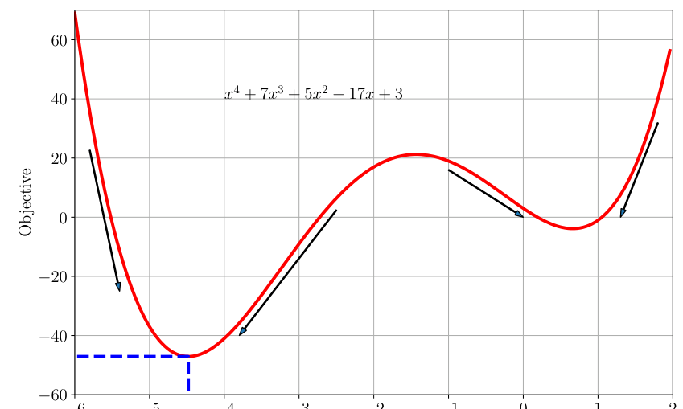
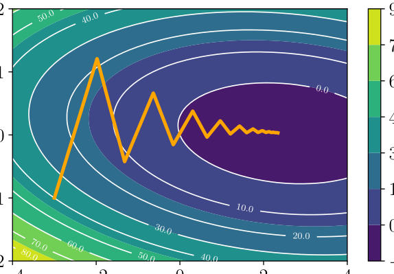
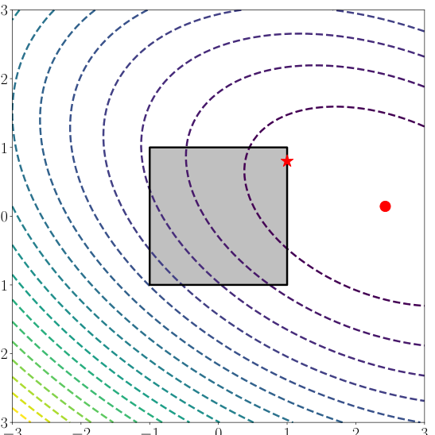
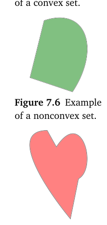
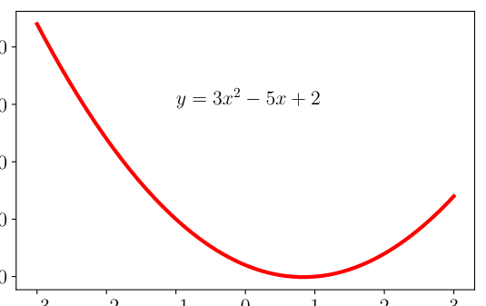
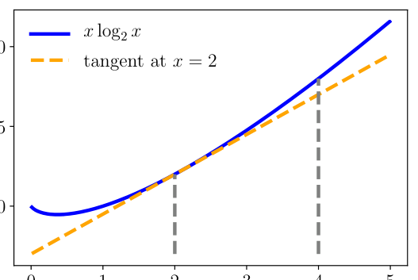
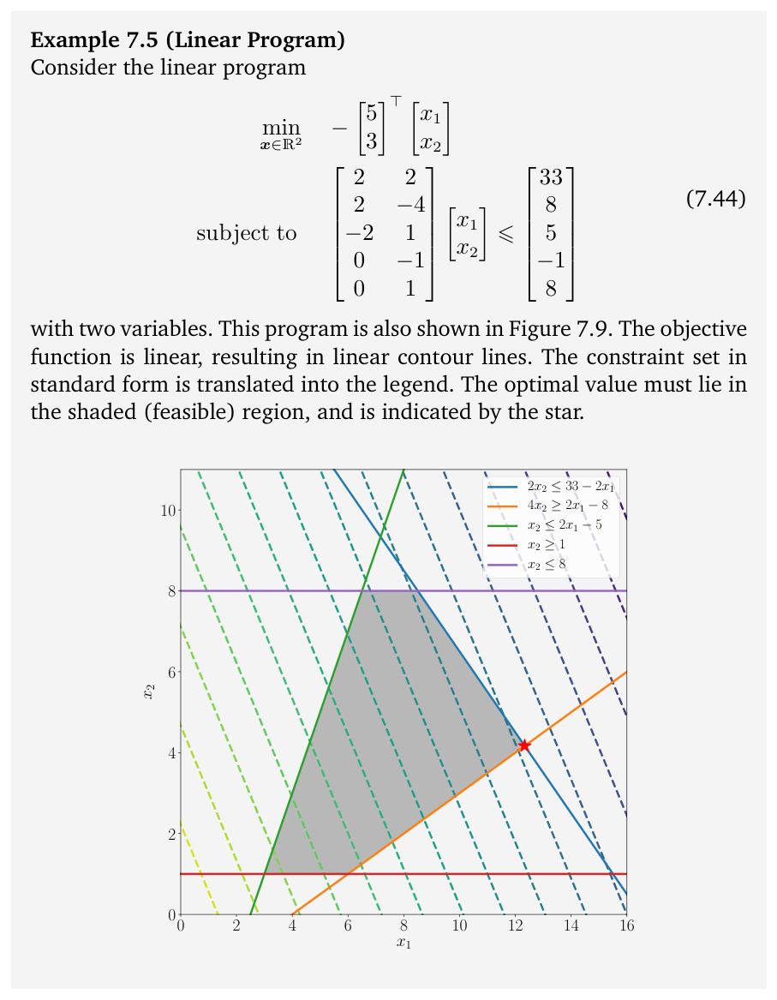

# 第 7 章 连续优化（Continuous Optimization）

> [← 返回目录](README.md)

> **Figure 7.2** Example objective function. Negative gradients are indicated by arrows, and the global minimum is indicated by the dashed blue line.

**图 7.2** 示例目标函数。负梯度由箭头指示，全局最小值由蓝色虚线指示。

> right, but not how far (this is called the step-size). Furthermore, if we had started at the right side (e.g., $x_0 = 0$) the negative gradient would have led us to the wrong minimum. Figure 7.2 illustrates the fact that for $x > -1$, the negative gradient points toward the minimum on the right of the figure, which has a larger objective value.

右，但并不知道要走多远——这称为步长（step-size）。此外，如果我们当初从右侧出发（例如 $x_0 = 0$），负梯度本会把我们引向错误的极小值。图 7.2 说明了这样一个事实：当 $x > -1$ 时，负梯度指向图中右侧的那个极小值，而它具有更大的目标函数值。

> In Section 7.3, we will learn about a class of functions, called convex functions, that do not exhibit this tricky dependency on the starting point of the optimization algorithm. For convex functions, all local minimums are global minimum. It turns out that many machine learning objective functions are designed such that they are convex, and we will see an example in Chapter 12.

在 7.3 节中，我们将学习一类称为凸函数（convex function）的函数，它们不存在这种对优化算法起始点的棘手依赖。对于凸函数，所有局部最小值都是全局最小值。事实证明，许多机器学习目标函数都被设计成凸函数，我们将在第 12 章看到这样一个例子。

> The discussion in this chapter so far was about a one-dimensional function, where we are able to visualize the ideas of gradients, descent directions, and optimal values. In the rest of this chapter we develop the same ideas in high dimensions. Unfortunately, we can only visualize the concepts in one dimension, but some concepts do not generalize directly to higher dimensions, therefore some care needs to be taken when reading.

本章到目前为止的讨论都是针对一维函数的，此时我们能够将梯度、下降方向和最优值等概念可视化。在本章余下的部分，我们将在高维情形中发展同样的思想。遗憾的是，我们只能在一维情形下将这些概念可视化，而且有些概念并不能直接推广到高维情形，因此阅读时需要多加小心。

## 7.1 利用梯度下降进行优化（Optimization Using Gradient Descent）

> We now consider the problem of solving for the minimum of a real-valued function

现在我们考虑求实值函数最小值的问题

$$
\min_{\boldsymbol{x}} f(\boldsymbol{x}) \,,
\tag{7.4}
$$

> where $f : \mathbb{R}^d \to \mathbb{R}$ is an objective function that captures the machine learning problem at hand. We assume that our function $f$ is differentiable, and we are unable to analytically find a solution in closed form.

其中 $f : \mathbb{R}^d \to \mathbb{R}$ 是刻画当前机器学习问题的目标函数（objective function）。我们假设函数 $f$ 是可微的，并且无法通过解析方法求得闭式解（closed-form solution）。

> Gradient descent is a first-order optimization algorithm. To find a local minimum of a function using gradient descent, one takes steps proportional to the negative of the gradient of the function at the current point. Recall from Section 5.1 that the gradient points in the direction of the steepest ascent. Another useful intuition is to consider the set of lines where the function is at a certain value ($f(\boldsymbol{x}) = c$ for some value $c \in \mathbb{R}$), which are known as the contour lines. The gradient points in a direction that is orthogonal to the contour lines of the function we wish to optimize.

梯度下降（gradient descent）是一种一阶优化算法。使用梯度下降求函数的局部最小值时，每一步都沿函数在当前点处梯度的负方向移动，步长与该梯度成比例。回忆 5.1 节的内容，梯度指向最陡上升的方向。另一个有用的直观理解是考虑函数取某一特定值的直线集合（$f(\boldsymbol{x}) = c$，其中 $c \in \mathbb{R}$），这些直线称为等值线（contour lines）。梯度所指的方向与我们想要优化的函数的等值线正交。

> Let us consider multivariate functions. Imagine a surface (described by the function $f(\boldsymbol{x})$) with a ball starting at a particular location $\boldsymbol{x}_0$. When the ball is released, it will move downhill in the direction of steepest descent. Gradient descent exploits the fact that $f(\boldsymbol{x}_0)$ decreases fastest if one moves from $\boldsymbol{x}_0$ in the direction of the negative gradient $-((\nabla f)(\boldsymbol{x}_0))^{\top}$ of $f$ at $\boldsymbol{x}_0$. We assume in this book that the functions are differentiable, and refer the reader to more general settings in Section 7.4. Then, if

让我们考虑多元函数。设想一个由函数 $f(\boldsymbol{x})$ 描述的曲面，一个小球从某个特定位置 $\boldsymbol{x}_0$ 出发。小球被释放后，将沿最陡下降方向滚落。梯度下降利用了这样一个事实：如果从 $\boldsymbol{x}_0$ 出发，沿 $f$ 在 $\boldsymbol{x}_0$ 处的负梯度 $-((\nabla f)(\boldsymbol{x}_0))^{\top}$ 方向移动，$f(\boldsymbol{x}_0)$ 下降得最快。在本书中我们假设函数是可微的，更一般的情形请读者参阅 7.4 节。那么，如果

$$
\boldsymbol{x}_1 = \boldsymbol{x}_0 - \gamma ((\nabla f)(\boldsymbol{x}_0))^{\top}
\tag{7.5}
$$

> for a small step-size $\gamma \geqslant 0$, then $f(\boldsymbol{x}_1) \leqslant f(\boldsymbol{x}_0)$. Note that we use the transpose for the gradient since otherwise the dimensions will not work out.

对于很小的步长 $\gamma \geqslant 0$，有 $f(\boldsymbol{x}_1) \leqslant f(\boldsymbol{x}_0)$。注意，我们对梯度使用了转置，否则维度将无法匹配。

> This observation allows us to define a simple gradient descent algorithm: If we want to find a local optimum $f(\boldsymbol{x}^*)$ of a function $f : \mathbb{R}^n \to \mathbb{R}$, $\boldsymbol{x} \mapsto f(\boldsymbol{x})$, we start with an initial guess $\boldsymbol{x}_0$ of the parameters we wish to optimize and then iterate according to

这一观察使我们能够定义一个简单的梯度下降算法：如果想求函数 $f : \mathbb{R}^n \to \mathbb{R}$、$\boldsymbol{x} \mapsto f(\boldsymbol{x})$ 的局部最优值 $f(\boldsymbol{x}^*)$，我们先对想要优化的参数给出一个初始猜测 $\boldsymbol{x}_0$，然后按照下式迭代

$$
\boldsymbol{x}_{i+1} = \boldsymbol{x}_i - \gamma_i ((\nabla f)(\boldsymbol{x}_i))^{\top} \,.
\tag{7.6}
$$

> For suitable step-size $\gamma_i$, the sequence $f(\boldsymbol{x}_0) \geqslant f(\boldsymbol{x}_1) \geqslant \ldots$ converges to a local minimum.

对于合适的步长 $\gamma_i$，序列 $f(\boldsymbol{x}_0) \geqslant f(\boldsymbol{x}_1) \geqslant \ldots$ 收敛到一个局部最小值。

> **Example 7.1**

**例 7.1**

> Consider a quadratic function in two dimensions

考虑二维情形下的一个二次函数

$$
f\!\left( \begin{pmatrix} x_1 \\ x_2 \end{pmatrix} \right) = \frac{1}{2} \begin{pmatrix} x_1 \\ x_2 \end{pmatrix}^{\top} \begin{pmatrix} 2 & 1 \\ 1 & 20 \end{pmatrix} \begin{pmatrix} x_1 \\ x_2 \end{pmatrix} - \begin{pmatrix} 5 \\ 3 \end{pmatrix}^{\top} \begin{pmatrix} x_1 \\ x_2 \end{pmatrix}
\tag{7.7}
$$

> with gradient

其梯度为

$$
\nabla f\!\left( \begin{pmatrix} x_1 \\ x_2 \end{pmatrix} \right) = \begin{pmatrix} x_1 \\ x_2 \end{pmatrix}^{\top} \begin{pmatrix} 2 & 1 \\ 1 & 20 \end{pmatrix} - \begin{pmatrix} 5 \\ 3 \end{pmatrix}^{\top} \,.
\tag{7.8}
$$

> Starting at the initial location $\boldsymbol{x}_0 = [-3, -1]^{\top}$, we iteratively apply (7.6) to obtain a sequence of estimates that converge to the minimum value

从初始位置 $\boldsymbol{x}_0 = [-3, -1]^{\top}$ 出发，我们反复应用 (7.6)，得到一列收敛到最小值的估计

> **Figure 7.3** Gradient descent on a two-dimensional quadratic surface (shown as a heatmap). See Example 7.1 for a description.

**图 7.3** 二维二次曲面（以热图显示）上的梯度下降。描述见例 7.1。

> (illustrated in Figure 7.3). We can see (both from the figure and by plugging $\boldsymbol{x}_0$ into (7.8) with $\gamma = 0.085$) that the negative gradient at $\boldsymbol{x}_0$ points north and east, leading to $\boldsymbol{x}_1 = [-1.98, 1.21]^{\top}$. Repeating that argument gives us $\boldsymbol{x}_2 = [-1.32, -0.42]^{\top}$, and so on.

（如图 7.3 所示）。我们可以看到（无论是从图中，还是将 $\boldsymbol{x}_0$ 代入 (7.8) 并取 $\gamma = 0.085$），$\boldsymbol{x}_0$ 处的负梯度指向北方和东方，由此得到 $\boldsymbol{x}_1 = [-1.98, 1.21]^{\top}$。重复这一论证，可得 $\boldsymbol{x}_2 = [-1.32, -0.42]^{\top}$，依此类推。

> **Remark.** Gradient descent can be relatively slow close to the minimum: Its asymptotic rate of convergence is inferior to many other methods. Using the ball rolling down the hill analogy, when the surface is a long, thin valley, the problem is poorly conditioned (Trefethen and Bau III, 1997). For poorly conditioned convex problems, gradient descent increasingly “zigzags” as the gradients point nearly orthogonally to the shortest direction to a minimum point; see Figure 7.3. ♢

**评注.** 梯度下降在接近最小值处可能相对较慢：其渐近收敛速度劣于许多其他方法。沿用小球滚下山坡的类比，当曲面是一个细长的山谷时，该问题是病态的（poorly conditioned）(Trefethen and Bau III, 1997)。对于病态的凸问题，梯度下降会越来越呈“之字形”行进，因为梯度几乎正交于指向最小值点的最短方向；参见图 7.3。♢

### 7.1.1 步长（Step-size）

> As mentioned earlier, choosing a good step-size is important in gradient descent. If the step-size is too small, gradient descent can be slow. If the step-size is chosen too large, gradient descent can overshoot, fail to converge, or even diverge. We will discuss the use of momentum in the next section. It is a method that smoothes out erratic behavior of gradient updates and dampens oscillations.

如前所述，在梯度下降中选择一个好的步长十分重要。如果步长太小，梯度下降可能很慢；如果步长选得太大，梯度下降可能过冲、无法收敛，甚至发散。我们将在下一节讨论动量（momentum）的使用。动量是一种能够平滑梯度更新的不规则行为并抑制振荡的方法。

> Adaptive gradient methods rescale the step-size at each iteration, depending on local properties of the function. There are two simple heuristics (Toussaint, 2012):

自适应梯度方法会根据函数的局部性质，在每次迭代时重新调整步长。有两种简单的启发式方法（Toussaint, 2012）：

> When the function value increases after a gradient step, the step-size was too large. Undo the step and decrease the step-size. When the function value decreases the step could have been larger. Try to increase the step-size.

当一次梯度迭代之后函数值增大时，说明步长取得过大：撤销这一步并减小步长。当函数值减小时，说明这一步本可以更大：尝试增大步长。

> Although the “undo” step seems to be a waste of resources, using this heuristic guarantees monotonic convergence.

尽管“撤销”这一步看似浪费资源，但使用这一启发式方法能够保证单调收敛。

> **Example 7.2** (Solving a Linear Equation System) When we solve linear equations of the form $\boldsymbol{A}\boldsymbol{x} = \boldsymbol{b}$, in practice we solve $\boldsymbol{A}\boldsymbol{x} - \boldsymbol{b} = \boldsymbol{0}$ approximately by finding $\boldsymbol{x}^*$ that minimizes the squared error

**例 7.2**（求解线性方程组，Solving a Linear Equation System）当我们求解形如 $\boldsymbol{A}\boldsymbol{x} = \boldsymbol{b}$ 的线性方程组时，实践中我们通过寻找使下述平方误差（squared error）最小化的 $\boldsymbol{x}^*$ 来近似求解 $\boldsymbol{A}\boldsymbol{x} - \boldsymbol{b} = \boldsymbol{0}$：

$$
\|\boldsymbol{A}\boldsymbol{x} - \boldsymbol{b}\|^2 = (\boldsymbol{A}\boldsymbol{x} - \boldsymbol{b})^{\top} (\boldsymbol{A}\boldsymbol{x} - \boldsymbol{b})
\tag{7.9}
$$

> if we use the Euclidean norm. The gradient of (7.9) with respect to $\boldsymbol{x}$ is

这里使用的是欧几里得范数。(7.9) 关于 $\boldsymbol{x}$ 的梯度为

$$
\nabla_{\boldsymbol{x}} = 2 (\boldsymbol{A}\boldsymbol{x} - \boldsymbol{b})^{\top} \boldsymbol{A} \,.
\tag{7.10}
$$

> We can use this gradient directly in a gradient descent algorithm. However, for this particular special case, it turns out that there is an analytic solution, which can be found by setting the gradient to zero. We will see more on solving squared error problems in Chapter 9.

我们可以将这个梯度直接用于梯度下降算法。然而，对于这一特殊情形，事实证明存在解析解，可以通过令梯度为零求得。关于求解平方误差问题的更多内容，我们将在第 9 章讨论。

> **Remark.** When applied to the solution of linear systems of equations $\boldsymbol{A}\boldsymbol{x} = \boldsymbol{b}$, gradient descent may converge slowly. The speed of convergence of gradient descent is dependent on the condition number $\kappa = \sigma_{\max}(\boldsymbol{A}) / \sigma_{\min}(\boldsymbol{A})$, which is the ratio of the maximum to the minimum singular value (Section 4.5) of $\boldsymbol{A}$. The condition number essentially measures the ratio of the most curved direction versus the least curved direction, which corresponds to our imagery that poorly conditioned problems are long, thin valleys: They are very curved in one direction, but very flat in the other. Instead of directly solving $\boldsymbol{A}\boldsymbol{x} = \boldsymbol{b}$, one could instead solve $\boldsymbol{P}^{-1}(\boldsymbol{A}\boldsymbol{x} - \boldsymbol{b}) = \boldsymbol{0}$, where $\boldsymbol{P}$ is called the preconditioner. The goal is to design $\boldsymbol{P}^{-1}$ such that $\boldsymbol{P}^{-1}\boldsymbol{A}$ has a better condition number, but at the same time $\boldsymbol{P}^{-1}$ is easy to compute. For further information on gradient descent, preconditioning, and convergence we refer to Boyd and Vandenberghe (2004, chapter 9). ♢

**评注.** 将梯度下降应用于线性方程组 $\boldsymbol{A}\boldsymbol{x} = \boldsymbol{b}$ 的求解时，其收敛可能很缓慢。梯度下降的收敛速度取决于条件数（condition number）$\kappa = \sigma_{\max}(\boldsymbol{A}) / \sigma_{\min}(\boldsymbol{A})$，即 $\boldsymbol{A}$ 的最大奇异值与最小奇异值（4.5 节）之比。条件数本质上衡量的是最弯曲方向与最平坦方向之比，这与我们心中病态问题形如细长山谷的图景相符：它们在一个方向上弯曲得很厉害，而在另一个方向上则非常平坦。与其直接求解 $\boldsymbol{A}\boldsymbol{x} = \boldsymbol{b}$，不如转而求解 $\boldsymbol{P}^{-1}(\boldsymbol{A}\boldsymbol{x} - \boldsymbol{b}) = \boldsymbol{0}$，其中 $\boldsymbol{P}$ 称为预条件子（preconditioner）。设计 $\boldsymbol{P}^{-1}$ 的目标是使 $\boldsymbol{P}^{-1}\boldsymbol{A}$ 具有更好的条件数，同时 $\boldsymbol{P}^{-1}$ 又易于计算。关于梯度下降、预条件化与收敛性的更多信息，可参阅 Boyd and Vandenberghe (2004, chapter 9)。♢

### 7.1.2 带动量的梯度下降（Gradient Descent With Momentum）

> As illustrated in Figure 7.3, the convergence of gradient descent may be very slow if the curvature of the optimization surface is such that there are regions that are poorly scaled. The curvature is such that the gradient descent steps hops between the walls of the valley and approaches the optimum in small steps. The proposed tweak to improve convergence is to give gradient descent some memory. Goh (2017) wrote an intuitive blog post on gradient descent with momentum.

如图 7.3 所示，如果优化曲面的曲率使得存在缩放不佳的区域，梯度下降的收敛可能非常缓慢。这种曲率使得梯度下降的步子在山谷的两壁之间来回跳跃，并以很小的步幅逼近最优点。为改善收敛而提出的改进方法是赋予梯度下降一定的记忆。Goh (2017) 曾就带动量的梯度下降撰写过一篇直观易懂的博客文章。

> Gradient descent with momentum (Rumelhart et al., 1986) is a method that introduces an additional term to remember what happened in the previous iteration. This memory dampens oscillations and smoothes out the gradient updates. Continuing the ball analogy, the momentum term emulates the phenomenon of a heavy ball that is reluctant to change directions. The idea is to have a gradient update with memory to implement a moving average. The momentum-based method remembers the update $\Delta \boldsymbol{x}_i$ at each iteration $i$ and determines the next update as a linear combination of the current and previous gradients

带动量的梯度下降（Rumelhart et al., 1986）通过引入一个额外的项来记住上一次迭代中发生的情况。这种记忆能够抑制振荡并平滑梯度更新。延续小球的类比，动量项模拟了重球不愿改变方向的现象。其思想是实现一种带记忆的梯度更新，即移动平均。基于动量的方法会记住每次迭代 $i$ 的更新量 $\Delta \boldsymbol{x}_i$，并把下一次更新确定为当前梯度与先前梯度的线性组合

$$
\boldsymbol{x}_{i+1} = \boldsymbol{x}_i - \gamma_i ((\nabla f)(\boldsymbol{x}_i))^{\top} + \alpha \Delta \boldsymbol{x}_i
\tag{7.11}
$$

$$
\Delta \boldsymbol{x}_i = \boldsymbol{x}_i - \boldsymbol{x}_{i-1} = \alpha \Delta \boldsymbol{x}_{i-1} - \gamma_{i-1} ((\nabla f)(\boldsymbol{x}_{i-1}))^{\top} \,,
\tag{7.12}
$$

> where $\alpha \in [0, 1]$. Sometimes we will only know the gradient approximately. In such cases, the momentum term is useful since it averages out different noisy estimates of the gradient. One particularly useful way to obtain an approximate gradient is by using a stochastic approximation, which we discuss next.

其中 $\alpha \in [0, 1]$。有时我们只能近似地知道梯度。在这种情况下，动量项非常有用，因为它能对梯度的各种含噪估计取平均。获得近似梯度的一种特别有用的方式是使用随机近似，我们将在下一节讨论。

### 7.1.3 随机梯度下降（Stochastic Gradient Descent）

> Computing the gradient can be very time consuming. However, often it is possible to find a “cheap” approximation of the gradient. Approximating the gradient is still useful as long as it points in roughly the same direction as the true gradient. Stochastic gradient descent (often shortened as SGD) is a stochastic approximation of the gradient descent method for minimizing an objective function that is written as a sum of differentiable functions. The word stochastic here refers to the fact that we acknowledge that we do not know the gradient precisely, but instead only know a noisy approximation to it. By constraining the probability distribution of the approximate gradients, we can still theoretically guarantee that SGD will converge.

计算梯度可能非常耗时。然而，通常有可能找到梯度的“廉价”近似。只要近似梯度指向的方向与真实梯度大致相同，对梯度作近似就仍然是有用的。随机梯度下降（stochastic gradient descent，常缩写为 SGD）是梯度下降方法的一种随机近似，用于最小化可写为若干可微函数之和的目标函数。这里的“随机”一词是指：我们承认并不能精确地知道梯度，而只知道它的一个含噪近似。通过约束近似梯度的概率分布，我们在理论上仍然能够保证 SGD 收敛。

> In machine learning, given $n = 1, \ldots, N$ data points, we often consider objective functions that are the sum of the losses $L_n$ incurred by each example $n$. In mathematical notation, we have the form

在机器学习中，给定 $n = 1, \ldots, N$ 个数据点，我们常常考虑的目标函数是每个样本 $n$ 所造成的损失 $L_n$ 之和。用数学记号表示，其形式为

$$
L(\boldsymbol{\theta}) = \sum_{n=1}^{N} L_n(\boldsymbol{\theta}) \,,
\tag{7.13}
$$

> where $\boldsymbol{\theta}$ is the vector of parameters of interest, i.e., we want to find $\boldsymbol{\theta}$ that minimizes $L$. An example from regression (Chapter 9) is the negative loglikelihood, which is expressed as a sum over log-likelihoods of individual examples so that

其中 $\boldsymbol{\theta}$ 是我们所关心的参数向量，也就是说，我们想找到使 $L$ 最小化的 $\boldsymbol{\theta}$。取自回归（第 9 章）的一个例子是负对数似然（negative log-likelihood），它表示为各个样本的对数似然之和，即

$$
L(\boldsymbol{\theta}) = -\sum_{n=1}^{N} \log p(\boldsymbol{y}_n \mid \boldsymbol{x}_n, \boldsymbol{\theta}) \,,
\tag{7.14}
$$

> where $\boldsymbol{x}_n \in \mathbb{R}^D$ are the training inputs, $\boldsymbol{y}_n$ are the training targets, and $\boldsymbol{\theta}$ are the parameters of the regression model.

其中 $\boldsymbol{x}_n \in \mathbb{R}^D$ 为训练输入，$\boldsymbol{y}_n$ 为训练目标，$\boldsymbol{\theta}$ 为回归模型的参数。

> Standard gradient descent, as introduced previously, is a “batch” optimization method, i.e., optimization is performed using the full training set by updating the vector of parameters according to

如前文所述，标准梯度下降是一种“批量”（batch）优化方法，也就是说，优化使用完整的训练集进行，并按照下式更新参数向量

$$
\boldsymbol{\theta}_{i+1} = \boldsymbol{\theta}_i - \gamma_i (\nabla L(\boldsymbol{\theta}_i))^{\top} = \boldsymbol{\theta}_i - \gamma_i \sum_{n=1}^{N} (\nabla L_n(\boldsymbol{\theta}_i))^{\top}
\tag{7.15}
$$

> for a suitable step-size parameter $\gamma_i$. Evaluating the sum gradient may require expensive evaluations of the gradients from all individual functions $L_n$. When the training set is enormous and/or no simple formulas exist, evaluating the sums of gradients becomes very expensive.

其中 $\gamma_i$ 为合适的步长参数。计算和式的梯度可能需要对所有单个函数 $L_n$ 的梯度进行代价高昂的计算。当训练集非常庞大和/或不存在简单的公式时，计算梯度之和会变得非常昂贵。

> Consider the term $\sum_{n=1}^{N}(\nabla L_n(\boldsymbol{\theta}_i))$ in (7.15). We can reduce the amount of computation by taking a sum over a smaller set of $L_n$. In contrast to batch gradient descent, which uses all $L_n$ for $n = 1, \ldots, N$, we randomly choose a subset of $L_n$ for mini-batch gradient descent. In the extreme case, we randomly select only a single $L_n$ to estimate the gradient. The key insight about why taking a subset of data is sensible is to realize that for gradient descent to converge, we only require that the gradient is an unbiased estimate of the true gradient. In fact the term $\sum_{n=1}^{N}(\nabla L_n(\boldsymbol{\theta}_i))$ in (7.15) is an empirical estimate of the expected value (Section 6.4.1) of the gradient. Therefore, any other unbiased empirical estimate of the expected value, for example using any subsample of the data, would suffice for convergence of gradient descent.

考虑 (7.15) 中的项 $\sum_{n=1}^{N}(\nabla L_n(\boldsymbol{\theta}_i))$。我们可以对较小一组 $L_n$ 求和，从而减少计算量。批量梯度下降（batch gradient descent）使用所有的 $L_n$（$n = 1, \ldots, N$）；与之不同，小批量梯度下降（mini-batch gradient descent）随机选取 $L_n$ 的一个子集。在极端情况下，我们只随机选取单个 $L_n$ 来估计梯度。为什么取数据的一个子集是合理的？关键在于认识到：要使梯度下降收敛，我们只要求梯度是真实梯度的一个无偏估计。事实上，(7.15) 中的项 $\sum_{n=1}^{N}(\nabla L_n(\boldsymbol{\theta}_i))$ 正是梯度的期望值（6.4.1 节）的一个经验估计。因此，该期望值的任何其他无偏经验估计——例如使用数据的任意子样本——都足以使梯度下降收敛。

> **Remark.** When the learning rate decreases at an appropriate rate, and subject to relatively mild assumptions, stochastic gradient descent converges almost surely to local minimum (Bottou, 1998). ♢

**评注.** 当学习率以适当的速率递减时，在相对温和的假设条件下，随机梯度下降几乎必然收敛到局部最小值 (Bottou, 1998)。♢

> Why should one consider using an approximate gradient? A major reason is practical implementation constraints, such as the size of central processing unit (CPU)/graphics processing unit (GPU) memory or limits on computational time. We can think of the size of the subset used to estimate the gradient in the same way that we thought of the size of a sample when estimating empirical means (Section 6.4.1). Large mini-batch sizes will provide accurate estimates of the gradient, reducing the variance in the parameter update. Furthermore, large mini-batches take advantage of highly optimized matrix operations in vectorized implementations of the cost and gradient. The reduction in variance leads to more stable convergence, but each gradient calculation will be more expensive.

为什么需要考虑使用近似梯度？一个主要原因是实际实现中的限制，例如中央处理器（CPU）/图形处理器（GPU）的内存大小，或者计算时间的约束。对于用于估计梯度的子集的大小，我们可以采用与估计经验均值（6.4.1 节）时看待样本大小相同的方式来理解。较大的小批量规模会给出对梯度的准确估计，降低参数更新中的方差。此外，较大的小批量还能在代价与梯度的向量化实现中充分利用高度优化的矩阵运算。方差的降低会带来更稳定的收敛，但每次梯度计算的开销也更大。

> In contrast, small mini-batches are quick to estimate. If we keep the mini-batch size small, the noise in our gradient estimate will allow us to get out of some bad local optima, which we may otherwise get stuck in. In machine learning, optimization methods are used for training by minimizing an objective function on the training data, but the overall goal is to improve generalization performance (Chapter 8). Since the goal in machine learning does not necessarily need a precise estimate of the minimum of the objective function, approximate gradients using mini-batch approaches have been widely used. Stochastic gradient descent is very effective in large-scale machine learning problems (Bottou et al., 2018),

相比之下，小批量估计起来很快。如果我们把小批量规模保持得很小，梯度估计中的噪声将使我们能够摆脱一些糟糕的局部最优，否则我们可能会深陷其中。在机器学习中，优化方法通过最小化训练数据上的目标函数来完成训练，但整体目标是提升泛化性能（第 8 章）。既然机器学习的目标并不一定需要对目标函数最小值的精确估计，基于小批量方法的近似梯度便得到了广泛应用。随机梯度下降在大规模机器学习问题中非常有效 (Bottou et al., 2018)，

> **Figure 7.4** Illustration of constrained optimization. The unconstrained problem (indicated by the contour lines) has a minimum on the right side (indicated by the circle). The box constraints ($-1 \leqslant x \leqslant 1$ and $-1 \leqslant y \leqslant 1$) require that the optimal solution is within the box, resulting in an optimal value indicated by the star.

**图 7.4** 约束优化示意图。无约束问题（由等高线表示）的最小值位于右侧（用圆圈表示）。盒式约束（$-1 \leqslant x \leqslant 1$ 与 $-1 \leqslant y \leqslant 1$）要求最优解位于盒内，由此得到由星号表示的最优值。

> such as training deep neural networks on millions of images (Dean et al., 2012), topic models (Hoffman et al., 2013), reinforcement learning (Mnih et al., 2015), or training of large-scale Gaussian process models (Hensman et al., 2013; Gal et al., 2014).

例如在数百万张图像上训练深度神经网络 (Dean et al., 2012)、主题模型 (Hoffman et al., 2013)、强化学习 (Mnih et al., 2015)，或者训练大规模高斯过程模型 (Hensman et al., 2013; Gal et al., 2014)。

## 7.2 约束优化与拉格朗日乘子（Constrained Optimization and Lagrange Multipliers）

> In the previous section, we considered the problem of solving for the minimum of a function

上一节中，我们考虑了求解函数最小值的问题

$$
\min_x f(x) \,,
\tag{7.16}
$$

> where $f : \mathbb{R}^D \to \mathbb{R}$.

其中 $f : \mathbb{R}^D \to \mathbb{R}$。

> In this section, we have additional constraints. That is, for real-valued functions $g_i : \mathbb{R}^D \to \mathbb{R}$ for $i = 1, \ldots, m$, we consider the constrained optimization problem (see Figure 7.4 for an illustration)

本节中，我们增加了额外的约束。也就是说，对于实值函数 $g_i : \mathbb{R}^D \to \mathbb{R}$（$i = 1, \ldots, m$），我们考虑如下约束优化（constrained optimization）问题（示意见图 7.4）

$$
\begin{aligned}
\min_x \quad & f(x) \\
\text{subject to} \quad & g_i(x) \leqslant 0 \quad \text{for all } i = 1, \ldots, m \,.
\end{aligned}
\tag{7.17}
$$

> It is worth pointing out that the functions $f$ and $g_i$ could be non-convex in general, and we will consider the convex case in the next section.

值得指出的是，函数 $f$ 与 $g_i$ 一般可能是非凸（non-convex）的，我们将在下一节考虑凸的情形。

> One obvious, but not very practical, way of converting the constrained problem (7.17) into an unconstrained one is to use an indicator function

要把约束问题 (7.17) 转化为无约束问题，一种显而易见但并不太实用的方法是使用指示函数（indicator function）

$$
J(x) = f(x) + \sum_{i=1}^{m} \mathbb{1}(g_i(x)) \,,
\tag{7.18}
$$

> where $\mathbb{1}(z)$ is an infinite step function

其中 $\mathbb{1}(z)$ 是一个无穷阶跃函数（step function）

$$
\mathbb{1}(z) =
\begin{cases}
0 & \text{if } z \leqslant 0 \\
\infty & \text{otherwise}
\end{cases} \,.
\tag{7.19}
$$

> This gives infinite penalty if the constraint is not satisfied, and hence would provide the same solution. However, this infinite step function is equally difficult to optimize. We can overcome this difficulty by introducing Lagrange multipliers. The idea of Lagrange multipliers is to replace the step function with a linear function.

如果约束不被满足，这会带来无穷大的惩罚，因而会给出相同的解。然而，这个无穷阶跃函数同样难以优化。我们可以通过引入拉格朗日乘子（Lagrange multiplier）来克服这一困难。拉格朗日乘子的思想是用一个线性函数替换阶跃函数。

> We associate to problem (7.17) the Lagrangian by introducing the Lagrange multipliers $\lambda_i \geqslant 0$ corresponding to each inequality constraint respectively (Boyd and Vandenberghe, 2004, chapter 4) so that

我们通过引入分别对应于每个不等式约束的拉格朗日乘子 $\lambda_i \geqslant 0$（Boyd and Vandenberghe, 2004, chapter 4），为问题 (7.17) 构造拉格朗日函数（Lagrangian），使得

$$
\begin{aligned}
L(x, \lambda) &= f(x) + \sum_{i=1}^{m} \lambda_i g_i(x) \tag{7.20a} \\
&= f(x) + \lambda^\top g(x) \,,
\end{aligned}
\tag{7.20b}
$$

> where in the last line we have concatenated all constraints $g_i(x)$ into a vector $g(x)$, and all the Lagrange multipliers into a vector $\lambda \in \mathbb{R}^m$.

其中在最后一行，我们把所有约束 $g_i(x)$ 拼接成向量 $g(x)$，并把所有拉格朗日乘子拼接成向量 $\lambda \in \mathbb{R}^m$。

> We now introduce the idea of Lagrangian duality. In general, duality in optimization is the idea of converting an optimization problem in one set of variables $x$ (called the primal variables), into another optimization problem in a different set of variables $\lambda$ (called the dual variables). We introduce two different approaches to duality: In this section, we discuss Lagrangian duality; in Section 7.3.3, we discuss Legendre-Fenchel duality.

现在我们引入拉格朗日对偶（Lagrangian duality）的思想。一般而言，优化中的对偶（duality）指的是这样一个想法：把一个以一组变量 $x$（称为原始变量（primal variables））表示的优化问题，转化为一个以另一组变量 $\lambda$（称为对偶变量（dual variables））表示的优化问题。我们介绍两种不同的对偶方法：本节讨论拉格朗日对偶；7.3.3 节讨论 Legendre-Fenchel 对偶。

> **Definition 7.1.** The problem in (7.17)

**定义 7.1.** (7.17) 中的问题

$$
\begin{aligned}
\min_x \quad & f(x) \\
\text{subject to} \quad & g_i(x) \leqslant 0 \quad \text{for all } i = 1, \ldots, m
\end{aligned}
\tag{7.21}
$$

> is known as the primal problem, corresponding to the primal variables $x$.

称为原始问题（primal problem），对应于原始变量 $x$。

> The associated Lagrangian dual problem is given by

与之对应的拉格朗日对偶问题（Lagrangian dual problem）由下式给出

$$
\begin{aligned}
\max_{\lambda \in \mathbb{R}^m} \quad & D(\lambda) \\
\text{subject to} \quad & \lambda \geqslant 0 \,,
\end{aligned}
\tag{7.22}
$$

> where $\lambda$ are the dual variables and $D(\lambda) = \min_{x \in \mathbb{R}^d} L(x, \lambda)$.

其中 $\lambda$ 为对偶变量，且 $D(\lambda) = \min_{x \in \mathbb{R}^d} L(x, \lambda)$。

> **Remark.** In the discussion of Definition 7.1, we use two concepts that are also of independent interest (Boyd and Vandenberghe, 2004).

**评注.** 在定义 7.1 的讨论中，我们用到两个本身也值得独立关注的概念 (Boyd and Vandenberghe, 2004)。

> First is the minimax inequality, which says that for any function with two arguments $\phi(x, y)$, the maximin is less than the minimax, i.e.,

第一个是极小极大不等式（minimax inequality），它说的是：对于任意具有两个自变量的函数 $\phi(x, y)$，极大极小（maximin）小于极小极大（minimax），即

$$
\max_y \min_x \phi(x, y) \leqslant \min_x \max_y \phi(x, y) \,.
\tag{7.23}
$$

> This inequality can be proved by considering the inequality

该不等式可以通过考虑如下不等式来证明

$$
\min_x \phi(x, y) \leqslant \max_y \phi(x, y)
\tag{7.24}
$$

> for all $x, y$.

对所有 $x, y$ 成立。

> Note that taking the maximum over $y$ of the left-hand side of (7.24) maintains the inequality since the inequality is true for all $y$. Similarly, we can take the minimum over $x$ of the right-hand side of (7.24) to obtain (7.23).

注意，对 (7.24) 的左边关于 $y$ 取最大值仍能保持不等式成立，因为该不等式对所有 $y$ 都为真。类似地，我们可以对 (7.24) 的右边关于 $x$ 取最小值，从而得到 (7.23)。

> The second concept is weak duality, which uses (7.23) to show that primal values are always greater than or equal to dual values. This is described in more detail in (7.27). ♢

第二个概念是弱对偶（weak duality），它利用 (7.23) 表明原始值总是大于或等于对偶值。这将在 (7.27) 中更详细地描述。♢

> Recall that the difference between $J(x)$ in (7.18) and the Lagrangian in (7.20b) is that we have relaxed the indicator function to a linear function. Therefore, when $\lambda \geqslant 0$, the Lagrangian $L(x, \lambda)$ is a lower bound of $J(x)$. Hence, the maximum of $L(x, \lambda)$ with respect to $\lambda$ is

回顾一下，(7.18) 中的 $J(x)$ 与 (7.20b) 中拉格朗日函数的差别在于，我们把指示函数放宽成了线性函数。因此，当 $\lambda \geqslant 0$ 时，拉格朗日函数 $L(x, \lambda)$ 是 $J(x)$ 的一个下界。于是，$L(x, \lambda)$ 关于 $\lambda$ 的最大值为

$$
J(x) = \max_{\lambda \geqslant 0} L(x, \lambda) \,.
\tag{7.25}
$$

> Recall that the original problem was minimizing $J(x)$,

回顾一下，原始问题是最小化 $J(x)$，

$$
\min_{x \in \mathbb{R}^d} \max_{\lambda \geqslant 0} L(x, \lambda) \,.
\tag{7.26}
$$

> By the minimax inequality (7.23), it follows that swapping the order of the minimum and maximum results in a smaller value, i.e.,

由极小极大不等式 (7.23) 可知，交换最小与最大的顺序会得到一个更小的值，即

$$
\min_{x \in \mathbb{R}^d} \max_{\lambda \geqslant 0} L(x, \lambda) \geqslant \max_{\lambda \geqslant 0} \min_{x \in \mathbb{R}^d} L(x, \lambda) \,.
\tag{7.27}
$$

> This is also known as weak duality. Note that the inner part of the right-hand side is the dual objective function $D(\lambda)$ and the definition follows.

这也称为弱对偶。注意，不等式右边的内层部分正是对偶目标函数（dual objective function）$D(\lambda)$，由此便得到上述定义。

> In contrast to the original optimization problem, which has constraints, $\min_{x \in \mathbb{R}^d} L(x, \lambda)$ is an unconstrained optimization problem for a given value of $\lambda$. If solving $\min_{x \in \mathbb{R}^d} L(x, \lambda)$ is easy, then the overall problem is easy to solve. We can see this by observing from (7.20b) that $L(x, \lambda)$ is affine with respect to $\lambda$. Therefore $\min_{x \in \mathbb{R}^d} L(x, \lambda)$ is a pointwise minimum of affine functions of $\lambda$, and hence $D(\lambda)$ is concave even though $f(\cdot)$ and $g_i(\cdot)$ may be nonconvex. The outer problem, maximization over $\lambda$, is the maximum of a concave function and can be efficiently computed.

与带有约束的原始优化问题不同，对于给定的 $\lambda$ 值，$\min_{x \in \mathbb{R}^d} L(x, \lambda)$ 是一个无约束优化问题。如果求解 $\min_{x \in \mathbb{R}^d} L(x, \lambda)$ 很容易，那么整个问题也就容易求解。由 (7.20b) 可以看出，$L(x, \lambda)$ 关于 $\lambda$ 是仿射的。因此，$\min_{x \in \mathbb{R}^d} L(x, \lambda)$ 是 $\lambda$ 的一族仿射函数的逐点最小值（pointwise minimum），从而即使 $f(\cdot)$ 与 $g_i(\cdot)$ 可能是非凸的，$D(\lambda)$ 也是凹的。外层问题，即对 $\lambda$ 的最大化，是求一个凹函数的最大值，可以高效地计算。

> Assuming $f(\cdot)$ and $g_i(\cdot)$ are differentiable, we find the Lagrange dual problem by differentiating the Lagrangian with respect to $x$, setting the differential to zero, and solving for the optimal value. We will discuss two concrete examples in Sections 7.3.1 and 7.3.2, where $f(\cdot)$ and $g_i(\cdot)$ are convex.

假设 $f(\cdot)$ 与 $g_i(\cdot)$ 可微，我们将拉格朗日函数对 $x$ 求导、令导数为零并求解最优值，即可得到拉格朗日对偶问题。我们将在 7.3.1 节和 7.3.2 节讨论两个具体例子，其中 $f(\cdot)$ 与 $g_i(\cdot)$ 都是凸的。

> **Remark (Equality Constraints).** Consider (7.17) with additional equality constraints

**评注（等式约束）.** 考虑 (7.17) 并附加如下等式约束（equality constraints）

$$
\begin{aligned}
\min_x \quad & f(x) \\
\text{subject to} \quad & g_i(x) \leqslant 0 \quad \text{for all } i = 1, \ldots, m \\
& h_j(x) = 0 \quad \text{for all } j = 1, \ldots, n \,.
\end{aligned}
\tag{7.28}
$$

> We can model equality constraints by replacing them with two inequality constraints. That is for each equality constraint $h_j(\boldsymbol{x}) = 0$ we equivalently replace it by two constraints $h_j(\boldsymbol{x}) \leqslant 0$ and $h_j(\boldsymbol{x}) \geqslant 0$. It turns out that the resulting Lagrange multipliers are then unconstrained.

我们可以用两个不等式约束来建模等式约束。也就是说，对于每个等式约束 $h_j(\boldsymbol{x}) = 0$，我们将其等价地替换为两个约束 $h_j(\boldsymbol{x}) \leqslant 0$ 与 $h_j(\boldsymbol{x}) \geqslant 0$。结果表明，由此得到的拉格朗日乘子是无约束的。

> Therefore, we constrain the Lagrange multipliers corresponding to the inequality constraints in (7.28) to be non-negative, and leave the Lagrange multipliers corresponding to the equality constraints unconstrained. ♢

因此，我们将 (7.28) 中对应于不等式约束的拉格朗日乘子约束为非负，而让对应于等式约束的拉格朗日乘子保持无约束。♢

## 7.3 凸优化（Convex Optimization）

> We focus our attention of a particularly useful class of optimization problems, where we can guarantee global optimality. When $f(\cdot)$ is a convex function, and when the constraints involving $g(\cdot)$ and $h(\cdot)$ are convex sets, this is called a convex optimization problem. In this setting, we have strong duality: The optimal solution of the dual problem is the same as the optimal solution of the primal problem. The distinction between convex functions and convex sets are often not strictly presented in machine learning literature, but one can often infer the implied meaning from context.

我们将注意力集中在一类特别有用的优化问题上，对这类问题我们可以保证全局最优性。当 $f(\cdot)$ 是凸函数，且涉及 $g(\cdot)$ 与 $h(\cdot)$ 的约束是凸集（convex set）时，这称为凸优化（convex optimization）问题。在这种情形下，我们有强对偶（strong duality）：对偶问题的最优解与原始问题的最优解相同。凸函数与凸集的区别在机器学习文献中往往没有得到严格的表述，但通常可以从上下文推断其含义。

> **Definition 7.2.** A set $C$ is a convex set if for any $\boldsymbol{x}, \boldsymbol{y} \in C$ and for any scalar $\theta$ with $0 \leqslant \theta \leqslant 1$, we have

**定义 7.2.** 一个集合 $C$ 称为凸集，如果对任意 $\boldsymbol{x}, \boldsymbol{y} \in C$ 以及任意满足 $0 \leqslant \theta \leqslant 1$ 的标量 $\theta$，都有

$$
\theta\boldsymbol{x} + (1-\theta)\boldsymbol{y} \in C \,.
\tag{7.29}
$$

> Convex functions are functions such that a straight line between any two points of the function lie above the function. Figure 7.2 shows a nonconvex function, and Figure 7.3 shows a convex function. Another convex function is shown in Figure 7.7.

凸函数是指函数上任意两点之间的直线都位于函数图像上方的函数。图 7.2 展示了一个非凸函数，图 7.3 展示了一个凸函数。另一个凸函数见图 7.7。

> Figure 7.6

图 7.6（图注原文缺失，见原书）

> **Definition 7.3.** Let function $f : \mathbb{R}^D \to \mathbb{R}$ be a function whose domain is a convex set. The function $f$ is a convex function if for all $\boldsymbol{x}, \boldsymbol{y}$ in the domain of $f$, and for any scalar $\theta$ with $0 \leqslant \theta \leqslant 1$, we have

**定义 7.3.** 设函数 $f : \mathbb{R}^D \to \mathbb{R}$ 的定义域是一个凸集。函数 $f$ 称为凸函数（convex function），如果对所有 $f$ 定义域中的 $\boldsymbol{x}, \boldsymbol{y}$ 以及任意满足 $0 \leqslant \theta \leqslant 1$ 的标量 $\theta$，都有

$$
f(\theta\boldsymbol{x} + (1-\theta)\boldsymbol{y}) \leqslant \theta f(\boldsymbol{x}) + (1-\theta)f(\boldsymbol{y}) \,.
\tag{7.30}
$$

> **Remark.** A concave function is the negative of a convex function. ♢

**评注.** 凹函数（concave function）是凸函数的负值。♢

> The constraints involving $g(\cdot)$ and $h(\cdot)$ in (7.28) truncate functions at a scalar value, resulting in sets. Another relation between convex functions and convex sets is to consider the set obtained by “filling in” a convex function. A convex function is a bowl-like object, and we imagine pouring water into it to fill it up. This resulting filled-in set, called the epigraph of the convex function, is a convex set.

(7.28) 中涉及 $g(\cdot)$ 与 $h(\cdot)$ 的约束在某个标量值处截断函数，从而得到集合。凸函数与凸集之间的另一种联系是考虑通过“填满”一个凸函数所得到的集合。凸函数像一个碗状物体，我们可以想象往碗里倒水把它填满。由此得到的填充集合称为该凸函数的上镜图（epigraph），它是一个凸集。

> If a function $f : \mathbb{R}^n \to \mathbb{R}$ is differentiable, we can specify convexity in terms of its gradient $\nabla_{\boldsymbol{x}} f(\boldsymbol{x})$ (Section 5.2). A function $f(\boldsymbol{x})$ is convex if and only if for any two points $\boldsymbol{x}, \boldsymbol{y}$ it holds that

如果函数 $f : \mathbb{R}^n \to \mathbb{R}$ 可微，我们就可以用它的梯度 $\nabla_{\boldsymbol{x}} f(\boldsymbol{x})$（5.2 节）来刻画凸性。函数 $f(\boldsymbol{x})$ 是凸的，当且仅当对任意两点 $\boldsymbol{x}, \boldsymbol{y}$ 都有

> **Figure 7.7** Example of a convex function.

**图 7.7** 凸函数的例子。

$$
f(\boldsymbol{y}) \geqslant f(\boldsymbol{x}) + \nabla_{\boldsymbol{x}} f(\boldsymbol{x})^\top(\boldsymbol{y}-\boldsymbol{x}) \,.
\tag{7.31}
$$

> If we further know that a function $f(\boldsymbol{x})$ is twice differentiable, that is, the Hessian (5.147) exists for all values in the domain of $\boldsymbol{x}$, then the function $f(\boldsymbol{x})$ is convex if and only if $\nabla_{\boldsymbol{x}}^2 f(\boldsymbol{x})$ is positive semidefinite (Boyd and Vandenberghe, 2004).

如果我们进一步知道函数 $f(\boldsymbol{x})$ 二阶可微，即对 $\boldsymbol{x}$ 定义域内的所有取值海森矩阵（Hessian）(5.147) 都存在，那么函数 $f(\boldsymbol{x})$ 是凸的，当且仅当 $\nabla_{\boldsymbol{x}}^2 f(\boldsymbol{x})$ 半正定（positive semidefinite）(Boyd and Vandenberghe, 2004)。

> **Example 7.3** The negative entropy $f(x) = x\log_2 x$ is convex for $x > 0$. A visualization of the function is shown in Figure 7.8, and we can see that the function is convex. To illustrate the previous definitions of convexity, let us check the calculations for two points $x = 2$ and $x = 4$. Note that to prove convexity of $f(x)$ we would need to check for all points $x \in \mathbb{R}$.

**例 7.3** 负熵（negative entropy）$f(x) = x\log_2 x$ 在 $x > 0$ 时是凸的。该函数的可视化如图 7.8 所示，可以看到该函数是凸的。为了说明前面的凸性定义，让我们检查两个点 $x = 2$ 和 $x = 4$ 处的计算。注意，要证明 $f(x)$ 的凸性，我们需要对所有点 $x \in \mathbb{R}$ 进行检验。

> Recall Definition 7.3. Consider a point midway between the two points (that is $\theta = 0.5$); then the left-hand side is $f(0.5 \cdot 2 + 0.5 \cdot 4) = 3\log_2 3 \approx 4.75$. The right-hand side is $0.5(2\log_2 2) + 0.5(4\log_2 4) = 1 + 4 = 5$. And therefore the definition is satisfied.

回顾定义 7.3。考虑两点的中点（即 $\theta = 0.5$），此时左边为 $f(0.5 \cdot 2 + 0.5 \cdot 4) = 3\log_2 3 \approx 4.75$，右边为 $0.5(2\log_2 2) + 0.5(4\log_2 4) = 1 + 4 = 5$。因此该定义得到满足。

> Since $f(x)$ is differentiable, we can alternatively use (7.31). Calculating the derivative of $f(x)$, we obtain

由于 $f(x)$ 可微，我们也可以改用 (7.31)。计算 $f(x)$ 的导数，得到

$$
\nabla_{\boldsymbol{x}}(x\log_2 x) = 1 \cdot \log_2 x + x \cdot \frac{1}{x\log_e 2} = \log_2 x + \frac{1}{\log_e 2} \,.
\tag{7.32}
$$

> Using the same two test points $x = 2$ and $x = 4$, the left-hand side of (7.31) is given by $f(4) = 8$. The right-hand side is

使用同样的两个测试点 $x = 2$ 和 $x = 4$，(7.31) 的左边为 $f(4) = 8$。右边为

$$
\begin{aligned}
f(\boldsymbol{x}) + \nabla_{\boldsymbol{x}}^\top(\boldsymbol{y}-\boldsymbol{x}) &= f(2) + \nabla f(2) \cdot (4-2) \tag{7.33a}\\
&= 2 + \Big(1 + \frac{1}{\log_e 2}\Big) \cdot 2 \approx 6.9 \,,
\end{aligned}
\tag{7.33b}
$$

> **Figure 7.8** The negative entropy function (which is convex) and its tangent at $x = 2$.

**图 7.8** 负熵函数（凸函数）及其在 $x = 2$ 处的切线。

> We can check that a function or set is convex from first principles by recalling the definitions. In practice, we often rely on operations that preserve convexity to check that a particular function or set is convex. Although the details are vastly different, this is again the idea of closure that we introduced in Chapter 2 for vector spaces.

我们可以通过回顾定义，从基本原理出发检验一个函数或集合是否是凸的。实践中，我们常常依靠保持凸性的运算来检验某个特定的函数或集合是否是凸的。尽管细节大不相同，这仍是我们在第 2 章针对向量空间引入的封闭性（closure）思想的再现。

> **Example 7.4** A nonnegative weighted sum of convex functions is convex. Observe that if $f$ is a convex function, and $\alpha \geqslant 0$ is a nonnegative scalar, then the function $\alpha f$ is convex. We can see this by multiplying $\alpha$ to both sides of the equation in Definition 7.3, and recalling that multiplying a nonnegative number does not change the inequality.

**例 7.4** 凸函数的非负加权和是凸的。注意，如果 $f$ 是凸函数，且 $\alpha \geqslant 0$ 是非负标量，那么函数 $\alpha f$ 是凸的。这一点可以这样看出：在定义 7.3 的式子两边同乘 $\alpha$，并注意到乘以非负数不会改变不等号的方向。

> If $f_1$ and $f_2$ are convex functions, then we have by the definition

如果 $f_1$ 和 $f_2$ 是凸函数，那么根据定义有

$$
\begin{aligned}
f_1(\theta\boldsymbol{x} + (1-\theta)\boldsymbol{y}) &\leqslant \theta f_1(\boldsymbol{x}) + (1-\theta)f_1(\boldsymbol{y}) \tag{7.34}\\
f_2(\theta\boldsymbol{x} + (1-\theta)\boldsymbol{y}) &\leqslant \theta f_2(\boldsymbol{x}) + (1-\theta)f_2(\boldsymbol{y}) \,.
\end{aligned}
\tag{7.35}
$$

> Summing up both sides gives us

将两边分别相加，得到

$$
\begin{aligned}
f_1(\theta\boldsymbol{x} + (1-\theta)\boldsymbol{y}) + f_2(\theta\boldsymbol{x} + (1-\theta)\boldsymbol{y}) \leqslant{}& \theta f_1(\boldsymbol{x}) + (1-\theta)f_1(\boldsymbol{y})\\
& + \theta f_2(\boldsymbol{x}) + (1-\theta)f_2(\boldsymbol{y}) \,,
\end{aligned}
\tag{7.36}
$$

> where the right-hand side can be rearranged to

其中右边可以重排为

$$
\theta(f_1(\boldsymbol{x}) + f_2(\boldsymbol{x})) + (1-\theta)(f_1(\boldsymbol{y}) + f_2(\boldsymbol{y})) \,,
\tag{7.37}
$$

> completing the proof that the sum of convex functions is convex.

这就完成了凸函数之和是凸函数的证明。

> Combining the preceding two facts, we see that $\alpha f_1(\boldsymbol{x}) + \beta f_2(\boldsymbol{x})$ is convex for $\alpha, \beta \geqslant 0$. This closure property can be extended using a similar argument for nonnegative weighted sums of more than two convex functions.

结合前面两个事实，我们看到 $\alpha f_1(\boldsymbol{x}) + \beta f_2(\boldsymbol{x})$ 在 $\alpha, \beta \geqslant 0$ 时是凸的。利用类似的论证，这一封闭性可以推广到两个以上凸函数的非负加权和。

> **Remark.** The inequality in (7.30) is sometimes called Jensen's inequality. In fact, a whole class of inequalities for taking nonnegative weighted sums of convex functions are all called Jensen's inequality. ♢

**评注.** (7.30) 中的不等式有时称为 Jensen 不等式（Jensen's inequality）。事实上，对凸函数取非负加权和而得到的一整类不等式都称为 Jensen 不等式。♢

> In summary, a constrained optimization problem is called a convex optimization problem if

总而言之，一个约束优化问题称为凸优化问题，如果

$$
\begin{aligned}
\min_{\boldsymbol{x}} \quad & f(\boldsymbol{x})\\
\text{subject to} \quad & g_i(\boldsymbol{x}) \leqslant 0 \quad \text{for all } i = 1, \ldots, m\\
& h_j(\boldsymbol{x}) = 0 \quad \text{for all } j = 1, \ldots, n \,,
\end{aligned}
\tag{7.38}
$$

> where all functions $f(\boldsymbol{x})$ and $g_i(\boldsymbol{x})$ are convex functions, and all $h_j(\boldsymbol{x}) = 0$ are convex sets. In the following, we will describe two classes of convex optimization problems that are widely used and well understood.

其中所有函数 $f(\boldsymbol{x})$ 与 $g_i(\boldsymbol{x})$ 都是凸函数，且所有 $h_j(\boldsymbol{x}) = 0$ 都是凸集。接下来，我们将描述两类应用广泛且已被充分理解的凸优化问题。

### 7.3.1 线性规划（Linear Programming）

> Consider the special case when all the preceding functions are linear, i.e.,

考虑前面所有函数都是线性的特殊情形，即

$$
\begin{aligned}
\min_{\boldsymbol{x}\in\mathbb{R}^d} \quad & \boldsymbol{c}^\top \boldsymbol{x}\\
\text{subject to} \quad & A\boldsymbol{x} \leqslant \boldsymbol{b} \,,
\end{aligned}
\tag{7.39}
$$

> where $A \in \mathbb{R}^{m\times d}$ and $\boldsymbol{b} \in \mathbb{R}^m$. This is known as a linear program. It has $d$ variables and $m$ linear constraints. The Lagrangian is given by

其中 $A \in \mathbb{R}^{m\times d}$，$\boldsymbol{b} \in \mathbb{R}^m$。这称为线性规划（linear program）。它有 $d$ 个变量和 $m$ 个线性约束。拉格朗日函数由下式给出

$$
L(\boldsymbol{x}, \boldsymbol{\lambda}) = \boldsymbol{c}^\top \boldsymbol{x} + \boldsymbol{\lambda}^\top(A\boldsymbol{x}-\boldsymbol{b}) \,,
\tag{7.40}
$$

> where $\boldsymbol{\lambda} \in \mathbb{R}^m$ is the vector of non-negative Lagrange multipliers. Rearranging the terms corresponding to $\boldsymbol{x}$ yields

其中 $\boldsymbol{\lambda} \in \mathbb{R}^m$ 是由非负拉格朗日乘子组成的向量。重新整理关于 $\boldsymbol{x}$ 的各项，得到

$$
L(\boldsymbol{x}, \boldsymbol{\lambda}) = (\boldsymbol{c} + A^\top \boldsymbol{\lambda})^\top \boldsymbol{x} - \boldsymbol{\lambda}^\top \boldsymbol{b} \,.
\tag{7.41}
$$

> Taking the derivative of $L(\boldsymbol{x}, \boldsymbol{\lambda})$ with respect to $\boldsymbol{x}$ and setting it to zero gives us

将 $L(\boldsymbol{x}, \boldsymbol{\lambda})$ 对 $\boldsymbol{x}$ 求导并令其为零，得到

$$
\boldsymbol{c} + A^\top \boldsymbol{\lambda} = \boldsymbol{0} \,.
\tag{7.42}
$$

> Therefore, the dual Lagrangian is $D(\boldsymbol{\lambda}) = -\boldsymbol{\lambda}^\top \boldsymbol{b}$. Recall we would like to maximize $D(\boldsymbol{\lambda})$. In addition to the constraint due to the derivative of $L(\boldsymbol{x}, \boldsymbol{\lambda})$ being zero, we also have the fact that $\boldsymbol{\lambda} \geqslant \boldsymbol{0}$, resulting in the following dual optimization problem

因此，对偶拉格朗日函数为 $D(\boldsymbol{\lambda}) = -\boldsymbol{\lambda}^\top \boldsymbol{b}$。回顾一下，我们希望最大化 $D(\boldsymbol{\lambda})$。除了由 $L(\boldsymbol{x}, \boldsymbol{\lambda})$ 的导数为零带来的约束之外，我们还有 $\boldsymbol{\lambda} \geqslant \boldsymbol{0}$ 这一事实，由此得到如下对偶优化问题

$$
\begin{aligned}
\max_{\boldsymbol{\lambda}\in\mathbb{R}^m} \quad & -\boldsymbol{b}^\top \boldsymbol{\lambda}\\
\text{subject to} \quad & \boldsymbol{c} + A^\top \boldsymbol{\lambda} = \boldsymbol{0}\\
& \boldsymbol{\lambda} \geqslant \boldsymbol{0} \,,
\end{aligned}
\tag{7.43}
$$

> This is also a linear program, but with $m$ variables. We have the choice of solving the primal (7.39) or the dual (7.43) program depending on whether $m$ or $d$ is larger. Recall that $d$ is the number of variables and $m$ is the number of constraints in the primal linear program.

这也是一个线性规划，但只有 $m$ 个变量。我们可以根据 $m$ 和 $d$ 哪个更大，选择求解原始问题 (7.39) 或对偶问题 (7.43)。回顾一下，$d$ 是原始线性规划中变量的个数，$m$ 是约束的个数。

**例 7.5（线性规划）**

> Consider the linear program

考虑线性规划

$$
\begin{aligned}
\min_{\boldsymbol{x}\in\mathbb{R}^2} \quad & -\begin{bmatrix} 5 \\ 3 \end{bmatrix}^\top \begin{bmatrix} x_1 \\ x_2 \end{bmatrix}\\
\text{subject to} \quad & \begin{bmatrix} 2 & 2\\ 2 & -4\\ -2 & 1\\ 0 & -1\\ 0 & 1 \end{bmatrix} \begin{bmatrix} x_1 \\ x_2 \end{bmatrix} \leqslant \begin{bmatrix} 33 \\ 8 \\ 5 \\ -1 \\ 8 \end{bmatrix}
\end{aligned}
\tag{7.44}
$$

> with two variables. This program is also shown in Figure 7.9. The objective function is linear, resulting in linear contour lines. The constraint set in standard form is translated into the legend. The optimal value must lie in the shaded (feasible) region, and is indicated by the star.

该规划有两个变量。此规划同样展示在图 7.9 中。目标函数是线性的，因此等高线为直线。标准形式的约束集已转换到图例中。最优值必定位于阴影（可行）区域内，并由星号标出。

> **Figure 7.9** Illustration of a linear program. The unconstrained problem (indicated by the contour lines) has a minimum on the right side. The optimal value given the constraints are shown by the star.

**图 7.9** 线性规划示意图。无约束问题（由等高线表示）在右侧有一个最小值。给定约束后的最优值由星号标出。

### 7.3.2 二次规划（Quadratic Programming）

> Consider the case of a convex quadratic objective function, where the constraints are affine, i.e.,

考虑目标函数为凸二次函数、约束为仿射的情形，即

$$
\begin{aligned}
\min_{\boldsymbol{x}\in\mathbb{R}^d} \quad & \frac{1}{2}\boldsymbol{x}^\top Q \boldsymbol{x} + \boldsymbol{c}^\top \boldsymbol{x}\\
\text{subject to} \quad & A\boldsymbol{x} \leqslant \boldsymbol{b} \,,
\end{aligned}
\tag{7.45}
$$

> where $A \in \mathbb{R}^{m\times d}$, $\boldsymbol{b} \in \mathbb{R}^m$, and $\boldsymbol{c} \in \mathbb{R}^d$. The square symmetric matrix $Q \in \mathbb{R}^{d\times d}$ is positive definite, and therefore the objective function is convex. This is known as a quadratic program. Observe that it has $d$ variables and $m$ linear constraints.

其中 $A \in \mathbb{R}^{m\times d}$，$\boldsymbol{b} \in \mathbb{R}^m$，$\boldsymbol{c} \in \mathbb{R}^d$。对称方阵 $Q \in \mathbb{R}^{d\times d}$ 是正定的（positive definite），因此目标函数是凸的。这称为二次规划（quadratic program）。注意，它有 $d$ 个变量和 $m$ 个线性约束。

**例 7.6（二次规划）**

> Consider the quadratic program

考虑二次规划

$$
\begin{aligned}
\min_{\boldsymbol{x}\in\mathbb{R}^2} \quad & \frac{1}{2}\begin{bmatrix} x_1 \\ x_2 \end{bmatrix}^\top \begin{bmatrix} 2 & 1\\ 1 & 4 \end{bmatrix} \begin{bmatrix} x_1 \\ x_2 \end{bmatrix} + \begin{bmatrix} 5 \\ 3 \end{bmatrix}^\top \begin{bmatrix} x_1 \\ x_2 \end{bmatrix} \tag{7.46}\\
\text{subject to} \quad & \begin{bmatrix} 1 & 0\\ -1 & 0\\ 0 & 1\\ 0 & -1 \end{bmatrix} \begin{bmatrix} x_1 \\ x_2 \end{bmatrix} \leqslant \begin{bmatrix} 1 \\ 1 \\ 1 \\ 1 \end{bmatrix}
\end{aligned}
\tag{7.47}
$$

> of two variables. The program is also illustrated in Figure 7.4. The objective function is quadratic with a positive semidefinite matrix $Q$, resulting in elliptical contour lines. The optimal value must lie in the shaded (feasible) region, and is indicated by the star.

该规划有两个变量。此规划同样示意于图 7.4 中。目标函数是二次的，其矩阵 $Q$ 半正定，因此等高线为椭圆。最优值必定位于阴影（可行）区域内，并由星号标出。

> The Lagrangian is given by

拉格朗日函数由下式给出

$$
\begin{aligned}
L(\boldsymbol{x}, \boldsymbol{\lambda}) &= \frac{1}{2}\boldsymbol{x}^\top Q \boldsymbol{x} + \boldsymbol{c}^\top \boldsymbol{x} + \boldsymbol{\lambda}^\top(A\boldsymbol{x}-\boldsymbol{b}) \tag{7.48a}\\
&= \frac{1}{2}\boldsymbol{x}^\top Q \boldsymbol{x} + (\boldsymbol{c} + A^\top \boldsymbol{\lambda})^\top \boldsymbol{x} - \boldsymbol{\lambda}^\top \boldsymbol{b} \,,
\end{aligned}
\tag{7.48b}
$$

> where again we have rearranged the terms. Taking the derivative of $L(\boldsymbol{x}, \boldsymbol{\lambda})$ with respect to $\boldsymbol{x}$ and setting it to zero gives

这里我们同样对各项作了重新整理。将 $L(\boldsymbol{x}, \boldsymbol{\lambda})$ 对 $\boldsymbol{x}$ 求导并令其为零，得到

$$
Q\boldsymbol{x} + (\boldsymbol{c} + A^\top \boldsymbol{\lambda}) = \boldsymbol{0} \,.
\tag{7.49}
$$

> Since $Q$ is positive definite and therefore invertible, we get

由于 $Q$ 正定因而可逆，我们得到

$$
\boldsymbol{x} = -Q^{-1}(\boldsymbol{c} + A^\top \boldsymbol{\lambda}) \,.
\tag{7.50}
$$

> Substituting (7.50) into the primal Lagrangian $L(\boldsymbol{x}, \boldsymbol{\lambda})$, we get the dual Lagrangian

将 (7.50) 代入原始拉格朗日函数 $L(\boldsymbol{x}, \boldsymbol{\lambda})$，得到对偶拉格朗日函数

$$
D(\boldsymbol{\lambda}) = -\frac{1}{2}(\boldsymbol{c} + A^\top \boldsymbol{\lambda})^\top Q^{-1}(\boldsymbol{c} + A^\top \boldsymbol{\lambda}) - \boldsymbol{\lambda}^\top \boldsymbol{b} \,.
\tag{7.51}
$$

> Therefore, the dual optimization problem is given by

因此，对偶优化问题由下式给出

$$
\begin{aligned}
\max_{\boldsymbol{\lambda}\in\mathbb{R}^m} \quad & -\frac{1}{2}(\boldsymbol{c} + A^\top \boldsymbol{\lambda})^\top Q^{-1}(\boldsymbol{c} + A^\top \boldsymbol{\lambda}) - \boldsymbol{\lambda}^\top \boldsymbol{b}\\
\text{subject to} \quad & \boldsymbol{\lambda} \geqslant \boldsymbol{0} \,,
\end{aligned}
\tag{7.52}
$$

> We will see an application of quadratic programming in machine learning in Chapter 12.

我们将在第 12 章看到二次规划在机器学习中的一个应用。

### 7.3.3 勒让德-芬切尔变换与凸共轭（Legendre–Fenchel Transform and Convex Conjugate）

> Let us revisit the idea of duality from Section 7.2, without considering constraints. One useful fact about a convex set is that it can be equivalently described by its supporting hyperplanes. A hyperplane is called a supporting hyperplane of a convex set if it intersects the convex set, and the convex set is contained on just one side of it. Recall that we can fill up a convex function to obtain the epigraph, which is a convex set. Therefore, we can also describe convex functions in terms of their supporting hyperplanes. Furthermore, observe that the supporting hyperplane just touches the convex function, and is in fact the tangent to the function at that point. And recall that the tangent of a function $f(x)$ at a given point $x_0$ is the evaluation of the gradient of that function at that point $\frac{df(x)}{dx}\big|_{x = x_0}$. In

让我们重温 7.2 节中对偶的思想，暂不考虑约束。关于凸集的一个有用事实是：凸集可以由它的支撑超平面（supporting hyperplane）等价描述。如果一个超平面与凸集相交，且该凸集完全位于该超平面的一侧，则称该超平面为该凸集的支撑超平面。回顾一下，我们可以把一个凸函数“填满”而得到上镜图，它是一个凸集。因此，我们也可以用支撑超平面来描述凸函数。此外，注意支撑超平面恰好触及凸函数，实际上它就是函数在该点处的切线。回顾一下，函数 $f(x)$ 在给定点 $x_0$ 处的切线就是该函数的梯度在该点的取值 $\frac{df(x)}{dx}\big|_{x = x_0}$。

> summary, because convex sets can be equivalently described by their supporting hyperplanes, convex functions can be equivalently described by a function of their gradient. The Legendre transform formalizes this concept.

概括来说，由于凸集可以由其支撑超平面等价描述，凸函数也可以由其梯度的某个函数等价描述。勒让德变换（Legendre transform）将这一概念形式化。

> We begin with the most general definition, which unfortunately has a counter-intuitive form, and look at special cases to relate the definition to the intuition described in the preceding paragraph. The Legendre-Fenchel transform is a transformation (in the sense of a Fourier transform) from a convex differentiable function $f(\boldsymbol{x})$ to a function that depends on the tangents $s(\boldsymbol{x}) = \nabla_{\boldsymbol{x}} f(\boldsymbol{x})$. It is worth stressing that this is a transformation of the function $f(\cdot)$ and not the variable $\boldsymbol{x}$ or the function evaluated at $\boldsymbol{x}$. The Legendre-Fenchel transform is also known as the convex conjugate (for reasons we will see soon) and is closely related to duality (Hiriart-Urruty and Lemaréchal, 2001, chapter 5).

我们从最一般的定义入手——遗憾的是，它的形式有违直觉——然后考察一些特殊情形，以便将该定义与上一段所描述的直观联系起来。勒让德-芬切尔变换（Legendre-Fenchel transform）是一种变换（正如傅里叶变换意义上的那种变换），它把凸可微函数 $f(\boldsymbol{x})$ 变换为一个依赖于切线 $s(\boldsymbol{x}) = \nabla_{\boldsymbol{x}} f(\boldsymbol{x})$ 的函数。值得强调的是，这是对函数 $f(\cdot)$ 本身的变换，而不是对变量 $\boldsymbol{x}$ 或函数在 $\boldsymbol{x}$ 处取值的变换。勒让德-芬切尔变换也称为凸共轭（convex conjugate，个中缘由我们很快就会看到），并且与对偶密切相关 (Hiriart-Urruty and Lemaréchal, 2001, chapter 5)。

> **Definition 7.4.** The convex conjugate of a function $f : \mathbb{R}^D \to \mathbb{R}$ is a function $f^*$ defined by

**定义 7.4.** 函数 $f : \mathbb{R}^D \to \mathbb{R}$ 的凸共轭是由下式定义的函数 $f^*$

$$
f^*(\boldsymbol{s}) = \sup_{\boldsymbol{x}\in\mathbb{R}^D} \left( \langle \boldsymbol{s}, \boldsymbol{x}\rangle - f(\boldsymbol{x}) \right) \,.
\tag{7.53}
$$

> Note that the preceding convex conjugate definition does not need the function $f$ to be convex nor differentiable. In Definition 7.4, we have used a general inner product (Section 3.2) but in the rest of this section we will consider the standard dot product between finite-dimensional vectors ($\langle \boldsymbol{s}, \boldsymbol{x}\rangle = \boldsymbol{s}^\top \boldsymbol{x}$) to avoid too many technical details.

注意，上述凸共轭的定义并不要求函数 $f$ 是凸的或可微的。在定义 7.4 中，我们使用了一般的内积（3.2 节）；但在本节余下的部分，为避免过多的技术细节，我们将考虑有限维向量之间的标准点积（$\langle \boldsymbol{s}, \boldsymbol{x}\rangle = \boldsymbol{s}^\top \boldsymbol{x}$）。

> To understand Definition 7.4 in a geometric fashion, consider a nice simple one-dimensional convex and differentiable function, for example $f(x) = x^2$. Note that since we are looking at a one-dimensional problem, hyperplanes reduce to a line. Consider a line $y = sx+c$. Recall that we are able to describe convex functions by their supporting hyperplanes, so let us try to describe this function $f(x)$ by its supporting lines. Fix the gradient of the line $s \in \mathbb{R}$ and for each point $(x_0, f(x_0))$ on the graph of $f$, find the minimum value of $c$ such that the line still intersects $(x_0, f(x_0))$. Note that the minimum value of $c$ is the place where a line with slope $s$ “just touches” the function $f(x) = x^2$. The line passing through $(x_0, f(x_0))$ with gradient $s$ is given by

为了从几何角度理解定义 7.4，考虑一个简单而良好的一维凸可微函数，例如 $f(x) = x^2$。注意，由于我们考虑的是一维问题，超平面退化为直线。考虑直线 $y = sx+c$。回忆一下，我们可以用支撑超平面来描述凸函数，那么就让我们尝试用支撑直线来描述这个函数 $f(x)$。固定直线的斜率 $s \in \mathbb{R}$，对于 $f$ 图像上的每一点 $(x_0, f(x_0))$，求出使该直线仍与 $(x_0, f(x_0))$ 相交的 $c$ 的最小值。注意，$c$ 的最小值正是斜率为 $s$ 的直线“恰好相切”于函数 $f(x) = x^2$ 的位置。过点 $(x_0, f(x_0))$ 且斜率为 $s$ 的直线由下式给出

$$
y - f(x_0) = s(x - x_0) \,.
\tag{7.54}
$$

> The y-intercept of this line is $-sx_0 + f(x_0)$. The minimum of $c$ for which $y = sx + c$ intersects with the graph of $f$ is therefore

该直线在 $y$ 轴上的截距为 $-sx_0 + f(x_0)$。因此，使 $y = sx + c$ 与 $f$ 的图像相交的 $c$ 的最小值为

$$
\inf_{x_0} -sx_0 + f(x_0) \,.
\tag{7.55}
$$

> The preceding convex conjugate is by convention defined to be the negative of this. The reasoning in this paragraph did not rely on the fact that we chose a one-dimensional convex and differentiable function, and holds for $f : \mathbb{R}^D \to \mathbb{R}$, which are nonconvex and non-differentiable. The classical Legendre transform is defined on convex differentiable functions in $\mathbb{R}^D$.

按照惯例，前述的凸共轭正定义为上式的相反数。本段中的推理并未依赖于我们选取的是一维凸可微函数这一事实，它对非凸、不可微的 $f : \mathbb{R}^D \to \mathbb{R}$ 同样成立。经典的勒让德变换则定义在 $\mathbb{R}^D$ 中的凸可微函数上。

> Remark. Convex differentiable functions such as the example $f(x) = x^2$ is a nice special case, where there is no need for the supremum, and there is a one-to-one correspondence between a function and its Legendre transform. Let us derive this from first principles. For a convex differentiable function, we know that at $x_0$ the tangent touches $f(x_0)$ so that

评注. 诸如例子 $f(x) = x^2$ 这样的凸可微函数是一个良好的特殊情形：此时无需上确界，且函数与其勒让德变换之间存在一一对应。让我们从基本原理出发推导这一点。对于凸可微函数，我们知道在 $x_0$ 处切线恰好触及 $f(x_0)$，于是

$$
f(x_0) = sx_0 + c \,.
\tag{7.56}
$$

> Recall that we want to describe the convex function $f(x)$ in terms of its gradient $\nabla_x f(x)$, and that $s = \nabla_x f(x_0)$. We rearrange to get an expression for $-c$ to obtain

回忆一下，我们希望用梯度 $\nabla_x f(x)$ 来描述凸函数 $f(x)$，并且 $s = \nabla_x f(x_0)$。移项整理，得到 $-c$ 的表达式

$$
-c = sx_0 - f(x_0) \,.
\tag{7.57}
$$

> Note that $-c$ changes with $x_0$ and therefore with $s$, which is why we can think of it as a function of $s$, which we call

注意，$-c$ 随 $x_0$ 而变，因而也随 $s$ 而变，这就是为什么我们可以把它看作 $s$ 的一个函数，记作

$$
f^*(s) := sx_0 - f(x_0) \,.
\tag{7.58}
$$

> Comparing (7.58) with Definition 7.4, we see that (7.58) is a special case (without the supremum). ♢

将 (7.58) 与定义 7.4 比较，可以看出 (7.58) 是一个特殊情形（不含上确界）。♢

> The conjugate function has nice properties; for example, for convex functions, applying the Legendre transform again gets us back to the original function. In the same way that the slope of $f(x)$ is $s$, the slope of $f^*(s)$ is $x$. The following two examples show common uses of convex conjugates in machine learning.

共轭函数（conjugate function）具有一些良好的性质；例如，对于凸函数，再次应用勒让德变换就能回到原来的函数。正如 $f(x)$ 的斜率是 $s$，$f^*(s)$ 的斜率是 $x$。下面两个例子展示了凸共轭在机器学习中的常见用法。

> **Example 7.7 (Convex Conjugates)**

**例 7.7（凸共轭）**

> To illustrate the application of convex conjugates, consider the quadratic function

为了说明凸共轭的应用，考虑二次函数

$$
f(\boldsymbol{y}) = \frac{\lambda}{2} \boldsymbol{y}^\top \boldsymbol{K}^{-1} \boldsymbol{y}
\tag{7.59}
$$

> based on a positive definite matrix $\boldsymbol{K} \in \mathbb{R}^{n\times n}$. We denote the primal variable to be $\boldsymbol{y} \in \mathbb{R}^n$ and the dual variable to be $\boldsymbol{\alpha} \in \mathbb{R}^n$.

其中 $\boldsymbol{K} \in \mathbb{R}^{n\times n}$ 为正定矩阵。我们将原始变量记为 $\boldsymbol{y} \in \mathbb{R}^n$，对偶变量记为 $\boldsymbol{\alpha} \in \mathbb{R}^n$。

> Applying Definition 7.4, we obtain the function

应用定义 7.4，我们得到函数

$$
f^*(\boldsymbol{\alpha}) = \sup_{\boldsymbol{y}\in\mathbb{R}^n} \langle \boldsymbol{y}, \boldsymbol{\alpha}\rangle - \frac{\lambda}{2} \boldsymbol{y}^\top \boldsymbol{K}^{-1} \boldsymbol{y} \,.
\tag{7.60}
$$

> Since the function is differentiable, we can find the maximum by taking the derivative and with respect to $\boldsymbol{y}$ setting it to zero.

由于该函数可微，我们可以通过求关于 $\boldsymbol{y}$ 的导数并令其为零来求得最大值。

$$
\frac{\partial}{\partial \boldsymbol{y}} \left( \langle \boldsymbol{y}, \boldsymbol{\alpha}\rangle - \frac{\lambda}{2} \boldsymbol{y}^\top \boldsymbol{K}^{-1} \boldsymbol{y} \right) = \left( \boldsymbol{\alpha} - \lambda \boldsymbol{K}^{-1} \boldsymbol{y} \right)^\top
\tag{7.61}
$$

> and hence when the gradient is zero we have $\boldsymbol{y} = \frac{1}{\lambda}\boldsymbol{K}\boldsymbol{\alpha}$. Substituting into (7.60) yields

因此当梯度为零时，我们有 $\boldsymbol{y} = \frac{1}{\lambda}\boldsymbol{K}\boldsymbol{\alpha}$。将其代入 (7.60) 得到

$$
f^*(\boldsymbol{\alpha}) = \frac{1}{\lambda} \boldsymbol{\alpha}^\top \boldsymbol{K} \boldsymbol{\alpha} - \frac{\lambda}{2} \left( \frac{1}{\lambda} \boldsymbol{K} \boldsymbol{\alpha} \right)^\top \boldsymbol{K}^{-1} \left( \frac{1}{\lambda} \boldsymbol{K} \boldsymbol{\alpha} \right) = \frac{1}{2\lambda} \boldsymbol{\alpha}^\top \boldsymbol{K} \boldsymbol{\alpha} \,.
\tag{7.62}
$$

> **Example 7.8**

**例 7.8**

> In machine learning, we often use sums of functions; for example, the objective function of the training set includes a sum of the losses for each example in the training set. In the following, we derive the convex conjugate of a sum of losses $\ell(t)$, where $\ell : \mathbb{R} \to \mathbb{R}$. This also illustrates the application of the convex conjugate to the vector case. Let $\mathcal{L}(t) = \sum_{i=1}^n \ell_i(t_i)$. Then,

在机器学习中，我们经常使用函数之和；例如，训练集的目标函数就包含训练集中每个样本的损失之和。下面我们推导损失之和 $\ell(t)$（其中 $\ell : \mathbb{R} \to \mathbb{R}$）的凸共轭。这也展示了凸共轭在向量情形下的应用。令 $\mathcal{L}(t) = \sum_{i=1}^n \ell_i(t_i)$。那么，

$$
\begin{aligned}
\mathcal{L}^*(\boldsymbol{z}) &= \sup_{\boldsymbol{t}\in\mathbb{R}^n} \langle \boldsymbol{z}, \boldsymbol{t}\rangle - \sum_{i=1}^n \ell_i(t_i) \tag{7.63a} \\
&= \sup_{\boldsymbol{t}\in\mathbb{R}^n} \sum_{i=1}^n z_i t_i - \ell_i(t_i) \tag{7.63b} \\
&= \sum_{i=1}^n \sup_{\boldsymbol{t}\in\mathbb{R}^n} z_i t_i - \ell_i(t_i) \tag{7.63c} \\
&= \sum_{i=1}^n \ell_i^*(z_i) \,. \tag{7.63d}
\end{aligned}
$$

> Recall that in Section 7.2 we derived a dual optimization problem using Lagrange multipliers. Furthermore, for convex optimization problems we have strong duality, that is the solutions of the primal and dual problem match. The Legendre-Fenchel transform described here also can be used to derive a dual optimization problem. Furthermore, when the function is convex and differentiable, the supremum is unique. To further investigate the relation between these two approaches, let us consider a linear equality constrained convex optimization problem.

回忆一下，在 7.2 节中我们利用拉格朗日乘子推导了一个对偶优化问题。此外，对于凸优化问题，我们有强对偶，也就是说原始问题与对偶问题的解一致。这里所描述的勒让德-芬切尔变换同样可以用来推导对偶优化问题。而且，当函数是凸且可微时，上确界是唯一的。为了进一步考察这两种方法之间的联系，让我们考虑一个带线性等式约束的凸优化问题。

> **Example 7.9**

**例 7.9**

> Let $f(\boldsymbol{y})$ and $g(\boldsymbol{x})$ be convex functions, and $\boldsymbol{A}$ a real matrix of appropriate dimensions such that $\boldsymbol{A}\boldsymbol{x} = \boldsymbol{y}$. Then

设 $f(\boldsymbol{y})$ 和 $g(\boldsymbol{x})$ 为凸函数，$\boldsymbol{A}$ 为适当维数的实矩阵，满足 $\boldsymbol{A}\boldsymbol{x} = \boldsymbol{y}$。那么

$$
\min_{\boldsymbol{x}} f(\boldsymbol{A}\boldsymbol{x}) + g(\boldsymbol{x}) = \min_{\boldsymbol{A}\boldsymbol{x}=\boldsymbol{y}} f(\boldsymbol{y}) + g(\boldsymbol{x}) \,.
\tag{7.64}
$$

> By introducing the Lagrange multiplier $\boldsymbol{u}$ for the constraints $\boldsymbol{A}\boldsymbol{x} = \boldsymbol{y}$,

对约束 $\boldsymbol{A}\boldsymbol{x} = \boldsymbol{y}$ 引入拉格朗日乘子 $\boldsymbol{u}$，可得

$$
\begin{aligned}
\min_{\boldsymbol{A}\boldsymbol{x}=\boldsymbol{y}} f(\boldsymbol{y}) + g(\boldsymbol{x}) &= \min_{\boldsymbol{x},\boldsymbol{y}} \max_{\boldsymbol{u}} f(\boldsymbol{y}) + g(\boldsymbol{x}) + (\boldsymbol{A}\boldsymbol{x} - \boldsymbol{y})^\top \boldsymbol{u} \tag{7.65a} \\
&= \max_{\boldsymbol{u}} \min_{\boldsymbol{x},\boldsymbol{y}} f(\boldsymbol{y}) + g(\boldsymbol{x}) + (\boldsymbol{A}\boldsymbol{x} - \boldsymbol{y})^\top \boldsymbol{u} \,, \tag{7.65b}
\end{aligned}
$$

> where the last step of swapping max and min is due to the fact that $f(\boldsymbol{y})$ and $g(\boldsymbol{x})$ are convex functions. By splitting up the dot product term and collecting $\boldsymbol{x}$ and $\boldsymbol{y}$,

其中，最后一步交换 max 与 min 的依据是 $f(\boldsymbol{y})$ 和 $g(\boldsymbol{x})$ 都是凸函数。将点积项拆开，并把 $\boldsymbol{x}$ 与 $\boldsymbol{y}$ 的项分别归拢，得到

$$
\begin{aligned}
&\max_{\boldsymbol{u}} \min_{\boldsymbol{x},\boldsymbol{y}} f(\boldsymbol{y}) + g(\boldsymbol{x}) + (\boldsymbol{A}\boldsymbol{x} - \boldsymbol{y})^\top \boldsymbol{u} \tag{7.66a} \\
&= \max_{\boldsymbol{u}} \left[ \min_{\boldsymbol{y}} -\boldsymbol{y}^\top \boldsymbol{u} + f(\boldsymbol{y}) \right] + \left[ \min_{\boldsymbol{x}} (\boldsymbol{A}\boldsymbol{x})^\top \boldsymbol{u} + g(\boldsymbol{x}) \right] \tag{7.66b} \\
&= \max_{\boldsymbol{u}} \left[ \min_{\boldsymbol{y}} -\boldsymbol{y}^\top \boldsymbol{u} + f(\boldsymbol{y}) \right] + \left[ \min_{\boldsymbol{x}} \boldsymbol{x}^\top \boldsymbol{A}^\top \boldsymbol{u} + g(\boldsymbol{x}) \right] \tag{7.66c}
\end{aligned}
$$

> Recall the convex conjugate (Definition 7.4) and the fact that dot products are symmetric,

回忆凸共轭（定义 7.4）以及点积是对称的这一事实，

$$
\begin{aligned}
&\max_{\boldsymbol{u}} \left[ \min_{\boldsymbol{y}} -\boldsymbol{y}^\top \boldsymbol{u} + f(\boldsymbol{y}) \right] + \left[ \min_{\boldsymbol{x}} \boldsymbol{x}^\top \boldsymbol{A}^\top \boldsymbol{u} + g(\boldsymbol{x}) \right] \tag{7.67a} \\
&= \max_{\boldsymbol{u}} -f^*(\boldsymbol{u}) - g^*(-\boldsymbol{A}^\top \boldsymbol{u}) \,. \tag{7.67b}
\end{aligned}
$$

> Therefore, we have shown that

因此，我们证明了

$$
\min_{\boldsymbol{x}} f(\boldsymbol{A}\boldsymbol{x}) + g(\boldsymbol{x}) = \max_{\boldsymbol{u}} -f^*(\boldsymbol{u}) - g^*(-\boldsymbol{A}^\top \boldsymbol{u}) \,.
\tag{7.68}
$$

> The Legendre-Fenchel conjugate turns out to be quite useful for machine learning problems that can be expressed as convex optimization problems. In particular, for convex loss functions that apply independently to each example, the conjugate loss is a convenient way to derive a dual problem.

事实证明，对于可以表示为凸优化问题的机器学习问题，勒让德-芬切尔共轭相当有用。特别是，对于独立作用于每个样本的凸损失函数，共轭损失是推导对偶问题的一种便捷方式。

## 7.4 延伸阅读（Further Reading）

> Continuous optimization is an active area of research, and we do not try to provide a comprehensive account of recent advances.

连续优化是一个活跃的研究领域，我们不打算对近期进展作全面的介绍。

> From a gradient descent perspective, there are two major weaknesses which each have their own set of literature. The first challenge is the fact that gradient descent is a first-order algorithm, and does not use information about the curvature of the surface. When there are long valleys, the gradient points perpendicularly to the direction of interest. The idea of momentum can be generalized to a general class of acceleration methods (Nesterov, 2018). Conjugate gradient methods avoid the issues faced by gradient descent by taking previous directions into account (Shewchuk, 1994). Second-order methods such as Newton methods use the Hessian to provide information about the curvature. Many of the choices for choosing step-sizes and ideas like momentum arise by considering the curvature of the objective function (Goh, 2017; Bottou et al., 2018). Quasi-Newton methods such as L-BFGS try to use cheaper computational methods to approximate the Hessian (Nocedal and Wright, 2006). Recently there has been interest in other metrics for computing descent directions, resulting in approaches such as mirror descent (Beck and Teboulle, 2003) and natural gradient (Toussaint, 2012).

从梯度下降的角度来看，它存在两大主要弱点，每一个弱点都各有自己的一批文献。第一个挑战在于，梯度下降是一种一阶算法，不利用关于曲面曲率的信息。当存在狭长的山谷时，梯度的指向与所关心的方向垂直。动量的思想可以推广为一类更一般的加速方法 (Nesterov, 2018)。共轭梯度法（conjugate gradient methods）通过把先前的方向考虑进来，避免了梯度下降所面临的问题 (Shewchuk, 1994)。牛顿法等二阶方法利用海森矩阵来提供关于曲率的信息。步长的许多选择以及动量之类的想法，都可以通过考虑目标函数的曲率得到 (Goh, 2017; Bottou et al., 2018)。L-BFGS 等拟牛顿法（quasi-Newton methods）则试图用计算代价更低的方法来近似海森矩阵 (Nocedal and Wright, 2006)。近来，人们开始关注用其他度量来计算下降方向，由此产生了镜像下降（mirror descent） (Beck and Teboulle, 2003) 和自然梯度（natural gradient） (Toussaint, 2012) 等方法。

> The second challenge is to handle non-differentiable functions. Gradient methods are not well defined when there are kinks in the function. In these cases, subgradient methods can be used (Shor, 1985). For further information and algorithms for optimizing non-differentiable functions, we refer to the book by Bertsekas (1999). There is a vast amount of literature on different approaches for numerically solving continuous optimization problems, including algorithms for constrained optimization problems. Good starting points to appreciate this literature are the books by Luenberger (1969) and Bonnans et al. (2006). A recent survey of continuous optimization is provided by Bubeck (2015). Hugo Gonçalves’ blog is also a good resource for an easier introduction to Legendre–Fenchel transforms: https://tinyurl.com/ydaal7hj

第二个挑战是处理不可微函数。当函数存在折点（kink）时，梯度方法没有良好的定义。在这些情形下，可以使用次梯度法 (Shor, 1985)。关于优化不可微函数的更多信息与算法，我们推荐读者参阅 Bertsekas (1999) 的著作。关于数值求解连续优化问题的各种方法，包括约束优化问题的算法，相关文献数量庞大。要想领略这些文献，Luenberger (1969) 与 Bonnans et al. (2006) 的著作是很好的起点。Bubeck (2015) 对连续优化作了一篇较新的综述。Hugo Gonçalves 的博客也是通俗易懂地介绍 Legendre–Fenchel 变换的好资源：https://tinyurl.com/ydaal7hj

> Modern applications of machine learning often mean that the size of datasets prohibit the use of batch gradient descent, and hence stochastic gradient descent is the current workhorse of large-scale machine learning methods. Recent surveys of the literature include Hazan (2015) and Bottou et al. (2018).

机器学习的现代应用常常意味着数据集的规模之大使得批量梯度下降无法使用，因此随机梯度下降是当前大规模机器学习方法的主力。对该领域文献的较新综述包括 Hazan (2015) 与 Bottou et al. (2018)。

> For duality and convex optimization, the book by Boyd and Vandenberghe (2004) includes lectures and slides online. A more mathematical treatment is provided by Bertsekas (2009), and recent book by one of

关于对偶与凸优化，Boyd 和 Vandenberghe (2004) 的书附有网上的讲座与幻灯片。更数学化的论述可参见 Bertsekas (2009) 的著作，以及我们中一位作者的新近著作

> the key researchers in the area of optimization is Nesterov (2018). Convex optimization is based upon convex analysis, and the reader interested in more foundational results about convex functions is referred to Rockafellar (1970), Hiriart-Urruty and Lemaréchal (2001), and Borwein and Lewis (2006). Legendre–Fenchel transforms are also covered in the aforementioned books on convex analysis, but a more beginner-friendly presentation is available at Zia et al. (2009). The role of Legendre–Fenchel transforms in the analysis of convex optimization algorithms is surveyed in Polyak (2016).

——即优化领域关键研究人员之一 Nesterov (2018) 的著作。凸优化以凸分析（convex analysis）为基础，对凸函数更基础的结果感兴趣的读者可参阅 Rockafellar (1970)、Hiriart-Urruty 和 Lemaréchal (2001) 以及 Borwein 和 Lewis (2006)。上述凸分析著作也论及 Legendre–Fenchel 变换，Zia et al. (2009) 给出了更适合初学者的讲述。Polyak (2016) 综述了 Legendre–Fenchel 变换在凸优化算法分析中所起的作用。

## 练习（Exercises）

> 7.1 Consider the univariate function

7.1 考虑一元函数

$$
f(x) = x^3 + 6x^2 - 3x - 5 \,.
$$

> Find its stationary points and indicate whether they are maximum, minimum, or saddle points.

求它的驻点，并指出这些驻点是最大值点、最小值点还是鞍点。

> 7.2 Consider the update equation for stochastic gradient descent (Equation (7.15)). Write down the update when we use a mini-batch size of one.

7.2 考虑随机梯度下降的更新方程（式 (7.15)）。写出小批量规模为 1 时的更新式。

> 7.3 Consider whether the following statements are true or false:

7.3 判断下列命题的真假：

> a. The intersection of any two convex sets is convex.

a. 任意两个凸集的交集是凸集。

> b. The union of any two convex sets is convex.

b. 任意两个凸集的并集是凸集。

> c. The difference of a convex set $A$ from another convex set $B$ is convex.

c. 凸集 $A$ 减去另一凸集 $B$ 所得的差集是凸集。

> 7.4 Consider whether the following statements are true or false:

7.4 判断下列命题的真假：

> a. The sum of any two convex functions is convex.

a. 任意两个凸函数之和是凸函数。

> b. The difference of any two convex functions is convex.

b. 任意两个凸函数之差是凸函数。

> c. The product of any two convex functions is convex.

c. 任意两个凸函数之积是凸函数。

> d. The maximum of any two convex functions is convex.

d. 任意两个凸函数的最大值是凸函数。

> 7.5 Express the following optimization problem as a standard linear program in matrix notation

7.5 将下面的优化问题表示为矩阵记号下的标准线性规划

$$
\max_{\boldsymbol{x}\in\mathbb{R}^2,\ \xi\in\mathbb{R}} \boldsymbol{p}^\top \boldsymbol{x} + \xi
$$

> subject to the constraints that $\xi \geqslant 0$, $x_0 \leqslant 0$ and $x_1 \leqslant 3$.

约束条件为 $\xi \geqslant 0$、$x_0 \leqslant 0$ 且 $x_1 \leqslant 3$。

> 7.6 Consider the linear program illustrated in Figure 7.9,

7.6 考虑图 7.9 所示的线性规划

$$
\begin{aligned}
\min_{\boldsymbol{x}\in\mathbb{R}^2} \quad & -\begin{bmatrix} 5 \\ 3 \end{bmatrix}^\top \begin{bmatrix} x_1 \\ x_2 \end{bmatrix}\\
\text{subject to} \quad & \begin{bmatrix} 2 & 2\\ 2 & -4\\ -2 & 1\\ 0 & -1\\ 0 & 1 \end{bmatrix} \begin{bmatrix} x_1 \\ x_2 \end{bmatrix} \leqslant \begin{bmatrix} 33 \\ 8 \\ 5 \\ -1 \\ 8 \end{bmatrix}
\end{aligned}
$$

> Derive the dual linear program using Lagrange duality.

利用拉格朗日对偶推导其对偶线性规划。

> 7.7 Consider the quadratic program illustrated in Figure 7.4,

7.7 考虑图 7.4 所示的二次规划

$$
\begin{aligned}
\min_{\boldsymbol{x}\in\mathbb{R}^2} \quad & \frac{1}{2}\begin{bmatrix} x_1 \\ x_2 \end{bmatrix}^\top \begin{bmatrix} 2 & 1\\ 1 & 4 \end{bmatrix} \begin{bmatrix} x_1 \\ x_2 \end{bmatrix} + \begin{bmatrix} 5 \\ 3 \end{bmatrix}^\top \begin{bmatrix} x_1 \\ x_2 \end{bmatrix}\\
\text{subject to} \quad & \begin{bmatrix} 1 & 0\\ -1 & 0\\ 0 & 1\\ 0 & -1 \end{bmatrix} \begin{bmatrix} x_1 \\ x_2 \end{bmatrix} \leqslant \begin{bmatrix} 1 \\ 1 \\ 1 \\ 1 \end{bmatrix}
\end{aligned}
$$

> Derive the dual quadratic program using Lagrange duality.

利用拉格朗日对偶推导其对偶二次规划。

> 7.8 Consider the following convex optimization problem

7.8 考虑如下凸优化问题

$$
\begin{aligned}
\min_{\boldsymbol{w}\in\mathbb{R}^D} \quad & \frac{1}{2}\boldsymbol{w}^\top\boldsymbol{w}\\
\text{subject to} \quad & \boldsymbol{w}^\top\boldsymbol{x} \geqslant 1 \,.
\end{aligned}
$$

> Derive the Lagrangian dual by introducing the Lagrange multiplier $\lambda$.

通过引入拉格朗日乘子 $\lambda$，推导其拉格朗日对偶。

> 7.9 Consider the negative entropy of $\boldsymbol{x} \in \mathbb{R}^D$,

7.9 考虑 $\boldsymbol{x} \in \mathbb{R}^D$ 的负熵

$$
f(\boldsymbol{x}) = \sum_{d=1}^{D} x_d \log x_d \,.
$$

> Derive the convex conjugate function $f^*(\boldsymbol{s})$, by assuming the standard dot product. Hint: Take the gradient of an appropriate function and set the gradient to zero.

在标准点积的假设下推导凸共轭函数 $f^*(\boldsymbol{s})$。提示：对某个适当的函数求梯度，并令梯度为零。

> 7.10 Consider the function

7.10 考虑函数

$$
f(\boldsymbol{x}) = \frac{1}{2}\boldsymbol{x}^\top A\boldsymbol{x} + \boldsymbol{b}^\top\boldsymbol{x} + c \,,
$$

> where $A$ is strictly positive definite, which means that it is invertible. Derive the convex conjugate of $f(\boldsymbol{x})$. Hint: Take the gradient of an appropriate function and set the gradient to zero.

其中 $A$ 为严格正定矩阵，这意味着它是可逆的。推导 $f(\boldsymbol{x})$ 的凸共轭。提示：对某个适当的函数求梯度，并令梯度为零。

> 7.11 The hinge loss (which is the loss used by the support vector machine) is given by

7.11 合页损失（hinge loss，即支持向量机所使用的损失）由下式给出

$$
L(\alpha) = \max\{0, 1-\alpha\} \,,
$$

> If we are interested in applying gradient methods such as L-BFGS, and do not want to resort to subgradient methods, we need to smooth the kink in the hinge loss. Compute the convex conjugate of the hinge loss $L^*(\beta)$ where $\beta$ is the dual variable. Add a $\ell_2$ proximal term, and compute the conjugate of the resulting function

如果我们希望应用 L-BFGS 等梯度方法，而不想诉诸次梯度法，就需要平滑合页损失中的折点。计算合页损失的凸共轭 $L^*(\beta)$，其中 $\beta$ 是对偶变量。添加一个 $\ell_2$ 近端项（proximal term），并计算所得函数的共轭

$$
L^*(\beta) + \frac{\gamma}{2}\beta^2 \,,
$$

> where $\gamma$ is a given hyperparameter.

其中 $\gamma$ 是给定的超参数。

> This material is published by Cambridge University Press as Mathematics for Machine Learning by Marc Peter Deisenroth, A. Aldo Faisal, and Cheng Soon Ong (2020). This version is free to view and download for personal use only. Not for re-distribution, re-sale, or use in derivative works. © by M. P. Deisenroth, A. A. Faisal, and C. S. Ong, 2024. https://mml-book.com.

本书内容由剑桥大学出版社出版，书名为 Mathematics for Machine Learning，作者为 Marc Peter Deisenroth、A. Aldo Faisal 和 Cheng Soon Ong（2020 年）。本版本仅供个人使用，可免费阅览与下载；不得再分发、转售或用于衍生作品。© M. P. Deisenroth, A. A. Faisal, C. S. Ong, 2024。https://mml-book.com。
