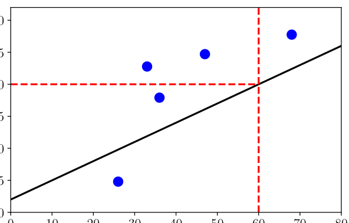
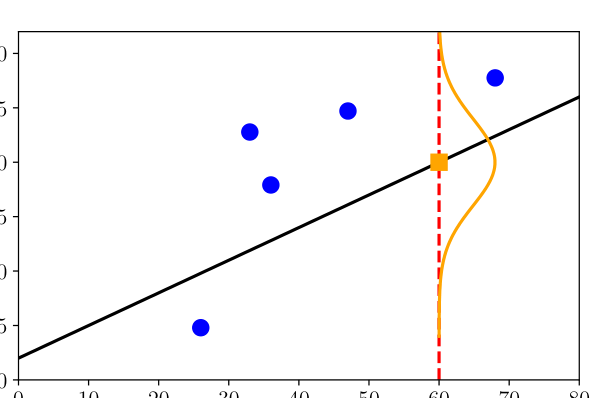
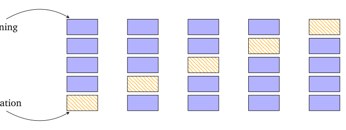
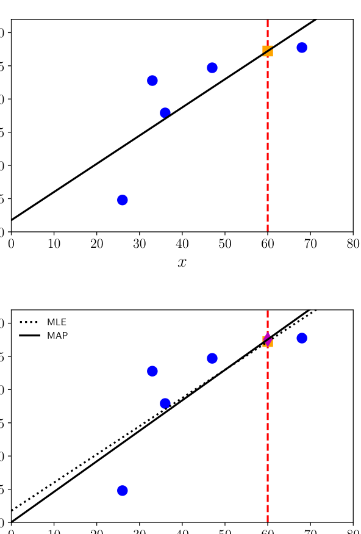
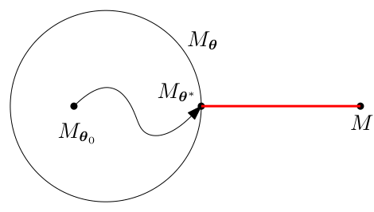
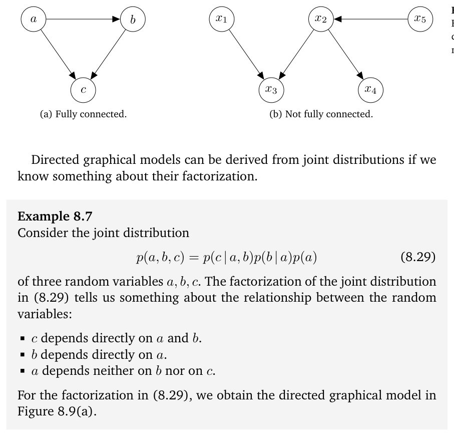
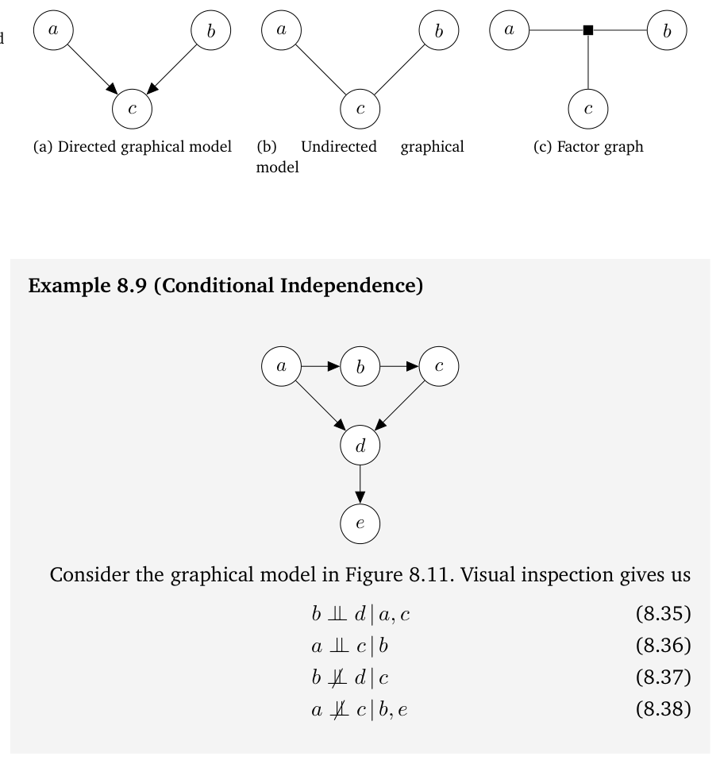
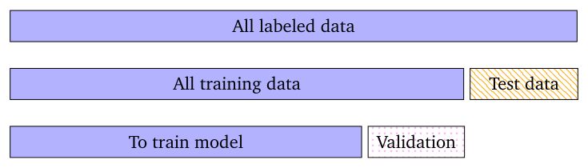
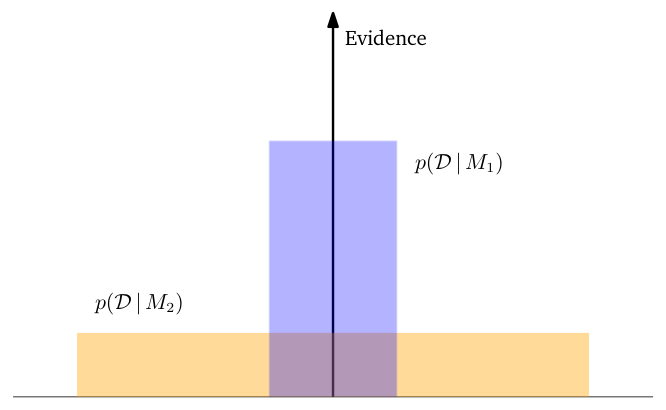

# 第 8 章 当模型遇上了数据（When Models Meet Data）

> [← 返回目录](README.md)

> In the first part of the book, we introduced the mathematics that form the foundations of many machine learning methods. The hope is that a reader would be able to learn the rudimentary forms of the language of mathematics from the first part, which we will now use to describe and discuss machine learning. The second part of the book introduces four pillars of machine learning:
> - Regression (Chapter 9)
> - Dimensionality reduction (Chapter 10)
> - Density estimation (Chapter 11)
> - Classification (Chapter 12)

在本书第一部分，我们介绍了构成许多机器学习（machine learning）方法之基础的数学。希望读者能够从第一部分学到数学语言的基本形式，我们现在将用它来描述和讨论机器学习。本书第二部分介绍机器学习的四大支柱：

- 回归（regression，第 9 章）
- 降维（dimensionality reduction，第 10 章）
- 密度估计（density estimation，第 11 章）
- 分类（classification，第 12 章）

> The main aim of this part of the book is to illustrate how the mathematical concepts introduced in the first part of the book can be used to design machine learning algorithms that can be used to solve tasks within the remit of the four pillars. We do not intend to introduce advanced machine learning concepts, but instead to provide a set of practical methods that allow the reader to apply the knowledge they gained from the first part of the book. It also provides a gateway to the wider machine learning literature for readers already familiar with the mathematics.

本书这一部分的主要目的，是展示如何运用第一部分介绍的数学概念来设计机器学习算法，以解决四大支柱范围内的任务。我们无意引入高级的机器学习概念，而是希望提供一套实用的方法，使读者能够运用从本书第一部分获得的知识。对于已经熟悉这些数学内容的读者，这一部分也是通往更广泛的机器学习文献的门户。

## 8.1 数据、模型与学习（Data, Models, and Learning）

> It is worth at this point, to pause and consider the problem that a machine learning algorithm is designed to solve. As discussed in Chapter 1, there are three major components of a machine learning system: data, models, and learning. The main question of machine learning is “What do we mean by good models?”. The word model has many subtleties, and we will revisit it multiple times in this chapter. It is also not entirely obvious how to objectively define the word “good”. One of the guiding principles of machine learning is that good models should perform well on unseen data. This requires us to define some performance metrics, such as accuracy or distance from ground truth, as well as figuring out ways to do well under these performance metrics. This chapter covers a few necessary bits and pieces of mathematical and statistical language that are commonly used to talk about machine learning models. By doing so, we briefly outline the current best practices for training a model such that the resulting predictor does well on data that we have not yet seen.

此刻值得停下来思考一下机器学习算法旨在解决的是什么问题。正如第 1 章所讨论的，机器学习系统有三个主要组成部分：数据、模型（model）和学习。机器学习的核心问题是“我们所说的好模型是什么意思？”。“模型”一词有许多微妙之处，我们将在本章中多次回顾它。如何客观地定义“好”这个词也并非显而易见。机器学习的一条指导原则是：好的模型应当在未见过的数据上表现良好。这就要求我们定义一些性能指标（performance metrics），例如准确率或与真值（ground truth）的距离，并设法在这些性能指标下取得好的表现。本章涵盖在讨论机器学习模型时常用的一些必要的数学和统计语言。在此过程中，我们将简要概述训练模型的当前最佳实践，使得所得的预测器（predictor）在我们尚未见过的数据上表现良好。

> **Table 8.1** Example data from a fictitious human resource database that is not in a numerical format.

**表 8.1** 取自虚构人力资源数据库的示例数据，尚未转换为数值格式。

> | Name | Gender | Degree | Postcode | Age | Annual salary |
> |---|---|---|---|---|---|
> | Aditya | M | MSc | W21BG | 36 | 89563 |
> | Bob | M | PhD | EC1A1BA | 47 | 123543 |
> | Chloé | F | BEcon | SW1A1BH | 26 | 23989 |
> | Daisuke | M | BSc | SE207AT | 68 | 138769 |
> | Elisabeth | F | MBA | SE10AA | 33 | 113888 |

| 姓名 | 性别 | 学位 | 邮编 | 年龄 | 年薪 |
|---|---|---|---|---|---|
| Aditya | 男 | 理学硕士 | W21BG | 36 | 89563 |
| Bob | 男 | 博士 | EC1A1BA | 47 | 123543 |
| Chloé | 女 | 经济学学士 | SW1A1BH | 26 | 23989 |
| Daisuke | 男 | 理学学士 | SE207AT | 68 | 138769 |
| Elisabeth | 女 | 工商管理硕士 | SE10AA | 33 | 113888 |

> As mentioned in Chapter 1, there are two different senses in which we use the phrase “machine learning algorithm”: training and prediction. We will describe these ideas in this chapter, as well as the idea of selecting among different models. We will introduce the framework of empirical risk minimization in Section 8.2, the principle of maximum likelihood in Section 8.3, and the idea of probabilistic models in Section 8.4. We briefly outline a graphical language for specifying probabilistic models in Section 8.5 and finally discuss model selection in Section 8.6. The rest of this section expands upon the three main components of machine learning: data, models and learning.

正如第 1 章所述，我们在使用“机器学习算法”这一说法时有两种不同的含义：训练（training）与预测（prediction）。我们将在本章描述这些思想，以及在不同模型之间进行选择的思想。我们将在 8.2 节介绍经验风险最小化（empirical risk minimization）框架，在 8.3 节介绍最大似然（maximum likelihood）原理，在 8.4 节介绍概率模型（probabilistic model）的思想。我们将在 8.5 节简要概述一种用于刻画概率模型的图形化语言（graphical language），最后在 8.6 节讨论模型选择（model selection）。本节其余部分将展开阐述机器学习的三个主要组成部分：数据、模型和学习。

### 8.1.1 以向量表示的数据（Data as Vectors）

> We assume that our data can be read by a computer, and represented adequately in a numerical format. Data is assumed to be tabular (Figure 8.1), where we think of each row of the table as representing a particular instance or example, and each column to be a particular feature. In recent years, machine learning has been applied to many types of data that do not obviously come in the tabular numerical format, for example genomic sequences, text and image contents of a webpage, and social media graphs. We do not discuss the important and challenging aspects of identifying good features. Many of these aspects depend on domain expertise and require careful engineering, and, in recent years, they have been put under the umbrella of data science (Stray, 2016; Adhikari and DeNero, 2018).

我们假设数据可以被计算机读取，并以数值格式得到恰当的表示。我们假设数据是表格形式的（图 8.1），表中每一行代表一个特定的实例（instance）或样本（example），每一列代表一个特定的特征（feature）。近年来，机器学习已被应用于许多并不明显以表格数值形式出现的数据类型，例如基因序列、网页中的文本和图像内容，以及社交媒体图。我们不会讨论识别良好特征这一重要而富有挑战性的课题；这些方面中的许多都依赖于领域专门知识（domain expertise），需要精心的工程工作，而近年来它们已被归入数据科学（data science）的范畴 (Stray, 2016; Adhikari and DeNero, 2018)。

> Even when we have data in tabular format, there are still choices to be made to obtain a numerical representation. For example, in Table 8.1, the gender column (a categorical variable) may be converted into numbers 0 representing “Male” and 1 representing “Female”. Alternatively, the gender could be represented by numbers −1, +1, respectively (as shown in Table 8.2). Furthermore, it is often important to use domain knowledge when constructing the representation, such as knowing that university degrees progress from bachelor’s to master’s to PhD or realizing that the postcode provided is not just a string of characters but actually encodes an area in London. In Table 8.2, we converted the data from Table 8.1 to a numerical format, and each postcode is represented as two numbers, a latitude and longitude. Even numerical data that could potentially be directly read into a machine learning algorithm should be carefully considered for units, scaling, and constraints. Without additional information, one should shift and scale all columns of the dataset such that they have an empirical mean of 0 and an empirical variance of 1. For the purposes of this book, we assume that a domain expert already converted data appropriately, i.e., each input xn is a D-dimensional vector of real numbers, which are called features, attributes, or covariates. We consider a dataset to be of the form as illustrated by Table 8.2. Observe that we have dropped the Name column of Table 8.1 in the new numerical representation. There are two main reasons why this is desirable: (1) we do not expect the identifier (the Name) to be informative for a machine learning task; and (2) we may wish to anonymize the data to help protect the privacy of the employees.

即便数据已经是表格形式，要得到数值表示仍需做出一些选择。例如，在表 8.1 中，性别一列（一个类别变量（categorical variable））可以转换为数字：0 表示“男性”（Male），1 表示“女性”（Female）；或者，性别也可以分别用数字 −1 和 +1 表示（如表 8.2 所示）。此外，在构造表示时利用领域知识（domain knowledge）往往很重要，比如知道大学学位是从学士到硕士再到博士逐级递进的，或者意识到所提供的邮编不只是一串字符，而是实际上编码了伦敦的一个区域。在表 8.2 中，我们把表 8.1 的数据转换成了数值格式，每个邮编被表示为两个数——纬度和经度。即便是那些看似可以直接送入机器学习算法的数值数据，也应当仔细考虑其单位、缩放和约束。在没有额外信息的情况下，应当对数据集（dataset）的所有列作平移和缩放，使其经验均值（empirical mean）为 0、经验方差（empirical variance）为 1。就本书而言，我们假设领域专家已经对数据做了恰当的转换，也就是说，每个输入 $\boldsymbol{x}_n$ 是一个由实数构成的 $D$ 维向量（vector），其分量称为特征、属性（attribute）或协变量（covariate）。我们把数据集视为表 8.2 所示例示的那种形式。可以注意到，在新的数值表示中我们略去了表 8.1 的“姓名”（Name）列。这样做主要有两个原因：(1) 我们并不期望标识符（姓名）能为机器学习任务提供有用信息；(2) 我们可能希望对数据作匿名化处理，以帮助保护员工的隐私。

> **Table 8.2** Example data from a fictitious human resource database (see Table 8.1), converted to a numerical format.

**表 8.2** 取自虚构人力资源数据库的示例数据（见表 8.1），已转换为数值格式。

> | Gender ID | Degree | Latitude (in degrees) | Longitude (in degrees) | Age | Annual Salary (in thousands) |
> |---|---|---|---|---|---|
> | -1 | 2 | 51.5073 | 0.1290 | 36 | 89.563 |
> | -1 | 3 | 51.5074 | 0.1275 | 47 | 123.543 |
> | +1 | 1 | 51.5071 | 0.1278 | 26 | 23.989 |
> | -1 | 1 | 51.5075 | 0.1281 | 68 | 138.769 |
> | +1 | 2 | 51.5074 | 0.1278 | 33 | 113.888 |

| 性别 ID | 学位 | 纬度（单位：度） | 经度（单位：度） | 年龄 | 年薪（单位：千） |
|---|---|---|---|---|---|
| -1 | 2 | 51.5073 | 0.1290 | 36 | 89.563 |
| -1 | 3 | 51.5074 | 0.1275 | 47 | 123.543 |
| +1 | 1 | 51.5071 | 0.1278 | 26 | 23.989 |
| -1 | 1 | 51.5075 | 0.1281 | 68 | 138.769 |
| +1 | 2 | 51.5074 | 0.1278 | 33 | 113.888 |

> In this part of the book, we will use N to denote the number of examples in a dataset and index the examples with lowercase n = 1, . . . , N. We assume that we are given a set of numerical data, represented as an array of vectors (Table 8.2). Each row is a particular individual xn, often referred to as an example or data point in machine learning. The subscript n refers to the fact that this is the nth example out of a total of N examples in the dataset. Each column represents a particular feature of interest about the example, and we index the features as d = 1, . . . , D. Recall that data is represented as vectors, which means that each example (each data point) is a D-dimensional vector. The orientation of the table originates from the database community, but for some machine learning algorithms (e.g., in Chapter 10) it is more convenient to represent examples as column vectors.

在本书这一部分，我们将用 $N$ 表示数据集中样本的数量，并用小写的 $n = 1, \ldots, N$ 为样本编号。我们假设给定了一组数值数据，表示为由向量组成的阵列（表 8.2）。每一行是一个特定的个体 $\boldsymbol{x}_n$，在机器学习中通常称为样本或数据点（data point）。下标 $n$ 表示它是数据集中总共 $N$ 个样本中的第 $n$ 个。每一列代表我们所关心的样本的某个特定特征，我们将这些特征编号为 $d = 1, \ldots, D$。回忆一下，数据是以向量表示的，这意味着每个样本（每个数据点）都是一个 $D$ 维向量。表格的这种取向源自数据库领域，但对某些机器学习算法（例如第 10 章）而言，把样本表示为列向量会更方便。

> Let us consider the problem of predicting annual salary from age, based on the data in Table 8.2. This is called a supervised learning problem where we have a label yn (the salary) associated with each example xn (the age). The label yn has various other names, including target, response variable, and annotation. A dataset is written as a set of example-label pairs {(x1, y1), . . . , (xn, yn), . . . , (xN, yN)}. The table of examples {x1, . . . , xN} is often concatenated, and written as X ∈ RN×D. Figure 8.1 illustrates the dataset consisting of the two rightmost columns of Table 8.2, where x = age and y = salary.

让我们基于表 8.2 的数据，考虑从年龄预测年薪的问题。这被称为监督学习（supervised learning）问题：每个样本 $\boldsymbol{x}_n$（年龄）都有一个与之相关联的标签（label）$\boldsymbol{y}_n$（薪水）。标签 $\boldsymbol{y}_n$ 还有其他一些名称，包括目标（target）、响应变量（response variable）和标注（annotation）。一个数据集写成样本-标签对（example-label pairs）的集合 $\{(\boldsymbol{x}_1, \boldsymbol{y}_1), \ldots, (\boldsymbol{x}_n, \boldsymbol{y}_n), \ldots, (\boldsymbol{x}_N, \boldsymbol{y}_N)\}$。样本的表格 $\{\boldsymbol{x}_1, \ldots, \boldsymbol{x}_N\}$ 通常被拼接在一起，记作 $\boldsymbol{X} \in \mathbb{R}^{N\times D}$。图 8.1 展示了由表 8.2 最右两列组成的数据集，其中 $\boldsymbol{x}$ 为年龄，$\boldsymbol{y}$ 为薪水。

> We use the concepts introduced in the first part of the book to formalize the machine learning problems such as that in the previous paragraph. Representing data as vectors xn allows us to use concepts from linear algebra (introduced in Chapter 2). In many machine learning algorithms, we need to additionally be able to compare two vectors. As we will see in Chapters 9 and 12, computing the similarity or distance between two examples allows us to formalize the intuition that examples with similar features should have similar labels. The comparison of two vectors requires that we construct a geometry (explained in Chapter 3) and allows us to optimize the resulting learning problem using techniques from Chapter 7.

我们利用本书第一部分介绍的概念，将诸如上一段那样的机器学习问题形式化。把数据表示为向量 $\boldsymbol{x}_n$，使我们能够使用第 2 章介绍的线性代数（linear algebra）中的概念。在许多机器学习算法中，我们还需要能够比较两个向量。正如我们将在第 9 章和第 12 章看到的，计算两个样本之间的相似度或距离，使我们能够将“特征相似的样本应当具有相似标签”这一直觉形式化。两个向量的比较要求我们构造一种几何（geometry）（第 3 章对此作了解释），并使我们能够利用第 7 章的技术来优化由此得到的学习问题。

> **Figure 8.1** Toy data for linear regression. Training data in (xn, yn) pairs from the rightmost two columns of Table 8.2. We are interested in the salary of a person aged sixty (x = 60) illustrated as a vertical dashed red line, which is not part of the training data.

**图 8.1** 线性回归的玩具数据。训练数据为取自表 8.2 最右两列的 $(\boldsymbol{x}_n, \boldsymbol{y}_n)$ 数据对。我们关心的是年龄为六十岁（$\boldsymbol{x} = 60$）的人的薪水，图中以一条竖直的红色虚线示意，该点并不属于训练数据。

> Since we have vector representations of data, we can manipulate data to find potentially better representations of it. We will discuss finding good representations in two ways: finding lower-dimensional approximations of the original feature vector, and using nonlinear higher-dimensional combinations of the original feature vector. In Chapter 10, we will see an example of finding a low-dimensional approximation of the original data space by finding the principal components. Finding principal components is closely related to concepts of eigenvalue and singular value decomposition as introduced in Chapter 4. For the high-dimensional representation, we will see an explicit feature map ϕ(·) that allows us to represent xn using a higher-dimensional representation ϕ(xn). The main motivation for higher-dimensional representations is that we can construct new features as non-linear combinations of the original features, which in turn may make the learning problem easier. We will discuss the feature map in Section 9.2 and show how this feature map leads to a kernel in Section 12.4.

既然我们拥有了数据的向量表示，就可以对数据进行操作，以找到可能更好的表示。我们将从两个方面讨论如何寻找好的表示：寻找原始特征向量的低维近似，以及使用原始特征向量的非线性高维组合。在第 10 章中，我们将看到一个通过寻找主成分（principal components）来获得原始数据空间低维近似的例子。寻找主成分与第 4 章介绍的特征值（eigenvalue）分解和奇异值分解（SVD）的概念密切相关。对于高维表示，我们将看到一种显式的特征映射（feature map）$\phi(\cdot)$，它使我们能够用更高维的表示 $\phi(\boldsymbol{x}_n)$ 来表示 $\boldsymbol{x}_n$。使用更高维表示的主要动机在于，我们可以把新特征构造为原始特征的非线性组合，这进而可能使学习问题变得更容易。我们将在 9.2 节讨论特征映射，并在 12.4 节展示这一特征映射如何引出核（kernel）。

> In recent years, deep learning methods (Goodfellow et al., 2016) have shown promise in using the data itself to learn new good features and have been very successful in areas, such as computer vision, speech recognition, and natural language processing. We will not cover neural networks in this part of the book, but the reader is referred to Section 5.6 for the mathematical description of backpropagation, a key concept for training neural networks.

近年来，深度学习（deep learning）方法 (Goodfellow et al., 2016) 在利用数据本身来学习新的良好特征方面展现出前景，并在计算机视觉、语音识别和自然语言处理等领域取得了极大的成功。本书这一部分不会讨论神经网络（neural network），但关于训练神经网络的一个关键概念——反向传播（backpropagation）的数学描述，读者可参阅 5.6 节。

> **Figure 8.2** Example function (black solid diagonal line) and its prediction at x = 60, i.e., f(60) = 100.

**图 8.2** 示例函数（黑色实对角线）及其在 $\boldsymbol{x} = 60$ 处的预测，即 $f(60) = 100$。

### 8.1.2 作为函数的模型（Models as Functions）

> Once we have data in an appropriate vector representation, we can get to the business of constructing a predictive function (known as a predictor). In Chapter 1, we did not yet have the language to be precise about models. Using the concepts from the first part of the book, we can now introduce what “model” means. We present two major approaches in this book: a predictor as a function, and a predictor as a probabilistic model. We describe the former here and the latter in the next subsection.

当我们拥有了具有恰当向量表示的数据之后，就可以开始着手构造预测函数（predictive function），也称为预测器。在第 1 章中，我们还没有能够精确谈论模型的语言。利用本书第一部分的概念，我们现在可以引入“模型”的含义。本书呈现两种主要方法：将预测器视为函数，以及将预测器视为概率模型。我们在这里描述前者，在下一小节描述后者。

> A predictor is a function that, when given a particular input example (in our case, a vector of features), produces an output. For now, consider the output to be a single number, i.e., a real-valued scalar output. This can be written as

预测器是一个函数：当给定一个特定的输入样本（在我们的情形中是一个由特征组成的向量）时，它产生一个输出。目前，不妨把输出看作单个数，即实值的标量（scalar）输出。这可以写作

$$
f : \mathbb{R}^D \to \mathbb{R} \,,
\tag{8.1}
$$

> where the input vector x is D-dimensional (has D features), and the function f then applied to it (written as f(x)) returns a real number. Figure 8.2 illustrates a possible function that can be used to compute the value of the prediction for input values x.

其中输入向量 $\boldsymbol{x}$ 是 $D$ 维的（具有 $D$ 个特征），随后作用于其上的函数 $f$（写作 $f(\boldsymbol{x})$）返回一个实数。图 8.2 展示了一个可用于计算输入值 $\boldsymbol{x}$ 所对应的预测值的函数示例。

> In this book, we do not consider the general case of all functions, which would involve the need for functional analysis. Instead, we consider the special case of linear functions

在本书中，我们不考虑所有函数构成的一般情形，那将需要用到泛函分析（functional analysis）。我们转而考虑线性函数这一特殊情形

$$
f(\boldsymbol{x}) = \boldsymbol{\theta}^{\top} \boldsymbol{x} + \theta_{0}
\tag{8.2}
$$

> for unknown θ and θ0. This restriction means that the contents of Chapters 2 and 3 suffice for precisely stating the notion of a predictor for the non-probabilistic view of machine learning (in contrast to the probabilistic view described next).

其中 $\boldsymbol{\theta}$ 和 $\theta_0$ 未知。这一限制意味着，第 2 章和第 3 章的内容足以精确地陈述非概率机器学习观点下预测器的概念（与下文介绍的概率观点相对）。

> **Figure 8.3** Example function (black solid diagonal line) and its predictive uncertainty at x = 60 (drawn as a Gaussian).

**图 8.3** 示例函数（黑色实线对角线）及其在 $\boldsymbol{x} = 60$ 处的预测不确定性（绘制为高斯分布）。

> Linear functions strike a good balance between the generality of the problems that can be solved and the amount of background mathematics that is needed.

线性函数在可解决问题的广泛性与所需背景数学知识的数量之间取得了很好的折中。

### 8.1.3 作为概率分布的模型（Models as Probability Distributions）

> We often consider data to be noisy observations of some true underlying effect, and hope that by applying machine learning we can identify the signal from the noise. This requires us to have a language for quantifying the effect of noise. We often would also like to have predictors that express some sort of uncertainty, e.g., to quantify the confidence we have about the value of the prediction for a particular test data point. As we have seen in Chapter 6, probability theory provides a language for quantifying uncertainty. Figure 8.3 illustrates the predictive uncertainty of the function as a Gaussian distribution.

我们常常把数据视为对某种真实潜在效应的含噪观测，并希望通过应用机器学习从噪声中识别出信号。这要求我们拥有一种能够量化噪声影响的语言。我们还常常希望预测器能够表达某种不确定性，例如量化我们对某个特定测试数据点之预测值的置信程度。正如我们在第 6 章看到的，概率论提供了量化不确定性的语言。图 8.3 以高斯分布的形式展示了该函数的预测不确定性。

> Instead of considering a predictor as a single function, we could consider predictors to be probabilistic models, i.e., models describing the distribution of possible functions. We limit ourselves in this book to the special case of distributions with finite-dimensional parameters, which allows us to describe probabilistic models without needing stochastic processes and random measures. For this special case, we can think about probabilistic models as multivariate probability distributions, which already allow for a rich class of models.

我们可以不把预测器视为单个函数，而是把预测器视为概率模型，即描述各种可能函数之分布的模型。在本书中，我们把自己限定在参数为有限维的分布这一特殊情形，这使得我们无须借助随机过程（stochastic process）与随机测度（random measure）就能描述概率模型。对于这一特殊情形，我们可以把概率模型视为多元概率分布（multivariate probability distribution），而后者已经能涵盖相当丰富的一类模型。

> We will introduce how to use concepts from probability (Chapter 6) to define machine learning models in Section 8.4, and introduce a graphical language for describing probabilistic models in a compact way in Section 8.5.

我们将在 8.4 节介绍如何利用概率（第 6 章）中的概念来定义机器学习模型，并在 8.5 节介绍一种以紧凑方式描述概率模型的图形化语言。

### 8.1.4 学习就是寻找参数（Learning is Finding Parameters）

> The goal of learning is to find a model and its corresponding parameters such that the resulting predictor will perform well on unseen data. There are conceptually three distinct algorithmic phases when discussing machine learning algorithms:

学习的目标是找到一个模型及其对应的参数，使得所得的预测器能在未见过的数据上表现良好。在讨论机器学习算法时，概念上有三个截然不同的算法阶段：

> 1. Prediction or inference
> 2. Training or parameter estimation
> 3. Hyperparameter tuning or model selection

1. 预测或推断
2. 训练或参数估计
3. 超参数调优或模型选择

> The prediction phase is when we use a trained predictor on previously unseen test data. In other words, the parameters and model choice is already fixed and the predictor is applied to new vectors representing new input data points. As outlined in Chapter 1 and the previous subsection, we will consider two schools of machine learning in this book, corresponding to whether the predictor is a function or a probabilistic model. When we have a probabilistic model (discussed further in Section 8.4) the prediction phase is called inference.

预测阶段是指我们在之前未见过的测试数据上使用训练好的预测器。换言之，参数与模型的选择已经确定，预测器被应用于表示新输入数据点的新向量。正如第 1 章和上一小节所述，本书将考虑机器学习的两个流派，对应于预测器是一个函数还是概率模型。当我们使用概率模型时（8.4 节将进一步讨论），预测阶段称为推断（inference）。

> Remark. Unfortunately, there is no agreed upon naming for the different algorithmic phases. The word “inference” is sometimes also used to mean parameter estimation of a probabilistic model, and less often may be also used to mean prediction for non-probabilistic models. ♢

评注. 遗憾的是，这些不同的算法阶段并没有公认的命名。“推断”一词有时也被用来指概率模型的参数估计，较少的情况下也可能被用来指非概率模型的预测。♢

> The training or parameter estimation phase is when we adjust our predictive model based on training data. We would like to find good predictors given training data, and there are two main strategies for doing so: finding the best predictor based on some measure of quality (sometimes called finding a point estimate), or using Bayesian inference. Finding a point estimate can be applied to both types of predictors, but Bayesian inference requires probabilistic models.

训练或参数估计阶段是指我们基于训练数据来调整预测模型的阶段。我们希望根据训练数据找到好的预测器，主要有两种策略：依据某种质量度量找出最佳预测器（有时称为求点估计（point estimate）），或者使用贝叶斯推断（Bayesian inference）。求点估计对两类预测器都适用，但贝叶斯推断要求使用概率模型。

> For the non-probabilistic model, we follow the principle of **empirical risk minimization**, which we describe in Section 8.2. Empirical risk minimization directly provides an optimization problem for finding good parameters. With a statistical model, the principle of **maximum likelihood** is used to find a good set of parameters (Section 8.3). We can additionally model the uncertainty of parameters using a probabilistic model, which we will look at in more detail in Section 8.4.

对于非概率模型，我们遵循**经验风险最小化**原则，我们将在 8.2 节对其进行描述。经验风险最小化直接给出了一个用于寻找好参数的优化问题。对于统计模型，则使用**最大似然**原理来寻找一组好的参数（8.3 节）。此外，我们还可以用概率模型为参数的不确定性建模，我们将在 8.4 节更详细地讨论这一点。

> We use numerical methods to find good parameters that “fit” the data, and most training methods can be thought of as hill-climbing approaches to find the maximum of an objective, for example the maximum of a likelihood. To apply hill-climbing approaches we use the gradients described in Chapter 5 and implement numerical optimization approaches from Chapter 7.

我们使用数值方法来寻找能够“拟合”数据的好的参数，而大多数训练方法都可以看作是寻找某个目标的最大值的爬山（hill-climbing）方法，例如似然的最大值。为了应用爬山方法，我们会使用第 5 章介绍的梯度，并实现第 7 章中的数值优化方法。

> As mentioned in Chapter 1, we are interested in learning a model based on data such that it performs well on future data. It is not enough for the model to only fit the training data well, the predictor needs to perform well on unseen data. We simulate the behavior of our predictor on future unseen data using **cross-validation** (Section 8.2.4). As we will see in this chapter, to achieve the goal of performing well on unseen data, we will need to balance between fitting well on training data and finding “simple” explanations of the phenomenon. This trade-off is achieved using **regularization** (Section 8.2.3) or by adding a prior (Section 8.3.2).

如第 1 章所述，我们感兴趣的是基于数据学习一个模型，使其在未来数据上表现良好。模型仅仅很好地拟合训练数据并不够，预测器还需要在未见过的数据上表现良好。我们使用**交叉验证（cross-validation）**（8.2.4 节）来模拟预测器在未来未见数据上的行为。正如本章将会看到的，为了实现在未见数据上表现良好这一目标，我们需要在很好地拟合训练数据与为该现象寻找“简单”解释之间取得平衡。这种权衡通过**正则化（regularization）**（8.2.3 节）或添加先验（8.3.2 节）来实现。

> In philosophy, this is considered to be neither induction nor deduction, but is called abduction. According to the Stanford Encyclopedia of Philosophy, **abduction** is the process of inference to the best explanation (Douven, 2017). A good movie title is “AI abduction”.

在哲学中，这既不被视为归纳（induction）也不被视为演绎（deduction），而被称为溯因（abduction）。按照《斯坦福哲学百科全书》的说法，**溯因**是对最佳解释进行推断的过程（Douven, 2017）。“AI 溯因”会是一个很好的电影片名。

> We often need to make high-level modeling decisions about the structure of the predictor, such as the number of components to use or the class of probability distributions to consider. The choice of the number of components is an example of a **hyperparameter**, and this choice can affect the performance of the model significantly. The problem of choosing among different models is called **model selection**, which we describe in

我们常常需要就预测器的结构做出高层次的建模决策，例如要使用多少个成分，或考虑哪一类概率分布。成分个数的选择就是**超参数（hyperparameter）**的一个例子，这一选择会显著影响模型的性能。在不同模型之间进行选择的问题称为**模型选择**，我们将在

> Section 8.6. For non-probabilistic models, model selection is often done using nested cross-validation, which is described in Section 8.6.1. We also use model selection to choose hyperparameters of our model.

8.6 节。对于非概率模型，模型选择通常使用嵌套交叉验证（nested cross-validation）来完成，这将在 8.6.1 节中描述。我们也会利用模型选择来为模型挑选超参数。

> Remark. The distinction between parameters and hyperparameters is somewhat arbitrary, and is mostly driven by the distinction between what can be numerically optimized versus what needs to use search techniques. Another way to consider the distinction is to consider parameters as the explicit parameters of a probabilistic model, and to consider hyperparameters (higher-level parameters) as parameters that control the distribution of these explicit parameters. ♢

评注. 参数与超参数之间的区分在某种程度上是任意的，主要取决于该量是能够进行数值优化，还是需要使用搜索技术。看待这一区分的另一种方式是：把参数视为概率模型的显式参数，而把超参数（更高层次的参数）视为控制这些显式参数之分布的参数。♢

> In the following sections, we will look at three flavors of machine learning: empirical risk minimization (Section 8.2), the principle of maximum likelihood (Section 8.3), and probabilistic modeling (Section 8.4).

在接下来的几节中，我们将考察机器学习的三种形式：经验风险最小化（8.2 节）、最大似然原理（8.3 节）以及概率建模（8.4 节）。

## 8.2 经验风险最小化（Empirical Risk Minimization）

> After having all the mathematics under our belt, we are now in a position to introduce what it means to learn. The “learning” part of machine learning boils down to estimating parameters based on training data.

在掌握了所有这些数学工具之后，我们现在可以阐述“学习”究竟意味着什么。机器学习中“学习”的部分归根结底就是基于训练数据来估计参数。

> In this section, we consider the case of a predictor that is a function, and consider the case of probabilistic models in Section 8.3. We describe the idea of empirical risk minimization, which was originally popularized by the proposal of the support vector machine (described in Chapter 12). However, its general principles are widely applicable and allow us to ask the question of what is learning without explicitly constructing probabilistic models. There are four main design choices, which we will cover in detail in the following subsections:

在本节中，我们考虑预测器是一个函数的情形，而概率模型的情形将在 8.3 节中考虑。我们将描述经验风险最小化的思想，这一思想最初是随着支持向量机（SVM）的提出而流行起来的（第 12 章将对其进行描述）。然而，它的一般原则适用性很广，使我们无须显式地构造概率模型就能提出“什么是学习”这一问题。其中有四个主要的设计选择，我们将在下面几个小节中详细讨论：

> **Section 8.2.1** What is the set of functions we allow the predictor to take? **Section 8.2.2** How do we measure how well the predictor performs on the training data? **Section 8.2.3** How do we construct predictors from only training data that performs well on unseen test data? **Section 8.2.4** What is the procedure for searching over the space of models?

**8.2.1 节** 我们允许预测器取的函数集合是什么？**8.2.2 节** 我们如何度量预测器在训练数据上的表现好坏？**8.2.3 节** 我们如何仅利用训练数据构造在未见过的测试数据上表现良好的预测器？**8.2.4 节** 在模型空间中搜索的流程是什么？

### 8.2.1 函数的假设类（Hypothesis Class of Functions）

> Assume we are given N examples xn ∈ RD and corresponding scalar labels yn ∈ R. We consider the supervised learning setting, where we obtain pairs (x1, y1), . . . , (xN, yN). Given this data, we would like to estimate a predictor f(·, θ) : RD → R, parametrized by θ. We hope to be able to find a good parameter θ∗ such that we fit the data well, that is,

假设我们给定 $N$ 个样本 $\boldsymbol{x}_n \in \mathbb{R}^D$ 以及相应的标量标签 $y_n \in \mathbb{R}$。我们考虑监督学习的情形，其中我们得到样本对 $(x_1, y_1), \ldots, (x_N, y_N)$。给定这些数据，我们希望估计一个由 $\boldsymbol{\theta}$ 参数化的预测器 $f(\cdot, \boldsymbol{\theta}) : \mathbb{R}^D \to \mathbb{R}$。我们希望能找到一个好的参数 $\boldsymbol{\theta}^*$，使得我们能很好地拟合数据，即

$$
f(\boldsymbol{x}_n, \boldsymbol{\theta}^*) \approx y_n \quad \text{for all } n = 1, \ldots, N.
\tag{8.3}
$$

> In this section, we use the notation ˆyn = f(xn, θ∗) to represent the output of the predictor.

在本节中，我们使用记号 $\hat{y}_n = f(\boldsymbol{x}_n, \boldsymbol{\theta}^*)$ 来表示预测器的输出。

> Remark. For ease of presentation, we will describe empirical risk minimization in terms of supervised learning (where we have labels). This simplifies the definition of the hypothesis class and the loss function. It is also common in machine learning to choose a parametrized class of functions, for example affine functions. ♢

评注. 为了便于阐述，我们将以监督学习（即我们有标签的情形）为背景来描述经验风险最小化。这简化了假设类和损失函数的定义。在机器学习中，选择一个参数化的函数类也很常见，例如仿射函数（affine function）。♢

> **Example 8.1** We introduce the problem of ordinary least-squares regression to illustrate empirical risk minimization. A more comprehensive account of regression is given in Chapter 9. When the label yn is real-valued, a popular choice of function class for predictors is the set of affine functions. We choose a more compact notation for an affine function by concatenating an additional unit feature x(0) = 1 to xn, i.e., xn = [1, x(1)n , x(2)n , . . . , x(D)n ]⊤. The parameter vector is correspondingly θ = [θ0, θ1, θ2, . . . , θD]⊤, allowing us to write the predictor as a linear function

**例 8.1** 我们通过引入普通最小二乘回归（ordinary least-squares regression）问题来说明经验风险最小化。第 9 章将给出关于回归更全面的论述。当标签 $y_n$ 为实值时，预测器函数类的一个流行选择是仿射函数的集合。我们通过在 $\boldsymbol{x}_n$ 上拼接一个额外的单位特征 $x^{(0)} = 1$ 来为仿射函数选择一种更紧凑的记法，即 $\boldsymbol{x}_n = [1, x_n^{(1)}, x_n^{(2)}, \ldots, x_n^{(D)}]^\top$。相应地，参数向量为 $\boldsymbol{\theta} = [\theta_0, \theta_1, \theta_2, \ldots, \theta_D]^\top$，这使得我们可以把预测器写成一个线性函数

$$
f(\boldsymbol{x}_n, \boldsymbol{\theta}) = \boldsymbol{\theta}^\top \boldsymbol{x}_n.
\tag{8.4}
$$

> This linear predictor is equivalent to the affine model

这个线性预测器等价于仿射模型

$$
f(\boldsymbol{x}_n, \boldsymbol{\theta}) = \theta_0 + \sum_{d=1}^{D} \theta_d x_n^{(d)}.
\tag{8.5}
$$

> The predictor takes the vector of features representing a single example xn as input and produces a real-valued output, i.e., f : RD+1 → R. The previous figures in this chapter had a straight line as a predictor, which means that we have assumed an affine function.

预测器以表示单个样本的特征向量 $\boldsymbol{x}_n$ 作为输入，产生一个实值输出，即 $f : \mathbb{R}^{D+1} \to \mathbb{R}$。本章前面的各图都以一条直线作为预测器，这意味着我们假定了仿射函数。

> Instead of a linear function, we may wish to consider non-linear functions as predictors. Recent advances in neural networks allow for efficient computation of more complex non-linear function classes.

除了线性函数之外，我们可能还希望考虑将非线性函数用作预测器。神经网络的最新进展使得我们能够高效地计算更复杂的非线性函数类。

> Given the class of functions, we want to search for a good predictor. We now move on to the second ingredient of empirical risk minimization: how to measure how well the predictor fits the training data.

给定了函数类之后，我们想要搜索一个好的预测器。现在我们转向经验风险最小化的第二个要素：如何度量预测器对训练数据的拟合程度。

### 8.2.2 用于训练的损失函数（Loss Function for Training）

> Consider the label yn for a particular example; and the corresponding prediction ˆyn that we make based on xn. To define what it means to fit the data well, we need to specify a loss function ℓ(yn, ˆyn) that takes the ground truth label and the prediction as input and produces a non-negative number (referred to as the loss) representing how much error we have made on this particular prediction. Our goal for finding a good parameter vector θ∗ is to minimize the average loss on the set of N training examples.

考虑某个特定样本的标签 $y_n$，以及我们基于 $\boldsymbol{x}_n$ 作出的相应预测 $\hat{y}_n$。为了定义“把数据拟合得好”的含义，我们需要指定一个损失函数（loss function）$\ell(y_n, \hat{y}_n)$，它以真实标签（ground truth label）和预测作为输入，输出一个非负数（称为损失），表示我们在这一个特定预测上犯了多大的错误。我们的目标是找到一个好的参数向量 $\boldsymbol{\theta}^*$，使 $N$ 个训练样本上的平均损失最小。

> One assumption that is commonly made in machine learning is that the set of examples (x1, y1), . . . , (xN, yN) is independent and identically distributed. The word independent (Section 6.4.5) means that two data points (xi, yi) and (xj, yj) do not statistically depend on each other, meaning that the empirical mean is a good estimate of the population mean (Section 6.4.1). This implies that we can use the empirical mean of the loss on the training data. For a given training set {(x1, y1), . . . , (xN, yN)}, we introduce the notation of an example matrix X := [x1, . . . , xN]⊤ ∈ RN×D and a label vector y := [y1, . . . , yN]⊤ ∈ RN. Using this matrix notation the average loss is given by

机器学习中一个常用的假设是：样本集 $(x_1, y_1), \ldots, (x_N, y_N)$ 是独立同分布（independent and identically distributed）的。“独立”（6.4.5 节）一词意味着两个数据点 $(x_i, y_i)$ 与 $(x_j, y_j)$ 在统计上互不依赖，这意味着经验均值是总体均值（6.4.1 节）的一个很好的估计。这表明我们可以使用训练数据上损失的经验均值。对于一个给定的训练集 $\{(x_1, y_1), \ldots, (x_N, y_N)\}$，我们引入样本矩阵 $\boldsymbol{X} := [\boldsymbol{x}_1, \ldots, \boldsymbol{x}_N]^\top \in \mathbb{R}^{N \times D}$ 和标签向量 $\boldsymbol{y} := [y_1, \ldots, y_N]^\top \in \mathbb{R}^N$ 的记号。利用这一矩阵记号，平均损失由下式给出

$$
R_{\text{emp}}(f, \boldsymbol{X}, \boldsymbol{y}) = \frac{1}{N} \sum_{n=1}^{N} \ell(y_n, \hat{y}_n),
\tag{8.6}
$$

> where ˆyn = f(xn, θ). Equation (8.6) is called the empirical risk and depends on three arguments, the predictor f and the data X, y. This general strategy for learning is called empirical risk minimization.

其中 $\hat{y}_n = f(\boldsymbol{x}_n, \boldsymbol{\theta})$。(8.6) 称为经验风险（empirical risk），它依赖于三个自变量：预测器 $f$ 以及数据 $\boldsymbol{X}$ 和 $\boldsymbol{y}$。这种一般性的学习策略称为经验风险最小化。

> **Example 8.2** (Least-Squares Loss) Continuing the example of least-squares regression, we specify that we measure the cost of making an error during training using the squared loss ℓ(yn, ˆyn) = (yn − ˆyn)2. We wish to minimize the empirical risk (8.6), which is the average of the losses over the data

**例 8.2**（最小二乘损失）延续最小二乘回归的例子，我们规定在训练期间使用平方损失（squared loss）$\ell(y_n, \hat{y}_n) = (y_n - \hat{y}_n)^2$ 来度量犯错的代价。我们希望最小化经验风险 (8.6)，即数据上各损失的平均值

$$
\min_{\boldsymbol{\theta} \in \mathbb{R}^D} \frac{1}{N} \sum_{n=1}^{N} \left( y_n - f(\boldsymbol{x}_n, \boldsymbol{\theta}) \right)^2,
\tag{8.7}
$$

> where we substituted the predictor ˆyn = f(xn, θ). By using our choice of a linear predictor f(xn, θ) = θ⊤xn, we obtain the optimization problem

其中我们代入了预测器 $\hat{y}_n = f(\boldsymbol{x}_n, \boldsymbol{\theta})$。利用我们所选择的线性预测器 $f(\boldsymbol{x}_n, \boldsymbol{\theta}) = \boldsymbol{\theta}^\top \boldsymbol{x}_n$，我们得到如下优化问题

$$
\min_{\boldsymbol{\theta} \in \mathbb{R}^D} \frac{1}{N} \sum_{n=1}^{N} \left( y_n - \boldsymbol{\theta}^\top \boldsymbol{x}_n \right)^2.
\tag{8.8}
$$

> This equation can be equivalently expressed in matrix form

该方程可以等价地表示为矩阵形式

$$
\min_{\boldsymbol{\theta} \in \mathbb{R}^D} \frac{1}{N} \left\| \boldsymbol{y} - \boldsymbol{X}\boldsymbol{\theta} \right\|^2.
\tag{8.9}
$$

> This is known as the least-squares problem. There exists a closed-form analytic solution for this by solving the normal equations, which we will discuss in Section 9.2.

这就是所谓的最小二乘问题（least-squares problem）。通过求解正规方程（normal equations），该问题存在闭式解析解，我们将在 9.2 节中讨论。

> We are not interested in a predictor that only performs well on the training data. Instead, we seek a predictor that performs well (has low risk) on unseen test data. More formally, we are interested in finding a predictor f (with parameters fixed) that minimizes the expected risk

我们并不满足于仅在训练数据上表现良好的预测器。相反，我们寻找的是在未见过的测试数据上表现良好（风险低）的预测器。更正式地，我们感兴趣的是找到一个使期望风险（expected risk）最小化的预测器 $f$（参数固定）

$$
R_{\text{true}}(f) = \mathbb{E}_{x,y}[\ell(y, f(x))],
\tag{8.10}
$$

> where y is the label and f(x) is the prediction based on the example x. The notation Rtrue(f) indicates that this is the true risk if we had access to an infinite amount of data. The expectation is over the (infinite) set of all possible data and labels. There are two practical questions that arise from our desire to minimize expected risk, which we address in the following two subsections:

其中 $y$ 是标签，$f(x)$ 是基于样本 $x$ 的预测。记号 $R_{\text{true}}(f)$ 表明，如果我们能获得无限多的数据，这就是真实风险。该期望是对由所有可能的数据与标签构成的（无限）集合取的。我们想要最小化期望风险，由此产生了两个实际问题，我们将在接下来的两个小节中分别讨论：

> How should we change our training procedure to generalize well?

我们应当如何改变训练流程以实现良好的泛化？

> How do we estimate expected risk from (finite) data?

我们如何从（有限的）数据中估计期望风险？

> Remark. Many machine learning tasks are specified with an associated performance measure, e.g., accuracy of prediction or root mean squared error. The performance measure could be more complex, be cost sensitive, and capture details about the particular application. In principle, the design of the loss function for empirical risk minimization should correspond directly to the performance measure specified by the machine learning task. In practice, there is often a mismatch between the design of the loss function and the performance measure. This could be due to issues such as ease of implementation or efficiency of optimization. ♢

评注. 许多机器学习任务在设定时都带有相应的性能度量（performance measure），例如预测准确率或均方根误差（root mean squared error）。性能度量也可以更复杂、具有代价敏感性，并捕捉特定应用的细节。原则上，经验风险最小化中损失函数的设计应当与机器学习任务所规定的性能度量直接对应。而在实践中，损失函数的设计与性能度量之间常常存在不匹配。这可能是由实现难易度或优化效率之类的问题所致。♢

### 8.2.3 减少过拟合的正则化（Regularization to Reduce Overfitting）

> This section describes an addition to empirical risk minimization that allows it to generalize well (approximately minimizing expected risk). Recall that the aim of training a machine learning predictor is so that we can perform well on unseen data, i.e., the predictor generalizes well. We simulate this unseen data by holding out a proportion of the whole dataset. This hold out set is referred to as the test set. Given a sufficiently rich class of functions for the predictor f, we can essentially memorize the training data to obtain zero empirical risk. While this is great to minimize the loss (and therefore the risk) on the training data, we would not expect the predictor to generalize well to unseen data. In practice, we have only a finite set of data, and hence we split our data into a training and a test set. The training set is used to fit the model, and the test set (not seen by the machine learning algorithm during training) is used to evaluate generalization performance. It is important for the user to not cycle back to a new round of training after having observed the test set. We use the subscripts train and test to denote the training and test sets, respectively. We will revisit this idea of using a finite dataset to evaluate expected risk in Section 8.2.4.

本节描述对经验风险最小化的一种补充，使其能够良好地泛化（近似地最小化期望风险）。回顾一下，训练机器学习预测器的目的在于使我们能在未见过的数据上表现良好，即预测器具有良好的泛化能力。我们通过留出整个数据集中的一部分来模拟这些未见过的数据，这个留出集（hold out set）被称为测试集（test set）。给定一个足够丰富的预测器 $f$ 的函数类，我们基本上可以靠记忆训练数据来获得零经验风险。虽然这对最小化训练数据上的损失（从而风险）而言再好不过，但我们不能指望该预测器能良好地泛化到未见过的数据。实践中我们只有有限的数据，因此我们把数据划分为训练集与测试集：训练集用于拟合模型，测试集（机器学习算法在训练期间未见过）用于评估泛化性能。对用户而言，在观察过测试集之后不再回头开始新一轮训练十分重要。我们分别使用下标 $\text{train}$ 和 $\text{test}$ 来表示训练集与测试集。我们将在 8.2.4 节重新讨论利用有限数据集来评估期望风险的想法。

> It turns out that empirical risk minimization can lead to overfitting, i.e., the predictor fits too closely to the training data and does not generalize well to new data (Mitchell, 1997). This general phenomenon of having very small average loss on the training set but large average loss on the test set tends to occur when we have little data and a complex hypothesis class. For a particular predictor f (with parameters fixed), the phenomenon of overfitting occurs when the risk estimate from the training data Remp(f, Xtrain, ytrain) underestimates the expected risk Rtrue(f). Since we estimate the expected risk Rtrue(f) by using the empirical risk on the test set Remp(f, Xtest, ytest) if the test risk is much larger than the training risk, this is an indication of overfitting. We revisit the idea of overfitting in Section 8.3.3.

事实证明，经验风险最小化可能导致过拟合（overfitting），即预测器对训练数据拟合得过近，而不能很好地泛化到新数据（Mitchell, 1997）。这种在训练集上平均损失很小而在测试集上平均损失很大的普遍现象，往往在我们数据量少而假设类复杂时出现。对于某个特定的预测器 $f$（参数固定），当由训练数据得到的风险估计 $R_{\text{emp}}(f, \boldsymbol{X}_{\text{train}}, \boldsymbol{y}_{\text{train}})$ 低估了期望风险 $R_{\text{true}}(f)$ 时，就会出现过拟合现象。由于我们是用测试集上的经验风险 $R_{\text{emp}}(f, \boldsymbol{X}_{\text{test}}, \boldsymbol{y}_{\text{test}})$ 来估计期望风险 $R_{\text{true}}(f)$ 的，如果测试风险远大于训练风险，这就表明出现了过拟合。我们将在 8.3.3 节重新讨论过拟合的想法。

> Therefore, we need to somehow bias the search for the minimizer of empirical risk by introducing a penalty term, which makes it harder for the optimizer to return an overly flexible predictor. In machine learning, the penalty term is referred to as regularization. Regularization is a way to compromise between accurate solution of empirical risk minimization and the size or complexity of the solution.

因此，我们需要通过引入一个惩罚项（penalty term）来以某种方式偏置对经验风险最小化子的搜索，使优化器更难返回过于灵活的预测器。在机器学习中，这个惩罚项被称为正则化。正则化是在经验风险最小化的精确解与解的规模或复杂度之间进行折中的一种方式。

> **Example 8.3** (Regularized Least Squares) Regularization is an approach that discourages complex or extreme solutions to an optimization problem. The simplest regularization strategy is to replace the least-squares problem

**例 8.3**（正则化最小二乘）正则化是一种阻止优化问题产生复杂或极端解的方法。最简单的正则化策略是把上一个例子中的最小二乘问题

$$
\min_{\boldsymbol{\theta}} \frac{1}{N} \left\| \boldsymbol{y} - \boldsymbol{X}\boldsymbol{\theta} \right\|^2.
\tag{8.11}
$$

> in the previous example with the “regularized” problem by adding a penalty term involving only θ:

替换为通过添加一个仅涉及 $\boldsymbol{\theta}$ 的惩罚项而得到的“正则化”问题：

$$
\min_{\boldsymbol{\theta}} \frac{1}{N} \left\| \boldsymbol{y} - \boldsymbol{X}\boldsymbol{\theta} \right\|^2 + \lambda \left\| \boldsymbol{\theta} \right\|^2.
\tag{8.12}
$$

> The additional term ∥θ∥² is called the regularizer, and the parameter λ is the regularization parameter. The regularization parameter trades off minimizing the loss on the training set and the magnitude of the parameters θ. It often happens that the magnitude of the parameter values becomes relatively large if we run into overfitting (Bishop, 2006).

附加项 $\|\boldsymbol{\theta}\|^2$ 称为正则化项（regularizer），参数 $\lambda$ 称为正则化参数（regularization parameter）。正则化参数在最小化训练集上的损失与参数 $\boldsymbol{\theta}$ 的大小之间进行权衡。当我们遇到过拟合时，参数值的大小往往会变得相对较大（Bishop, 2006）。

> The regularization term is sometimes called the penalty term, which biases the vector θ to be closer to the origin. The idea of regularization also appears in probabilistic models as the prior probability of the parameters. Recall from Section 6.6 that for the posterior distribution to be of the same form as the prior distribution, the prior and the likelihood need to be conjugate. We will revisit this idea in Section 8.3.2. We will see in Chapter 12 that the idea of the regularizer is equivalent to the idea of a large margin.

正则化项有时也被称为惩罚项（penalty term），它促使向量 $\boldsymbol{\theta}$ 更加靠近原点。正则化的思想也出现在概率模型中，表现为参数的先验概率。回忆 6.6 节的内容：要使后验分布与先验分布具有相同的形式，先验与似然需要互为共轭。我们将在 8.3.2 节重新讨论这一思想。我们将在第 12 章看到，正则化项的思想等价于大间隔（large margin）的思想。

### 8.2.4 用交叉验证评估泛化性能（Cross-Validation to Assess the Generalization Performance）

> We mentioned in the previous section that we measure the generalization error by estimating it by applying the predictor on test data. This data is also sometimes referred to as the validation set. The validation set is a subset of the available training data that we keep aside. A practical issue with this approach is that the amount of data is limited, and ideally we would use as much of the data available to train the model. This would require us to keep our validation set V small, which then would lead to a noisy estimate (with high variance) of the predictive performance. One solution to these contradictory objectives (large training set, large validation set) is to use cross-validation. K-fold cross-validation effectively partitions the data into K chunks, K − 1 of which form the training set R, and the last chunk serves as the validation set V (similar to the idea outlined previously). Cross-validation iterates through (ideally) all combinations of assignments of chunks to R and V; see Figure 8.4. This procedure is repeated for all K choices for the validation set, and the performance of the model from the K runs is averaged.

我们在上一节中提到，泛化误差是通过把预测器应用于测试数据来进行估计的。这份数据有时也被称为验证集（validation set）。验证集是我们从可用的训练数据中留出的一个子集。这种做法的一个实际问题是数据量有限，而理想情况下我们希望尽可能多地利用现有数据来训练模型。这就要求我们把验证集 $\mathcal{V}$ 保持得很小，而这又会导致对预测性能的估计带有噪声（方差很大）。要解决这两个相互矛盾的目标（训练集要大，验证集也要大），一种方法是采用交叉验证。K 折交叉验证（K-fold cross-validation）实际上将数据划分为 $K$ 份，其中 $K - 1$ 份构成训练集 $\mathcal{R}$，最后一份用作验证集 $\mathcal{V}$（与前面概述的思想类似）。交叉验证（理想情况下）会遍历将各份分配给 $\mathcal{R}$ 与 $\mathcal{V}$ 的所有组合；参见图 8.4。这一过程会对验证集的全部 $K$ 种选择重复进行，并对 $K$ 次运行中模型的性能取平均。

> **Figure 8.4** K-fold cross-validation. The dataset is divided into K = 5 chunks, K − 1 of which serve as the training set (blue) and one as the validation set (orange hatch).

**图 8.4** K 折交叉验证。数据集被划分为 $K = 5$ 份，其中 $K - 1$ 份用作训练集（蓝色），一份用作验证集（橙色阴影线）。

> We partition our dataset into two sets D = R ∪ V, such that they do not overlap (R ∩ V = ∅), where V is the validation set, and train our model on R. After training, we assess the performance of the predictor f on the validation set V (e.g., by computing root mean square error (RMSE) of the trained model on the validation set). More precisely, for each partition k the training data R(k) produces a predictor f(k), which is then applied to validation set V(k) to compute the empirical risk R(f(k), V(k)). We cycle through all possible partitionings of validation and training sets and compute the average generalization error of the predictor. Cross-validation approximates the expected generalization error

我们把数据集划分为两个集合 $\mathcal{D} = \mathcal{R} \cup \mathcal{V}$，二者互不重叠（$\mathcal{R} \cap \mathcal{V} = \emptyset$），其中 $\mathcal{V}$ 是验证集；我们在 $\mathcal{R}$ 上训练模型。训练完成后，我们在验证集 $\mathcal{V}$ 上评估预测器 $f$ 的性能（例如，计算训练好的模型在验证集上的均方根误差（RMSE））。更准确地说，对每一个划分 $k$，训练数据 $\mathcal{R}^{(k)}$ 产生一个预测器 $f^{(k)}$，随后将其应用于验证集 $\mathcal{V}^{(k)}$，以计算经验风险 $R(f^{(k)}, \mathcal{V}^{(k)})$。我们遍历验证集与训练集的所有可能划分方式，并计算预测器的平均泛化误差。交叉验证近似期望泛化误差

$$
\mathbb{E}_{\mathcal{V}}[R(f, \mathcal{V})] \approx \frac{1}{K} \sum_{k=1}^{K} R(f^{(k)}, \mathcal{V}^{(k)}) \,,
\tag{8.13}
$$

> where R(f(k), V(k)) is the risk (e.g., RMSE) on the validation set V(k) for predictor f(k). The approximation has two sources: first, due to the finite training set, which results in not the best possible f(k); and second, due to the finite validation set, which results in an inaccurate estimation of the risk R(f(k), V(k)). A potential disadvantage of K-fold cross-validation is the computational cost of training the model K times, which can be burdensome if the training cost is computationally expensive. In practice, it is often not sufficient to look at the direct parameters alone. For example, we need to explore multiple complexity parameters (e.g., multiple regularization parameters), which may not be direct parameters of the model. Evaluating the quality of the model, depending on these hyperparameters, may result in a number of training runs that is exponential in the number of model parameters. One can use nested cross-validation (Section 8.6.1) to search for good hyperparameters.

其中 $R(f^{(k)}, \mathcal{V}^{(k)})$ 是预测器 $f^{(k)}$ 在验证集 $\mathcal{V}^{(k)}$ 上的风险（例如 RMSE）。这一近似有两个误差来源：其一，训练集是有限的，因此所得的 $f^{(k)}$ 并非最优；其二，验证集是有限的，因此对风险 $R(f^{(k)}, \mathcal{V}^{(k)})$ 的估计不够准确。K 折交叉验证的一个潜在缺点在于需要将模型训练 $K$ 次的计算开销，如果训练本身的计算代价很高，这会相当繁重。在实践中，仅考察直接参数往往是不够的。例如，我们需要探索多个复杂度参数（例如多个正则化参数），它们可能并不是模型的直接参数。依据这些超参数来评估模型的质量，可能导致训练运行的次数随模型参数的数目呈指数级增长。此时可以使用嵌套交叉验证（nested cross-validation，8.6.1 节）来搜索好的超参数。

> However, cross-validation is an embarrassingly parallel problem, i.e., little effort is needed to separate the problem into a number of parallel tasks. Given sufficient computing resources (e.g., cloud computing, server farms), cross-validation does not require longer than a single performance assessment.

不过，交叉验证是一个极易并行（embarrassingly parallel）的问题，即只需很少的工作就能把问题拆分为多个并行任务。只要拥有足够的计算资源（例如云计算、服务器集群），交叉验证所需的时间就不会超过一次单独的性能评估。

> In this section, we saw that empirical risk minimization is based on the following concepts: the hypothesis class of functions, the loss function and regularization. In Section 8.3, we will see the effect of using a probability distribution to replace the idea of loss functions and regularization.

在本节中，我们看到经验风险最小化基于以下几个概念：函数的假设类、损失函数与正则化。在 8.3 节中，我们将看到用概率分布取代损失函数与正则化思想所带来的效果。

### 8.2.5 延伸阅读（Further Reading）

> Due to the fact that the original development of empirical risk minimization (Vapnik, 1998) was couched in heavily theoretical language, many of the subsequent developments have been theoretical. The area of study is called statistical learning theory (Vapnik, 1999; Evgeniou et al., 2000; Hastie et al., 2001; von Luxburg and Schölkopf, 2011). A recent machine learning textbook that builds on the theoretical foundations and develops efficient learning algorithms is Shalev-Shwartz and Ben-David (2014).

由于经验风险最小化（Vapnik, 1998）的最初发展采用了高度理论化的语言，其后续的许多进展也都是理论性的。这一研究领域被称为统计学习理论（statistical learning theory）(Vapnik, 1999; Evgeniou et al., 2000; Hastie et al., 2001; von Luxburg and Schölkopf, 2011)。一本近来建立在理论基础之上并发展了高效学习算法的机器学习教材是 Shalev-Shwartz and Ben-David (2014)。

> The concept of regularization has its roots in the solution of ill-posed inverse problems (Neumaier, 1998). The approach presented here is called Tikhonov regularization, and there is a closely related constrained version called Ivanov regularization. Tikhonov regularization has deep relationships to the bias-variance trade-off and feature selection (Bühlmann and Van De Geer, 2011). An alternative to cross-validation is bootstrap and jackknife (Efron and Tibshirani, 1993; Davidson and Hinkley, 1997; Hall, 1992). Thinking about empirical risk minimization (Section 8.2) as “probability free” is incorrect. There is an underlying unknown probability distribution p(x, y) that governs the data generation. However, the approach of empirical risk minimization is agnostic to that choice of distribution. This is in contrast to standard statistical approaches that explicitly require the knowledge of p(x, y). Furthermore, since the distribution is a joint distribution on both examples x and labels y, the labels can be nondeterministic. In contrast to standard statistics we do not need to specify the noise distribution for the labels y.

正则化的概念起源于不适定反问题（ill-posed inverse problem）的求解（Neumaier, 1998）。这里介绍的方法称为 Tikhonov 正则化（Tikhonov regularization），还有一个密切相关的约束版本，称为 Ivanov 正则化（Ivanov regularization）。Tikhonov 正则化与偏差-方差权衡（bias-variance trade-off）以及特征选择（feature selection）有着深刻的联系（Bühlmann and Van De Geer, 2011）。交叉验证的一种替代方法是 bootstrap 和 jackknife（Efron and Tibshirani, 1993; Davidson and Hinkley, 1997; Hall, 1992）。把经验风险最小化（8.2 节）看作“与概率无关”是不正确的。存在一个潜在的、未知的概率分布 $p(\boldsymbol{x}, y)$ 支配着数据的生成。然而，经验风险最小化方法对该分布的具体选择不作任何要求。这与显式要求知道 $p(\boldsymbol{x}, y)$ 的标准统计方法形成对照。此外，由于该分布是定义在样本 $\boldsymbol{x}$ 与标签 $y$ 上的联合分布，标签可以是非确定性的。与标准统计不同，我们无需为标签 $y$ 指定噪声分布。

## 8.3 参数估计（Parameter Estimation）

> In Section 8.2, we did not explicitly model our problem using probability distributions. In this section, we will see how to use probability distributions to model our uncertainty due to the observation process and our uncertainty in the parameters of our predictors. In Section 8.3.1, we introduce the likelihood, which is analogous to the concept of loss functions (Section 8.2.2) in empirical risk minimization. The concept of priors (Section 8.3.2) is analogous to the concept of regularization (Section 8.2.3).

在 8.2 节中，我们没有显式地使用概率分布来为问题建模。在本节中，我们将看到如何利用概率分布来刻画由观测过程导致的不确定性，以及预测器参数中的不确定性。在 8.3.1 节中，我们将介绍似然（likelihood），它类似于经验风险最小化中损失函数（8.2.2 节）的概念。先验（prior）的概念（8.3.2 节）则类似于正则化（8.2.3 节）的概念。

### 8.3.1 最大似然估计（Maximum Likelihood Estimation）

> The idea behind maximum likelihood estimation (MLE) is to define a function of the parameters that enables us to find a model that fits the data well. The estimation problem is focused on the likelihood function, or more precisely its negative logarithm. For data represented by a random variable x and for a family of probability densities p(x | θ) parametrized by θ, the negative log-likelihood is given by

最大似然估计（maximum likelihood estimation，MLE）背后的思想是定义一个关于参数的函数，使我们能够找到一个很好地拟合数据的模型。估计问题聚焦于似然函数（likelihood function），或者更确切地说，是它的负对数。对于由随机变量 $\boldsymbol{x}$ 表示的数据，以及由 $\boldsymbol{\theta}$ 参数化的一族概率密度 $p(\boldsymbol{x} \mid \boldsymbol{\theta})$，负对数似然（negative log-likelihood）由下式给出

$$
\mathcal{L}_x(\boldsymbol{\theta}) = -\log p(\boldsymbol{x} \mid \boldsymbol{\theta}) \,.
\tag{8.14}
$$

> The notation Lx(θ) emphasizes the fact that the parameter θ is varying and the data x is fixed. We very often drop the reference to x when writing the negative log-likelihood, as it is really a function of θ, and write it as L(θ) when the random variable representing the uncertainty in the data is clear from the context.

记号 $\mathcal{L}_x(\boldsymbol{\theta})$ 强调了这样一个事实：变化的是参数 $\boldsymbol{\theta}$，而数据 $\boldsymbol{x}$ 是固定的。在书写负对数似然时，我们常常省略对 $\boldsymbol{x}$ 的指代，因为它实际上是关于 $\boldsymbol{\theta}$ 的函数；当表示数据不确定性的随机变量从上下文中显而易见时，就把它写作 $\mathcal{L}(\boldsymbol{\theta})$。

> Let us interpret what the probability density p(x | θ) is modeling for a fixed value of θ. It is a distribution that models the uncertainty of the data for a given parameter setting. For a given dataset x, the likelihood allows us to express preferences about different settings of the parameters θ, and we can choose the setting that more “likely” has generated the data.

让我们解释一下，对于固定的 $\boldsymbol{\theta}$ 值，概率密度 $p(\boldsymbol{x} \mid \boldsymbol{\theta})$ 刻画的是什么。它是一个分布，刻画在给定参数设置下数据的不确定性。对于给定的数据集 $\boldsymbol{x}$，似然使我们能够表达对不同参数设置 $\boldsymbol{\theta}$ 的偏好，并且我们可以选择那个“更有可能”生成数据的设置。

> In a complementary view, if we consider the data to be fixed (because it has been observed), and we vary the parameters θ, what does L(θ) tell us? It tells us how likely a particular setting of θ is for the observations x. Based on this second view, the maximum likelihood estimator gives us the most likely parameter θ for the set of data.

从互补的观点来看，如果我们把数据视为固定（因为它已被观测），而让参数 $\boldsymbol{\theta}$ 变化，那么 $\mathcal{L}(\boldsymbol{\theta})$ 告诉我们什么？它告诉我们，对于观测 $\boldsymbol{x}$ 而言，某一特定的 $\boldsymbol{\theta}$ 设置有多大的可能性。基于这第二种观点，最大似然估计量（maximum likelihood estimator）为我们给出这组数据最可能的参数 $\boldsymbol{\theta}$。

> We consider the supervised learning setting, where we obtain pairs (x1, y1), . . . , (xN, yN) with xn ∈ RD and labels yn ∈ R. We are interested in constructing a predictor that takes a feature vector xn as input and produces a prediction yn (or something close to it), i.e., given a vector xn we want the probability distribution of the label yn. In other words, we specify the conditional probability distribution of the labels given the examples for the particular parameter setting θ.

我们考虑监督学习的设定：我们得到样本对 $(\boldsymbol{x}_1, y_1), \ldots, (\boldsymbol{x}_N, y_N)$，其中 $\boldsymbol{x}_n \in \mathbb{R}^D$，标签 $y_n \in \mathbb{R}$。我们感兴趣的是构造一个预测器，它以特征向量 $\boldsymbol{x}_n$ 为输入，并产生预测 $y_n$（或与之接近的值）；也就是说，给定向量 $\boldsymbol{x}_n$，我们想要标签 $y_n$ 的概率分布。换句话说，对于特定的参数设置 $\boldsymbol{\theta}$，我们指定在给定样本的条件下标签的条件概率分布。

> **Example 8.4**

**例 8.4**

> The first example that is often used is to specify that the conditional probability of the labels given the examples is a Gaussian distribution. In other words, we assume that we can explain our observation uncertainty by independent Gaussian noise (refer to Section 6.5) with zero mean, εn ∼ N(0, σ2). We further assume that the linear model x⊤n θ is used for prediction. This means we specify a Gaussian likelihood for each example label pair (xn, yn),

最常使用的第一个例子是指定标签在给定样本条件下的条件概率为高斯分布。换言之，我们假设可以用零均值的独立高斯噪声（参见 6.5 节）$\epsilon_n \sim \mathcal{N}(0, \sigma^2)$ 来解释观测的不确定性。我们进一步假设使用线性模型 $\boldsymbol{x}_n^\top \boldsymbol{\theta}$ 来进行预测。这意味着我们为每一个“样本-标签”对 $(\boldsymbol{x}_n, y_n)$ 指定一个高斯似然（Gaussian likelihood），

$$
p(y_n \mid \boldsymbol{x}_n, \boldsymbol{\theta}) = \mathcal{N}(y_n \mid \boldsymbol{x}_n^\top \boldsymbol{\theta}, \sigma^2) \,.
\tag{8.15}
$$

> An illustration of a Gaussian likelihood for a given parameter θ is shown in Figure 8.3. We will see in Section 9.2 how to explicitly expand the preceding expression out in terms of the Gaussian distribution.

图 8.3 展示了给定参数 $\boldsymbol{\theta}$ 下高斯似然的示意。我们将在 9.2 节看到如何利用高斯分布把前面的表达式显式地展开。

> We assume that the set of examples (x1, y1), . . . , (xN, yN) are independent and identically distributed (i.i.d.). The word “independent” (Section 6.4.5) implies that the likelihood involving the whole dataset (Y = {y1, . . . , yN} and X = {x1, . . . , xN}) factorizes into a product of the likelihoods of each individual example

我们假设样本集 $(\boldsymbol{x}_1, y_1), \ldots, (\boldsymbol{x}_N, y_N)$ 是独立同分布（independent and identically distributed，i.i.d.）的。“独立”一词（6.4.5 节）意味着，涉及整个数据集（$Y = \{y_1, \ldots, y_N\}$ 与 $X = \{\boldsymbol{x}_1, \ldots, \boldsymbol{x}_N\}$）的似然可以分解为每个单个样本的似然之乘积

$$
p(Y \mid X, \boldsymbol{\theta}) = \prod_{n=1}^{N} p(y_n \mid \boldsymbol{x}_n, \boldsymbol{\theta}) \,,
\tag{8.16}
$$

> where p(yn | xn, θ) is a particular distribution (which was Gaussian in Example 8.4). The expression “identically distributed” means that each term in the product (8.16) is of the same distribution, and all of them share the same parameters. It is often easier from an optimization viewpoint to compute functions that can be decomposed into sums of simpler functions. Hence, in machine learning we often consider the negative log-likelihood

其中 $p(y_n \mid \boldsymbol{x}_n, \boldsymbol{\theta})$ 是某个特定的分布（在例 8.4 中为高斯分布）。“同分布”（identically distributed）一词意味着乘积 (8.16) 中的每一项都属于同一种分布，并且它们共享相同的参数。从优化的角度来看，计算能够分解为更简单函数之和的函数通常更容易。因此，在机器学习中我们经常考虑负对数似然

$$
\mathcal{L}(\boldsymbol{\theta}) = -\log p(Y \mid X, \boldsymbol{\theta}) = -\sum_{n=1}^{N} \log p(y_n \mid \boldsymbol{x}_n, \boldsymbol{\theta}) \,.
\tag{8.17}
$$

> While it is temping to interpret the fact that θ is on the right of the conditioning in p(yn|xn, θ) (8.15), and hence should be interpreted as observed and fixed, this interpretation is incorrect. The negative log-likelihood L(θ) is a function of θ. Therefore, to find a good parameter vector θ that explains the data (x1, y1), . . . , (xN, yN) well, minimize the negative log-likelihood L(θ) with respect to θ.

虽然人们很想把 (8.15) 中 $p(y_n \mid \boldsymbol{x}_n, \boldsymbol{\theta})$ 里位于条件符号右侧的 $\boldsymbol{\theta}$ 解释为已观测且固定的量，但这种解释是不正确的。负对数似然 $\mathcal{L}(\boldsymbol{\theta})$ 是关于 $\boldsymbol{\theta}$ 的函数。因此，要找到一个能很好地解释数据 $(\boldsymbol{x}_1, y_1), \ldots, (\boldsymbol{x}_N, y_N)$ 的参数向量 $\boldsymbol{\theta}$，就需要关于 $\boldsymbol{\theta}$ 最小化负对数似然 $\mathcal{L}(\boldsymbol{\theta})$。

> Remark. The negative sign in (8.17) is a historical artifact that is due to the convention that we want to maximize likelihood, but numerical optimization literature tends to study minimization of functions. ♢

评注. (8.17) 中的负号是历史遗留的产物：按照惯例我们希望最大化似然，而数值优化文献倾向于研究函数的最小化。♢

> **Example 8.5** Continuing on our example of Gaussian likelihoods (8.15), the negative log-likelihood can be rewritten as

**例 8.5** 延续我们关于高斯似然 (8.15) 的例子，负对数似然可以重写为

$$
\begin{aligned}
\mathcal{L}(\boldsymbol{\theta}) &= -\sum_{n=1}^{N} \log p(y_n \mid \boldsymbol{x}_n, \boldsymbol{\theta}) = -\sum_{n=1}^{N} \log \mathcal{N}(y_n \mid \boldsymbol{x}_n^\top \boldsymbol{\theta}, \sigma^2) \tag{8.18a} \\
&= -\sum_{n=1}^{N} \log\left[ \frac{1}{\sqrt{2\pi\sigma^2}} \exp\left( -\frac{(y_n - \boldsymbol{x}_n^\top \boldsymbol{\theta})^2}{2\sigma^2} \right) \right] \tag{8.18b} \\
&= -\sum_{n=1}^{N} \log\frac{1}{\sqrt{2\pi\sigma^2}} - \sum_{n=1}^{N} \log\exp\left( -\frac{(y_n - \boldsymbol{x}_n^\top \boldsymbol{\theta})^2}{2\sigma^2} \right) \tag{8.18c} \\
&= \sum_{n=1}^{N} \frac{1}{2\sigma^2}(y_n - \boldsymbol{x}_n^\top \boldsymbol{\theta})^2 - \sum_{n=1}^{N} \log\frac{1}{\sqrt{2\pi\sigma^2}} \,. \tag{8.18d}
\end{aligned}
$$

> As σ is given, the second term in (8.18d) is constant, and minimizing L(θ) corresponds to solving the least-squares problem (compare with (8.8)) expressed in the first term.

由于 $\sigma$ 是给定的，(8.18d) 中的第二项是常数，因此最小化 $\mathcal{L}(\boldsymbol{\theta})$ 就等价于求解第一项所表达的最小二乘问题（least-squares problem）（与 (8.8) 比较）。

> It turns out that for Gaussian likelihoods the resulting optimization problem corresponding to maximum likelihood estimation has a closed-form solution. We will see more details on this in Chapter 9. Figure 8.5 shows a regression dataset and the function that is induced by the maximum-likelihood parameters. Maximum likelihood estimation may suffer from overfitting (Section 8.3.3), analogous to unregularized empirical risk minimization (Section 8.2.3). For other likelihood functions, i.e., if we model our noise with non-Gaussian distributions, maximum likelihood estimation may not have a closed-form analytic solution. In this case, we resort to numerical optimization methods discussed in Chapter 7.

事实证明，对于高斯似然，与最大似然估计相对应的优化问题具有闭式解（closed-form solution）。我们将在第 9 章看到更多细节。图 8.5 展示了一个回归数据集以及由最大似然参数所诱导的函数。最大似然估计可能会遭受过拟合（8.3.3 节），这与未正则化的经验风险最小化（8.2.3 节）类似。对于其他似然函数，即当我们用非高斯分布为噪声建模时，最大似然估计可能没有闭式的解析解。在这种情况下，我们就需要诉诸第 7 章讨论的数值优化方法。

> **Figure 8.5** For the given data, the maximum likelihood estimate of the parameters results in the black diagonal line. The orange square shows the value of the maximum likelihood prediction at x = 60.

**图 8.5** 对于给定数据，参数的最大似然估计结果为黑色对角线。橙色方块给出了 $x = 60$ 处最大似然预测的值。

> **Figure 8.6** Comparing the predictions with the maximum likelihood estimate and the MAP estimate at x = 60. The prior biases the slope to be less steep and the intercept to be closer to zero. In this example, the bias that moves the intercept closer to zero actually increases the slope.

**图 8.6** 在 $x = 60$ 处比较最大似然估计与最大后验（MAP）估计的预测。先验使斜率变得不那么陡峭，并使截距更接近零。在本例中，把截距向零拉近的偏置实际上反而增大了斜率。

### 8.3.2 最大后验估计（Maximum A Posteriori Estimation）

> If we have prior knowledge about the distribution of the parameters θ, we can multiply an additional term to the likelihood. This additional term is a prior probability distribution on parameters p(θ). For a given prior, after observing some data x, how should we update the distribution of θ? In other words, how should we represent the fact that we have more specific knowledge of θ after observing data x? Bayes' theorem, as discussed in Section 6.3, gives us a principled tool to update our probability distributions of random variables. It allows us to compute a posterior distribution p(θ | x) (the more specific knowledge) on the parameters θ from general prior statements (prior distribution) p(θ) and the function p(x | θ) that links the parameters θ and the observed data x (called the likelihood):

如果我们拥有关于参数 $\boldsymbol{\theta}$ 分布的先验知识（prior knowledge），就可以在似然上再乘一个额外的项。这个额外的项是参数上的先验概率分布 $p(\boldsymbol{\theta})$。对于给定的先验（prior），在观测到一些数据 $\boldsymbol{x}$ 之后，我们应当如何更新 $\boldsymbol{\theta}$ 的分布？换句话说，我们应当如何表示“在观测数据 $\boldsymbol{x}$ 之后，我们对 $\boldsymbol{\theta}$ 有了更具体的认识”这一事实？6.3 节讨论过的贝叶斯定理（Bayes' theorem）为我们提供了一个以有原则的方式更新随机变量概率分布的工具。它使我们能够从一般性的先验陈述（先验分布）$p(\boldsymbol{\theta})$ 以及联系参数 $\boldsymbol{\theta}$ 与观测数据 $\boldsymbol{x}$ 的函数 $p(\boldsymbol{x} \mid \boldsymbol{\theta})$（称为似然，likelihood）出发，计算出参数 $\boldsymbol{\theta}$ 上的后验分布（posterior distribution）$p(\boldsymbol{\theta} \mid \boldsymbol{x})$（即更具体的认识）：

$$
p(\boldsymbol{\theta} \mid \boldsymbol{x}) = \frac{p(\boldsymbol{x} \mid \boldsymbol{\theta}) p(\boldsymbol{\theta})}{p(\boldsymbol{x})} \,,
\tag{8.19}
$$

> Recall that we are interested in finding the parameter θ that maximizes the posterior. Since the distribution p(x) does not depend on θ, we can ignore the value of the denominator for the optimization and obtain

回顾一下，我们感兴趣的是找到使后验最大化的参数 $\boldsymbol{\theta}$。由于分布 $p(\boldsymbol{x})$ 不依赖于 $\boldsymbol{\theta}$，在优化时我们可以忽略分母的取值，从而得到

$$
p(\boldsymbol{\theta} \mid \boldsymbol{x}) \propto p(\boldsymbol{x} \mid \boldsymbol{\theta}) p(\boldsymbol{\theta}) \,.
\tag{8.20}
$$

> The preceding proportion relation hides the density of the data p(x), which may be difficult to estimate. Instead of estimating the minimum of the negative log-likelihood, we now estimate the minimum of the negative log-posterior, which is referred to as maximum a posteriori estimation (MAP estimation). An illustration of the effect of adding a zero-mean Gaussian prior is shown in Figure 8.6.

前面的比例关系隐藏了数据的密度 $p(\boldsymbol{x})$，而它可能难以估计。我们现在估计的不再是最小化负对数似然，而是最小化负对数后验（negative log-posterior），这称为最大后验估计（maximum a posteriori estimation，MAP estimation）。图 8.6 展示了添加零均值高斯先验所产生的效果。

> **Example 8.6** In addition to the assumption of Gaussian likelihood in the previous example, we assume that the parameter vector is distributed as a multivariate Gaussian with zero mean, i.e., p(θ) = N(0, Σ), where Σ is the covariance matrix (Section 6.5). Note that the conjugate prior of a Gaussian is also a Gaussian (Section 6.6.1), and therefore we expect the posterior distribution to also be a Gaussian. We will see the details of maximum a posteriori estimation in Chapter 9.

**例 8.6** 除了上一个例子中的高斯似然假设之外，我们还假设参数向量服从零均值的多元高斯分布，即 $p(\boldsymbol{\theta}) = \mathcal{N}(\boldsymbol{0}, \boldsymbol{\Sigma})$，其中 $\boldsymbol{\Sigma}$ 是协方差矩阵（6.5 节）。注意到高斯分布的共轭先验（conjugate prior）仍然是高斯分布（6.6.1 节），因此我们预期后验分布也是一个高斯分布。我们将在第 9 章看到最大后验估计的细节。

> The idea of including prior knowledge about where good parameters lie is widespread in machine learning. An alternative view, which we saw in Section 8.2.3, is the idea of regularization, which introduces an additional term that biases the resulting parameters to be close to the origin. Maximum a posteriori estimation can be considered to bridge the nonprobabilistic and probabilistic worlds as it explicitly acknowledges the need for a prior distribution but it still only produces a point estimate of the parameters.

在机器学习中，纳入“好参数位于何处”的先验知识这一想法十分普遍。我们在 8.2.3 节看到的另一种观点是正则化的思想，它通过引入一个额外的项，使所得的参数偏向于靠近原点。最大后验估计可以被视为连接非概率世界与概率世界的桥梁：它明确承认需要先验分布，但仍然只产生参数的点估计（point estimate）。

> Remark. The maximum likelihood estimate θML possesses the following properties (Lehmann and Casella, 1998; Efron and Hastie, 2016):

评注. 最大似然估计 $\theta_{\text{ML}}$ 具有如下性质（Lehmann and Casella, 1998; Efron and Hastie, 2016）：

> Asymptotic consistency: The MLE converges to the true value in the limit of infinitely many observations, plus a random error that is approximately normal.

渐近一致性（asymptotic consistency）：当观测数目趋于无穷多时，MLE 收敛到真值，外加一个近似正态分布的随机误差。

> **Figure 8.7** Model fitting. In a parametrized class Mθ of models, we optimize the model parameters θ to minimize the distance to the true (unknown) model M∗.

**图 8.7** 模型拟合。在参数化的模型类 $\mathcal{M}_\theta$ 中，我们优化模型参数 $\boldsymbol{\theta}$，以最小化与真实（未知）模型 $\mathcal{M}^*$ 之间的距离。

> The size of the samples necessary to achieve these properties can be quite large.

为达到这些性质所需的样本量可能会相当大。

> The error's variance decays in 1/N, where N is the number of data points.

误差的方差以 $1/N$ 的速度衰减，其中 $N$ 是数据点的数目。

> Especially, in the “small” data regime, maximum likelihood estimation can lead to overfitting.

尤其是在数据量“较小”的情形下，最大似然估计可能导致过拟合。

> The principle of maximum likelihood estimation (and maximum a posteriori estimation) uses probabilistic modeling to reason about the uncertainty in the data and model parameters. However, we have not yet taken probabilistic modeling to its full extent. In this section, the resulting training procedure still produces a point estimate of the predictor, i.e., training returns one single set of parameter values that represent the best predictor. In Section 8.4, we will take the view that the parameter values should also be treated as random variables, and instead of estimating “best” values of that distribution, we will use the full parameter distribution when making predictions.

最大似然估计（以及最大后验估计）的原理是利用概率建模来推理数据与模型参数中的不确定性。然而，我们还没有把概率建模发挥到极致。在本节中，由此得到的训练过程仍然产生预测器的一个点估计，即训练返回唯一的一组参数值，用以表示最好的预测器。在 8.4 节中，我们将采取这样的观点：参数值本身也应被视为随机变量，并且我们不再估计该分布的“最佳”值，而是在进行预测时使用完整的参数分布。

### 8.3.3 模型拟合（Model Fitting）

> Consider the setting where we are given a dataset, and we are interested in fitting a parametrized model to the data. When we talk about “fitting”, we typically mean optimizing/learning model parameters so that they minimize some loss function, e.g., the negative log-likelihood. With maximum likelihood (Section 8.3.1) and maximum a posteriori estimation (Section 8.3.2), we already discussed two commonly used algorithms for model fitting.

考虑这样的设定：给定一个数据集，我们希望将一个参数化的模型拟合到数据上。当我们谈论“拟合”时，通常指的是优化/学习模型参数，使某个损失函数最小化，例如负对数似然。通过最大似然（8.3.1 节）和最大后验估计（8.3.2 节），我们已经讨论了两种常用的模型拟合算法。

> The parametrization of the model defines a model class Mθ with which we can operate. For example, in a linear regression setting, we may define the relationship between inputs x and (noise-free) observations y to be y = ax + b, where θ := {a, b} are the model parameters. In this case, the model parameters θ describe the family of affine functions, i.e., straight lines with slope a, which are offset from 0 by b. Assume the data comes

模型的参数化定义了我们所能操作的模型类（model class）$\mathcal{M}_\theta$。例如，在线性回归的设定中，我们可以把输入 $x$ 与（无噪声的）观测值 $y$ 之间的关系定义为 $y = ax + b$，其中 $\theta := \{a, b\}$ 是模型参数。此时，模型参数 $\theta$ 描述的是仿射函数族，即斜率为 $a$、相对 0 偏移 $b$ 的直线。假设数据来自

> **Figure 8.8** Fitting (by maximum likelihood) of different model classes to a regression dataset. (a) Overfitting (b) Underfitting. (c) Fitting well.

**图 8.8** （通过最大似然）将不同模型类拟合到回归数据集上。(a) 过拟合 (b) 欠拟合。(c) 拟合良好。

> from a model M∗, which is unknown to us. For a given training dataset, we optimize θ so that Mθ is as close as possible to M∗, where the “closeness” is defined by the objective function we optimize (e.g., squared loss on the training data). Figure 8.7 illustrates a setting where we have a small model class (indicated by the circle Mθ), and the data generation model M∗ lies outside the set of considered models. We begin our parameter search at Mθ0. After the optimization, i.e., when we obtain the best possible parameters θ∗, we distinguish three different cases: (i) overfitting, (ii) underfitting, and (iii) fitting well. We will give a high-level intuition of what these three concepts mean.

一个模型 $\mathcal{M}^*$，而它对我们是未知的。对于给定的训练数据集，我们优化 $\theta$，使 $\mathcal{M}_\theta$ 尽可能接近 $\mathcal{M}^*$，其中“接近程度”由我们所优化的目标函数定义（例如训练数据上的平方损失）。图 8.7 展示了一种情形：我们有一个较小的模型类（由圆圈 $\mathcal{M}_\theta$ 表示），而数据生成模型 $\mathcal{M}^*$ 位于所考虑的模型集合之外。我们从 $\mathcal{M}_{\theta_0}$ 开始参数搜索。经过优化，即当我们得到尽可能好的参数 $\theta^*$ 后，可以区分三种不同的情形：(i) 过拟合，(ii) 欠拟合（underfitting），(iii) 拟合良好。我们将对这三个概念的含义给出一个高层次的直观解释。

> Roughly speaking, overfitting refers to the situation where the parametrized model class is too rich to model the dataset generated by M∗, i.e., Mθ could model much more complicated datasets. For instance, if the dataset was generated by a linear function, and we define Mθ to be the class of seventh-order polynomials, we could model not only linear functions, but also polynomials of degree two, three, etc. Models that overfit typically have a large number of parameters. An observation we often

粗略地说，过拟合指的是这样一种情形：参数化模型类过于丰富，超出了对由 $\mathcal{M}^*$ 生成的数据集建模所需的能力，也就是说，$\mathcal{M}_\theta$ 本可以建模复杂得多的数据集。例如，如果数据集由一个线性函数生成，而我们把 $\mathcal{M}_\theta$ 定义为七次多项式类，那么我们不仅能建模线性函数，还能建模二次、三次等多项式。过拟合的模型通常参数很多。我们经常

> make is that the overly flexible model class Mθ uses all its modeling power to reduce the training error. If the training data is noisy, it will therefore find some useful signal in the noise itself. This will cause enormous problems when we predict away from the training data. Figure 8.8(a) gives an example of overfitting in the context of regression where the model parameters are learned by means of maximum likelihood (see Section 8.3.1). We will discuss overfitting in regression more in Section 9.2.2.

观察到的一种现象是：过于灵活的模型类 $\mathcal{M}_\theta$ 会将其全部的建模能力用于降低训练误差。如果训练数据含有噪声，模型就会因此在噪声本身之中找到一些有用的信号。当我们对远离训练数据之处进行预测时，这会带来严重的问题。图 8.8(a) 给出了回归中过拟合的一个例子，其中模型参数通过最大似然（见 8.3.1 节）学习得到。我们将在 9.2.2 节进一步讨论回归中的过拟合。

> When we run into underfitting, we encounter the opposite problem where the model class Mθ is not rich enough. For example, if our dataset was generated by a sinusoidal function, but θ only parametrizes straight lines, the best optimization procedure will not get us close to the true model. However, we still optimize the parameters and find the best straight line that models the dataset. Figure 8.8(b) shows an example of a model that underfits because it is insufficiently flexible. Models that underfit typically have few parameters.

当我们遭遇欠拟合时，遇到的则是相反的问题：模型类 $\mathcal{M}_\theta$ 不够丰富。例如，如果我们的数据集由一个正弦函数生成，而 $\theta$ 只能参数化直线，那么再好的优化过程也无法让我们接近真实模型。不过，我们仍会优化参数，并找到能建模该数据集的最好的直线。图 8.8(b) 展示了一个欠拟合模型的例子，它因为不够灵活而欠拟合。欠拟合的模型通常参数很少。

> The third case is when the parametrized model class is about right. Then, our model fits well, i.e., it neither overfits nor underfits. This means our model class is just rich enough to describe the dataset we are given. Figure 8.8(c) shows a model that fits the given dataset fairly well. Ideally, this is the model class we would want to work with since it has good generalization properties.

第三种情形是参数化模型类恰到好处。此时，我们的模型拟合良好，即既不过拟合也不欠拟合。这意味着我们的模型类刚好足以描述所给的数据集。图 8.8(c) 展示了一个对给定数据集拟合得相当好的模型。理想情况下，这正是我们希望使用的模型类，因为它具有良好的泛化性质。

> In practice, we often define very rich model classes Mθ with many parameters, such as deep neural networks. To mitigate the problem of overfitting, we can use regularization (Section 8.2.3) or priors (Section 8.3.2). We will discuss how to choose the model class in Section 8.6.

在实践中，我们常常定义包含大量参数的非常丰富的模型类 $\mathcal{M}_\theta$，例如深度神经网络。为了缓解过拟合问题，我们可以使用正则化（8.2.3 节）或先验（8.3.2 节）。我们将在 8.6 节讨论如何选择模型类。

### 8.3.4 延伸阅读（Further Reading）

> When considering probabilistic models, the principle of maximum likelihood estimation generalizes the idea of least-squares regression for linear models, which we will discuss in detail in Chapter 9. When restricting the predictor to have linear form with an additional nonlinear function φ applied to the output, i.e.,

在考虑概率模型时，最大似然估计原理推广了线性模型中最小二乘回归的思想，我们将在第 9 章详细讨论这一内容。当把预测器限定为线性形式，并在输出上再施加一个非线性函数 $\phi$ 时，即

$$
p(y_n \mid \boldsymbol{x}_n, \boldsymbol{\theta}) = \phi(\boldsymbol{\theta}^{\top} \boldsymbol{x}_n) \,,
\tag{8.21}
$$

> we can consider other models for other prediction tasks, such as binary classification or modeling count data (McCullagh and Nelder, 1989). An alternative view of this is to consider likelihoods that are from the exponential family (Section 6.6). The class of models, which have linear dependence between parameters and data, and have potentially nonlinear transformation φ (called a link function), is referred to as generalized linear models (Agresti, 2002, chapter 4).

我们就可以考虑用于其他预测任务的其他模型，例如二分类或计数数据建模（McCullagh and Nelder, 1989）。对此的另一种看法是考虑来自指数族（6.6 节）的似然。这类模型的参数与数据之间具有线性依赖关系，同时带有可能非线性的变换 $\phi$（称为链接函数（link function）），它们被称为广义线性模型（generalized linear model）（Agresti, 2002, chapter 4）。

> Maximum likelihood estimation has a rich history, and was originally proposed by Sir Ronald Fisher in the 1930s. We will expand upon the idea of a probabilistic model in Section 8.4. One debate among researchers who use probabilistic models, is the discussion between Bayesian and frequentist statistics. As mentioned in Section 6.1.1, it boils down to the definition of probability. Recall from Section 6.1 that one can consider probability to be a generalization (by allowing uncertainty) of logical reasoning (Cheeseman, 1985; Jaynes, 2003). The method of maximum likelihood estimation is frequentist in nature, and the interested reader is pointed to Efron and Hastie (2016) for a balanced view of both Bayesian and frequentist statistics.

最大似然估计有着丰富的历史，最初由 Sir Ronald Fisher 于 20 世纪 30 年代提出。我们将在 8.4 节进一步展开概率模型的思想。在使用概率模型的研究者当中，存在着贝叶斯统计与频率派统计之争。正如 6.1.1 节所述，这场争论归根结底在于概率的定义。回忆 6.1 节的内容：可以把概率视为逻辑推理的一种推广（允许不确定性的存在）（Cheeseman, 1985; Jaynes, 2003）。最大似然估计方法在本质上是频率派的；有兴趣的读者可参阅 Efron and Hastie (2016)，以获得对贝叶斯统计与频率派统计的均衡论述。

> There are some probabilistic models where maximum likelihood estimation may not be possible. The reader is referred to more advanced statistical textbooks, e.g., Casella and Berger (2002), for approaches, such as method of moments, M-estimation, and estimating equations.

有一些概率模型，其最大似然估计可能无法进行。对于矩方法（method of moments）、M 估计（M-estimation）和估计方程（estimating equations）等方法，读者可参阅更高级的统计学教科书，例如 Casella and Berger (2002)。

## 8.4 概率建模与推断（Probabilistic Modeling and Inference）

> In machine learning, we are frequently concerned with the interpretation and analysis of data, e.g., for prediction of future events and decision making. To make this task more tractable, we often build models that describe the generative process that generates the observed data.

在机器学习中，我们经常关注对数据的解释与分析，例如预测未来事件与制定决策。为了让这一任务更易处理，我们常常构建一些模型来描述生成观测数据的生成过程（generative process）。

> For example, we can describe the outcome of a coin-flip experiment (“heads” or “tails”) in two steps. First, we define a parameter µ, which describes the probability of “heads” as the parameter of a Bernoulli distribution (Chapter 6); second, we can sample an outcome x ∈{head, tail} from the Bernoulli distribution p(x | µ) = Ber(µ). The parameter µ gives rise to a specific dataset X and depends on the coin used. Since µ is unknown in advance and can never be observed directly, we need mechanisms to learn something about µ given observed outcomes of coin-flip experiments. In the following, we will discuss how probabilistic modeling can be used for this purpose.

例如，我们可以分两步描述抛硬币实验（“正面”或“反面”）的结果。第一步，我们定义一个参数 $\mu$，它作为伯努利分布（第 6 章）的参数，描述出现“正面”的概率；第二步，我们可以从伯努利分布 $p(x \mid \mu) = \operatorname{Ber}(\mu)$ 中采样出一个结果 $x \in \{\text{head}, \text{tail}\}$。参数 $\mu$ 决定了一个特定的数据集 $\mathcal{X}$，并且依赖于所使用的硬币。由于 $\mu$ 事先未知且永远无法被直接观测，我们需要一些机制，以便在给定抛硬币实验观测结果的情况下获知关于 $\mu$ 的信息。下面我们将讨论如何利用概率建模来实现这一目的。

### 8.4.1 概率模型（Probabilistic Models）

> Probabilistic models represent the uncertain aspects of an experiment as probability distributions. The benefit of using probabilistic models is that they offer a unified and consistent set of tools from probability theory (Chapter 6) for modeling, inference, prediction, and model selection.

概率模型将实验中不确定的方面表示为概率分布。使用概率模型的好处在于，它们提供了来自概率论（第 6 章）的一套统一且一致的建模、推断、预测与模型选择工具。

> In probabilistic modeling, the joint distribution p(x, θ) of the observed variables x and the hidden parameters θ is of central importance: It encapsulates information from the following:

在概率建模中，观测变量 $x$ 与隐藏参数 $\boldsymbol{\theta}$ 的联合分布 $p(x, \boldsymbol{\theta})$ 具有核心重要性：它封装了以下信息：

> The prior and the likelihood (product rule, Section 6.3). The marginal likelihood p(x), which will play an important role in model selection (Section 8.6), can be computed by taking the joint distribution and integrating out the parameters (sum rule, Section 6.3). The posterior, which can be obtained by dividing the joint by the marginal likelihood.

先验与似然（乘积规则，6.3 节）。边缘似然 $p(x)$ 在模型选择（8.6 节）中将扮演重要角色，它可以由联合分布积分掉参数（加和规则，6.3 节）而得到。后验，则可由联合分布除以边缘似然得到。

> Only the joint distribution has this property. Therefore, a probabilistic model is specified by the joint distribution of all its random variables.

只有联合分布具有这一性质。因此，概率模型由其所有随机变量的联合分布来指定。

### 8.4.2 贝叶斯推断（Bayesian Inference）

> A key task in machine learning is to take a model and the data to uncover the values of the model’s hidden variables θ given the observed variables x. In Section 8.3.1, we already discussed two ways for estimating model parameters θ using maximum likelihood or maximum a posteriori estimation. In both cases, we obtain a single-best value for θ so that the key algorithmic problem of parameter estimation is solving an optimization problem. Once these point estimates θ∗ are known, we use them to make predictions. More specifically, the predictive distribution will be p(x | θ∗), where we use θ∗ in the likelihood function.

机器学习中的一项关键任务是：给定观测变量 $x$，借助模型和数据来找出模型隐藏变量 $\boldsymbol{\theta}$ 的值。在 8.3.1 节中，我们已经讨论了使用最大似然或最大后验估计（MAP）来估计模型参数 $\boldsymbol{\theta}$ 的两种方法。在这两种情形下，我们都会得到 $\boldsymbol{\theta}$ 的一个单一最优值，因此参数估计的关键算法问题是求解一个优化问题。一旦知道了这些点估计 $\boldsymbol{\theta}^*$，我们就用它们来做预测。更具体地说，预测分布将是 $p(x \mid \boldsymbol{\theta}^*)$，其中我们在似然函数中使用 $\boldsymbol{\theta}^*$。

> As discussed in Section 6.3, focusing solely on some statistic of the posterior distribution (such as the parameter θ∗ that maximizes the posterior) leads to loss of information, which can be critical in a system that uses the prediction p(x | θ∗) to make decisions. These decision-making systems typically have different objective functions than the likelihood, a squared-error loss or a mis-classification error. Therefore, having the full posterior distribution around can be extremely useful and leads to more robust decisions. Bayesian inference is about finding this posterior distribution (Gelman et al., 2004). For a dataset X , a parameter prior p(θ), and a likelihood function, the posterior

如 6.3 节所讨论的，只关注后验分布的某个统计量（例如使后验最大化的参数 $\boldsymbol{\theta}^*$）会导致信息损失，而对于使用预测 $p(x \mid \boldsymbol{\theta}^*)$ 来做决策的系统而言，这种损失可能是致命的。这些决策系统的目标函数通常与似然不同，而是采用平方误差损失或误分类误差。因此，随身携带完整的后验分布会极为有用，并能带来更鲁棒的决策。贝叶斯推断就是要找出这一后验分布（Gelman et al., 2004）。对于数据集 $\mathcal{X}$、参数先验 $p(\boldsymbol{\theta})$ 以及似然函数，后验分布

$$
p(\boldsymbol{\theta} \mid \mathcal{X}) = \frac{p(\mathcal{X} \mid \boldsymbol{\theta})\,p(\boldsymbol{\theta})}{p(\mathcal{X})} \,, \qquad p(\mathcal{X}) = \int p(\mathcal{X} \mid \boldsymbol{\theta})\,p(\boldsymbol{\theta})\,\mathrm{d}\boldsymbol{\theta} \,,
\tag{8.22}
$$

> is obtained by applying Bayes' theorem. The key idea is to exploit Bayes' theorem to invert the relationship between the parameters θ and the data X (given by the likelihood) to obtain the posterior distribution p(θ | X).

是通过应用贝叶斯定理得到的。其关键思想是利用贝叶斯定理反转参数 $\boldsymbol{\theta}$ 与数据 $\mathcal{X}$ 之间（由似然给出的）关系，从而得到后验分布 $p(\boldsymbol{\theta} \mid \mathcal{X})$。

> The implication of having a posterior distribution on the parameters is that it can be used to propagate uncertainty from the parameters to the data. More specifically, with a distribution p(θ) on the parameters our predictions will be

在参数上拥有后验分布意味着，可以用它把不确定性从参数传播到数据。更具体地说，若参数上带有分布 $p(\boldsymbol{\theta})$，我们的预测将为

$$
p(x) = \int p(x \mid \boldsymbol{\theta})\,p(\boldsymbol{\theta})\,\mathrm{d}\boldsymbol{\theta} = \mathbb{E}_{\boldsymbol{\theta}}[p(x \mid \boldsymbol{\theta})] \,,
\tag{8.23}
$$

> and they no longer depend on the model parameters θ, which have been marginalized/integrated out. Equation (8.23) reveals that the prediction is an average over all plausible parameter values θ, where the plausibility is encapsulated by the parameter distribution p(θ).

并且预测不再依赖于已被边缘化/积分掉的模型参数 $\boldsymbol{\theta}$。(8.23) 式表明，预测是对所有合理参数值 $\boldsymbol{\theta}$ 的平均，而这种合理性由参数分布 $p(\boldsymbol{\theta})$ 来刻画。

> Having discussed parameter estimation in Section 8.3 and Bayesian inference here, let us compare these two approaches to learning. Parameter estimation via maximum likelihood or MAP estimation yields a consistent point estimate θ∗ of the parameters, and the key computational problem to be solved is optimization. In contrast, Bayesian inference yields a (posterior) distribution, and the key computational problem to be solved is integration. Predictions with point estimates are straightforward, whereas predictions in the Bayesian framework require solving another integration problem; see (8.23). However, Bayesian inference gives us a principled way to incorporate prior knowledge, account for side information, and incorporate structural knowledge, all of which is not easily done in the context of parameter estimation. Moreover, the propagation of parameter uncertainty to the prediction can be valuable in decision-making systems for risk assessment and exploration in the context of data-efficient learning (Deisenroth et al., 2015; Kamthe and Deisenroth, 2018).

在 8.3 节讨论了参数估计、本节讨论了贝叶斯推断之后，让我们比较一下这两种学习途径。通过最大似然或 MAP 估计进行的参数估计会得到参数的一个一致的点估计 $\boldsymbol{\theta}^*$，其要解决的关键计算问题是优化。相比之下，贝叶斯推断得到的是一个（后验）分布，其要解决的关键计算问题是积分。使用点估计进行预测很直接，而在贝叶斯框架下进行预测则需要求解另一个积分问题；参见 (8.23)。不过，贝叶斯推断为我们提供了一种有原则的方法来融入先验知识、考虑辅助信息并纳入结构知识，而这些在参数估计的框架下都不容易做到。此外，把参数不确定性传播到预测中，对于决策系统中的风险评估以及数据高效学习情境下的探索都可能很有价值（Deisenroth et al., 2015; Kamthe and Deisenroth, 2018）。

> While Bayesian inference is a mathematically principled framework for learning about parameters and making predictions, there are some practical challenges that come with it because of the integration problems we need to solve; see (8.22) and (8.23). More specifically, if we do not choose a conjugate prior on the parameters (Section 6.6.1), the integrals in (8.22) and (8.23) are not analytically tractable, and we cannot compute the posterior, the predictions, or the marginal likelihood in closed form. In these cases, we need to resort to approximations. Here, we can use stochastic approximations, such as Markov chain Monte Carlo (MCMC) (Gilks et al., 1996), or deterministic approximations, such as the Laplace approximation (Bishop, 2006; Barber, 2012; Murphy, 2012), variational inference (Jordan et al., 1999; Blei et al., 2017), or expectation propagation (Minka, 2001a).

虽然贝叶斯推断是一个数学上有原则的、用于学习参数并进行预测的框架，但由于需要求解积分问题（参见 (8.22) 与 (8.23)），它也带来了一些实际挑战。更具体地说，如果我们不为参数选择共轭先验（6.6.1 节），(8.22) 与 (8.23) 中的积分就无法解析求解，我们也就无法以闭式形式计算后验、预测或边缘似然。在这些情况下，我们只能求助于近似方法。此时，我们可以使用随机近似，例如马尔可夫链蒙特卡罗（MCMC）（Gilks et al., 1996），也可以使用确定性近似，例如拉普拉斯近似（Laplace approximation）（Bishop, 2006; Barber, 2012; Murphy, 2012）、变分推断（variational inference）（Jordan et al., 1999; Blei et al., 2017）或期望传播（expectation propagation）（Minka, 2001a）。

> Despite these challenges, Bayesian inference has been successfully applied to a variety of problems, including large-scale topic modeling (Hoffman et al., 2013), click-through-rate prediction (Graepel et al., 2010), data-efficient reinforcement learning in control systems (Deisenroth et al., 2015), online ranking systems (Herbrich et al., 2007), and large-scale recommender systems. There are generic tools, such as Bayesian optimization (Brochu et al., 2009; Snoek et al., 2012; Shahriari et al., 2016), that are very useful ingredients for an efficient search of meta parameters of models or algorithms.

尽管存在这些挑战，贝叶斯推断还是被成功地应用于各种问题，包括大规模主题建模（topic modeling）（Hoffman et al., 2013）、点击率预测（Graepel et al., 2010）、控制系统中的数据高效强化学习（Deisenroth et al., 2015）、在线排序系统（Herbrich et al., 2007）以及大规模推荐系统。还有一些通用工具，例如贝叶斯优化（Bayesian optimization）（Brochu et al., 2009; Snoek et al., 2012; Shahriari et al., 2016），它们是对模型或算法的元参数（meta parameters）进行高效搜索的非常有用的组成部分。

> Remark. In the machine learning literature, there can be a somewhat arbitrary separation between (random) “variables” and “parameters”. While parameters are estimated (e.g., via maximum likelihood), variables are usually marginalized out. In this book, we are not so strict with this separation because, in principle, we can place a prior on any parameter and integrate it out, which would then turn the parameter into a random variable according to the aforementioned separation. ♢

评注. 在机器学习文献中，（随机）“变量”与“参数”之间存在着某种颇为随意的区分。参数会被估计（例如通过最大似然），而变量通常会被边缘化。在本书中，我们对这种区分并不十分严格，因为原则上我们可以对任意参数施加先验并将其积分掉；按照前述区分，这就会把该参数变成一个随机变量。♢

### 8.4.3 潜变量模型（Latent-Variable Models）

> In practice, it is sometimes useful to have additional latent variables z (besides the model parameters θ) as part of the model (Moustaki et al., 2015). These latent variables are different from the model parameters θ as they do not parametrize the model explicitly. Latent variables may describe the data-generating process, thereby contributing to the interpretability of the model. They also often simplify the structure of the model and allow us to define simpler and richer model structures. Simplification of the model structure often goes hand in hand with a smaller number of model parameters (Paquet, 2008; Murphy, 2012). Learning in latent-variable models (at least via maximum likelihood) can be done in a principled way using the expectation maximization (EM) algorithm (Dempster et al., 1977; Bishop, 2006). Examples, where such latent variables are helpful, are principal component analysis for dimensionality reduction (Chapter 10), Gaussian mixture models for density estimation (Chapter 11), hidden Markov models (Maybeck, 1979) or dynamical systems (Ghahramani and Roweis, 1999; Ljung, 1999) for time-series modeling, and meta learning and task generalization (Hausman et al., 2018; Sæmundsson et al., 2018). Although the introduction of these latent variables may make the model structure and the generative process easier, learning in latent-variable models is generally hard, as we will see in Chapter 11.

在实践中，把额外的潜变量 $z$（除模型参数 $\boldsymbol{\theta}$ 之外）作为模型的一部分有时会很有用（Moustaki et al., 2015）。这些潜变量与模型参数 $\boldsymbol{\theta}$ 不同，因为它们并不显式地对模型进行参数化。潜变量可以描述数据生成过程，从而有助于提升模型的可解释性。它们还常常能简化模型结构，使我们能够定义更简单且更丰富的模型结构。模型结构的简化往往伴随着模型参数数量的减少（Paquet, 2008; Murphy, 2012）。潜变量模型中的学习（至少通过最大似然进行）可以使用期望最大化（expectation maximization，EM）算法以有原则的方式完成（Dempster et al., 1977; Bishop, 2006）。这类潜变量能发挥作用的例子包括：用于降维（第 10 章）的主成分分析（PCA）、用于密度估计（第 11 章）的高斯混合模型（GMM）、用于时间序列建模的隐马尔可夫模型（hidden Markov model）（Maybeck, 1979）或动态系统（dynamical system）（Ghahramani and Roweis, 1999; Ljung, 1999），以及元学习（meta learning）与任务泛化（task generalization）（Hausman et al., 2018; Sæmundsson et al., 2018）。尽管引入这些潜变量可能使模型结构和生成过程更容易，但正如我们将在第 11 章看到的，潜变量模型中的学习通常是困难的。

> Since latent-variable models also allow us to define the process that generates data from parameters, let us have a look at this generative process. Denoting data by x, the model parameters by θ and the latent variables by z, we obtain the conditional distribution p(x | z, θ)

由于潜变量模型也允许我们定义由参数生成数据的过程，让我们来看一下这一生成过程。将数据记为 $\boldsymbol{x}$、模型参数记为 $\boldsymbol{\theta}$、潜变量记为 $\boldsymbol{z}$，我们得到条件分布

$$
p(\boldsymbol{x} \mid \boldsymbol{z}, \boldsymbol{\theta})
\tag{8.24}
$$

> that allows us to generate data for any model parameters and latent variables. Given that z are latent variables, we place a prior p(z) on them.

它使我们能够针对任意模型参数和潜变量生成数据。鉴于 $\boldsymbol{z}$ 是潜变量，我们为其施加先验 $p(\boldsymbol{z})$。

> As the models we discussed previously, models with latent variables can be used for parameter learning and inference within the frameworks we discussed in Sections 8.3 and 8.4.2. To facilitate learning (e.g., by means of maximum likelihood estimation or Bayesian inference), we follow a two-step procedure. First, we compute the likelihood p(x | θ) of the model, which does not depend on the latent variables. Second, we use this likelihood for parameter estimation or Bayesian inference, where we use exactly the same expressions as in Sections 8.3 and 8.4.2, respectively.

与我们之前讨论的模型一样，含潜变量的模型可以在 8.3 节与 8.4.2 节讨论的框架内用于参数学习与推断。为了便于学习（例如借助最大似然估计或贝叶斯推断），我们遵循一个两步过程。第一步，我们计算模型的似然 $p(\boldsymbol{x} \mid \boldsymbol{\theta})$，它不依赖于潜变量。第二步，我们使用这个似然进行参数估计或贝叶斯推断，其中分别使用与 8.3 节和 8.4.2 节完全相同的表达式。

> Since the likelihood function p(x | θ) is the predictive distribution of the data given the model parameters, we need to marginalize out the latent variables so that

由于似然函数 $p(\boldsymbol{x} \mid \boldsymbol{\theta})$ 是给定模型参数时数据的预测分布，我们需要将潜变量边缘化，使得

$$
p(\boldsymbol{x} \mid \boldsymbol{\theta}) = \int p(\boldsymbol{x} \mid \boldsymbol{z}, \boldsymbol{\theta})\,p(\boldsymbol{z})\,\mathrm{d}\boldsymbol{z} \,,
\tag{8.25}
$$

> where p(x | z, θ) is given in (8.24) and p(z) is the prior on the latent variables. Note that the likelihood must not depend on the latent variables z, but it is only a function of the data x and the model parameters θ.

其中 $p(\boldsymbol{x} \mid \boldsymbol{z}, \boldsymbol{\theta})$ 由 (8.24) 给出，$p(\boldsymbol{z})$ 是潜变量的先验。注意，似然绝不能依赖于潜变量 $\boldsymbol{z}$，它只是数据 $\boldsymbol{x}$ 和模型参数 $\boldsymbol{\theta}$ 的函数。

> The likelihood in (8.25) directly allows for parameter estimation via maximum likelihood. MAP estimation is also straightforward with an additional prior on the model parameters θ as discussed in Section 8.3.2. Moreover, with the likelihood (8.25) Bayesian inference (Section 8.4.2) in a latent-variable model works in the usual way: We place a prior p(θ) on the model parameters and use Bayes’ theorem to obtain a posterior distribution

(8.25) 中的似然可直接用于通过最大似然进行参数估计。如 8.3.2 节所讨论的，若在模型参数 $\boldsymbol{\theta}$ 上额外施加一个先验，MAP 估计也同样简单直接。此外，有了似然 (8.25)，潜变量模型中的贝叶斯推断（8.4.2 节）便可按通常方式进行：我们在模型参数上放置先验 $p(\boldsymbol{\theta})$，并利用贝叶斯定理得到后验分布

$$
p(\boldsymbol{\theta} \mid \mathcal{X}) = \frac{p(\mathcal{X} \mid \boldsymbol{\theta})\,p(\boldsymbol{\theta})}{p(\mathcal{X})}
\tag{8.26}
$$

> over the model parameters given a dataset X. The posterior in (8.26) can be used for predictions within a Bayesian inference framework; see (8.23).

即给定数据集 $\mathcal{X}$ 时关于模型参数的分布。(8.26) 中的后验可以在贝叶斯推断框架内用于预测；参见 (8.23)。

> One challenge we have in this latent-variable model is that the likelihood p(X | θ) requires the marginalization of the latent variables according to (8.25). Except when we choose a conjugate prior p(z) for p(x | z, θ), the marginalization in (8.25) is not analytically tractable, and we need to resort to approximations (Bishop, 2006; Paquet, 2008; Murphy, 2012; Moustaki et al., 2015).

这种潜变量模型面临的一个挑战是，似然 $p(\mathcal{X} \mid \boldsymbol{\theta})$ 需要按照 (8.25) 对潜变量进行边缘化。除非我们为 $p(\boldsymbol{x} \mid \boldsymbol{z}, \boldsymbol{\theta})$ 选择共轭先验 $p(\boldsymbol{z})$，否则 (8.25) 中的边缘化无法解析求解，我们只能求助于近似方法（Bishop, 2006; Paquet, 2008; Murphy, 2012; Moustaki et al., 2015）。

> Similar to the parameter posterior (8.26) we can compute a posterior on the latent variables according to

与参数后验 (8.26) 类似，我们可以按照下式计算潜变量上的后验分布

$$
p(\boldsymbol{z} \mid \mathcal{X}) = \frac{p(\mathcal{X} \mid \boldsymbol{z})\,p(\boldsymbol{z})}{p(\mathcal{X})} \,, \qquad p(\mathcal{X} \mid \boldsymbol{z}) = \int p(\mathcal{X} \mid \boldsymbol{z}, \boldsymbol{\theta})\,p(\boldsymbol{\theta})\,\mathrm{d}\boldsymbol{\theta} \,,
\tag{8.27}
$$

> where p(z) is the prior on the latent variables and p(X | z) requires us to integrate out the model parameters θ.

其中 $p(\boldsymbol{z})$ 是潜变量的先验，而 $p(\mathcal{X} \mid \boldsymbol{z})$ 需要我们将模型参数 $\boldsymbol{\theta}$ 积分掉。

> Given the difficulty of solving integrals analytically, it is clear that marginalizing out both the latent variables and the model parameters at the same time is not possible in general (Bishop, 2006; Murphy, 2012). A quantity that is easier to compute is the posterior distribution on the latent variables, but conditioned on the model parameters, i.e.,

鉴于解析求解积分十分困难，显然，同时将潜变量和模型参数都边缘化在一般情况下是不可行的（Bishop, 2006; Murphy, 2012）。一个更容易计算的量是潜变量上的后验分布，只是它以模型参数为条件，即

$$
p(\boldsymbol{z} \mid \mathcal{X}, \boldsymbol{\theta}) = \frac{p(\mathcal{X} \mid \boldsymbol{z}, \boldsymbol{\theta})\,p(\boldsymbol{z})}{p(\mathcal{X} \mid \boldsymbol{\theta})} \,,
\tag{8.28}
$$

> where p(z) is the prior on the latent variables and p(X | z, θ) is given in (8.24).

其中 $p(\boldsymbol{z})$ 是潜变量的先验，$p(\mathcal{X} \mid \boldsymbol{z}, \boldsymbol{\theta})$ 由 (8.24) 给出。

> In Chapters 10 and 11, we derive the likelihood functions for PCA and Gaussian mixture models, respectively. Moreover, we compute the posterior distributions (8.28) on the latent variables for both PCA and Gaussian mixture models.

在第 10 章和第 11 章中，我们将分别推导 PCA 和高斯混合模型的似然函数。此外，我们还会对 PCA 和高斯混合模型计算潜变量上的后验分布 (8.28)。

> Remark. In the following chapters, we may not be drawing such a clear distinction between latent variables z and uncertain model parameters θ and call the model parameters “latent” or “hidden” as well because they are unobserved. In Chapters 10 and 11, where we use the latent variables z, we will pay attention to the difference as we will have two different types of hidden variables: model parameters θ and latent variables z. ♢

评注. 在后续章节中，我们可能不再对潜变量 $\boldsymbol{z}$ 与不确定的模型参数 $\boldsymbol{\theta}$ 作如此明确的区分，也会把模型参数同样称为“潜的”（latent）或“隐的”（hidden），因为它们同样未被观测到。而在使用潜变量 $\boldsymbol{z}$ 的第 10 章和第 11 章中，我们会注意二者的区别，因为届时会出现两类不同的隐变量：模型参数 $\boldsymbol{\theta}$ 和潜变量 $\boldsymbol{z}$。♢

> We can exploit the fact that all the elements of a probabilistic model are random variables to define a unified language for representing them. In Section 8.5, we will see a concise graphical language for representing the structure of probabilistic models. We will use this graphical language to describe the probabilistic models in the subsequent chapters.

我们可以利用概率模型的所有元素都是随机变量这一事实，为表示这些元素定义一种统一的语言。在 8.5 节中，我们将看到一种用于表示概率模型结构的简洁图形语言。在后续章节中，我们将使用这种图形语言来描述概率模型。

### 8.4.4 延伸阅读（Further Reading）

> Probabilistic models in machine learning (Bishop, 2006; Barber, 2012; Murphy, 2012) provide a way for users to capture uncertainty about data and predictive models in a principled fashion. Ghahramani (2015) presents a short review of probabilistic models in machine learning. Given a probabilistic model, we may be lucky enough to be able to compute parameters of interest analytically. However, in general, analytic solutions are rare, and computational methods such as sampling (Gilks et al., 1996; Brooks et al., 2011) and variational inference (Jordan et al., 1999; Blei et al.,

机器学习中的概率模型（Bishop, 2006; Barber, 2012; Murphy, 2012）为用户提供了一种以有原则的方式刻画数据与预测模型中不确定性的途径。Ghahramani (2015) 对机器学习中的概率模型作了简要综述。给定一个概率模型，我们也许足够幸运，能够解析地计算出感兴趣的参数。然而在一般情况下，解析解十分罕见，因此需要借助采样（Gilks et al., 1996; Brooks et al., 2011）、变分推断（Jordan et al., 1999; Blei et al.,

> 2017) are used. Moustaki et al. (2015) and Paquet (2008) provide a good overview of Bayesian inference in latent-variable models.

2017）被使用。Moustaki 等人（2015）与 Paquet（2008）对潜变量模型中的贝叶斯推断给出了很好的综述。

> In recent years, several programming languages have been proposed that aim to treat the variables defined in software as random variables corresponding to probability distributions. The objective is to be able to write complex functions of probability distributions, while under the hood the compiler automatically takes care of the rules of Bayesian inference. This rapidly changing field is called probabilistic programming.

近年来，人们提出了若干编程语言，旨在把软件中定义的变量视为与概率分布相对应的随机变量。其目标是能够对概率分布编写复杂的函数，而在底层由编译器自动处理贝叶斯推理的规则。这个快速发展的领域被称为概率编程（probabilistic programming）。

## 8.5 有向图模型（Directed Graphical Models）

> In this section, we introduce a graphical language for specifying a probabilistic model, called the directed graphical model. It provides a compact and succinct way to specify probabilistic models, and allows the reader to visually parse dependencies between random variables. A graphical model visually captures the way in which the joint distribution over all random variables can be decomposed into a product of factors depending only on a subset of these variables. In Section 8.4, we identified the joint distribution of a probabilistic model as the key quantity of interest because it comprises information about the prior, the likelihood, and the posterior. However, the joint distribution by itself can be quite complicated, and it does not tell us anything about structural properties of the probabilistic model. For example, the joint distribution p(a, b, c) does not tell us anything about independence relations. This is the point where graphical models come into play. This section relies on the concepts of independence and conditional independence, as described in Section 6.4.5.

本节介绍一种用于描述概率模型的图形化语言，称为有向图模型（directed graphical model）。它提供了一种紧凑而简洁的方式来描述概率模型，并使读者能够直观地解析随机变量之间的依赖关系。图模型以可视化的方式刻画了所有随机变量上的联合分布可以如何分解为若干因子的乘积，其中每个因子仅依赖于这些变量的一个子集。在 8.4 节中，我们将概率模型的联合分布确定为核心研究对象，因为它包含了先验、似然与后验的信息。然而，联合分布本身可能相当复杂，而且它并不能告诉我们概率模型的结构性质。例如，联合分布 $p(a, b, c)$ 无法告诉我们任何独立性关系。这正是图模型发挥作用之处。本节依赖于 6.4.5 节所述的独立性与条件独立概念。

> In a graphical model, nodes are random variables. In Figure 8.9(a), the nodes represent the random variables a, b, c. Edges represent probabilistic relations between variables, e.g., conditional probabilities.

在图模型中，节点是随机变量。在图 8.9(a) 中，节点表示随机变量 $a$、$b$、$c$。边表示变量之间的概率关系，例如条件概率。

> Remark. Not every distribution can be represented in a particular choice of graphical model. A discussion of this can be found in Bishop (2006). ♢

评注. 并非每个分布都能用某种选定的图模型来表示。关于这一点的讨论可参见 Bishop (2006)。♢

> Probabilistic graphical models have some convenient properties:
> - They are a simple way to visualize the structure of a probabilistic model.
> - They can be used to design or motivate new kinds of statistical models.
> - Inspection of the graph alone gives us insight into properties, e.g., conditional independence.
> - Complex computations for inference and learning in statistical models can be expressed in terms of graphical manipulations.

概率图模型有一些便利的性质：
- 它们是可视化概率模型结构的一种简单方式。
- 它们可以用来设计或启发新型的统计模型。
- 仅凭对图的观察，我们就能洞悉模型的若干性质，例如条件独立性。
- 统计模型中用于推断和学习的复杂计算可以通过图上的操作来表达。

### 8.5.1 图语义（Graph Semantics）

> Directed graphical models/Bayesian networks are a method for representing conditional dependencies in a probabilistic model. They provide a visual description of the conditional probabilities, hence, providing a simple language for describing complex interdependence. With additional assumptions, the arrows can be used to indicate causal relationships (Pearl, 2009).

有向图模型/贝叶斯网络（Bayesian network）是一种表示概率模型中条件依赖关系的方法。它们提供了条件概率的可视化描述，从而为描述复杂的相互依赖提供了一种简单的语言。在附加一些假设之后，箭头还可以用来表示因果关系（Pearl, 2009）。

> **Figure 8.9** Examples of directed graphical models.

**图 8.9** 有向图模型的示例。

> Directed graphical models can be derived from joint distributions if we know something about their factorization.

如果我们对联合分布的分解方式有所了解，就可以从联合分布导出有向图模型。

> **Example 8.7** Consider the joint distribution

**例 8.7** 考虑联合分布

$$
p(a, b, c) = p(c \mid a, b)\, p(b \mid a)\, p(a)
\tag{8.29}
$$

> of three random variables a, b, c. The factorization of the joint distribution in (8.29) tells us something about the relationship between the random variables:
> - c depends directly on a and b.
> - b depends directly on a.
> - a depends neither on b nor on c.

它由三个随机变量 $a$、$b$、$c$ 组成。(8.29) 中联合分布的分解方式告诉了我们这些随机变量之间的关系：
- $c$ 直接依赖于 $a$ 和 $b$。
- $b$ 直接依赖于 $a$。
- $a$ 既不依赖于 $b$，也不依赖于 $c$。

> For the factorization in (8.29), we obtain the directed graphical model in Figure 8.9(a).

对于 (8.29) 中的分解，我们得到图 8.9(a) 所示的有向图模型。

> In general, we can construct the corresponding directed graphical model from a factorized joint distribution as follows:
> 1. Create a node for all random variables.
> 2. For each conditional distribution, we add a directed link (arrow) to the graph from the nodes corresponding to the variables on which the distribution is conditioned.

一般而言，我们可以由分解后的联合分布构造出相应的有向图模型，步骤如下：
1. 为所有随机变量各创建一个节点。
2. 对于每个条件分布，从其所条件化的变量所对应的节点出发，向图中添加一条有向链接（箭头）。

> The graph layout depends on the choice of factorization of the joint distribution.

图的布局取决于联合分布分解方式的选择。

> We discussed how to get from a known factorization of the joint distribution to the corresponding directed graphical model. Now, we will do exactly the opposite and describe how to extract the joint distribution of a set of random variables from a given graphical model.

前面我们讨论了如何由已知的联合分布分解得到相应的有向图模型。现在我们要做完全相反的事情：描述如何从一个给定的图模型中提取一组随机变量的联合分布。

> **Example 8.8** Looking at the graphical model in Figure 8.9(b), we exploit two properties:
> - The joint distribution p(x1, . . . , x5) we seek is the product of a set of conditionals, one for each node in the graph. In this particular example, we will need five conditionals.
> - Each conditional depends only on the parents of the corresponding node in the graph. For example, x4 will be conditioned on x2.

**例 8.8** 观察图 8.9(b) 中的图模型，我们利用两条性质：
- 我们所求的联合分布 $p(x_1, \ldots, x_5)$ 是一组条件分布的乘积，图中每个节点对应一个条件分布。在这个具体例子中，我们需要五个条件分布。
- 每个条件分布只依赖于图中相应节点的父节点。例如，$x_4$ 以 $x_2$ 为条件。

> These two properties yield the desired factorization of the joint distribution

这两条性质给出了我们所期望的联合分布分解

$$
p(x_1, x_2, x_3, x_4, x_5) = p(x_1)\, p(x_5)\, p(x_2 \mid x_5)\, p(x_3 \mid x_1, x_2)\, p(x_4 \mid x_2) \,.
\tag{8.30}
$$

> In general, the joint distribution p(x) = p(x1, . . . , xK) is given as

一般地，联合分布 $p(x) = p(x_1, \ldots, x_K)$ 可表示为

$$
p(x) = \prod_{k=1}^{K} p(x_k \mid Pa_k) \,,
\tag{8.31}
$$

> where Pak means “the parent nodes of xk”. Parent nodes of xk are nodes that have arrows pointing to xk.

其中 $Pa_k$ 表示“$x_k$ 的父节点”。$x_k$ 的父节点是那些有箭头指向 $x_k$ 的节点。

> We conclude this subsection with a concrete example of the coin-flip experiment. Consider a Bernoulli experiment (Example 6.8) where the probability that the outcome x of this experiment is “heads” is

我们以抛硬币实验的一个具体例子来结束本小节。考虑一个伯努利实验（例 6.8），其中实验结果 $x$ 为“正面”的概率是

$$
p(x \mid \mu) = \operatorname{Ber}(\mu) \,.
\tag{8.32}
$$

> We now repeat this experiment N times and observe outcomes x1, . . . , xN so that we obtain the joint distribution

现在我们将该实验重复 $N$ 次，并观测结果 $x_1, \ldots, x_N$，从而得到联合分布

$$
p(x_1, \ldots, x_N \mid \mu) = \prod_{n=1}^{N} p(x_n \mid \mu) \,.
\tag{8.33}
$$

> The expression on the right-hand side is a product of Bernoulli distributions on each individual outcome because the experiments are independent. Recall from Section 6.4.5 that statistical independence means that the distribution factorizes. To write the graphical model down for this setting, we make the distinction between unobserved/latent variables and observed variables. Graphically, observed variables are denoted by shaded nodes so that we obtain the graphical model in Figure 8.10(a). We see that the single parameter µ is the same for all xn, n = 1, . . . , N as the outcomes xn are identically distributed. A more compact, but equivalent, graphical model for this setting is given in Figure 8.10(b), where we use

右边的表达式是各单个结果上的伯努利分布的乘积，因为各次实验相互独立。回忆 6.4.5 节的内容：统计独立意味着分布可以分解。为了写出这一设定下的图模型，我们需要区分未观测/潜变量与观测变量。在图上，观测变量用带阴影的节点表示，于是我们得到图 8.10(a) 所示的图模型。可以看到，由于各结果 $x_n$ 服从相同的分布，单一参数 $\mu$ 对所有 $x_n$（$n = 1, \ldots, N$）都是相同的。这一设定下更紧凑但等价的图模型由图 8.10(b) 给出，其中我们使用

> **Figure 8.10** Graphical models for a repeated Bernoulli experiment.

**图 8.10** 重复伯努利实验的图模型。

> the plate notation. The plate (box) repeats everything inside (in this case, the observations xn) N times. Therefore, both graphical models are equivalent, but the plate notation is more compact. Graphical models immediately allow us to place a hyperprior on µ. A hyperprior is a second layer of prior distributions on the parameters of the first layer of priors. Figure 8.10(c) places a Beta(α, β) prior on the latent variable µ. If we treat α and β as deterministic parameters, i.e., not random variables, we omit the circle around it.

板记号（plate notation）。板（方框）会将其内部的所有内容（在此即各次观测 $x_n$）重复 $N$ 次。因此，两种图模型是等价的，但板记号更为紧凑。借助图模型，我们可以直接在 $\mu$ 上放置超先验（hyperprior）。超先验是置于第一层先验的参数之上的第二层先验分布。图 8.10(c) 在潜变量 $\mu$ 上放置了 $\mathrm{Beta}(\alpha, \beta)$ 先验。如果将 $\alpha$ 和 $\beta$ 视为确定性参数（即不是随机变量），我们便省略其周围的圆圈。

### 8.5.2 条件独立与 d-划分（Conditional Independence and d-Separation）

> Directed graphical models allow us to find conditional independence (Section 6.4.5) relationship properties of the joint distribution only by looking at the graph. A concept called d-separation (Pearl, 1988) is key to this. Consider a general directed graph in which A, B, C are arbitrary nonintersecting sets of nodes (whose union may be smaller than the complete set of nodes in the graph). We wish to ascertain whether a particular conditional independence statement, “A is conditionally independent of B given C”, denoted by

有向图模型使我们只需观察图，就能找出联合分布的条件独立（6.4.5 节）关系性质。一个称为 d-划分（d-separation）的概念（Pearl, 1988）是其中的关键。考虑一个一般的有向图，其中 $A$、$B$、$C$ 是互不相交的任意节点集合（它们的并集可以小于图中完整的节点集合）。我们希望判定某个特定的条件独立命题——“给定 $C$ 时，$A$ 与 $B$ 条件独立”，记作

$$
A \perp\!\!\!\perp B \mid C \,,
\tag{8.34}
$$

> is implied by a given directed acyclic graph. To do so, we consider all possible trails (paths that ignore the direction of the arrows) from any node in A to any nodes in B. Any such path is said to be blocked if it includes any node such that either of the following are true:
> - The arrows on the path meet either head to tail or tail to tail at the node, and the node is in the set C.
> - The arrows meet head to head at the node, and neither the node nor any of its descendants is in the set C.

是否由一个给定的有向无环图所蕴含。为此，我们考察从 $A$ 中任一节点到 $B$ 中任一节点的所有可能路径（trail，即忽略箭头方向的路径）。如果路径上存在某个节点满足下列条件之一，则称该路径被阻断（blocked）：
- 路径上的箭头在该节点处要么头尾相接，要么尾尾相接，且该节点属于集合 $C$。
- 箭头在该节点处头头相接，且该节点及其任何后代节点都不属于集合 $C$。

> If all paths are blocked, then A is said to be d-separated from B by C, and the joint distribution over all of the variables in the graph will satisfy A ⊥⊥B | C.

如果所有路径都被阻断，则称 $A$ 与 $B$ 被 $C$ 所 d-划分，且图中所有变量上的联合分布都将满足 $A \perp\!\!\!\perp B \mid C$。

> **Figure 8.12** Three types of graphical models: (a) Directed graphical models (Bayesian networks); (b) Undirected graphical models (Markov random fields); (c) Factor graphs.

**图 8.12** 三种类型的图模型：(a) 有向图模型（贝叶斯网络）；(b) 无向图模型（马尔可夫随机场）；(c) 因子图。

> **Example 8.9 (Conditional Independence)**

**例 8.9（条件独立）**

> **Figure 8.11** D-separation example.

**图 8.11** d-划分示例。

> Consider the graphical model in Figure 8.11. Visual inspection gives us

考虑图 8.11 所示的图模型。通过直观观察，可以得到

$$
b \perp\!\!\!\perp d \mid a, c
\tag{8.35}
$$

$$
a \perp\!\!\!\perp c \mid b
\tag{8.36}
$$

$$
b \not\perp\!\!\!\perp d \mid c
\tag{8.37}
$$

$$
a \not\perp\!\!\!\perp c \mid b, e
\tag{8.38}
$$

> Directed graphical models allow a compact representation of probabilistic models, and we will see examples of directed graphical models in Chapters 9, 10, and 11. The representation, along with the concept of conditional independence, allows us to factorize the respective probabilistic models into expressions that are easier to optimize.

有向图模型为概率模型提供了紧凑的表示，我们将在第 9 章、第 10 章和第 11 章中看到有向图模型的例子。这种表示与条件独立的概念一道，使我们能够将相应的概率模型分解为更易于优化的表达式。

> The graphical representation of the probabilistic model allows us to visually see the impact of design choices we have made on the structure of the model. We often need to make high-level assumptions about the structure of the model. These modeling assumptions (hyperparameters) affect the prediction performance, but cannot be selected directly using the approaches we have seen so far. We will discuss different ways to choose the structure in Section 8.6.

概率模型的图形化表示使我们能够直观地看到所做设计选择对模型结构的影响。我们常常需要对模型结构做出高层次的假设。这些建模假设（超参数）会影响预测性能，但无法用我们迄今为止介绍的方法直接选取。我们将在 8.6 节讨论选择模型结构的不同方式。

### 8.5.3 延伸阅读（Further Reading）

> An introduction to probabilistic graphical models can be found in Bishop (2006, chapter 8), and an extensive description of the different applications and corresponding algorithmic implications can be found in the book by Koller and Friedman (2009). There are three main types of probabilistic graphical models: directed graphical models (Bayesian networks); see Figure 8.12(a); undirected graphical models (Markov random fields); see Figure 8.12(b); and factor graphs; see Figure 8.12(c).

关于概率图模型（probabilistic graphical model）的入门介绍可参见 Bishop (2006, chapter 8)，而关于各种不同应用及相应算法含义的详尽描述可参见 Koller and Friedman (2009) 的著作。概率图模型主要有三种类型：有向图模型（贝叶斯网络），见图 8.12(a)；无向图模型（马尔可夫随机场），见图 8.12(b)；以及因子图（factor graph），见图 8.12(c)。

> Graphical models allow for graph-based algorithms for inference and learning, e.g., via local message passing. Applications range from ranking in online games (Herbrich et al., 2007) and computer vision (e.g., image segmentation, semantic labeling, image denoising, image restoration (Kittler and Föglein, 1984; Sucar and Gillies, 1994; Shotton et al., 2006; Szeliski et al., 2008)) to coding theory (McEliece et al., 1998), solving linear equation systems (Shental et al., 2008), and iterative Bayesian state estimation in signal processing (Bickson et al., 2007; Deisenroth and Mohamed, 2012).

图模型支持基于图的推断与学习算法，例如经由局部消息传递（message passing）。其应用范围从在线游戏中的排名（Herbrich et al., 2007）与计算机视觉（例如图像分割、语义标注、图像去噪、图像复原 (Kittler and Föglein, 1984; Sucar and Gillies, 1994; Shotton et al., 2006; Szeliski et al., 2008)），到编码理论（McEliece et al., 1998）、线性方程组的求解（Shental et al., 2008），以及信号处理中的迭代贝叶斯状态估计（Bickson et al., 2007; Deisenroth and Mohamed, 2012）。

> One topic that is particularly important in real applications that we do not discuss in this book is the idea of structured prediction (Bakir et al., 2007; Nowozin et al., 2014), which allows machine learning models to tackle predictions that are structured, for example sequences, trees, and graphs. The popularity of neural network models has allowed more flexible probabilistic models to be used, resulting in many useful applications of structured models (Goodfellow et al., 2016, chapter 16). In recent years, there has been a renewed interest in graphical models due to their applications to causal inference (Pearl, 2009; Imbens and Rubin, 2015; Peters et al., 2017; Rosenbaum, 2017).

有一个我们未在本书中讨论、但在实际应用中特别重要的主题是结构化预测（structured prediction）的思想（Bakir et al., 2007; Nowozin et al., 2014），它使机器学习模型能够处理结构化的预测，例如序列、树和图。神经网络模型的流行使得更灵活的概率模型得以应用，由此产生了结构化模型的许多有用应用（Goodfellow et al., 2016, chapter 16）。近年来，由于在因果推断（causal inference）方面的应用，图模型重新受到了关注（Pearl, 2009; Imbens and Rubin, 2015; Peters et al., 2017; Rosenbaum, 2017）。

## 8.6 模型选择（Model Selection）

> In machine learning, we often need to make high-level modeling decisions that critically influence the performance of the model. The choices we make (e.g., the functional form of the likelihood) influence the number and type of free parameters in the model and thereby also the flexibility and expressivity of the model. More complex models are more flexible in the sense that they can be used to describe more datasets. For instance, a polynomial of degree 1 (a line y = a0 + a1x) can only be used to describe linear relations between inputs x and observations y. A polynomial of degree 2 can additionally describe quadratic relationships between inputs and observations.

在机器学习中，我们常常需要做出一些对模型性能有决定性影响的高层建模决策。我们所做的选择（例如似然的函数形式）会影响模型中自由参数的数量与类型，进而影响模型的灵活性与表达能力。更复杂的模型更为灵活，体现在它们可用于描述更多的数据集。例如，一次多项式（直线 $y = a_0 + a_1 x$）只能用于描述输入 $x$ 与观测 $y$ 之间的线性关系；而二次多项式还可以描述输入与观测之间的二次关系。

> One would now think that very flexible models are generally preferable to simple models because they are more expressive. A general problem is that at training time we can only use the training set to evaluate the performance of the model and learn its parameters. However, the performance on the training set is not really what we are interested in. In Section 8.3, we have seen that maximum likelihood estimation can lead to overfitting, especially when the training dataset is small. Ideally, our model (also) works well on the test set (which is not available at training time). Therefore, we need some mechanisms for assessing how a model generalizes to unseen test data. Model selection is concerned with exactly this problem.

人们或许会认为，非常灵活的模型由于更具表达能力，通常比简单的模型更可取。一个普遍的问题在于，训练时我们只能利用训练集来评估模型性能并学习其参数。然而，模型在训练集上的性能并不是我们真正关心的。在 8.3 节中我们已经看到，最大似然估计可能导致过拟合，尤其是在训练数据集较小的情况下。理想情况下，我们的模型（也）应当在测试集（训练时不可得）上表现良好。因此，我们需要一些机制来评估模型对未见过的测试数据的泛化能力。模型选择所关心的正是这个问题。

> **Figure 8.13** Nested cross-validation. We perform two levels of K-fold cross-validation.

**图 8.13** 嵌套交叉验证。我们进行两层 K 折交叉验证。

### 8.6.1 嵌套交叉验证（Nested Cross-Validation）

> We have already seen an approach (cross-validation in Section 8.2.4) that can be used for model selection. Recall that cross-validation provides an estimate of the generalization error by repeatedly splitting the dataset into training and validation sets. We can apply this idea one more time, i.e., for each split, we can perform another round of cross-validation. This is sometimes referred to as nested cross-validation; see Figure 8.13. The inner nested cross-validation level is used to estimate the performance of a particular choice of model or hyperparameter on a internal validation set. The outer level is used to estimate generalization performance for the best choice of model chosen by the inner loop. We can test different model and hyperparameter choices in the inner loop. To distinguish the two levels, the set used to estimate the generalization performance is often called the test set and the set used for choosing the best model is called the validation set. The inner loop validation set estimates the expected value of the generalization error for a given model (8.39), by approximating it using the empirical error on the validation set, i.e.,

我们已经见过一种可用于模型选择的方法（8.2.4 节中的交叉验证）。回忆一下，交叉验证通过反复将数据集划分为训练集与验证集，给出泛化误差的一个估计。我们可以把这个思想再用一次，也就是说，对每一次划分，再进行一轮交叉验证。这有时被称为嵌套交叉验证（nested cross-validation）；参见图 8.13。内层嵌套交叉验证用于估计某一特定的模型或超参数选择在内部验证集上的性能；外层则用于估计由内层循环选出的最优模型的泛化性能。我们可以在内层循环中检验不同的模型与超参数选择。为了区分这两个层次，用于估计泛化性能的集合通常称为测试集（test set），而用于挑选最优模型的集合称为验证集（validation set）。内层循环的验证集通过用验证集上的经验误差来近似，估计给定模型的泛化误差的期望值 (8.39)，即

$$
\mathbb{E}_{\mathcal{V}}[R(\mathcal{V} \mid M)] \approx \frac{1}{K} \sum_{k=1}^{K} R(\mathcal{V}^{(k)} \mid M) \,,
\tag{8.39}
$$

> where R(V | M) is the empirical risk (e.g., root mean square error) on the validation set V for model M. We repeat this procedure for all models and choose the model that performs best. Note that cross-validation not only gives us the expected generalization error, but we can also obtain high-order statistics, e.g., the standard error, an estimate of how uncertain the mean estimate is. Once the model is chosen, we can evaluate the final performance on the test set.

其中 $R(\mathcal{V} \mid M)$ 是模型 $M$ 在验证集 $\mathcal{V}$ 上的经验风险（例如均方根误差）。我们对所有模型重复这一过程，并选择表现最好的模型。注意，交叉验证不仅给出期望泛化误差，我们还可以得到高阶统计量，例如标准误差（standard error），即对均值估计不确定程度的一个估计。模型选定后，我们就可以在测试集上评估最终性能。

> **Figure 8.14** Bayesian inference embodies Occam's razor. The horizontal axis describes the space of all possible datasets D. The evidence (vertical axis) evaluates how well a model predicts available data. Since p(D | Mi) needs to integrate to 1, we should choose the model with the greatest evidence. Adapted from MacKay (2003).

**图 8.14** 贝叶斯推断体现了奥卡姆剃刀。横轴描述所有可能数据集 $\mathcal{D}$ 的空间；证据（纵轴）衡量模型对可用数据预测的好坏。由于 $p(\mathcal{D} \mid M_i)$ 需要积分为 1，我们应当选择具有最大证据的模型。改编自 MacKay (2003)。

### 8.6.2 贝叶斯模型选择（Bayesian Model Selection）

> There are many approaches to model selection, some of which are covered in this section. Generally, they all attempt to trade off model complexity and data fit. We assume that simpler models are less prone to overfitting than complex models, and hence the objective of model selection is to find the simplest model that explains the data reasonably well. This concept is also known as Occam's razor.

模型选择有许多种方法，本节将介绍其中一些。总体而言，它们都在试图权衡模型复杂度与数据拟合。我们假定简单模型比复杂模型更不容易过拟合，因此模型选择的目标是找到能相当好地解释数据的最简单模型。这一概念也被称为奥卡姆剃刀（Occam's razor）。

> Remark. If we treat model selection as a hypothesis testing problem, we are looking for the simplest hypothesis that is consistent with the data (Murphy, 2012). ♢

评注. 如果把模型选择视为一个假设检验问题，那么我们寻找的就是与数据相一致的最简单假设（Murphy, 2012）。♢

> One may consider placing a prior on models that favors simpler models. However, it is not necessary to do this: An “automatic Occam's Razor” is quantitatively embodied in the application of Bayesian probability (Smith and Spiegelhalter, 1980; Jefferys and Berger, 1992; MacKay, 1992). Figure 8.14, adapted from MacKay (2003), gives us the basic intuition why complex and very expressive models may turn out to be a less probable choice for modeling a given dataset D. Let us think of the horizontal axis representing the space of all possible datasets D. If we are interested in the posterior probability p(Mi | D) of model Mi given the data D, we can employ Bayes' theorem. Assuming a uniform prior p(M) over all models, Bayes' theorem rewards models in proportion to how much they predicted the data that occurred. This prediction of the data given model Mi, p(D | Mi), is called the evidence for Mi. A simple model M1 can only predict a small number of datasets, which is shown by p(D | M1); a more powerful model M2 that has, e.g., more free parameters than M1, is able to predict a greater variety of datasets. This means, however, that M2 does not predict the datasets in region C as well as M1. Suppose that equal prior probabilities have been assigned to the two models. Then, if the dataset falls into region C, the less powerful model M1 is the more probable model.

我们可以考虑在模型上放置一个偏好简单模型的先验，但这并无必要：在应用贝叶斯概率时，已经定量地蕴含了一种“自动的奥卡姆剃刀”（Smith and Spiegelhalter, 1980; Jefferys and Berger, 1992; MacKay, 1992）。图 8.14（改编自 MacKay (2003)）给出了基本的直觉，说明为什么复杂而表达能力极强的模型对于建模给定数据集 $\mathcal{D}$ 反而可能是概率较低的选择。把横轴看作所有可能数据集 $\mathcal{D}$ 的空间。如果我们关心的是给定数据 $\mathcal{D}$ 时模型 $M_i$ 的后验概率 $p(M_i \mid \mathcal{D})$，就可以运用贝叶斯定理。假设在所有模型上取均匀先验 $p(M)$，那么贝叶斯定理会按照各模型对实际出现数据的预测程度成比例地“奖励”模型。给定模型 $M_i$ 时对数据的这一预测 $p(\mathcal{D} \mid M_i)$ 称为 $M_i$ 的证据（evidence）。简单模型 $M_1$ 只能预测为数不多的数据集，这由 $p(\mathcal{D} \mid M_1)$ 刻画；而更强大的模型 $M_2$（例如拥有比 $M_1$ 更多的自由参数）则能够预测更多样的数据集。然而，这也意味着 $M_2$ 对区域 $C$ 中数据集的预测不如 $M_1$。假设给这两个模型指派相同的先验概率，那么当数据集落入区域 $C$ 时，能力较弱的模型 $M_1$ 就是更可能的模型。

> Earlier in this chapter, we argued that models need to be able to explain the data, i.e., there should be a way to generate data from a given model. Furthermore, if the model has been appropriately learned from the data, then we expect that the generated data should be similar to the empirical data. For this, it is helpful to phrase model selection as a hierarchical inference problem, which allows us to compute the posterior distribution over models.

在本章前面我们论证过，模型需要能够解释数据，也就是说，应当存在一种从给定模型生成数据的方法。此外，如果模型是从数据中恰当地学习得到的，那么我们会期望生成的数据与经验数据相似。为此，把模型选择表述为一个分层推断（hierarchical inference）问题是有帮助的，这样我们就能计算模型上的后验分布。

> Let us consider a finite number of models M = {M1, . . . , MK}, where each model Mk possesses parameters θk. In Bayesian model selection, we place a prior p(M) on the set of models. The corresponding generative process that allows us to generate data from this model is

考虑有限个模型 $\mathcal{M} = \{M_1, \ldots, M_K\}$，其中每个模型 $M_k$ 具有参数 $\boldsymbol{\theta}_k$。在贝叶斯模型选择中，我们在模型集合上放置先验 $p(M)$。使我们能够从该模型生成数据的相应生成过程（generative process）为

> **Figure 8.15** Illustration of the hierarchical generative process in Bayesian model selection. We place a prior p(M) on the set of models. For each model, there is a distribution p(θ | M) on the corresponding model parameters, which is used to generate the data D.

**图 8.15** 贝叶斯模型选择中分层生成过程的示意图。我们在模型集合上放置先验 $p(M)$。对每个模型，存在相应模型参数上的一个分布 $p(\boldsymbol{\theta} \mid M)$，用于生成数据 $\mathcal{D}$。

$$
\begin{aligned}
M_k &\sim p(M) \tag{8.40} \\
\boldsymbol{\theta}_k &\sim p(\boldsymbol{\theta} \mid M_k) \tag{8.41} \\
\mathcal{D} &\sim p(\mathcal{D} \mid \boldsymbol{\theta}_k) \tag{8.42}
\end{aligned}
$$

> and illustrated in Figure 8.15. Given a training set D, we apply Bayes' theorem and compute the posterior distribution over models as

该过程如图 8.15 所示。给定训练集 $\mathcal{D}$，我们应用贝叶斯定理，计算模型上的后验分布为

$$
p(M_k \mid \mathcal{D}) \propto p(M_k)\, p(\mathcal{D} \mid M_k) \,.
\tag{8.43}
$$

> Note that this posterior no longer depends on the model parameters θk because they have been integrated out in the Bayesian setting since

注意，此后验不再依赖于模型参数 $\boldsymbol{\theta}_k$，因为在贝叶斯设定中它们已被积分掉，这是由于

$$
p(\mathcal{D} \mid M_k) = \int p(\mathcal{D} \mid \boldsymbol{\theta}_k)\, p(\boldsymbol{\theta}_k \mid M_k)\, \mathrm{d}\boldsymbol{\theta}_k \,,
\tag{8.44}
$$

> where p(θk | Mk) is the prior distribution of the model parameters θk of model Mk. The term (8.44) is referred to as the model evidence or marginal likelihood. From the posterior in (8.43), we determine the MAP estimate

其中 $p(\boldsymbol{\theta}_k \mid M_k)$ 是模型 $M_k$ 的模型参数 $\boldsymbol{\theta}_k$ 的先验分布。项 (8.44) 被称为模型证据（model evidence）或边缘似然（marginal likelihood）。由 (8.43) 中的后验，我们确定 MAP 估计

$$
M^{*} = \arg\max_{M_k} p(M_k \mid \mathcal{D}) \,.
\tag{8.45}
$$

> With a uniform prior p(Mk) = 1/K, which gives every model equal (prior) probability, determining the MAP estimate over models amounts to picking the model that maximizes the model evidence (8.44).

若取均匀先验 $p(M_k) = \frac{1}{K}$，即赋予每个模型相同的（先验）概率，那么在模型上确定 MAP 估计就等价于挑选使模型证据 (8.44) 最大化的那个模型。

> Remark (Likelihood and Marginal Likelihood). There are some important differences between a likelihood and a marginal likelihood (evidence): While the likelihood is prone to overfitting, the marginal likelihood is typically not as the model parameters have been marginalized out (i.e., we no longer have to fit the parameters). Furthermore, the marginal likelihood automatically embodies a trade-off between model complexity and data fit (Occam's razor). ♢

评注（似然与边缘似然）. 似然与边缘似然（证据）之间存在一些重要区别：似然容易过拟合，而边缘似然通常不会，因为模型参数已被边缘化（也就是说，我们不再需要拟合参数）。此外，边缘似然自动地体现了模型复杂度与数据拟合之间的权衡（奥卡姆剃刀）。♢

### 8.6.3 用于模型比较的贝叶斯因子（Bayes Factors for Model Comparison）

> Consider the problem of comparing two probabilistic models M1, M2, given a dataset D. If we compute the posteriors p(M1 | D) and p(M2 | D), we can compute the ratio of the posteriors

考虑在给定数据集 $\mathcal{D}$ 的条件下比较两个概率模型 $M_1$、$M_2$ 的问题。如果我们计算出了后验 $p(M_1 \mid \mathcal{D})$ 和 $p(M_2 \mid \mathcal{D})$，就可以计算后验的比值

$$
\underbrace{\frac{p(M_1 \mid \mathcal{D})}{p(M_2 \mid \mathcal{D})}}_{\text{posterior odds}}
= \frac{\dfrac{p(\mathcal{D} \mid M_1)\, p(M_1)}{p(\mathcal{D})}}{\dfrac{p(\mathcal{D} \mid M_2)\, p(M_2)}{p(\mathcal{D})}}
= \underbrace{\frac{p(\mathcal{D} \mid M_1)}{p(\mathcal{D} \mid M_2)}}_{\text{Bayes factor}}\,
\underbrace{\frac{p(M_1)}{p(M_2)}}_{\text{prior odds}} \,.
\tag{8.46}
$$

> The ratio of the posteriors is also called the posterior odds. The first fraction on the right-hand side of (8.46), the prior odds, measures how much our prior (initial) beliefs favor M1 over M2. The ratio of the marginal likelihoods (second fraction on the right-hand-side) is called the Bayes factor and measures how well the data D is predicted by M1 compared to M2.

后验之比也称为后验几率（posterior odds）。(8.46) 右边的第一个分数是先验几率（prior odds），它衡量我们的先验（初始）信念在多大程度上偏好 $M_1$ 而非 $M_2$。边缘似然之比（右边的第二个分数）称为贝叶斯因子（Bayes factor），它衡量与 $M_2$ 相比，数据 $\mathcal{D}$ 被 $M_1$ 预测得有多好。

> Remark. The Jeffreys-Lindley paradox states that the “Bayes factor always favors the simpler model since the probability of the data under a complex model with a diffuse prior will be very small” (Murphy, 2012). Here, a diffuse prior refers to a prior that does not favor specific models, i.e., many models are a priori plausible under this prior. ♢

评注. Jeffreys-Lindley 悖论指出：“贝叶斯因子总是偏向更简单的模型，因为在弥散先验下，复杂模型产生该数据的概率会非常小”（Murphy, 2012）。这里，弥散先验（diffuse prior）指的是不偏好特定模型的先验，也就是说，在这一先验下许多模型都是先验上合理的。♢

> If we choose a uniform prior over models, the prior odds term in (8.46) is 1, i.e., the posterior odds is the ratio of the marginal likelihoods (Bayes factor)

如果我们在模型上选取均匀先验，那么 (8.46) 中的先验几率项为 1，也就是说，后验几率就是边缘似然之比（贝叶斯因子）

$$
\frac{p(\mathcal{D} \mid M_1)}{p(\mathcal{D} \mid M_2)} \,.
\tag{8.47}
$$

> If the Bayes factor is greater than 1, we choose model M1, otherwise model M2. In a similar way to frequentist statistics, there are guidelines on the size of the ratio that one should consider before “significance” of the result (Jeffreys, 1961).

如果贝叶斯因子大于 1，我们就选择模型 $M_1$，否则选择模型 $M_2$。与频率派统计类似，关于在认定结果“显著性”之前应当考虑的比值大小，存在一些指导性原则（Jeffreys, 1961）。

> Remark (Computing the Marginal Likelihood). The marginal likelihood plays an important role in model selection: We need to compute Bayes factors (8.46) and posterior distributions over models (8.43). Unfortunately, computing the marginal likelihood requires us to solve an integral (8.44). This integration is generally analytically intractable, and we will have to resort to approximation techniques, e.g., numerical integration (Stoer and Burlirsch, 2002), stochastic approximations using Monte Carlo (Murphy, 2012), or Bayesian Monte Carlo techniques (O’Hagan, 1991; Rasmussen and Ghahramani, 2003). However, there are special cases in which we can solve it. In Section 6.6.1, we discussed conjugate models. If we choose a conjugate parameter prior p(θ), we can compute the marginal likelihood in closed form. In Chapter 9, we will do exactly this in the context of linear regression. ♢

评注（边缘似然的计算）。边缘似然在模型选择中起着重要作用：我们需要计算贝叶斯因子 (8.46) 以及模型的后验分布 (8.43)。遗憾的是，计算边缘似然需要我们求解一个积分 (8.44)。这种积分通常无法解析求解，我们不得不借助近似技术，例如数值积分（Stoer and Burlirsch, 2002）、利用蒙特卡洛的随机近似（Murphy, 2012），或贝叶斯蒙特卡洛技术（O’Hagan, 1991; Rasmussen and Ghahramani, 2003）。不过，在某些特殊情形下我们可以解析求解。在 6.6.1 节中，我们讨论过共轭模型。如果我们选取参数的共轭先验 $p(\theta)$，就可以闭式地计算边缘似然。在第 9 章中，我们就会在线性回归的背景下这样做。♢

> We have seen a brief introduction to the basic concepts of machine learning in this chapter. For the rest of this part of the book we will see how the three different flavors of learning in Sections 8.2, 8.3, and 8.4 are applied to the four pillars of machine learning (regression, dimensionality reduction, density estimation, and classification).

本章中，我们对机器学习的基本概念作了简要介绍。在本书这一部分的其余内容中，我们将看到 8.2 节、8.3 节和 8.4 节中三种不同类型的学习如何应用于机器学习的四大支柱（回归、降维、密度估计和分类）。

### 8.6.4 延伸阅读（Further Reading）

> We mentioned at the start of the section that there are high-level modeling choices that influence the performance of the model. Examples include the following:

我们在本节开头提到，有一些会影响模型性能的高层建模选择。例子包括：

> - The degree of a polynomial in a regression setting
> - The number of components in a mixture model
> - The network architecture of a (deep) neural network
> - The type of kernel in a support vector machine
> - The dimensionality of the latent space in PCA
> - The learning rate (schedule) in an optimization algorithm

- 回归问题中多项式的次数
- 混合模型中成分的个数
- （深度）神经网络的网络架构
- 支持向量机（SVM）中核的类型
- 主成分分析（PCA）中潜在空间的维度
- 优化算法中的学习率（调度方案）

> In parametric models, the number of parameters is often related to the complexity of the model class.

在参数模型中，参数的个数往往与模型类的复杂度相关。

> Rasmussen and Ghahramani (2001) showed that the automatic Occam’s razor does not necessarily penalize the number of parameters in a model, but it is active in terms of the complexity of functions. They also showed that the automatic Occam’s razor also holds for Bayesian nonparametric models with many parameters, e.g., Gaussian processes.

Rasmussen 和 Ghahramani（2001）表明，自动奥卡姆剃刀（automatic Occam’s razor）并不必然惩罚模型中参数的个数，而是作用于函数的复杂度。他们还表明，对于拥有大量参数的贝叶斯非参数模型（如高斯过程），自动奥卡姆剃刀同样成立。

> If we focus on the maximum likelihood estimate, there exist a number of heuristics for model selection that discourage overfitting. They are called information criteria, and we choose the model with the largest value.

如果我们关注的是最大似然估计，那么存在若干抑制过拟合的模型选择启发式方法。它们被称为信息准则（information criteria），我们选取其中取值最大的那个模型。

> The Akaike information criterion (AIC) (Akaike, 1974)

赤池信息准则（Akaike information criterion, AIC）(Akaike, 1974)

$$
\log p(x \mid \theta) - M
\tag{8.48}
$$

> corrects for the bias of the maximum likelihood estimator by addition of a penalty term to compensate for the overfitting of more complex models with lots of parameters. Here, M is the number of model parameters. The AIC estimates the relative information lost by a given model.

它通过添加一个惩罚项来修正最大似然估计量的偏差，以补偿拥有大量参数的更复杂模型的过拟合。这里，$M$ 是模型参数的个数。AIC 估计的是给定模型所损失的相对信息。

> The Bayesian information criterion (BIC) (Schwarz, 1978)

贝叶斯信息准则（Bayesian information criterion, BIC）(Schwarz, 1978)

$$
\log p(x) = \log \int p(x \mid \theta) \, p(\theta) \, \mathrm{d}\theta \approx \log p(x \mid \theta) - \frac{1}{2} M \log N
\tag{8.49}
$$

> can be used for exponential family distributions. Here, N is the number of data points and M is the number of parameters. BIC penalizes model complexity more heavily than AIC.

它可用于指数族（exponential family）分布。这里，$N$ 是数据点的个数，$M$ 是参数的个数。BIC 对模型复杂度的惩罚比 AIC 更重。
