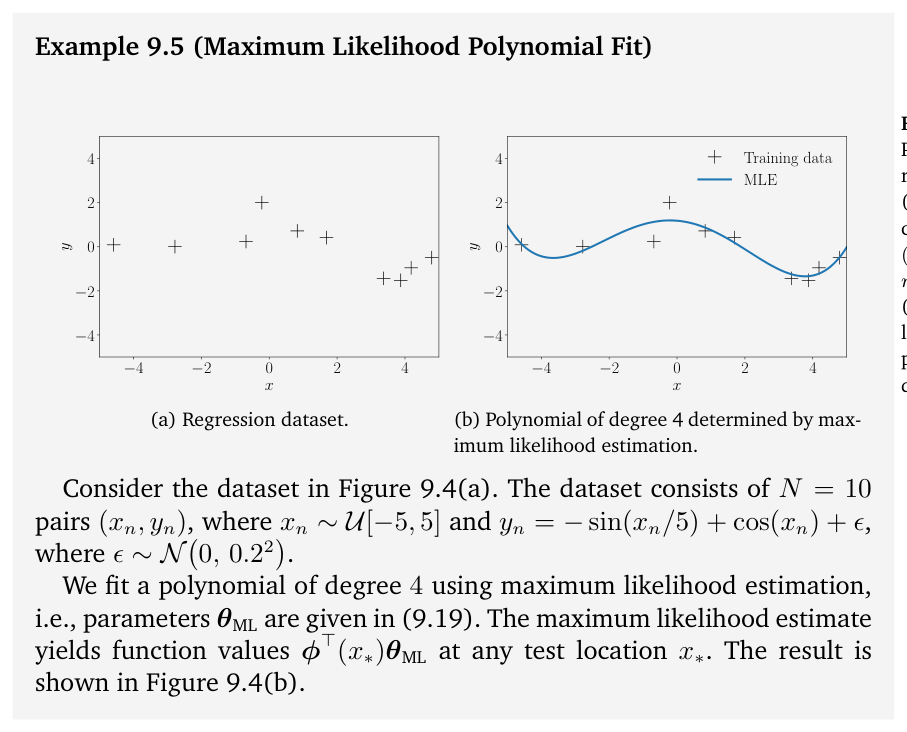
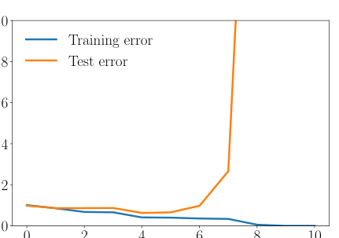
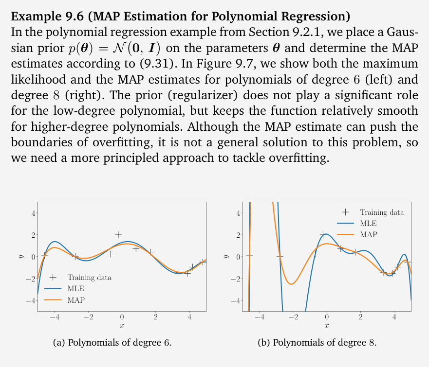
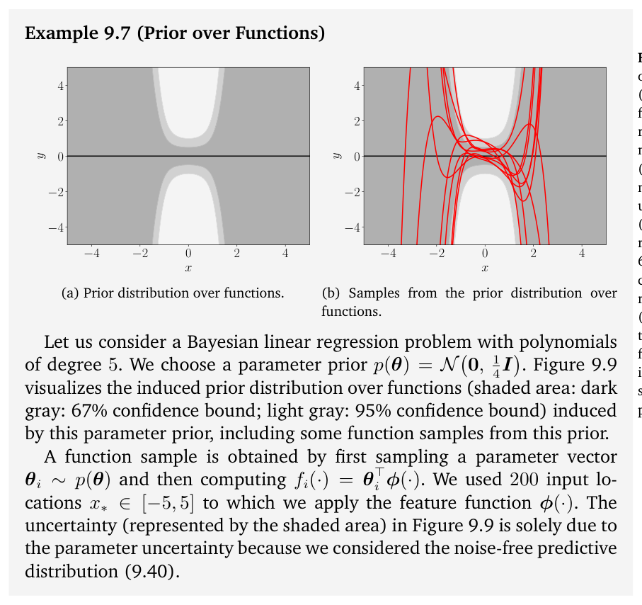
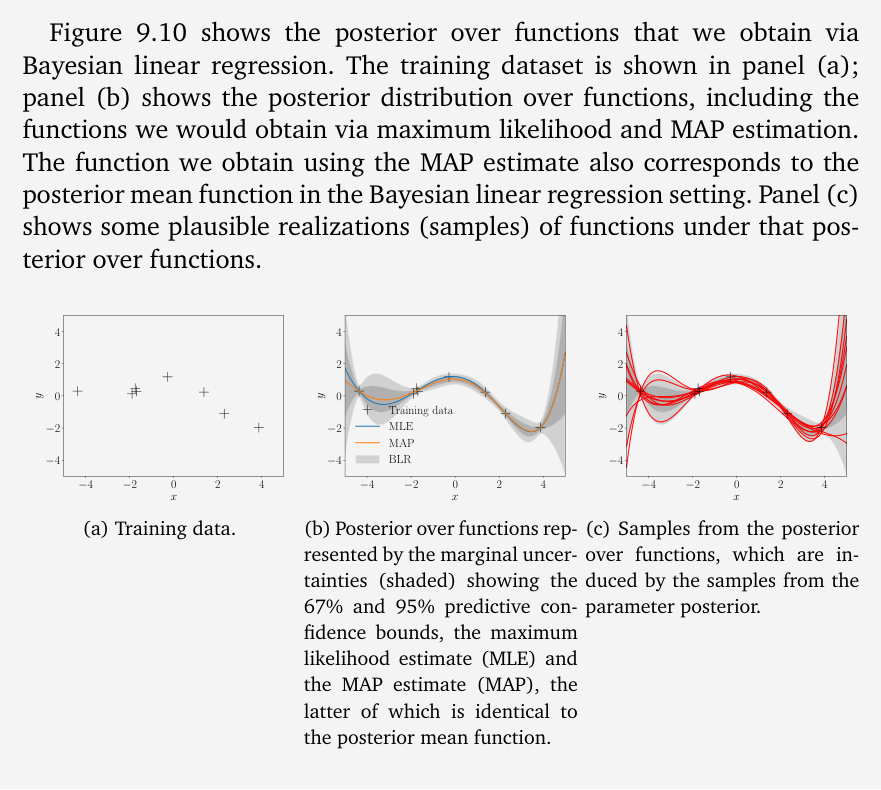
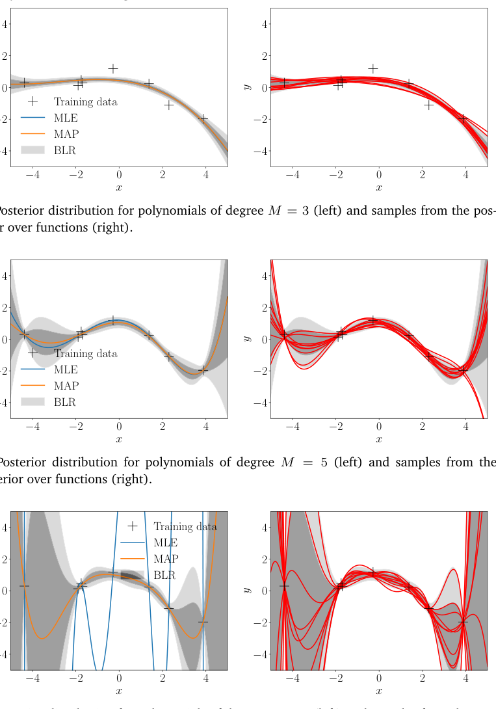
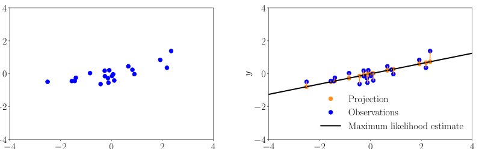

# 第 9 章 线性回归（Linear Regression）

> [← 返回目录](README.md)

## 9.1 问题表述（Problem Formulation）

> Because of the presence of observation noise, we will adopt a probabilistic approach and explicitly model the noise using a likelihood function. More specifically, throughout this chapter, we consider a regression problem with the likelihood function

由于观测噪声（observation noise）的存在，我们将采用概率方法，利用似然函数（likelihood function）显式地对噪声建模。更具体地说，本章通篇考虑具有如下似然函数的回归（regression）问题

$$
p(\boldsymbol{y} \mid \boldsymbol{x}) = \mathcal{N}\!\left(\boldsymbol{y} \mid f(\boldsymbol{x}), \sigma^2\right) \,. \tag{9.1}
$$

> Here, $\boldsymbol{x} \in \mathbb{R}^D$ are inputs and $\boldsymbol{y} \in \mathbb{R}$ are noisy function values (targets). With (9.1), the functional relationship between $\boldsymbol{x}$ and $\boldsymbol{y}$ is given as

这里，$\boldsymbol{x} \in \mathbb{R}^D$ 是输入，$\boldsymbol{y} \in \mathbb{R}$ 是带噪声的函数值（目标值）。根据 (9.1)，$\boldsymbol{x}$ 与 $\boldsymbol{y}$ 之间的函数关系由下式给出

$$
\boldsymbol{y} = f(\boldsymbol{x}) + \epsilon \,, \tag{9.2}
$$

> where $\epsilon \sim \mathcal{N}(0, \sigma^2)$ is independent, identically distributed (i.i.d.) Gaussian measurement noise with mean 0 and variance $\sigma^2$. Our objective is to find a function that is close (similar) to the unknown function $f$ that generated the data and that generalizes well.

其中，$\epsilon \sim \mathcal{N}(0, \sigma^2)$ 是独立同分布（i.i.d.）的高斯测量噪声（measurement noise），其均值为 0，方差（variance）为 $\sigma^2$。我们的目标是找到一个与生成数据的未知函数 $f$ 接近（相似），并且泛化（generalization）良好的函数。

> In this chapter, we focus on parametric models, i.e., we choose a parametrized function and find parameters $\boldsymbol{\theta}$ that “work well” for modeling the data. For the time being, we assume that the noise variance $\sigma^2$ is known and focus on learning the model parameters $\boldsymbol{\theta}$. In linear regression, we consider the special case that the parameters $\boldsymbol{\theta}$ appear linearly in our model. An example of linear regression is given by

本章中，我们关注参数模型（parametric model），即选取一个参数化的函数，并寻找能对数据“良好地”建模的参数 $\boldsymbol{\theta}$。目前我们暂且假设噪声方差 $\sigma^2$ 已知，并将注意力集中在学习模型参数 $\boldsymbol{\theta}$ 上。在线性回归（linear regression）中，我们考虑参数 $\boldsymbol{\theta}$ 在模型中线性出现的特殊情形。线性回归的一个例子由下式给出

$$
\begin{aligned}
p(\boldsymbol{y} \mid \boldsymbol{x}, \boldsymbol{\theta}) &= \mathcal{N}\!\left(\boldsymbol{y} \mid \boldsymbol{x}^\top \boldsymbol{\theta}, \sigma^2\right) \tag{9.3} \\
\Leftrightarrow\quad \boldsymbol{y} &= \boldsymbol{x}^\top \boldsymbol{\theta} + \epsilon\,, \qquad \epsilon \sim \mathcal{N}(0, \sigma^2)\,, \tag{9.4}
\end{aligned}
$$

> where $\boldsymbol{\theta} \in \mathbb{R}^D$ are the parameters we seek. The class of functions described by (9.4) are straight lines that pass through the origin. In (9.4), we chose a parametrization $f(\boldsymbol{x}) = \boldsymbol{x}^\top \boldsymbol{\theta}$. A Dirac delta (delta function) is zero everywhere except at a single point, and its integral is 1. It can be considered a Gaussian in the limit of $\sigma^2 \to 0$.

其中，$\boldsymbol{\theta} \in \mathbb{R}^D$ 是我们所求的参数。(9.4) 所描述的函数类是过原点的直线。在 (9.4) 中，我们选取了参数化（parametrization）形式 $f(\boldsymbol{x}) = \boldsymbol{x}^\top \boldsymbol{\theta}$。狄拉克 $\delta$ 函数（Dirac delta）除单个点外处处为零，且其积分为 1；它可以被视为 $\sigma^2 \to 0$ 极限下的高斯分布。

> The likelihood in (9.3) is the probability density function of $\boldsymbol{y}$ evaluated at $\boldsymbol{x}^\top \boldsymbol{\theta}$. Note that the only source of uncertainty originates from the observation noise (as $\boldsymbol{x}$ and $\boldsymbol{\theta}$ are assumed known in (9.3)). Without observation noise, the relationship between $\boldsymbol{x}$ and $\boldsymbol{y}$ would be deterministic and (9.3) would be a Dirac delta.

(9.3) 中的似然是在 $\boldsymbol{x}^\top \boldsymbol{\theta}$ 处取值的 $\boldsymbol{y}$ 的概率密度函数（PDF）。注意，不确定性的唯一来源是观测噪声（在 (9.3) 中，$\boldsymbol{x}$ 和 $\boldsymbol{\theta}$ 被假定为已知）。如果没有观测噪声，$\boldsymbol{x}$ 与 $\boldsymbol{y}$ 之间的关系将是确定性的，而 (9.3) 将成为一个狄拉克 $\delta$ 函数。

> **Example 9.1** For $x, \theta \in \mathbb{R}$ the linear regression model in (9.4) describes straight lines (linear functions), and the parameter $\theta$ is the slope of the line. Figure 9.2(a) shows some example functions for different values of $\theta$.

**例 9.1** 对于 $x, \theta \in \mathbb{R}$，(9.4) 中的线性回归模型描述的是直线（线性函数），参数 $\theta$ 就是直线的斜率（slope）。图 9.2(a) 展示了 $\theta$ 取不同值时的一些示例函数。

> The linear regression model in (9.3)–(9.4) is not only linear in the parameters, but also linear in the inputs $\boldsymbol{x}$. Figure 9.2(a) shows examples of such functions. We will see later that $\boldsymbol{y} = \boldsymbol{\phi}^\top(\boldsymbol{x})\boldsymbol{\theta}$ for nonlinear transformations $\boldsymbol{\phi}$ is also a linear regression model because “linear regression”

(9.3)–(9.4) 中的线性回归模型不仅对参数是线性的，对输入 $\boldsymbol{x}$ 也是线性的。图 9.2(a) 展示了这类函数的一些例子。我们稍后会看到，对于非线性变换 $\boldsymbol{\phi}$，$\boldsymbol{y} = \boldsymbol{\phi}^\top(\boldsymbol{x})\boldsymbol{\theta}$ 同样是线性回归模型，因为“线性回归”

> **Figure 9.2** Linear regression example. (a) Example functions that fall into this category; (b) training set; (c) maximum likelihood estimate.

**图 9.2** 线性回归示例。(a) 属于该类别的示例函数；(b) 训练集；(c) 最大似然估计。

> (a) Example functions (straight lines) that can be described using the linear model in (9.4). (b) Training set. (c) Maximum likelihood estimate.

(a) 可用 (9.4) 中的线性模型描述的示例函数（直线）；(b) 训练集；(c) 最大似然估计。

> refers to models that are “linear in the parameters”, i.e., models that describe a function by a linear combination of input features. Here, a “feature” is a representation $\boldsymbol{\phi}(\boldsymbol{x})$ of the inputs $\boldsymbol{x}$.

指的是“参数线性”的模型，即通过输入特征的线性组合来描述函数的模型。这里，“特征”（feature）是输入 $\boldsymbol{x}$ 的一种表示 $\boldsymbol{\phi}(\boldsymbol{x})$。

> In the following, we will discuss in more detail how to find good parameters $\boldsymbol{\theta}$ and how to evaluate whether a parameter set “works well”. For the time being, we assume that the noise variance $\sigma^2$ is known.

接下来，我们将更详细地讨论如何寻找好的参数 $\boldsymbol{\theta}$，以及如何评估一组参数是否“表现良好”。目前我们暂且假设噪声方差 $\sigma^2$ 已知。

## 9.2 参数估计（Parameter Estimation）

> Consider the linear regression setting (9.4) and assume we are given a training set $\mathcal{D} := \{(\boldsymbol{x}_1, y_1), \ldots, (\boldsymbol{x}_N, y_N)\}$ consisting of $N$ inputs $\boldsymbol{x}_n \in \mathbb{R}^D$ and corresponding observations/targets $y_n \in \mathbb{R}$, $n = 1, \ldots, N$. The corresponding graphical model is given in Figure 9.3. Note that $y_i$ and $y_j$ are conditionally independent given their respective inputs $\boldsymbol{x}_i, \boldsymbol{x}_j$ so that the likelihood factorizes according to

考虑线性回归设定 (9.4)，假设给定一个训练集（training set）$\mathcal{D} := \{(\boldsymbol{x}_1, y_1), \ldots, (\boldsymbol{x}_N, y_N)\}$，它由 $N$ 个输入 $\boldsymbol{x}_n \in \mathbb{R}^D$ 以及对应的观测值/目标值（observations/targets）$y_n \in \mathbb{R}$ 组成，$n = 1, \ldots, N$。对应的图模型（graphical model）由图 9.3 给出。注意，在给定各自输入 $\boldsymbol{x}_i, \boldsymbol{x}_j$ 的条件下，$y_i$ 与 $y_j$ 条件独立（conditionally independent），因此似然可分解为

> **Figure 9.3** Probabilistic graphical model for linear regression. Observed random variables are shaded, deterministic/known values are without circles.

**图 9.3** 线性回归的概率图模型。带阴影者为被观测的随机变量，确定性/已知值不带圆圈。

$$
\begin{aligned}
p(\mathcal{Y} \mid \mathcal{X}, \boldsymbol{\theta}) &= p(y_1, \ldots, y_N \mid \boldsymbol{x}_1, \ldots, \boldsymbol{x}_N, \boldsymbol{\theta}) \tag{9.5a}\\
&= \prod_{n=1}^{N} p(y_n \mid \boldsymbol{x}_n, \boldsymbol{\theta}) = \prod_{n=1}^{N} \mathcal{N}\!\left(y_n \mid \boldsymbol{x}_n^\top \boldsymbol{\theta}, \sigma^2\right) \,, \tag{9.5b}
\end{aligned}
$$

> where we defined $\mathcal{X} := \{\boldsymbol{x}_1, \ldots, \boldsymbol{x}_N\}$ and $\mathcal{Y} := \{y_1, \ldots, y_N\}$ as the sets of training inputs and corresponding targets, respectively. The likelihood and the factors $p(y_n \mid \boldsymbol{x}_n, \boldsymbol{\theta})$ are Gaussian due to the noise distribution; see (9.3).

其中，我们定义 $\mathcal{X} := \{\boldsymbol{x}_1, \ldots, \boldsymbol{x}_N\}$ 与 $\mathcal{Y} := \{y_1, \ldots, y_N\}$ 分别为训练输入和对应目标值的集合。由于噪声分布的存在，似然以及各因子 $p(y_n \mid \boldsymbol{x}_n, \boldsymbol{\theta})$ 均为高斯分布；见 (9.3)。

> In the following, we will discuss how to find optimal parameters $\boldsymbol{\theta}_* \in \mathbb{R}^D$ for the linear regression model (9.4). Once the parameters $\boldsymbol{\theta}_*$ are found, we can predict function values by using this parameter estimate in (9.4) so that at an arbitrary test input $\boldsymbol{x}_*$ the distribution of the corresponding target $y_*$ is

接下来，我们将讨论如何为线性回归模型 (9.4) 寻找最优参数 $\boldsymbol{\theta}_* \in \mathbb{R}^D$。一旦求得参数 $\boldsymbol{\theta}_*$，我们就可以在 (9.4) 中使用这一参数估计值来预测函数值，使得在任意测试输入 $\boldsymbol{x}_*$ 处，对应目标值 $y_*$ 的分布为

$$
p(y_* \mid \boldsymbol{x}_*, \boldsymbol{\theta}_*) = \mathcal{N}\!\left(y_* \mid \boldsymbol{x}_*^\top \boldsymbol{\theta}_*, \sigma^2\right) \,. \tag{9.6}
$$

> In the following, we will have a look at parameter estimation by maximizing the likelihood, a topic that we already covered to some degree in Section 8.3.

接下来，我们将考察通过最大化似然来进行参数估计的方法，这一主题我们在 8.3 节已有一定程度的讨论。

### 9.2.1 最大似然估计（Maximum Likelihood Estimation）

> A widely used approach to finding the desired parameters $\boldsymbol{\theta}_{\text{ML}}$ is maximum likelihood estimation, where we find parameters $\boldsymbol{\theta}_{\text{ML}}$ that maximize the likelihood (9.5b). Intuitively, maximizing the likelihood means maximizing the predictive distribution of the training data given the model parameters. We obtain the maximum likelihood parameters as

寻找所求参数 $\boldsymbol{\theta}_{\text{ML}}$ 的一种被广泛采用的方法是最大似然估计（MLE），即寻找使似然 (9.5b) 最大化的参数 $\boldsymbol{\theta}_{\text{ML}}$。直观地说，最大化似然就意味着在给定模型参数的条件下最大化训练数据的预测分布（predictive distribution）。我们由下式得到最大似然参数

$$
\boldsymbol{\theta}_{\text{ML}} \in \arg\max_{\boldsymbol{\theta}} \; p(\mathcal{Y} \mid \mathcal{X}, \boldsymbol{\theta}) \,. \tag{9.7}
$$

> **Remark.** The likelihood $p(y \mid \boldsymbol{x}, \boldsymbol{\theta})$ is not a probability distribution in $\boldsymbol{\theta}$: It is simply a function of the parameters $\boldsymbol{\theta}$ but does not integrate to 1 (i.e., it is unnormalized), and may not even be integrable with respect to $\boldsymbol{\theta}$. However, the likelihood in (9.7) is a normalized probability distribution in $y$. ♢

**评注.** 似然 $p(y \mid \boldsymbol{x}, \boldsymbol{\theta})$ 不是关于 $\boldsymbol{\theta}$ 的概率分布：它只是参数 $\boldsymbol{\theta}$ 的一个函数，其积分不为 1（即未归一化），甚至关于 $\boldsymbol{\theta}$ 可能根本不可积。不过，(9.7) 中的似然是关于 $y$ 的归一化概率分布。♢

> To find the desired parameters $\boldsymbol{\theta}_{\text{ML}}$ that maximize the likelihood, we typically perform gradient ascent (or gradient descent on the negative likelihood). In the case of linear regression we consider here, however, a closed-form solution exists, which makes iterative gradient descent unnecessary. In practice, instead of maximizing the likelihood directly, we apply the log-transformation to the likelihood function and minimize the negative log-likelihood.

为了找到使似然最大化的所求参数 $\boldsymbol{\theta}_{\text{ML}}$，我们通常会进行梯度上升（gradient ascent）（或在负似然上进行梯度下降（gradient descent））。然而，对于这里考虑的线性回归情形，存在闭式解，因而无需迭代式的梯度下降。实践中，我们并不直接最大化似然，而是对似然函数作对数变换，转而最小化负对数似然（negative log-likelihood）。

> **Remark** (Log-Transformation). Since the likelihood (9.5b) is a product of $N$ Gaussian distributions, the log-transformation is useful since (a) it does not suffer from numerical underflow, and (b) the differentiation rules will turn out simpler. More specifically, numerical underflow will be a problem when we multiply $N$ probabilities, where $N$ is the number of data points, since we cannot represent very small numbers, such as $10^{-256}$. Furthermore, the log-transform will turn the product into a sum of log-probabilities such that the corresponding gradient is a sum of individual gradients, instead of a repeated application of the product rule (5.46) to compute the gradient of a product of $N$ terms. ♢

**评注**（对数变换）。由于似然 (9.5b) 是 $N$ 个高斯分布的乘积，对数变换颇为有用：其一，它不会遭遇数值下溢（numerical underflow）；其二，求导法则会更简单。更具体地说，当我们连乘 $N$ 个概率（$N$ 为数据点数目）时会出现数值下溢问题，因为我们无法表示非常小的数，例如 $10^{-256}$。此外，对数变换会把乘积变为对数概率之和，从而对应的梯度是各个梯度之和，而无需反复应用乘积法则（product rule）(5.46) 来计算 $N$ 项乘积的梯度。♢

> To find the optimal parameters $\boldsymbol{\theta}_{\text{ML}}$ of our linear regression problem, we minimize the negative log-likelihood

为了求出该线性回归问题的最优参数 $\boldsymbol{\theta}_{\text{ML}}$，我们最小化负对数似然

$$
-\log p(\mathcal{Y} \mid \mathcal{X}, \boldsymbol{\theta}) = -\log \prod_{n=1}^{N} p(y_n \mid \boldsymbol{x}_n, \boldsymbol{\theta}) = -\sum_{n=1}^{N} \log p(y_n \mid \boldsymbol{x}_n, \boldsymbol{\theta}) \,, \tag{9.8}
$$

> where we exploited that the likelihood (9.5b) factorizes over the number of data points due to our independence assumption on the training set.

其中，我们利用了这样一个事实：由于对训练集的独立性假设，似然 (9.5b) 可按数据点数目分解。

> In the linear regression model (9.4), the likelihood is Gaussian (due to the Gaussian additive noise term), such that we arrive at

在线性回归模型 (9.4) 中，似然是高斯的（因为有高斯加性噪声项），于是我们得到

$$
\log p(y_n \mid \boldsymbol{x}_n, \boldsymbol{\theta}) = -\frac{1}{2\sigma^2} (y_n - \boldsymbol{x}_n^\top \boldsymbol{\theta})^2 + \text{const} \,, \tag{9.9}
$$

> where the constant includes all terms independent of $\boldsymbol{\theta}$. Using (9.9) in the negative log-likelihood (9.8), we obtain (ignoring the constant terms)

其中，常数包含了所有与 $\boldsymbol{\theta}$ 无关的项。将 (9.9) 代入负对数似然 (9.8)，可得（忽略常数项）

$$
\begin{aligned}
L(\boldsymbol{\theta}) &:= \frac{1}{2\sigma^2} \sum_{n=1}^{N} (y_n - \boldsymbol{x}_n^\top\boldsymbol{\theta})^2 \tag{9.10a}\\
&= \frac{1}{2\sigma^2} (\boldsymbol{y}-\boldsymbol{X}\boldsymbol{\theta})^\top(\boldsymbol{y}-\boldsymbol{X}\boldsymbol{\theta}) = \frac{1}{2\sigma^2} \|\boldsymbol{y}-\boldsymbol{X}\boldsymbol{\theta}\|^2 \,, \tag{9.10b}
\end{aligned}
$$

> where we define the design matrix $\boldsymbol{X} := [\boldsymbol{x}_1, \ldots, \boldsymbol{x}_N]^\top \in \mathbb{R}^{N\times D}$ as the collection of training inputs and $\boldsymbol{y} := [y_1, \ldots, y_N]^\top \in \mathbb{R}^N$ as a vector that collects all training targets. Note that the $n$th row in the design matrix $\boldsymbol{X}$ corresponds to the training input $\boldsymbol{x}_n$. In (9.10b), we used the fact that the sum of squared errors between the observations $y_n$ and the corresponding model prediction $\boldsymbol{x}_n^\top\boldsymbol{\theta}$ equals the squared distance between $\boldsymbol{y}$ and $\boldsymbol{X}\boldsymbol{\theta}$.

其中，我们定义设计矩阵（design matrix）$\boldsymbol{X} := [\boldsymbol{x}_1, \ldots, \boldsymbol{x}_N]^\top \in \mathbb{R}^{N\times D}$ 为训练输入的汇集，并定义 $\boldsymbol{y} := [y_1, \ldots, y_N]^\top \in \mathbb{R}^N$ 为收集全部训练目标值的向量。注意，设计矩阵 $\boldsymbol{X}$ 的第 $n$ 行对应训练输入 $\boldsymbol{x}_n$。在 (9.10b) 中，我们用到了如下事实：观测值 $y_n$ 与对应模型预测 $\boldsymbol{x}_n^\top\boldsymbol{\theta}$ 之间的误差平方和，等于 $\boldsymbol{y}$ 与 $\boldsymbol{X}\boldsymbol{\theta}$ 之间的距离平方。

> With (9.10b), we have now a concrete form of the negative log-likelihood function we need to optimize. We immediately see that (9.10b) is quadratic in $\boldsymbol{\theta}$. This means that we can find a unique global solution $\boldsymbol{\theta}_{\text{ML}}$ for minimizing the negative log-likelihood $L$. We can find the global optimum by computing the gradient of $L$, setting it to 0 and solving for $\boldsymbol{\theta}$.

有了 (9.10b)，我们便得到了需要优化的负对数似然函数的一个具体形式。我们立即看出，(9.10b) 关于 $\boldsymbol{\theta}$ 是二次的。这意味着我们可以找到一个唯一的全局解 $\boldsymbol{\theta}_{\text{ML}}$ 来最小化负对数似然 $L$。我们可以通过计算 $L$ 的梯度、令其为 0 并求解 $\boldsymbol{\theta}$ 来找到全局最优值。

> Using the results from Chapter 5, we compute the gradient of $L$ with respect to the parameters as

利用第 5 章的结果，我们计算 $L$ 关于参数的梯度为

$$
\begin{aligned}
\frac{\mathrm{d}L}{\mathrm{d}\boldsymbol{\theta}} &= \frac{\mathrm{d}}{\mathrm{d}\boldsymbol{\theta}} \left( \frac{1}{2\sigma^2} (\boldsymbol{y}-\boldsymbol{X}\boldsymbol{\theta})^\top (\boldsymbol{y}-\boldsymbol{X}\boldsymbol{\theta}) \right) \tag{9.11a}\\
&= \frac{1}{2\sigma^2} \frac{\mathrm{d}}{\mathrm{d}\boldsymbol{\theta}} \left( \boldsymbol{y}^\top\boldsymbol{y} - 2\boldsymbol{y}^\top\boldsymbol{X}\boldsymbol{\theta} + \boldsymbol{\theta}^\top\boldsymbol{X}^\top\boldsymbol{X}\boldsymbol{\theta} \right) \tag{9.11b}\\
&= \frac{1}{\sigma^2} (-\boldsymbol{y}^\top\boldsymbol{X} + \boldsymbol{\theta}^\top\boldsymbol{X}^\top\boldsymbol{X}) \in \mathbb{R}^{1\times D} \,. \tag{9.11c}
\end{aligned}
$$

> The maximum likelihood estimator $\boldsymbol{\theta}_{\text{ML}}$ solves $\mathrm{d}L/\mathrm{d}\boldsymbol{\theta} = \boldsymbol{0}^\top$ (necessary optimality condition) and we obtain

最大似然估计量（maximum likelihood estimator）$\boldsymbol{\theta}_{\text{ML}}$ 满足 $\mathrm{d}L/\mathrm{d}\boldsymbol{\theta} = \boldsymbol{0}^\top$（必要最优性条件），由此我们得到

$$
\begin{aligned}
\frac{\mathrm{d}L}{\mathrm{d}\boldsymbol{\theta}} &= \boldsymbol{0}^\top \tag{9.11c}\\
\Leftrightarrow\quad \boldsymbol{\theta}_{\text{ML}}^\top \boldsymbol{X}^\top \boldsymbol{X} &= \boldsymbol{y}^\top \boldsymbol{X} \tag{9.12a}\\
\Leftrightarrow\quad \boldsymbol{\theta}_{\text{ML}}^\top &= \boldsymbol{y}^\top \boldsymbol{X} \left(\boldsymbol{X}^\top \boldsymbol{X}\right)^{-1} \tag{9.12b}\\
\Leftrightarrow\quad \boldsymbol{\theta}_{\text{ML}} &= \left(\boldsymbol{X}^\top \boldsymbol{X}\right)^{-1} \boldsymbol{X}^\top \boldsymbol{y} \,. \tag{9.12c}
\end{aligned}
$$

> We could right-multiply the first equation by $\left(\boldsymbol{X}^\top\boldsymbol{X}\right)^{-1}$ because $\boldsymbol{X}^\top\boldsymbol{X}$ is positive definite if $\operatorname{rk}(\boldsymbol{X}) = D$, where $\operatorname{rk}(\boldsymbol{X})$ denotes the rank of $\boldsymbol{X}$.

我们之所以能用 $\left(\boldsymbol{X}^\top\boldsymbol{X}\right)^{-1}$ 右乘第一个等式，是因为当 $\operatorname{rk}(\boldsymbol{X}) = D$ 时 $\boldsymbol{X}^\top\boldsymbol{X}$ 正定（positive definite），其中 $\operatorname{rk}(\boldsymbol{X})$ 表示 $\boldsymbol{X}$ 的秩（rank）。

> **Remark.** Setting the gradient to $\boldsymbol{0}^\top$ is a necessary and sufficient condition, and we obtain a global minimum since the Hessian $\nabla^2_{\boldsymbol{\theta}} L(\boldsymbol{\theta}) = \boldsymbol{X}^\top\boldsymbol{X} \in \mathbb{R}^{D\times D}$ is positive definite. ♢

**评注.** 将梯度置为 $\boldsymbol{0}^\top$ 是充分必要条件，并且由于海森矩阵（Hessian）$\nabla^2_{\boldsymbol{\theta}} L(\boldsymbol{\theta}) = \boldsymbol{X}^\top\boldsymbol{X} \in \mathbb{R}^{D\times D}$ 正定，我们得到的是全局最小值（global minimum）。♢

> **Remark.** The maximum likelihood solution in (9.12c) requires us to solve a system of linear equations of the form $\boldsymbol{A}\boldsymbol{\theta} = \boldsymbol{b}$ with $\boldsymbol{A} = \left(\boldsymbol{X}^\top\boldsymbol{X}\right)$ and $\boldsymbol{b} = \boldsymbol{X}^\top\boldsymbol{y}$. ♢

**评注.** (9.12c) 中的最大似然解要求我们求解形如 $\boldsymbol{A}\boldsymbol{\theta} = \boldsymbol{b}$ 的线性方程组（system of linear equations），其中 $\boldsymbol{A} = \left(\boldsymbol{X}^\top\boldsymbol{X}\right)$，$\boldsymbol{b} = \boldsymbol{X}^\top\boldsymbol{y}$。♢

> **Example 9.2** (Fitting Lines) Let us have a look at Figure 9.2, where we aim to fit a straight line $f(x) = \theta x$, where $\theta$ is an unknown slope, to a dataset using maximum likelihood estimation. Examples of functions in this model class (straight lines) are shown in Figure 9.2(a). For the dataset shown in Figure 9.2(b), we find the maximum likelihood estimate of the slope parameter $\theta$ using (9.12c) and obtain the maximum likelihood linear function in Figure 9.2(c).

**例 9.2**（拟合直线）让我们看看图 9.2：我们希望利用最大似然估计，把一条直线 $f(x) = \theta x$（其中 $\theta$ 为未知的斜率）拟合到某个数据集上。该模型类（直线）中的函数示例如图 9.2(a) 所示。对于图 9.2(b) 所示的数据集，我们利用 (9.12c) 求出斜率参数 $\theta$ 的最大似然估计，得到图 9.2(c) 中的最大似然直线。

**最大似然估计与特征（Maximum Likelihood Estimation with Features）**

> So far, we considered the linear regression setting described in (9.4), which allowed us to fit straight lines to data using maximum likelihood estimation. However, straight lines are not sufficiently expressive when it comes to fitting more interesting data. Fortunately, linear regression offers us a way to fit nonlinear functions within the linear regression framework: Since “linear regression” only refers to “linear in the parameters”, we can perform an arbitrary nonlinear transformation $\boldsymbol{\phi}(\boldsymbol{x})$ of the inputs $\boldsymbol{x}$ and then linearly combine the components of this transformation. The corresponding linear regression model is

到目前为止，我们考虑的是 (9.4) 所描述的线性回归设定，利用最大似然估计，它使我们能够把直线拟合到数据上。然而，当要拟合更有意思的数据时，直线的表达能力是不够的。幸运的是，线性回归为我们提供了一种在线性回归框架内拟合非线性函数的途径：由于“线性回归”仅指“参数线性”，我们可以对输入 $\boldsymbol{x}$ 施加任意非线性变换 $\boldsymbol{\phi}(\boldsymbol{x})$，再将该变换的各分量进行线性组合。相应的线性回归模型为

$$
p(y \mid \boldsymbol{x}, \boldsymbol{\theta}) = \mathcal{N}\!\left(y \mid \boldsymbol{\phi}^\top(\boldsymbol{x})\boldsymbol{\theta}, \sigma^2\right)
\Leftrightarrow\quad y = \boldsymbol{\phi}^\top(\boldsymbol{x})\boldsymbol{\theta} + \epsilon = \sum_{k=0}^{K-1} \theta_k \phi_k(\boldsymbol{x}) + \epsilon \,, \tag{9.13}
$$

> where $\boldsymbol{\phi} : \mathbb{R}^D \to \mathbb{R}^K$ is a (nonlinear) transformation of the inputs $\boldsymbol{x}$ and $\phi_k : \mathbb{R}^D \to \mathbb{R}$ is the $k$th component of the feature vector $\boldsymbol{\phi}$. Note that the model parameters $\boldsymbol{\theta}$ still appear only linearly.

其中，$\boldsymbol{\phi} : \mathbb{R}^D \to \mathbb{R}^K$ 是输入 $\boldsymbol{x}$ 的一个（非线性）变换，$\phi_k : \mathbb{R}^D \to \mathbb{R}$ 是特征向量（feature vector）$\boldsymbol{\phi}$ 的第 $k$ 个分量。注意，模型参数 $\boldsymbol{\theta}$ 仍然只以线性形式出现。

> **Example 9.3** (Polynomial Regression) We are concerned with a regression problem $y = \boldsymbol{\phi}^\top(x)\boldsymbol{\theta} + \epsilon$, where $x \in \mathbb{R}$ and $\boldsymbol{\theta} \in \mathbb{R}^K$. A transformation that is often used in this context is

**例 9.3**（多项式回归）我们考虑回归问题 $y = \boldsymbol{\phi}^\top(x)\boldsymbol{\theta} + \epsilon$，其中 $x \in \mathbb{R}$，$\boldsymbol{\theta} \in \mathbb{R}^K$。在此情形下，一个常用的变换是

$$
\boldsymbol{\phi}(x) = \begin{pmatrix} \phi_0(x) \\ \phi_1(x) \\ \vdots \\ \phi_{K-1}(x) \end{pmatrix} = \begin{pmatrix} 1 \\ x \\ x^2 \\ x^3 \\ \vdots \\ x^{K-1} \end{pmatrix} \in \mathbb{R}^K \,. \tag{9.14}
$$

> This means that we “lift” the original one-dimensional input space into a $K$-dimensional feature space consisting of all monomials $x^k$ for $k = 0, \ldots, K-1$. With these features, we can model polynomials of degree $\leqslant K-1$ within the framework of linear regression: A polynomial of degree $K-1$ is

这意味着我们把原来的一维输入空间“提升”到一个 $K$ 维特征空间（feature space）中，该空间由所有单项式（monomial）$x^k$（$k = 0, \ldots, K-1$）组成。利用这些特征，我们可以在线性回归的框架内对次数 $\leqslant K-1$ 的多项式（polynomial）建模：次数为 $K-1$ 的多项式为

$$
f(x) = \sum_{k=0}^{K-1} \theta_k x^k = \boldsymbol{\phi}^\top(x)\boldsymbol{\theta} \,, \tag{9.15}
$$

> where $\boldsymbol{\phi}$ is defined in (9.14) and $\boldsymbol{\theta} = [\theta_0, \ldots, \theta_{K-1}]^\top \in \mathbb{R}^K$ contains the (linear) parameters $\theta_k$.

其中，$\boldsymbol{\phi}$ 由 (9.14) 定义，$\boldsymbol{\theta} = [\theta_0, \ldots, \theta_{K-1}]^\top \in \mathbb{R}^K$ 包含（线性）参数 $\theta_k$。

> Let us now have a look at maximum likelihood estimation of the parameters $\boldsymbol{\theta}$ in the linear regression model (9.13). We consider training inputs $\boldsymbol{x}_n \in \mathbb{R}^D$ and targets $y_n \in \mathbb{R}$, $n = 1, \ldots, N$, and define the feature matrix (design matrix) as

现在让我们考察线性回归模型 (9.13) 中参数 $\boldsymbol{\theta}$ 的最大似然估计。考虑训练输入 $\boldsymbol{x}_n \in \mathbb{R}^D$ 与目标值 $y_n \in \mathbb{R}$，$n = 1, \ldots, N$，并定义特征矩阵（feature matrix，亦称设计矩阵，design matrix）为

$$
\boldsymbol{\Phi} := \begin{pmatrix} \boldsymbol{\phi}^\top(\boldsymbol{x}_1) \\ \boldsymbol{\phi}^\top(\boldsymbol{x}_2) \\ \vdots \\ \boldsymbol{\phi}^\top(\boldsymbol{x}_N) \end{pmatrix} = \begin{pmatrix} \phi_0(\boldsymbol{x}_1) & \cdots & \phi_{K-1}(\boldsymbol{x}_1) \\ \phi_0(\boldsymbol{x}_2) & \cdots & \phi_{K-1}(\boldsymbol{x}_2) \\ \vdots & \vdots & \vdots \\ \phi_0(\boldsymbol{x}_N) & \cdots & \phi_{K-1}(\boldsymbol{x}_N) \end{pmatrix} \in \mathbb{R}^{N\times K} \,, \tag{9.16}
$$

> where $\Phi_{ij} = \phi_j(\boldsymbol{x}_i)$ and $\phi_j : \mathbb{R}^D \to \mathbb{R}$.

其中，$\Phi_{ij} = \phi_j(\boldsymbol{x}_i)$，且 $\phi_j : \mathbb{R}^D \to \mathbb{R}$。

> **Example 9.4** (Feature Matrix for Second-order Polynomials) For a second-order polynomial and $N$ training points $x_n \in \mathbb{R}$, $n = 1, \ldots, N$, the feature matrix is

**例 9.4**（二次多项式的特征矩阵）对于二次多项式和 $N$ 个训练点 $x_n \in \mathbb{R}$（$n = 1, \ldots, N$），特征矩阵为

$$
\boldsymbol{\Phi} = \begin{pmatrix} 1 & x_1 & x_1^2 \\ 1 & x_2 & x_2^2 \\ \vdots & \vdots & \vdots \\ 1 & x_N & x_N^2 \end{pmatrix} \,. \tag{9.17}
$$

> With the feature matrix $\boldsymbol{\Phi}$ defined in (9.16), the negative log-likelihood for the linear regression model (9.13) can be written as

利用 (9.16) 中定义的特征矩阵 $\boldsymbol{\Phi}$，线性回归模型 (9.13) 的负对数似然可以写为

$$
-\log p(\mathcal{Y} \mid \mathcal{X}, \boldsymbol{\theta}) = \frac{1}{2\sigma^2} (\boldsymbol{y}-\boldsymbol{\Phi}\boldsymbol{\theta})^\top(\boldsymbol{y}-\boldsymbol{\Phi}\boldsymbol{\theta}) + \text{const} \,. \tag{9.18}
$$

> Comparing (9.18) with the negative log-likelihood in (9.10b) for the “feature-free” model, we immediately see we just need to replace $\boldsymbol{X}$ with $\boldsymbol{\Phi}$. Since both $\boldsymbol{X}$ and $\boldsymbol{\Phi}$ are independent of the parameters $\boldsymbol{\theta}$ that we wish to optimize, we arrive immediately at the maximum likelihood estimate

将 (9.18) 与“无特征”模型的负对数似然 (9.10b) 加以比较，我们立即发现，只需把 $\boldsymbol{X}$ 替换为 $\boldsymbol{\Phi}$ 即可。由于 $\boldsymbol{X}$ 和 $\boldsymbol{\Phi}$ 都与我们要优化的参数 $\boldsymbol{\theta}$ 无关，我们立即得到最大似然估计

$$
\boldsymbol{\theta}_{\text{ML}} = \left(\boldsymbol{\Phi}^\top\boldsymbol{\Phi}\right)^{-1}\boldsymbol{\Phi}^\top\boldsymbol{y} \tag{9.19}
$$

> for the linear regression problem with nonlinear features defined in (9.13).

此即针对 (9.13) 中定义的带非线性特征的线性回归问题所得的最大似然估计。

> **Remark.** When we were working without features, we required $\boldsymbol{X}^\top\boldsymbol{X}$ to be invertible, which is the case when $\operatorname{rk}(\boldsymbol{X}) = D$, i.e., the columns of $\boldsymbol{X}$ are linearly independent. In (9.19), we therefore require $\boldsymbol{\Phi}^\top\boldsymbol{\Phi} \in \mathbb{R}^{K\times K}$ to be invertible. This is the case if and only if $\operatorname{rk}(\boldsymbol{\Phi}) = K$. ♢

**评注.** 在不使用特征时，我们要求 $\boldsymbol{X}^\top\boldsymbol{X}$ 可逆（invertible），这在 $\operatorname{rk}(\boldsymbol{X}) = D$（即 $\boldsymbol{X}$ 的各列线性无关（linearly independent））时成立。因此，在 (9.19) 中，我们要求 $\boldsymbol{\Phi}^\top\boldsymbol{\Phi} \in \mathbb{R}^{K\times K}$ 可逆，而这当且仅当 $\operatorname{rk}(\boldsymbol{\Phi}) = K$ 时成立。♢

> **Example 9.5** (Maximum Likelihood Polynomial Fit)

**例 9.5**（最大似然多项式拟合）

> **Figure 9.4** Polynomial regression: (a) dataset consisting of $(x_n, y_n)$ pairs, $n = 1, \ldots, 10$; (b) maximum likelihood polynomial of degree 4.

**图 9.4** 多项式回归：(a) 由 $(x_n, y_n)$ 数据对组成的数据集，$n = 1, \ldots, 10$；(b) 4 次最大似然多项式。

> (a) Regression dataset. (b) Polynomial of degree 4 determined by maximum likelihood estimation.

(a) 回归数据集；(b) 由最大似然估计确定的 4 次多项式。

> Consider the dataset in Figure 9.4(a). The dataset consists of $N = 10$ pairs $(x_n, y_n)$, where $x_n \sim \mathcal{U}[-5, 5]$ and $y_n = -\sin(x_n/5) + \cos(x_n) + \epsilon$, where $\epsilon \sim \mathcal{N}(0, 0.2^2)$. We fit a polynomial of degree 4 using maximum likelihood estimation, i.e., parameters $\boldsymbol{\theta}_{\text{ML}}$ are given in (9.19). The maximum likelihood estimate yields function values $\boldsymbol{\phi}^\top(x_*)\boldsymbol{\theta}_{\text{ML}}$ at any test location $x_*$. The result is shown in Figure 9.4(b).

考虑图 9.4(a) 中的数据集。该数据集由 $N = 10$ 个数据对 $(x_n, y_n)$ 组成，其中 $x_n \sim \mathcal{U}[-5, 5]$，$y_n = -\sin(x_n/5) + \cos(x_n) + \epsilon$，而 $\epsilon \sim \mathcal{N}(0, 0.2^2)$。我们利用最大似然估计来拟合一个 4 次多项式，即参数 $\boldsymbol{\theta}_{\text{ML}}$ 由 (9.19) 给出。在任意测试位置 $x_*$ 处，最大似然估计给出函数值 $\boldsymbol{\phi}^\top(x_*)\boldsymbol{\theta}_{\text{ML}}$。结果如图 9.4(b) 所示。

> **Estimating the Noise Variance**

**估计噪声方差**

> Thus far, we assumed that the noise variance $\sigma^2$ is known. However, we can also use the principle of maximum likelihood estimation to obtain the maximum likelihood estimator $\sigma^2_{\text{ML}}$ for the noise variance. To do this, we follow the standard procedure: We write down the log-likelihood, compute its derivative with respect to $\sigma^2 > 0$, set it to 0, and solve. The log-likelihood is given by

到目前为止，我们一直假设噪声方差 $\sigma^2$ 已知。然而，我们也可以利用最大似然估计的原理来得到噪声方差的最大似然估计量 $\sigma^2_{\text{ML}}$。为此，我们遵循标准流程：写出对数似然，计算它关于 $\sigma^2 > 0$ 的导数，令其为 0 并求解。对数似然由下式给出：

$$
\begin{aligned}
\log p(\mathcal{Y} \mid \mathcal{X}, \boldsymbol{\theta}, \sigma^2) &= \sum_{n=1}^{N} \log \mathcal{N}\!\left(y_n \mid \boldsymbol{\phi}^\top(\boldsymbol{x}_n)\boldsymbol{\theta}, \sigma^2\right) \tag{9.20a}\\
&= \sum_{n=1}^{N} \left( -\frac{1}{2}\log(2\pi) - \frac{1}{2}\log\sigma^2 - \frac{1}{2\sigma^2}\left(y_n - \boldsymbol{\phi}^\top(\boldsymbol{x}_n)\boldsymbol{\theta}\right)^2 \right) \tag{9.20b}\\
&= -\frac{N}{2}\log\sigma^2 - \frac{1}{2\sigma^2} \underbrace{\sum_{n=1}^{N} \left(y_n - \boldsymbol{\phi}^\top(\boldsymbol{x}_n)\boldsymbol{\theta}\right)^2}_{=:s} + \text{const} \,. \tag{9.20c}
\end{aligned}
$$

> The partial derivative of the log-likelihood with respect to $\sigma^2$ is then

于是，对数似然关于 $\sigma^2$ 的偏导数为

$$
\begin{aligned}
\frac{\partial \log p(\mathcal{Y} \mid \mathcal{X}, \boldsymbol{\theta}, \sigma^2)}{\partial \sigma^2} &= -\frac{N}{2\sigma^2} + \frac{1}{2\sigma^4} s = 0 \tag{9.21a}\\
\Longleftrightarrow \quad \frac{N}{2\sigma^2} &= \frac{s}{2\sigma^4} \tag{9.21b}
\end{aligned}
$$

> so that we identify

由此我们得到

$$
\sigma^2_{\text{ML}} = \frac{s}{N} = \frac{1}{N}\sum_{n=1}^{N} \left(y_n - \boldsymbol{\phi}^\top(\boldsymbol{x}_n)\boldsymbol{\theta}\right)^2 \,. \tag{9.22}
$$

> Therefore, the maximum likelihood estimate of the noise variance is the empirical mean of the squared distances between the noise-free function values $\boldsymbol{\phi}^\top(\boldsymbol{x}_n)\boldsymbol{\theta}$ and the corresponding noisy observations $y_n$ at input locations $\boldsymbol{x}_n$.

因此，噪声方差的最大似然估计，是无噪声函数值 $\boldsymbol{\phi}^\top(\boldsymbol{x}_n)\boldsymbol{\theta}$ 与输入位置 $\boldsymbol{x}_n$ 处相应带噪声观测值 $y_n$ 之间平方距离的经验均值。

### 9.2.2 线性回归中的过拟合（Overfitting in Linear Regression）

> We just discussed how to use maximum likelihood estimation to fit linear models (e.g., polynomials) to data. We can evaluate the quality of the model by computing the error/loss incurred. One way of doing this is to compute the negative log-likelihood (9.10b), which we minimized to determine the maximum likelihood estimator. Alternatively, given that the noise parameter $\sigma^2$ is not a free model parameter, we can ignore the scaling by $1/\sigma^2$, so that we end up with a squared-error-loss function $\|\boldsymbol{y}-\boldsymbol{\Phi}\boldsymbol{\theta}\|^2$. Instead of using this squared loss, we often use the root mean square error (RMSE)

刚才我们讨论了如何利用最大似然估计把线性模型（如多项式）拟合到数据上。我们可以通过计算所产生的误差/损失来评估模型的质量。一种方法是计算负对数似然 (9.10b)——为了确定最大似然估计量，我们此前最小化的正是它。另外，鉴于噪声参数 $\sigma^2$ 并不是自由的模型参数，我们可以忽略 $1/\sigma^2$ 的缩放，从而得到平方误差损失函数 $\|\boldsymbol{y}-\boldsymbol{\Phi}\boldsymbol{\theta}\|^2$。我们不直接使用这种平方损失，而是经常使用均方根误差（root mean square error，RMSE）

$$
\text{RMSE} = \sqrt{\frac{1}{N}\left\|\boldsymbol{y}-\boldsymbol{\Phi}\boldsymbol{\theta}\right\|^2} = \sqrt{\frac{1}{N}\sum_{n=1}^{N}\left(y_n-\boldsymbol{\phi}^\top(\boldsymbol{x}_n)\boldsymbol{\theta}\right)^2} \,, \tag{9.23}
$$

> which (a) allows us to compare errors of datasets with different sizes and (b) has the same scale and the same units as the observed function values $y_n$. For example, if we fit a model that maps postcodes ($x$ is given in latitude, longitude) to house prices ($y$-values are EUR) then the RMSE is also measured in EUR, whereas the squared error is given in EUR$^2$. If we choose to include the factor $\sigma^2$ from the original negative log-likelihood (9.10b), then we end up with a unitless objective, i.e., in the preceding example, our objective would no longer be in EUR or EUR$^2$.

它 (a) 使我们能够比较不同规模数据集的误差，并且 (b) 与观测到的函数值 $y_n$ 具有相同的量级和单位。例如，如果我们拟合一个从邮政编码（$x$ 由纬度、经度给出）到房价（$y$ 值以欧元计）的模型，那么 RMSE 也以欧元为单位，而平方误差的单位则是 EUR$^2$。如果我们选择把原始负对数似然 (9.10b) 中的因子 $\sigma^2$ 包含进来，就会得到一个无量纲的目标，也就是说，在前面的例子中，我们的目标将不再以欧元或 EUR$^2$ 为单位。

> For model selection (see Section 8.6), we can use the RMSE (or the negative log-likelihood) to determine the best degree of the polynomial by finding the polynomial degree $M$ that minimizes the objective. Given that the polynomial degree is a natural number, we can perform a brute-force search and enumerate all (reasonable) values of $M$. For a training set of size $N$ it is sufficient to test $0 \leqslant M \leqslant N-1$. For $M < N$, the maximum likelihood estimator is unique. For $M \geqslant N$, we have more parameters than data points, and would need to solve an underdetermined system of linear equations ($\boldsymbol{\Phi}^\top\boldsymbol{\Phi}$ in (9.19) would also no longer be invertible) so that there are infinitely many possible maximum likelihood estimators.

对于模型选择（参见 8.6 节），我们可以利用 RMSE（或负对数似然），通过寻找使目标函数最小的多项式次数 $M$ 来确定多项式的最佳次数。由于多项式次数是自然数，我们可以进行穷举搜索，枚举 $M$ 的所有（合理）取值。对于大小为 $N$ 的训练集，只需检验 $0 \leqslant M \leqslant N-1$。当 $M < N$ 时，最大似然估计量是唯一的。当 $M \geqslant N$ 时，参数个数多于数据点个数，我们将需要求解一个欠定的线性方程组（此时 (9.19) 中的 $\boldsymbol{\Phi}^\top\boldsymbol{\Phi}$ 也不再可逆），因而存在无穷多个可能的最大似然估计量。

> **Figure 9.5** Maximum likelihood fits for different polynomial degrees $M$.

**图 9.5** 不同多项式次数 $M$ 下的最大似然拟合。

> (a) $M = 0$ (b) $M = 1$ (c) $M = 3$ (d) $M = 4$ (e) $M = 6$ (f) $M = 9$

(a) $M = 0$；(b) $M = 1$；(c) $M = 3$；(d) $M = 4$；(e) $M = 6$；(f) $M = 9$

> Figure 9.5 shows a number of polynomial fits determined by maximum likelihood for the dataset from Figure 9.4(a) with $N = 10$ observations. We notice that polynomials of low degree (e.g., constants ($M = 0$) or linear ($M = 1$)) fit the data poorly and, hence, are poor representations of the true underlying function. For degrees $M = 3, \ldots, 6$, the fits look plausible and smoothly interpolate the data. When we go to higher-degree polynomials, we notice that they fit the data better and better. In the extreme case of $M = N - 1 = 9$, the function will pass through every single data point. However, these high-degree polynomials oscillate wildly and are a poor representation of the underlying function that generated the data, such that we suffer from overfitting.

图 9.5 展示了针对图 9.4(a) 中含 $N = 10$ 个观测值的数据集、通过最大似然确定的若干多项式拟合。我们注意到，低次多项式（例如常数（$M = 0$）或线性（$M = 1$））对数据的拟合很差，因而并不能很好地表示真实的潜在函数。对于次数 $M = 3, \ldots, 6$，拟合结果看起来合理，并平滑地插值这些数据。当我们提高多项式次数时，我们发现它们对数据的拟合越来越好。在极端情形 $M = N - 1 = 9$ 下，函数将精确通过每一个数据点。然而，这些高次多项式剧烈振荡，对生成数据的潜在函数表示得很差，因此我们遭遇了过拟合。

> Remember that the goal is to achieve good generalization by making accurate predictions for new (unseen) data. We obtain some quantitative insight into the dependence of the generalization performance on the polynomial of degree $M$ by considering a separate test set comprising 200 data points generated using exactly the same procedure used to generate the training set. As test inputs, we chose a linear grid of 200 points in the interval of $[-5, 5]$. For each choice of $M$, we evaluate the RMSE (9.23) for both the training data and the test data.

请记住，我们的目标是通过对新的（未见）数据做出准确预测来获得良好的泛化能力。为了定量地了解泛化性能对多项式次数 $M$ 的依赖关系，我们考虑一个单独的测试集，它包含 200 个数据点，由与生成训练集完全相同的步骤生成。作为测试输入，我们在区间 $[-5, 5]$ 内选取了由 200 个点组成的线性网格。对每一种 $M$ 的选取，我们都在训练数据和测试数据上评估 RMSE (9.23)。

> Looking now at the test error, which is a qualitive measure of the generalization properties of the corresponding polynomial, we notice that initially the test error decreases; see Figure 9.6 (orange). For fourth-order polynomials, the test error is relatively low and stays relatively constant up to degree 5. However, from degree 6 onward the test error increases significantly, and high-order polynomials have very bad generalization properties. In this particular example, this also is evident from the corresponding maximum likelihood fits in Figure 9.5. Note that the training error (blue curve in Figure 9.6) never increases when the degree of the polynomial increases. In our example, the best generalization (the point of the smallest test error) is obtained for a polynomial of degree $M = 4$.

现在来看测试误差——它是相应多项式泛化性能的一种定性衡量——我们注意到，起初测试误差是下降的；参见图 9.6（橙色曲线）。对于四次多项式，测试误差相对较低，并在直到 5 次的范围内保持相对恒定。然而，从 6 次开始，测试误差显著增大，高次多项式的泛化性能非常糟糕。在这个具体例子中，从图 9.5 中相应的最大似然拟合也能明显看出这一点。注意，当多项式次数增加时，训练误差（图 9.6 中的蓝色曲线）从不增大。在我们的例子中，最佳泛化（测试误差最小的点）由次数 $M = 4$ 的多项式取得。

> **Figure 9.6** Training and test error.

**图 9.6** 训练误差与测试误差。

### 9.2.3 最大后验估计（Maximum A Posteriori Estimation）

> We just saw that maximum likelihood estimation is prone to overfitting. We often observe that the magnitude of the parameter values becomes relatively large if we run into overfitting (Bishop, 2006).

我们刚刚看到，最大似然估计容易导致过拟合。我们经常观察到，一旦陷入过拟合，参数值的幅度往往会变得相对较大（Bishop, 2006）。

> To mitigate the effect of huge parameter values, we can place a prior distribution $p(\boldsymbol{\theta})$ on the parameters. The prior distribution explicitly encodes what parameter values are plausible (before having seen any data). For example, a Gaussian prior $p(\theta) = \mathcal{N}(0, 1)$ on a single parameter $\theta$ encodes that parameter values are expected lie in the interval $[-2, 2]$ (two standard deviations around the mean value). Once a dataset $\mathcal{X}, \mathcal{Y}$ is available, instead of maximizing the likelihood we seek parameters that maximize the posterior distribution $p(\boldsymbol{\theta} \mid \mathcal{X}, \mathcal{Y})$. This procedure is called maximum a posteriori (MAP) estimation.

为了减轻参数值过大的影响，我们可以对参数施加先验分布（prior distribution）$p(\boldsymbol{\theta})$。先验分布显式地编码了哪些参数值是合理的（在看到任何数据之前）。例如，对单个参数 $\theta$ 施加高斯先验 $p(\theta) = \mathcal{N}(0, 1)$，就编码了参数值预期落在区间 $[-2, 2]$ 内（均值附近两个标准差的范围）。一旦拥有了数据集 $\mathcal{X}, \mathcal{Y}$，我们就不再最大化似然，而是寻找使后验分布 $p(\boldsymbol{\theta} \mid \mathcal{X}, \mathcal{Y})$ 最大化的参数。这一过程称为最大后验估计（maximum a posteriori estimation，MAP）。

> The posterior over the parameters $\boldsymbol{\theta}$, given the training data $\mathcal{X}, \mathcal{Y}$, is obtained by applying Bayes' theorem (Section 6.3) as

在给定训练数据 $\mathcal{X}, \mathcal{Y}$ 的条件下，参数 $\boldsymbol{\theta}$ 上的后验分布可通过应用贝叶斯定理（6.3 节）得到：

$$
p(\boldsymbol{\theta} \mid \mathcal{X}, \mathcal{Y}) = \frac{p(\mathcal{Y} \mid \mathcal{X}, \boldsymbol{\theta}) p(\boldsymbol{\theta})}{p(\mathcal{Y} \mid \mathcal{X})} \,. \tag{9.24}
$$

> Since the posterior explicitly depends on the parameter prior $p(\boldsymbol{\theta})$, the prior will have an effect on the parameter vector we find as the maximizer of the posterior. We will see this more explicitly in the following. The parameter vector $\boldsymbol{\theta}_{\text{MAP}}$ that maximizes the posterior (9.24) is the MAP estimate.

由于后验显式地依赖于参数先验 $p(\boldsymbol{\theta})$，因此先验会对我们找到的作为后验最大化子的参数向量产生影响。接下来我们会更明确地看到这一点。使后验 (9.24) 最大化的参数向量 $\boldsymbol{\theta}_{\text{MAP}}$ 即为 MAP 估计。

> To find the MAP estimate, we follow steps that are similar in flavor to maximum likelihood estimation. We start with the log-transform and compute the log-posterior as

为了求得 MAP 估计，我们遵循与最大似然估计思路类似的步骤。我们从对数变换开始，计算对数后验（log-posterior）：

$$
\log p(\boldsymbol{\theta} \mid \mathcal{X}, \mathcal{Y}) = \log p(\mathcal{Y} \mid \mathcal{X}, \boldsymbol{\theta}) + \log p(\boldsymbol{\theta}) + \text{const} \,, \tag{9.25}
$$

> where the constant comprises the terms that are independent of $\boldsymbol{\theta}$. We see that the log-posterior in (9.25) is the sum of the log-likelihood $p(\mathcal{Y} \mid \mathcal{X}, \boldsymbol{\theta})$ and the log-prior $\log p(\boldsymbol{\theta})$ so that the MAP estimate will be a “compromise” between the prior (our suggestion for plausible parameter values before observing data) and the data-dependent likelihood.

其中，常数包含了与 $\boldsymbol{\theta}$ 无关的那些项。我们看到，(9.25) 中的对数后验是对数似然 $p(\mathcal{Y} \mid \mathcal{X}, \boldsymbol{\theta})$ 与对数先验 $\log p(\boldsymbol{\theta})$ 之和，因此 MAP 估计将是先验（在观测数据之前我们对合理参数值的建议）与依赖数据的似然之间的“折中”。

> To find the MAP estimate $\boldsymbol{\theta}_{\text{MAP}}$, we minimize the negative log-posterior distribution with respect to $\boldsymbol{\theta}$, i.e., we solve

为了求得 MAP 估计 $\boldsymbol{\theta}_{\text{MAP}}$，我们关于 $\boldsymbol{\theta}$ 最小化负对数后验分布，即求解

$$
\boldsymbol{\theta}_{\text{MAP}} \in \arg\min_{\boldsymbol{\theta}} \left\{ -\log p(\mathcal{Y} \mid \mathcal{X}, \boldsymbol{\theta}) - \log p(\boldsymbol{\theta}) \right\} \,. \tag{9.26}
$$

> The gradient of the negative log-posterior with respect to $\boldsymbol{\theta}$ is

负对数后验关于 $\boldsymbol{\theta}$ 的梯度为

$$
-\frac{\mathrm{d} \log p(\boldsymbol{\theta} \mid \mathcal{X}, \mathcal{Y})}{\mathrm{d}\boldsymbol{\theta}} = -\frac{\mathrm{d} \log p(\mathcal{Y} \mid \mathcal{X}, \boldsymbol{\theta})}{\mathrm{d}\boldsymbol{\theta}} - \frac{\mathrm{d} \log p(\boldsymbol{\theta})}{\mathrm{d}\boldsymbol{\theta}} \,, \tag{9.27}
$$

> where we identify the first term on the right-hand side as the gradient of the negative log-likelihood from (9.11c).

其中，右边的第一项正是来自 (9.11c) 的负对数似然的梯度。

> With a (conjugate) Gaussian prior $p(\boldsymbol{\theta}) = \mathcal{N}(\boldsymbol{0}, b^2\boldsymbol{I})$ on the parameters $\boldsymbol{\theta}$, the negative log-posterior for the linear regression setting (9.13), we obtain the negative log posterior

若对参数 $\boldsymbol{\theta}$ 施加（共轭的）高斯先验 $p(\boldsymbol{\theta}) = \mathcal{N}(\boldsymbol{0}, b^2\boldsymbol{I})$，则对于线性回归设定 (9.13)，我们得到负对数后验

$$
-\log p(\boldsymbol{\theta} \mid \mathcal{X}, \mathcal{Y}) = \frac{1}{2\sigma^2}\left(\boldsymbol{y}-\boldsymbol{\Phi}\boldsymbol{\theta}\right)^\top\left(\boldsymbol{y}-\boldsymbol{\Phi}\boldsymbol{\theta}\right) + \frac{1}{2b^2}\boldsymbol{\theta}^\top\boldsymbol{\theta} + \text{const} \,. \tag{9.28}
$$

> Here, the first term corresponds to the contribution from the log-likelihood, and the second term originates from the log-prior. The gradient of the log-posterior with respect to the parameters $\boldsymbol{\theta}$ is then

这里，第一项对应于来自对数似然的贡献，第二项则源自对数先验。于是，对数后验关于参数 $\boldsymbol{\theta}$ 的梯度为

$$
-\frac{\mathrm{d} \log p(\boldsymbol{\theta} \mid \mathcal{X}, \mathcal{Y})}{\mathrm{d}\boldsymbol{\theta}} = \frac{1}{\sigma^2}\left(\boldsymbol{\theta}^\top\boldsymbol{\Phi}^\top\boldsymbol{\Phi} - \boldsymbol{y}^\top\boldsymbol{\Phi}\right) + \frac{1}{b^2}\boldsymbol{\theta}^\top \,. \tag{9.29}
$$

> We will find the MAP estimate $\boldsymbol{\theta}_{\text{MAP}}$ by setting this gradient to $\boldsymbol{0}^\top$ and solving for $\boldsymbol{\theta}_{\text{MAP}}$. We obtain

我们将令该梯度等于 $\boldsymbol{0}^\top$ 并求解 $\boldsymbol{\theta}_{\text{MAP}}$，从而得到 MAP 估计。我们得到

$$
\begin{aligned}
\frac{1}{\sigma^2}\left(\boldsymbol{\theta}^\top\boldsymbol{\Phi}^\top\boldsymbol{\Phi} - \boldsymbol{y}^\top\boldsymbol{\Phi}\right) + \frac{1}{b^2}\boldsymbol{\theta}^\top &= \boldsymbol{0}^\top \tag{9.30a}\\
\Longleftrightarrow \quad \boldsymbol{\theta}^\top\left(\frac{1}{\sigma^2}\boldsymbol{\Phi}^\top\boldsymbol{\Phi} + \frac{1}{b^2}\boldsymbol{I}\right) - \frac{1}{\sigma^2}\boldsymbol{y}^\top\boldsymbol{\Phi} &= \boldsymbol{0}^\top \tag{9.30b}\\
\Longleftrightarrow \quad \boldsymbol{\theta}^\top\left(\boldsymbol{\Phi}^\top\boldsymbol{\Phi} + \frac{\sigma^2}{b^2}\boldsymbol{I}\right) &= \boldsymbol{y}^\top\boldsymbol{\Phi} \tag{9.30c}\\
\Longleftrightarrow \quad \boldsymbol{\theta}^\top &= \boldsymbol{y}^\top\boldsymbol{\Phi}\left(\boldsymbol{\Phi}^\top\boldsymbol{\Phi} + \frac{\sigma^2}{b^2}\boldsymbol{I}\right)^{-1} \tag{9.30d}
\end{aligned}
$$

> so that the MAP estimate is (by transposing both sides of the last equality)

因此（将最后一个等式的两边转置），MAP 估计为

$$
\boldsymbol{\theta}_{\text{MAP}} = \left(\boldsymbol{\Phi}^\top\boldsymbol{\Phi} + \frac{\sigma^2}{b^2}\boldsymbol{I}\right)^{-1}\boldsymbol{\Phi}^\top\boldsymbol{y} \,. \tag{9.31}
$$

> Comparing the MAP estimate in (9.31) with the maximum likelihood estimate in (9.19), we see that the only difference between both solutions is the additional term $\frac{\sigma^2}{b^2}\boldsymbol{I}$ in the inverse matrix. This term ensures that $\boldsymbol{\Phi}^\top\boldsymbol{\Phi} + \frac{\sigma^2}{b^2}\boldsymbol{I}$ is symmetric and strictly positive definite (i.e., its inverse exists and the MAP estimate is the unique solution of a system of linear equations). Moreover, it reflects the impact of the regularizer.

将 (9.31) 中的 MAP 估计与 (9.19) 中的最大似然估计加以比较，我们发现两个解之间唯一的差别是逆矩阵中多出的项 $\frac{\sigma^2}{b^2}\boldsymbol{I}$。这一项保证了 $\boldsymbol{\Phi}^\top\boldsymbol{\Phi} + \frac{\sigma^2}{b^2}\boldsymbol{I}$ 对称且严格正定（即其逆存在，且 MAP 估计是某个线性方程组的唯一解）。此外，它体现了正则化项（regularizer）的影响。

> **Example 9.6** (MAP Estimation for Polynomial Regression) In the polynomial regression example from Section 9.2.1, we place a Gaussian prior $p(\boldsymbol{\theta}) = \mathcal{N}(\boldsymbol{0}, \boldsymbol{I})$ on the parameters $\boldsymbol{\theta}$ and determine the MAP estimates according to (9.31). In Figure 9.7, we show both the maximum likelihood and the MAP estimates for polynomials of degree 6 (left) and degree 8 (right). The prior (regularizer) does not play a significant role for the low-degree polynomial, but keeps the function relatively smooth for higher-degree polynomials. Although the MAP estimate can push the boundaries of overfitting, it is not a general solution to this problem, so we need a more principled approach to tackle overfitting.

**例 9.6**（多项式回归的 MAP 估计） 在 9.2.1 节的多项式回归例子中，我们对参数 $\boldsymbol{\theta}$ 施加高斯先验 $p(\boldsymbol{\theta}) = \mathcal{N}(\boldsymbol{0}, \boldsymbol{I})$，并根据 (9.31) 确定最大后验估计（MAP）。图 9.7 中，我们展示了 6 次（左图）与 8 次（右图）多项式的最大似然估计和 MAP 估计。对于低次多项式，先验（正则化项）并不起显著作用；而对于高次多项式，它使函数保持相对平滑。尽管 MAP 估计可以延缓过拟合，但它并不是解决这一问题的通用方法，因此我们需要一种更有原则的方法来应对过拟合。

> **Figure 9.7** Polynomial regression: maximum likelihood and MAP estimates. (a) Polynomials of degree 6; (b) polynomials of degree 8.

**图 9.7** 多项式回归：最大似然估计与 MAP 估计。(a) 6 次多项式；(b) 8 次多项式。

### 9.2.4 将 MAP 估计视为正则化（MAP Estimation as Regularization）

> Instead of placing a prior distribution on the parameters $\boldsymbol{\theta}$, it is also possible to mitigate the effect of overfitting by penalizing the amplitude of the parameter by means of regularization. In regularized least squares, we consider the loss function

除了对参数 $\boldsymbol{\theta}$ 施加先验分布之外，还可以通过正则化（regularization）来惩罚参数的幅度，从而减轻过拟合的影响。在正则化最小二乘（regularized least squares）中，我们考虑损失函数

$$
\|\boldsymbol{y}-\boldsymbol{\Phi}\boldsymbol{\theta}\|^2+\lambda\|\boldsymbol{\theta}\|_2^2\,, \tag{9.32}
$$

> which we minimize with respect to $\boldsymbol{\theta}$ (see Section 8.2.3). Here, the first term is a data-fit term (also called misfit term), which is proportional to the negative log-likelihood; see (9.10b). The second term is called the regularizer, and the regularization parameter $\lambda \geqslant 0$ controls the “strictness” of the regularization.

我们关于 $\boldsymbol{\theta}$ 对其进行最小化（参见 8.2.3 节）。这里，第一项是数据拟合项（data-fit term，也称失配项（misfit term）），它与负对数似然成正比；参见 (9.10b)。第二项称为正则化项（regularizer），而正则化参数（regularization parameter）$\lambda \geqslant 0$ 控制着正则化的“严格程度”。

> **Remark.** Instead of the Euclidean norm $\|\cdot\|_2$, we can choose any $p$-norm $\|\cdot\|_p$ in (9.32). In practice, smaller values for $p$ lead to sparser solutions. Here, “sparse” means that many parameter values $\theta_d = 0$, which is also

**评注.** 在 (9.32) 中，我们也可以不使用欧几里得范数（Euclidean norm）$\|\cdot\|_2$，而选择任意 $p$-范数 $\|\cdot\|_p$。在实际应用中，$p$ 取值越小，得到的解越稀疏。这里的“稀疏”是指许多参数取值为 $\theta_d = 0$，这也是

> useful for variable selection. For $p = 1$, the regularizer is called LASSO (least absolute shrinkage and selection operator) and was proposed by Tibshirani (1996). ♢

对变量选择很有用。当 $p = 1$ 时，该正则化项称为 LASSO（least absolute shrinkage and selection operator，最小绝对收缩与选择算子），由 Tibshirani (1996) 提出。♢

> The regularizer $\lambda\|\boldsymbol{\theta}\|_2^2$ in (9.32) can be interpreted as a negative log-Gaussian prior, which we use in MAP estimation; see (9.26). More specifically, with a Gaussian prior $p(\boldsymbol{\theta}) = \mathcal{N}\left(\boldsymbol{0}, b^2\boldsymbol{I}\right)$, we obtain the negative log-Gaussian prior

(9.32) 中的正则化项 $\lambda\|\boldsymbol{\theta}\|_2^2$ 可以解释为负对数高斯先验，也就是我们在 MAP 估计中使用的先验；参见 (9.26)。更具体地说，取高斯先验 $p(\boldsymbol{\theta}) = \mathcal{N}\left(\boldsymbol{0}, b^2\boldsymbol{I}\right)$，我们得到负对数高斯先验

$$
-\log p(\boldsymbol{\theta}) = \frac{1}{2b^2}\|\boldsymbol{\theta}\|_2^2 + \text{const} \tag{9.33}
$$

> so that for $\lambda = \frac{1}{2b^2}$ the regularization term and the negative log-Gaussian prior are identical.

因此当 $\lambda = \frac{1}{2b^2}$ 时，正则化项与负对数高斯先验完全相同。

> Given that the regularized least-squares loss function in (9.32) consists of terms that are closely related to the negative log-likelihood plus a negative log-prior, it is not surprising that, when we minimize this loss, we obtain a solution that closely resembles the MAP estimate in (9.31). More specifically, minimizing the regularized least-squares loss function yields

鉴于 (9.32) 中的正则化最小二乘损失函数由与负对数似然密切相关的项加上一个负对数先验组成，当我们最小化该损失时，得到的解与 (9.31) 中的 MAP 估计十分相似，这并不令人意外。更具体地说，最小化正则化最小二乘损失函数得到

$$
\boldsymbol{\theta}_{\text{RLS}} = (\boldsymbol{\Phi}^\top\boldsymbol{\Phi} + \lambda\boldsymbol{I})^{-1}\boldsymbol{\Phi}^\top\boldsymbol{y} \,, \tag{9.34}
$$

> which is identical to the MAP estimate in (9.31) for $\lambda = \sigma^2/b^2$, where $\sigma^2$ is the noise variance and $b^2$ the variance of the (isotropic) Gaussian prior $p(\boldsymbol{\theta}) = \mathcal{N}\left(\boldsymbol{0}, b^2\boldsymbol{I}\right)$.

当 $\lambda = \sigma^2/b^2$ 时，它与 (9.31) 中的 MAP 估计完全相同，其中 $\sigma^2$ 为噪声方差，$b^2$ 为（各向同性的）高斯先验 $p(\boldsymbol{\theta}) = \mathcal{N}\left(\boldsymbol{0}, b^2\boldsymbol{I}\right)$ 的方差。

> So far, we have covered parameter estimation using maximum likelihood and MAP estimation where we found point estimates $\boldsymbol{\theta}^*$ that optimize an objective function (likelihood or posterior). We saw that both maximum likelihood and MAP estimation can lead to overfitting. In the next section, we will discuss Bayesian linear regression, where we use Bayesian inference (Section 8.4) to find a posterior distribution over the unknown parameters, which we subsequently use to make predictions. More specifically, for predictions we will average over all plausible sets of parameters instead of focusing on a point estimate.

到目前为止，我们已经介绍了使用最大似然和 MAP 估计的参数估计方法，由此得到的是使某个目标函数（似然或后验）最优的点估计 $\boldsymbol{\theta}^*$。我们看到，最大似然和 MAP 估计都可能导致过拟合。下一节将讨论贝叶斯线性回归（Bayesian linear regression），其中我们使用贝叶斯推断（8.4 节）求出未知参数的后验分布，再用它进行预测。更具体地说，在预测时我们会对所有合理的参数集合求平均，而不是只关注某个点估计。

## 9.3 贝叶斯线性回归（Bayesian Linear Regression）

> Previously, we looked at linear regression models where we estimated the model parameters $\boldsymbol{\theta}$, e.g., by means of maximum likelihood or MAP estimation. We discovered that MLE can lead to severe overfitting, in particular, in the small-data regime. MAP addresses this issue by placing a prior on the parameters that plays the role of a regularizer. Bayesian linear regression pushes the idea of the parameter prior a step further and does not even attempt to compute a point estimate of the parameters, but instead the full posterior distribution over the parameters is taken into account when making predictions. This means we do not fit any parameters, but we compute a mean over all plausible parameters settings (according to the posterior).

此前，我们研究的线性回归模型需要估计模型参数 $\boldsymbol{\theta}$，例如通过最大似然或 MAP 估计。我们发现，MLE 会导致严重的过拟合，尤其是在数据量较小的情况下。MAP 通过为参数施加一个起正则化作用的先验来应对这一问题。贝叶斯线性回归把参数先验的思想又向前推进了一步：它甚至不再试图计算参数的点估计，而是在进行预测时把参数上完整的后验分布考虑在内。这意味着我们不再拟合任何参数，而是（根据后验）对所有合理的参数设置求均值。

### 9.3.1 模型（Model）

> In Bayesian linear regression, we consider the model

在贝叶斯线性回归中，我们考虑如下模型

$$
\begin{aligned}
p(\boldsymbol{\theta}) &= \mathcal{N}\left(\boldsymbol{m}_0, \boldsymbol{S}_0\right) \,, \qquad \text{prior} \\
p(y \mid \boldsymbol{x}, \boldsymbol{\theta}) &= \mathcal{N}\left(y \mid \boldsymbol{\phi}^\top(\boldsymbol{x})\boldsymbol{\theta}, \sigma^2\right) \,, \qquad \text{likelihood} \tag{9.35}
\end{aligned}
$$

> where we now explicitly place a Gaussian prior $p(\boldsymbol{\theta}) = \mathcal{N}\left(\boldsymbol{m}_0, \boldsymbol{S}_0\right)$ on $\boldsymbol{\theta}$, which turns the parameter vector into a random variable.

其中，我们现在显式地为 $\boldsymbol{\theta}$ 施加高斯先验 $p(\boldsymbol{\theta}) = \mathcal{N}\left(\boldsymbol{m}_0, \boldsymbol{S}_0\right)$，这使得参数向量成为一个随机变量。

> **Figure 9.8** Graphical model for Bayesian linear regression.

**图 9.8** 贝叶斯线性回归的图模型。

> This allows us to write down the corresponding graphical model in Figure 9.8, where we made the parameters of the Gaussian prior on $\boldsymbol{\theta}$ explicit. The full probabilistic model, i.e., the joint distribution of observed and unobserved random variables, $y$ and $\boldsymbol{\theta}$, respectively, is

据此我们可以写出对应的图模型，如图 9.8 所示，其中我们显式地写出了 $\boldsymbol{\theta}$ 的高斯先验的参数。完整的概率模型，即被观测随机变量 $y$ 与未被观测随机变量 $\boldsymbol{\theta}$ 的联合分布，为

$$
p(y, \boldsymbol{\theta} \mid \boldsymbol{x}) = p(y \mid \boldsymbol{x}, \boldsymbol{\theta})\, p(\boldsymbol{\theta}) \,. \tag{9.36}
$$

### 9.3.2 先验预测（Prior Predictions）

> In practice, we are usually not so much interested in the parameter values $\boldsymbol{\theta}$ themselves. Instead, our focus often lies in the predictions we make with those parameter values. In a Bayesian setting, we take the parameter distribution and average over all plausible parameter settings when we make predictions. More specifically, to make predictions at an input $\boldsymbol{x}_*$, we integrate out $\boldsymbol{\theta}$ and obtain

实践中，我们通常并不那么关心参数值 $\boldsymbol{\theta}$ 本身，而是更关注利用这些参数值所做的预测。在贝叶斯设定下，我们进行预测时会取参数分布，并对所有合理的参数设置求平均。更具体地说，为了在输入 $\boldsymbol{x}_*$ 处进行预测，我们对 $\boldsymbol{\theta}$ 积分（边缘化），得到

$$
p(y_* \mid \boldsymbol{x}_*) = \int p(y_* \mid \boldsymbol{x}_*, \boldsymbol{\theta})\, p(\boldsymbol{\theta})\, \mathrm{d}\boldsymbol{\theta} = \mathbb{E}_{\boldsymbol{\theta}}\left[p(y_* \mid \boldsymbol{x}_*, \boldsymbol{\theta})\right] \,, \tag{9.37}
$$

> which we can interpret as the average prediction of $y_* \mid \boldsymbol{x}_*, \boldsymbol{\theta}$ for all plausible parameters $\boldsymbol{\theta}$ according to the prior distribution $p(\boldsymbol{\theta})$. Note that predictions using the prior distribution only require us to specify the input $\boldsymbol{x}_*$, but no training data.

我们可以把它解释为：按照先验分布 $p(\boldsymbol{\theta})$，对所有合理的参数 $\boldsymbol{\theta}$ 取 $y_* \mid \boldsymbol{x}_*, \boldsymbol{\theta}$ 的平均预测。注意，使用先验分布进行预测只需要给定输入 $\boldsymbol{x}_*$，而不需要任何训练数据。

> In our model (9.35), we chose a conjugate (Gaussian) prior on $\boldsymbol{\theta}$ so that the predictive distribution is Gaussian as well (and can be computed in closed form): With the prior distribution $p(\boldsymbol{\theta}) = \mathcal{N}\left(\boldsymbol{m}_0, \boldsymbol{S}_0\right)$, we obtain the predictive distribution as

在模型 (9.35) 中，我们为 $\boldsymbol{\theta}$ 选取了共轭（高斯）先验，因此预测分布（predictive distribution）也是高斯分布（并且可以闭式计算）：利用先验分布 $p(\boldsymbol{\theta}) = \mathcal{N}\left(\boldsymbol{m}_0, \boldsymbol{S}_0\right)$，我们得到预测分布

$$
p(y_* \mid \boldsymbol{x}_*) = \mathcal{N}\left(\boldsymbol{\phi}^\top(\boldsymbol{x}_*)\boldsymbol{m}_0, \boldsymbol{\phi}^\top(\boldsymbol{x}_*)\boldsymbol{S}_0\boldsymbol{\phi}(\boldsymbol{x}_*) + \sigma^2\right) \,, \tag{9.38}
$$

> where we exploited that (i) the prediction is Gaussian due to conjugacy (see Section 6.6) and the marginalization property of Gaussians (see Section 6.5), (ii) the Gaussian noise is independent so that

其中我们利用了：(i) 由于共轭性（conjugacy，参见 6.6 节）以及高斯分布的边缘化性质（参见 6.5 节），预测服从高斯分布；(ii) 高斯噪声是独立的，因此

$$
V[y_*] = V_{\boldsymbol{\theta}}\left[\boldsymbol{\phi}^\top(\boldsymbol{x}_*)\boldsymbol{\theta}\right] + V_{\epsilon}\left[\epsilon\right] \,, \tag{9.39}
$$

> and (iii) $y_*$ is a linear transformation of $\boldsymbol{\theta}$ so that we can apply the rules for computing the mean and covariance of the prediction analytically by using (6.50) and (6.51), respectively. In (9.38), the term $\boldsymbol{\phi}^\top(\boldsymbol{x}_*)\boldsymbol{S}_0\boldsymbol{\phi}(\boldsymbol{x}_*)$ in the predictive variance explicitly accounts for the uncertainty associated with the parameters $\boldsymbol{\theta}$, whereas $\sigma^2$ is the uncertainty contribution due to the measurement noise.

(iii) $y_*$ 是 $\boldsymbol{\theta}$ 的线性变换，因此我们可以分别利用 (6.50) 与 (6.51) 的规则，解析地计算预测的均值和协方差。在 (9.38) 中，预测方差中的 $\boldsymbol{\phi}^\top(\boldsymbol{x}_*)\boldsymbol{S}_0\boldsymbol{\phi}(\boldsymbol{x}_*)$ 项显式地考虑了与参数 $\boldsymbol{\theta}$ 相关的不确定性，而 $\sigma^2$ 则是测量噪声带来的不确定性。

> If we are interested in predicting noise-free function values $f(\boldsymbol{x}_*) = \boldsymbol{\phi}^\top(\boldsymbol{x}_*)\boldsymbol{\theta}$ instead of the noise-corrupted targets $y_*$, we obtain

如果我们感兴趣的是预测无噪声的函数值 $f(\boldsymbol{x}_*) = \boldsymbol{\phi}^\top(\boldsymbol{x}_*)\boldsymbol{\theta}$ 而非被噪声污染的目标值 $y_*$，则可得到

$$
p(f(\boldsymbol{x}_*)) = \mathcal{N}\left(\boldsymbol{\phi}^\top(\boldsymbol{x}_*)\boldsymbol{m}_0, \boldsymbol{\phi}^\top(\boldsymbol{x}_*)\boldsymbol{S}_0\boldsymbol{\phi}(\boldsymbol{x}_*)\right) \,, \tag{9.40}
$$

> which only differs from (9.38) in the omission of the noise variance $\sigma^2$ in the predictive variance.

它与 (9.38) 的唯一区别在于预测方差中省略了噪声方差 $\sigma^2$。

> **Remark** (Distribution over Functions). Since we can represent the distribution $p(\boldsymbol{\theta})$ using a set of samples $\boldsymbol{\theta}_i$ and every sample $\boldsymbol{\theta}_i$ gives rise to a function $f_i(\cdot) = \boldsymbol{\theta}_i^\top\boldsymbol{\phi}(\cdot)$, it follows that the parameter distribution $p(\boldsymbol{\theta})$ induces a distribution $p(f(\cdot))$ over functions. Here we use the notation $(\cdot)$ to explicitly denote a functional relationship. ♢

**评注**（函数的分布）。由于我们可以用一组样本 $\boldsymbol{\theta}_i$ 来表示分布 $p(\boldsymbol{\theta})$，而每个样本 $\boldsymbol{\theta}_i$ 都对应一个函数 $f_i(\cdot) = \boldsymbol{\theta}_i^\top\boldsymbol{\phi}(\cdot)$，因此参数分布 $p(\boldsymbol{\theta})$ 诱导出函数上的一个分布 $p(f(\cdot))$。这里我们用记号 $(\cdot)$ 来显式表示函数关系。♢

> **Example 9.7** (Prior over Functions)

**例 9.7**（函数的先验）

> **Figure 9.9** Prior over functions. (a) Distribution over functions represented by the mean function (black line) and the marginal uncertainties (shaded), representing the 67% and 95% confidence bounds, respectively; (b) samples from the prior over functions, which are induced by the samples from the parameter prior.
>
> (a) Prior distribution over functions. (b) Samples from the prior distribution over functions.

**图 9.9** 函数的先验。(a) 由均值函数（黑色线条）与边缘不确定性（阴影区域）表示的函数分布，阴影分别代表 67% 与 95% 的置信界；(b) 由参数先验的样本所诱导的、来自函数先验的样本。

(a) 函数的先验分布。(b) 来自函数先验分布的样本。

> Let us consider a Bayesian linear regression problem with polynomials of degree 5. We choose a parameter prior $p(\boldsymbol{\theta}) = \mathcal{N}\left(\boldsymbol{0}, \frac{1}{4}\boldsymbol{I}\right)$. Figure 9.9 visualizes the induced prior distribution over functions (shaded area: dark gray: 67% confidence bound; light gray: 95% confidence bound) induced by this parameter prior, including some function samples from this prior.

让我们考虑一个使用 5 次多项式的贝叶斯线性回归问题，并选取参数先验 $p(\boldsymbol{\theta}) = \mathcal{N}\left(\boldsymbol{0}, \frac{1}{4}\boldsymbol{I}\right)$。图 9.9 可视化了由该参数先验诱导的函数先验分布（阴影区域：深灰色为 67% 置信界；浅灰色为 95% 置信界），其中包括来自该先验的一些函数样本。

> A function sample is obtained by first sampling a parameter vector $\boldsymbol{\theta}_i \sim p(\boldsymbol{\theta})$ and then computing $f_i(\cdot) = \boldsymbol{\theta}_i^\top\boldsymbol{\phi}(\cdot)$. We used 200 input locations $\boldsymbol{x}_* \in [-5, 5]$ to which we apply the feature function $\boldsymbol{\phi}(\cdot)$. The uncertainty (represented by the shaded area) in Figure 9.9 is solely due to the parameter uncertainty because we considered the noise-free predictive distribution (9.40).

函数样本的获取方式是：先采样一个参数向量 $\boldsymbol{\theta}_i \sim p(\boldsymbol{\theta})$，然后计算 $f_i(\cdot) = \boldsymbol{\theta}_i^\top\boldsymbol{\phi}(\cdot)$。我们使用了 200 个输入位置 $\boldsymbol{x}_* \in [-5, 5]$，并对它们应用特征函数 $\boldsymbol{\phi}(\cdot)$。图 9.9 中的不确定性（由阴影区域表示）完全来自参数的不确定性，因为我们考虑的是无噪声的预测分布 (9.40)。

> So far, we looked at computing predictions using the parameter prior $p(\boldsymbol{\theta})$. However, when we have a parameter posterior (given some training data $\boldsymbol{X}, \boldsymbol{Y}$), the same principles for prediction and inference hold as in (9.37) – we just need to replace the prior $p(\boldsymbol{\theta})$ with the posterior $p(\boldsymbol{\theta} \mid \boldsymbol{X}, \boldsymbol{Y})$. In the following, we will derive the posterior distribution in detail before using it to make predictions.

到目前为止，我们讨论了利用参数先验 $p(\boldsymbol{\theta})$ 计算预测。然而，当我们拥有参数后验（在给定某些训练数据 $\boldsymbol{X}, \boldsymbol{Y}$ 的条件下）时，预测与推断的原理与 (9.37) 相同——只需把先验 $p(\boldsymbol{\theta})$ 换成后验 $p(\boldsymbol{\theta} \mid \boldsymbol{X}, \boldsymbol{Y})$ 即可。下面我们将详细推导后验分布，然后再用它进行预测。

### 9.3.3 后验分布（Posterior Distribution）

> Given a training set of inputs $\boldsymbol{x}_n \in \mathbb{R}^D$ and corresponding observations $y_n \in \mathbb{R}$, $n = 1, \ldots, N$, we compute the posterior over the parameters using Bayes' theorem as

给定一个由输入 $\boldsymbol{x}_n \in \mathbb{R}^D$ 及对应观测 $y_n \in \mathbb{R}$（$n = 1, \ldots, N$）组成的训练集，我们利用贝叶斯定理计算参数的后验：

$$
p(\boldsymbol{\theta} \mid \boldsymbol{X}, \boldsymbol{Y}) = \frac{p(\boldsymbol{Y} \mid \boldsymbol{X}, \boldsymbol{\theta})\, p(\boldsymbol{\theta})}{p(\boldsymbol{Y} \mid \boldsymbol{X})} \,, \tag{9.41}
$$

> where $\boldsymbol{X}$ is the set of training inputs and $\boldsymbol{Y}$ the collection of corresponding training targets. Furthermore, $p(\boldsymbol{Y} \mid \boldsymbol{X}, \boldsymbol{\theta})$ is the likelihood, $p(\boldsymbol{\theta})$ the parameter prior, and

其中 $\boldsymbol{X}$ 是训练输入的集合，$\boldsymbol{Y}$ 是相应训练目标值的集合。此外，$p(\boldsymbol{Y} \mid \boldsymbol{X}, \boldsymbol{\theta})$ 是似然，$p(\boldsymbol{\theta})$ 是参数先验，而

$$
p(\boldsymbol{Y} \mid \boldsymbol{X}) = \int p(\boldsymbol{Y} \mid \boldsymbol{X}, \boldsymbol{\theta})\, p(\boldsymbol{\theta})\, \mathrm{d}\boldsymbol{\theta} = \mathbb{E}_{\boldsymbol{\theta}}\left[p(\boldsymbol{Y} \mid \boldsymbol{X}, \boldsymbol{\theta})\right] \tag{9.42}
$$

> the marginal likelihood/evidence, which is independent of the parameters $\boldsymbol{\theta}$ and ensures that the posterior is normalized, i.e., it integrates to 1. We can think of the marginal likelihood as the likelihood averaged over all possible parameter settings (with respect to the prior distribution $p(\boldsymbol{\theta})$).

后者即边缘似然（marginal likelihood）/证据（evidence），它与参数 $\boldsymbol{\theta}$ 无关，并保证后验是归一化的，即积分等于 1。我们可以把边缘似然理解为：关于先验分布 $p(\boldsymbol{\theta})$、在所有可能的参数设置上取平均后得到的似然。

> **Theorem 9.1** (Parameter Posterior). In our model (9.35), the parameter posterior (9.41) can be computed in closed form as

**定理 9.1**（参数后验，Parameter Posterior）。在我们的模型 (9.35) 中，参数后验 (9.41) 可以闭式计算为

$$
\begin{aligned}
p(\boldsymbol{\theta} \mid \boldsymbol{X}, \boldsymbol{Y}) &= \mathcal{N}\left(\boldsymbol{\theta} \mid \boldsymbol{m}_N, \boldsymbol{S}_N\right) \,, \tag{9.43a} \\
\boldsymbol{S}_N &= \left(\boldsymbol{S}_0^{-1} + \sigma^{-2}\boldsymbol{\Phi}^\top\boldsymbol{\Phi}\right)^{-1} \,, \tag{9.43b} \\
\boldsymbol{m}_N &= \boldsymbol{S}_N\left(\boldsymbol{S}_0^{-1}\boldsymbol{m}_0 + \sigma^{-2}\boldsymbol{\Phi}^\top\boldsymbol{y}\right) \,, \tag{9.43c}
\end{aligned}
$$

> where the subscript $N$ indicates the size of the training set.

其中下标 $N$ 表示训练集的大小。

> Proof Bayes' theorem tells us that the posterior $p(\boldsymbol{\theta} \mid \boldsymbol{X}, \boldsymbol{Y})$ is proportional to the product of the likelihood $p(\boldsymbol{Y} \mid \boldsymbol{X}, \boldsymbol{\theta})$ and the prior $p(\boldsymbol{\theta})$:

证明 贝叶斯定理告诉我们，后验 $p(\boldsymbol{\theta} \mid \boldsymbol{X}, \boldsymbol{Y})$ 与似然 $p(\boldsymbol{Y} \mid \boldsymbol{X}, \boldsymbol{\theta})$ 和先验 $p(\boldsymbol{\theta})$ 的乘积成正比：

$$
\begin{aligned}
p(\boldsymbol{\theta} \mid \boldsymbol{X}, \boldsymbol{Y}) &= \frac{p(\boldsymbol{Y} \mid \boldsymbol{X}, \boldsymbol{\theta})\, p(\boldsymbol{\theta})}{p(\boldsymbol{Y} \mid \boldsymbol{X})} \qquad \text{Posterior} \tag{9.44a} \\
p(\boldsymbol{Y} \mid \boldsymbol{X}, \boldsymbol{\theta}) &= \mathcal{N}\left(\boldsymbol{y} \mid \boldsymbol{\Phi}\boldsymbol{\theta}, \sigma^2\boldsymbol{I}\right) \qquad \text{Likelihood} \tag{9.44b} \\
p(\boldsymbol{\theta}) &= \mathcal{N}\left(\boldsymbol{\theta} \mid \boldsymbol{m}_0, \boldsymbol{S}_0\right) \,. \qquad \text{Prior} \tag{9.44c}
\end{aligned}
$$

> Instead of looking at the product of the prior and the likelihood, we can transform the problem into log-space and solve for the mean and covariance of the posterior by completing the squares.

我们可以不直接考察先验与似然的乘积，而是把问题变换到对数空间，并通过配方法（completing the squares）求解后验的均值和协方差。

> The sum of the log-prior and the log-likelihood is

对数先验与对数似然之和为

$$
\begin{aligned}
&\log \mathcal{N}\left(\boldsymbol{\theta} \mid \boldsymbol{m}_0, \boldsymbol{S}_0\right) + \log \mathcal{N}\left(\boldsymbol{y} \mid \boldsymbol{\Phi}\boldsymbol{\theta}, \sigma^2\boldsymbol{I}\right) \tag{9.45a} \\
&\quad = -\frac{1}{2}\left(\sigma^{-2}\left(\boldsymbol{y} - \boldsymbol{\Phi}\boldsymbol{\theta}\right)^\top\left(\boldsymbol{y} - \boldsymbol{\Phi}\boldsymbol{\theta}\right) + \left(\boldsymbol{\theta} - \boldsymbol{m}_0\right)^\top\boldsymbol{S}_0^{-1}\left(\boldsymbol{\theta} - \boldsymbol{m}_0\right)\right) + \text{const} \tag{9.45b}
\end{aligned}
$$

> where the constant contains terms independent of $\boldsymbol{\theta}$. We will ignore the constant in the following. We now factorize (9.45b), which yields

其中常数项包含与 $\boldsymbol{\theta}$ 无关的项，后面我们将忽略它。现在我们对 (9.45b) 进行因式分解，得到

$$
\begin{aligned}
&-\frac{1}{2}\left(\sigma^{-2}\boldsymbol{y}^\top\boldsymbol{y} - 2\sigma^{-2}\boldsymbol{y}^\top\boldsymbol{\Phi}\boldsymbol{\theta} + \boldsymbol{\theta}^\top\sigma^{-2}\boldsymbol{\Phi}^\top\boldsymbol{\Phi}\boldsymbol{\theta} + \boldsymbol{\theta}^\top\boldsymbol{S}_0^{-1}\boldsymbol{\theta} - 2\boldsymbol{m}_0^\top\boldsymbol{S}_0^{-1}\boldsymbol{\theta} + \boldsymbol{m}_0^\top\boldsymbol{S}_0^{-1}\boldsymbol{m}_0\right) \tag{9.46a} \\
&\quad = -\frac{1}{2}\left(\boldsymbol{\theta}^\top\left(\sigma^{-2}\boldsymbol{\Phi}^\top\boldsymbol{\Phi} + \boldsymbol{S}_0^{-1}\right)\boldsymbol{\theta} - 2\left(\sigma^{-2}\boldsymbol{\Phi}^\top\boldsymbol{y} + \boldsymbol{S}_0^{-1}\boldsymbol{m}_0\right)^\top\boldsymbol{\theta}\right) + \text{const} \,, \tag{9.46b}
\end{aligned}
$$

> where the constant contains the black terms in (9.46a), which are independent of $\boldsymbol{\theta}$. The orange terms are terms that are linear in $\boldsymbol{\theta}$, and the blue terms are the ones that are quadratic in $\boldsymbol{\theta}$. Inspecting (9.46b), we find that this equation is quadratic in $\boldsymbol{\theta}$. The fact that the unnormalized log-posterior distribution is a (negative) quadratic form implies that the posterior is Gaussian, i.e.,

其中常数项包含 (9.46a) 中的黑色项，它们与 $\boldsymbol{\theta}$ 无关。橙色项是关于 $\boldsymbol{\theta}$ 线性的项，蓝色项是关于 $\boldsymbol{\theta}$ 二次的项。观察 (9.46b) 可以发现，该方程关于 $\boldsymbol{\theta}$ 是二次的。未归一化的对数后验分布是一个（负的）二次型，这意味着后验是高斯分布，即

$$
\begin{aligned}
p(\boldsymbol{\theta} \mid \boldsymbol{X}, \boldsymbol{Y}) &= \exp\left(\log p(\boldsymbol{\theta} \mid \boldsymbol{X}, \boldsymbol{Y})\right) \propto \exp\left(\log p(\boldsymbol{Y} \mid \boldsymbol{X}, \boldsymbol{\theta}) + \log p(\boldsymbol{\theta})\right) \tag{9.47a} \\
&\propto \exp\left(-\frac{1}{2}\left(\boldsymbol{\theta}^\top\left(\sigma^{-2}\boldsymbol{\Phi}^\top\boldsymbol{\Phi} + \boldsymbol{S}_0^{-1}\right)\boldsymbol{\theta} - 2\left(\sigma^{-2}\boldsymbol{\Phi}^\top\boldsymbol{y} + \boldsymbol{S}_0^{-1}\boldsymbol{m}_0\right)^\top\boldsymbol{\theta}\right)\right) \,, \tag{9.47b}
\end{aligned}
$$

> where we used (9.46b) in the last expression.

其中最后一个表达式使用了 (9.46b)。

> The remaining task is it to bring this (unnormalized) Gaussian into the form that is proportional to $\mathcal{N}\left(\boldsymbol{\theta} \mid \boldsymbol{m}_N, \boldsymbol{S}_N\right)$, i.e., we need to identify the mean $\boldsymbol{m}_N$ and the covariance matrix $\boldsymbol{S}_N$. To do this, we use the concept of completing the squares. The desired log-posterior is

剩下的任务是把该（未归一化的）高斯分布化成与 $\mathcal{N}\left(\boldsymbol{\theta} \mid \boldsymbol{m}_N, \boldsymbol{S}_N\right)$ 成正比的形式，也就是说，我们需要确定均值 $\boldsymbol{m}_N$ 和协方差矩阵 $\boldsymbol{S}_N$。为此，我们利用配方法的概念。所要求的对数后验为

$$
\begin{aligned}
\log \mathcal{N}\left(\boldsymbol{\theta} \mid \boldsymbol{m}_N, \boldsymbol{S}_N\right) &= -\frac{1}{2}\left(\boldsymbol{\theta} - \boldsymbol{m}_N\right)^\top\boldsymbol{S}_N^{-1}\left(\boldsymbol{\theta} - \boldsymbol{m}_N\right) + \text{const} \tag{9.48a} \\
&= -\frac{1}{2}\left(\boldsymbol{\theta}^\top\boldsymbol{S}_N^{-1}\boldsymbol{\theta} - 2\boldsymbol{m}_N^\top\boldsymbol{S}_N^{-1}\boldsymbol{\theta} + \boldsymbol{m}_N^\top\boldsymbol{S}_N^{-1}\boldsymbol{m}_N\right) \,. \tag{9.48b}
\end{aligned}
$$

> Here, we factorized the quadratic form $(\boldsymbol{\theta} - \boldsymbol{m}_N)^\top\boldsymbol{S}_N^{-1}(\boldsymbol{\theta} - \boldsymbol{m}_N)$ into a term that is quadratic in $\boldsymbol{\theta}$ alone (blue), a term that is linear in $\boldsymbol{\theta}$ (orange), and a constant term (black). This allows us now to find $\boldsymbol{S}_N$ and $\boldsymbol{m}_N$ by matching the colored expressions in (9.46b) and (9.48b), which yields

这里，我们把二次型 $(\boldsymbol{\theta} - \boldsymbol{m}_N)^\top\boldsymbol{S}_N^{-1}(\boldsymbol{\theta} - \boldsymbol{m}_N)$ 分解成了仅关于 $\boldsymbol{\theta}$ 的二次项（蓝色）、关于 $\boldsymbol{\theta}$ 的线性项（橙色）和常数项（黑色）。现在，通过匹配 (9.46b) 与 (9.48b) 中带颜色的表达式，我们就可以求出 $\boldsymbol{S}_N$ 与 $\boldsymbol{m}_N$：

$$
\begin{aligned}
\boldsymbol{S}_N^{-1} &= \boldsymbol{\Phi}^\top\sigma^{-2}\boldsymbol{I}\boldsymbol{\Phi} + \boldsymbol{S}_0^{-1} \tag{9.49a} \\
&\Longleftrightarrow \boldsymbol{S}_N = \left(\sigma^{-2}\boldsymbol{\Phi}^\top\boldsymbol{\Phi} + \boldsymbol{S}_0^{-1}\right)^{-1} \tag{9.49b}
\end{aligned}
$$

> and

以及

$$
\begin{aligned}
\boldsymbol{m}_N^\top\boldsymbol{S}_N^{-1} &= \left(\sigma^{-2}\boldsymbol{\Phi}^\top\boldsymbol{y} + \boldsymbol{S}_0^{-1}\boldsymbol{m}_0\right)^\top \tag{9.50a} \\
&\Longleftrightarrow \boldsymbol{m}_N = \boldsymbol{S}_N\left(\sigma^{-2}\boldsymbol{\Phi}^\top\boldsymbol{y} + \boldsymbol{S}_0^{-1}\boldsymbol{m}_0\right) \,. \tag{9.50b}
\end{aligned}
$$

> **Remark** (General Approach to Completing the Squares). If we are given an equation

**评注**（配方法的一般思路）。如果我们给定方程

$$
\boldsymbol{x}^\top\boldsymbol{A}\boldsymbol{x} - 2\boldsymbol{a}^\top\boldsymbol{x} + \text{const}_1 \,, \tag{9.51}
$$

> where $\boldsymbol{A}$ is symmetric and positive definite, which we wish to bring into the form

其中 $\boldsymbol{A}$ 对称且正定，我们希望把它化成如下形式

$$
\left(\boldsymbol{x} - \boldsymbol{\mu}\right)^\top\boldsymbol{\Sigma}\left(\boldsymbol{x} - \boldsymbol{\mu}\right) + \text{const}_2 \,, \tag{9.52}
$$

> we can do this by setting

我们可以通过设定

$$
\begin{aligned}
\boldsymbol{\Sigma} &:= \boldsymbol{A}\,, \tag{9.53} \\
\boldsymbol{\mu} &:= \boldsymbol{\Sigma}^{-1}\boldsymbol{a} \tag{9.54}
\end{aligned}
$$

> and $\text{const}_2 = \text{const}_1 - \boldsymbol{\mu}^\top\boldsymbol{\Sigma}\boldsymbol{\mu}$. ♢

以及 $\text{const}_2 = \text{const}_1 - \boldsymbol{\mu}^\top\boldsymbol{\Sigma}\boldsymbol{\mu}$。♢

> We can see that the terms inside the exponential in (9.47b) are of the form (9.51) with

我们可以看到，(9.47b) 中指数内的各项具有 (9.51) 的形式，其中

$$
\begin{aligned}
\boldsymbol{A} &:= \sigma^{-2}\boldsymbol{\Phi}^\top\boldsymbol{\Phi} + \boldsymbol{S}_0^{-1} \,, \tag{9.55} \\
\boldsymbol{a} &:= \sigma^{-2}\boldsymbol{\Phi}^\top\boldsymbol{y} + \boldsymbol{S}_0^{-1}\boldsymbol{m}_0 \,. \tag{9.56}
\end{aligned}
$$

> Since $A$, $a$ can be difficult to identify in equations like (9.46a), it is often helpful to bring these equations into the form (9.51) that decouples quadratic term, linear terms, and constants, which simplifies finding the desired solution.

由于在 (9.46a) 这类方程中，$\boldsymbol{A}$ 和 $\boldsymbol{a}$ 可能难以辨认，因此将这些方程化成 (9.51) 那种把二次项、线性项和常数项解耦的形式往往很有帮助，这可以简化所需解的求解。

### 9.3.4 后验预测（Posterior Predictions）

> In (9.37), we computed the predictive distribution of $y_*$ at a test input $\boldsymbol{x}_*$ using the parameter prior $p(\boldsymbol{\theta})$. In principle, predicting with the parameter posterior $p(\boldsymbol{\theta} \mid \boldsymbol{X}, \boldsymbol{Y})$ is not fundamentally different given that in our conjugate model the prior and posterior are both Gaussian (with different parameters). Therefore, by following the same reasoning as in Section 9.3.2, we obtain the (posterior) predictive distribution

在 (9.37) 中，我们利用参数先验 $p(\boldsymbol{\theta})$ 计算了测试输入 $\boldsymbol{x}_*$ 处 $y_*$ 的预测分布。原则上，利用参数后验 $p(\boldsymbol{\theta} \mid \boldsymbol{X}, \boldsymbol{Y})$ 进行预测并没有本质上的不同，因为在我们这个共轭模型中，先验和后验都是高斯分布（只是参数不同）。因此，按照与 9.3.2 节相同的推理，我们得到（后验）预测分布

$$
\begin{aligned}
p(y_* \mid \boldsymbol{X}, \boldsymbol{Y}, \boldsymbol{x}_*) &= \int p(y_* \mid \boldsymbol{x}_*, \boldsymbol{\theta})\, p(\boldsymbol{\theta} \mid \boldsymbol{X}, \boldsymbol{Y})\, \mathrm{d}\boldsymbol{\theta} \tag{9.57a} \\
&= \int \mathcal{N}\left(y_* \mid \boldsymbol{\phi}^\top(\boldsymbol{x}_*)\boldsymbol{\theta}, \sigma^2\right) \mathcal{N}\left(\boldsymbol{\theta} \mid \boldsymbol{m}_N, \boldsymbol{S}_N\right)\, \mathrm{d}\boldsymbol{\theta} \tag{9.57b} \\
&= \mathcal{N}\left(y_* \mid \boldsymbol{\phi}^\top(\boldsymbol{x}_*)\boldsymbol{m}_N, \boldsymbol{\phi}^\top(\boldsymbol{x}_*)\boldsymbol{S}_N\boldsymbol{\phi}(\boldsymbol{x}_*) + \sigma^2\right). \tag{9.57c}
\end{aligned}
$$

> The term $\boldsymbol{\phi}^\top(\boldsymbol{x}_*)\boldsymbol{S}_N\boldsymbol{\phi}(\boldsymbol{x}_*)$ reflects the posterior uncertainty associated with the parameters $\boldsymbol{\theta}$. Note that $\boldsymbol{S}_N$ depends on the training inputs through $\boldsymbol{\Phi}$; see (9.43b). The predictive mean $\boldsymbol{\phi}^\top(\boldsymbol{x}_*)\boldsymbol{m}_N$ coincides with the predictions made with the MAP estimate $\boldsymbol{\theta}_{\text{MAP}}$.

其中，$\boldsymbol{\phi}^\top(\boldsymbol{x}_*)\boldsymbol{S}_N\boldsymbol{\phi}(\boldsymbol{x}_*)$ 这一项反映了与参数 $\boldsymbol{\theta}$ 相关的后验不确定性。注意，$\boldsymbol{S}_N$ 通过 $\boldsymbol{\Phi}$ 依赖于训练输入；参见 (9.43b)。预测均值 $\boldsymbol{\phi}^\top(\boldsymbol{x}_*)\boldsymbol{m}_N$ 与用 MAP 估计 $\boldsymbol{\theta}_{\text{MAP}}$ 所得到的预测一致。

> **Remark** (Marginal Likelihood and Posterior Predictive Distribution). By replacing the integral in (9.57a), the predictive distribution can be equivalently written as the expectation $\mathbb{E}_{\boldsymbol{\theta} \mid \boldsymbol{X},\boldsymbol{Y}}\left[p(y_* \mid \boldsymbol{x}_*, \boldsymbol{\theta})\right]$, where the expectation is taken with respect to the parameter posterior $p(\boldsymbol{\theta} \mid \boldsymbol{X}, \boldsymbol{Y})$.

**评注**（边缘似然与后验预测分布）。通过替换 (9.57a) 中的积分，预测分布可以等价地写成期望 $\mathbb{E}_{\boldsymbol{\theta} \mid \boldsymbol{X},\boldsymbol{Y}}\left[p(y_* \mid \boldsymbol{x}_*, \boldsymbol{\theta})\right]$，其中期望是关于参数后验 $p(\boldsymbol{\theta} \mid \boldsymbol{X}, \boldsymbol{Y})$ 取的。

> Writing the posterior predictive distribution in this way highlights a close resemblance to the marginal likelihood (9.42). The key difference between the marginal likelihood and the posterior predictive distribution are (i) the marginal likelihood can be thought of predicting the training targets $\boldsymbol{y}$ and not the test targets $y_*$, and (ii) the marginal likelihood averages with respect to the parameter prior and not the parameter posterior. ♢

以这种方式书写后验预测分布，凸显了它与边缘似然 (9.42) 之间的密切相似之处。边缘似然与后验预测分布的关键区别在于：(i) 边缘似然可以看作是对训练目标值 $\boldsymbol{y}$（而非测试目标值 $y_*$）的预测；(ii) 边缘似然是关于参数先验（而非参数后验）求平均的。♢

> **Remark** (Mean and Variance of Noise-Free Function Values). In many cases, we are not interested in the predictive distribution $p(y_* \mid \boldsymbol{X}, \boldsymbol{Y}, \boldsymbol{x}_*)$ of a (noisy) observation $y_*$. Instead, we would like to obtain the distribution of the (noise-free) function values $f(\boldsymbol{x}_*) = \boldsymbol{\phi}^\top(\boldsymbol{x}_*)\boldsymbol{\theta}$. We determine the corresponding moments by exploiting the properties of means and variances, which yields

**评注**（无噪声函数值的均值与方差）。在许多情况下，我们并不关心（含噪声）观测 $y_*$ 的预测分布 $p(y_* \mid \boldsymbol{X}, \boldsymbol{Y}, \boldsymbol{x}_*)$，而是希望得到（无噪声）函数值 $f(\boldsymbol{x}_*) = \boldsymbol{\phi}^\top(\boldsymbol{x}_*)\boldsymbol{\theta}$ 的分布。我们利用均值和方差的性质确定相应的矩，得到

$$
\begin{aligned}
\mathbb{E}\left[f(\boldsymbol{x}_*) \mid \boldsymbol{X}, \boldsymbol{Y}\right] &= \mathbb{E}_{\boldsymbol{\theta}}\left[\boldsymbol{\phi}^\top(\boldsymbol{x}_*)\boldsymbol{\theta} \mid \boldsymbol{X}, \boldsymbol{Y}\right] = \boldsymbol{\phi}^\top(\boldsymbol{x}_*) \mathbb{E}_{\boldsymbol{\theta}}\left[\boldsymbol{\theta} \mid \boldsymbol{X}, \boldsymbol{Y}\right] \\
&= \boldsymbol{\phi}^\top(\boldsymbol{x}_*)\boldsymbol{m}_N = \boldsymbol{m}_N^\top\boldsymbol{\phi}(\boldsymbol{x}_*) \,, \tag{9.58}
\end{aligned}
$$

$$
\begin{aligned}
V_{\boldsymbol{\theta}}\left[f(\boldsymbol{x}_*) \mid \boldsymbol{X}, \boldsymbol{Y}\right] &= V_{\boldsymbol{\theta}}\left[\boldsymbol{\phi}^\top(\boldsymbol{x}_*)\boldsymbol{\theta} \mid \boldsymbol{X}, \boldsymbol{Y}\right] \\
&= \boldsymbol{\phi}^\top(\boldsymbol{x}_*) V_{\boldsymbol{\theta}}\left[\boldsymbol{\theta} \mid \boldsymbol{X}, \boldsymbol{Y}\right] \boldsymbol{\phi}(\boldsymbol{x}_*) \tag{9.59} \\
&= \boldsymbol{\phi}^\top(\boldsymbol{x}_*)\boldsymbol{S}_N\boldsymbol{\phi}(\boldsymbol{x}_*) \,.
\end{aligned}
$$

> We see that the predictive mean is the same as the predictive mean for noisy observations as the noise has mean 0, and the predictive variance only differs by $\sigma^2$, which is the variance of the measurement noise: When we predict noisy function values, we need to include $\sigma^2$ as a source of uncertainty, but this term is not needed for noise-free predictions. Here, the only remaining uncertainty stems from the parameter posterior. ♢

我们看到，由于噪声的均值为 0，这里的预测均值与含噪声观测的预测均值相同；而预测方差仅相差 $\sigma^2$，即测量噪声（measurement noise）的方差：当预测含噪声的函数值时，我们需要把 $\sigma^2$ 作为一种不确定性来源纳入其中，而无噪声预测则不需要这一项。此时，剩下的唯一不确定性来自参数后验。♢

> **Remark** (Distribution over Functions). The fact that we integrate out the parameters $\boldsymbol{\theta}$ induces a distribution over functions: If we sample $\boldsymbol{\theta}_i \sim p(\boldsymbol{\theta} \mid \boldsymbol{X}, \boldsymbol{Y})$ from the parameter posterior, we obtain a single function realization $\boldsymbol{\theta}_i^\top\boldsymbol{\phi}(\cdot)$. The mean function, i.e., the set of all expected function values $\mathbb{E}_{\boldsymbol{\theta}}\left[f(\cdot) \mid \boldsymbol{\theta}, \boldsymbol{X}, \boldsymbol{Y}\right]$, of this distribution over functions is $\boldsymbol{m}_N^\top\boldsymbol{\phi}(\cdot)$. The (marginal) variance, i.e., the variance of the function $f(\cdot)$, is given by $\boldsymbol{\phi}^\top(\cdot)\boldsymbol{S}_N\boldsymbol{\phi}(\cdot)$. ♢

**评注**（函数的分布）。对参数 $\boldsymbol{\theta}$ 做积分（边缘化）会诱导出一个函数上的分布：如果我们从参数后验中采样 $\boldsymbol{\theta}_i \sim p(\boldsymbol{\theta} \mid \boldsymbol{X}, \boldsymbol{Y})$，就得到一个单独的函数实现 $\boldsymbol{\theta}_i^\top\boldsymbol{\phi}(\cdot)$。这个函数分布的均值函数（mean function），即所有期望函数值 $\mathbb{E}_{\boldsymbol{\theta}}\left[f(\cdot) \mid \boldsymbol{\theta}, \boldsymbol{X}, \boldsymbol{Y}\right]$ 的集合，为 $\boldsymbol{m}_N^\top\boldsymbol{\phi}(\cdot)$；而（边缘）方差，即函数 $f(\cdot)$ 的方差，由 $\boldsymbol{\phi}^\top(\cdot)\boldsymbol{S}_N\boldsymbol{\phi}(\cdot)$ 给出。♢

> **Example 9.8** (Posterior over Functions) Let us revisit the Bayesian linear regression problem with polynomials of degree 5. We choose a parameter prior $p(\boldsymbol{\theta}) = \mathcal{N}\left(\boldsymbol{0}, \frac{1}{4}\boldsymbol{I}\right)$. Figure 9.9 visualizes the prior over functions induced by the parameter prior and sample functions from this prior.

**例 9.8**（函数的后验）让我们重新考察 5 次多项式的贝叶斯线性回归问题。我们选取参数先验 $p(\boldsymbol{\theta}) = \mathcal{N}\left(\boldsymbol{0}, \frac{1}{4}\boldsymbol{I}\right)$。图 9.9 可视化了由该参数先验诱导的函数先验，以及从这个先验中采样得到的函数。

> Figure 9.10 shows the posterior over functions that we obtain via Bayesian linear regression. The training dataset is shown in panel (a); panel (b) shows the posterior distribution over functions, including the functions we would obtain via maximum likelihood and MAP estimation. The function we obtain using the MAP estimate also corresponds to the posterior mean function in the Bayesian linear regression setting. Panel (c) shows some plausible realizations (samples) of functions under that posterior over functions.

图 9.10 展示了通过贝叶斯线性回归得到的函数后验。训练数据集如面板 (a) 所示；面板 (b) 展示了函数的后验分布，其中包括我们通过最大似然估计和 MAP 估计会得到的函数。在贝叶斯线性回归的设定下，由 MAP 估计得到的函数也对应于后验均值函数。面板 (c) 展示了该函数后验之下若干合理的函数实现（样本）。

> **Figure 9.10** Bayesian linear regression and posterior over functions. (a) training data; (b) posterior distribution over functions; (c) Samples from the posterior over functions.
>
> (a) Training data. (b) Posterior over functions represented by the marginal uncertainties (shaded) showing the 67% and 95% predictive confidence bounds, the maximum likelihood estimate (MLE) and the MAP estimate (MAP), the latter of which is identical to the posterior mean function. (c) Samples from the posterior over functions, which are induced by the samples from the parameter posterior.

**图 9.10** 贝叶斯线性回归与函数后验。(a) 训练数据；(b) 函数的后验分布；(c) 从函数后验中抽取的样本。

(a) 训练数据。(b) 以边缘不确定性（阴影区域）表示的函数后验，图中给出了 67% 和 95% 的预测置信界，以及最大似然估计（MLE）与 MAP 估计（MAP），后者与后验均值函数完全一致。(c) 由参数后验的样本所诱导的、来自函数后验的样本。

> Figure 9.11 shows some posterior distributions over functions induced by the parameter posterior. For different polynomial degrees $M$, the left panels show the maximum likelihood function $\boldsymbol{\theta}_{\text{ML}}^\top\boldsymbol{\phi}(\cdot)$, the MAP function $\boldsymbol{\theta}_{\text{MAP}}^\top\boldsymbol{\phi}(\cdot)$ (which is identical to the posterior mean function), and the 67% and 95% predictive confidence bounds obtained by Bayesian linear regression, represented by the shaded areas.

图 9.11 展示了由参数后验诱导的若干函数后验分布。对于不同的多项式次数 $M$，左侧面板给出了最大似然函数 $\boldsymbol{\theta}_{\text{ML}}^\top\boldsymbol{\phi}(\cdot)$、MAP 函数 $\boldsymbol{\theta}_{\text{MAP}}^\top\boldsymbol{\phi}(\cdot)$（它与后验均值函数相同），以及由贝叶斯线性回归得到的、以阴影区域表示的 67% 和 95% 预测置信界。

> The right panels show samples from the posterior over functions: Here, we sampled parameters $\boldsymbol{\theta}_i$ from the parameter posterior and computed the function $\boldsymbol{\phi}^\top(\boldsymbol{x}_*)\boldsymbol{\theta}_i$, which is a single realization of a function under the posterior distribution over functions. For low-order polynomials, the parameter posterior does not allow the parameters to vary much: The sampled functions are nearly identical. When we make the model more flexible by adding more parameters (i.e., we end up with a higher-order polynomial), these parameters are not sufficiently constrained by the posterior, and the sampled functions can be easily visually separated. We also see in the corresponding panels on the left how the uncertainty increases, especially at the boundaries.

右侧面板展示了来自函数后验的样本：这里，我们从参数后验中采样参数 $\boldsymbol{\theta}_i$，并计算函数 $\boldsymbol{\phi}^\top(\boldsymbol{x}_*)\boldsymbol{\theta}_i$，它是函数后验分布之下函数的一个单独实现。对于低次多项式，参数后验不允许参数有太大变化：采样得到的函数几乎完全相同。当我们通过增加更多参数使模型更加灵活时（即最终得到更高次的多项式），这些参数不再受到后验的充分约束，采样得到的函数可以很容易地在视觉上区分开来。我们在左侧对应的面板中也能看到不确定性如何增大，尤其是在边界处。

> Although for a seventh-order polynomial the MAP estimate yields a reasonable fit, the Bayesian linear regression model additionally tells us that

尽管对于 7 次多项式，MAP 估计给出了合理的拟合，但贝叶斯线性回归模型还告诉我们

> **Figure 9.11** Bayesian linear regression. Left panels: Shaded areas indicate the 67% (dark gray) and 95% (light gray) predictive confidence bounds. The mean of the Bayesian linear regression model coincides with the MAP estimate. The predictive uncertainty is the sum of the noise term and the posterior parameter uncertainty, which depends on the location of the test input. Right panels: sampled functions from the posterior distribution.
>
> (a) Posterior distribution for polynomials of degree $M = 3$ (left) and samples from the posterior over functions (right). (b) Posterior distribution for polynomials of degree $M = 5$ (left) and samples from the posterior over functions (right). (c) Posterior distribution for polynomials of degree $M = 7$ (left) and samples from the posterior over functions (right).

**图 9.11** 贝叶斯线性回归。左侧面板：阴影区域表示 67%（深灰）和 95%（浅灰）的预测置信界。贝叶斯线性回归模型的均值与 MAP 估计一致。预测不确定性是噪声项与后验参数不确定性之和，后者取决于测试输入的位置。右侧面板：从后验分布中采样的函数。

(a) 次数 $M = 3$ 的多项式的后验分布（左）及来自函数后验的样本（右）。(b) 次数 $M = 5$ 的多项式的后验分布（左）及来自函数后验的样本（右）。(c) 次数 $M = 7$ 的多项式的后验分布（左）及来自函数后验的样本（右）。

> the posterior uncertainty is huge. This information can be critical when we use these predictions in a decision-making system, where bad decisions can have significant consequences (e.g., in reinforcement learning or robotics).

后验不确定性非常巨大。当我们在决策系统中使用这些预测时，这一信息可能至关重要，因为糟糕的决策可能造成严重的后果（例如在强化学习或机器人学中）。

### 9.3.5 计算边缘似然（Computing the Marginal Likelihood）

> In Section 8.6.2, we highlighted the importance of the marginal likelihood for Bayesian model selection. In the following, we compute the marginal likelihood for Bayesian linear regression with a conjugate Gaussian prior on the parameters, i.e., exactly the setting we have been discussing in this chapter.

在 8.6.2 节中，我们强调了边缘似然对贝叶斯模型选择（Bayesian model selection）的重要性。下面，我们在参数取共轭高斯先验的贝叶斯线性回归中计算边缘似然——这正是本章一直在讨论的设定。

> Just to recap, we consider the following generative process:

简要回顾一下，我们考虑如下生成过程：

$$
\begin{aligned}
\boldsymbol{\theta} &\sim \mathcal{N}\left(\boldsymbol{m}_0, \boldsymbol{S}_0\right) \tag{9.60a} \\
y_n \mid \boldsymbol{x}_n, \boldsymbol{\theta} &\sim \mathcal{N}\left(\boldsymbol{x}_n^\top\boldsymbol{\theta}, \sigma^2\right)\,, \quad n = 1, \ldots, N. \tag{9.60b}
\end{aligned}
$$

> The marginal likelihood is given by

边缘似然由下式给出：

$$
\begin{aligned}
p(\boldsymbol{Y} \mid \boldsymbol{X}) &= \int p(\boldsymbol{Y} \mid \boldsymbol{X}, \boldsymbol{\theta})\, p(\boldsymbol{\theta})\, \mathrm{d}\boldsymbol{\theta} \tag{9.61a} \\
&= \int \mathcal{N}\left(\boldsymbol{y} \mid \boldsymbol{X}\boldsymbol{\theta}, \sigma^2\boldsymbol{I}\right)^N \mathcal{N}\left(\boldsymbol{\theta} \mid \boldsymbol{m}_0, \boldsymbol{S}_0\right)\, \mathrm{d}\boldsymbol{\theta} \,, \tag{9.61b}
\end{aligned}
$$

> where we integrate out the model parameters $\boldsymbol{\theta}$. We compute the marginal likelihood in two steps: First, we show that the marginal likelihood is Gaussian (as a distribution in $y$); second, we compute the mean and covariance of this Gaussian.

其中，我们对模型参数 $\boldsymbol{\theta}$ 做了积分（边缘化）。我们分两步计算边缘似然：第一步，证明边缘似然是高斯分布（作为关于 $y$ 的分布）；第二步，计算该高斯分布的均值和协方差。

> 1. The marginal likelihood is Gaussian: From Section 6.5.2, we know that (i) the product of two Gaussian random variables is an (unnormalized) Gaussian distribution, and (ii) a linear transformation of a Gaussian random variable is Gaussian distributed. In (9.61b), we require a linear transformation to bring $\mathcal{N}\left(\boldsymbol{y} \mid \boldsymbol{X}\boldsymbol{\theta}, \sigma^2\boldsymbol{I}\right)$ into the form $\mathcal{N}\left(\boldsymbol{\theta} \mid \boldsymbol{\mu}, \boldsymbol{\Sigma}\right)$ for some $\boldsymbol{\mu}$, $\boldsymbol{\Sigma}$. Once this is done, the integral can be solved in closed form. The result is the normalizing constant of the product of the two Gaussians. The normalizing constant itself has Gaussian shape; see (6.76). 2. Mean and covariance. We compute the mean and covariance matrix of the marginal likelihood by exploiting the standard results for means and covariances of affine transformations of random variables; see Section 6.4.4. The mean of the marginal likelihood is computed as

1. 边缘似然是高斯的：由 6.5.2 节可知：(i) 两个高斯随机变量的乘积是一个（未归一化的）高斯分布；(ii) 高斯随机变量的线性变换仍服从高斯分布。在 (9.61b) 中，我们需要通过一个线性变换，把 $\mathcal{N}\left(\boldsymbol{y} \mid \boldsymbol{X}\boldsymbol{\theta}, \sigma^2\boldsymbol{I}\right)$ 化成对某个 $\boldsymbol{\mu}$、$\boldsymbol{\Sigma}$ 而言的 $\mathcal{N}\left(\boldsymbol{\theta} \mid \boldsymbol{\mu}, \boldsymbol{\Sigma}\right)$ 的形式。完成这一步之后，积分即可闭式求解，其结果就是两个高斯分布之乘积的归一化常数。该归一化常数本身具有高斯形状；参见 (6.76)。2. 均值与协方差。我们利用随机变量仿射变换的均值与协方差的标准结果（参见 6.4.4 节）来计算边缘似然的均值和协方差矩阵。边缘似然的均值计算如下

$$
\mathbb{E}\left[\boldsymbol{Y} \mid \boldsymbol{X}\right] = \mathbb{E}_{\boldsymbol{\theta},\boldsymbol{\epsilon}}\left[\boldsymbol{X}\boldsymbol{\theta} + \boldsymbol{\epsilon}\right] = \boldsymbol{X}\mathbb{E}_{\boldsymbol{\theta}}\left[\boldsymbol{\theta}\right] = \boldsymbol{X}\boldsymbol{m}_0 \,. \tag{9.62}
$$

> Note that $\boldsymbol{\epsilon} \sim \mathcal{N}\left(\boldsymbol{0}, \sigma^2\boldsymbol{I}\right)$ is a vector of i.i.d. random variables. The covariance matrix is given as

注意，$\boldsymbol{\epsilon} \sim \mathcal{N}\left(\boldsymbol{0}, \sigma^2\boldsymbol{I}\right)$ 是由独立同分布（i.i.d.）随机变量构成的向量。协方差矩阵为

$$
\begin{aligned}
\operatorname{Cov}\left[\boldsymbol{Y} \mid \boldsymbol{X}\right] &= \operatorname{Cov}_{\boldsymbol{\theta},\boldsymbol{\epsilon}}\left[\boldsymbol{X}\boldsymbol{\theta} + \boldsymbol{\epsilon}\right] = \operatorname{Cov}_{\boldsymbol{\theta}}\left[\boldsymbol{X}\boldsymbol{\theta}\right] + \sigma^2\boldsymbol{I} \tag{9.63a} \\
&= \boldsymbol{X}\operatorname{Cov}_{\boldsymbol{\theta}}\left[\boldsymbol{\theta}\right]\boldsymbol{X}^\top + \sigma^2\boldsymbol{I} = \boldsymbol{X}\boldsymbol{S}_0\boldsymbol{X}^\top + \sigma^2\boldsymbol{I} \,. \tag{9.63b}
\end{aligned}
$$

> Hence, the marginal likelihood is

因此，边缘似然为

$$
\begin{aligned}
p(\boldsymbol{Y} \mid \boldsymbol{X}) &= (2\pi)^{-\frac{N}{2}} \det\left(\boldsymbol{X}\boldsymbol{S}_0\boldsymbol{X}^\top + \sigma^2\boldsymbol{I}\right)^{-\frac{1}{2}} \\
&\quad \cdot \exp\left(-\frac{1}{2}\left(\boldsymbol{y} - \boldsymbol{X}\boldsymbol{m}_0\right)^\top\left(\boldsymbol{X}\boldsymbol{S}_0\boldsymbol{X}^\top + \sigma^2\boldsymbol{I}\right)^{-1}\left(\boldsymbol{y} - \boldsymbol{X}\boldsymbol{m}_0\right)\right) \tag{9.64a}
\end{aligned}
$$

> **Figure 9.12** Geometric interpretation of least squares. (a) Dataset; (b) maximum likelihood solution interpreted as a projection.
>
> (a) Regression dataset consisting of noisy observations $y_n$ (blue) of function values $f(x_n)$ at input locations $x_n$. (b) The orange dots are the projections of the noisy observations (blue dots) onto the line $\theta_{\text{ML}}x$. The maximum likelihood solution to a linear regression problem finds a subspace (line) onto which the overall projection error (orange lines) of the observations is minimized.

**图 9.12** 最小二乘的几何解释。(a) 数据集；(b) 解释为投影的最大似然解。

(a) 由输入位置 $x_n$ 处函数值 $f(x_n)$ 的含噪声观测 $y_n$（蓝色）构成的回归数据集。(b) 橙色的点表示含噪声观测（蓝点）在直线 $\theta_{\text{ML}}x$ 上的投影。线性回归问题的最大似然解会找到一个子空间（直线），使得观测在该子空间上的整体投影误差（橙色线段）最小。

$$
= \mathcal{N}\left(\boldsymbol{y} \mid \boldsymbol{X}\boldsymbol{m}_0, \boldsymbol{X}\boldsymbol{S}_0\boldsymbol{X}^\top + \sigma^2\boldsymbol{I}\right) \,. \tag{9.64b}
$$

> Given the close connection with the posterior predictive distribution (see Remark on Marginal Likelihood and Posterior Predictive Distribution earlier in this section), the functional form of the marginal likelihood should not be too surprising.

鉴于边缘似然与后验预测分布之间的密切联系（参见本节前文的评注“边缘似然与后验预测分布”），边缘似然的函数形式应当不会太令人意外。

## 9.4 作为正交投影的最大似然（Maximum Likelihood as Orthogonal Projection）

> Having crunched through much algebra to derive maximum likelihood and MAP estimates, we will now provide a geometric interpretation of maximum likelihood estimation. Let us consider a simple linear regression setting

在推导最大似然估计和 MAP 估计时已经完成了大量代数运算，现在我们将为最大似然估计提供一种几何解释。让我们考虑一个简单的线性回归设定

$$
y = x\theta + \epsilon, \qquad \epsilon \sim \mathcal{N}\left(0, \sigma^2\right) \,, \tag{9.65}
$$

> in which we consider linear functions $f : \mathbb{R} \to \mathbb{R}$ that go through the origin (we omit features here for clarity). The parameter $\theta$ determines the slope of the line. Figure 9.12(a) shows a one-dimensional dataset.

其中，我们考虑穿过原点的线性函数 $f : \mathbb{R} \to \mathbb{R}$（为清晰起见，这里省略了特征）。参数 $\theta$ 决定直线的斜率。图 9.12(a) 展示了一个一维数据集。

> With a training data set $\{(x_1, y_1), \ldots, (x_N, y_N)\}$ we recall the results from Section 9.2.1 and obtain the maximum likelihood estimator for the slope parameter as

利用训练数据集 $\{(x_1, y_1), \ldots, (x_N, y_N)\}$，并回顾 9.2.1 节的结果，我们得到斜率参数的最大似然估计

$$
\theta_{\text{ML}} = \left(\boldsymbol{X}^\top\boldsymbol{X}\right)^{-1}\boldsymbol{X}^\top\boldsymbol{y} = \frac{\boldsymbol{X}^\top\boldsymbol{y}}{\boldsymbol{X}^\top\boldsymbol{X}} \in \mathbb{R} \,, \tag{9.66}
$$

> where $\boldsymbol{X} = [x_1, \ldots, x_N]^\top \in \mathbb{R}^N$, $\boldsymbol{y} = [y_1, \ldots, y_N]^\top \in \mathbb{R}^N$.

其中 $\boldsymbol{X} = [x_1, \ldots, x_N]^\top \in \mathbb{R}^N$，$\boldsymbol{y} = [y_1, \ldots, y_N]^\top \in \mathbb{R}^N$。

> This means for the training inputs $\boldsymbol{X}$ we obtain the optimal (maximum likelihood) reconstruction of the training targets as

这意味着，对于训练输入 $\boldsymbol{X}$，我们得到训练目标值的如下最优（最大似然）重构：

$$
\boldsymbol{X}\theta_{\text{ML}} = \frac{\boldsymbol{X}\boldsymbol{X}^\top\boldsymbol{y}}{\boldsymbol{X}^\top\boldsymbol{X}} = \frac{\boldsymbol{X}\boldsymbol{X}^\top}{\boldsymbol{X}^\top\boldsymbol{X}}\boldsymbol{y} \,, \tag{9.67}
$$

> i.e., we obtain the approximation with the minimum least-squares error between $\boldsymbol{y}$ and $\boldsymbol{X}\theta$.

也就是说，我们得到的是在 $\boldsymbol{y}$ 与 $\boldsymbol{X}\theta$ 之间具有最小二乘误差的近似。

> As we are looking for a solution of $\boldsymbol{y} = \boldsymbol{X}\theta$, we can think of linear regression as a problem for solving systems of linear equations. Therefore, we can relate to concepts from linear algebra and analytic geometry that we discussed in Chapters 2 and 3. In particular, looking carefully at (9.67) we see that the maximum likelihood estimator $\theta_{\text{ML}}$ in our example from (9.65) effectively does an orthogonal projection of $\boldsymbol{y}$ onto the one-dimensional subspace spanned by $\boldsymbol{X}$. Recalling the results on orthogonal projections from Section 3.8, we identify $\frac{\boldsymbol{X}\boldsymbol{X}^\top}{\boldsymbol{X}^\top\boldsymbol{X}}$ as the projection matrix, $\theta_{\text{ML}}$ as the coordinates of the projection onto the one-dimensional subspace of $\mathbb{R}^N$ spanned by $\boldsymbol{X}$ and $\boldsymbol{X}\theta_{\text{ML}}$ as the orthogonal projection of $\boldsymbol{y}$ onto this subspace.

由于我们寻找的是 $\boldsymbol{y} = \boldsymbol{X}\theta$ 的解，因此可以把线性回归看作求解线性方程组的问题。于是，我们可以将它与第 2 章和第 3 章中讨论过的线性代数和解析几何概念联系起来。特别地，仔细观察 (9.67) 可以发现，(9.65) 例子中的最大似然估计 $\theta_{\text{ML}}$ 实际上是把 $\boldsymbol{y}$ 正交投影到由 $\boldsymbol{X}$ 张成的一维子空间上。回顾 3.8 节关于正交投影的结果，我们将 $\frac{\boldsymbol{X}\boldsymbol{X}^\top}{\boldsymbol{X}^\top\boldsymbol{X}}$ 视为投影矩阵，将 $\theta_{\text{ML}}$ 视为投影到 $\mathbb{R}^N$ 中由 $\boldsymbol{X}$ 张成的一维子空间上的坐标，并将 $\boldsymbol{X}\theta_{\text{ML}}$ 视为 $\boldsymbol{y}$ 在该子空间上的正交投影。

> Therefore, the maximum likelihood solution provides also a geometrically optimal solution by finding the vectors in the subspace spanned by $\boldsymbol{X}$ that are “closest” to the corresponding observations $\boldsymbol{y}$, where “closest” means the smallest (squared) distance of the function values $y_n$ to $x_n\theta$. This is achieved by orthogonal projections. Figure 9.12(b) shows the projection of the noisy observations onto the subspace that minimizes the squared distance between the original dataset and its projection (note that the $x$-coordinate is fixed), which corresponds to the maximum likelihood solution.

因此，最大似然解也提供了一个几何上最优的解：它在由 $\boldsymbol{X}$ 张成的子空间中寻找与对应观测 $\boldsymbol{y}$ “最接近”的向量，其中“最接近”指的是函数值 $y_n$ 到 $x_n\theta$ 的（平方）距离最小。这通过正交投影来实现。图 9.12(b) 展示了将含噪声观测投影到某个子空间的情形，该子空间使原始数据集与其投影之间的平方距离最小（注意 $x$ 坐标是固定的），这正是最大似然解所对应的投影。

> In the general linear regression case where

在一般的线性回归情形中

$$
y = \boldsymbol{\phi}^\top(\boldsymbol{x})\boldsymbol{\theta} + \epsilon, \qquad \epsilon \sim \mathcal{N}\left(0, \sigma^2\right) \tag{9.68}
$$

> with vector-valued features $\boldsymbol{\phi}(\boldsymbol{x}) \in \mathbb{R}^K$, we again can interpret the maximum likelihood result

若采用向量值特征 $\boldsymbol{\phi}(\boldsymbol{x}) \in \mathbb{R}^K$，我们同样可以把最大似然结果

$$
\begin{aligned}
\boldsymbol{y} &\approx \boldsymbol{\Phi}\boldsymbol{\theta}_{\text{ML}} \,, \tag{9.69} \\
\boldsymbol{\theta}_{\text{ML}} &= \left(\boldsymbol{\Phi}^\top\boldsymbol{\Phi}\right)^{-1}\boldsymbol{\Phi}^\top\boldsymbol{y} \tag{9.70}
\end{aligned}
$$

> as a projection onto a $K$-dimensional subspace of $\mathbb{R}^N$, which is spanned by the columns of the feature matrix $\boldsymbol{\Phi}$; see Section 3.8.2.

解释为到 $\mathbb{R}^N$ 中一个 $K$ 维子空间的投影，该子空间由特征矩阵 $\boldsymbol{\Phi}$ 的各列张成；参见 3.8.2 节。

> If the feature functions $\boldsymbol{\phi}_k$ that we use to construct the feature matrix $\boldsymbol{\Phi}$ are orthonormal (see Section 3.7), we obtain a special case where the columns of $\boldsymbol{\Phi}$ form an orthonormal basis (see Section 3.5), such that $\boldsymbol{\Phi}^\top\boldsymbol{\Phi} = \boldsymbol{I}$. This will then lead to the projection

如果我们用来构造特征矩阵 $\boldsymbol{\Phi}$ 的特征函数 $\boldsymbol{\phi}_k$ 是标准正交的（参见 3.7 节），那么会得到一个特殊情形：$\boldsymbol{\Phi}$ 的各列构成一组标准正交基（参见 3.5 节），从而 $\boldsymbol{\Phi}^\top\boldsymbol{\Phi} = \boldsymbol{I}$。这将导出如下投影

$$
\boldsymbol{\Phi}\left(\boldsymbol{\Phi}^\top\boldsymbol{\Phi}\right)^{-1}\boldsymbol{\Phi}^\top\boldsymbol{y} = \boldsymbol{\Phi}\boldsymbol{\Phi}^\top\boldsymbol{y} = \sum_{k=1}^{K}\boldsymbol{\phi}_k\boldsymbol{\phi}_k^\top\boldsymbol{y} \tag{9.71}
$$

> so that the maximum likelihood projection is simply the sum of projections of $\boldsymbol{y}$ onto the individual basis vectors $\boldsymbol{\phi}_k$, i.e., the columns of $\boldsymbol{\Phi}$. Furthermore, the coupling between different features has disappeared due to the orthogonality of the basis. Many popular basis functions in signal processing, such as wavelets and Fourier bases, are orthogonal basis functions.

此时，最大似然投影就是 $\boldsymbol{y}$ 到各个基向量 $\boldsymbol{\phi}_k$（即 $\boldsymbol{\Phi}$ 的各列）上的投影之和。此外，由于基的正交性，不同特征之间的耦合也消失了。信号处理中许多常用的基函数，例如小波和傅里叶基，都是正交基函数。

> When the basis is not orthogonal, one can convert a set of linearly independent basis functions to an orthogonal basis by using the Gram-Schmidt process; see Section 3.8.3 and (Strang, 2003).

当基不正交时，可以利用 Gram-Schmidt 过程将一组线性无关的基函数转换为正交基；参见 3.8.3 节以及 (Strang, 2003)。

## 9.5 延伸阅读（Further Reading）

> In this chapter, we discussed linear regression for Gaussian likelihoods and conjugate Gaussian priors on the parameters of the model. This allowed for closed-form Bayesian inference. However, in some applications we may want to choose a different likelihood function. For example, in a binary classification setting, we observe only two possible (categorical) classification outcomes, and a Gaussian likelihood is inappropriate in this setting. Instead, we can choose a Bernoulli likelihood that will return a probability of the predicted label to be 1 (or 0). We refer to the books by Barber (2012), Bishop (2006), and Murphy (2012) for an in-depth introduction to classification problems. A different example where non-Gaussian likelihoods are important is count data. Counts are non-negative integers, and in this case a Binomial or Poisson likelihood would be a better choice than a Gaussian. All these examples fall into the category of generalized linear models, a flexible generalization of linear regression that allows for response variables that have error distributions other than a Gaussian distribution. The GLM generalizes linear regression by allowing the linear model to be related to the observed values via a smooth and invertible function $\sigma(\cdot)$ that may be nonlinear so that $y = \sigma(f(x))$, where $f(x) = \theta^\top \phi(x)$ is the linear regression model from (9.13). We can therefore think of a generalized linear model in terms of function composition $y = \sigma \circ f$, where $f$ is a linear regression model and $\sigma$ the activation function. Note that although we are talking about "generalized linear models", the outputs $y$ are no longer linear in the parameters $\theta$. In logistic regression, we choose the logistic sigmoid $\sigma(f) = 1/(1+\exp(-f)) \in [0, 1]$, which can be interpreted as the probability of observing $y = 1$ of a Bernoulli random variable $y \in \{0, 1\}$. The function $\sigma(\cdot)$ is called transfer function or activation function, and its inverse is called the canonical link function. From this perspective, it is also clear that generalized linear models are the building blocks of (deep) feedforward neural networks: If we consider a generalized linear model $y = \sigma(Ax + b)$, where $A$ is a weight matrix and $b$ a bias vector, we identify this generalized linear model as a single-layer neural network with activation function $\sigma(\cdot)$. We can now recursively compose these functions via

在本章中，我们讨论了针对高斯似然、且对模型参数采用共轭高斯先验的线性回归，这使得贝叶斯推断具有闭式解。然而，在某些应用中，我们可能希望选择其他似然函数。例如，在二分类设定中，我们只能观察到两种可能的（类别型）分类结果，此时高斯似然并不合适。作为替代，我们可以选择伯努利似然（Bernoulli likelihood），它会返回预测标签取 1（或 0）的概率。关于分类问题的深入介绍，读者可参阅 Barber (2012)、Bishop (2006) 与 Murphy (2012) 的著作。非高斯似然十分重要的另一个例子是计数数据。计数是非负整数，在这种情况下，二项（Binomial）或泊松（Poisson）似然会是比高斯似然更好的选择。上述例子都属于广义线性模型（generalized linear model）的范畴，它是线性回归的一种灵活推广，允许响应变量具有高斯分布以外的误差分布。GLM 对线性回归的推广方式是：允许线性模型经由一个光滑且可逆、可能非线性的函数 $\sigma(\cdot)$ 与观测值相关联，即 $y = \sigma(f(x))$，其中 $f(x) = \theta^\top \phi(x)$ 是 (9.13) 中的线性回归模型。因此，我们可以借助函数复合 $y = \sigma \circ f$ 来理解广义线性模型，其中 $f$ 是线性回归模型，$\sigma$ 是激活函数（activation function）。注意，尽管我们谈论的是“广义线性模型”，但输出 $y$ 关于参数 $\theta$ 已不再是线性的。在逻辑回归（logistic regression）中，我们选择 logistic sigmoid $\sigma(f) = 1/(1+\exp(-f)) \in [0, 1]$，它可以解释为伯努利随机变量 $y \in \{0, 1\}$ 观察到 $y = 1$ 的概率。函数 $\sigma(\cdot)$ 称为传递函数（transfer function）或激活函数，它的逆称为规范链接函数（canonical link function）。从这一视角还可以清楚地看到，广义线性模型正是（深度）前馈神经网络（feedforward neural networks）的基本构件：如果我们考虑广义线性模型 $y = \sigma(Ax + b)$，其中 $A$ 是权重矩阵、$b$ 是偏置向量，那么我们就把这个广义线性模型视为一个带有激活函数 $\sigma(\cdot)$ 的单层神经网络。现在，我们可以通过下式递归地复合这些函数：

$$
\begin{aligned}
x_{k+1} &= f_k(x_k) \\
f_k(x_k) &= \sigma_k(A_k x_k + b_k)
\end{aligned}
\tag{9.72}
$$

> for $k = 0, \ldots, K - 1$, where $x_0$ are the input features and $x_K = y$ are the observed outputs, such that $f_{K-1} \circ \cdots \circ f_0$ is a $K$-layer deep neural network. Therefore, the building blocks of this deep neural network are the generalized linear models defined in (9.72). Neural networks (Bishop, 1995; Goodfellow et al., 2016) are significantly more expressive and flexible than linear regression models. However, maximum likelihood parameter estimation is a non-convex optimization problem, and marginalization of the parameters in a fully Bayesian setting is analytically intractable.

其中 $k = 0, \ldots, K-1$，$x_0$ 为输入特征，$x_K = y$ 为观测输出，这样 $f_{K-1} \circ \cdots \circ f_0$ 就是一个 $K$ 层深度神经网络。因此，这一深度神经网络的基本构件正是 (9.72) 中定义的广义线性模型。神经网络（Bishop, 1995; Goodfellow et al., 2016）远比线性回归模型更具表达能力，也更加灵活。然而，最大似然参数估计是一个非凸优化问题，而且在完全贝叶斯设定下对参数进行边缘化也无法解析地求解。

> We briefly hinted at the fact that a distribution over parameters induces a distribution over regression functions. Gaussian processes (Rasmussen and Williams, 2006) are regression models where the concept of a distribution over function is central. Instead of placing a distribution over parameters, a Gaussian process places a distribution directly on the space of functions without the "detour" via the parameters. To do so, the Gaussian process exploits the kernel trick (Schölkopf and Smola, 2002), which allows us to compute inner products between two function values $f(x_i)$, $f(x_j)$ only by looking at the corresponding input $x_i$, $x_j$. A Gaussian process is closely related to both Bayesian linear regression and support vector regression but can also be interpreted as a Bayesian neural network with a single hidden layer where the number of units tends to infinity (Neal, 1996; Williams, 1997). Excellent introductions to Gaussian processes can be found in MacKay (1998) and Rasmussen and Williams (2006).

我们曾简要提及：参数上的一个分布会诱导出回归函数上的一个分布。高斯过程（Gaussian process）(Rasmussen and Williams, 2006) 是一类回归模型，其核心概念是函数上的分布。高斯过程不在参数上放置分布，而是直接在函数空间上放置分布，从而省去了经由参数的“迂回”。为此，高斯过程利用了核技巧（kernel trick）(Schölkopf and Smola, 2002)，使我们只需考察相应的输入 $x_i$、$x_j$，就能计算两个函数值 $f(x_i)$、$f(x_j)$ 之间的内积。高斯过程与贝叶斯线性回归和支持向量回归（support vector regression）都密切相关，但它也可以被解释为一个单隐层、且隐层单元数趋于无穷的贝叶斯神经网络 (Neal, 1996; Williams, 1997)。关于高斯过程的精彩介绍，可参见 MacKay (1998) 以及 Rasmussen and Williams (2006)。

> We focused on Gaussian parameter priors in the discussions in this chapter, because they allow for closed-form inference in linear regression models. However, even in a regression setting with Gaussian likelihoods, we may choose a non-Gaussian prior. Consider a setting, where the inputs are $x \in \mathbb{R}^D$ and our training set is small and of size $N \ll D$. This means that the regression problem is underdetermined. In this case, we can choose a parameter prior that enforces sparsity, i.e., a prior that tries to set as many parameters to 0 as possible (variable selection). This prior provides a stronger regularizer than the Gaussian prior, which often leads to an increased prediction accuracy and interpretability of the model. The Laplace prior is one example that is frequently used for this purpose. A linear regression model with the Laplace prior on the parameters is equivalent to linear regression with $L_1$ regularization (LASSO) (Tibshirani, 1996). The Laplace distribution is sharply peaked at zero (its first derivative is discontinuous) and it concentrates its probability mass closer to zero than the Gaussian distribution, which encourages parameters to be 0. Therefore, the nonzero parameters are relevant for the regression problem, which is the reason why we also speak of "variable selection".

在本章的讨论中，我们聚焦于高斯参数先验，因为它们使得线性回归模型中的推断具有闭式解。然而，即使在似然为高斯的回归设定中，我们也可以选择非高斯先验。考虑这样一种设定：输入为 $x \in \mathbb{R}^D$，而训练集很小，其大小为 $N \ll D$。这意味着回归问题是欠定的。在这种情况下，我们可以选择一个强制稀疏性的参数先验，即一个试图把尽可能多的参数置为 0 的先验（变量选择，variable selection）。这样的先验提供了比高斯先验更强的正则项，这通常会带来更高的预测精度和更好的模型可解释性。拉普拉斯先验（Laplace prior）就是为这一目的而经常使用的一个例子。参数上施加拉普拉斯先验的线性回归模型，等价于带 $L_1$ 正则化（LASSO）的线性回归 (Tibshirani, 1996)。拉普拉斯分布在零点处有一个尖峰（其一阶导数不连续），并且与高斯分布相比，它将概率质量更集中于零附近，这会促使参数取值为 0。因此，非零参数与回归问题相关，这也正是我们使用“变量选择”这一说法的原因。
