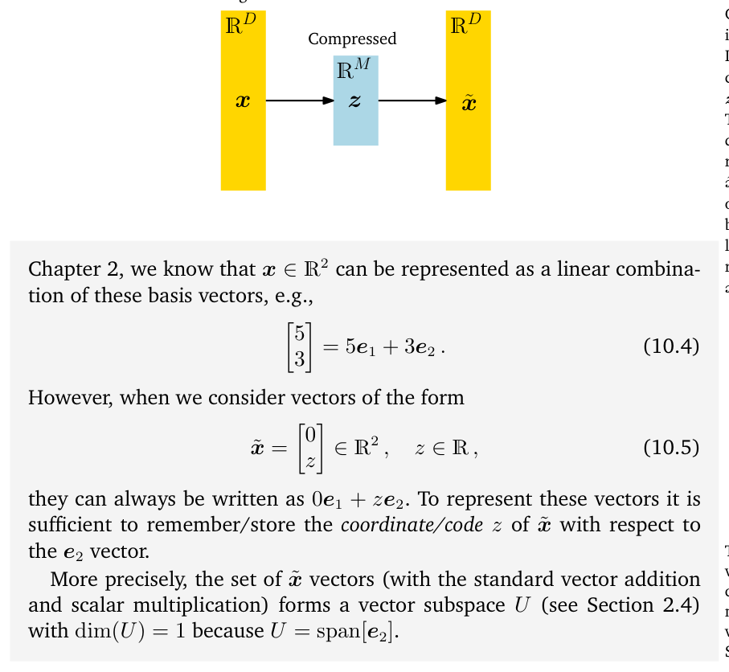
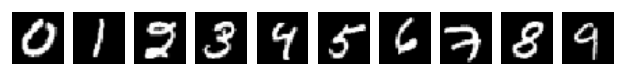
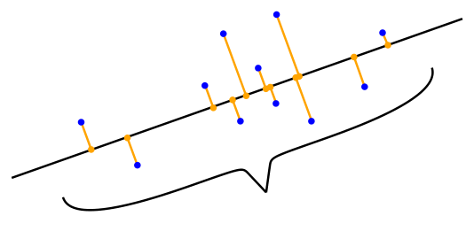
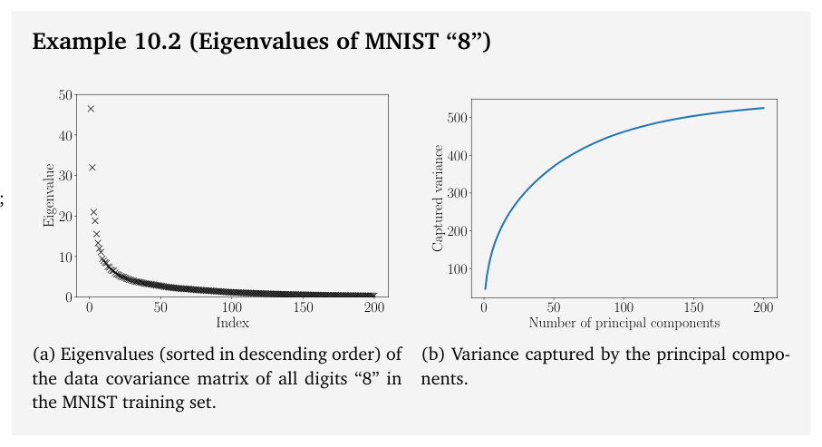
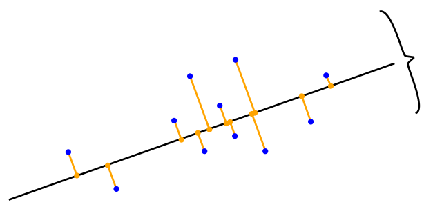
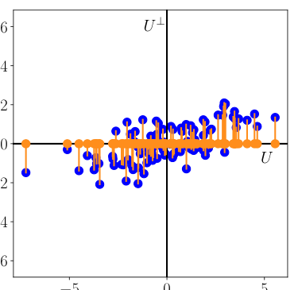
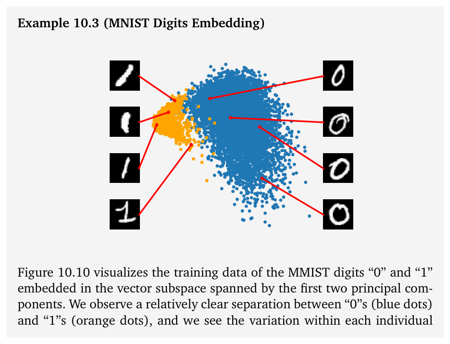
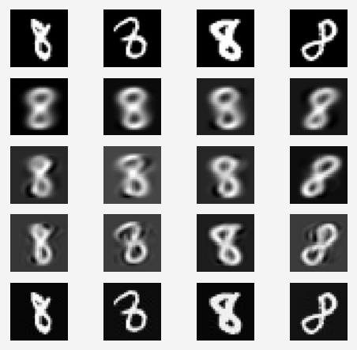
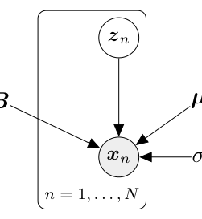
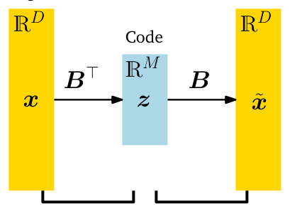

# 第 10 章 用主成分分析降维（Dimensionality Reduction with Principal Component Analysis）

> [← 返回目录](README.md)

> signal processing community, PCA is also known as the Karhunen-Loève transform. In this chapter, we derive PCA from first principles, drawing on our understanding of basis and basis change (Sections 2.6.1 and 2.7.2), projections (Section 3.8), eigenvalues (Section 4.2), Gaussian distributions (Section 6.5), and constrained optimization (Section 7.2).

信号处理领域，主成分分析（PCA）也被称为 Karhunen-Loève 变换。在本章中，我们将从第一性原理出发推导 PCA，其中会用到我们对基（basis）与基变换（2.6.1 节和 2.7.2 节）、投影（projection）（3.8 节）、特征值（eigenvalue）（4.2 节）、高斯分布（Gaussian distribution）（6.5 节）以及约束优化（constrained optimization）（7.2 节）的理解。

> Dimensionality reduction generally exploits a property of high-dimensional data (e.g., images) that it often lies on a low-dimensional subspace. Figure 10.1 gives an illustrative example in two dimensions. Although the data in Figure 10.1(a) does not quite lie on a line, the data does not vary much in the $x_2$-direction, so that we can express it as if it were on a line – with nearly no loss; see Figure 10.1(b). To describe the data in Figure 10.1(b), only the $x_1$-coordinate is required, and the data lies in a one-dimensional subspace of $\mathbb{R}^2$.

降维（dimensionality reduction）通常利用高维数据（例如图像）的一个性质：数据往往位于一个低维子空间上。图 10.1 给出了一个二维的直观示例。虽然图 10.1(a) 中的数据并不完全位于一条直线上，但数据在 $x_2$ 方向上的变化不大，因此我们可以把它当作位于一条直线上来表示——几乎没有损失；见图 10.1(b)。要描述图 10.1(b) 中的数据，只需要 $x_1$ 坐标即可，此时数据位于 $\mathbb{R}^2$ 的一个一维子空间中。

## 10.1 问题设置（Problem Setting）

> In PCA, we are interested in finding projections $\tilde{\boldsymbol{x}}_n$ of data points $\boldsymbol{x}_n$ that are as similar to the original data points as possible, but which have a significantly lower intrinsic dimensionality. Figure 10.1 gives an illustration of what this could look like.

在 PCA 中，我们感兴趣的是寻找数据点 $\boldsymbol{x}_n$ 的投影 $\tilde{\boldsymbol{x}}_n$，使其尽可能与原始数据点相似，同时具有明显更低的内在维度。图 10.1 给出了这种情况的一个示意。

> More concretely, we consider an i.i.d. dataset $\mathcal{X} = \{\boldsymbol{x}_1, \ldots, \boldsymbol{x}_N\}$, $\boldsymbol{x}_n \in \mathbb{R}^D$, with mean 0 that possesses the data covariance matrix (6.42)

更具体地说，我们考虑一个独立同分布（i.i.d.）的数据集（dataset）$\mathcal{X} = \{\boldsymbol{x}_1, \ldots, \boldsymbol{x}_N\}$，其中 $\boldsymbol{x}_n \in \mathbb{R}^D$、均值为 0，它的数据协方差矩阵（data covariance matrix）为 (6.42)

$$
\boldsymbol{S} = \frac{1}{N}\sum_{n=1}^{N} \boldsymbol{x}_n \boldsymbol{x}_n^{\top} \,. \tag{10.1}
$$

> Furthermore, we assume there exists a low-dimensional compressed representation (code)

此外，我们假设存在 $\boldsymbol{x}_n$ 的一个低维压缩表示（编码）

$$
\boldsymbol{z}_n = \boldsymbol{B}^{\top} \boldsymbol{x}_n \in \mathbb{R}^M \,, \tag{10.2}
$$

> of $\boldsymbol{x}_n$, where we define the projection matrix

其中，我们将投影矩阵（projection matrix）定义为

$$
\boldsymbol{B} := [\boldsymbol{b}_1, \ldots, \boldsymbol{b}_M] \in \mathbb{R}^{D \times M} \,. \tag{10.3}
$$

> We assume that the columns of $\boldsymbol{B}$ are orthonormal (Definition 3.7) so that $\boldsymbol{b}_i^{\top} \boldsymbol{b}_j = 0$ if and only if $i \neq j$ and $\boldsymbol{b}_i^{\top} \boldsymbol{b}_i = 1$. We seek an $M$-dimensional subspace $U \subseteq \mathbb{R}^D$, $\dim(U) = M < D$ onto which we project the data. We denote the projected data by $\tilde{\boldsymbol{x}}_n \in U$, and their coordinates (with respect to the basis vectors $\boldsymbol{b}_1, \ldots, \boldsymbol{b}_M$ of $U$) by $\boldsymbol{z}_n$. Our aim is to find projections $\tilde{\boldsymbol{x}}_n \in \mathbb{R}^D$ (or equivalently the codes $\boldsymbol{z}_n$ and the basis vectors $\boldsymbol{b}_1, \ldots, \boldsymbol{b}_M$) so that they are as similar to the original data $\boldsymbol{x}_n$ and minimize the loss due to compression.

我们假设 $\boldsymbol{B}$ 的各列是标准正交（orthonormal）的（定义 3.7），即当且仅当 $i \neq j$ 时 $\boldsymbol{b}_i^{\top} \boldsymbol{b}_j = 0$，且 $\boldsymbol{b}_i^{\top} \boldsymbol{b}_i = 1$。我们要寻找一个 $M$ 维子空间 $U \subseteq \mathbb{R}^D$（$\dim(U) = M < D$），并把数据投影到该子空间上。我们把投影后的数据记为 $\tilde{\boldsymbol{x}}_n \in U$，并把它们（相对于 $U$ 的基向量（basis vector）$\boldsymbol{b}_1, \ldots, \boldsymbol{b}_M$）的坐标记为 $\boldsymbol{z}_n$。我们的目标是找出投影 $\tilde{\boldsymbol{x}}_n \in \mathbb{R}^D$（或等价地，编码 $\boldsymbol{z}_n$ 与基向量 $\boldsymbol{b}_1, \ldots, \boldsymbol{b}_M$），使它们与原始数据 $\boldsymbol{x}_n$ 尽可能相似，并使压缩造成的损失最小。

> **Example 10.1** (Coordinate Representation/Code) Consider $\mathbb{R}^2$ with the canonical basis $\boldsymbol{e}_1 = [1, 0]^{\top}$, $\boldsymbol{e}_2 = [0, 1]^{\top}$. From

**例 10.1**（坐标表示/编码）考虑具有标准基（canonical basis）$\boldsymbol{e}_1 = [1, 0]^{\top}$、$\boldsymbol{e}_2 = [0, 1]^{\top}$ 的 $\mathbb{R}^2$。由

> **Figure 10.2** Graphical illustration of PCA. In PCA, we find a compressed version $\boldsymbol{z}$ of original data $\boldsymbol{x}$. The compressed data can be reconstructed into $\tilde{\boldsymbol{x}}$, which lives in the original data space, but has an intrinsic lower-dimensional representation than $\boldsymbol{x}$.

**图 10.2** PCA 的图形化示意。在 PCA 中，我们找到原始数据 $\boldsymbol{x}$ 的一个压缩版本 $\boldsymbol{z}$。压缩后的数据可以重构为 $\tilde{\boldsymbol{x}}$，它位于原来的数据空间中，但其内在表示的维度低于 $\boldsymbol{x}$。

> Chapter 2, we know that $\boldsymbol{x} \in \mathbb{R}^2$ can be represented as a linear combination of these basis vectors, e.g.,

第 2 章可知，$\boldsymbol{x} \in \mathbb{R}^2$ 可以表示为这些基向量的线性组合（linear combination），例如

$$
\begin{pmatrix} 5 \\ 3 \end{pmatrix} = 5\boldsymbol{e}_1 + 3\boldsymbol{e}_2 \,. \tag{10.4}
$$

> However, when we consider vectors of the form

然而，当我们考虑形如下式的向量时

$$
\tilde{\boldsymbol{x}} = \begin{pmatrix} 0 \\ z \end{pmatrix} \in \mathbb{R}^2 \,, \quad z \in \mathbb{R} \,, \tag{10.5}
$$

> they can always be written as $0\boldsymbol{e}_1 + z\boldsymbol{e}_2$. To represent these vectors it is sufficient to remember/store the coordinate/code $z$ of $\tilde{\boldsymbol{x}}$ with respect to the $\boldsymbol{e}_2$ vector. The dimension of a vector space corresponds to the number of its basis vectors (see Section 2.6.1).

它们总可以写成 $0\boldsymbol{e}_1 + z\boldsymbol{e}_2$。要表示这些向量，只需记住/存储 $\tilde{\boldsymbol{x}}$ 相对于 $\boldsymbol{e}_2$ 向量的坐标/编码 $z$ 即可。向量空间的维度（dimension）对应于其基向量的个数（见 2.6.1 节）。

> More precisely, the set of $\tilde{\boldsymbol{x}}$ vectors (with the standard vector addition and scalar multiplication) forms a vector subspace $U$ (see Section 2.4) with $\dim(U) = 1$ because $U = \operatorname{span}[\boldsymbol{e}_2]$.

更准确地说，这些 $\tilde{\boldsymbol{x}}$ 向量的集合（配备标准的向量加法与标量乘法）构成一个向量子空间（vector subspace）$U$（见 2.4 节），且 $\dim(U) = 1$，因为 $U = \operatorname{span}[\boldsymbol{e}_2]$。

> In Section 10.2, we will find low-dimensional representations that retain as much information as possible and minimize the compression loss. An alternative derivation of PCA is given in Section 10.3, where we will be looking at minimizing the squared reconstruction error $\|\boldsymbol{x}_n - \tilde{\boldsymbol{x}}_n\|^2$ between the original data $\boldsymbol{x}_n$ and its projection $\tilde{\boldsymbol{x}}_n$.

在 10.2 节中，我们将寻找尽可能多地保留信息、并使压缩损失最小化的低维表示。10.3 节给出了 PCA 的另一种推导，在那里我们将考察最小化原始数据 $\boldsymbol{x}_n$ 与其投影 $\tilde{\boldsymbol{x}}_n$ 之间的平方重构误差 $\|\boldsymbol{x}_n - \tilde{\boldsymbol{x}}_n\|^2$。

> Figure 10.2 illustrates the setting we consider in PCA, where $\boldsymbol{z}$ represents the lower-dimensional representation of the compressed data $\tilde{\boldsymbol{x}}$ and plays the role of a bottleneck, which controls how much information can flow between $\boldsymbol{x}$ and $\tilde{\boldsymbol{x}}$. In PCA, we consider a linear relationship between the original data $\boldsymbol{x}$ and its low-dimensional code $\boldsymbol{z}$ so that $\boldsymbol{z} = \boldsymbol{B}^{\top} \boldsymbol{x}$ and $\tilde{\boldsymbol{x}} = \boldsymbol{B}\boldsymbol{z}$ for a suitable matrix $\boldsymbol{B}$. Based on the motivation of thinking of PCA as a data compression technique, we can interpret the arrows in Figure 10.2 as a pair of operations representing encoders and decoders. The linear mapping represented by $\boldsymbol{B}$ can be thought of as a decoder, which maps the low-dimensional code $\boldsymbol{z} \in \mathbb{R}^M$ back into the original data space $\mathbb{R}^D$. Similarly, $\boldsymbol{B}^{\top}$ can be thought of an encoder, which encodes the original data $\boldsymbol{x}$ as a low-dimensional (compressed) code $\boldsymbol{z}$.

图 10.2 展示了我们在 PCA 中考虑的设定，其中 $\boldsymbol{z}$ 表示压缩数据 $\tilde{\boldsymbol{x}}$ 的低维表示，并扮演瓶颈（bottleneck）的角色，控制着 $\boldsymbol{x}$ 与 $\tilde{\boldsymbol{x}}$ 之间能够流动的信息量。在 PCA 中，我们考虑原始数据 $\boldsymbol{x}$ 与其低维编码 $\boldsymbol{z}$ 之间的线性关系，使得 $\boldsymbol{z} = \boldsymbol{B}^{\top} \boldsymbol{x}$ 且 $\tilde{\boldsymbol{x}} = \boldsymbol{B}\boldsymbol{z}$，其中 $\boldsymbol{B}$ 为某个合适的矩阵。基于将 PCA 视为一种数据压缩技术的动机，我们可以把图 10.2 中的箭头解释为一对分别代表编码器（encoder）与解码器（decoder）的运算。由 $\boldsymbol{B}$ 表示的线性映射可以看作解码器，它把低维编码 $\boldsymbol{z} \in \mathbb{R}^M$ 映回原始数据空间 $\mathbb{R}^D$；类似地，$\boldsymbol{B}^{\top}$ 可以看作编码器，它把原始数据 $\boldsymbol{x}$ 编码为低维（压缩）编码 $\boldsymbol{z}$。

> Throughout this chapter, we will use the MNIST digits dataset as a re-

在本章中，我们将把 MNIST 数字数据集用作一个

> **Figure 10.3** Examples of handwritten digits from the MNIST dataset. http://yann.lecun.com/exdb/mnist/.

**图 10.3** 来自 MNIST 数据集的手写数字示例。http://yann.lecun.com/exdb/mnist/。

> occurring example, which contains 60,000 examples of handwritten digits 0 through 9. Each digit is a grayscale image of size 28×28, i.e., it contains 784 pixels so that we can interpret every image in this dataset as a vector $\boldsymbol{x} \in \mathbb{R}^{784}$. Examples of these digits are shown in Figure 10.3.

反复出现的例子，其中包含 60,000 个 0 到 9 的手写数字样本。每个数字都是一幅 28×28 的灰度图像，也就是说，它包含 784 个像素，因此我们可以将该数据集中的每一幅图像都解释为一个向量 $\boldsymbol{x} \in \mathbb{R}^{784}$。这些数字的示例如图 10.3 所示。

## 10.2 最大方差视角（Maximum Variance Perspective）

> Figure 10.1 gave an example of how a two-dimensional dataset can be represented using a single coordinate. In Figure 10.1(b), we chose to ignore the $x_2$-coordinate of the data because it did not add too much information so that the compressed data is similar to the original data in Figure 10.1(a). We could have chosen to ignore the $x_1$-coordinate, but then the compressed data had been very dissimilar from the original data, and much information in the data would have been lost.

图 10.1 给出了一个如何用单个坐标表示二维数据集的例子。在图 10.1(b) 中，我们选择忽略数据的 $x_2$ 坐标，因为它没有带来太多信息，使得压缩后的数据与图 10.1(a) 中的原始数据相似。我们本可以选择忽略 $x_1$ 坐标，但那样压缩后的数据就会与原始数据大不相同，数据中的大量信息也将随之丢失。

> If we interpret information content in the data as how “space filling” the dataset is, then we can describe the information contained in the data by looking at the spread of the data. From Section 6.4.1, we know that the variance is an indicator of the spread of the data, and we can derive PCA as a dimensionality reduction algorithm that maximizes the variance in the low-dimensional representation of the data to retain as much information as possible. Figure 10.4 illustrates this.

如果我们把数据中的信息内容理解为数据集的“空间填充”程度，那么就可以通过考察数据的散布程度来描述数据所包含的信息。由 6.4.1 节可知，方差（variance）是数据散布程度的一个指标，因此我们可以将 PCA 推导为一种降维算法：它最大化数据低维表示中的方差，以尽可能多地保留信息。图 10.4 说明了这一点。

> Considering the setting discussed in Section 10.1, our aim is to find a matrix $\boldsymbol{B}$ (see (10.3)) that retains as much information as possible when compressing data by projecting it onto the subspace spanned by the columns $\boldsymbol{b}_1, \ldots, \boldsymbol{b}_M$ of $\boldsymbol{B}$. Retaining most information after data compression is equivalent to capturing the largest amount of variance in the low-dimensional code (Hotelling, 1933).

考虑 10.1 节中讨论的设定，我们的目标是找到一个矩阵 $\boldsymbol{B}$（见 (10.3)），使得在通过将数据投影到 $\boldsymbol{B}$ 的列向量 $\boldsymbol{b}_1, \ldots, \boldsymbol{b}_M$ 所张成的子空间来进行压缩时，尽可能多地保留信息。数据压缩后保留最多的信息，等价于在低维编码中捕获最大量的方差 (Hotelling, 1933)。

> Remark. (Centered Data) For the data covariance matrix in (10.1), we assumed centered data. We can make this assumption without loss of generality: Let us assume that $\boldsymbol{\mu}$ is the mean of the data. Using the properties of the variance, which we discussed in Section 6.4.4, we obtain

评注（中心化数据）。对于 (10.1) 中的数据协方差矩阵，我们假设了数据是中心化的。这一假设不失一般性：设 $\boldsymbol{\mu}$ 为数据的均值。利用 6.4.4 节中讨论过的方差的性质，我们得到

$$
V_z[\boldsymbol{z}] = V_x[\boldsymbol{B}^{\top}(\boldsymbol{x}-\boldsymbol{\mu})] = V_x[\boldsymbol{B}^{\top}\boldsymbol{x} - \boldsymbol{B}^{\top}\boldsymbol{\mu}] = V_x[\boldsymbol{B}^{\top}\boldsymbol{x}] \,, \tag{10.6}
$$

> i.e., the variance of the low-dimensional code does not depend on the mean of the data. Therefore, we assume without loss of generality that the data has mean 0 for the remainder of this section. With this assumption the mean of the low-dimensional code is also 0 since $\mathbb{E}_z[\boldsymbol{z}] = \mathbb{E}_x[\boldsymbol{B}^{\top}\boldsymbol{x}] = \boldsymbol{B}^{\top}\mathbb{E}_x[\boldsymbol{x}] = 0$. ♢

也就是说，低维编码的方差不依赖于数据的均值。因此，在本节的余下部分中，我们不失一般性地假设数据的均值为 0。在这一假设下，低维编码的均值也为 0，因为 $\mathbb{E}_z[\boldsymbol{z}] = \mathbb{E}_x[\boldsymbol{B}^{\top}\boldsymbol{x}] = \boldsymbol{B}^{\top}\mathbb{E}_x[\boldsymbol{x}] = 0$。♢

> **Figure 10.4** PCA finds a lower-dimensional subspace (line) that maintains as much variance (spread of the data) as possible when the data (blue) is projected onto this subspace (orange).

**图 10.4** PCA 寻找一个低维子空间（直线），使得当数据（蓝色）投影到该子空间（橙色）上时，能保持尽可能多的方差（数据的散布程度）。

### 10.2.1 具有最大方差的方向（Direction with Maximal Variance）

> We maximize the variance of the low-dimensional code using a sequential approach. We start by seeking a single vector $\boldsymbol{b}_1 \in \mathbb{R}^D$ that maximizes the variance of the projected data, i.e., we aim to maximize the variance of the first coordinate $z_1$ of $\boldsymbol{z} \in \mathbb{R}^M$ so that

我们采用一种逐步的方法来最大化低维编码的方差。首先，我们寻找单个向量 $\boldsymbol{b}_1 \in \mathbb{R}^D$，使其最大化投影数据的方差；也就是说，我们的目标是最大化 $\boldsymbol{z} \in \mathbb{R}^M$ 的第一个坐标 $z_1$ 的方差，使得

$$
V_1 := V[z_1] = \frac{1}{N}\sum_{n=1}^{N} z_{1n}^2 \tag{10.7}
$$

> is maximized, where we exploited the i.i.d. assumption of the data and defined $z_{1n}$ as the first coordinate of the low-dimensional representation $\boldsymbol{z}_n \in \mathbb{R}^M$ of $\boldsymbol{x}_n \in \mathbb{R}^D$. Note that first component of $\boldsymbol{z}_n$ is given by

$V_1$ 达到最大，其中我们利用了数据的独立同分布假设，并把 $z_{1n}$ 定义为 $\boldsymbol{x}_n \in \mathbb{R}^D$ 的低维表示 $\boldsymbol{z}_n \in \mathbb{R}^M$ 的第一个坐标。注意，$\boldsymbol{z}_n$ 的第一个分量为

$$
z_{1n} = \boldsymbol{b}_1^{\top}\boldsymbol{x}_n \,, \tag{10.8}
$$

> i.e., it is the coordinate of the orthogonal projection of $\boldsymbol{x}_n$ onto the one-dimensional subspace spanned by $\boldsymbol{b}_1$ (Section 3.8). We substitute (10.8) into (10.7), which yields

也就是说，它是 $\boldsymbol{x}_n$ 到由 $\boldsymbol{b}_1$ 张成的一维子空间的正交投影的坐标（3.8 节）。将 (10.8) 代入 (10.7)，得到

$$
\begin{aligned}
V_1 &= \frac{1}{N}\sum_{n=1}^{N}(\boldsymbol{b}_1^{\top}\boldsymbol{x}_n)^2 = \frac{1}{N}\sum_{n=1}^{N}\boldsymbol{b}_1^{\top}\boldsymbol{x}_n\boldsymbol{x}_n^{\top}\boldsymbol{b}_1 \tag{10.9a}\\
&= \boldsymbol{b}_1^{\top}\Big(\frac{1}{N}\sum_{n=1}^{N}\boldsymbol{x}_n\boldsymbol{x}_n^{\top}\Big)\boldsymbol{b}_1 = \boldsymbol{b}_1^{\top}\boldsymbol{S}\boldsymbol{b}_1 \,, \tag{10.9b}
\end{aligned}
$$

> where $\boldsymbol{S}$ is the data covariance matrix defined in (10.1). In (10.9a), we have used the fact that the dot product of two vectors is symmetric with respect to its arguments, that is, $\boldsymbol{b}_1^{\top}\boldsymbol{x}_n = \boldsymbol{x}_n^{\top}\boldsymbol{b}_1$. Notice that arbitrarily increasing the magnitude of the vector $\boldsymbol{b}_1$ increases $V_1$, that is, a vector $\boldsymbol{b}_1$ that is two times longer can result in $V_1$ that is potentially four times larger. Therefore, we restrict all solutions to $\|\boldsymbol{b}_1\|_2 = 1$, which results in a constrained optimization problem in which we seek the direction along which the data varies most.

其中 $\boldsymbol{S}$ 是 (10.1) 中定义的数据协方差矩阵。在 (10.9a) 中，我们利用了两个向量的点积（dot product）关于其参数对称这一事实，即 $\boldsymbol{b}_1^{\top}\boldsymbol{x}_n = \boldsymbol{x}_n^{\top}\boldsymbol{b}_1$。注意，任意增大向量 $\boldsymbol{b}_1$ 的幅值都会使 $V_1$ 增大，也就是说，一个长度两倍的向量 $\boldsymbol{b}_1$ 可能使 $V_1$ 增大到四倍。因此，我们把所有解都限制在 $\|\boldsymbol{b}_1\|_2 = 1$ 上，这就得到一个约束优化问题：我们寻找数据变化最大的那个方向。

> With the restriction of the solution space to unit vectors the vector $\boldsymbol{b}_1$ that points in the direction of maximum variance can be found by the constrained optimization problem

在将解空间限制为单位向量之后，指向最大方差方向的向量 $\boldsymbol{b}_1$ 可以通过如下约束优化问题求得

$$
\max_{\boldsymbol{b}_1} \boldsymbol{b}_1^{\top}\boldsymbol{S}\boldsymbol{b}_1 \qquad \text{subject to}\quad \|\boldsymbol{b}_1\|_2 = 1 \,. \tag{10.10}
$$

> Following Section 7.2, we obtain the Lagrangian

按照 7.2 节的方法，我们得到拉格朗日函数（Lagrangian）

$$
L(\boldsymbol{b}_1, \lambda) = \boldsymbol{b}_1^{\top}\boldsymbol{S}\boldsymbol{b}_1 + \lambda_1(1-\boldsymbol{b}_1^{\top}\boldsymbol{b}_1) \tag{10.11}
$$

> to solve this constrained optimization problem. The partial derivatives of $L$ with respect to $\boldsymbol{b}_1$ and $\lambda_1$ are

用来求解这一约束优化问题。$L$ 关于 $\boldsymbol{b}_1$ 与 $\lambda_1$ 的偏导数（partial derivative）分别为

$$
\frac{\partial L}{\partial \boldsymbol{b}_1} = 2\boldsymbol{b}_1^{\top}\boldsymbol{S} - 2\lambda_1\boldsymbol{b}_1^{\top} \,, \qquad \frac{\partial L}{\partial \lambda_1} = 1 - \boldsymbol{b}_1^{\top}\boldsymbol{b}_1 \,, \tag{10.12}
$$

> respectively. Setting these partial derivatives to 0 gives us the relations

令这些偏导数为 0，我们得到如下关系式

$$
\boldsymbol{S}\boldsymbol{b}_1 = \lambda_1\boldsymbol{b}_1 \,, \tag{10.13}
$$

$$
\boldsymbol{b}_1^{\top}\boldsymbol{b}_1 = 1 \,. \tag{10.14}
$$

> By comparing this with the definition of an eigenvalue decomposition (Section 4.4), we see that $\boldsymbol{b}_1$ is an eigenvector of the data covariance matrix $\boldsymbol{S}$, and the Lagrange multiplier $\lambda_1$ plays the role of the corresponding eigenvalue. This eigenvector property (10.13) allows us to rewrite our variance objective (10.10) as

将上式与特征分解（eigenvalue decomposition）的定义（4.4 节）相比较，我们发现 $\boldsymbol{b}_1$ 是数据协方差矩阵 $\boldsymbol{S}$ 的一个特征向量（eigenvector），而拉格朗日乘子（Lagrange multiplier）$\lambda_1$ 则扮演相应特征值的角色。这一特征向量性质 (10.13) 使我们能够把方差目标 (10.10) 改写为

$$
V_1 = \boldsymbol{b}_1^{\top}\boldsymbol{S}\boldsymbol{b}_1 = \lambda_1\boldsymbol{b}_1^{\top}\boldsymbol{b}_1 = \lambda_1 \,, \tag{10.15}
$$

> i.e., the variance of the data projected onto a one-dimensional subspace equals the eigenvalue that is associated with the basis vector $\boldsymbol{b}_1$ that spans this subspace. Therefore, to maximize the variance of the low-dimensional code, we choose the basis vector associated with the largest eigenvalue of the data covariance matrix. This eigenvector is called the first principal component. We can determine the effect/contribution of the principal component $\boldsymbol{b}_1$ in the original data space by mapping the coordinate $z_{1n}$ back into data space, which gives us the projected data point

也就是说，投影到一维子空间上的数据的方差，等于与张成该子空间的基向量 $\boldsymbol{b}_1$ 相关联的特征值。因此，为了最大化低维编码的方差，我们选取与数据协方差矩阵最大特征值相关联的基向量。这个特征向量被称为第一主成分（principal component）。我们可以把坐标 $z_{1n}$ 映回数据空间，从而确定主成分 $\boldsymbol{b}_1$ 在原始数据空间中的影响/贡献，由此得到投影后的数据点

$$
\tilde{\boldsymbol{x}}_n = \boldsymbol{b}_1 z_{1n} = \boldsymbol{b}_1\boldsymbol{b}_1^{\top}\boldsymbol{x}_n \in \mathbb{R}^D \tag{10.16}
$$

> in the original data space.

它位于原始数据空间中。

> Remark. Although $\tilde{\boldsymbol{x}}_n$ is a $D$-dimensional vector, it only requires a single coordinate $z_{1n}$ to represent it with respect to the basis vector $\boldsymbol{b}_1 \in \mathbb{R}^D$. ♢

评注. 虽然 $\tilde{\boldsymbol{x}}_n$ 是一个 $D$ 维向量，但相对于基向量 $\boldsymbol{b}_1 \in \mathbb{R}^D$ 来表示它，只需要单个坐标 $z_{1n}$。♢

### 10.2.2 具有最大方差的 M 维子空间（M-dimensional Subspace with Maximal Variance）

> Assume we have found the first $m-1$ principal components as the $m-1$ eigenvectors of $\boldsymbol{S}$ that are associated with the largest $m-1$ eigenvalues. Since $\boldsymbol{S}$ is symmetric, the spectral theorem (Theorem 4.15) states that we can use these eigenvectors to construct an orthonormal eigenbasis of an $(m-1)$-dimensional subspace of $\mathbb{R}^D$. Generally, the $m$th principal component can be found by subtracting the effect of the first $m-1$ principal components $\boldsymbol{b}_1, \ldots, \boldsymbol{b}_{m-1}$ from the data, thereby trying to find principal components that compress the remaining information. We then arrive at the new data matrix

假设我们已经找到了前 $m-1$ 个主成分，即 $\boldsymbol{S}$ 的与最大 $m-1$ 个特征值相关联的那 $m-1$ 个特征向量。由于 $\boldsymbol{S}$ 是对称的，谱定理（定理 4.15）指出，我们可以利用这些特征向量构造出 $\mathbb{R}^D$ 中一个 $(m-1)$ 维子空间的标准正交特征基。一般地，第 $m$ 个主成分可以通过从数据中减去前 $m-1$ 个主成分 $\boldsymbol{b}_1, \ldots, \boldsymbol{b}_{m-1}$ 的影响来求得，从而设法找到能压缩剩余信息的主成分。于是我们得到新的数据矩阵

$$
\hat{\boldsymbol{X}} := \boldsymbol{X} - \sum_{i=1}^{m-1}\boldsymbol{b}_i\boldsymbol{b}_i^{\top}\boldsymbol{X} = \boldsymbol{X} - \boldsymbol{B}_{m-1}\boldsymbol{X} \,, \tag{10.17}
$$

> where $\boldsymbol{X} = [\boldsymbol{x}_1, \ldots, \boldsymbol{x}_N] \in \mathbb{R}^{D\times N}$ contains the data points as column vectors and $\boldsymbol{B}_{m-1} := \sum_{i=1}^{m-1}\boldsymbol{b}_i\boldsymbol{b}_i^{\top}$ is a projection matrix that projects onto the subspace spanned by $\boldsymbol{b}_1, \ldots, \boldsymbol{b}_{m-1}$.

其中 $\boldsymbol{X} = [\boldsymbol{x}_1, \ldots, \boldsymbol{x}_N] \in \mathbb{R}^{D\times N}$ 以列向量的形式包含各个数据点，而 $\boldsymbol{B}_{m-1} := \sum_{i=1}^{m-1}\boldsymbol{b}_i\boldsymbol{b}_i^{\top}$ 是一个投影矩阵，它投影到由 $\boldsymbol{b}_1, \ldots, \boldsymbol{b}_{m-1}$ 张成的子空间上。

> Remark (Notation). Throughout this chapter, we do not follow the convention of collecting data $\boldsymbol{x}_1, \ldots, \boldsymbol{x}_N$ as the rows of the data matrix, but we define them to be the columns of $\boldsymbol{X}$. This means that our data matrix $\boldsymbol{X}$ is a $D \times N$ matrix instead of the conventional $N \times D$ matrix. The reason for our choice is that the algebra operations work out smoothly without the need to either transpose the matrix or to redefine vectors as row vectors that are left-multiplied onto matrices. ♢

评注（记号）。在本章中，我们不遵循把数据 $\boldsymbol{x}_1, \ldots, \boldsymbol{x}_N$ 作为数据矩阵的行来收集的惯例，而是把它们定义为 $\boldsymbol{X}$ 的列。这意味着我们的数据矩阵 $\boldsymbol{X}$ 是一个 $D \times N$ 矩阵，而不是传统的 $N \times D$ 矩阵。之所以这样选择，是因为代数运算可以顺畅地进行，既无需转置矩阵，也无需把向量重新定义为左乘到矩阵上的行向量。♢

> To find the $m$th principal component, we maximize the variance

为了找到第 $m$ 个主成分，我们最大化方差

$$
V_m = V[z_m] = \frac{1}{N}\sum_{n=1}^{N} z_{mn}^2 = \frac{1}{N}\sum_{n=1}^{N}(\boldsymbol{b}_m^{\top}\hat{\boldsymbol{x}}_n)^2 = \boldsymbol{b}_m^{\top}\hat{\boldsymbol{S}}\boldsymbol{b}_m \,, \tag{10.18}
$$

> subject to $\|\boldsymbol{b}_m\|_2 = 1$, where we followed the same steps as in (10.9b) and defined $\hat{\boldsymbol{S}}$ as the data covariance matrix of the transformed dataset $\hat{\mathcal{X}} := \{\hat{\boldsymbol{x}}_1, \ldots, \hat{\boldsymbol{x}}_N\}$. As previously, when we looked at the first principal component alone, we solve a constrained optimization problem and discover that the optimal solution $\boldsymbol{b}_m$ is the eigenvector of $\hat{\boldsymbol{S}}$ that is associated with the largest eigenvalue of $\hat{\boldsymbol{S}}$.

约束条件为 $\|\boldsymbol{b}_m\|_2 = 1$，其中我们沿用了与 (10.9b) 中相同的步骤，并把 $\hat{\boldsymbol{S}}$ 定义为变换后的数据集 $\hat{\mathcal{X}} := \{\hat{\boldsymbol{x}}_1, \ldots, \hat{\boldsymbol{x}}_N\}$ 的数据协方差矩阵。与之前仅考察第一个主成分时一样，我们求解一个约束优化问题，并发现最优解 $\boldsymbol{b}_m$ 是 $\hat{\boldsymbol{S}}$ 的特征向量，它与 $\hat{\boldsymbol{S}}$ 的最大特征值相关联。

> It turns out that $\boldsymbol{b}_m$ is also an eigenvector of $\boldsymbol{S}$. More generally, the sets of eigenvectors of $\boldsymbol{S}$ and $\hat{\boldsymbol{S}}$ are identical. Since both $\boldsymbol{S}$ and $\hat{\boldsymbol{S}}$ are symmetric, we can find an ONB of eigenvectors (spectral theorem 4.15), i.e., there exist $D$ distinct eigenvectors for both $\boldsymbol{S}$ and $\hat{\boldsymbol{S}}$. Next, we show that every eigenvector of $\boldsymbol{S}$ is an eigenvector of $\hat{\boldsymbol{S}}$. Assume we have already found eigenvectors $\boldsymbol{b}_1, \ldots, \boldsymbol{b}_{m-1}$ of $\hat{\boldsymbol{S}}$. Consider an eigenvector $\boldsymbol{b}_i$ of $\boldsymbol{S}$, i.e., $\boldsymbol{S}\boldsymbol{b}_i = \lambda_i\boldsymbol{b}_i$. In general,

事实证明，$\boldsymbol{b}_m$ 也是 $\boldsymbol{S}$ 的特征向量。更一般地，$\boldsymbol{S}$ 与 $\hat{\boldsymbol{S}}$ 的特征向量集合是相同的。由于 $\boldsymbol{S}$ 和 $\hat{\boldsymbol{S}}$ 都是对称的，我们可以找到一组由特征向量构成的标准正交基（ONB）（谱定理 4.15），也就是说，$\boldsymbol{S}$ 和 $\hat{\boldsymbol{S}}$ 都存在 $D$ 个互不相同的特征向量。接下来，我们证明 $\boldsymbol{S}$ 的每一个特征向量都是 $\hat{\boldsymbol{S}}$ 的特征向量。假设我们已经找到了 $\hat{\boldsymbol{S}}$ 的特征向量 $\boldsymbol{b}_1, \ldots, \boldsymbol{b}_{m-1}$。考虑 $\boldsymbol{S}$ 的一个特征向量 $\boldsymbol{b}_i$，即 $\boldsymbol{S}\boldsymbol{b}_i = \lambda_i\boldsymbol{b}_i$。一般地，

$$
\begin{aligned}
\hat{\boldsymbol{S}}\boldsymbol{b}_i &= \frac{1}{N}\hat{\boldsymbol{X}}\hat{\boldsymbol{X}}^{\top}\boldsymbol{b}_i = \frac{1}{N}(\boldsymbol{X}-\boldsymbol{B}_{m-1}\boldsymbol{X})(\boldsymbol{X}-\boldsymbol{B}_{m-1}\boldsymbol{X})^{\top}\boldsymbol{b}_i \tag{10.19a}\\
&= (\boldsymbol{S}-\boldsymbol{S}\boldsymbol{B}_{m-1}-\boldsymbol{B}_{m-1}\boldsymbol{S}+\boldsymbol{B}_{m-1}\boldsymbol{S}\boldsymbol{B}_{m-1})\boldsymbol{b}_i \,. \tag{10.19b}
\end{aligned}
$$

> We distinguish between two cases. If $i \geqslant m$, i.e., $\boldsymbol{b}_i$ is an eigenvector that is not among the first $m-1$ principal components, then $\boldsymbol{b}_i$ is orthogonal to the first $m-1$ principal components and $\boldsymbol{B}_{m-1}\boldsymbol{b}_i = 0$. If $i < m$, i.e., $\boldsymbol{b}_i$ is among the first $m-1$ principal components, then $\boldsymbol{b}_i$ is a basis vector of the principal subspace onto which $\boldsymbol{B}_{m-1}$ projects. Since $\boldsymbol{b}_1, \ldots, \boldsymbol{b}_{m-1}$ are an ONB of this principal subspace, we obtain $\boldsymbol{B}_{m-1}\boldsymbol{b}_i = \boldsymbol{b}_i$. The two cases can be summarized as follows:

我们分两种情形讨论。如果 $i \geqslant m$，即 $\boldsymbol{b}_i$ 是不在前 $m-1$ 个主成分之列的特征向量，那么 $\boldsymbol{b}_i$ 与前 $m-1$ 个主成分正交，且 $\boldsymbol{B}_{m-1}\boldsymbol{b}_i = 0$。如果 $i < m$，即 $\boldsymbol{b}_i$ 位于前 $m-1$ 个主成分之中，那么 $\boldsymbol{b}_i$ 是 $\boldsymbol{B}_{m-1}$ 所投影到的主子空间（principal subspace）的一个基向量。由于 $\boldsymbol{b}_1, \ldots, \boldsymbol{b}_{m-1}$ 构成这个主子空间的一组 ONB，我们得到 $\boldsymbol{B}_{m-1}\boldsymbol{b}_i = \boldsymbol{b}_i$。这两种情形可以总结如下：

$$
\begin{aligned}
\boldsymbol{B}_{m-1}\boldsymbol{b}_i &= \boldsymbol{b}_i \quad \text{if } i < m \,,\\
\boldsymbol{B}_{m-1}\boldsymbol{b}_i &= 0 \quad \text{if } i \geqslant m \,.
\end{aligned}
\tag{10.20}
$$

> In the case $i \geqslant m$, by using (10.20) in (10.19b), we obtain $\hat{\boldsymbol{S}}\boldsymbol{b}_i = (\boldsymbol{S}-\boldsymbol{B}_{m-1}\boldsymbol{S})\boldsymbol{b}_i = \boldsymbol{S}\boldsymbol{b}_i = \lambda_i\boldsymbol{b}_i$, i.e., $\boldsymbol{b}_i$ is also an eigenvector of $\hat{\boldsymbol{S}}$ with eigenvalue $\lambda_i$. Specifically,

在 $i \geqslant m$ 的情形中，把 (10.20) 用于 (10.19b)，我们得到 $\hat{\boldsymbol{S}}\boldsymbol{b}_i = (\boldsymbol{S}-\boldsymbol{B}_{m-1}\boldsymbol{S})\boldsymbol{b}_i = \boldsymbol{S}\boldsymbol{b}_i = \lambda_i\boldsymbol{b}_i$，也就是说，$\boldsymbol{b}_i$ 也是 $\hat{\boldsymbol{S}}$ 的特征向量，其特征值为 $\lambda_i$。特别地，

$$
\hat{\boldsymbol{S}}\boldsymbol{b}_m = \boldsymbol{S}\boldsymbol{b}_m = \lambda_m\boldsymbol{b}_m \,. \tag{10.21}
$$

> Equation (10.21) reveals that $\boldsymbol{b}_m$ is not only an eigenvector of $\boldsymbol{S}$ but also of $\hat{\boldsymbol{S}}$. Specifically, $\lambda_m$ is the largest eigenvalue of $\hat{\boldsymbol{S}}$ and $\lambda_m$ is the $m$th largest eigenvalue of $\boldsymbol{S}$, and both have the associated eigenvector $\boldsymbol{b}_m$.

式 (10.21) 表明，$\boldsymbol{b}_m$ 不仅是 $\boldsymbol{S}$ 的特征向量，也是 $\hat{\boldsymbol{S}}$ 的特征向量。特别地，$\lambda_m$ 是 $\hat{\boldsymbol{S}}$ 的最大特征值，同时 $\lambda_m$ 是 $\boldsymbol{S}$ 中第 $m$ 大的特征值，而两者所关联的特征向量都是 $\boldsymbol{b}_m$。

> In the case $i < m$, by using (10.20) in (10.19b), we obtain

在 $i < m$ 的情形中，把 (10.20) 用于 (10.19b)，我们得到

$$
\hat{\boldsymbol{S}}\boldsymbol{b}_i = (\boldsymbol{S}-\boldsymbol{S}\boldsymbol{B}_{m-1}-\boldsymbol{B}_{m-1}\boldsymbol{S}+\boldsymbol{B}_{m-1}\boldsymbol{S}\boldsymbol{B}_{m-1})\boldsymbol{b}_i = 0 = 0\boldsymbol{b}_i \tag{10.22}
$$

> This means that $\boldsymbol{b}_1, \ldots, \boldsymbol{b}_{m-1}$ are also eigenvectors of $\hat{\boldsymbol{S}}$, but they are associated with eigenvalue 0 so that $\boldsymbol{b}_1, \ldots, \boldsymbol{b}_{m-1}$ span the null space of $\hat{\boldsymbol{S}}$.

这意味着 $\boldsymbol{b}_1, \ldots, \boldsymbol{b}_{m-1}$ 也是 $\hat{\boldsymbol{S}}$ 的特征向量，但它们所关联的特征值为 0，因此 $\boldsymbol{b}_1, \ldots, \boldsymbol{b}_{m-1}$ 张成 $\hat{\boldsymbol{S}}$ 的零空间（null space）。

> Overall, every eigenvector of $\boldsymbol{S}$ is also an eigenvector of $\hat{\boldsymbol{S}}$. However, if the eigenvectors of $\boldsymbol{S}$ are part of the $(m-1)$-dimensional principal subspace, then the associated eigenvalue of $\hat{\boldsymbol{S}}$ is 0. This derivation shows that there is an intimate connection between the $M$-dimensional subspace with maximal variance and the eigenvalue decomposition. We will revisit this connection in Section 10.4.

总而言之，$\boldsymbol{S}$ 的每一个特征向量也都是 $\hat{\boldsymbol{S}}$ 的特征向量。然而，如果 $\boldsymbol{S}$ 的特征向量属于 $(m-1)$ 维主子空间，那么它们在 $\hat{\boldsymbol{S}}$ 中对应的特征值为 0。这一推导表明，具有最大方差的 $M$ 维子空间与特征分解之间存在着紧密的联系。我们将在 10.4 节再次讨论这一联系。

> With the relation (10.21) and $\boldsymbol{b}_m^{\top}\boldsymbol{b}_m = 1$, the variance of the data projected onto the $m$th principal component is

利用关系式 (10.21) 以及 $\boldsymbol{b}_m^{\top}\boldsymbol{b}_m = 1$，数据投影到第 $m$ 个主成分上的方差为

$$
V_m = \boldsymbol{b}_m^{\top}\boldsymbol{S}\boldsymbol{b}_m \stackrel{(10.21)}{=} \lambda_m\boldsymbol{b}_m^{\top}\boldsymbol{b}_m = \lambda_m \,. \tag{10.23}
$$

> This means that the variance of the data, when projected onto an $M$-dimensional subspace, equals the sum of the eigenvalues that are associated with the corresponding eigenvectors of the data covariance matrix.

这意味着，当数据投影到一个 $M$ 维子空间上时，其方差等于与数据协方差矩阵相应特征向量相关联的特征值之和。

> Example 10.2 (Eigenvalues of MNIST “8”)

例 10.2（MNIST “8” 的特征值）

> **Figure 10.5** Properties of the training data of MNIST “8”. (a) Eigenvalues sorted in descending order; (b) Variance

**图 10.5** MNIST “8” 训练数据的性质。(a) 按降序排列的特征值；(b) 方差

> captured by the principal components associated with the largest eigenvalues.

由与最大特征值相关联的主成分所捕获。

> (a) Eigenvalues (sorted in descending order) of the data covariance matrix of all digits “8” in the MNIST training set. (b) Variance captured by the principal components.

(a) MNIST 训练集中所有数字 “8” 的数据协方差矩阵的特征值（按降序排列）；(b) 主成分所捕获的方差。

> **Figure 10.6** Illustration of the projection approach: Find a subspace (line) that minimizes the length of the difference vector between projected (orange) and original (blue) data.

**图 10.6** 投影方法示意：寻找一个子空间（直线），使投影后（橙色）数据与原始（蓝色）数据之间的差向量长度最小。

> Taking all digits “8” in the MNIST training data, we compute the eigenvalues of the data covariance matrix. Figure 10.5(a) shows the 200 largest eigenvalues of the data covariance matrix. We see that only a few of them have a value that differs significantly from 0. Therefore, most of the variance, when projecting data onto the subspace spanned by the corresponding eigenvectors, is captured by only a few principal components, as shown in Figure 10.5(b).

取 MNIST 训练数据中的所有数字 “8”，我们计算数据协方差矩阵的特征值。图 10.5(a) 展示了数据协方差矩阵的 200 个最大特征值。我们看到，其中只有少数特征值的取值显著异于 0。因此，当把数据投影到由相应特征向量张成的子空间上时，大部分方差仅由少数几个主成分捕获，如图 10.5(b) 所示。

> Overall, to find an $M$-dimensional subspace of $\mathbb{R}^D$ that retains as much information as possible, PCA tells us to choose the columns of the matrix $\boldsymbol{B}$ in (10.3) as the $M$ eigenvectors of the data covariance matrix $\boldsymbol{S}$ that are associated with the $M$ largest eigenvalues. The maximum amount of variance PCA can capture with the first $M$ principal components is

总而言之，要在 $\mathbb{R}^D$ 中寻找一个尽可能多保留信息的 $M$ 维子空间，PCA 告诉我们：(10.3) 中矩阵 $\boldsymbol{B}$ 的各列应取为数据协方差矩阵 $\boldsymbol{S}$ 的与 $M$ 个最大特征值相关联的 $M$ 个特征向量。PCA 用前 $M$ 个主成分所能捕获的最大方差为

$$
V_M = \sum_{m=1}^{M} \lambda_m \,, \tag{10.24}
$$

> where the $\lambda_m$ are the $M$ largest eigenvalues of the data covariance matrix $\boldsymbol{S}$. Consequently, the variance lost by data compression via PCA is

其中 $\lambda_m$ 是数据协方差矩阵 $\boldsymbol{S}$ 的 $M$ 个最大特征值。于是，通过 PCA 进行数据压缩所损失的方差为

$$
J_M := \sum_{j=M+1}^{D} \lambda_j = V_D - V_M \,. \tag{10.25}
$$

> Instead of these absolute quantities, we can define the relative variance captured as $\frac{V_M}{V_D}$, and the relative variance lost by compression as $1 - \frac{V_M}{V_D}$.

除了这些绝对量之外，我们还可以将已捕获的相对方差定义为 $\frac{V_M}{V_D}$，将压缩所损失的相对方差定义为 $1 - \frac{V_M}{V_D}$。

## 10.3 投影视角（Projection Perspective）

> In the following, we will derive PCA as an algorithm that directly minimizes the average reconstruction error. This perspective allows us to interpret PCA as implementing an optimal linear auto-encoder. We will draw heavily from Chapters 2 and 3.

接下来，我们将把 PCA 推导为一种直接最小化平均重构误差的算法。这一视角使我们能够把 PCA 解读为一种最优线性自编码器（auto-encoder）的实现。我们将大量借助第 2 章与第 3 章的内容。

> In the previous section, we derived PCA by maximizing the variance in the projected space to retain as much information as possible. In the

在上一节中，我们通过最大化投影空间中的方差来推导 PCA，以尽可能多地保留信息。在

> **Figure 10.7** Simplified projection setting. (a) A vector $\boldsymbol{x} \in \mathbb{R}^2$ (red cross) shall be projected onto a one-dimensional subspace $U \subseteq \mathbb{R}^2$ spanned by $\boldsymbol{b}$. (b) shows the difference vectors between $\boldsymbol{x}$ and some candidates $\tilde{\boldsymbol{x}}$. (a) Setting. (b) Differences $\boldsymbol{x} - \tilde{\boldsymbol{x}}_i$ for 50 different $\tilde{\boldsymbol{x}}_i$ are shown by the red lines.

**图 10.7** 简化的投影设定。(a) 向量 $\boldsymbol{x} \in \mathbb{R}^2$（红色叉号）将被投影到由 $\boldsymbol{b}$ 张成的一维子空间 $U \subseteq \mathbb{R}^2$ 上；(b) 展示了 $\boldsymbol{x}$ 与若干候选点 $\tilde{\boldsymbol{x}}$ 之间的差向量。(a) 设定；(b) 红色线段展示了 50 个不同 $\tilde{\boldsymbol{x}}_i$ 所对应的差向量 $\boldsymbol{x} - \tilde{\boldsymbol{x}}_i$。

> following, we will look at the difference vectors between the original data $\boldsymbol{x}_n$ and their reconstruction $\tilde{\boldsymbol{x}}_n$ and minimize this distance so that $\boldsymbol{x}_n$ and $\tilde{\boldsymbol{x}}_n$ are as close as possible. Figure 10.6 illustrates this setting.

接下来的内容中，我们将考察原始数据 $\boldsymbol{x}_n$ 与其重构 $\tilde{\boldsymbol{x}}_n$ 之间的差向量，并最小化这一距离，使 $\boldsymbol{x}_n$ 与 $\tilde{\boldsymbol{x}}_n$ 尽可能接近。图 10.6 展示了这一设定。

### 10.3.1 设定与目标（Setting and Objective）

> Assume an (ordered) orthonormal basis (ONB) $\boldsymbol{B} = (\boldsymbol{b}_1, \ldots, \boldsymbol{b}_D)$ of $\mathbb{R}^D$, i.e., $\boldsymbol{b}_i^{\top} \boldsymbol{b}_j = 1$ if and only if $i = j$ and $0$ otherwise. From Section 2.5 we know that for a basis $(\boldsymbol{b}_1, \ldots, \boldsymbol{b}_D)$ of $\mathbb{R}^D$ any $\boldsymbol{x} \in \mathbb{R}^D$ can be written as a linear combination of the basis vectors of $\mathbb{R}^D$, i.e.,

设 $\mathbb{R}^D$ 的一组（有序）标准正交基（ONB）为 $\boldsymbol{B} = (\boldsymbol{b}_1, \ldots, \boldsymbol{b}_D)$，即当且仅当 $i = j$ 时 $\boldsymbol{b}_i^{\top} \boldsymbol{b}_j = 1$，否则为 $0$。由 2.5 节可知，对于 $\mathbb{R}^D$ 的一组基 $(\boldsymbol{b}_1, \ldots, \boldsymbol{b}_D)$，任意 $\boldsymbol{x} \in \mathbb{R}^D$ 都可以写成 $\mathbb{R}^D$ 的基向量的线性组合，即

$$
\boldsymbol{x} = \sum_{d=1}^{D} \zeta_d \boldsymbol{b}_d = \sum_{m=1}^{M} \zeta_m \boldsymbol{b}_m + \sum_{j=M+1}^{D} \zeta_j \boldsymbol{b}_j \tag{10.26}
$$

> for suitable coordinates $\zeta_d \in \mathbb{R}$.

其中 $\zeta_d \in \mathbb{R}$ 为适当的坐标。

> We are interested in finding vectors $\tilde{\boldsymbol{x}} \in \mathbb{R}^D$, which live in lower-dimensional subspace $U \subseteq \mathbb{R}^D$, $\dim(U) = M$, so that

我们希望找到位于低维子空间 $U \subseteq \mathbb{R}^D$（$\dim(U) = M$）中的向量 $\tilde{\boldsymbol{x}} \in \mathbb{R}^D$，使得

$$
\tilde{\boldsymbol{x}} = \sum_{m=1}^{M} z_m \boldsymbol{b}_m \in U \subseteq \mathbb{R}^D \tag{10.27}
$$

> is as similar to $\boldsymbol{x}$ as possible. Note that at this point we need to assume that the coordinates $z_m$ of $\tilde{\boldsymbol{x}}$ and $\zeta_m$ of $\boldsymbol{x}$ are not identical.

它与 $\boldsymbol{x}$ 尽可能相似。注意，此时我们需要假定 $\tilde{\boldsymbol{x}}$ 的坐标 $z_m$ 与 $\boldsymbol{x}$ 的坐标 $\zeta_m$ 并不相同。

> In the following, we use exactly this kind of representation of $\tilde{\boldsymbol{x}}$ to find optimal coordinates $z$ and basis vectors $\boldsymbol{b}_1, \ldots, \boldsymbol{b}_M$ such that $\tilde{\boldsymbol{x}}$ is as similar to the original data point $\boldsymbol{x}$ as possible, i.e., we aim to minimize the (Euclidean) distance $\|\boldsymbol{x} - \tilde{\boldsymbol{x}}\|$. Figure 10.7 illustrates this setting.

接下来，我们正是利用 $\tilde{\boldsymbol{x}}$ 的这种表示来寻找最优坐标 $z$ 与基向量 $\boldsymbol{b}_1, \ldots, \boldsymbol{b}_M$，使得 $\tilde{\boldsymbol{x}}$ 与原始数据点 $\boldsymbol{x}$ 尽可能相似，也就是说，我们的目标是最小化（欧几里得）距离 $\|\boldsymbol{x} - \tilde{\boldsymbol{x}}\|$。图 10.7 展示了这一设定。

> Without loss of generality, we assume that the dataset $\mathcal{X} = \{\boldsymbol{x}_1, \ldots, \boldsymbol{x}_N\}$, $\boldsymbol{x}_n \in \mathbb{R}^D$, is centered at 0, i.e., $\mathbb{E}[\mathcal{X}] = 0$. Without the zero-mean assumption, we would arrive at exactly the same solution, but the notation would be substantially more cluttered.

不失一般性，我们假设数据集 $\mathcal{X} = \{\boldsymbol{x}_1, \ldots, \boldsymbol{x}_N\}$（$\boldsymbol{x}_n \in \mathbb{R}^D$）以 0 为中心，即 $\mathbb{E}[\mathcal{X}] = 0$。若不作零均值假设，我们仍会得到完全相同的解，只是记号会繁琐得多。

> We are interested in finding the best linear projection of $\mathcal{X}$ onto a lower-dimensional subspace $U$ of $\mathbb{R}^D$ with $\dim(U) = M$ and orthonormal basis vectors $\boldsymbol{b}_1, \ldots, \boldsymbol{b}_M$. We will call this subspace $U$ the principal subspace. The projections of the data points are denoted by

我们希望找到 $\mathcal{X}$ 到 $\mathbb{R}^D$ 的一个低维子空间 $U$（$\dim(U) = M$，且以 $\boldsymbol{b}_1, \ldots, \boldsymbol{b}_M$ 为标准正交基向量）的最佳线性投影。我们将把这个子空间 $U$ 称为主子空间。数据点的投影记为

$$
\tilde{\boldsymbol{x}}_n := \sum_{m=1}^{M} z_{mn} \boldsymbol{b}_m = \boldsymbol{B} \boldsymbol{z}_n \in \mathbb{R}^D \,, \tag{10.28}
$$

> where $\boldsymbol{z}_n := [z_{1n}, \ldots, z_{Mn}]^{\top} \in \mathbb{R}^M$ is the coordinate vector of $\tilde{\boldsymbol{x}}_n$ with respect to the basis $(\boldsymbol{b}_1, \ldots, \boldsymbol{b}_M)$. More specifically, we are interested in having the $\tilde{\boldsymbol{x}}_n$ as similar to $\boldsymbol{x}_n$ as possible.

其中 $\boldsymbol{z}_n := [z_{1n}, \ldots, z_{Mn}]^{\top} \in \mathbb{R}^M$ 是 $\tilde{\boldsymbol{x}}_n$ 关于基 $(\boldsymbol{b}_1, \ldots, \boldsymbol{b}_M)$ 的坐标向量。更具体地说，我们希望 $\tilde{\boldsymbol{x}}_n$ 与 $\boldsymbol{x}_n$ 尽可能相似。

> The similarity measure we use in the following is the squared distance (Euclidean norm) $\|\boldsymbol{x} - \tilde{\boldsymbol{x}}\|^2$ between $\boldsymbol{x}$ and $\tilde{\boldsymbol{x}}$. We therefore define our objective as minimizing the average squared Euclidean distance (reconstruction error) (Pearson, 1901)

下面我们使用的相似性度量是 $\boldsymbol{x}$ 与 $\tilde{\boldsymbol{x}}$ 之间的平方距离（欧几里得范数）$\|\boldsymbol{x} - \tilde{\boldsymbol{x}}\|^2$。因此，我们将目标定义为最小化平均平方欧几里得距离（重构误差）(Pearson, 1901)

$$
J_M := \frac{1}{N} \sum_{n=1}^{N} \|\boldsymbol{x}_n - \tilde{\boldsymbol{x}}_n\|^2 \,, \tag{10.29}
$$

> where we make it explicit that the dimension of the subspace onto which we project the data is $M$. In order to find this optimal linear projection, we need to find the orthonormal basis of the principal subspace and the coordinates $\boldsymbol{z}_n \in \mathbb{R}^M$ of the projections with respect to this basis.

其中我们明确指出，数据所投影到的子空间维度为 $M$。为了求得这一最优线性投影，我们需要找出主子空间的标准正交基，以及各投影关于这组基的坐标 $\boldsymbol{z}_n \in \mathbb{R}^M$。

> To find the coordinates $\boldsymbol{z}_n$ and the ONB of the principal subspace, we follow a two-step approach. First, we optimize the coordinates $\boldsymbol{z}_n$ for a given ONB $(\boldsymbol{b}_1, \ldots, \boldsymbol{b}_M)$; second, we find the optimal ONB.

为了求出坐标 $\boldsymbol{z}_n$ 与主子空间的 ONB，我们采用两步法：第一步，针对给定的 ONB $(\boldsymbol{b}_1, \ldots, \boldsymbol{b}_M)$ 优化坐标 $\boldsymbol{z}_n$；第二步，求出最优的 ONB。

### 10.3.2 寻找最优坐标（Finding Optimal Coordinates）

> Let us start by finding the optimal coordinates $z_{1n}, \ldots, z_{Mn}$ of the projections $\tilde{\boldsymbol{x}}_n$ for $n = 1, \ldots, N$. Consider Figure 10.7(b), where the principal subspace is spanned by a single vector $\boldsymbol{b}$. Geometrically speaking, finding the optimal coordinates $z$ corresponds to finding the representation of the linear projection $\tilde{\boldsymbol{x}}$ with respect to $\boldsymbol{b}$ that minimizes the distance between $\tilde{\boldsymbol{x}} - \boldsymbol{x}$. From Figure 10.7(b), it is clear that this will be the orthogonal projection, and in the following we will show exactly this.

我们先来求各投影 $\tilde{\boldsymbol{x}}_n$（$n = 1, \ldots, N$）的最优坐标 $z_{1n}, \ldots, z_{Mn}$。考察图 10.7(b)，其中主子空间由单个向量 $\boldsymbol{b}$ 张成。从几何上看，求最优坐标 $z$ 相当于寻找线性投影 $\tilde{\boldsymbol{x}}$ 关于 $\boldsymbol{b}$ 的表示，使 $\tilde{\boldsymbol{x}} - \boldsymbol{x}$ 的距离最小。由图 10.7(b) 显然可见，这将是正交投影，下面我们就来证明这一点。

> We assume an ONB $(\boldsymbol{b}_1, \ldots, \boldsymbol{b}_M)$ of $U \subseteq \mathbb{R}^D$. To find the optimal coordinates $z_m$ with respect to this basis, we require the partial derivatives

设 $U \subseteq \mathbb{R}^D$ 的一组 ONB 为 $(\boldsymbol{b}_1, \ldots, \boldsymbol{b}_M)$。为了求出关于这组基的最优坐标 $z_m$，我们需要计算如下偏导数

$$
\begin{aligned}
\frac{\partial J_M}{\partial z_{in}} &= \frac{\partial J_M}{\partial \tilde{\boldsymbol{x}}_n} \frac{\partial \tilde{\boldsymbol{x}}_n}{\partial z_{in}} \,, \tag{10.30a}\\
\frac{\partial J_M}{\partial \tilde{\boldsymbol{x}}_n} &= -\frac{2}{N} (\boldsymbol{x}_n - \tilde{\boldsymbol{x}}_n)^{\top} \in \mathbb{R}^{1 \times D} \,, \tag{10.30b}
\end{aligned}
$$

> **Figure 10.8** Optimal projection of a vector $\boldsymbol{x} \in \mathbb{R}^2$ onto a one-dimensional subspace (continuation from Figure 10.7). (a) Distances $\|\boldsymbol{x} - \tilde{\boldsymbol{x}}\|$ for some $\tilde{\boldsymbol{x}} \in U$. (b) Orthogonal projection and optimal coordinates. (a) Distances $\|\boldsymbol{x} - \tilde{\boldsymbol{x}}\|$ for some $\tilde{\boldsymbol{x}} = z_1 \boldsymbol{b} \in U = \operatorname{span}[\boldsymbol{b}]$; see panel (b) for the setting. (b) The vector $\tilde{\boldsymbol{x}}$ that minimizes the distance in panel (a) is its orthogonal projection onto $U$. The coordinate of the projection $\tilde{\boldsymbol{x}}$ with respect to the basis vector $\boldsymbol{b}$ that spans $U$ is the factor we need to scale $\boldsymbol{b}$ in order to “reach” $\tilde{\boldsymbol{x}}$.

**图 10.8** 向量 $\boldsymbol{x} \in \mathbb{R}^2$ 到一维子空间的最优投影（图 10.7 的延续）。(a) 若干 $\tilde{\boldsymbol{x}} \in U$ 所对应的距离 $\|\boldsymbol{x} - \tilde{\boldsymbol{x}}\|$；(b) 正交投影与最优坐标。(a) 若干 $\tilde{\boldsymbol{x}} = z_1 \boldsymbol{b} \in U = \operatorname{span}[\boldsymbol{b}]$ 所对应的距离 $\|\boldsymbol{x} - \tilde{\boldsymbol{x}}\|$，设定见图 (b)；(b) 使 (a) 中距离最小的向量 $\tilde{\boldsymbol{x}}$ 就是它在 $U$ 上的正交投影。投影 $\tilde{\boldsymbol{x}}$ 关于张成 $U$ 的基向量 $\boldsymbol{b}$ 的坐标，就是为了“到达” $\tilde{\boldsymbol{x}}$ 而需要对 $\boldsymbol{b}$ 进行缩放的倍数。

$$
\frac{\partial \tilde{\boldsymbol{x}}_n}{\partial z_{in}} \overset{(10.28)}{=} \frac{\partial}{\partial z_{in}} \Big( \sum_{m=1}^{M} z_{mn} \boldsymbol{b}_m \Big) = \boldsymbol{b}_i \tag{10.30c}
$$

> for $i = 1, \ldots, M$, such that we obtain

其中 $i = 1, \ldots, M$。据此我们得到

$$
\begin{aligned}
\frac{\partial J_M}{\partial z_{in}} &\overset{(10.30\mathrm{b}),(10.30\mathrm{c})}{=} -\frac{2}{N} (\boldsymbol{x}_n - \tilde{\boldsymbol{x}}_n)^{\top} \boldsymbol{b}_i \overset{(10.28)}{=} -\frac{2}{N} \Big( \boldsymbol{x}_n - \sum_{m=1}^{M} z_{mn} \boldsymbol{b}_m \Big)^{\top} \boldsymbol{b}_i \tag{10.31a}\\
&\overset{\text{ONB}}{=} -\frac{2}{N} (\boldsymbol{x}_n^{\top} \boldsymbol{b}_i - z_{in} \boldsymbol{b}_i^{\top} \boldsymbol{b}_i) = -\frac{2}{N} (\boldsymbol{x}_n^{\top} \boldsymbol{b}_i - z_{in}) \,. \tag{10.31b}
\end{aligned}
$$

> since $\boldsymbol{b}_i^{\top} \boldsymbol{b}_i = 1$. Setting this partial derivative to 0 yields immediately the optimal coordinates

因为 $\boldsymbol{b}_i^{\top} \boldsymbol{b}_i = 1$。令这一偏导数为 0，立即可得最优坐标

$$
z_{in} = \boldsymbol{x}_n^{\top} \boldsymbol{b}_i = \boldsymbol{b}_i^{\top} \boldsymbol{x}_n \tag{10.32}
$$

> for $i = 1, \ldots, M$ and $n = 1, \ldots, N$. This means that the optimal coordinates $z_{in}$ of the projection $\tilde{\boldsymbol{x}}_n$ are the coordinates of the orthogonal projection (see Section 3.8) of the original data point $\boldsymbol{x}_n$ onto the one-dimensional subspace that is spanned by $\boldsymbol{b}_i$. Consequently:

其中 $i = 1, \ldots, M$，$n = 1, \ldots, N$。这意味着投影 $\tilde{\boldsymbol{x}}_n$ 的最优坐标 $z_{in}$ 正是原始数据点 $\boldsymbol{x}_n$ 到由 $\boldsymbol{b}_i$ 张成的一维子空间的正交投影（见 3.8 节）的坐标。因此：

> The optimal linear projection $\tilde{\boldsymbol{x}}_n$ of $\boldsymbol{x}_n$ is an orthogonal projection. The coordinates of $\tilde{\boldsymbol{x}}_n$ with respect to the basis $(\boldsymbol{b}_1, \ldots, \boldsymbol{b}_M)$ are the coordinates of the orthogonal projection of $\boldsymbol{x}_n$ onto the principal subspace. An orthogonal projection is the best linear mapping given the objective (10.29). The coordinates $\zeta_m$ of $\boldsymbol{x}$ in (10.26) and the coordinates $z_m$ of $\tilde{\boldsymbol{x}}$ in (10.27) must be identical for $m = 1, \ldots, M$ since $U^{\perp} = \operatorname{span}[\boldsymbol{b}_{M+1}, \ldots, \boldsymbol{b}_D]$ is the orthogonal complement (see Section 3.6) of $U = \operatorname{span}[\boldsymbol{b}_1, \ldots, \boldsymbol{b}_M]$.

$\boldsymbol{x}_n$ 的最优线性投影 $\tilde{\boldsymbol{x}}_n$ 是正交投影。$\tilde{\boldsymbol{x}}_n$ 关于基 $(\boldsymbol{b}_1, \ldots, \boldsymbol{b}_M)$ 的坐标就是 $\boldsymbol{x}_n$ 到主子空间的正交投影的坐标。在目标 (10.29) 之下，正交投影是最优的线性映射。由于 $U^{\perp} = \operatorname{span}[\boldsymbol{b}_{M+1}, \ldots, \boldsymbol{b}_D]$ 是 $U = \operatorname{span}[\boldsymbol{b}_1, \ldots, \boldsymbol{b}_M]$ 的正交补（见 3.6 节），(10.26) 中 $\boldsymbol{x}$ 的坐标 $\zeta_m$ 与 (10.27) 中 $\tilde{\boldsymbol{x}}$ 的坐标 $z_m$ 在 $m = 1, \ldots, M$ 时必定相同。

> Remark (Orthogonal Projections with Orthonormal Basis Vectors). Let us briefly recap orthogonal projections from Section 3.8. If $(\boldsymbol{b}_1, \ldots, \boldsymbol{b}_D)$ is an orthonormal basis of $\mathbb{R}^D$ then $\boldsymbol{b}_j^{\top} \boldsymbol{x}$ is the coordinate of the orthogonal projection of $\boldsymbol{x}$ onto the subspace spanned by $\boldsymbol{b}_j$.

评注（标准正交基向量下的正交投影）。我们简要回顾一下 3.8 节中的正交投影。如果 $(\boldsymbol{b}_1, \ldots, \boldsymbol{b}_D)$ 是 $\mathbb{R}^D$ 的一组标准正交基，那么 $\boldsymbol{b}_j^{\top} \boldsymbol{x}$ 就是 $\boldsymbol{x}$ 到由 $\boldsymbol{b}_j$ 张成的子空间的正交投影的坐标。

$$
\tilde{\boldsymbol{x}} = \boldsymbol{b}_j (\boldsymbol{b}_j^{\top} \boldsymbol{b}_j)^{-1} \boldsymbol{b}_j^{\top} \boldsymbol{x} = \boldsymbol{b}_j \boldsymbol{b}_j^{\top} \boldsymbol{x} \in \mathbb{R}^D \tag{10.33}
$$

> is the orthogonal projection of $\boldsymbol{x}$ onto the subspace spanned by the $j$th basis vector, and $z_j = \boldsymbol{b}_j^{\top} \boldsymbol{x}$ is the coordinate of this projection with respect to the basis vector $\boldsymbol{b}_j$ that spans that subspace since $z_j \boldsymbol{b}_j = \tilde{\boldsymbol{x}}$. Figure 10.8(b) illustrates this setting.

是 $\boldsymbol{x}$ 到第 $j$ 个基向量所张成子空间的正交投影，而 $z_j = \boldsymbol{b}_j^{\top} \boldsymbol{x}$ 是该投影关于张成该子空间的基向量 $\boldsymbol{b}_j$ 的坐标，因为 $z_j \boldsymbol{b}_j = \tilde{\boldsymbol{x}}$。图 10.8(b) 展示了这一设定。

> More generally, if we aim to project onto an $M$-dimensional subspace of $\mathbb{R}^D$, we obtain the orthogonal projection of $\boldsymbol{x}$ onto the $M$-dimensional subspace with orthonormal basis vectors $\boldsymbol{b}_1, \ldots, \boldsymbol{b}_M$ as

更一般地，如果我们希望投影到 $\mathbb{R}^D$ 的一个 $M$ 维子空间上，那么以 $\boldsymbol{b}_1, \ldots, \boldsymbol{b}_M$ 为标准正交基向量的 $M$ 维子空间上的正交投影为

$$
\tilde{\boldsymbol{x}} = \boldsymbol{B} \underbrace{(\boldsymbol{B}^{\top} \boldsymbol{B})^{-1}}_{=\,\boldsymbol{I}} \boldsymbol{B}^{\top} \boldsymbol{x} = \boldsymbol{B} \boldsymbol{B}^{\top} \boldsymbol{x} \,, \tag{10.34}
$$

> where we defined $\boldsymbol{B} := [\boldsymbol{b}_1, \ldots, \boldsymbol{b}_M] \in \mathbb{R}^{D \times M}$. The coordinates of this projection with respect to the ordered basis $(\boldsymbol{b}_1, \ldots, \boldsymbol{b}_M)$ are $\boldsymbol{z} := \boldsymbol{B}^{\top} \boldsymbol{x}$ as discussed in Section 3.8.

其中我们定义 $\boldsymbol{B} := [\boldsymbol{b}_1, \ldots, \boldsymbol{b}_M] \in \mathbb{R}^{D \times M}$。如 3.8 节所述，该投影关于有序基 $(\boldsymbol{b}_1, \ldots, \boldsymbol{b}_M)$ 的坐标为 $\boldsymbol{z} := \boldsymbol{B}^{\top} \boldsymbol{x}$。

> We can think of the coordinates as a representation of the projected vector in a new coordinate system defined by $(\boldsymbol{b}_1, \ldots, \boldsymbol{b}_M)$. Note that although $\tilde{\boldsymbol{x}} \in \mathbb{R}^D$, we only need $M$ coordinates $z_1, \ldots, z_M$ to represent this vector; the other $D - M$ coordinates with respect to the basis vectors $(\boldsymbol{b}_{M+1}, \ldots, \boldsymbol{b}_D)$ are always 0. ♢

我们可以把这些坐标看作投影向量在由 $(\boldsymbol{b}_1, \ldots, \boldsymbol{b}_M)$ 所定义的新坐标系中的表示。注意，虽然 $\tilde{\boldsymbol{x}} \in \mathbb{R}^D$，但表示这个向量只需要 $M$ 个坐标 $z_1, \ldots, z_M$；关于基向量 $(\boldsymbol{b}_{M+1}, \ldots, \boldsymbol{b}_D)$ 的其余 $D - M$ 个坐标恒为 0。♢

> So far we have shown that for a given ONB we can find the optimal coordinates of $\tilde{\boldsymbol{x}}$ by an orthogonal projection onto the principal subspace. In the following, we will determine what the best basis is.

至此我们已经证明：对于给定的 ONB，可以通过到主子空间的正交投影求出 $\tilde{\boldsymbol{x}}$ 的最优坐标。接下来，我们将确定什么才是最优的基。

### 10.3.3 寻找主子空间的基（Finding the Basis of the Principal Subspace）

> To determine the basis vectors $\boldsymbol{b}_1, \ldots, \boldsymbol{b}_M$ of the principal subspace, we rephrase the loss function (10.29) using the results we have so far. This will make it easier to find the basis vectors. To reformulate the loss function, we exploit our results from before and obtain

为了确定主子空间的基向量 $\boldsymbol{b}_1, \ldots, \boldsymbol{b}_M$，我们利用迄今为止的结果来改写损失函数 (10.29)，这将使基向量的求解更加容易。为重新表述损失函数，我们利用之前得到的结果，可得

$$
\tilde{\boldsymbol{x}}_n = \sum_{m=1}^{M} z_{mn} \boldsymbol{b}_m \overset{(10.32)}{=} \sum_{m=1}^{M} (\boldsymbol{x}_n^{\top} \boldsymbol{b}_m) \boldsymbol{b}_m \,. \tag{10.35}
$$

> We now exploit the symmetry of the dot product, which yields

现在我们利用点积的对称性，可得

$$
\tilde{\boldsymbol{x}}_n = \Big( \sum_{m=1}^{M} \boldsymbol{b}_m \boldsymbol{b}_m^{\top} \Big) \boldsymbol{x}_n \,. \tag{10.36}
$$

> **Figure 10.9** Orthogonal projection and displacement vectors. When projecting data points $\boldsymbol{x}_n$ (blue) onto subspace $U_1$, we obtain $\tilde{\boldsymbol{x}}_n$ (orange). The displacement vector $\tilde{\boldsymbol{x}}_n - \boldsymbol{x}_n$ lies completely in the orthogonal complement $U_2$ of $U_1$.

**图 10.9** 正交投影与位移向量。将数据点 $\boldsymbol{x}_n$（蓝色）投影到子空间 $U_1$ 上时，我们得到 $\tilde{\boldsymbol{x}}_n$（橙色）。位移向量 $\tilde{\boldsymbol{x}}_n - \boldsymbol{x}_n$ 完全位于 $U_1$ 的正交补 $U_2$ 之中。

> Since we can generally write the original data point $\boldsymbol{x}_n$ as a linear combination of all basis vectors, it holds that

由于我们通常可以把原始数据点 $\boldsymbol{x}_n$ 写成所有基向量的线性组合，因此有

$$
\begin{aligned}
\boldsymbol{x}_n &= \sum_{d=1}^{D} z_{dn}\boldsymbol{b}_d \tag{10.32} \\
&= \sum_{d=1}^{D}(\boldsymbol{x}_n^\top\boldsymbol{b}_d)\boldsymbol{b}_d = \Big(\sum_{d=1}^{D}\boldsymbol{b}_d\boldsymbol{b}_d^\top\Big)\boldsymbol{x}_n \tag{10.37a} \\
&= \Big(\sum_{m=1}^{M}\boldsymbol{b}_m\boldsymbol{b}_m^\top\Big)\boldsymbol{x}_n + \Big(\sum_{j=M+1}^{D}\boldsymbol{b}_j\boldsymbol{b}_j^\top\Big)\boldsymbol{x}_n \,, \tag{10.37b}
\end{aligned}
$$

> where we split the sum with $D$ terms into a sum over $M$ and a sum over $D-M$ terms. With this result, we find that the displacement vector $\boldsymbol{x}_n - \tilde{\boldsymbol{x}}_n$, i.e., the difference vector between the original data point and its projection, is

其中，我们把含 $D$ 项的和拆分成对 $M$ 项与对 $D-M$ 项的两个和。利用这一结果，我们发现位移向量 $\boldsymbol{x}_n - \tilde{\boldsymbol{x}}_n$，即原始数据点与其投影之差所构成的向量，为

$$
\begin{aligned}
\boldsymbol{x}_n - \tilde{\boldsymbol{x}}_n &= \Big(\sum_{j=M+1}^{D}\boldsymbol{b}_j\boldsymbol{b}_j^\top\Big)\boldsymbol{x}_n \tag{10.38a} \\
&= \sum_{j=M+1}^{D}(\boldsymbol{x}_n^\top\boldsymbol{b}_j)\boldsymbol{b}_j \,. \tag{10.38b}
\end{aligned}
$$

> This means the difference is exactly the projection of the data point onto the orthogonal complement of the principal subspace: We identify the matrix $\sum_{j=M+1}^{D}\boldsymbol{b}_j\boldsymbol{b}_j^\top$ in (10.38a) as the projection matrix that performs this projection. Hence the displacement vector $\boldsymbol{x}_n - \tilde{\boldsymbol{x}}_n$ lies in the subspace that is orthogonal to the principal subspace as illustrated in Figure 10.9.

这意味着，这个差值恰好是数据点在主子空间的正交补上的投影：我们将 (10.38a) 中的矩阵 $\sum_{j=M+1}^{D}\boldsymbol{b}_j\boldsymbol{b}_j^\top$ 认作执行该投影的投影矩阵。因此，如图 10.9 所示，位移向量 $\boldsymbol{x}_n - \tilde{\boldsymbol{x}}_n$ 位于与主子空间正交的子空间中。

> Remark (Low-Rank Approximation). In (10.38a), we saw that the projection matrix, which projects $\boldsymbol{x}$ onto $\tilde{\boldsymbol{x}}$, is given by

评注（低秩近似）。在 (10.38a) 中我们看到，将 $\boldsymbol{x}$ 投影为 $\tilde{\boldsymbol{x}}$ 的投影矩阵由下式给出

$$
\sum_{m=1}^{M}\boldsymbol{b}_m\boldsymbol{b}_m^\top = \boldsymbol{B}\boldsymbol{B}^\top \,. \tag{10.39}
$$

> By construction as a sum of rank-one matrices $\boldsymbol{b}_m\boldsymbol{b}_m^\top$ we see that $\boldsymbol{B}\boldsymbol{B}^\top$ is symmetric and has rank $M$. Therefore, the average squared reconstruction error can also be written as

从构造上看，$\boldsymbol{B}\boldsymbol{B}^\top$ 是秩一矩阵（rank-one matrix）$\boldsymbol{b}_m\boldsymbol{b}_m^\top$ 之和，由此可见它是对称的，且秩为 $M$。于是，平均平方重构误差也可以写为

$$
\begin{aligned}
\frac{1}{N}\sum_{n=1}^{N}\|\boldsymbol{x}_n - \tilde{\boldsymbol{x}}_n\|^2 &= \frac{1}{N}\sum_{n=1}^{N}\|\boldsymbol{x}_n - \boldsymbol{B}\boldsymbol{B}^\top\boldsymbol{x}_n\|^2 \tag{10.40a} \\
&= \frac{1}{N}\sum_{n=1}^{N}\|(\boldsymbol{I} - \boldsymbol{B}\boldsymbol{B}^\top)\boldsymbol{x}_n\|^2 \,. \tag{10.40b}
\end{aligned}
$$

> Finding orthonormal basis vectors $\boldsymbol{b}_1, \ldots, \boldsymbol{b}_M$, which minimize the difference between the original data $\boldsymbol{x}_n$ and their projections $\tilde{\boldsymbol{x}}_n$, is equivalent to finding the best rank-$M$ approximation $\boldsymbol{B}\boldsymbol{B}^\top$ of the identity matrix $\boldsymbol{I}$ (see Section 4.6). ♢

寻找使原始数据 $\boldsymbol{x}_n$ 与其投影 $\tilde{\boldsymbol{x}}_n$ 之差最小化的标准正交基向量 $\boldsymbol{b}_1, \ldots, \boldsymbol{b}_M$，等价于寻找单位矩阵 $\boldsymbol{I}$ 的最佳秩 $M$ 近似 $\boldsymbol{B}\boldsymbol{B}^\top$（见 4.6 节）。♢

> Now we have all the tools to reformulate the loss function (10.29).

现在，我们已具备重新表述损失函数 (10.29) 所需的全部工具。

$$
J_M = \frac{1}{N}\sum_{n=1}^{N}\|\boldsymbol{x}_n - \tilde{\boldsymbol{x}}_n\|^2 \stackrel{(10.38b)}{=} \frac{1}{N}\sum_{n=1}^{N}\Big\|\sum_{j=M+1}^{D}(\boldsymbol{b}_j^\top\boldsymbol{x}_n)\boldsymbol{b}_j\Big\|^2 \,. \tag{10.41}
$$

> We now explicitly compute the squared norm and exploit the fact that the $\boldsymbol{b}_j$ form an ONB, which yields

我们现在显式地计算这个平方范数，并利用 $\boldsymbol{b}_j$ 构成标准正交基（ONB）这一事实，得到

$$
\begin{aligned}
J_M &= \frac{1}{N}\sum_{n=1}^{N}\sum_{j=M+1}^{D}(\boldsymbol{b}_j^\top\boldsymbol{x}_n)^2 = \frac{1}{N}\sum_{n=1}^{N}\sum_{j=M+1}^{D}\boldsymbol{b}_j^\top\boldsymbol{x}_n\boldsymbol{b}_j^\top\boldsymbol{x}_n \tag{10.42a} \\
&= \frac{1}{N}\sum_{n=1}^{N}\sum_{j=M+1}^{D}\boldsymbol{b}_j^\top\boldsymbol{x}_n\boldsymbol{x}_n^\top\boldsymbol{b}_j \,, \tag{10.42b}
\end{aligned}
$$

> where we exploited the symmetry of the dot product in the last step to write $\boldsymbol{b}_j^\top\boldsymbol{x}_n = \boldsymbol{x}_n^\top\boldsymbol{b}_j$. We now swap the sums and obtain

其中，我们在最后一步利用了点积的对称性，把 $\boldsymbol{b}_j^\top\boldsymbol{x}_n$ 写成 $\boldsymbol{x}_n^\top\boldsymbol{b}_j$。现在我们交换求和顺序，得到

$$
\begin{aligned}
J_M &= \sum_{j=M+1}^{D}\boldsymbol{b}_j^\top \underbrace{\Big(\frac{1}{N}\sum_{n=1}^{N}\boldsymbol{x}_n\boldsymbol{x}_n^\top\Big)}_{=:S}\boldsymbol{b}_j = \sum_{j=M+1}^{D}\boldsymbol{b}_j^\top \boldsymbol{S}\boldsymbol{b}_j \tag{10.43a} \\
&= \sum_{j=M+1}^{D}\operatorname{tr}(\boldsymbol{b}_j^\top \boldsymbol{S}\boldsymbol{b}_j) = \sum_{j=M+1}^{D}\operatorname{tr}(\boldsymbol{S}\boldsymbol{b}_j\boldsymbol{b}_j^\top) = \operatorname{tr}\Big(\underbrace{\Big(\sum_{j=M+1}^{D}\boldsymbol{b}_j\boldsymbol{b}_j^\top\Big)}_{\text{projection matrix}}\boldsymbol{S}\Big) \,, \tag{10.43b}
\end{aligned}
$$

> where we exploited the property that the trace operator $\operatorname{tr}(\cdot)$ (see (4.18)) is linear and invariant to cyclic permutations of its arguments. Since we assumed that our dataset is centered, i.e., $\mathbb{E}[\mathcal{X}] = 0$, we identify $\boldsymbol{S}$ as the data covariance matrix. Since the projection matrix in (10.43b) is constructed as a sum of rank-one matrices $\boldsymbol{b}_j\boldsymbol{b}_j^\top$ it itself is of rank $D-M$. Equation (10.43a) implies that we can formulate the average squared reconstruction error equivalently as the covariance matrix of the data, projected onto the orthogonal complement of the principal subspace.

其中，我们利用了迹算子（trace operator）$\operatorname{tr}(\cdot)$（见 (4.18)）的如下性质：它是线性的，且对其参数的循环置换保持不变。由于我们假设数据集是中心化的，即 $\mathbb{E}[\mathcal{X}] = 0$，因此可以把 $\boldsymbol{S}$ 认作数据协方差矩阵。(10.43b) 中的投影矩阵由秩一矩阵 $\boldsymbol{b}_j\boldsymbol{b}_j^\top$ 之和构成，因而其本身的秩为 $D-M$。式 (10.43a) 表明，我们可以把平均平方重构误差等价地表述为投影到主子空间正交补上的数据协方差矩阵。

> Minimizing the average squared reconstruction error is therefore equivalent to minimizing the variance of the data when projected onto the subspace we ignore, i.e., the orthogonal complement of the principal subspace. Equivalently, we maximize the variance of the projection that we retain in the principal subspace, which links the projection loss immediately to the maximum-variance formulation of PCA discussed in Section 10.2. But this then also means that we will obtain the same solution that we obtained for the maximum-variance perspective. Therefore, we omit a derivation that is identical to the one presented in Section 10.2 and summarize the results from earlier in the light of the projection perspective.

因此，最小化平均平方重构误差等价于最小化数据投影到我们所忽略的子空间（即主子空间的正交补）上时的方差。等价地，我们最大化保留在主子空间中的投影的方差，这就把投影损失与 10.2 节所讨论的 PCA 最大方差表述直接联系了起来。但这也意味着，我们将得到与最大方差视角下相同的解。因此，我们省略与 10.2 节所给推导完全相同的推导过程，而是从投影视角出发总结前文的结果。

> The average squared reconstruction error, when projecting onto the $M$-dimensional principal subspace, is

当投影到 $M$ 维主子空间时，平均平方重构误差为

$$
J_M = \sum_{j=M+1}^{D}\lambda_j \,, \tag{10.44}
$$

> where $\lambda_j$ are the eigenvalues of the data covariance matrix. Therefore, to minimize (10.44) we need to select the smallest $D-M$ eigenvalues, which then implies that their corresponding eigenvectors are the basis of the orthogonal complement of the principal subspace. Consequently, this means that the basis of the principal subspace comprises the eigenvectors $\boldsymbol{b}_1, \ldots, \boldsymbol{b}_M$ that are associated with the largest $M$ eigenvalues of the data covariance matrix.

其中，$\lambda_j$ 是数据协方差矩阵的特征值。因此，要最小化 (10.44)，我们需要选取最小的 $D-M$ 个特征值，这也意味着它们对应的特征向量构成主子空间正交补的基。由此可知，主子空间的基由与数据协方差矩阵最大的 $M$ 个特征值相关联的特征向量 $\boldsymbol{b}_1, \ldots, \boldsymbol{b}_M$ 组成。

> **Example 10.3** (MNIST Digits Embedding)

**例 10.3**（MNIST 数字嵌入）

> **Figure 10.10** Embedding of MNIST digits 0 (blue) and 1 (orange) in a two-dimensional principal subspace using PCA. Four embeddings of the digits “0” and “1” in the principal subspace are highlighted in red with their corresponding original digit.

**图 10.10** 用 PCA 将 MNIST 数字 0（蓝色）和 1（橙色）嵌入二维主子空间的结果。数字 “0” 和 “1” 在主子空间中的四个嵌入以红色高亮显示，并附有与之对应的原始数字。

> Figure 10.10 visualizes the training data of the MNIST digits “0” and “1” embedded in the vector subspace spanned by the first two principal components. We observe a relatively clear separation between “0”s (blue dots) and “1”s (orange dots), and we see the variation within each individual cluster. Four embeddings of the digits “0” and “1” in the principal subspace are highlighted in red with their corresponding original digit. The figure reveals that the variation within the set of “0” is significantly greater than the variation within the set of “1”.

图 10.10 展示了数字 “0” 和 “1” 的 MNIST 训练数据嵌入到由前两个主成分所张成的向量子空间中的结果。我们可以观察到 “0”（蓝色点）与 “1”（橙色点）之间相对清晰的分离，同时也能看到每个单独的簇内部的变化。数字 “0” 和 “1” 在主子空间中的四个嵌入以红色高亮显示，并附有与之对应的原始数字。该图表明，“0” 这一类内部的变化显著大于 “1” 这一类内部的变化。

## 10.4 特征向量计算与低秩近似（Eigenvector Computation and Low-Rank Approximations）

> In the previous sections, we obtained the basis of the principal subspace as the eigenvectors that are associated with the largest eigenvalues of the data covariance matrix

在前面几节中，我们将主子空间（principal subspace）的基取为与数据协方差矩阵的最大特征值相关联的那些特征向量（eigenvector）

$$
\boldsymbol{S} = \frac{1}{N}\sum_{n=1}^{N} \boldsymbol{x}_n \boldsymbol{x}_n^{\top} \,, \tag{10.45}
$$

$$
\boldsymbol{X} = [\boldsymbol{x}_1, \ldots, \boldsymbol{x}_N] \in \mathbb{R}^{D \times N} \,. \tag{10.46}
$$

> Note that $\boldsymbol{X}$ is a $D \times N$ matrix, i.e., it is the transpose of the “typical” data matrix (Bishop, 2006; Murphy, 2012). To get the eigenvalues (and the corresponding eigenvectors) of $\boldsymbol{S}$, we can follow two approaches: Use eigendecomposition or SVD to compute eigenvectors. We perform an eigendecomposition (see Section 4.2) and compute the eigenvalues and eigenvectors of $\boldsymbol{S}$ directly. We use a singular value decomposition (see Section 4.5). Since $\boldsymbol{S}$ is symmetric and factorizes into $\boldsymbol{X}\boldsymbol{X}^{\top}$ (ignoring the factor $1/N$), the eigenvalues of $\boldsymbol{S}$ are the squared singular values of $\boldsymbol{X}$.

注意，$\boldsymbol{X}$ 是一个 $D \times N$ 矩阵，即它是“典型”数据矩阵的转置（Bishop, 2006; Murphy, 2012）。为了得到 $\boldsymbol{S}$ 的特征值（以及相应的特征向量），我们可以采取两种途径：使用特征分解（eigendecomposition）或奇异值分解（SVD）来计算特征向量。我们可以直接对 $\boldsymbol{S}$ 作特征分解（见 4.2 节），计算其特征值和特征向量；也可以使用 SVD（见 4.5 节）。由于 $\boldsymbol{S}$ 是对称的，并且可分解为 $\boldsymbol{X}\boldsymbol{X}^{\top}$（忽略因子 $1/N$），因此 $\boldsymbol{S}$ 的特征值就是 $\boldsymbol{X}$ 的奇异值（singular value）的平方。

> More specifically, the SVD of $\boldsymbol{X}$ is given by

更具体地说，$\boldsymbol{X}$ 的 SVD 由下式给出：

$$
\underbrace{\boldsymbol{X}}_{D \times N} = \underbrace{\boldsymbol{U}}_{D \times D} \, \underbrace{\boldsymbol{\Sigma}}_{D \times N} \, \underbrace{\boldsymbol{V}^{\top}}_{N \times N} \,, \tag{10.47}
$$

> where $\boldsymbol{U} \in \mathbb{R}^{D \times D}$ and $\boldsymbol{V}^{\top} \in \mathbb{R}^{N \times N}$ are orthogonal matrices and $\boldsymbol{\Sigma} \in \mathbb{R}^{D \times N}$ is a matrix whose only nonzero entries are the singular values $\sigma_{ii} \geqslant 0$. It then follows that

其中 $\boldsymbol{U} \in \mathbb{R}^{D \times D}$ 和 $\boldsymbol{V}^{\top} \in \mathbb{R}^{N \times N}$ 是正交矩阵（orthogonal matrix），$\boldsymbol{\Sigma} \in \mathbb{R}^{D \times N}$ 是一个非零元素仅为奇异值 $\sigma_{ii} \geqslant 0$ 的矩阵。于是可得

$$
\boldsymbol{S} = \frac{1}{N} \boldsymbol{X}\boldsymbol{X}^{\top} = \frac{1}{N} (\boldsymbol{U}\boldsymbol{\Sigma}\boldsymbol{V}^{\top})(\boldsymbol{U}\boldsymbol{\Sigma}\boldsymbol{V}^{\top})^{\top} = \frac{1}{N} \boldsymbol{U}\boldsymbol{\Sigma} \underbrace{\boldsymbol{V}^{\top}\boldsymbol{V}}_{=\,\boldsymbol{I}_N} \boldsymbol{\Sigma}^{\top}\boldsymbol{U}^{\top} = \frac{1}{N} \boldsymbol{U}\boldsymbol{\Sigma}\boldsymbol{\Sigma}^{\top}\boldsymbol{U}^{\top} \,. \tag{10.48}
$$

> With the results from Section 4.5, we get that the columns of $\boldsymbol{U}$ are the eigenvectors of $\boldsymbol{X}\boldsymbol{X}^{\top}$ (and therefore $\boldsymbol{S}$). Furthermore, the eigenvalues $\lambda_d$ of $\boldsymbol{S}$ are related to the singular values of $\boldsymbol{X}$ via

利用 4.5 节的结果可知，$\boldsymbol{U}$ 的各列就是 $\boldsymbol{X}\boldsymbol{X}^{\top}$（因而也是 $\boldsymbol{S}$）的特征向量。此外，$\boldsymbol{S}$ 的特征值 $\lambda_d$ 与 $\boldsymbol{X}$ 的奇异值之间满足如下关系：

$$
\lambda_d = \frac{\sigma_d^2}{N} \,. \tag{10.49}
$$

> This relationship between the eigenvalues of $\boldsymbol{S}$ and the singular values of $\boldsymbol{X}$ provides the connection between the maximum variance view (Section 10.2) and the singular value decomposition.

$\boldsymbol{S}$ 的特征值与 $\boldsymbol{X}$ 的奇异值之间的这一关系，建立了最大方差视角（10.2 节）与奇异值分解之间的联系。

### 10.4.1 基于低秩矩阵近似的 PCA（PCA Using Low-Rank Matrix Approximations）

> To maximize the variance of the projected data (or minimize the average squared reconstruction error), PCA chooses the columns of $\boldsymbol{U}$ in (10.48) to be the eigenvectors that are associated with the $M$ largest eigenvalues of the data covariance matrix $\boldsymbol{S}$ so that we identify $\boldsymbol{U}$ as the projection matrix $\boldsymbol{B}$ in (10.3), which projects the original data onto a lower-dimensional subspace of dimension $M$. The Eckart-Young theorem (Theorem 4.25 in Section 4.6) offers a direct way to estimate the low-dimensional representation. Consider the best rank-$M$ approximation

为了最大化投影数据的方差（或最小化平均平方重构误差），PCA 将 (10.48) 中 $\boldsymbol{U}$ 的列选取为与数据协方差矩阵 $\boldsymbol{S}$ 的最大的 $M$ 个特征值相关联的特征向量，从而我们将 $\boldsymbol{U}$ 视为 (10.3) 中的投影矩阵 $\boldsymbol{B}$，它把原始数据投影到一个维度为 $M$ 的较低维子空间上。Eckart-Young 定理（定理 4.25，见 4.6 节）为估计低维表示提供了一条直接的途径。考虑 $\boldsymbol{X}$ 的如下最优秩 $M$ 近似

$$
\tilde{\boldsymbol{X}}_M := \operatorname*{argmin}_{\operatorname{rk}(\boldsymbol{A}) \leqslant M} \|\boldsymbol{X} - \boldsymbol{A}\|_2 \in \mathbb{R}^{D \times N} \tag{10.50}
$$

> of $\boldsymbol{X}$, where $\|\cdot\|_2$ is the spectral norm defined in (4.93). The Eckart-Young theorem states that $\tilde{\boldsymbol{X}}_M$ is given by truncating the SVD at the top-$M$ singular value. In other words, we obtain

其中 $\|\cdot\|_2$ 是 (4.93) 中定义的谱范数（spectral norm）。Eckart-Young 定理指出，$\tilde{\boldsymbol{X}}_M$ 通过在最大的 $M$ 个奇异值处截断 SVD 而得到。换言之，我们得到

$$
\tilde{\boldsymbol{X}}_M = \underbrace{\boldsymbol{U}_M}_{D \times M} \, \underbrace{\boldsymbol{\Sigma}_M}_{M \times M} \, \underbrace{\boldsymbol{V}_M^{\top}}_{M \times N} \in \mathbb{R}^{D \times N} \tag{10.51}
$$

> with orthogonal matrices $\boldsymbol{U}_M := [\boldsymbol{u}_1, \ldots, \boldsymbol{u}_M] \in \mathbb{R}^{D \times M}$ and $\boldsymbol{V}_M := [\boldsymbol{v}_1, \ldots, \boldsymbol{v}_M] \in \mathbb{R}^{N \times M}$ and a diagonal matrix $\boldsymbol{\Sigma}_M \in \mathbb{R}^{M \times M}$ whose diagonal entries are the $M$ largest singular values of $\boldsymbol{X}$.

其中，$\boldsymbol{U}_M := [\boldsymbol{u}_1, \ldots, \boldsymbol{u}_M] \in \mathbb{R}^{D \times M}$ 与 $\boldsymbol{V}_M := [\boldsymbol{v}_1, \ldots, \boldsymbol{v}_M] \in \mathbb{R}^{N \times M}$ 是正交矩阵，$\boldsymbol{\Sigma}_M \in \mathbb{R}^{M \times M}$ 是对角矩阵，其对角元素是 $\boldsymbol{X}$ 的最大的 $M$ 个奇异值。

### 10.4.2 实践方面的考虑（Practical Aspects）

> Finding eigenvalues and eigenvectors is also important in other fundamental machine learning methods that require matrix decompositions. In theory, as we discussed in Section 4.2, we can solve for the eigenvalues as roots of the characteristic polynomial. However, for matrices larger than $4 \times 4$ this is not possible because we would need to find the roots of a polynomial of degree 5 or higher. However, the Abel-Ruffini theorem (Ruffini, 1799; Abel, 1826) states that there exists no algebraic solution to this problem for polynomials of degree 5 or more. Therefore, in practice, we solve for eigenvalues or singular values using iterative methods, which are implemented in all modern packages for linear algebra.

求特征值和特征向量在其他一些需要矩阵分解的基本机器学习方法中也很重要。理论上，正如我们在 4.2 节中讨论过的，我们可以把特征值作为特征多项式（characteristic polynomial）的根来求解。然而，对于大于 $4 \times 4$ 的矩阵，这并不可行，因为这时需要求 5 次或更高次多项式的根。然而，Abel-Ruffini 定理（Ruffini, 1799; Abel, 1826）指出，对于 5 次及以上的多项式，该问题不存在代数解。因此，在实践中，我们使用迭代方法来求解特征值或奇异值，所有现代线性代数软件包都实现了这些方法。

> In many applications (such as PCA presented in this chapter), we only require a few eigenvectors. It would be wasteful to compute the full decomposition, and then discard all eigenvectors with eigenvalues that are beyond the first few. It turns out that if we are interested in only the first few eigenvectors (with the largest eigenvalues), then iterative processes, which directly optimize these eigenvectors, are computationally more efficient than a full eigendecomposition (or SVD). In the extreme case of only needing the first eigenvector, a simple method called the power iteration is very efficient. Power iteration chooses a random vector $\boldsymbol{x}_0$ that is not in the null space of $\boldsymbol{S}$ and follows the iteration

在许多应用（例如本章介绍的主成分分析）中，我们只需要少数几个特征向量。如果先计算出完整的分解，再把特征值排在前几个之后的全部特征向量丢弃掉，那就太浪费了。事实证明，如果我们只对（具有最大特征值的）前几个特征向量感兴趣，那么直接优化这些特征向量的迭代过程在计算上比完整的特征分解（或 SVD）更高效。在只需要第一个特征向量的极端情形下，一种称为幂迭代（power iteration）的简单方法非常高效。幂迭代选取一个不在 $\boldsymbol{S}$ 的零空间（null space）中的随机向量 $\boldsymbol{x}_0$，并遵循如下迭代

$$
\boldsymbol{x}_{k+1} = \frac{\boldsymbol{S}\boldsymbol{x}_k}{\|\boldsymbol{S}\boldsymbol{x}_k\|} \,, \qquad k = 0, 1, \ldots \,. \tag{10.52}
$$

> This means the vector $\boldsymbol{x}_k$ is multiplied by $\boldsymbol{S}$ in every iteration and then normalized, i.e., we always have $\|\boldsymbol{x}_k\| = 1$. This sequence of vectors converges to the eigenvector associated with the largest eigenvalue of $\boldsymbol{S}$. The original Google PageRank algorithm (Page et al., 1999) uses such an algorithm for ranking web pages based on their hyperlinks.

这意味着向量 $\boldsymbol{x}_k$ 在每次迭代中都会乘以 $\boldsymbol{S}$，然后再归一化，即我们始终有 $\|\boldsymbol{x}_k\| = 1$。该向量序列收敛到与 $\boldsymbol{S}$ 的最大特征值相关联的特征向量。最初的 Google PageRank 算法（Page et al., 1999）就使用这样的算法，依据网页之间的超链接对网页进行排序。

## 10.5 高维情形下的 PCA（PCA in High Dimensions）

> In order to do PCA, we need to compute the data covariance matrix. In $D$ dimensions, the data covariance matrix is a $D \times D$ matrix. Computing the eigenvalues and eigenvectors of this matrix is computationally expensive as it scales cubically in $D$. Therefore, PCA, as we discussed earlier, will be infeasible in very high dimensions. For example, if our $\boldsymbol{x}_n$ are images with 10,000 pixels (e.g., $100 \times 100$ pixel images), we would need to compute the eigendecomposition of a $10{,}000 \times 10{,}000$ covariance matrix. In the following, we provide a solution to this problem for the case that we have substantially fewer data points than dimensions, i.e., $N \ll D$.

要执行 PCA，我们需要计算数据协方差矩阵。在 $D$ 维情形下，数据协方差矩阵是一个 $D \times D$ 矩阵，而计算该矩阵的特征值和特征向量的计算代价十分高昂，因为其开销随 $D$ 呈立方级增长。因此，正如我们前面讨论过的，PCA 在非常高的维度下是不可行的。例如，如果我们的 $\boldsymbol{x}_n$ 是具有 10,000 个像素的图像（例如 $100 \times 100$ 像素的图像），我们就需要计算一个 $10{,}000 \times 10{,}000$ 协方差矩阵的特征分解。下面，我们针对数据点数量远小于维度的情形（即 $N \ll D$），为该问题提供一种解决方案。

> Assume we have a centered dataset $\boldsymbol{x}_1, \ldots, \boldsymbol{x}_N$, $\boldsymbol{x}_n \in \mathbb{R}^D$. Then the data covariance matrix is given as

假设我们有一个中心化的数据集 $\boldsymbol{x}_1, \ldots, \boldsymbol{x}_N$，其中 $\boldsymbol{x}_n \in \mathbb{R}^D$，那么数据协方差矩阵由下式给出

$$
\boldsymbol{S} = \frac{1}{N} \boldsymbol{X}\boldsymbol{X}^{\top} \in \mathbb{R}^{D \times D} \,, \tag{10.53}
$$

> where $\boldsymbol{X} = [\boldsymbol{x}_1, \ldots, \boldsymbol{x}_N]$ is a $D \times N$ matrix whose columns are the data points.

其中 $\boldsymbol{X} = [\boldsymbol{x}_1, \ldots, \boldsymbol{x}_N]$ 是一个 $D \times N$ 矩阵，其各列为数据点。

> We now assume that $N \ll D$, i.e., the number of data points is smaller than the dimensionality of the data. If there are no duplicate data points, the rank of the covariance matrix $\boldsymbol{S}$ is $N$, so it has $D - N + 1$ many eigenvalues that are $0$. Intuitively, this means that there are some redundancies. In the following, we will exploit this and turn the $D \times D$ covariance matrix into an $N \times N$ covariance matrix whose eigenvalues are all positive.

现在我们假设 $N \ll D$，即数据点的数量小于数据的维度。如果没有重复的数据点，协方差矩阵 $\boldsymbol{S}$ 的秩为 $N$，因此它有 $D - N + 1$ 个为 0 的特征值。直观地说，这意味着存在一些冗余。下面我们将利用这一点，把 $D \times D$ 的协方差矩阵转化为一个 $N \times N$ 的协方差矩阵，其特征值全部为正。

> In PCA, we ended up with the eigenvector equation

在 PCA 中，我们最终得到特征向量方程

$$
\boldsymbol{S}\boldsymbol{b}_m = \lambda_m \boldsymbol{b}_m \,, \qquad m = 1, \ldots, M \,, \tag{10.54}
$$

> where $\boldsymbol{b}_m$ is a basis vector of the principal subspace. Let us rewrite this equation a bit: With $\boldsymbol{S}$ defined in (10.53), we obtain

其中 $\boldsymbol{b}_m$ 是主子空间的一个基向量。我们把该方程稍作改写：将 (10.53) 中定义的 $\boldsymbol{S}$ 代入，可得

$$
\boldsymbol{S}\boldsymbol{b}_m = \frac{1}{N} \boldsymbol{X}\boldsymbol{X}^{\top}\boldsymbol{b}_m = \lambda_m \boldsymbol{b}_m \,. \tag{10.55}
$$

> We now multiply $\boldsymbol{X}^{\top} \in \mathbb{R}^{N \times D}$ from the left-hand side, which yields

现在，我们从左边乘以 $\boldsymbol{X}^{\top} \in \mathbb{R}^{N \times D}$，得到

$$
\frac{1}{N} \underbrace{\boldsymbol{X}^{\top}\boldsymbol{X}}_{N \times N} \, \underbrace{\boldsymbol{X}^{\top}\boldsymbol{b}_m}_{=: \, \boldsymbol{c}_m} = \lambda_m \boldsymbol{X}^{\top}\boldsymbol{b}_m \quad\Longleftrightarrow\quad \frac{1}{N} \boldsymbol{X}^{\top}\boldsymbol{X}\boldsymbol{c}_m = \lambda_m \boldsymbol{c}_m \,, \tag{10.56}
$$

> and we get a new eigenvector/eigenvalue equation: $\lambda_m$ remains eigenvalue, which confirms our results from Section 4.5.3 that the nonzero eigenvalues of $\boldsymbol{X}\boldsymbol{X}^{\top}$ equal the nonzero eigenvalues of $\boldsymbol{X}^{\top}\boldsymbol{X}$. We obtain the eigenvector of the matrix $\frac{1}{N}\boldsymbol{X}^{\top}\boldsymbol{X} \in \mathbb{R}^{N \times N}$ associated with $\lambda_m$ as $\boldsymbol{c}_m := \boldsymbol{X}^{\top}\boldsymbol{b}_m$. Assuming we have no duplicate data points, this matrix has rank $N$ and is invertible. This also implies that $\frac{1}{N}\boldsymbol{X}^{\top}\boldsymbol{X}$ has the same (nonzero) eigenvalues as the data covariance matrix $\boldsymbol{S}$. But this is now an $N \times N$ matrix, so that we can compute the eigenvalues and eigenvectors much more efficiently than for the original $D \times D$ data covariance matrix.

并得到一个新的特征向量/特征值方程：$\lambda_m$ 仍为特征值，这印证了 4.5.3 节的结论，即 $\boldsymbol{X}\boldsymbol{X}^{\top}$ 的非零特征值与 $\boldsymbol{X}^{\top}\boldsymbol{X}$ 的非零特征值相等。我们把矩阵 $\frac{1}{N}\boldsymbol{X}^{\top}\boldsymbol{X} \in \mathbb{R}^{N \times N}$ 中与 $\lambda_m$ 相关联的特征向量取为 $\boldsymbol{c}_m := \boldsymbol{X}^{\top}\boldsymbol{b}_m$。假设数据点没有重复，该矩阵的秩为 $N$，因而是可逆的。这也意味着 $\frac{1}{N}\boldsymbol{X}^{\top}\boldsymbol{X}$ 与数据协方差矩阵 $\boldsymbol{S}$ 具有相同的（非零）特征值。但此时它是一个 $N \times N$ 矩阵，因此与原来的 $D \times D$ 数据协方差矩阵相比，我们可以高效得多地计算其特征值和特征向量。

> Now that we have the eigenvectors of $\frac{1}{N}\boldsymbol{X}^{\top}\boldsymbol{X}$, we are going to recover the original eigenvectors, which we still need for PCA. Currently, we know the eigenvectors of $\frac{1}{N}\boldsymbol{X}^{\top}\boldsymbol{X}$. If we left-multiply our eigenvalue/eigenvector equation with $\boldsymbol{X}$, we get

既然已经得到了 $\frac{1}{N}\boldsymbol{X}^{\top}\boldsymbol{X}$ 的特征向量，接下来我们就要恢复 PCA 仍然需要的原始特征向量。目前，我们知道的是 $\frac{1}{N}\boldsymbol{X}^{\top}\boldsymbol{X}$ 的特征向量。如果用 $\boldsymbol{X}$ 左乘这个特征值/特征向量方程，就得到

$$
\underbrace{\frac{1}{N}\boldsymbol{X}\boldsymbol{X}^{\top}}_{\boldsymbol{S}} \boldsymbol{X}\boldsymbol{c}_m = \lambda_m \boldsymbol{X}\boldsymbol{c}_m \tag{10.57}
$$

> and we recover the data covariance matrix again. This now also means that we recover $\boldsymbol{X}\boldsymbol{c}_m$ as an eigenvector of $\boldsymbol{S}$.

这样就又恢复了数据协方差矩阵。这同时也意味着，我们得到了 $\boldsymbol{X}\boldsymbol{c}_m$ 作为 $\boldsymbol{S}$ 的一个特征向量。

> **Remark.** If we want to apply the PCA algorithm that we discussed in Section 10.6, we need to normalize the eigenvectors $\boldsymbol{X}\boldsymbol{c}_m$ of $\boldsymbol{S}$ so that they have norm 1. ♢

**评注.** 如果我们想应用 10.6 节中讨论的 PCA 算法，就需要把 $\boldsymbol{S}$ 的特征向量 $\boldsymbol{X}\boldsymbol{c}_m$ 归一化，使其范数为 1。♢

## 10.6 PCA 实践中的关键步骤（Key Steps of PCA in Practice）

> In the following, we will go through the individual steps of PCA using a running example, which is summarized in Figure 10.11. We are given a two-dimensional dataset (Figure 10.11(a)), and we want to use PCA to project it onto a one-dimensional subspace.

接下来，我们将借助一个贯穿全节的例子逐一介绍 PCA 的各个步骤，如图 10.11 所示。给定一个二维数据集（图 10.11(a)），我们希望用 PCA 把它投影到一维子空间上。

> 1. **Mean subtraction** We start by centering the data by computing the mean $\boldsymbol{\mu}$ of the dataset and subtracting it from every single data point. This ensures that the dataset has mean 0 (Figure 10.11(b)). Mean subtraction is not strictly necessary but reduces the risk of numerical problems.

1. **均值减除（mean subtraction）** 我们首先对数据进行中心化：计算数据集的均值 $\boldsymbol{\mu}$，并把它从每个数据点中减去。这保证了数据集的均值为 0（图 10.11(b)）。均值减除并非严格必需，但可以降低出现数值问题的风险。

> 2. **Standardization** Divide the data points by the standard deviation $\sigma_d$ of the dataset for every dimension $d = 1, \ldots, D$. Now the data is unit free, and it has variance 1 along each axis, which is indicated by the two arrows in Figure 10.11(c). This step completes the standardization of the data.

2. **标准化（standardization）** 对每一个维度 $d = 1, \ldots, D$，把数据点除以数据集在该维度上的标准差 $\sigma_d$。此时数据不再带有量纲（unit free），且沿每个坐标轴的方差均为 1，如图 10.11(c) 中两个箭头所示。这一步完成了数据的标准化。

> 3. **Eigendecomposition of the covariance matrix** Compute the data covariance matrix and its eigenvalues and corresponding eigenvectors. Since the covariance matrix is symmetric, the spectral theorem (Theorem 4.15) states that we can find an ONB of eigenvectors. In Figure 10.11(d), the eigenvectors are scaled by the magnitude of the corresponding eigenvalue. The longer vector spans the principal subspace, which we denote by $U$. The data covariance matrix is represented by the ellipse.

3. **协方差矩阵的特征分解（eigendecomposition of the covariance matrix）** 计算数据协方差矩阵及其特征值和对应的特征向量。由于协方差矩阵是对称的，谱定理（定理 4.15）指出我们可以找到一组由特征向量构成的标准正交基。在图 10.11(d) 中，特征向量按其对应特征值的大小进行了缩放。较长的向量张成主子空间，我们把它记为 $U$；数据协方差矩阵则由椭圆表示。

> **Figure 10.11** Steps of PCA. (a) Original dataset; (b) centering; (c) divide by standard deviation; (d) eigendecomposition; (e) projection; (f) mapping back to original data space.

**图 10.11** PCA 的步骤。(a) 原始数据集；(b) 中心化；(c) 除以标准差；(d) 特征分解；(e) 投影；(f) 映回原始数据空间。

> 4. **Projection** We can project any data point $\boldsymbol{x}_{*} \in \mathbb{R}^D$ onto the principal subspace: To get this right, we need to standardize $\boldsymbol{x}_{*}$ using the mean $\mu_d$ and standard deviation $\sigma_d$ of the training data in the $d$th dimension, respectively, so that

4. **投影（projection）** 我们可以把任意数据点 $\boldsymbol{x}_{*} \in \mathbb{R}^D$ 投影到主子空间上：为了正确做到这一点，我们需要分别利用训练数据在第 $d$ 维上的均值 $\mu_d$ 和标准差 $\sigma_d$ 对 $\boldsymbol{x}_{*}$ 进行标准化，即

$$
\tilde{\boldsymbol{x}}_{*}^{(d)} \leftarrow \frac{\boldsymbol{x}_{*}^{(d)} - \mu_d}{\sigma_d} \,, \quad d = 1, \ldots, D \tag{10.58}
$$

> where $\boldsymbol{x}_{*}^{(d)}$ is the $d$th component of $\boldsymbol{x}_{*}$. We obtain the projection as

其中 $\boldsymbol{x}_{*}^{(d)}$ 是 $\boldsymbol{x}_{*}$ 的第 $d$ 个分量。我们得到的投影为

$$
\tilde{\boldsymbol{x}}_{*} = \boldsymbol{B}\boldsymbol{B}^{\top} \boldsymbol{x}_{*} \tag{10.59}
$$

> with coordinates

其坐标为

$$
\boldsymbol{z}_{*} = \boldsymbol{B}^{\top} \boldsymbol{x}_{*} \tag{10.60}
$$

> with respect to the basis of the principal subspace. Here, $\boldsymbol{B}$ is the matrix that contains the eigenvectors that are associated with the largest eigenvalues of the data covariance matrix as columns. PCA returns the coordinates (10.60), not the projections $\boldsymbol{x}_{*}$.

该坐标相对于主子空间的基。这里，$\boldsymbol{B}$ 是以数据协方差矩阵中与最大特征值相关联的特征向量为列构成的矩阵。PCA 返回的是坐标 (10.60)，而不是投影 $\boldsymbol{x}_{*}$。

> Having standardized our dataset, (10.59) only yields the projections in the context of the standardized dataset. To obtain our projection in the original data space (i.e., before standardization), we need to undo the standardization (10.58) and multiply by the standard deviation before adding the mean so that we obtain

由于我们的数据集已经标准化，(10.59) 给出的只是标准化数据集语境下的投影。为了在原始数据空间（即标准化之前的数据空间）中得到投影，我们需要撤销标准化 (10.58)：先乘以标准差，再加上均值，于是得到

$$
\tilde{\boldsymbol{x}}_{*}^{(d)} \leftarrow \tilde{\boldsymbol{x}}_{*}^{(d)} \sigma_d + \mu_d \,, \quad d = 1, \ldots, D \tag{10.61}
$$

> Figure 10.11(f) illustrates the projection in the original data space.

图 10.11(f) 展示了在原始数据空间中的投影。

> **Example 10.4** (MNIST Digits: Reconstruction) In the following, we will apply PCA to the MNIST digits dataset, which contains 60,000 examples of handwritten digits 0 through 9. Each digit is an image of size $28 \times 28$, i.e., it contains 784 pixels so that we can interpret every image in this dataset as a vector $\boldsymbol{x} \in \mathbb{R}^{784}$. Examples of these digits are shown in Figure 10.3.

**例 10.4**（MNIST 数字：重构）接下来，我们将把 PCA 应用于 MNIST 数字数据集，该数据集包含 60,000 个手写数字 0 到 9 的样本。每个数字是一幅 $28 \times 28$ 的图像，即包含 784 个像素，因此我们可以把这个数据集中的每一幅图像看作一个向量 $\boldsymbol{x} \in \mathbb{R}^{784}$。这些数字的一些例子如图 10.3 所示。

> **Figure 10.12** Effect of increasing the number of principal components on reconstruction.

**图 10.12** 增加主成分数量对重构的影响。

> For illustration purposes, we apply PCA to a subset of the MNIST digits, and we focus on the digit “8”. We used 5,389 training images of the digit “8” and determined the principal subspace as detailed in this chapter. We then used the learned projection matrix to reconstruct a set of test images, which is illustrated in Figure 10.12. The first row of Figure 10.12 shows a set of four original digits from the test set. The following rows show reconstructions of exactly these digits when using a principal subspace of dimensions 1, 10, 100, and 500, respectively. We see that even with a single-dimensional principal subspace we get a halfway decent reconstruction of the original digits, which, however, is blurry and generic. With an increasing number of principal components (PCs), the reconstructions become sharper and more details are accounted for. With 500 principal components, we effectively obtain a near-perfect reconstruction. If we were to choose 784 PCs, we would recover the exact digit without any compression loss.

为了便于说明，我们把 PCA 应用于 MNIST 数字的一个子集，并聚焦于数字 “8”。我们使用了 5,389 张数字 “8” 的训练图像，并按照本章所详述的方法确定了主子空间。随后，我们用学到的投影矩阵重构了一组测试图像，结果如图 10.12 所示。图 10.12 的第一行展示了取自测试集的四个原始数字；其后各行分别给出了使用维度为 1、10、100 和 500 的主子空间时对这几个数字的重构结果。可以看到，即使主子空间只有一维，我们也能得到对原始数字还算不错的重构，只是结果模糊且千篇一律。随着主成分（PCs）数量的增加，重构变得越来越清晰，更多细节也得以呈现。使用 500 个主成分时，我们实际上就得到了接近完美的重构。如果选择 784 个主成分，就能毫无压缩损失地恢复出原数字。

> Figure 10.13 shows the average squared reconstruction error, which is

图 10.13 展示了平均平方重构误差，该误差为

$$
\frac{1}{N} \sum_{n=1}^{N} \big\| \boldsymbol{x}_n - \tilde{\boldsymbol{x}}_n \big\|^2 = \sum_{i=M+1}^{D} \lambda_i \,, \tag{10.62}
$$

> as a function of the number $M$ of principal components. We can see that the importance of the principal components drops off rapidly, and only marginal gains can be achieved by adding more PCs. This matches exactly our observation in Figure 10.5, where we discovered that the most of the variance of the projected data is captured by only a few principal components. With about 550 PCs, we can essentially fully reconstruct the training data that contains the digit “8” (some pixels around the boundaries show no variation across the dataset as they are always black).

随主成分数量 $M$ 变化的曲线。可以看到，主成分的重要性迅速下降，增加更多主成分只能带来微小的收益。这与我们在图 10.5 中的观察完全一致：我们发现投影数据的大部分方差仅由少数几个主成分捕获。当主成分数量约为 550 时，我们基本上就能完全重构包含数字 “8” 的训练数据（数据边界附近的一些像素在整个数据集上没有任何变化，因为它们始终为黑色）。

> **Figure 10.13** Average squared reconstruction error as a function of the number of principal components. The average squared reconstruction error is the sum of the eigenvalues in the orthogonal complement of the principal subspace.

**图 10.13** 平均平方重构误差随主成分数量的变化。平均平方重构误差等于主子空间的正交补中的特征值之和。

## 10.7 潜变量视角（Latent Variable Perspective）

> In the previous sections, we derived PCA without any notion of a probabilistic model using the maximum-variance and the projection perspectives. On the one hand, this approach may be appealing as it allows us to sidestep all the mathematical difficulties that come with probability theory, but on the other hand, a probabilistic model would offer us more flexibility and useful insights. More specifically, a probabilistic model would

在前面的几节中，我们从最大方差和投影的视角推导了 PCA，其中没有用到任何概率模型的概念。一方面，这种做法可能颇具吸引力，因为它使我们得以避开概率论所带来的全部数学困难；但另一方面，概率模型能为我们提供更多的灵活性和有用的洞见。更具体地说，概率模型可以

> - Come with a likelihood function, and we can explicitly deal with noisy observations (which we did not even discuss earlier)
> - Allow us to do Bayesian model comparison via the marginal likelihood as discussed in Section 8.6
> - View PCA as a generative model, which allows us to simulate new data

- 自带似然函数，从而可以显式地处理带噪声的观测（这一点我们在前面甚至没有讨论过）
- 允许我们像 8.6 节讨论的那样，通过边缘似然进行贝叶斯模型比较
- 把 PCA 视为一个生成模型（generative model），从而可以模拟生成新数据

> - Allow us to make straightforward connections to related algorithms
> - Deal with data dimensions that are missing at random by applying Bayes’ theorem
> - Give us a notion of the novelty of a new data point
> - Give us a principled way to extend the model, e.g., to a mixture of PCA models
> - Have the PCA we derived in earlier sections as a special case
> - Allow for a fully Bayesian treatment by marginalizing out the model parameters

- 使我们能够与相关算法建立直接的联系
- 通过应用贝叶斯定理处理随机缺失的数据维度
- 给出衡量新数据点新颖性的概念
- 为扩展模型提供有原则的方法，例如扩展为 PCA 模型的混合模型（mixture model）
- 使前面几节推导的 PCA 成为该模型的一个特例
- 通过对模型参数做边缘化，支持完全贝叶斯处理

> By introducing a continuous-valued latent variable $\boldsymbol{z} \in \mathbb{R}^M$ it is possible to phrase PCA as a probabilistic latent-variable model. Tipping and Bishop (1999) proposed this latent-variable model as probabilistic PCA (PPCA).

通过引入一个连续取值的潜变量 $\boldsymbol{z} \in \mathbb{R}^M$，就可以把 PCA 表述为一个概率潜变量模型。Tipping 和 Bishop（1999）提出将这一潜变量模型称为概率主成分分析（probabilistic PCA，PPCA）。

> PPCA addresses most of the aforementioned issues, and the PCA solution that we obtained by maximizing the variance in the projected space or by minimizing the reconstruction error is obtained as the special case of maximum likelihood estimation in a noise-free setting.

PPCA 解决了上述大部分问题，而且我们此前通过最大化投影空间中的方差或最小化重构误差得到的 PCA 解，可以作为无噪声设定下最大似然估计（maximum likelihood estimation，MLE）的特例得到。

### 10.7.1 生成过程与概率模型（Generative Process and Probabilistic Model）

> In PPCA, we explicitly write down the probabilistic model for linear dimensionality reduction. For this we assume a continuous latent variable $\boldsymbol{z} \in \mathbb{R}^M$ with a standard-normal prior $p(\boldsymbol{z}) = \mathcal{N}(\boldsymbol{0}, \boldsymbol{I})$ and a linear relationship between the latent variables and the observed $\boldsymbol{x}$ data where

在 PPCA 中，我们为线性降维显式地写出概率模型。为此，我们假设存在一个连续的潜变量 $\boldsymbol{z} \in \mathbb{R}^M$，其先验为标准正态分布 $p(\boldsymbol{z}) = \mathcal{N}(\boldsymbol{0}, \boldsymbol{I})$，且潜变量与观测数据 $\boldsymbol{x}$ 之间为线性关系

$$
\boldsymbol{x} = \boldsymbol{B}\boldsymbol{z} + \boldsymbol{\mu} + \boldsymbol{\epsilon} \in \mathbb{R}^D \,, \tag{10.63}
$$

> where $\boldsymbol{\epsilon} \sim \mathcal{N}(\boldsymbol{0}, \sigma^2\boldsymbol{I})$ is Gaussian observation noise and $\boldsymbol{B} \in \mathbb{R}^{D \times M}$ and $\boldsymbol{\mu} \in \mathbb{R}^D$ describe the linear/affine mapping from latent to observed variables. Therefore, PPCA links latent and observed variables via

其中 $\boldsymbol{\epsilon} \sim \mathcal{N}(\boldsymbol{0}, \sigma^2\boldsymbol{I})$ 为高斯观测噪声，$\boldsymbol{B} \in \mathbb{R}^{D \times M}$ 与 $\boldsymbol{\mu} \in \mathbb{R}^D$ 描述了从潜变量到观测变量的线性/仿射映射。因此，PPCA 通过下式将潜变量与观测变量联系起来：

$$
p(\boldsymbol{x} \mid \boldsymbol{z}, \boldsymbol{B}, \boldsymbol{\mu}, \sigma^2) = \mathcal{N}(\boldsymbol{x} \mid \boldsymbol{B}\boldsymbol{z} + \boldsymbol{\mu}, \sigma^2\boldsymbol{I}) \,. \tag{10.64}
$$

> Overall, PPCA induces the following generative process:

总而言之，PPCA 导出如下生成过程（generative process）：

$$
\begin{aligned}
\boldsymbol{z}_n &\sim \mathcal{N}(\boldsymbol{z} \mid \boldsymbol{0}, \boldsymbol{I}) \tag{10.65}\\
\boldsymbol{x}_n \mid \boldsymbol{z}_n &\sim \mathcal{N}(\boldsymbol{x}_n \mid \boldsymbol{B}\boldsymbol{z}_n + \boldsymbol{\mu}, \sigma^2\boldsymbol{I}) \tag{10.66}
\end{aligned}
$$

> To generate a data point that is typical given the model parameters, we follow an ancestral sampling scheme: We first sample a latent variable $\boldsymbol{z}_n$ from $p(\boldsymbol{z})$. Then we use $\boldsymbol{z}_n$ in (10.64) to sample a data point conditioned on the sampled $\boldsymbol{z}_n$, i.e., $\boldsymbol{x}_n \sim p(\boldsymbol{x} \mid \boldsymbol{z}_n, \boldsymbol{B}, \boldsymbol{\mu}, \sigma^2)$.

为了生成一个在给定模型参数下具有典型性的数据点，我们遵循祖先采样（ancestral sampling）方案：首先从 $p(\boldsymbol{z})$ 中采样一个潜变量 $\boldsymbol{z}_n$；然后利用 (10.64)，在采样得到的 $\boldsymbol{z}_n$ 条件下采样一个数据点，即 $\boldsymbol{x}_n \sim p(\boldsymbol{x} \mid \boldsymbol{z}_n, \boldsymbol{B}, \boldsymbol{\mu}, \sigma^2)$。

> This generative process allows us to write down the probabilistic model (i.e., the joint distribution of all random variables; see Section 8.4) as

这一生成过程使我们能够写出概率模型（即所有随机变量的联合分布；见 8.4 节）：

$$
p(\boldsymbol{x}, \boldsymbol{z} \mid \boldsymbol{B}, \boldsymbol{\mu}, \sigma^2) = p(\boldsymbol{x} \mid \boldsymbol{z}, \boldsymbol{B}, \boldsymbol{\mu}, \sigma^2) \, p(\boldsymbol{z}) \,, \tag{10.67}
$$

> which immediately gives rise to the graphical model in Figure 10.14 using the results from Section 8.5.

利用 8.5 节的结果，由此立即得到图 10.14 所示的图模型。

> **Figure 10.14** Graphical model for probabilistic PCA. The observations $\boldsymbol{x}_n$ explicitly depend on corresponding latent variables $\boldsymbol{z}_n \sim \mathcal{N}(\boldsymbol{0}, \boldsymbol{I})$. The model parameters $\boldsymbol{B}, \boldsymbol{\mu}$ and the likelihood parameter $\sigma$ are shared across the dataset.

**图 10.14** 概率主成分分析的图模型。观测 $\boldsymbol{x}_n$ 显式地依赖于对应的潜变量 $\boldsymbol{z}_n \sim \mathcal{N}(\boldsymbol{0}, \boldsymbol{I})$。模型参数 $\boldsymbol{B}$、$\boldsymbol{\mu}$ 以及似然参数 $\sigma$ 在整个数据集上共享。

> **Remark.** Note the direction of the arrow that connects the latent variables $\boldsymbol{z}$ and the observed data $\boldsymbol{x}$: The arrow points from $\boldsymbol{z}$ to $\boldsymbol{x}$, which means that the PPCA model assumes a lower-dimensional latent cause $\boldsymbol{z}$ for high-dimensional observations $\boldsymbol{x}$. In the end, we are obviously interested in finding something out about $\boldsymbol{z}$ given some observations. To get there we will apply Bayesian inference to “invert” the arrow implicitly and go from observations to latent variables. ♢

**评注.** 注意连接潜变量 $\boldsymbol{z}$ 与观测数据 $\boldsymbol{x}$ 的箭头方向：箭头从 $\boldsymbol{z}$ 指向 $\boldsymbol{x}$，这意味着 PPCA 模型假设高维观测 $\boldsymbol{x}$ 存在一个低维的潜在原因 $\boldsymbol{z}$。归根结底，我们显然感兴趣的是在给定一些观测的情况下弄清楚 $\boldsymbol{z}$ 的信息。为此，我们将应用贝叶斯推断来隐式地“反转”这一箭头，从观测走向潜变量。♢

> **Example 10.5** (Generating New Data Using Latent Variables)

**例 10.5**（利用潜变量生成新数据）

> **Figure 10.15** Generating new MNIST digits. The latent variables $\boldsymbol{z}$ can be used to generate new data $\tilde{\boldsymbol{x}} = \boldsymbol{B}\boldsymbol{z}$. The closer we stay to the training data, the more realistic the generated data.

**图 10.15** 生成新的 MNIST 数字。潜变量 $\boldsymbol{z}$ 可用于生成新数据 $\tilde{\boldsymbol{x}} = \boldsymbol{B}\boldsymbol{z}$。离训练数据越近，生成的数据就越逼真。

> Figure 10.15 shows the latent coordinates of the MNIST digits “8” found by PCA when using a two-dimensional principal subspace (blue dots). We can query any vector $\boldsymbol{z}^*$ in this latent space and generate an image $\tilde{\boldsymbol{x}}^* = \boldsymbol{B}\boldsymbol{z}^*$ that resembles the digit “8”. We show eight of such generated images with their corresponding latent space representation. Depending on where we query the latent space, the generated images look different (shape, rotation, size, etc.). If we query away from the training data, we see more and more artifacts, e.g., the top-left and top-right digits. Note that the intrinsic dimensionality of these generated images is only two.

图 10.15 展示了使用二维主子空间时由 PCA 找到的 MNIST 数字 “8” 的潜坐标（蓝色点）。我们可以在这个潜空间中查询任意向量 $\boldsymbol{z}^*$，并生成一幅类似数字 “8” 的图像 $\tilde{\boldsymbol{x}}^* = \boldsymbol{B}\boldsymbol{z}^*$。我们展示了八幅这样的生成图像及其对应的潜空间表示。在潜空间中查询的位置不同，生成的图像看起来也不同（形状、旋转、大小等）。如果查询的位置远离训练数据，我们会看到越来越多的伪影，例如左上角和右上角的数字。注意，这些生成图像的内在维度只有 2。

### 10.7.2 似然与联合分布（Likelihood and Joint Distribution）

> The likelihood does not depend on the latent variables $\boldsymbol{z}$. Using the results from Chapter 6, we obtain the likelihood of this probabilistic model by integrating out the latent variable $\boldsymbol{z}$ (see Section 8.4.3) so that

似然并不依赖于潜变量 $\boldsymbol{z}$。利用第 6 章的结果，我们通过对潜变量 $\boldsymbol{z}$ 进行积分（见 8.4.3 节）来得到这一概率模型的似然，即

$$
\begin{aligned}
p(\boldsymbol{x} \mid \boldsymbol{B}, \boldsymbol{\mu}, \sigma^2) &= \int p(\boldsymbol{x} \mid \boldsymbol{z}, \boldsymbol{B}, \boldsymbol{\mu}, \sigma^2) \, p(\boldsymbol{z}) \, \mathrm{d}\boldsymbol{z} \tag{10.68a}\\
&= \int \mathcal{N}(\boldsymbol{x} \mid \boldsymbol{B}\boldsymbol{z} + \boldsymbol{\mu}, \sigma^2\boldsymbol{I}) \, \mathcal{N}(\boldsymbol{z} \mid \boldsymbol{0}, \boldsymbol{I}) \, \mathrm{d}\boldsymbol{z} \tag{10.68b}
\end{aligned}
$$

> From Section 6.5, we know that the solution to this integral is a Gaussian distribution with mean

由 6.5 节可知，该积分的解是一个高斯分布，其均值为

$$
\mathbb{E}_x[\boldsymbol{x}] = \mathbb{E}_z[\boldsymbol{B}\boldsymbol{z} + \boldsymbol{\mu}] + \mathbb{E}_\epsilon[\boldsymbol{\epsilon}] = \boldsymbol{\mu} \tag{10.69}
$$

> and with covariance matrix

以及协方差矩阵

$$
\begin{aligned}
\mathbb{V}_x[\boldsymbol{x}] &= \mathbb{V}_z[\boldsymbol{B}\boldsymbol{z} + \boldsymbol{\mu}] + \mathbb{V}_\epsilon[\boldsymbol{\epsilon}] = \mathbb{V}_z[\boldsymbol{B}\boldsymbol{z}] + \sigma^2\boldsymbol{I} \tag{10.70a}\\
&= \boldsymbol{B}\mathbb{V}_z[\boldsymbol{z}]\boldsymbol{B}^\top + \sigma^2\boldsymbol{I} = \boldsymbol{B}\boldsymbol{B}^\top + \sigma^2\boldsymbol{I} \,. \tag{10.70b}
\end{aligned}
$$

> The likelihood in (10.68b) can be used for maximum likelihood or MAP estimation of the model parameters.

(10.68b) 中的似然可用于对模型参数进行最大似然估计或最大后验估计（MAP）。

> **Remark.** We cannot use the conditional distribution in (10.64) for maximum likelihood estimation as it still depends on the latent variables. The likelihood function we require for maximum likelihood (or MAP) estimation should only be a function of the data $\boldsymbol{x}$ and the model parameters, but must not depend on the latent variables. ♢

**评注.** 我们不能把 (10.64) 中的条件分布用于最大似然估计，因为它仍然依赖于潜变量。最大似然（或 MAP）估计所需要的似然函数应当只是数据 $\boldsymbol{x}$ 和模型参数的函数，而绝不能依赖于潜变量。♢

> From Section 6.5, we know that a Gaussian random variable $\boldsymbol{z}$ and a linear/affine transformation $\boldsymbol{x} = \boldsymbol{B}\boldsymbol{z}$ of it are jointly Gaussian distributed. We already know the marginals $p(\boldsymbol{z}) = \mathcal{N}(\boldsymbol{z} \mid \boldsymbol{0}, \boldsymbol{I})$ and $p(\boldsymbol{x}) = \mathcal{N}(\boldsymbol{x} \mid \boldsymbol{\mu}, \boldsymbol{B}\boldsymbol{B}^\top + \sigma^2\boldsymbol{I})$. The missing cross-covariance is given as

由 6.5 节可知，高斯随机变量 $\boldsymbol{z}$ 与对它做线性/仿射变换得到的 $\boldsymbol{x} = \boldsymbol{B}\boldsymbol{z}$ 服从联合高斯分布。我们已经知道边缘分布 $p(\boldsymbol{z}) = \mathcal{N}(\boldsymbol{z} \mid \boldsymbol{0}, \boldsymbol{I})$ 和 $p(\boldsymbol{x}) = \mathcal{N}(\boldsymbol{x} \mid \boldsymbol{\mu}, \boldsymbol{B}\boldsymbol{B}^\top + \sigma^2\boldsymbol{I})$。尚缺的交叉协方差由下式给出：

$$
\mathrm{Cov}[\boldsymbol{x}, \boldsymbol{z}] = \mathrm{Cov}_z[\boldsymbol{B}\boldsymbol{z} + \boldsymbol{\mu}] = \boldsymbol{B}\, \mathrm{Cov}_z[\boldsymbol{z}, \boldsymbol{z}] = \boldsymbol{B} \,. \tag{10.71}
$$

> Therefore, the probabilistic model of PPCA, i.e., the joint distribution of latent and observed random variables is explicitly given by

因此，PPCA 的概率模型，即潜随机变量与观测随机变量的联合分布，可显式地写为

$$
p(\boldsymbol{x}, \boldsymbol{z} \mid \boldsymbol{B}, \boldsymbol{\mu}, \sigma^2) = \mathcal{N}\left(
\begin{pmatrix} \boldsymbol{x} \\ \boldsymbol{z} \end{pmatrix} ,
\begin{pmatrix} \boldsymbol{\mu} \\ \boldsymbol{0} \end{pmatrix} ,
\begin{pmatrix} \boldsymbol{B}\boldsymbol{B}^\top + \sigma^2\boldsymbol{I} & \boldsymbol{B} \\ \boldsymbol{B}^\top & \boldsymbol{I} \end{pmatrix}
\right) \tag{10.72}
$$

> with a mean vector of length $D + M$ and a covariance matrix of size $(D + M) \times (D + M)$.

其均值向量的长度为 $D + M$，协方差矩阵的尺寸为 $(D + M) \times (D + M)$。

### 10.7.3 后验分布（Posterior Distribution）

> The joint Gaussian distribution $p(\boldsymbol{x}, \boldsymbol{z} \mid \boldsymbol{B}, \boldsymbol{\mu}, \sigma^2)$ in (10.72) allows us to determine the posterior distribution $p(\boldsymbol{z} \mid \boldsymbol{x})$ immediately by applying the rules of Gaussian conditioning from Section 6.5.1. The posterior distribution of the latent variable given an observation $\boldsymbol{x}$ is then

(10.72) 中的联合高斯分布 $p(\boldsymbol{x}, \boldsymbol{z} \mid \boldsymbol{B}, \boldsymbol{\mu}, \sigma^2)$ 使我们能够应用 6.5.1 节的高斯条件化规则，立即确定后验分布 $p(\boldsymbol{z} \mid \boldsymbol{x})$。在给定观测 $\boldsymbol{x}$ 的条件下，潜变量的后验分布为

$$
\begin{aligned}
p(\boldsymbol{z} \mid \boldsymbol{x}) &= \mathcal{N}(\boldsymbol{z} \mid \boldsymbol{m}, \boldsymbol{C}) \,, \tag{10.73}\\
\boldsymbol{m} &= \boldsymbol{B}^\top (\boldsymbol{B}\boldsymbol{B}^\top + \sigma^2\boldsymbol{I})^{-1} (\boldsymbol{x} - \boldsymbol{\mu}) \,, \tag{10.74}\\
\boldsymbol{C} &= \boldsymbol{I} - \boldsymbol{B}^\top (\boldsymbol{B}\boldsymbol{B}^\top + \sigma^2\boldsymbol{I})^{-1} \boldsymbol{B} \,. \tag{10.75}
\end{aligned}
$$

> Note that the posterior covariance does not depend on the observed data $\boldsymbol{x}^*$. For a new observation $\boldsymbol{x}^*$ in data space, we use (10.73) to determine the posterior distribution of the corresponding latent variable $\boldsymbol{z}^*$. The covariance matrix $\boldsymbol{C}$ allows us to assess how confident the embedding is. A covariance matrix $\boldsymbol{C}$ with a small determinant (which measures volumes) tells us that the latent embedding $\boldsymbol{z}^*$ is fairly certain. If we obtain a posterior distribution $p(\boldsymbol{z}^* \mid \boldsymbol{x}^*)$ with much variance, we may be faced with an outlier. However, we can explore this posterior distribution to understand what other data points $\boldsymbol{x}$ are plausible under this posterior. To do this, we exploit the generative process underlying PPCA, which allows us to explore the posterior distribution on the latent variables by generating new data that is plausible under this posterior:

注意，后验协方差不依赖于所观测的数据 $\boldsymbol{x}^*$。对于数据空间中的一个新观测 $\boldsymbol{x}^*$，我们利用 (10.73) 来确定对应潜变量 $\boldsymbol{z}^*$ 的后验分布。协方差矩阵 $\boldsymbol{C}$ 使我们能够评估嵌入的可信程度。如果协方差矩阵 $\boldsymbol{C}$ 的行列式（用于度量体积）较小，则说明潜在嵌入 $\boldsymbol{z}^*$ 是相当确定的。如果我们得到一个方差很大的后验分布 $p(\boldsymbol{z}^* \mid \boldsymbol{x}^*)$，那么可能遇到了离群点（outlier）。不过，我们可以探索这一后验分布，以了解在此后验下还有哪些数据点 $\boldsymbol{x}$ 是合理的。为此，我们利用 PPCA 背后的生成过程，通过生成在此后验下合理的新数据来探索潜变量上的后验分布：

> 1. Sample a latent variable $\boldsymbol{z}^* \sim p(\boldsymbol{z} \mid \boldsymbol{x}^*)$ from the posterior distribution over the latent variables (10.73).

1. 从潜变量的后验分布 (10.73) 中采样一个潜变量 $\boldsymbol{z}^* \sim p(\boldsymbol{z} \mid \boldsymbol{x}^*)$。

> 2. Sample a reconstructed vector $\tilde{\boldsymbol{x}}^* \sim p(\boldsymbol{x} \mid \boldsymbol{z}^*, \boldsymbol{B}, \boldsymbol{\mu}, \sigma^2)$ from (10.64).

2. 从 (10.64) 中采样一个重构向量 $\tilde{\boldsymbol{x}}^* \sim p(\boldsymbol{x} \mid \boldsymbol{z}^*, \boldsymbol{B}, \boldsymbol{\mu}, \sigma^2)$。

> If we repeat this process many times, we can explore the posterior distribution (10.73) on the latent variables $\boldsymbol{z}^*$ and its implications on the observed data. The sampling process effectively hypothesizes data, which is plausible under the posterior distribution.

如果我们多次重复这一过程，就可以探索潜变量上的后验分布 (10.73) 及其对观测数据的含义。这一采样过程实质上是在假设生成一些在后验分布下合理的数据。

## 10.8 进一步阅读（Further Reading）

> We derived PCA from two perspectives: (a) maximizing the variance in the projected space; (b) minimizing the average reconstruction error. However, PCA can also be interpreted from different perspectives. Let us recap what we have done: We took high-dimensional data $\boldsymbol{x} \in \mathbb{R}^D$ and used a matrix $\boldsymbol{B}^\top$ to find a lower-dimensional representation $\boldsymbol{z} \in \mathbb{R}^M$. The columns of $\boldsymbol{B}$ are the eigenvectors of the data covariance matrix $\boldsymbol{S}$ that are associated with the largest eigenvalues. Once we have a low-dimensional representation $\boldsymbol{z}$, we can get a high-dimensional version of it (in the original data space) as $\boldsymbol{x} \approx \tilde{\boldsymbol{x}} = \boldsymbol{B}\boldsymbol{z} = \boldsymbol{B}\boldsymbol{B}^\top\boldsymbol{x} \in \mathbb{R}^D$, where $\boldsymbol{B}\boldsymbol{B}^\top$ is a projection matrix.

我们从两个视角推导了 PCA：(a) 最大化投影空间中的方差；(b) 最小化平均重构误差。然而，PCA 也可以从其他视角来解释。让我们回顾一下所做的工作：我们取高维数据 $\boldsymbol{x} \in \mathbb{R}^D$，并用矩阵 $\boldsymbol{B}^\top$ 找到低维表示 $\boldsymbol{z} \in \mathbb{R}^M$。$\boldsymbol{B}$ 的列是数据协方差矩阵 $\boldsymbol{S}$ 中与最大特征值相对应的那些特征向量。一旦得到低维表示 $\boldsymbol{z}$，就可以得到它的高维版本（位于原始数据空间中）：$\boldsymbol{x} \approx \tilde{\boldsymbol{x}} = \boldsymbol{B}\boldsymbol{z} = \boldsymbol{B}\boldsymbol{B}^\top\boldsymbol{x} \in \mathbb{R}^D$，其中 $\boldsymbol{B}\boldsymbol{B}^\top$ 是一个投影矩阵。

> We can also think of PCA as a linear auto-encoder as illustrated in Figure 10.16. An auto-encoder encodes the data $\boldsymbol{x}_n \in \mathbb{R}^D$ to a code $\boldsymbol{z}_n \in \mathbb{R}^M$ and decodes it to a $\tilde{\boldsymbol{x}}_n$ similar to $\boldsymbol{x}_n$. The mapping from the data to the code is called the encoder, and the mapping from the code back to the original data space is called the decoder. If we consider linear mappings where

如图 10.16 所示，我们还可以把 PCA 看作一个线性自编码器（auto-encoder）。自编码器将数据 $\boldsymbol{x}_n \in \mathbb{R}^D$ 编码为一个编码（code）$\boldsymbol{z}_n \in \mathbb{R}^M$，再将其解码为一个与 $\boldsymbol{x}_n$ 相似的 $\tilde{\boldsymbol{x}}_n$。从数据到编码的映射称为编码器（encoder），而从编码回到原始数据空间的映射称为解码器（decoder）。如果我们考虑这样的线性映射，即

> **Figure 10.16** PCA can be viewed as a linear auto-encoder. It encodes the high-dimensional data $\boldsymbol{x}$ into a lower-dimensional representation (code) $\boldsymbol{z} \in \mathbb{R}^M$ and decodes $\boldsymbol{z}$ using a decoder. The decoded vector $\tilde{\boldsymbol{x}}$ is the orthogonal projection of the original data $\boldsymbol{x}$ onto the $M$-dimensional principal subspace.

**图 10.16** PCA 可以视为一个线性自编码器。它将高维数据 $\boldsymbol{x}$ 编码为低维表示（编码）$\boldsymbol{z} \in \mathbb{R}^M$，并用解码器对 $\boldsymbol{z}$ 进行解码。解码得到的向量 $\tilde{\boldsymbol{x}}$ 是原始数据 $\boldsymbol{x}$ 在 $M$ 维主子空间上的正交投影。

> the code is given by $\boldsymbol{z}_n = \boldsymbol{B}^\top\boldsymbol{x}_n \in \mathbb{R}^M$ and we are interested in minimizing the average squared error between the data $\boldsymbol{x}_n$ and its reconstruction $\tilde{\boldsymbol{x}}_n = \boldsymbol{B}\boldsymbol{z}_n$, $n = 1, \ldots, N$, we obtain

编码由 $\boldsymbol{z}_n = \boldsymbol{B}^\top\boldsymbol{x}_n \in \mathbb{R}^M$ 给出，我们感兴趣的是最小化数据 $\boldsymbol{x}_n$ 与其重构 $\tilde{\boldsymbol{x}}_n = \boldsymbol{B}\boldsymbol{z}_n$（$n = 1, \ldots, N$）之间的平均平方误差，于是可得

$$
\frac{1}{N} \sum_{n=1}^{N} \big\| \boldsymbol{x}_n - \tilde{\boldsymbol{x}}_n \big\|^2 = \frac{1}{N} \sum_{n=1}^{N} \big\| \boldsymbol{x}_n - \boldsymbol{B}\boldsymbol{B}^\top \boldsymbol{x}_n \big\|^2 \,. \tag{10.76}
$$

> This means we end up with the same objective function as in (10.29) that we discussed in Section 10.3 so that we obtain the PCA solution when we minimize the squared auto-encoding loss. If we replace the linear mapping of PCA with a nonlinear mapping, we get a nonlinear auto-encoder. A prominent example of this is a deep auto-encoder where the linear functions are replaced with deep neural networks. In this context, the encoder is also known as a recognition network or inference network, whereas the decoder is also called a generator.

这意味着我们最终得到的目标函数与 10.3 节中讨论的 (10.29) 相同，因此当我们最小化平方自编码损失时，就得到了 PCA 解。如果将 PCA 的线性映射替换为非线性映射，我们就得到非线性自编码器（nonlinear auto-encoder）。一个突出的例子是深度自编码器（deep auto-encoder），其中线性函数被替换为深度神经网络。在这种背景下，编码器也被称为识别网络（recognition network）或推断网络（inference network），而解码器也被称为生成器（generator）。

> Another interpretation of PCA is related to information theory. We can think of the code as a smaller or compressed version of the original data point. When we reconstruct our original data using the code, we do not get the exact data point back, but a slightly distorted or noisy version of it. This means that our compression is “lossy”. Intuitively, we want to maximize the correlation between the original data and the lower-dimensional code. More formally, this is related to the mutual information. We would then get the same solution to PCA we discussed in Section 10.3 by maximizing the mutual information, a core concept in information theory (MacKay, 2003).

对 PCA 的另一种解释与信息论（information theory）有关。我们可以把编码看作原始数据点的更小或压缩后的版本。当我们利用编码来重构原始数据时，得到的并不是精确的数据点，而是略有失真或带噪声的版本。这意味着我们的压缩是“有损的”（lossy）。直观上，我们希望最大化原始数据与低维编码之间的相关性。更正式地说，这与互信息（mutual information）有关。通过最大化互信息——信息论中的一个核心概念（MacKay, 2003）——我们便会得到与 10.3 节中所讨论的一样的 PCA 解。

> In our discussion on PPCA, we assumed that the parameters of the model, i.e., $\boldsymbol{B}$, $\boldsymbol{\mu}$, and the likelihood parameter $\sigma^2$, are known. Tipping and Bishop (1999) describe how to derive maximum likelihood estimates for these parameters in the PPCA setting (note that we use a different notation in this chapter). The maximum likelihood parameters, when projecting $D$-dimensional data onto an $M$-dimensional subspace, are

在我们对 PPCA 的讨论中，我们假定模型的参数，即 $\boldsymbol{B}$、$\boldsymbol{\mu}$ 以及似然参数 $\sigma^2$ 都是已知的。Tipping and Bishop (1999) 描述了如何在 PPCA 的设定下推导这些参数的最大似然估计（注意，我们在本章中使用了不同的记号）。当将 $D$ 维数据投影到 $M$ 维子空间时，最大似然参数为

$$
\begin{aligned}
\boldsymbol{\mu}_{\mathrm{ML}} &= \frac{1}{N} \sum_{n=1}^{N} \boldsymbol{x}_n \,, \tag{10.77}\\
\boldsymbol{B}_{\mathrm{ML}} &= \boldsymbol{T} (\boldsymbol{\Lambda} - \sigma^2\boldsymbol{I})^{1/2} \boldsymbol{R} \,, \tag{10.78}\\
\sigma^2_{\mathrm{ML}} &= \frac{1}{D - M} \sum_{j=M+1}^{D} \lambda_j \,, \tag{10.79}
\end{aligned}
$$

> where $\boldsymbol{T} \in \mathbb{R}^{D \times M}$ contains $M$ eigenvectors of the data covariance matrix, $\boldsymbol{\Lambda} = \mathrm{diag}(\lambda_1, \ldots, \lambda_M) \in \mathbb{R}^{M \times M}$ is a diagonal matrix with the eigenvalues associated with the principal axes on its diagonal, and $\boldsymbol{R} \in \mathbb{R}^{M \times M}$ is an arbitrary orthogonal matrix. The maximum likelihood solution $\boldsymbol{B}_{\mathrm{ML}}$ is unique up to an arbitrary orthogonal transformation, e.g., we can right-multiply $\boldsymbol{B}_{\mathrm{ML}}$ with any rotation matrix $\boldsymbol{R}$ so that (10.78) essentially is a singular value decomposition (see Section 4.5). An outline of the proof is given by Tipping and Bishop (1999).

其中 $\boldsymbol{T} \in \mathbb{R}^{D \times M}$ 包含数据协方差矩阵的 $M$ 个特征向量，$\boldsymbol{\Lambda} = \mathrm{diag}(\lambda_1, \ldots, \lambda_M) \in \mathbb{R}^{M \times M}$ 是一个对角矩阵，其对角线上是与主轴相关联的特征值，而 $\boldsymbol{R} \in \mathbb{R}^{M \times M}$ 是一个任意的正交矩阵。最大似然解 $\boldsymbol{B}_{\mathrm{ML}}$ 在相差任意正交变换的意义下是唯一的，例如，我们可以将 $\boldsymbol{B}_{\mathrm{ML}}$ 右乘任意旋转矩阵 $\boldsymbol{R}$，因此 (10.78) 本质上就是一个奇异值分解（SVD）（见 4.5 节）。Tipping and Bishop (1999) 给出了该证明的概要。

> The maximum likelihood estimate for $\boldsymbol{\mu}$ given in (10.77) is the sample mean of the data. The maximum likelihood estimator for the observation noise variance $\sigma^2$ given in (10.79) is the average variance in the orthogonal complement of the principal subspace, i.e., the average leftover variance that we cannot capture with the first $M$ principal components is treated as observation noise.

(10.77) 中给出的 $\boldsymbol{\mu}$ 的最大似然估计是数据的样本均值。(10.79) 中给出的观测噪声方差 $\sigma^2$ 的最大似然估计量是主子空间的正交补中的平均方差，也就是说，我们无法用前 $M$ 个主成分捕获的平均剩余方差被当作观测噪声。

> In the noise-free limit where $\sigma \to 0$, PPCA and PCA provide identical solutions: Since the data covariance matrix $\boldsymbol{S}$ is symmetric, it can be diagonalized (see Section 4.4), i.e., there exists a matrix $\boldsymbol{T}$ of eigenvectors of $\boldsymbol{S}$ so that

在无噪声极限 $\sigma \to 0$ 下，PPCA 与 PCA 给出完全相同的解：由于数据协方差矩阵 $\boldsymbol{S}$ 是对称的，它可以被对角化（见 4.4 节），即存在一个由 $\boldsymbol{S}$ 的特征向量构成的矩阵 $\boldsymbol{T}$，使得

$$
\boldsymbol{S} = \boldsymbol{T}\boldsymbol{\Lambda}\boldsymbol{T}^{-1} \,. \tag{10.80}
$$

> In the PPCA model, the data covariance matrix is the covariance matrix of the Gaussian likelihood $p(\boldsymbol{x} \mid \boldsymbol{B}, \boldsymbol{\mu}, \sigma^2)$, which is $\boldsymbol{B}\boldsymbol{B}^\top + \sigma^2\boldsymbol{I}$, see (10.70b). For $\sigma \to 0$, we obtain $\boldsymbol{B}\boldsymbol{B}^\top$ so that this data covariance must equal the PCA data covariance (and its factorization given in (10.80)) so that

在 PPCA 模型中，数据协方差矩阵就是高斯似然 $p(\boldsymbol{x} \mid \boldsymbol{B}, \boldsymbol{\mu}, \sigma^2)$ 的协方差矩阵，即 $\boldsymbol{B}\boldsymbol{B}^\top + \sigma^2\boldsymbol{I}$（见 (10.70b)）。当 $\sigma \to 0$ 时，我们得到 $\boldsymbol{B}\boldsymbol{B}^\top$，因此这一数据协方差必须等于 PCA 的数据协方差（及其在 (10.80) 中给出的分解），于是

$$
\mathrm{Cov}[\boldsymbol{X}] = \boldsymbol{T}\boldsymbol{\Lambda}\boldsymbol{T}^{-1} = \boldsymbol{B}\boldsymbol{B}^\top \Longleftrightarrow \boldsymbol{B} = \boldsymbol{T}\boldsymbol{\Lambda}^{1/2}\boldsymbol{R} \,, \tag{10.81}
$$

> i.e., we obtain the maximum likelihood estimate in (10.78) for $\sigma = 0$. From (10.78) and (10.80), it becomes clear that (P)PCA performs a decomposition of the data covariance matrix.

也就是说，我们在 $\sigma = 0$ 时得到了 (10.78) 中的最大似然估计。由 (10.78) 和 (10.80) 可以清楚地看出，(P)PCA 是对数据协方差矩阵的一种分解。

> In a streaming setting, where data arrives sequentially, it is recommended to use the iterative expectation maximization (EM) algorithm for maximum likelihood estimation (Roweis, 1998).

在数据依次到达的流式设定中，建议使用迭代式的期望最大化（EM）算法来进行最大似然估计（Roweis, 1998）。

> To determine the dimensionality of the latent variables (the length of the code, the dimensionality of the lower-dimensional subspace onto which we project the data), Gavish and Donoho (2014) suggest the heuristic that, if we can estimate the noise variance $\sigma^2$ of the data, we should discard all singular values smaller than $\frac{4\sigma\sqrt{D}}{\sqrt{3}}$. Alternatively, we can use (nested) cross-validation (Section 8.6.1) or Bayesian model selection criteria (discussed in Section 8.6.2) to determine a good estimate of the intrinsic dimensionality of the data (Minka, 2001b).

为了确定潜变量的维度（即编码的长度，也就是我们将数据投影到的低维子空间的维度），Gavish and Donoho (2014) 提出了一个启发式准则：如果能够估计数据的噪声方差 $\sigma^2$，就应当丢弃所有小于 $\frac{4\sigma\sqrt{D}}{\sqrt{3}}$ 的奇异值。另外，我们也可以使用（嵌套）交叉验证（8.6.1 节）或贝叶斯模型选择准则（在 8.6.2 节中讨论）来对数据的内在维度给出一个良好的估计（Minka, 2001b）。

> Similar to our discussion on linear regression in Chapter 9, we can place a prior distribution on the parameters of the model and integrate them out. By doing so, we (a) avoid point estimates of the parameters and the issues that come with these point estimates (see Section 8.6) and (b) allow for an automatic selection of the appropriate dimensionality $M$ of the latent space. In this Bayesian PCA, which was proposed by Bishop (1999), a prior $p(\boldsymbol{\mu}, \boldsymbol{B}, \sigma^2)$ is placed on the model parameters. The generative process allows us to integrate the model parameters out instead of conditioning on them, which addresses overfitting issues. Since this integration is analytically intractable, Bishop (1999) proposes to use approximate inference methods, such as MCMC or variational inference. We refer to the work by Gilks et al. (1996) and Blei et al. (2017) for more details on these approximate inference techniques.

与第 9 章中我们对线性回归的讨论类似，我们可以为模型参数设置一个先验分布，并将其积分消去。这样做的好处是：(a) 避免对参数做点估计以及随之而来的各种问题（见 8.6 节）；(b) 可以自动选择潜空间合适的维度 $M$。在这种由 Bishop (1999) 提出的贝叶斯 PCA（Bayesian PCA）中，模型参数上放置了一个先验 $p(\boldsymbol{\mu}, \boldsymbol{B}, \sigma^2)$。生成过程使我们能够将模型参数积分消去，而不是以它们为条件，从而解决了过拟合问题。由于这一积分在解析上不可行，Bishop (1999) 建议使用近似推断方法，例如 MCMC 或变分推断（variational inference）。关于这些近似推断技术的更多细节，可参考 Gilks et al. (1996) 和 Blei et al. (2017) 的工作。

> In PPCA, we considered the linear model $p(\boldsymbol{x}_n \mid \boldsymbol{z}_n) = \mathcal{N}(\boldsymbol{x}_n \mid \boldsymbol{B}\boldsymbol{z}_n + \boldsymbol{\mu}, \sigma^2\boldsymbol{I})$ with prior $p(\boldsymbol{z}_n) = \mathcal{N}(\boldsymbol{0}, \boldsymbol{I})$, where all observation dimensions are affected by the same amount of noise. If we allow each observation dimension $d$ to have a different variance $\sigma_d^2$, we obtain factor analysis (FA) (Spearman, 1904; Bartholomew et al., 2011). This means that FA gives the likelihood some more flexibility than PPCA, but still forces the data to be explained by the model parameters $\boldsymbol{B}$, $\boldsymbol{\mu}$. However, FA no longer allows for a closed-form maximum likelihood solution so that we need to use an iterative scheme, such as the expectation maximization algorithm, to estimate the model parameters. While in PPCA all stationary points are global optima, this no longer holds for FA. Compared to PPCA, FA does not change if we scale the data, but it does return different solutions if we rotate the data.

在 PPCA 中，我们考虑的线性模型为 $p(\boldsymbol{x}_n \mid \boldsymbol{z}_n) = \mathcal{N}(\boldsymbol{x}_n \mid \boldsymbol{B}\boldsymbol{z}_n + \boldsymbol{\mu}, \sigma^2\boldsymbol{I})$，先验为 $p(\boldsymbol{z}_n) = \mathcal{N}(\boldsymbol{0}, \boldsymbol{I})$，其中所有观测维度都受到相同大小的噪声影响。如果我们允许每个观测维度 $d$ 具有不同的方差 $\sigma_d^2$，就得到因子分析（factor analysis，FA）（Spearman, 1904; Bartholomew et al., 2011）。这意味着 FA 比 PPCA 给了似然一些额外的灵活性，但仍然要求数据由模型参数 $\boldsymbol{B}$、$\boldsymbol{\mu}$ 来解释。然而，FA 不再具有闭式的最大似然解，因此我们需要使用迭代方案（例如期望最大化算法）来估计模型参数。在 PPCA 中，所有驻点（stationary point）都是全局最优解，而这一性质对 FA 不再成立。与 PPCA 相比，如果我们对数据进行缩放，FA 的结果不变；但如果对数据进行旋转，它则会返回不同的解。

> An algorithm that is also closely related to PCA is independent component analysis (ICA (Hyvarinen et al., 2001)). Starting again with the latent-variable perspective $p(\boldsymbol{x}_n \mid \boldsymbol{z}_n) = \mathcal{N}(\boldsymbol{x}_n \mid \boldsymbol{B}\boldsymbol{z}_n + \boldsymbol{\mu}, \sigma^2\boldsymbol{I})$ we now change the prior on $\boldsymbol{z}_n$ to non-Gaussian distributions. ICA can be used for blind-source separation. Imagine you are in a busy train station with many people talking. Your ears play the role of microphones, and they linearly mix different speech signals in the train station. The goal of blind-source separation is to identify the constituent parts of the mixed signals. As discussed previously in the context of maximum likelihood estimation for PPCA, the original PCA solution is invariant to any rotation. Therefore, PCA can identify the best lower-dimensional subspace in which the signals live, but not the signals themselves (Murphy, 2012). ICA addresses this issue by modifying the prior distribution $p(\boldsymbol{z})$ on the latent sources to require non-Gaussian priors $p(\boldsymbol{z})$. We refer to the books by Hyvarinen et al. (2001) and Murphy (2012) for more details on ICA.

还有一种与 PCA 密切相关的算法是独立成分分析（independent component analysis，ICA）（Hyvarinen et al., 2001）。再次从潜变量视角 $p(\boldsymbol{x}_n \mid \boldsymbol{z}_n) = \mathcal{N}(\boldsymbol{x}_n \mid \boldsymbol{B}\boldsymbol{z}_n + \boldsymbol{\mu}, \sigma^2\boldsymbol{I})$ 出发，我们这一次把 $\boldsymbol{z}_n$ 的先验改为非高斯分布。ICA 可用于盲源分离（blind-source separation）。想象你身处一个繁忙的火车站，周围有许多人在讲话。你的耳朵扮演着麦克风的角色，它们将火车站里不同的语音信号线性地混合在一起。盲源分离的目标是识别出混合信号的各个组成部分。正如前面在 PPCA 最大似然估计的背景下讨论过的，原始的 PCA 解对任何旋转都是不变的。因此，PCA 能够识别出信号所在的最好的低维子空间，却无法识别信号本身（Murphy, 2012）。ICA 通过修改潜源上的先验分布 $p(\boldsymbol{z})$、要求其必须为非高斯先验来解决这一问题。关于 ICA 的更多细节，可参考 Hyvarinen et al. (2001) 和 Murphy (2012) 的著作。

> PCA, factor analysis, and ICA are three examples for dimensionality reduction with linear models. Cunningham and Ghahramani (2015) provide a broader survey of linear dimensionality reduction.

PCA、因子分析和 ICA 是使用线性模型进行降维的三个例子。Cunningham and Ghahramani (2015) 对线性降维给出了更广泛的综述。

> The (P)PCA model we discussed here allows for several important extensions. In Section 10.5, we explained how to do PCA when the input dimensionality $D$ is significantly greater than the number $N$ of data points. By exploiting the insight that PCA can be performed by computing (many) inner products, this idea can be pushed to the extreme by considering infinite-dimensional features. The kernel trick is the basis of kernel PCA and allows us to implicitly compute inner products between infinite-dimensional features (Schölkopf et al., 1998; Schölkopf and Smola, 2002).

我们这里所讨论的 (P)PCA 模型还有若干重要的扩展。在 10.5 节中，我们解释了当输入维度 $D$ 显著大于数据点数量 $N$ 时如何进行 PCA。利用“PCA 可以通过计算（大量）内积来完成”这一洞见，可以通过考虑无限维的特征将这一思想推向极致。核技巧（kernel trick）是核 PCA（kernel PCA）的基础，它使我们能够隐式地计算无限维特征之间的内积（Schölkopf et al., 1998; Schölkopf and Smola, 2002）。

> There are nonlinear dimensionality reduction techniques that are derived from PCA (Burges (2010) provides a good overview). The autoencoder perspective of PCA that we discussed previously in this section can be used to render PCA as a special case of a deep auto-encoder. In the deep auto-encoder, both the encoder and the decoder are represented by multilayer feedforward neural networks, which themselves are nonlinear mappings. If we set the activation functions in these neural networks to be the identity, the model becomes equivalent to PCA. A different approach to nonlinear dimensionality reduction is the Gaussian process latent-variable model (GP-LVM) proposed by Lawrence (2005). The GP-LVM starts off with the latent-variable perspective that we used to derive PPCA and replaces the linear relationship between the latent variables $z$ and the observations $x$ with a Gaussian process (GP). Instead of estimating the parameters of the mapping (as we do in PPCA), the GP-LVM marginalizes out the model parameters and makes point estimates of the latent variables $z$. Similar to Bayesian PCA, the Bayesian GP-LVM proposed by Titsias and Lawrence (2010) maintains a distribution on the latent variables $z$ and uses approximate inference to integrate them out as well.

还有一些由 PCA 衍生而来的非线性降维方法（Burges (2010) 对此给出了很好的综述）。我们在本节前面讨论过的 PCA 的自编码器视角，可用于将 PCA 表示为深度自编码器（deep auto-encoder）的特例。在深度自编码器中，编码器和解码器均由多层前馈神经网络表示，而这些神经网络本身就是非线性映射。如果将这些神经网络中的激活函数设为恒等映射，该模型就等价于 PCA。另一种非线性降维方法是 Lawrence (2005) 提出的高斯过程潜变量模型（Gaussian process latent-variable model，GP-LVM）。GP-LVM 从我们推导 PPCA 时所用的潜变量视角出发，将潜变量 $z$ 与观测 $x$ 之间的线性关系替换为高斯过程（Gaussian process，GP）。GP-LVM 不是估计映射的参数（如我们在 PPCA 中所做的那样），而是对模型参数做边缘化，并对潜变量 $z$ 做点估计。与贝叶斯 PCA（Bayesian PCA）类似，Titsias 和 Lawrence (2010) 提出的贝叶斯 GP-LVM（Bayesian GP-LVM）为潜变量 $z$ 维护一个分布，并同样使用近似推断将其积分消去。
