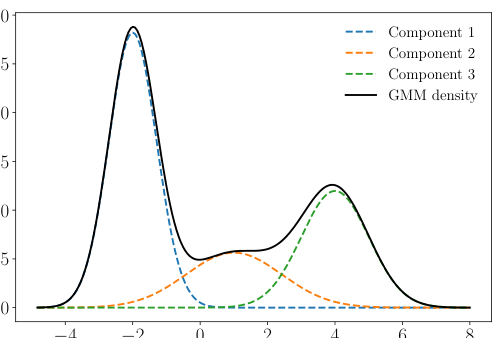
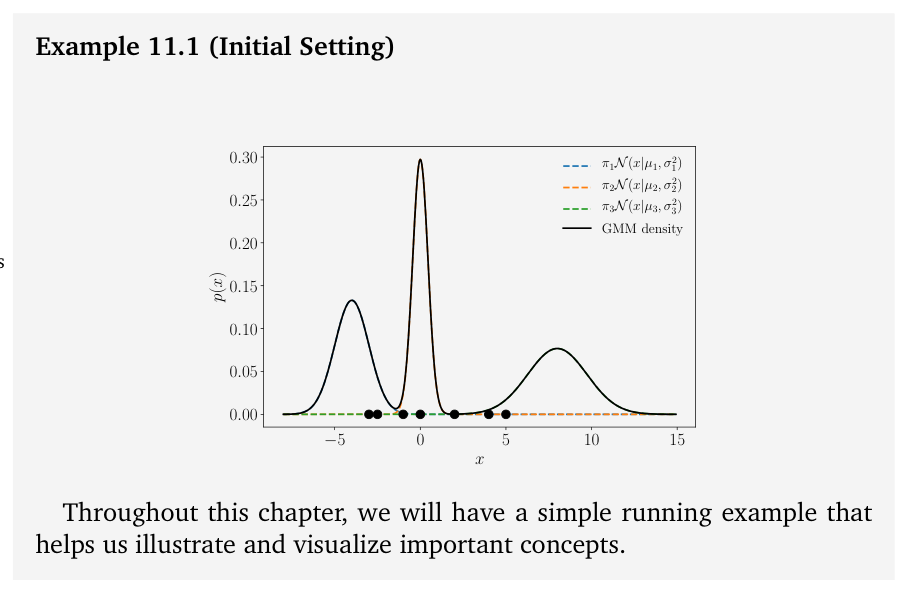
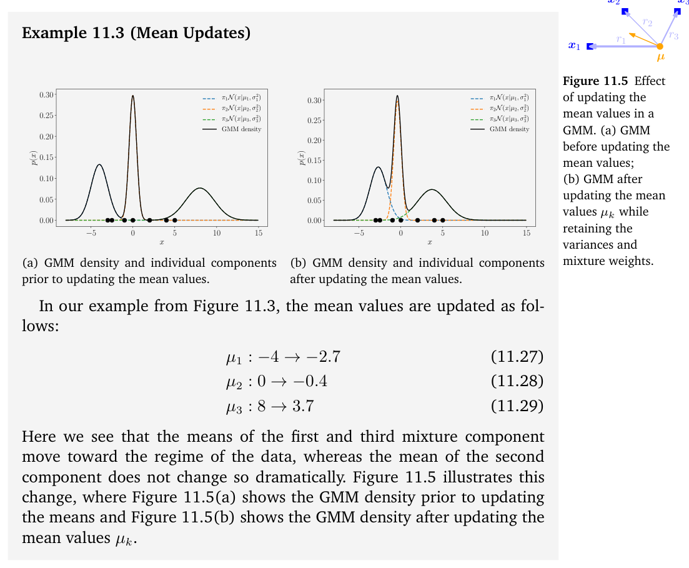
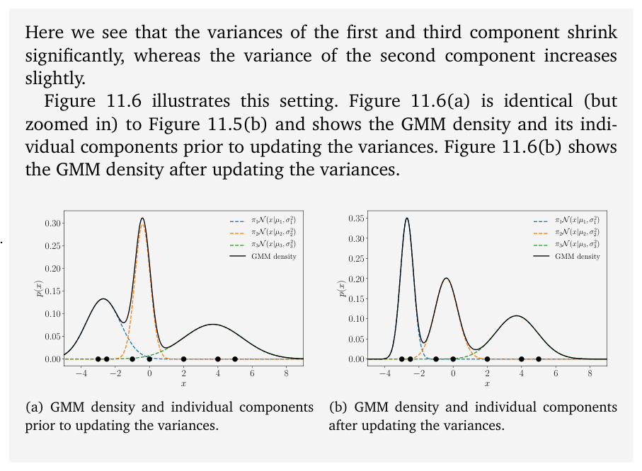
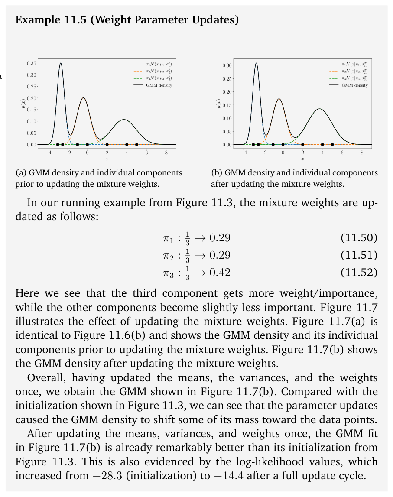
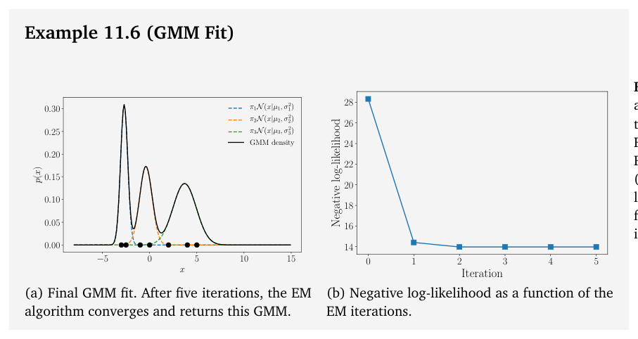
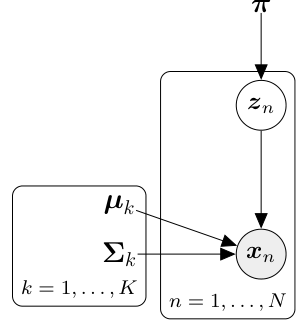
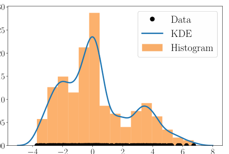

# 第 11 章 用高斯混合模型进行密度估计（Density Estimation with Gaussian Mixture Models）

> [← 返回目录](README.md)

> In practice, the Gaussian (or similarly all other distributions we encountered so far) have limited modeling capabilities. For example, a Gaussian approximation of the density that generated the data in Figure 11.1 would be a poor approximation. In the following, we will look at a more expressive family of distributions, which we can use for density estimation: mixture models. Mixture models can be used to describe a distribution $p(\boldsymbol{x})$ by a convex combination of $K$ simple (base) distributions

在实践中，高斯分布（或类似地，我们迄今遇到的所有其他分布）的建模能力都很有限。例如，用一个高斯分布去近似生成图 11.1 中数据的密度，会得到很差的近似。接下来，我们将考察一族更具表现力的分布，它们可用于密度估计：混合模型（mixture model）。混合模型可以用 $K$ 个简单（基础）分布的凸组合来描述一个分布 $p(\boldsymbol{x})$

$$
p(\boldsymbol{x}) = \sum_{k=1}^{K} \pi_k p_k(\boldsymbol{x}) \tag{11.1}
$$

$$
0 \leqslant \pi_k \leqslant 1, \quad \sum_{k=1}^{K} \pi_k = 1 \,, \tag{11.2}
$$

> where the components $p_k$ are members of a family of basic distributions, e.g., Gaussians, Bernoullis, or Gammas, and the $\pi_k$ are mixture weights. Mixture models are more expressive than the corresponding base distributions because they allow for multimodal data representations, i.e., they can describe datasets with multiple “clusters”, such as the example in Figure 11.1.

其中，各成分 $p_k$ 是某一族基础分布（如高斯分布、伯努利分布或 Gamma 分布）中的成员，而 $\pi_k$ 则是混合权重（mixture weight）。混合模型比相应的基础分布更具表现力，因为它们可以表达多峰的数据表示，也就是说，它们能够描述具有多个“簇”的数据集，例如图 11.1 中的示例。

> We will focus on Gaussian mixture models (GMMs), where the basic distributions are Gaussians. For a given dataset, we aim to maximize the likelihood of the model parameters to train the GMM. For this purpose, we will use results from Chapter 5, Chapter 6, and Section 7.2. However, unlike other applications we discussed earlier (linear regression or PCA), we will not find a closed-form maximum likelihood solution. Instead, we will arrive at a set of dependent simultaneous equations, which we can only solve iteratively.

我们将重点讨论高斯混合模型（GMM），其基础分布为高斯分布。对于给定的数据集，我们的目标是最大化模型参数的似然，以此来训练 GMM。为此，我们将用到第 5 章、第 6 章和 7.2 节的结果。然而，与我们之前讨论过的其他应用（线性回归或 PCA）不同，我们无法找到闭式的最大似然解。相反，我们将得到一组相互依赖的联立方程，只能通过迭代来求解。

## 11.1 高斯混合模型（Gaussian Mixture Model）

> A Gaussian mixture model is a density model where we combine a finite number of $K$ Gaussian distributions $\mathcal{N}(\boldsymbol{x} \mid \boldsymbol{\mu}_k, \boldsymbol{\Sigma}_k)$ so that

高斯混合模型是一种密度模型，其中我们将有限数目的 $K$ 个高斯分布 $\mathcal{N}(\boldsymbol{x} \mid \boldsymbol{\mu}_k, \boldsymbol{\Sigma}_k)$ 组合起来，使得

$$
p(\boldsymbol{x} \mid \boldsymbol{\theta}) = \sum_{k=1}^{K} \pi_k \mathcal{N}(\boldsymbol{x} \mid \boldsymbol{\mu}_k, \boldsymbol{\Sigma}_k) \tag{11.3}
$$

$$
0 \leqslant \pi_k \leqslant 1, \quad \sum_{k=1}^{K} \pi_k = 1 \,, \tag{11.4}
$$

> where we defined $\boldsymbol{\theta} := \{\boldsymbol{\mu}_k, \boldsymbol{\Sigma}_k, \pi_k : k = 1, \ldots, K\}$ as the collection of all parameters of the model. This convex combination of Gaussian distribution gives us significantly more flexibility for modeling complex densities than a simple Gaussian distribution (which we recover from (11.3) for $K = 1$). An illustration is given in Figure 11.2, displaying the weighted

其中，我们把 $\boldsymbol{\theta} := \{\boldsymbol{\mu}_k, \boldsymbol{\Sigma}_k, \pi_k : k = 1, \ldots, K\}$ 定义为模型所有参数的集合。与单一的高斯分布（当 $K = 1$ 时可由 (11.3) 还原得到）相比，这种高斯分布的凸组合为建模复杂密度提供了显著更多的灵活性。图 11.2 给出了一个示例，其中展示了加权

> **Figure 11.2** Gaussian mixture model. The Gaussian mixture distribution (black) is composed of a convex combination of Gaussian distributions and is more expressive than any individual component. Dashed lines represent the weighted Gaussian components.

**图 11.2** 高斯混合模型。高斯混合分布（黑色）由多个高斯分布的凸组合构成，比任何单个成分都更具表现力。虚线表示加权后的高斯成分。

> components and the mixture density, which is given as

成分和混合密度，由下式给出

$$
p(x \mid \theta) = 0.5\, \mathcal{N}(x \mid -2, 1) + 0.2\, \mathcal{N}(x \mid 1, 2) + 0.3\, \mathcal{N}(x \mid 4, 1) \,. \tag{11.5}
$$

## 11.2 通过最大似然进行参数学习（Parameter Learning via Maximum Likelihood）

> Assume we are given a dataset $\mathcal{X} = \{\boldsymbol{x}_1, \ldots, \boldsymbol{x}_N\}$, where $\boldsymbol{x}_n$, $n = 1, \ldots, N$, are drawn i.i.d. from an unknown distribution $p(\boldsymbol{x})$. Our objective is to find a good approximation/representation of this unknown distribution $p(\boldsymbol{x})$ by means of a GMM with $K$ mixture components. The parameters of the GMM are the $K$ means $\boldsymbol{\mu}_k$, the covariances $\boldsymbol{\Sigma}_k$, and mixture weights $\pi_k$. We summarize all these free parameters in $\boldsymbol{\theta} := \{\pi_k, \boldsymbol{\mu}_k, \boldsymbol{\Sigma}_k : k = 1, \ldots, K\}$.

假设我们给定一个数据集 $\mathcal{X} = \{\boldsymbol{x}_1, \ldots, \boldsymbol{x}_N\}$，其中 $\boldsymbol{x}_n$（$n = 1, \ldots, N$）独立同分布（i.i.d.）地采样自某个未知分布 $p(\boldsymbol{x})$。我们的目标是借助一个具有 $K$ 个混合成分（mixture component）的 GMM，为这个未知分布 $p(\boldsymbol{x})$ 找到一个较好的近似/表示。GMM 的参数是 $K$ 个均值 $\boldsymbol{\mu}_k$、协方差矩阵 $\boldsymbol{\Sigma}_k$ 以及混合权重 $\pi_k$。我们把所有这些自由参数汇总为 $\boldsymbol{\theta} := \{\pi_k, \boldsymbol{\mu}_k, \boldsymbol{\Sigma}_k : k = 1, \ldots, K\}$。

> **Example 11.1** (Initial Setting)

**例 11.1**（初始设置）

> **Figure 11.3** Initial setting: GMM (black) with three mixture components (dashed) and seven data points (discs).

**图 11.3** 初始设置：具有三个混合成分（虚线）和七个数据点（圆盘）的 GMM（黑色）。

> Throughout this chapter, we will have a simple running example that helps us illustrate and visualize important concepts.

在本章中，我们将贯穿使用一个简单的示例，帮助我们阐述并可视化重要概念。

> We consider a one-dimensional dataset $\mathcal{X} = \{-3, -2.5, -1, 0, 2, 4, 5\}$ consisting of seven data points and wish to find a GMM with $K = 3$ components that models the density of the data. We initialize the mixture components as

我们考虑由七个数据点组成的一维数据集 $\mathcal{X} = \{-3, -2.5, -1, 0, 2, 4, 5\}$，希望找到一个具有 $K = 3$ 个成分的 GMM 来为数据的密度建模。我们将各混合成分初始化为

$$
p_1(x) = \mathcal{N}(x \mid -4, 1) \tag{11.6}
$$

$$
p_2(x) = \mathcal{N}(x \mid 0, 0.2) \tag{11.7}
$$

$$
p_3(x) = \mathcal{N}(x \mid 8, 3) \tag{11.8}
$$

> and assign them equal weights $\pi_1 = \pi_2 = \pi_3 = \frac{1}{3}$. The corresponding model (and the data points) are shown in Figure 11.3.

并为它们分配相等的权重 $\pi_1 = \pi_2 = \pi_3 = \frac{1}{3}$。对应的模型（以及数据点）如图 11.3 所示。

> In the following, we detail how to obtain a maximum likelihood estimate $\boldsymbol{\theta}_{\text{ML}}$ of the model parameters $\boldsymbol{\theta}$. We start by writing down the likelihood, i.e., the predictive distribution of the training data given the parameters. We exploit our i.i.d. assumption, which leads to the factorized likelihood

接下来，我们详细说明如何求得模型参数 $\boldsymbol{\theta}$ 的最大似然估计（maximum likelihood estimate, MLE）$\boldsymbol{\theta}_{\text{ML}}$。我们首先写下似然，即在给定参数的条件下训练数据的预测分布。利用我们的 i.i.d. 假设，可得到因子分解的似然

$$
p(\mathcal{X} \mid \boldsymbol{\theta}) = \prod_{n=1}^{N} p(\boldsymbol{x}_n \mid \boldsymbol{\theta}) \,, \qquad p(\boldsymbol{x}_n \mid \boldsymbol{\theta}) = \sum_{k=1}^{K} \pi_k \mathcal{N}(\boldsymbol{x}_n \mid \boldsymbol{\mu}_k, \boldsymbol{\Sigma}_k) \,, \tag{11.9}
$$

> where every individual likelihood term $p(\boldsymbol{x}_n \mid \boldsymbol{\theta})$ is a Gaussian mixture density. Then we obtain the log-likelihood as

其中每一个似然项 $p(\boldsymbol{x}_n \mid \boldsymbol{\theta})$ 都是一个高斯混合密度。随后，我们得到对数似然

$$
\log p(\mathcal{X} \mid \boldsymbol{\theta}) = \sum_{n=1}^{N} \log p(\boldsymbol{x}_n \mid \boldsymbol{\theta}) = \underbrace{\sum_{n=1}^{N} \log \sum_{k=1}^{K} \pi_k \mathcal{N}(\boldsymbol{x}_n \mid \boldsymbol{\mu}_k, \boldsymbol{\Sigma}_k)}_{=:L} \,. \tag{11.10}
$$

> We aim to find parameters $\boldsymbol{\theta}_{\text{ML}}^{\ast}$ that maximize the log-likelihood $L$ defined in (11.10). Our “normal” procedure would be to compute the gradient $\mathrm{d}L/\mathrm{d}\boldsymbol{\theta}$ of the log-likelihood with respect to the model parameters $\boldsymbol{\theta}$, set it to 0, and solve for $\boldsymbol{\theta}$. However, unlike our previous examples for maximum likelihood estimation (e.g., when we discussed linear regression in Section 9.2), we cannot obtain a closed-form solution. However, we can exploit an iterative scheme to find good model parameters $\boldsymbol{\theta}_{\text{ML}}$, which will turn out to be the EM algorithm for GMMs. The key idea is to update one model parameter at a time while keeping the others fixed.

我们的目标是找到使 (11.10) 中定义的对数似然 $L$ 最大化的参数 $\boldsymbol{\theta}_{\text{ML}}^{\ast}$。按照“通常”的做法，我们会计算对数似然关于模型参数 $\boldsymbol{\theta}$ 的梯度 $\mathrm{d}L/\mathrm{d}\boldsymbol{\theta}$，令其为 0，并解出 $\boldsymbol{\theta}$。然而，与我们之前讨论过的最大似然估计的例子（例如 9.2 节中讨论的线性回归）不同，这里无法得到闭式解。不过，我们可以利用一种迭代方案来找到好的模型参数 $\boldsymbol{\theta}_{\text{ML}}$，它最终将表现为用于 GMM 的期望最大化（EM）算法。其关键思想是每次只更新一个模型参数，同时保持其他参数固定。

> **Remark.** If we were to consider a single Gaussian as the desired density, the sum over $k$ in (11.10) vanishes, and the log can be applied directly to the Gaussian component, such that we get

**评注.** 如果我们把单个高斯分布作为想要的密度，那么 (11.10) 中对 $k$ 的求和就会消失，并且可以直接对高斯成分取对数，于是得到

$$
\log \mathcal{N}(\boldsymbol{x} \mid \boldsymbol{\mu}, \boldsymbol{\Sigma}) = -\frac{D}{2} \log(2\pi) - \frac{1}{2} \log \det(\boldsymbol{\Sigma}) - \frac{1}{2} (\boldsymbol{x} - \boldsymbol{\mu})^{\top} \boldsymbol{\Sigma}^{-1} (\boldsymbol{x} - \boldsymbol{\mu}) \,. \tag{11.11}
$$

> This simple form allows us to find closed-form maximum likelihood estimates of $\boldsymbol{\mu}$ and $\boldsymbol{\Sigma}$, as discussed in Chapter 8. In (11.10), we cannot move the log into the sum over $k$ so that we cannot obtain a simple closed-form maximum likelihood solution. ♢

正如第 8 章所讨论的，这一简单形式使我们能够求得 $\boldsymbol{\mu}$ 和 $\boldsymbol{\Sigma}$ 的闭式最大似然估计。而在 (11.10) 中，我们无法把对数移入对 $k$ 的求和之内，因此无法得到简单的闭式最大似然解。♢

> Any local optimum of a function exhibits the property that its gradient with respect to the parameters must vanish (necessary condition); see Chapter 7. In our case, we obtain the following necessary conditions when we optimize the log-likelihood in (11.10) with respect to the GMM parameters $\boldsymbol{\mu}_k$, $\boldsymbol{\Sigma}_k$, $\pi_k$:

函数的任何局部最优点都具有这样的性质：它关于参数的梯度必定为零（必要条件）；参见第 7 章。在我们的情形中，当针对 GMM 参数 $\boldsymbol{\mu}_k$、$\boldsymbol{\Sigma}_k$、$\pi_k$ 优化 (11.10) 中的对数似然时，我们得到如下必要条件：

$$
\frac{\partial L}{\partial \boldsymbol{\mu}_k} = \boldsymbol{0}^{\top} \Longleftrightarrow \sum_{n=1}^{N} \frac{\partial \log p(\boldsymbol{x}_n \mid \boldsymbol{\theta})}{\partial \boldsymbol{\mu}_k} = \boldsymbol{0}^{\top} \,, \tag{11.12}
$$

$$
\frac{\partial L}{\partial \boldsymbol{\Sigma}_k} = \boldsymbol{0} \Longleftrightarrow \sum_{n=1}^{N} \frac{\partial \log p(\boldsymbol{x}_n \mid \boldsymbol{\theta})}{\partial \boldsymbol{\Sigma}_k} = \boldsymbol{0} \,, \tag{11.13}
$$

$$
\frac{\partial L}{\partial \pi_k} = 0 \Longleftrightarrow \sum_{n=1}^{N} \frac{\partial \log p(\boldsymbol{x}_n \mid \boldsymbol{\theta})}{\partial \pi_k} = 0 \,. \tag{11.14}
$$

> For all three necessary conditions, by applying the chain rule (see Section 5.2.2), we require partial derivatives of the form

对于这三个必要条件，应用链式法则（chain rule，见 5.2.2 节）后，我们都需要形如下式的偏导数：

$$
\frac{\partial \log p(\boldsymbol{x}_n \mid \boldsymbol{\theta})}{\partial \boldsymbol{\theta}} = \frac{1}{p(\boldsymbol{x}_n \mid \boldsymbol{\theta})} \frac{\partial p(\boldsymbol{x}_n \mid \boldsymbol{\theta})}{\partial \boldsymbol{\theta}} \,, \tag{11.15}
$$

> where $\boldsymbol{\theta} = \{\boldsymbol{\mu}_k, \boldsymbol{\Sigma}_k, \pi_k, k = 1, \ldots, K\}$ are the model parameters and

其中 $\boldsymbol{\theta} = \{\boldsymbol{\mu}_k, \boldsymbol{\Sigma}_k, \pi_k, k = 1, \ldots, K\}$ 是模型参数，且

$$
\frac{1}{p(\boldsymbol{x}_n \mid \boldsymbol{\theta})} = \frac{1}{\sum_{j=1}^{K} \pi_j \mathcal{N}(\boldsymbol{x}_n \mid \boldsymbol{\mu}_j, \boldsymbol{\Sigma}_j)} \,. \tag{11.16}
$$

> In the following, we will compute the partial derivatives (11.12) through (11.14). But before we do this, we introduce a quantity that will play a central role in the remainder of this chapter: responsibilities.

接下来，我们将计算 (11.12) 至 (11.14) 的偏导数。但在此之前，我们先引入一个在本章剩余部分中将起核心作用的量：责任（responsibility）。

### 11.2.1 责任（Responsibilities）

> We define the quantity

我们定义

$$
r_{nk} := \frac{\pi_k \mathcal{N}(\boldsymbol{x}_n \mid \boldsymbol{\mu}_k, \boldsymbol{\Sigma}_k)}{\sum_{j=1}^{K} \pi_j \mathcal{N}(\boldsymbol{x}_n \mid \boldsymbol{\mu}_j, \boldsymbol{\Sigma}_j)} \tag{11.17}
$$

> as the responsibility of the $k$th mixture component for the $n$th data point.

为第 $k$ 个混合成分对第 $n$ 个数据点的责任。

> The responsibility $r_{nk}$ of the $k$th mixture component for data point $\boldsymbol{x}_n$ is proportional to the likelihood

第 $k$ 个混合成分对数据点 $\boldsymbol{x}_n$ 的责任 $r_{nk}$ 正比于该混合成分

$$
p(\boldsymbol{x}_n \mid \pi_k, \boldsymbol{\mu}_k, \boldsymbol{\Sigma}_k) = \pi_k \mathcal{N}(\boldsymbol{x}_n \mid \boldsymbol{\mu}_k, \boldsymbol{\Sigma}_k) \tag{11.18}
$$

> of the mixture component given the data point. Therefore, mixture components have a high responsibility for a data point when the data point could be a plausible sample from that mixture component.

在给定该数据点时的似然。因此，当一个数据点有可能是来自某个混合成分的合理样本时，该混合成分对这个数据点就具有高责任。

> Note that $\boldsymbol{r}_n := [r_{n1}, \ldots, r_{nK}]^{\top} \in \mathbb{R}^K$ is a (normalized) probability vector, i.e., $\sum_k r_{nk} = 1$ with $r_{nk} \geqslant 0$. This probability vector distributes probability mass among the $K$ mixture components, and we can think of $\boldsymbol{r}_n$ as a “soft assignment” of $\boldsymbol{x}_n$ to the $K$ mixture components. Therefore, the responsibility $r_{nk}$ from (11.17) represents the probability that $\boldsymbol{x}_n$ has been generated by the $k$th mixture component.

注意 $\boldsymbol{r}_n := [r_{n1}, \ldots, r_{nK}]^{\top} \in \mathbb{R}^K$ 是一个（归一化的）概率向量，即 $\sum_k r_{nk} = 1$ 且 $r_{nk} \geqslant 0$。这个概率向量在 $K$ 个混合成分之间分配概率质量，我们可以把 $\boldsymbol{r}_n$ 看作 $\boldsymbol{x}_n$ 在 $K$ 个混合成分上的“软分配”（soft assignment）。因此，(11.17) 中的责任 $r_{nk}$ 表示 $\boldsymbol{x}_n$ 由第 $k$ 个混合成分生成的概率。

> **Example 11.2** (Responsibilities) For our example from Figure 11.3, we compute the responsibilities $r_{nk}$

**例 11.2**（责任）对于图 11.3 中的例子，我们计算出责任 $r_{nk}$

$$
\begin{pmatrix} 1.0 & 0.0 & 0.0 \\ 1.0 & 0.0 & 0.0 \\ 0.057 & 0.943 & 0.0 \\ 0.001 & 0.999 & 0.0 \\ 0.0 & 0.066 & 0.934 \\ 0.0 & 0.0 & 1.0 \\ 0.0 & 0.0 & 1.0 \end{pmatrix} \in \mathbb{R}^{N \times K} \,. \tag{11.19}
$$

> Here the $n$th row tells us the responsibilities of all mixture components for $\boldsymbol{x}_n$. The sum of all $K$ responsibilities for a data point (sum of every row) is 1. The $k$th column gives us an overview of the responsibility of the $k$th mixture component. We can see that the third mixture component (third column) is not responsible for any of the first four data points, but takes much responsibility of the remaining data points. The sum of all entries of a column gives us the values $N_k$, i.e., the total responsibility of the $k$th mixture component. In our example, we get $N_1 = 2.058$, $N_2 = 2.008$, $N_3 = 2.934$.

这里，第 $n$ 行告诉我们所有混合成分对 $\boldsymbol{x}_n$ 的责任。某个数据点的全部 $K$ 个责任之和（每一行之和）为 1。第 $k$ 列让我们总览第 $k$ 个混合成分所承担的责任。可以看到，第三个混合成分（第三列）对前四个数据点都不承担任何责任，但对其余数据点承担了很大的责任。一列中所有元素之和给出 $N_k$ 的值，即第 $k$ 个混合成分的总责任。在我们的例子中，得到 $N_1 = 2.058$、$N_2 = 2.008$、$N_3 = 2.934$。

> In the following, we determine the updates of the model parameters $\boldsymbol{\mu}_k$, $\boldsymbol{\Sigma}_k$, $\pi_k$ for given responsibilities. We will see that the update equations all depend on the responsibilities, which makes a closed-form solution to the maximum likelihood estimation problem impossible. However, for given responsibilities we will be updating one model parameter at a time, while keeping the others fixed. After this, we will recompute the responsibilities. Iterating these two steps will eventually converge to a local optimum and is a specific instantiation of the EM algorithm. We will discuss this in some more detail in Section 11.3.

接下来，我们在给定责任的条件下确定模型参数 $\boldsymbol{\mu}_k$、$\boldsymbol{\Sigma}_k$、$\pi_k$ 的更新。我们将看到，这些更新方程都依赖于责任，这使得最大似然估计问题无法得到闭式解。不过，在给定责任时，我们可以一次更新一个模型参数，同时保持其他参数固定；随后重新计算责任。迭代这两个步骤最终会收敛到一个局部最优点，而这正是 EM 算法的一个具体实例。我们将在 11.3 节中更详细地讨论这一点。

### 11.2.2 均值的更新（Updating the Means）

> **Theorem 11.1** (Update of the GMM Means). The update of the mean parameters $\boldsymbol{\mu}_k$, $k = 1, \ldots, K$, of the GMM is given by

**定理 11.1**（GMM 均值的更新，Update of the GMM Means）。GMM 的均值参数 $\boldsymbol{\mu}_k$（$k = 1, \ldots, K$）的更新由下式给出

$$
\boldsymbol{\mu}_k^{\text{new}} = \frac{\sum_{n=1}^{N} r_{nk} \boldsymbol{x}_n}{\sum_{n=1}^{N} r_{nk}} \,, \tag{11.20}
$$

> where the responsibilities $r_{nk}$ are defined in (11.17).

其中的责任 $r_{nk}$ 由 (11.17) 定义。

> **Remark.** The update of the means $\boldsymbol{\mu}_k$ of the individual mixture components in (11.20) depends on all means, covariance matrices $\boldsymbol{\Sigma}_k$, and mixture weights $\pi_k$ via $r_{nk}$ given in (11.17). Therefore, we cannot obtain a closed-form solution for all $\boldsymbol{\mu}_k$ at once. ♢

**评注.** (11.20) 中各个混合成分均值 $\boldsymbol{\mu}_k$ 的更新，通过 (11.17) 给出的 $r_{nk}$ 依赖于所有均值、协方差矩阵 $\boldsymbol{\Sigma}_k$ 和混合权重 $\pi_k$。因此，我们无法一次性得到所有 $\boldsymbol{\mu}_k$ 的闭式解。♢

> Proof

**证明.**

> From (11.15), we see that the gradient of the log-likelihood with respect to the mean parameters $\boldsymbol{\mu}_k$, $k = 1, \ldots, K$, requires us to compute the partial derivative

由 (11.15) 可见，对数似然关于均值参数 $\boldsymbol{\mu}_k$（$k = 1, \ldots, K$）的梯度要求我们计算偏导数

$$
\frac{\partial p(\boldsymbol{x}_n \mid \boldsymbol{\theta})}{\partial \boldsymbol{\mu}_k} = \frac{\partial \sum_{j=1}^{K} \pi_j \mathcal{N}(\boldsymbol{x}_n \mid \boldsymbol{\mu}_j, \boldsymbol{\Sigma}_j)}{\partial \boldsymbol{\mu}_k} = \pi_k \frac{\partial \mathcal{N}(\boldsymbol{x}_n \mid \boldsymbol{\mu}_k, \boldsymbol{\Sigma}_k)}{\partial \boldsymbol{\mu}_k} \tag{11.21a}
$$

$$
= \pi_k (\boldsymbol{x}_n - \boldsymbol{\mu}_k)^{\top} \boldsymbol{\Sigma}_k^{-1} \mathcal{N}(\boldsymbol{x}_n \mid \boldsymbol{\mu}_k, \boldsymbol{\Sigma}_k) \,, \tag{11.21b}
$$

> where we exploited that only the $k$th mixture component depends on $\boldsymbol{\mu}_k$.

其中我们利用了只有第 $k$ 个混合成分依赖于 $\boldsymbol{\mu}_k$ 这一事实。

> We use our result from (11.21b) in (11.15) and put everything together so that the desired partial derivative of $L$ with respect to $\boldsymbol{\mu}_k$ is given as

我们把 (11.21b) 中的结果用于 (11.15)，并将所有步骤整合在一起，得到 $L$ 关于 $\boldsymbol{\mu}_k$ 的所求偏导数：

$$
\frac{\partial L}{\partial \boldsymbol{\mu}_k} = \sum_{n=1}^{N} \frac{\partial \log p(\boldsymbol{x}_n \mid \boldsymbol{\theta})}{\partial \boldsymbol{\mu}_k} = \sum_{n=1}^{N} \frac{1}{p(\boldsymbol{x}_n \mid \boldsymbol{\theta})} \frac{\partial p(\boldsymbol{x}_n \mid \boldsymbol{\theta})}{\partial \boldsymbol{\mu}_k} \tag{11.22a}
$$

$$
= \sum_{n=1}^{N} \underbrace{\frac{\pi_k \mathcal{N}(\boldsymbol{x}_n \mid \boldsymbol{\mu}_k, \boldsymbol{\Sigma}_k)}{\sum_{j=1}^{K} \pi_j \mathcal{N}(\boldsymbol{x}_n \mid \boldsymbol{\mu}_j, \boldsymbol{\Sigma}_j)}}_{=r_{nk}} (\boldsymbol{x}_n - \boldsymbol{\mu}_k)^{\top} \boldsymbol{\Sigma}_k^{-1} \tag{11.22b}
$$

$$
= \sum_{n=1}^{N} r_{nk} (\boldsymbol{x}_n - \boldsymbol{\mu}_k)^{\top} \boldsymbol{\Sigma}_k^{-1} \,. \tag{11.22c}
$$

> Here we used the identity from (11.16) and the result of the partial derivative in (11.21b) to get to (11.22b). The values $r_{nk}$ are the responsibilities we defined in (11.17).

这里，我们利用 (11.16) 的恒等式和 (11.21b) 中偏导数的结果得到 (11.22b)。$r_{nk}$ 的值就是我们在 (11.17) 中定义的责任。

> We now solve (11.22c) for $\boldsymbol{\mu}_k^{\text{new}}$ so that $\frac{\partial L(\boldsymbol{\mu}_k^{\text{new}})}{\partial \boldsymbol{\mu}_k} = \boldsymbol{0}^{\top}$ and obtain

现在我们对 $\boldsymbol{\mu}_k^{\text{new}}$ 求解 (11.22c)，使得 $\frac{\partial L(\boldsymbol{\mu}_k^{\text{new}})}{\partial \boldsymbol{\mu}_k} = \boldsymbol{0}^{\top}$，并得到

$$
\sum_{n=1}^{N} r_{nk} \boldsymbol{x}_n = \sum_{n=1}^{N} r_{nk} \boldsymbol{\mu}_k^{\text{new}} \Longleftrightarrow \boldsymbol{\mu}_k^{\text{new}} = \frac{\sum_{n=1}^{N} r_{nk} \boldsymbol{x}_n}{\sum_{n=1}^{N} r_{nk}} = \frac{1}{N_k} \sum_{n=1}^{N} r_{nk} \boldsymbol{x}_n \,, \tag{11.23}
$$

> where we defined

其中我们定义了

$$
N_k := \sum_{n=1}^{N} r_{nk} \tag{11.24}
$$

> as the total responsibility of the $k$th mixture component for the entire dataset. This concludes the proof of Theorem 11.1.

为第 $k$ 个混合成分对整个数据集的总责任。定理 11.1 的证明到此结束。

> Intuitively, (11.20) can be interpreted as an importance-weighted Monte Carlo estimate of the mean, where the importance weights of data point $\boldsymbol{x}_n$ are the responsibilities $r_{nk}$ of the $k$th cluster for $\boldsymbol{x}_n$, $k = 1, \ldots, K$.

直观上，(11.20) 可以解释为均值的重要性加权蒙特卡洛（Monte Carlo）估计，其中数据点 $\boldsymbol{x}_n$ 的重要性权重是第 $k$ 个簇对 $\boldsymbol{x}_n$ 的责任 $r_{nk}$（$k = 1, \ldots, K$）。

> **Figure 11.4** Update of the mean parameter of mixture component in a GMM. The mean $\boldsymbol{\mu}$ is being pulled toward individual data points with the weights given by the corresponding responsibilities.

**图 11.4** GMM 中混合成分均值参数的更新。均值 $\boldsymbol{\mu}$ 被拉向各个数据点，其权重由相应的责任给出。

> Therefore, the mean $\boldsymbol{\mu}_k$ is pulled toward a data point $\boldsymbol{x}_n$ with strength given by $r_{nk}$. The means are pulled stronger toward data points for which the corresponding mixture component has a high responsibility, i.e., a high likelihood. Figure 11.4 illustrates this. We can also interpret the mean update in (11.20) as the expected value of all data points under the distribution given by

因此，均值 $\boldsymbol{\mu}_k$ 会以由 $r_{nk}$ 给定的强度被拉向数据点 $\boldsymbol{x}_n$。当相应的混合成分对某个数据点具有高责任（即高似然）时，均值就会被更强地拉向该数据点。图 11.4 说明了这一点。我们还可以把 (11.20) 中的均值更新解释为：所有数据点在由下式给出的分布下的期望值

$$
\boldsymbol{r}_k := [r_{1k}, \ldots, r_{Nk}]^{\top} / N_k \,, \tag{11.25}
$$

> which is a normalized probability vector, i.e.,

它是一个归一化的概率向量，即

$$
\boldsymbol{\mu}_k \leftarrow \mathbb{E}_{\boldsymbol{r}_k}[\mathcal{X}] \,. \tag{11.26}
$$

> **Example 11.3** (Mean Updates)

**例 11.3**（均值的更新）

> **Figure 11.5** Effect of updating the mean values in a GMM. (a) GMM before updating the mean values; (b) GMM after updating the mean values $\boldsymbol{\mu}_k$ while retaining the variances and mixture weights.

**图 11.5** GMM 中更新均值的效果。(a) 更新均值前的 GMM；(b) 在保留方差和混合权重的情况下更新均值 $\boldsymbol{\mu}_k$ 后的 GMM。

> In our example from Figure 11.3, the mean values are updated as follows:

在我们图 11.3 的例子中，均值的更新如下：

$$
\mu_1 : -4 \rightarrow -2.7 \tag{11.27}
$$

$$
\mu_2 : 0 \rightarrow -0.4 \tag{11.28}
$$

$$
\mu_3 : 8 \rightarrow 3.7 \tag{11.29}
$$

> Here we see that the means of the first and third mixture component move toward the regime of the data, whereas the mean of the second component does not change so dramatically. Figure 11.5 illustrates this change, where Figure 11.5(a) shows the GMM density prior to updating the means and Figure 11.5(b) shows the GMM density after updating the mean values $\boldsymbol{\mu}_k$.

由此我们可以看到，第一个和第三个混合成分的均值向数据所在的区域移动，而第二个成分的均值变化则不那么明显。图 11.5 展示了这一变化，其中图 11.5(a) 展示了更新均值之前的 GMM 密度，图 11.5(b) 展示了更新均值 $\boldsymbol{\mu}_k$ 之后的 GMM 密度。

> The update of the mean parameters in (11.20) look fairly straightforward. However, note that the responsibilities $r_{nk}$ are a function of $\pi_j$, $\boldsymbol{\mu}_j$, $\boldsymbol{\Sigma}_j$ for all $j = 1, \ldots, K$, such that the updates in (11.20) depend on all parameters of the GMM, and a closed-form solution, which we obtained for linear regression in Section 9.2 or PCA in Chapter 10, cannot be obtained.

(11.20) 中均值参数的更新看起来相当直接。然而，请注意责任 $r_{nk}$ 是 $\pi_j$、$\boldsymbol{\mu}_j$、$\boldsymbol{\Sigma}_j$（对所有 $j = 1, \ldots, K$）的函数，因此 (11.20) 中的更新依赖于 GMM 的所有参数，无法得到我们在 9.2 节的线性回归或第 10 章的 PCA 中所得到的那类闭式解。

### 11.2.3 协方差的更新（Updating the Covariances）

> **Theorem 11.2** (Updates of the GMM Covariances). The update of the covariance parameters $\boldsymbol{\Sigma}_k$, $k = 1, \ldots, K$ of the GMM is given by

**定理 11.2**（GMM 协方差的更新，Updates of the GMM Covariances）。GMM 的协方差参数 $\boldsymbol{\Sigma}_k$（$k = 1, \ldots, K$）的更新由下式给出

$$
\boldsymbol{\Sigma}_k^{\text{new}} = \frac{1}{N_k} \sum_{n=1}^{N} r_{nk} (\boldsymbol{x}_n - \boldsymbol{\mu}_k) (\boldsymbol{x}_n - \boldsymbol{\mu}_k)^{\top} \,, \tag{11.30}
$$

> where $r_{nk}$ and $N_k$ are defined in (11.17) and (11.24), respectively.

其中 $r_{nk}$ 和 $N_k$ 分别由 (11.17) 和 (11.24) 定义。

> **Proof** To prove Theorem 11.2, our approach is to compute the partial derivatives of the log-likelihood $L$ with respect to the covariances $\boldsymbol{\Sigma}_k$, set them to 0, and solve for $\boldsymbol{\Sigma}_k$. We start with our general approach

**证明.** 为证明定理 11.2，我们的思路是计算对数似然 $L$ 关于协方差 $\boldsymbol{\Sigma}_k$ 的偏导数，令其为 0，并对 $\boldsymbol{\Sigma}_k$ 求解。我们从如下的一般方法出发

$$
\frac{\partial L}{\partial \boldsymbol{\Sigma}_k} = \sum_{n=1}^{N} \frac{\partial \log p(\boldsymbol{x}_n \mid \boldsymbol{\theta})}{\partial \boldsymbol{\Sigma}_k} = \sum_{n=1}^{N} \frac{\partial p(\boldsymbol{x}_n \mid \boldsymbol{\theta})}{\partial \boldsymbol{\Sigma}_k} \frac{1}{p(\boldsymbol{x}_n \mid \boldsymbol{\theta})} \,. \tag{11.31}
$$

> We already know $1/p(\boldsymbol{x}_n \mid \boldsymbol{\theta})$ from (11.16). To obtain the remaining partial derivative $\partial p(\boldsymbol{x}_n \mid \boldsymbol{\theta})/\partial \boldsymbol{\Sigma}_k$, we write down the definition of the Gaussian distribution $p(\boldsymbol{x}_n \mid \boldsymbol{\theta})$ (see (11.9)) and drop all terms but the $k$th. We then obtain

$1/p(\boldsymbol{x}_n \mid \boldsymbol{\theta})$ 已由 (11.16) 给出。为了得到余下的偏导数 $\partial p(\boldsymbol{x}_n \mid \boldsymbol{\theta})/\partial \boldsymbol{\Sigma}_k$，我们写出高斯分布 $p(\boldsymbol{x}_n \mid \boldsymbol{\theta})$ 的定义（见 (11.9)），并丢弃除第 $k$ 项之外的所有项。于是得到

$$
\begin{aligned}
\frac{\partial p(\boldsymbol{x}_n \mid \boldsymbol{\theta})}{\partial \boldsymbol{\Sigma}_k} &= \frac{\partial}{\partial \boldsymbol{\Sigma}_k} \left( \pi_k (2\pi)^{-\frac{D}{2}} \det(\boldsymbol{\Sigma}_k)^{-\frac{1}{2}} \exp\left( -\frac{1}{2} (\boldsymbol{x}_n - \boldsymbol{\mu}_k)^{\top} \boldsymbol{\Sigma}_k^{-1} (\boldsymbol{x}_n - \boldsymbol{\mu}_k) \right) \right) \tag{11.32a}\\
&= \pi_k (2\pi)^{-\frac{D}{2}} \left[ \frac{\partial}{\partial \boldsymbol{\Sigma}_k} \det(\boldsymbol{\Sigma}_k)^{-\frac{1}{2}} \exp\left( -\frac{1}{2} (\boldsymbol{x}_n - \boldsymbol{\mu}_k)^{\top} \boldsymbol{\Sigma}_k^{-1} (\boldsymbol{x}_n - \boldsymbol{\mu}_k) \right) \right. \tag{11.32b}\\
&\qquad \left. + \det(\boldsymbol{\Sigma}_k)^{-\frac{1}{2}} \frac{\partial}{\partial \boldsymbol{\Sigma}_k} \exp\left( -\frac{1}{2} (\boldsymbol{x}_n - \boldsymbol{\mu}_k)^{\top} \boldsymbol{\Sigma}_k^{-1} (\boldsymbol{x}_n - \boldsymbol{\mu}_k) \right) \right]. \tag{11.32c}
\end{aligned}
$$

> We now use the identities

我们现在使用恒等式

$$
\frac{\partial}{\partial \boldsymbol{\Sigma}_k} \det(\boldsymbol{\Sigma}_k)^{-\frac{1}{2}} \overset{(5.101)}{=} -\frac{1}{2} \det(\boldsymbol{\Sigma}_k)^{-\frac{1}{2}} \boldsymbol{\Sigma}_k^{-1} \,, \tag{11.33}
$$

$$
\frac{\partial}{\partial \boldsymbol{\Sigma}_k} (\boldsymbol{x}_n - \boldsymbol{\mu}_k)^{\top} \boldsymbol{\Sigma}_k^{-1} (\boldsymbol{x}_n - \boldsymbol{\mu}_k) \overset{(5.103)}{=} -\boldsymbol{\Sigma}_k^{-1} (\boldsymbol{x}_n - \boldsymbol{\mu}_k) (\boldsymbol{x}_n - \boldsymbol{\mu}_k)^{\top} \boldsymbol{\Sigma}_k^{-1} \tag{11.34}
$$

> and obtain (after some rearranging) the desired partial derivative required in (11.31) as

并（经过一些整理）得到 (11.31) 中所需要的偏导数

$$
\frac{\partial p(\boldsymbol{x}_n \mid \boldsymbol{\theta})}{\partial \boldsymbol{\Sigma}_k} = \pi_k \mathcal{N}(\boldsymbol{x}_n \mid \boldsymbol{\mu}_k, \boldsymbol{\Sigma}_k) \cdot \left( -\frac{1}{2} \right) \left( \boldsymbol{\Sigma}_k^{-1} - \boldsymbol{\Sigma}_k^{-1} (\boldsymbol{x}_n - \boldsymbol{\mu}_k) (\boldsymbol{x}_n - \boldsymbol{\mu}_k)^{\top} \boldsymbol{\Sigma}_k^{-1} \right) \,. \tag{11.35}
$$

> Putting everything together, the partial derivative of the log-likelihood with respect to $\boldsymbol{\Sigma}_k$ is given by

把所有步骤整合在一起，对数似然关于 $\boldsymbol{\Sigma}_k$ 的偏导数由下式给出

$$
\frac{\partial L}{\partial \boldsymbol{\Sigma}_k} = \sum_{n=1}^{N} \frac{\partial \log p(\boldsymbol{x}_n \mid \boldsymbol{\theta})}{\partial \boldsymbol{\Sigma}_k} = \sum_{n=1}^{N} \frac{\partial p(\boldsymbol{x}_n \mid \boldsymbol{\theta})}{\partial \boldsymbol{\Sigma}_k} \frac{1}{p(\boldsymbol{x}_n \mid \boldsymbol{\theta})} \tag{11.36a}
$$

$$
= \sum_{n=1}^{N} \underbrace{\frac{\pi_k \mathcal{N}(\boldsymbol{x}_n \mid \boldsymbol{\mu}_k, \boldsymbol{\Sigma}_k)}{\sum_{j=1}^{K} \pi_j \mathcal{N}(\boldsymbol{x}_n \mid \boldsymbol{\mu}_j, \boldsymbol{\Sigma}_j)}}_{=r_{nk}} \cdot \left( -\frac{1}{2} \right) \left( \boldsymbol{\Sigma}_k^{-1} - \boldsymbol{\Sigma}_k^{-1} (\boldsymbol{x}_n - \boldsymbol{\mu}_k) (\boldsymbol{x}_n - \boldsymbol{\mu}_k)^{\top} \boldsymbol{\Sigma}_k^{-1} \right) \tag{11.36b}
$$

$$
= -\frac{1}{2} \sum_{n=1}^{N} r_{nk} \left( \boldsymbol{\Sigma}_k^{-1} - \boldsymbol{\Sigma}_k^{-1} (\boldsymbol{x}_n - \boldsymbol{\mu}_k) (\boldsymbol{x}_n - \boldsymbol{\mu}_k)^{\top} \boldsymbol{\Sigma}_k^{-1} \right) \tag{11.36c}
$$

$$
= -\frac{1}{2} \boldsymbol{\Sigma}_k^{-1} \underbrace{\sum_{n=1}^{N} r_{nk}}_{=N_k} + \frac{1}{2} \boldsymbol{\Sigma}_k^{-1} \left( \sum_{n=1}^{N} r_{nk} (\boldsymbol{x}_n - \boldsymbol{\mu}_k) (\boldsymbol{x}_n - \boldsymbol{\mu}_k)^{\top} \right) \boldsymbol{\Sigma}_k^{-1} \,. \tag{11.36d}
$$

> We see that the responsibilities $r_{nk}$ also appear in this partial derivative. Setting this partial derivative to 0, we obtain the necessary optimality condition

可以看到，责任 $r_{nk}$ 也出现在这个偏导数中。令这个偏导数为 0，我们得到必要的最优性条件

$$
N_k \boldsymbol{\Sigma}_k^{-1} = \boldsymbol{\Sigma}_k^{-1} \left( \sum_{n=1}^{N} r_{nk} (\boldsymbol{x}_n - \boldsymbol{\mu}_k) (\boldsymbol{x}_n - \boldsymbol{\mu}_k)^{\top} \right) \boldsymbol{\Sigma}_k^{-1} \tag{11.37a}
$$

$$
\Longleftrightarrow N_k \boldsymbol{I} = \left( \sum_{n=1}^{N} r_{nk} (\boldsymbol{x}_n - \boldsymbol{\mu}_k) (\boldsymbol{x}_n - \boldsymbol{\mu}_k)^{\top} \right) \boldsymbol{\Sigma}_k^{-1} \,. \tag{11.37b}
$$

> By solving for $\boldsymbol{\Sigma}_k$, we obtain

对 $\boldsymbol{\Sigma}_k$ 求解，我们得到

$$
\boldsymbol{\Sigma}_k^{\text{new}} = \frac{1}{N_k} \sum_{n=1}^{N} r_{nk} (\boldsymbol{x}_n - \boldsymbol{\mu}_k) (\boldsymbol{x}_n - \boldsymbol{\mu}_k)^{\top} \,, \tag{11.38}
$$

> where $\boldsymbol{r}_k$ is the probability vector defined in (11.25). This gives us a simple update rule for $\boldsymbol{\Sigma}_k$ for $k = 1, \ldots, K$ and proves Theorem 11.2.

其中 $\boldsymbol{r}_k$ 是 (11.25) 中定义的概率向量。这为我们给出了一个关于 $\boldsymbol{\Sigma}_k$（$k = 1, \ldots, K$）的简单更新规则，并证明了定理 11.2。

> Similar to the update of $\boldsymbol{\mu}_k$ in (11.20), we can interpret the update of the covariance in (11.30) as an importance-weighted expected value of the square of the centered data $\tilde{\mathcal{X}}_k := \{\boldsymbol{x}_1 - \boldsymbol{\mu}_k, \ldots, \boldsymbol{x}_N - \boldsymbol{\mu}_k\}$.

类似于 (11.20) 中 $\boldsymbol{\mu}_k$ 的更新，我们可以把 (11.30) 中协方差的更新解释为对中心化数据 $\tilde{\mathcal{X}}_k := \{\boldsymbol{x}_1 - \boldsymbol{\mu}_k, \ldots, \boldsymbol{x}_N - \boldsymbol{\mu}_k\}$ 的平方所做的重要性加权期望值。

> **Example 11.4** (Variance Updates) In our example from Figure 11.3, the variances are updated as follows:

**例 11.4**（方差的更新）在我们图 11.3 的例子中，方差更新如下：

$$
\sigma_1^2 : 1 \rightarrow 0.14 \tag{11.39}
$$

$$
\sigma_2^2 : 0.2 \rightarrow 0.44 \tag{11.40}
$$

$$
\sigma_3^2 : 3 \rightarrow 1.53 \tag{11.41}
$$

> Here we see that the variances of the first and third component shrink significantly, whereas the variance of the second component increases slightly.

这里我们可以看到，第一个和第三个成分的方差显著收缩，而第二个成分的方差略有增大。

> Figure 11.6 illustrates this setting. Figure 11.6(a) is identical (but zoomed in) to Figure 11.5(b) and shows the GMM density and its individual components prior to updating the variances. Figure 11.6(b) shows the GMM density after updating the variances.

图 11.6 展示了这一设置。图 11.6(a) 与图 11.5(b) 相同（但做了放大），展示了更新方差之前的 GMM 密度及其各个成分。图 11.6(b) 展示了更新方差之后的 GMM 密度。

> **Figure 11.6** Effect of updating the variances in a GMM. (a) GMM before updating the variances; (b) GMM after updating the variances while retaining the means and mixture weights.
>
> (a) GMM density and individual components prior to updating the variances. (b) GMM density and individual components after updating the variances.

**图 11.6** 在 GMM 中更新方差的效果。(a) 更新方差之前的 GMM；(b) 在保留均值和混合权重的情况下更新方差之后的 GMM。

(a) 更新方差之前的 GMM 密度及其各个成分。(b) 更新方差之后的 GMM 密度及其各个成分。

> Similar to the update of the mean parameters, we can interpret (11.30) as a Monte Carlo estimate of the weighted covariance of data points $\boldsymbol{x}_n$ associated with the $k$th mixture component, where the weights are the responsibilities $r_{nk}$. As with the updates of the mean parameters, this update depends on all $\pi_j$, $\boldsymbol{\mu}_j$, $\boldsymbol{\Sigma}_j$, $j = 1, \ldots, K$, through the responsibilities $r_{nk}$, which prohibits a closed-form solution.

类似于均值参数的更新，我们可以把 (11.30) 解释为与第 $k$ 个混合成分相关联的数据点 $\boldsymbol{x}_n$ 的加权协方差的蒙特卡洛估计，其中权重是责任 $r_{nk}$。与均值参数的更新一样，这一更新通过责任 $r_{nk}$ 依赖于所有的 $\pi_j$、$\boldsymbol{\mu}_j$、$\boldsymbol{\Sigma}_j$（$j = 1, \ldots, K$），这使得闭式解不可得。

### 11.2.4 混合权重的更新（Updating the Mixture Weights）

> **Theorem 11.3** (Update of the GMM Mixture Weights). The mixture weights of the GMM are updated as

**定理 11.3**（GMM 混合权重的更新，Update of the GMM Mixture Weights）。GMM 的混合权重由下式更新

$$
\pi_k^{\text{new}} = \frac{N_k}{N} \,, \qquad k = 1, \ldots, K \,, \tag{11.42}
$$

> where $N$ is the number of data points and $N_k$ is defined in (11.24).

其中 $N$ 是数据点的数目，$N_k$ 由 (11.24) 定义。

> **Proof** To find the partial derivative of the log-likelihood with respect to the weight parameters $\pi_k$, $k = 1, \ldots, K$, we account for the constraint $\sum_k \pi_k = 1$ by using Lagrange multipliers (see Section 7.2). The Lagrangian is

**证明.** 为求得对数似然关于权重参数 $\pi_k$（$k = 1, \ldots, K$）的偏导数，我们利用拉格朗日乘子（Lagrange multiplier，见 7.2 节）来处理约束 $\sum_k \pi_k = 1$。拉格朗日函数（Lagrangian）为

$$
\mathcal{L} = L + \lambda \left( \sum_{k=1}^{K} \pi_k - 1 \right) \tag{11.43a}
$$

$$
= \sum_{n=1}^{N} \log \left( \sum_{k=1}^{K} \pi_k \mathcal{N}(\boldsymbol{x}_n \mid \boldsymbol{\mu}_k, \boldsymbol{\Sigma}_k) \right) + \lambda \left( \sum_{k=1}^{K} \pi_k - 1 \right) \,, \tag{11.43b}
$$

> where $L$ is the log-likelihood from (11.10) and the second term encodes for the equality constraint that all the mixture weights need to sum up to 1. We obtain the partial derivative with respect to $\pi_k$ as

其中 $L$ 是 (11.10) 中的对数似然，第二项则编码了所有混合权重之和必须为 1 这一等式约束。我们得到关于 $\pi_k$ 的偏导数

$$
\frac{\partial \mathcal{L}}{\partial \pi_k} = \sum_{n=1}^{N} \frac{\mathcal{N}(\boldsymbol{x}_n \mid \boldsymbol{\mu}_k, \boldsymbol{\Sigma}_k)}{\sum_{j=1}^{K} \pi_j \mathcal{N}(\boldsymbol{x}_n \mid \boldsymbol{\mu}_j, \boldsymbol{\Sigma}_j)} + \lambda \tag{11.44a}
$$

$$
= \frac{1}{\pi_k} \sum_{n=1}^{N} \underbrace{\frac{\pi_k \mathcal{N}(\boldsymbol{x}_n \mid \boldsymbol{\mu}_k, \boldsymbol{\Sigma}_k)}{\sum_{j=1}^{K} \pi_j \mathcal{N}(\boldsymbol{x}_n \mid \boldsymbol{\mu}_j, \boldsymbol{\Sigma}_j)}}_{=N_k} + \lambda = \frac{N_k}{\pi_k} + \lambda \,, \tag{11.44b}
$$

> and the partial derivative with respect to the Lagrange multiplier $\lambda$ as

以及关于拉格朗日乘子 $\lambda$ 的偏导数

$$
\frac{\partial \mathcal{L}}{\partial \lambda} = \sum_{k=1}^{K} \pi_k - 1 \,. \tag{11.45}
$$

> Setting both partial derivatives to 0 (necessary condition for optimum) yields the system of equations

令这两个偏导数为 0（最优的必要条件），得到方程组

$$
\pi_k = -\frac{N_k}{\lambda} \,, \tag{11.46}
$$

$$
1 = \sum_{k=1}^{K} \pi_k \,. \tag{11.47}
$$

> Using (11.46) in (11.47) and solving for $\pi_k$, we obtain

把 (11.46) 代入 (11.47) 并求解 $\pi_k$，我们得到

$$
\sum_{k=1}^{K} \pi_k = 1 \Longleftrightarrow \sum_{k=1}^{K} -\frac{N_k}{\lambda} = 1 \Longleftrightarrow -\frac{N}{\lambda} = 1 \Longleftrightarrow \lambda = -N \,. \tag{11.48}
$$

> This allows us to substitute $-N$ for $\lambda$ in (11.46) to obtain

这使得我们可以在 (11.46) 中用 $-N$ 代替 $\lambda$，从而得到

$$
\pi_k^{\text{new}} = \frac{N_k}{N} \,, \tag{11.49}
$$

> which gives us the update for the weight parameters $\pi_k$ and proves Theorem 11.3.

这给出了权重参数 $\pi_k$ 的更新，并证明了定理 11.3。

> We can identify the mixture weight in (11.42) as the ratio of the total responsibility of the $k$th cluster and the number of data points. Since $N = \sum_k N_k$, the number of data points can also be interpreted as the total responsibility of all mixture components together, such that $\pi_k$ is the relative importance of the $k$th mixture component for the dataset.

我们可以把 (11.42) 中的混合权重识别为第 $k$ 个簇的总责任与数据点数目之比。由于 $N = \sum_k N_k$，数据点数目也可以解释为所有混合成分合在一起的总责任，因此 $\pi_k$ 就是第 $k$ 个混合成分对该数据集的相对重要性。

> **Remark.** Since $N_k = \sum_{i=1}^{N} r_{nk}$, the update equation (11.42) for the mixture weights $\pi_k$ also depends on all $\pi_j$, $\boldsymbol{\mu}_j$, $\boldsymbol{\Sigma}_j$, $j = 1, \ldots, K$ via the responsibilities $r_{nk}$. ♢

**评注.** 由于 $N_k = \sum_{i=1}^{N} r_{nk}$，混合权重 $\pi_k$ 的更新方程 (11.42) 同样通过责任 $r_{nk}$ 依赖于所有的 $\pi_j$、$\boldsymbol{\mu}_j$、$\boldsymbol{\Sigma}_j$（$j = 1, \ldots, K$）。♢

> **Example 11.5** (Weight Parameter Updates)

**例 11.5**（权重参数更新）

> **Figure 11.7** Effect of updating the mixture weights in a GMM. (a) GMM before updating the mixture weights; (b) GMM after updating the mixture weights while retaining the means and variances. Note the different scales of the vertical axes.
>
> (a) GMM density and individual components prior to updating the mixture weights. (b) GMM density and individual components after updating the mixture weights.

**图 11.7** 在 GMM 中更新混合权重的效果。(a) 更新混合权重之前的 GMM；(b) 在保留均值和方差的情况下更新混合权重之后的 GMM。注意两个纵轴的刻度不同。

(a) 更新混合权重之前的 GMM 密度及其各个成分。(b) 更新混合权重之后的 GMM 密度及其各个成分。

> In our running example from Figure 11.3, the mixture weights are updated as follows:

在我们取自图 11.3 的贯穿示例中，混合权重更新如下：

$$
\pi_1 : \frac{1}{3} \to 0.29 \tag{11.50}
$$

$$
\pi_2 : \frac{1}{3} \to 0.29 \tag{11.51}
$$

$$
\pi_3 : \frac{1}{3} \to 0.42 \tag{11.52}
$$

> Here we see that the third component gets more weight/importance, while the other components become slightly less important. Figure 11.7 illustrates the effect of updating the mixture weights. Figure 11.7(a) is identical to Figure 11.6(b) and shows the GMM density and its individual components prior to updating the mixture weights. Figure 11.7(b) shows the GMM density after updating the mixture weights.

可以看到，第三个成分获得了更大的权重/重要性，而其他成分的重要性则略有下降。图 11.7 展示了更新混合权重的效果。图 11.7(a) 与图 11.6(b) 完全相同，展示了更新混合权重之前的 GMM 密度及其各个成分。图 11.7(b) 展示了更新混合权重之后的 GMM 密度。

> Overall, having updated the means, the variances, and the weights once, we obtain the GMM shown in Figure 11.7(b). Compared with the initialization shown in Figure 11.3, we can see that the parameter updates caused the GMM density to shift some of its mass toward the data points.

总体而言，在将均值、方差和权重各更新一次之后，我们得到图 11.7(b) 所示的 GMM。与图 11.3 所示的初始化相比，可以看出参数更新使 GMM 密度把一部分概率质量移向了数据点。

> After updating the means, variances, and weights once, the GMM fit in Figure 11.7(b) is already remarkably better than its initialization from Figure 11.3. This is also evidenced by the log-likelihood values, which increased from −28.3 (initialization) to −14.4 after a full update cycle.

在将均值、方差和权重各更新一次之后，图 11.7(b) 中的 GMM 拟合已经明显优于图 11.3 中的初始化。对数似然值也印证了这一点：经过一个完整的更新循环，它从 −28.3（初始化）上升到了 −14.4。

## 11.3 EM 算法（EM Algorithm）

> Unfortunately, the updates in (11.20), (11.30), and (11.42) do not constitute a closed-form solution for the updates of the parameters $\boldsymbol{\mu}_k$, $\boldsymbol{\Sigma}_k$, $\pi_k$ of the mixture model because the responsibilities $r_{nk}$ depend on those parameters in a complex way. However, the results suggest a simple iterative scheme for finding a solution to the parameters estimation problem via maximum likelihood. The expectation maximization algorithm (EM algorithm) was proposed by Dempster et al. (1977) and is a general iterative scheme for learning parameters (maximum likelihood or MAP) in mixture models and, more generally, latent-variable models.

遗憾的是，(11.20)、(11.30) 和 (11.42) 中的更新并不构成混合模型参数 $\boldsymbol{\mu}_k$、$\boldsymbol{\Sigma}_k$、$\pi_k$ 更新的闭式解，因为责任（responsibility）$r_{nk}$ 以复杂的方式依赖于这些参数。不过，这些结果提示了一种简单的迭代方案，可以通过最大似然来求解参数估计问题。期望最大化（EM）算法由 Dempster 等人 (1977) 提出，它是一种通用的迭代方案，用于在混合模型以及更一般的潜变量模型中学习参数（最大似然或 MAP）。

> In our example of the Gaussian mixture model, we choose initial values for $\boldsymbol{\mu}_k$, $\boldsymbol{\Sigma}_k$, $\pi_k$ and alternate until convergence between

在高斯混合模型的例子中，我们为 $\boldsymbol{\mu}_k$、$\boldsymbol{\Sigma}_k$、$\pi_k$ 选择初始值，然后在下列两步之间交替进行，直至收敛：

> E-step: Evaluate the responsibilities $r_{nk}$ (posterior probability of data point $n$ belonging to mixture component $k$). M-step: Use the updated responsibilities to reestimate the parameters $\boldsymbol{\mu}_k$, $\boldsymbol{\Sigma}_k$, $\pi_k$.

E 步（E-step）：计算责任 $r_{nk}$（数据点 $n$ 属于混合成分 $k$ 的后验概率）。M 步（M-step）：使用更新后的责任重新估计参数 $\boldsymbol{\mu}_k$、$\boldsymbol{\Sigma}_k$、$\pi_k$。

> Every step in the EM algorithm increases the log-likelihood function (Neal and Hinton, 1999). For convergence, we can check the log-likelihood or the parameters directly. A concrete instantiation of the EM algorithm for estimating the parameters of a GMM is as follows:

EM 算法的每一步都会增大对数似然函数（Neal and Hinton, 1999）。为判断是否收敛，我们可以直接检查对数似然或参数本身。下面给出用于估计 GMM 参数的 EM 算法的一个具体实例：

> 1. Initialize $\boldsymbol{\mu}_k$, $\boldsymbol{\Sigma}_k$, $\pi_k$. 2. E-step: Evaluate responsibilities $r_{nk}$ for every data point $\boldsymbol{x}_n$ using current parameters $\pi_k$, $\boldsymbol{\mu}_k$, $\boldsymbol{\Sigma}_k$:

1. 初始化 $\boldsymbol{\mu}_k$、$\boldsymbol{\Sigma}_k$、$\pi_k$。2. E 步：使用当前参数 $\pi_k$、$\boldsymbol{\mu}_k$、$\boldsymbol{\Sigma}_k$ 为每个数据点 $\boldsymbol{x}_n$ 计算责任 $r_{nk}$：

$$
r_{nk} = \frac{\pi_k \mathcal{N}(\boldsymbol{x}_n \mid \boldsymbol{\mu}_k, \boldsymbol{\Sigma}_k)}{\sum_j \pi_j \mathcal{N}(\boldsymbol{x}_n \mid \boldsymbol{\mu}_j, \boldsymbol{\Sigma}_j)} \,. \tag{11.53}
$$

> 3. M-step: Reestimate parameters $\pi_k$, $\boldsymbol{\mu}_k$, $\boldsymbol{\Sigma}_k$ using the current responsibilities $r_{nk}$ (from E-step): Having updated the means $\boldsymbol{\mu}_k$ in (11.54), they are subsequently used in (11.55) to update the corresponding covariances.

3. M 步：使用当前的责任 $r_{nk}$（来自 E 步）重新估计参数 $\pi_k$、$\boldsymbol{\mu}_k$、$\boldsymbol{\Sigma}_k$：在 (11.54) 中更新了均值 $\boldsymbol{\mu}_k$ 之后，它们随后被用于 (11.55) 中，以更新相应的协方差。

$$
\boldsymbol{\mu}_k = \frac{1}{N_k} \sum_{n=1}^{N} r_{nk} \boldsymbol{x}_n \,, \tag{11.54}
$$

$$
\boldsymbol{\Sigma}_k = \frac{1}{N_k} \sum_{n=1}^{N} r_{nk} (\boldsymbol{x}_n - \boldsymbol{\mu}_k)(\boldsymbol{x}_n - \boldsymbol{\mu}_k)^\top \,, \tag{11.55}
$$

$$
\pi_k = \frac{N_k}{N} \tag{11.56}
$$

> Figure 11.8

图 11.8（图注原文缺失，见原书）

> **Figure 11.9** Illustration of the EM algorithm for fitting a Gaussian mixture model with three components to a two-dimensional dataset. (a) Dataset; (b) negative log-likelihood (lower is better) as a function of the EM iterations. The red dots indicate the iterations for which the mixture components of the corresponding GMM fits are shown in (c) through (f). The yellow discs indicate the means of the Gaussian mixture components. Figure 11.10(a) shows the final GMM fit.
>
> (a) Dataset. (b) Negative log-likelihood. (c) EM initialization. (d) EM after one iteration. (e) EM after 10 iterations. (f) EM after 62 iterations.

**图 11.9** 用含三个成分的高斯混合模型拟合二维数据集的 EM 算法示意图。(a) 数据集；(b) 负对数似然（越低越好）随 EM 迭代次数的变化。红点标出了对应的 GMM 拟合的混合成分展示在 (c) 至 (f) 中的那些迭代。(c)–(f) 中的黄色圆盘表示高斯混合成分的均值。图 11.10(a) 展示了最终的 GMM 拟合。

(a) 数据集。(b) 负对数似然。(c) EM 初始化。(d) EM 一次迭代后。(e) EM 十次迭代后。(f) EM 62 次迭代后。

> When we run EM on our example from Figure 11.3, we obtain the final result shown in Figure 11.8(a) after five iterations, and Figure 11.8(b) shows how the negative log-likelihood evolves as a function of the EM iterations. The final GMM is given as

当我们在图 11.3 的示例上运行 EM 时，经过五次迭代就得到了图 11.8(a) 所示的最终结果，而图 11.8(b) 展示了负对数似然如何随 EM 迭代次数而变化。最终的 GMM 为

$$
p(\boldsymbol{x}) = 0.29 \mathcal{N}(\boldsymbol{x} \mid -0.50, 0.25) + 0.28 \mathcal{N}(\boldsymbol{x} \mid -2.75, 0.06) + 0.43 \mathcal{N}(\boldsymbol{x} \mid 3.64, 1.63) \,. \tag{11.57}
$$

> We applied the EM algorithm to the two-dimensional dataset shown in Figure 11.1 with $K = 3$ mixture components. Figure 11.9 illustrates some steps of the EM algorithm and shows the negative log-likelihood as a function of the EM iteration (Figure 11.9(b)). Figure 11.10(a) shows

我们将 EM 算法应用于图 11.1 所示的二维数据集，其中混合成分数 $K = 3$。图 11.9 展示了 EM 算法的若干步骤，并给出了负对数似然随 EM 迭代次数变化的曲线（图 11.9(b)）。图 11.10(a) 展示了

> **Figure 11.10** GMM fit and responsibilities when EM converges. (a) GMM fit when EM converges; (b) each data point is colored according to the responsibilities of the mixture components.
>
> (a) GMM fit after 62 iterations. (b) Dataset colored according to the responsibilities of the mixture components.

**图 11.10** EM 收敛时的 GMM 拟合与责任。(a) EM 收敛时的 GMM 拟合；(b) 每个数据点按照各混合成分的责任着色。

(a) 62 次迭代后的 GMM 拟合。(b) 按照各混合成分的责任着色的数据集。

> the corresponding final GMM fit. Figure 11.10(b) visualizes the final responsibilities of the mixture components for the data points. The dataset is colored according to the responsibilities of the mixture components when EM converges. While a single mixture component is clearly responsible for the data on the left, the overlap of the two data clusters on the right could have been generated by two mixture components. It becomes clear that there are data points that cannot be uniquely assigned to a single component (either blue or yellow), such that the responsibilities of these two clusters for those points are around 0.5.

即相应的最终 GMM 拟合。图 11.10(b) 可视化了各混合成分对数据点的最终责任：当 EM 收敛时，数据集按照各混合成分的责任着色。虽然左侧的数据显然由单个混合成分负责生成，但右侧两个数据簇的重叠部分也可能是由两个混合成分生成的。显然，有一些数据点无法唯一地分配给某个单一成分（蓝色或黄色），因此这两个簇对这些点的责任在 0.5 左右。

## 11.4 潜变量视角（Latent-Variable Perspective）

> We can look at the GMM from the perspective of a discrete latent-variable model, i.e., where the latent variable $\boldsymbol{z}$ can attain only a finite set of values. This is in contrast to PCA, where the latent variables were continuous-valued numbers in $\mathbb{R}^M$.

我们可以从离散潜变量模型的视角来看待 GMM，即潜变量 $\boldsymbol{z}$ 只能取有限个值。这与 PCA 形成对比：在 PCA 中，潜变量是 $\mathbb{R}^M$ 中的连续值。

> The advantages of the probabilistic perspective are that (i) it will justify some ad hoc decisions we made in the previous sections, (ii) it allows for a concrete interpretation of the responsibilities as posterior probabilities, and (iii) the iterative algorithm for updating the model parameters can be derived in a principled manner as the EM algorithm for maximum likelihood parameter estimation in latent-variable models.

概率视角的优点在于：(i) 它能为我们前几节中的一些临时性决定提供依据；(ii) 它使责任可以得到具体的解释，即作为后验概率；(iii) 更新模型参数的迭代算法能以有原则的方式导出，即作为潜变量模型中最大似然参数估计的 EM 算法。

### 11.4.1 生成过程与概率模型（Generative Process and Probabilistic Model）

> To derive the probabilistic model for GMMs, it is useful to think about the generative process, i.e., the process that allows us to generate data, using a probabilistic model.

为了导出 GMM 的概率模型，一个有用的做法是思考生成过程（generative process），即利用概率模型生成数据的过程。

> We assume a mixture model with $K$ components and that a data point $\boldsymbol{x}$ can be generated by exactly one mixture component. We introduce a binary indicator variable $z_k \in \{0, 1\}$ with two states (see Section 6.2) that indicates whether the $k$th mixture component generated that data point so that

我们假设有一个含 $K$ 个成分的混合模型，且每个数据点 $\boldsymbol{x}$ 恰好由一个混合成分生成。我们引入一个具有两个状态的二元指示变量 $z_k \in \{0, 1\}$（见 6.2 节），用于指示第 $k$ 个混合成分是否生成了该数据点，于是有

$$
p(\boldsymbol{x} \mid z_k = 1) = \mathcal{N}(\boldsymbol{x} \mid \boldsymbol{\mu}_k, \boldsymbol{\Sigma}_k) \,. \tag{11.58}
$$

> We define $\boldsymbol{z} := [z_1, \ldots, z_K]^\top \in \mathbb{R}^K$ as a probability vector consisting of $K - 1$ many 0s and exactly one 1. For example, for $K = 3$, a valid $\boldsymbol{z}$ would be $\boldsymbol{z} = [z_1, z_2, z_3]^\top = [0, 1, 0]^\top$, which would select the second mixture component since $z_2 = 1$.

我们定义 $\boldsymbol{z} := [z_1, \ldots, z_K]^\top \in \mathbb{R}^K$ 为一个概率向量，它由 $K-1$ 个 0 和恰好一个 1 组成。例如，当 $K = 3$ 时，一个合法的 $\boldsymbol{z}$ 可以是 $\boldsymbol{z} = [z_1, z_2, z_3]^\top = [0, 1, 0]^\top$，由于 $z_2 = 1$，它选择的是第二个混合成分。

> **Remark.** Sometimes this kind of probability distribution is called “multinoulli”, a generalization of the Bernoulli distribution to more than two values (Murphy, 2012). ♢

**评注.** 有时这类概率分布被称为“multinoulli”（多元伯努利分布），即伯努利分布向多于两个取值的推广（Murphy, 2012）。♢

> The properties of $\boldsymbol{z}$ imply that $\sum_{k=1}^{K} z_k = 1$. Therefore, $\boldsymbol{z}$ is a one-hot encoding (also: 1-of-K representation). Thus far, we assumed that the indicator variables $z_k$ are known. However, in practice, this is not the case, and we place a prior distribution

由 $\boldsymbol{z}$ 的性质可知 $\sum_{k=1}^{K} z_k = 1$。因此，$\boldsymbol{z}$ 是一种独热编码（one-hot encoding，也称 1-of-K 表示）。迄今为止，我们假设指示变量 $z_k$ 是已知的；但在实践中情况并非如此，因此我们设置一个先验分布

$$
p(\boldsymbol{z}) = \pi = [\pi_1, \ldots, \pi_K]^{\top}, \qquad \sum_{k=1}^{K} \pi_k = 1 \,, \tag{11.59}
$$

> on the latent variable $\boldsymbol{z}$. Then the $k$th entry

作用在潜变量 $\boldsymbol{z}$ 上。于是，第 $k$ 个分量

$$
\pi_k = p(z_k = 1) \tag{11.60}
$$

> of this probability vector describes the probability that the $k$th mixture component generated data point $\boldsymbol{x}$.

描述了第 $k$ 个混合成分生成数据点 $\boldsymbol{x}$ 的概率。

> **Figure 11.11** Graphical model for a GMM with a single data point.

**图 11.11** 单个数据点的 GMM 图模型。

> **Remark** (Sampling from a GMM). The construction of this latent-variable model (see the corresponding graphical model in Figure 11.11) lends itself to a very simple sampling procedure (generative process) to generate data: 1. Sample $z^{(i)} \sim p(\boldsymbol{z})$. 2. Sample $\boldsymbol{x}^{(i)} \sim p(\boldsymbol{x} \mid z^{(i)} = 1)$. In the first step, we select a mixture component $i$ (via the one-hot encoding $\boldsymbol{z}$) at random according to $p(\boldsymbol{z}) = \pi$; in the second step we draw a sample from the corresponding mixture component. When we discard the samples of the latent variable so that we are left with the $\boldsymbol{x}^{(i)}$, we have valid samples from the GMM. This kind of sampling, where samples of random variables depend on samples from the variable’s parents in the graphical model, is called ancestral sampling. ♢

**评注**（从 GMM 中采样）。这种潜变量模型的构造（相应的图模型见图 11.11）天然适合一种非常简单的数据生成采样过程（生成过程）：1. 采样 $z^{(i)} \sim p(\boldsymbol{z})$。2. 采样 $\boldsymbol{x}^{(i)} \sim p(\boldsymbol{x} \mid z^{(i)} = 1)$。第一步中，我们按照 $p(\boldsymbol{z}) = \pi$ 随机选择一个混合成分 $i$（通过独热编码 $\boldsymbol{z}$）；第二步中，我们从相应的混合成分中抽取一个样本。当我们丢弃潜变量的样本、只保留 $\boldsymbol{x}^{(i)}$ 时，就得到了来自 GMM 的合法样本。这种随机变量的样本依赖于图模型中其父节点样本的采样方式，称为祖先采样。♢

> Generally, a probabilistic model is defined by the joint distribution of the data and the latent variables (see Section 8.4). With the prior $p(\boldsymbol{z})$ defined in (11.59) and (11.60) and the conditional $p(\boldsymbol{x} \mid \boldsymbol{z})$ from (11.58), we obtain all $K$ components of this joint distribution via

一般来说，概率模型由数据和潜变量的联合分布来定义（见 8.4 节）。利用 (11.59) 与 (11.60) 中定义的先验 $p(\boldsymbol{z})$ 以及 (11.58) 中的条件分布 $p(\boldsymbol{x} \mid \boldsymbol{z})$，我们可以经由下式得到该联合分布的所有 $K$ 个分量：

$$
p(\boldsymbol{x}, z_k = 1) = p(\boldsymbol{x} \mid z_k = 1) \, p(z_k = 1) = \pi_k \mathcal{N}(\boldsymbol{x} \mid \boldsymbol{\mu}_k, \boldsymbol{\Sigma}_k) \tag{11.61}
$$

> for $k = 1, \ldots, K$, so that

其中 $k = 1, \ldots, K$，于是

$$
p(\boldsymbol{x}, \boldsymbol{z}) =
\begin{pmatrix}
p(\boldsymbol{x}, z_1 = 1) \\
\vdots \\
p(\boldsymbol{x}, z_K = 1)
\end{pmatrix}
=
\begin{pmatrix}
\pi_1 \mathcal{N}(\boldsymbol{x} \mid \boldsymbol{\mu}_1, \boldsymbol{\Sigma}_1) \\
\vdots \\
\pi_K \mathcal{N}(\boldsymbol{x} \mid \boldsymbol{\mu}_K, \boldsymbol{\Sigma}_K)
\end{pmatrix} \,, \tag{11.62}
$$

> which fully specifies the probabilistic model.

这就完整地确定了概率模型。

### 11.4.2 似然（Likelihood）

> To obtain the likelihood $p(\boldsymbol{x} \mid \boldsymbol{\theta})$ in a latent-variable model, we need to marginalize out the latent variables (see Section 8.4.3). In our case, this can be done by summing out all latent variables from the joint $p(\boldsymbol{x}, \boldsymbol{z})$ in (11.62) so that

为了在潜变量模型中得到似然 $p(\boldsymbol{x} \mid \boldsymbol{\theta})$，我们需要将潜变量边缘化（见 8.4.3 节）。就本例而言，这可以通过对 (11.62) 中联合分布 $p(\boldsymbol{x}, \boldsymbol{z})$ 的所有潜变量求和来实现，即

$$
p(\boldsymbol{x} \mid \boldsymbol{\theta}) = \sum_{\boldsymbol{z}} p(\boldsymbol{x} \mid \boldsymbol{\theta}, \boldsymbol{z}) \, p(\boldsymbol{z} \mid \boldsymbol{\theta}) \,, \qquad \boldsymbol{\theta} := \{\mu_k, \Sigma_k, \pi_k : k = 1, \ldots, K\} \,. \tag{11.63}
$$

> We now explicitly condition on the parameters $\boldsymbol{\theta}$ of the probabilistic model, which we previously omitted. In (11.63), we sum over all $K$ possible one-hot encodings of $\boldsymbol{z}$, which is denoted by $\sum_{\boldsymbol{z}}$. Since there is only a single nonzero entry in each $\boldsymbol{z}$ there are only $K$ possible configurations/settings of $\boldsymbol{z}$. For example, if $K = 3$, then $\boldsymbol{z}$ can have the configurations

现在我们显式地以概率模型的参数 $\boldsymbol{\theta}$ 为条件，而此前我们省略了这一点。在 (11.63) 中，我们对 $\boldsymbol{z}$ 的所有 $K$ 种可能的独热编码求和，记作 $\sum_{\boldsymbol{z}}$。由于每个 $\boldsymbol{z}$ 中只有一个非零分量，$\boldsymbol{z}$ 只有 $K$ 种可能的配置/取值。例如，当 $K = 3$ 时，$\boldsymbol{z}$ 可以取如下配置：

$$
\begin{pmatrix} 1 \\ 0 \\ 0 \end{pmatrix}, \quad
\begin{pmatrix} 0 \\ 1 \\ 0 \end{pmatrix}, \quad
\begin{pmatrix} 0 \\ 0 \\ 1 \end{pmatrix} \,. \tag{11.64}
$$

> Summing over all possible configurations of $\boldsymbol{z}$ in (11.63) is equivalent to looking at the nonzero entry of the $\boldsymbol{z}$-vector and writing

在 (11.63) 中对所有 $\boldsymbol{z}$ 的可能配置求和，等价于考察 $\boldsymbol{z}$ 向量中的非零分量，并将求和写作

$$
\begin{aligned}
p(\boldsymbol{x} \mid \boldsymbol{\theta}) &= \sum_{\boldsymbol{z}} p(\boldsymbol{x} \mid \boldsymbol{\theta}, \boldsymbol{z}) \, p(\boldsymbol{z} \mid \boldsymbol{\theta}) \tag{11.65a} \\
&= \sum_{k=1}^{K} p(\boldsymbol{x} \mid \boldsymbol{\theta}, z_k = 1) \, p(z_k = 1 \mid \boldsymbol{\theta}) \tag{11.65b}
\end{aligned}
$$

> so that the desired marginal distribution is given as

于是，所求的边缘分布由下式给出：

$$
\begin{aligned}
p(\boldsymbol{x} \mid \boldsymbol{\theta}) &\overset{(11.65\mathrm{b})}{=} \sum_{k=1}^{K} p(\boldsymbol{x} \mid \boldsymbol{\theta}, z_k = 1) \, p(z_k = 1 \mid \boldsymbol{\theta}) \tag{11.66a} \\
&= \sum_{k=1}^{K} \pi_k \mathcal{N}(\boldsymbol{x} \mid \boldsymbol{\mu}_k, \boldsymbol{\Sigma}_k) \,, \tag{11.66b}
\end{aligned}
$$

> which we identify as the GMM model from (11.3). Given a dataset $\mathcal{X}$, we immediately obtain the likelihood

我们认出这正是 (11.3) 的 GMM 模型。给定数据集 $\mathcal{X}$，我们立即得到似然

$$
p(\mathcal{X} \mid \boldsymbol{\theta}) = \prod_{n=1}^{N} p(\boldsymbol{x}_n \mid \boldsymbol{\theta}) \overset{(11.66\mathrm{b})}{=} \prod_{n=1}^{N} \sum_{k=1}^{K} \pi_k \mathcal{N}(\boldsymbol{x}_n \mid \boldsymbol{\mu}_k, \boldsymbol{\Sigma}_k) \,, \tag{11.67}
$$

> **Figure 11.12** Graphical model for a GMM with N data points.

**图 11.12** 含 $N$ 个数据点的 GMM 图模型。

> which is exactly the GMM likelihood from (11.9). Therefore, the latent-variable model with latent indicators $z_k$ is an equivalent way of thinking about a Gaussian mixture model.

这正是 (11.9) 的 GMM 似然。因此，带潜指示变量 $z_k$ 的潜变量模型是思考高斯混合模型的一种等价方式。

### 11.4.3 后验分布（Posterior Distribution）

> Let us have a brief look at the posterior distribution on the latent variable $\boldsymbol{z}$. According to Bayes’ theorem, the posterior of the $k$th component having generated data point $\boldsymbol{x}$

让我们简要考察潜变量 $\boldsymbol{z}$ 上的后验分布。根据贝叶斯定理，第 $k$ 个成分生成数据点 $\boldsymbol{x}$ 的后验为

$$
p(z_k = 1 \mid \boldsymbol{x}) = \frac{p(z_k = 1) \, p(\boldsymbol{x} \mid z_k = 1)}{p(\boldsymbol{x})} \,, \tag{11.68}
$$

> where the marginal $p(\boldsymbol{x})$ is given in (11.66b). This yields the posterior distribution for the $k$th indicator variable $z_k$

其中边缘分布 $p(\boldsymbol{x})$ 由 (11.66b) 给出。由此得到第 $k$ 个指示变量 $z_k$ 的后验分布

$$
p(z_k = 1 \mid \boldsymbol{x}) = \frac{p(z_k = 1) \, p(\boldsymbol{x} \mid z_k = 1)}{\sum_{j=1}^{K} p(z_j = 1) \, p(\boldsymbol{x} \mid z_j = 1)} = \frac{\pi_k \mathcal{N}(\boldsymbol{x} \mid \boldsymbol{\mu}_k, \boldsymbol{\Sigma}_k)}{\sum_{j=1}^{K} \pi_j \mathcal{N}(\boldsymbol{x} \mid \boldsymbol{\mu}_j, \boldsymbol{\Sigma}_j)} \,, \tag{11.69}
$$

> which we identify as the responsibility of the $k$th mixture component for data point $\boldsymbol{x}$. Note that we omitted the explicit conditioning on the GMM parameters $\pi_k$, $\boldsymbol{\mu}_k$, $\boldsymbol{\Sigma}_k$ where $k = 1, \ldots, K$.

我们认出这正是第 $k$ 个混合成分对数据点 $\boldsymbol{x}$ 的责任。注意，我们省略了对 GMM 参数 $\pi_k$、$\boldsymbol{\mu}_k$、$\boldsymbol{\Sigma}_k$（其中 $k = 1, \ldots, K$）的显式条件化。

### 11.4.4 扩展到完整数据集（Extension to a Full Dataset）

> Thus far, we have only discussed the case where the dataset consists only of a single data point $\boldsymbol{x}$. However, the concepts of the prior and posterior can be directly extended to the case of $N$ data points $\mathcal{X} := \{\boldsymbol{x}_1, \ldots, \boldsymbol{x}_N\}$.

迄今为止，我们只讨论了数据集仅由单个数据点 $\boldsymbol{x}$ 组成的情形。然而，先验与后验的概念可以直接扩展到 $N$ 个数据点 $\mathcal{X} := \{\boldsymbol{x}_1, \ldots, \boldsymbol{x}_N\}$ 的情形。

> In the probabilistic interpretation of the GMM, every data point $\boldsymbol{x}_n$ possesses its own latent variable

在 GMM 的概率解释中，每个数据点 $\boldsymbol{x}_n$ 都拥有自己的潜变量

$$
\boldsymbol{z}_n = [z_{n1}, \ldots, z_{nK}]^{\top} \in \mathbb{R}^K \,. \tag{11.70}
$$

> Previously (when we only considered a single data point $\boldsymbol{x}$), we omitted the index $n$, but now this becomes important.

之前（当我们只考虑单个数据点 $\boldsymbol{x}$ 时）我们省略了下标 $n$，但现在这一点变得重要了。

> We share the same prior distribution $\pi$ across all latent variables $\boldsymbol{z}_n$. The corresponding graphical model is shown in Figure 11.12, where we use the plate notation.

我们在所有潜变量 $\boldsymbol{z}_n$ 上共享同一个先验分布 $\pi$。相应的图模型如图 11.12 所示，其中使用了板记号（plate notation）。

> The conditional distribution $p(\boldsymbol{x}_1, \ldots, \boldsymbol{x}_N \mid \boldsymbol{z}_1, \ldots, \boldsymbol{z}_N)$ factorizes over the data points and is given as

条件分布 $p(\boldsymbol{x}_1, \ldots, \boldsymbol{x}_N \mid \boldsymbol{z}_1, \ldots, \boldsymbol{z}_N)$ 在各个数据点上分解，由下式给出：

$$
p(\boldsymbol{x}_1, \ldots, \boldsymbol{x}_N \mid \boldsymbol{z}_1, \ldots, \boldsymbol{z}_N) = \prod_{n=1}^{N} p(\boldsymbol{x}_n \mid \boldsymbol{z}_n) \,. \tag{11.71}
$$

> To obtain the posterior distribution $p(z_{nk} = 1 \mid \boldsymbol{x}_n)$, we follow the same reasoning as in Section 11.4.3 and apply Bayes’ theorem to obtain

为了得到后验分布 $p(z_{nk} = 1 \mid \boldsymbol{x}_n)$，我们沿用 11.4.3 节中的推理，应用贝叶斯定理可得

$$
\begin{aligned}
p(z_{nk} = 1 \mid \boldsymbol{x}_n) &= \frac{p(\boldsymbol{x}_n \mid z_{nk} = 1) \, p(z_{nk} = 1)}{\sum_{j=1}^{K} p(\boldsymbol{x}_n \mid z_{nj} = 1) \, p(z_{nj} = 1)} \tag{11.72a} \\
&= \frac{\pi_k \mathcal{N}(\boldsymbol{x}_n \mid \boldsymbol{\mu}_k, \boldsymbol{\Sigma}_k)}{\sum_{j=1}^{K} \pi_j \mathcal{N}(\boldsymbol{x}_n \mid \boldsymbol{\mu}_j, \boldsymbol{\Sigma}_j)} = r_{nk} \,. \tag{11.72b}
\end{aligned}
$$

> This means that $p(z_k = 1 \mid \boldsymbol{x}_n)$ is the (posterior) probability that the $k$th mixture component generated data point $\boldsymbol{x}_n$ and corresponds to the responsibility $r_{nk}$ we introduced in (11.17). Now the responsibilities also have not only an intuitive but also a mathematically justified interpretation as posterior probabilities.

这意味着 $p(z_k = 1 \mid \boldsymbol{x}_n)$ 是第 $k$ 个混合成分生成数据点 $\boldsymbol{x}_n$ 的（后验）概率，对应于我们在 (11.17) 中引入的责任 $r_{nk}$。至此，责任不仅有直观的解释，还获得了作为后验概率的、在数学上有依据的解释。

### 11.4.5 再看 EM 算法（EM Algorithm Revisited）

> The EM algorithm that we introduced as an iterative scheme for maximum likelihood estimation can be derived in a principled way from the latent-variable perspective. Given a current setting $\boldsymbol{\theta}^{(t)}$ of model parameters, the E-step calculates the expected log-likelihood

我们之前作为最大似然估计的迭代方案引入的 EM 算法，可以从潜变量视角以有原则的方式导出。给定模型参数的当前设定 $\boldsymbol{\theta}^{(t)}$，E 步计算期望对数似然

$$
\begin{aligned}
Q(\boldsymbol{\theta} \mid \boldsymbol{\theta}^{(t)}) &= \mathbb{E}_{\boldsymbol{z} \mid \boldsymbol{x}, \boldsymbol{\theta}^{(t)}} \left[ \log p(\boldsymbol{x}, \boldsymbol{z} \mid \boldsymbol{\theta}) \right] \tag{11.73a} \\
&= \int \log p(\boldsymbol{x}, \boldsymbol{z} \mid \boldsymbol{\theta}) \, p(\boldsymbol{z} \mid \boldsymbol{x}, \boldsymbol{\theta}^{(t)}) \, \mathrm{d}\boldsymbol{z} \,, \tag{11.73b}
\end{aligned}
$$

> where the expectation of $\log p(\boldsymbol{x}, \boldsymbol{z} \mid \boldsymbol{\theta})$ is taken with respect to the posterior $p(\boldsymbol{z} \mid \boldsymbol{x}, \boldsymbol{\theta}^{(t)})$ of the latent variables. The M-step selects an updated set of model parameters $\boldsymbol{\theta}^{(t+1)}$ by maximizing (11.73b).

其中 $\log p(\boldsymbol{x}, \boldsymbol{z} \mid \boldsymbol{\theta})$ 的期望是关于潜变量的后验 $p(\boldsymbol{z} \mid \boldsymbol{x}, \boldsymbol{\theta}^{(t)})$ 取的。M 步通过最大化 (11.73b) 选出更新的一组模型参数 $\boldsymbol{\theta}^{(t+1)}$。

> Although an EM iteration does increase the log-likelihood, there are no guarantees that EM converges to the maximum likelihood solution. It is possible that the EM algorithm converges to a local maximum of the log-likelihood. Different initializations of the parameters $\boldsymbol{\theta}$ could be used in multiple EM runs to reduce the risk of ending up in a bad local optimum. We do not go into further details here, but refer to the excellent expositions by Rogers and Girolami (2016) and Bishop (2006).

虽然 EM 的每一次迭代确实会增大对数似然，但并不能保证 EM 收敛到最大似然解。EM 算法有可能收敛到对数似然的局部极大值。为了降低陷入较差局部最优的风险，可以在多次 EM 运行中对参数 $\boldsymbol{\theta}$ 采用不同的初始化。我们在此不深入细节，读者可参阅 Rogers 和 Girolami (2016) 与 Bishop (2006) 的精彩论述。

## 11.5 延伸阅读（Further Reading）

> The GMM can be considered a generative model in the sense that it is straightforward to generate new data using ancestral sampling (Bishop, 2006). For given GMM parameters $\pi_k$, $\boldsymbol{\mu}_k$, $\boldsymbol{\Sigma}_k$, $k = 1, \ldots, K$, we sample an index $k$ from the probability vector $[\pi_1, \ldots, \pi_K]^\top$ and then sample a data point $\boldsymbol{x} \sim \mathcal{N}(\boldsymbol{\mu}_k, \boldsymbol{\Sigma}_k)$. If we repeat this $N$ times, we obtain a dataset that has been generated by a GMM. Figure 11.1 was generated using this procedure.

从这个意义上说，GMM 可以视为一种生成模型（generative model）：利用祖先采样（ancestral sampling）(Bishop, 2006) 生成新数据十分直接。对于给定的 GMM 参数 $\pi_k$、$\boldsymbol{\mu}_k$、$\boldsymbol{\Sigma}_k$（$k = 1, \ldots, K$），我们从概率向量 $[\pi_1, \ldots, \pi_K]^\top$ 中采样一个下标 $k$，然后采样一个数据点 $\boldsymbol{x} \sim \mathcal{N}(\boldsymbol{\mu}_k, \boldsymbol{\Sigma}_k)$。如果将这一过程重复 $N$ 次，就得到一个由 GMM 生成的数据集。图 11.1 正是用这一方法生成的。

> Throughout this chapter, we assumed that the number of components $K$ is known. In practice, this is often not the case. However, we could use nested cross-validation, as discussed in Section 8.6.1, to find good models.

在本章中，我们始终假设混合成分的数目 $K$ 是已知的。实际情况往往并非如此。不过，正如 8.6.1 节所讨论的，我们可以使用嵌套交叉验证（nested cross-validation）来寻找好的模型。

> Gaussian mixture models are closely related to the K-means clustering algorithm. K-means also uses the EM algorithm to assign data points to clusters. If we treat the means in the GMM as cluster centers and ignore the covariances (or set them to $I$), we arrive at K-means. As also nicely described by MacKay (2003), K-means makes a “hard” assignment of data points to cluster centers $\boldsymbol{\mu}_k$, whereas a GMM makes a “soft” assignment via the responsibilities.

高斯混合模型与 K 均值（K-means）聚类算法密切相关。K 均值同样使用 EM 算法将数据点分配到各个簇。如果我们把 GMM 中的均值看作聚类中心，并忽略协方差（或将其设为单位矩阵 $I$），就得到了 K 均值。正如 MacKay (2003) 的精彩描述，K 均值将数据点“硬”分配给聚类中心 $\boldsymbol{\mu}_k$，而 GMM 则通过责任进行“软”分配。

> We only touched upon the latent-variable perspective of GMMs and the EM algorithm. Note that EM can be used for parameter learning in general latent-variable models, e.g., nonlinear state-space models (Ghahramani and Roweis, 1999; Roweis and Ghahramani, 1999) and for reinforcement learning as discussed by Barber (2012). Therefore, the latent-variable perspective of a GMM is useful to derive the corresponding EM algorithm in a principled way (Bishop, 2006; Barber, 2012; Murphy, 2012).

我们只是初步触及了 GMM 与 EM 算法的潜变量视角。需要指出，EM 也可用于一般潜变量模型中的参数学习，例如非线性状态空间模型（state-space models）(Ghahramani and Roweis, 1999; Roweis and Ghahramani, 1999)，也可用于强化学习（reinforcement learning），如 Barber (2012) 所讨论的。因此，GMM 的潜变量视角有助于以有原则的方式推导相应的 EM 算法 (Bishop, 2006; Barber, 2012; Murphy, 2012)。

> We only discussed maximum likelihood estimation (via the EM algorithm) for finding GMM parameters. The standard criticisms of maximum likelihood also apply here: As in linear regression, maximum likelihood can suffer from severe overfitting. In the GMM case, this happens when the mean of a mixture component is identical to a data point and the covariance tends to 0. Then, the likelihood approaches infinity. Bishop (2006) and Barber (2012) discuss this issue in detail. We only obtain a point estimate of the parameters $\pi_k$, $\boldsymbol{\mu}_k$, $\boldsymbol{\Sigma}_k$ for $k = 1, \ldots, K$, which does not give any indication of uncertainty in the parameter values. A Bayesian approach would place a prior on the parameters, which can be used to obtain a posterior distribution on the parameters. This posterior allows us to compute the model evidence (marginal likelihood), which can be used for model comparison, which gives us a principled way to determine the number of mixture components. Unfortunately, closed-form inference is not possible in this setting because there is no conjugate prior for this model. However, approximations, such as variational inference, can be used to obtain an approximate posterior (Bishop, 2006).

在寻找 GMM 参数时，我们只讨论了最大似然估计（通过 EM 算法实现）。针对最大似然的标准批评在这里同样适用：与线性回归中一样，最大似然可能遭受严重的过拟合。在 GMM 的情形中，当某个混合成分的均值与某个数据点完全重合、且协方差趋于 0 时，就会出现这种情况，此时似然趋于无穷大。Bishop (2006) 和 Barber (2012) 详细讨论了这一问题。我们只能得到参数 $\pi_k$、$\boldsymbol{\mu}_k$、$\boldsymbol{\Sigma}_k$（$k = 1, \ldots, K$）的点估计，它无法给出参数值不确定性的任何信息。贝叶斯方法会为参数设置一个先验，利用它可以得到参数的后验分布。这个后验使我们能够计算模型证据（model evidence，即边缘似然），进而可用于模型比较，从而为确定混合成分的数目提供了一种有原则的方法。遗憾的是，由于该模型不存在共轭先验，在这种情形下无法进行闭式推断。不过，可以使用变分推断（variational inference）等近似方法来得到近似后验 (Bishop, 2006)。

> **Figure 11.13** Histogram (orange bars) and kernel density estimation (blue line). The kernel density estimator produces a smooth estimate of the underlying density, whereas the histogram is an unsmoothed count measure of how many data points (black) fall into a single bin.

**图 11.13** 直方图（histogram；橙色柱）与核密度估计（kernel density estimation；蓝色曲线）。核密度估计器对潜在密度给出平滑的估计，而直方图则是一种未平滑的计数度量，统计有多少数据点（黑色）落入单个箱中。

> In this chapter, we discussed mixture models for density estimation. There is a plethora of density estimation techniques available. In practice, we often use histograms and kernel density estimation. Histograms provide a nonparametric way to represent continuous densities and have been proposed by Pearson (1895). A histogram is constructed by “binning” the data space and count, how many data points fall into each bin. Then a bar is drawn at the center of each bin, and the height of the bar is proportional to the number of data points within that bin. The bin size is a critical hyperparameter, and a bad choice can lead to overfitting and underfitting. Cross-validation, as discussed in Section 8.2.4, can be used to determine a good bin size. Kernel density estimation, independently proposed by Rosenblatt (1956) and Parzen (1962), is a nonparametric way for density estimation. Given $N$ i.i.d. samples, the kernel density estimator represents the underlying distribution as

本章我们讨论了用于密度估计的混合模型。可用的密度估计技术非常丰富。实践中，我们经常使用直方图和核密度估计。直方图提供了一种表示连续密度的非参数（nonparametric）方法，由 Pearson (1895) 提出。构造直方图时，先对数据空间“分箱”（binning），再统计落入每个箱中的数据点数目；然后在每个箱的中心画一条柱，柱高正比于该箱内数据点的数量。箱宽（bin size）是一个关键的超参数，选择不当会导致过拟合和欠拟合。正如 8.2.4 节所讨论的，可以使用交叉验证来确定合适的箱宽。核密度估计由 Rosenblatt (1956) 与 Parzen (1962) 独立提出，是一种非参数的密度估计方法。给定 $N$ 个独立同分布的样本，核密度估计器将潜在分布表示为

$$
p(x) = \frac{1}{Nh} \sum_{n=1}^{N} k\left( \frac{x - x_n}{h} \right) \,, \tag{11.74}
$$

> where $k$ is a kernel function, i.e., a nonnegative function that integrates to 1 and $h > 0$ is a smoothing/bandwidth parameter, which plays a similar role as the bin size in histograms. Note that we place a kernel on every single data point $x_n$ in the dataset. Commonly used kernel functions are the uniform distribution and the Gaussian distribution. Kernel density estimates are closely related to histograms, but by choosing a suitable kernel, we can guarantee smoothness of the density estimate. Figure 11.13 illustrates the difference between a histogram and a kernel density estimator (with a Gaussian-shaped kernel) for a given dataset of 250 data points.

其中 $k$ 是一个核函数（kernel function），即一个积分值为 1 的非负函数；$h > 0$ 是平滑/带宽（smoothing/bandwidth）参数，它所起的作用与直方图中的箱宽类似。注意，我们为数据集中的每一个数据点 $x_n$ 都放置一个核。常用的核函数有均匀分布（uniform distribution）和高斯分布。核密度估计与直方图密切相关，但通过选择合适的核，我们可以保证密度估计的平滑性。图 11.13 针对一个包含 250 个数据点的给定数据集，展示了直方图与核密度估计器（采用高斯形状的核）之间的差异。
