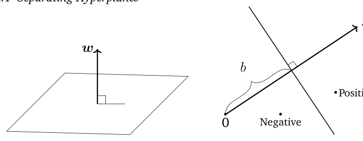
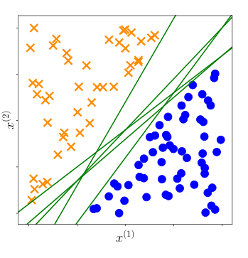
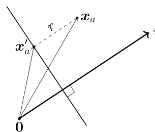
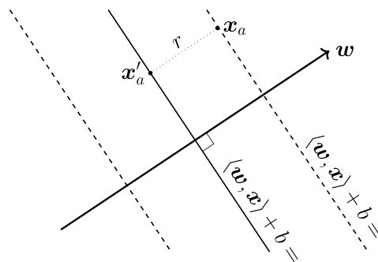
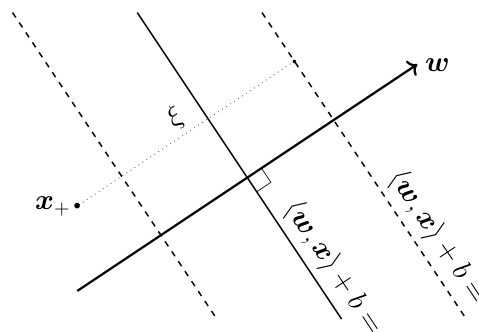
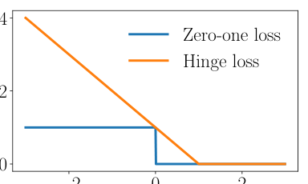
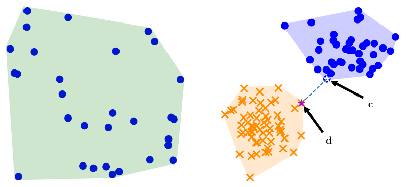
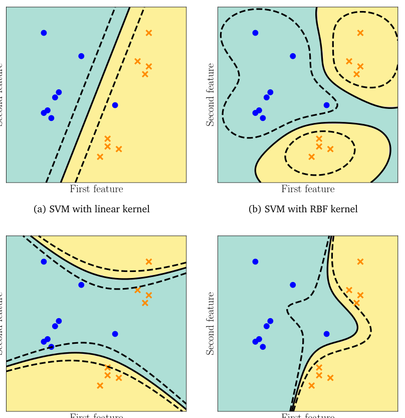

# 第 12 章 用支持向量机进行分类（Classification with Support Vector Machines）

> [← 返回目录](README.md)

> In the following, we formalize the idea of finding a linear separator of the two classes. We introduce the idea of the margin and then extend linear separators to allow for examples to fall on the “wrong” side, incurring a classification error. We present two equivalent ways of formalizing the SVM: the geometric view (Section 12.2.4) and the loss function view (Section 12.2.5). We derive the dual version of the SVM using Lagrange multipliers (Section 7.2). The dual SVM allows us to observe a third way of formalizing the SVM: in terms of the convex hulls of the examples of each class (Section 12.3.2). We conclude by briefly describing kernels and how to numerically solve the nonlinear kernel-SVM optimization problem.

接下来，我们将“寻找两类的线性分离器”这一思想形式化。我们引入间隔（margin）的概念，然后对线性分离器加以扩展，允许样本落到“错误”的一侧，从而产生分类错误。我们给出两种等价的方式来形式化支持向量机（SVM）：几何视角（12.2.4 节）与损失函数视角（12.2.5 节）。我们利用拉格朗日乘子（Lagrange multiplier）推导 SVM 的对偶版本（7.2 节）。对偶 SVM 使我们得以看到形式化 SVM 的第三种方式：借助每一类样本的凸包（convex hull）来表述（12.3.2 节）。最后，我们简要介绍核（kernel），以及如何数值求解非线性核 SVM 优化问题。

## 12.1 分离超平面（Separating Hyperplanes）

> Given two examples represented as vectors $\boldsymbol{x}_i$ and $\boldsymbol{x}_j$, one way to compute the similarity between them is using an inner product $\langle \boldsymbol{x}_i, \boldsymbol{x}_j \rangle$. Recall from Section 3.2 that inner products are closely related to the angle between two vectors. The value of the inner product between two vectors depends on the length (norm) of each vector. Furthermore, inner products allow us to rigorously define geometric concepts such as orthogonality and projections.

给定两个以向量 $\boldsymbol{x}_i$ 和 $\boldsymbol{x}_j$ 表示的样本，计算它们之间相似度的一种方法是使用内积（inner product）$\langle \boldsymbol{x}_i, \boldsymbol{x}_j \rangle$。回顾 3.2 节，内积与两个向量之间的夹角密切相关。两个向量的内积值取决于每个向量的长度（范数）。此外，借助内积我们可以严格定义正交（orthogonality）和投影（projection）等几何概念。

> The main idea behind many classification algorithms is to represent data in $\mathbb{R}^D$ and then partition this space, ideally in a way that examples with the same label (and no other examples) are in the same partition. In the case of binary classification, the space would be divided into two parts corresponding to the positive and negative classes, respectively. We consider a particularly convenient partition, which is to (linearly) split the space into two halves using a hyperplane. Let example $\boldsymbol{x} \in \mathbb{R}^D$ be an element of the data space. Consider a function

许多分类算法的主要思想都是先把数据表示在 $\mathbb{R}^D$ 中，再对这个空间进行划分，理想情况下，划分方式应使具有相同标签（label）的样本（且没有其他样本）位于同一个分区中。在二分类（binary classification）的情形下，空间被划分为两部分，分别对应正类与负类。我们考虑一种特别方便的划分方式：用超平面（hyperplane）把空间（线性地）分成两半。设样本 $\boldsymbol{x} \in \mathbb{R}^D$ 为数据空间中的一个元素。考虑函数

$$
\begin{aligned}
f : \mathbb{R}^D &\to \mathbb{R} \tag{12.2a}\\
\boldsymbol{x} &\mapsto f(\boldsymbol{x}) := \langle \boldsymbol{w}, \boldsymbol{x} \rangle + b \,, \tag{12.2b}
\end{aligned}
$$

> parametrized by $w \in \mathbb{R}^D$ and $b \in \mathbb{R}$. Recall from Section 2.8 that hyperplanes are affine subspaces. Therefore, we define the hyperplane that separates the two classes in our binary classification problem as

该函数由 $w \in \mathbb{R}^D$ 和 $b \in \mathbb{R}$ 参数化。回顾 2.8 节，超平面是仿射子空间（affine subspace）。因此，我们将二分类问题中分离两类的超平面定义为

$$
\{ \boldsymbol{x} \in \mathbb{R}^D : f(\boldsymbol{x}) = 0 \} \tag{12.3}
$$

> An illustration of the hyperplane is shown in Figure 12.2, where the vector $w$ is a vector normal to the hyperplane and $b$ the intercept. We can derive that $w$ is a normal vector to the hyperplane in (12.3) by choosing any two examples $\boldsymbol{x}_a$ and $\boldsymbol{x}_b$ on the hyperplane and showing that the vector between them is orthogonal to $w$. In the form of an equation,

图 12.2 给出了该超平面的示意图，其中向量 $w$ 是超平面的一个法向量，$b$ 为截距。我们可以在超平面上任取两个样本 $\boldsymbol{x}_a$ 与 $\boldsymbol{x}_b$，并证明二者之间的向量与 $w$ 正交，由此推导出 $w$ 是 (12.3) 中超平面的一个法向量。用方程的形式表示，有

$$
\begin{aligned}
f(\boldsymbol{x}_a) - f(\boldsymbol{x}_b) &= \langle \boldsymbol{w}, \boldsymbol{x}_a \rangle + b - (\langle \boldsymbol{w}, \boldsymbol{x}_b \rangle + b) \tag{12.4a}\\
&= \langle \boldsymbol{w}, \boldsymbol{x}_a - \boldsymbol{x}_b \rangle \,, \tag{12.4b}
\end{aligned}
$$

> **Figure 12.2** Equation of a separating hyperplane (12.3). (a) The standard way of representing the equation in 3D. (b) For ease of drawing, we look at the hyperplane edge on.

**图 12.2** 分离超平面的方程 (12.3)。(a) 在三维空间中表示该方程的标准方式；(b) 为了便于绘图，我们从侧面（edge on）观察该超平面。

> where the second line is obtained by the linearity of the inner product (Section 3.2). Since we have chosen $\boldsymbol{x}_a$ and $\boldsymbol{x}_b$ to be on the hyperplane, this implies that $f(\boldsymbol{x}_a) = 0$ and $f(\boldsymbol{x}_b) = 0$ and hence $\langle \boldsymbol{w}, \boldsymbol{x}_a - \boldsymbol{x}_b \rangle = 0$. Recall that two vectors are orthogonal when their inner product is zero. Therefore, we obtain that $w$ is orthogonal to any vector on the hyperplane.

其中第二行由内积的线性性（3.2 节）得到。由于我们选取的 $\boldsymbol{x}_a$ 与 $\boldsymbol{x}_b$ 都在超平面上，这意味着 $f(\boldsymbol{x}_a) = 0$ 且 $f(\boldsymbol{x}_b) = 0$，于是 $\langle \boldsymbol{w}, \boldsymbol{x}_a - \boldsymbol{x}_b \rangle = 0$。回顾一下，当两个向量的内积为零时，它们相互正交。因此我们得出：$w$ 与超平面上的任意向量都正交。

> Remark. Recall from Chapter 2 that we can think of vectors in different ways. In this chapter, we think of the parameter vector $w$ as an arrow indicating a direction, i.e., we consider $w$ to be a geometric vector. In contrast, we think of the example vector $x$ as a data point (as indicated by its coordinates), i.e., we consider $x$ to be the coordinates of a vector with respect to the standard basis. ♢

**评注.** 回顾第 2 章，我们可以从不同角度理解向量。在本章中，我们把参数向量 $w$ 看作指示方向的箭头，即把 $w$ 视为几何向量（geometric vector）。相反，我们把样本向量 $x$ 看作一个数据点（由其坐标标识），即把 $x$ 视为某个向量相对于标准基（standard basis）的坐标。♢

> When presented with a test example, we classify the example as positive or negative depending on the side of the hyperplane on which it occurs. Note that (12.3) not only defines a hyperplane; it additionally defines a direction. In other words, it defines the positive and negative side of the hyperplane. Therefore, to classify a test example $x_{\text{test}}$, we calculate the value of the function $f(x_{\text{test}})$ and classify the example as $+1$ if $f(x_{\text{test}}) \geqslant 0$ and $-1$ otherwise. Thinking geometrically, the positive examples lie “above” the hyperplane and the negative examples “below” the hyperplane.

当给定一个测试样本时，我们根据它位于超平面的哪一侧，将其判为正或负。注意，(12.3) 不仅定义了一个超平面，还额外定义了一个方向；换言之，它定义了超平面的正侧与负侧。因此，要对测试样本 $x_{\text{test}}$ 进行分类，我们计算函数值 $f(x_{\text{test}})$：若 $f(x_{\text{test}}) \geqslant 0$，则将该样本判为 $+1$，否则判为 $-1$。从几何上看，正样本位于超平面“上方”，负样本位于超平面“下方”。

> When training the classifier, we want to ensure that the examples with positive labels are on the positive side of the hyperplane, i.e.,

在训练分类器（classifier）时，我们希望确保带有正标签的样本位于超平面的正侧，即

$$
\langle \boldsymbol{w}, \boldsymbol{x}_n \rangle + b \geqslant 0 \quad \text{when} \quad y_n = +1 \tag{12.5}
$$

> and the examples with negative labels are on the negative side, i.e.,

并且带有负标签的样本位于超平面的负侧，即

$$
\langle \boldsymbol{w}, \boldsymbol{x}_n \rangle + b < 0 \quad \text{when} \quad y_n = -1 \,. \tag{12.6}
$$

> Refer to Figure 12.2 for a geometric intuition of positive and negative examples. These two conditions are often presented in a single equation

关于正、负样本的几何直观，可参见图 12.2。这两个条件通常被合并写成单个方程

$$
y_n (\langle \boldsymbol{w}, \boldsymbol{x}_n \rangle + b) \geqslant 0 \,. \tag{12.7}
$$

> Equation (12.7) is equivalent to (12.5) and (12.6) when we multiply both sides of (12.5) and (12.6) with $y_n = 1$ and $y_n = -1$, respectively.

当我们分别用 $y_n = 1$ 与 $y_n = -1$ 去乘 (12.5) 和 (12.6) 的两边时，方程 (12.7) 便与 (12.5) 和 (12.6) 等价。

> **Figure 12.3** Possible separating hyperplanes. There are many linear classifiers (green lines) that separate orange crosses from blue discs.

**图 12.3** 可能的分离超平面。存在许多能把橙色叉号与蓝色圆盘分开的线性分类器（绿线）。

## 12.2 原始支持向量机（Primal Support Vector Machine）

> Based on the concept of distances from points to a hyperplane, we now are in a position to discuss the support vector machine. For a dataset $\{(x_1, y_1), \ldots, (x_N, y_N)\}$ that is linearly separable, we have infinitely many candidate hyperplanes (refer to Figure 12.3), and therefore classifiers, that solve our classification problem without any (training) errors. To find a unique solution, one idea is to choose the separating hyperplane that maximizes the margin between the positive and negative examples. In other words, we want the positive and negative examples to be separated by a large margin (Section 12.2.1). In the following, we compute the distance between an example and a hyperplane to derive the margin. Recall that the closest point on the hyperplane to a given point (example $x_n$) is obtained by the orthogonal projection (Section 3.8).

基于点到超平面距离的概念，我们现在可以讨论支持向量机（SVM）了。对于一个线性可分的数据集 $\{(x_1, y_1), \ldots, (x_N, y_N)\}$，存在无穷多个候选超平面（参见图 12.3），因而也存在无穷多个分类器，它们都能无任何（训练）错误地解决我们的分类问题。为了得到唯一解，一种想法是选择使正负样本之间间隔最大的分离超平面。换句话说，我们希望正负样本被一个较大的间隔分开（12.2.1 节）。下面我们计算样本到超平面的距离，以此推导间隔。回顾一下，超平面上距给定点（样本 $x_n$）最近的点可由正交投影（3.8 节）得到。

### 12.2.1 间隔的概念（Concept of the Margin）

> The concept of the margin is intuitively simple: It is the distance of the separating hyperplane to the closest examples in the dataset, assuming that the dataset is linearly separable. However, when trying to formalize this distance, there is a technical wrinkle that may be confusing. The technical wrinkle is that we need to define a scale at which to measure the distance. A potential scale is to consider the scale of the data, i.e., the raw values of $x_n$. There are problems with this, as we could change the units of measurement of $x_n$ and change the values in $x_n$, and, hence, change the distance to the hyperplane. As we will see shortly, we define the scale based on the equation of the hyperplane (12.3) itself.

间隔的概念在直观上很简单：它就是分离超平面到数据集中最近样本的距离，这里假设数据集是线性可分的。然而，在将这一距离形式化时，存在一个可能令人困惑的技术性细节。这个技术性细节在于，我们需要定义一个度量距离所用的尺度。一种潜在的尺度是考虑数据本身的尺度，即 $x_n$ 的原始取值。这存在问题：我们可以改变 $x_n$ 的度量单位，从而改变 $x_n$ 的取值，进而改变到超平面的距离。正如我们很快将看到的，我们基于超平面方程 (12.3) 本身来定义这一尺度。

> Consider a hyperplane $\langle w, x\rangle + b$, and an example $x_a$ as illustrated in Figure 12.4. Without loss of generality, we can consider the example $x_a$ to be on the positive side of the hyperplane, i.e., $\langle w, x_a\rangle + b > 0$. We would like to compute the distance $r > 0$ of $x_a$ from the hyperplane. We do so by considering the orthogonal projection (Section 3.8) of $x_a$ onto the hyperplane, which we denote by $x'_a$. Since $w$ is orthogonal to the hyperplane, we know that the distance $r$ is just a scaling of this vector $w$. If the length of $w$ is known, then we can use this scaling factor $r$ factor to work out the absolute distance between $x_a$ and $x'_a$. For convenience, we choose to use a vector of unit length (its norm is 1) and obtain this by dividing $w$ by its norm, $\frac{w}{\|w\|}$. Using vector addition (Section 2.4), we obtain

考虑一个超平面 $\langle w, x\rangle + b$，以及如图 12.4 所示的一个样本 $x_a$。不失一般性，可以认为样本 $x_a$ 位于超平面的正侧，即 $\langle w, x_a\rangle + b > 0$。我们想计算 $x_a$ 到超平面的距离 $r > 0$。为此，我们考虑 $x_a$ 在超平面上的正交投影（3.8 节），记作 $x'_a$。由于 $w$ 与超平面正交，我们知道距离 $r$ 不过是这个向量 $w$ 的一个缩放。如果已知 $w$ 的长度，那么我们就可以利用这一缩放因子 $r$ 来计算 $x_a$ 与 $x'_a$ 之间的绝对距离。为方便起见，我们选用单位长度的向量（其范数为 1），也就是把 $w$ 除以它的范数得到 $\frac{w}{\|w\|}$。利用向量加法（2.4 节），我们得到

> **Figure 12.4** Vector addition to express distance to hyperplane: $x_a = x'_a + r\,\frac{w}{\|w\|}$.

**图 12.4** 用向量加法表示到超平面的距离：$x_a = x'_a + r\,\frac{w}{\|w\|}$。

$$
x_a = x'_a + r\,\frac{w}{\|w\|} \tag{12.8}
$$

> Another way of thinking about $r$ is that it is the coordinate of $x_a$ in the subspace spanned by $w/\|w\|$. We have now expressed the distance of $x_a$ from the hyperplane as $r$, and if we choose $x_a$ to be the point closest to the hyperplane, this distance $r$ is the margin.

关于 $r$ 的另一种理解是：它是 $x_a$ 在由 $w/\|w\|$ 张成的子空间中的坐标。至此，我们已经把 $x_a$ 到超平面的距离表示为 $r$；如果选取 $x_a$ 为距超平面最近的点，那么这个距离 $r$ 就是间隔。

> Recall that we would like the positive examples to be further than $r$ from the hyperplane, and the negative examples to be further than distance $r$ (in the negative direction) from the hyperplane. Analogously to the combination of (12.5) and (12.6) into (12.7), we formulate this objective as

回顾一下，我们希望正样本到超平面的距离大于 $r$，负样本到超平面的距离（沿负方向）也大于 $r$。类似于将 (12.5) 与 (12.6) 合并为 (12.7) 的做法，我们将这一目标表述为

$$
y_n(\langle w, x_n\rangle + b) \geqslant r \tag{12.9}
$$

> In other words, we combine the requirements that examples are at least $r$ away from the hyperplane (in the positive and negative direction) into one single inequality.

换句话说，我们把“样本到超平面的距离（沿正、负两个方向）至少为 $r$”这两个要求合并成一个不等式。

> Since we are interested only in the direction, we add an assumption to our model that the parameter vector $w$ is of unit length, i.e., $\|w\| = 1$, where we use the Euclidean norm $\|w\| = \sqrt{w^\top w}$ (Section 3.1). This assumption also allows a more intuitive interpretation of the distance $r$ (12.8) since it is the scaling factor of a vector of length 1.

由于我们只关心方向，我们为模型增加一个假设：参数向量 $w$ 具有单位长度，即 $\|w\| = 1$，其中使用欧几里得范数 $\|w\| = \sqrt{w^\top w}$（3.1 节）。这一假设也使得距离 $r$ (12.8) 有了更直观的解释，因为它是长度为 1 的向量的缩放因子。

> **Remark.** A reader familiar with other presentations of the margin would notice that our definition of $\|w\| = 1$ is different from the standard presentation if the SVM was the one provided by Schölkopf and Smola (2002), for example. In Section 12.2.3, we will show the equivalence of both approaches. ♢

**评注.** 对于熟悉间隔的其他表述方式的读者来说，会注意到我们对 $\|w\| = 1$ 的定义与标准表述有所不同——例如，如果所了解的 SVM 是 Schölkopf 和 Smola (2002) 给出的那种表述，便会注意到这一点。在 12.2.3 节中，我们将证明这两种方法是等价的。♢

> Collecting the three requirements into a single constrained optimization problem, we obtain the objective

将这三个要求整合成一个约束优化问题，我们得到如下目标：

> **Figure 12.5** Derivation of the margin: $r = \frac{1}{\|w\|}$.

**图 12.5** 间隔的推导：$r = \frac{1}{\|w\|}$。

$$
\max_{w,b,r}\ \underbrace{r}_{\text{margin}} \quad \text{subject to} \quad \underbrace{y_n(\langle w, x_n\rangle + b) \geqslant r}_{\text{data fitting}}\,, \quad r > 0\,, \quad \underbrace{\|w\| = 1}_{\text{normalization}} \tag{12.10}
$$

> which says that we want to maximize the margin $r$ while ensuring that the data lies on the correct side of the hyperplane.

也就是说，我们希望在确保数据位于超平面正确一侧的前提下，使间隔 $r$ 最大化。

> **Remark.** The concept of the margin turns out to be highly pervasive in machine learning. It was used by Vladimir Vapnik and Alexey Chervonenkis to show that when the margin is large, the “complexity” of the function class is low, and hence learning is possible (Vapnik, 2000). It turns out that the concept is useful for various different approaches for theoretically analyzing generalization error (Steinwart and Christmann, 2008; Shalev-Shwartz and Ben-David, 2014). ♢

**评注.** 间隔这一概念在机器学习中无处不在。Vladimir Vapnik 和 Alexey Chervonenkis 曾利用它证明：当间隔较大时，函数类的“复杂度”较低，因而学习是可能的 (Vapnik, 2000)。事实证明，这一概念对从理论上分析泛化误差的多种不同方法都很有用 (Steinwart and Christmann, 2008; Shalev-Shwartz and Ben-David, 2014)。♢

### 12.2.2 间隔的传统推导（Traditional Derivation of the Margin）

> In the previous section, we derived (12.10) by making the observation that we are only interested in the direction of $w$ and not its length, leading to the assumption that $\|w\| = 1$. In this section, we derive the margin maximization problem by making a different assumption. Instead of choosing that the parameter vector is normalized, we choose a scale for the data. We choose this scale such that the value of the predictor $\langle w, x\rangle + b$ is 1 at the closest example. Let us also denote the example in the dataset that is closest to the hyperplane by $x_a$.

在上一节中，我们通过考察“我们只关心 $w$ 的方向而非其长度”这一点推导出了 (12.10)，并由此得到 $\|w\| = 1$ 的假设。本节中，我们用另一个不同的假设来推导间隔最大化问题。我们不再把参数向量归一化，而是为数据选取一个尺度。我们这样选取尺度，使得预测器 $\langle w, x\rangle + b$ 在最近样本处的取值为 1。同时，我们把数据集中距超平面最近的样本记为 $x_a$。

> Figure 12.5 is identical to Figure 12.4, except that now we rescaled the axes, such that the example $x_a$ lies exactly on the margin, i.e., $\langle w, x_a\rangle + b = 1$. Since $x'_a$ is the orthogonal projection of $x_a$ onto the hyperplane, it must by definition lie on the hyperplane, i.e.,

图 12.5 与图 12.4 完全相同，只是现在我们重新调整了坐标轴的尺度，使得样本 $x_a$ 恰好位于间隔上，即 $\langle w, x_a\rangle + b = 1$。由于 $x'_a$ 是 $x_a$ 在超平面上的正交投影，根据定义它必位于超平面上，即

$$
\langle w, x'_a\rangle + b = 0 \tag{12.11}
$$

> By substituting (12.8) into (12.11), we obtain

将 (12.8) 代入 (12.11)，我们得到

$$
\Big\langle w,\ x_a - r\,\frac{w}{\|w\|}\Big\rangle + b = 0 \tag{12.12}
$$

> Exploiting the bilinearity of the inner product (see Section 3.2), we get

利用内积的双线性（见 3.2 节），我们得到

$$
\langle w, x_a\rangle + b - r\,\frac{\langle w, w\rangle}{\|w\|} = 0 \tag{12.13}
$$

> Observe that the first term is 1 by our assumption of scale, i.e., $\langle w, x_a\rangle + b = 1$. From (3.16) in Section 3.1, we know that $\langle w, w\rangle = \|w\|^2$. Hence, the second term reduces to $r\|w\|$. Using these simplifications, we obtain

注意到，由我们对尺度的假设可知第一项为 1，即 $\langle w, x_a\rangle + b = 1$。由 3.1 节的 (3.16) 可知 $\langle w, w\rangle = \|w\|^2$，因此第二项化简为 $r\|w\|$。利用这些化简，我们得到

$$
r = \frac{1}{\|w\|} \tag{12.14}
$$

> This means we derived the distance $r$ in terms of the normal vector $w$ of the hyperplane. At first glance, this equation is counterintuitive as we seem to have derived the distance from the hyperplane in terms of the length of the vector $w$, but we do not yet know this vector. One way to think about it is to consider the distance $r$ to be a temporary variable that we only use for this derivation. Therefore, for the rest of this section we will denote the distance to the hyperplane by $\frac{1}{\|w\|}$. In Section 12.2.3, we will see that the choice that the margin equals 1 is equivalent to our previous assumption of $\|w\| = 1$ in Section 12.2.1.

这意味着我们用超平面的法向量 $w$ 表示出了距离 $r$。乍一看，这个公式有违直觉：我们似乎是借助向量 $w$ 的长度推导出了到超平面的距离，但我们尚不知道这个向量。一种理解方式是把距离 $r$ 看作仅在此推导中使用的临时变量。因此，在本节余下的部分，我们把到超平面的距离记为 $\frac{1}{\|w\|}$。在 12.2.3 节中，我们将看到“间隔等于 1”这一选取等价于 12.2.1 节中 $\|w\| = 1$ 的假设。

> Similar to the argument to obtain (12.9), we want the positive and negative examples to be at least 1 away from the hyperplane, which yields the condition

与得到 (12.9) 的论证类似，我们希望正、负样本到超平面的距离至少为 1，这就给出条件

$$
y_n(\langle w, x_n\rangle + b) \geqslant 1 \tag{12.15}
$$

> Combining the margin maximization with the fact that examples need to be on the correct side of the hyperplane (based on their labels) gives us

将间隔最大化与“样本需要（根据其标签）位于超平面正确一侧”这一事实相结合，我们得到

$$
\max_{w,b}\ \frac{1}{\|w\|} \tag{12.16}
$$

$$
\text{subject to}\ \ y_n(\langle w, x_n\rangle + b) \geqslant 1 \quad \text{for all}\ \ n = 1, \ldots, N. \tag{12.17}
$$

> Instead of maximizing the reciprocal of the norm as in (12.16), we often minimize the squared norm. We also often include a constant $\frac{1}{2}$ that does not affect the optimal $w, b$ but yields a tidier form when we compute the gradient. Then, our objective becomes

我们通常不按 (12.16) 那样最大化范数的倒数，而是最小化范数的平方。我们还常常加入一个常数 $\frac{1}{2}$，它不影响最优的 $w, b$，但能使我们计算梯度时的形式更整洁。于是，我们的目标变为

$$
\min_{w,b}\ \frac{1}{2}\|w\|^2 \tag{12.18}
$$

$$
\text{subject to}\ \ y_n(\langle w, x_n\rangle + b) \geqslant 1 \quad \text{for all}\ \ n = 1, \ldots, N. \tag{12.19}
$$

> Equation (12.18) is known as the hard margin SVM. The reason for the expression “hard” is because the formulation does not allow for any violations of the margin condition. We will see in Section 12.2.4 that this “hard” condition can be relaxed to accommodate violations if the data is not linearly separable.

式 (12.18) 被称为硬间隔 SVM（hard margin SVM）。“硬”一词的由来在于：该表述不允许出现任何对间隔条件的违反。我们将在 12.2.4 节中看到，当数据不是线性可分时，这一“硬”条件可以放宽以允许这种违反。

### 12.2.3 为什么我们可以把间隔设为 1（Why We Can Set the Margin to 1）

> In Section 12.2.1, we argued that we would like to maximize some value $r$, which represents the distance of the closest example to the hyperplane. In Section 12.2.2, we scaled the data such that the closest example is of distance 1 to the hyperplane. In this section, we relate the two derivations, and show that they are equivalent.

在 12.2.1 节中，我们论证了希望最大化某个值 $r$，它表示最近样本到超平面的距离。在 12.2.2 节中，我们对数据进行了缩放，使得最近样本到超平面的距离为 1。本节将把这两种推导联系起来，并证明它们是等价的。

> **Theorem 12.1.** Maximizing the margin $r$, where we consider normalized weights as in (12.10),

**定理 12.1.** 最大化间隔 $r$（其中我们如同 (12.10) 中那样考虑归一化的权重），

$$
\max_{w,b,r}\ \underbrace{r}_{\text{margin}} \quad \text{subject to} \quad \underbrace{y_n(\langle w, x_n\rangle + b) \geqslant r}_{\text{data fitting}}\,, \quad r > 0\,, \quad \underbrace{\|w\| = 1}_{\text{normalization}} \tag{12.20}
$$

> is equivalent to scaling the data, such that the margin is unity:

等价于对数据进行缩放，使得间隔为 1：

$$
\min_{w,b}\ \underbrace{\frac{1}{2}\|w\|^2}_{\text{margin}} \quad \text{subject to} \quad \underbrace{y_n(\langle w, x_n\rangle + b) \geqslant 1}_{\text{data fitting}}\,. \tag{12.21}
$$

> Proof

**证明.**

> Consider (12.20). Since the square is a strictly monotonic transformation for non-negative arguments, the maximum stays the same if we consider $r^2$ in the objective. Since $\|w\| = 1$ we can reparametrize the equation with a new weight vector $w'$ that is not normalized by explicitly using $\frac{w'}{\|w'\|}$. We obtain

考虑 (12.20)。由于平方对非负参数是严格单调变换，如果在目标中改用 $r^2$，最大值保持不变。由于 $\|w\| = 1$，我们可以用一个未归一化的新权重向量 $w'$ 对该方程重新参数化，即显式地使用 $\frac{w'}{\|w'\|}$。我们得到

$$
\max_{w',b,r}\ r^2 \quad \text{subject to} \quad y_n\Big(\Big\langle \frac{w'}{\|w'\|},\ x_n\Big\rangle + b\Big) \geqslant r\,, \quad r > 0\,. \tag{12.22}
$$

> Equation (12.22) explicitly states that the distance $r$ is positive. Therefore, we can divide the first constraint by $r$, which yields

式 (12.22) 明确指出距离 $r$ 是正的。因此，我们可以把第一个约束除以 $r$，得到

$$
\max_{w',b,r}\ r^2 \quad \text{subject to} \quad y_n\Big(\Big\langle \underbrace{\frac{w'}{\|w'\|\, r}}_{w''},\ x_n\Big\rangle + \underbrace{\frac{b}{r}}_{b''}\Big) \geqslant 1\,, \quad r > 0 \tag{12.23}
$$

> **Figure 12.6** (a) Linearly separable and (b) non-linearly separable data. (a) Linearly separable data, with a large margin (b) Non-linearly separable data

**图 12.6** (a) 线性可分与 (b) 非线性可分的数据。(a) 线性可分数据，间隔较大 (b) 非线性可分数据

> renaming the parameters to $w''$ and $b''$. Since $w'' = \frac{w'}{\|w'\|\, r}$, rearranging for $r$ gives

即将参数重命名为 $w''$ 和 $b''$。由于 $w'' = \frac{w'}{\|w'\|\, r}$，对 $r$ 进行整理可得

$$
\|w''\| = \left\|\frac{w'}{\|w'\|\, r}\right\| = \frac{1}{r}\cdot\left\|\frac{w'}{\|w'\|}\right\| = \frac{1}{r}\,. \tag{12.24}
$$

> By substituting this result into (12.23), we obtain

将这一结果代入 (12.23)，我们得到

$$
\max_{w'',b''}\ \frac{1}{\|w''\|^2} \quad \text{subject to} \quad y_n(\langle w'', x_n\rangle + b'') \geqslant 1. \tag{12.25}
$$

> The final step is to observe that maximizing $\frac{1}{\|w''\|^2}$ yields the same solution as minimizing $\frac{1}{2}\|w''\|^2$, which concludes the proof of Theorem 12.1.

最后一步是注意到：最大化 $\frac{1}{\|w''\|^2}$ 与最小化 $\frac{1}{2}\|w''\|^2$ 给出相同的解，这就完成了定理 12.1 的证明。

### 12.2.4 软间隔 SVM：几何视角（Soft Margin SVM: Geometric View）

> In the case where data is not linearly separable, we may wish to allow some examples to fall within the margin region, or even to be on the wrong side of the hyperplane as illustrated in Figure 12.6.

当数据不是线性可分时，我们可能希望允许某些样本落入间隔区域内，甚至落在超平面错误的一侧，如图 12.6 所示。

> The model that allows for some classification errors is called the **soft margin SVM**. In this section, we derive the resulting optimization problem using geometric arguments. In Section 12.2.5, we will derive an equivalent optimization problem using the idea of a loss function. Using Lagrange multipliers (Section 7.2), we will derive the dual optimization problem of the SVM in Section 12.3. This dual optimization problem allows us to observe a third interpretation of the SVM: as a hyperplane that bisects the line between convex hulls corresponding to the positive and negative data examples (Section 12.3.2).

允许出现一些分类错误的模型称为**软间隔 SVM（soft margin SVM）**。本节中，我们将用几何论证推导由此得到的优化问题。在 12.2.5 节中，我们将利用损失函数的思想推导一个等价的优化问题。利用拉格朗日乘子（7.2 节），我们将在 12.3 节推导 SVM 的对偶优化问题。这一对偶优化问题使我们能够从第三个角度理解 SVM：它是平分对应于正、负数据样本的两个凸包之间连线的超平面（12.3.2 节）。

> The key geometric idea is to introduce a **slack variable** $\xi_n$ corresponding to each example–label pair $(\boldsymbol{x}_n, y_n)$ that allows a particular example to be within the margin or even on the wrong side of the hyperplane (refer to Figure 12.7). We subtract the value of $\xi_n$ from the margin, constraining $\xi_n$ to be non-negative. To encourage correct classification of the samples, we add $\xi_n$ to the objective

关键的几何思想是引入一个**松弛变量（slack variable）** $\xi_n$，使之对应于每个样本–标签对 $(\boldsymbol{x}_n, y_n)$，从而允许某个样本落在间隔之内，甚至落在超平面错误的一侧（参见图 12.7）。我们从间隔中减去 $\xi_n$ 的值，并约束 $\xi_n$ 非负。为了促使样本被正确分类，我们将 $\xi_n$ 加入目标函数

> **Figure 12.7** Soft margin SVM allows examples to be within the margin or on the wrong side of the hyperplane. The slack variable $\xi$ measures the distance of a positive example $\boldsymbol{x}_+$ to the positive margin hyperplane $\langle \boldsymbol{w}, \boldsymbol{x}\rangle + b = 1$ when $\boldsymbol{x}_+$ is on the wrong side.

**图 12.7** 软间隔 SVM 允许样本落在间隔内或超平面错误的一侧。当 $\boldsymbol{x}_+$ 位于错误一侧时，松弛变量 $\xi$ 度量正样本 $\boldsymbol{x}_+$ 到正间隔超平面 $\langle \boldsymbol{w}, \boldsymbol{x}\rangle + b = 1$ 的距离。

$$
\min_{\boldsymbol{w}, b, \boldsymbol{\xi}}\ \frac{1}{2}\|\boldsymbol{w}\|^2 + C\sum_{n=1}^{N}\xi_n \tag{12.26a}
$$

$$
\text{subject to}\ \ y_n(\langle \boldsymbol{w}, \boldsymbol{x}_n\rangle + b) \geqslant 1 - \xi_n \tag{12.26b}
$$

$$
\xi_n \geqslant 0 \tag{12.26c}
$$

> for $n = 1, \ldots, N$. In contrast to the optimization problem (12.18) for the hard margin SVM, this one is called the **soft margin SVM**. The parameter $C > 0$ trades off the size of the margin and the total amount of slack that we have. This parameter is called the **regularization parameter** since, as we will see in the following section, the margin term in the objective function (12.26a) is a regularization term. The margin term $\|\boldsymbol{w}\|^2$ is called the **regularizer**, and in many books on numerical optimization, the regularization parameter is multiplied with this term (Section 8.2.3). This is in contrast to our formulation in this section. Here a large value of $C$ implies low regularization, as we give the slack variables larger weight, hence giving more priority to examples that do not lie on the correct side of the margin. There are alternative parametrizations of this regularization, which is why (12.26a) is also often referred to as the C-SVM.

其中 $n = 1, \ldots, N$。与硬间隔 SVM 的优化问题 (12.18) 不同，这一问题称为**软间隔 SVM**。参数 $C > 0$ 在间隔的大小与我们允许的松弛总量之间进行权衡。这一参数称为**正则化参数（regularization parameter）**，因为正如我们将在下一节看到的，目标函数 (12.26a) 中的间隔项是一个正则化项。间隔项 $\|\boldsymbol{w}\|^2$ 称为**正则化项（regularizer）**，在许多数值优化教科书中，正则化参数与这一项相乘（8.2.3 节）。这与本节的表述不同：这里 $C$ 取较大值意味着正则化较弱，因为我们给松弛变量赋予了更大的权重，从而更优先考虑那些未落在间隔正确一侧的样本。这种正则化还有其他的参数化方式，因此 (12.26a) 也常被称为 C-SVM。

> **Remark.** In the formulation of the soft margin SVM (12.26a) $\boldsymbol{w}$ is regularized, but $b$ is not regularized. We can see this by observing that the regularization term does not contain $b$. The unregularized term $b$ complicates theoretical analysis (Steinwart and Christmann, 2008, chapter 1) and decreases computational efficiency (Fan et al., 2008). ♢

**评注.** 在软间隔 SVM (12.26a) 的表述中，得到正则化的是 $\boldsymbol{w}$，而 $b$ 没有被正则化。注意到正则化项中不包含 $b$，即可看出这一点。未被正则化的项 $b$ 使理论分析变得复杂（Steinwart and Christmann, 2008, chapter 1），并降低计算效率（Fan et al., 2008）。♢

### 12.2.5 软间隔 SVM：损失函数视角（Soft Margin SVM: Loss Function View）

> Let us consider a different approach for deriving the SVM, following the principle of empirical risk minimization (Section 8.2). For the SVM, we choose hyperplanes as the hypothesis class, that is

让我们遵循经验风险最小化（8.2 节）的原则，考虑推导 SVM 的另一种方法。对于 SVM，我们选取超平面作为假设类，即

$$
f(\boldsymbol{x}) = \langle \boldsymbol{w}, \boldsymbol{x}\rangle + b \,. \tag{12.27}
$$

> We will see in this section that the margin corresponds to the regularization term. The remaining question is, what is the **loss function**? In contrast to Chapter 9, where we consider regression problems (the output of the predictor is a real number), in this chapter, we consider binary classification problems (the output of the predictor is one of two labels $\{+1, -1\}$). Therefore, the error/loss function for each single example–label pair needs to be appropriate for binary classification. For example, the squared loss that is used for regression (9.10b) is not suitable for binary classification.

我们将在本节看到，间隔对应于正则化项。剩下的问题是：**损失函数（loss function）**是什么？第 9 章考虑的是回归问题（预测器的输出是一个实数），与之不同，本章考虑的是二分类问题（预测器的输出是 $\{+1, -1\}$ 两个标签之一）。因此，每个样本–标签对的误差/损失函数需要适合二分类。例如，回归中使用的平方损失 (9.10b) 就不适合二分类。

> **Remark.** The ideal loss function between binary labels is to count the number of mismatches between the prediction and the label. This means that for a predictor $f$ applied to an example $\boldsymbol{x}_n$, we compare the output $f(\boldsymbol{x}_n)$ with the label $y_n$. We define the loss to be zero if they match, and one if they do not match. This is denoted by $1(f(\boldsymbol{x}_n) \neq y_n)$ and is called the **zero-one loss**. Unfortunately, the zero-one loss results in a combinatorial optimization problem for finding the best parameters $\boldsymbol{w}$, $b$. Combinatorial optimization problems (in contrast to continuous optimization problems discussed in Chapter 7) are in general more challenging to solve. ♢

**评注.** 二分类标签之间理想的损失函数是统计预测与标签不匹配的次数。也就是说，对于应用到样本 $\boldsymbol{x}_n$ 上的预测器 $f$，我们将输出 $f(\boldsymbol{x}_n)$ 与标签 $y_n$ 进行比较：若两者匹配，则损失为零；若不匹配，则损失为 1。这记作 $1(f(\boldsymbol{x}_n) \neq y_n)$，称为**零一损失（zero-one loss）**。遗憾的是，零一损失会导致寻找最优参数 $\boldsymbol{w}$、$b$ 的组合优化问题。组合优化问题（与第 7 章讨论的连续优化问题相反）通常更难求解。♢

> What is the loss function corresponding to the SVM? Consider the error between the output of a predictor $f(\boldsymbol{x}_n)$ and the label $y_n$. The loss describes the error that is made on the training data. An equivalent way to derive (12.26a) is to use the **hinge loss**

与 SVM 相对应的损失函数是什么？考虑预测器输出 $f(\boldsymbol{x}_n)$ 与标签 $y_n$ 之间的误差。损失描述的是在训练数据上产生的误差。推导 (12.26a) 的一个等价方式是使用**合页损失（hinge loss）**

$$
\ell(t) = \max\{0, 1-t\}, \qquad\text{where}\quad t = y\,f(\boldsymbol{x}) = y(\langle \boldsymbol{w}, \boldsymbol{x}\rangle + b) \,. \tag{12.28}
$$

> If $f(\boldsymbol{x})$ is on the correct side (based on the corresponding label $y$) of the hyperplane, and further than distance 1, this means that $t \geqslant 1$ and the hinge loss returns a value of zero. If $f(\boldsymbol{x})$ is on the correct side but too close to the hyperplane ($0 < t < 1$), the example $\boldsymbol{x}$ is within the margin, and the hinge loss returns a positive value. When the example is on the wrong side of the hyperplane ($t < 0$), the hinge loss returns an even larger value, which increases linearly. In other words, we pay a penalty once we are closer than the margin to the hyperplane, even if the prediction is correct, and the penalty increases linearly. An alternative way to express the hinge loss is by considering it as two linear pieces

如果 $f(\boldsymbol{x})$ 位于超平面（依据对应标签 $y$）正确的一侧，且距离超过 1，这意味着 $t \geqslant 1$，合页损失返回零。如果 $f(\boldsymbol{x})$ 在正确的一侧，但离超平面太近（$0 < t < 1$），那么样本 $\boldsymbol{x}$ 落在间隔之内，合页损失返回一个正值。当样本位于超平面错误的一侧（$t < 0$）时，合页损失返回更大的值，且线性增长。换句话说，一旦我们到超平面的距离比间隔近，即使预测正确也要付出惩罚，且该惩罚线性增长。表达合页损失的另一种方式是将它视为两段线性片段

$$
\ell(t) =
\begin{cases}
0 & \text{if}\ \ t \geqslant 1 \\
1-t & \text{if}\ \ t < 1\,,
\end{cases} \tag{12.29}
$$

> as illustrated in Figure 12.8. The loss corresponding to the hard margin SVM (12.18) is defined as

如图 12.8 所示。与硬间隔 SVM (12.18) 相对应的损失定义为

$$
\ell(t) =
\begin{cases}
0 & \text{if}\ \ t \geqslant 1 \\
\infty & \text{if}\ \ t < 1\,.
\end{cases} \tag{12.30}
$$

> **Figure 12.8** The hinge loss is a convex upper bound of zero-one loss.

**图 12.8** 合页损失是零一损失的凸上界。

> This loss can be interpreted as never allowing any examples inside the margin.

这种损失可以解释为绝不允许任何样本进入间隔之内。

> For a given training set $\{(\boldsymbol{x}_1, y_1), \ldots, (\boldsymbol{x}_N, y_N)\}$, we seek to minimize the total loss, while regularizing the objective with $\ell_2$-regularization (see Section 8.2.3). Using the hinge loss (12.28) gives us the unconstrained optimization problem

对于给定的训练集 $\{(\boldsymbol{x}_1, y_1), \ldots, (\boldsymbol{x}_N, y_N)\}$，我们力求最小化总损失，同时用 $\ell_2$ 正则化对目标函数进行正则化（见 8.2.3 节）。使用合页损失 (12.28) 便得到如下无约束优化问题

$$
\min_{\boldsymbol{w}, b}\ \underbrace{\frac{1}{2}\|\boldsymbol{w}\|^2}_{\text{regularizer}} + C\sum_{n=1}^{N}\underbrace{\max\left\{0, 1-y_n(\langle \boldsymbol{w}, \boldsymbol{x}_n\rangle + b)\right\}}_{\text{error term}} \,. \tag{12.31}
$$

> The first term in (12.31) is called the regularization term or the **regularizer** (see Section 8.2.3), and the second term is called the **loss term** or the **error term**. Recall from Section 12.2.4 that the term $\frac{1}{2}\|\boldsymbol{w}\|^2$ arises directly from the margin. In other words, margin maximization can be interpreted as **regularization**.

(12.31) 中的第一项称为正则化项（regularization term）或正则化项（regularizer）（见 8.2.3 节），第二项称为损失项（loss term）或误差项（error term）。回顾 12.2.4 节，$\frac{1}{2}\|\boldsymbol{w}\|^2$ 这一项直接来源于间隔。换言之，间隔最大化可以被解释为**正则化（regularization）**。

> In principle, the unconstrained optimization problem in (12.31) can be directly solved with (sub-)gradient descent methods as described in Section 7.1. To see that (12.31) and (12.26a) are equivalent, observe that the hinge loss (12.28) essentially consists of two linear parts, as expressed in (12.29). Consider the hinge loss for a single example-label pair (12.28). We can equivalently replace minimization of the hinge loss over $t$ with a minimization of a slack variable $\xi$ with two constraints. In equation form,

原则上，(12.31) 中的无约束优化问题可以直接用 7.1 节所述的（次）梯度下降方法求解。为了看出 (12.31) 与 (12.26a) 等价，请注意合页损失 (12.28) 本质上由两个线性部分组成，如 (12.29) 所表达的那样。考虑单个样本-标签对的合页损失 (12.28)。我们可以等价地把“对 $t$ 最小化合页损失”替换为“在两个约束下最小化松弛变量 $\xi$”。用方程形式表示，

$$
\min_{t}\ \max\{0, 1-t\} \tag{12.32}
$$

> is equivalent to

等价于

$$
\begin{aligned}
\min_{\xi, t} \quad & \xi \\
\text{subject to} \quad & \xi \geqslant 0\,, \\
& \xi \geqslant 1-t\,.
\end{aligned}
\tag{12.33}
$$

> By substituting this expression into (12.31) and rearranging one of the constraints, we obtain exactly the soft margin SVM (12.26a).

将这一表达式代入 (12.31)，并整理其中一个约束，我们恰好得到软间隔 SVM (12.26a)。

> **Remark.** Let us contrast our choice of the loss function in this section to the loss function for linear regression in Chapter 9. Recall from Section 9.2.1 that for finding maximum likelihood estimators, we usually minimize the negative log-likelihood. Furthermore, since the likelihood term for linear regression with Gaussian noise is Gaussian, the negative log-likelihood for each example is a squared error function. The squared error function is the loss function that is minimized when looking for the maximum likelihood solution. ♢

**评注.** 让我们将本节所选取的损失函数与第 9 章中线性回归的损失函数加以对比。回顾 9.2.1 节，为求最大似然估计，我们通常最小化负对数似然。此外，由于带高斯噪声的线性回归的似然项是高斯的，每个样本的负对数似然就是一个平方误差函数。这个平方误差函数正是在寻找最大似然解时所最小化的损失函数。♢

## 12.3 对偶支持向量机（Dual Support Vector Machine）

> The description of the SVM in the previous sections, in terms of the variables $\boldsymbol{w}$ and $b$, is known as the primal SVM. Recall that we consider inputs $\boldsymbol{x} \in \mathbb{R}^D$ with $D$ features. Since $\boldsymbol{w}$ is of the same dimension as $\boldsymbol{x}$, this means that the number of parameters (the dimension of $\boldsymbol{w}$) of the optimization problem grows linearly with the number of features.

前几节中以变量 $\boldsymbol{w}$ 和 $b$ 对 SVM 的描述被称为原始 SVM（primal SVM）。回顾一下，我们考虑的是具有 $D$ 个特征的输入 $\boldsymbol{x} \in \mathbb{R}^D$。由于 $\boldsymbol{w}$ 与 $\boldsymbol{x}$ 的维度相同，这意味着该优化问题的参数个数（即 $\boldsymbol{w}$ 的维度）随特征数目线性增长。

> In the following, we consider an equivalent optimization problem (the so-called dual view), which is independent of the number of features. Instead, the number of parameters increases with the number of examples in the training set. We saw a similar idea appear in Chapter 10, where we expressed the learning problem in a way that does not scale with the number of features. This is useful for problems where we have more features than the number of examples in the training dataset. The dual SVM also has the additional advantage that it easily allows kernels to be applied, as we shall see at the end of this chapter. The word “dual” appears often in mathematical literature, and in this particular case it refers to convex duality. The following subsections are essentially an application of convex duality, which we discussed in Section 7.2.

接下来，我们考虑一个等价的优化问题，即所谓的对偶视角（dual view），它不依赖于特征的数目；取而代之的是，参数的个数随训练集中样本的数目而增加。我们在第 10 章中见过类似的想法：以不随特征数目增长的方式表述学习问题。这对于特征数目多于训练数据集中样本数目的问题很有用。对偶 SVM 还有一个额外的优点：它可以轻松地应用核（kernel），我们将在本章末尾看到这一点。“对偶”（dual）一词在数学文献中很常见，在这个特定情形下它指的是凸对偶（convex duality）。下面几小节本质上是 7.2 节所讨论的凸对偶的一个应用。

### 12.3.1 基于拉格朗日乘子的凸对偶（Convex Duality via Lagrange Multipliers）

> Recall the primal soft margin SVM (12.26a). We call the variables $\boldsymbol{w}$, $b$, and $\boldsymbol{\xi}$ corresponding to the primal SVM the primal variables. We use $\alpha_n \geqslant 0$ as the Lagrange multiplier corresponding to the constraint (12.26b) that the examples are classified correctly and $\gamma_n \geqslant 0$ as the Lagrange multiplier corresponding to the non-negativity constraint of the slack variable; see (12.26c). The Lagrangian is then given by

回顾原始软间隔 SVM（12.26a）。我们把对应于原始 SVM 的变量 $\boldsymbol{w}$、$b$ 和 $\boldsymbol{\xi}$ 称为原始变量（primal variables）。我们取 $\alpha_n \geqslant 0$ 作为与“样本被正确分类”这一约束 (12.26b) 相对应的拉格朗日乘子（Lagrange multiplier），取 $\gamma_n \geqslant 0$ 作为与松弛变量的非负性约束相对应的拉格朗日乘子；参见 (12.26c)。于是，拉格朗日函数（Lagrangian）为

$$
L(\boldsymbol{w}, b, \boldsymbol{\xi}, \boldsymbol{\alpha}, \boldsymbol{\gamma}) = \frac{1}{2}\|\boldsymbol{w}\|^2 + C\sum_{n=1}^{N}\xi_n \underbrace{- \sum_{n=1}^{N}\alpha_n\left(y_n(\langle \boldsymbol{w}, \boldsymbol{x}_n\rangle + b) - 1 + \xi_n\right)}_{\text{constraint (12.26b)}} \underbrace{- \sum_{n=1}^{N}\gamma_n\xi_n}_{\text{constraint (12.26c)}} \,.
\tag{12.34}
$$

> By differentiating the Lagrangian (12.34) with respect to the three primal variables $\boldsymbol{w}$, $b$, and $\boldsymbol{\xi}$ respectively, we obtain

将拉格朗日函数 (12.34) 分别对三个原始变量 $\boldsymbol{w}$、$b$ 和 $\boldsymbol{\xi}$ 求偏导，可得

$$
\frac{\partial L}{\partial \boldsymbol{w}} = \boldsymbol{w}^{\top} - \sum_{n=1}^{N}\alpha_n y_n \boldsymbol{x}_n^{\top} \,,
\tag{12.35}
$$

$$
\frac{\partial L}{\partial b} = -\sum_{n=1}^{N}\alpha_n y_n \,,
\tag{12.36}
$$

$$
\frac{\partial L}{\partial \xi_n} = C - \alpha_n - \gamma_n \,.
\tag{12.37}
$$

> We now find the maximum of the Lagrangian by setting each of these partial derivatives to zero. By setting (12.35) to zero, we find

现在令这些偏导数分别为零，以求拉格朗日函数的最大值。令 (12.35) 为零，可得

$$
\boldsymbol{w} = \sum_{n=1}^{N}\alpha_n y_n \boldsymbol{x}_n \,,
\tag{12.38}
$$

> which is a particular instance of the representer theorem (Kimeldorf and Wahba, 1970). Equation (12.38) states that the optimal weight vector in the primal is a linear combination of the examples $\boldsymbol{x}_n$. Recall from Section 2.6.1 that this means that the solution of the optimization problem lies in the span of training data. Additionally, the constraint obtained by setting (12.36) to zero implies that the optimal weight vector is an affine combination of the examples. The representer theorem turns out to hold for very general settings of regularized empirical risk minimization (Hofmann et al., 2008; Argyriou and Dinuzzo, 2014). The theorem has more general versions (Schölkopf et al., 2001), and necessary and sufficient conditions on its existence can be found in Yu et al. (2013).

这正是表示定理（representer theorem）的一个具体实例（Kimeldorf and Wahba, 1970）。式 (12.38) 表明，原始问题中的最优权重向量是样本 $\boldsymbol{x}_n$ 的线性组合。回顾 2.6.1 节可知，这意味着优化问题的解位于训练数据的张成（span）中。此外，令 (12.36) 为零得到的约束意味着最优权重向量是样本的仿射组合（affine combination）。事实证明，表示定理对正则化经验风险最小化的非常一般的情形都成立（Hofmann et al., 2008; Argyriou and Dinuzzo, 2014）。该定理还有更一般的版本（Schölkopf et al., 2001），其存在的充分必要条件可参见 Yu et al. (2013)。

> **Remark.** The representer theorem (12.38) also provides an explanation of the name “support vector machine.” The examples $\boldsymbol{x}_n$, for which the corresponding parameters $\alpha_n = 0$, do not contribute to the solution $\boldsymbol{w}$ at all. The other examples, where $\alpha_n > 0$, are called support vectors since they “support” the hyperplane. ♢

**评注.** 表示定理 (12.38) 也解释了“支持向量机”这一名称的由来：对应参数 $\alpha_n = 0$ 的样本 $\boldsymbol{x}_n$ 完全不会对解 $\boldsymbol{w}$ 产生影响；而 $\alpha_n > 0$ 的其余样本则被称为支持向量（support vector），因为它们“支撑”着超平面。♢

> By substituting the expression for $\boldsymbol{w}$ into the Lagrangian (12.34), we obtain the dual

将 $\boldsymbol{w}$ 的表达式代入拉格朗日函数 (12.34)，得到对偶

$$
\begin{aligned}
D(\boldsymbol{\xi}, \boldsymbol{\alpha}, \boldsymbol{\gamma})
= \frac{1}{2}\sum_{i=1}^{N}\sum_{j=1}^{N} y_i y_j \alpha_i \alpha_j \langle \boldsymbol{x}_i, \boldsymbol{x}_j \rangle
&- \sum_{i=1}^{N} y_i \alpha_i \Big\langle \sum_{j=1}^{N} y_j \alpha_j \boldsymbol{x}_j, \boldsymbol{x}_i \Big\rangle + C\sum_{i=1}^{N}\xi_i \\
&- b\sum_{i=1}^{N} y_i \alpha_i + \sum_{i=1}^{N}\alpha_i - \sum_{i=1}^{N}\alpha_i \xi_i - \sum_{i=1}^{N}\gamma_i \xi_i \,.
\end{aligned}
\tag{12.39}
$$

> Note that there are no longer any terms involving the primal variable $\boldsymbol{w}$. By setting (12.36) to zero, we obtain $\sum_{n=1}^{N} y_n \alpha_n = 0$. Therefore, the term involving $b$ also vanishes. Recall that inner products are symmetric and bilinear (see Section 3.2). Therefore, the first two terms in (12.39) are over the same objects. These terms (colored blue) can be simplified, and we obtain the Lagrangian

注意，式中已不再含有与原始变量 $\boldsymbol{w}$ 有关的项。令 (12.36) 为零可得 $\sum_{n=1}^{N} y_n \alpha_n = 0$，因此含 $b$ 的项也随之消失。回顾内积是对称且双线性的（见 3.2 节），因此 (12.39) 的前两项作用在相同的对象上。这两项（标为蓝色）可以化简，于是我们得到拉格朗日函数

$$
D(\boldsymbol{\xi}, \boldsymbol{\alpha}, \boldsymbol{\gamma}) = -\frac{1}{2}\sum_{i=1}^{N}\sum_{j=1}^{N} y_i y_j \alpha_i \alpha_j \langle \boldsymbol{x}_i, \boldsymbol{x}_j \rangle + \sum_{i=1}^{N}\alpha_i + \sum_{i=1}^{N}(C - \alpha_i - \gamma_i)\xi_i \,.
\tag{12.40}
$$

> The last term in this equation is a collection of all terms that contain slack variables $\xi_i$. By setting (12.37) to zero, we see that the last term in (12.40) is also zero. Furthermore, by using the same equation and recalling that the Lagrange multipliers $\gamma_i$ are non-negative, we conclude that $\alpha_i \leqslant C$. We now obtain the dual optimization problem of the SVM, which is expressed exclusively in terms of the Lagrange multipliers $\alpha_i$. Recall from Lagrangian duality (Definition 7.1) that we maximize the dual problem. This is equivalent to minimizing the negative dual problem, such that we end up with the dual SVM

该式中的最后一项汇集了所有含松弛变量 $\xi_i$ 的项。令 (12.37) 为零，可以看到 (12.40) 的最后一项也为零。此外，利用同一个等式并注意到拉格朗日乘子 $\gamma_i$ 非负，可推出 $\alpha_i \leqslant C$。至此我们便得到 SVM 的对偶优化问题（dual optimization problem），它完全用拉格朗日乘子 $\alpha_i$ 表达。回顾拉格朗日对偶性（Lagrangian duality，定义 7.1）：我们要最大化对偶问题，这等价于最小化取负之后的对偶问题，于是最终得到对偶 SVM

$$
\begin{aligned}
\min_{\boldsymbol{\alpha}} \quad & \frac{1}{2}\sum_{i=1}^{N}\sum_{j=1}^{N} y_i y_j \alpha_i \alpha_j \langle \boldsymbol{x}_i, \boldsymbol{x}_j \rangle - \sum_{i=1}^{N}\alpha_i \\
\text{subject to} \quad & \sum_{i=1}^{N} y_i \alpha_i = 0 \\
& 0 \leqslant \alpha_i \leqslant C \quad \text{for all } i = 1, \ldots, N \,.
\end{aligned}
\tag{12.41}
$$

> The equality constraint in (12.41) is obtained from setting (12.36) to zero. The inequality constraint $\alpha_i \geqslant 0$ is the condition imposed on Lagrange multipliers of inequality constraints (Section 7.2). The inequality constraint $\alpha_i \leqslant C$ is discussed in the previous paragraph.

(12.41) 中的等式约束来自令 (12.36) 为零；不等式约束 $\alpha_i \geqslant 0$ 正是不等式约束的拉格朗日乘子所需满足的条件（7.2 节）；不等式约束 $\alpha_i \leqslant C$ 已在上一段中讨论过。

> The set of inequality constraints in the SVM are called “box constraints” because they limit the vector $\boldsymbol{\alpha} = [\alpha_1, \cdots, \alpha_N]^\top \in \mathbb{R}^N$ of Lagrange multipliers to be inside the box defined by 0 and $C$ on each axis. These axis-aligned boxes are particularly efficient to implement in numerical solvers (Dostál, 2009, chapter 5). It turns out that examples that lie exactly on the margin are examples whose dual parameters lie strictly inside the box constraints, $0 < \alpha_i < C$. This is derived using the Karush Kuhn Tucker conditions, for example in Schölkopf and Smola (2002).

SVM 中的这组不等式约束被称为盒式约束（box constraints），因为它们将拉格朗日乘子向量 $\boldsymbol{\alpha} = [\alpha_1, \cdots, \alpha_N]^\top \in \mathbb{R}^N$ 限制在每个坐标轴上由 0 与 $C$ 界定的盒子内部。这类轴对齐的盒式约束在数值求解器中实现起来特别高效（Dostál, 2009, chapter 5）。事实证明，恰好位于间隔上的样本，正是那些对偶参数严格位于盒式约束内部（$0 < \alpha_i < C$）的样本。这一点可以利用 Karush-Kuhn-Tucker（KKT）条件导出，例如参见 Schölkopf 和 Smola (2002)。

> Once we obtain the dual parameters $\boldsymbol{\alpha}$, we can recover the primal parameters $\boldsymbol{w}$ by using the representer theorem (12.38). Let us call the optimal primal parameter $\boldsymbol{w}^*$. However, there remains the question on how to obtain the parameter $b^*$. Consider an example $\boldsymbol{x}_n$ that lies exactly on the margin’s boundary, i.e., $\langle \boldsymbol{w}^*, \boldsymbol{x}_n \rangle + b = y_n$. Recall that $y_n$ is either $+1$ or $-1$. Therefore, the only unknown is $b$, which can be computed by

一旦得到对偶参数 $\boldsymbol{\alpha}$，我们就可以利用表示定理 (12.38) 恢复出原始参数 $\boldsymbol{w}$。把最优原始参数记为 $\boldsymbol{w}^*$。然而，如何获得参数 $b^*$ 仍是一个问题。考虑一个恰好位于间隔边界上的样本 $\boldsymbol{x}_n$，即 $\langle \boldsymbol{w}^*, \boldsymbol{x}_n \rangle + b = y_n$。回顾 $y_n$ 只取 $+1$ 或 $-1$，因此唯一的未知量就是 $b$，它可由下式计算：

$$
b^* = y_n - \langle \boldsymbol{w}^*, \boldsymbol{x}_n \rangle \,.
\tag{12.42}
$$

> **Remark.** In principle, there may be no examples that lie exactly on the margin. In this case, we should compute $|y_n - \langle \boldsymbol{w}^*, \boldsymbol{x}_n \rangle|$ for all support vectors and take the median value of this absolute value difference to be

**评注.** 原则上，可能并不存在恰好位于间隔上的样本。此时，我们应对所有支持向量计算 $|y_n - \langle \boldsymbol{w}^*, \boldsymbol{x}_n \rangle|$，并取这一绝对值差的中位数作为

> **Figure 12.9** Convex hulls. (a) Convex hull of points, some of which lie within the boundary; (b) convex hulls around positive and negative examples.
>
> (a) Convex hull. (b) Convex hulls around positive (blue) and negative (orange) examples. The distance between the two convex sets is the length of the difference vector $c - d$.

**图 12.9** 凸包。(a) 若干点的凸包，其中一些点位于边界内部；(b) 围绕正例与负例的凸包。

(a) 凸包。(b) 围绕正例（蓝色）与负例（橙色）的凸包。两个凸集之间的距离为差向量 $\boldsymbol{c} - \boldsymbol{d}$ 的长度。

> the value of $b^*$. A derivation of this can be found in http://fouryears.eu/2012/06/07/the-svm-bias-term-conspiracy/. ♢

$b^*$ 的值。相关推导可参见 http://fouryears.eu/2012/06/07/the-svm-bias-term-conspiracy/。♢

### 12.3.2 对偶 SVM：凸包视角（Dual SVM: Convex Hull View）

> Another approach to obtain the dual SVM is to consider an alternative geometric argument. Consider the set of examples $\boldsymbol{x}_n$ with the same label. We would like to build a convex set that contains all the examples such that it is the smallest possible set. This is called the convex hull and is illustrated in Figure 12.9.

得到对偶 SVM 的另一种方法是考虑另一种几何论证。考虑具有相同标签的样本 $\boldsymbol{x}_n$ 的集合。我们希望构建一个包含所有样本且尽可能小的凸集。这被称为凸包（convex hull），如图 12.9 所示。

> Let us first build some intuition about a convex combination of points. Consider two points $\boldsymbol{x}_1$ and $\boldsymbol{x}_2$ and corresponding non-negative weights $\alpha_1, \alpha_2 \geqslant 0$ such that $\alpha_1 + \alpha_2 = 1$. The equation $\alpha_1 \boldsymbol{x}_1 + \alpha_2 \boldsymbol{x}_2$ describes each point on a line between $\boldsymbol{x}_1$ and $\boldsymbol{x}_2$. Consider what happens when we add a third point $\boldsymbol{x}_3$ along with a weight $\alpha_3 \geqslant 0$ such that $\sum_{n=1}^{3} \alpha_n = 1$. The convex combination of these three points $\boldsymbol{x}_1, \boldsymbol{x}_2, \boldsymbol{x}_3$ spans a two-dimensional area. The convex hull of this area is the triangle formed by the edges corresponding to each pair of points. As we add more points, and the number of points becomes greater than the number of dimensions, some of the points will be inside the convex hull, as we can see in Figure 12.9(a).

我们先就点的凸组合（convex combination）建立一些直观认识。考虑两个点 $\boldsymbol{x}_1$ 与 $\boldsymbol{x}_2$，以及相应的非负权重 $\alpha_1, \alpha_2 \geqslant 0$，满足 $\alpha_1 + \alpha_2 = 1$。式子 $\alpha_1 \boldsymbol{x}_1 + \alpha_2 \boldsymbol{x}_2$ 描述了介于 $\boldsymbol{x}_1$ 与 $\boldsymbol{x}_2$ 之间直线上的每一点。再考虑加入第三个点 $\boldsymbol{x}_3$ 以及一个权重 $\alpha_3 \geqslant 0$，使得 $\sum_{n=1}^{3} \alpha_n = 1$，这时会发生什么：这三个点 $\boldsymbol{x}_1, \boldsymbol{x}_2, \boldsymbol{x}_3$ 的凸组合张成一个二维区域，而该区域的凸包就是由每一对点之间的边所构成的三角形。随着加入更多的点，当点的数目超过维度数时，就会有一些点位于凸包内部，如图 12.9(a) 所示。

> In general, building a convex hull can be done by introducing non-negative weights $\alpha_n \geqslant 0$ corresponding to each example $\boldsymbol{x}_n$. Then the convex hull can be described as the set

一般地，可以通过为每个样本 $\boldsymbol{x}_n$ 引入非负权重 $\alpha_n \geqslant 0$ 来构建凸包。此时，凸包可以描述为集合

$$
\operatorname{conv}(\boldsymbol{X}) = \Big\{ \sum_{n=1}^{N}\alpha_n \boldsymbol{x}_n \;\; \text{with} \;\; \sum_{n=1}^{N}\alpha_n = 1 \text{ and } \alpha_n \geqslant 0 \Big\} \,,
\tag{12.43}
$$

> for all $n = 1, \ldots, N$. If the two clouds of points corresponding to the positive and negative classes are separated, then the convex hulls do not overlap. Given the training data $(\boldsymbol{x}_1, y_1), \ldots, (\boldsymbol{x}_N, y_N)$, we form two convex hulls, corresponding to the positive and negative classes respectively. We pick a point $\boldsymbol{c}$, which is in the convex hull of the set of positive examples, and is closest to the negative class distribution. Similarly, we pick a point $\boldsymbol{d}$ in the convex hull of the set of negative examples and is closest to the positive class distribution; see Figure 12.9(b). We define a difference vector between $\boldsymbol{d}$ and $\boldsymbol{c}$ as

其中 $n = 1, \ldots, N$。如果对应于正类与负类的两团点相互分离，则两个凸包不会重叠。给定训练数据 $(\boldsymbol{x}_1, y_1), \ldots, (\boldsymbol{x}_N, y_N)$，我们构造两个凸包，分别对应于正类与负类。我们选取一个点 $\boldsymbol{c}$，它位于正例集合的凸包中，且距负类的类别分布最近；类似地，在负例集合的凸包中选取一个距正类类别分布最近的点 $\boldsymbol{d}$；见图 12.9(b)。我们定义 $\boldsymbol{d}$ 与 $\boldsymbol{c}$ 之间的差向量为

$$
\boldsymbol{w} := \boldsymbol{c} - \boldsymbol{d} \,.
\tag{12.44}
$$

> Picking the points $\boldsymbol{c}$ and $\boldsymbol{d}$ as in the preceding cases, and requiring them to be closest to each other is equivalent to minimizing the length/norm of $\boldsymbol{w}$, so that we end up with the corresponding optimization problem

按照前述方式选取点 $\boldsymbol{c}$ 与 $\boldsymbol{d}$，并要求二者彼此最接近，这等价于最小化 $\boldsymbol{w}$ 的长度/范数，从而得到相应的优化问题

$$
\arg\min_{\boldsymbol{w}} \|\boldsymbol{w}\| = \arg\min_{\boldsymbol{w}} \frac{1}{2}\|\boldsymbol{w}\|^2 \,.
\tag{12.45}
$$

> Since $\boldsymbol{c}$ must be in the positive convex hull, it can be expressed as a convex combination of the positive examples, i.e., for non-negative coefficients $\alpha_n^+$

由于 $\boldsymbol{c}$ 必须位于正类凸包中，它可以表示为正例的凸组合，即对于非负系数 $\alpha_n^+$，

$$
\boldsymbol{c} = \sum_{n: y_n = +1} \alpha_n^+ \boldsymbol{x}_n \,.
\tag{12.46}
$$

> In (12.46), we use the notation $n : y_n = +1$ to indicate the set of indices $n$ for which $y_n = +1$. Similarly, for the examples with negative labels, we obtain

在 (12.46) 中，我们用记号 $n : y_n = +1$ 表示由满足 $y_n = +1$ 的那些下标 $n$ 组成的集合。类似地，对于标签为负的样本，我们得到

$$
\boldsymbol{d} = \sum_{n: y_n = -1} \alpha_n^- \boldsymbol{x}_n \,.
\tag{12.47}
$$

> By substituting (12.44), (12.46), and (12.47) into (12.45), we obtain the objective

将 (12.44)、(12.46) 与 (12.47) 代入 (12.45)，得到目标函数

$$
\min_{\boldsymbol{\alpha}} \frac{1}{2}\Big\| \sum_{n: y_n = +1} \alpha_n^+ \boldsymbol{x}_n - \sum_{n: y_n = -1} \alpha_n^- \boldsymbol{x}_n \Big\|^2 \,.
\tag{12.48}
$$

> Let $\boldsymbol{\alpha}$ be the set of all coefficients, i.e., the concatenation of $\boldsymbol{\alpha}^+$ and $\boldsymbol{\alpha}^-$. Recall that we require that for each convex hull that their coefficients sum to one,

设 $\boldsymbol{\alpha}$ 为所有系数构成的集合，即 $\boldsymbol{\alpha}^+$ 与 $\boldsymbol{\alpha}^-$ 的拼接。回顾一下，我们要求每个凸包各自的系数之和为 1，

$$
\sum_{n: y_n = +1} \alpha_n^+ = 1 \quad\text{and}\quad \sum_{n: y_n = -1} \alpha_n^- = 1 \,.
\tag{12.49}
$$

> This implies the constraint

这蕴含了约束

$$
\sum_{n=1}^{N} y_n \alpha_n = 0 \,.
\tag{12.50}
$$

> This result can be seen by multiplying out the individual classes

将各类分别展开相乘，即可看出这一结果

$$
\sum_{n=1}^{N} y_n \alpha_n = \sum_{n: y_n = +1} (+1)\alpha_n^+ + \sum_{n: y_n = -1} (-1)\alpha_n^-
\tag{12.51a}
$$

$$
= \sum_{n: y_n = +1} \alpha_n^+ - \sum_{n: y_n = -1} \alpha_n^- = 1 - 1 = 0 \,.
\tag{12.51b}
$$

> The objective function (12.48) and the constraint (12.50), along with the assumption that $\boldsymbol{\alpha} \geqslant 0$, give us a constrained (convex) optimization problem. This optimization problem can be shown to be the same as that of the dual hard margin SVM (Bennett and Bredensteiner, 2000a).

目标函数 (12.48) 与约束 (12.50)，再加上 $\boldsymbol{\alpha} \geqslant 0$ 这一假设，给出了一个约束（凸）优化问题。可以证明，这一优化问题与对偶硬间隔 SVM 的问题相同（Bennett and Bredensteiner, 2000a）。

> **Remark.** To obtain the soft margin dual, we consider the reduced hull. The reduced hull is similar to the convex hull but has an upper bound to the size of the coefficients $\boldsymbol{\alpha}$. The maximum possible value of the elements of $\boldsymbol{\alpha}$ restricts the size that the convex hull can take. In other words, the bound on $\boldsymbol{\alpha}$ shrinks the convex hull to a smaller volume (Bennett and Bredensteiner, 2000b). ♢

**评注.** 为了得到软间隔对偶，我们考虑缩减包（reduced hull）。缩减包与凸包类似，但对系数 $\boldsymbol{\alpha}$ 的大小设有上界。$\boldsymbol{\alpha}$ 中各元素的最大可能取值限制了凸包所能达到的大小。换言之，对 $\boldsymbol{\alpha}$ 的界将凸包收缩成一个更小的体积（Bennett and Bredensteiner, 2000b）。♢

## 12.4 核（Kernels）

> Consider the formulation of the dual SVM (12.41). Notice that the inner product in the objective occurs only between examples $\boldsymbol{x}_i$ and $\boldsymbol{x}_j$. There are no inner products between the examples and the parameters. Therefore, if we consider a set of features $\phi(\boldsymbol{x}_i)$ to represent $\boldsymbol{x}_i$, the only change in the dual SVM will be to replace the inner product. This modularity, where the choice of the classification method (the SVM) and the choice of the feature representation $\phi(\boldsymbol{x})$ can be considered separately, provides flexibility for us to explore the two problems independently. In this section, we discuss the representation $\phi(\boldsymbol{x})$ and briefly introduce the idea of kernels, but do not go into the technical details.

考虑对偶 SVM (12.41) 的表述。注意，目标函数中的内积只出现在样本 $\boldsymbol{x}_i$ 与 $\boldsymbol{x}_j$ 之间，样本与参数之间并没有内积。因此，如果我们考虑用一组特征 $\phi(\boldsymbol{x}_i)$ 来表示 $\boldsymbol{x}_i$，那么对偶 SVM 中唯一的变化就是替换这个内积。这种模块化——即分类方法（SVM）的选择与特征表示 $\phi(\boldsymbol{x})$ 的选择可以分开考虑——为我们独立地探索这两个问题提供了灵活性。在本节中，我们将讨论表示 $\phi(\boldsymbol{x})$，并简要介绍核的思想，但不深入技术细节。

> Since $\phi(\boldsymbol{x})$ could be a non-linear function, we can use the SVM (which assumes a linear classifier) to construct classifiers that are nonlinear in the examples $\boldsymbol{x}_n$. This provides a second avenue, in addition to the soft margin, for users to deal with a dataset that is not linearly separable. It turns out that there are many algorithms and statistical methods that have this property that we observed in the dual SVM: the only inner products are those that occur between examples. Instead of explicitly defining a non-linear feature map $\phi(\cdot)$ and computing the resulting inner product between examples $\boldsymbol{x}_i$ and $\boldsymbol{x}_j$, we define a similarity function $k(\boldsymbol{x}_i, \boldsymbol{x}_j)$ between $\boldsymbol{x}_i$ and $\boldsymbol{x}_j$. For a certain class of similarity functions, called kernels, the similarity function implicitly defines a non-linear feature map $\phi(\cdot)$.

由于 $\phi(\boldsymbol{x})$ 可以是非线性函数，我们可以利用 SVM（它假设线性分类器）来构建关于样本 $\boldsymbol{x}_n$ 非线性的分类器。除软间隔之外，这为用户提供了处理线性不可分数据集的第二条途径。事实证明，许多算法和统计方法都具有我们在对偶 SVM 中观察到的这一性质：内积只出现在样本之间。我们无需显式地定义非线性特征映射（feature map）$\phi(\cdot)$ 并计算样本 $\boldsymbol{x}_i$ 与 $\boldsymbol{x}_j$ 之间由此得到的内积，而是定义一个 $\boldsymbol{x}_i$ 与 $\boldsymbol{x}_j$ 之间的相似度函数（similarity function）$k(\boldsymbol{x}_i, \boldsymbol{x}_j)$。对于被称为核的那一类相似度函数，该相似度函数隐式地定义了一个非线性特征映射 $\phi(\cdot)$。

> Kernels are by definition functions $k : \mathcal{X} \times \mathcal{X} \to \mathbb{R}$ for which there exists a Hilbert space $\mathcal{H}$ and $\phi : \mathcal{X} \to \mathcal{H}$ a feature map such that

按照定义，核指的是这样一类函数 $k : \mathcal{X} \times \mathcal{X} \to \mathbb{R}$：对它们而言，存在一个希尔伯特空间（Hilbert space）$\mathcal{H}$ 和一个特征映射 $\phi : \mathcal{X} \to \mathcal{H}$，使得

$$
k(\boldsymbol{x}_i, \boldsymbol{x}_j) = \langle \phi(\boldsymbol{x}_i), \phi(\boldsymbol{x}_j) \rangle_{\mathcal{H}} \,.
\tag{12.52}
$$

> **Figure 12.10** SVM with different kernels. Note that while the decision boundary is nonlinear, the underlying problem being solved is for a linear separating hyperplane (albeit with a nonlinear kernel).
>
> (a) SVM with linear kernel (b) SVM with RBF kernel
>
> (c) SVM with polynomial (degree 2) kernel (d) SVM with polynomial (degree 3) kernel

**图 12.10** 采用不同核的 SVM。注意，尽管决策边界是非线性的，但所求解的底层问题仍然是寻找线性分离超平面（尽管使用的是非线性核）。

(a) 采用线性核的 SVM (b) 采用 RBF 核的 SVM

(c) 采用二次多项式核的 SVM (d) 采用三次多项式核的 SVM

> There is a unique reproducing kernel Hilbert space associated with every kernel $k$ (Aronszajn, 1950; Berlinet and Thomas-Agnan, 2004). In this unique association, $\phi(\boldsymbol{x}) = k(\cdot, \boldsymbol{x})$ is called the canonical feature map. The generalization from an inner product to a kernel function (12.52) is known as the kernel trick (Schölkopf and Smola, 2002; Shawe-Taylor and Cristianini, 2004), as it hides away the explicit non-linear feature map.

每一个核 $k$ 都唯一地对应一个再生核希尔伯特空间（reproducing kernel Hilbert space）（Aronszajn, 1950; Berlinet and Thomas-Agnan, 2004）。在这一唯一的对应关系中，$\phi(\boldsymbol{x}) = k(\cdot, \boldsymbol{x})$ 被称为典范特征映射（canonical feature map）。从内积到核函数 (12.52) 的推广被称为核技巧（kernel trick）（Schölkopf and Smola, 2002; Shawe-Taylor and Cristianini, 2004），因为它把显式的非线性特征映射隐藏了起来。

> The matrix $\boldsymbol{K} \in \mathbb{R}^{N \times N}$, resulting from the inner products or the application of $k(\cdot, \cdot)$ to a dataset, is called the Gram matrix, and is often just referred to as the kernel matrix. Kernels must be symmetric and positive semidefinite functions so that every kernel matrix $\boldsymbol{K}$ is symmetric and positive semidefinite (Section 3.2.3):

由内积、或将 $k(\cdot, \cdot)$ 应用于数据集所得到的矩阵 $\boldsymbol{K} \in \mathbb{R}^{N \times N}$ 被称为格拉姆矩阵（Gram matrix），通常也直接被称为核矩阵（kernel matrix）。核必须是对称的半正定（positive semidefinite）函数，这样才能保证每个核矩阵 $\boldsymbol{K}$ 都是对称且半正定的（3.2.3 节）：

$$
\forall \boldsymbol{z} \in \mathbb{R}^N : \boldsymbol{z}^{\top} \boldsymbol{K} \boldsymbol{z} \geqslant 0 \,.
\tag{12.53}
$$

> Some popular examples of kernels for multivariate real-valued data $\boldsymbol{x}_i \in \mathbb{R}^D$ are the polynomial kernel, the Gaussian radial basis function kernel, and the rational quadratic kernel (Schölkopf and Smola, 2002; Rasmussen and Williams, 2006). Figure 12.10 illustrates the effect of different kernels on separating hyperplanes on an example dataset. Note that we are still solving for hyperplanes, that is, the hypothesis class of functions are still linear. The non-linear surfaces are due to the kernel function.

对于多元实值数据 $\boldsymbol{x}_i \in \mathbb{R}^D$，一些常用的核包括多项式核（polynomial kernel）、高斯径向基函数核（Gaussian radial basis function kernel）以及有理二次核（rational quadratic kernel）（Schölkopf and Smola, 2002; Rasmussen and Williams, 2006）。图 12.10 展示了不同核在一个示例数据集上对分离超平面的影响。注意，我们求解的仍然是超平面，也就是说，函数的假设类（hypothesis class）仍然是线性的；非线性的曲面来自核函数。

> **Remark.** Unfortunately for the fledgling machine learner, there are multiple meanings of the word “kernel.” In this chapter, the word “kernel” comes from the idea of the reproducing kernel Hilbert space (RKHS) (Aronszajn, 1950; Saitoh, 1988). We have discussed the idea of the kernel in linear algebra (Section 2.7.3), where the kernel is another word for the null space. The third common use of the word “kernel” in machine learning is the smoothing kernel in kernel density estimation (Section 11.5). ♢

**评注.** 令机器学习初学者遗憾的是，“核”一词有多种含义。本章中的“核”来自再生核希尔伯特空间（RKHS）的思想（Aronszajn, 1950; Saitoh, 1988）。我们在线性代数中已经讨论过核的概念（2.7.3 节），在那里“核”是零空间（null space）的同义词。机器学习中“核”的第三种常见用法，是核密度估计（kernel density estimation，11.5 节）中的平滑核（smoothing kernel）。♢

> Since the explicit representation $\phi(\boldsymbol{x})$ is mathematically equivalent to the kernel representation $k(\boldsymbol{x}_i, \boldsymbol{x}_j)$, a practitioner will often design the kernel function such that it can be computed more efficiently than the inner product between explicit feature maps. For example, consider the polynomial kernel (Schölkopf and Smola, 2002), where the number of terms in the explicit expansion grows very quickly (even for polynomials of low degree) when the input dimension is large. The kernel function only requires one multiplication per input dimension, which can provide significant computational savings. Another example is the Gaussian radial basis function kernel (Schölkopf and Smola, 2002; Rasmussen and Williams, 2006), where the corresponding feature space is infinite dimensional. In this case, we cannot explicitly represent the feature space but can still compute similarities between a pair of examples using the kernel. The choice of kernel, as well as the parameters of the kernel, is often chosen using nested cross-validation (Section 8.6.1).

由于显式表示 $\phi(\boldsymbol{x})$ 与核表示 $k(\boldsymbol{x}_i, \boldsymbol{x}_j)$ 在数学上等价，实践者通常会在设计核函数时使其计算起来比显式特征映射之间的内积更高效。例如，考虑多项式核（Schölkopf and Smola, 2002），当输入维度很大时，显式展开中的项数会增长得非常快（即使对于低次多项式也是如此）。而核函数在每个输入维度上只需一次乘法，因而可以带来显著的计算节省。另一个例子是高斯径向基函数核（Schölkopf and Smola, 2002; Rasmussen and Williams, 2006），其对应的特征空间（feature space）是无限维的。在这种情况下，我们无法显式地表示这个特征空间，但仍可以利用核来计算一对样本之间的相似度。核的选择以及核的参数，通常通过嵌套交叉验证（nested cross-validation，8.6.1 节）来选取。

> Another useful aspect of the kernel trick is that there is no need for the original data to be already represented as multivariate real-valued data. Note that the inner product is defined on the output of the function $\phi(\cdot)$, but does not restrict the input to real numbers. Hence, the function $\phi(\cdot)$ and the kernel function $k(\cdot, \cdot)$ can be defined on any object, e.g., sets, sequences, strings, graphs, and distributions (Ben-Hur et al., 2008; Gärtner, 2008; Shi et al., 2009; Sriperumbudur et al., 2010; Vishwanathan et al., 2010).

核技巧的另一个有用之处在于：无需将原始数据预先表示为多元实值数据。注意，内积定义在函数 $\phi(\cdot)$ 的输出上，但并不要求输入必须是实数。因此，函数 $\phi(\cdot)$ 与核函数 $k(\cdot, \cdot)$ 可以定义在任何对象上，例如集合、序列、字符串、图和分布（Ben-Hur et al., 2008; Gärtner, 2008; Shi et al., 2009; Sriperumbudur et al., 2010; Vishwanathan et al., 2010）。

## 12.5 数值解（Numerical Solution）

> We conclude our discussion of SVMs by looking at how to express the problems derived in this chapter in terms of the concepts presented in Chapter 7. We consider two different approaches for finding the optimal solution for the SVM. First we consider the loss view of SVM 8.2.2 and express this as an unconstrained optimization problem. Then we express the constrained versions of the primal and dual SVMs as quadratic programs in standard form 7.3.2.

作为对 SVM 讨论的收尾，我们来看看如何用第 7 章介绍的概念来表述本章导出的各个问题。我们考虑为 SVM 求最优解的两种不同方法。首先，我们考虑 SVM 的损失视角（8.2.2 节），并将其表示为无约束优化问题；然后，我们将原始 SVM 与对偶 SVM 的约束版本表示为标准形式（standard form）（7.3.2 节）下的二次规划（quadratic programming）。

> Consider the loss function view of the SVM (12.31). This is a convex unconstrained optimization problem, but the hinge loss (12.28) is not differentiable. Therefore, we apply a subgradient approach for solving it. However, the hinge loss is differentiable almost everywhere, except for one single point at the hinge $t = 1$. At this point, the gradient is a set of possible values that lie between $0$ and $-1$. Therefore, the subgradient $g$ of the hinge loss is given by

考虑 SVM 的损失函数视角 (12.31)。这是一个凸的无约束优化问题，但合页损失 (12.28) 不可微。因此，我们采用次梯度（subgradient）方法来求解它。不过，合页损失几乎处处可微，唯一的例外是合页 $t = 1$ 这一个点。在该点处，梯度是介于 $0$ 与 $-1$ 之间的一组可能取值。于是，合页损失的次梯度 $g$ 由下式给出

$$
g(t)=\begin{cases}
-1 & t<1 \\
[-1, 0] & t=1 \\
0 & t>1
\end{cases} \,.
\tag{12.54}
$$

> Using this subgradient, we can apply the optimization methods presented in Section 7.1.

利用这一次梯度，我们就可以应用 7.1 节中介绍的优化方法。

> Both the primal and the dual SVM result in a convex quadratic programming problem (constrained optimization). Note that the primal SVM in (12.26a) has optimization variables that have the size of the dimension $D$ of the input examples. The dual SVM in (12.41) has optimization variables that have the size of the number $N$ of examples.

原始 SVM 和对偶 SVM 都归结为一个凸二次规划问题（约束优化）。注意，(12.26a) 中的原始 SVM，其优化变量的规模等于输入样本的维度 $D$；(12.41) 中的对偶 SVM，其优化变量的规模等于样本的数目 $N$。

> To express the primal SVM in the standard form (7.45) for quadratic programming, let us assume that we use the dot product (3.5) as the inner product. We rearrange the equation for the primal SVM (12.26a), such that the optimization variables are all on the right and the inequality of the constraint matches the standard form. This yields the optimization

为了将原始 SVM 表示成二次规划的标准形式 (7.45)，我们假设使用点积（dot product）(3.5) 作为内积。我们对原始 SVM 的方程 (12.26a) 进行整理，使得所有优化变量都位于不等式的右侧，并且约束的不等号方向与标准形式相匹配。由此得到优化问题

$$
\begin{aligned}
\min_{\boldsymbol{w}, b, \boldsymbol{\xi}} \quad & \frac{1}{2}\|\boldsymbol{w}\|^2 + C\sum_{n=1}^{N}\xi_n \\
\text{subject to} \quad & -y_n \boldsymbol{x}_n^{\top}\boldsymbol{w} - y_n b - \xi_n \leqslant -1 \\
& -\xi_n \leqslant 0, \qquad n = 1, \ldots, N \,.
\end{aligned}
\tag{12.55}
$$

> By concatenating the variables $\boldsymbol{w}$, $b$, $\boldsymbol{\xi}$ into a single vector, and carefully collecting the terms, we obtain the following matrix form of the soft margin SVM:

通过把变量 $\boldsymbol{w}$、$b$、$\boldsymbol{\xi}$ 拼接成一个向量，并仔细归并各项，我们得到软间隔 SVM 的如下矩阵形式：

$$
\begin{aligned}
\min_{\boldsymbol{w}, b, \boldsymbol{\xi}} \quad & \frac{1}{2}
\begin{bmatrix} \boldsymbol{w} \\ b \\ \boldsymbol{\xi} \end{bmatrix}^{\top}
\begin{bmatrix}
\boldsymbol{I}_D & \boldsymbol{0}_{D,N+1} \\
\boldsymbol{0}_{N+1,D} & \boldsymbol{0}_{N+1,N+1}
\end{bmatrix}
\begin{bmatrix} \boldsymbol{w} \\ b \\ \boldsymbol{\xi} \end{bmatrix}
+
\begin{bmatrix} \boldsymbol{0}_{D+1,1} \\ C\boldsymbol{1}_{N,1} \end{bmatrix}^{\top}
\begin{bmatrix} \boldsymbol{w} \\ b \\ \boldsymbol{\xi} \end{bmatrix} \\
\text{subject to} \quad &
\begin{bmatrix}
-\boldsymbol{Y}\boldsymbol{X} & -\boldsymbol{y} & -\boldsymbol{I}_N \\
\boldsymbol{0}_{N,D+1} & & -\boldsymbol{I}_N
\end{bmatrix}
\begin{bmatrix} \boldsymbol{w} \\ b \\ \boldsymbol{\xi} \end{bmatrix}
\leqslant
\begin{bmatrix} -\boldsymbol{1}_{N,1} \\ \boldsymbol{0}_{N,1} \end{bmatrix} \,.
\end{aligned}
\tag{12.56}
$$

> In the preceding optimization problem, the minimization is over the parameters $[\boldsymbol{w}^{\top}, b, \boldsymbol{\xi}^{\top}]^{\top} \in \mathbb{R}^{D+1+N}$, and we use the notation: $\boldsymbol{I}_m$ to represent the identity matrix of size $m \times m$, $\boldsymbol{0}_{m,n}$ to represent the matrix of zeros of size $m \times n$, and $\boldsymbol{1}_{m,n}$ to represent the matrix of ones of size $m \times n$. In addition, $\boldsymbol{y}$ is the vector of labels $[y_1, \cdots, y_N]^{\top}$, $\boldsymbol{Y} = \operatorname{diag}(\boldsymbol{y})$

在前面的优化问题中，最小化所针对的参数是 $[\boldsymbol{w}^{\top}, b, \boldsymbol{\xi}^{\top}]^{\top} \in \mathbb{R}^{D+1+N}$，并且我们采用如下记号：$\boldsymbol{I}_m$ 表示规模为 $m \times m$ 的单位矩阵，$\boldsymbol{0}_{m,n}$ 表示规模为 $m \times n$ 的零矩阵，$\boldsymbol{1}_{m,n}$ 表示规模为 $m \times n$ 的全 1 矩阵。此外，$\boldsymbol{y}$ 为标签向量 $[y_1, \cdots, y_N]^{\top}$，$\boldsymbol{Y} = \operatorname{diag}(\boldsymbol{y})$

> is an $N$ by $N$ matrix where the elements of the diagonal are from $\boldsymbol{y}$, and $\boldsymbol{X} \in \mathbb{R}^{N \times D}$ is the matrix obtained by concatenating all the examples.

是一个 $N \times N$ 矩阵，其对角线上的元素取自 $\boldsymbol{y}$，而 $\boldsymbol{X} \in \mathbb{R}^{N \times D}$ 是由所有样本拼接而成的矩阵。

> We can similarly perform a collection of terms for the dual version of the SVM (12.41). To express the dual SVM in standard form, we first have to express the kernel matrix $\boldsymbol{K}$ such that each entry is $K_{ij} = k(\boldsymbol{x}_i, \boldsymbol{x}_j)$. If we have an explicit feature representation $\boldsymbol{x}_i$ then we define $K_{ij} = \langle \boldsymbol{x}_i, \boldsymbol{x}_j \rangle$. For convenience of notation we introduce a matrix with zeros everywhere except on the diagonal, where we store the labels, that is, $\boldsymbol{Y} = \operatorname{diag}(\boldsymbol{y})$. The dual SVM can be written as

类似地，我们也可以对 SVM 的对偶版本 (12.41) 归并各项。为了将对偶 SVM 表示成标准形式，我们首先需要写出核矩阵（kernel matrix）$\boldsymbol{K}$，使其每个元素为 $K_{ij} = k(\boldsymbol{x}_i, \boldsymbol{x}_j)$；如果我们有显式的特征表示 $\boldsymbol{x}_i$，则定义 $K_{ij} = \langle \boldsymbol{x}_i, \boldsymbol{x}_j \rangle$。为了记号上的方便，我们引入一个除对角线（其上存放标签）外全为零的矩阵，即 $\boldsymbol{Y} = \operatorname{diag}(\boldsymbol{y})$。于是，对偶 SVM 可以写为

$$
\begin{aligned}
\min_{\boldsymbol{\alpha}} \quad & \frac{1}{2}\boldsymbol{\alpha}^{\top}\boldsymbol{Y}\boldsymbol{K}\boldsymbol{Y}\boldsymbol{\alpha} - \boldsymbol{1}_{N,1}^{\top}\boldsymbol{\alpha} \\
\text{subject to} \quad & \begin{bmatrix} \boldsymbol{y}^{\top} \\ -\boldsymbol{y}^{\top} \\ -\boldsymbol{I}_N \\ \boldsymbol{I}_N \end{bmatrix} \boldsymbol{\alpha} \leqslant \begin{bmatrix} \boldsymbol{0}_{N+2,1} \\ C\boldsymbol{1}_{N,1} \end{bmatrix} \,.
\end{aligned}
\tag{12.57}
$$

> **Remark.** In Sections 7.3.1 and 7.3.2, we introduced the standard forms of the constraints to be inequality constraints. We will express the dual SVM’s equality constraint as two inequality constraints, i.e.,

**评注.** 在 7.3.1 节和 7.3.2 节中，我们引入的约束标准形式为不等式约束。这里我们将对偶 SVM 的等式约束表示为两个不等式约束，即

$$
\boldsymbol{A}\boldsymbol{x} = \boldsymbol{b} \quad\text{is replaced by}\quad \boldsymbol{A}\boldsymbol{x} \leqslant \boldsymbol{b} \quad\text{and}\quad \boldsymbol{A}\boldsymbol{x} \geqslant \boldsymbol{b} \,.
\tag{12.58}
$$

> Particular software implementations of convex optimization methods may provide the ability to express equality constraints. ♢

某些凸优化方法的软件实现可能会提供直接表达等式约束的功能。♢

> Since there are many different possible views of the SVM, there are many approaches for solving the resulting optimization problem. The approach presented here, expressing the SVM problem in standard convex optimization form, is not often used in practice. The two main implementations of SVM solvers are Chang and Lin (2011) (which is open source) and Joachims (1999). Since SVMs have a clear and well-defined optimization problem, many approaches based on numerical optimization techniques (Nocedal and Wright, 2006) can be applied (Shawe-Taylor and Sun, 2011).

由于看待 SVM 的视角有很多种，求解相应优化问题的方法也有很多。这里介绍的方法——将 SVM 问题表示为标准凸优化形式——在实践中并不常用。SVM 求解器的两个主要实现是 Chang 和 Lin (2011)（开源）以及 Joachims (1999)。由于 SVM 的优化问题清晰且定义明确，许多基于数值优化技术 (Nocedal and Wright, 2006) 的方法都可以应用（Shawe-Taylor and Sun, 2011）。

## 12.6 延伸阅读（Further Reading）

> The SVM is one of many approaches for studying binary classification. Other approaches include the perceptron, logistic regression, Fisher discriminant, nearest neighbor, naive Bayes, and random forest (Bishop, 2006; Murphy, 2012). A short tutorial on SVMs and kernels on discrete sequences can be found in Ben-Hur et al. (2008). The development of SVMs is closely linked to empirical risk minimization, discussed in Section 8.2. Hence, the SVM has strong theoretical properties (Vapnik, 2000; Steinwart and Christmann, 2008). The book about kernel methods (Schölkopf and Smola, 2002) includes many details of support vector machines and how to optimize them. A broader book about kernel methods (Shawe-Taylor and Cristianini, 2004) also includes many linear algebra approaches for different machine learning problems.

SVM 只是研究二分类的众多方法之一，其他方法还包括感知机（perceptron）、逻辑回归（logistic regression）、Fisher 判别（Fisher discriminant）、最近邻（nearest neighbor）、朴素贝叶斯（naive Bayes）和随机森林（random forest）（Bishop, 2006; Murphy, 2012）。关于 SVM 与离散序列上的核的简短教程可参见 Ben-Hur et al. (2008)。SVM 的发展与 8.2 节讨论的经验风险最小化密切相关，因此 SVM 具有很强的理论性质（Vapnik, 2000; Steinwart and Christmann, 2008）。关于核方法的著作（Schölkopf and Smola, 2002）包含了许多关于支持向量机及其优化方法的细节，而一本内容更宽泛的核方法著作（Shawe-Taylor and Cristianini, 2004）还包含了许多针对不同机器学习问题的线性代数方法。

> An alternative derivation of the dual SVM can be obtained using the idea of the Legendre–Fenchel transform (Section 7.3.3). The derivation considers each term of the unconstrained formulation of the SVM (12.31) separately and calculates their convex conjugates (Rifkin and Lippert, 2007). Readers interested in the functional analysis view (also the regularization methods view) of SVMs are referred to the work by Wahba (1990). Theoretical exposition of kernels (Aronszajn, 1950; Schwartz, 1964; Saitoh, 1988; Manton and Amblard, 2015) requires a basic grounding in linear operators (Akhiezer and Glazman, 1993). The idea of kernels have been generalized to Banach spaces (Zhang et al., 2009) and Kreĭn spaces (Ong et al., 2004; Loosli et al., 2016).

利用勒让德–芬切尔变换（Legendre–Fenchel transform）的思想（7.3.3 节），可以得到对偶 SVM 的另一种推导。该推导逐项考虑 SVM 的无约束形式 (12.31)，并计算各项的凸共轭（convex conjugates）（Rifkin and Lippert, 2007）。对 SVM 的泛函分析视角（以及正则化方法视角）感兴趣的读者，可参阅 Wahba (1990) 的工作。核的理论阐述（Aronszajn, 1950; Schwartz, 1964; Saitoh, 1988; Manton and Amblard, 2015）需要线性算子（linear operators）（Akhiezer and Glazman, 1993）方面的基本知识。核的思想已被推广到巴拿赫空间（Banach spaces）（Zhang et al., 2009）和 Kreĭn 空间（Ong et al., 2004; Loosli et al., 2016）。

> Observe that the hinge loss has three equivalent representations, as shown in (12.28) and (12.29), as well as the constrained optimization problem in (12.33). The formulation (12.28) is often used when comparing the SVM loss function with other loss functions (Steinwart, 2007). The two-piece formulation (12.29) is convenient for computing subgradients, as each piece is linear. The third formulation (12.33), as seen in Section 12.5, enables the use of convex quadratic programming (Section 7.3.2) tools.

注意，如 (12.28)、(12.29) 以及 (12.33) 中的约束优化问题所示，合页损失有三种等价的表示。(12.28) 这一形式常用于将 SVM 的损失函数与其他损失函数进行比较（Steinwart, 2007）；两段式表示 (12.29) 便于计算次梯度，因为每一段都是线性的；第三种表示 (12.33) 如 12.5 节所示，使得可以使用凸二次规划（7.3.2 节）工具。

> Since binary classification is a well-studied task in machine learning, other words are also sometimes used, such as discrimination, separation, and decision. Furthermore, there are three quantities that can be the output of a binary classifier. First is the output of the linear function itself (often called the score), which can take any real value. This output can be used for ranking the examples, and binary classification can be thought of as picking a threshold on the ranked examples (Shawe-Taylor and Cristianini, 2004). The second quantity that is often considered the output of a binary classifier is the output determined after it is passed through a non-linear function to constrain its value to a bounded range, for example in the interval $[0, 1]$. A common non-linear function is the sigmoid function (Bishop, 2006). When the non-linearity results in well-calibrated probabilities (Gneiting and Raftery, 2007; Reid and Williamson, 2011), this is called class probability estimation. The third output of a binary classifier is the final binary decision $\{+1, -1\}$, which is the one most commonly assumed to be the output of the classifier.

由于二分类是机器学习中一个已被充分研究的任务，有时也会使用其他说法，例如判别（discrimination）、分离（separation）和决策（decision）。此外，二分类器的输出可以是三种量。第一种是线性函数本身的输出，常称为分数（score），它可以取任意实值。这一输出可用于对样本进行排序，而二分类可以看作是在排好序的样本上选取一个阈值（Shawe-Taylor and Cristianini, 2004）。第二种常被视为二分类器输出的量，是把输出通过一个非线性函数、将其取值限制在有界范围内（例如区间 $[0, 1]$ 内）之后得到的输出。常见的非线性函数是 Sigmoid 函数（Bishop, 2006）。当非线性变换得到良好校准（well-calibrated）的概率时（Gneiting and Raftery, 2007; Reid and Williamson, 2011），这被称为类别概率估计（class probability estimation）。二分类器的第三种输出是最终的二值决策 $\{+1, -1\}$，这是最常被假定为分类器输出的一种。

> The SVM is a binary classifier that does not naturally lend itself to a probabilistic interpretation. There are several approaches for converting the raw output of the linear function (the score) into a calibrated class probability estimate ($P(Y = 1 \mid X = x)$) that involve an additional calibration step (Platt, 2000; Zadrozny and Elkan, 2001; Lin et al., 2007). From the training perspective, there are many related probabilistic approaches. We mentioned at the end of Section 12.2.5 that there is a relationship between loss function and the likelihood (also compare Sections 8.2 and 8.3). The maximum likelihood approach corresponding to a well-calibrated transformation during training is called logistic regression, which comes from a class of methods called generalized linear models. Details of logistic regression from this point of view can be found in Agresti (2002, chapter 5) and McCullagh and Nelder (1989, chapter 4). Naturally, one could take a more Bayesian view of the classifier output by estimating a posterior distribution using Bayesian logistic regression. The Bayesian view also includes the specification of the prior, which includes design choices such as conjugacy (Section 6.6.1) with the likelihood. Additionally, one could consider latent functions as priors, which results in Gaussian process classification (Rasmussen and Williams, 2006, chapter 3).

SVM 是一种二分类器，但并不天然适合概率解释。有若干方法可以把线性函数的原始输出（分数）转换为经过校准的类别概率估计（$P(Y = 1 \mid X = x)$），它们需要一个额外的校准（calibration）步骤（Platt, 2000; Zadrozny and Elkan, 2001; Lin et al., 2007）。从训练的角度来看，还有许多相关的概率方法。我们在 12.2.5 节的末尾提到过，损失函数与似然之间存在联系（另请比较 8.2 节与 8.3 节）。训练中对应于良好校准变换的最大似然方法被称为逻辑回归，它源自一类被称为广义线性模型（generalized linear models）的方法。从这一视角出发的逻辑回归细节可参见 Agresti (2002, chapter 5) 和 McCullagh and Nelder (1989, chapter 4)。自然，也可以利用贝叶斯逻辑回归（Bayesian logistic regression）估计后验分布，从而以更偏贝叶斯的视角看待分类器的输出。贝叶斯视角还包括对先验的设定，其中涉及诸如与似然的共轭性（conjugacy，6.6.1 节）等设计选择。此外，还可以把潜函数（latent functions）作为先验，这就得到了高斯过程分类（Gaussian process classification）（Rasmussen and Williams, 2006, chapter 3）。
